**T1 à T23 sont les 23 modules d’une même BDD boutique : `tenant_<uuid>`.** Les tables externes citées viennent d’autres modules ; celles marquées **C** appartiennent à la BDD centrale.

---

**1. T1 — Profil public**

**2. Rôle du module**  
Gère la présentation publique de la boutique : identité, contacts, couleurs, adresses et textes des pages.

**3. Tables du module**

- `boutique` : profil, thème et couleurs.
- `adresses_boutique` : adresses, carte et horaires.
- `liens_sociaux` : liens vers les réseaux sociaux.
- `pages_contenu` : textes et blocs des pages publiques.

**4. Tables externes utiles**

- `medias` (**T2**) : logo, favicon et fichiers.
- `tenants` (**C1**) : identité centrale et nom de la boutique.
- `wilayas`, `communes` (**C5**) : localisation.

**5. Fonctionnement simple**

Exemple : **le commerçant veut changer ce que les visiteurs voient sur son site.**

1. Il enregistre les informations de sa boutique : nom, contacts, couleurs et adresses.
2. Il écrit les textes de ses pages dans `pages_contenu`.
3. Pour chaque page, il choisit si elle doit être visible ou non.
4. Si elle est publiée, le visiteur la voit avec le thème de la boutique.
5. Si elle n’est pas publiée, elle reste enregistrée mais n’apparaît pas sur le site.

En résumé : **T1 sert à construire la vitrine visible de la boutique.**

**6. Diagramme Mermaid**

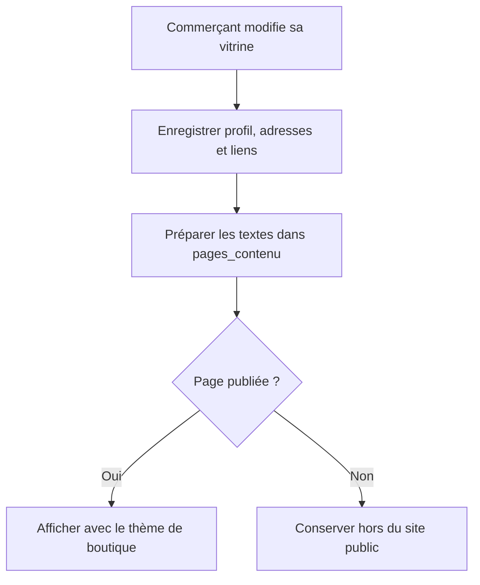
```mermaid
flowchart TD
    A["Commerçant modifie sa vitrine"] --> B["Enregistrer profil, adresses et liens"]
    B --> C["Préparer les textes dans pages_contenu"]
    C --> D{"Page publiée ?"}
    D -->|Oui| E["Afficher avec le thème de boutique"]
    D -->|Non| F["Conserver hors du site public"]
```

**7. Entrée / Sortie**

- **Entrée :** informations, textes et choix visuels.
- **Sortie :** vitrine publique personnalisée.

**8. Version orale ultra courte**

> T1 représente la vitrine de la boutique. Le commerçant y renseigne ses contacts, ses adresses, ses réseaux sociaux et le contenu de ses pages. Il peut aussi choisir les couleurs et le logo. Le site affiche ensuite les éléments rendus publics.

---

**1. T2 — Catalogue principal**

**2. Rôle du module**  
Décrit les produits vendus et leurs variantes, avec leurs prix et leurs stocks.

**3. Tables du module**

- `medias` : références des images, vidéos et documents.
- `categories` : catégories et sous-catégories.
- `produits` : description commune du produit.
- `variantes_produits` : versions vendables avec prix, référence et stock.

**4. Tables externes utiles**

- `variantes_valeurs` (**T3**) : composition des variantes.
- `medias_produits` (**T3**) : images associées aux produits.
- `mouvements_stock` (**T9**) : origine des variations de stock.

**5. Fonctionnement simple**

Exemple : **le commerçant veut ajouter une chaussure à vendre.**

1. Il crée la chaussure dans `produits`.
2. Si elle existe en plusieurs tailles ou couleurs, il crée plusieurs lignes dans `variantes_produits`.
3. Si elle n’a aucun choix, il crée quand même une variante standard.
4. Il ajoute le prix, la référence et les informations nécessaires à chaque variante.
5. Quand le produit est prêt, il le publie.
6. S’il n’est pas publié, il reste enregistré mais les clients ne le voient pas.

En résumé : **`produits` décrit l’article, et `variantes_produits` décrit ce que le client peut réellement acheter.**

**6. Diagramme Mermaid**

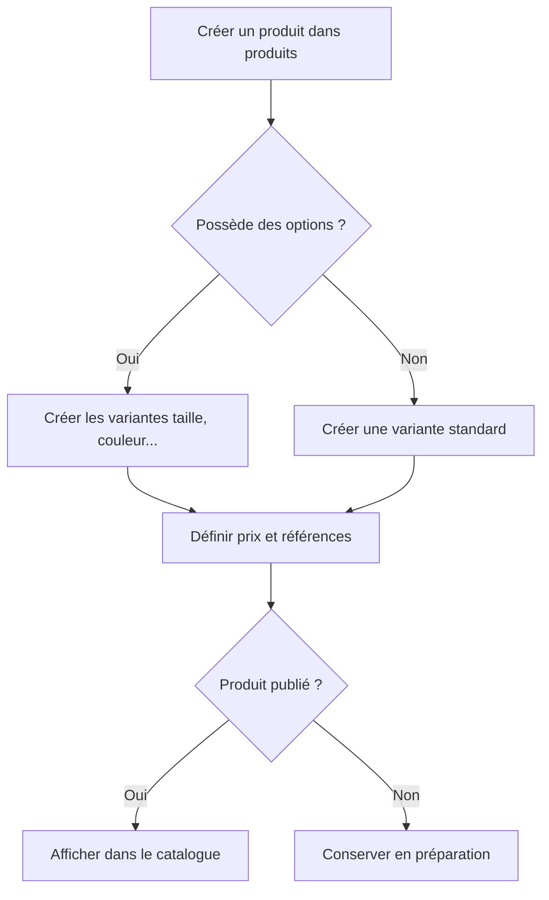
```mermaid
flowchart TD
    A["Créer un produit dans produits"] --> B{"Possède des options ?"}
    B -->|Oui| C["Créer les variantes taille, couleur..."]
    B -->|Non| D["Créer une variante standard"]
    C --> E["Définir prix et références"]
    D --> E
    E --> F{"Produit publié ?"}
    F -->|Oui| G["Afficher dans le catalogue"]
    F -->|Non| H["Conserver en préparation"]
```

**7. Entrée / Sortie**

- **Entrée :** description, catégorie, médias et variantes.
- **Sortie :** catalogue de produits et d’unités vendables.

**8. Version orale ultra courte**

> T2 est le catalogue principal. Le produit contient la description générale, alors que chaque variante porte son prix, sa référence et son stock. Même un produit sans taille ni couleur possède une variante standard. Cela permet de gérer toutes les ventes de la même façon.

---

**1. T3 — Options et images**

**2. Rôle du module**  
Organise les choix comme la taille ou la couleur, ainsi que les images des produits et variantes.

**3. Tables du module**

- `options_produit` : axes de choix, comme taille ou couleur.
- `valeurs_options` : valeurs possibles, comme M ou rouge.
- `variantes_valeurs` : combinaison exacte de chaque variante.
- `medias_produits` : galerie et images propres aux variantes.

**4. Tables externes utiles**

- `produits` (**T2**) : produit concerné.
- `variantes_produits` (**T2**) : variante à composer.
- `medias` (**T2**) : fichiers à afficher.

**5. Fonctionnement simple**

Exemple : **une chaussure existe en taille 40 et en couleur noire.**

1. `options_produit` crée les choix, par exemple **taille** et **couleur**.
2. `valeurs_options` crée les valeurs, par exemple **40** et **noir**.
3. `variantes_valeurs` relie ces valeurs à la bonne variante.
4. Si une variante déjà utilisée doit changer d’identité, on crée une nouvelle variante au lieu de modifier l’ancienne.
5. `medias_produits` associe ensuite les bonnes images au produit ou à la variante.
6. Le client voit alors les bons choix et les bonnes images.

En résumé : **T3 explique ce qui différencie les variantes d’un même produit.**

**6. Diagramme Mermaid**

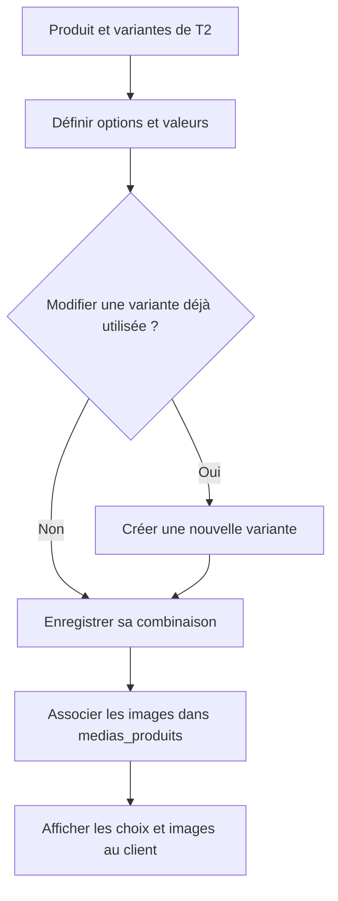
```mermaid
flowchart TD
    A["Produit et variantes de T2"] --> B["Définir options et valeurs"]
    B --> C{"Modifier une variante déjà utilisée ?"}
    C -->|Oui| D["Créer une nouvelle variante"]
    C -->|Non| E["Enregistrer sa combinaison"]
    D --> E
    E --> F["Associer les images dans medias_produits"]
    F --> G["Afficher les choix et images au client"]
```

**7. Entrée / Sortie**

- **Entrée :** produit, options, valeurs et médias.
- **Sortie :** variantes identifiables et galerie adaptée.

**8. Version orale ultra courte**

> T3 explique les différences entre les variantes. Par exemple, une chaussure peut être noire et de taille 40. Le module relie ces valeurs à la bonne variante et à ses images. Une combinaison déjà utilisée ne change plus d’identité : on crée une nouvelle variante si nécessaire.

---

**1. T4 — Classement et caractéristiques**

**2. Rôle du module**  
Ajoute des étiquettes et des caractéristiques descriptives pour organiser et présenter les produits.

**3. Tables du module**

- `etiquettes` : étiquettes réutilisables.
- `produits_etiquettes` : étiquettes attribuées aux produits.
- `caracteristiques` : caractéristiques disponibles.
- `produits_caracteristiques` : valeur de chaque caractéristique d’un produit.

**4. Tables externes utiles**

- `produits` (**T2**) : produits à classer et décrire.

**5. Fonctionnement simple**

Exemple : **le commerçant veut mieux décrire un produit.**

1. Il choisit le produit.
2. S’il veut ajouter une étiquette comme **Nouveauté**, il la relie avec `produits_etiquettes`.
3. S’il veut ajouter une information comme **Matière = cuir**, il utilise `caracteristiques` et `produits_caracteristiques`.
4. Le site utilise ensuite ces informations pour mieux afficher et classer le produit.

En résumé : **T4 sert à ajouter des informations utiles sans créer une nouvelle variante.**

**6. Diagramme Mermaid**

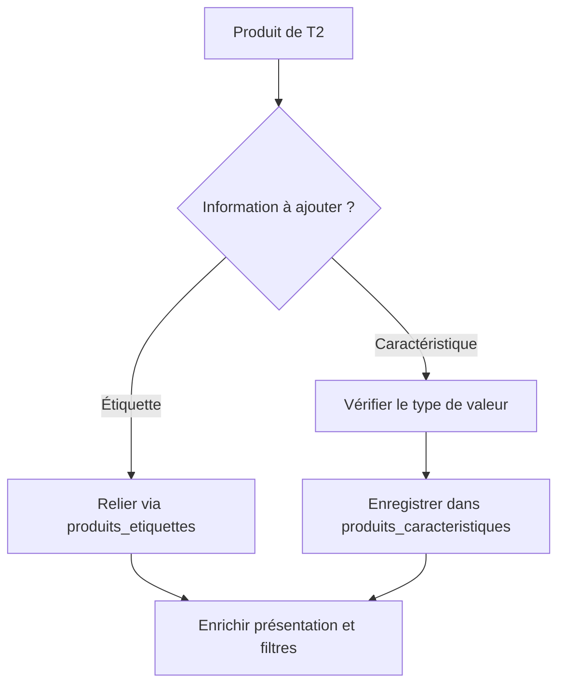
```mermaid
flowchart TD
    A["Produit de T2"] --> B{"Information à ajouter ?"}
    B -->|Étiquette| C["Relier via produits_etiquettes"]
    B -->|Caractéristique| D["Vérifier le type de valeur"]
    D --> E["Enregistrer dans produits_caracteristiques"]
    C --> F["Enrichir présentation et filtres"]
    E --> F
```

**7. Entrée / Sortie**

- **Entrée :** produit, étiquettes et valeurs descriptives.
- **Sortie :** catalogue mieux organisé et détaillé.

**8. Version orale ultra courte**

> T4 sert à mieux décrire et classer les produits. Les étiquettes permettent des regroupements comme « nouveauté ». Les caractéristiques décrivent une capacité, une composition ou une dimension. Ces informations enrichissent les fiches et les filtres, sans créer inutilement de nouvelles variantes vendables.

---

**1. T5 — Vente et avis**

**2. Rôle du module**  
Présente les produits sur des pages de vente, applique les promotions et gère les avis.

**3. Tables du module**

- `pages_vente` : pages commerciales dédiées à un produit.
- `promotions_produits` : réductions automatiques.
- `avis_produits` : notes et commentaires modérés.

**4. Tables externes utiles**

- `produits`, `variantes_produits` (**T2**) : produit et prix de référence.
- `articles_commande` (**T8**) : lien éventuel avec un achat.
- `visiteurs` (**T6**) : auteur visiteur éventuel de l’avis.

**5. Fonctionnement simple**

Exemple : **le commerçant veut mieux vendre un produit.**

1. Il peut créer une page spéciale dans `pages_vente`.
2. Le système regarde s’il existe une promotion valable dans `promotions_produits`.
3. Si oui, il affiche le prix promotionnel.
4. Sinon, il garde le prix normal.
5. Un client peut laisser un avis dans `avis_produits`.
6. L’avis n’est affiché que s’il est approuvé.

En résumé : **T5 gère la page de vente, les promotions et les avis.**

**6. Diagramme Mermaid**

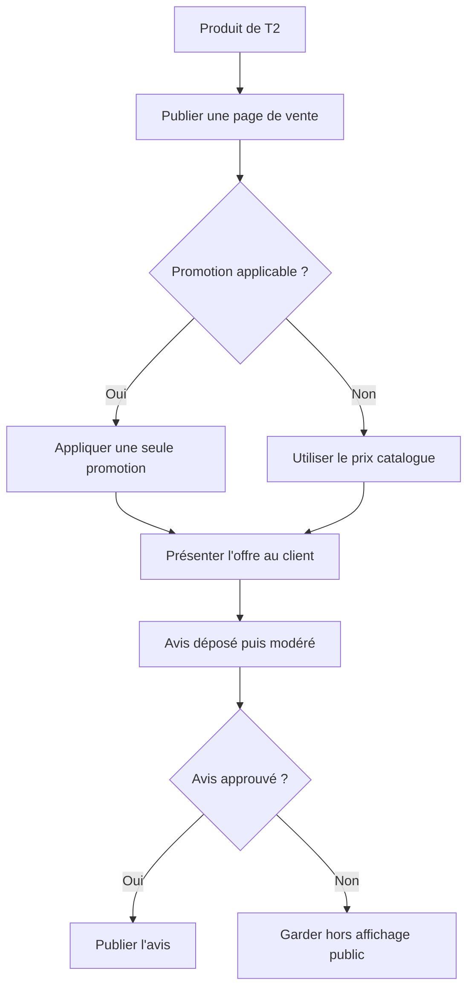
```mermaid
flowchart TD
    A["Produit de T2"] --> B["Publier une page de vente"]
    B --> C{"Promotion applicable ?"}
    C -->|Oui| D["Appliquer une seule promotion"]
    C -->|Non| E["Utiliser le prix catalogue"]
    D --> F["Présenter l'offre au client"]
    E --> F
    F --> G["Avis déposé puis modéré"]
    G --> H{"Avis approuvé ?"}
    H -->|Oui| I["Publier l'avis"]
    H -->|Non| J["Garder hors affichage public"]
```

**7. Entrée / Sortie**

- **Entrée :** produit, règles promotionnelles et avis.
- **Sortie :** offre commerciale et avis publiés.

**8. Version orale ultra courte**

> T5 regroupe les outils de présentation commerciale. Une page de vente met en avant un produit, les promotions déterminent son prix applicable et les avis apportent des retours clients. Les avis sont modérés et une seule promotion est retenue pour chaque ligne achetée.

---

**1. T6 — Visiteurs et statistiques**

**2. Rôle du module**  
Identifie les navigateurs sans compte client et mesure les parcours selon les préférences enregistrées.

**3. Tables du module**

- `visiteurs` : identifiants anonymes de compte, propres à la boutique.
- `sessions_visite` : visites successives d’un navigateur.
- `evenements_navigation` : vues, recherches et actions de navigation.
- `preferences_visiteur` : choix concernant la mesure d’audience.

**4. Tables externes utiles**

- `produits` (**T2**), `pages_vente` (**T5**) : contenus consultés.
- `paniers` (**T7**) : parcours vers l’achat.
- `commandes` (**T8**) : achats réellement enregistrés côté serveur.

**5. Fonctionnement simple**

Exemple : **une personne visite la boutique sans créer de compte.**

1. `visiteurs` lui donne un identifiant pour reconnaître son navigateur.
2. Le système lit ses choix dans `preferences_visiteur`.
3. Si la mesure d’audience est autorisée, il enregistre sa visite et ses actions.
4. Ces actions peuvent être une page vue, une recherche ou un clic.
5. Le système utilise ensuite ces informations pour calculer les statistiques.
6. Si la mesure n’est pas autorisée, la personne peut quand même utiliser la boutique et le panier.

En résumé : **T6 mesure les visites sans obliger le client à créer un compte.**

**6. Diagramme Mermaid**

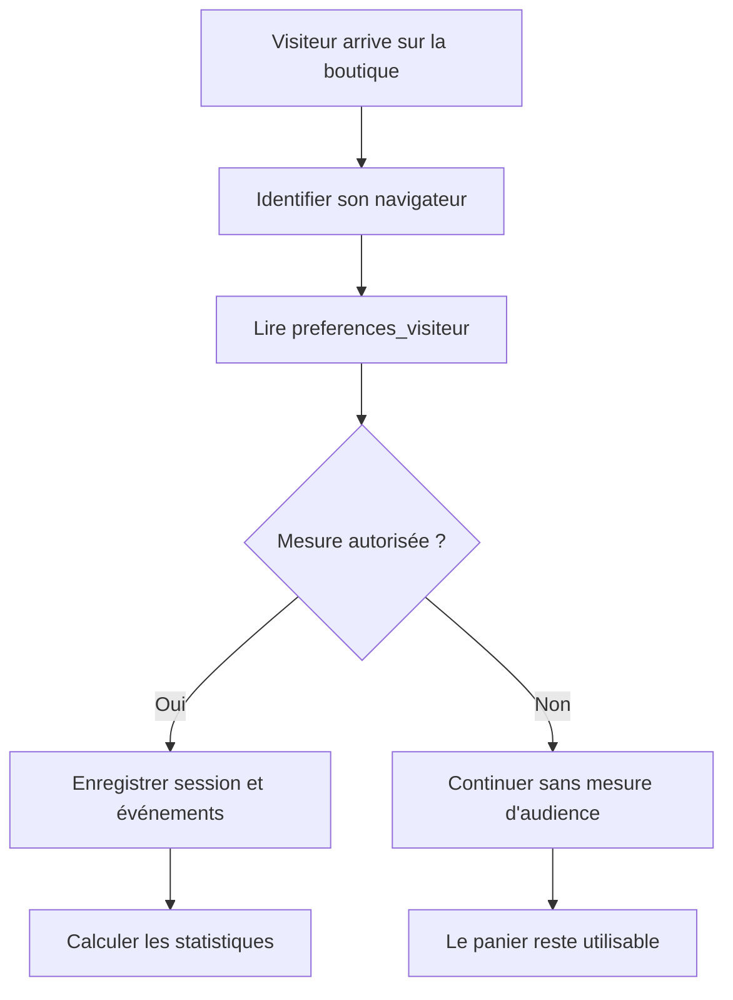
```mermaid
flowchart TD
    A["Visiteur arrive sur la boutique"] --> B["Identifier son navigateur"]
    B --> C["Lire preferences_visiteur"]
    C --> D{"Mesure autorisée ?"}
    D -->|Oui| E["Enregistrer session et événements"]
    E --> F["Calculer les statistiques"]
    D -->|Non| G["Continuer sans mesure d'audience"]
    G --> H["Le panier reste utilisable"]
```

**7. Entrée / Sortie**

- **Entrée :** navigation et préférences.
- **Sortie :** statistiques de fréquentation et de conversion.

**8. Version orale ultra courte**

> T6 permet de comprendre comment les visiteurs utilisent la boutique. Il distingue le navigateur, ses visites et ses actions, sans créer de compte client. Les préférences contrôlent la mesure d’audience. Le panier reste utilisable même lorsque le visiteur n’autorise pas cette mesure.

---

**1. T7 — Panier**

**2. Rôle du module**  
Conserve les articles choisis par un visiteur avant la création de sa commande.

**3. Tables du module**

- `paniers` : panier invité et son état.
- `articles_panier` : variantes, quantités et personnalisations choisies.

**4. Tables externes utiles**

- `visiteurs` (**T6**) : propriétaire du panier.
- `variantes_produits` (**T2**) : articles sélectionnés.
- `promotions_produits` (**T5**) : calcul du prix applicable.
- `commandes` (**T8**) : résultat du passage de commande.

**5. Fonctionnement simple**

Exemple : **un visiteur ajoute un produit dans son panier.**

1. `paniers` retrouve ou crée son panier.
2. `articles_panier` ajoute la variante choisie et la quantité.
3. Le serveur recalcule le prix et vérifie les quantités.
4. Tant que le visiteur ne commande pas, le panier reste actif.
5. Quand il valide le checkout, T8 crée la commande.
6. Le panier est alors marqué comme converti.

Important : **mettre un produit dans le panier ne réserve pas le stock.**

**6. Diagramme Mermaid**

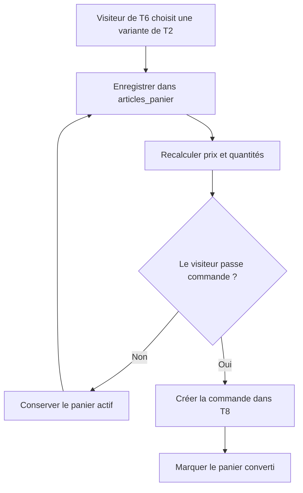
```mermaid
flowchart TD
    A["Visiteur de T6 choisit une variante de T2"] --> B["Enregistrer dans articles_panier"]
    B --> C["Recalculer prix et quantités"]
    C --> D{"Le visiteur passe commande ?"}
    D -->|Non| E["Conserver le panier actif"]
    E --> B
    D -->|Oui| F["Créer la commande dans T8"]
    F --> G["Marquer le panier converti"]
```

**7. Entrée / Sortie**

- **Entrée :** variantes, quantités et personnalisations.
- **Sortie :** panier prêt à commander, sans réservation de stock.

**8. Version orale ultra courte**

> T7 conserve le panier d’un visiteur sans lui demander de compte. Chaque ligne contient une variante, une quantité et éventuellement une personnalisation. Les prix sont recalculés par le serveur. Le panier devient une commande au checkout, mais un simple ajout ne réserve aucun stock.

---

**1. T8 — Commande et versions**

**2. Rôle du module**  
Gère la commande et conserve chaque version de son contenu sans effacer l’historique.

**3. Tables du module**

- `commandes` : identité et état commercial de la commande.
- `revisions_commandes` : versions des coordonnées, conditions et totaux.
- `articles_commande` : articles et prix figés de chaque version.
- `historique_commandes` : appels, décisions et modifications.

**4. Tables externes utiles**

- `paniers` (**T7**) : origine possible de la commande.
- `variantes_produits` (**T2**) : articles commandés.
- `contrats_commandes` (**T19**) : confirmation d’une version précise.
- `reservations_stock` (**T9**) : stock engagé après confirmation.

**5. Fonctionnement simple**

Exemple : **le client valide son panier.**

1. `commandes` crée la commande.
2. `revisions_commandes` enregistre une copie exacte des informations de cette commande à ce moment-là.
3. `articles_commande` enregistre les produits, quantités et prix de cette version.
4. Si le commerçant change quelque chose avant l’envoi, il crée une nouvelle version au lieu d’effacer l’ancienne.
5. `historique_commandes` garde la trace des changements.
6. T19 fait ensuite confirmer au client la version qui sera réellement utilisée.

En résumé : **la commande reste la même, mais chaque modification importante crée une nouvelle version conservée dans l’historique.**

**6. Diagramme Mermaid**

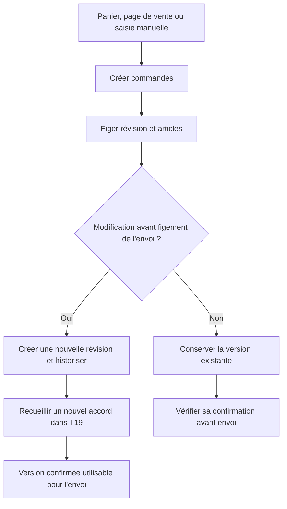
```mermaid
flowchart TD
    A["Panier, page de vente ou saisie manuelle"] --> B["Créer commandes"]
    B --> C["Figer révision et articles"]
    C --> D{"Modification avant figement de l'envoi ?"}
    D -->|Oui| E["Créer une nouvelle révision et historiser"]
    E --> F["Recueillir un nouvel accord dans T19"]
    D -->|Non| G["Conserver la version existante"]
    F --> H["Version confirmée utilisable pour l'envoi"]
    G --> I["Vérifier sa confirmation avant envoi"]
```

**7. Entrée / Sortie**

- **Entrée :** articles, coordonnées, prix et modifications.
- **Sortie :** commande versionnée et historique conservé.

**8. Version orale ultra courte**

> T8 est le cœur commercial de la commande. Son identité reste la même, mais chaque modification produit une nouvelle version avec ses articles et ses montants. Les anciennes versions restent consultables. La confirmation porte sur une version précise, ce qui évite d’expédier un contenu différent de celui accepté.

---

**1. T9 — Stock et retours**

**2. Rôle du module**  
Réserve le stock, trace ses mouvements et contrôle les colis retournés.

**3. Tables du module**

- `reservations_stock` : quantités engagées pour les commandes confirmées.
- `mouvements_stock` : historique des variations et pertes.
- `retours_commandes` : dossiers de retour du colis entier.
- `articles_retour` : quantités reçues, manquantes et inspectées.

**4. Tables externes utiles**

- `variantes_produits` (**T2**) : stocks par variante.
- `articles_commande` (**T8**) : quantités commandées.
- `livraisons` (**T11**) : colis expédié puis éventuellement retourné.

**5. Fonctionnement simple**

Exemple : **une commande vient d’être confirmée.**

1. Le système vérifie si le stock est suffisant.
2. S’il manque du stock, la confirmation avec réservation est bloquée.
3. S’il y en a assez, `reservations_stock` réserve la quantité nécessaire.
4. Quand le colis est réellement remis au livreur, `mouvements_stock` enregistre la sortie du stock.
5. Si le colis revient, `retours_commandes` ouvre le retour.
6. `articles_retour` indique ce qui est revenu, ce qui manque et ce qui peut être remis en stock ou déclaré perdu.

En résumé : **T9 explique chaque changement de quantité dans le stock, de la réservation jusqu’au retour.**

**6. Diagramme Mermaid**

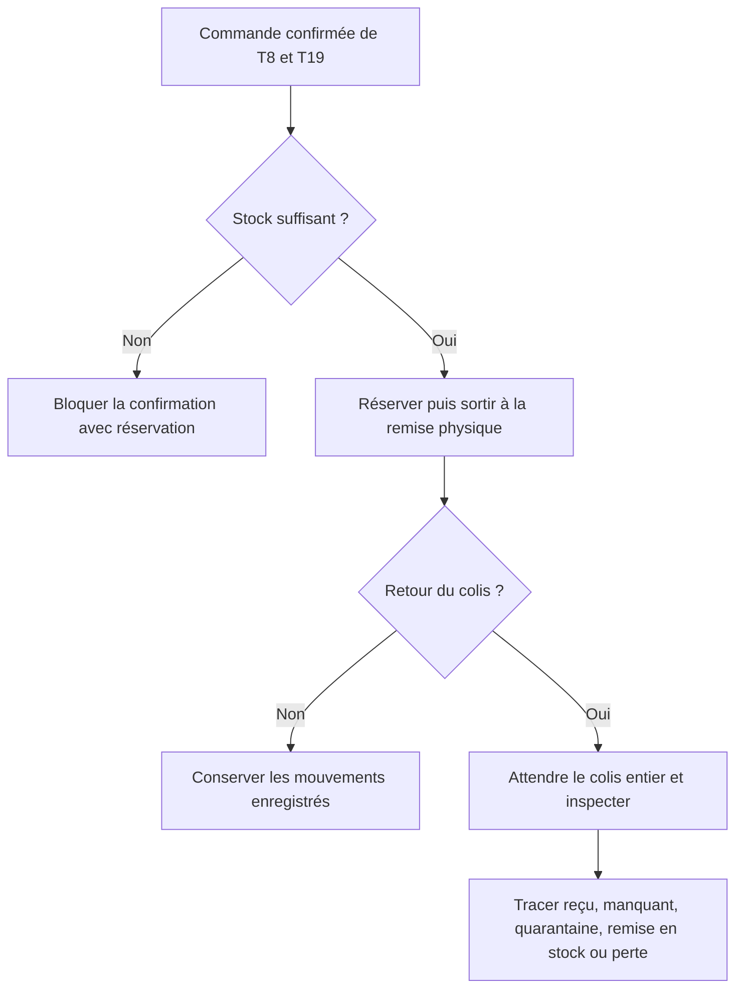
```mermaid
flowchart TD
    A["Commande confirmée de T8 et T19"] --> B{"Stock suffisant ?"}
    B -->|Non| C["Bloquer la confirmation avec réservation"]
    B -->|Oui| D["Réserver puis sortir à la remise physique"]
    D --> E{"Retour du colis ?"}
    E -->|Non| F["Conserver les mouvements enregistrés"]
    E -->|Oui| G["Attendre le colis entier et inspecter"]
    G --> H["Tracer reçu, manquant, quarantaine, remise en stock ou perte"]
```

**7. Entrée / Sortie**

- **Entrée :** confirmation, expédition ou réception de retour.
- **Sortie :** stock actualisé et mouvements traçables.

**8. Version orale ultra courte**

> T9 suit les quantités réelles. Le stock est réservé lors de la confirmation, puis retiré lors de la remise physique au livreur. En cas de retour, tout le colis est attendu. Les articles reçus passent en quarantaine avant leur remise en vente ou leur classement en perte.

---

**1. T10 — Livraison et prix**

**2. Rôle du module**  
Définit les prestataires, les tarifs demandés au client et les coûts estimés de livraison.

**3. Tables du module**

- `prestataires_livraison` : livreurs internes et sociétés.
- `tarifs_livraison_client` : prix facturé au client.
- `tarifs_prestataires` : coût estimé du prestataire.
- `regles_livraison_gratuite` : conditions de livraison offerte.

**4. Tables externes utiles**

- `wilayas`, `communes` (**C5**) : zones desservies.
- `comptes_livraison` (**C7**) : comptes des sociétés de livraison.
- `revisions_commandes` (**T8**) : montant finalement annoncé au client.

**5. Fonctionnement simple**

Exemple : **le client veut être livré dans une wilaya donnée.**

1. Le système regarde la destination et le mode de livraison choisi.
2. `tarifs_livraison_client` cherche le prix de livraison pour le client.
3. S’il n’existe aucun tarif, cette livraison n’est pas disponible.
4. S’il existe un tarif, le système vérifie `regles_livraison_gratuite`.
5. Si la livraison est offerte, le client paie 0 DA de livraison.
6. Sinon, le tarif normal est utilisé.
7. Le montant choisi est ensuite enregistré dans la commande T8.

En résumé : **T10 décide si la livraison est possible et combien le client doit payer.**

**6. Diagramme Mermaid**

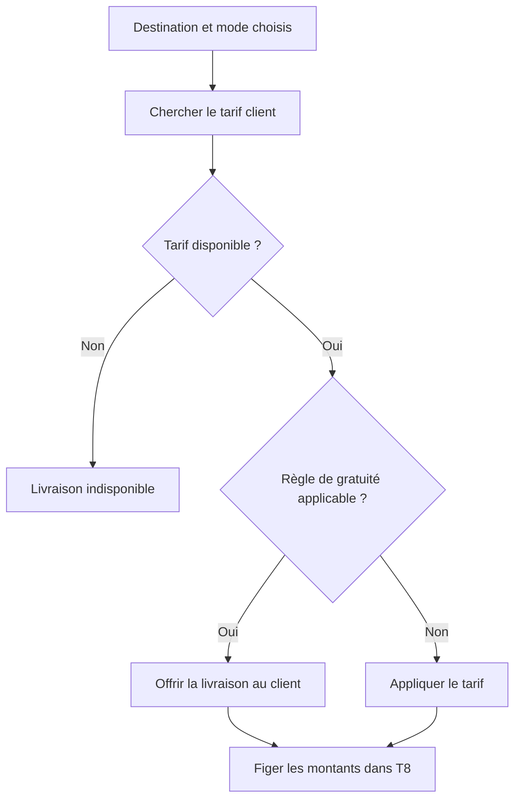
```mermaid
flowchart TD
    A["Destination et mode choisis"] --> B["Chercher le tarif client"]
    B --> C{"Tarif disponible ?"}
    C -->|Non| D["Livraison indisponible"]
    C -->|Oui| E{"Règle de gratuité applicable ?"}
    E -->|Oui| F["Offrir la livraison au client"]
    E -->|Non| G["Appliquer le tarif"]
    F --> H["Figer les montants dans T8"]
    G --> H
```

**7. Entrée / Sortie**

- **Entrée :** destination, mode et contenu de commande.
- **Sortie :** disponibilité et prix de livraison.

**8. Version orale ultra courte**

> T10 calcule la livraison. Il distingue le prix demandé au client du coût estimé du prestataire. Une règle peut offrir la livraison au client, mais le transporteur peut toujours facturer son service. Si aucun tarif n’est disponible, la livraison est considérée comme indisponible.

---

**1. T11 — Transporteur et colis**

**2. Rôle du module**  
Prépare le colis et suit son parcours jusqu’à la livraison ou au retour.

**3. Tables du module**

- `correspondances_geo_transporteur` : correspondances avec les zones du transporteur.
- `points_relais` : bureaux et points de retrait.
- `livraisons` : colis, suivi et montant à encaisser.
- `evenements_livraison` : historique logistique reçu ou saisi.

**4. Tables externes utiles**

- `commandes`, `revisions_commandes` (**T8**) : contenu accepté.
- `prestataires_livraison` (**T10**) : livreur choisi.
- `operations_transporteur` (**T12**) : échanges avec l’API.
- `mouvements_stock` (**T9**) : sortie à la remise physique.

**5. Fonctionnement simple**

Exemple : **une commande confirmée doit maintenant être envoyée.**

1. T11 prend la version confirmée de la commande.
2. Il vérifie le transporteur et la destination.
3. Si la destination ou le point de retrait n’est pas valide, la préparation est bloquée.
4. Sinon, `livraisons` crée le colis.
5. T12 communique ensuite avec le transporteur.
6. `evenements_livraison` enregistre ce qui arrive au colis : expédié, livré, refusé, retourné, etc.

En résumé : **T11 représente le colis et suit son trajet.**

**6. Diagramme Mermaid**

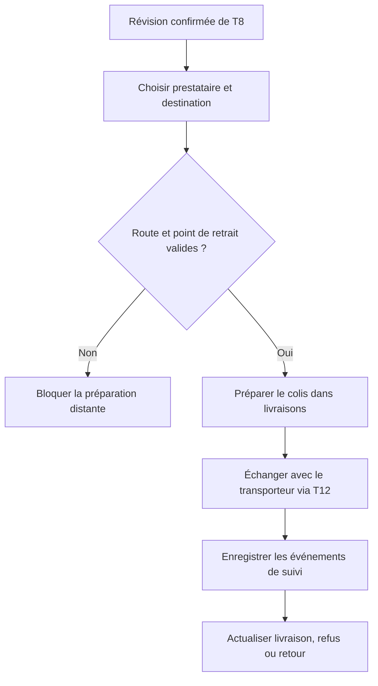
```mermaid
flowchart TD
    A["Révision confirmée de T8"] --> B["Choisir prestataire et destination"]
    B --> C{"Route et point de retrait valides ?"}
    C -->|Non| D["Bloquer la préparation distante"]
    C -->|Oui| E["Préparer le colis dans livraisons"]
    E --> F["Échanger avec le transporteur via T12"]
    F --> G["Enregistrer les événements de suivi"]
    G --> H["Actualiser livraison, refus ou retour"]
```

**7. Entrée / Sortie**

- **Entrée :** commande confirmée, prestataire et destination.
- **Sortie :** colis suivi et historique logistique.

**8. Version orale ultra courte**

> T11 représente le colis. Une commande correspond à un seul colis contenant tous ses articles. Le module vérifie les zones et les points de retrait, conserve le numéro de suivi et enregistre les événements. La validation informatique du transporteur reste distincte de la remise physique du colis.

---

**1. T12 — Intégration Ecotrack**

**2. Rôle du module**  
Organise les appels au transporteur et sécurise leur reprise pour éviter les doublons.

**3. Tables du module**

- `operations_transporteur` : actions à envoyer et leur état.
- `tentatives_operations_transporteur` : résultats des tentatives HTTP.

**4. Tables externes utiles**

- `livraisons` (**T11**) : colis concerné.
- `revisions_commandes` (**T8**) : contenu exact à transmettre.
- `prestataires_livraison` (**T10**) : prestataire ciblé.
- `comptes_livraison` (**C7**) : configuration centrale de connexion.

**5. Fonctionnement simple**

Exemple : **le SaaS demande à Ecotrack de créer un colis.**

1. `operations_transporteur` enregistre d’abord ce que le SaaS veut demander.
2. Le SaaS envoie ensuite la requête au transporteur.
3. `tentatives_operations_transporteur` garde le résultat de chaque essai.
4. Si le transporteur confirme le succès, l’opération est terminée.
5. Si l’échec est clair, le système peut réessayer si c’est autorisé.
6. Si on ne sait pas si la demande a réussi, le système vérifie d’abord chez le transporteur avant de recommencer.

En résumé : **T12 évite de créer deux fois le même colis à cause d’un problème réseau.**

**6. Diagramme Mermaid**

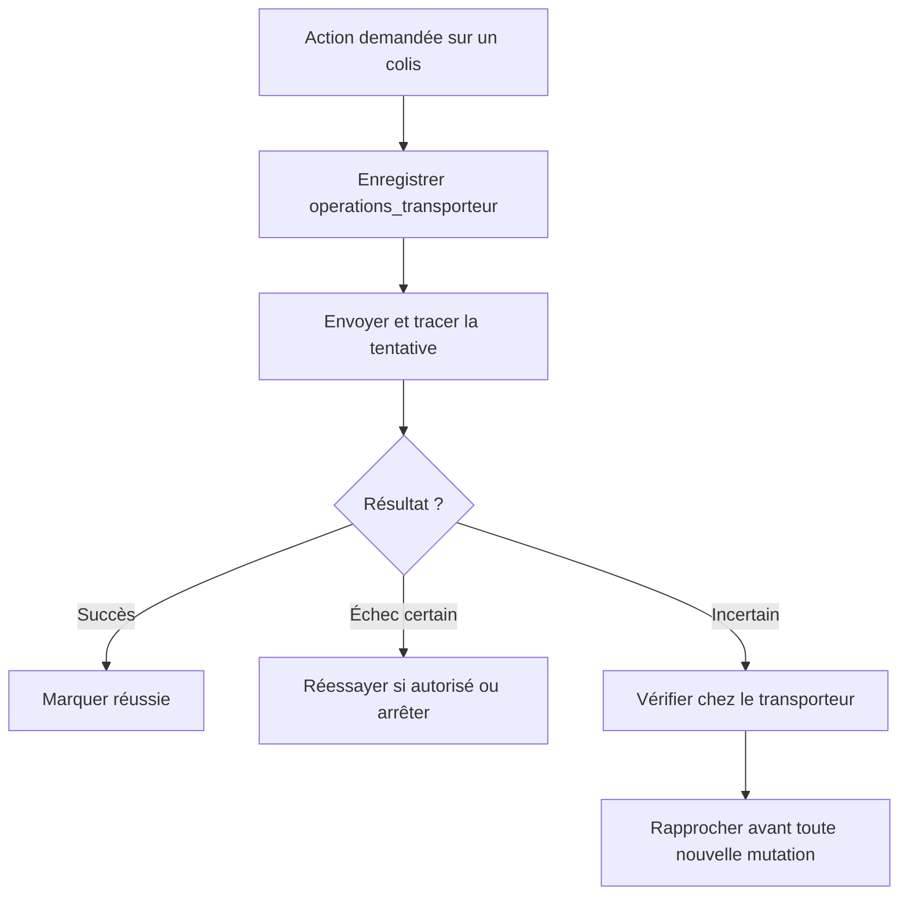
```mermaid
flowchart TD
    A["Action demandée sur un colis"] --> B["Enregistrer operations_transporteur"]
    B --> C["Envoyer et tracer la tentative"]
    C --> D{"Résultat ?"}
    D -->|Succès| E["Marquer réussie"]
    D -->|Échec certain| F["Réessayer si autorisé ou arrêter"]
    D -->|Incertain| G["Vérifier chez le transporteur"]
    G --> H["Rapprocher avant toute nouvelle mutation"]
```

**7. Entrée / Sortie**

- **Entrée :** action transporteur et données du colis.
- **Sortie :** résultat durable, erreur ou état incertain à résoudre.

**8. Version orale ultra courte**

> T12 sécurise la communication avec Ecotrack. Chaque action est enregistrée avant son envoi et chaque tentative laisse une trace. Si la réponse est perdue, le système vérifie ce qui s’est réellement passé chez le transporteur avant de recommencer, pour éviter de créer deux colis.

---

**1. T13 — Argent et reversements**

**2. Rôle du module**  
Suit l’argent attendu des colis et les montants réellement reversés au commerçant.

**3. Tables du module**

- `recouvrements` : suivi financier de chaque colis.
- `bordereaux_reversement` : règlements reçus ou payés.
- `lignes_reversement` : répartition d’un règlement entre les colis.

**4. Tables externes utiles**

- `livraisons` (**T11**) : montant à encaisser.
- `ecritures_encaissement` (**T16**) : encaissement client vérifié.
- `reglements_frais_transporteur` (**T16**) : frais réglés.
- `indemnisations_transporteur` (**T17**) : dédommagements inclus.

**5. Fonctionnement simple**

Exemple : **le transporteur doit reverser l’argent de plusieurs colis.**

1. `recouvrements` indique combien d’argent est attendu pour chaque colis.
2. Quand un paiement arrive, `bordereaux_reversement` enregistre le règlement reçu.
3. `lignes_reversement` indique quelle partie du règlement correspond à chaque colis.
4. Le système ajoute les frais et les éventuelles indemnisations nécessaires au calcul.
5. Il compare ensuite ce qui était attendu avec ce qui a vraiment été reçu.
6. Si tout correspond, le reversement est validé.
7. Sinon, l’écart reste à vérifier.

En résumé : **T13 vérifie combien le transporteur devait payer au commerçant et combien il a réellement payé.**

**6. Diagramme Mermaid**

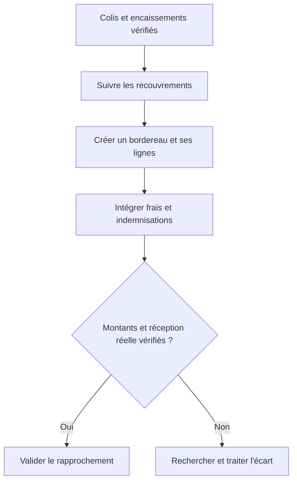
```mermaid
flowchart TD
    A["Colis et encaissements vérifiés"] --> B["Suivre les recouvrements"]
    B --> C["Créer un bordereau et ses lignes"]
    C --> D["Intégrer frais et indemnisations"]
    D --> E{"Montants et réception réelle vérifiés ?"}
    E -->|Oui| F["Valider le rapprochement"]
    E -->|Non| G["Rechercher et traiter l'écart"]
```

**7. Entrée / Sortie**

- **Entrée :** encaissements, règlements, frais et preuves.
- **Sortie :** reversements vérifiés et soldes restant à recevoir.

**8. Version orale ultra courte**

> T13 suit l’argent qui doit revenir au commerçant. Le paiement du client et le reversement du transporteur sont deux étapes différentes. Le module répartit chaque règlement entre les colis et vérifie le montant réellement reçu, en tenant compte des frais et des éventuelles indemnisations.

---

**1. T14 — Coûts, remboursements et documents**

**2. Rôle du module**  
Enregistre les dépenses générales, les remboursements réels et les bons de commande.

**3. Tables du module**

- `depenses` : publicité, emballage et autres coûts généraux.
- `regularisations_clients` : remboursements effectivement décidés et réalisés.
- `bons_commande` : documents liés à une version précise.

**4. Tables externes utiles**

- `commandes`, `revisions_commandes` (**T8**) : commande concernée.
- `incidents_commande` (**T18**) : justification et plafonds du remboursement.
- `ecritures_encaissement` (**T16**) : argent réellement payé.
- `factures` (**T17**) : avoir éventuel lié au remboursement.

**5. Fonctionnement simple**

T14 peut traiter **trois choses différentes**.

1. Si le commerçant a une dépense, par exemple de la publicité, elle est enregistrée dans `depenses`.
2. S’il veut créer un bon de commande, `bons_commande` utilise une version précise de la commande T8.
3. S’il veut rembourser un client, le système vérifie d’abord la commande, l’incident et l’argent réellement encaissé.
4. Il vérifie aussi que le remboursement ne dépasse pas ce qui est autorisé.
5. Si tout est correct, le remboursement est enregistré dans `regularisations_clients`.
6. Sinon, il est bloqué.

En résumé : **T14 gère les dépenses, les bons de commande et les remboursements réels aux clients.**

**6. Diagramme Mermaid**

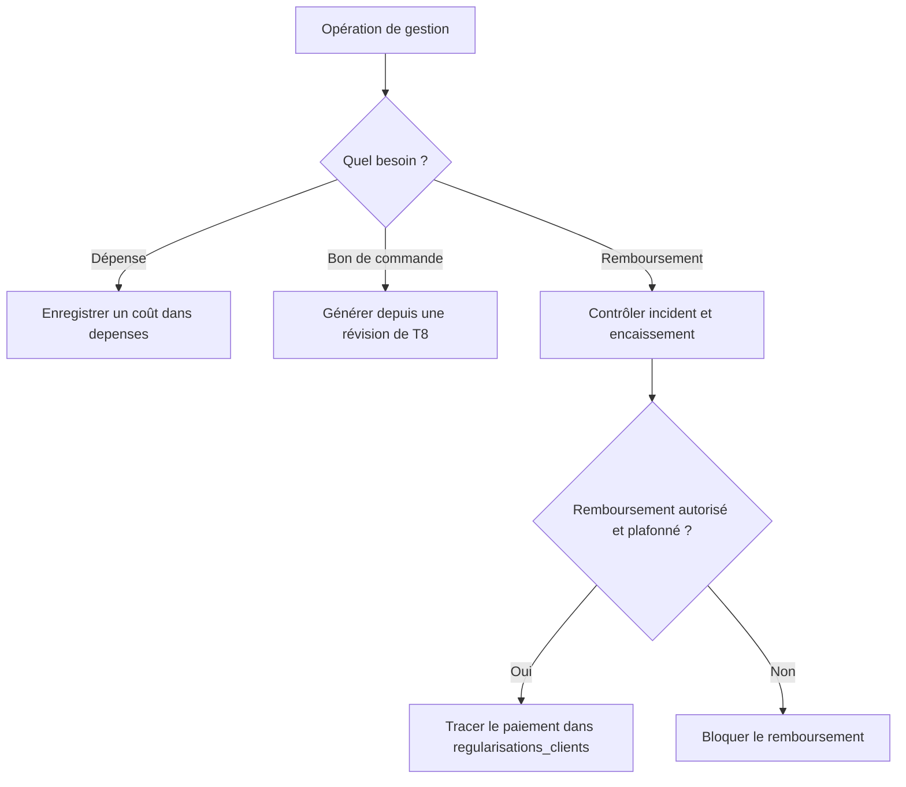
```mermaid
flowchart TD
    A["Opération de gestion"] --> B{"Quel besoin ?"}
    B -->|Dépense| C["Enregistrer un coût dans depenses"]
    B -->|Bon de commande| D["Générer depuis une révision de T8"]
    B -->|Remboursement| E["Contrôler incident et encaissement"]
    E --> F{"Remboursement autorisé et plafonné ?"}
    F -->|Oui| G["Tracer le paiement dans regularisations_clients"]
    F -->|Non| H["Bloquer le remboursement"]
```

**7. Entrée / Sortie**

- **Entrée :** dépense, décision de remboursement ou demande de bon.
- **Sortie :** opération justifiée ou document conservé.

**8. Version orale ultra courte**

> T14 couvre trois besoins de gestion : les dépenses générales, les remboursements clients et les bons de commande. Un remboursement doit correspondre à une décision autorisée et à de l’argent réellement encaissé. Les frais transporteur et les pertes de stock sont suivis dans leurs modules respectifs.

---

**1. T15 — Audit et évolution ciblée**

**2. Rôle du module**  
Trace les actions importantes et prévoit une personnalisation avancée du thème pour une évolution future.

**3. Tables du module**

- `journal_audit` : historique transversal des actions.
- `personnalisations_theme` : configurations avancées du thème.

**4. Tables externes utiles**

- `users` (**C1**) : auteur de l’action.
- `boutique` (**T1**) : présentation standard.
- `abonnements`, `fonctionnalites` (**C4**) : droits à la personnalisation.
- `historique_commandes` (**T8**) : détail spécifique aux commandes.

**5. Fonctionnement simple**

T15 fait surtout **deux choses**.

1. Quand une action importante est faite dans la boutique, `journal_audit` enregistre qui l’a faite et ce qui s’est passé.
2. Les secrets inutiles ne sont pas copiés dans ce journal.
3. Si le commerçant veut utiliser une personnalisation avancée du thème, le système vérifie d’abord si son abonnement l’autorise.
4. Si oui, `personnalisations_theme` peut enregistrer la configuration.
5. Si non, la boutique garde le thème standard.

En résumé : **T15 garde les traces importantes et prévoit la personnalisation avancée du thème.**

**6. Diagramme Mermaid**

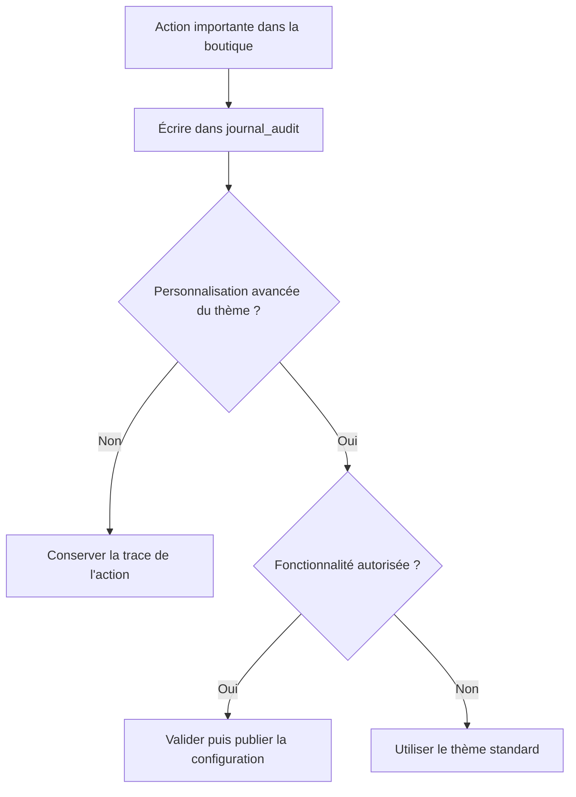
```mermaid
flowchart TD
    A["Action importante dans la boutique"] --> B["Écrire dans journal_audit"]
    B --> C{"Personnalisation avancée du thème ?"}
    C -->|Non| D["Conserver la trace de l'action"]
    C -->|Oui| E{"Fonctionnalité autorisée ?"}
    E -->|Oui| F["Valider puis publier la configuration"]
    E -->|Non| G["Utiliser le thème standard"]
```

**7. Entrée / Sortie**

- **Entrée :** actions métier et configuration visuelle.
- **Sortie :** audit consultable et thème autorisé.

**8. Version orale ultra courte**

> T15 permet de savoir qui a fait quoi dans la boutique, sans recopier inutilement les données sensibles. Il prévoit aussi une personnalisation avancée du thème selon les droits disponibles. Cette partie visuelle est une évolution : le MVP fonctionne déjà avec le profil et le template standard.

---

**1. T16 — Frais transporteur, créances et preuve d’encaissement**

**2. Rôle du module**  
Justifie les frais, les encaissements et les montants que le transporteur doit restituer.

**3. Tables du module**

- `frais_transporteur` : frais réels et leur payeur.
- `reglements_frais_transporteur` : paiements affectés aux frais.
- `creances_transporteur` : trop-payés reconnus à récupérer.
- `allocations_creances_transporteur` : remboursements ou compensations de ces créances.
- `ecritures_encaissement` : paiements clients vérifiés.

**4. Tables externes utiles**

- `livraisons` (**T11**) : colis concerné.
- `recouvrements`, `bordereaux_reversement` (**T13**) : suivi et règlement financier.
- `tarifs_transporteur` (**C7**) : tarif source éventuel.

**5. Fonctionnement simple**

Exemple : **le transporteur a encaissé de l’argent et facturé des frais.**

1. `ecritures_encaissement` enregistre les paiements clients réellement vérifiés.
2. `frais_transporteur` enregistre les frais réellement dus.
3. Le système détermine qui doit payer chaque frais.
4. `reglements_frais_transporteur` indique quels frais ont réellement été payés.
5. Si le commerçant a trop payé et que ce trop-payé est reconnu, `creances_transporteur` crée une somme à récupérer.
6. `allocations_creances_transporteur` suit ensuite le remboursement ou la compensation réellement reçue.

En résumé : **T16 explique l’argent encaissé, les frais payés et ce que le transporteur doit éventuellement rendre.**

**6. Diagramme Mermaid**

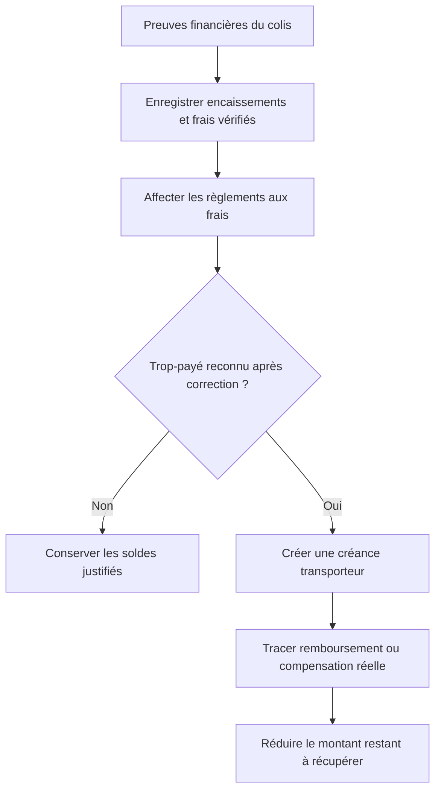
```mermaid
flowchart TD
    A["Preuves financières du colis"] --> B["Enregistrer encaissements et frais vérifiés"]
    B --> C["Affecter les règlements aux frais"]
    C --> D{"Trop-payé reconnu après correction ?"}
    D -->|Non| E["Conserver les soldes justifiés"]
    D -->|Oui| F["Créer une créance transporteur"]
    F --> G["Tracer remboursement ou compensation réelle"]
    G --> H["Réduire le montant restant à récupérer"]
```

**7. Entrée / Sortie**

- **Entrée :** frais, preuves d’encaissement et règlements.
- **Sortie :** charges justifiées, paiements vérifiés et créances suivies.

**8. Version orale ultra courte**

> T16 explique les montants financiers du transporteur. Il conserve les frais réels, leurs paiements et les encaissements clients vérifiés. Si un frais payé est ensuite réduit, la différence devient une créance à récupérer. Cette créance ne signifie pas que l’argent a déjà été remboursé.

---

**1. T17 — Indemnisations et factures historiques**

**2. Rôle du module**  
Conserve les factures et avoirs émis, ainsi que les indemnisations versées par le transporteur.

**3. Tables du module**

- `indemnisations_transporteur` : dédommagements pour perte, casse ou autre sinistre.
- `factures` : factures et avoirs avec leur contenu historique.

**4. Tables externes utiles**

- `revisions_commandes` (**T8**) : contenu commercial confirmé.
- `bordereaux_reversement` (**T13**) : paiement effectif d’une indemnisation.
- `sequences_documents` (**T20**) : numérotation locale.
- `obligations_facturation` (**T22**) : document à émettre.
- `registre_documents_emis` (**C12**) : conservation centrale de l’identité émise.

**5. Fonctionnement simple**

T17 gère **les documents financiers et les indemnisations du transporteur**.

1. Si une facture ou un avoir doit être créé, le système prépare son contenu et son numéro.
2. `factures` garde ensuite le document tel qu’il a été émis.
3. Son identité est aussi conservée dans le registre central C12 pour éviter de la perdre après une restauration.
4. Si le transporteur doit indemniser le commerçant pour une perte ou une casse, `indemnisations_transporteur` enregistre cette indemnisation.
5. Elle n’est considérée comme réellement reçue que lorsque le règlement correspondant est vérifié.

En résumé : **T17 garde les factures, les avoirs et les indemnisations historiques.**

**6. Diagramme Mermaid**

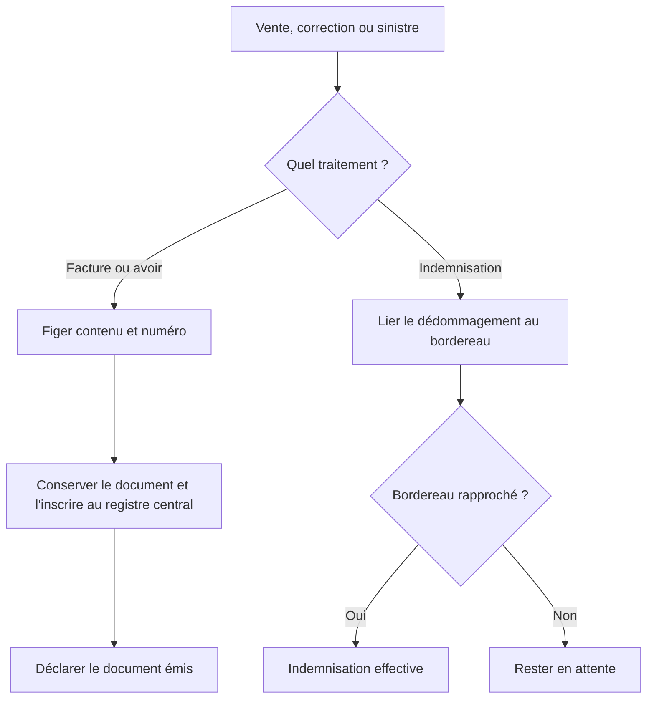
```mermaid
flowchart TD
    A["Vente, correction ou sinistre"] --> B{"Quel traitement ?"}
    B -->|Facture ou avoir| C["Figer contenu et numéro"]
    C --> D["Conserver le document et l'inscrire au registre central"]
    D --> E["Déclarer le document émis"]
    B -->|Indemnisation| F["Lier le dédommagement au bordereau"]
    F --> G{"Bordereau rapproché ?"}
    G -->|Oui| H["Indemnisation effective"]
    G -->|Non| I["Rester en attente"]
```

**7. Entrée / Sortie**

- **Entrée :** obligation documentaire ou dédommagement transporteur.
- **Sortie :** facture, avoir ou indemnisation justifiée.

**8. Version orale ultra courte**

> T17 conserve les documents financiers historiques. La même table contient les factures et les avoirs, avec leurs montants figés. Le module suit aussi les indemnisations du transporteur. Une indemnisation, un avoir et un remboursement client restent trois faits distincts, chacun avec ses propres justificatifs.

---

**1. T18 — Incidents par ligne et plafonds des remèdes**

**2. Rôle du module**  
Gère les problèmes après expédition et empêche de compenser plusieurs fois les mêmes articles.

**3. Tables du module**

- `incidents_commande` : dossier SAV d’une ligne expédiée.
- `incidents_commande_details` : causes et quantités concernées.

**4. Tables externes utiles**

- `articles_commande`, `commandes` (**T8**) : article initial et commandes de remplacement.
- `livraisons` (**T11**) : expédition concernée.
- `retours_commandes` (**T9**) : retour éventuel.
- `regularisations_clients` (**T14**) : remboursements engagés.

**5. Fonctionnement simple**

Exemple : **un article livré est cassé ou manquant.**

1. `incidents_commande` ouvre un dossier pour l’article concerné.
2. `incidents_commande_details` précise le problème et la quantité concernée.
3. Le système regarde ce qui a déjà été donné au client : remplacement, échange ou remboursement.
4. Il calcule ce qu’il reste encore possible d’accorder.
5. S’il reste une quantité ou un montant disponible, la solution SAV est autorisée.
6. Sinon, elle est bloquée pour éviter de compenser deux fois le même problème.

En résumé : **T18 empêche de rembourser ou remplacer plusieurs fois les mêmes unités.**

**6. Diagramme Mermaid**

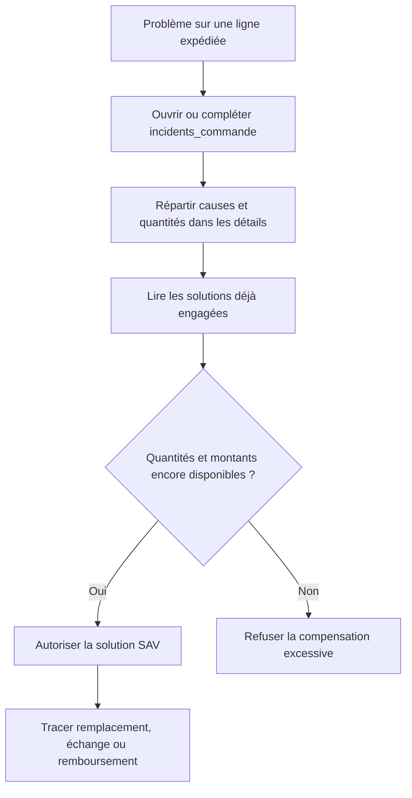
```mermaid
flowchart TD
    A["Problème sur une ligne expédiée"] --> B["Ouvrir ou compléter incidents_commande"]
    B --> C["Répartir causes et quantités dans les détails"]
    C --> D["Lire les solutions déjà engagées"]
    D --> E{"Quantités et montants encore disponibles ?"}
    E -->|Oui| F["Autoriser la solution SAV"]
    E -->|Non| G["Refuser la compensation excessive"]
    F --> H["Tracer remplacement, échange ou remboursement"]
```

**7. Entrée / Sortie**

- **Entrée :** problème, article, quantités et justificatifs.
- **Sortie :** décision SAV contrôlée et plafonnée.

**8. Version orale ultra courte**

> T18 organise le service après-vente par ligne expédiée. Un même dossier peut décrire plusieurs causes, comme une casse et un manquant. Avant d’autoriser un remplacement ou un remboursement, le système vérifie ce qui a déjà été accordé pour éviter de compenser deux fois les mêmes unités.

---

**1. T19 — Contrats acceptés et transmission des documents**

**2. Rôle du module**  
Conserve la confirmation téléphonique d’une version et suit l’envoi des documents au client.

**3. Tables du module**

- `contrats_commandes` : version acceptée et confirmation déclarée.
- `transmissions_documents` : envois de contrats, factures ou copies d’accusés.

**4. Tables externes utiles**

- `commandes`, `revisions_commandes` (**T8**) : commande à confirmer.
- `reservations_stock` (**T9**) : réservation coordonnée avec la confirmation.
- `factures` (**T17**) : documents à transmettre.
- `livraisons` (**T11**) : copie de l’accusé de réception.

**5. Fonctionnement simple**

Exemple : **le commerçant appelle le client pour confirmer la commande.**

1. Le commerçant présente au client une version précise de la commande T8.
2. Si le client refuse, la confirmation n’est pas finalisée.
3. S’il accepte, le système vérifie aussi que le stock est disponible.
4. Si tout est correct, `contrats_commandes` enregistre l’accord et T9 réserve le stock dans la même opération.
5. Le document peut ensuite être envoyé au client.
6. `transmissions_documents` garde le résultat de l’envoi : envoyé, délivré, échec, etc.

En résumé : **T19 garde la preuve de la version que le client a réellement acceptée.**

**6. Diagramme Mermaid**

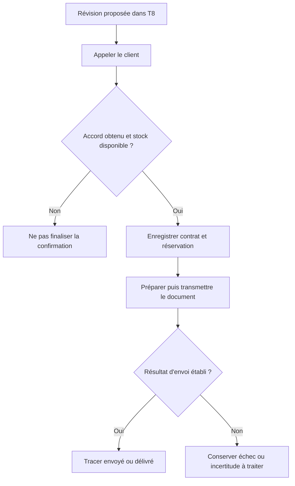
```mermaid
flowchart TD
    A["Révision proposée dans T8"] --> B["Appeler le client"]
    B --> C{"Accord obtenu et stock disponible ?"}
    C -->|Non| D["Ne pas finaliser la confirmation"]
    C -->|Oui| E["Enregistrer contrat et réservation"]
    E --> F["Préparer puis transmettre le document"]
    F --> G{"Résultat d'envoi établi ?"}
    G -->|Oui| H["Tracer envoyé ou délivré"]
    G -->|Non| I["Conserver échec ou incertitude à traiter"]
```

**7. Entrée / Sortie**

- **Entrée :** version proposée, accord téléphonique et destinataire.
- **Sortie :** contrat conservé et transmission suivie.

**8. Version orale ultra courte**

> T19 mémorise ce que le client a accepté par téléphone. Le commerçant confirme une version précise et le stock est réservé dans la même opération. Le module suit ensuite l’envoi des documents. Un document créé, envoyé et effectivement délivré correspond à des étapes différentes.

---

**1. T20 — Séquences de documents**

**2. Rôle du module**  
Attribue les numéros des factures et avoirs sans doublon ni réutilisation après restauration.

**3. Tables du module**

- `sequences_documents` : prochain numéro par type de document et exercice.

**4. Tables externes utiles**

- `factures` (**T17**) : document à numéroter.
- `tenants` (**C1**) : préfixe permanent de la boutique.
- `registre_documents_emis` (**C12**) : numéros déjà émis à préserver.

**5. Fonctionnement simple**

Exemple : **une facture doit recevoir un numéro.**

1. Le système choisit la bonne ligne dans `sequences_documents`.
2. Il bloque cette séquence quelques instants pour qu’un autre document ne prenne pas le même numéro.
3. Il attribue le prochain numéro disponible.
4. Il avance ensuite le compteur pour le document suivant.
5. Avant l’émission, l’identité du document est aussi conservée dans le registre central C12.
6. Après une restauration, ce registre permet de vérifier qu’un ancien numéro déjà utilisé ne sera jamais réutilisé.

En résumé : **T20 garantit un numéro unique pour chaque facture ou avoir.**

**6. Diagramme Mermaid**

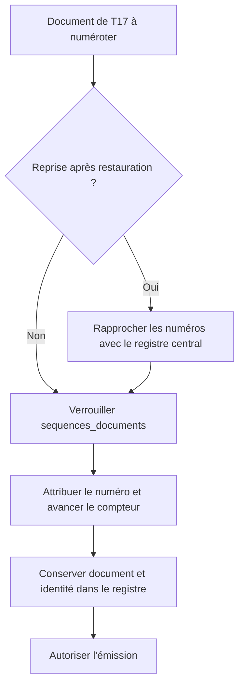
```mermaid
flowchart TD
    A["Document de T17 à numéroter"] --> B{"Reprise après restauration ?"}
    B -->|Oui| C["Rapprocher les numéros avec le registre central"]
    B -->|Non| D["Verrouiller sequences_documents"]
    C --> D
    D --> E["Attribuer le numéro et avancer le compteur"]
    E --> F["Conserver document et identité dans le registre"]
    F --> G["Autoriser l'émission"]
```

**7. Entrée / Sortie**

- **Entrée :** type de document et exercice.
- **Sortie :** numéro unique réservé au document.

**8. Version orale ultra courte**

> T20 attribue les numéros de facture et d’avoir. Le compteur est verrouillé pour empêcher deux documents de recevoir le même numéro. Après une restauration, le système consulte aussi le registre central afin de ne jamais réutiliser un numéro déjà émis avant la restauration.

---

**1. T21 — Conditions de vente et opérations sur les données personnelles**

**2. Rôle du module**  
Trace les acceptations réellement recueillies et les opérations importantes sur les données personnelles.

**3. Tables du module**

- `acceptations_conditions_vente` : conditions acceptées pour une version précise.
- `journal_operations_donnees_personnelles` : consultations, exports, transmissions et suppressions.

**4. Tables externes utiles**

- `commandes`, `revisions_commandes` (**T8**) : commande et conditions présentées.
- `users` (**C1**) : acteur de l’opération.
- `pages_contenu` (**T1**) : textes publiés dont les versions utiles sont conservées.

**5. Fonctionnement simple**

T21 gère **deux types de traces**.

1. Si le client accepte réellement des conditions de vente, `acceptations_conditions_vente` enregistre quelle version il a acceptée.
2. Si aucune acceptation n’a réellement été obtenue, le système n’invente pas de preuve.
3. Lorsqu’une action importante est faite sur des données personnelles, le système identifie l’action et son auteur.
4. `journal_operations_donnees_personnelles` garde ensuite une trace minimale de cette opération.

En résumé : **T21 garde les acceptations réellement obtenues et les opérations importantes faites sur les données personnelles.**

**6. Diagramme Mermaid**

```mermaid
flowchart TD
    A["Événement concernant le client"] --> B{"Quel événement ?"}
    B -->|Acceptation de conditions| C{"Acceptation réellement recueillie ?"}
    C -->|Oui| D["Lier acceptation, version et commande"]
    C -->|Non| E["Ne pas créer de preuve"]
    B -->|Opération sur les données| F["Identifier action, acteur et finalité"]
    F --> G["Écrire une trace minimale dans le journal"]
```

**7. Entrée / Sortie**

- **Entrée :** acceptation réelle ou opération sur des données.
- **Sortie :** événement daté et traçable.

**8. Version orale ultra courte**

> T21 distingue les conditions de vente et les opérations sur les données personnelles. Il conserve les acceptations réellement obtenues et trace les consultations, exports ou transmissions utiles. L’information liée aux données du checkout reste enregistrée directement dans la commande, et la confirmation téléphonique relève de T19.

---

**1. T22 — Émission obligatoire et compensation d’échange**

**2. Rôle du module**  
Suit les documents à émettre et affecte un avoir à une commande d’échange précise.

**3. Tables du module**

- `obligations_facturation` : factures ou avoirs attendus après un événement.
- `compensations_echanges` : montants d’avoirs affectés aux échanges.

**4. Tables externes utiles**

- `regles_facturation` (**C14**) : règle validée de déclenchement.
- `factures` (**T17**) : factures et avoirs émis.
- `commandes`, `revisions_commandes` (**T8**) : vente d’origine et nouvel échange.
- `incidents_commande` (**T18**) : justification et plafonds SAV.
- `ecritures_encaissement` (**T16**) : paiement initial vérifié.

**5. Fonctionnement simple**

Exemple : **un événement oblige la boutique à créer une facture ou un avoir.**

1. T22 regarde la règle de facturation venant de C14.
2. `obligations_facturation` enregistre le document qui doit être créé.
3. T17 crée ensuite la facture ou l’avoir demandé.
4. Si l’avoir doit servir pour une commande d’échange, le système vérifie le paiement initial et ce qu’il reste encore disponible.
5. Si l’utilisation est autorisée, `compensations_echanges` applique cet avoir à cette commande précise.
6. Le montant que le client doit encore payer pour l’échange est alors réduit.
7. Si les limites ne sont pas respectées, l’utilisation de l’avoir est bloquée.

En résumé : **T22 vérifie qu’un document obligatoire est créé et qu’un avoir d’échange n’est utilisé qu’une seule fois au bon endroit.**

**6. Diagramme Mermaid**

```mermaid
flowchart TD
    A["Événement métier et règle validée"] --> B["Créer obligations_facturation"]
    B --> C["Faire émettre la facture ou l'avoir dans T17"]
    C --> D{"Avoir à utiliser pour un échange ?"}
    D -->|Non| E["Clore l'obligation après émission vérifiée"]
    D -->|Oui| F["Vérifier paiement initial et plafonds disponibles"]
    F --> G{"Affectation autorisée ?"}
    G -->|Oui| H["Réduire le montant à encaisser de l'échange"]
    G -->|Non| I["Bloquer la compensation"]
```

**7. Entrée / Sortie**

- **Entrée :** événement, règle documentaire et éventuel échange.
- **Sortie :** document émis et compensation contrôlée.

**8. Version orale ultra courte**

> T22 vérifie que les documents attendus sont réellement émis. Pour un échange, il peut affecter un avoir à la nouvelle commande et réduire le montant restant à payer. Cette affectation est plafonnée par les droits disponibles et le paiement initial : elle ne crée aucun portefeuille client.

---

**1. T23 — Reconnaissance économique et corrections commerciales**

**2. Rôle du module**  
Enregistre l’effet d’une décision commerciale sur les revenus et les coûts utilisés dans les statistiques.

**3. Tables du module**

- `corrections_commerciales` : décision, date d’effet et impact hors produits.
- `lignes_corrections_commerciales` : quantités et impacts par article.

**4. Tables externes utiles**

- `commandes`, `revisions_commandes`, `articles_commande` (**T8**) : vente corrigée.
- `incidents_commande` (**T18**) : incident éventuel.
- `factures` (**T17**) : correction documentaire distincte.
- `regularisations_clients` (**T14**) : remboursement réel distinct.

**5. Fonctionnement simple**

Exemple : **le commerçant décide qu’une vente doit être corrigée après un retour ou un geste commercial.**

1. `corrections_commerciales` enregistre la décision et la date à laquelle elle doit compter.
2. `lignes_corrections_commerciales` indique quels articles et quelles quantités sont concernés.
3. Le système vérifie ce qui a déjà été corrigé pour ne pas compter deux fois la même chose.
4. Si tout est correct, la correction est finalisée.
5. Les statistiques de revenus et de coûts utilisent ensuite cette correction.
6. Une facture, un avoir ou un remboursement réel restent traités séparément dans leurs propres modules.

En résumé : **T23 corrige les statistiques économiques sans confondre cette correction avec un mouvement d’argent.**

**6. Diagramme Mermaid**

```mermaid
flowchart TD
    A["Décision commerciale sur une vente de T8"] --> B["Créer corrections_commerciales"]
    B --> C["Décrire impacts produits ou hors produits"]
    C --> D{"Impacts justifiés et plafonds respectés ?"}
    D -->|Non| E["Bloquer la finalisation"]
    D -->|Oui| F["Finaliser à la date d'effet"]
    F --> G["Actualiser les indicateurs de revenus et de coûts"]
    G --> H["Traiter séparément documents et remboursement"]
```

**7. Entrée / Sortie**

- **Entrée :** décision de retour, annulation, échange ou geste commercial.
- **Sortie :** correction économique datée et statistiques ajustées.

**8. Version orale ultra courte**

> T23 traduit une décision commerciale dans les résultats de la boutique. Il indique quels revenus ou coûts doivent être corrigés et à quelle date. Le retour physique, la correction commerciale, l’avoir et le remboursement restent séparés. Cela permet d’expliquer les statistiques sans confondre les décisions avec les mouvements d’argent.
