# BDD centrale — Présentation des modules C1 à C14

Les modules **C1 à C14 sont des groupes fonctionnels de la même BDD centrale `saas_central`**.

Ce ne sont pas 14 bases de données différentes.

---

# C1 — Identités et boutiques

## 1. Rôle

C1 répond surtout à 4 questions :

- Qui est l'utilisateur ?
- Quelle boutique lui appartient ?
- Dans quelles boutiques travaille-t-il ?
- Quelle adresse web appartient à quelle boutique ?

## 2. Tables

- `users` : les comptes des utilisateurs.
- `tenants` : les boutiques.
- `membres_tenants` : indique quels utilisateurs font partie de quelles boutiques.
- `domains` : les adresses web des boutiques.

## 3. Tables venant d'autres modules

- `abonnements`, `plans_fonctionnalites` — C4 : savoir combien de boutiques le propriétaire peut créer.
- `deploiements_schema_tenants` — C9 : suivre la création technique de la BDD boutique.
- `boutique` — T1 : informations locales de la boutique dans sa propre BDD.

## 4. Fonctionnement très simple

Exemple : **Nazim est connecté au SaaS et clique sur « Créer une boutique ».**

1. On retrouve Nazim dans `users`.
2. C4 vérifie son abonnement et combien de boutiques il peut avoir.
3. Si son quota le permet, on crée sa boutique dans `tenants`.
4. On ajoute Nazim dans `membres_tenants` pour dire qu'il appartient à cette boutique.
5. C9 crée réellement la BDD séparée de cette boutique.
6. On ajoute son adresse web dans `domains`.
7. Une fois les contrôles terminés, la boutique devient utilisable.

## 5. Diagramme

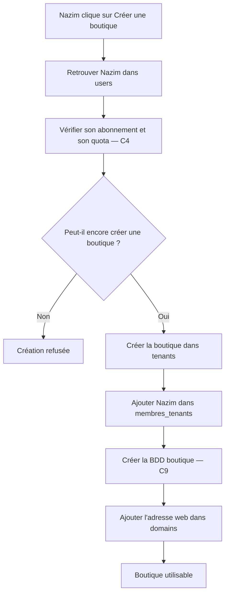

## 6. Entrée / sortie

**Entrée :** un utilisateur veut créer une boutique.

**Sortie :** une boutique dans `tenants`, son propriétaire dans `membres_tenants`, sa BDD et son domaine.

## 7. Version orale

> C1 gère les utilisateurs et les boutiques. Quand un propriétaire crée une boutique, on vérifie d'abord son compte et son quota. Ensuite on crée la boutique dans `tenants`, on relie le propriétaire avec `membres_tenants`, on crée sa BDD et on lui associe son domaine.

---

# C2 — Permissions

## 1. Rôle

C2 décide **ce qu'un utilisateur a le droit de faire**.

Par exemple :

- voir les commandes ;
- modifier les produits ;
- gérer le stock ;
- administrer une boutique.

## 2. Tables

- `fonctionnalites` : fonctionnalités disponibles dans le SaaS.
- `permissions` : actions précises possibles.
- `roles` : groupes de permissions.
- `roles_permissions` : permissions données à chaque rôle.
- `users_roles` : rôles généraux d'un utilisateur sur la plateforme.
- `membres_roles` : rôles d'un membre dans une boutique.

## 3. Tables externes

- `users`, `tenants`, `membres_tenants` — C1.
- `exceptions_permissions` — C3.
- `abonnements`, `plans_fonctionnalites` — C4.

## 4. Fonctionnement simple

Exemple : **Samir veut modifier un produit dans une boutique.**

1. `users` identifie Samir.
2. `membres_tenants` vérifie qu'il appartient bien à cette boutique.
3. `membres_roles` récupère son rôle.
4. `roles_permissions` indique ce que ce rôle peut faire.
5. C3 vérifie s'il existe une exception particulière.
6. C4 vérifie que la fonctionnalité existe dans le plan.
7. L'action est autorisée ou refusée.

## 5. Diagramme

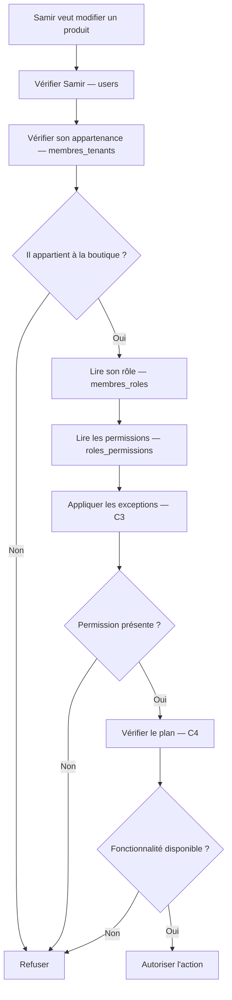

## 6. Entrée / sortie

**Entrée :** utilisateur + boutique + action.

**Sortie :** autorisé ou refusé.

## 7. Version orale

> C2 contrôle les droits. On regarde dans quelle boutique travaille la personne, son rôle et les permissions de ce rôle. Ensuite on applique les éventuelles exceptions et les limites du plan avant d'autoriser l'action.

---

# C3 — Exceptions et accès administratifs

## 1. Rôle

C3 gère les cas particuliers liés aux accès.

Par exemple :

- inviter un nouveau membre ;
- donner exceptionnellement une permission ;
- retirer exceptionnellement une permission ;
- permettre à un administrateur d'aider temporairement une boutique.

## 2. Tables

- `exceptions_permissions`
- `restrictions_admins`
- `invitations_equipes`
- `sessions_assistance`

## 3. Tables externes

- `users`, `tenants`, `membres_tenants` — C1.
- `roles`, `permissions`, `membres_roles` — C2.
- `journal_audit_central` — C6.

## 4. Fonctionnement simple

### Exemple 1 : invitation

Nazim veut inviter Samir dans sa boutique.

1. On vérifie Nazim dans C1.
2. C2 vérifie qu'il a le droit d'ajouter un membre.
3. On crée l'invitation dans `invitations_equipes`.
4. Samir accepte l'invitation.
5. On crée son appartenance dans `membres_tenants`.
6. On lui attribue son rôle avec `membres_roles`.

### Exemple 2 : assistance

Un administrateur doit aider un commerçant.

1. On vérifie les restrictions dans `restrictions_admins`.
2. Une session temporaire est créée dans `sessions_assistance`.
3. Les droits continuent d'être contrôlés.
4. Les actions sont enregistrées dans C6.

## 5. Diagramme

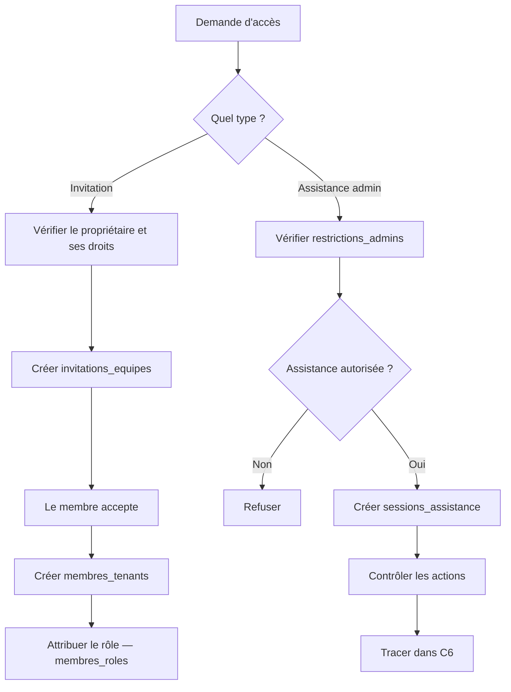

## 6. Entrée / sortie

**Entrée :** invitation, exception ou demande d'assistance.

**Sortie :** accès créé, accès temporaire ou refus.

## 7. Version orale

> C3 gère les accès particuliers. Il permet par exemple d'inviter un collaborateur ou d'ouvrir temporairement une session d'assistance pour un administrateur. Les permissions restent contrôlées et les actions importantes sont tracées.

---

# C4 — Plans et abonnements

## 1. Rôle

C4 décide **ce qu'un propriétaire peut utiliser selon son abonnement**.

Exemple :

- plan Gratuit = 1 boutique ;
- plan Pro = plusieurs boutiques ;
- certaines fonctionnalités disponibles uniquement dans certains plans.

## 2. Tables

- `plans`
- `plans_fonctionnalites`
- `abonnements`
- `exceptions_fonctionnalites`

## 3. Tables externes

- `users`, `tenants` — C1.
- `fonctionnalites` — C2.
- `reglements_abonnement` — C5.

## 4. Fonctionnement simple

Exemple : Nazim veut créer une nouvelle boutique.

1. On identifie Nazim avec `users`.
2. On cherche son abonnement dans `abonnements`.
3. On regarde son plan dans `plans`.
4. `plans_fonctionnalites` donne les fonctionnalités et quotas du plan.
5. `exceptions_fonctionnalites` peut modifier exceptionnellement une limite.
6. On compare ce qu'il utilise déjà avec son quota.
7. L'action est autorisée ou refusée.

Si l'abonnement payant expire, le plan gratuit prend le relais.

## 5. Diagramme

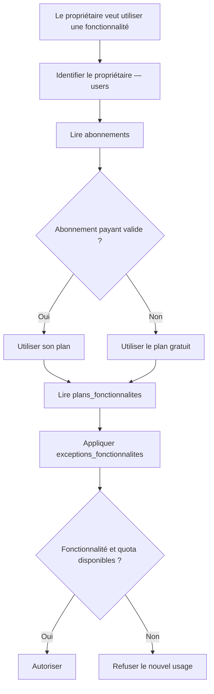

## 6. Entrée / sortie

**Entrée :** propriétaire + fonctionnalité demandée.

**Sortie :** fonctionnalités et quotas autorisés.

## 7. Version orale

> C4 gère les abonnements. Il regarde quel plan possède le propriétaire et quelles fonctionnalités ou limites sont prévues par ce plan. Si le payant expire, le gratuit prend le relais.

---

# C5 — Suivi SaaS et référentiel

## 1. Rôle

C5 contient **trois services différents** :

1. suivre certaines consommations ;
2. suivre les montants d'abonnement à payer ;
3. stocker les wilayas et communes.

Ces trois parties ne représentent pas une seule chaîne.

## 2. Tables

- `consommations_fonctionnalites`
- `echeances_abonnement`
- `reglements_abonnement`
- `wilayas`
- `communes`

## 3. Tables externes

- `fonctionnalites` — C2.
- `abonnements` — C4.
- `tenants` — C1.
- `factures_saas` — C13.
- `revisions_commandes` — T8.

## 4. Fonctionnement simple

### Cas 1 — Quota

Le système veut connaître une consommation.

Il lit `consommations_fonctionnalites` ou compte directement les éléments concernés, puis compare avec C4.

### Cas 2 — Abonnement

Une somme doit être payée.

1. `echeances_abonnement` contient ce qui doit être payé.
2. Le commerçant effectue son paiement.
3. Le paiement est enregistré dans `reglements_abonnement`.
4. Le système sait ensuite ce qui reste éventuellement à payer.

### Cas 3 — Adresse

Un client sélectionne :

**Wilaya : Oran**

puis une commune.

`wilayas` et `communes` permettent de vérifier que la commune appartient bien à cette wilaya.

## 5. Diagramme

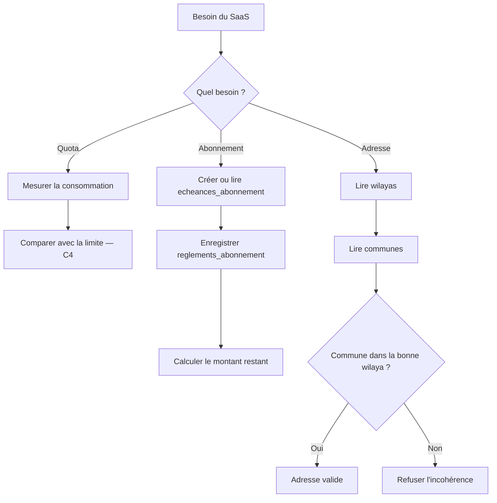

## 6. Entrée / sortie

**Entrée :** consommation, paiement ou adresse.

**Sortie :** quota mesuré, état du paiement ou localisation validée.

## 7. Version orale

> C5 rassemble trois petits services communs : le suivi de certaines consommations, le suivi des paiements d'abonnement et le référentiel des wilayas et communes.

---

# C6 — Audit SaaS

## 1. Rôle

C6 permet surtout de :

- garder une trace des actions sensibles ;
- vérifier un numéro de téléphone ou un canal de contact.

## 2. Tables

- `journal_audit_central`
- `verifications_contacts`

## 3. Tables externes

- `users` — C1.
- `tenants` — C1.
- `sessions_assistance` — C3.

## 4. Fonctionnement simple

### Audit

Exemple : un administrateur modifie un abonnement.

`journal_audit_central` garde une trace indiquant :

- qui a fait l'action ;
- sur quoi ;
- quand ;
- dans quel contexte.

### Vérification d'un contact

1. Le système crée un code dans `verifications_contacts`.
2. L'utilisateur reçoit le code.
3. Il saisit le code.
4. Le système vérifie qu'il est correct et encore valable.
5. Le contact est marqué comme vérifié.

## 5. Diagramme

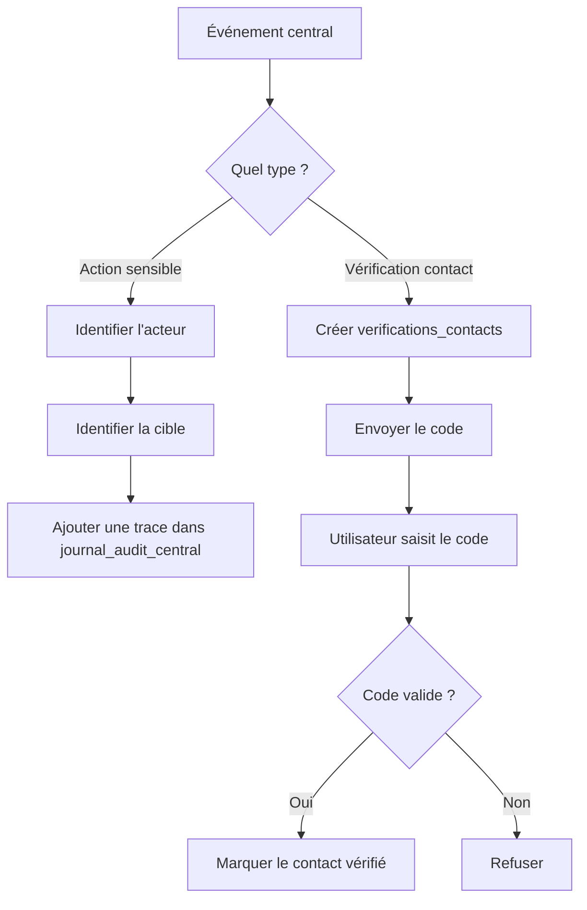

## 6. Entrée / sortie

**Entrée :** action sensible ou vérification de contact.

**Sortie :** trace d'audit ou contact vérifié.

## 7. Version orale

> C6 sert à savoir qui a effectué une action importante dans le SaaS. Il sert également à gérer les codes temporaires utilisés pour vérifier les contacts.

---

# C7 — Comptes transporteur et tarifs versionnés

## 1. Rôle

C7 gère les comptes utilisés pour communiquer avec les transporteurs.

Un même propriétaire peut utiliser le même compte transporteur pour plusieurs de ses boutiques.

## 2. Tables

- `comptes_livraison`
- `boutiques_comptes_livraison`
- `tarifs_transporteur`

## 3. Tables externes

- `users`, `tenants` — C1.
- `prestataires_livraison` — T10.
- `frais_transporteur` — T16.

## 4. Fonctionnement simple

Exemple : Nazim possède deux boutiques et possède un compte chez un transporteur.

1. Son compte transporteur est enregistré dans `comptes_livraison`.
2. `boutiques_comptes_livraison` indique quelles boutiques peuvent utiliser ce compte.
3. Le système vérifie que les boutiques appartiennent bien au même propriétaire.
4. Quand une boutique crée une livraison, elle utilise ce compte.
5. Si un retour coûte un certain prix, `tarifs_transporteur` permet de retrouver le tarif valable à cette date.
6. Le montant réellement appliqué est ensuite conservé dans `frais_transporteur`.

## 5. Diagramme

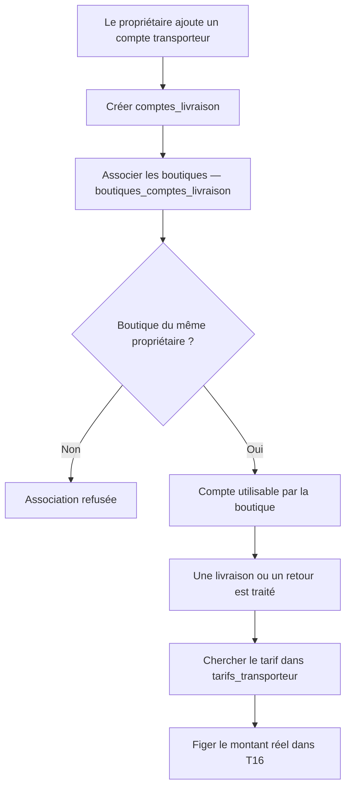

## 6. Entrée / sortie

**Entrée :** compte transporteur + boutique.

**Sortie :** compte autorisé et tarif applicable.

## 7. Version orale

> C7 centralise les comptes transporteur. Plusieurs boutiques du même propriétaire peuvent utiliser le même compte. Les anciens tarifs restent conservés pour éviter qu'un changement de prix modifie l'historique.

---

# C8 — Routage des colis et règlements partagés

## 1. Rôle

C8 est important lorsqu'un **même compte transporteur sert plusieurs boutiques**.

Il faut alors savoir :

- à quelle boutique appartient chaque colis ;
- combien d'argent revient à chaque boutique.

## 2. Tables

- `registre_colis_transporteur`
- `lots_reversement_transporteur`
- `parts_reversement_tenants`

## 3. Tables externes

- `comptes_livraison` — C7.
- `boutiques_comptes_livraison` — C7.
- `livraisons` — T11.
- `bordereaux_reversement` — T13.

## 4. Fonctionnement simple

Exemple :

Nazim possède Boutique A et Boutique B.

Les deux utilisent le même compte transporteur.

Un colis revient du transporteur avec le numéro `ABC123`.

1. `registre_colis_transporteur` indique que `ABC123` appartient à Boutique B.
2. L'information est envoyée vers la BDD de Boutique B.
3. Le transporteur verse ensuite par exemple 100 000 DA pour plusieurs colis.
4. `lots_reversement_transporteur` contient le montant global.
5. `parts_reversement_tenants` indique combien appartient à Boutique A et combien appartient à Boutique B.
6. Chaque part est ensuite enregistrée dans la bonne BDD boutique.

## 5. Diagramme

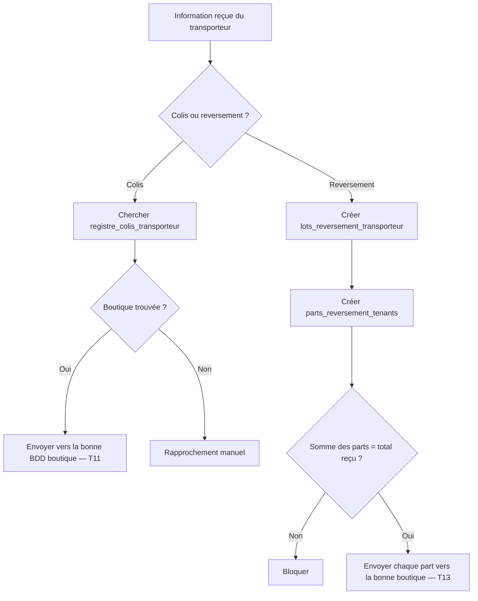

## 6. Entrée / sortie

**Entrée :** colis ou argent reçu du transporteur.

**Sortie :** information envoyée à la bonne boutique.

## 7. Version orale

> C8 évite de mélanger les colis et l'argent lorsque plusieurs boutiques utilisent le même compte transporteur. Chaque colis et chaque part de reversement sont rattachés à la bonne boutique.

---

# C9 — Historique des déploiements des BDD

## 1. Rôle

C9 suit techniquement la création et les mises à jour des BDD boutiques.

## 2. Table

- `deploiements_schema_tenants`

## 3. Tables externes

- `tenants` — C1.
- `restaurations_tenants` — C12.
- `migrations` — table technique dans chaque BDD boutique.

## 4. Fonctionnement simple

Exemple : une nouvelle boutique vient d'être créée.

1. C1 crée le `tenant`.
2. C9 ajoute une tentative dans `deploiements_schema_tenants`.
3. Le système crée la BDD.
4. Il crée les tables nécessaires.
5. Si tout fonctionne, le déploiement est marqué comme réussi.
6. `tenants.version_schema` est mis à jour.
7. En cas d'erreur, celle-ci reste enregistrée.
8. Une nouvelle tentative peut ensuite être exécutée.

## 5. Diagramme

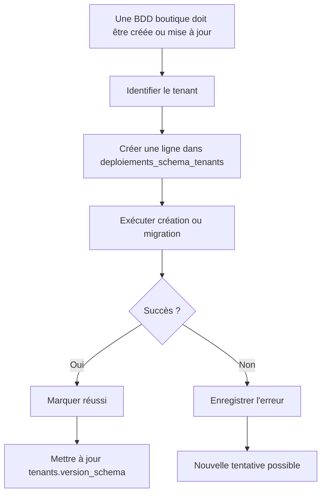

## 6. Entrée / sortie

**Entrée :** boutique + version de BDD souhaitée.

**Sortie :** BDD créée/mise à jour ou erreur enregistrée.

## 7. Version orale

> C9 garde l'historique technique des BDD boutiques. Il permet de savoir si une base a été créée correctement, quelle version elle utilise et quelles erreurs ont eu lieu.

---

# C10 — Identité légale du vendeur

## 1. Rôle

C10 conserve les informations légales du propriétaire utilisées dans les documents.

## 2. Table

- `entites_legales`

## 3. Tables externes

- `users` — C1.
- `revisions_commandes` — T8.
- `factures` — T17.
- `regles_facturation` — C14.

## 4. Fonctionnement simple

Exemple : Nazim doit renseigner les informations du vendeur.

1. Nazim existe dans `users`.
2. Ses informations sont enregistrées dans `entites_legales`.
3. Le système vérifie ces informations selon les règles prévues.
4. Une fois l'identité validée, elle peut être utilisée pour les documents.
5. Lorsqu'une facture est créée, une copie des informations utilisées est conservée.
6. Si Nazim modifie ensuite son adresse, les anciennes factures ne changent pas.

## 5. Diagramme

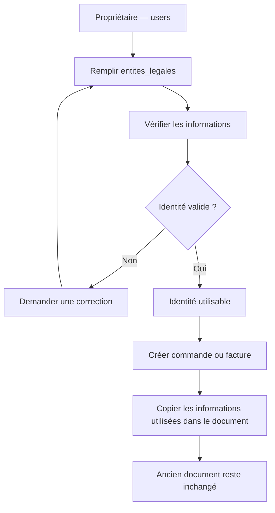

## 6. Entrée / sortie

**Entrée :** informations du vendeur.

**Sortie :** identité légale utilisable dans les documents.

## 7. Version orale

> C10 contient l'identité légale du commerçant. Lorsqu'un document est émis, les informations utilisées sont figées afin qu'une modification future du profil ne change pas les anciens documents.

---

# C11 — Politiques et exécutions de conservation

## 1. Rôle

C11 décide combien de temps certaines données doivent rester conservées et suit les traitements réalisés.

## 2. Tables

- `politiques_retention`
- `executions_retention`

## 3. Tables externes

- `tenants` — C1.
- `sauvegardes_tenants` — C12.
- `journal_operations_donnees_personnelles_central` — C14.
- `journal_operations_donnees_personnelles` — T21.

## 4. Fonctionnement simple

Exemple :

Une règle dit qu'une certaine catégorie de données peut être anonymisée après une certaine durée.

1. La règle se trouve dans `politiques_retention`.
2. Le système cherche les données concernées.
3. Il vérifie si elles doivent encore être conservées.
4. Si oui, il ne touche à rien.
5. Sinon, il applique l'action prévue :
   - conserver ;
   - anonymiser ;
   - supprimer.
6. Le résultat est enregistré dans `executions_retention`.
7. L'opération est également tracée.

## 5. Diagramme

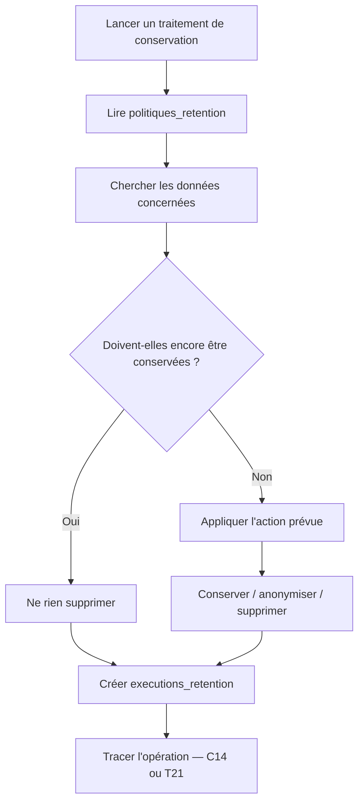

## 6. Entrée / sortie

**Entrée :** politique + données concernées.

**Sortie :** traitement effectué et enregistré.

## 7. Version orale

> C11 gère la durée de conservation des données. Il vérifie quelles données peuvent être conservées, anonymisées ou supprimées et garde une trace de chaque traitement effectué.

---

# C12 — Sauvegardes, restaurations et reprise

## 1. Rôle

C12 gère :

- les sauvegardes des BDD boutiques ;
- les restaurations ;
- les contrôles après restauration ;
- les références des documents déjà émis.

## 2. Tables

- `configurations_sauvegardes`
- `limites_sauvegardes_plans`
- `sauvegardes_tenants`
- `restaurations_tenants`
- `operations_centrales_tenants`
- `registre_documents_emis`

## 3. Tables externes

- `tenants` — C1.
- `plans` — C4.
- `deploiements_schema_tenants` — C9.
- `factures` — T17.
- `sequences_documents` — T20.

## 4. Fonctionnement simple

### Sauvegarde

1. `configurations_sauvegardes` indique quand sauvegarder la boutique.
2. `limites_sauvegardes_plans` vérifie ce que permet son plan.
3. La sauvegarde est créée.
4. Elle est enregistrée dans `sauvegardes_tenants`.

### Restauration

Exemple : la BDD de la boutique doit revenir à une sauvegarde d'hier.

1. Une restauration est créée dans `restaurations_tenants`.
2. On bloque temporairement les nouvelles écritures.
3. La sauvegarde est restaurée.
4. C9 vérifie la version de la BDD.
5. `operations_centrales_tenants` aide à retrouver les opérations faites après la sauvegarde.
6. `registre_documents_emis` permet de savoir quels documents avaient déjà été émis.
7. On évite ainsi de perdre ou recréer incorrectement une opération déjà réalisée.
8. Quand tout est cohérent, la boutique peut être réactivée.

## 5. Diagramme

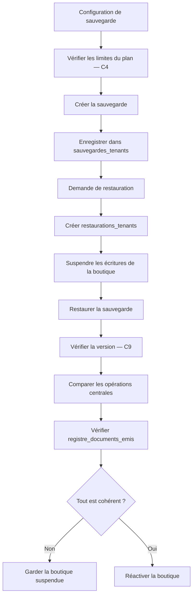

## 6. Entrée / sortie

**Entrée :** configuration, sauvegarde ou demande de restauration.

**Sortie :** sauvegarde disponible ou boutique restaurée correctement.

## 7. Version orale

> C12 gère les sauvegardes et les restaurations. Après une restauration, on ne remet pas simplement un ancien fichier : on vérifie aussi les opérations et documents créés entre-temps avant de réactiver la boutique.

---

# C13 — Facturation du SaaS au commerçant

## 1. Rôle

Attention : C13 ne concerne pas les commandes des clients.

C13 sert à **facturer le commerçant pour l'utilisation du SaaS**.

## 2. Tables

- `sequences_facturation_saas`
- `factures_saas`
- `lignes_factures_saas`
- `avoirs_saas`
- `lignes_avoirs_saas`
- `transmissions_documents_saas`

## 3. Tables externes

- `abonnements` — C4.
- `echeances_abonnement` — C5.
- `entites_legales` — C10.
- `regles_facturation` — C14.
- `registre_documents_emis` — C12.

## 4. Fonctionnement simple

Exemple :

Nazim doit payer son abonnement au SaaS.

1. C5 indique qu'une échéance doit être facturée.
2. C14 indique quelle règle utiliser.
3. On crée `factures_saas`.
4. Le détail du prix va dans `lignes_factures_saas`.
5. `sequences_facturation_saas` fournit le prochain numéro.
6. L'identité du commerçant vient de C10.
7. La facture est figée.
8. Elle est enregistrée dans `registre_documents_emis`.
9. Son envoi est suivi dans `transmissions_documents_saas`.

Si une facture déjà émise contient une erreur, on ne la modifie pas directement.

On crée :

- `avoirs_saas`
- `lignes_avoirs_saas`.

## 5. Diagramme

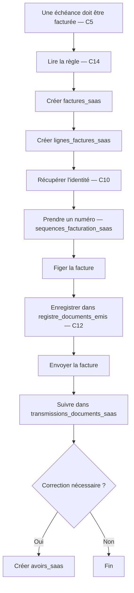

## 6. Entrée / sortie

**Entrée :** abonnement + échéance + règle de facturation.

**Sortie :** facture SaaS ou avoir.

## 7. Version orale

> C13 sert à facturer le commerçant pour l'utilisation de notre SaaS. La facture possède un numéro, des lignes et une identité figée. Une facture déjà émise n'est plus modifiée : une correction passe par un avoir.

---

# C14 — Règles de facturation et gouvernance des données

## 1. Rôle

C14 possède deux parties principales :

### Partie 1
Conserver les règles utilisées pour la facturation.

### Partie 2
Documenter et tracer certains traitements de données personnelles.

## 2. Tables

- `regles_facturation`
- `registre_activites_traitement`
- `journal_operations_donnees_personnelles_central`

## 3. Tables externes

- `entites_legales` — C10.
- `factures_saas` — C13.
- `obligations_facturation` — T22.
- `journal_operations_donnees_personnelles` — T21.
- `politiques_retention` — C11.

## 4. Fonctionnement simple

### Cas 1 — Facturation

Avant de créer une facture :

1. on regarde `regles_facturation`;
2. on trouve la version applicable ;
3. on vérifie qu'elle est validée ;
4. C13 ou T22 utilise cette règle.

### Cas 2 — Données personnelles

Exemple : le système doit anonymiser certaines données.

1. `registre_activites_traitement` explique le type de traitement prévu.
2. C11 indique quand l'action doit être réalisée.
3. Le traitement est exécuté.
4. Si l'opération concerne le central, elle est enregistrée dans `journal_operations_donnees_personnelles_central`.
5. Si elle concerne uniquement une boutique, elle est enregistrée dans T21.

## 5. Diagramme

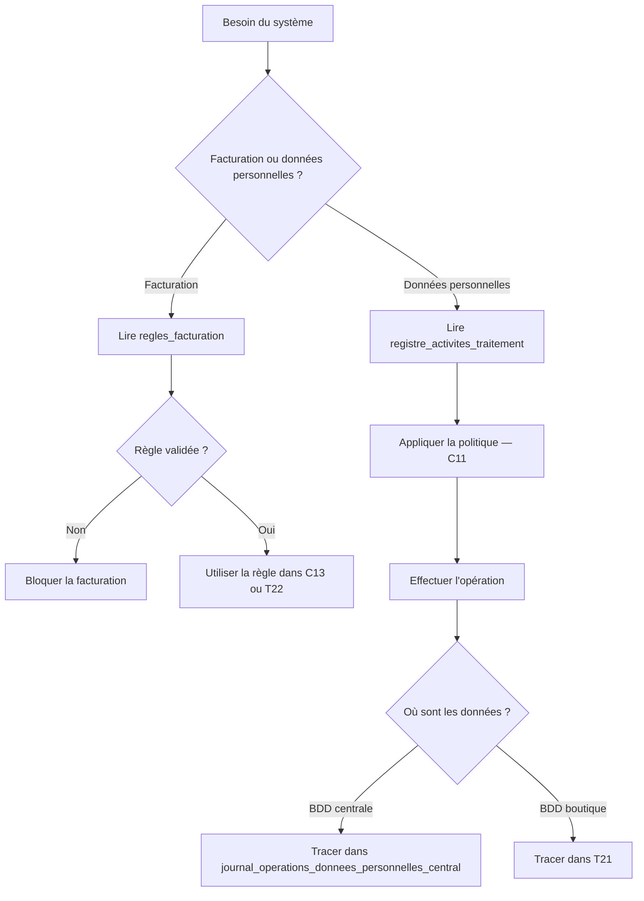

## 6. Entrée / sortie

**Entrée :** règle de facturation ou traitement de données.

**Sortie :** règle appliquée ou opération de données tracée.

## 7. Version orale

> C14 contient les règles utilisées par la facturation et les informations sur les traitements de données personnelles. Il distingue ce qui est prévu par les règles de ce qui a réellement été exécuté et enregistré.

---

# Vue globale C1 → C14

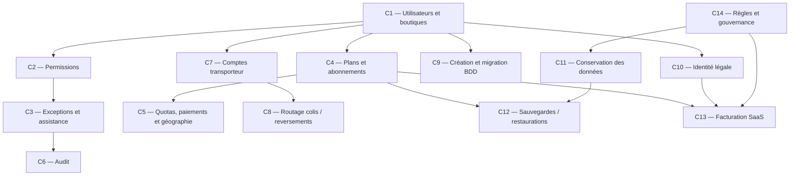

# Résumé extrêmement simple

| Module | À quoi il sert |
|---|---|
| **C1** | Savoir qui sont les utilisateurs et quelles boutiques leur appartiennent |
| **C2** | Savoir ce qu'un utilisateur a le droit de faire |
| **C3** | Gérer les invitations, exceptions et accès d'assistance |
| **C4** | Gérer les plans, abonnements, fonctionnalités et quotas |
| **C5** | Suivre certaines consommations, paiements SaaS et wilayas/communes |
| **C6** | Garder les traces des actions importantes |
| **C7** | Gérer les comptes et tarifs des transporteurs |
| **C8** | Envoyer les colis et reversements vers la bonne boutique |
| **C9** | Créer et mettre à jour techniquement les BDD boutiques |
| **C10** | Conserver l'identité légale du commerçant |
| **C11** | Gérer la conservation, anonymisation ou suppression des données |
| **C12** | Sauvegarder et restaurer les BDD boutiques |
| **C13** | Facturer l'utilisation du SaaS au commerçant |
| **C14** | Conserver les règles de facturation et tracer les traitements de données |
