# BDD centrale — Présentation des modules C1 à C14

Les modules **C1 à C14 sont des groupes fonctionnels de la même BDD centrale `saas_central`**.

Ce ne sont pas 14 bases de données différentes.

---

# C1 — Identités et boutiques

## 1. Rôle

C1 répond surtout à 4 questions :

- Qui est l'utilisateur ?
- Quelle boutique lui appartient ?
- Dans quelles boutiques travaille-t-il ?
- Quelle adresse web appartient à quelle boutique ?

## 2. Tables

- `users` : les comptes des utilisateurs.
- `tenants` : les boutiques.
- `membres_tenants` : indique quels utilisateurs font partie de quelles boutiques.
- `domains` : les adresses web des boutiques.

## 3. Tables venant d'autres modules

- `abonnements`, `plans_fonctionnalites` — C4 : savoir combien de boutiques le propriétaire peut créer.
- `deploiements_schema_tenants` — C9 : suivre la création technique de la BDD boutique.
- `boutique` — T1 : informations locales de la boutique dans sa propre BDD.

## 4. Fonctionnement simple

Exemple : **un propriétaire clique sur « Créer une boutique ».**

1. `users` regarde **qui est connecté**.
2. C4 regarde son abonnement pour savoir **combien de boutiques il a le droit d’avoir**.
3. S’il a encore le droit d’en créer une, `tenants` crée la nouvelle boutique.
4. `membres_tenants` indique : **ce propriétaire appartient à cette boutique**.
5. C9 crée **la vraie BDD séparée** de cette boutique avec ses tables.
6. `domains` ajoute **l’adresse du site**, par exemple `maboutique.monsaas.dz`.
7. Quand tout est prêt, la boutique peut être utilisée.

**En très simple :** on vérifie le propriétaire → on vérifie qu’il peut créer une boutique → on crée la boutique → on crée sa BDD → on lui donne son adresse web.

## 5. Diagramme

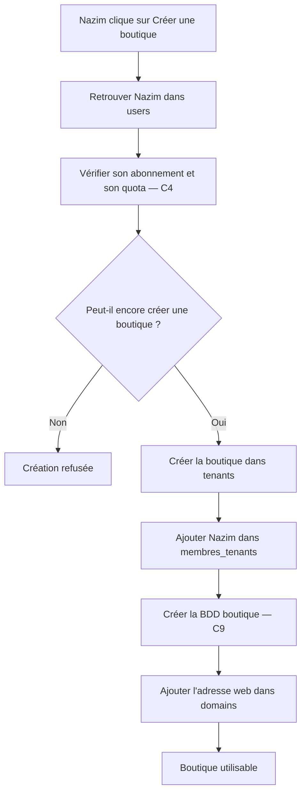

## 6. Entrée / sortie

**Entrée :** un utilisateur veut créer une boutique.

**Sortie :** une boutique dans `tenants`, son propriétaire dans `membres_tenants`, sa BDD et son domaine.

## 7. Version courte

> C1 gère les utilisateurs et les boutiques. Quand un propriétaire crée une boutique, on vérifie d'abord son compte et son quota. Ensuite on crée la boutique dans `tenants`, on relie le propriétaire avec `membres_tenants`, on crée sa BDD et on lui associe son domaine.

---

# C2 — Permissions

## 1. Rôle

C2 décide **ce qu'un utilisateur a le droit de faire**.

Par exemple :

- voir les commandes ;
- modifier les produits ;
- gérer le stock ;
- administrer une boutique.

## 2. Tables

- `fonctionnalites` : fonctionnalités disponibles dans le SaaS.
- `permissions` : actions précises possibles.
- `roles` : groupes de permissions.
- `roles_permissions` : permissions données à chaque rôle.
- `users_roles` : rôles généraux d'un utilisateur sur la plateforme.
- `membres_roles` : rôles d'un membre dans une boutique.

## 3. Tables externes

- `users`, `tenants`, `membres_tenants` — C1.
- `exceptions_permissions` — C3.
- `abonnements`, `plans_fonctionnalites` — C4.

## 4. Fonctionnement simple

Exemple : **un collaborateur veut modifier un produit.**

1. `users` regarde **qui essaie de faire l’action**.
2. `membres_tenants` vérifie : **est-ce que cette personne travaille bien dans cette boutique ?**
3. `membres_roles` regarde son rôle, par exemple **vendeur**.
4. `roles_permissions` regarde ce que ce rôle peut faire.
5. C3 vérifie s’il existe une **règle spéciale** pour cette personne, par exemple : « normalement il peut modifier les prix, mais pas aujourd’hui ».
6. C4 vérifie si l’abonnement de la boutique permet d’utiliser cette fonction.
7. Si tout est bon → action autorisée. Sinon → action refusée.

**En très simple :** on vérifie la personne → son rôle → ses droits → les règles spéciales → son abonnement → puis on dit oui ou non.

## 5. Diagramme

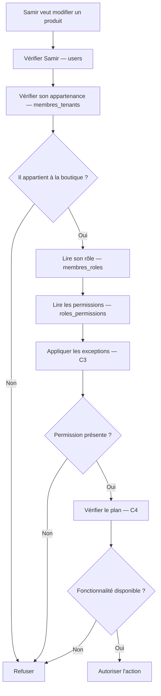

## 6. Entrée / sortie

**Entrée :** utilisateur + boutique + action.

**Sortie :** autorisé ou refusé.

## 7. Version courte

> C2 contrôle les droits. On regarde dans quelle boutique travaille la personne, son rôle et les permissions de ce rôle. Ensuite on applique les éventuelles exceptions et les limites du plan avant d'autoriser l'action.

---

# C3 — Invitations, exceptions et restrictions administratives

## 1. Rôle

C3 gère les cas particuliers liés aux accès.

Par exemple :

- inviter un nouveau membre ;
- donner exceptionnellement une permission ;
- retirer exceptionnellement une permission ;
- limiter les actions d’un administrateur dans l’administration centrale.

## 2. Tables

- `exceptions_permissions`
- `restrictions_admins`
- `invitations_equipes`

## 3. Tables externes

- `users`, `tenants`, `membres_tenants` — C1.
- `roles`, `permissions`, `membres_roles` — C2.
- `journal_audit_central` — C6.

## 4. Fonctionnement simple

C3 gère les **cas spéciaux d’accès**.

### Cas 1 — Inviter quelqu’un dans une boutique

1. Le propriétaire veut ajouter un collaborateur.
2. `invitations_equipes` crée une invitation.
3. Le collaborateur accepte.
4. C1 l’ajoute dans `membres_tenants`.
5. C2 lui donne son rôle dans `membres_roles`.

### Cas 2 — Donner ou retirer un droit spécial

1. `exceptions_permissions` peut dire : **cette personne a ce droit spécial** ou **ce droit lui est interdit**.
2. Cette règle peut avoir une date de début et une date de fin.

### Cas 3 — Limiter un administrateur SaaS

1. Un administrateur veut effectuer une action dans l’administration centrale.
2. Ses permissions indiquent s’il peut faire cette action.
3. `restrictions_admins` vérifie si elle est autorisée sur la cible choisie.
4. Le système accepte ou refuse. C6 garde une trace des actions importantes.

**En très simple :** C3 sert à inviter des collaborateurs, donner ou retirer un droit spécial, et limiter les actions des administrateurs dans l’administration centrale.

## 5. Diagramme

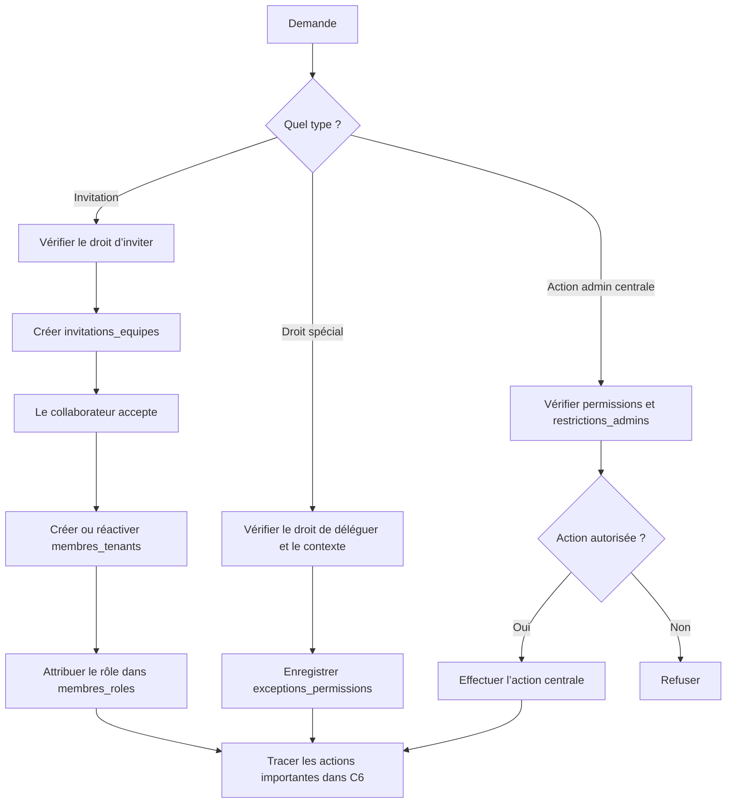

## 6. Entrée / sortie

**Entrée :** invitation, demande de droit spécial ou action d’administration centrale.

**Sortie :** membre ajouté, exception enregistrée ou action centrale autorisée/refusée.

## 7. Version courte

> C3 gère les invitations d’équipe, les droits exceptionnels et les restrictions des administrateurs SaaS. Il ne permet pas d’entrer temporairement dans une boutique ni d’agir à la place de son propriétaire.

---

# C4 — Plans et abonnements

## 1. Rôle

C4 décide **ce qu'un propriétaire peut utiliser selon son abonnement**.

Exemple :

- plan Gratuit = 1 boutique ;
- plan Pro = plusieurs boutiques ;
- certaines fonctionnalités disponibles uniquement dans certains plans.

## 2. Tables

- `plans`
- `plans_fonctionnalites`
- `abonnements`
- `exceptions_fonctionnalites`

## 3. Tables externes

- `users`, `tenants` — C1.
- `fonctionnalites` — C2.
- `reglements_abonnement` — C5.

## 4. Fonctionnement simple

Exemple : **un propriétaire veut utiliser une fonction payante ou créer une autre boutique.**

1. `abonnements` regarde **quel abonnement il possède**.
2. `plans` regarde le nom de son offre, par exemple **Gratuit** ou **Pro**.
3. `plans_fonctionnalites` regarde **ce que cette offre permet**.
4. Exemple : Gratuit = 1 boutique ; Pro = 3 boutiques.
5. `exceptions_fonctionnalites` regarde s’il existe une règle spéciale pour ce propriétaire, par exemple lui donner temporairement une fonction en plus.
6. Si son abonnement permet ce qu’il demande → autorisé.
7. Sinon → refusé.
8. Si son abonnement payant est terminé, le plan gratuit prend le relais.

**En très simple :** C4 regarde l’abonnement et répond : « est-ce que cette offre permet cette fonction ou ce nombre de boutiques ? »

## 5. Diagramme

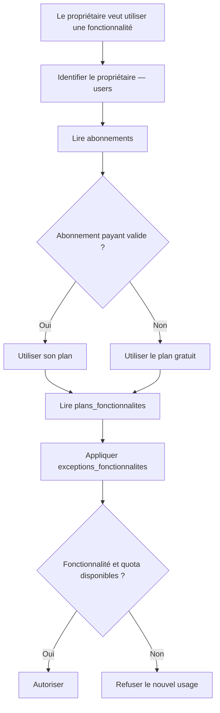

## 6. Entrée / sortie

**Entrée :** propriétaire + fonctionnalité demandée.

**Sortie :** fonctionnalités et quotas autorisés.

## 7. Version courte

> C4 gère les abonnements. Il regarde quel plan possède le propriétaire et quelles fonctionnalités ou limites sont prévues par ce plan. Si le payant expire, le gratuit prend le relais.

---

# C5 — Suivi SaaS et référentiel

## 1. Rôle

C5 contient **trois services différents** :

1. suivre certaines consommations ;
2. suivre les montants d'abonnement à payer ;
3. stocker les wilayas et communes.

Ces trois parties ne représentent pas une seule chaîne.

## 2. Tables

- `consommations_fonctionnalites`
- `echeances_abonnement`
- `reglements_abonnement`
- `wilayas`
- `communes`

## 3. Tables externes

- `fonctionnalites` — C2.
- `abonnements` — C4.
- `tenants` — C1.
- `factures_saas` — C13.
- `revisions_commandes` — T8.

## 4. Fonctionnement simple

C5 fait **trois choses séparées**.

### 1 — Suivre un quota

1. `consommations_fonctionnalites` regarde **combien une fonction a déjà été utilisée**.
2. C4 compare ce nombre avec la limite du plan.

### 2 — Suivre le paiement de l’abonnement

1. `echeances_abonnement` dit **combien le commerçant doit payer**.
2. `reglements_abonnement` dit **combien il a réellement payé**.
3. Le système calcule ce qu’il reste à payer.

### 3 — Vérifier une adresse

1. `wilayas` contient les wilayas.
2. `communes` contient les communes.
3. Le système vérifie que la commune choisie appartient bien à la bonne wilaya.

**En très simple :** C5 suit certaines limites, les paiements de l’abonnement et les wilayas/communes.

## 5. Diagramme

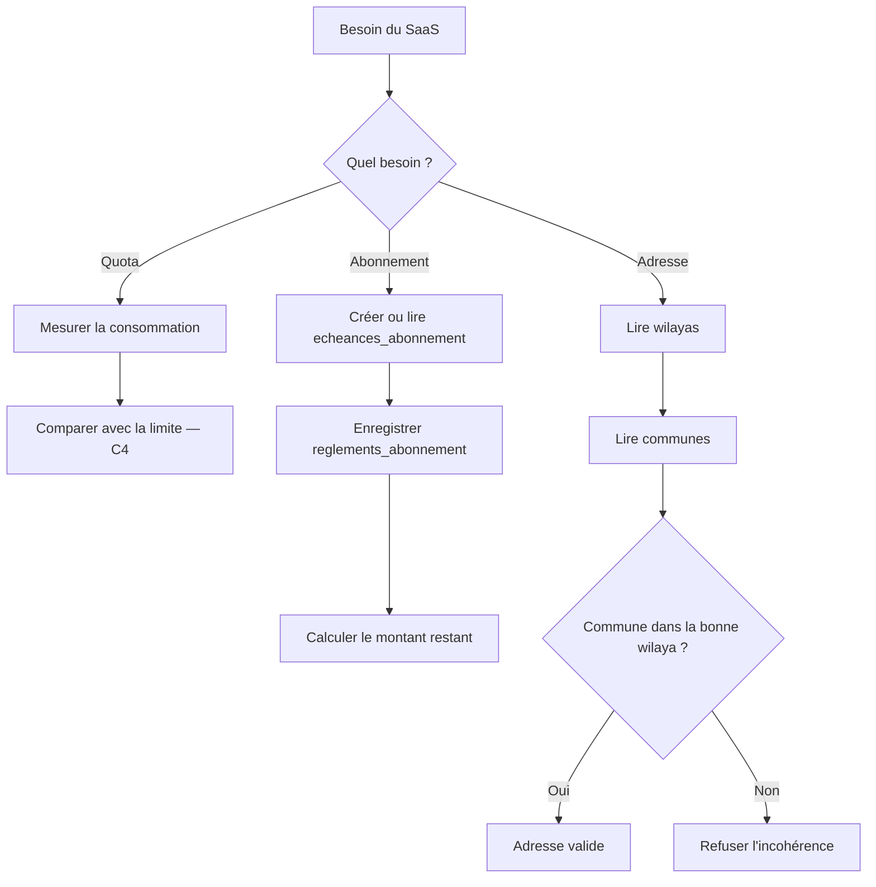

## 6. Entrée / sortie

**Entrée :** consommation, paiement ou adresse.

**Sortie :** quota mesuré, état du paiement ou localisation validée.

## 7. Version courte

> C5 rassemble trois petits services communs : le suivi de certaines consommations, le suivi des paiements d'abonnement et le référentiel des wilayas et communes.

---

# C6 — Audit SaaS

## 1. Rôle

C6 permet surtout de :

- garder une trace des actions sensibles ;
- vérifier un numéro de téléphone ou un canal de contact.

## 2. Tables

- `journal_audit_central`
- `verifications_contacts`

## 3. Tables externes

- `users` — C1.
- `tenants` — C1.

## 4. Fonctionnement simple

C6 fait **deux choses**.

### 1 — Garder une trace

1. Une action importante est faite, par exemple modifier un abonnement.
2. `journal_audit_central` enregistre **qui l’a faite, quand et sur quoi**.

### 2 — Vérifier un téléphone ou WhatsApp

1. `verifications_contacts` crée un code temporaire.
2. Le code est envoyé à l’utilisateur.
3. L’utilisateur tape le code.
4. Le système vérifie s’il est correct et encore valable.
5. S’il est bon, le contact est marqué comme vérifié.

**En très simple :** C6 garde l’historique des actions importantes et vérifie les contacts avec un code.

## 5. Diagramme

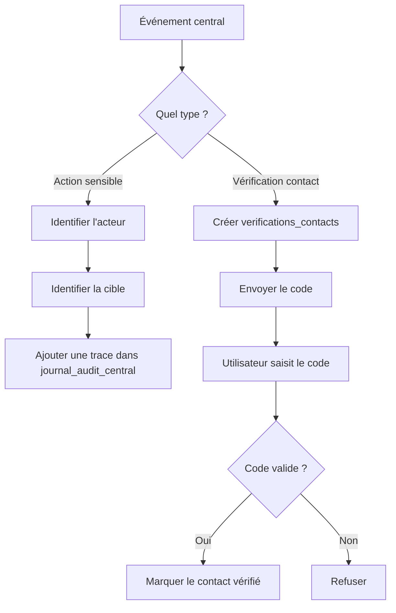

## 6. Entrée / sortie

**Entrée :** action sensible ou vérification de contact.

**Sortie :** trace d'audit ou contact vérifié.

## 7. Version courte

> C6 sert à savoir qui a effectué une action importante dans le SaaS. Il sert également à gérer les codes temporaires utilisés pour vérifier les contacts.

---

# C7 — Comptes transporteur et tarifs versionnés

## 1. Rôle

C7 gère les comptes utilisés pour communiquer avec les transporteurs.

Un même propriétaire peut utiliser le même compte transporteur pour plusieurs de ses boutiques.

## 2. Tables

- `comptes_livraison`
- `boutiques_comptes_livraison`
- `tarifs_transporteur`

## 3. Tables externes

- `users`, `tenants` — C1.
- `prestataires_livraison` — T10.
- `frais_transporteur` — T16.

## 4. Fonctionnement simple

Exemple : **un propriétaire a deux boutiques et veut utiliser le même compte transporteur pour les deux.**

1. `comptes_livraison` garde le compte du transporteur.
2. `boutiques_comptes_livraison` indique quelles boutiques peuvent utiliser ce compte.
3. Le système vérifie que ces boutiques ont bien le même propriétaire.
4. Quand une boutique envoie un colis, elle peut utiliser ce compte.
5. `tarifs_transporteur` garde les prix du transporteur avec leurs dates.
6. Si le prix change plus tard, un ancien retour garde l’ancien prix qui était valable ce jour-là.
7. T16 garde ensuite le vrai montant facturé.

**En très simple :** C7 dit quelles boutiques peuvent utiliser un compte transporteur et quel tarif était valable à chaque date.

## 5. Diagramme

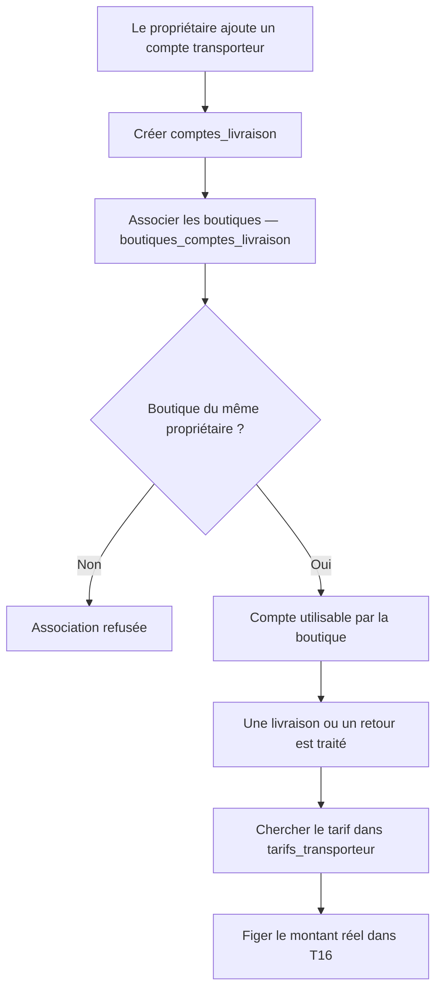

## 6. Entrée / sortie

**Entrée :** compte transporteur + boutique.

**Sortie :** compte autorisé et tarif applicable.

## 7. Version courte

> C7 centralise les comptes transporteur. Plusieurs boutiques du même propriétaire peuvent utiliser le même compte. Les anciens tarifs restent conservés pour éviter qu'un changement de prix modifie l'historique.

---

# C8 — Routage des colis et règlements partagés

## 1. Rôle

C8 est important lorsqu'un **même compte transporteur sert plusieurs boutiques**.

Il faut alors savoir :

- à quelle boutique appartient chaque colis ;
- combien d'argent revient à chaque boutique.

## 2. Tables

- `registre_colis_transporteur`
- `lots_reversement_transporteur`
- `parts_reversement_tenants`

## 3. Tables externes

- `comptes_livraison` — C7.
- `boutiques_comptes_livraison` — C7.
- `livraisons` — T11.
- `bordereaux_reversement` — T13.

## 4. Fonctionnement simple

Exemple : **deux boutiques utilisent le même compte transporteur.**

### Si le transporteur parle d’un colis

1. `registre_colis_transporteur` regarde **à quelle boutique appartient le colis**.
2. L’information est envoyée vers la bonne boutique.

### Si le transporteur envoie de l’argent pour plusieurs boutiques

1. `lots_reversement_transporteur` garde le montant total reçu.
2. `parts_reversement_tenants` sépare ce total entre les boutiques.
3. Exemple : 100 000 DA = 60 000 DA pour Boutique A + 40 000 DA pour Boutique B.
4. Le système vérifie que les parts donnent bien le total.
5. Chaque part est ensuite envoyée à la bonne boutique.

**En très simple :** C8 évite de mélanger les colis et l’argent de plusieurs boutiques qui utilisent le même compte transporteur.

## 5. Diagramme

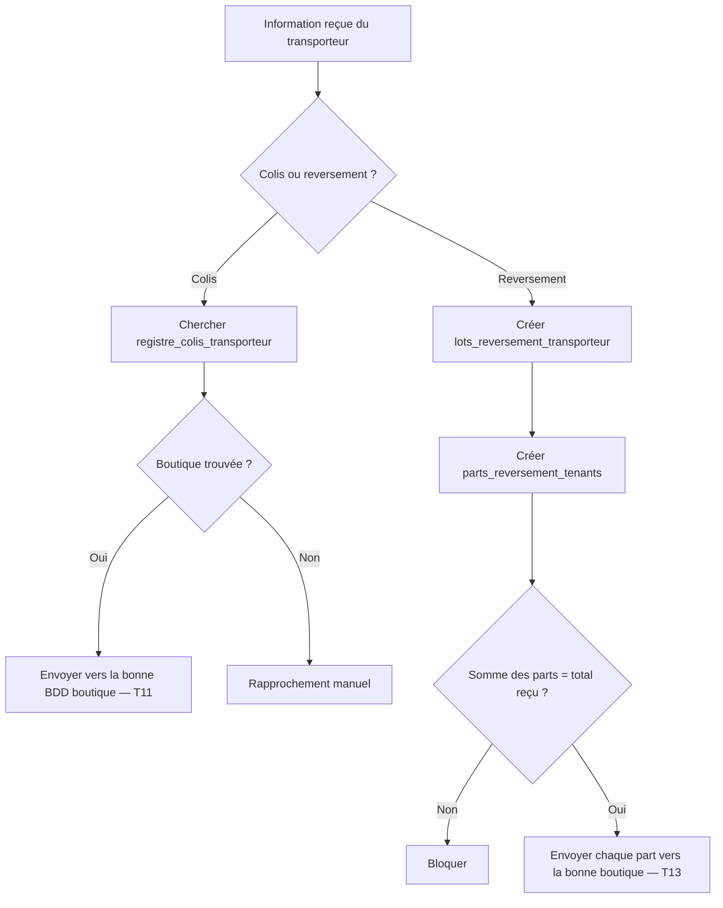

## 6. Entrée / sortie

**Entrée :** colis ou argent reçu du transporteur.

**Sortie :** information envoyée à la bonne boutique.

## 7. Version courte

> C8 évite de mélanger les colis et l'argent lorsque plusieurs boutiques utilisent le même compte transporteur. Chaque colis et chaque part de reversement sont rattachés à la bonne boutique.

---

# C9 — Historique des déploiements des BDD

## 1. Rôle

C9 suit techniquement la création et les mises à jour des BDD boutiques.

## 2. Table

- `deploiements_schema_tenants`

## 3. Tables externes

- `tenants` — C1.
- `restaurations_tenants` — C12.
- `migrations` — table technique dans chaque BDD boutique.

## 4. Fonctionnement simple

Exemple : **la BDD d’une boutique doit être créée ou mise à jour.**

1. C9 regarde quelle boutique est concernée.
2. `deploiements_schema_tenants` crée une ligne pour dire : **je commence cette opération**.
3. Le système crée la BDD ou modifie ses tables.
4. Si ça marche, l’opération est marquée comme réussie.
5. `tenants.version_schema` indique alors la nouvelle version de la BDD.
6. Si ça échoue, l’erreur est enregistrée.
7. Une nouvelle tentative peut être faite plus tard.

**En très simple :** C9 garde l’historique de chaque création ou mise à jour de BDD boutique.

## 5. Diagramme

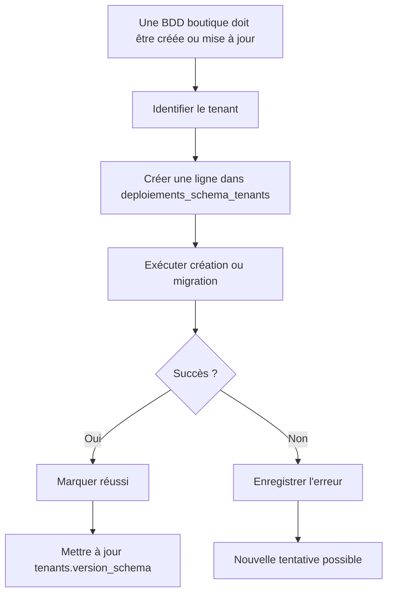

## 6. Entrée / sortie

**Entrée :** boutique + version de BDD souhaitée.

**Sortie :** BDD créée/mise à jour ou erreur enregistrée.

## 7. Version courte

> C9 garde l'historique technique des BDD boutiques. Il permet de savoir si une base a été créée correctement, quelle version elle utilise et quelles erreurs ont eu lieu.

---

# C10 — Identité légale du vendeur

## 1. Rôle

C10 conserve les informations légales du propriétaire utilisées dans les documents.

## 2. Table

- `entites_legales`

## 3. Tables externes

- `users` — C1.
- `revisions_commandes` — T8.
- `factures` — T17.
- `regles_facturation` — C14.

## 4. Fonctionnement simple

Exemple : **le propriétaire remplit ses informations légales.**

1. `users` indique quel propriétaire est concerné.
2. `entites_legales` garde ses informations légales.
3. Le système vérifie si elles sont correctes.
4. Si elles ne sont pas correctes → il doit les corriger.
5. Si elles sont correctes → elles peuvent être utilisées dans les documents.
6. Quand une facture est créée, on garde une copie des informations utilisées ce jour-là.
7. Si le propriétaire change ses informations plus tard, l’ancienne facture ne change pas.

**En très simple :** C10 garde l’identité légale du vendeur et empêche les anciens documents de changer après coup.

## 5. Diagramme

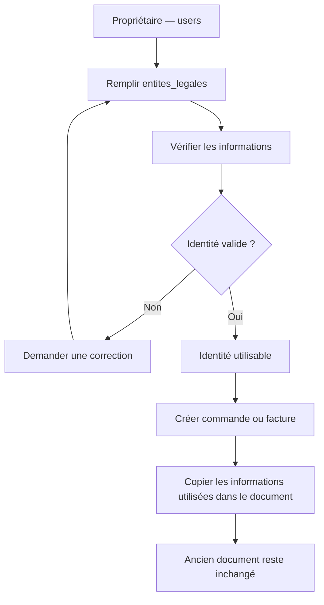

## 6. Entrée / sortie

**Entrée :** informations du vendeur.

**Sortie :** identité légale utilisable dans les documents.

## 7. Version courte

> C10 contient l'identité légale du commerçant. Lorsqu'un document est émis, les informations utilisées sont figées afin qu'une modification future du profil ne change pas les anciens documents.

---

# C11 — Politiques et exécutions de conservation

## 1. Rôle

C11 décide combien de temps certaines données doivent rester conservées et suit les traitements réalisés.

## 2. Tables

- `politiques_retention`
- `executions_retention`

## 3. Tables externes

- `tenants` — C1.
- `sauvegardes_tenants` — C12.
- `journal_operations_donnees_personnelles_central` — C14.
- `journal_operations_donnees_personnelles` — T21.

## 4. Fonctionnement simple

Exemple : **certaines données sont devenues anciennes.**

1. `politiques_retention` dit **combien de temps on doit garder ces données** et quoi faire ensuite.
2. Le système cherche les données concernées.
3. Il vérifie : **est-ce qu’on doit encore les garder ?**
4. Si oui → il ne touche à rien.
5. Si non → il peut les anonymiser ou les supprimer selon la règle.
6. `executions_retention` garde une trace de ce qui a été fait.
7. C14 ou T21 garde aussi une trace de l’opération sur les données personnelles.

**En très simple :** C11 décide quand une donnée peut rester, être cachée/anonymisée ou être supprimée.

## 5. Diagramme

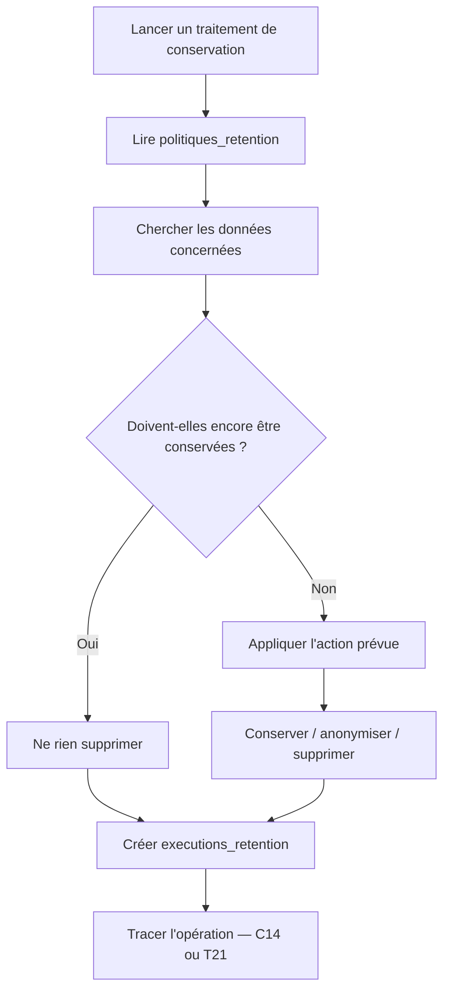

## 6. Entrée / sortie

**Entrée :** politique + données concernées.

**Sortie :** traitement effectué et enregistré.

## 7. Version courte

> C11 gère la durée de conservation des données. Il vérifie quelles données peuvent être conservées, anonymisées ou supprimées et garde une trace de chaque traitement effectué.

---

# C12 — Sauvegardes, restaurations et reprise

## 1. Rôle

C12 gère :

- les sauvegardes des BDD boutiques ;
- les restaurations ;
- les contrôles après restauration ;
- les références des documents déjà émis.

## 2. Tables

- `configurations_sauvegardes`
- `limites_sauvegardes_plans`
- `sauvegardes_tenants`
- `restaurations_tenants`
- `operations_centrales_tenants`
- `registre_documents_emis`

## 3. Tables externes

- `tenants` — C1.
- `plans` — C4.
- `deploiements_schema_tenants` — C9.
- `factures` — T17.
- `sequences_documents` — T20.

## 4. Fonctionnement simple

Exemple : **on veut remettre une ancienne sauvegarde d’une boutique.**

### Sauvegarde

1. `configurations_sauvegardes` dit quand faire la sauvegarde.
2. `limites_sauvegardes_plans` vérifie ce que le plan autorise.
3. La sauvegarde est créée et enregistrée dans `sauvegardes_tenants`.

### Restauration

1. `restaurations_tenants` enregistre la demande.
2. La boutique est temporairement bloquée pour éviter de nouvelles modifications.
3. L’ancienne sauvegarde est remise en place.
4. C9 vérifie que la BDD fonctionne avec la bonne structure.
5. `operations_centrales_tenants` et `registre_documents_emis` vérifient ce qui s’est passé après cette ancienne sauvegarde.
6. Si tout correspond → la boutique est réactivée.
7. Si quelque chose ne correspond pas → elle reste bloquée jusqu’à correction.

**En très simple :** C12 remet une sauvegarde sans oublier ce qui s’est passé après cette sauvegarde.

## 5. Diagramme

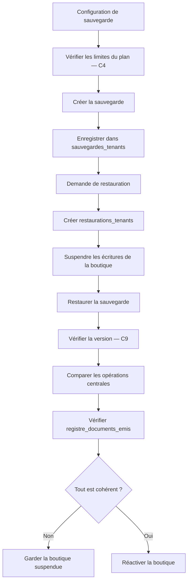

## 6. Entrée / sortie

**Entrée :** configuration, sauvegarde ou demande de restauration.

**Sortie :** sauvegarde disponible ou boutique restaurée correctement.

## 7. Version courte

> C12 gère les sauvegardes et les restaurations. Après une restauration, on ne remet pas simplement un ancien fichier : on vérifie aussi les opérations et documents créés entre-temps avant de réactiver la boutique.

---

# C13 — Facturation du SaaS au commerçant

## 1. Rôle

Attention : C13 ne concerne pas les commandes des clients.

C13 sert à **facturer le commerçant pour l'utilisation du SaaS**.

## 2. Tables

- `sequences_facturation_saas`
- `factures_saas`
- `lignes_factures_saas`
- `avoirs_saas`
- `lignes_avoirs_saas`
- `transmissions_documents_saas`

## 3. Tables externes

- `abonnements` — C4.
- `echeances_abonnement` — C5.
- `entites_legales` — C10.
- `regles_facturation` — C14.
- `registre_documents_emis` — C12.

## 4. Fonctionnement simple

Exemple : **le SaaS doit envoyer une facture d’abonnement au commerçant.**

1. C5 dit combien le commerçant doit payer.
2. C14 dit quelle règle de facturation utiliser.
3. `factures_saas` crée la facture.
4. `lignes_factures_saas` détaille ce qui est facturé.
5. C10 donne les informations légales du commerçant.
6. `sequences_facturation_saas` donne le prochain numéro de facture.
7. La facture est enregistrée et ne doit plus être modifiée.
8. `transmissions_documents_saas` suit son envoi.
9. S’il faut corriger une facture déjà envoyée, on crée un `avoirs_saas` au lieu de modifier l’ancienne facture.

**En très simple :** C13 crée et envoie la facture que le commerçant paie pour utiliser le SaaS.

## 5. Diagramme

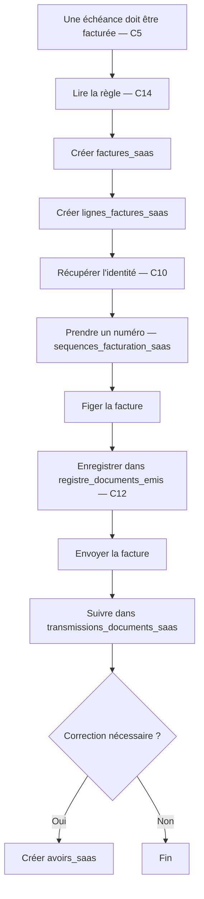

## 6. Entrée / sortie

**Entrée :** abonnement + échéance + règle de facturation.

**Sortie :** facture SaaS ou avoir.

## 7. Version courte

> C13 sert à facturer le commerçant pour l'utilisation de notre SaaS. La facture possède un numéro, des lignes et une identité figée. Une facture déjà émise n'est plus modifiée : une correction passe par un avoir.

---

# C14 — Règles de facturation et gouvernance des données

## 1. Rôle

C14 possède deux parties principales :

### Partie 1
Conserver les règles utilisées pour la facturation.

### Partie 2
Documenter et tracer certains traitements de données personnelles.

## 2. Tables

- `regles_facturation`
- `registre_activites_traitement`
- `journal_operations_donnees_personnelles_central`

## 3. Tables externes

- `entites_legales` — C10.
- `factures_saas` — C13.
- `obligations_facturation` — T22.
- `journal_operations_donnees_personnelles` — T21.
- `politiques_retention` — C11.

## 4. Fonctionnement simple

C14 fait **deux choses différentes**.

### 1 — Règles de facturation

1. `regles_facturation` garde les règles à utiliser pour créer les factures.
2. Avant de créer une facture, C13 ou T22 vérifie si la bonne règle est validée.
3. Si elle est validée → la facture peut continuer.
4. Sinon → la facture est bloquée.

### 2 — Données personnelles

1. `registre_activites_traitement` explique **quelles données sont utilisées et pourquoi**.
2. C11 applique les règles de conservation si nécessaire.
3. Si une action est faite sur les données centrales, `journal_operations_donnees_personnelles_central` garde la trace.
4. Si l’action concerne seulement une boutique, la trace est gardée dans T21.

**En très simple :** C14 garde les règles de facturation et explique ce qui est fait avec les données personnelles.

## 5. Diagramme

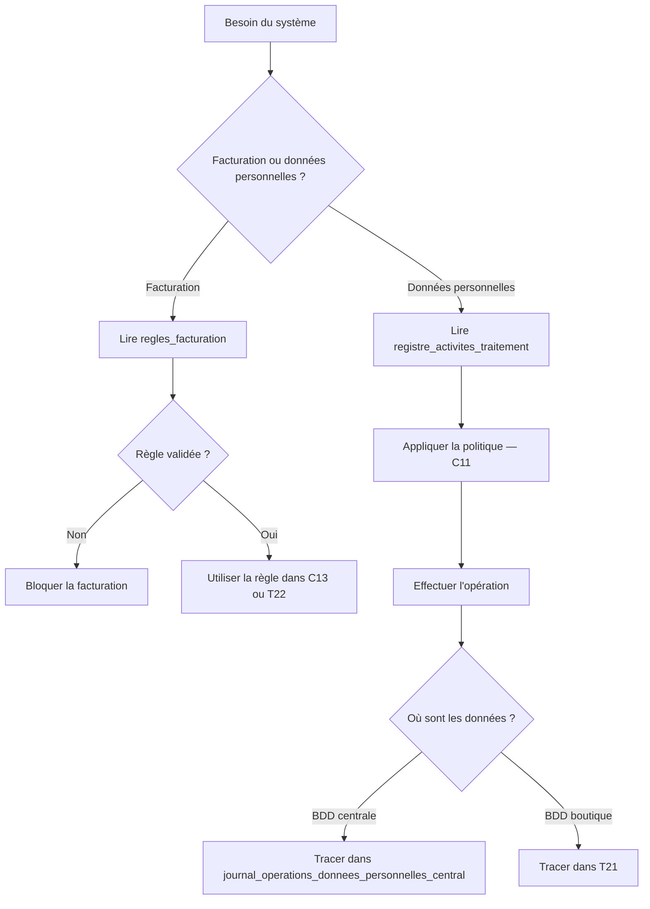

## 6. Entrée / sortie

**Entrée :** règle de facturation ou traitement de données.

**Sortie :** règle appliquée ou opération de données tracée.

## 7. Version courte

> C14 contient les règles utilisées par la facturation et les informations sur les traitements de données personnelles. Il distingue ce qui est prévu par les règles de ce qui a réellement été exécuté et enregistré.

---

# Vue globale C1 → C14

# Résumé extrêmement simple

| Module | À quoi il sert |
|---|---|
| **C1** | Savoir qui sont les utilisateurs et quelles boutiques leur appartiennent |
| **C2** | Savoir ce qu'un utilisateur a le droit de faire |
| **C3** | Gérer les invitations, droits exceptionnels et restrictions des administrateurs centraux |
| **C4** | Gérer les plans, abonnements, fonctionnalités et quotas |
| **C5** | Suivre certaines consommations, paiements SaaS et wilayas/communes |
| **C6** | Garder les traces des actions importantes |
| **C7** | Gérer les comptes et tarifs des transporteurs |
| **C8** | Envoyer les colis et reversements vers la bonne boutique |
| **C9** | Créer et mettre à jour techniquement les BDD boutiques |
| **C10** | Conserver l'identité légale du commerçant |
| **C11** | Gérer la conservation, anonymisation ou suppression des données |
| **C12** | Sauvegarder et restaurer les BDD boutiques |
| **C13** | Facturer l'utilisation du SaaS au commerçant |
| **C14** | Conserver les règles de facturation et tracer les traitements de données |
