# BDD centrale — Présentation des modules C1 à C14

Les modules **C1 à C14 sont des groupes fonctionnels de la même BDD centrale `saas_central`**.

Ce ne sont pas 14 bases de données différentes.

---

# C1 — Identités et boutiques

## 1. Rôle

C1 répond surtout à 4 questions :

- Qui est l'utilisateur ?
- Quelle boutique lui appartient ?
- Dans quelles boutiques travaille-t-il ?
- Quelle adresse web appartient à quelle boutique ?

## 2. Tables

- `users` : les comptes des utilisateurs.
- `tenants` : les boutiques.
- `membres_tenants` : indique quels utilisateurs font partie de quelles boutiques.
- `domains` : les adresses web des boutiques.

## 3. Tables venant d'autres modules

- `abonnements`, `plans_fonctionnalites` — C4 : savoir combien de boutiques le propriétaire peut créer.
- `deploiements_schema_tenants` — C9 : suivre la création technique de la BDD boutique.
- `boutique` — T1 : informations locales de la boutique dans sa propre BDD.

## 4. Fonctionnement simple

Exemple : **un propriétaire veut créer une boutique.**

1. `users` vérifie quel utilisateur est connecté.
2. C4 vérifie combien de boutiques son abonnement lui permet d’avoir.
3. S’il a encore une place, `tenants` crée la nouvelle boutique.
4. `membres_tenants` relie le propriétaire à cette boutique.
5. C9 crée réellement la BDD séparée de la boutique et ses tables.
6. `domains` ajoute l’adresse web de la boutique.
7. Quand tout est prêt, la boutique peut être utilisée.

En résumé : **C1 crée la boutique et la relie à son propriétaire.**

## 5. Diagramme

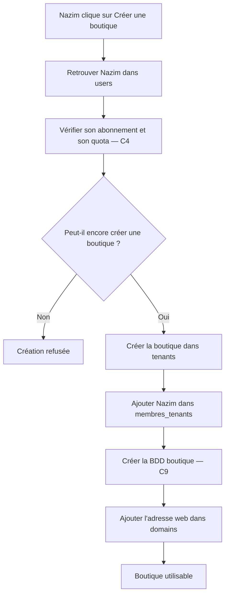

## 6. Entrée / sortie

**Entrée :** un utilisateur veut créer une boutique.

**Sortie :** une boutique dans `tenants`, son propriétaire dans `membres_tenants`, sa BDD et son domaine.

## 7. Version orale

> C1 gère les utilisateurs et les boutiques. Quand un propriétaire crée une boutique, on vérifie d'abord son compte et son quota. Ensuite on crée la boutique dans `tenants`, on relie le propriétaire avec `membres_tenants`, on crée sa BDD et on lui associe son domaine.

---

# C2 — Permissions

## 1. Rôle

C2 décide **ce qu'un utilisateur a le droit de faire**.

Par exemple :

- voir les commandes ;
- modifier les produits ;
- gérer le stock ;
- administrer une boutique.

## 2. Tables

- `fonctionnalites` : fonctionnalités disponibles dans le SaaS.
- `permissions` : actions précises possibles.
- `roles` : groupes de permissions.
- `roles_permissions` : permissions données à chaque rôle.
- `users_roles` : rôles généraux d'un utilisateur sur la plateforme.
- `membres_roles` : rôles d'un membre dans une boutique.

## 3. Tables externes

- `users`, `tenants`, `membres_tenants` — C1.
- `exceptions_permissions` — C3.
- `abonnements`, `plans_fonctionnalites` — C4.

## 4. Fonctionnement simple

Exemple : **un collaborateur veut modifier un produit.**

1. `users` vérifie qui est le collaborateur.
2. `membres_tenants` vérifie qu’il fait bien partie de cette boutique.
3. `membres_roles` regarde son rôle, par exemple **vendeur**.
4. `roles_permissions` regarde ce que ce rôle a le droit de faire.
5. C3 vérifie s’il existe une règle spéciale pour cette personne, par exemple lui retirer un droit.
6. C4 vérifie aussi si l’abonnement de la boutique permet d’utiliser cette fonction.
7. Si tout est autorisé, l’action continue. Sinon, elle est refusée.

En résumé : **C2 répond à la question : “Est-ce que cette personne a le droit de faire cette action ?”**

## 5. Diagramme

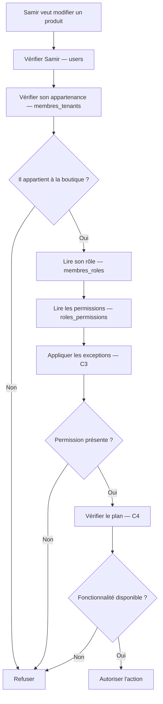

## 6. Entrée / sortie

**Entrée :** utilisateur + boutique + action.

**Sortie :** autorisé ou refusé.

## 7. Version orale

> C2 contrôle les droits. On regarde dans quelle boutique travaille la personne, son rôle et les permissions de ce rôle. Ensuite on applique les éventuelles exceptions et les limites du plan avant d'autoriser l'action.

---

# C3 — Exceptions et accès administratifs

## 1. Rôle

C3 gère les cas particuliers liés aux accès.

Par exemple :

- inviter un nouveau membre ;
- donner exceptionnellement une permission ;
- retirer exceptionnellement une permission ;
- permettre à un administrateur d'aider temporairement une boutique.

## 2. Tables

- `exceptions_permissions`
- `restrictions_admins`
- `invitations_equipes`
- `sessions_assistance`

## 3. Tables externes

- `users`, `tenants`, `membres_tenants` — C1.
- `roles`, `permissions`, `membres_roles` — C2.
- `journal_audit_central` — C6.

## 4. Fonctionnement simple

C3 gère les **cas spéciaux d’accès**.

1. `exceptions_permissions` peut donner ou retirer un droit précis à une personne, parfois seulement pendant une période.
2. `invitations_equipes` sert quand le propriétaire veut inviter un collaborateur dans sa boutique.
3. Quand l’invitation est acceptée, C1 ajoute la personne dans `membres_tenants` et C2 lui donne son rôle dans `membres_roles`.
4. `restrictions_admins` sert à limiter un administrateur SaaS : par exemple lui interdire certaines actions sur une boutique ou un utilisateur précis.
5. `sessions_assistance` permet à un administrateur SaaS d’entrer temporairement dans le contexte d’une boutique pour l’aider.
6. Pendant cette assistance, ses droits sont toujours vérifiés : il ne récupère pas automatiquement tous les droits du commerçant.
7. C6 garde une trace des actions importantes réalisées.

En résumé : **C3 gère les invitations, les droits spéciaux et l’assistance des administrateurs SaaS.**

## 5. Diagramme

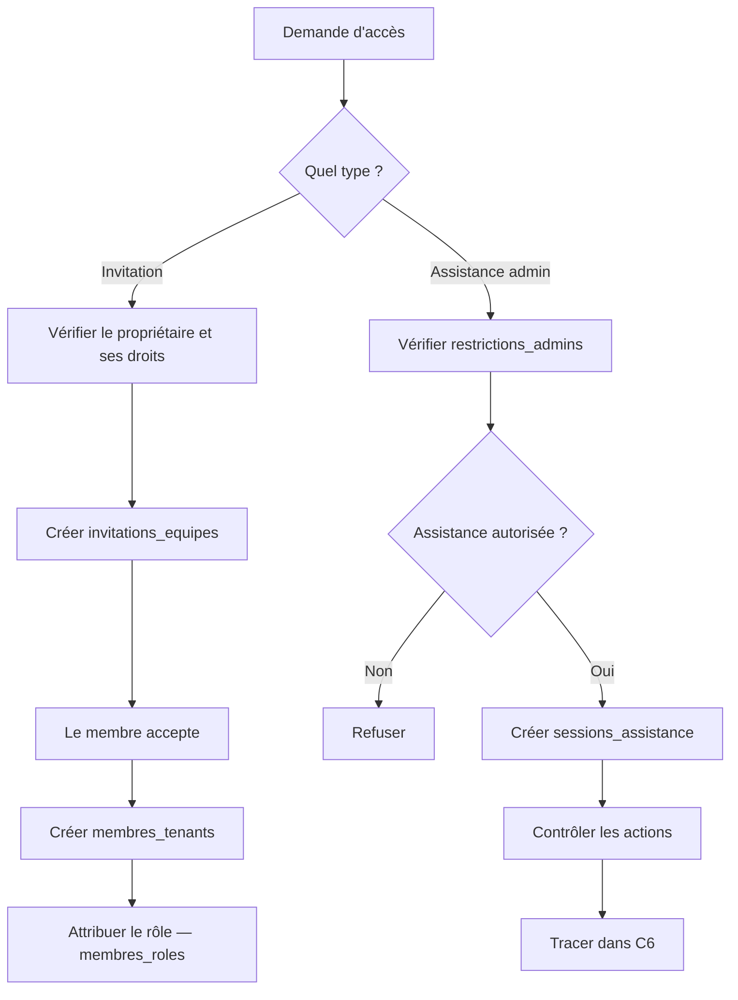

## 6. Entrée / sortie

**Entrée :** invitation, exception ou demande d'assistance.

**Sortie :** accès créé, accès temporaire ou refus.

## 7. Version orale

> C3 gère les accès particuliers. Il permet par exemple d'inviter un collaborateur ou d'ouvrir temporairement une session d'assistance pour un administrateur. Les permissions restent contrôlées et les actions importantes sont tracées.

---

# C4 — Plans et abonnements

## 1. Rôle

C4 décide **ce qu'un propriétaire peut utiliser selon son abonnement**.

Exemple :

- plan Gratuit = 1 boutique ;
- plan Pro = plusieurs boutiques ;
- certaines fonctionnalités disponibles uniquement dans certains plans.

## 2. Tables

- `plans`
- `plans_fonctionnalites`
- `abonnements`
- `exceptions_fonctionnalites`

## 3. Tables externes

- `users`, `tenants` — C1.
- `fonctionnalites` — C2.
- `reglements_abonnement` — C5.

## 4. Fonctionnement simple

Exemple : **un propriétaire veut utiliser une fonction ou créer une nouvelle boutique.**

1. `abonnements` indique quel abonnement il possède.
2. `plans` indique le plan concerné, par exemple **Gratuit** ou **Pro**.
3. `plans_fonctionnalites` dit ce que ce plan autorise.
4. Exemple : le plan Gratuit peut autoriser 1 boutique et le plan Pro 3 boutiques.
5. `exceptions_fonctionnalites` peut exceptionnellement changer une limite ou activer/désactiver une fonction pour ce propriétaire.
6. Le système compare ensuite ce qui est demandé avec ce que le plan autorise.
7. Si l’abonnement payant est terminé, le plan gratuit prend le relais.

En résumé : **C4 répond à la question : “Est-ce que son abonnement lui permet d’utiliser cette fonction ou ce quota ?”**

## 5. Diagramme

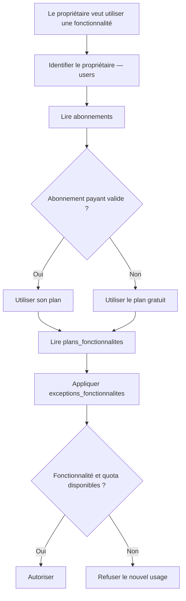

## 6. Entrée / sortie

**Entrée :** propriétaire + fonctionnalité demandée.

**Sortie :** fonctionnalités et quotas autorisés.

## 7. Version orale

> C4 gère les abonnements. Il regarde quel plan possède le propriétaire et quelles fonctionnalités ou limites sont prévues par ce plan. Si le payant expire, le gratuit prend le relais.

---

# C5 — Suivi SaaS et référentiel

## 1. Rôle

C5 contient **trois services différents** :

1. suivre certaines consommations ;
2. suivre les montants d'abonnement à payer ;
3. stocker les wilayas et communes.

Ces trois parties ne représentent pas une seule chaîne.

## 2. Tables

- `consommations_fonctionnalites`
- `echeances_abonnement`
- `reglements_abonnement`
- `wilayas`
- `communes`

## 3. Tables externes

- `fonctionnalites` — C2.
- `abonnements` — C4.
- `tenants` — C1.
- `factures_saas` — C13.
- `revisions_commandes` — T8.

## 4. Fonctionnement simple

C5 contient **trois petits services différents**.

1. Pour un quota, `consommations_fonctionnalites` garde la quantité utilisée et C4 la compare à la limite autorisée.
2. Pour l’abonnement, `echeances_abonnement` indique combien le commerçant doit payer.
3. `reglements_abonnement` indique combien il a réellement payé.
4. Le système peut alors savoir combien il reste à payer.
5. Pour une adresse, `wilayas` contient les wilayas et `communes` contient leurs communes.
6. Le système vérifie par exemple qu’une commune appartient bien à la wilaya choisie.

En résumé : **C5 suit certains quotas, les paiements d’abonnement et les wilayas/communes.**

## 5. Diagramme

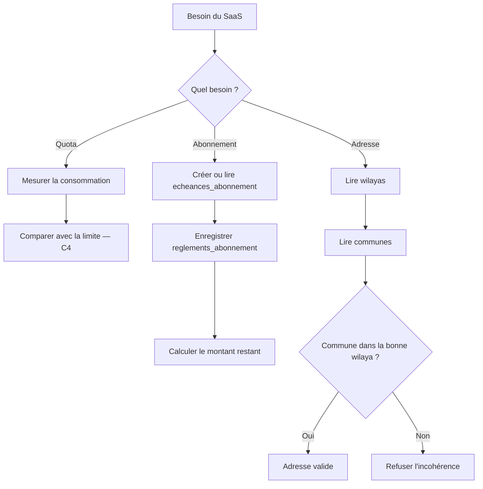

## 6. Entrée / sortie

**Entrée :** consommation, paiement ou adresse.

**Sortie :** quota mesuré, état du paiement ou localisation validée.

## 7. Version orale

> C5 rassemble trois petits services communs : le suivi de certaines consommations, le suivi des paiements d'abonnement et le référentiel des wilayas et communes.

---

# C6 — Audit SaaS

## 1. Rôle

C6 permet surtout de :

- garder une trace des actions sensibles ;
- vérifier un numéro de téléphone ou un canal de contact.

## 2. Tables

- `journal_audit_central`
- `verifications_contacts`

## 3. Tables externes

- `users` — C1.
- `tenants` — C1.
- `sessions_assistance` — C3.

## 4. Fonctionnement simple

C6 fait surtout **deux choses**.

1. Quand une action importante est faite, `journal_audit_central` garde une trace.
2. Cette trace indique par exemple qui a fait l’action, quand et sur quoi.
3. Pour vérifier un téléphone ou WhatsApp, `verifications_contacts` crée un code temporaire.
4. L’utilisateur reçoit puis saisit ce code.
5. Le système vérifie que le code est correct et pas expiré.
6. S’il est valide, le contact est marqué comme vérifié.

En résumé : **C6 garde les traces importantes et vérifie les contacts.**

## 5. Diagramme

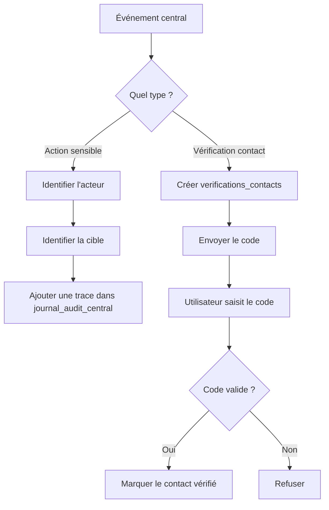

## 6. Entrée / sortie

**Entrée :** action sensible ou vérification de contact.

**Sortie :** trace d'audit ou contact vérifié.

## 7. Version orale

> C6 sert à savoir qui a effectué une action importante dans le SaaS. Il sert également à gérer les codes temporaires utilisés pour vérifier les contacts.

---

# C7 — Comptes transporteur et tarifs versionnés

## 1. Rôle

C7 gère les comptes utilisés pour communiquer avec les transporteurs.

Un même propriétaire peut utiliser le même compte transporteur pour plusieurs de ses boutiques.

## 2. Tables

- `comptes_livraison`
- `boutiques_comptes_livraison`
- `tarifs_transporteur`

## 3. Tables externes

- `users`, `tenants` — C1.
- `prestataires_livraison` — T10.
- `frais_transporteur` — T16.

## 4. Fonctionnement simple

Exemple : **un propriétaire veut utiliser le même compte transporteur pour plusieurs boutiques.**

1. `comptes_livraison` enregistre son compte transporteur.
2. `boutiques_comptes_livraison` indique quelles boutiques peuvent utiliser ce compte.
3. Le système vérifie que ces boutiques appartiennent bien au même propriétaire.
4. Quand une boutique veut créer une livraison, elle utilise ce compte si l’association est autorisée.
5. `tarifs_transporteur` garde les tarifs avec leurs dates de validité.
6. Si le tarif change plus tard, un ancien retour garde le tarif qui était valable à sa date.
7. Le montant réellement appliqué est ensuite gardé dans T16.

En résumé : **C7 partage correctement un compte transporteur entre les boutiques du même propriétaire et garde l’historique des tarifs.**

## 5. Diagramme

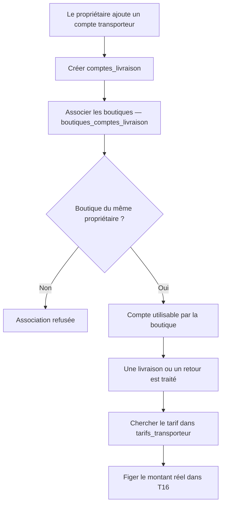

## 6. Entrée / sortie

**Entrée :** compte transporteur + boutique.

**Sortie :** compte autorisé et tarif applicable.

## 7. Version orale

> C7 centralise les comptes transporteur. Plusieurs boutiques du même propriétaire peuvent utiliser le même compte. Les anciens tarifs restent conservés pour éviter qu'un changement de prix modifie l'historique.

---

# C8 — Routage des colis et règlements partagés

## 1. Rôle

C8 est important lorsqu'un **même compte transporteur sert plusieurs boutiques**.

Il faut alors savoir :

- à quelle boutique appartient chaque colis ;
- combien d'argent revient à chaque boutique.

## 2. Tables

- `registre_colis_transporteur`
- `lots_reversement_transporteur`
- `parts_reversement_tenants`

## 3. Tables externes

- `comptes_livraison` — C7.
- `boutiques_comptes_livraison` — C7.
- `livraisons` — T11.
- `bordereaux_reversement` — T13.

## 4. Fonctionnement simple

Exemple : **deux boutiques utilisent le même compte transporteur.**

1. Quand le transporteur parle d’un colis, `registre_colis_transporteur` indique à quelle boutique ce colis appartient.
2. L’information est alors envoyée vers la bonne BDD boutique.
3. Si le transporteur verse une grosse somme pour plusieurs boutiques, `lots_reversement_transporteur` garde le montant total.
4. `parts_reversement_tenants` découpe ce total entre les boutiques.
5. Le système vérifie que toutes les parts réunies donnent bien le montant total reçu.
6. Chaque part est ensuite envoyée une seule fois vers la bonne boutique.

En résumé : **C8 évite de mélanger les colis et l’argent de plusieurs boutiques qui utilisent le même compte transporteur.**

## 5. Diagramme

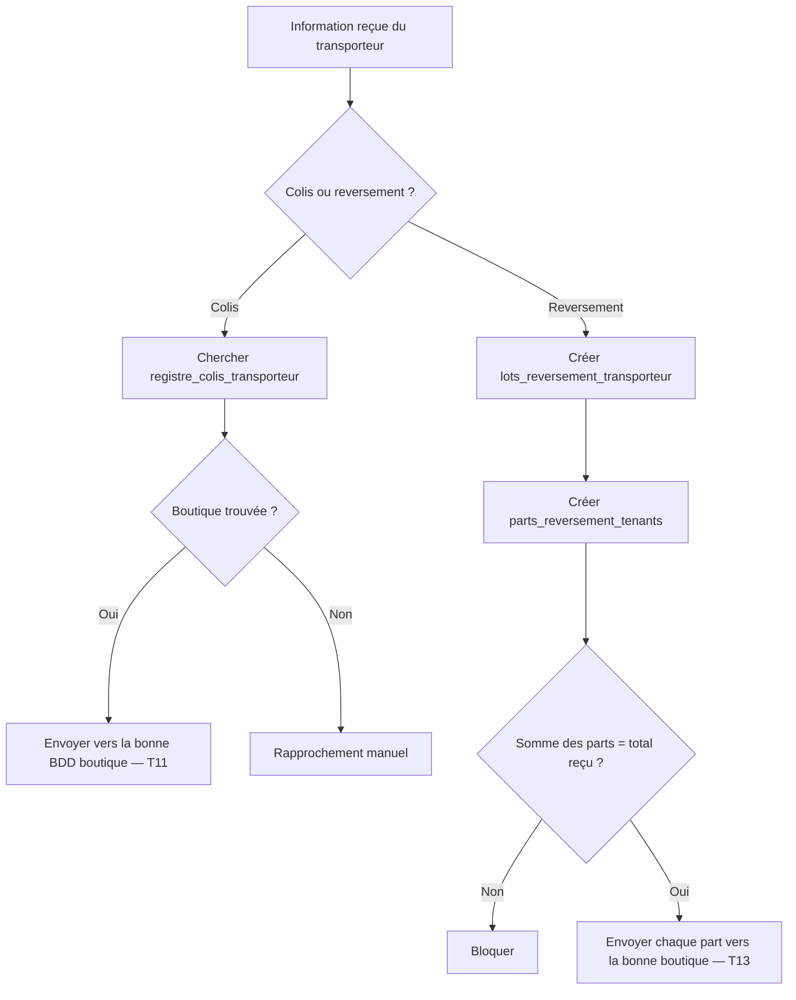

## 6. Entrée / sortie

**Entrée :** colis ou argent reçu du transporteur.

**Sortie :** information envoyée à la bonne boutique.

## 7. Version orale

> C8 évite de mélanger les colis et l'argent lorsque plusieurs boutiques utilisent le même compte transporteur. Chaque colis et chaque part de reversement sont rattachés à la bonne boutique.

---

# C9 — Historique des déploiements des BDD

## 1. Rôle

C9 suit techniquement la création et les mises à jour des BDD boutiques.

## 2. Table

- `deploiements_schema_tenants`

## 3. Tables externes

- `tenants` — C1.
- `restaurations_tenants` — C12.
- `migrations` — table technique dans chaque BDD boutique.

## 4. Fonctionnement simple

Exemple : **une BDD boutique doit être créée ou mise à jour.**

1. C9 identifie la boutique concernée avec `tenants`.
2. `deploiements_schema_tenants` crée une ligne pour suivre l’opération.
3. Le système lance la création de la BDD ou la mise à jour de ses tables.
4. Si tout réussit, l’opération est marquée comme réussie.
5. `tenants.version_schema` est alors mise à jour.
6. Si ça échoue, l’erreur reste enregistrée.
7. Une nouvelle tentative peut ensuite être lancée.

En résumé : **C9 garde l’historique de la création et des mises à jour techniques de chaque BDD boutique.**

## 5. Diagramme

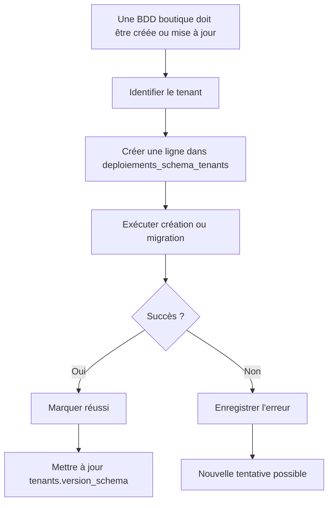

## 6. Entrée / sortie

**Entrée :** boutique + version de BDD souhaitée.

**Sortie :** BDD créée/mise à jour ou erreur enregistrée.

## 7. Version orale

> C9 garde l'historique technique des BDD boutiques. Il permet de savoir si une base a été créée correctement, quelle version elle utilise et quelles erreurs ont eu lieu.

---

# C10 — Identité légale du vendeur

## 1. Rôle

C10 conserve les informations légales du propriétaire utilisées dans les documents.

## 2. Table

- `entites_legales`

## 3. Tables externes

- `users` — C1.
- `revisions_commandes` — T8.
- `factures` — T17.
- `regles_facturation` — C14.

## 4. Fonctionnement simple

Exemple : **le propriétaire renseigne ses informations légales.**

1. `users` indique quel propriétaire est concerné.
2. `entites_legales` enregistre ses informations légales.
3. Le système vérifie si ces informations sont complètes et valides.
4. Si elles ne le sont pas, le propriétaire doit les corriger.
5. Si elles sont validées, elles peuvent être utilisées dans les factures et autres documents.
6. Quand un document est créé, on garde une copie des informations utilisées à ce moment-là.
7. Si le propriétaire change ses informations plus tard, les anciens documents ne changent pas.

En résumé : **C10 garde l’identité légale du vendeur et protège l’historique des anciens documents.**

## 5. Diagramme

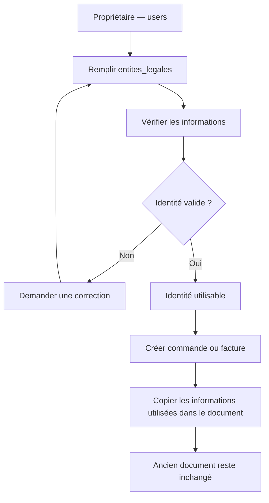

## 6. Entrée / sortie

**Entrée :** informations du vendeur.

**Sortie :** identité légale utilisable dans les documents.

## 7. Version orale

> C10 contient l'identité légale du commerçant. Lorsqu'un document est émis, les informations utilisées sont figées afin qu'une modification future du profil ne change pas les anciens documents.

---

# C11 — Politiques et exécutions de conservation

## 1. Rôle

C11 décide combien de temps certaines données doivent rester conservées et suit les traitements réalisés.

## 2. Tables

- `politiques_retention`
- `executions_retention`

## 3. Tables externes

- `tenants` — C1.
- `sauvegardes_tenants` — C12.
- `journal_operations_donnees_personnelles_central` — C14.
- `journal_operations_donnees_personnelles` — T21.

## 4. Fonctionnement simple

Exemple : **certaines données sont arrivées à la fin de leur durée de conservation.**

1. `politiques_retention` indique combien de temps garder ces données et quoi faire ensuite.
2. Le système cherche les données concernées.
3. Il vérifie d’abord si elles doivent encore être conservées pour une autre raison.
4. Si oui, il ne les supprime pas.
5. Sinon, il applique l’action prévue : garder, anonymiser ou supprimer.
6. `executions_retention` enregistre ce qui a réellement été fait.
7. C14 ou T21 garde aussi une trace de l’opération.

En résumé : **C11 décide quand les données peuvent être gardées, anonymisées ou supprimées.**

## 5. Diagramme

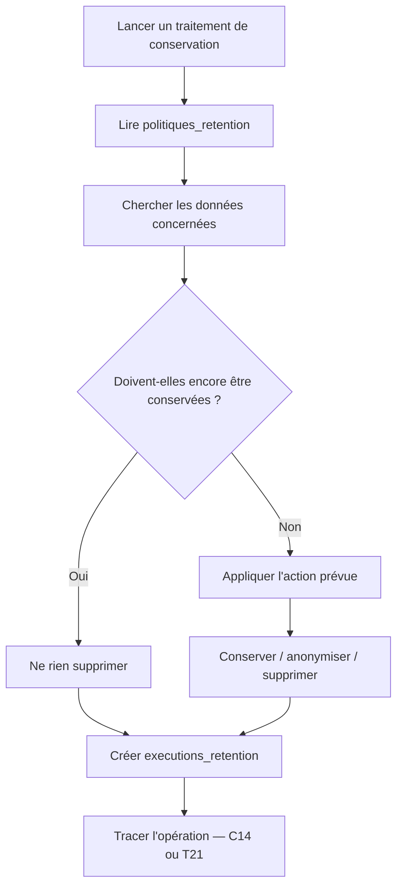

## 6. Entrée / sortie

**Entrée :** politique + données concernées.

**Sortie :** traitement effectué et enregistré.

## 7. Version orale

> C11 gère la durée de conservation des données. Il vérifie quelles données peuvent être conservées, anonymisées ou supprimées et garde une trace de chaque traitement effectué.

---

# C12 — Sauvegardes, restaurations et reprise

## 1. Rôle

C12 gère :

- les sauvegardes des BDD boutiques ;
- les restaurations ;
- les contrôles après restauration ;
- les références des documents déjà émis.

## 2. Tables

- `configurations_sauvegardes`
- `limites_sauvegardes_plans`
- `sauvegardes_tenants`
- `restaurations_tenants`
- `operations_centrales_tenants`
- `registre_documents_emis`

## 3. Tables externes

- `tenants` — C1.
- `plans` — C4.
- `deploiements_schema_tenants` — C9.
- `factures` — T17.
- `sequences_documents` — T20.

## 4. Fonctionnement simple

Exemple : **une boutique doit être restaurée avec une ancienne sauvegarde.**

1. `configurations_sauvegardes` indique quand faire les sauvegardes.
2. `limites_sauvegardes_plans` vérifie ce que le plan autorise.
3. Chaque sauvegarde réussie est enregistrée dans `sauvegardes_tenants`.
4. Pour restaurer, `restaurations_tenants` enregistre la demande et la boutique est temporairement bloquée en écriture.
5. La sauvegarde est remise en place.
6. C9 vérifie que la structure de la BDD est correcte.
7. `operations_centrales_tenants` et `registre_documents_emis` servent à retrouver ce qui s’est passé après cette ancienne sauvegarde.
8. Si tout redevient cohérent, la boutique est réactivée. Sinon, elle reste bloquée.

En résumé : **C12 sauvegarde les boutiques et vérifie qu’une restauration ne fait pas perdre des opérations récentes.**

## 5. Diagramme

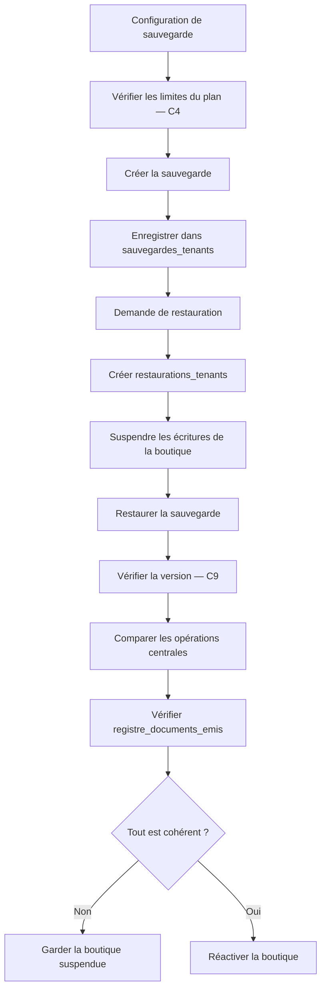

## 6. Entrée / sortie

**Entrée :** configuration, sauvegarde ou demande de restauration.

**Sortie :** sauvegarde disponible ou boutique restaurée correctement.

## 7. Version orale

> C12 gère les sauvegardes et les restaurations. Après une restauration, on ne remet pas simplement un ancien fichier : on vérifie aussi les opérations et documents créés entre-temps avant de réactiver la boutique.

---

# C13 — Facturation du SaaS au commerçant

## 1. Rôle

Attention : C13 ne concerne pas les commandes des clients.

C13 sert à **facturer le commerçant pour l'utilisation du SaaS**.

## 2. Tables

- `sequences_facturation_saas`
- `factures_saas`
- `lignes_factures_saas`
- `avoirs_saas`
- `lignes_avoirs_saas`
- `transmissions_documents_saas`

## 3. Tables externes

- `abonnements` — C4.
- `echeances_abonnement` — C5.
- `entites_legales` — C10.
- `regles_facturation` — C14.
- `registre_documents_emis` — C12.

## 4. Fonctionnement simple

Exemple : **le SaaS doit facturer l’abonnement d’un commerçant.**

1. C5 indique le montant d’abonnement à facturer avec `echeances_abonnement`.
2. C14 indique quelle règle de facturation utiliser.
3. `factures_saas` crée la facture.
4. `lignes_factures_saas` détaille ce qui est facturé.
5. C10 fournit l’identité du commerçant et `sequences_facturation_saas` donne le prochain numéro.
6. La facture est ensuite figée et enregistrée dans `registre_documents_emis`.
7. `transmissions_documents_saas` suit son envoi.
8. Si une facture déjà émise doit être corrigée, on crée un `avoirs_saas` au lieu de modifier l’ancienne facture.

En résumé : **C13 facture l’utilisation du SaaS au commerçant.**

## 5. Diagramme

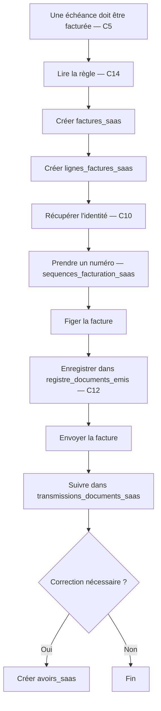

## 6. Entrée / sortie

**Entrée :** abonnement + échéance + règle de facturation.

**Sortie :** facture SaaS ou avoir.

## 7. Version orale

> C13 sert à facturer le commerçant pour l'utilisation de notre SaaS. La facture possède un numéro, des lignes et une identité figée. Une facture déjà émise n'est plus modifiée : une correction passe par un avoir.

---

# C14 — Règles de facturation et gouvernance des données

## 1. Rôle

C14 possède deux parties principales :

### Partie 1
Conserver les règles utilisées pour la facturation.

### Partie 2
Documenter et tracer certains traitements de données personnelles.

## 2. Tables

- `regles_facturation`
- `registre_activites_traitement`
- `journal_operations_donnees_personnelles_central`

## 3. Tables externes

- `entites_legales` — C10.
- `factures_saas` — C13.
- `obligations_facturation` — T22.
- `journal_operations_donnees_personnelles` — T21.
- `politiques_retention` — C11.

## 4. Fonctionnement simple

C14 contient **deux parties différentes**.

1. Pour la facturation, `regles_facturation` contient les règles à utiliser.
2. Avant de créer une facture, C13 ou T22 vérifie que la règle est bien validée.
3. Si elle ne l’est pas, la facture est bloquée.
4. Pour les données personnelles, `registre_activites_traitement` explique quelles données sont utilisées et pourquoi.
5. C11 peut appliquer les règles de conservation correspondantes.
6. Si une action est faite sur les données centrales, `journal_operations_donnees_personnelles_central` garde la trace.
7. Si l’action concerne seulement une boutique, la trace est gardée dans T21.

En résumé : **C14 garde les règles de facturation et les traces importantes liées aux données personnelles.**

## 5. Diagramme

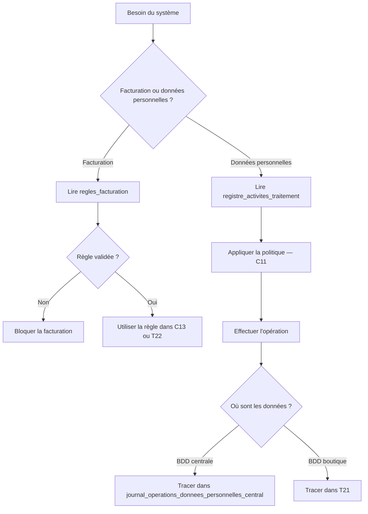

## 6. Entrée / sortie

**Entrée :** règle de facturation ou traitement de données.

**Sortie :** règle appliquée ou opération de données tracée.

## 7. Version orale

> C14 contient les règles utilisées par la facturation et les informations sur les traitements de données personnelles. Il distingue ce qui est prévu par les règles de ce qui a réellement été exécuté et enregistré.

---

# Vue globale C1 → C14

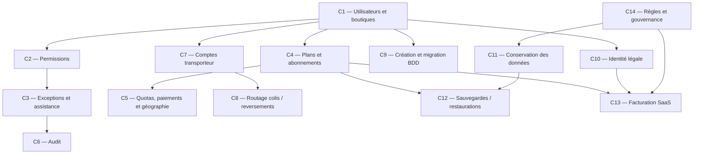

# Résumé extrêmement simple

| Module | À quoi il sert |
|---|---|
| **C1** | Savoir qui sont les utilisateurs et quelles boutiques leur appartiennent |
| **C2** | Savoir ce qu'un utilisateur a le droit de faire |
| **C3** | Gérer les invitations, exceptions et accès d'assistance |
| **C4** | Gérer les plans, abonnements, fonctionnalités et quotas |
| **C5** | Suivre certaines consommations, paiements SaaS et wilayas/communes |
| **C6** | Garder les traces des actions importantes |
| **C7** | Gérer les comptes et tarifs des transporteurs |
| **C8** | Envoyer les colis et reversements vers la bonne boutique |
| **C9** | Créer et mettre à jour techniquement les BDD boutiques |
| **C10** | Conserver l'identité légale du commerçant |
| **C11** | Gérer la conservation, anonymisation ou suppression des données |
| **C12** | Sauvegarder et restaurer les BDD boutiques |
| **C13** | Facturer l'utilisation du SaaS au commerçant |
| **C14** | Conserver les règles de facturation et tracer les traitements de données |
