# Schéma BDD centrale — SaaS e-commerce algérien

Version extraite du schéma V3.2 fourni, contenant uniquement la BDD centrale `saas_central`.

## 3. Conventions de lecture et d’intégrité

- `uuid` : identifiant logique UUID ; proposition physique MySQL `CHAR(36)` avec jeu de caractères ASCII et collation ascii_bin cohérents. Normaliser en minuscules. Un stockage `BINARY(16)` reste une optimisation ultérieure, à appliquer partout de façon cohérente.
- `varchar` sans longueur dans les diagrammes signifie `VARCHAR(255)` ; codes/statuts peuvent être limités davantage dans les migrations. Les index composites doivent tenir dans les limites InnoDB : codes ASCII et longueurs dédiées plutôt que plusieurs textes UTF-8 de 255 caractères. `char(n)` est toujours dimensionné, jamais `CHAR` seul. Téléphones, codes géographiques, NIF/NIS/RC et codes-barres sont des chaînes, jamais des nombres.
- Pays : `CHAR(2)` ISO 3166-1 alpha-2 ; devise : `CHAR(3)` ISO 4217 ; couleur : `CHAR(7)` au format `#RRGGBB` ; SHA-256 hexadécimal : `CHAR(64)` ASCII. Valider leur format et leur valeur côté serveur. Le MVP ne prétend pas gérer automatiquement la fiscalité, les adresses et les arrondis de tous les pays : activer une autre devise nécessite une règle d’échelle monétaire et des flux de rapprochement compatibles.
- `decimal` monétaire : `DECIMAL(14,2)` ; pas de FLOAT/DOUBLE pour l’argent. Poids/dimensions/contenus peuvent utiliser une échelle adaptée ; `decimal_geo` désigne `DECIMAL(10,7)`.
- `datetime` : `DATETIME(6)` stocké en UTC. Les statistiques calendaires sont calculées en `Africa/Algiers`, avec bornes locales converties en UTC.
- `nullable` signifie que le champ est facultatif. Les autres champs sont requis, sauf phase transactionnelle explicitement mentionnée.
- `PK` = clé primaire ; `FK` = clé étrangère **dans la même BDD** ; `UK` = unicité simple indiquée. Les unicités composites et conditionnelles sont précisées dans le texte.
- Une référence `central.users`, `central.tenants`, `central.wilayas` ou `central.communes` dans une BDD tenant est une **référence logique**, pas une FK SQL inter-BDD. La connexion centrale valide l’existence ; les objets de référence sont archivés plutôt que supprimés.
- Les acteurs des journaux peuvent être NULL pour une action système. `acteur_id` identifie le compte qui effectue réellement l’action. `origine` indique serveur, utilisateur, transporteur ou tâche. Aucune action ne s’effectue sous l’identité d’un autre compte.
- `contexte_normalise`, `commune_normalisee`, `type_cible` et autres expressions d’unicité sont des expressions ou colonnes techniques calculées à créer dans les migrations. Ne pas se reposer sur une simple unicité SQL contenant NULL pour ces cas.
- Les relations et requêtes tenant passent toujours par le contexte validé. Le visiteur public n’accède qu’aux données publiées et à son propre panier/suivi autorisé. Les APIs, tâches de fond, fichiers et clés de cache doivent conserver l’isolation autant que les BDD. Cache : préfixe tenants:{uuid}:..., espaces central:... séparés. Job : tenant UUID et version de contexte validés, connexion/cache/filesystem initialisés puis purgés en finally ; jamais de tenant résiduel dans un worker réutilisé. Les préfixes physiques de fichiers sont ceux de T2 ; sélectionner la BDD seule ne les isole pas.
- Une BDD distincte n’est pas une instance complète de l’application déployée pour chaque commerçant : le code et les services peuvent être partagés. Tenancy fournit notamment la sélection de BDD ; il ne crée pas automatiquement toutes tes règles d’autorisation.
- Les noms `users`, `tenants`, `domains`, `data`, `created_at`, `updated_at` et `deleted_at` facilitent les conventions Laravel. Les autres noms restent français. Les sessions et réinitialisations de mot de passe suivent les migrations du mécanisme Laravel retenu ; leurs secrets opaques ne sont pas des UUID métier. Les modèles/migrations devront adapter Domain et les colonnes personnalisées au package effectivement installé. Aucune version de Laravel installée n’a été supposée.

## 4. BDD centrale : `saas_central`

Les autorisations restent centrales pour qu’un seul compte puisse participer à plusieurs boutiques. Les tables centrales ne contiennent ni paniers, ni catalogue, ni adresses des acheteurs finaux ; les coordonnées du commerçant facturé par le SaaS appartiennent en revanche à ses snapshots de facturation centrale.

### C1 — Identités et boutiques

**`users` — Les comptes des personnes qui utilisent le SaaS : propriétaires, employés et administrateurs. Exemple : le compte de Nazim avec son email et son mot de passe protégé. Les acheteurs invités n’ont pas de compte ici.**

**`tenants` — La liste des boutiques, avec leur propriétaire. Exemple : « Boutique Karim » appartient à Karim et possède sa propre base de données.**

**`domains` — Les adresses web qui permettent d’ouvrir chaque boutique. Exemple : boutique-karim.monsaas.dz mène à la boutique de Karim.**

**`membres_tenants` — Indique quelles personnes font partie de quelles boutiques. Exemple : Nazim travaille dans la boutique de Karim. Ses droits précis sont définis séparément par ses rôles.**

**`verifications_contacts` — Les codes temporaires utilisés pour vérifier un téléphone ou WhatsApp. Exemple : Nazim reçoit un code et le saisit pour montrer qu’il a accès au contact indiqué.**

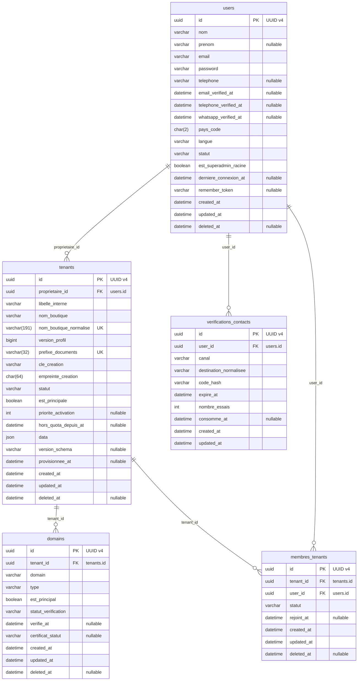

#### Explication très simple des champs

**`users` :**

- **`id`** : le numéro unique qui permet de reconnaître cette ligne dans la base. Deux lignes différentes ne peuvent pas avoir le même `id`.
- **`nom`** : le nom affiché à l’utilisateur. Exemple : « Nombre de boutiques » ou « Livraison EcoTrack ».
- **`prenom`** : le prénom de la personne. Il peut rester vide si le SaaS n’en a pas besoin ou ne le connaît pas encore.
- **`email`** : l’adresse email du compte.
- **`password`** : le mot de passe protégé par hachage. Le mot de passe réel ne doit jamais être stocké tel quel.
- **`telephone`** : le numéro de téléphone. Il est gardé comme texte pour ne pas perdre le `0`, le `+213` ou d’autres signes utiles. Ce champ peut rester vide quand cette information n’est pas nécessaire ou pas encore connue.
- **`email_verified_at`** : la date et l’heure liées à **email verified**. Elle permet de savoir exactement quand cette étape a eu lieu. Ce champ peut rester vide quand cette information n’est pas nécessaire ou pas encore connue.
- **`telephone_verified_at`** : la date et l’heure liées à **telephone verified**. Elle permet de savoir exactement quand cette étape a eu lieu. Ce champ peut rester vide quand cette information n’est pas nécessaire ou pas encore connue.
- **`whatsapp_verified_at`** : la date et l’heure liées à **whatsapp verified**. Elle permet de savoir exactement quand cette étape a eu lieu. Ce champ peut rester vide quand cette information n’est pas nécessaire ou pas encore connue.
- **`pays_code`** : le code court du pays. Exemple : `DZ` pour l’Algérie.
- **`langue`** : la langue préférée pour l’affichage. Exemple : `fr` ou `ar`.
- **`statut`** : indique où en est l’élément. Exemple : `en_attente`, `actif`, `termine` ou `annule` selon la table.
- **`est_superadmin_racine`** : indique si le compte est le super administrateur racine du SaaS. `true` = compte root ; `false` = utilisateur normal, propriétaire, employé ou administrateur délégué selon ses rôles.
- **`derniere_connexion_at`** : la date et l’heure liées à **derniere connexion**. Elle permet de savoir exactement quand cette étape a eu lieu. Ce champ peut rester vide quand cette information n’est pas nécessaire ou pas encore connue.
- **`remember_token`** : un jeton technique utilisé par Laravel pour la fonction « se souvenir de moi ». Il peut rester vide.
- **`created_at`** : la date où cette ligne a été créée dans la base.
- **`updated_at`** : la date de la dernière modification de cette ligne. Exemple : si tu modifies l’élément aujourd’hui, cette date devient celle d’aujourd’hui.
- **`deleted_at`** : la date où l’élément a été retiré sans effacer son ancienne ligne. Si ce champ est vide, l’élément n’est pas supprimé.

**`tenants` :**

- **`id`** : le numéro unique qui permet de reconnaître cette ligne dans la base. Deux lignes différentes ne peuvent pas avoir le même `id`.
- **`proprietaire_id`** : l’identifiant du propriétaire. Il sert à relier cette ligne à la bonne information au lieu de recopier toutes ses données.
- **`libelle_interne`** : un nom utilisé seulement dans l’administration, pas forcément montré aux visiteurs.
- **`nom_boutique`** : le nom officiel de la boutique dans le SaaS. Exemple : « Karim Shoes ».
- **`nom_boutique_normalise`** : une version nettoyée du nom utilisée pour comparer les boutiques. Exemple : «  Karim  Shoes » devient quelque chose comme « karim shoes », afin d’éviter deux noms considérés identiques.
- **`version_profil`** : un numéro qui augmente quand le profil central change. Exemple : version 4 puis 5 après une modification.
- **`prefixe_documents`** : un petit code propre à la boutique utilisé dans la numérotation de ses documents. Exemple : `KRM` dans `KRM-FAC-2026-0001`.
- **`cle_creation`** : une clé donnée à une demande de création. Exemple : si Karim clique deux fois sur « Créer la boutique » à cause d’un réseau lent, la même clé permet de retrouver la première création au lieu d’en créer deux.
- **`empreinte_creation`** : une empreinte calculée à partir du contenu de la demande de création. Elle permet de vérifier que la même clé n’est pas réutilisée avec des informations différentes.
- **`statut`** : indique où en est l’élément. Exemple : `en_attente`, `actif`, `termine` ou `annule` selon la table.
- **`est_principale`** : indique si cet élément est le principal. Exemple : l’adresse principale de la boutique.
- **`priorite_activation`** : le choix de priorité entre plusieurs boutiques. Exemple : si le plan n’en autorise plus qu’une, cette valeur aide à savoir laquelle le propriétaire veut garder active. Ce champ peut rester vide quand cette information n’est pas nécessaire ou pas encore connue.
- **`hors_quota_depuis_at`** : la date depuis laquelle la boutique dépasse ce que le plan permet. Exemple : après passage de Pro à Gratuit, une deuxième boutique peut devenir `hors_quota` à cette date. Ce champ peut rester vide quand cette information n’est pas nécessaire ou pas encore connue.
- **`data`** : des informations techniques supplémentaires regroupées au même endroit. Exemple : le nom technique de la base créée pour cette boutique.
- **`version_schema`** : la version du schéma de base de données installée pour cette boutique. Elle aide à savoir si une migration technique manque. Ce champ peut rester vide quand cette information n’est pas nécessaire ou pas encore connue.
- **`provisionnee_at`** : la date où la base et les ressources techniques de la boutique ont fini d’être créées. Ce champ peut rester vide quand cette information n’est pas nécessaire ou pas encore connue.
- **`created_at`** : la date où cette ligne a été créée dans la base.
- **`updated_at`** : la date de la dernière modification de cette ligne. Exemple : si tu modifies l’élément aujourd’hui, cette date devient celle d’aujourd’hui.
- **`deleted_at`** : la date où l’élément a été retiré sans effacer son ancienne ligne. Si ce champ est vide, l’élément n’est pas supprimé.

**`domains` :**

- **`id`** : le numéro unique qui permet de reconnaître cette ligne dans la base. Deux lignes différentes ne peuvent pas avoir le même `id`.
- **`tenant_id`** : l’identifiant de la boutique. Il sert à relier cette ligne à la bonne information au lieu de recopier toutes ses données.
- **`domain`** : l’adresse web de la boutique. Exemple : `boutique-karim.monsaas.dz`.
- **`type`** : indique la catégorie de l’élément. Exemple : un domaine peut être `sous_domaine` ou `personnalise`.
- **`est_principal`** : indique si cet élément est le principal parmi plusieurs. Exemple : le domaine principal de la boutique.
- **`statut_verification`** : indique où en est la vérification. Exemple : `a_verifier`, `verifiee` ou `a_corriger`.
- **`verifie_at`** : la date où l’information a été vérifiée. Ce champ peut rester vide quand cette information n’est pas nécessaire ou pas encore connue.
- **`certificat_statut`** : indique où en est le certificat de sécurité HTTPS du domaine. Exemple : en attente, actif ou en erreur. Ce champ peut rester vide quand cette information n’est pas nécessaire ou pas encore connue.
- **`created_at`** : la date où cette ligne a été créée dans la base.
- **`updated_at`** : la date de la dernière modification de cette ligne. Exemple : si tu modifies l’élément aujourd’hui, cette date devient celle d’aujourd’hui.
- **`deleted_at`** : la date où l’élément a été retiré sans effacer son ancienne ligne. Si ce champ est vide, l’élément n’est pas supprimé.

**`membres_tenants` :**

- **`id`** : le numéro unique qui permet de reconnaître cette ligne dans la base. Deux lignes différentes ne peuvent pas avoir le même `id`.
- **`tenant_id`** : l’identifiant de la boutique. Il sert à relier cette ligne à la bonne information au lieu de recopier toutes ses données.
- **`user_id`** : l’identifiant du compte utilisateur. Il sert à relier cette ligne à la bonne information au lieu de recopier toutes ses données.
- **`statut`** : indique où en est l’élément. Exemple : `en_attente`, `actif`, `termine` ou `annule` selon la table.
- **`rejoint_at`** : la date et l’heure liées à **rejoint**. Elle permet de savoir exactement quand cette étape a eu lieu. Ce champ peut rester vide quand cette information n’est pas nécessaire ou pas encore connue.
- **`created_at`** : la date où cette ligne a été créée dans la base.
- **`updated_at`** : la date de la dernière modification de cette ligne. Exemple : si tu modifies l’élément aujourd’hui, cette date devient celle d’aujourd’hui.
- **`deleted_at`** : la date où l’élément a été retiré sans effacer son ancienne ligne. Si ce champ est vide, l’élément n’est pas supprimé.

**`verifications_contacts` :**

- **`id`** : le numéro unique qui permet de reconnaître cette ligne dans la base. Deux lignes différentes ne peuvent pas avoir le même `id`.
- **`user_id`** : l’identifiant du compte utilisateur. Il sert à relier cette ligne à la bonne information au lieu de recopier toutes ses données.
- **`canal`** : indique par quel moyen on communique. Exemple : téléphone ou WhatsApp.
- **`destination_normalisee`** : le téléphone ou contact remis dans un format standard pour comparer correctement deux valeurs écrites différemment.
- **`code_hash`** : la version protégée du code temporaire. Le vrai code n’est pas conservé directement dans la base.
- **`expire_at`** : la date où l’élément n’est plus valable.
- **`nombre_essais`** : le nombre de tentatives déjà faites. Exemple : 2 codes faux saisis.
- **`consomme_at`** : la date où le code, jeton ou droit à usage unique a été utilisé. S’il est vide, il n’a pas encore été consommé.
- **`created_at`** : la date où cette ligne a été créée dans la base.
- **`updated_at`** : la date de la dernière modification de cette ligne. Exemple : si tu modifies l’élément aujourd’hui, cette date devient celle d’aujourd’hui.

Les références vers un autre module sont indiquées sur les champs, même si leur flèche n’est pas redessinée ici.

- **`users` :** Deux comptes ne peuvent pas utiliser le même email une fois l’email normalisé. Le pays par défaut est `DZ`. `password` contient uniquement le mot de passe haché, jamais le mot de passe réel. Il ne doit y avoir qu’un seul compte `root` actif. Le `root` peut tout administrer dans la partie centrale du SaaS. Un administrateur délégué garde seulement les droits qui lui ont été donnés. Même un administrateur plateforme ne peut pas entrer automatiquement dans le back-office d’une boutique : il faut toujours vérifier qu’il appartient à cette boutique et qu’il possède les droits nécessaires. `langue` sert seulement à choisir la langue de l’interface.

- **`tenants` :** Chaque boutique doit obligatoirement avoir un propriétaire dans `users`. Une fois la boutique créée, son propriétaire ne peut plus être changé, même par le `root`. Tant qu’une boutique appartient à un utilisateur, son compte ne peut pas être supprimé. `nom_boutique` est le vrai nom central de la boutique. `nom_boutique_normalise` est une version nettoyée utilisée pour comparer les noms : par exemple «  Alpha  Store » devient « alpha store ». Deux boutiques ne peuvent pas avoir le même nom normalisé, et un nom archivé reste réservé au MVP. `cle_creation` sert à éviter de créer deux fois la même boutique si la même demande est envoyée deux fois : elle est unique pour un même propriétaire. `empreinte_creation` vérifie aussi que la deuxième demande contient exactement les mêmes données. Même clé + même empreinte = on retrouve la même boutique ; même clé + données différentes = erreur `409`. Cette vérification se fait avant le quota pour qu’un simple retry ne consomme pas une place en plus. `prefixe_documents` est unique dans tout le SaaS et ne change plus après avoir été utilisé sur un document. `version_profil` augmente quand le profil central change afin de savoir quoi recopier dans la BDD boutique. `data` contient les informations techniques Tenancy, comme le nom de la BDD. Les statuts possibles sont `en_provisionnement`, `actif`, `hors_quota`, `suspendu`, `suspendu_restauration`, `echec_provisionnement` et `archive`. Un propriétaire ne peut avoir qu’une seule boutique principale non archivée. `priorite_activation` sert à mémoriser quelle boutique il préfère garder active si son plan n’en autorise plus autant. Une boutique suspendue ne redevient jamais active simplement parce qu’une place de quota se libère. `hors_quota_depuis_at` garde la date où elle est passée hors quota. Le commerçant n’a jamais d’accès SQL direct à sa BDD.

- **`domains` :** Deux boutiques ne peuvent pas utiliser le même domaine une fois le domaine normalisé. Une boutique peut avoir plusieurs domaines, mais un seul domaine principal actif. `type` vaut `sous_domaine` ou `personnalise`. Un domaine personnalisé n’est autorisé que si l’abonnement donne cette fonctionnalité. Le modèle `Domain` et sa migration doivent utiliser les UUID du projet. Il n’y a pas besoin d’une table séparée `sous_domaines` : les deux types restent dans `domains`.

- **`membres_tenants` :** Un même utilisateur ne peut apparaître qu’une seule fois comme membre d’une même boutique. Quand une boutique est créée, le propriétaire est automatiquement ajouté comme membre dans la même création centrale. Tant que la boutique existe, cette appartenance du propriétaire ne peut pas être supprimée, déplacée vers un autre utilisateur, déplacée vers une autre boutique ou désactivée. Il n’existe pas de rôle « propriétaire » à attribuer : le propriétaire est toujours celui indiqué par `tenants.proprietaire_id`. Les autres membres reçoivent leurs rôles dans `membres_roles`. Si une personne déjà connue est réinvitée, on réactive son ancienne appartenance au lieu d’en créer une deuxième.

- **`verifications_contacts` :** `canal` vaut `telephone` ou `whatsapp`. Le vrai code de vérification n’est pas stocké : on garde seulement son hachage. Le code expire rapidement et le nombre d’essais est limité. Vérifier un numéro de téléphone ne signifie pas automatiquement que WhatsApp est vérifié, et vérifier un ancien numéro ne valide pas un nouveau numéro. Si le téléphone du compte change, les anciennes dates de vérification liées à ce numéro sont remises à `NULL`. L’email et le mot de passe peuvent continuer à utiliser les mécanismes standards de Laravel.

### C2 — Permissions

**`fonctionnalites` — Ce que l’abonnement permet d’utiliser et en quelle quantité. Exemple : le plan Pro permet de créer jusqu’à 3 boutiques.**

**`permissions` — Les actions qu’un utilisateur peut faire. Exemple : ajouter un produit, modifier une commande ou consulter les statistiques.**

**`roles` — Un groupe de permissions auquel on donne un nom. Exemple : « Gestionnaire des commandes » permet de consulter et confirmer les commandes. Un rôle concerne soit l’administration du SaaS, soit une boutique précise.**

**`roles_permissions` — Indique quelles permissions sont comprises dans chaque rôle. Exemple : le rôle « Gestionnaire des commandes » contient « consulter les commandes » et « confirmer les commandes », mais pas « supprimer les produits ».**

**`users_roles` — Indique le rôle d’une personne dans l’administration du SaaS. Exemple : Ahmed a le rôle « Gestionnaire des abonnements » pour gérer les abonnements des commerçants.**

**`membres_roles` — Indique le rôle d’une personne dans une boutique précise. Exemple : Nazim est « Gestionnaire des commandes » dans la boutique de Karim. Cela ne lui donne aucun droit dans les autres boutiques.**

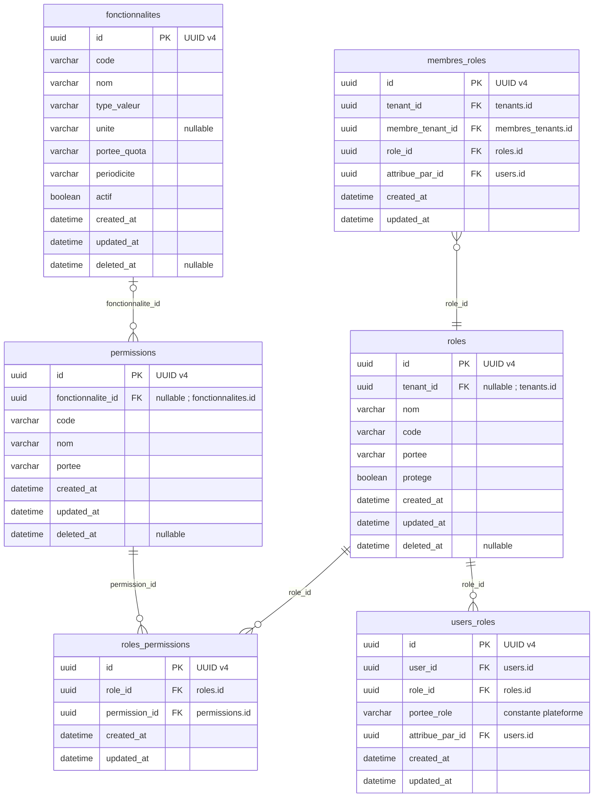

#### Explication très simple des champs

**`fonctionnalites` :**

- **`id`** : le numéro unique qui permet de reconnaître cette fonctionnalité dans la base.
- **`code`** : le petit nom utilisé par le programme pour reconnaître l’élément. Exemple : `boutiques.nombre` ou `produits.creer`.
- **`nom`** : le nom affiché à l’utilisateur. Exemple : « Nombre de boutiques » ou « Livraison EcoTrack ».
- **`type_valeur`** : indique si la fonctionnalité se règle par **oui/non** ou par **un nombre maximum**. Exemple : « Peut-il utiliser EcoTrack ? Oui. » ou « Combien de boutiques ? 3. »
- **`unite`** : explique ce que le nombre représente. Exemple : dans **« 3 boutiques »**, le nombre est 3 et l’unité est « boutiques ». Pour une fonction seulement oui/non, ce champ peut rester vide.
- **`portee_quota`** : indique à qui s’applique la limite. Exemple : **3 boutiques pour Karim au total**, ou une limite calculée séparément pour chacune de ses boutiques.
- **`periodicite`** : indique quand le compteur recommence. Exemple avec une limite de **5 utilisations** : `jour` = 5 aujourd’hui puis de nouveau 5 demain ; `mois` = 5 ce mois-ci puis de nouveau 5 le mois suivant ; `aucune` = la limite ne recommence pas avec le temps. Par exemple, posséder déjà 3 boutiques ne permet pas d’en créer 3 nouvelles au début du mois suivant.
- **`actif`** : indique si cette fonctionnalité est proposée par le SaaS. Exemple : elle peut exister dans la liste mais être désactivée parce qu’elle n’est pas encore prête. Cela ne veut pas dire que tous les abonnements y ont accès.
- **`created_at`** : la date où cette fonctionnalité a été ajoutée dans la base.
- **`updated_at`** : la date de sa dernière modification. Exemple : tu changes son nom aujourd’hui ; cette date devient celle d’aujourd’hui.
- **`deleted_at`** : la date où cette fonctionnalité a été retirée tout en gardant son ancienne ligne dans la base. Si ce champ est vide, elle n’a pas été retirée.

**`permissions` :**

- **`id`** : le numéro unique qui permet de reconnaître cette ligne dans la base. Deux lignes différentes ne peuvent pas avoir le même `id`.
- **`fonctionnalite_id`** : l’identifiant de la fonctionnalité. Il sert à relier cette ligne à la bonne information au lieu de recopier toutes ses données. Ce champ peut rester vide quand cette information n’est pas nécessaire ou pas encore connue.
- **`code`** : le petit nom utilisé par le programme pour reconnaître l’élément. Exemple : `boutiques.nombre` ou `produits.creer`.
- **`nom`** : le nom affiché à l’utilisateur. Exemple : « Nombre de boutiques » ou « Livraison EcoTrack ».
- **`portee`** : indique dans quel endroit la règle s’applique. Exemple : `plateforme` pour l’administration du SaaS ou `tenant` pour une boutique.
- **`created_at`** : la date où cette ligne a été créée dans la base.
- **`updated_at`** : la date de la dernière modification de cette ligne. Exemple : si tu modifies l’élément aujourd’hui, cette date devient celle d’aujourd’hui.
- **`deleted_at`** : la date où l’élément a été retiré sans effacer son ancienne ligne. Si ce champ est vide, l’élément n’est pas supprimé.

**`roles` :**

- **`id`** : le numéro unique qui permet de reconnaître cette ligne dans la base. Deux lignes différentes ne peuvent pas avoir le même `id`.
- **`tenant_id`** : l’identifiant de la boutique. Il sert à relier cette ligne à la bonne information au lieu de recopier toutes ses données. Ce champ peut rester vide quand cette information n’est pas nécessaire ou pas encore connue.
- **`nom`** : le nom affiché à l’utilisateur. Exemple : « Nombre de boutiques » ou « Livraison EcoTrack ».
- **`code`** : le petit nom utilisé par le programme pour reconnaître l’élément. Exemple : `boutiques.nombre` ou `produits.creer`.
- **`portee`** : indique dans quel endroit la règle s’applique. Exemple : `plateforme` pour l’administration du SaaS ou `tenant` pour une boutique.
- **`protege`** : indique si l’élément est protégé contre certaines modifications ou suppressions. Exemple : un rôle système important peut être protégé.
- **`created_at`** : la date où cette ligne a été créée dans la base.
- **`updated_at`** : la date de la dernière modification de cette ligne. Exemple : si tu modifies l’élément aujourd’hui, cette date devient celle d’aujourd’hui.
- **`deleted_at`** : la date où l’élément a été retiré sans effacer son ancienne ligne. Si ce champ est vide, l’élément n’est pas supprimé.

**`roles_permissions` :**

- **`id`** : le numéro unique qui permet de reconnaître cette ligne dans la base. Deux lignes différentes ne peuvent pas avoir le même `id`.
- **`role_id`** : l’identifiant du rôle. Il sert à relier cette ligne à la bonne information au lieu de recopier toutes ses données.
- **`permission_id`** : l’identifiant de la permission. Il sert à relier cette ligne à la bonne information au lieu de recopier toutes ses données.
- **`created_at`** : la date où cette ligne a été créée dans la base.
- **`updated_at`** : la date de la dernière modification de cette ligne. Exemple : si tu modifies l’élément aujourd’hui, cette date devient celle d’aujourd’hui.

**`users_roles` :**

- **`id`** : le numéro unique qui permet de reconnaître cette ligne dans la base. Deux lignes différentes ne peuvent pas avoir le même `id`.
- **`user_id`** : l’identifiant du compte utilisateur. Il sert à relier cette ligne à la bonne information au lieu de recopier toutes ses données.
- **`role_id`** : l’identifiant du rôle. Il sert à relier cette ligne à la bonne information au lieu de recopier toutes ses données.
- **`portee_role`** : confirme que le rôle est utilisé dans la bonne zone. Ici, par exemple, `plateforme` signifie que le rôle sert à administrer le SaaS.
- **`attribue_par_id`** : l’identifiant de la personne qui a donné ce droit. Il sert à relier cette ligne à la bonne information au lieu de recopier toutes ses données.
- **`created_at`** : la date où cette ligne a été créée dans la base.
- **`updated_at`** : la date de la dernière modification de cette ligne. Exemple : si tu modifies l’élément aujourd’hui, cette date devient celle d’aujourd’hui.

**`membres_roles` :**

- **`id`** : le numéro unique qui permet de reconnaître cette ligne dans la base. Deux lignes différentes ne peuvent pas avoir le même `id`.
- **`tenant_id`** : l’identifiant de la boutique. Il sert à relier cette ligne à la bonne information au lieu de recopier toutes ses données.
- **`membre_tenant_id`** : l’identifiant du membre de l’équipe. Il sert à relier cette ligne à la bonne information au lieu de recopier toutes ses données.
- **`role_id`** : l’identifiant du rôle. Il sert à relier cette ligne à la bonne information au lieu de recopier toutes ses données.
- **`attribue_par_id`** : l’identifiant de la personne qui a donné ce droit. Il sert à relier cette ligne à la bonne information au lieu de recopier toutes ses données.
- **`created_at`** : la date où cette ligne a été créée dans la base.
- **`updated_at`** : la date de la dernière modification de cette ligne. Exemple : si tu modifies l’élément aujourd’hui, cette date devient celle d’aujourd’hui.

Les références vers un autre module sont indiquées sur les champs, même si leur flèche n’est pas redessinée ici.

- **`fonctionnalites` :** Chaque fonctionnalité possède un `code` unique. `type_valeur=booleen` signifie simplement oui/non ; `type_valeur=quota` signifie qu’on autorise un nombre maximum. `portee_quota=compte` veut dire que la limite est partagée par toutes les boutiques du propriétaire ; `tenant` veut dire que chaque boutique a sa propre limite. `periodicite=jour` recommence chaque jour, `mois` recommence chaque mois et `aucune` ne recommence pas avec le temps. Exemple : `boutiques.nombre=3` avec `aucune` signifie que Karim peut avoir 3 boutiques au total ; le mois suivant il n’en gagne pas 3 nouvelles. Les codes comme `boutiques.nombre`, `domaines.personnalises`, `design.personnalise`, `livraison.ecotrack` ou `statistiques.lire` doivent correspondre à de vrais contrôles dans le code de l’application.

- **`permissions` :** Chaque permission possède un `code` unique. `portee=plateforme` signifie que l’action concerne l’administration du SaaS ; `portee=tenant` signifie qu’elle concerne le back-office d’une boutique. Exemples : `produits.creer`, `stock.ajuster`, `commandes.confirmer` ou `finances.valider_reversement`. `fonctionnalite_id` peut rester vide lorsqu’une permission sert à une action interne qui n’est pas vendue comme fonctionnalité d’abonnement.

- **`roles` :** Un rôle `plateforme` n’appartient à aucune boutique, donc `tenant_id=NULL`. Un rôle `tenant` appartient obligatoirement à une boutique précise. Dans un même contexte, deux rôles ne peuvent pas avoir le même `code`. Exemple : la boutique A peut avoir un rôle `gestionnaire`, et la boutique B peut aussi avoir son propre rôle `gestionnaire`, car ce ne sont pas le même contexte. Pour les rôles plateforme, on utilise une valeur technique comme `plateforme` pour que l’unicité fonctionne correctement même quand `tenant_id` est vide.

- **`roles_permissions` :** Une même permission ne peut être ajoutée qu’une seule fois au même rôle. Un rôle boutique accepte seulement des permissions boutique, et un rôle plateforme accepte seulement des permissions plateforme. Si quelqu’un essaie de mélanger les deux, Laravel et la BDD refusent l’écriture. La portée d’un rôle ou d’une permission ne peut plus être changée après sa création, sinon on pourrait contourner cette protection. Un rôle plateforme ne donne jamais accès au back-office marchand d’une boutique. Dès qu’un rôle ou ses permissions changent, le cache des droits doit être vidé pour que le changement soit pris en compte immédiatement. Le compte SQL utilisé par l’application ne doit pas pouvoir modifier la structure de la BDD avec des commandes DDL.

- **`users_roles` :** Cette table sert uniquement aux rôles de la plateforme. Un même utilisateur ne peut recevoir qu’une seule fois le même rôle. `portee_role` doit toujours valoir `plateforme`, et le rôle lié doit lui aussi être un rôle plateforme. Les rôles des boutiques ne vont jamais ici : ils vont dans `membres_roles`. Un administrateur délégué ne peut pas donner à quelqu’un des droits plus grands que ceux qu’il a lui-même le droit de déléguer.

- **`membres_roles` :** Un même membre ne peut recevoir qu’une seule fois le même rôle. Le membre, le rôle et `tenant_id` doivent tous parler de la même boutique. `tenant_id` est obligatoire, donc un rôle plateforme ne peut pas arriver dans cette table. Le membre doit être encore actif dans la boutique quand on lui donne le rôle et chaque fois qu’une requête utilise ses droits. Si son appartenance ou son rôle est retiré, le cache de ses droits est immédiatement invalidé.

### C3 — Invitations, exceptions et restrictions administratives

**`exceptions_permissions` — Ajoute ou interdit une action à une personne dans un contexte précis, éventuellement pour une durée limitée. Exemple : Nazim garde son rôle, mais on lui interdit de modifier les commandes de cette boutique.**

**`restrictions_admins` — Limite les actions d’un administrateur dans l’administration centrale du SaaS. Exemple : Ahmed peut gérer les abonnements, mais pas celui de Karim. Cette table ne lui ouvre pas l’intérieur des boutiques.**

**`invitations_equipes` — Les invitations pour rejoindre l’équipe d’une boutique avec un rôle choisi. Exemple : Karim invite Nazim par email comme gestionnaire des commandes ; Nazim doit accepter une invitation encore valable.**

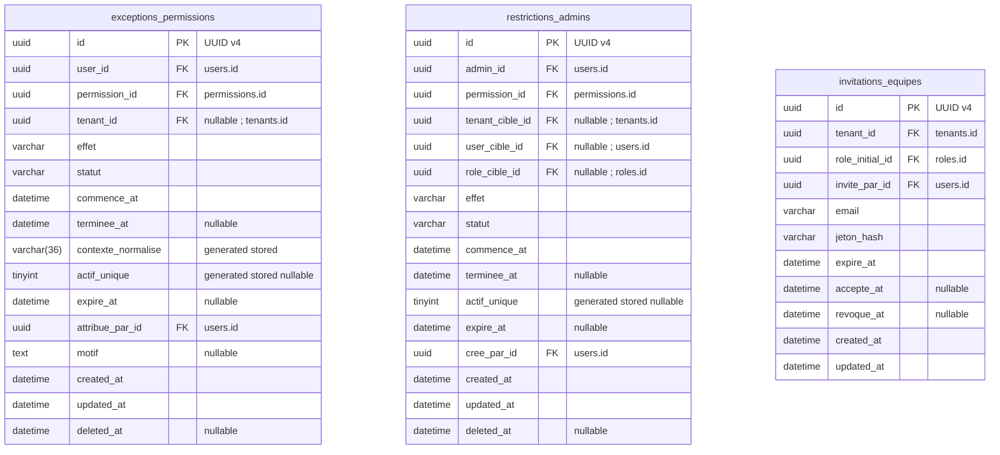

#### Explication très simple des champs

**`exceptions_permissions` :**

- **`id`** : le numéro unique qui permet de reconnaître cette ligne dans la base. Deux lignes différentes ne peuvent pas avoir le même `id`.
- **`user_id`** : l’identifiant du compte utilisateur. Il sert à relier cette ligne à la bonne information au lieu de recopier toutes ses données.
- **`permission_id`** : l’identifiant de la permission. Il sert à relier cette ligne à la bonne information au lieu de recopier toutes ses données.
- **`tenant_id`** : l’identifiant de la boutique. Il sert à relier cette ligne à la bonne information au lieu de recopier toutes ses données. Ce champ peut rester vide quand cette information n’est pas nécessaire ou pas encore connue.
- **`effet`** : indique ce que la règle fait. Exemple : `autoriser` donne le droit ; `interdire` le bloque.
- **`statut`** : indique où en est l’élément. Exemple : `en_attente`, `actif`, `termine` ou `annule` selon la table.
- **`commence_at`** : la date et l’heure où la période ou l’action commence.
- **`terminee_at`** : la date et l’heure où cette attribution ou règle a pris fin. Ce champ peut rester vide quand cette information n’est pas nécessaire ou pas encore connue.
- **`contexte_normalise`** : une valeur technique calculée pour représenter toujours le contexte de la même manière. Exemple : `plateforme` ou l’identifiant d’une boutique. Cela permet d’appliquer correctement les règles d’unicité.
- **`actif_unique`** : un petit champ technique calculé pour empêcher qu’il y ait deux règles actives identiques en même temps. Les anciennes règles terminées peuvent quand même rester dans l’historique. Ce champ peut rester vide quand cette information n’est pas nécessaire ou pas encore connue.
- **`expire_at`** : la date où l’élément n’est plus valable. Ce champ peut rester vide quand cette information n’est pas nécessaire ou pas encore connue.
- **`attribue_par_id`** : l’identifiant de la personne qui a donné ce droit. Il sert à relier cette ligne à la bonne information au lieu de recopier toutes ses données.
- **`motif`** : explique pourquoi l’action ou la décision a été faite. Ce champ peut rester vide quand cette information n’est pas nécessaire ou pas encore connue.
- **`created_at`** : la date où cette ligne a été créée dans la base.
- **`updated_at`** : la date de la dernière modification de cette ligne. Exemple : si tu modifies l’élément aujourd’hui, cette date devient celle d’aujourd’hui.
- **`deleted_at`** : la date où l’élément a été retiré sans effacer son ancienne ligne. Si ce champ est vide, l’élément n’est pas supprimé.

**`restrictions_admins` :**

- **`id`** : le numéro unique qui permet de reconnaître cette ligne dans la base. Deux lignes différentes ne peuvent pas avoir le même `id`.
- **`admin_id`** : l’identifiant de l’administrateur. Il sert à relier cette ligne à la bonne information au lieu de recopier toutes ses données.
- **`permission_id`** : l’identifiant de la permission. Il sert à relier cette ligne à la bonne information au lieu de recopier toutes ses données.
- **`tenant_cible_id`** : l’identifiant de la boutique visée. Il sert à relier cette ligne à la bonne information au lieu de recopier toutes ses données. Ce champ peut rester vide quand cette information n’est pas nécessaire ou pas encore connue.
- **`user_cible_id`** : l’identifiant de l’utilisateur visé. Il sert à relier cette ligne à la bonne information au lieu de recopier toutes ses données. Ce champ peut rester vide quand cette information n’est pas nécessaire ou pas encore connue.
- **`role_cible_id`** : l’identifiant du rôle visé. Il sert à relier cette ligne à la bonne information au lieu de recopier toutes ses données. Ce champ peut rester vide quand cette information n’est pas nécessaire ou pas encore connue.
- **`effet`** : indique ce que la règle fait. Exemple : `autoriser` donne le droit ; `interdire` le bloque.
- **`statut`** : indique où en est l’élément. Exemple : `en_attente`, `actif`, `termine` ou `annule` selon la table.
- **`commence_at`** : la date et l’heure où la période ou l’action commence.
- **`terminee_at`** : la date et l’heure où cette attribution ou règle a pris fin. Ce champ peut rester vide quand cette information n’est pas nécessaire ou pas encore connue.
- **`actif_unique`** : un petit champ technique calculé pour empêcher qu’il y ait deux règles actives identiques en même temps. Les anciennes règles terminées peuvent quand même rester dans l’historique. Ce champ peut rester vide quand cette information n’est pas nécessaire ou pas encore connue.
- **`expire_at`** : la date où l’élément n’est plus valable. Ce champ peut rester vide quand cette information n’est pas nécessaire ou pas encore connue.
- **`cree_par_id`** : l’identifiant de la personne qui a créé l’élément. Il sert à relier cette ligne à la bonne information au lieu de recopier toutes ses données.
- **`created_at`** : la date où cette ligne a été créée dans la base.
- **`updated_at`** : la date de la dernière modification de cette ligne. Exemple : si tu modifies l’élément aujourd’hui, cette date devient celle d’aujourd’hui.
- **`deleted_at`** : la date où l’élément a été retiré sans effacer son ancienne ligne. Si ce champ est vide, l’élément n’est pas supprimé.

**`invitations_equipes` :**

- **`id`** : le numéro unique qui permet de reconnaître cette ligne dans la base. Deux lignes différentes ne peuvent pas avoir le même `id`.
- **`tenant_id`** : l’identifiant de la boutique. Il sert à relier cette ligne à la bonne information au lieu de recopier toutes ses données.
- **`role_initial_id`** : l’identifiant du rôle proposé dans l’invitation. Il sert à relier cette ligne à la bonne information au lieu de recopier toutes ses données.
- **`invite_par_id`** : l’identifiant de la personne qui a envoyé l’invitation. Il sert à relier cette ligne à la bonne information au lieu de recopier toutes ses données.
- **`email`** : l’adresse email du compte.
- **`jeton_hash`** : la version protégée du jeton d’invitation. Si la base est lue, le vrai lien secret n’est pas directement récupérable.
- **`expire_at`** : la date où l’élément n’est plus valable.
- **`accepte_at`** : la date et l’heure liées à **accepte**. Elle permet de savoir exactement quand cette étape a eu lieu. Ce champ peut rester vide quand cette information n’est pas nécessaire ou pas encore connue.
- **`revoque_at`** : la date et l’heure liées à **revoque**. Elle permet de savoir exactement quand cette étape a eu lieu. Ce champ peut rester vide quand cette information n’est pas nécessaire ou pas encore connue.
- **`created_at`** : la date où cette ligne a été créée dans la base.
- **`updated_at`** : la date de la dernière modification de cette ligne. Exemple : si tu modifies l’élément aujourd’hui, cette date devient celle d’aujourd’hui.

Les références vers un autre module sont indiquées sur les champs, même si leur flèche n’est pas redessinée ici.

- **`exceptions_permissions` :** Cette table permet de donner ou de retirer temporairement une permission précise à un utilisateur. `effet=autoriser` ajoute le droit ; `interdire` le bloque. `statut` indique si la règle est `active`, `expiree` ou `revoquee`. Pour une permission de boutique, `tenant_id` est obligatoire et l’utilisateur doit réellement appartenir à cette boutique. Pour une permission plateforme, `tenant_id` doit être vide. Laravel et la BDD refusent les mélanges incorrects. Une règle ne fonctionne que pendant sa période : à partir de `commence_at` et avant `expire_at` si une date de fin existe. On ne dépend pas seulement d’un cron pour savoir qu’elle est expirée : chaque contrôle regarde aussi les dates. Il ne peut pas y avoir deux exceptions actives identiques pour le même utilisateur, la même permission et le même contexte. Les anciennes exceptions restent dans l’historique au lieu d’être réutilisées. Si on renouvelle une exception, on termine l’ancienne puis on crée une nouvelle ligne dans la même transaction. Une interdiction passe avant les permissions reçues par les rôles. Une exception ne permet jamais de dépasser le plan ou d’accéder à une boutique dont l’utilisateur n’est pas membre. `attribue_par_id` doit avoir le droit de déléguer cette permission ; simplement posséder la permission ne suffit pas. Après chaque ajout, révocation ou expiration, le cache des droits est vidé. Les colonnes techniques calculées ne doivent pas utiliser `NOW()`.

- **`restrictions_admins` :** Une restriction vise exactement une chose : soit une boutique, soit un utilisateur, soit un rôle. Elle sert seulement à limiter les actions d’un administrateur dans la partie centrale du SaaS. Exemple : Ahmed peut avoir la permission de gérer les abonnements, mais une restriction peut l’empêcher de toucher au compte de Karim. Cela ne lui donne jamais accès au back-office marchand d’une boutique et ne lui permet jamais d’agir comme un autre utilisateur. Une autorisation ciblée ne crée pas une permission globale que l’administrateur ne possède pas déjà. Il ne peut pas y avoir deux règles actives identiques sur la même cible. Comme pour `exceptions_permissions`, les dates sont vérifiées à chaque utilisation, les anciennes lignes restent dans l’historique et ne sont pas recyclées.

- **`invitations_equipes` :** Chaque jeton d’invitation est unique. Le rôle proposé dans l’invitation doit appartenir à la même boutique que l’invitation. Une fois la personne entrée dans l’équipe, on peut lui ajouter d’autres rôles avec `membres_roles`. Le jeton d’invitation ne peut être utilisé qu’une seule fois : après acceptation, il ne doit plus permettre une deuxième entrée.

### C4 — Plans et abonnements

**`plans` — Les offres d’abonnement proposées aux commerçants, avec leurs versions. Exemple : Gratuit et Pro. Une ancienne version reste conservée pour comprendre les anciens abonnements.**

**`plans_fonctionnalites` — Indique ce que chaque offre permet et ses limites. Exemple : l’offre Gratuit autorise 1 boutique et l’offre Pro en autorise 3.**

**`abonnements` — Indique l’offre d’un propriétaire et sa période d’utilisation. Exemple : Karim possède un abonnement Pro qui couvre ses boutiques dans les limites de cette offre.**

**`exceptions_fonctionnalites` — Un changement particulier aux possibilités ou aux limites habituelles de l’abonnement. Exemple : autoriser temporairement Karim à tester une fonction normalement absente de son offre.**

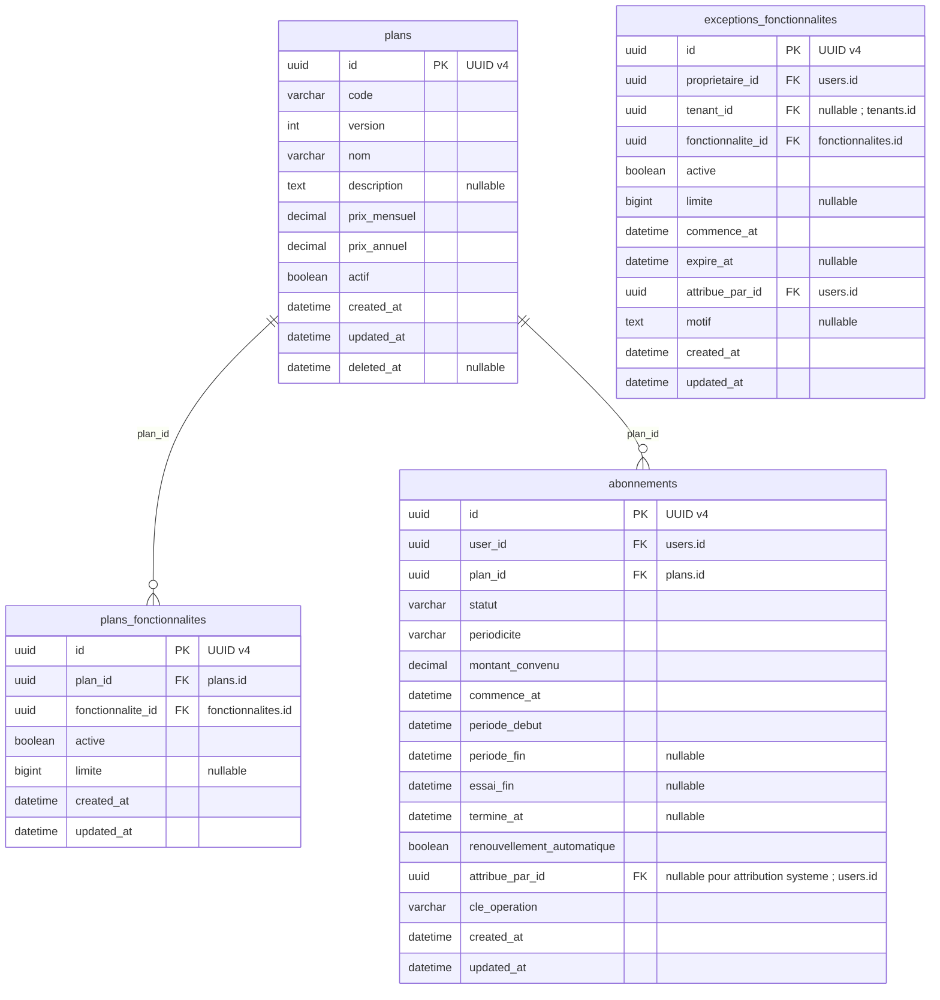

#### Explication très simple des champs

**`plans` :**

- **`id`** : le numéro unique qui permet de reconnaître cette ligne dans la base. Deux lignes différentes ne peuvent pas avoir le même `id`.
- **`code`** : le petit nom utilisé par le programme pour reconnaître l’élément. Exemple : `boutiques.nombre` ou `produits.creer`.
- **`version`** : le numéro de version de cet élément. Exemple : version 1, puis version 2 après une évolution ; l’ancienne version peut rester conservée pour comprendre l’historique.
- **`nom`** : le nom affiché à l’utilisateur. Exemple : « Nombre de boutiques » ou « Livraison EcoTrack ».
- **`description`** : un texte qui explique l’élément plus en détail. Il peut rester vide si aucune explication supplémentaire n’est nécessaire.
- **`prix_mensuel`** : le prix à payer pour un mois d’abonnement.
- **`prix_annuel`** : le prix à payer pour une année d’abonnement.
- **`actif`** : indique si l’élément peut encore être utilisé. `true` = oui, `false` = non.
- **`created_at`** : la date où cette ligne a été créée dans la base.
- **`updated_at`** : la date de la dernière modification de cette ligne. Exemple : si tu modifies l’élément aujourd’hui, cette date devient celle d’aujourd’hui.
- **`deleted_at`** : la date où l’élément a été retiré sans effacer son ancienne ligne. Si ce champ est vide, l’élément n’est pas supprimé.

**`plans_fonctionnalites` :**

- **`id`** : le numéro unique qui permet de reconnaître cette ligne dans la base. Deux lignes différentes ne peuvent pas avoir le même `id`.
- **`plan_id`** : l’identifiant du plan d’abonnement. Il sert à relier cette ligne à la bonne information au lieu de recopier toutes ses données.
- **`fonctionnalite_id`** : l’identifiant de la fonctionnalité. Il sert à relier cette ligne à la bonne information au lieu de recopier toutes ses données.
- **`active`** : indique si cette possibilité est autorisée. `true` = oui, `false` = non.
- **`limite`** : le nombre maximum autorisé. Exemple : `3` peut vouloir dire maximum 3 boutiques. Si le champ est vide dans un cas prévu comme illimité, il n’y a pas de nombre maximum. Ce champ peut rester vide quand cette information n’est pas nécessaire ou pas encore connue.
- **`created_at`** : la date où cette ligne a été créée dans la base.
- **`updated_at`** : la date de la dernière modification de cette ligne. Exemple : si tu modifies l’élément aujourd’hui, cette date devient celle d’aujourd’hui.

**`abonnements` :**

- **`id`** : le numéro unique qui permet de reconnaître cette ligne dans la base. Deux lignes différentes ne peuvent pas avoir le même `id`.
- **`user_id`** : l’identifiant du compte utilisateur. Il sert à relier cette ligne à la bonne information au lieu de recopier toutes ses données.
- **`plan_id`** : l’identifiant du plan d’abonnement. Il sert à relier cette ligne à la bonne information au lieu de recopier toutes ses données.
- **`statut`** : indique où en est l’élément. Exemple : `en_attente`, `actif`, `termine` ou `annule` selon la table.
- **`periodicite`** : indique la durée choisie pour l’abonnement payant. Exemple : `mensuel` pour payer par mois ou `annuel` pour payer par année, selon les valeurs prévues par le SaaS.
- **`montant_convenu`** : le montant qui a été décidé pour cet abonnement, afin de garder le prix réellement accepté même si le tarif du plan change plus tard.
- **`commence_at`** : la date et l’heure où la période ou l’action commence.
- **`periode_debut`** : le début de la période concernée. Exemple : début du mois payé.
- **`periode_fin`** : la fin de la période concernée. Exemple : fin du mois payé. Peut rester vide lorsque la période n’a pas de fin prévue.
- **`essai_fin`** : la date où la période d’essai se termine. Elle peut rester vide s’il n’y a pas d’essai.
- **`termine_at`** : la date et l’heure où elle s’est terminée. Peut rester vide tant que ce n’est pas terminé.
- **`renouvellement_automatique`** : indique si l’abonnement payant doit être renouvelé automatiquement selon la règle prévue. `false` signifie qu’on ne prépare pas un nouveau renouvellement payant.
- **`attribue_par_id`** : l’identifiant de la personne qui a donné ce droit. Il sert à relier cette ligne à la bonne information au lieu de recopier toutes ses données. Ce champ peut rester vide quand cette information n’est pas nécessaire ou pas encore connue.
- **`cle_operation`** : une clé unique utilisée pour reconnaître une opération déjà faite. Exemple : si le serveur reçoit deux fois la même demande après une coupure, cette clé aide à éviter de faire l’opération deux fois.
- **`created_at`** : la date où cette ligne a été créée dans la base.
- **`updated_at`** : la date de la dernière modification de cette ligne. Exemple : si tu modifies l’élément aujourd’hui, cette date devient celle d’aujourd’hui.

**`exceptions_fonctionnalites` :**

- **`id`** : le numéro unique qui permet de reconnaître cette ligne dans la base. Deux lignes différentes ne peuvent pas avoir le même `id`.
- **`proprietaire_id`** : l’identifiant du propriétaire. Il sert à relier cette ligne à la bonne information au lieu de recopier toutes ses données.
- **`tenant_id`** : l’identifiant de la boutique. Il sert à relier cette ligne à la bonne information au lieu de recopier toutes ses données. Ce champ peut rester vide quand cette information n’est pas nécessaire ou pas encore connue.
- **`fonctionnalite_id`** : l’identifiant de la fonctionnalité. Il sert à relier cette ligne à la bonne information au lieu de recopier toutes ses données.
- **`active`** : indique si cette possibilité est autorisée. `true` = oui, `false` = non.
- **`limite`** : le nombre maximum autorisé. Exemple : `3` peut vouloir dire maximum 3 boutiques. Si le champ est vide dans un cas prévu comme illimité, il n’y a pas de nombre maximum. Ce champ peut rester vide quand cette information n’est pas nécessaire ou pas encore connue.
- **`commence_at`** : la date et l’heure où la période ou l’action commence.
- **`expire_at`** : la date où l’élément n’est plus valable. Ce champ peut rester vide quand cette information n’est pas nécessaire ou pas encore connue.
- **`attribue_par_id`** : l’identifiant de la personne qui a donné ce droit. Il sert à relier cette ligne à la bonne information au lieu de recopier toutes ses données.
- **`motif`** : explique pourquoi l’action ou la décision a été faite. Ce champ peut rester vide quand cette information n’est pas nécessaire ou pas encore connue.
- **`created_at`** : la date où cette ligne a été créée dans la base.
- **`updated_at`** : la date de la dernière modification de cette ligne. Exemple : si tu modifies l’élément aujourd’hui, cette date devient celle d’aujourd’hui.

Les références vers un autre module sont indiquées sur les champs, même si leur flèche n’est pas redessinée ici.

- **`plans` :** Le couple `code + version` est unique. Les prix sont en DZD dans ce MVP. Dès qu’un plan a été utilisé par un abonnement, on ne modifie plus son ancienne version. Exemple : si `Pro v1` autorisait 3 boutiques et qu’on veut passer à 5, on crée `Pro v2` au lieu de transformer le passé. Le plan gratuit coûte `0` et autorise 1 boutique.

- **`plans_fonctionnalites` :** Une fonctionnalité ne peut apparaître qu’une seule fois dans un même plan. Pour un quota : `active=false` signifie que la fonction est interdite ; `active=true` avec `limite=NULL` signifie qu’elle est illimitée ; sinon `limite` contient le maximum autorisé et doit être positif ou nul. Pour une fonctionnalité oui/non, `limite` reste vide. Si une fonctionnalité n’apparaît pas dans le plan, elle est considérée comme désactivée. Quand un plan a déjà été utilisé, ces règles restent figées avec cette version du plan.

- **`abonnements` :** Un abonnement payant est attribué manuellement par un administrateur autorisé. Le plan gratuit est donné automatiquement lors de la création du compte et après la fin d’un abonnement payant. Le SaaS ne prélève pas automatiquement l’argent et ne rembourse pas automatiquement : les paiements sont vérifiés dans `reglements_abonnement`. Si le commerçant demande l’arrêt, on coupe seulement le prochain renouvellement payant ; il garde les droits jusqu’à la fin de la période qu’il a déjà payée. On garde la trace de cette demande. Changer de formule crée une nouvelle attribution au bon moment au lieu de réécrire l’ancien abonnement. `renouvellement_automatique=false` signifie seulement « ne pas renouveler le payant » ; cela n’empêche pas le passage automatique au gratuit. Les statuts sont `en_attente`, `actif`, `expire` et `annule`. `cle_operation` est unique afin qu’un retry ne crée pas deux abonnements. Un propriétaire ne peut avoir qu’un seul abonnement actif à la fois. Pour activer un nouveau plan, on verrouille son compte, on ferme l’ancien abonnement puis on active le nouveau dans la même transaction. Les droits ne sont valables que si le statut est actif ET si la date actuelle se trouve dans la période autorisée ; le système ne dépend donc pas d’un cron pour savoir qu’un abonnement est fini. À l’expiration du payant, on crée le gratuit une seule fois, puis les boutiques qui dépassent le nouveau quota passent `hors_quota` sans supprimer leurs données. Les montants et périodes historiques restent conservés.

- **`exceptions_fonctionnalites` :** Une exception change temporairement une fonctionnalité pour un propriétaire ou pour une boutique. Sa période commence à `commence_at` et s’arrête avant `expire_at` lorsqu’une date de fin existe. `active=false` peut servir à interdire une fonction pendant cette période ; ce champ ne dit pas si l’exception est « expirée ». Deux exceptions qui concernent le même propriétaire, la même fonctionnalité et le même contexte ne doivent pas se chevaucher dans le temps. Pour éviter les collisions, on verrouille le propriétaire, on vérifie les périodes existantes puis on écrit le changement dans la même transaction. `tenant_id=NULL` signifie que l’exception concerne tout le compte. Une exception de boutique est plus précise et passe avant l’exception du compte, qui passe elle-même avant le plan. Si un quota est défini au niveau du compte, on n’autorise pas une exception au niveau d’une seule boutique. La boutique indiquée doit réellement appartenir à ce propriétaire. Les changements de dates sont audités et on ne réécrit pas une ancienne période déjà utilisée.

### C5 — Suivi SaaS et référentiel

**`consommations_fonctionnalites` — Compte certaines utilisations quand un compteur est nécessaire pour vérifier une limite. Exemple : suivre le nombre d’utilisations d’une fonction pendant un mois. Le nombre de boutiques se calcule depuis les boutiques existantes.**

**`echeances_abonnement` — Les sommes que le commerçant doit payer pour son abonnement SaaS. Exemple : Karim doit payer 3 000 DA pour une période. Cela ne prouve pas encore qu’il a payé.**

**`reglements_abonnement` — Les paiements d’abonnement enregistrés, puis vérifiés manuellement. Exemple : un administrateur valide les 3 000 DA versés par Karim après contrôle du reçu.**

**`wilayas` — La liste des wilayas, commune à toutes les boutiques. Exemple : Alger peut être sélectionnée dans une adresse de livraison.**

**`communes` — La liste des communes et la wilaya de chacune. Exemple : vérifier que la commune choisie appartient bien à la wilaya indiquée, sans vérifier l’existence de la maison.**

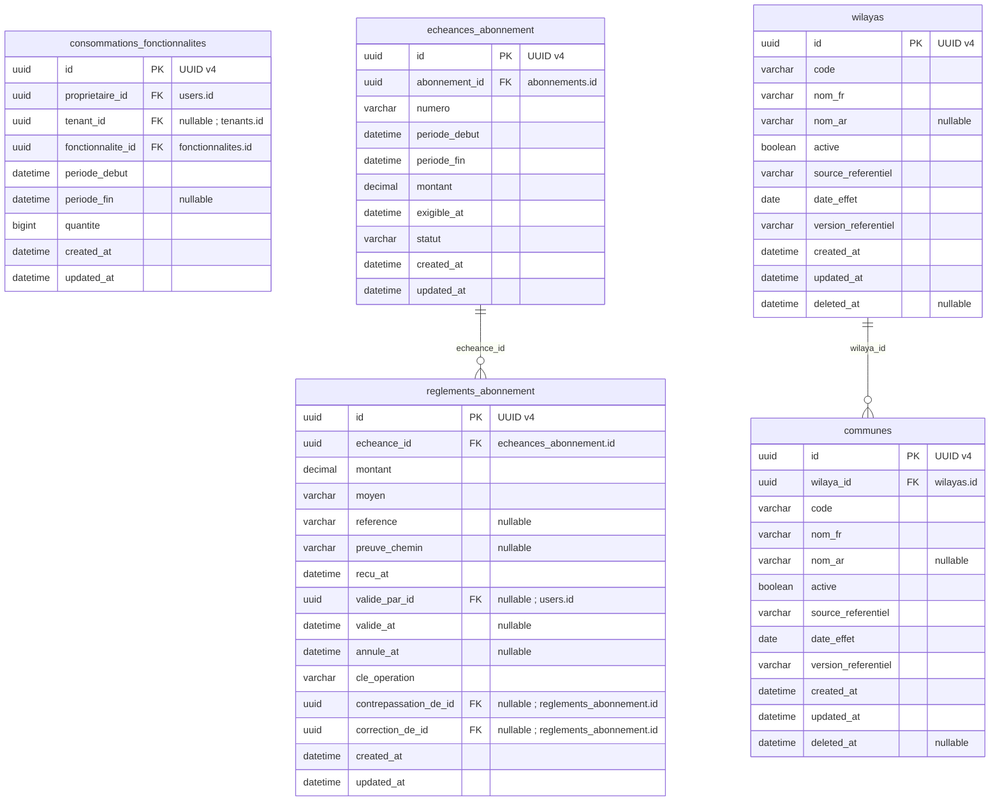

#### Explication très simple des champs

**`consommations_fonctionnalites` :**

- **`id`** : le numéro unique qui permet de reconnaître cette ligne dans la base. Deux lignes différentes ne peuvent pas avoir le même `id`.
- **`proprietaire_id`** : l’identifiant du propriétaire. Il sert à relier cette ligne à la bonne information au lieu de recopier toutes ses données.
- **`tenant_id`** : l’identifiant de la boutique. Il sert à relier cette ligne à la bonne information au lieu de recopier toutes ses données. Ce champ peut rester vide quand cette information n’est pas nécessaire ou pas encore connue.
- **`fonctionnalite_id`** : l’identifiant de la fonctionnalité. Il sert à relier cette ligne à la bonne information au lieu de recopier toutes ses données.
- **`periode_debut`** : le début de la période concernée. Exemple : début du mois payé.
- **`periode_fin`** : la fin de la période concernée. Exemple : fin du mois payé. Peut rester vide lorsque la période n’a pas de fin prévue.
- **`quantite`** : le nombre d’éléments concernés. Exemple : `2` signifie deux unités du produit.
- **`created_at`** : la date où cette ligne a été créée dans la base.
- **`updated_at`** : la date de la dernière modification de cette ligne. Exemple : si tu modifies l’élément aujourd’hui, cette date devient celle d’aujourd’hui.

**`echeances_abonnement` :**

- **`id`** : le numéro unique qui permet de reconnaître cette ligne dans la base. Deux lignes différentes ne peuvent pas avoir le même `id`.
- **`abonnement_id`** : l’identifiant de l’abonnement. Il sert à relier cette ligne à la bonne information au lieu de recopier toutes ses données.
- **`numero`** : le numéro lisible de l’élément. Exemple : numéro d’échéance ou de facture selon la table.
- **`periode_debut`** : le début de la période concernée. Exemple : début du mois payé.
- **`periode_fin`** : la fin de la période concernée. Exemple : fin du mois payé. Peut rester vide lorsque la période n’a pas de fin prévue.
- **`montant`** : la somme d’argent de cette ligne, en DZD au lancement. Exemple : `3000` signifie 3 000 DA.
- **`exigible_at`** : la date et l’heure liées à **exigible**. Elle permet de savoir exactement quand cette étape a eu lieu.
- **`statut`** : indique où en est l’élément. Exemple : `en_attente`, `actif`, `termine` ou `annule` selon la table.
- **`created_at`** : la date où cette ligne a été créée dans la base.
- **`updated_at`** : la date de la dernière modification de cette ligne. Exemple : si tu modifies l’élément aujourd’hui, cette date devient celle d’aujourd’hui.

**`reglements_abonnement` :**

- **`id`** : le numéro unique qui permet de reconnaître cette ligne dans la base. Deux lignes différentes ne peuvent pas avoir le même `id`.
- **`echeance_id`** : l’identifiant de l’échéance à payer. Il sert à relier cette ligne à la bonne information au lieu de recopier toutes ses données.
- **`montant`** : la somme d’argent de cette ligne, en DZD au lancement. Exemple : `3000` signifie 3 000 DA.
- **`moyen`** : la manière utilisée pour payer. Exemple : virement, espèces ou autre moyen autorisé par le SaaS.
- **`reference`** : un numéro ou texte de référence qui aide à reconnaître l’opération. Exemple : numéro d’un reçu ou référence externe. Ce champ peut rester vide quand cette information n’est pas nécessaire ou pas encore connue.
- **`preuve_chemin`** : l’endroit où est rangé le fichier servant de preuve, par exemple un reçu ou un bordereau. Le fichier lui-même n’est pas stocké dans ce champ. Ce champ peut rester vide quand cette information n’est pas nécessaire ou pas encore connue.
- **`recu_at`** : la date et l’heure liées à **recu**. Elle permet de savoir exactement quand cette étape a eu lieu.
- **`valide_par_id`** : l’identifiant de la personne qui a validé. Il sert à relier cette ligne à la bonne information au lieu de recopier toutes ses données. Ce champ peut rester vide quand cette information n’est pas nécessaire ou pas encore connue.
- **`valide_at`** : la date et l’heure liées à **valide**. Elle permet de savoir exactement quand cette étape a eu lieu. Ce champ peut rester vide quand cette information n’est pas nécessaire ou pas encore connue.
- **`annule_at`** : la date et l’heure liées à **annule**. Elle permet de savoir exactement quand cette étape a eu lieu. Ce champ peut rester vide quand cette information n’est pas nécessaire ou pas encore connue.
- **`cle_operation`** : une clé unique utilisée pour reconnaître une opération déjà faite. Exemple : si le serveur reçoit deux fois la même demande après une coupure, cette clé aide à éviter de faire l’opération deux fois.
- **`contrepassation_de_id`** : l’identifiant de l’ancienne écriture annulée par une écriture inverse. Il sert à relier cette ligne à la bonne information au lieu de recopier toutes ses données. Ce champ peut rester vide quand cette information n’est pas nécessaire ou pas encore connue.
- **`correction_de_id`** : l’identifiant de l’ancienne écriture que cette ligne corrige. Il sert à relier cette ligne à la bonne information au lieu de recopier toutes ses données. Ce champ peut rester vide quand cette information n’est pas nécessaire ou pas encore connue.
- **`created_at`** : la date où cette ligne a été créée dans la base.
- **`updated_at`** : la date de la dernière modification de cette ligne. Exemple : si tu modifies l’élément aujourd’hui, cette date devient celle d’aujourd’hui.

**`wilayas` :**

- **`id`** : le numéro unique qui permet de reconnaître cette ligne dans la base. Deux lignes différentes ne peuvent pas avoir le même `id`.
- **`code`** : le petit nom utilisé par le programme pour reconnaître l’élément. Exemple : `boutiques.nombre` ou `produits.creer`.
- **`nom_fr`** : le nom en français.
- **`nom_ar`** : le nom en arabe. Il peut rester vide si cette traduction n’est pas encore renseignée.
- **`active`** : indique si cette possibilité est autorisée. `true` = oui, `false` = non.
- **`source_referentiel`** : indique d’où vient la liste officielle utilisée. Exemple : le texte officiel ayant servi à importer les wilayas.
- **`date_effet`** : la date à partir de laquelle l’information ou la correction doit compter. Exemple : une correction enregistrée aujourd’hui peut devoir compter pour la vente d’hier.
- **`version_referentiel`** : indique quelle version de cette liste officielle a été utilisée.
- **`created_at`** : la date où cette ligne a été créée dans la base.
- **`updated_at`** : la date de la dernière modification de cette ligne. Exemple : si tu modifies l’élément aujourd’hui, cette date devient celle d’aujourd’hui.
- **`deleted_at`** : la date où l’élément a été retiré sans effacer son ancienne ligne. Si ce champ est vide, l’élément n’est pas supprimé.

**`communes` :**

- **`id`** : le numéro unique qui permet de reconnaître cette ligne dans la base. Deux lignes différentes ne peuvent pas avoir le même `id`.
- **`wilaya_id`** : l’identifiant de la wilaya. Il sert à relier cette ligne à la bonne information au lieu de recopier toutes ses données.
- **`code`** : le petit nom utilisé par le programme pour reconnaître l’élément. Exemple : `boutiques.nombre` ou `produits.creer`.
- **`nom_fr`** : le nom en français.
- **`nom_ar`** : le nom en arabe. Il peut rester vide si cette traduction n’est pas encore renseignée.
- **`active`** : indique si cette possibilité est autorisée. `true` = oui, `false` = non.
- **`source_referentiel`** : indique d’où vient la liste officielle utilisée. Exemple : le texte officiel ayant servi à importer les wilayas.
- **`date_effet`** : la date à partir de laquelle l’information ou la correction doit compter. Exemple : une correction enregistrée aujourd’hui peut devoir compter pour la vente d’hier.
- **`version_referentiel`** : indique quelle version de cette liste officielle a été utilisée.
- **`created_at`** : la date où cette ligne a été créée dans la base.
- **`updated_at`** : la date de la dernière modification de cette ligne. Exemple : si tu modifies l’élément aujourd’hui, cette date devient celle d’aujourd’hui.
- **`deleted_at`** : la date où l’élément a été retiré sans effacer son ancienne ligne. Si ce champ est vide, l’élément n’est pas supprimé.

Les références vers un autre module sont indiquées sur les champs, même si leur flèche n’est pas redessinée ici.

- **`consommations_fonctionnalites` :** Pour une même fonctionnalité, un même propriétaire, un même contexte et une même période, il n’existe qu’un seul compteur. Sa mise à jour doit être atomique : deux requêtes en même temps ne doivent pas pouvoir dépasser le quota. Quand on vérifie `boutiques.nombre` pour créer une nouvelle boutique, on compte toutes les boutiques non supprimées du propriétaire, même celles qui sont `hors_quota`, en cours de création, suspendues ou en échec récupérable. On verrouille le propriétaire pendant ce contrôle. Si un plan devient plus petit, on ne supprime pas les boutiques en trop : on garde seulement jusqu’au quota comme actives et les autres passent `hors_quota`. Un échec récupérable continue de prendre une place tant qu’on n’a pas explicitement abandonné cette création. On n’entretient pas un deuxième compteur séparé du vrai nombre de boutiques. Un membre d’équipe utilise toujours les quotas du propriétaire de sa boutique.

- **`echeances_abonnement` :** Chaque échéance possède un `numero` unique. Les montants sont en DZD. Son état `dû`, `partiel` ou `réglé` se calcule à partir des règlements réellement validés. Cette table dit simplement « combien le commerçant doit payer » ; elle ne doit pas être présentée automatiquement comme une facture fiscale.

- **`reglements_abonnement` :** `cle_operation` est unique pour éviter les doublons. Une contrepassation ne peut annuler qu’un règlement de la même échéance et ne peut jamais s’annuler elle-même. Un paiement normal a un montant positif. Pour corriger un paiement déjà validé, on ne modifie pas l’ancienne ligne : on crée d’abord son inverse exact avec un montant négatif, puis la nouvelle ligne correcte, toujours sur la même échéance. `annule_at` sert seulement à annuler une ligne qui n’avait pas encore été validée ; une ligne annulée n’entre pas dans les sommes. Quand on valide un règlement, on verrouille l’échéance pour empêcher deux validations simultanées de créer un solde impossible. On refuse un total négatif ou supérieur au montant dû sauf si un traitement explicite du trop-perçu existe. Le moyen de paiement reste configurable, mais aucune donnée de carte bancaire n’est stockée ici.

- **`wilayas` :** Chaque `code` de wilaya est unique. Le référentiel initial doit venir des annexes officielles citées en [S10], avec 69 wilayas et 1 541 communes dans la version utilisée par ce document. On garde aussi la source, la version et la date d’effet du référentiel. Il ne faut jamais coder en dur « maximum 58 » ni obliger la table à contenir exactement 69 lignes, car le découpage administratif peut évoluer. Les codes utilisés par un transporteur restent séparés des codes officiels.

- **`communes` :** Dans une même wilaya, deux communes ne peuvent pas avoir le même `code`. Quand une commune est choisie, on vérifie qu’elle appartient bien à la wilaya indiquée. Le code postal ne remplace pas l’identifiant de la commune : deux notions différentes restent deux informations différentes.

### C6 — Audit SaaS

**`journal_audit_central` — Le carnet des actions importantes dans l’administration du SaaS : qui a fait quoi et quand. Exemple : Ahmed a modifié l’abonnement de Karim à une date précise.**

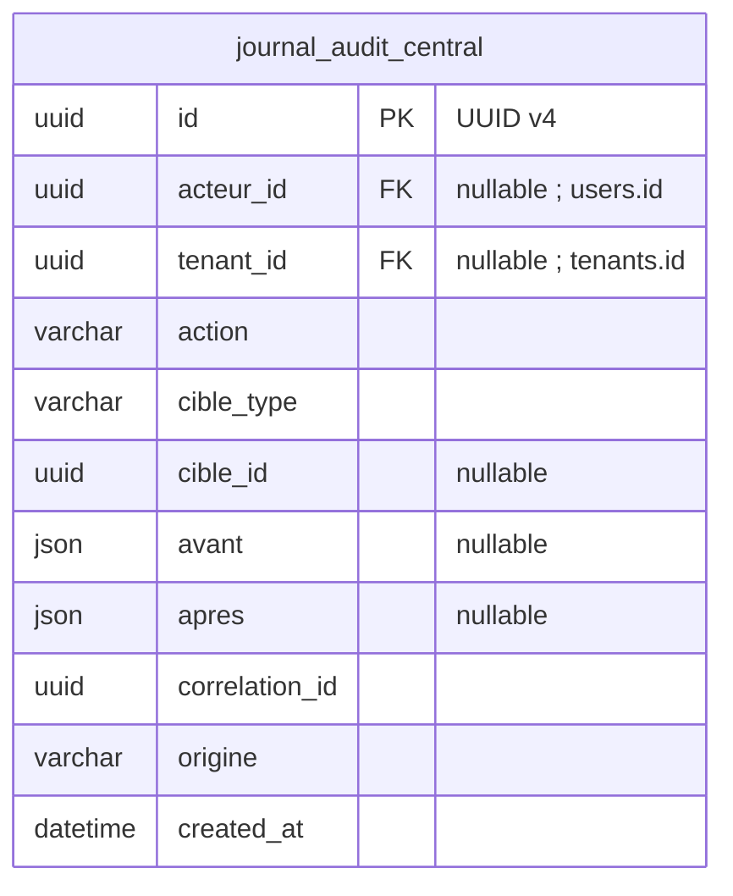

#### Explication très simple des champs

**`journal_audit_central` :**

- **`id`** : le numéro unique qui permet de reconnaître cette ligne dans la base. Deux lignes différentes ne peuvent pas avoir le même `id`.
- **`acteur_id`** : l’identifiant de la personne qui a fait l’action. Il sert à relier cette ligne à la bonne information au lieu de recopier toutes ses données. Ce champ peut rester vide quand cette information n’est pas nécessaire ou pas encore connue.
- **`tenant_id`** : l’identifiant de la boutique. Il sert à relier cette ligne à la bonne information au lieu de recopier toutes ses données. Ce champ peut rester vide quand cette information n’est pas nécessaire ou pas encore connue.
- **`action`** : le nom de l’action réalisée. Exemple : `abonnement.modifier`.
- **`cible_type`** : le type de chose concernée par l’action. Exemple : `tenant`, `user` ou `role`.
- **`cible_id`** : l’identifiant de l’élément précis concerné par l’action. Ce champ peut rester vide quand cette information n’est pas nécessaire ou pas encore connue.
- **`avant`** : une petite copie des informations importantes avant la modification. Exemple : ancien statut = `actif`. Ce champ peut rester vide quand cette information n’est pas nécessaire ou pas encore connue.
- **`apres`** : une petite copie des informations importantes après la modification. Exemple : nouveau statut = `suspendu`. Ce champ peut rester vide quand cette information n’est pas nécessaire ou pas encore connue.
- **`correlation_id`** : un numéro commun utilisé pour relier plusieurs traces qui appartiennent à la même grande opération. Exemple : une création de boutique qui produit plusieurs actions techniques.
- **`origine`** : indique d’où vient l’action. Exemple : utilisateur, serveur, tâche automatique ou transporteur.
- **`created_at`** : la date où cette ligne a été créée dans la base.

Les références vers un autre module sont indiquées sur les champs, même si leur flèche n’est pas redessinée ici.

- **`journal_audit_central` :** Ce journal fonctionne comme un carnet qu’on ne gomme pas : on ajoute de nouvelles lignes mais on ne réécrit pas les anciennes. On n’y enregistre jamais les mots de passe, codes OTP, tokens de connexion ou secrets API. `cible_type` et `cible_id` servent à dire quel objet était concerné, même si cet objet n’a pas une FK SQL directe vers le journal. Même le compte `root` ne possède pas de bouton métier permettant d’effacer les traces d’audit.

### C7 — Comptes transporteur et tarifs versionnés

**`comptes_livraison` — Les comptes utilisés par un propriétaire auprès des transporteurs, avec les informations de connexion protégées. Exemple : Karim utilise son compte EcoTrack pour plusieurs de ses boutiques.**

**`boutiques_comptes_livraison` — Indique quelles boutiques utilisent quel compte transporteur. Exemple : les deux boutiques de Karim utilisent son même compte EcoTrack, sans partager leurs données commerciales.**

**`tarifs_transporteur` — Les prix de retour convenus pour un compte transporteur, avec leurs dates d’application. Exemple : un retour coûte 300 DA pendant une période ; un nouveau tarif ne change pas les anciens frais.**

Les comptes API sont mutualisés au niveau du propriétaire, jamais entre propriétaires différents. Le profil local `prestataires_livraison` référence le compte sans recopier ses secrets. Le pivot utilise `tenant_id` plutôt que `boutique_id` : l’identité centrale d’une boutique est `tenants.id`.

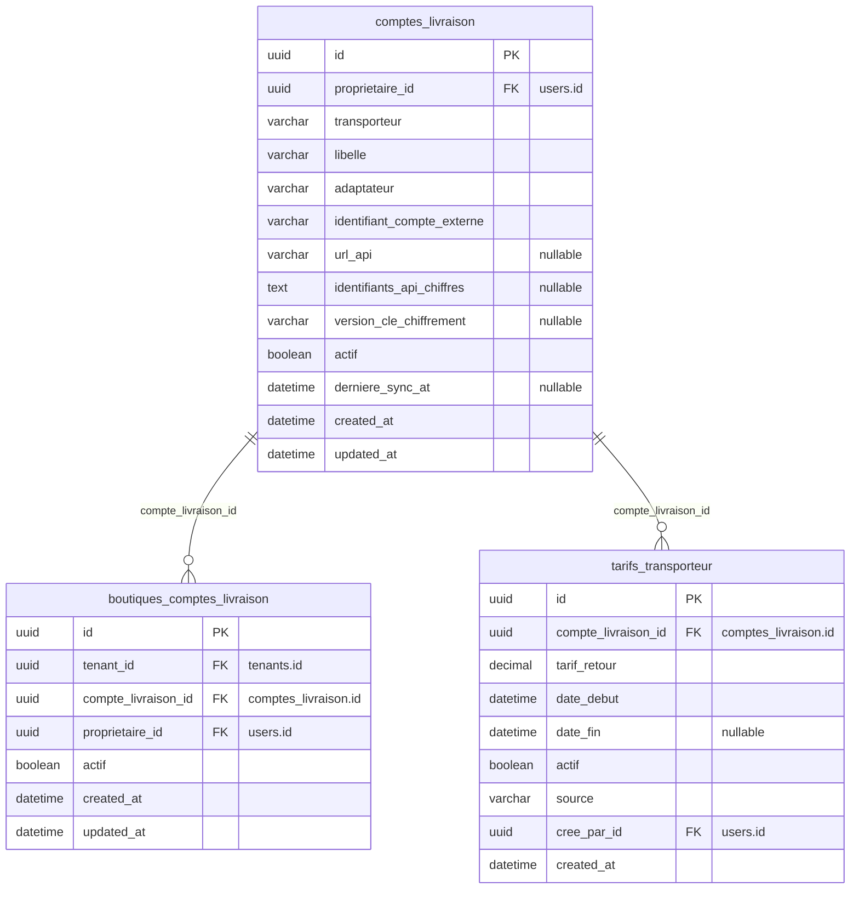

#### Explication très simple des champs

**`comptes_livraison` :**

- **`id`** : le numéro unique qui permet de reconnaître cette ligne dans la base. Deux lignes différentes ne peuvent pas avoir le même `id`.
- **`proprietaire_id`** : l’identifiant du propriétaire. Il sert à relier cette ligne à la bonne information au lieu de recopier toutes ses données.
- **`transporteur`** : le nom du transporteur concerné. Exemple : EcoTrack ou un autre prestataire configuré.
- **`libelle`** : un nom court utilisé pour reconnaître facilement l’élément à l’écran.
- **`adaptateur`** : le nom du morceau de programme qui sait parler avec ce transporteur. Cela permet d’utiliser des APIs différentes sans mélanger leur logique.
- **`identifiant_compte_externe`** : le numéro ou nom qui identifie ce compte chez le transporteur.
- **`url_api`** : l’adresse utilisée par le serveur pour parler avec l’API du transporteur. Ce champ peut rester vide quand cette information n’est pas nécessaire ou pas encore connue.
- **`identifiants_api_chiffres`** : les informations secrètes de connexion au transporteur, enregistrées sous forme chiffrée et non lisible directement. Ce champ peut rester vide quand cette information n’est pas nécessaire ou pas encore connue.
- **`version_cle_chiffrement`** : indique quelle version de la clé a servi à chiffrer les secrets. La clé elle-même n’est pas stockée ici. Ce champ peut rester vide quand cette information n’est pas nécessaire ou pas encore connue.
- **`actif`** : indique si l’élément peut encore être utilisé. `true` = oui, `false` = non.
- **`derniere_sync_at`** : la dernière fois où le SaaS a synchronisé ce compte avec le service externe. Ce champ peut rester vide quand cette information n’est pas nécessaire ou pas encore connue.
- **`created_at`** : la date où cette ligne a été créée dans la base.
- **`updated_at`** : la date de la dernière modification de cette ligne. Exemple : si tu modifies l’élément aujourd’hui, cette date devient celle d’aujourd’hui.

**`boutiques_comptes_livraison` :**

- **`id`** : le numéro unique qui permet de reconnaître cette ligne dans la base. Deux lignes différentes ne peuvent pas avoir le même `id`.
- **`tenant_id`** : l’identifiant de la boutique. Il sert à relier cette ligne à la bonne information au lieu de recopier toutes ses données.
- **`compte_livraison_id`** : l’identifiant du compte transporteur. Il sert à relier cette ligne à la bonne information au lieu de recopier toutes ses données.
- **`proprietaire_id`** : l’identifiant du propriétaire. Il sert à relier cette ligne à la bonne information au lieu de recopier toutes ses données.
- **`actif`** : indique si l’élément peut encore être utilisé. `true` = oui, `false` = non.
- **`created_at`** : la date où cette ligne a été créée dans la base.
- **`updated_at`** : la date de la dernière modification de cette ligne. Exemple : si tu modifies l’élément aujourd’hui, cette date devient celle d’aujourd’hui.

**`tarifs_transporteur` :**

- **`id`** : le numéro unique qui permet de reconnaître cette ligne dans la base. Deux lignes différentes ne peuvent pas avoir le même `id`.
- **`compte_livraison_id`** : l’identifiant du compte transporteur. Il sert à relier cette ligne à la bonne information au lieu de recopier toutes ses données.
- **`tarif_retour`** : le prix facturé pour un retour selon ce compte transporteur. Exemple : 300 DA.
- **`date_debut`** : la date où cette règle ou ce tarif commence à s’appliquer.
- **`date_fin`** : la date où cette règle ou ce tarif arrête de s’appliquer. Si elle est vide, il n’y a pas encore de fin prévue.
- **`actif`** : indique si l’élément peut encore être utilisé. `true` = oui, `false` = non.
- **`source`** : indique d’où vient l’information. Exemple : saisie manuelle ou réponse de l’API.
- **`cree_par_id`** : l’identifiant de la personne qui a créé l’élément. Il sert à relier cette ligne à la bonne information au lieu de recopier toutes ses données.
- **`created_at`** : la date où cette ligne a été créée dans la base.

- **`comptes_livraison` :** UNIQUE(id,proprietaire_id), UNIQUE(transporteur,identifiant_compte_externe). Le compte externe canonique est vérifié avant activation pour éviter deux enregistrements du même compte ; à défaut d’identification fiable par API, activation manuelle contrôlée. Propriétaire et identité externe immuables dès utilisation. Secrets chiffrés au repos, déchiffrables uniquement par le connecteur serveur ; `version_cle_chiffrement` identifie la version de clé utilisée. **La clé maître elle-même reste hors de cette BDD**, dans le gestionnaire de secrets/clé de l’infrastructure, avec sauvegarde/versionnement indépendants afin qu’une restauration centrale ne réactive pas aveuglément une ancienne clé. URL autorisée pour éviter les appels arbitraires. Un compte manuel peut ne pas avoir de secret. Un rôle d’une boutique ne donne jamais accès aux autres boutiques utilisant ce compte.
- **`boutiques_comptes_livraison` :** UNIQUE(tenant_id,compte_livraison_id), UNIQUE(id,tenant_id,compte_livraison_id). FK(tenant_id,proprietaire_id) → tenants(id,proprietaire_id) et FK(compte_livraison_id,proprietaire_id) → comptes_livraison(id,proprietaire_id). L’association et le compte doivent être actifs pour de nouveaux envois. Leur désactivation conserve les liens historiques et autorise un rapprochement de clôture contrôlé.
- **`tarifs_transporteur` :** UNIQUE(compte_livraison_id,date_debut), tarif_retour>=0, date_fin NULL ou >date_debut. Intervalles semi-ouverts [date_debut,date_fin), sans chevauchement pour un compte ; insertion sous verrou du compte. Les montants déjà appliqués ne changent jamais. Pour un changement futur, fermer l’ancien intervalle sans invalider les frais historiques, puis créer la nouvelle version. `actif` autorise l’utilisation de la version ; une version échue reste consultable. Source manuel|api. Un tarif nul signifie gratuit explicitement, jamais « inconnu ».

**Application d’un tarif de retour.** Le fait générateur retenu est l’acceptation du retour par le transporteur, et non la simple demande du commerçant. Sa date fiable est enregistrée dans frais_transporteur.fait_generateur_at ; à défaut, date de première observation et source_date=observation. Sélectionner le tarif du compte à cette date et figer montant, tarif_source_id et tarif_snapshot. Si aucun tarif n’est applicable, signaler une anomalie et bloquer la constatation financière automatique sans bloquer la réception physique ; aucun zéro inventé. Un montant réellement facturé différent se corrige par écritures compensatoires après vérification. Ce fait générateur reste un paramètre de l’adaptateur à valider contre le contrat du compte avant lancement.

### C8 — Routage des colis et règlements partagés

**`registre_colis_transporteur` — Indique à quelle boutique appartient chaque colis d’un compte transporteur. Exemple : le suivi reçu pour le colis X doit être envoyé à la boutique de Karim, pas à une autre.**

**`lots_reversement_transporteur` — Les règlements globaux d’un compte transporteur, avant leur répartition entre boutiques. Exemple : un versement vérifié de 20 000 DA concerne les deux boutiques de Karim.**

**`parts_reversement_tenants` — La part de chaque boutique dans un règlement global du transporteur. Exemple : sur 20 000 DA, 12 000 DA reviennent à la première boutique et 8 000 DA à la seconde.**

Ces tables centrales contiennent des identifiants et des montants de routage, pas les produits ni les coordonnées des acheteurs. Elles empêchent qu’un polling de compte partagé attribue le même colis ou règlement à deux boutiques.

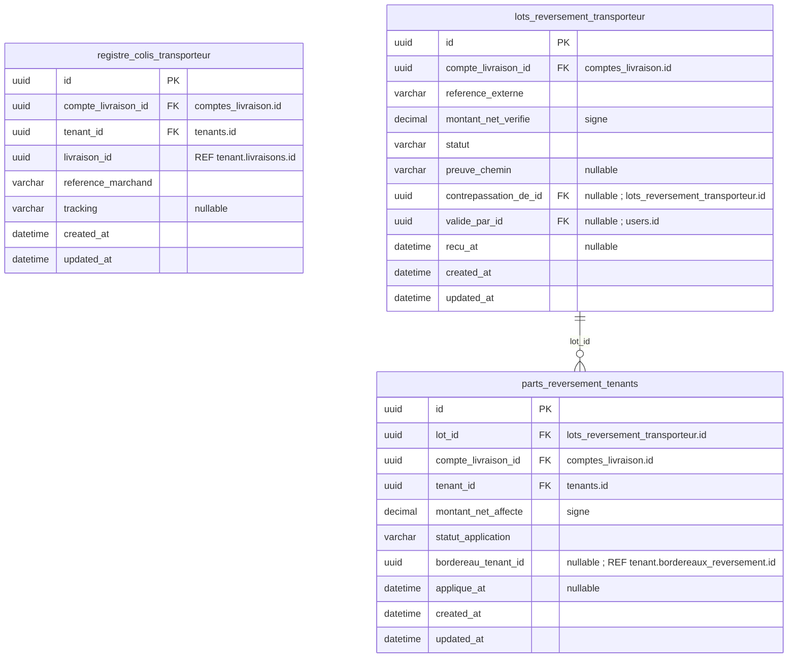

#### Explication très simple des champs

**`registre_colis_transporteur` :**

- **`id`** : le numéro unique qui permet de reconnaître cette ligne dans la base. Deux lignes différentes ne peuvent pas avoir le même `id`.
- **`compte_livraison_id`** : l’identifiant du compte transporteur. Il sert à relier cette ligne à la bonne information au lieu de recopier toutes ses données.
- **`tenant_id`** : l’identifiant de la boutique. Il sert à relier cette ligne à la bonne information au lieu de recopier toutes ses données.
- **`livraison_id`** : l’identifiant de la livraison. Il sert à relier cette ligne à la bonne information au lieu de recopier toutes ses données.
- **`reference_marchand`** : un numéro stable créé côté marchand/SaaS pour reconnaître le colis chez le transporteur.
- **`tracking`** : le numéro de suivi du colis donné par le transporteur. Ce champ peut rester vide quand cette information n’est pas nécessaire ou pas encore connue.
- **`created_at`** : la date où cette ligne a été créée dans la base.
- **`updated_at`** : la date de la dernière modification de cette ligne. Exemple : si tu modifies l’élément aujourd’hui, cette date devient celle d’aujourd’hui.

**`lots_reversement_transporteur` :**

- **`id`** : le numéro unique qui permet de reconnaître cette ligne dans la base. Deux lignes différentes ne peuvent pas avoir le même `id`.
- **`compte_livraison_id`** : l’identifiant du compte transporteur. Il sert à relier cette ligne à la bonne information au lieu de recopier toutes ses données.
- **`reference_externe`** : le numéro donné par un système extérieur. Exemple : référence d’un reversement chez le transporteur.
- **`montant_net_verifie`** : le montant net réellement vérifié pour ce lot, après contrôle des informations disponibles.
- **`statut`** : indique où en est l’élément. Exemple : `en_attente`, `actif`, `termine` ou `annule` selon la table.
- **`preuve_chemin`** : l’endroit où est rangé le fichier servant de preuve, par exemple un reçu ou un bordereau. Le fichier lui-même n’est pas stocké dans ce champ. Ce champ peut rester vide quand cette information n’est pas nécessaire ou pas encore connue.
- **`contrepassation_de_id`** : l’identifiant de l’ancienne écriture annulée par une écriture inverse. Il sert à relier cette ligne à la bonne information au lieu de recopier toutes ses données. Ce champ peut rester vide quand cette information n’est pas nécessaire ou pas encore connue.
- **`valide_par_id`** : l’identifiant de la personne qui a validé. Il sert à relier cette ligne à la bonne information au lieu de recopier toutes ses données. Ce champ peut rester vide quand cette information n’est pas nécessaire ou pas encore connue.
- **`recu_at`** : la date et l’heure liées à **recu**. Elle permet de savoir exactement quand cette étape a eu lieu. Ce champ peut rester vide quand cette information n’est pas nécessaire ou pas encore connue.
- **`created_at`** : la date où cette ligne a été créée dans la base.
- **`updated_at`** : la date de la dernière modification de cette ligne. Exemple : si tu modifies l’élément aujourd’hui, cette date devient celle d’aujourd’hui.

**`parts_reversement_tenants` :**

- **`id`** : le numéro unique qui permet de reconnaître cette ligne dans la base. Deux lignes différentes ne peuvent pas avoir le même `id`.
- **`lot_id`** : l’identifiant du lot de reversement. Il sert à relier cette ligne à la bonne information au lieu de recopier toutes ses données.
- **`compte_livraison_id`** : l’identifiant du compte transporteur. Il sert à relier cette ligne à la bonne information au lieu de recopier toutes ses données.
- **`tenant_id`** : l’identifiant de la boutique. Il sert à relier cette ligne à la bonne information au lieu de recopier toutes ses données.
- **`montant_net_affecte`** : la partie du montant global attribuée à cette boutique.
- **`statut_application`** : indique si la part ou l’opération a déjà été appliquée dans la base de la boutique. Exemple : `en_attente`, `appliquee` ou `erreur`.
- **`bordereau_tenant_id`** : l’identifiant du bordereau créé dans la base de la boutique. Il sert à relier cette ligne à la bonne information au lieu de recopier toutes ses données. Ce champ peut rester vide quand cette information n’est pas nécessaire ou pas encore connue.
- **`applique_at`** : la date et l’heure liées à **applique**. Elle permet de savoir exactement quand cette étape a eu lieu. Ce champ peut rester vide quand cette information n’est pas nécessaire ou pas encore connue.
- **`created_at`** : la date où cette ligne a été créée dans la base.
- **`updated_at`** : la date de la dernière modification de cette ligne. Exemple : si tu modifies l’élément aujourd’hui, cette date devient celle d’aujourd’hui.

- **`registre_colis_transporteur` :** UNIQUE(compte_livraison_id,reference_marchand), UNIQUE(compte_livraison_id,tracking) hors NULL, UNIQUE(tenant_id,livraison_id). FK(tenant_id,compte_livraison_id) → boutiques_comptes_livraison(tenant_id,compte_livraison_id). Référence marchand stable calculée depuis tenant et livraison, sans données personnelles. Routage immuable dès envoi. Les événements inconnus ne sont pas appliqués à une boutique par simple ressemblance de numéro ; rapprochement manuel. Le job consomme le compte une fois et route seulement les identifiants connus.
- **`lots_reversement_transporteur` :** UNIQUE(compte_livraison_id,reference_externe), UNIQUE(id,compte_livraison_id), UNIQUE(contrepassation_de_id) hors NULL. Statut=brouillon|valide|annule. Un lot validé est figé ; annulation financière via lot inverse, jamais en retirant les montants historiques. Contrôle de preuve et validation humaine si l’API ne fournit pas un bordereau détaillé. Montant signé pour les paiements de frais. Une référence de saisie manuelle doit être stable et contrôlée pour éviter les doublons.
- **`parts_reversement_tenants` :** UNIQUE(lot_id,tenant_id), FK(lot_id,compte_livraison_id) → lots_reversement_transporteur(id,compte_livraison_id), FK(tenant_id,compte_livraison_id) → boutiques_comptes_livraison(tenant_id,compte_livraison_id). Avant validation du lot, somme des parts = net vérifié sous verrou du lot. Parts figées après validation ; statut_application=en_attente|appliquee|erreur. Chaque BDD tenant crée son bordereau de façon idempotente sur UNIQUE(part_centrale_id). Un crash entre commit tenant et accusé central est repris en recherchant cette même clé. Le central prouve la réception globale ; les lignes locales en expliquent la ventilation. Ne jamais additionner les montants centraux aux locaux dans le résultat financier.

Il n’existe pas de transaction atomique couvrant arbitrairement les deux connexions : enregistrement durable, clés stables, états de reprise et réconciliation sont obligatoires. Un compte personnel à une seule boutique utilise le même protocole. Un livreur interne, sans compte central, utilise directement les bordereaux locaux.

### C9 — Historique des déploiements des BDD

**`deploiements_schema_tenants` — L’historique de création et de mise à jour technique des bases des boutiques. Exemple : la mise à jour de la boutique de Karim a réussi, tandis qu’une autre doit être réessayée.**

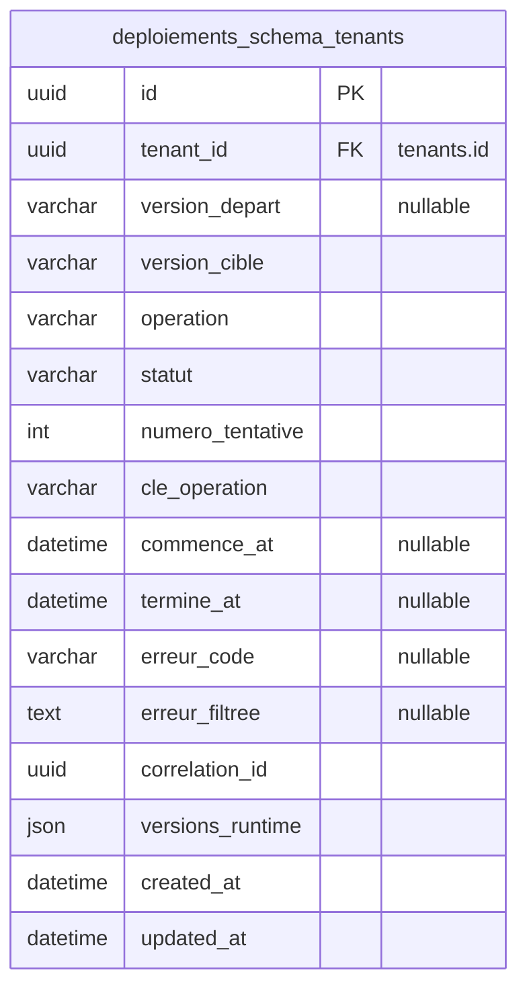

#### Explication très simple des champs

**`deploiements_schema_tenants` :**

- **`id`** : le numéro unique qui permet de reconnaître cette ligne dans la base. Deux lignes différentes ne peuvent pas avoir le même `id`.
- **`tenant_id`** : l’identifiant de la boutique. Il sert à relier cette ligne à la bonne information au lieu de recopier toutes ses données.
- **`version_depart`** : la version technique présente avant la migration. Ce champ peut rester vide quand cette information n’est pas nécessaire ou pas encore connue.
- **`version_cible`** : la version technique que l’on veut installer.
- **`operation`** : le type de travail technique réalisé. Exemple : création de base, migration ou restauration.
- **`statut`** : indique où en est l’élément. Exemple : `en_attente`, `actif`, `termine` ou `annule` selon la table.
- **`numero_tentative`** : le numéro de l’essai. Exemple : 1 pour le premier essai, 2 après un nouvel essai.
- **`cle_operation`** : une clé unique utilisée pour reconnaître une opération déjà faite. Exemple : si le serveur reçoit deux fois la même demande après une coupure, cette clé aide à éviter de faire l’opération deux fois.
- **`commence_at`** : la date et l’heure où la période ou l’action commence. Ce champ peut rester vide quand cette information n’est pas nécessaire ou pas encore connue.
- **`termine_at`** : la date et l’heure où elle s’est terminée. Peut rester vide tant que ce n’est pas terminé.
- **`erreur_code`** : un petit code qui permet de reconnaître le type d’erreur sans stocker un long message sensible. Ce champ peut rester vide quand cette information n’est pas nécessaire ou pas encore connue.
- **`erreur_filtree`** : un message d’erreur nettoyé pour ne pas enregistrer de mot de passe, jeton ou autre secret. Ce champ peut rester vide quand cette information n’est pas nécessaire ou pas encore connue.
- **`correlation_id`** : un numéro commun utilisé pour relier plusieurs traces qui appartiennent à la même grande opération. Exemple : une création de boutique qui produit plusieurs actions techniques.
- **`versions_runtime`** : la liste des versions réellement utilisées pendant l’opération. Exemple : version de PHP, Laravel, MySQL et de l’application.
- **`created_at`** : la date où cette ligne a été créée dans la base.
- **`updated_at`** : la date de la dernière modification de cette ligne. Exemple : si tu modifies l’élément aujourd’hui, cette date devient celle d’aujourd’hui.

**Contraintes :** UNIQUE(cle_operation), index(tenant_id,created_at). operation=provisionnement|migration|restauration_controle ; statut=en_attente|en_cours|reussi|echec. Une seule opération en cours par tenant via clé générée conditionnelle UNIQUE et verrou de déploiement. Chaque reprise conserve l’échec précédent et crée une nouvelle tentative. versions_runtime fige PHP, Laravel, stancl/tenancy, MySQL et version applicative réellement utilisés. tenants.version_schema est mis à jour seulement après succès ; la table technique migrations de chaque BDD reste le détail des migrations exécutées. Une migration échouée ne rend pas le tenant actif. Après restauration, contrôler références centrales, autorisations, registre transporteur, parts de règlements et jobs avant réactivation. Une intention externe incertaine reste à rapprocher ; ne pas la renvoyer aveuglément après restauration.

### C10 — Identité légale du vendeur

**`entites_legales` — Les informations officielles du vendeur utilisées notamment sur les factures. Exemple : le nom de son entreprise, son adresse légale et ses identifiants. Dans ce modèle, un propriétaire a une seule identité légale pour ses boutiques.**

**Hypothèse MVP retenue : un propriétaire correspond à une seule entité légale, commune à ses boutiques.** Ce choix reprend F9/G1 des notes ; il ne découle pas de la propriété technique du compte. Gérer plusieurs sociétés pour un même propriétaire nécessiterait un rattachement explicite par tenant et une migration dédiée.

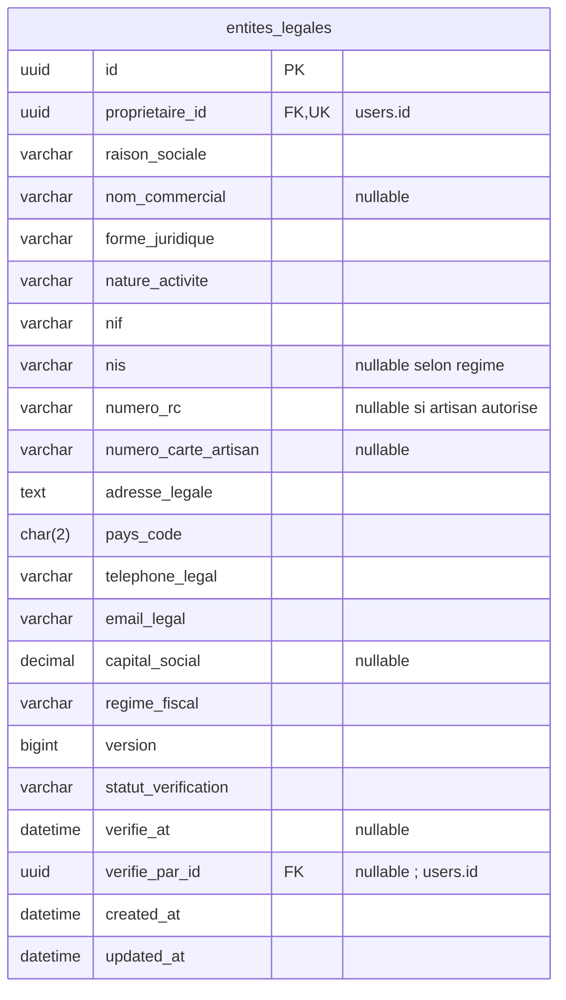

#### Explication très simple des champs

**`entites_legales` :**

- **`id`** : le numéro unique qui permet de reconnaître cette ligne dans la base. Deux lignes différentes ne peuvent pas avoir le même `id`.
- **`proprietaire_id`** : l’identifiant du propriétaire. Il sert à relier cette ligne à la bonne information au lieu de recopier toutes ses données.
- **`raison_sociale`** : le nom légal de l’entreprise ou de l’activité du vendeur.
- **`nom_commercial`** : le nom utilisé commercialement s’il est différent du nom légal. Ce champ peut rester vide quand cette information n’est pas nécessaire ou pas encore connue.
- **`forme_juridique`** : la forme juridique déclarée de l’activité.
- **`nature_activite`** : le type d’activité exercée par le vendeur.
- **`nif`** : le numéro d’identification fiscale, conservé comme texte.
- **`nis`** : le numéro d’identification statistique lorsqu’il est nécessaire. Ce champ peut rester vide quand cette information n’est pas nécessaire ou pas encore connue.
- **`numero_rc`** : le numéro du registre de commerce lorsqu’il s’applique. Ce champ peut rester vide quand cette information n’est pas nécessaire ou pas encore connue.
- **`numero_carte_artisan`** : le numéro de carte d’artisan lorsqu’il s’applique. Ce champ peut rester vide quand cette information n’est pas nécessaire ou pas encore connue.
- **`adresse_legale`** : l’adresse officielle de l’entité légale.
- **`pays_code`** : le code court du pays. Exemple : `DZ` pour l’Algérie.
- **`telephone_legal`** : le téléphone officiel de l’entité légale.
- **`email_legal`** : l’email officiel de l’entité légale.
- **`capital_social`** : le capital social déclaré lorsqu’il existe.
- **`regime_fiscal`** : le régime fiscal déclaré pour cette entité.
- **`version`** : le numéro de version de cet élément. Exemple : version 1, puis version 2 après une évolution ; l’ancienne version peut rester conservée pour comprendre l’historique.
- **`statut_verification`** : indique où en est la vérification. Exemple : `a_verifier`, `verifiee` ou `a_corriger`.
- **`verifie_at`** : la date où l’information a été vérifiée. Ce champ peut rester vide quand cette information n’est pas nécessaire ou pas encore connue.
- **`verifie_par_id`** : l’identifiant de la personne qui a vérifié. Il sert à relier cette ligne à la bonne information au lieu de recopier toutes ses données. Ce champ peut rester vide quand cette information n’est pas nécessaire ou pas encore connue.
- **`created_at`** : la date où cette ligne a été créée dans la base.
- **`updated_at`** : la date de la dernière modification de cette ligne. Exemple : si tu modifies l’élément aujourd’hui, cette date devient celle d’aujourd’hui.

UNIQUE(proprietaire_id) ; FK RESTRICT. Numéros conservés en chaînes, normalisation et validation selon le régime déclaré, pas de longueur numérique algérienne imposée à un identifiant international futur. Au moins RC ou carte artisan renseigné dans un profil vérifié ; conditions de validité contrôlées selon activité. Capital NULL si inapplicable ; sinon >=0. `statut_verification=a_completer|a_verifier|verifiee|a_corriger` ; absence d’identité vérifiée bloque l’activation commerciale, pas la création du brouillon de boutique. Propriétaire immuable. Un changement incrémente version, révoque la validation si nécessaire et laisse une trace filtrée au central.

La révision acceptée et les factures figent `entite_legale_id`, version et données requises dans leur snapshot vendeur. Cette copie est une preuve historique, pas un second profil modifiable. Lire l’identité centrale dans une courte transaction et utiliser ce snapshot déterminé pour l’opération locale ; aucune promesse de commit distribué. Un changement de société juridiquement distincte n’est pas traité comme une simple correction de libellé. Adresse commerciale, nom de boutique et identité légale sont trois notions distinctes.

### C11 — Politiques et exécutions de conservation

**`politiques_retention` — Les règles qui indiquent combien de temps garder chaque catégorie de données et quoi faire ensuite. Exemple : supprimer certaines données à la fin d’une durée validée.**

**`executions_retention` — L’historique des opérations qui appliquent ces règles de conservation. Exemple : une tâche a traité des données anciennes et indique combien de lignes ont été traitées ou ignorées.**

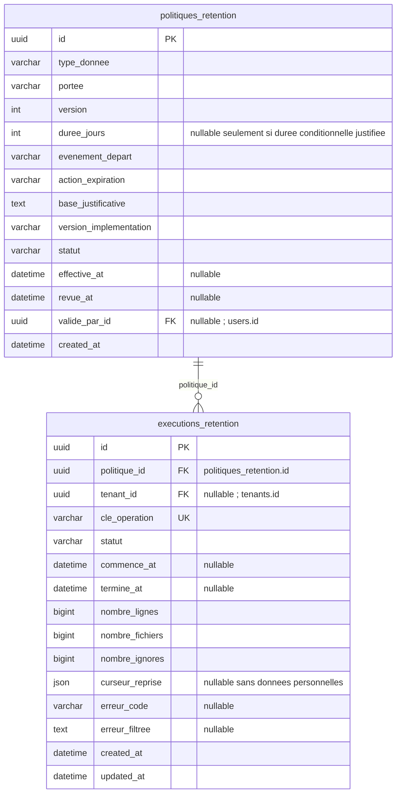

#### Explication très simple des champs

**`politiques_retention` :**

- **`id`** : le numéro unique qui permet de reconnaître cette ligne dans la base. Deux lignes différentes ne peuvent pas avoir le même `id`.
- **`type_donnee`** : le type de données concerné par la règle. Exemple : données de commande ou données de contact.
- **`portee`** : indique dans quel endroit la règle s’applique. Exemple : `plateforme` pour l’administration du SaaS ou `tenant` pour une boutique.
- **`version`** : le numéro de version de cet élément. Exemple : version 1, puis version 2 après une évolution ; l’ancienne version peut rester conservée pour comprendre l’historique.
- **`duree_jours`** : le nombre de jours pendant lesquels les données doivent être gardées lorsque la règle utilise une durée fixe. Ce champ peut rester vide quand cette information n’est pas nécessaire ou pas encore connue.
- **`evenement_depart`** : l’événement à partir duquel on commence à compter la durée. Exemple : fermeture d’une commande.
- **`action_expiration`** : ce qu’il faut faire à la fin de la durée. Exemple : supprimer, anonymiser ou conserver si une raison validée l’exige.
- **`base_justificative`** : le texte qui explique pourquoi cette règle de conservation existe.
- **`version_implementation`** : la version du traitement informatique qui applique cette règle.
- **`statut`** : indique où en est l’élément. Exemple : `en_attente`, `actif`, `termine` ou `annule` selon la table.
- **`effective_at`** : la date à partir de laquelle cette version devient réellement applicable. Ce champ peut rester vide quand cette information n’est pas nécessaire ou pas encore connue.
- **`revue_at`** : la date prévue ou réalisée pour revoir cette règle. Ce champ peut rester vide quand cette information n’est pas nécessaire ou pas encore connue.
- **`valide_par_id`** : l’identifiant de la personne qui a validé. Il sert à relier cette ligne à la bonne information au lieu de recopier toutes ses données. Ce champ peut rester vide quand cette information n’est pas nécessaire ou pas encore connue.
- **`created_at`** : la date où cette ligne a été créée dans la base.

**`executions_retention` :**

- **`id`** : le numéro unique qui permet de reconnaître cette ligne dans la base. Deux lignes différentes ne peuvent pas avoir le même `id`.
- **`politique_id`** : l’identifiant de la règle de conservation. Il sert à relier cette ligne à la bonne information au lieu de recopier toutes ses données.
- **`tenant_id`** : l’identifiant de la boutique. Il sert à relier cette ligne à la bonne information au lieu de recopier toutes ses données. Ce champ peut rester vide quand cette information n’est pas nécessaire ou pas encore connue.
- **`cle_operation`** : une clé unique utilisée pour reconnaître une opération déjà faite. Exemple : si le serveur reçoit deux fois la même demande après une coupure, cette clé aide à éviter de faire l’opération deux fois.
- **`statut`** : indique où en est l’élément. Exemple : `en_attente`, `actif`, `termine` ou `annule` selon la table.
- **`commence_at`** : la date et l’heure où la période ou l’action commence. Ce champ peut rester vide quand cette information n’est pas nécessaire ou pas encore connue.
- **`termine_at`** : la date et l’heure où elle s’est terminée. Peut rester vide tant que ce n’est pas terminé.
- **`nombre_lignes`** : le nombre de lignes de base traitées par l’opération.
- **`nombre_fichiers`** : le nombre de fichiers traités par l’opération.
- **`nombre_ignores`** : le nombre d’éléments laissés de côté parce qu’ils ne pouvaient pas encore être supprimés ou traités.
- **`curseur_reprise`** : une petite information technique qui indique où reprendre après une coupure, sans recommencer tout le travail depuis le début. Ce champ peut rester vide quand cette information n’est pas nécessaire ou pas encore connue.
- **`erreur_code`** : un petit code qui permet de reconnaître le type d’erreur sans stocker un long message sensible. Ce champ peut rester vide quand cette information n’est pas nécessaire ou pas encore connue.
- **`erreur_filtree`** : un message d’erreur nettoyé pour ne pas enregistrer de mot de passe, jeton ou autre secret. Ce champ peut rester vide quand cette information n’est pas nécessaire ou pas encore connue.
- **`created_at`** : la date où cette ligne a été créée dans la base.
- **`updated_at`** : la date de la dernière modification de cette ligne. Exemple : si tu modifies l’élément aujourd’hui, cette date devient celle d’aujourd’hui.

- `politiques_retention` : UNIQUE(type_donnee,portee,version), portee=central|tenant. action_expiration=purge|anonymise|conserve ; statut=brouillon|validee|retiree. Durée positive lorsqu’elle existe ; `conserve` exige un fondement et une date/condition de revue, jamais « pour toujours » par défaut. La définition appliquée est immuable ; nouvelle version pour toute évolution. La version applicable à une exécution est choisie explicitement selon effective_at et enregistrée dans politique_id ; une seule version courante résolue par catégorie/portée. L’implémentation est une allowlist de traitements serveur, pas du SQL administrable. Les durées ne sont pas inventées ici : elles sont validées avant collecte réelle.
- `executions_retention` : scope central → tenant NULL ; scope tenant → tenant obligatoire, vérifié côté service. statut=en_attente|en_cours|reussie|echec ; UNIQUE(cle_operation), clé déterministe politique/tenant/fenêtre. Le lot local est idempotent, son ACK central peut être repris ; compteurs reconstruits depuis les lots techniques persistés, pas incrémentés aveuglément après un crash. Pas de copie des données effacées dans le journal. Les exécutions centrales n’ont accès qu’au tenant annoncé ; reprise avec curseur stable. Voir section 12 pour les dépendances, gels de conservation et sauvegardes.

### C12 — Sauvegardes/restaurations tenant, registre documentaire et reprise centrale

**`configurations_sauvegardes` — Le planning des copies de sécurité d’une boutique. Exemple : sauvegarder chaque jour à une heure choisie et conserver les copies pendant la durée prévue.**

**`limites_sauvegardes_plans` — Ce que chaque abonnement autorise pour les sauvegardes. Exemple : permettre ou non de choisir l’heure, et limiter le nombre de copies conservées.**

**`sauvegardes_tenants` — La liste des copies de sécurité réalisées ou tentées pour les boutiques. Exemple : la sauvegarde de lundi a réussi ; on conserve sa date et l’emplacement de son fichier protégé.**

**`restaurations_tenants` — L’historique des tentatives pour remettre une boutique dans l’état d’une sauvegarde. Exemple : restaurer la copie de lundi, puis vérifier les données avant de rouvrir la boutique.**

**`operations_centrales_tenants` — Les opérations centrales à transmettre ou à réappliquer à une boutique, avec leur état. Exemple : après une restauration, retrouver une opération centrale que la copie restaurée ne contient pas encore.**

**`registre_documents_emis` — La liste durable des documents déjà émis et de leurs numéros. Exemple : après une restauration, empêcher qu’un numéro de facture déjà utilisé soit attribué à une autre facture.**

Les sauvegardes tenant sont pilotées au central, afin que leurs références et l’historique de restauration ne disparaissent pas avec la BDD tenant restaurée. Les fichiers sont privés, chiffrés et accompagnés d’une empreinte ; les clés de chiffrement ne sont pas conservées dans ces tables. **La BDD centrale possède en plus son propre backup/PITR et son propre runbook de reprise, stockés/pilotés hors de la BDD centrale elle-même.** C12 conserve aussi un registre durable des identités documentaires émises afin qu’une restauration tenant ne puisse pas réutiliser un numéro déjà sorti du système.

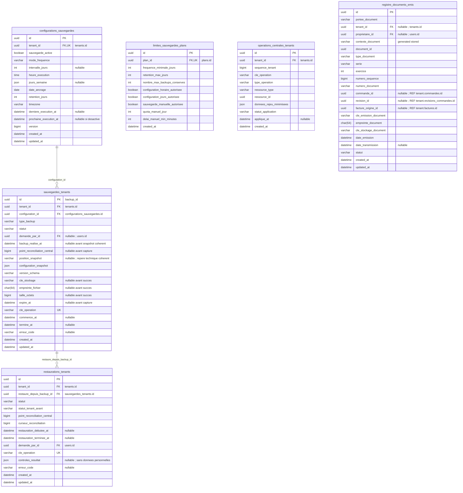

#### Explication très simple des champs

**`configurations_sauvegardes` :**

- **`id`** : le numéro unique qui permet de reconnaître cette ligne dans la base. Deux lignes différentes ne peuvent pas avoir le même `id`.
- **`tenant_id`** : l’identifiant de la boutique. Il sert à relier cette ligne à la bonne information au lieu de recopier toutes ses données.
- **`sauvegarde_active`** : indique si les sauvegardes automatiques de cette boutique sont activées.
- **`mode_frequence`** : indique comment le planning est défini. Exemple : tous les X jours ou certains jours de la semaine.
- **`intervalle_jours`** : le nombre de jours entre deux sauvegardes. Exemple : `2` = une sauvegarde tous les deux jours. Ce champ peut rester vide quand cette information n’est pas nécessaire ou pas encore connue.
- **`heure_execution`** : l’heure à laquelle la sauvegarde automatique doit démarrer.
- **`jours_semaine`** : les jours choisis quand le planning utilise des jours précis. Exemple : lundi, mercredi et vendredi. Ce champ peut rester vide quand cette information n’est pas nécessaire ou pas encore connue.
- **`date_ancrage`** : la date de départ utilisée pour calculer les répétitions. Exemple : si on sauvegarde tous les 3 jours, on compte à partir de cette date.
- **`retention_jours`** : le nombre de jours pendant lesquels une sauvegarde est gardée avant de pouvoir être supprimée.
- **`timezone`** : la zone horaire utilisée pour calculer correctement les heures de cette configuration.
- **`derniere_execution_at`** : la dernière fois où cette tâche a été exécutée. Ce champ peut rester vide quand cette information n’est pas nécessaire ou pas encore connue.
- **`prochaine_execution_at`** : la prochaine date prévue pour exécuter automatiquement cette tâche. Ce champ peut rester vide quand cette information n’est pas nécessaire ou pas encore connue.
- **`version`** : le numéro de version de cet élément. Exemple : version 1, puis version 2 après une évolution ; l’ancienne version peut rester conservée pour comprendre l’historique.
- **`created_at`** : la date où cette ligne a été créée dans la base.
- **`updated_at`** : la date de la dernière modification de cette ligne. Exemple : si tu modifies l’élément aujourd’hui, cette date devient celle d’aujourd’hui.

**`limites_sauvegardes_plans` :**

- **`id`** : le numéro unique qui permet de reconnaître cette ligne dans la base. Deux lignes différentes ne peuvent pas avoir le même `id`.
- **`plan_id`** : l’identifiant du plan d’abonnement. Il sert à relier cette ligne à la bonne information au lieu de recopier toutes ses données.
- **`frequence_minimale_jours`** : le plus petit intervalle autorisé par le plan. Exemple : `1` permet au maximum une sauvegarde planifiée chaque jour.
- **`retention_max_jours`** : la durée maximale pendant laquelle le plan permet de garder les sauvegardes.
- **`nombre_max_backups_conserves`** : le nombre maximum de sauvegardes qui peuvent rester conservées en même temps.
- **`configuration_horaire_autorisee`** : indique si ce plan permet au commerçant de choisir lui-même l’heure de sauvegarde.
- **`configuration_jours_autorisee`** : indique si ce plan permet de choisir des jours précis de sauvegarde.
- **`sauvegarde_manuelle_autorisee`** : indique si le commerçant peut lancer une sauvegarde manuellement.
- **`quota_manuel_jour`** : le nombre maximum de sauvegardes manuelles autorisées dans une journée. Exemple : `2` = deux sauvegardes manuelles aujourd’hui, puis le compteur repart demain.
- **`delai_manuel_min_minutes`** : le nombre minimum de minutes à attendre entre deux sauvegardes manuelles.
- **`created_at`** : la date où cette ligne a été créée dans la base.

**`sauvegardes_tenants` :**

- **`id`** : le numéro unique qui permet de reconnaître cette ligne dans la base. Deux lignes différentes ne peuvent pas avoir le même `id`.
- **`tenant_id`** : l’identifiant de la boutique. Il sert à relier cette ligne à la bonne information au lieu de recopier toutes ses données.
- **`configuration_id`** : l’identifiant de la configuration. Il sert à relier cette ligne à la bonne information au lieu de recopier toutes ses données.
- **`type_backup`** : le type de sauvegarde réalisé. Exemple : sauvegarde automatique ou manuelle selon les valeurs prévues.
- **`statut`** : indique où en est l’élément. Exemple : `en_attente`, `actif`, `termine` ou `annule` selon la table.
- **`demande_par_id`** : l’identifiant de la personne qui a fait la demande. Il sert à relier cette ligne à la bonne information au lieu de recopier toutes ses données. Ce champ peut rester vide quand cette information n’est pas nécessaire ou pas encore connue.
- **`backup_realise_at`** : la date où la sauvegarde a réellement été produite. Ce champ peut rester vide quand cette information n’est pas nécessaire ou pas encore connue.
- **`point_reconciliation_central`** : la position ou référence utilisée pour savoir jusqu’où les opérations centrales ont été rapprochées après une restauration. Ce champ peut rester vide quand cette information n’est pas nécessaire ou pas encore connue.
- **`position_snapshot`** : une **copie figée** de position au moment important de l’opération. Si l’information d’origine change plus tard, cette ancienne ligne garde la valeur utilisée à ce moment-là. Ce champ peut rester vide quand cette information n’est pas nécessaire ou pas encore connue.
- **`configuration_snapshot`** : une **copie figée** de configuration au moment important de l’opération. Si l’information d’origine change plus tard, cette ancienne ligne garde la valeur utilisée à ce moment-là.
- **`version_schema`** : la version du schéma de base de données installée pour cette boutique. Elle aide à savoir si une migration technique manque.
- **`cle_stockage`** : le chemin ou la clé interne utilisée pour retrouver le fichier dans le stockage privé/public. Ce champ peut rester vide quand cette information n’est pas nécessaire ou pas encore connue.
- **`empreinte_fichier`** : une signature calculée à partir du fichier pour vérifier qu’il n’a pas été modifié ou abîmé. Ce champ peut rester vide quand cette information n’est pas nécessaire ou pas encore connue.
- **`taille_octets`** : la taille du fichier. Ce champ peut rester vide quand cette information n’est pas nécessaire ou pas encore connue.
- **`expire_at`** : la date où l’élément n’est plus valable. Ce champ peut rester vide quand cette information n’est pas nécessaire ou pas encore connue.
- **`cle_operation`** : une clé unique utilisée pour reconnaître une opération déjà faite. Exemple : si le serveur reçoit deux fois la même demande après une coupure, cette clé aide à éviter de faire l’opération deux fois.
- **`commence_at`** : la date et l’heure où la période ou l’action commence. Ce champ peut rester vide quand cette information n’est pas nécessaire ou pas encore connue.
- **`termine_at`** : la date et l’heure où elle s’est terminée. Peut rester vide tant que ce n’est pas terminé.
- **`erreur_code`** : un petit code qui permet de reconnaître le type d’erreur sans stocker un long message sensible. Ce champ peut rester vide quand cette information n’est pas nécessaire ou pas encore connue.
- **`created_at`** : la date où cette ligne a été créée dans la base.
- **`updated_at`** : la date de la dernière modification de cette ligne. Exemple : si tu modifies l’élément aujourd’hui, cette date devient celle d’aujourd’hui.

**`restaurations_tenants` :**

- **`id`** : le numéro unique qui permet de reconnaître cette ligne dans la base. Deux lignes différentes ne peuvent pas avoir le même `id`.
- **`tenant_id`** : l’identifiant de la boutique. Il sert à relier cette ligne à la bonne information au lieu de recopier toutes ses données.
- **`restaure_depuis_backup_id`** : l’identifiant de la sauvegarde utilisée pour restaurer. Il sert à relier cette ligne à la bonne information au lieu de recopier toutes ses données.
- **`statut`** : indique où en est l’élément. Exemple : `en_attente`, `actif`, `termine` ou `annule` selon la table.
- **`statut_tenant_avant`** : indique où en est **tenant avant**. Exemple : en attente, actif, terminé ou en erreur selon les valeurs prévues pour cette table.
- **`point_reconciliation_central`** : la position ou référence utilisée pour savoir jusqu’où les opérations centrales ont été rapprochées après une restauration.
- **`curseur_reconciliation`** : un numéro qui indique jusqu’où le rapprochement a déjà été fait après une restauration. Cela permet de reprendre sans tout recommencer.
- **`restauration_debutee_at`** : la date où la restauration a commencé. Ce champ peut rester vide quand cette information n’est pas nécessaire ou pas encore connue.
- **`restauration_terminee_at`** : la date où la restauration s’est terminée. Ce champ peut rester vide quand cette information n’est pas nécessaire ou pas encore connue.
- **`demande_par_id`** : l’identifiant de la personne qui a fait la demande. Il sert à relier cette ligne à la bonne information au lieu de recopier toutes ses données.
- **`cle_operation`** : une clé unique utilisée pour reconnaître une opération déjà faite. Exemple : si le serveur reçoit deux fois la même demande après une coupure, cette clé aide à éviter de faire l’opération deux fois.
- **`controles_resultat`** : le résultat des vérifications faites après restauration avant de rouvrir la boutique. Ce champ peut rester vide quand cette information n’est pas nécessaire ou pas encore connue.
- **`erreur_code`** : un petit code qui permet de reconnaître le type d’erreur sans stocker un long message sensible. Ce champ peut rester vide quand cette information n’est pas nécessaire ou pas encore connue.
- **`created_at`** : la date où cette ligne a été créée dans la base.
- **`updated_at`** : la date de la dernière modification de cette ligne. Exemple : si tu modifies l’élément aujourd’hui, cette date devient celle d’aujourd’hui.

**`operations_centrales_tenants` :**

- **`id`** : le numéro unique qui permet de reconnaître cette ligne dans la base. Deux lignes différentes ne peuvent pas avoir le même `id`.
- **`tenant_id`** : l’identifiant de la boutique. Il sert à relier cette ligne à la bonne information au lieu de recopier toutes ses données.
- **`sequence_tenant`** : le numéro d’ordre de l’opération pour cette boutique. Exemple : 15 signifie qu’elle vient après l’opération 14.
- **`cle_operation`** : une clé unique utilisée pour reconnaître une opération déjà faite. Exemple : si le serveur reçoit deux fois la même demande après une coupure, cette clé aide à éviter de faire l’opération deux fois.
- **`type_operation`** : indique quelle action a été faite sur les données ou le système. Exemple : export, suppression ou anonymisation.
- **`ressource_type`** : le type d’élément concerné. Exemple : client, commande ou fichier.
- **`ressource_id`** : l’identifiant de l’élément précis concerné. Il peut rester vide si l’opération porte sur un lot entier.
- **`donnees_rejeu_minimisees`** : plusieurs petits réglages liés à **donnees rejeu minimisees**, regroupés ensemble de manière structurée.
- **`statut_application`** : indique si la part ou l’opération a déjà été appliquée dans la base de la boutique. Exemple : `en_attente`, `appliquee` ou `erreur`.
- **`applique_at`** : la date et l’heure liées à **applique**. Elle permet de savoir exactement quand cette étape a eu lieu. Ce champ peut rester vide quand cette information n’est pas nécessaire ou pas encore connue.
- **`created_at`** : la date où cette ligne a été créée dans la base.

**`registre_documents_emis` :**

- **`id`** : le numéro unique qui permet de reconnaître cette ligne dans la base. Deux lignes différentes ne peuvent pas avoir le même `id`.
- **`portee_document`** : indique à quel ensemble appartient la numérotation du document. Exemple : série propre à une boutique ou au SaaS.
- **`tenant_id`** : l’identifiant de la boutique. Il sert à relier cette ligne à la bonne information au lieu de recopier toutes ses données. Ce champ peut rester vide quand cette information n’est pas nécessaire ou pas encore connue.
- **`proprietaire_id`** : l’identifiant du propriétaire. Il sert à relier cette ligne à la bonne information au lieu de recopier toutes ses données. Ce champ peut rester vide quand cette information n’est pas nécessaire ou pas encore connue.
- **`contexte_document`** : une valeur technique calculée qui permet de reconnaître clairement la série de documents concernée.
- **`document_id`** : l’identifiant du document. Il sert à relier cette ligne à la bonne information au lieu de recopier toutes ses données.
- **`type_document`** : indique quel document c’est. Exemple : facture, avoir ou autre type prévu.
- **`serie`** : le code de série utilisé dans la numérotation. Exemple : `FAC` pour les factures.
- **`exercice`** : l’année ou période de numérotation concernée. Exemple : `2026`.
- **`numero_sequence`** : le nombre utilisé à l’intérieur de la série du document. Exemple : `123` dans `FAC-2026-000123`.
- **`numero_document`** : le numéro lisible du document. Exemple : `FAC-2026-000123`.
- **`commande_id`** : l’identifiant de la commande. Il sert à relier cette ligne à la bonne information au lieu de recopier toutes ses données. Ce champ peut rester vide quand cette information n’est pas nécessaire ou pas encore connue.
- **`revision_id`** : l’identifiant de la version de la commande. Il sert à relier cette ligne à la bonne information au lieu de recopier toutes ses données. Ce champ peut rester vide quand cette information n’est pas nécessaire ou pas encore connue.
- **`facture_origine_id`** : l’identifiant de la facture d’origine. Il sert à relier cette ligne à la bonne information au lieu de recopier toutes ses données. Ce champ peut rester vide quand cette information n’est pas nécessaire ou pas encore connue.
- **`cle_emission_document`** : une clé unique qui empêche d’émettre deux fois deux documents différents pour la même demande.
- **`empreinte_document`** : une signature du contenu du document qui permet de vérifier qu’il est resté identique.
- **`cle_stockage_document`** : une clé technique stable pour reconnaître stockage document. Elle aide surtout à éviter les doublons quand la même demande est reçue deux fois.
- **`date_emission`** : la date officielle d’émission du document.
- **`date_transmission`** : la date où le document a été transmis. Ce champ peut rester vide quand cette information n’est pas nécessaire ou pas encore connue.
- **`statut`** : indique où en est l’élément. Exemple : `en_attente`, `actif`, `termine` ou `annule` selon la table.
- **`created_at`** : la date où cette ligne a été créée dans la base.
- **`updated_at`** : la date de la dernière modification de cette ligne. Exemple : si tu modifies l’élément aujourd’hui, cette date devient celle d’aujourd’hui.

- **Configuration :** une ligne par tenant, créée au provisionnement. Politique minimale automatique sur tous les plans ; l’utilisateur ne désactive pas la protection obligatoire, `sauvegarde_active=false` est réservé à une suspension technique auditée. Exemple initial configurable : tous les 7 jours à 02:00, rétention 14 jours, Africa/Algiers. Ce sont des valeurs de produit, pas des durées légales. `mode_frequence=quotidien|intervalle|jours_semaine`. Quotidien : intervalle/jours NULL ; intervalle : intervalle_jours>=1 et jours NULL ; jours_semaine : intervalle NULL et tableau non vide de jours ISO 1–7 distincts. CHECK des champs dépendants, validation serveur du JSON. Date d’ancrage locale fixe le cycle d’intervalle ; calculer les échéances en timezone puis stocker les instants en UTC. Une échéance ratée produit au plus un rattrapage, pas une avalanche de sauvegardes. Changements sous verrou configuration, version incrémentée ; les backups précédents gardent leur expire_at.
- **Limites du plan :** une ligne immuable avec chaque version de plan ; valeurs entières positives (quota/délai manuels peuvent valoir zéro pour interdiction/absence de délai). Les options payantes sont représentées par une version de plan incluant l’option ou des exceptions fonctionnelles validées, sans modifier un plan historique. Valider l’espacement minimal réel des jours choisis, pas seulement leur nombre ; fréquence, rétention, choix horaire/jours et sauvegarde manuelle doivent respecter les droits effectifs. Quota manuel : fenêtre locale définie, verrou propriétaire/configuration et comptage des demandes acceptées, y compris en attente. Après downgrade, adapter les futures exécutions au plan gratuit ; aucune réduction rétroactive de expire_at des backups existants. Le maximum conservé bloque une nouvelle demande manuelle ou déclenche une alerte capacité si tous les backups sont encore protégés ; ne pas supprimer une pièce avant son expiration pour faire de la place. Le service doit conserver la protection automatique minimale.
- **Backups :** type_backup=automatique|manuel|avant_migration ; statut=programme|en_cours|termine|echec|expire|supprime. UNIQUE(id,tenant_id), FK(configuration_id,tenant_id) → configurations_sauvegardes(id,tenant_id), parent UNIQUE. Clé automatique déterministe tenant/créneau ; un retry reprend la même intention. Les champs fichier, empreinte, taille>=0, point et date de snapshot sont obligatoires pour termine ; expire_at calculé à la capture selon configuration_snapshot. Une expiration logique ne prouve pas une suppression physique ; celle-ci doit être vérifiée et auditée. Aucun backup incomplet proposé pour restauration. Vérifier réellement intégrité et restauration périodique. Conserver le journal de métadonnées après suppression du fichier.
- **Journal central durable :** UNIQUE(tenant_id,sequence_tenant), UNIQUE(tenant_id,cle_operation). Sous verrou du tenant, allouer la séquence et écrire l’intention dans la même transaction que la mutation centrale concernée. Un simple AUTO_INCREMENT global ou un timestamp n’est pas présenté comme un ordre de commit sûr. Aucune opération centrale affectant le tenant ne contourne ce protocole : projection de profil, part de reversement, routage, état d’abonnement à appliquer, etc. Le contenu de rejeu contient des identifiants et des faits minimisés, jamais les coordonnées acheteur. L’application locale utilise sa clé métier/outbox de déduplication ; l’ACK central est une projection, pas une preuve que la BDD restaurée possède encore l’écriture. Conserver les intentions nécessaires au moins jusqu’à expiration des backups qui peuvent les précéder, avec politique de rétention validée.
- **Registre documentaire durable — AUD-04 :** `portee_document=tenant|saas`. Pour `tenant`, `tenant_id` est obligatoire et `proprietaire_id` peut être NULL ; pour `saas`, `tenant_id` est NULL et `proprietaire_id` est obligatoire. `contexte_document` est une valeur technique normalisée utilisée dans les contraintes. Imposer UNIQUE(contexte_document,type_document,serie,exercice,numero_sequence), UNIQUE(contexte_document,numero_document), UNIQUE(contexte_document,document_id) et UNIQUE(contexte_document,cle_emission_document). Une identité enregistrée comme émise n’est jamais réutilisable. `cle_stockage_document` pointe vers un PDF/snapshot privé hors du périmètre de restauration de la BDD tenant, avec empreinte SHA-256. L’enregistrement central et le stockage objet ne sont pas une transaction distribuée : clé stable, états intermédiaires, reprise et rapprochement obligatoires. Une pièce tenant ne peut être transmise avant que son identité d’émission et son snapshot durable soient retrouvables.
- **Point de réconciliation :** pour capturer un backup cohérent, mettre temporairement les écritures métier et workers du tenant en pause, attendre les transactions actives, acquérir les verrous de coordination centraux, relever le dernier préfixe contigu appliqué, puis établir le snapshot cohérent local avant de reprendre les écritures. Toute intention non acquittée, même antérieure au point, reste dans la liste de réconciliation. Une opération externe déjà envoyée ne doit pas être oubliée : conserver son intention technique minimale et son résultat/incertitude au central avant appel, puis rapprocher ; aucun rejeu HTTP mutateur automatique. Si un snapshot cohérent ne peut être obtenu, la sauvegarde échoue explicitement.
- **Restauration :** FK(restaure_depuis_backup_id,tenant_id) → sauvegardes_tenants(id,tenant_id). Une seule restauration active par tenant via clé générée UNIQUE. Statut=demande|en_cours|reconciliation|terminee|echec. Sous contrôle d’exploitation, passer le tenant à suspendu_restauration, bloquer checkout/écritures et fencing des workers, vérifier backup/empreinte/version, restaurer puis rattraper les migrations compatibles. Rechercher les intentions postérieures au point ET toutes les antérieures non convergées ; vérifier leurs clés dans la BDD locale et recréer uniquement les faits absents. Rejouer n’exécute pas une seconde collecte de fonds ni une seconde création de colis. Rapprocher transporteur/finance, jobs, fichiers et politiques de rétention, puis contrôler stock, FK, quotas et autorisations. Après convergence seulement, recalculer le statut autorisé (actif, hors_quota ou suspension administrative), jamais forcer actif. Un échec reste suspendu_restauration ; la reprise garde la même cle_operation.
- **Protection de la numérotation après restauration — AUD-04 :** avant toute réouverture documentaire, comparer `sequences_documents`, `factures`, transmissions locales, `registre_documents_emis` et les objets S3/MinIO. Si la base restaurée propose 101 mais que le registre connaît 101–103, la prochaine position sûre doit être >=104 selon la série applicable. Une pièce déjà transmise doit être retransmise avec le même numéro/snapshot, jamais recréée sous une nouvelle identité. Si l’historique ne peut pas être reconstruit avec certitude, bloquer toute nouvelle émission.
- **Reprise de la BDD centrale — AUD-09 :** les backups complets, binlogs/PITR, manifestes de sauvegarde et clés nécessaires à leur déchiffrement sont conservés hors du serveur/volume de la BDD centrale et testés régulièrement. Lors d’une perte/restauration du central, un **mode `reprise_centrale` porté par l’orchestrateur ou l’exploitation, donc extérieur à la BDD restaurée**, bloque au minimum les mutations de permissions, tenants, abonnements, secrets, règlements/reversements et opérations externes irréversibles. Restaurer le central, identifier le point temporel, récupérer les clés/secret manager, puis rapprocher avec les BDD tenant, banque/transporteurs, stockage documentaire et journaux externes avant réactivation. Une permission révoquée après le backup ne doit pas être réintroduite ; un règlement déjà exécuté ne doit jamais être rejoué. Invalider caches et jobs sensibles après restauration. Si un état critique reste ambigu, conserver l’accès/action concerné bloqué (`bloquee_reconciliation`) plutôt que deviner. Le central restauré est un état ancien connu, pas automatiquement la vérité actuelle.

Une sauvegarde ancienne ne permet pas de reconstituer toute commande locale créée après sa capture à partir des seuls journaux centraux. Prévoir les sauvegardes des journaux binaires/PITR et la sauvegarde/version des fichiers pour le RPO validé ; à défaut, documenter la perte potentielle et traiter manuellement les objets transporteur orphelins. Le point central assure une réconciliation inter-systèmes, pas une garantie de perte de données nulle.

### C13 — Facturation du SaaS au commerçant

**`sequences_facturation_saas` — Les compteurs qui donnent les prochains numéros aux factures et aux avoirs du SaaS. Exemple : deux factures d’abonnement créées en même temps doivent recevoir des numéros différents.**

**`factures_saas` — Les factures du SaaS adressées aux commerçants pour leurs abonnements ou options. Exemple : la facture de l’abonnement Pro de Karim ; ce n’est pas une facture pour un produit vendu dans sa boutique.**

**`lignes_factures_saas` — Le détail de ce qui est facturé au commerçant. Exemple : une ligne pour l’abonnement et une autre pour une option, avec leurs prix et leurs taxes.**

**`avoirs_saas` — Les documents qui corrigent à la baisse une facture du SaaS déjà émise. Exemple : retirer un montant facturé en trop. Un avoir ne prouve pas que de l’argent a été remboursé.**

**`lignes_avoirs_saas` — Le détail des éléments corrigés sur une facture du SaaS. Exemple : préciser quelle option avait été facturée en trop et de combien son montant est réduit.**

**`transmissions_documents_saas` — Le suivi de l’envoi des factures et des avoirs aux commerçants. Exemple : la facture de Karim est en attente d’envoi, envoyée ou en échec.**

Cette facturation est indépendante des ventes de chaque boutique. Une échéance est une dette d’abonnement ; elle n’est pas automatiquement une facture. La règle fiscale d’émission est versionnée dans C14 et doit être validée avant activation commerciale.

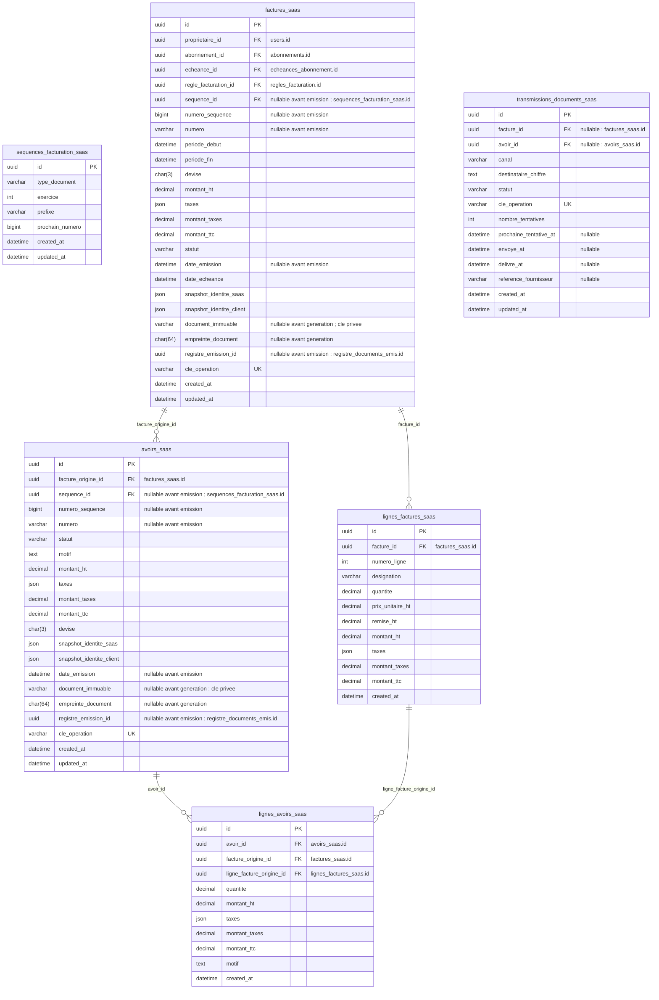

#### Explication très simple des champs

**`sequences_facturation_saas` :**

- **`id`** : le numéro unique qui permet de reconnaître cette ligne dans la base. Deux lignes différentes ne peuvent pas avoir le même `id`.
- **`type_document`** : indique quel document c’est. Exemple : facture, avoir ou autre type prévu.
- **`exercice`** : l’année ou période de numérotation concernée. Exemple : `2026`.
- **`prefixe`** : le début fixe ajouté devant les numéros. Exemple : `FAC` pour les factures.
- **`prochain_numero`** : le prochain nombre disponible dans cette série. Exemple : si le dernier document était 102, le prochain peut être 103.
- **`created_at`** : la date où cette ligne a été créée dans la base.
- **`updated_at`** : la date de la dernière modification de cette ligne. Exemple : si tu modifies l’élément aujourd’hui, cette date devient celle d’aujourd’hui.

**`factures_saas` :**

- **`id`** : le numéro unique qui permet de reconnaître cette ligne dans la base. Deux lignes différentes ne peuvent pas avoir le même `id`.
- **`proprietaire_id`** : l’identifiant du propriétaire. Il sert à relier cette ligne à la bonne information au lieu de recopier toutes ses données.
- **`abonnement_id`** : l’identifiant de l’abonnement. Il sert à relier cette ligne à la bonne information au lieu de recopier toutes ses données.
- **`echeance_id`** : l’identifiant de l’échéance à payer. Il sert à relier cette ligne à la bonne information au lieu de recopier toutes ses données.
- **`regle_facturation_id`** : la règle de facturation précise utilisée pour décider comment ce document devait être créé.
- **`sequence_id`** : l’identifiant du compteur de numérotation. Il sert à relier cette ligne à la bonne information au lieu de recopier toutes ses données. Ce champ peut rester vide quand cette information n’est pas nécessaire ou pas encore connue.
- **`numero_sequence`** : le nombre utilisé à l’intérieur de la série du document. Exemple : `123` dans `FAC-2026-000123`. Ce champ peut rester vide quand cette information n’est pas nécessaire ou pas encore connue.
- **`numero`** : le numéro lisible de l’élément. Exemple : numéro d’échéance ou de facture selon la table. Ce champ peut rester vide quand cette information n’est pas nécessaire ou pas encore connue.
- **`periode_debut`** : le début de la période concernée. Exemple : début du mois payé.
- **`periode_fin`** : la fin de la période concernée. Exemple : fin du mois payé. Peut rester vide lorsque la période n’a pas de fin prévue.
- **`devise`** : la monnaie utilisée. Exemple : `DZD` pour le dinar algérien.
- **`montant_ht`** : le montant avant taxes.
- **`taxes`** : plusieurs petits réglages liés à **taxes**, regroupés ensemble de manière structurée.
- **`montant_taxes`** : le montant total des taxes.
- **`montant_ttc`** : le montant final avec les taxes.
- **`statut`** : indique où en est l’élément. Exemple : `en_attente`, `actif`, `termine` ou `annule` selon la table.
- **`date_emission`** : la date officielle d’émission du document. Ce champ peut rester vide quand cette information n’est pas nécessaire ou pas encore connue.
- **`date_echeance`** : la date utilisée pour **echeance**.
- **`snapshot_identite_saas`** : une copie figée des informations légales du SaaS au moment de la facture. Si le profil change plus tard, l’ancienne facture garde les anciennes informations.
- **`snapshot_identite_client`** : une copie figée du nom, téléphone et adresse nécessaires à cette commande. Si le client donne plus tard une autre adresse, l’ancienne commande garde ce qu’elle utilisait.
- **`document_immuable`** : indique que le document, une fois officiellement émis, ne doit plus être modifié comme un simple brouillon. Ce champ peut rester vide quand cette information n’est pas nécessaire ou pas encore connue.
- **`empreinte_document`** : une signature du contenu du document qui permet de vérifier qu’il est resté identique. Ce champ peut rester vide quand cette information n’est pas nécessaire ou pas encore connue.
- **`registre_emission_id`** : l’identifiant de l’enregistrement du document émis. Il sert à relier cette ligne à la bonne information au lieu de recopier toutes ses données. Ce champ peut rester vide quand cette information n’est pas nécessaire ou pas encore connue.
- **`cle_operation`** : une clé unique utilisée pour reconnaître une opération déjà faite. Exemple : si le serveur reçoit deux fois la même demande après une coupure, cette clé aide à éviter de faire l’opération deux fois.
- **`created_at`** : la date où cette ligne a été créée dans la base.
- **`updated_at`** : la date de la dernière modification de cette ligne. Exemple : si tu modifies l’élément aujourd’hui, cette date devient celle d’aujourd’hui.

**`lignes_factures_saas` :**

- **`id`** : le numéro unique qui permet de reconnaître cette ligne dans la base. Deux lignes différentes ne peuvent pas avoir le même `id`.
- **`facture_id`** : l’identifiant de la facture. Il sert à relier cette ligne à la bonne information au lieu de recopier toutes ses données.
- **`numero_ligne`** : la position de cette ligne dans le document. Exemple : 1 pour la première ligne, 2 pour la deuxième.
- **`designation`** : le nom ou texte qui explique ce qui est facturé sur cette ligne. Exemple : « Abonnement Pro — septembre 2026 ».
- **`quantite`** : le nombre d’éléments concernés. Exemple : `2` signifie deux unités du produit.
- **`prix_unitaire_ht`** : le prix correspondant à **unitaire HT**.
- **`remise_ht`** : la réduction appliquée avant taxes sur cette ligne.
- **`montant_ht`** : le montant avant taxes.
- **`taxes`** : plusieurs petits réglages liés à **taxes**, regroupés ensemble de manière structurée.
- **`montant_taxes`** : le montant total des taxes.
- **`montant_ttc`** : le montant final avec les taxes.
- **`created_at`** : la date où cette ligne a été créée dans la base.

**`avoirs_saas` :**

- **`id`** : le numéro unique qui permet de reconnaître cette ligne dans la base. Deux lignes différentes ne peuvent pas avoir le même `id`.
- **`facture_origine_id`** : l’identifiant de la facture d’origine. Il sert à relier cette ligne à la bonne information au lieu de recopier toutes ses données.
- **`sequence_id`** : l’identifiant du compteur de numérotation. Il sert à relier cette ligne à la bonne information au lieu de recopier toutes ses données. Ce champ peut rester vide quand cette information n’est pas nécessaire ou pas encore connue.
- **`numero_sequence`** : le nombre utilisé à l’intérieur de la série du document. Exemple : `123` dans `FAC-2026-000123`. Ce champ peut rester vide quand cette information n’est pas nécessaire ou pas encore connue.
- **`numero`** : le numéro lisible de l’élément. Exemple : numéro d’échéance ou de facture selon la table. Ce champ peut rester vide quand cette information n’est pas nécessaire ou pas encore connue.
- **`statut`** : indique où en est l’élément. Exemple : `en_attente`, `actif`, `termine` ou `annule` selon la table.
- **`motif`** : explique pourquoi l’action ou la décision a été faite.
- **`montant_ht`** : le montant avant taxes.
- **`taxes`** : plusieurs petits réglages liés à **taxes**, regroupés ensemble de manière structurée.
- **`montant_taxes`** : le montant total des taxes.
- **`montant_ttc`** : le montant final avec les taxes.
- **`devise`** : la monnaie utilisée. Exemple : `DZD` pour le dinar algérien.
- **`snapshot_identite_saas`** : une copie figée des informations légales du SaaS au moment de la facture. Si le profil change plus tard, l’ancienne facture garde les anciennes informations.
- **`snapshot_identite_client`** : une copie figée du nom, téléphone et adresse nécessaires à cette commande. Si le client donne plus tard une autre adresse, l’ancienne commande garde ce qu’elle utilisait.
- **`date_emission`** : la date officielle d’émission du document. Ce champ peut rester vide quand cette information n’est pas nécessaire ou pas encore connue.
- **`document_immuable`** : indique que le document, une fois officiellement émis, ne doit plus être modifié comme un simple brouillon. Ce champ peut rester vide quand cette information n’est pas nécessaire ou pas encore connue.
- **`empreinte_document`** : une signature du contenu du document qui permet de vérifier qu’il est resté identique. Ce champ peut rester vide quand cette information n’est pas nécessaire ou pas encore connue.
- **`registre_emission_id`** : l’identifiant de l’enregistrement du document émis. Il sert à relier cette ligne à la bonne information au lieu de recopier toutes ses données. Ce champ peut rester vide quand cette information n’est pas nécessaire ou pas encore connue.
- **`cle_operation`** : une clé unique utilisée pour reconnaître une opération déjà faite. Exemple : si le serveur reçoit deux fois la même demande après une coupure, cette clé aide à éviter de faire l’opération deux fois.
- **`created_at`** : la date où cette ligne a été créée dans la base.
- **`updated_at`** : la date de la dernière modification de cette ligne. Exemple : si tu modifies l’élément aujourd’hui, cette date devient celle d’aujourd’hui.

**`lignes_avoirs_saas` :**

- **`id`** : le numéro unique qui permet de reconnaître cette ligne dans la base. Deux lignes différentes ne peuvent pas avoir le même `id`.
- **`avoir_id`** : l’identifiant de l’avoir. Il sert à relier cette ligne à la bonne information au lieu de recopier toutes ses données.
- **`facture_origine_id`** : l’identifiant de la facture d’origine. Il sert à relier cette ligne à la bonne information au lieu de recopier toutes ses données.
- **`ligne_facture_origine_id`** : l’identifiant de la ligne de facture d’origine. Il sert à relier cette ligne à la bonne information au lieu de recopier toutes ses données.
- **`quantite`** : le nombre d’éléments concernés. Exemple : `2` signifie deux unités du produit.
- **`montant_ht`** : le montant avant taxes.
- **`taxes`** : plusieurs petits réglages liés à **taxes**, regroupés ensemble de manière structurée.
- **`montant_taxes`** : le montant total des taxes.
- **`montant_ttc`** : le montant final avec les taxes.
- **`motif`** : explique pourquoi l’action ou la décision a été faite.
- **`created_at`** : la date où cette ligne a été créée dans la base.

**`transmissions_documents_saas` :**

- **`id`** : le numéro unique qui permet de reconnaître cette ligne dans la base. Deux lignes différentes ne peuvent pas avoir le même `id`.
- **`facture_id`** : l’identifiant de la facture. Il sert à relier cette ligne à la bonne information au lieu de recopier toutes ses données. Ce champ peut rester vide quand cette information n’est pas nécessaire ou pas encore connue.
- **`avoir_id`** : l’identifiant de l’avoir. Il sert à relier cette ligne à la bonne information au lieu de recopier toutes ses données. Ce champ peut rester vide quand cette information n’est pas nécessaire ou pas encore connue.
- **`canal`** : indique par quel moyen on communique. Exemple : téléphone ou WhatsApp.
- **`destinataire_chiffre`** : les coordonnées du destinataire enregistrées de manière protégée lorsqu’elles doivent être conservées.
- **`statut`** : indique où en est l’élément. Exemple : `en_attente`, `actif`, `termine` ou `annule` selon la table.
- **`cle_operation`** : une clé unique utilisée pour reconnaître une opération déjà faite. Exemple : si le serveur reçoit deux fois la même demande après une coupure, cette clé aide à éviter de faire l’opération deux fois.
- **`nombre_tentatives`** : le nombre de **tentatives**. Exemple : `3` signifie qu’il y en a trois.
- **`prochaine_tentative_at`** : la date prévue pour retenter l’opération après un échec récupérable. Ce champ peut rester vide quand cette information n’est pas nécessaire ou pas encore connue.
- **`envoye_at`** : la date où l’envoi a été effectué. Ce champ peut rester vide quand cette information n’est pas nécessaire ou pas encore connue.
- **`delivre_at`** : la date où la réception ou livraison du message a été confirmée quand cette information existe. Ce champ peut rester vide quand cette information n’est pas nécessaire ou pas encore connue.
- **`reference_fournisseur`** : le numéro de facture, reçu ou référence donné par le fournisseur. Ce champ peut rester vide quand cette information n’est pas nécessaire ou pas encore connue.
- **`created_at`** : la date où cette ligne a été créée dans la base.
- **`updated_at`** : la date de la dernière modification de cette ligne. Exemple : si tu modifies l’élément aujourd’hui, cette date devient celle d’aujourd’hui.

- **Factures :** UNIQUE(numero) hors NULL, UNIQUE(sequence_id,numero_sequence), UNIQUE(cle_operation). Statut=brouillon|emise|annulee_brouillon. La période est [debut,fin), fin>debut ; montants>=0, HT+taxes=TTC et égalité aux sommes de lignes. DZD au MVP. Contrôler structure et somme du JSON taxes. FK(abonnement_id,proprietaire_id) → abonnements(id,user_id), clé parent UNIQUE ; FK(echeance_id,abonnement_id) → echeances_abonnement(id,abonnement_id), clé parent UNIQUE. Le fait générateur durable déclenche obligatoirement une facture par échéance/occurrence validée avec une clé stable ; aucun doublon au retry. L’échéance et les règlements conservent leur sens de dette/paiements, les rectifications fiscales passent par avoir. Une correction du dû après facture/avoir doit être rapprochée, jamais changée silencieusement pour correspondre au paiement. Aucun remboursement SaaS automatique n’est inféré d’un avoir. **Décision AUD-16 : le SaaS n’exécute ni ne suit comme trésorerie interne les remboursements réels d’abonnement.** Les paiements sont validés manuellement sur reçu/preuve ; une résiliation normale laisse la période déjà payée active jusqu’à son terme, puis empêche le renouvellement payant. Un remboursement exceptionnel, s’il est décidé, reste une procédure manuelle externe à l’application et ne crée donc pas de table `decaissements_saas` dans le périmètre actuel. Un avoir reste un document de correction et non une preuve que de l’argent a été remis. Ne pas utiliser une contrepassation de paiement pour prétendre que le paiement initial n’a jamais eu lieu. Si le produit commence un jour à exécuter ou suivre ces remboursements réels, un journal de décaissements dédié deviendra obligatoire.
- **Lignes :** UNIQUE(facture_id,numero_ligne), UNIQUE(id,facture_id), quantité>0, prix/remise/base/taxes/TTC>=0. Version du plan, période et nature de l’option incluses dans la désignation/snapshot document ; aucun recalcul historique depuis le plan courant. Émission seulement avec au moins une ligne et identité légale du SaaS et du client complètes.
- **Avoirs :** origine obligatoire, facture émise de même devise ; montants positifs exprimant la réduction, pas un règlement. UNIQUE(numero), UNIQUE(sequence_id,numero_sequence), UNIQUE(id,facture_origine_id). FK(avoir_id,facture_origine_id) → avoirs_saas(id,facture_origine_id) et FK(ligne_facture_origine_id,facture_origine_id) → lignes_factures_saas(id,facture_id). UNIQUE(avoir_id,ligne_facture_origine_id). Sous verrou facture puis lignes, les avoirs émis et brouillons réservés ne dépassent ni quantités ni HT/taxes/TTC facturés ; annuler un brouillon libère sa réserve. Période, propriétaire et abonnement sont obtenus depuis la facture d’origine ; ne pas maintenir des copies modifiables concurrentes.
- **Numérotation et immutabilité :** UNIQUE(type_document,exercice), type=facture|avoir, prochain_numero>0 ; allocation sous verrou, pas MAX+1. Contrôler le type de séquence avant émission. Facture/avoir émis et leurs lignes sont immuables via triggers/privilèges ; correction par nouveau document lié. Fichier privé `central/...` produit depuis snapshots figés, renseigné une seule fois avec empreinte. **Avant transmission, facture/avoir SaaS inscrit son identité dans `registre_documents_emis` avec `portee_document=saas`, puis renseigne `registre_emission_id`.** Comme ce registre appartient lui aussi au central, une restauration centrale doit le rapprocher avec le stockage documentaire versionné/immuable et les manifestes/PITR externes avant toute nouvelle émission ; aucune séquence restaurée n’est reprise aveuglément. La numérotation SaaS concerne son émetteur légal, pas les séries commerciales des tenants.
- **Transmission :** exactement une FK facture/avoir non NULL ; même protocole durable que T19, créé à l’émission, reprise avec clé stable, statut=en_attente|en_cours|envoye|delivre|echec_reessayable|echec_definitif|incertain. PDF ou lien accessible après autorisation ; un portail consultable seul ne prouve pas l’envoi. Les flux SaaS ne sont jamais additionnés aux recettes des boutiques.

### C14 — Règles de facturation et gouvernance des données

**`regles_facturation` — Les règles validées qui indiquent quand et comment produire les documents de facturation. Exemple : quel événement doit déclencher une facture. Les anciennes versions restent conservées.**

**`registre_activites_traitement` — Explique quelles données personnelles sont utilisées, pourquoi, par qui et pendant combien de temps. Exemple : documenter l’utilisation des coordonnées nécessaires à une livraison, sans lister tous les acheteurs.**

**`journal_operations_donnees_personnelles_central` — Le carnet des opérations réellement faites sur les données personnelles au niveau central. Exemple : noter qui a exporté des données et quand, sans recopier toutes ces données dans le carnet.**

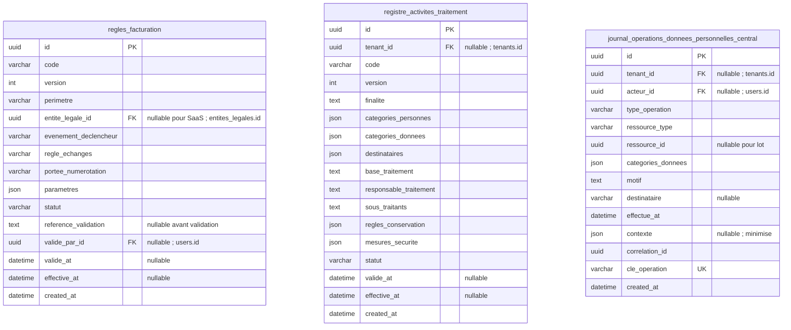

#### Explication très simple des champs

**`regles_facturation` :**

- **`id`** : le numéro unique qui permet de reconnaître cette ligne dans la base. Deux lignes différentes ne peuvent pas avoir le même `id`.
- **`code`** : le petit nom utilisé par le programme pour reconnaître l’élément. Exemple : `boutiques.nombre` ou `produits.creer`.
- **`version`** : le numéro de version de cet élément. Exemple : version 1, puis version 2 après une évolution ; l’ancienne version peut rester conservée pour comprendre l’historique.
- **`perimetre`** : indique à quelle partie du système la règle s’applique. Exemple : `saas` ou `boutique`.
- **`entite_legale_id`** : l’identifiant de l’identité légale du vendeur. Il sert à relier cette ligne à la bonne information au lieu de recopier toutes ses données. Ce champ peut rester vide quand cette information n’est pas nécessaire ou pas encore connue.
- **`evenement_declencheur`** : l’événement qui dit « maintenant, il faut appliquer cette règle ». Exemple : une vente finalisée qui déclenche l’émission d’une facture.
- **`regle_echanges`** : explique comment les échanges/remplacements doivent être traités pour la facturation.
- **`portee_numerotation`** : indique à quel niveau les numéros sont uniques. Exemple : une série propre à une boutique ou une série du SaaS.
- **`parametres`** : les réglages supplémentaires de cette règle, regroupés dans un format structuré.
- **`statut`** : indique où en est l’élément. Exemple : `en_attente`, `actif`, `termine` ou `annule` selon la table.
- **`reference_validation`** : la référence qui prouve ou explique qui a validé cette règle et sur quelle base. Ce champ peut rester vide quand cette information n’est pas nécessaire ou pas encore connue.
- **`valide_par_id`** : l’identifiant de la personne qui a validé. Il sert à relier cette ligne à la bonne information au lieu de recopier toutes ses données. Ce champ peut rester vide quand cette information n’est pas nécessaire ou pas encore connue.
- **`valide_at`** : la date et l’heure liées à **valide**. Elle permet de savoir exactement quand cette étape a eu lieu. Ce champ peut rester vide quand cette information n’est pas nécessaire ou pas encore connue.
- **`effective_at`** : la date à partir de laquelle cette version devient réellement applicable. Ce champ peut rester vide quand cette information n’est pas nécessaire ou pas encore connue.
- **`created_at`** : la date où cette ligne a été créée dans la base.

**`registre_activites_traitement` :**

- **`id`** : le numéro unique qui permet de reconnaître cette ligne dans la base. Deux lignes différentes ne peuvent pas avoir le même `id`.
- **`tenant_id`** : l’identifiant de la boutique. Il sert à relier cette ligne à la bonne information au lieu de recopier toutes ses données. Ce champ peut rester vide quand cette information n’est pas nécessaire ou pas encore connue.
- **`code`** : le petit nom utilisé par le programme pour reconnaître l’élément. Exemple : `boutiques.nombre` ou `produits.creer`.
- **`version`** : le numéro de version de cet élément. Exemple : version 1, puis version 2 après une évolution ; l’ancienne version peut rester conservée pour comprendre l’historique.
- **`finalite`** : explique pourquoi les données personnelles sont utilisées. Exemple : utiliser une adresse pour livrer une commande.
- **`categories_personnes`** : les groupes de personnes concernés. Exemple : acheteurs, commerçants ou membres d’équipe.
- **`categories_donnees`** : les types d’informations concernés. Exemple : nom, téléphone ou adresse, sans recopier toutes les valeurs ici.
- **`destinataires`** : les personnes ou services qui peuvent recevoir ces données. Exemple : le transporteur pour livrer le colis.
- **`base_traitement`** : explique la raison qui autorise ou justifie ce traitement de données selon la règle validée.
- **`responsable_traitement`** : indique qui décide pourquoi et comment ces données sont utilisées.
- **`sous_traitants`** : indique les prestataires qui traitent des données pour le service.
- **`regles_conservation`** : résume les règles qui disent combien de temps ces données sont gardées.
- **`mesures_securite`** : résume les protections mises en place. Exemple : chiffrement, limitation des accès et journalisation.
- **`statut`** : indique où en est l’élément. Exemple : `en_attente`, `actif`, `termine` ou `annule` selon la table.
- **`valide_at`** : la date et l’heure liées à **valide**. Elle permet de savoir exactement quand cette étape a eu lieu. Ce champ peut rester vide quand cette information n’est pas nécessaire ou pas encore connue.
- **`effective_at`** : la date à partir de laquelle cette version devient réellement applicable. Ce champ peut rester vide quand cette information n’est pas nécessaire ou pas encore connue.
- **`created_at`** : la date où cette ligne a été créée dans la base.

**`journal_operations_donnees_personnelles_central` :**

- **`id`** : le numéro unique qui permet de reconnaître cette ligne dans la base. Deux lignes différentes ne peuvent pas avoir le même `id`.
- **`tenant_id`** : l’identifiant de la boutique. Il sert à relier cette ligne à la bonne information au lieu de recopier toutes ses données. Ce champ peut rester vide quand cette information n’est pas nécessaire ou pas encore connue.
- **`acteur_id`** : l’identifiant de la personne qui a fait l’action. Il sert à relier cette ligne à la bonne information au lieu de recopier toutes ses données. Ce champ peut rester vide quand cette information n’est pas nécessaire ou pas encore connue.
- **`type_operation`** : indique quelle action a été faite sur les données ou le système. Exemple : export, suppression ou anonymisation.
- **`ressource_type`** : le type d’élément concerné. Exemple : client, commande ou fichier.
- **`ressource_id`** : l’identifiant de l’élément précis concerné. Il peut rester vide si l’opération porte sur un lot entier.
- **`categories_donnees`** : les types d’informations concernés. Exemple : nom, téléphone ou adresse, sans recopier toutes les valeurs ici.
- **`motif`** : explique pourquoi l’action ou la décision a été faite.
- **`destinataire`** : indique à qui l’information ou le document a été envoyé lorsque cela doit être tracé. Ce champ peut rester vide quand cette information n’est pas nécessaire ou pas encore connue.
- **`effectue_at`** : la date où l’opération a réellement été faite.
- **`contexte`** : quelques informations utiles pour comprendre l’opération, sans recopier inutilement des données sensibles. Ce champ peut rester vide quand cette information n’est pas nécessaire ou pas encore connue.
- **`correlation_id`** : un numéro commun utilisé pour relier plusieurs traces qui appartiennent à la même grande opération. Exemple : une création de boutique qui produit plusieurs actions techniques.
- **`cle_operation`** : une clé unique utilisée pour reconnaître une opération déjà faite. Exemple : si le serveur reçoit deux fois la même demande après une coupure, cette clé aide à éviter de faire l’opération deux fois.
- **`created_at`** : la date où cette ligne a été créée dans la base.

- **Règles fiscales :** UNIQUE(code,version), perimetre=saas|boutique ; entite_legale_id requis pour boutique et NULL pour SaaS. Statut=brouillon|validee|retiree. Une version validée/utilisée est immuable ; la sélection de la version effective est déterministe et sans chevauchement par périmètre/émetteur, sous verrou de coordination. Le déclencheur exact, les échanges et la portée de numérotation ne sont pas inventés : valeurs `a_valider` admises seulement en brouillon. Aucune émission/activation commerciale sans règle validée. `portee_numerotation=boutique|entite_legale` pour les commerçants ; pour SaaS, émetteur SaaS. La validation d’un texte de règle n’exécute pas du code : allowlist d’événements et d’implémentations serveur versionnées. Pour les tenants, conserver copie exacte versionnée dans chaque obligation de facturation (T22) ; aucune FK inter-BDD.
- **Registre :** documentation des traitements, distincte du journal d’événements. UNIQUE(contexte_normalise,code,version), contexte=tenant UUID ou central ; pas de simple UNIQUE sur tenant_id nullable. Version utilisée immuable ; finalités, personnes, données, destinataires, responsabilités, conservation et mesures de sécurité sont documentés, sans liste nominative des acheteurs. Le responsable juridique/DPO valide périmètre, rôles SaaS/commerçant/transporteur, transferts et durées avant production.
- **Journal central :** opérations effectivement réalisées sur les données centrales ou les accès transversaux ; aucune copie des coordonnées des acheteurs. Append-only avec rôle d’écriture dédié, lecture restreinte et rétention privilégiée tracée. Événements métier : collecte, consultation_fiche_client, export_clients, transmission_transporteur, modification_donnee_personnelle, suppression_donnee_personnelle, anonymisation, chiffrement, effacement_retention, selon périmètre validé. Pour un export en lot, conserver nombre/catégories et référence sécurisée du lot, pas les 500 fiches. Ressources tenant référencées logiquement avec tenant_id obligatoire ; une lecture locale est journalisée localement en T21. Corrélation/déduplication évitent deux faits faussement distincts pour la même action. Ne pas journaliser chaque SELECT SQL.

## Annexe — Inventaire complet de la BDD centrale

### BDD centrale — 49 tables

1. `users`
2. `tenants`
3. `domains`
4. `membres_tenants`
5. `fonctionnalites`
6. `permissions`
7. `roles`
8. `roles_permissions`
9. `users_roles`
10. `membres_roles`
11. `exceptions_permissions`
12. `restrictions_admins`
13. `invitations_equipes`
14. `plans`
15. `plans_fonctionnalites`
16. `abonnements`
17. `exceptions_fonctionnalites`
18. `consommations_fonctionnalites`
19. `echeances_abonnement`
20. `reglements_abonnement`
21. `wilayas`
22. `communes`
23. `journal_audit_central`
24. `verifications_contacts`
25. `comptes_livraison`
26. `boutiques_comptes_livraison`
27. `tarifs_transporteur`
28. `registre_colis_transporteur`
29. `lots_reversement_transporteur`
30. `parts_reversement_tenants`
31. `deploiements_schema_tenants`
32. `entites_legales`
33. `politiques_retention`
34. `executions_retention`
35. `configurations_sauvegardes`
36. `limites_sauvegardes_plans`
37. `sauvegardes_tenants`
38. `restaurations_tenants`
39. `operations_centrales_tenants`
40. `registre_documents_emis`
41. `sequences_facturation_saas`
42. `factures_saas`
43. `lignes_factures_saas`
44. `avoirs_saas`
45. `lignes_avoirs_saas`
46. `transmissions_documents_saas`
47. `regles_facturation`
48. `registre_activites_traitement`
49. `journal_operations_donnees_personnelles_central`
