# Schéma BDD — SaaS e-commerce algérien

Version corrigée du 23 septembre 2026, intégrant les décisions DB-01 à DB-17 du document de rectifications fourni. Le présent fichier remplace les règles contradictoires de la version précédente. Il conserve son périmètre fonctionnel et explicite les garanties SQL, transactionnelles et inter-BDD.

Ce document contient **32 tables centrales et 56 tables par boutique**, dont une table de personnalisation réservée à une évolution. Les tables techniques Laravel (sessions, cache, jobs, migrations, réinitialisation de mot de passe) ne sont pas comptées. Les tables nouvelles de routage et de ventilation rendent cohérent le partage des comptes transporteur entre BDD séparées.

Les diagrammes sont répartis en modules pour rester exploitables. **Les champs, les références et les contraintes écrites font ensemble le schéma** : Mermaid ne peut pas imposer toutes les règles transactionnelles. Ce document n’est pas une migration SQL déjà exécutée.

## 1. Décisions retenues

| Sujet | Décision de conception |
|---|---|
| Isolation | Une BDD centrale, puis une BDD par boutique. Un même propriétaire peut avoir plusieurs boutiques. |
| Tenant | `tenants` désigne les boutiques isolées ; `boutique` contient le profil public dans chacune de leurs BDD. |
| Comptes | Identités et autorisations d’équipe au central, données commerciales au tenant. Pas de compte obligatoire pour les acheteurs. |
| Identifiants | UUID, pas ULID. UUID v4 est la convention proposée ; même représentation pour PK et références. |
| Marché | Algérie, DZD ; pas de moteur de taxes dans ce périmètre. |
| Produits | Produits physiques standards ou personnalisés, dont les bouquets. Aucun agenda de rendez-vous. |
| Catalogue | Produits, variantes, catégories hiérarchiques, images/vidéos, caractéristiques, étiquettes, promotions sans code. |
| Panier | Panier invité côté serveur ; plusieurs produits d’une seule boutique. |
| Commandes | Confirmation manuelle obligatoire ; révisions historisées ; aucun paiement carte. |
| Colis | Une commande donne au maximum un colis, avec l’ensemble de son contenu. Pas d’expédition fractionnée. |
| Retours | Le colis revient entier ; chaque article est ensuite inspecté pour remise en stock, quarantaine ou perte. |
| Remplacement | Nouvelle commande liée à la commande d’origine ; retour facultatif pour casse ou perte reconnue. Produits remplacés gratuits, livraison paramétrable. Aucun crédit client. |
| Stock | Physique vendable, réservé et quarantaine non négatifs. Survente facultative : seul le disponible peut être négatif. Pas de multi-entrepôts. |
| Argent | Montant COD global par colis, mais prix/coût détaillés par ligne dans ta BDD. Encaissement et reversement distincts. |
| Abonnement | Rattaché au propriétaire ; le gratuit limite à une boutique. Fonctionnalités, quotas et exceptions datées. |
| Administrateurs | Root complet ; administrateurs délégués limitables par action, boutique et compte ciblé. |
| Statistiques | Mesure interne des visiteurs et événements ; ventes/retours fondés sur les événements métier. Aucun GA4 requis. |
| Site | Un template, profil public, plusieurs adresses et liens sociaux. Personnalisation CSS encadrée plus tard. |
| Documents | Bons versionnés et factures historiques à snapshots ; conformité juridique/fiscale hors de cette correction fonctionnelle. |
| Propriété | Propriétaire fixé à la création et immuable ; gestion délégable. |
| Comptes transporteur | Comptes centraux partageables entre boutiques du même propriétaire ; secrets uniquement au central. |
| Conservation | Aucune suppression, anonymisation ou purge automatique dans le MVP. Expiration des accès et paniers sans suppression de leurs données. |

**Hypothèses tranchées pour avancer :** la création d’un panier ne réserve pas le stock ; la confirmation manuelle le réserve ; l’expédition le sort physiquement. Le tarif de livraison est calculé une seule fois par colis. Les ventes en caisse, stocks par magasin, comptes acheteurs, codes promo, cartes, calendrier social, API de publicité, marketplace et rendez-vous sont hors périmètre. Les langues du contenu ne sont pas multipliées automatiquement : un champ de langue par boutique et par utilisateur suffit tant qu’un catalogue multilingue n’est pas demandé.

## 2. Corrections nécessaires par rapport à ton premier modèle

1. **Conserver `articles_commande`.** Le montant global Ecotrack sert à l’encaissement du colis. Il ne remplace pas les prix, remises, quantités et coûts unitaires nécessaires à la rentabilité, au stock et au bon de commande.
2. **Dissocier produit et page marketing.** Une commande est liée aux variantes par ses lignes. Une page de vente est une origine facultative ; commander depuis `/shop`, un panier ou une saisie manuelle reste possible.
3. **Ne pas stocker le profil de boutique dans `users`.** Le nom du site, le logo, les adresses, les réseaux et les couleurs sont différents d’une boutique à une autre.
4. **Unifier produits simples et variantes.** Même un produit simple a une variante standard. Il n’y a ainsi qu’un seul emplacement pour le prix, le coût, le SKU et le stock.
5. **Distinguer permissions et abonnement.** Le plan indique ce que la boutique peut utiliser ; les permissions indiquent ce qu’un membre peut faire. Un gestionnaire peut modifier sans supprimer même si le propriétaire possède un plan complet.
6. **Conserver le retour comme entité.** Un statut de commande ne suffit pas pour inspecter les lignes, chiffrer les pertes et prouver la remise en stock.
7. **Préserver les versions.** Changer une variante avant expédition produit une nouvelle révision ; après expédition, l’ancien contenu reste intact.
8. **Distinguer les trois cycles.** Commercial, logistique et argent n’ont pas les mêmes événements ni la même fin.
9. **Pas de tables par heure/jour/mois/année.** Des dates et événements bien indexés permettent ces regroupements. Ne pas stocker `nombre_ventes` dans chaque produit comme source de vérité.
10. **`deleted_at` n’est pas universel.** Catalogue, rôles et contenu peuvent être archivés/restaurés. Commandes, audits et mouvements sont conservés avec annulation, clôture ou contrepassation, sans effacement métier.

## 3. Conventions de lecture et d’intégrité

- `uuid` : identifiant logique UUID ; proposition physique MySQL `CHAR(36)` avec une collation ASCII binaire cohérente. Normaliser en minuscules. Un stockage `BINARY(16)` reste une optimisation ultérieure, à appliquer partout de façon cohérente.
- `decimal` monétaire : `DECIMAL(14,2)` ; pas de FLOAT/DOUBLE pour l’argent. Poids/dimensions/contenus peuvent utiliser une échelle adaptée ; `decimal_geo` désigne `DECIMAL(10,7)`.
- `datetime` : `DATETIME(6)` stocké en UTC. Les statistiques calendaires sont calculées en `Africa/Algiers`, avec bornes locales converties en UTC.
- `nullable` signifie que le champ est facultatif. Les autres champs sont requis, sauf phase transactionnelle explicitement mentionnée.
- `PK` = clé primaire ; `FK` = clé étrangère **dans la même BDD** ; `UK` = unicité simple indiquée. Les unicités composites et conditionnelles sont précisées dans le texte.
- Une référence `central.users`, `central.tenants`, `central.wilayas` ou `central.communes` dans une BDD tenant est une **référence logique**, pas une FK SQL inter-BDD. La connexion centrale valide l’existence ; les objets de référence sont archivés plutôt que supprimés.
- Les acteurs centraux des journaux peuvent être NULL pour une action système. `origine` indique serveur, utilisateur, transporteur ou tâche ; `compte_represente_id` conserve une éventuelle session d’assistance.
- `contexte_normalise`, `commune_normalisee`, `type_cible` et autres expressions d’unicité sont des expressions ou colonnes techniques calculées à créer dans les migrations. Ne pas se reposer sur une simple unicité SQL contenant NULL pour ces cas.
- Les relations et requêtes tenant passent toujours par le contexte validé. Le visiteur public n’accède qu’aux données publiées et à son propre panier/suivi autorisé. Les APIs, tâches de fond, fichiers et clés de cache doivent conserver l’isolation autant que les BDD.
- Une BDD distincte n’est pas une instance complète de l’application déployée pour chaque commerçant : le code et les services peuvent être partagés. Tenancy fournit notamment la sélection de BDD ; il ne crée pas automatiquement toutes tes règles d’autorisation.
- Les noms `users`, `tenants`, `domains`, `data`, `created_at`, `updated_at` et `deleted_at` facilitent les conventions Laravel. Les autres noms restent français. Les sessions et réinitialisations de mot de passe suivent les migrations du mécanisme Laravel retenu ; leurs secrets opaques ne sont pas des UUID métier. Les modèles/migrations devront adapter Domain et les colonnes personnalisées au package effectivement installé. Aucune version de Laravel installée n’a été supposée.

## 4. BDD centrale : `saas_central`

Les autorisations restent centrales pour qu’un seul compte puisse participer à plusieurs boutiques. Les tables centrales ne contiennent ni paniers ni catalogue ni adresses d’acheteurs.

### C1 — Identités et boutiques

**`users` — Commerçants, collaborateurs et administrateurs du SaaS ; aucun acheteur invité dans cette table.**

**`tenants` — Une boutique = un tenant = une BDD séparée.**

**`domains` — Sous-domaines gratuits et domaines personnalisés rattachés à une boutique.**

**`membres_tenants` — Appartenance d’un compte à une équipe.**

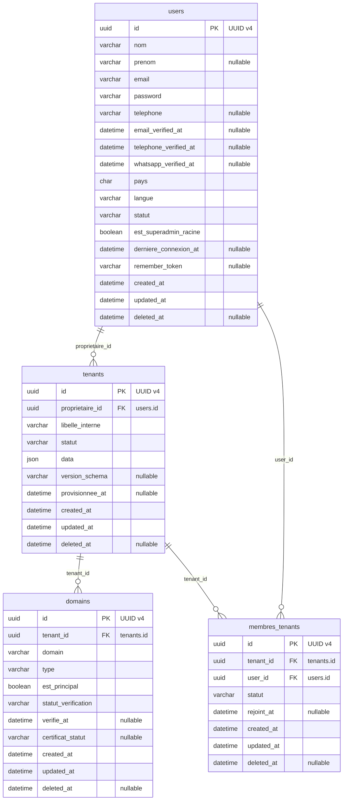
```mermaid
erDiagram
    direction TB
    users {
        uuid id PK "UUID v4"
        varchar nom
        varchar prenom "nullable"
        varchar email
        varchar password
        varchar telephone "nullable"
        datetime email_verified_at "nullable"
        datetime telephone_verified_at "nullable"
        datetime whatsapp_verified_at "nullable"
        char pays
        varchar langue
        varchar statut
        boolean est_superadmin_racine
        datetime derniere_connexion_at "nullable"
        varchar remember_token "nullable"
        datetime created_at
        datetime updated_at
        datetime deleted_at "nullable"
    }
    tenants {
        uuid id PK "UUID v4"
        uuid proprietaire_id FK "users.id"
        varchar libelle_interne
        varchar statut
        json data
        varchar version_schema "nullable"
        datetime provisionnee_at "nullable"
        datetime created_at
        datetime updated_at
        datetime deleted_at "nullable"
    }
    domains {
        uuid id PK "UUID v4"
        uuid tenant_id FK "tenants.id"
        varchar domain
        varchar type
        boolean est_principal
        varchar statut_verification
        datetime verifie_at "nullable"
        varchar certificat_statut "nullable"
        datetime created_at
        datetime updated_at
        datetime deleted_at "nullable"
    }
    membres_tenants {
        uuid id PK "UUID v4"
        uuid tenant_id FK "tenants.id"
        uuid user_id FK "users.id"
        varchar statut
        datetime rejoint_at "nullable"
        datetime created_at
        datetime updated_at
        datetime deleted_at "nullable"
    }
    users ||--o{ tenants : proprietaire_id
    tenants ||--o{ domains : tenant_id
    tenants ||--o{ membres_tenants : tenant_id
    users ||--o{ membres_tenants : user_id
```

Les références vers un autre module sont indiquées sur les champs, même si leur flèche n’est pas redessinée ici.

- **`users` :** UNIQUE(email normalisé). Pays DZ par défaut. Password contient un hachage. Au maximum un compte racine actif, contrainte conditionnelle à prévoir. Seul le compte racine a le contournement global ; un administrateur délégué conserve toutes les restrictions explicites. La langue est une préférence, pas une table de traductions du catalogue.

- **`tenants` :** proprietaire_id NOT NULL, FK RESTRICT vers users. UNIQUE(id,proprietaire_id). Un trigger BEFORE UPDATE refuse tout changement de propriétaire ; le service le refuse également. Aucun transfert, même par le root. Le propriétaire doit être actif à la création. data conserve les métadonnées Tenancy, dont le nom technique de BDD, unique au provisionnement. Aucun accès SQL direct aux commerçants. La désactivation d’un compte suspend l’accès ; sa suppression logique ou physique est bloquée tant qu’une boutique lui est rattachée.

- **`domains` :** UNIQUE(domain normalisé). Un domaine principal actif au maximum par tenant. type=sous_domaine|personnalise. Le domaine personnalisé exige la fonctionnalité correspondante. Adapter le modèle Domain et sa migration aux UUID. Pas de table sous_domaines distincte.

- **`membres_tenants` :** UNIQUE(tenant_id,user_id), UNIQUE(id,tenant_id). Le provisionnement crée l’appartenance du propriétaire dans la transaction centrale de création du tenant. Interdire sa suppression, son changement de user_id/tenant_id et sa désactivation tant que le tenant existe, par triggers et service. Aucun rôle propriétaire assignable : la propriété et ses droits de gestion sont dérivés uniquement de tenants.proprietaire_id, avec limites du plan et contrôles sensibles. Les autres membres ont leurs rôles dans membres_roles ; une réinvitation restaure la même appartenance.

### C2 — Permissions

**`fonctionnalites` — Catalogue des capacités activables et des quotas commerciaux.**

**`permissions` — Actions atomiques autorisées côté serveur.**

**`roles` — Rôles globaux du SaaS ou rôles personnalisés d’une boutique.**

**`roles_permissions` — Permissions accordées à un rôle.**

**`users_roles` — Attribution des seuls rôles plateforme à un compte.**

**`membres_roles` — Attribution de rôles tenant à une appartenance de la même boutique.**

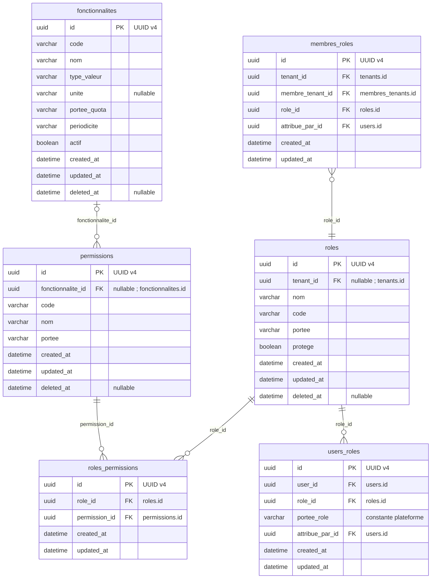
```mermaid
erDiagram
    direction TB
    fonctionnalites {
        uuid id PK "UUID v4"
        varchar code
        varchar nom
        varchar type_valeur
        varchar unite "nullable"
        varchar portee_quota
        varchar periodicite
        boolean actif
        datetime created_at
        datetime updated_at
        datetime deleted_at "nullable"
    }
    permissions {
        uuid id PK "UUID v4"
        uuid fonctionnalite_id FK "nullable ; fonctionnalites.id"
        varchar code
        varchar nom
        varchar portee
        datetime created_at
        datetime updated_at
        datetime deleted_at "nullable"
    }
    roles {
        uuid id PK "UUID v4"
        uuid tenant_id FK "nullable ; tenants.id"
        varchar nom
        varchar code
        varchar portee
        boolean protege
        datetime created_at
        datetime updated_at
        datetime deleted_at "nullable"
    }
    roles_permissions {
        uuid id PK "UUID v4"
        uuid role_id FK "roles.id"
        uuid permission_id FK "permissions.id"
        datetime created_at
        datetime updated_at
    }
    users_roles {
        uuid id PK "UUID v4"
        uuid user_id FK "users.id"
        uuid role_id FK "roles.id"
        varchar portee_role "constante plateforme"
        uuid attribue_par_id FK "users.id"
        datetime created_at
        datetime updated_at
    }
    membres_roles {
        uuid id PK "UUID v4"
        uuid tenant_id FK "tenants.id"
        uuid membre_tenant_id FK "membres_tenants.id"
        uuid role_id FK "roles.id"
        uuid attribue_par_id FK "users.id"
        datetime created_at
        datetime updated_at
    }
    membres_roles }o--|| roles : role_id
    fonctionnalites |o--o{ permissions : fonctionnalite_id
    roles ||--o{ roles_permissions : role_id
    permissions ||--o{ roles_permissions : permission_id
    roles ||--o{ users_roles : role_id
```

Les références vers un autre module sont indiquées sur les champs, même si leur flèche n’est pas redessinée ici.

- **`fonctionnalites` :** UNIQUE(code). type_valeur=booleen|quota ; portee_quota=compte|tenant ; periodicite=aucune|mois. Exemples boutiques.nombre, domaines.personnalises, design.personnalise, livraison.ecotrack, statistiques.lire. Les fonctionnalités doivent correspondre à des contrôles réellement implémentés.

- **`permissions` :** UNIQUE(code). portee=plateforme|tenant. Exemples produits.creer, produits.modifier, produits.supprimer, stock.ajuster, commandes.confirmer, commandes.modifier, finances.valider_reversement, tenants.acceder, utilisateurs.usurper. Une fonctionnalité non commerciale peut ne pas avoir de fonctionnalite_id.

- **`roles` :** portee=plateforme exige tenant_id NULL ; portee=tenant exige un tenant. UNIQUE(contexte_normalise,code), contexte_normalise vaut plateforme ou UUID du tenant. La simple contrainte UNIQUE(tenant_id,code) ne suffit pas pour les lignes globales avec NULL.

- **`roles_permissions` :** UNIQUE(role_id,permission_id). Un rôle tenant accepte seulement des permissions tenant ; un rôle plateforme peut inclure les permissions tenant nécessaires à l’assistance, avec contrôle des cibles. Retirer une permission du rôle retire son autorisation, sans modifier les autres rôles.

- **`users_roles` :** UNIQUE(user_id,role_id). Réservé à la plateforme : CHECK(portee_role='plateforme') et FK(role_id,portee_role) → roles(id,portee), clé parent UNIQUE. Les rôles tenant sont uniquement dans membres_roles. Aucun administrateur délégué ne peut attribuer plus de droits que sa délégation.

- **`membres_roles` :** UNIQUE(membre_tenant_id,role_id). FK(membre_tenant_id,tenant_id) → membres_tenants(id,tenant_id) et FK(role_id,tenant_id) → roles(id,tenant_id), avec clés parents UNIQUE. tenant_id NOT NULL exclut les rôles plateforme. L’appartenance doit être active à l’attribution et à chaque requête ; une révocation invalide immédiatement le cache des droits.

### C3 — Exceptions et accès administratifs

**`exceptions_permissions` — Autorisation ou interdiction ciblée pour une personne.**

**`restrictions_admins` — Exceptions ciblant des boutiques ou des comptes pour les administrateurs délégués.**

**`invitations_equipes` — Invitation d’un membre avec un premier rôle.**

**`sessions_assistance` — Accès temporaire d’un administrateur au contexte d’une boutique ou d’un membre.**

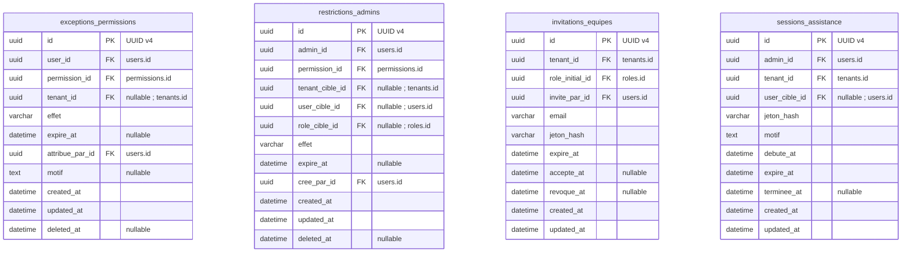
```mermaid
erDiagram
    direction TB
    exceptions_permissions {
        uuid id PK "UUID v4"
        uuid user_id FK "users.id"
        uuid permission_id FK "permissions.id"
        uuid tenant_id FK "nullable ; tenants.id"
        varchar effet
        datetime expire_at "nullable"
        uuid attribue_par_id FK "users.id"
        text motif "nullable"
        datetime created_at
        datetime updated_at
        datetime deleted_at "nullable"
    }
    restrictions_admins {
        uuid id PK "UUID v4"
        uuid admin_id FK "users.id"
        uuid permission_id FK "permissions.id"
        uuid tenant_cible_id FK "nullable ; tenants.id"
        uuid user_cible_id FK "nullable ; users.id"
        uuid role_cible_id FK "nullable ; roles.id"
        varchar effet
        datetime expire_at "nullable"
        uuid cree_par_id FK "users.id"
        datetime created_at
        datetime updated_at
        datetime deleted_at "nullable"
    }
    invitations_equipes {
        uuid id PK "UUID v4"
        uuid tenant_id FK "tenants.id"
        uuid role_initial_id FK "roles.id"
        uuid invite_par_id FK "users.id"
        varchar email
        varchar jeton_hash
        datetime expire_at
        datetime accepte_at "nullable"
        datetime revoque_at "nullable"
        datetime created_at
        datetime updated_at
    }
    sessions_assistance {
        uuid id PK "UUID v4"
        uuid admin_id FK "users.id"
        uuid tenant_id FK "tenants.id"
        uuid user_cible_id FK "nullable ; users.id"
        varchar jeton_hash
        text motif
        datetime debute_at
        datetime expire_at
        datetime terminee_at "nullable"
        datetime created_at
        datetime updated_at
    }
```

Les références vers un autre module sont indiquées sur les champs, même si leur flèche n’est pas redessinée ici.

- **`exceptions_permissions` :** effet=autoriser|interdire. UNIQUE(user_id,permission_id,contexte_normalise). Interdiction explicite prioritaire sur les autorisations des rôles ; une autorisation ne contourne ni les plafonds du plan ni l’appartenance.

- **`restrictions_admins` :** Exactement une cible renseignée parmi tenant, user et rôle. La cible rôle limite la consultation/administration de ce rôle ; les comptes représentés se contrôlent séparément. Une interdiction visant un propriétaire peut bloquer l’accès à toutes ses boutiques selon la permission tenants.acceder. Une autorisation ciblée ne crée pas de permission globale absente. UNIQUE(admin_id,permission_id,type_cible,cible_normalisee).

- **`invitations_equipes` :** UNIQUE(jeton_hash). Le rôle appartient au tenant invité. Plusieurs rôles peuvent ensuite être ajoutés par membres_roles. FK(role_initial_id,tenant_id) → roles(id,tenant_id). Jeton consommable une seule fois.

- **`sessions_assistance` :** Les vérifications de permissions et restrictions restent actives à chaque action. Journaliser simultanément l’acteur réel et le compte représenté. L’usurpation ne doit jamais donner les droits supérieurs du compte cible à un administrateur limité.

### C4 — Plans et abonnements

**`plans` — Offre commerciale versionnée et réutilisable.**

**`plans_fonctionnalites` — Activation et limite de chaque capacité dans un plan.**

**`abonnements` — Abonnement du propriétaire ; couvre ses boutiques et son quota global.**

**`exceptions_fonctionnalites` — Activation, désactivation ou quota personnalisé, notamment un essai beta daté.**

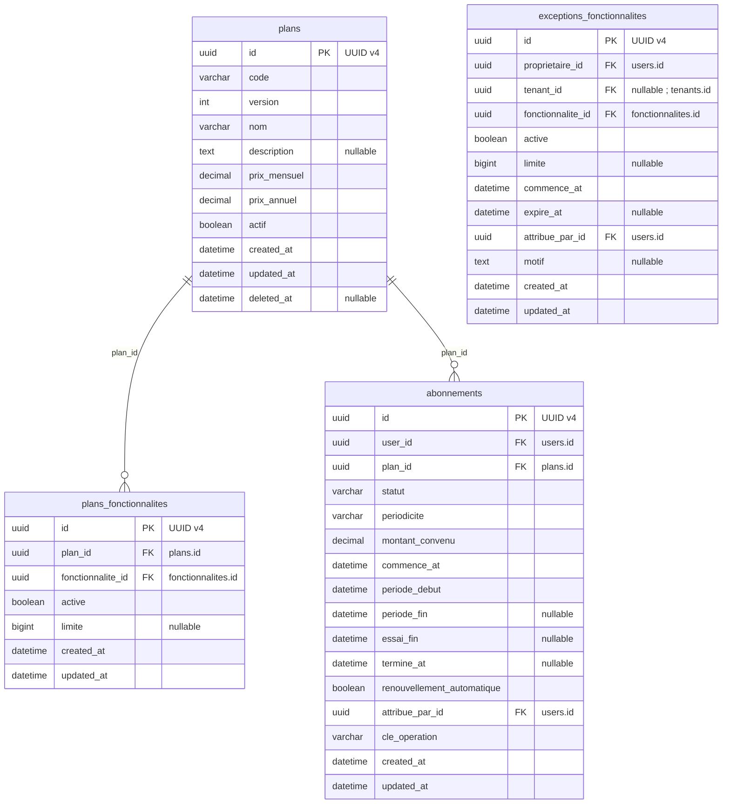
```mermaid
erDiagram
    direction TB
    plans {
        uuid id PK "UUID v4"
        varchar code
        int version
        varchar nom
        text description "nullable"
        decimal prix_mensuel
        decimal prix_annuel
        boolean actif
        datetime created_at
        datetime updated_at
        datetime deleted_at "nullable"
    }
    plans_fonctionnalites {
        uuid id PK "UUID v4"
        uuid plan_id FK "plans.id"
        uuid fonctionnalite_id FK "fonctionnalites.id"
        boolean active
        bigint limite "nullable"
        datetime created_at
        datetime updated_at
    }
    abonnements {
        uuid id PK "UUID v4"
        uuid user_id FK "users.id"
        uuid plan_id FK "plans.id"
        varchar statut
        varchar periodicite
        decimal montant_convenu
        datetime commence_at
        datetime periode_debut
        datetime periode_fin "nullable"
        datetime essai_fin "nullable"
        datetime termine_at "nullable"
        boolean renouvellement_automatique
        uuid attribue_par_id FK "users.id"
        varchar cle_operation
        datetime created_at
        datetime updated_at
    }
    exceptions_fonctionnalites {
        uuid id PK "UUID v4"
        uuid proprietaire_id FK "users.id"
        uuid tenant_id FK "nullable ; tenants.id"
        uuid fonctionnalite_id FK "fonctionnalites.id"
        boolean active
        bigint limite "nullable"
        datetime commence_at
        datetime expire_at "nullable"
        uuid attribue_par_id FK "users.id"
        text motif "nullable"
        datetime created_at
        datetime updated_at
    }
    plans ||--o{ plans_fonctionnalites : plan_id
    plans ||--o{ abonnements : plan_id
```

Les références vers un autre module sont indiquées sur les champs, même si leur flèche n’est pas redessinée ici.

- **`plans` :** UNIQUE(code,version). DZD uniquement. Un plan déjà souscrit devient immuable : nouvelle version pour changer son contenu sans modifier rétroactivement tous les abonnements. Plan gratuit : prix=0 et quota de boutiques=1.

- **`plans_fonctionnalites` :** UNIQUE(plan_id,fonctionnalite_id). Pour quota : active=false signifie indisponible ; active=true et limite=NULL signifie illimité ; sinon limite>=0. Pour booléen : limite=NULL. Une capacité absente est désactivée. Immuable avec le plan utilisé.

- **`abonnements` :** Attribution et activation manuelles par le super administrateur, y compris le gratuit ; renouvellement_automatique=false au MVP. statut=en_attente|actif|expire|annule. UNIQUE(cle_operation). Colonne générée proprietaire_actif_id = CASE WHEN statut='actif' THEN user_id ELSE NULL END, avec UNIQUE(proprietaire_actif_id). Activation : transaction, verrou FOR UPDATE sur users du propriétaire, clôture de l’ancien abonnement puis activation du nouveau. Droits actifs seulement si statut=actif et date dans [commence_at,periode_fin), borne finale facultative pour gratuit. Le contrôle des dates ne dépend pas du cron. Une rétrogradation bloque les nouvelles créations excédentaires sans supprimer les boutiques. Conserver montants et périodes historiques.

- **`exceptions_fonctionnalites` :** Pas d’intervalles qui se chevauchent pour un même propriétaire, tenant et fonctionnalité. tenant_id NULL = tout le compte. L’exception tenant prime sur celle du compte puis sur le plan. Un quota de portée compte ne reçoit pas d’exception tenant. Permissions individuelles toujours contrôlées. FK(tenant_id,proprietaire_id) → tenants(id,proprietaire_id) lorsque tenant_id est renseigné ; le même contrôle s’applique aux consommations_fonctionnalites.

### C5 — Suivi SaaS et référentiel

**`consommations_fonctionnalites` — Compteur technique de quotas, uniquement lorsque nécessaire.**

**`echeances_abonnement` — Montants dus pour le service SaaS, distincts des encaissements des boutiques.**

**`reglements_abonnement` — Paiements SaaS enregistrés et validés manuellement.**

**`wilayas` — Référentiel algérien partagé.**

**`communes` — Communes du référentiel partagé.**

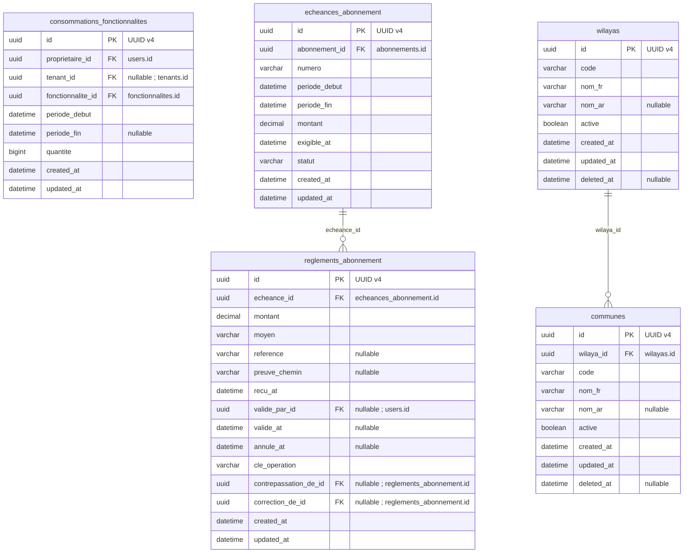
```mermaid
erDiagram
    direction TB
    consommations_fonctionnalites {
        uuid id PK "UUID v4"
        uuid proprietaire_id FK "users.id"
        uuid tenant_id FK "nullable ; tenants.id"
        uuid fonctionnalite_id FK "fonctionnalites.id"
        datetime periode_debut
        datetime periode_fin "nullable"
        bigint quantite
        datetime created_at
        datetime updated_at
    }
    echeances_abonnement {
        uuid id PK "UUID v4"
        uuid abonnement_id FK "abonnements.id"
        varchar numero
        datetime periode_debut
        datetime periode_fin
        decimal montant
        datetime exigible_at
        varchar statut
        datetime created_at
        datetime updated_at
    }
    reglements_abonnement {
        uuid id PK "UUID v4"
        uuid echeance_id FK "echeances_abonnement.id"
        decimal montant
        varchar moyen
        varchar reference "nullable"
        varchar preuve_chemin "nullable"
        datetime recu_at
        uuid valide_par_id FK "nullable ; users.id"
        datetime valide_at "nullable"
        datetime annule_at "nullable"
        varchar cle_operation
        uuid contrepassation_de_id FK "nullable ; reglements_abonnement.id"
        uuid correction_de_id FK "nullable ; reglements_abonnement.id"
        datetime created_at
        datetime updated_at
    }
    wilayas {
        uuid id PK "UUID v4"
        varchar code
        varchar nom_fr
        varchar nom_ar "nullable"
        boolean active
        datetime created_at
        datetime updated_at
        datetime deleted_at "nullable"
    }
    communes {
        uuid id PK "UUID v4"
        uuid wilaya_id FK "wilayas.id"
        varchar code
        varchar nom_fr
        varchar nom_ar "nullable"
        boolean active
        datetime created_at
        datetime updated_at
        datetime deleted_at "nullable"
    }
    echeances_abonnement ||--o{ reglements_abonnement : echeance_id
    wilayas ||--o{ communes : wilaya_id
```

Les références vers un autre module sont indiquées sur les champs, même si leur flèche n’est pas redessinée ici.

- **`consommations_fonctionnalites` :** UNIQUE(proprietaire_id,contexte_normalise,fonctionnalite_id,periode_debut). Mise à jour atomique, contrôlée par le serveur, compteur recalculable. Pour boutiques.nombre, préférer COUNT des tenants non supprimés du propriétaire plutôt que deux vérités. Quotas d’un membre = ceux du propriétaire de la boutique.

- **`echeances_abonnement` :** UNIQUE(numero). DZD ; état dû/partiel/réglé dérivé des règlements validés. Pas une facture fiscale présumée.

- **`reglements_abonnement` :** UNIQUE(cle_operation), UNIQUE(contrepassation_de_id) hors NULL. Montant>0 pour un paiement, négatif uniquement pour son inverse exact. Une ligne validée est immuable ; correction par contrepassation puis nouvelle ligne, même échéance. annule_at réservé aux lignes non encore validées, exclues des sommes. Verrouiller l’échéance à la validation, interdire un solde négatif ou supérieur au montant dû sans traitement explicite du trop-perçu. Le moyen reste configurable ; aucune donnée de carte.

- **`wilayas` :** UNIQUE(code). Ne pas figer le nombre de wilayas dans le schéma. Les identifiants utilisés par un transporteur sont mappés séparément.

- **`communes` :** UNIQUE(wilaya_id,code). Vérifier l’appartenance commune/wilaya. Un code postal ne remplace pas l’identifiant d’une commune.

### C6 — Audit SaaS

**`journal_audit_central` — Historique des connexions sensibles, droits, plans, domaines et accès inter-boutiques.**

**`verifications_contacts` — Défis temporaires pour vérifier le téléphone ou le canal WhatsApp du compte SaaS.**

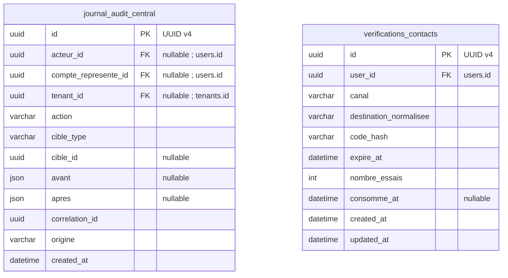
```mermaid
erDiagram
    direction TB
    journal_audit_central {
        uuid id PK "UUID v4"
        uuid acteur_id FK "nullable ; users.id"
        uuid compte_represente_id FK "nullable ; users.id"
        uuid tenant_id FK "nullable ; tenants.id"
        varchar action
        varchar cible_type
        uuid cible_id "nullable"
        json avant "nullable"
        json apres "nullable"
        uuid correlation_id
        varchar origine
        datetime created_at
    }
    verifications_contacts {
        uuid id PK "UUID v4"
        uuid user_id FK "users.id"
        varchar canal
        varchar destination_normalisee
        varchar code_hash
        datetime expire_at
        int nombre_essais
        datetime consomme_at "nullable"
        datetime created_at
        datetime updated_at
    }
```

Les références vers un autre module sont indiquées sur les champs, même si leur flèche n’est pas redessinée ici.

- **`journal_audit_central` :** Écriture append-only ; ne jamais journaliser mots de passe, OTP, tokens de connexion ou secrets API. Les cibles polymorphes sont des références logiques. Aucun bouton de suppression métier, même pour le root.

- **`verifications_contacts` :** canal=telephone|whatsapp. Hachage du code, durée courte et nombre d’essais limité. Vérifier une destination ne prouve pas qu’une autre destination ou un autre canal l’est. Si le téléphone change, remettre à NULL les vérifications associées. L’email et le mot de passe peuvent utiliser les mécanismes standards Laravel.

### C7 — Comptes transporteur et tarifs versionnés

Les comptes API sont mutualisés au niveau du propriétaire, jamais entre propriétaires différents. Le profil local `prestataires_livraison` référence le compte sans recopier ses secrets. Le pivot utilise `tenant_id` plutôt que `boutique_id` : l’identité centrale d’une boutique est `tenants.id`.

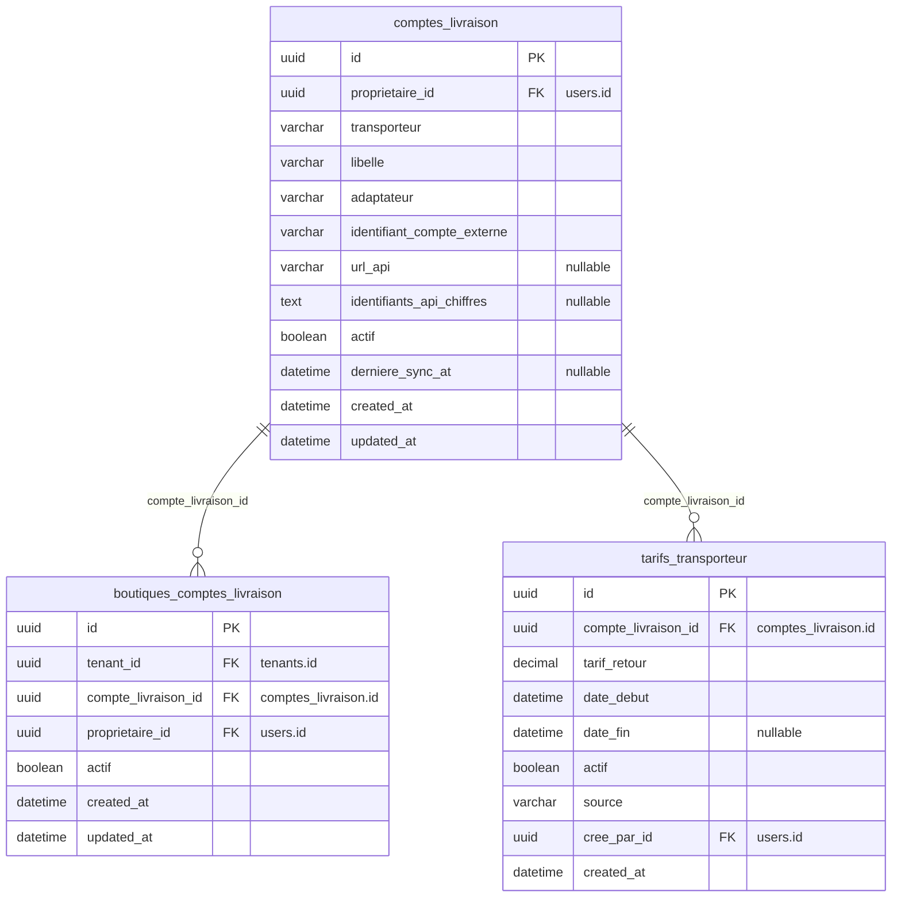
```mermaid
erDiagram
    direction TB
    comptes_livraison {
        uuid id PK
        uuid proprietaire_id FK "users.id"
        varchar transporteur
        varchar libelle
        varchar adaptateur
        varchar identifiant_compte_externe
        varchar url_api "nullable"
        text identifiants_api_chiffres "nullable"
        boolean actif
        datetime derniere_sync_at "nullable"
        datetime created_at
        datetime updated_at
    }
    boutiques_comptes_livraison {
        uuid id PK
        uuid tenant_id FK "tenants.id"
        uuid compte_livraison_id FK "comptes_livraison.id"
        uuid proprietaire_id FK "users.id"
        boolean actif
        datetime created_at
        datetime updated_at
    }
    tarifs_transporteur {
        uuid id PK
        uuid compte_livraison_id FK "comptes_livraison.id"
        decimal tarif_retour
        datetime date_debut
        datetime date_fin "nullable"
        boolean actif
        varchar source
        uuid cree_par_id FK "users.id"
        datetime created_at
    }
    comptes_livraison ||--o{ boutiques_comptes_livraison : compte_livraison_id
    comptes_livraison ||--o{ tarifs_transporteur : compte_livraison_id
```

- **`comptes_livraison` :** UNIQUE(id,proprietaire_id), UNIQUE(transporteur,identifiant_compte_externe). Le compte externe canonique est vérifié avant activation pour éviter deux enregistrements du même compte ; à défaut d’identification fiable par API, activation manuelle contrôlée. Propriétaire et identité externe immuables dès utilisation. Secrets chiffrés au repos, déchiffrables uniquement par le connecteur serveur ; URL autorisée pour éviter les appels arbitraires. Un compte manuel peut ne pas avoir de secret. Un rôle d’une boutique ne donne jamais accès aux autres boutiques utilisant ce compte.
- **`boutiques_comptes_livraison` :** UNIQUE(tenant_id,compte_livraison_id), UNIQUE(id,tenant_id,compte_livraison_id). FK(tenant_id,proprietaire_id) → tenants(id,proprietaire_id) et FK(compte_livraison_id,proprietaire_id) → comptes_livraison(id,proprietaire_id). L’association et le compte doivent être actifs pour de nouveaux envois. Leur désactivation conserve les liens historiques et autorise un rapprochement de clôture contrôlé.
- **`tarifs_transporteur` :** UNIQUE(compte_livraison_id,date_debut), tarif_retour>=0, date_fin NULL ou >date_debut. Intervalles semi-ouverts [date_debut,date_fin), sans chevauchement pour un compte ; insertion sous verrou du compte. Les montants déjà appliqués ne changent jamais. Pour un changement futur, fermer l’ancien intervalle sans invalider les frais historiques, puis créer la nouvelle version. `actif` autorise l’utilisation de la version ; une version échue reste consultable. Source manuel|api. Un tarif nul signifie gratuit explicitement, jamais « inconnu ».

**Application d’un tarif de retour.** Le fait générateur retenu est l’acceptation du retour par le transporteur, et non la simple demande du commerçant. Sa date fiable est enregistrée dans frais_transporteur.fait_generateur_at ; à défaut, date de première observation et source_date=observation. Sélectionner le tarif du compte à cette date et figer montant, tarif_source_id et tarif_snapshot. Si aucun tarif n’est applicable, signaler une anomalie et bloquer la constatation financière automatique sans bloquer la réception physique ; aucun zéro inventé. Un montant réellement facturé différent se corrige par écritures compensatoires après vérification. Ce fait générateur reste un paramètre de l’adaptateur à valider contre le contrat du compte avant lancement.

### C8 — Routage des colis et règlements partagés

Ces tables centrales contiennent des identifiants et des montants de routage, pas les produits ni les coordonnées des acheteurs. Elles empêchent qu’un polling de compte partagé attribue le même colis ou règlement à deux boutiques.

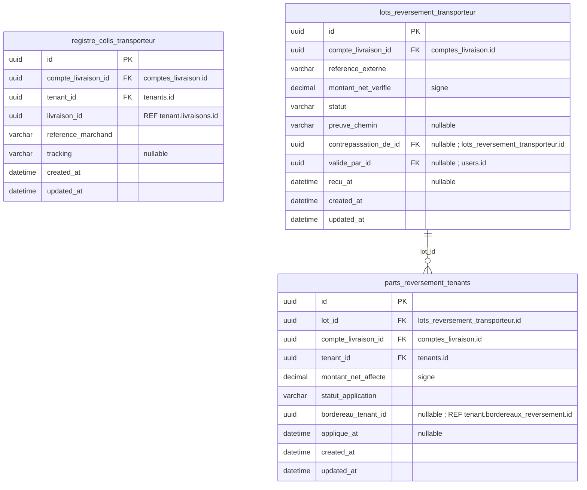
```mermaid
erDiagram
    direction TB
    registre_colis_transporteur {
        uuid id PK
        uuid compte_livraison_id FK "comptes_livraison.id"
        uuid tenant_id FK "tenants.id"
        uuid livraison_id "REF tenant.livraisons.id"
        varchar reference_marchand
        varchar tracking "nullable"
        datetime created_at
        datetime updated_at
    }
    lots_reversement_transporteur {
        uuid id PK
        uuid compte_livraison_id FK "comptes_livraison.id"
        varchar reference_externe
        decimal montant_net_verifie "signe"
        varchar statut
        varchar preuve_chemin "nullable"
        uuid contrepassation_de_id FK "nullable ; lots_reversement_transporteur.id"
        uuid valide_par_id FK "nullable ; users.id"
        datetime recu_at "nullable"
        datetime created_at
        datetime updated_at
    }
    parts_reversement_tenants {
        uuid id PK
        uuid lot_id FK "lots_reversement_transporteur.id"
        uuid compte_livraison_id FK "comptes_livraison.id"
        uuid tenant_id FK "tenants.id"
        decimal montant_net_affecte "signe"
        varchar statut_application
        uuid bordereau_tenant_id "nullable ; REF tenant.bordereaux_reversement.id"
        datetime applique_at "nullable"
        datetime created_at
        datetime updated_at
    }
    lots_reversement_transporteur ||--o{ parts_reversement_tenants : lot_id
```

- **`registre_colis_transporteur` :** UNIQUE(compte_livraison_id,reference_marchand), UNIQUE(compte_livraison_id,tracking) hors NULL, UNIQUE(tenant_id,livraison_id). FK(tenant_id,compte_livraison_id) → boutiques_comptes_livraison(tenant_id,compte_livraison_id). Référence marchand stable calculée depuis tenant et livraison, sans données personnelles. Routage immuable dès envoi. Les événements inconnus ne sont pas appliqués à une boutique par simple ressemblance de numéro ; rapprochement manuel. Le job consomme le compte une fois et route seulement les identifiants connus.
- **`lots_reversement_transporteur` :** UNIQUE(compte_livraison_id,reference_externe), UNIQUE(id,compte_livraison_id), UNIQUE(contrepassation_de_id) hors NULL. Statut=brouillon|valide|annule. Un lot validé est figé ; annulation financière via lot inverse, jamais en retirant les montants historiques. Contrôle de preuve et validation humaine si l’API ne fournit pas un bordereau détaillé. Montant signé pour les paiements de frais. Une référence de saisie manuelle doit être stable et contrôlée pour éviter les doublons.
- **`parts_reversement_tenants` :** UNIQUE(lot_id,tenant_id), FK(lot_id,compte_livraison_id) → lots_reversement_transporteur(id,compte_livraison_id), FK(tenant_id,compte_livraison_id) → boutiques_comptes_livraison(tenant_id,compte_livraison_id). Avant validation du lot, somme des parts = net vérifié sous verrou du lot. Parts figées après validation ; statut_application=en_attente|appliquee|erreur. Chaque BDD tenant crée son bordereau de façon idempotente sur UNIQUE(part_centrale_id). Un crash entre commit tenant et accusé central est repris en recherchant cette même clé. Le central prouve la réception globale ; les lignes locales en expliquent la ventilation. Ne jamais additionner les montants centraux aux locaux dans le résultat financier.

Il n’existe pas de transaction atomique couvrant arbitrairement les deux connexions : enregistrement durable, clés stables, états de reprise et réconciliation sont obligatoires. Un compte personnel à une seule boutique utilise le même protocole. Un livreur interne, sans compte central, utilise directement les bordereaux locaux.

### C9 — Historique des déploiements des BDD

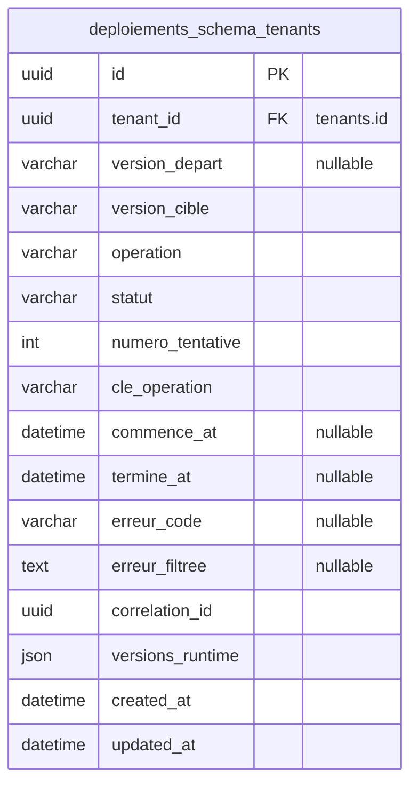
```mermaid
erDiagram
    direction TB
    deploiements_schema_tenants {
        uuid id PK
        uuid tenant_id FK "tenants.id"
        varchar version_depart "nullable"
        varchar version_cible
        varchar operation
        varchar statut
        int numero_tentative
        varchar cle_operation
        datetime commence_at "nullable"
        datetime termine_at "nullable"
        varchar erreur_code "nullable"
        text erreur_filtree "nullable"
        uuid correlation_id
        json versions_runtime
        datetime created_at
        datetime updated_at
    }
```

**Contraintes :** UNIQUE(cle_operation), index(tenant_id,created_at). operation=provisionnement|migration|restauration_controle ; statut=en_attente|en_cours|reussi|echec. Une seule opération en cours par tenant via clé générée conditionnelle UNIQUE et verrou de déploiement. Chaque reprise conserve l’échec précédent et crée une nouvelle tentative. versions_runtime fige PHP, Laravel, stancl/tenancy, MySQL et version applicative réellement utilisés. tenants.version_schema est mis à jour seulement après succès ; la table technique migrations de chaque BDD reste le détail des migrations exécutées. Une migration échouée ne rend pas le tenant actif. Après restauration, contrôler références centrales, autorisations, registre transporteur, parts de règlements et jobs avant réactivation. Une intention externe incertaine reste à rapprocher ; ne pas la renvoyer aveuglément après restauration.

## 5. BDD de chaque boutique : `tenant_<uuid>`

Ce même modèle est migré dans chaque BDD tenant. Aucun `tenant_id` n’est ajouté à toutes les lignes : le contexte de connexion assure déjà la séparation. La ligne unique `boutique` conserve la référence de rattachement.

### T1 — Profil public

**`boutique` — Profil public unique dans la BDD de la boutique.**

**`adresses_boutique` — Plusieurs adresses et localisations publiques ; ne crée pas de gestion de caisse.**

**`liens_sociaux` — Plusieurs liens, y compris plusieurs pages sur un même réseau.**

**`pages_contenu` — Accueil, À propos, contact, conditions, politique de retour et confidentialité.**

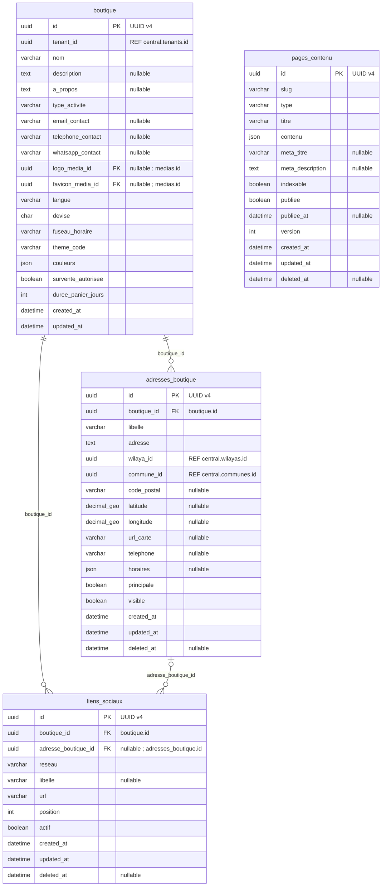
```mermaid
erDiagram
    direction TB
    boutique {
        uuid id PK "UUID v4"
        uuid tenant_id "REF central.tenants.id"
        varchar nom
        text description "nullable"
        text a_propos "nullable"
        varchar type_activite
        varchar email_contact "nullable"
        varchar telephone_contact "nullable"
        varchar whatsapp_contact "nullable"
        uuid logo_media_id FK "nullable ; medias.id"
        uuid favicon_media_id FK "nullable ; medias.id"
        varchar langue
        char devise
        varchar fuseau_horaire
        varchar theme_code
        json couleurs
        boolean survente_autorisee
        int duree_panier_jours
        datetime created_at
        datetime updated_at
    }
    adresses_boutique {
        uuid id PK "UUID v4"
        uuid boutique_id FK "boutique.id"
        varchar libelle
        text adresse
        uuid wilaya_id "REF central.wilayas.id"
        uuid commune_id "REF central.communes.id"
        varchar code_postal "nullable"
        decimal_geo latitude "nullable"
        decimal_geo longitude "nullable"
        varchar url_carte "nullable"
        varchar telephone "nullable"
        json horaires "nullable"
        boolean principale
        boolean visible
        datetime created_at
        datetime updated_at
        datetime deleted_at "nullable"
    }
    liens_sociaux {
        uuid id PK "UUID v4"
        uuid boutique_id FK "boutique.id"
        uuid adresse_boutique_id FK "nullable ; adresses_boutique.id"
        varchar reseau
        varchar libelle "nullable"
        varchar url
        int position
        boolean actif
        datetime created_at
        datetime updated_at
        datetime deleted_at "nullable"
    }
    pages_contenu {
        uuid id PK "UUID v4"
        varchar slug
        varchar type
        varchar titre
        json contenu
        varchar meta_titre "nullable"
        text meta_description "nullable"
        boolean indexable
        boolean publiee
        datetime publiee_at "nullable"
        int version
        datetime created_at
        datetime updated_at
        datetime deleted_at "nullable"
    }
    boutique ||--o{ adresses_boutique : boutique_id
    boutique ||--o{ liens_sociaux : boutique_id
    adresses_boutique |o--o{ liens_sociaux : adresse_boutique_id
```

Les références vers un autre module sont indiquées sur les champs, même si leur flèche n’est pas redessinée ici.

- **`boutique` :** Une seule ligne ; tenant_id égal au tenant courant. DZD et Africa/Algiers. theme_code=template_initial pour le MVP. Le nom du site, le logo, les contacts et les couleurs appartiennent à la boutique, pas à users.

- **`adresses_boutique` :** Une seule adresse principale active. Vérifier commune/wilaya. Horaires structurés par jour dans un JSON limité au contenu public. Pas de stock par adresse dans ce périmètre.

- **`liens_sociaux` :** Ne pas imposer UNIQUE(reseau). Ce sont des liens publics, sans tokens de publication ni calendrier marketing.

- **`pages_contenu` :** UNIQUE(slug). Structure JSON définie par le template initial ; pas de code arbitraire. FAQ, menu/header/footer et textes institutionnels peuvent être des blocs de ce template ; leur affichage ne justifie pas chacun une table.

### T2 — Catalogue principal

**`medias` — Métadonnées de fichiers images, vidéos, logos et documents.**

**`categories` — Catégories et sous-catégories avec une seule table.**

**`produits` — Descriptif commercial commun à toutes les variantes.**

**`variantes_produits` — Unité vendable : une variante par combinaison ; une variante standard pour un produit sans options.**


```mermaid
erDiagram
    direction TB
    medias {
        uuid id PK "UUID v4"
        varchar cle_stockage
        varchar mime_type
        varchar nom_original
        bigint taille_octets
        int largeur "nullable"
        int hauteur "nullable"
        int duree_secondes "nullable"
        text texte_alternatif "nullable"
        uuid cree_par_id "nullable ; REF central.users.id"
        datetime created_at
        datetime updated_at
        datetime deleted_at "nullable"
    }
    categories {
        uuid id PK "UUID v4"
        uuid parent_id FK "nullable ; categories.id"
        varchar nom
        varchar slug
        text description "nullable"
        uuid media_id FK "nullable ; medias.id"
        int position
        boolean active
        varchar meta_titre "nullable"
        text meta_description "nullable"
        datetime created_at
        datetime updated_at
        datetime deleted_at "nullable"
    }
    produits {
        uuid id PK "UUID v4"
        uuid categorie_id FK "nullable ; categories.id"
        varchar nom
        varchar slug
        text description_courte "nullable"
        text description "nullable"
        json avantages "nullable"
        json faq "nullable"
        varchar marque "nullable"
        varchar type
        boolean personnalisation_autorisee
        text consignes_personnalisation "nullable"
        varchar unite_vente
        decimal quantite_contenu "nullable"
        varchar unite_contenu "nullable"
        varchar statut
        datetime publie_at "nullable"
        boolean mis_en_avant
        varchar meta_titre "nullable"
        text meta_description "nullable"
        boolean indexable
        datetime created_at
        datetime updated_at
        datetime deleted_at "nullable"
    }
    variantes_produits {
        uuid id PK "UUID v4"
        uuid produit_id FK "produits.id"
        varchar libelle
        varchar reference_sku
        varchar code_barres "nullable"
        varchar signature_combinaison
        decimal prix_vente
        decimal cout_unitaire
        decimal ancien_prix "nullable"
        int stock_physique
        int stock_reserve
        int stock_quarantaine
        int seuil_stock_faible
        boolean survente_autorisee "nullable"
        decimal poids_kg "nullable"
        decimal longueur_cm "nullable"
        decimal largeur_cm "nullable"
        decimal hauteur_cm "nullable"
        boolean active
        int position
        datetime created_at
        datetime updated_at
        datetime deleted_at "nullable"
    }
    categories |o--o{ categories : parent_id
    medias |o--o{ categories : media_id
    categories |o--o{ produits : categorie_id
    produits ||--o{ variantes_produits : produit_id
```

Les références vers un autre module sont indiquées sur les champs, même si leur flèche n’est pas redessinée ici.

- **`medias` :** UNIQUE(cle_stockage). Fichier dans le stockage de fichiers, pas un BLOB dans chaque produit. Documents privés servis après autorisation ; médias publics séparés. Les textes alternatifs ne sont pas arbitrairement limités à 30 caractères.

- **`categories` :** UNIQUE(slug). parent_id NULL = catégorie principale. Empêcher les cycles. Un produit a une catégorie principale dans ce périmètre ; les étiquettes permettent les regroupements transversaux.

- **`produits` :** UNIQUE(slug). type=physique_standard|physique_personnalise. Un bouquet personnalisé reste livrable : aucun agenda de services. Prix, coût, SKU, code-barres et stock sont portés par la variante, même pour un produit simple. Prix par unité de contenu calculable si pertinent.

- **`variantes_produits` :** UNIQUE(reference_sku), UNIQUE(produit_id,signature_combinaison), UNIQUE(id,produit_id). Index(code_barres), chaîne conservant les zéros. CHECK(stock_physique>=0 AND stock_reserve>=0 AND stock_quarantaine>=0). Disponible calculé = stock_physique-stock_reserve, jamais une valeur modifiable. survente_autorisee NULL hérite de boutique. Si survente interdite, toute réservation doit laisser disponible>=0. Toute expédition exige physique>=quantité. Signature recalculée depuis les options. Les trois compteurs sont des soldes matérialisés reconstruits depuis mouvements_stock, initialisés à zéro puis alimentés par mouvements d’ouverture. prix_vente, cout_unitaire et seuil_stock_faible>=0 ; ancien_prix NULL ou>=0.

### T3 — Options et images

**`options_produit` — Axes de variation propres au produit : taille, couleur, matière, modèle.**

**`valeurs_options` — Valeurs possibles d’un axe.**

**`variantes_valeurs` — Composition normalisée de chaque variante.**

**`medias_produits` — Galerie générale et médias spécifiques à une variante.**


```mermaid
erDiagram
    direction TB
    options_produit {
        uuid id PK "UUID v4"
        uuid produit_id FK "produits.id"
        varchar nom
        varchar type_affichage
        int position
        datetime created_at
        datetime updated_at
        datetime deleted_at "nullable"
    }
    valeurs_options {
        uuid id PK "UUID v4"
        uuid option_id FK "options_produit.id"
        varchar valeur
        char couleur_hex "nullable"
        int position
        datetime created_at
        datetime updated_at
        datetime deleted_at "nullable"
    }
    variantes_valeurs {
        uuid id PK "UUID v4"
        uuid produit_id FK "produits.id"
        uuid variante_id FK "variantes_produits.id"
        uuid option_id FK "options_produit.id"
        uuid valeur_id FK "valeurs_options.id"
        datetime created_at
        datetime updated_at
    }
    medias_produits {
        uuid id PK "UUID v4"
        uuid produit_id FK "produits.id"
        uuid variante_id FK "nullable ; variantes_produits.id"
        uuid media_id FK "medias.id"
        varchar role
        int position
        datetime created_at
        datetime updated_at
    }
    options_produit ||--o{ valeurs_options : option_id
    options_produit ||--o{ variantes_valeurs : option_id
    valeurs_options ||--o{ variantes_valeurs : valeur_id
```

Les références vers un autre module sont indiquées sur les champs, même si leur flèche n’est pas redessinée ici.

- **`options_produit` :** UNIQUE(produit_id,nom normalisé). Une caractéristique descriptive non achetable n’est pas un axe de variante.

- **`valeurs_options` :** UNIQUE(option_id,valeur normalisée). Une couleur hexadécimale est facultative.

- **`variantes_valeurs` :** UNIQUE(variante_id,option_id). valeur_id doit appartenir à option_id ; l’option et la variante au même produit. Renforcer par clés composites là où possible. Chaque variante possède exactement une valeur pour chaque axe actif du produit ; aucune valeur pour la variante standard.

- **`medias_produits` :** La variante éventuelle appartient au produit. role=principal|galerie|guide_taille|mise_en_situation. Au maximum un principal par portée produit/variante. Les galeries peuvent contenir images ou vidéos.

### T4 — Classement et caractéristiques

**`etiquettes` — Tags e-commerce réutilisables.**

**`produits_etiquettes` — Relation entre produits et tags.**

**`caracteristiques` — Dictionnaire de caractéristiques descriptives cohérentes.**

**`produits_caracteristiques` — Valeur descriptive d’une caractéristique pour un produit.**

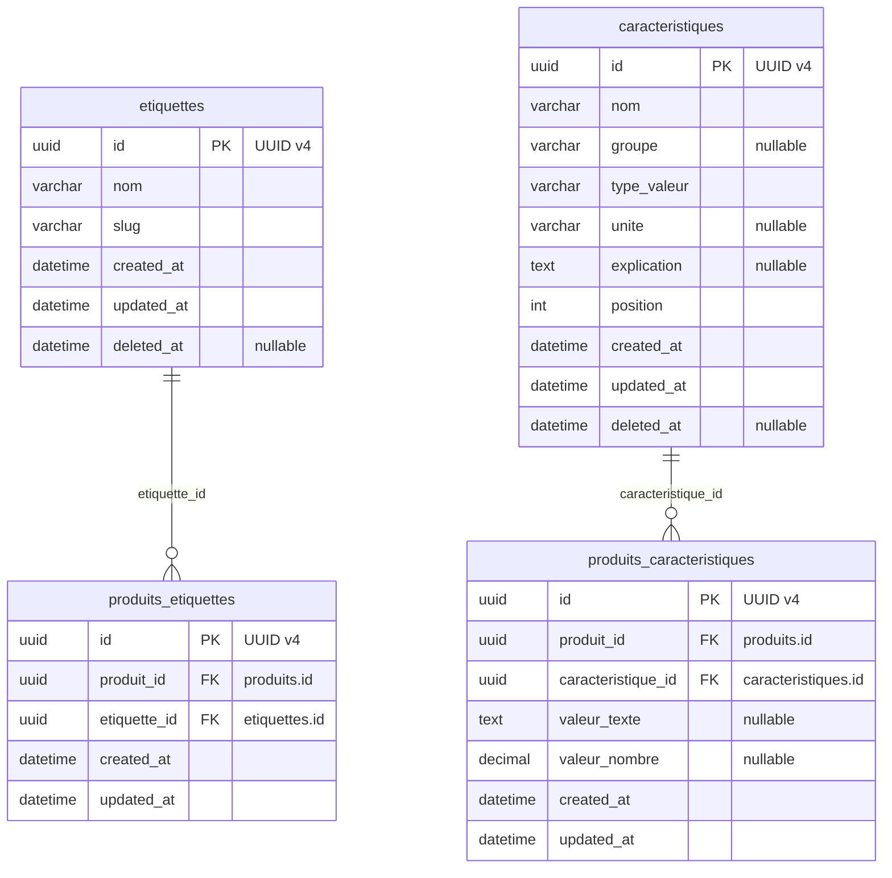
```mermaid
erDiagram
    direction TB
    etiquettes {
        uuid id PK "UUID v4"
        varchar nom
        varchar slug
        datetime created_at
        datetime updated_at
        datetime deleted_at "nullable"
    }
    produits_etiquettes {
        uuid id PK "UUID v4"
        uuid produit_id FK "produits.id"
        uuid etiquette_id FK "etiquettes.id"
        datetime created_at
        datetime updated_at
    }
    caracteristiques {
        uuid id PK "UUID v4"
        varchar nom
        varchar groupe "nullable"
        varchar type_valeur
        varchar unite "nullable"
        text explication "nullable"
        int position
        datetime created_at
        datetime updated_at
        datetime deleted_at "nullable"
    }
    produits_caracteristiques {
        uuid id PK "UUID v4"
        uuid produit_id FK "produits.id"
        uuid caracteristique_id FK "caracteristiques.id"
        text valeur_texte "nullable"
        decimal valeur_nombre "nullable"
        datetime created_at
        datetime updated_at
    }
    etiquettes ||--o{ produits_etiquettes : etiquette_id
    caracteristiques ||--o{ produits_caracteristiques : caracteristique_id
```

Les références vers un autre module sont indiquées sur les champs, même si leur flèche n’est pas redessinée ici.

- **`etiquettes` :** UNIQUE(slug).

- **`produits_etiquettes` :** UNIQUE(produit_id,etiquette_id).

- **`caracteristiques` :** UNIQUE(nom,groupe normalisé). Exemples composition, capacité, dimensions. Permet unités cohérentes et explications, sans créer de variantes inutiles.

- **`produits_caracteristiques` :** UNIQUE(produit_id,caracteristique_id). Une valeur compatible avec le type défini ; contrôler texte/nombre. Les filtres d’options utilisent les tables options/valeurs.

### T5 — Vente et avis

**`pages_vente` — Landing page mono-produit avec URL partageable.**

**`promotions_produits` — Réductions automatiques, sans code promo.**

**`avis_produits` — Avis déposés sans compte et modérés par la boutique.**

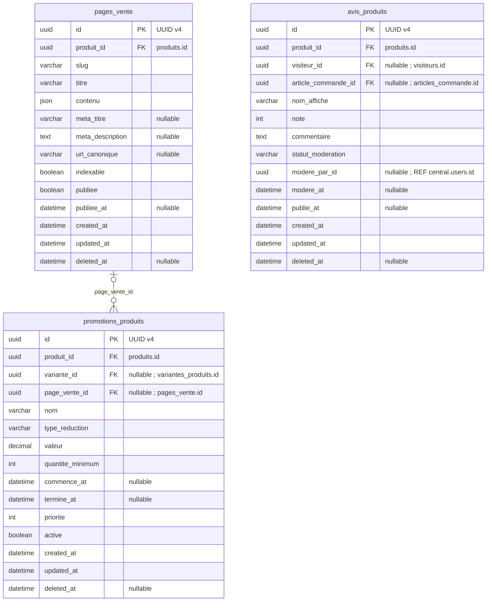
```mermaid
erDiagram
    direction TB
    pages_vente {
        uuid id PK "UUID v4"
        uuid produit_id FK "produits.id"
        varchar slug
        varchar titre
        json contenu
        varchar meta_titre "nullable"
        text meta_description "nullable"
        varchar url_canonique "nullable"
        boolean indexable
        boolean publiee
        datetime publiee_at "nullable"
        datetime created_at
        datetime updated_at
        datetime deleted_at "nullable"
    }
    promotions_produits {
        uuid id PK "UUID v4"
        uuid produit_id FK "produits.id"
        uuid variante_id FK "nullable ; variantes_produits.id"
        uuid page_vente_id FK "nullable ; pages_vente.id"
        varchar nom
        varchar type_reduction
        decimal valeur
        int quantite_minimum
        datetime commence_at "nullable"
        datetime termine_at "nullable"
        int priorite
        boolean active
        datetime created_at
        datetime updated_at
        datetime deleted_at "nullable"
    }
    avis_produits {
        uuid id PK "UUID v4"
        uuid produit_id FK "produits.id"
        uuid visiteur_id FK "nullable ; visiteurs.id"
        uuid article_commande_id FK "nullable ; articles_commande.id"
        varchar nom_affiche
        int note
        text commentaire
        varchar statut_moderation
        uuid modere_par_id "nullable ; REF central.users.id"
        datetime modere_at "nullable"
        datetime publie_at "nullable"
        datetime created_at
        datetime updated_at
        datetime deleted_at "nullable"
    }
    pages_vente |o--o{ promotions_produits : page_vente_id
```

Les références vers un autre module sont indiquées sur les champs, même si leur flèche n’est pas redessinée ici.

- **`pages_vente` :** UNIQUE(slug). Plusieurs pages peuvent présenter le même produit. Prix/stock calculés depuis variantes et promotions ; pas de prix indépendant dans le contenu. La page n’est pas une condition obligatoire pour commander. Pas de canonical automatique vers la catégorie.

- **`promotions_produits` :** type=pourcentage|montant_unitaire|prix_unitaire_fixe. Quantité>=1 ; pourcentage entre 0 et 100 ; prix final>=0. Variante et page du même produit. Une promotion maximum par ligne : priorité, puis plus avantageuse, puis UUID pour départager. Ciblage de page contrôlé côté serveur, jamais par une simple valeur libre envoyée par le client.

- **`avis_produits` :** note entière de 1 à 5. statut=en_attente|publie|masque|rejete. Le score public utilise les avis publiés. Le label achat vérifié nécessite une preuve de commande liée ; nom et téléphone saisis ne suffisent pas. Les avis masqués restent auditables.

### T6 — Visiteurs et statistiques

**`visiteurs` — Identifiant pseudonyme d’un navigateur dans cette boutique ; aucun mot de passe.**

**`sessions_visite` — Une visite continue ; un visiteur peut avoir plusieurs sessions.**

**`evenements_navigation` — Événements nécessaires aux vues, paniers et parcours de conversion.**

**`preferences_visiteur` — Préférences de mesure et version du texte présenté, séparées de l’identité panier.**

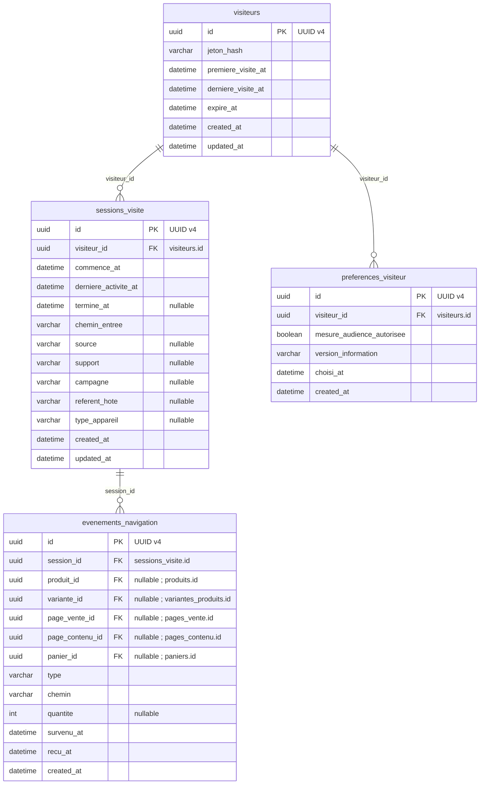
```mermaid
erDiagram
    direction TB
    visiteurs {
        uuid id PK "UUID v4"
        varchar jeton_hash
        datetime premiere_visite_at
        datetime derniere_visite_at
        datetime expire_at
        datetime created_at
        datetime updated_at
    }
    sessions_visite {
        uuid id PK "UUID v4"
        uuid visiteur_id FK "visiteurs.id"
        datetime commence_at
        datetime derniere_activite_at
        datetime termine_at "nullable"
        varchar chemin_entree
        varchar source "nullable"
        varchar support "nullable"
        varchar campagne "nullable"
        varchar referent_hote "nullable"
        varchar type_appareil "nullable"
        datetime created_at
        datetime updated_at
    }
    evenements_navigation {
        uuid id PK "UUID v4"
        uuid session_id FK "sessions_visite.id"
        uuid produit_id FK "nullable ; produits.id"
        uuid variante_id FK "nullable ; variantes_produits.id"
        uuid page_vente_id FK "nullable ; pages_vente.id"
        uuid page_contenu_id FK "nullable ; pages_contenu.id"
        uuid panier_id FK "nullable ; paniers.id"
        varchar type
        varchar chemin
        int quantite "nullable"
        datetime survenu_at
        datetime recu_at
        datetime created_at
    }
    preferences_visiteur {
        uuid id PK "UUID v4"
        uuid visiteur_id FK "visiteurs.id"
        boolean mesure_audience_autorisee
        varchar version_information
        datetime choisi_at
        datetime created_at
    }
    visiteurs ||--o{ sessions_visite : visiteur_id
    sessions_visite ||--o{ evenements_navigation : session_id
    visiteurs ||--o{ preferences_visiteur : visiteur_id
```

Les références vers un autre module sont indiquées sur les champs, même si leur flèche n’est pas redessinée ici.

- **`visiteurs` :** UNIQUE(jeton_hash). Le cookie porte un secret aléatoire opaque distinct du UUID. Aucun identifiant commun entre commerçants. Ni IP ni fingerprint utilisés comme identité fiable.

- **`sessions_visite` :** Index(visiteur_id,commence_at). Proposition : nouvelle session après 30 minutes d’inactivité. Source/support/campagne sont des labels internes facultatifs, sans connecter un réseau social. Ne pas stocker une URL de référence contenant des secrets.

- **`evenements_navigation` :** UUID de l’événement = clé de déduplication. Types page_vue, produit_vu, recherche, ajout_panier, retrait_panier, checkout_commence ; achats/retours proviennent du serveur métier. Valider les références et dates client. Pour une page produit, enregistrer un seul événement produit_vu qui compte aussi comme vue de page.

- **`preferences_visiteur` :** Conserver l’historique des choix. Le panier peut fonctionner sans mesure d’audience. La durée et les conditions de collecte sont à fixer avant mise en ligne ; cette table n’affirme pas une conformité juridique automatique.

### T7 — Panier

**`paniers` — Panier invité conservé côté serveur.**

**`articles_panier` — Lignes de panier avec variante et personnalisation.**

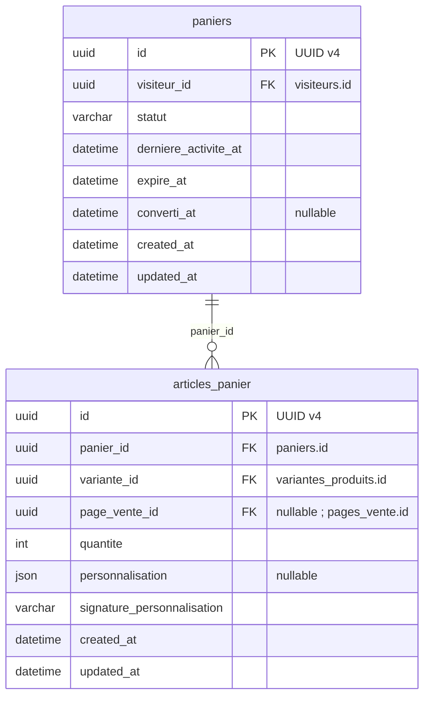
```mermaid
erDiagram
    direction TB
    paniers {
        uuid id PK "UUID v4"
        uuid visiteur_id FK "visiteurs.id"
        varchar statut
        datetime derniere_activite_at
        datetime expire_at
        datetime converti_at "nullable"
        datetime created_at
        datetime updated_at
    }
    articles_panier {
        uuid id PK "UUID v4"
        uuid panier_id FK "paniers.id"
        uuid variante_id FK "variantes_produits.id"
        uuid page_vente_id FK "nullable ; pages_vente.id"
        int quantite
        json personnalisation "nullable"
        varchar signature_personnalisation
        datetime created_at
        datetime updated_at
    }
    paniers ||--o{ articles_panier : panier_id
```

Les références vers un autre module sont indiquées sur les champs, même si leur flèche n’est pas redessinée ici.

- **`paniers` :** statut=actif|abandonne|converti|expire. Un panier actif par visiteur. Un panier abandonné peut être réactivé ; un panier converti est figé. Pas de réservation de stock lors d’un simple ajout au panier.

- **`articles_panier` :** UNIQUE(panier_id,variante_id,signature_personnalisation,page_origine_normalisee). Quantité>0. Deux bouquets de même variante avec des messages différents restent deux lignes. Les prix affichés sont recalculés ; aucune confiance dans les prix du navigateur.

### T8 — Commande et versions

**`commandes` — Identité stable et décision commerciale de la commande.**

**`revisions_commandes` — Photographie de la commande à chaque modification : destinataire, frais et totaux.**

**`articles_commande` — Lignes d’une révision ; prix et coût historiques conservés.**

**`historique_commandes` — Journal des décisions, appels, remplacements et changements de champs.**


```mermaid
erDiagram
    direction TB
    commandes {
        uuid id PK "UUID v4"
        varchar numero
        uuid visiteur_id FK "nullable ; visiteurs.id"
        uuid panier_id FK "nullable ; paniers.id"
        uuid session_origine_id FK "nullable ; sessions_visite.id"
        uuid page_vente_origine_id FK "nullable ; pages_vente.id"
        uuid retour_origine_id FK "nullable ; retours_commandes.id"
        uuid commande_origine_id FK "nullable ; commandes.id"
        varchar motif_remplacement "nullable"
        uuid revision_courante_id FK "nullable ; revisions_commandes.id"
        varchar type_commande
        varchar canal
        varchar statut_commercial
        uuid responsable_confirmation_id "nullable ; REF central.users.id"
        uuid confirmee_par_id "nullable ; REF central.users.id"
        datetime confirmee_at "nullable"
        datetime annulee_at "nullable"
        varchar cle_soumission
        char empreinte_soumission "SHA-256 hex 64"
        int version_verrou
        datetime created_at
        datetime updated_at
    }
    revisions_commandes {
        uuid id PK "UUID v4"
        uuid commande_id FK "commandes.id"
        int numero_revision
        uuid auteur_id "nullable ; REF central.users.id"
        text motif "nullable"
        varchar nom_destinataire
        varchar prenom_destinataire "nullable"
        varchar telephone
        varchar telephone_secondaire "nullable"
        varchar email "nullable"
        text adresse
        uuid wilaya_id "REF central.wilayas.id"
        uuid commune_id "REF central.communes.id"
        varchar wilaya_nom
        varchar commune_nom
        varchar code_postal "nullable"
        varchar mode_livraison
        uuid point_relais_id FK "nullable ; points_relais.id"
        json point_relais_snapshot "nullable"
        decimal sous_total_catalogue
        decimal sous_total_applique
        decimal frais_livraison_client
        decimal remise_livraison
        varchar prise_en_charge_livraison
        decimal montant_livraison_commercant "estimation figee"
        decimal total_commande
        decimal montant_a_encaisser
        uuid regle_gratuite_id FK "nullable ; regles_livraison_gratuite.id"
        text note_client "nullable"
        varchar conditions_vente_version
        json conditions_vente_snapshot
        datetime conditions_acceptees_at "nullable"
        varchar mode_acceptation_conditions
        datetime created_at
    }
    articles_commande {
        uuid id PK "UUID v4"
        uuid revision_id FK "revisions_commandes.id"
        uuid variante_id FK "variantes_produits.id"
        uuid promotion_id FK "nullable ; promotions_produits.id"
        uuid page_vente_id FK "nullable ; pages_vente.id"
        varchar nom_produit
        varchar nom_variante
        varchar reference_sku
        json options_snapshot "nullable"
        json personnalisation_snapshot "nullable"
        int quantite
        decimal prix_unitaire_catalogue
        decimal prix_unitaire_applique
        boolean prix_modifie_manuellement
        text motif_modification_prix "nullable"
        varchar origine_prix
        json promotion_snapshot "nullable"
        decimal cout_unitaire_snapshot
        decimal total_ligne
        datetime created_at
    }
    historique_commandes {
        uuid id PK "UUID v4"
        uuid commande_id FK "commandes.id"
        uuid revision_avant_id FK "nullable ; revisions_commandes.id"
        uuid revision_apres_id FK "nullable ; revisions_commandes.id"
        uuid acteur_id "nullable ; REF central.users.id"
        uuid compte_represente_id "nullable ; REF central.users.id"
        varchar action
        varchar resultat_contact "nullable"
        datetime prochain_rappel_at "nullable"
        varchar ancien_statut "nullable"
        varchar nouveau_statut "nullable"
        json changements "nullable"
        text note "nullable"
        uuid correlation_id
        varchar origine
        datetime created_at
    }
    revisions_commandes |o--o{ commandes : revision_courante_id
    commandes ||--o{ revisions_commandes : commande_id
    revisions_commandes ||--o{ articles_commande : revision_id
    commandes ||--o{ historique_commandes : commande_id
    revisions_commandes |o--o{ historique_commandes : revision_avant_id
    revisions_commandes |o--o{ historique_commandes : revision_apres_id
```

Les références vers un autre module sont indiquées sur les champs, même si leur flèche n’est pas redessinée ici.

- **`commandes` :** UNIQUE(numero), UNIQUE(cle_soumission), UNIQUE(panier_id) hors NULL. type_commande=standard|remplacement ; canal=panier|page_vente|manuel. Pour standard, origine et motif NULL ; pour remplacement, commande_origine_id et motif obligatoires, origine différente de soi et commande initiale standard déjà expédiée. retour_origine_id facultatif mais de cette origine. Plusieurs incidents distincts peuvent conduire à plusieurs remplacements, avec contrôle des quantités cumulées et autorisation explicite ; une répétition du même incident utilise la même cle_soumission. Motifs : casse_livraison, perte_livraison, produit_endommage, reexpedition_apres_retour. Une révision courante NULL est autorisée uniquement pendant la transaction de création et jamais exposée. empreinte_soumission immuable représente la demande initiale acceptée, pas les modifications ultérieures de commande.

- **`revisions_commandes` :** UNIQUE(commande_id,numero_revision), UNIQUE(id,commande_id). Immuable dès validation de la transaction de création ; chaque changement produit une nouvelle révision. sous_total_catalogue=Σ(quantite×prix_unitaire_catalogue), sous_total_applique=Σ(total_ligne). total_commande=sous_total_applique+frais_livraison_client-remise_livraison ; montant_a_encaisser=total_commande. CHECK des montants non négatifs et remise_livraison<=frais_livraison_client. frais_livraison_client est le montant demandé avant remise ; montant_livraison_client désigne dans les notes sa valeur nette, calculée ici sans deuxième colonne. prise_en_charge_livraison=client|commercant|livreur|societe_livraison|mixte ; montant_livraison_commercant est une estimation figée, les frais réels sont uniquement dans frais_transporteur. Adresse complète à domicile, snapshot bureau en stop desk. Pas de crédit client ni de moteur de taxes. conditions_vente_snapshot conserve le texte/blocs et la version réellement présentés ; modification de pages_contenu ne réécrit pas ce snapshot. mode_acceptation_conditions=checkout|confirmation_manuelle|non_recue ; conditions_acceptees_at est obligatoire pour les deux premiers, NULL pour non_recue. Une commande manuelle ne prétend jamais à une acceptation inexistante ; la confirmer exige de tracer la modalité obtenue. Une nouvelle révision conserve les conditions déjà acceptées sauf nouvel accord explicite et historisé.

- **`articles_commande` :** Quantité>0, prix catalogue/appliqué et coût>=0. total_ligne=ROUND(quantite×prix_unitaire_applique,2). origine_prix=catalogue|promotion|manuel|remplacement. Prix manuel uniquement pour un acteur autorisé, prix_modifie_manuellement=true et motif obligatoire ; une promotion automatique seule ne met pas ce booléen à true. Un prix manuel remplace la promotion, il ne se cumule pas implicitement avec elle. Les snapshots et promotion_snapshot expliquent l’ancien calcul. Sur un remplacement pour incident reconnu, prix_unitaire_applique=0 ; le coût reste réel et le prix catalogue demeure mémorisé. Les lignes sont immuables ; UNIQUE(id,revision_id), UNIQUE(id,variante_id). Les modifications ne changent jamais variantes_produits.prix_vente.

- **`historique_commandes` :** Résultats contact : confirme, rappeler, ne_repond_pas, numero_incorrect, annule. Un résultat d’appel n’est pas automatiquement un statut de livraison. Modifications de quantité, variante, prix, adresse et stock reliées par correlation_id. Historique append-only.

### T9 — Stock et retours

**`reservations_stock` — Quantités affectées à une commande confirmée mais non expédiée.**

**`mouvements_stock` — Journal des variations physiques, réservations et pertes.**

**`retours_commandes` — Retour de la totalité d’un colis, jamais retour partiel au point de livraison.**

**`articles_retour` — Inspection par article du colis retourné intégralement.**

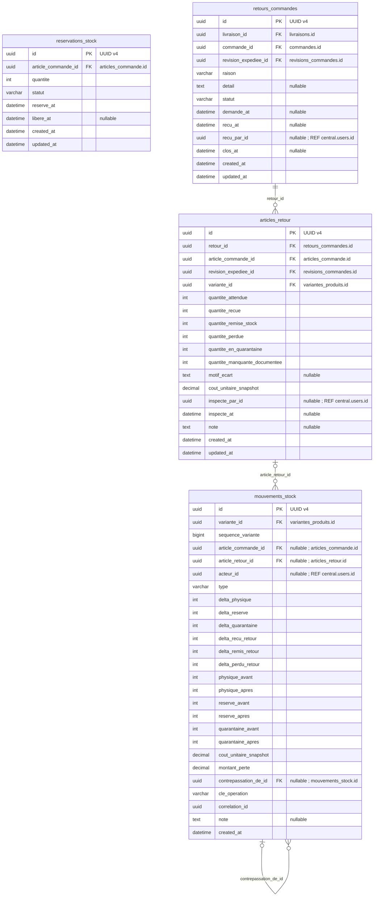
```mermaid
erDiagram
    direction TB
    reservations_stock {
        uuid id PK "UUID v4"
        uuid article_commande_id FK "articles_commande.id"
        int quantite
        varchar statut
        datetime reserve_at
        datetime libere_at "nullable"
        datetime created_at
        datetime updated_at
    }
    mouvements_stock {
        uuid id PK "UUID v4"
        uuid variante_id FK "variantes_produits.id"
        bigint sequence_variante
        uuid article_commande_id FK "nullable ; articles_commande.id"
        uuid article_retour_id FK "nullable ; articles_retour.id"
        uuid acteur_id "nullable ; REF central.users.id"
        varchar type
        int delta_physique
        int delta_reserve
        int delta_quarantaine
        int delta_recu_retour
        int delta_remis_retour
        int delta_perdu_retour
        int physique_avant
        int physique_apres
        int reserve_avant
        int reserve_apres
        int quarantaine_avant
        int quarantaine_apres
        decimal cout_unitaire_snapshot
        decimal montant_perte
        uuid contrepassation_de_id FK "nullable ; mouvements_stock.id"
        varchar cle_operation
        uuid correlation_id
        text note "nullable"
        datetime created_at
    }
    retours_commandes {
        uuid id PK "UUID v4"
        uuid livraison_id FK "livraisons.id"
        uuid commande_id FK "commandes.id"
        uuid revision_expediee_id FK "revisions_commandes.id"
        varchar raison
        text detail "nullable"
        varchar statut
        datetime demande_at "nullable"
        datetime recu_at "nullable"
        uuid recu_par_id "nullable ; REF central.users.id"
        datetime clos_at "nullable"
        datetime created_at
        datetime updated_at
    }
    articles_retour {
        uuid id PK "UUID v4"
        uuid retour_id FK "retours_commandes.id"
        uuid article_commande_id FK "articles_commande.id"
        uuid revision_expediee_id FK "revisions_commandes.id"
        uuid variante_id FK "variantes_produits.id"
        int quantite_attendue
        int quantite_recue
        int quantite_remise_stock
        int quantite_perdue
        int quantite_en_quarantaine
        int quantite_manquante_documentee
        text motif_ecart "nullable"
        decimal cout_unitaire_snapshot
        uuid inspecte_par_id "nullable ; REF central.users.id"
        datetime inspecte_at "nullable"
        text note "nullable"
        datetime created_at
        datetime updated_at
    }
    articles_retour |o--o{ mouvements_stock : article_retour_id
    mouvements_stock |o--o{ mouvements_stock : contrepassation_de_id
    retours_commandes ||--o{ articles_retour : retour_id
```

Les références vers un autre module sont indiquées sur les champs, même si leur flèche n’est pas redessinée ici.

- **`reservations_stock` :** UNIQUE(article_commande_id). Statut=active|liberee|consommee ; quantité>0 égale à celle de la ligne lorsqu’active. Réserver à confirmation ; une révision remplacée libère ses réservations et la nouvelle réserve dans la même transaction. Chaque variante est verrouillée dans un ordre stable. Somme des réservations actives par variante = stock_reserve. La remise physique consomme les réservations ; une commande annulée avant remise les libère.

- **`mouvements_stock` :** UNIQUE(variante_id,sequence_variante), séquence allouée sous verrou de la variante et strictement croissante ; UNIQUE(cle_operation), UNIQUE(contrepassation_de_id). Journal append-only, même transaction que compteurs, réservations et inspection. physique_apres=physique_avant+delta_physique ; mêmes égalités pour réservé et quarantaine. Tous les soldes après>=0. Types : ouverture, entree_manuelle, reservation, liberation, expedition, entree_quarantaine, quarantaine_vers_vendable, quarantaine_vers_perte, perte_stock, contrepassation. Une réception de retour entre d’abord en quarantaine : delta_recu_retour=+q, delta_quarantaine=+q ; disposition vendable : delta_remis_retour=+q, delta_quarantaine=-q, delta_physique=+q ; perte : delta_perdu_retour=+q, delta_quarantaine=-q, montant_perte=coût×q. Les autres deltas de retour valent zéro. Toute réception/disposition est liée à article_retour_id et à sa variante. La quarantaine initiale hors retour est représentée par ouverture ; sa libération hors retour utilise les mêmes deltas physiques/quarantaine sans deltas de retour. Une contrepassation inverse tous les deltas et montant_perte, conserve les mêmes références et verrouille l’original ; interdiction de contrepasser une contrepassation. Refuser l’inverse si les soldes ou le cycle métier ne le permettent plus. Une correction crée ensuite un nouveau mouvement lié par correlation_id.

- **`retours_commandes` :** UNIQUE(livraison_id), UNIQUE(id,revision_expediee_id), UNIQUE(id,commande_id), UNIQUE(id,livraison_id). Statuts demande|en_transit|recu|en_inspection|clos. FK(livraison_id,commande_id,revision_expediee_id) → livraisons(id,commande_id,revision_expediee_id). Le retour complet conserve toutes les lignes et quantités expédiées ; création atomique sous verrou de livraison. recu_at exige une réception locale et ne vient pas d’un simple statut distant. La clôture de réception peut laisser une quarantaine suivie ultérieurement ; la libération reste journalisée.

- **`articles_retour` :** UNIQUE(retour_id,article_commande_id), UNIQUE(id,variante_id). FK(retour_id,revision_expediee_id) → retours_commandes(id,revision_expediee_id), FK(article_commande_id,revision_expediee_id) → articles_commande(id,revision_id), FK(article_commande_id,variante_id) → articles_commande(id,variante_id). quantite_attendue égale à la quantité de la ligne expédiée ; validation sous verrou. Tous les compteurs>=0 ; CHECK(recue<=attendue), CHECK(remise_stock+perdue+en_quarantaine=recue), CHECK(recue+manquante_documentee<=attendue). À clôture : recue+manquante_documentee=attendue et motif_ecart obligatoire si manquant. Les quantités reçues, vendables, perdues et quarantaine sont matérialisées depuis les mouvements ; toute réception est d’abord mise en quarantaine, donc aucun écart indéterminé ne masque des unités reçues. Les manquants ne sont pas des unités reçues et ne sont jamais ajoutés au stock.

### T10 — Livraison et prix

**`prestataires_livraison` — Livreurs internes et sociétés de livraison, avec un même modèle de reversement.**

**`tarifs_livraison_client` — Ce que la boutique facture au client, séparé du coût du transporteur.**

**`tarifs_prestataires` — Estimation locale du service selon zone/mode ; hors tarif de retour des comptes société.**

**`regles_livraison_gratuite` — Exceptions automatiques de livraison offerte.**

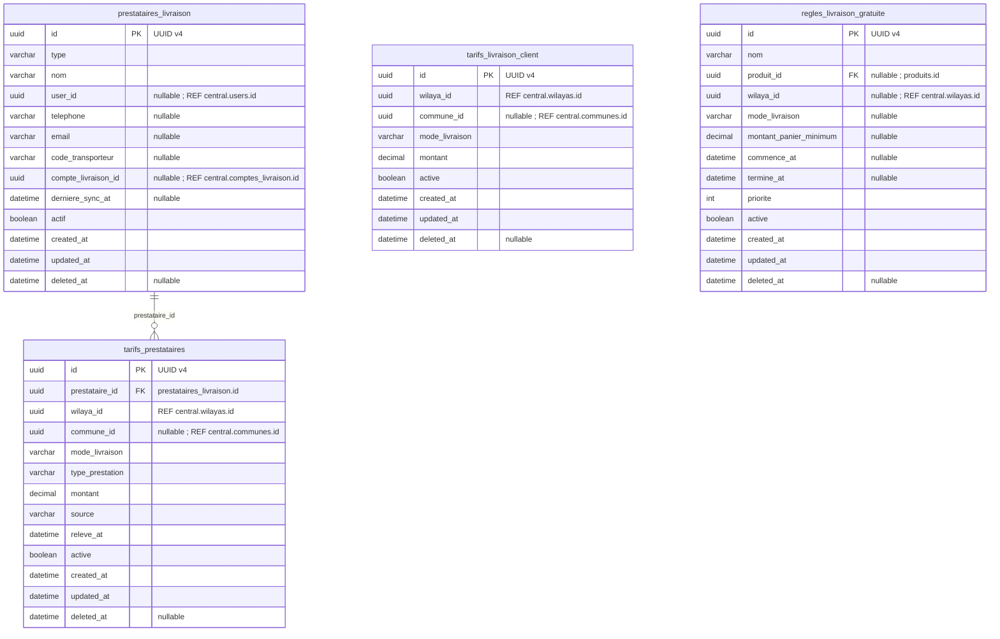
```mermaid
erDiagram
    direction TB
    prestataires_livraison {
        uuid id PK "UUID v4"
        varchar type
        varchar nom
        uuid user_id "nullable ; REF central.users.id"
        varchar telephone "nullable"
        varchar email "nullable"
        varchar code_transporteur "nullable"
        uuid compte_livraison_id "nullable ; REF central.comptes_livraison.id"
        datetime derniere_sync_at "nullable"
        boolean actif
        datetime created_at
        datetime updated_at
        datetime deleted_at "nullable"
    }
    tarifs_livraison_client {
        uuid id PK "UUID v4"
        uuid wilaya_id "REF central.wilayas.id"
        uuid commune_id "nullable ; REF central.communes.id"
        varchar mode_livraison
        decimal montant
        boolean active
        datetime created_at
        datetime updated_at
        datetime deleted_at "nullable"
    }
    tarifs_prestataires {
        uuid id PK "UUID v4"
        uuid prestataire_id FK "prestataires_livraison.id"
        uuid wilaya_id "REF central.wilayas.id"
        uuid commune_id "nullable ; REF central.communes.id"
        varchar mode_livraison
        varchar type_prestation
        decimal montant
        varchar source
        datetime releve_at
        boolean active
        datetime created_at
        datetime updated_at
        datetime deleted_at "nullable"
    }
    regles_livraison_gratuite {
        uuid id PK "UUID v4"
        varchar nom
        uuid produit_id FK "nullable ; produits.id"
        uuid wilaya_id "nullable ; REF central.wilayas.id"
        varchar mode_livraison "nullable"
        decimal montant_panier_minimum "nullable"
        datetime commence_at "nullable"
        datetime termine_at "nullable"
        int priorite
        boolean active
        datetime created_at
        datetime updated_at
        datetime deleted_at "nullable"
    }
    prestataires_livraison ||--o{ tarifs_prestataires : prestataire_id
```

Les références vers un autre module sont indiquées sur les champs, même si leur flèche n’est pas redessinée ici.

- **`prestataires_livraison` :** type=livreur_interne|societe. Société : compte_livraison_id obligatoire, compte central autorisé pour le tenant ; UNIQUE(compte_livraison_id) hors NULL. Interne : compte NULL, user_id facultatif mais membre actif autorisé si connecté. Les secrets et URL API sont uniquement au central. Le rattachement au compte devient immuable dès utilisation ; créer un autre prestataire pour changer de compte. Désactivation sans suppression historique.

- **`tarifs_livraison_client` :** UNIQUE(wilaya_id,commune_normalisee,mode_livraison). Tarif commune prioritaire puis wilaya. Tarif absent = livraison indisponible, pas gratuite. Vérifier toutes les quantités et afficher le total avant soumission.

- **`tarifs_prestataires` :** Devis/cache local pour livraison, seconde_tentative ou remplacement, selon zone et mode ; le tarif de retour provient exclusivement de central.tarifs_transporteur. Montant>=0, source=manuel|api ; UNIQUE(prestataire_id,wilaya_id,commune_normalisee,mode_livraison,type_prestation). Aucune valeur importée ne devient automatiquement une dette du commerçant : la répartition des payeurs est explicite. L’historique financier est figé dans frais_transporteur, pas recalculé depuis ce cache. Pour un livreur interne, les frais de retour suivent un accord saisi et figé manuellement.

- **`regles_livraison_gratuite` :** Règle simple : si tous les critères renseignés sont remplis, la livraison de la commande entière est offerte. produit_id signifie présence de ce produit. Pas d’addition de frais par ligne : un colis unique. La gratuité client ne supprime jamais le coût réel du prestataire.

### T11 — Transporteur et colis

**`correspondances_geo_transporteur` — Correspondance entre géographie interne et codes/libellés du transporteur.**

**`points_relais` — Bureaux/stop desks disponibles chez un transporteur.**

**`livraisons` — Un seul colis regroupant tous les articles d’une commande.**

**`evenements_livraison` — Événements normalisés et statuts bruts conservés.**

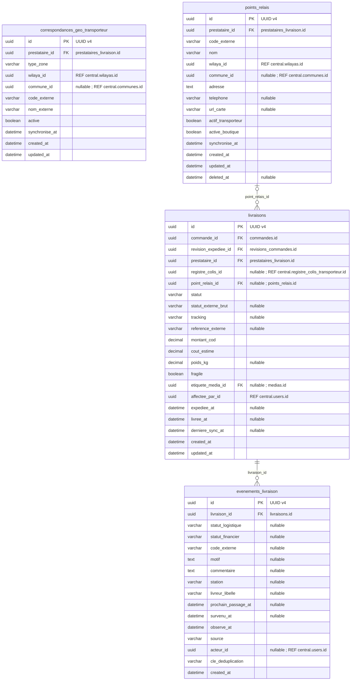
```mermaid
erDiagram
    direction TB
    correspondances_geo_transporteur {
        uuid id PK "UUID v4"
        uuid prestataire_id FK "prestataires_livraison.id"
        varchar type_zone
        uuid wilaya_id "REF central.wilayas.id"
        uuid commune_id "nullable ; REF central.communes.id"
        varchar code_externe
        varchar nom_externe
        boolean active
        datetime synchronise_at
        datetime created_at
        datetime updated_at
    }
    points_relais {
        uuid id PK "UUID v4"
        uuid prestataire_id FK "prestataires_livraison.id"
        varchar code_externe
        varchar nom
        uuid wilaya_id "REF central.wilayas.id"
        uuid commune_id "nullable ; REF central.communes.id"
        text adresse
        varchar telephone "nullable"
        varchar url_carte "nullable"
        boolean actif_transporteur
        boolean active_boutique
        datetime synchronise_at
        datetime created_at
        datetime updated_at
        datetime deleted_at "nullable"
    }
    livraisons {
        uuid id PK "UUID v4"
        uuid commande_id FK "commandes.id"
        uuid revision_expediee_id FK "revisions_commandes.id"
        uuid prestataire_id FK "prestataires_livraison.id"
        uuid registre_colis_id "nullable ; REF central.registre_colis_transporteur.id"
        uuid point_relais_id FK "nullable ; points_relais.id"
        varchar statut
        varchar statut_externe_brut "nullable"
        varchar tracking "nullable"
        varchar reference_externe "nullable"
        decimal montant_cod
        decimal cout_estime
        decimal poids_kg "nullable"
        boolean fragile
        uuid etiquete_media_id FK "nullable ; medias.id"
        uuid affectee_par_id "REF central.users.id"
        datetime expediee_at "nullable"
        datetime livree_at "nullable"
        datetime derniere_sync_at "nullable"
        datetime created_at
        datetime updated_at
    }
    evenements_livraison {
        uuid id PK "UUID v4"
        uuid livraison_id FK "livraisons.id"
        varchar statut_logistique "nullable"
        varchar statut_financier "nullable"
        varchar code_externe "nullable"
        text motif "nullable"
        text commentaire "nullable"
        varchar station "nullable"
        varchar livreur_libelle "nullable"
        datetime prochain_passage_at "nullable"
        datetime survenu_at "nullable"
        datetime observe_at
        varchar source
        uuid acteur_id "nullable ; REF central.users.id"
        varchar cle_deduplication
        datetime created_at
    }
    points_relais |o--o{ livraisons : point_relais_id
    livraisons ||--o{ evenements_livraison : livraison_id
```

Les références vers un autre module sont indiquées sur les champs, même si leur flèche n’est pas redessinée ici.

- **`correspondances_geo_transporteur` :** type_zone=wilaya|commune ; commune_id obligatoire pour commune, NULL pour wilaya. Unicité sur prestataire + type + identifiant interne ; code externe à normaliser avec le code wilaya si le fournisseur le réutilise. Ne pas envoyer un UUID local comme code_wilaya Ecotrack.

- **`points_relais` :** UNIQUE(prestataire_id,code_externe). Une resynchronisation ne réactive pas un bureau masqué par le commerçant. Disponibilité = active des deux côtés. Conserver les bureaux historiques en désactivation, sans casser les commandes.

- **`livraisons` :** UNIQUE(commande_id), UNIQUE(prestataire_id,tracking) hors NULL, UNIQUE(id,commande_id,revision_expediee_id), UNIQUE(id,commande_id), UNIQUE(id,prestataire_id). FK(revision_expediee_id,commande_id) → revisions_commandes(id,commande_id). Tous les articles partent ensemble. Avant remise, modifier la révision uniquement après synchronisation/rapprochement des opérations distantes ; après expediee_at, révision, contenu et COD immuables. Le COD est celui de la révision expédiée et peut être zéro. FK(point_relais_id,prestataire_id) → points_relais(id,prestataire_id). Registre central obligatoire pour société dès allocation d’une référence externe, contrôlé via service central. Les frais réels sont dans frais_transporteur. Un retour empêche tout changement de la révision liée par ses FK. Après création distante réussie (même avant remise physique), prestataire_id et compte associé ne peuvent plus changer au MVP ; l’API et le service bloquent ce changement, renforcé par trigger sur la livraison à partir du résultat durable. Toute opération en cours/incertaine bloque également une réaffectation.

- **`evenements_livraison` :** UNIQUE(cle_deduplication) incluant le prestataire et tracking dans le calcul. Source=manuel|polling. Conserver les inconnus pour diagnostic, sans deviner leur sens. Les événements anciens n’écrasent pas aveuglément l’état courant.

### T12 — Intégration Ecotrack

**`operations_transporteur` — File durable des opérations à envoyer au transporteur.**

**`tentatives_operations_transporteur` — Trace de chaque tentative HTTP et de son résultat.**

```mermaid
erDiagram
    direction TB
    operations_transporteur {
        uuid id PK "UUID v4"
        uuid prestataire_id FK "prestataires_livraison.id"
        uuid livraison_id FK "nullable ; livraisons.id"
        uuid commande_id FK "nullable ; commandes.id"
        uuid retour_id FK "nullable ; retours_commandes.id"
        varchar type
        uuid revision_id FK "nullable ; revisions_commandes.id"
        varchar cle_operation
        json requete_sans_secrets
        varchar statut
        int nombre_tentatives
        datetime prochaine_tentative_at "nullable"
        datetime terminee_at "nullable"
        datetime envoi_commence_at "nullable"
        datetime supersedee_at "nullable"
        uuid supersedee_par_operation_id FK "nullable ; operations_transporteur.id"
        uuid declenche_par_id "nullable ; REF central.users.id"
        datetime created_at
        datetime updated_at
    }
    tentatives_operations_transporteur {
        uuid id PK "UUID v4"
        uuid operation_id FK "operations_transporteur.id"
        int numero_tentative
        int code_http "nullable"
        json reponse_filtre "nullable"
        varchar erreur_code "nullable"
        int duree_ms
        datetime commence_at
        datetime termine_at "nullable"
        datetime created_at
    }
    operations_transporteur ||--o{ tentatives_operations_transporteur : operation_id
```

Les références vers un autre module sont indiquées sur les champs, même si leur flèche n’est pas redessinée ici.

- **`operations_transporteur` :** UNIQUE(cle_operation). Types create_order, valid_order, update_order, suivi, fees, geographie, label, ask_return, valid_returns, note. Statuts en_attente|en_cours|reussie|echec_reessayable|echec_definitif|resultat_incertain|supersedee. Toute opération de colis exige livraison_id, commande_id et revision_id cohérents ; fees/geographie sont les seules opérations sans commande. FK(revision_id,commande_id) → revisions_commandes(id,commande_id), FK(livraison_id,commande_id) → livraisons(id,commande_id) ; contrôle prestataire et retour sous verrou. Pour les mutations avant expédition, vérifier la révision courante au démarrage ; sinon supersedee sans envoi. Suivi/retour/étiquette après remise ciblent la révision expédiée immuable. envoi_commence_at est persisté avant l’appel HTTP ; les modifications de commande sont alors bloquées jusqu’au résultat certain ou rapprochement. Un timeout ambigu impose resultat_incertain, jamais une création aveugle. supersedee_par_operation_id facultatif, rempli si une opération de remplacement existe. L’intention et le résultat sont durables ; appel HTTP hors transaction longue.

- **`tentatives_operations_transporteur` :** UNIQUE(operation_id,numero_tentative). Conserver les réponses filtrées et erreurs utiles sans secrets ni données personnelles inutiles. Aucune purge automatique au MVP. Les corps bruts ne sont pas conservés par défaut ; la minimisation à la collecte ne constitue pas une suppression ultérieure. Une tentative est append-only après son achèvement.

### T13 — Argent et reversements

**`recouvrements` — État de l’argent d’un colis, distinct de sa livraison et de sa confirmation.**

**`bordereaux_reversement` — Règlement local ventilé entre recettes produits, frais commerçant et indemnisations.**

**`lignes_reversement` — Ventilation d’un bordereau par colis, pour éviter les doubles reversements.**

```mermaid
erDiagram
    direction TB
    recouvrements {
        uuid id PK "UUID v4"
        uuid livraison_id FK "livraisons.id"
        varchar statut_declare
        decimal montant_attendu
        decimal montant_encaisse_declare "nullable"
        datetime encaisse_at "nullable"
        datetime paiement_pret_at "nullable"
        datetime paye_declare_at "nullable"
        varchar source
        datetime rapproche_at "nullable"
        datetime created_at
        datetime updated_at
    }
    bordereaux_reversement {
        uuid id PK "UUID v4"
        uuid prestataire_id FK "prestataires_livraison.id"
        varchar numero
        varchar reference_externe "nullable"
        varchar type
        varchar statut
        decimal montant_brut
        decimal montant_frais
        decimal montant_net_attendu
        decimal montant_net_recu "nullable"
        datetime declare_at "nullable"
        datetime recu_at "nullable"
        uuid valide_par_id "nullable ; REF central.users.id"
        uuid preuve_media_id FK "nullable ; medias.id"
        text note "nullable"
        varchar cle_operation
        uuid part_centrale_id "nullable ; REF central.parts_reversement_tenants.id"
        uuid contrepassation_de_id FK "nullable ; bordereaux_reversement.id"
        datetime rapproche_at "nullable"
        datetime created_at
        datetime updated_at
    }
    lignes_reversement {
        uuid id PK "UUID v4"
        uuid bordereau_id FK "bordereaux_reversement.id"
        uuid recouvrement_id FK "recouvrements.id"
        decimal montant_restitue "signe"
        uuid contrepassation_de_id FK "nullable ; lignes_reversement.id"
        uuid correction_de_id FK "nullable ; lignes_reversement.id"
        varchar cle_operation
        datetime created_at
    }
    bordereaux_reversement ||--o{ lignes_reversement : bordereau_id
    recouvrements ||--o{ lignes_reversement : recouvrement_id
```

Les références vers un autre module sont indiquées sur les champs, même si leur flèche n’est pas redessinée ici.

- **`recouvrements` :** UNIQUE(livraison_id). montant_attendu=COD figé, montant_encaisse_declare reste une observation transporteur, jamais une preuve de paiement. L’encaissement vérifié est la somme des ecritures_encaissement validées ; aucun compteur modifiable concurrent. Statuts en_attente_livraison|livre_non_encaisse|encaisse_non_paye|paiements_prets|paye_et_archive|sans_encaissement. Les dates et états distants ne prouvent pas la réception de fonds par le commerçant.

- **`bordereaux_reversement` :** UNIQUE(prestataire_id,numero), UNIQUE(cle_operation), UNIQUE(part_centrale_id) hors NULL, UNIQUE(contrepassation_de_id) hors NULL. type=reversement|reglement_net|paiement_frais|indemnisation|correction. Statut=brouillon|pret|recu|rapproche|annule. montant_brut=Σ lignes_reversement.montant_restitue + Σ indemnisations_transporteur.montant ; montant_frais=Σ reglements_frais_transporteur.montant ; net_attendu=brut-frais. Net signé : positif reçu, négatif payé. Rapprochement seulement après vérification du net réel, de tous les plafonds et de la preuve. Une fois rapproché, montants/lignes immuables. Annulation simple autorisée uniquement avant rapprochement ; après, bordereau compensatoire et lignes inverses, original conservé rapproché. Les brouillons annulés et leurs lignes ne participent à aucune somme. La référence d’un lot société partagé est gérée au central, pas supposée unique dans une seule boutique.

- **`lignes_reversement` :** UNIQUE(cle_operation), UNIQUE(contrepassation_de_id) hors NULL ; index(recouvrement_id). Plusieurs allocations autorisées, chacune identifiée. Montant>0 sauf contrepassation exacte négative ; correction_de_id relie la nouvelle écriture positive à l’ancienne. Même prestataire que le recouvrement/livraison, contrôle transactionnel. Σ des montants sur bordereaux rapprochés doit rester entre 0 et le montant reversable du colis. Une ligne ne règle aucun frais et ne crée aucune charge : les frais ont leurs propres allocations vers frais_transporteur.

### T14 — Coûts, remboursements et documents

**`depenses` — Coûts réels hors frais transporteur et pertes de stock : publicité, emballage et frais généraux.**

**`regularisations_clients` — Remboursements réels, sans portefeuille ni crédit client.**

**`bons_commande` — Bon de commande facultatif, figé sur une révision précise.**

```mermaid
erDiagram
    direction TB
    depenses {
        uuid id PK "UUID v4"
        uuid produit_id FK "nullable ; produits.id"
        uuid commande_id FK "nullable ; commandes.id"
        uuid livraison_id FK "nullable ; livraisons.id"
        uuid retour_id FK "nullable ; retours_commandes.id"
        varchar categorie
        varchar libelle
        decimal montant
        datetime date_depense
        varchar statut
        uuid preuve_media_id FK "nullable ; medias.id"
        uuid auteur_id "REF central.users.id"
        varchar source
        varchar cle_operation
        uuid contrepassation_de_id FK "nullable ; depenses.id"
        uuid correction_de_id FK "nullable ; depenses.id"
        datetime annulee_at "nullable"
        text note "nullable"
        datetime created_at
        datetime updated_at
    }
    regularisations_clients {
        uuid id PK "UUID v4"
        uuid commande_id FK "commandes.id"
        uuid retour_id FK "nullable ; retours_commandes.id"
        varchar type
        decimal montant "signe"
        varchar statut
        datetime effectue_at "nullable"
        uuid valide_par_id "nullable ; REF central.users.id"
        varchar reference "nullable"
        uuid preuve_media_id FK "nullable ; medias.id"
        text motif
        varchar cle_operation
        uuid contrepassation_de_id FK "nullable ; regularisations_clients.id"
        uuid correction_de_id FK "nullable ; regularisations_clients.id"
        datetime created_at
        datetime updated_at
    }
    bons_commande {
        uuid id PK "UUID v4"
        uuid commande_id FK "commandes.id"
        uuid revision_id FK "revisions_commandes.id"
        varchar numero
        int version_document
        json emetteur_snapshot
        uuid media_id FK "medias.id"
        uuid genere_par_id "REF central.users.id"
        datetime genere_at
        datetime created_at
    }
```

Les références vers un autre module sont indiquées sur les champs, même si leur flèche n’est pas redessinée ici.

- **`depenses` :** UNIQUE(cle_operation), UNIQUE(contrepassation_de_id) hors NULL. statut=brouillon|constatee|annulee. Montant positif ordinaire, négatif uniquement pour une contrepassation exacte ; les dépenses constatées restent immuables. Corriger 650 en 600 par +650, -650, +600 avec liens de contrepassation/correction ; ne pas exclure l’original de la somme en plus de son inverse. Annulation simple uniquement en brouillon. Frais transporteur interdits ici (source unique frais_transporteur) ; pertes uniquement dans mouvements_stock. Les dimensions simultanées doivent être cohérentes ; FK composites livraison/commande et retour/commande, avec commande_id obligatoire si l’une est renseignée. Une dépense produit/période n’est imputée qu’une fois.

- **`regularisations_clients` :** UNIQUE(cle_operation), UNIQUE(contrepassation_de_id) hors NULL. type=remboursement_especes|remboursement_virement|contrepassation ; statut=brouillon|effectue|annule. Aucun crédit d’échange. Retour facultatif pour un geste après incident ; FK(retour_id,commande_id) → retours_commandes(id,commande_id). Un remboursement nécessite un encaissement vérifié et une décision autorisée, motif et preuve ; somme nette des remboursements effectifs <= montant éligible réellement payé (plafonné par l’encaissement vérifié). Validation sous verrou du recouvrement/commande. Après effectue, correction par inverse puis nouvelle écriture, sans modifier l’original. Un remplacement gratuit n’autorise pas automatiquement un remboursement supplémentaire.

- **`bons_commande` :** UNIQUE(numero,version_document). FK(revision_id,commande_id) → revisions_commandes(id,commande_id). PDF privé et immuable, conservant coordonnées, lignes et totaux. Une nouvelle révision produit une nouvelle version ; média non écrasable. Bon et facture sont deux documents différents.

### T15 — Audit et évolution ciblée

**`journal_audit` — Audit transversal de catalogue, stock, avis, contenus et finances.**

**`personnalisations_theme` — ÉVOLUTION : présentation personnalisée autorisée par abonnement ou essai.**

```mermaid
erDiagram
    direction TB
    journal_audit {
        uuid id PK "UUID v4"
        uuid acteur_id "nullable ; REF central.users.id"
        uuid compte_represente_id "nullable ; REF central.users.id"
        varchar action
        varchar cible_type
        uuid cible_id "nullable"
        json avant "nullable"
        json apres "nullable"
        uuid correlation_id
        varchar origine
        datetime created_at
    }
    personnalisations_theme {
        uuid id PK "UUID v4"
        varchar code_theme
        int version
        json configuration
        text css_filtre "nullable"
        varchar statut
        datetime publie_at "nullable"
        uuid auteur_id "REF central.users.id"
        datetime created_at
        datetime updated_at
        datetime deleted_at "nullable"
    }
```

Les références vers un autre module sont indiquées sur les champs, même si leur flèche n’est pas redessinée ici.

- **`journal_audit` :** Append-only. Cible polymorphe logique, jamais FK fictive. Les événements détaillés de commandes restent dans historique_commandes. Le root peut intervenir mais pas effacer ses traces métier.

- **`personnalisations_theme` :** Pas nécessaire au MVP : un seul template et les champs de boutique suffisent. CSS limité à des propriétés/sélecteurs autorisés, sans JavaScript, réseau arbitraire ni masquage des informations de checkout. Aucun code serveur stocké. L’expiration de l’essai revient au template standard sans supprimer les commandes.


### T16 — Frais transporteur et preuve d’encaissement

```mermaid
erDiagram
    direction TB
    frais_transporteur {
        uuid id PK
        uuid livraison_id FK "livraisons.id"
        uuid prestataire_id FK "prestataires_livraison.id"
        uuid retour_id FK "nullable ; retours_commandes.id"
        uuid compte_livraison_id "nullable ; REF central.comptes_livraison.id"
        uuid tarif_source_id "nullable ; REF central.tarifs_transporteur.id"
        json tarif_snapshot "nullable"
        varchar type_frais
        varchar payeur
        varchar mode_reglement
        decimal montant "signe"
        varchar statut
        datetime fait_generateur_at
        varchar source_date
        datetime constate_at "nullable"
        varchar reference_externe "nullable"
        uuid preuve_media_id FK "nullable ; medias.id"
        uuid contrepassation_de_id FK "nullable ; frais_transporteur.id"
        uuid correction_de_id FK "nullable ; frais_transporteur.id"
        varchar cle_operation
        datetime created_at
        datetime updated_at
    }
    reglements_frais_transporteur {
        uuid id PK
        uuid bordereau_id FK "bordereaux_reversement.id"
        uuid frais_transporteur_id FK "frais_transporteur.id"
        decimal montant "signe"
        varchar mode
        uuid contrepassation_de_id FK "nullable ; reglements_frais_transporteur.id"
        uuid correction_de_id FK "nullable ; reglements_frais_transporteur.id"
        varchar cle_operation
        datetime created_at
    }
    ecritures_encaissement {
        uuid id PK
        uuid recouvrement_id FK "recouvrements.id"
        decimal montant "signe"
        datetime encaisse_at
        datetime verifie_at
        uuid verifie_par_id "REF central.users.id"
        uuid preuve_media_id FK "nullable ; medias.id"
        varchar reference
        text motif
        uuid contrepassation_de_id FK "nullable ; ecritures_encaissement.id"
        uuid correction_de_id FK "nullable ; ecritures_encaissement.id"
        varchar cle_operation
        datetime created_at
    }
    frais_transporteur ||--o{ reglements_frais_transporteur : frais_transporteur_id
```

- **`frais_transporteur` :** UNIQUE(cle_operation), UNIQUE(contrepassation_de_id) hors NULL. type_frais=livraison|retour|seconde_tentative|remplacement|autre. payeur=client|commercant|livreur|societe_livraison ; mode_reglement=retenu_encaissement|compensation|paiement_separe|pris_en_charge. statut=brouillon|constate|annule. Les frais payés par le client et retenus sur le COD sont enregistrés pour expliquer le net, sans être une charge du commerçant. Seuls payeur=commercant et statut=constate alimentent les charges ; ils sont réglables par reglements_frais_transporteur. Un même service partagé entre payeurs produit plusieurs lignes correspondant à leurs quotes-parts, jamais le total répété pour chacun. FK(livraison_id,prestataire_id) → livraisons(id,prestataire_id), FK(retour_id,livraison_id) → retours_commandes(id,livraison_id). compte_livraison_id doit correspondre au compte du prestataire, validé par le serveur ; NULL pour interne. Snapshot du tarif appliqué immuable même si la grille centrale évolue. Frais retour automatiques dédupliqués avec une clé dérivée du retour et du type de frais ; ne pas utiliser un UUID aléatoire à chaque polling. Toute écriture constatée est immuable ; correction par inverse exact puis nouvelle écriture. Une constatation client retenue ne peut excéder l’encaissement vérifié ni le montant de livraison client éligible sans traiter un écart explicite.
- **`reglements_frais_transporteur` :** UNIQUE(cle_operation), UNIQUE(contrepassation_de_id) hors NULL. mode=compensation|paiement_separe. Frais du même prestataire que le bordereau, payeur=commercant, déjà constatés. Sous verrou du frais, 0<=somme nette des allocations sur bordereaux rapprochés<=montant effectif du frais (original + contrepassation). Pour corriger un frais déjà payé, contrepasser d’abord son allocation dans le même processus de correction puis affecter la nouvelle écriture ; ne pas perdre le trop-payé, qui devient un montant à recouvrer auprès du prestataire. Une écriture d’allocation n’est jamais une seconde charge.
- **`ecritures_encaissement` :** UNIQUE(cle_operation), UNIQUE(contrepassation_de_id) hors NULL. Append-only dès insertion ; seuls des montants vérifiés y entrent. Un encaissement ordinaire est positif ; un refus impayé donne somme=0 sans fausse écriture positive. Un inverse négatif conserve le même recouvrement. Somme nette>=0 et <=COD attendu ; un trop-perçu exige une investigation et une régularisation contrôlée plutôt qu’une augmentation silencieuse de la vente. La référence/preuve atteste l’encaissement chez le transporteur, pas sa réception par le commerçant. Une diminution ne peut rendre les reversements déjà rapprochés supérieurs au nouveau plafond : correction coordonnée sous verrous.

Les tables ajoutées matérialisent des faits manquants dans les notes : allocation de paiement à un frais précis et journal des encaissements vérifiés. Elles évitent des compteurs financiers modifiables sans historique.

### T17 — Indemnisations et factures historiques

```mermaid
erDiagram
    direction TB
    indemnisations_transporteur {
        uuid id PK
        uuid bordereau_id FK "bordereaux_reversement.id"
        uuid livraison_id FK "livraisons.id"
        uuid commande_remplacement_id FK "nullable ; commandes.id"
        decimal montant "signe"
        varchar motif
        varchar reference_externe
        uuid preuve_media_id FK "nullable ; medias.id"
        uuid contrepassation_de_id FK "nullable ; indemnisations_transporteur.id"
        uuid correction_de_id FK "nullable ; indemnisations_transporteur.id"
        varchar cle_operation
        datetime created_at
    }
    factures {
        uuid id PK
        uuid commande_id FK "commandes.id"
        uuid revision_id FK "revisions_commandes.id"
        varchar numero "nullable avant emission"
        varchar statut
        json vendeur_snapshot
        json client_snapshot
        json articles_snapshot
        json totaux_snapshot
        uuid media_id FK "nullable ; medias.id"
        varchar fournisseur_externe "nullable"
        varchar reference_externe "nullable"
        varchar document_externe_url "nullable"
        char empreinte_document "nullable ; SHA-256"
        datetime emise_at "nullable"
        datetime annulee_at "nullable"
        text motif_annulation "nullable"
        uuid emise_par_id "nullable ; REF central.users.id"
        varchar cle_operation
        datetime created_at
        datetime updated_at
    }
```

- **`indemnisations_transporteur` :** UNIQUE(cle_operation), UNIQUE(contrepassation_de_id) hors NULL. Un remboursement de frais ou dédommagement payé par le prestataire au commerçant est séparé du COD et du remboursement client. La livraison et le bordereau ont le même prestataire ; un remplacement éventuel se rattache à la commande de cette livraison, contrôlé sous verrou. Montant>0 sauf inverse exact. L’indemnisation devient effective uniquement avec un bordereau rapproché ; les promesses peuvent rester sur un brouillon. Les pièces et références sont contrôlées pour ne pas importer deux fois la même indemnisation. Ne pas enregistrer simultanément une baisse de frais et une indemnisation pour une seule réduction de dette. Un frais réellement payé puis remboursé peut rester en charge, avec indemnisation distincte : les deux flux existent réellement.
- **`factures` :** UNIQUE(numero) hors NULL, UNIQUE(cle_operation), UNIQUE(fournisseur_externe,reference_externe) lorsque les deux sont présents. FK(revision_id,commande_id) → revisions_commandes(id,commande_id). statut=brouillon|emise|annulee. Attribution du numéro à l’émission dans une transaction sérialisée, sans MAX(numero)+1 concurrent. La numérotation du document est indépendante de son UUID. JSON versionnés et validés : vendeur (nom/coordonnées), client (nom/coordonnées), articles (désignation/options/quantité/prix appliqué), totaux (sous-totaux/remises/livraison/total/devise DZD). Snapshots cohérents avec la révision choisie, copies définitivement figées à l’émission. Une facture émise ne peut être supprimée ni réécrite ; une annulation conserve numéro, fichier et snapshots, avec date/motif et audit. Le document final est conservé dans un média privé non écrasable ; un lien externe seul n’est pas une garantie de conservation. PDF différé possible : remplir media_id et empreinte une seule fois sans changer les snapshots. Toute réémission utilise un nouveau document/numéro. Ce module conserve la facture fonctionnelle ; les règles légales/fiscales, mentions obligatoires et éventuels avoirs seront validés séparément avant lancement.

## 6. Contraintes relationnelles obligatoires

Les FK simples dessinées dans Mermaid restent utiles, mais les FK composites ci-dessous sont obligatoires dans les migrations. Chaque clé parent citée doit avoir exactement l’index UNIQUE indiqué. UUID de mêmes type, longueur et collation des deux côtés ; InnoDB, ON UPDATE RESTRICT et ON DELETE RESTRICT par défaut pour les données historiques. Aucune cascade ne doit effacer commandes, documents, finance, stock ou audit. [S1]

### 6.1 Révisions et colis

| Table enfant et colonnes | Clé UNIQUE parent référencée | Garantie |
|---|---|---|
| commandes(revision_courante_id,id) | revisions_commandes(id,commande_id) | Révision de cette commande |
| livraisons(revision_expediee_id,commande_id) | revisions_commandes(id,commande_id) | Colis de cette commande |
| bons_commande(revision_id,commande_id) | revisions_commandes(id,commande_id) | Bon de cette commande |
| factures(revision_id,commande_id) | revisions_commandes(id,commande_id) | Facture de cette commande |
| historique_commandes(revision_avant_id,commande_id) | revisions_commandes(id,commande_id) | Ancien état de cette commande |
| historique_commandes(revision_apres_id,commande_id) | revisions_commandes(id,commande_id) | Nouvel état de cette commande |
| retours_commandes(livraison_id,commande_id,revision_expediee_id) | livraisons(id,commande_id,revision_expediee_id) | Retour du contenu expédié |
| articles_retour(retour_id,revision_expediee_id) | retours_commandes(id,revision_expediee_id) | Même révision que le retour |
| articles_retour(article_commande_id,revision_expediee_id) | articles_commande(id,revision_id) | Ligne de la révision expédiée |
| articles_retour(article_commande_id,variante_id) | articles_commande(id,variante_id) | Variante de cette ligne |
| commandes(retour_origine_id,commande_origine_id) | retours_commandes(id,commande_id) | Retour de la commande d’origine |
| mouvements_stock(article_commande_id,variante_id) | articles_commande(id,variante_id) | Mouvement de la bonne variante |
| mouvements_stock(article_retour_id,variante_id) | articles_retour(id,variante_id) | Mouvement du bon article retourné |
| operations_transporteur(revision_id,commande_id) | revisions_commandes(id,commande_id) | Intention de cette commande |
| operations_transporteur(livraison_id,commande_id) | livraisons(id,commande_id) | Intention de ce colis |
| livraisons(point_relais_id,prestataire_id) | points_relais(id,prestataire_id) | Bureau du bon prestataire |

Lorsque mouvements_stock.article_retour_id est renseigné, le service impose aussi que article_commande_id soit celui de la ligne de retour. Pour les opérations avec retour, retour.livraison_id doit être livraison_id ; le prestataire est toujours celui du colis.

**Cycle commande/révision.** Créer les tables puis ajouter les FK cycliques par ALTER TABLE. En transaction : insérer la commande avec revision_courante_id=NULL, insérer sa révision complète et ses lignes, affecter le pointeur puis commit. Aucun checkout/worker ne publie une commande incomplète ; un contrôleur d’intégrité détecte toute commande persistée sans révision. InnoDB vérifie les FK immédiatement et ne fournit pas de contraintes différées au commit ; le caractère non NULL final relève ici du service transactionnel. [S2]

Exemple de traduction SQL des garanties principales (à intégrer aux migrations complètes) :

```sql
ALTER TABLE revisions_commandes
  ADD CONSTRAINT uq_revision_commande UNIQUE (id, commande_id);
ALTER TABLE livraisons
  ADD CONSTRAINT fk_livraison_revision_commande
  FOREIGN KEY (revision_expediee_id, commande_id)
  REFERENCES revisions_commandes (id, commande_id)
  ON DELETE RESTRICT ON UPDATE RESTRICT;
ALTER TABLE mouvements_stock
  ADD CONSTRAINT uq_stock_contrepassation UNIQUE (contrepassation_de_id);
ALTER TABLE variantes_produits
  ADD CONSTRAINT ck_stock_non_negatif
  CHECK (stock_physique >= 0 AND stock_reserve >= 0 AND stock_quarantaine >= 0);
```

Les autres FK composites du tableau suivent la même traduction. Un CHECK ne peut pas garantir qu’une somme d’allocations financières ou de lignes de commande respecte un plafond parent : le service verrouille ce parent et toutes les écritures pertinentes.

### 6.2 Catalogue

| Clé parent UNIQUE à ajouter | FK enfant |
|---|---|
| variantes_produits(id,produit_id) | variantes_valeurs(variante_id,produit_id), medias_produits(variante_id,produit_id), promotions_produits(variante_id,produit_id) |
| options_produit(id,produit_id) | variantes_valeurs(option_id,produit_id) |
| valeurs_options(id,option_id) | variantes_valeurs(valeur_id,option_id) |
| pages_vente(id,produit_id) | promotions_produits(page_vente_id,produit_id) |
| adresses_boutique(id,boutique_id) | liens_sociaux(adresse_boutique_id,boutique_id) |

Une FK composite contenant un NULL ne garantit pas l’autre moitié du lien : produit_id reste NOT NULL dans medias_produits/promotions/variantes_valeurs, et la FK simple obligatoire existe également. Une variante NULL signifie galerie/promotion générale. Les promotions historiques des lignes sont figées ; leur éligibilité (produit, variante, page, quantité, dates) est vérifiée au calcul serveur, puis n’est pas recalculée depuis la promotion actuelle. Les références des paniers, avis vérifiés et événements sont validées au même produit. Ne pas accepter un article d’une autre commande comme preuve d’achat d’un avis.

L’exhaustivité des axes actifs d’une variante, l’absence de cycles de catégories et l’égalité des quantités attendues d’un retour aux quantités expédiées sont des invariants inter-lignes : validation transactionnelle, pas un CHECK fictif avec sous-requête. Les CHECK portent sur les colonnes d’une même ligne. [S3]

### 6.3 Central et autorisations

| Clé parent UNIQUE | FK enfant |
|---|---|
| membres_tenants(id,tenant_id) | membres_roles(membre_tenant_id,tenant_id) |
| roles(id,tenant_id) | membres_roles(role_id,tenant_id), invitations_equipes(role_initial_id,tenant_id) |
| roles(id,portee) | users_roles(role_id,portee_role) |
| tenants(id,proprietaire_id) | exceptions_fonctionnalites(tenant_id,proprietaire_id), consommations_fonctionnalites(tenant_id,proprietaire_id), boutiques_comptes_livraison(tenant_id,proprietaire_id) |
| comptes_livraison(id,proprietaire_id) | boutiques_comptes_livraison(compte_livraison_id,proprietaire_id) |

CHECK roles : (portee='plateforme' AND tenant_id IS NULL) OR (portee='tenant' AND tenant_id IS NOT NULL). Le code propriétaire n’est pas un rôle assignable. Le propriétaire est une relation immuable, les administrateurs n’en reçoivent que les actions déléguées. Les triggers protègent la propriété, l’appartenance du propriétaire et la suppression de son compte ; leur accès DDL est réservé à l’exploitation. La suspension d’un tenant ne supprime aucune appartenance historique.

Unicités conditionnelles à matérialiser par colonne générée nullable et UNIQUE : domaine principal actif d’un tenant, compte racine actif, abonnement actif d’un propriétaire, panier actif d’un visiteur, adresse principale active, média principal de portée produit/variante, déploiement en cours d’un tenant. Ne pas utiliser NOW() dans ces expressions : l’état explicite est mis à jour transactionnellement et les bornes de dates sont aussi contrôlées à la lecture. Les contextes NULL des permissions/quotas sont normalisés par une valeur sentinelle interdite comme UUID métier. [S4]

## 7. Autorisations et propriété

**Membre :** utilisateur actif, tenant accessible, appartenance active, permission de l’action, aucune interdiction explicite, fonctionnalité du plan du propriétaire et quota disponibles. Les coûts d’achat et marges sont filtrés aussi dans les réponses API du catalogue. Les jobs réévaluent les droits au moment d’exécution et n’utilisent pas une ancienne décision du navigateur.

**Propriétaire :** identifié uniquement par tenants.proprietaire_id, bénéficie des actions de gestion du tenant prévues par le serveur, sous réserve des restrictions explicites et du plan. Son compte ne peut pas céder la boutique. Un administrateur de boutique peut gérer catalogue/commandes sans devenir propriétaire.

**Administrateur plateforme délégué :** rôle plateforme, permission métier, périmètre de cibles et restrictions vérifiés à chaque action. Les sessions d’assistance conservent acteur réel et compte représenté et ne donnent pas automatiquement les droits du compte représenté. Les permissions d’un tenant n’accordent aucun accès aux autres boutiques du compte transporteur partagé.

**Racine :** contournement des limitations commerciales selon la politique de plateforme ; aucun contournement des FK, de la propriété immuable, des preuves de paiement ou des journaux immuables. Les modifications de rôles/permissions invalident les caches ; clés toujours préfixées par tenant et version des autorisations.

## 8. Parcours commande et concurrence

1. Le panier est une intention multi-produit sans réservation. Expiration/abandon changent un état et ne suppriment aucune ligne.
2. Au checkout, le serveur valide contenu, variantes, pages, personnalisation, coordonnées et tarifs. Il calcule les prix ; aucun total libre du navigateur ne fait foi.
3. Canonicaliser la demande acceptée (version de format, UUID normalisés, quantités entières, champs nettoyés, ordre stable, montants décimaux en chaînes si transmis). Calculer empreinte_soumission en SHA-256 ; inclure tous les champs sémantiques soumis et le contexte panier/version, exclure timestamps techniques et secrets. Le prix calculé et accepté est figé dans la révision. Une répétition ne recalcule pas l’empreinte depuis le catalogue actuel.
4. Même clé + même empreinte : restituer la commande initiale ; même clé + empreinte différente : conflit 409. Même panier avec une autre clé : ne pas créer une deuxième commande, renvoyer un conflit ou l’identité déjà créée après vérification d’accès. La clé d’idempotence ne constitue pas une autorisation publique.
5. Création atomique commande/révision/lignes/conversion du panier. Confirmation manuelle ensuite : verrou commande puis variantes triées par UUID, contrôle du disponible, réservations et mouvements dans une transaction.
6. Modification avant remise : vérifier version_verrou, permissions et absence d’envoi en cours/incertain ; nouvelle révision complète, libération des anciennes réservations et réservation des nouvelles, bascule du pointeur et historique, incrément de version. Si échec de réservation, rollback de tout le changement.
7. Avant un appel transporteur mutateur, le worker verrouille la commande et l’intention, revalide tenant/permissions/révision, marque en_cours et envoi_commence_at puis commit. La modification de commande consulte le même verrou/état et est bloquée. Appel HTTP hors transaction. Un worker perdu après ce marqueur est traité comme incertain jusqu’au rapprochement : un simple lease expiré ne prouve pas l’absence d’envoi.
8. R3 non envoyée après passage à R4 devient supersedee. R3 déjà envoyée doit être rapprochée puis mise à jour/annulée chez le prestataire avant autorisation de remise ; un succès ancien n’autorise pas l’expédition d’une révision nouvelle.
9. À la remise physique : confirmation commerciale, révision acceptée par le prestataire, réservations et physique suffisant ; consommer le réservé et sortir le physique une seule fois, figer expediee_at et COD. Une création API seule ne sort aucun stock.
10. Après remise, l’ancienne révision est intangible. Un incident ouvre un retour complet ou une nouvelle commande de remplacement. Une annulation tardive ne remet rien en stock tant que les articles ne sont pas physiquement reçus.

Les commandes de remplacement pour incidents reconnus portent des lignes gratuites, quantités limitées aux unités incidentées après examen de l’historique, et motif obligatoire. Le commerçant choisit la livraison client et la prise en charge ; le coût réel est enregistré séparément. Une commande COD zéro reste une commande confirmée, réservée et expédiée ; vérifier que l’adaptateur distant accepte ce montant avant l’envoi.

### États séparés

- Commercial : a_traiter → confirmee → cloturee, ou annulee avant remise ; confirmation manuelle et historisée. Une modification à revalider peut repasser a_traiter après libération transactionnelle des réservations. Les résultats d’appel restent dans historique_commandes et ne deviennent pas des états logistiques.
- Logistique : preparee → transmise → prise_en_charge → en_transit → livree, ou retour_en_cours → retour_recu ; incident et annulee sont des états contrôlés. « Transmise » signifie demande distante acceptée ; seule prise_en_charge avec remise physique déclenche la sortie stock.
- Financier : observations transporteur dans recouvrements/evenements_livraison ; encaissement vérifié dans ecritures_encaissement ; réception des fonds et allocations dans bordereaux/lignes. Une commande commerciale clôturée peut garder une créance à recouvrer.

Toute correction d’état ayant déjà produit stock ou finance passe par une transition de compensation autorisée, jamais par une simple édition du statut. Les codes externes inconnus restent observés sans transition métier automatique.

## 9. Stock et retours

Pour une variante : P=stock physique vendable, R=réservé, Q=quarantaine ; A=P-R. Toujours P>=0, R>=0, Q>=0. Si survente interdite, une nouvelle réservation exige A>=0 après l’opération. Une perte physique réelle ne doit jamais être masquée pour conserver cet invariant : si elle touche du stock réservé, libérer/réaffecter les réservations insuffisantes et marquer les commandes à reconfirmer dans la même transaction. Désactiver la survente avec des engagements déficitaires exige de résoudre ces engagements avant de valider le changement.

| Événement pour q unités | delta_physique | delta_reserve | delta_quarantaine |
|---|---:|---:|---:|
| Ouverture ou réception manuelle vendable | +q | 0 | 0 |
| Ajout au panier / checkout | 0 | 0 | 0 |
| Confirmation | 0 | +q | 0 |
| Annulation avant remise | 0 | -q | 0 |
| Expédition | -q | -q | 0 |
| Retour annoncé | 0 | 0 | 0 |
| Retour physiquement reçu | 0 | 0 | +q |
| Inspection ou libération vers vendable | +q | 0 | -q |
| Quarantaine vers perte | 0 | 0 | -q |
| Perte de produit vendable en boutique | -q | 0 | 0 |

**Survente :** P=5, réservation de 8 → P=5, R=8, A=-3. L’expédition de 8 est refusée jusqu’à réception d’au moins 3 unités supplémentaires. Aucune expédition fractionnée dans ce modèle.

**Reconstitution :** P=Σdelta_physique, R=Σdelta_reserve, Q=Σdelta_quarantaine depuis les mouvements d’ouverture ; ne pas ajouter une deuxième fois un solde d’ouverture externe. R doit aussi égaler la somme des reservations_stock actives. Le journal et les compteurs sont écrits atomiquement ; un contrôle périodique détecte les écarts sans les corriger silencieusement.

**Retour :** reçu = remis vendable + perdu + encore en quarantaine. Attendu = reçu + manquant documenté à la clôture. Tout reçu entre d’abord en quarantaine, même si son inspection et sa remise en vente suivent dans la même transaction. Exemple 5 reçus : +5 en quarantaine, puis -3/+3 vendables, puis -2 en quarantaine et 2 pertes. Les mouvements liés à la ligne permettent de reconstruire son état à une date passée. Les manquants sont documentés séparément ; à clôture, une perte reconnue pour manquants crée un mouvement avec deltas physiques/quarantaine nuls et montant_perte correspondant, dédupliqué par retour/ligne. Aucune unité manquante ne devient une unité reçue.

**Contrepassation :** verrou original et variante, inverse exact unique, contrôle de tous les soldes et références. Ne pas utiliser une contrepassation brute de sortie pour simuler un retour réel : ce dernier suit le processus de réception/inspection. Les corrections d’inspection modifient les compteurs uniquement via mouvements. Le retour complet ne permet jamais de choisir un sous-ensemble expédié comme « retour complet ».

## 10. Finance et rentabilité sans double comptage

### 10.1 Prix commercial et COD

Tous les montants sont en DECIMAL(14,2), DZD. Arrondi au centime en arithmétique décimale (moitié vers le haut pour valeurs positives), à la fixation du prix unitaire puis du total de ligne. Sous-total = somme des lignes arrondies. Les contrepassations inversent exactement les montants enregistrés.

- sous_total_catalogue = Σ quantité × prix_unitaire_catalogue.
- sous_total_applique = Σ total_ligne ; total_ligne = quantité × prix_unitaire_applique.
- livraison_client_nette = frais_livraison_client − remise_livraison.
- total_commande = sous_total_applique + livraison_client_nette.
- COD = total_commande ; aucun crédit ni solde client déduit.

Les différences prix catalogue/prix appliqué sont explicables par origine_prix et snapshots. Une modification manuelle affecte uniquement la révision concernée.

### 10.2 Recouvrement et frais

E = somme nette des ecritures_encaissement vérifiées du colis. Fclient = somme nette des frais constatés payeur=client, mode=retenu_encaissement. **Reversable = E − Fclient**, avec 0<=Fclient<=E. La somme des lignes_reversement sur bordereaux rapprochés reste entre zéro et Reversable. Un frais retenu doit être constaté avant de rapprocher le reversement ; pas de frais « oublié » ajouté après paiement sans procédure de correction.

Fcommercant = somme nette des frais constatés payeur=commercant. Ces frais sont des charges, réglées une fois via reglements_frais_transporteur. Ils peuvent être compensés sur le versement de produits ou payés séparément. Les frais pris en charge par livreur/société ne sont pas une dette du commerçant. Un écart de facturation est enregistré et vérifié, pas absorbé en modifiant le COD historique.

| Cas | Encaissement client | Frais client retenus | Reversable produits | Frais commerçant | Net reçu |
|---|---:|---:|---:|---:|---:|
| Produits 5 000, livraison 650 payée par client | 5 650 | 650 | 5 000 | 0 | 5 000 |
| Refus sans paiement, tarif retour 300 | 0 | 0 | 0 | 300 | -300 si réglé séparément |
| Remplacement gratuit, livraison 650 payée par commerçant | 0 | 0 | 0 | 650 | -650 si réglé séparément |
| Remplacement gratuit, livraison 650 payée par client et retenue | 650 | 650 | 0 | 0 | 0 |
| Retour 300 compensé sur un reversement produits de 5 000 | selon colis | selon colis | 5 000 | 300 | 4 700 |

Dans la dernière ligne, deux colis différents peuvent être ventilés dans le même bordereau du même prestataire. Les allocations de frais restent liées à leur colis de retour.

**Correction monétaire :** original +650, inverse -650, remplacement +600 ; original et inverse restent inclus dans la somme. Une ligne annulée avant constatation/rapprochement ne compte pas. Une ligne déjà effective n’est pas simplement marquée annulée en plus de son inverse. Une contrepassation est unique, référence une écriture ordinaire du même objet, en inverse exactement le montant et ne peut elle-même être contrepassée ; une correction suivante cible la nouvelle écriture ordinaire. Les services verrouillent recouvrement, frais et bordereau dans un ordre stable, vérifient les plafonds puis valident atomiquement les lignes locales. Les tables à journal validé sont protégées contre UPDATE/DELETE par triggers ou privilèges dédiés ; pour les tables à brouillon, les triggers bloquent les changements de montants après validation.

### 10.3 Résultat et trésorerie

Résultat de gestion estimé = ventes produits livrées nettes des retours reconnus + part de livraison effectivement conservée par la boutique + indemnisations effectives − coût des marchandises sorties pour ventes/remplacements − pertes reconnues non déjà comptées en coût vendu − frais_transporteur à charge commerçant − autres depenses constatées.

Un refus ne crée pas une vente. Si un retour annule une vente, contrepasser le revenu et le coût vendu à la date du retour reconnu, puis valoriser les pertes éventuelles une fois. Un remplacement gratuit conserve le coût des produits expédiés ; ne pas ajouter encore comme perte le même coût déjà reconnu sur la vente originale pour un article cassé chez le client. Un remboursement est une sortie de trésorerie : si la vente a déjà été contrepassée, ne pas diminuer le résultat une seconde fois. Une indemnisation est distincte d’un reversement COD.

Exemple normal : produits 5 000, coût 3 000, livraison 650 intégralement payée par le client et retenue par le transporteur → marge avant autres frais = 2 000, pas 1 350. Les coûts d’achat sont déclaratifs, sans méthode FIFO/coût moyen ni registre fiscal : la marge reste une estimation de gestion. Créance produits non reversée = Reversable − reversements rapprochés ; les dettes transporteur et remboursements clients sont affichés séparément. La trésorerie suit uniquement les mouvements effectivement reçus/payés.

## 11. Intégration DHD et Ecotrack

Le schéma ne présume ni webhook disponible, ni idempotence distante, ni API de règlements détaillés. L’adaptateur est configuré à partir du compte central, avec secrets filtrés. La documentation et le comportement du compte doivent être validés avant implémentation des endpoints. Les indications d’endpoints de la version initiale sont des pistes issues de son analyse, pas des essais réalisés dans cette correction.

| Fonction | Traitement dans le modèle |
|---|---|
| Création puis validation de colis | Intentions distinctes, révision figée et référence marchand stable |
| Quantité et montant global | Quantité totale descriptive si requise ; COD de la révision ; détail local conservé |
| Livraison entière | Option de livraison partielle désactivée |
| Bureau/stop desk | points_relais, code externe du prestataire et snapshot de révision |
| Géographie | correspondances_geo_transporteur, pas d’UUID local envoyé comme code fournisseur |
| Suivi | Événements bruts et normalisés, déduplication et contrôle des transitions |
| Retour | Demande/acceptation distante distinctes de réception physique et d’inspection locale |
| Tarifs | Import contrôlé ; tarif retour versionné par compte et frais appliqué figé |
| Étiquette | Média privé, accès tenant autorisé |
| Paiement annoncé | Observation distincte d’un encaissement vérifié et du versement réellement reçu |
| Compte partagé | Registre central des colis, routage par tracking et parts de règlements par tenant |

Les événements tardifs ne font pas régresser aveuglément l’état courant. Le suivi financier continue après livraison jusqu’au rapprochement. Après timeout ou crash, rechercher le colis par la référence stable selon les capacités documentées ; à défaut, suspendre pour rapprochement humain. Ne jamais considérer qu’une clé locale rend l’API distante idempotente.

## 12. Vitrine, statistiques et conservation

Le commerçant modifie textes/blocs via pages_contenu.contenu et pages_vente.contenu, couleurs/logo via boutique et médias via medias. Un seul template pour le MVP ; personnalisations_theme reste une évolution. Le JSON suit une structure serveur versionnée ; aucun code arbitraire ni montant commercial indépendant dans une page. SEO : slugs, titres, descriptions, alt et données structurées générées depuis le catalogue. Les menus, FAQ et sections visuelles ne nécessitent pas chacun une table.

Les acheteurs restent invités. visiteurs identifie un navigateur dans une boutique, pas une personne certaine entre appareils ; sessions_visite et evenements_navigation alimentent les vues/parcours. Le choix de mesure d’audience est conservé dans preferences_visiteur ; refuser la mesure ne bloque pas le panier. Un lien de suivi signé donne accès à une seule commande ; ni UUID ni téléphone seuls ne donnent l’accès à un historique.

| Indicateur | Source et définition |
|---|---|
| Visiteurs uniques | COUNT DISTINCT visiteur_id sur la période ; pas somme des uniques quotidiens |
| Vues et parcours | Événements dédupliqués, exclusion trafic interne/test connu |
| Paniers abandonnés | Dernière activité et absence de commande ; retour possible au panier |
| Commandes reçues | commandes, pas nombre de révisions |
| Produits livrés | Lignes de la révision expédiée et livraison effective |
| Retours | Retours reçus/inspectés ; distinguer demandes et pertes |
| Meilleure vente | Quantités livrées nettes des retours sur période explicite |
| Pages performantes | Attribution déclarée à la page d’origine ; ne pas créditer toutes les pages vues |
| Argent à recevoir | Encaissement vérifié moins frais client retenus et reversements rapprochés |
| Coûts et résultat | Snapshots, frais, dépenses, pertes et indemnisations sans double comptage |

Filtres heure/jour/mois/année en Africa/Algiers avec dates stockées UTC. Séparer cohorte de commandes créées et événements survenus dans la période. Les retours tardifs ne réécrivent pas silencieusement les événements antérieurs.

**Conservation MVP :** pas de suppression/anonymisation/archivage automatique des commandes, coordonnées, logs filtrés, opérations, documents, fichiers ou statistiques. Le champ retention_statistiques_jours de la version initiale est retiré. deleted_at conserve les lignes archivées logiquement ; aucun DROP DATABASE déclenché par une suppression logique. Les expirations de jetons/paniers révoquent leur usage sans effacer les enregistrements. Surveiller volumes, stockage et sauvegardes. Les conditions de conservation et l’identité légale/facturation restent à valider avant production ; le choix technique de conservation n’atteste pas une conformité réglementaire.

## 13. Index, exploitation et vérification

Créer les index des FK et des contraintes UNIQUE, puis les index de lecture suivants, en évitant les doublons de préfixe :

- commandes(statut_commercial,created_at), commandes(commande_origine_id).
- historique_commandes(commande_id,created_at), variantes_produits(produit_id,active).
- sessions_visite(visiteur_id,commence_at), evenements_navigation(session_id,survenu_at), (produit_id,survenu_at), (page_vente_id,survenu_at).
- mouvements_stock(variante_id,created_at,id), mouvements_stock(article_retour_id,created_at,id).
- livraisons(prestataire_id,statut), evenements_livraison(livraison_id,observe_at).
- operations_transporteur(statut,prochaine_tentative_at), operations_transporteur(livraison_id,statut).
- lignes_reversement(recouvrement_id), ecritures_encaissement(recouvrement_id,encaisse_at).
- regularisations_clients(retour_id,statut), frais_transporteur(livraison_id,statut), frais_transporteur(retour_id), reglements_frais_transporteur(frais_transporteur_id).
- depenses(date_depense,produit_id), depenses(livraison_id), depenses(retour_id).
- deploiements_schema_tenants(tenant_id,created_at), parts_reversement_tenants(statut_application,created_at).

Confirmer les index avec EXPLAIN sur données représentatives. Pour reconstituer un historique strict à timestamp égal, utiliser sequence_variante allouée sous verrou, et contrôler la chaîne avant/après ; un UUID v4 ne fournit pas un ordre de commit.

**Versions :** ce document cible les capacités de MySQL 8.4/InnoDB pour ses contraintes ; il ne prétend pas connaître les versions installées du projet. Avant migrations, enregistrer les versions exactes PHP/Laravel/stancl/tenancy/MySQL et conserver composer.lock. La documentation Tenancy v4 existe et annonce des exigences plus élevées ; ne pas mélanger ses instructions avec les migrations/configurations v3. Vérifier les contraintes Composer du tag retenu et ses migrations réelles. [S5–S6]

**Déploiement :** créer central puis tenant, ajouter les FK cycliques après création des tables, seed des référentiels/permissions et provisioning idempotent. Tester sauvegarde/restauration sur une seule boutique. Le statut central et deploiements_schema_tenants montrent les succès et échecs individuellement ; une panne au tenant 37 ne doit pas faire perdre l’état des 36 premiers. Les DDL peuvent produire des commits implicites : reprise par migration/étape, pas promesse de rollback global d’un déploiement.

### Scénarios d’acceptation à implémenter

| Test | Résultat attendu |
|---|---|
| Révision A associée à livraison/bon/facture B | Refus SQL |
| Article d’une autre révision ajouté au retour | Refus SQL |
| Option d’un autre produit ou valeur d’un autre axe | Refus SQL |
| Rôle tenant B affecté à membre A | Refus SQL |
| Rôle tenant inséré dans users_roles | Refus SQL |
| Changement propriétaire, retrait de son appartenance, suppression de son compte | Refus en service et en BDD |
| Deux activations d’abonnement pour le même propriétaire | Une seule active |
| Deux confirmations sur dernière unité sans survente | Une seule réussit |
| Réserver 8 avec physique 5 et survente | P=5,R=8 ; expédition 8 refusée |
| Double contrepassation d’un mouvement | Un seul commit |
| Retour 5, puis 3 vendables et 2 perdus | Q=0 ; états historiques reconstructibles |
| Casse d’un pot sur cinq livrés | Remplacement d’un pot gratuit sans retour partiel |
| Prix exceptionnel 4 500 au lieu de 5 000 | Catalogue inchangé, révision calculée à 4 500 |
| Même checkout exact / même clé avec contenu différent | Même commande / conflit explicite |
| Job R3 en attente après passage à R4 | Supersedee, aucun envoi R3 |
| Modification pendant appel ou résultat incertain | Bloquée jusqu’au rapprochement |
| Tarif retour 300 puis changement à 350 | Ancien retour reste à 300 |
| Livraison 5 000+650 payée, frais retenus 650 | Reversable 5 000, aucune charge 650 commerçant |
| Même frais réglé simultanément par deux bordereaux | Plafond respecté sous verrou |
| Correction financière 650 vers 600 | +650,-650,+600, historique intact |
| Même compte API utilisé par deux boutiques | Tracking routé une fois ; aucun accès croisé |
| Crash après commit bordereau tenant avant ACK central | Reprise sur part_centrale_id, aucun doublon |
| Émission facture puis changement catalogue/boutique | Facture originale identique |
| Migration d’un tenant échoue puis reprend | Historique conservé, activation seulement au succès |

Ces scénarios sont des critères pour les migrations et services à construire ; ils ne sont pas présentés comme des tests SQL déjà exécutés.

## 14. Traçabilité des rectifications

| Note | Correction intégrée |
|---|---|
| DB-01 | factures avec snapshots, numéro, média immuable, émission/annulation |
| DB-02 | FK composites commande/révision/colis/retour, catalogue, invitations et exceptions |
| DB-03 | membres_roles pour le tenant ; users_roles réservé plateforme |
| DB-04 | Propriété immuable, appartenance protégée, suppression du propriétaire bloquée |
| DB-05 | Activation manuelle, transaction, verrou propriétaire et unicité conditionnelle |
| DB-06 | Physique jamais négatif, survente seulement sur disponible |
| DB-07 | Contrepassation stock unique et inverse exact sous verrou |
| DB-08 | Quarantaine et dispositions journalisées, compteurs reconstruisibles |
| DB-09 | Remplacement lié à commande originale, retour facultatif pour incident |
| DB-10 | Comptes partagés centraux, tarifs versionnés, frais par payeur et règlement explicite |
| DB-11 | Contrepassations financières et immutabilité après validation |
| DB-12 | Clé checkout et empreinte canonique, conflits explicites |
| DB-13 | Supersession, marqueur d’envoi et blocage de modification pendant incertitude |
| DB-14 | Aucune purge/anonymisation automatique ; retrait de la durée analytics |
| DB-15 | Historique des déploiements, versions exactes à figer, contrôle après restauration |
| DB-16 | Prix catalogue/appliqué, origine et motif, snapshots |
| Décisions complémentaires | Conditions de vente figées par révision, transporteur non interchangeable après création distante, numéro de bordereau unique par prestataire |
| DB-17 | Index de rapprochement ajoutés, confirmation par EXPLAIN |

**Arbitrages nécessaires entre les notes :** suppression complète de la logique de crédit d’échange ; les remplacements pour casse ne nécessitent pas un retour. Le nom frais_livraison_client est conservé sur la révision pour éviter une colonne montant_livraison_client concurrente. La réception entre immédiatement en quarantaine : cela élimine un état de quantités reçues sans destination et rend l’historique reconstruisible. Les comptes/tarifs mutualisés sont centraux ; leurs liens vers les BDD boutique sont logiques et contrôlés avec reprise. Les frais transporteur ont leur propre journal de charges et ne sont jamais dupliqués dans depenses. Les montants du central ne sont pas ajoutés aux montants locaux dans le reporting.

## 15. Ordre de mise en œuvre

| Lot | Modules |
|---|---|
| Fondations | Versions, central, propriété fixe, membres/rôles, abonnement, audit, déploiements |
| Catalogue et vitrine | Profil, médias, variantes/options, pages, prix/promotion |
| Vente | Panier invité, checkout idempotent, révisions, prix manuel, confirmation |
| Stock et logistique | Réservations, mouvements, livraison entière, retours/quarantaine, remplacements |
| Finance et documents | Encaissements vérifiés, frais, allocations, remboursements, indemnisations, factures/bons |
| Comptes et API | Comptes partagés, tarifs retour, registre colis, lots/parts, outbox, suivi/rapprochement |
| Mesure et exploitation | Analytics, sauvegardes, restauration, migrations par tenant, tests concurrence |
| Évolution | Personnalisation avancée, agrégats après mesure ; pas de sharding/microservices requis |

## 16. Sources et limites

**Documents effectivement utilisés pour cette correction :** Schema-BDD-SaaS-Ecommerce-UUID(6).md et les truc a modifer dans le saas.docx. Les quatre transcriptions, le cahier des charges et l’archive Codflow sont des origines mentionnées par l’ancien document ; ils n’ont pas été fournis ni réinspectés lors de cette correction. Les besoins de vitrine, SEO, panier et analytics déjà décrits sont conservés. Aucune affirmation d’audit neuf de ces archives.

Références techniques consultées le 23 septembre 2026 :

- [S1 — MySQL 8.4, foreign keys](https://dev.mysql.com/doc/refman/8.4/en/create-table-foreign-keys.html) : clés composites, types et index parents uniques.
- [S2 — MySQL, différences des FK](https://dev.mysql.com/doc/refman/8.4/en/ansi-diff-foreign-keys.html) : vérification immédiate InnoDB et traitement de NULL.
- [S3 — MySQL, CHECK](https://dev.mysql.com/doc/refman/8.4/en/create-table-check-constraints.html) : contraintes locales, pas de sous-requête inter-table.
- [S4 — MySQL, CREATE INDEX](https://dev.mysql.com/doc/refman/8.4/en/create-index.html) : index uniques et NULL.
- [S5 — Tenancy v4, démarrage](https://v4.tenancyforlaravel.com/getting-started/) : installation et configuration de cette génération.
- [S6 — Tenancy v4, changelog](https://v4.tenancyforlaravel.com/changelog/) : exigences et évolutions par rapport à v3.

Le schéma est un document de conception complet avec critères d’implémentation. Il ne remplace pas des migrations exécutées, des essais de concurrence sur MySQL, une vérification du compte DHD réel ni une validation juridique/fiscale. Aucune connexion authentifiée à DHD et aucun test de production n’ont été effectués. Les références web appuient les mécanismes techniques ; les choix de métier proviennent des documents et des arbitrages explicités ici.

## Annexe Inventaire complet

### BDD centrale

1. `users`
2. `tenants`
3. `domains`
4. `membres_tenants`
5. `fonctionnalites`
6. `permissions`
7. `roles`
8. `roles_permissions`
9. `users_roles`
10. `membres_roles`
11. `exceptions_permissions`
12. `restrictions_admins`
13. `invitations_equipes`
14. `sessions_assistance`
15. `plans`
16. `plans_fonctionnalites`
17. `abonnements`
18. `exceptions_fonctionnalites`
19. `consommations_fonctionnalites`
20. `echeances_abonnement`
21. `reglements_abonnement`
22. `wilayas`
23. `communes`
24. `journal_audit_central`
25. `verifications_contacts`
26. `comptes_livraison`
27. `boutiques_comptes_livraison`
28. `tarifs_transporteur`
29. `registre_colis_transporteur`
30. `lots_reversement_transporteur`
31. `parts_reversement_tenants`
32. `deploiements_schema_tenants`

### BDD boutique

1. `boutique`
2. `adresses_boutique`
3. `liens_sociaux`
4. `pages_contenu`
5. `medias`
6. `categories`
7. `produits`
8. `variantes_produits`
9. `options_produit`
10. `valeurs_options`
11. `variantes_valeurs`
12. `medias_produits`
13. `etiquettes`
14. `produits_etiquettes`
15. `caracteristiques`
16. `produits_caracteristiques`
17. `pages_vente`
18. `promotions_produits`
19. `avis_produits`
20. `visiteurs`
21. `sessions_visite`
22. `evenements_navigation`
23. `preferences_visiteur`
24. `paniers`
25. `articles_panier`
26. `commandes`
27. `revisions_commandes`
28. `articles_commande`
29. `historique_commandes`
30. `reservations_stock`
31. `mouvements_stock`
32. `retours_commandes`
33. `articles_retour`
34. `prestataires_livraison`
35. `tarifs_livraison_client`
36. `tarifs_prestataires`
37. `regles_livraison_gratuite`
38. `correspondances_geo_transporteur`
39. `points_relais`
40. `livraisons`
41. `evenements_livraison`
42. `operations_transporteur`
43. `tentatives_operations_transporteur`
44. `recouvrements`
45. `bordereaux_reversement`
46. `lignes_reversement`
47. `depenses`
48. `regularisations_clients`
49. `bons_commande`
50. `journal_audit`
51. `personnalisations_theme` — évolution
52. `frais_transporteur`
53. `reglements_frais_transporteur`
54. `ecritures_encaissement`
55. `indemnisations_transporteur`
56. `factures`
