# Schéma BDD — SaaS e-commerce algérien

Version de conception : 22 septembre 2026. Périmètre arrêté à partir de tes dernières réponses, de tes quatre transcriptions, du cahier des charges et de l’archive Codflow.

Ce document contient **24 tables centrales et 51 tables par boutique**, dont **une table de personnalisation réservée à plus tard**. Il s’agit du modèle cible de ton MVP enrichi et de l’amélioration DHD/Ecotrack, pas d’une obligation de développer les 75 tables en même temps. Les tables techniques éventuellement générées par Laravel pour sessions, réinitialisation de mot de passe, cache et jobs ne sont pas comptées parmi les tables métier.

Les diagrammes sont répartis en modules de cinq tables maximum pour rester exploitables. **Les champs, les références et les contraintes écrites font ensemble le schéma** : Mermaid ne peut pas imposer toutes les règles transactionnelles. Ce document n’est pas une migration SQL déjà exécutée.

## 1. Décisions retenues

| Sujet | Décision de conception |
|---|---|
| Isolation | Une BDD centrale, puis une BDD par boutique. Un même propriétaire peut avoir plusieurs boutiques. |
| Tenant | `tenants` désigne les boutiques isolées ; `boutique` contient le profil public dans chacune de leurs BDD. |
| Comptes | Identités et autorisations d’équipe au central, données commerciales au tenant. Pas de compte obligatoire pour les acheteurs. |
| Identifiants | UUID, pas ULID. UUID v4 est la convention proposée ; même représentation pour PK et références. |
| Marché | Algérie, DZD ; pas de moteur de taxes dans ce périmètre. |
| Produits | Produits physiques standards ou personnalisés, dont les bouquets. Aucun agenda de rendez-vous. |
| Catalogue | Produits, variantes, catégories hiérarchiques, images/vidéos, caractéristiques, étiquettes, promotions sans code. |
| Panier | Panier invité côté serveur ; plusieurs produits d’une seule boutique. |
| Commandes | Confirmation manuelle obligatoire ; révisions historisées ; aucun paiement carte. |
| Colis | Une commande donne au maximum un colis, avec l’ensemble de son contenu. Pas d’expédition fractionnée. |
| Retours | Le colis revient entier ; chaque article est ensuite inspecté pour remise en stock, quarantaine ou perte. |
| Échange après expédition | Nouvelle commande de remplacement liée au retour, pour ne pas écraser le colis et les montants historiques. |
| Stock | Ajouts manuels, stock par variante, option de stock négatif. Pas d’achats fournisseurs ni de multi-entrepôts. |
| Argent | Montant COD global par colis, mais prix/coût détaillés par ligne dans ta BDD. Encaissement et reversement distincts. |
| Abonnement | Rattaché au propriétaire ; le gratuit limite à une boutique. Fonctionnalités, quotas et exceptions datées. |
| Administrateurs | Root complet ; administrateurs délégués limitables par action, boutique et compte ciblé. |
| Statistiques | Mesure interne des visiteurs et événements ; ventes/retours fondés sur les événements métier. Aucun GA4 requis. |
| Site | Un template, profil public, plusieurs adresses et liens sociaux. Personnalisation CSS encadrée plus tard. |
| Documents | Bons de commande facultatifs et versionnés, sans les présenter comme un système fiscal complet. |

**Hypothèses tranchées pour avancer :** la création d’un panier ne réserve pas le stock ; la confirmation manuelle le réserve ; l’expédition le sort physiquement. Le tarif de livraison est calculé une seule fois par colis. Les ventes en caisse, stocks par magasin, comptes acheteurs, codes promo, cartes, calendrier social, API de publicité, marketplace et rendez-vous sont hors périmètre. Les langues du contenu ne sont pas multipliées automatiquement : un champ de langue par boutique et par utilisateur suffit tant qu’un catalogue multilingue n’est pas demandé.

## 2. Corrections nécessaires par rapport à ton premier modèle

1. **Conserver `articles_commande`.** Le montant global Ecotrack sert à l’encaissement du colis. Il ne remplace pas les prix, remises, quantités et coûts unitaires nécessaires à la rentabilité, au stock et au bon de commande.
2. **Dissocier produit et page marketing.** Une commande est liée aux variantes par ses lignes. Une page de vente est une origine facultative ; commander depuis `/shop`, un panier ou une saisie manuelle reste possible.
3. **Ne pas stocker le profil de boutique dans `users`.** Le nom du site, le logo, les adresses, les réseaux et les couleurs sont différents d’une boutique à une autre.
4. **Unifier produits simples et variantes.** Même un produit simple a une variante standard. Il n’y a ainsi qu’un seul emplacement pour le prix, le coût, le SKU et le stock.
5. **Distinguer permissions et abonnement.** Le plan indique ce que la boutique peut utiliser ; les permissions indiquent ce qu’un membre peut faire. Un gestionnaire peut modifier sans supprimer même si le propriétaire possède un plan complet.
6. **Conserver le retour comme entité.** Un statut de commande ne suffit pas pour inspecter les lignes, chiffrer les pertes et prouver la remise en stock.
7. **Préserver les versions.** Changer une variante avant expédition produit une nouvelle révision ; après expédition, l’ancien contenu reste intact.
8. **Distinguer les trois cycles.** Commercial, logistique et argent n’ont pas les mêmes événements ni la même fin.
9. **Pas de tables par heure/jour/mois/année.** Des dates et événements bien indexés permettent ces regroupements. Ne pas stocker `nombre_ventes` dans chaque produit comme source de vérité.
10. **`deleted_at` n’est pas universel.** Catalogue, rôles et contenu peuvent être archivés/restaurés. Commandes, audits et mouvements sont conservés avec annulation, clôture ou contrepassation, sans effacement métier.

## 3. Conventions de lecture et d’intégrité

- `uuid` : identifiant logique UUID ; proposition physique MySQL `CHAR(36)` avec une collation ASCII binaire cohérente. Normaliser en minuscules. Un stockage `BINARY(16)` reste une optimisation ultérieure, à appliquer partout de façon cohérente.
- `decimal` monétaire : `DECIMAL(14,2)` ; pas de FLOAT/DOUBLE pour l’argent. Poids/dimensions/contenus peuvent utiliser une échelle adaptée ; `decimal_geo` désigne `DECIMAL(10,7)`.
- `datetime` : `DATETIME(6)` stocké en UTC. Les statistiques calendaires sont calculées en `Africa/Algiers`, avec bornes locales converties en UTC.
- `nullable` signifie que le champ est facultatif. Les autres champs sont requis, sauf phase transactionnelle explicitement mentionnée.
- `PK` = clé primaire ; `FK` = clé étrangère **dans la même BDD** ; `UK` = unicité simple indiquée. Les unicités composites et conditionnelles sont précisées dans le texte.
- Une référence `central.users`, `central.tenants`, `central.wilayas` ou `central.communes` dans une BDD tenant est une **référence logique**, pas une FK SQL inter-BDD. La connexion centrale valide l’existence ; les objets de référence sont archivés plutôt que supprimés.
- Les acteurs centraux des journaux peuvent être NULL pour une action système. `origine` indique serveur, utilisateur, transporteur ou tâche ; `compte_represente_id` conserve une éventuelle session d’assistance.
- `contexte_normalise`, `commune_normalisee`, `type_cible` et autres expressions d’unicité sont des expressions ou colonnes techniques calculées à créer dans les migrations. Ne pas se reposer sur une simple unicité SQL contenant NULL pour ces cas.
- Les relations et requêtes tenant passent toujours par le contexte validé. Le visiteur public n’accède qu’aux données publiées et à son propre panier/suivi autorisé. Les APIs, tâches de fond, fichiers et clés de cache doivent conserver l’isolation autant que les BDD.
- Une BDD distincte n’est pas une instance complète de l’application déployée pour chaque commerçant : le code et les services peuvent être partagés. Tenancy fournit notamment la sélection de BDD ; il ne crée pas automatiquement toutes tes règles d’autorisation. [S1–S3]
- Les noms `users`, `tenants`, `domains`, `data`, `created_at`, `updated_at` et `deleted_at` facilitent les conventions Laravel. Les autres noms restent français. Les sessions et réinitialisations de mot de passe suivent les migrations du mécanisme Laravel retenu ; leurs secrets opaques ne sont pas des UUID métier. Les modèles/migrations devront adapter Domain et les colonnes personnalisées au package effectivement installé. Aucune version de Laravel installée n’a été supposée.

## 4. BDD centrale : `saas_central`

Les autorisations restent centrales pour qu’un seul compte puisse participer à plusieurs boutiques. Les tables centrales ne contiennent ni paniers ni catalogue ni adresses d’acheteurs.

### C1 — Identités et boutiques

**`users` — Commerçants, collaborateurs et administrateurs du SaaS ; aucun acheteur invité dans cette table.**

**`tenants` — Une boutique = un tenant = une BDD séparée.**

**`domains` — Sous-domaines gratuits et domaines personnalisés rattachés à une boutique.**

**`membres_tenants` — Appartenance d’un compte à une équipe.**

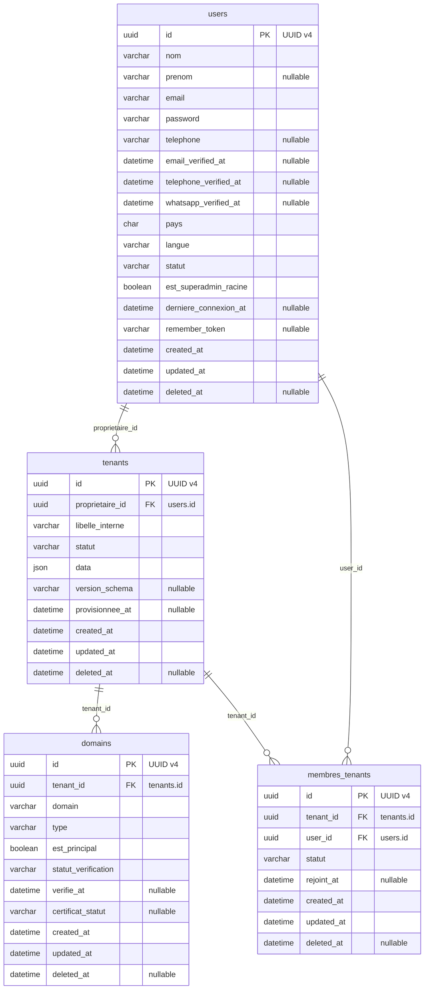
```mermaid
erDiagram
    direction TB
    users {
        uuid id PK "UUID v4"
        varchar nom
        varchar prenom "nullable"
        varchar email
        varchar password
        varchar telephone "nullable"
        datetime email_verified_at "nullable"
        datetime telephone_verified_at "nullable"
        datetime whatsapp_verified_at "nullable"
        char pays
        varchar langue
        varchar statut
        boolean est_superadmin_racine
        datetime derniere_connexion_at "nullable"
        varchar remember_token "nullable"
        datetime created_at
        datetime updated_at
        datetime deleted_at "nullable"
    }
    tenants {
        uuid id PK "UUID v4"
        uuid proprietaire_id FK "users.id"
        varchar libelle_interne
        varchar statut
        json data
        varchar version_schema "nullable"
        datetime provisionnee_at "nullable"
        datetime created_at
        datetime updated_at
        datetime deleted_at "nullable"
    }
    domains {
        uuid id PK "UUID v4"
        uuid tenant_id FK "tenants.id"
        varchar domain
        varchar type
        boolean est_principal
        varchar statut_verification
        datetime verifie_at "nullable"
        varchar certificat_statut "nullable"
        datetime created_at
        datetime updated_at
        datetime deleted_at "nullable"
    }
    membres_tenants {
        uuid id PK "UUID v4"
        uuid tenant_id FK "tenants.id"
        uuid user_id FK "users.id"
        varchar statut
        datetime rejoint_at "nullable"
        datetime created_at
        datetime updated_at
        datetime deleted_at "nullable"
    }
    users ||--o{ tenants : proprietaire_id
    tenants ||--o{ domains : tenant_id
    tenants ||--o{ membres_tenants : tenant_id
    users ||--o{ membres_tenants : user_id
```

Les références vers un autre module sont indiquées sur les champs, même si leur flèche n’est pas redessinée ici.

- **`users` :** UNIQUE(email normalisé). Pays DZ par défaut. Password contient un hachage. Au maximum un compte racine actif, contrainte conditionnelle à prévoir. Seul le compte racine a le contournement global ; un administrateur délégué conserve toutes les restrictions explicites. La langue est une préférence, pas une table de traductions du catalogue.

- **`tenants` :** Le propriétaire doit être actif. data conserve les métadonnées de connexion attendues par Tenancy, dont le nom technique de BDD ; ne pas maintenir un deuxième nom de BDD concurrent. Nom de BDD unique contrôlé au provisionnement. Aucun accès SQL direct donné aux commerçants.

- **`domains` :** UNIQUE(domain normalisé). Un domaine principal actif au maximum par tenant. type=sous_domaine|personnalise. Le domaine personnalisé exige la fonctionnalité correspondante. Adapter le modèle Domain et sa migration aux UUID. Pas de table sous_domaines distincte.

- **`membres_tenants` :** UNIQUE(tenant_id,user_id), restaurer la même appartenance lors d’une réinvitation. Le propriétaire possède aussi une appartenance. Les rôles seuls ne donnent pas une appartenance à la boutique.

### C2 — Permissions

**`fonctionnalites` — Catalogue des capacités activables et des quotas commerciaux.**

**`permissions` — Actions atomiques autorisées côté serveur.**

**`roles` — Rôles globaux du SaaS ou rôles personnalisés d’une boutique.**

**`roles_permissions` — Permissions accordées à un rôle.**

**`users_roles` — Attribution d’un ou plusieurs rôles à un compte.**

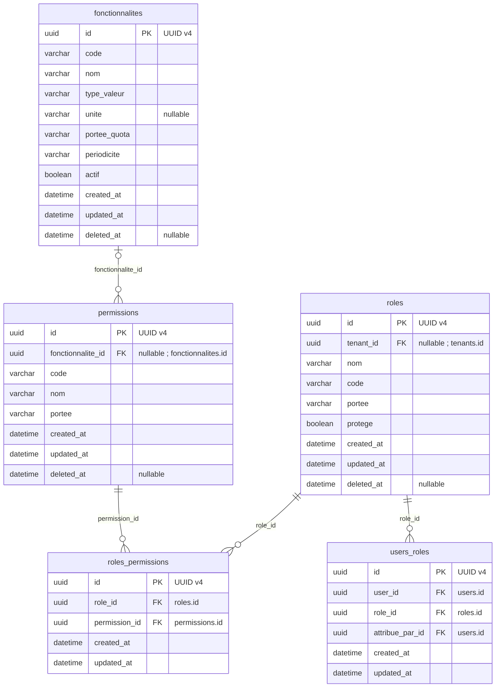
```mermaid
erDiagram
    direction TB
    fonctionnalites {
        uuid id PK "UUID v4"
        varchar code
        varchar nom
        varchar type_valeur
        varchar unite "nullable"
        varchar portee_quota
        varchar periodicite
        boolean actif
        datetime created_at
        datetime updated_at
        datetime deleted_at "nullable"
    }
    permissions {
        uuid id PK "UUID v4"
        uuid fonctionnalite_id FK "nullable ; fonctionnalites.id"
        varchar code
        varchar nom
        varchar portee
        datetime created_at
        datetime updated_at
        datetime deleted_at "nullable"
    }
    roles {
        uuid id PK "UUID v4"
        uuid tenant_id FK "nullable ; tenants.id"
        varchar nom
        varchar code
        varchar portee
        boolean protege
        datetime created_at
        datetime updated_at
        datetime deleted_at "nullable"
    }
    roles_permissions {
        uuid id PK "UUID v4"
        uuid role_id FK "roles.id"
        uuid permission_id FK "permissions.id"
        datetime created_at
        datetime updated_at
    }
    users_roles {
        uuid id PK "UUID v4"
        uuid user_id FK "users.id"
        uuid role_id FK "roles.id"
        uuid attribue_par_id FK "users.id"
        datetime created_at
        datetime updated_at
    }
    fonctionnalites |o--o{ permissions : fonctionnalite_id
    roles ||--o{ roles_permissions : role_id
    permissions ||--o{ roles_permissions : permission_id
    roles ||--o{ users_roles : role_id
```

Les références vers un autre module sont indiquées sur les champs, même si leur flèche n’est pas redessinée ici.

- **`fonctionnalites` :** UNIQUE(code). type_valeur=booleen|quota ; portee_quota=compte|tenant ; periodicite=aucune|mois. Exemples boutiques.nombre, domaines.personnalises, design.personnalise, livraison.ecotrack, statistiques.lire. Les fonctionnalités doivent correspondre à des contrôles réellement implémentés.

- **`permissions` :** UNIQUE(code). portee=plateforme|tenant. Exemples produits.creer, produits.modifier, produits.supprimer, stock.ajuster, commandes.confirmer, commandes.modifier, finances.valider_reversement, tenants.acceder, utilisateurs.usurper. Une fonctionnalité non commerciale peut ne pas avoir de fonctionnalite_id.

- **`roles` :** portee=plateforme exige tenant_id NULL ; portee=tenant exige un tenant. UNIQUE(contexte_normalise,code), contexte_normalise vaut plateforme ou UUID du tenant. La simple contrainte UNIQUE(tenant_id,code) ne suffit pas pour les lignes globales avec NULL.

- **`roles_permissions` :** UNIQUE(role_id,permission_id). Un rôle tenant accepte seulement des permissions tenant ; un rôle plateforme peut inclure les permissions tenant nécessaires à l’assistance, avec contrôle des cibles. Retirer une permission du rôle retire son autorisation, sans modifier les autres rôles.

- **`users_roles` :** UNIQUE(user_id,role_id). Un rôle tenant nécessite une appartenance active au même tenant. Aucun administrateur délégué ne peut attribuer plus de droits que sa délégation.

### C3 — Exceptions et accès administratifs

**`exceptions_permissions` — Autorisation ou interdiction ciblée pour une personne.**

**`restrictions_admins` — Exceptions ciblant des boutiques ou des comptes pour les administrateurs délégués.**

**`invitations_equipes` — Invitation d’un membre avec un premier rôle.**

**`sessions_assistance` — Accès temporaire d’un administrateur au contexte d’une boutique ou d’un membre.**

```mermaid
erDiagram
    direction TB
    exceptions_permissions {
        uuid id PK "UUID v4"
        uuid user_id FK "users.id"
        uuid permission_id FK "permissions.id"
        uuid tenant_id FK "nullable ; tenants.id"
        varchar effet
        datetime expire_at "nullable"
        uuid attribue_par_id FK "users.id"
        text motif "nullable"
        datetime created_at
        datetime updated_at
        datetime deleted_at "nullable"
    }
    restrictions_admins {
        uuid id PK "UUID v4"
        uuid admin_id FK "users.id"
        uuid permission_id FK "permissions.id"
        uuid tenant_cible_id FK "nullable ; tenants.id"
        uuid user_cible_id FK "nullable ; users.id"
        uuid role_cible_id FK "nullable ; roles.id"
        varchar effet
        datetime expire_at "nullable"
        uuid cree_par_id FK "users.id"
        datetime created_at
        datetime updated_at
        datetime deleted_at "nullable"
    }
    invitations_equipes {
        uuid id PK "UUID v4"
        uuid tenant_id FK "tenants.id"
        uuid role_initial_id FK "roles.id"
        uuid invite_par_id FK "users.id"
        varchar email
        varchar jeton_hash
        datetime expire_at
        datetime accepte_at "nullable"
        datetime revoque_at "nullable"
        datetime created_at
        datetime updated_at
    }
    sessions_assistance {
        uuid id PK "UUID v4"
        uuid admin_id FK "users.id"
        uuid tenant_id FK "tenants.id"
        uuid user_cible_id FK "nullable ; users.id"
        varchar jeton_hash
        text motif
        datetime debute_at
        datetime expire_at
        datetime terminee_at "nullable"
        datetime created_at
        datetime updated_at
    }
```

Les références vers un autre module sont indiquées sur les champs, même si leur flèche n’est pas redessinée ici.

- **`exceptions_permissions` :** effet=autoriser|interdire. UNIQUE(user_id,permission_id,contexte_normalise). Interdiction explicite prioritaire sur les autorisations des rôles ; une autorisation ne contourne ni les plafonds du plan ni l’appartenance.

- **`restrictions_admins` :** Exactement une cible renseignée parmi tenant, user et rôle. La cible rôle limite la consultation/administration de ce rôle ; les comptes représentés se contrôlent séparément. Une interdiction visant un propriétaire peut bloquer l’accès à toutes ses boutiques selon la permission tenants.acceder. Une autorisation ciblée ne crée pas de permission globale absente. UNIQUE(admin_id,permission_id,type_cible,cible_normalisee).

- **`invitations_equipes` :** UNIQUE(jeton_hash). Le rôle appartient au tenant invité. Plusieurs rôles peuvent ensuite être ajoutés par users_roles. Jeton consommable une seule fois.

- **`sessions_assistance` :** Les vérifications de permissions et restrictions restent actives à chaque action. Journaliser simultanément l’acteur réel et le compte représenté. L’usurpation ne doit jamais donner les droits supérieurs du compte cible à un administrateur limité.

### C4 — Plans et abonnements

**`plans` — Offre commerciale versionnée et réutilisable.**

**`plans_fonctionnalites` — Activation et limite de chaque capacité dans un plan.**

**`abonnements` — Abonnement du propriétaire ; couvre ses boutiques et son quota global.**

**`exceptions_fonctionnalites` — Activation, désactivation ou quota personnalisé, notamment un essai beta daté.**

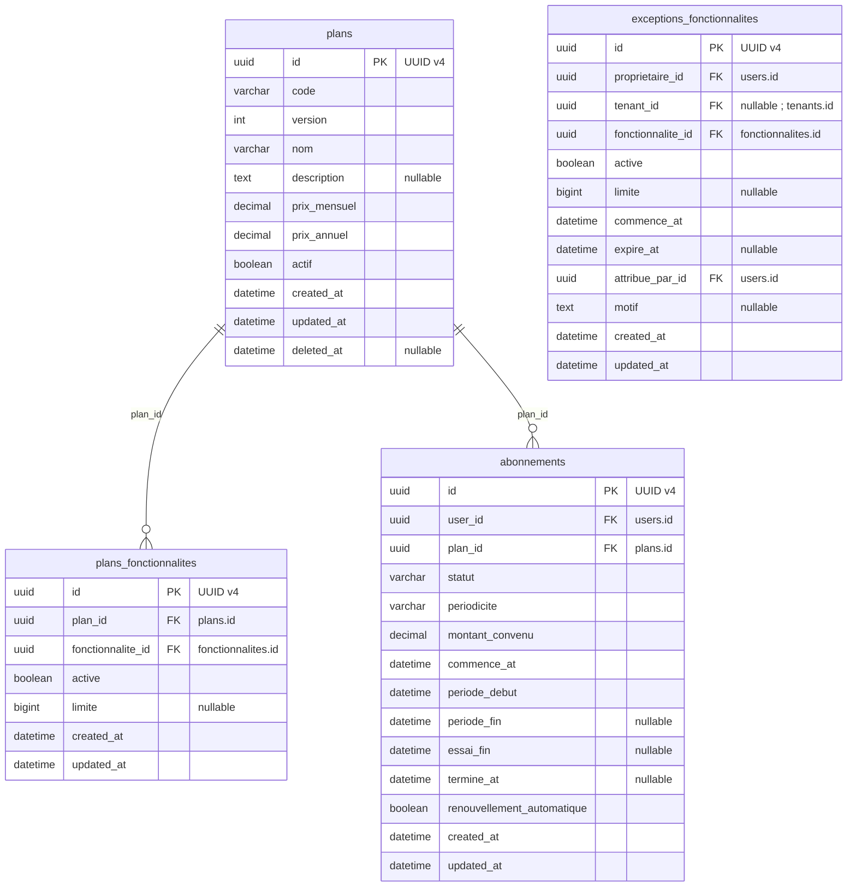
```mermaid
erDiagram
    direction TB
    plans {
        uuid id PK "UUID v4"
        varchar code
        int version
        varchar nom
        text description "nullable"
        decimal prix_mensuel
        decimal prix_annuel
        boolean actif
        datetime created_at
        datetime updated_at
        datetime deleted_at "nullable"
    }
    plans_fonctionnalites {
        uuid id PK "UUID v4"
        uuid plan_id FK "plans.id"
        uuid fonctionnalite_id FK "fonctionnalites.id"
        boolean active
        bigint limite "nullable"
        datetime created_at
        datetime updated_at
    }
    abonnements {
        uuid id PK "UUID v4"
        uuid user_id FK "users.id"
        uuid plan_id FK "plans.id"
        varchar statut
        varchar periodicite
        decimal montant_convenu
        datetime commence_at
        datetime periode_debut
        datetime periode_fin "nullable"
        datetime essai_fin "nullable"
        datetime termine_at "nullable"
        boolean renouvellement_automatique
        datetime created_at
        datetime updated_at
    }
    exceptions_fonctionnalites {
        uuid id PK "UUID v4"
        uuid proprietaire_id FK "users.id"
        uuid tenant_id FK "nullable ; tenants.id"
        uuid fonctionnalite_id FK "fonctionnalites.id"
        boolean active
        bigint limite "nullable"
        datetime commence_at
        datetime expire_at "nullable"
        uuid attribue_par_id FK "users.id"
        text motif "nullable"
        datetime created_at
        datetime updated_at
    }
    plans ||--o{ plans_fonctionnalites : plan_id
    plans ||--o{ abonnements : plan_id
```

Les références vers un autre module sont indiquées sur les champs, même si leur flèche n’est pas redessinée ici.

- **`plans` :** UNIQUE(code,version). DZD uniquement. Un plan déjà souscrit devient immuable : nouvelle version pour changer son contenu sans modifier rétroactivement tous les abonnements. Plan gratuit : prix=0 et quota de boutiques=1.

- **`plans_fonctionnalites` :** UNIQUE(plan_id,fonctionnalite_id). Pour quota : active=false signifie indisponible ; active=true et limite=NULL signifie illimité ; sinon limite>=0. Pour booléen : limite=NULL. Une capacité absente est désactivée. Immuable avec le plan utilisé.

- **`abonnements` :** Au maximum un abonnement courant par propriétaire, y compris le gratuit. Utiliser une contrainte sur une clé courante calculée ou un verrou transactionnel dédié. periodicite=gratuit|mensuel|annuel. Pas d’intégration carte nécessaire. La rétrogradation bloque les nouvelles créations excédentaires ; elle ne supprime pas les boutiques.

- **`exceptions_fonctionnalites` :** Pas d’intervalles qui se chevauchent pour un même propriétaire, tenant et fonctionnalité. tenant_id NULL = tout le compte. L’exception tenant prime sur celle du compte puis sur le plan. Un quota de portée compte ne reçoit pas d’exception tenant. Permissions individuelles toujours contrôlées.

### C5 — Suivi SaaS et référentiel

**`consommations_fonctionnalites` — Compteur technique de quotas, uniquement lorsque nécessaire.**

**`echeances_abonnement` — Montants dus pour le service SaaS, distincts des encaissements des boutiques.**

**`reglements_abonnement` — Paiements SaaS enregistrés et validés manuellement.**

**`wilayas` — Référentiel algérien partagé.**

**`communes` — Communes du référentiel partagé.**

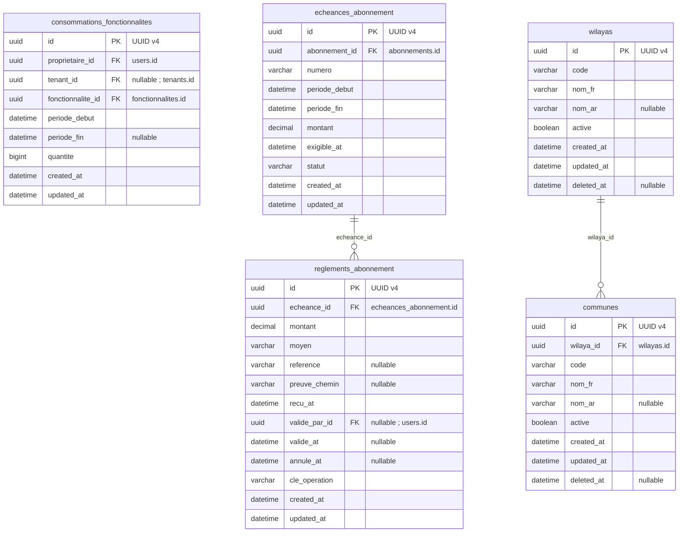
```mermaid
erDiagram
    direction TB
    consommations_fonctionnalites {
        uuid id PK "UUID v4"
        uuid proprietaire_id FK "users.id"
        uuid tenant_id FK "nullable ; tenants.id"
        uuid fonctionnalite_id FK "fonctionnalites.id"
        datetime periode_debut
        datetime periode_fin "nullable"
        bigint quantite
        datetime created_at
        datetime updated_at
    }
    echeances_abonnement {
        uuid id PK "UUID v4"
        uuid abonnement_id FK "abonnements.id"
        varchar numero
        datetime periode_debut
        datetime periode_fin
        decimal montant
        datetime exigible_at
        varchar statut
        datetime created_at
        datetime updated_at
    }
    reglements_abonnement {
        uuid id PK "UUID v4"
        uuid echeance_id FK "echeances_abonnement.id"
        decimal montant
        varchar moyen
        varchar reference "nullable"
        varchar preuve_chemin "nullable"
        datetime recu_at
        uuid valide_par_id FK "nullable ; users.id"
        datetime valide_at "nullable"
        datetime annule_at "nullable"
        varchar cle_operation
        datetime created_at
        datetime updated_at
    }
    wilayas {
        uuid id PK "UUID v4"
        varchar code
        varchar nom_fr
        varchar nom_ar "nullable"
        boolean active
        datetime created_at
        datetime updated_at
        datetime deleted_at "nullable"
    }
    communes {
        uuid id PK "UUID v4"
        uuid wilaya_id FK "wilayas.id"
        varchar code
        varchar nom_fr
        varchar nom_ar "nullable"
        boolean active
        datetime created_at
        datetime updated_at
        datetime deleted_at "nullable"
    }
    echeances_abonnement ||--o{ reglements_abonnement : echeance_id
    wilayas ||--o{ communes : wilaya_id
```

Les références vers un autre module sont indiquées sur les champs, même si leur flèche n’est pas redessinée ici.

- **`consommations_fonctionnalites` :** UNIQUE(proprietaire_id,contexte_normalise,fonctionnalite_id,periode_debut). Mise à jour atomique, contrôlée par le serveur, compteur recalculable. Pour boutiques.nombre, préférer COUNT des tenants non supprimés du propriétaire plutôt que deux vérités. Quotas d’un membre = ceux du propriétaire de la boutique.

- **`echeances_abonnement` :** UNIQUE(numero). DZD ; état dû/partiel/réglé dérivé des règlements validés. Pas une facture fiscale présumée.

- **`reglements_abonnement` :** UNIQUE(cle_operation). Montant>0. Le moyen reste configurable tant que le moyen de paiement SaaS n’est pas choisi. Pas de numéros de carte.

- **`wilayas` :** UNIQUE(code). Ne pas figer le nombre de wilayas dans le schéma. Les identifiants utilisés par un transporteur sont mappés séparément.

- **`communes` :** UNIQUE(wilaya_id,code). Vérifier l’appartenance commune/wilaya. Un code postal ne remplace pas l’identifiant d’une commune.

### C6 — Audit SaaS

**`journal_audit_central` — Historique des connexions sensibles, droits, plans, domaines et accès inter-boutiques.**

**`verifications_contacts` — Défis temporaires pour vérifier le téléphone ou le canal WhatsApp du compte SaaS.**

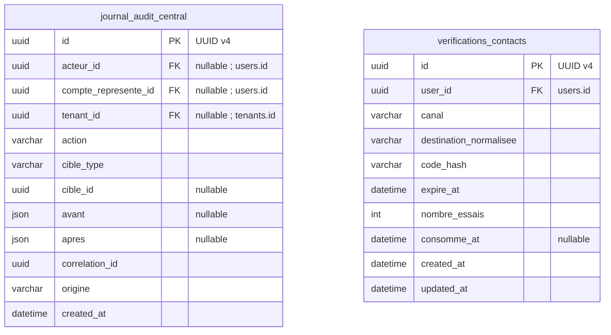
```mermaid
erDiagram
    direction TB
    journal_audit_central {
        uuid id PK "UUID v4"
        uuid acteur_id FK "nullable ; users.id"
        uuid compte_represente_id FK "nullable ; users.id"
        uuid tenant_id FK "nullable ; tenants.id"
        varchar action
        varchar cible_type
        uuid cible_id "nullable"
        json avant "nullable"
        json apres "nullable"
        uuid correlation_id
        varchar origine
        datetime created_at
    }
    verifications_contacts {
        uuid id PK "UUID v4"
        uuid user_id FK "users.id"
        varchar canal
        varchar destination_normalisee
        varchar code_hash
        datetime expire_at
        int nombre_essais
        datetime consomme_at "nullable"
        datetime created_at
        datetime updated_at
    }
```

Les références vers un autre module sont indiquées sur les champs, même si leur flèche n’est pas redessinée ici.

- **`journal_audit_central` :** Écriture append-only ; ne jamais journaliser mots de passe, OTP, tokens de connexion ou secrets API. Les cibles polymorphes sont des références logiques. Aucun bouton de suppression métier, même pour le root.

- **`verifications_contacts` :** canal=telephone|whatsapp. Hachage du code, durée courte et nombre d’essais limité. Vérifier une destination ne prouve pas qu’une autre destination ou un autre canal l’est. Si le téléphone change, remettre à NULL les vérifications associées. L’email et le mot de passe peuvent utiliser les mécanismes standards Laravel.

## 5. BDD de chaque boutique : `tenant_<uuid>`

Ce même modèle est migré dans chaque BDD tenant. Aucun `tenant_id` n’est ajouté à toutes les lignes : le contexte de connexion assure déjà la séparation. La ligne unique `boutique` conserve la référence de rattachement.

### T1 — Profil public

**`boutique` — Profil public unique dans la BDD de la boutique.**

**`adresses_boutique` — Plusieurs adresses et localisations publiques ; ne crée pas de gestion de caisse.**

**`liens_sociaux` — Plusieurs liens, y compris plusieurs pages sur un même réseau.**

**`pages_contenu` — Accueil, À propos, contact, conditions, politique de retour et confidentialité.**

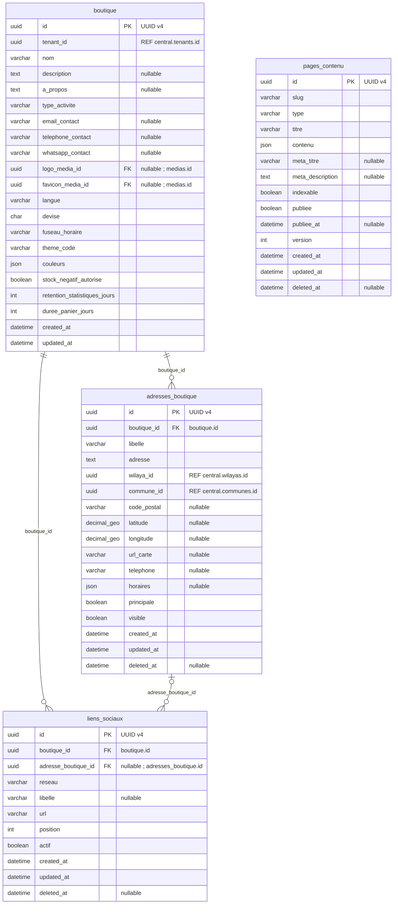
```mermaid
erDiagram
    direction TB
    boutique {
        uuid id PK "UUID v4"
        uuid tenant_id "REF central.tenants.id"
        varchar nom
        text description "nullable"
        text a_propos "nullable"
        varchar type_activite
        varchar email_contact "nullable"
        varchar telephone_contact "nullable"
        varchar whatsapp_contact "nullable"
        uuid logo_media_id FK "nullable ; medias.id"
        uuid favicon_media_id FK "nullable ; medias.id"
        varchar langue
        char devise
        varchar fuseau_horaire
        varchar theme_code
        json couleurs
        boolean stock_negatif_autorise
        int retention_statistiques_jours
        int duree_panier_jours
        datetime created_at
        datetime updated_at
    }
    adresses_boutique {
        uuid id PK "UUID v4"
        uuid boutique_id FK "boutique.id"
        varchar libelle
        text adresse
        uuid wilaya_id "REF central.wilayas.id"
        uuid commune_id "REF central.communes.id"
        varchar code_postal "nullable"
        decimal_geo latitude "nullable"
        decimal_geo longitude "nullable"
        varchar url_carte "nullable"
        varchar telephone "nullable"
        json horaires "nullable"
        boolean principale
        boolean visible
        datetime created_at
        datetime updated_at
        datetime deleted_at "nullable"
    }
    liens_sociaux {
        uuid id PK "UUID v4"
        uuid boutique_id FK "boutique.id"
        uuid adresse_boutique_id FK "nullable ; adresses_boutique.id"
        varchar reseau
        varchar libelle "nullable"
        varchar url
        int position
        boolean actif
        datetime created_at
        datetime updated_at
        datetime deleted_at "nullable"
    }
    pages_contenu {
        uuid id PK "UUID v4"
        varchar slug
        varchar type
        varchar titre
        json contenu
        varchar meta_titre "nullable"
        text meta_description "nullable"
        boolean indexable
        boolean publiee
        datetime publiee_at "nullable"
        int version
        datetime created_at
        datetime updated_at
        datetime deleted_at "nullable"
    }
    boutique ||--o{ adresses_boutique : boutique_id
    boutique ||--o{ liens_sociaux : boutique_id
    adresses_boutique |o--o{ liens_sociaux : adresse_boutique_id
```

Les références vers un autre module sont indiquées sur les champs, même si leur flèche n’est pas redessinée ici.

- **`boutique` :** Une seule ligne ; tenant_id égal au tenant courant. DZD et Africa/Algiers. theme_code=template_initial pour le MVP. Le nom du site, le logo, les contacts et les couleurs appartiennent à la boutique, pas à users.

- **`adresses_boutique` :** Une seule adresse principale active. Vérifier commune/wilaya. Horaires structurés par jour dans un JSON limité au contenu public. Pas de stock par adresse dans ce périmètre.

- **`liens_sociaux` :** Ne pas imposer UNIQUE(reseau). Ce sont des liens publics, sans tokens de publication ni calendrier marketing.

- **`pages_contenu` :** UNIQUE(slug). Structure JSON définie par le template initial ; pas de code arbitraire. FAQ, menu/header/footer et textes institutionnels peuvent être des blocs de ce template ; leur affichage ne justifie pas chacun une table.

### T2 — Catalogue principal

**`medias` — Métadonnées de fichiers images, vidéos, logos et documents.**

**`categories` — Catégories et sous-catégories avec une seule table.**

**`produits` — Descriptif commercial commun à toutes les variantes.**

**`variantes_produits` — Unité vendable : une variante par combinaison ; une variante standard pour un produit sans options.**

```mermaid
erDiagram
    direction TB
    medias {
        uuid id PK "UUID v4"
        varchar cle_stockage
        varchar mime_type
        varchar nom_original
        bigint taille_octets
        int largeur "nullable"
        int hauteur "nullable"
        int duree_secondes "nullable"
        text texte_alternatif "nullable"
        uuid cree_par_id "nullable ; REF central.users.id"
        datetime created_at
        datetime updated_at
        datetime deleted_at "nullable"
    }
    categories {
        uuid id PK "UUID v4"
        uuid parent_id FK "nullable ; categories.id"
        varchar nom
        varchar slug
        text description "nullable"
        uuid media_id FK "nullable ; medias.id"
        int position
        boolean active
        varchar meta_titre "nullable"
        text meta_description "nullable"
        datetime created_at
        datetime updated_at
        datetime deleted_at "nullable"
    }
    produits {
        uuid id PK "UUID v4"
        uuid categorie_id FK "nullable ; categories.id"
        varchar nom
        varchar slug
        text description_courte "nullable"
        text description "nullable"
        json avantages "nullable"
        json faq "nullable"
        varchar marque "nullable"
        varchar type
        boolean personnalisation_autorisee
        text consignes_personnalisation "nullable"
        varchar unite_vente
        decimal quantite_contenu "nullable"
        varchar unite_contenu "nullable"
        varchar statut
        datetime publie_at "nullable"
        boolean mis_en_avant
        varchar meta_titre "nullable"
        text meta_description "nullable"
        boolean indexable
        datetime created_at
        datetime updated_at
        datetime deleted_at "nullable"
    }
    variantes_produits {
        uuid id PK "UUID v4"
        uuid produit_id FK "produits.id"
        varchar libelle
        varchar reference_sku
        varchar code_barres "nullable"
        varchar signature_combinaison
        decimal prix_vente
        decimal cout_unitaire
        decimal ancien_prix "nullable"
        int stock_physique
        int stock_reserve
        int seuil_stock_faible
        boolean stock_negatif_autorise "nullable"
        decimal poids_kg "nullable"
        decimal longueur_cm "nullable"
        decimal largeur_cm "nullable"
        decimal hauteur_cm "nullable"
        boolean active
        int position
        datetime created_at
        datetime updated_at
        datetime deleted_at "nullable"
    }
    categories |o--o{ categories : parent_id
    medias |o--o{ categories : media_id
    categories |o--o{ produits : categorie_id
    produits ||--o{ variantes_produits : produit_id
```

Les références vers un autre module sont indiquées sur les champs, même si leur flèche n’est pas redessinée ici.

- **`medias` :** UNIQUE(cle_stockage). Fichier dans le stockage de fichiers, pas un BLOB dans chaque produit. Documents privés servis après autorisation ; médias publics séparés. Les textes alternatifs ne sont pas arbitrairement limités à 30 caractères.

- **`categories` :** UNIQUE(slug). parent_id NULL = catégorie principale. Empêcher les cycles. Un produit a une catégorie principale dans ce périmètre ; les étiquettes permettent les regroupements transversaux.

- **`produits` :** UNIQUE(slug). type=physique_standard|physique_personnalise. Un bouquet personnalisé reste livrable : aucun agenda de services. Prix, coût, SKU, code-barres et stock sont portés par la variante, même pour un produit simple. Prix par unité de contenu calculable si pertinent.

- **`variantes_produits` :** UNIQUE(reference_sku), UNIQUE(produit_id,signature_combinaison). Index(code_barres), chaîne conservant les zéros. stock_reserve>=0 ; stock_physique peut être négatif uniquement selon la politique. stock disponible=stock_physique-stock_reserve. Null pour la politique signifie hériter de boutique. Signature recalculée depuis les options, jamais acceptée aveuglément du navigateur.

### T3 — Options et images

**`options_produit` — Axes de variation propres au produit : taille, couleur, matière, modèle.**

**`valeurs_options` — Valeurs possibles d’un axe.**

**`variantes_valeurs` — Composition normalisée de chaque variante.**

**`medias_produits` — Galerie générale et médias spécifiques à une variante.**

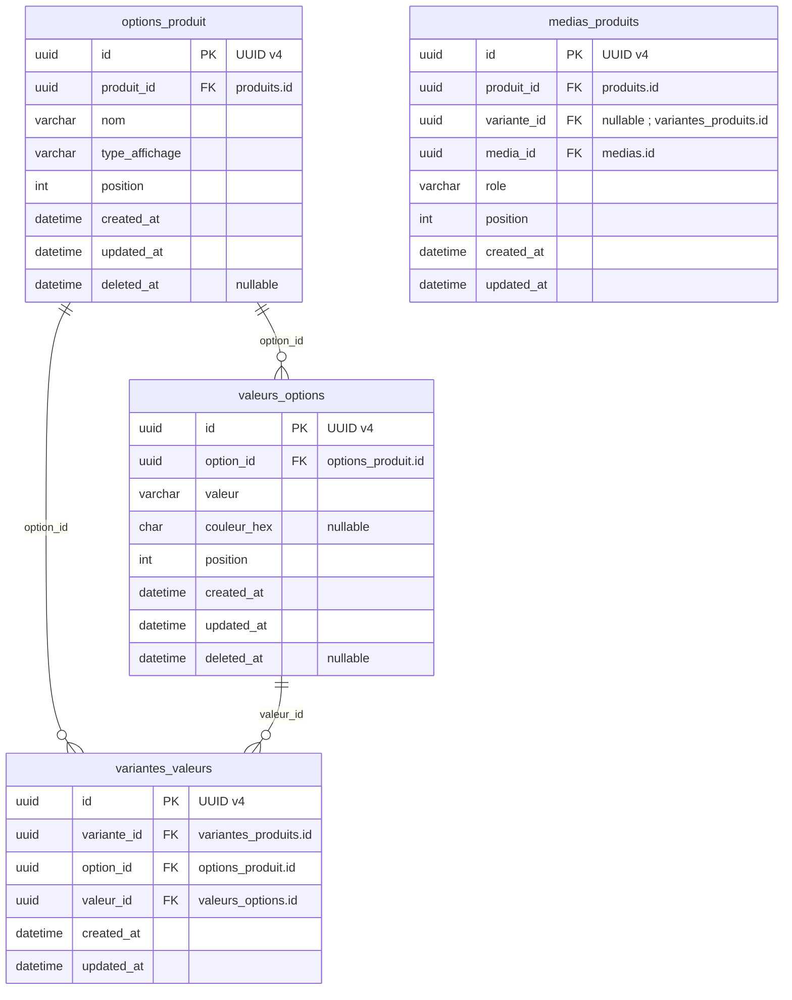
```mermaid
erDiagram
    direction TB
    options_produit {
        uuid id PK "UUID v4"
        uuid produit_id FK "produits.id"
        varchar nom
        varchar type_affichage
        int position
        datetime created_at
        datetime updated_at
        datetime deleted_at "nullable"
    }
    valeurs_options {
        uuid id PK "UUID v4"
        uuid option_id FK "options_produit.id"
        varchar valeur
        char couleur_hex "nullable"
        int position
        datetime created_at
        datetime updated_at
        datetime deleted_at "nullable"
    }
    variantes_valeurs {
        uuid id PK "UUID v4"
        uuid variante_id FK "variantes_produits.id"
        uuid option_id FK "options_produit.id"
        uuid valeur_id FK "valeurs_options.id"
        datetime created_at
        datetime updated_at
    }
    medias_produits {
        uuid id PK "UUID v4"
        uuid produit_id FK "produits.id"
        uuid variante_id FK "nullable ; variantes_produits.id"
        uuid media_id FK "medias.id"
        varchar role
        int position
        datetime created_at
        datetime updated_at
    }
    options_produit ||--o{ valeurs_options : option_id
    options_produit ||--o{ variantes_valeurs : option_id
    valeurs_options ||--o{ variantes_valeurs : valeur_id
```

Les références vers un autre module sont indiquées sur les champs, même si leur flèche n’est pas redessinée ici.

- **`options_produit` :** UNIQUE(produit_id,nom normalisé). Une caractéristique descriptive non achetable n’est pas un axe de variante.

- **`valeurs_options` :** UNIQUE(option_id,valeur normalisée). Une couleur hexadécimale est facultative.

- **`variantes_valeurs` :** UNIQUE(variante_id,option_id). valeur_id doit appartenir à option_id ; l’option et la variante au même produit. Renforcer par clés composites là où possible. Chaque variante possède exactement une valeur pour chaque axe actif du produit ; aucune valeur pour la variante standard.

- **`medias_produits` :** La variante éventuelle appartient au produit. role=principal|galerie|guide_taille|mise_en_situation. Au maximum un principal par portée produit/variante. Les galeries peuvent contenir images ou vidéos.

### T4 — Classement et caractéristiques

**`etiquettes` — Tags e-commerce réutilisables.**

**`produits_etiquettes` — Relation entre produits et tags.**

**`caracteristiques` — Dictionnaire de caractéristiques descriptives cohérentes.**

**`produits_caracteristiques` — Valeur descriptive d’une caractéristique pour un produit.**

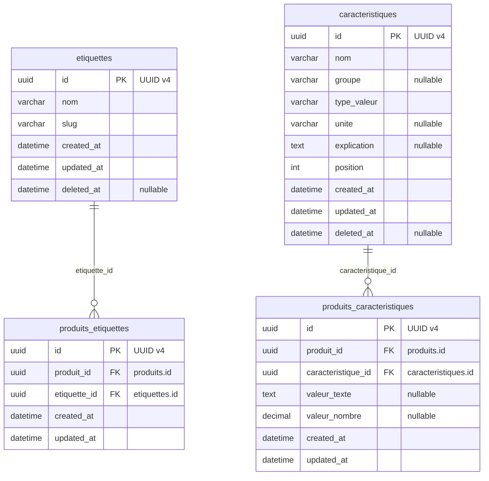
```mermaid
erDiagram
    direction TB
    etiquettes {
        uuid id PK "UUID v4"
        varchar nom
        varchar slug
        datetime created_at
        datetime updated_at
        datetime deleted_at "nullable"
    }
    produits_etiquettes {
        uuid id PK "UUID v4"
        uuid produit_id FK "produits.id"
        uuid etiquette_id FK "etiquettes.id"
        datetime created_at
        datetime updated_at
    }
    caracteristiques {
        uuid id PK "UUID v4"
        varchar nom
        varchar groupe "nullable"
        varchar type_valeur
        varchar unite "nullable"
        text explication "nullable"
        int position
        datetime created_at
        datetime updated_at
        datetime deleted_at "nullable"
    }
    produits_caracteristiques {
        uuid id PK "UUID v4"
        uuid produit_id FK "produits.id"
        uuid caracteristique_id FK "caracteristiques.id"
        text valeur_texte "nullable"
        decimal valeur_nombre "nullable"
        datetime created_at
        datetime updated_at
    }
    etiquettes ||--o{ produits_etiquettes : etiquette_id
    caracteristiques ||--o{ produits_caracteristiques : caracteristique_id
```

Les références vers un autre module sont indiquées sur les champs, même si leur flèche n’est pas redessinée ici.

- **`etiquettes` :** UNIQUE(slug).

- **`produits_etiquettes` :** UNIQUE(produit_id,etiquette_id).

- **`caracteristiques` :** UNIQUE(nom,groupe normalisé). Exemples composition, capacité, dimensions. Permet unités cohérentes et explications, sans créer de variantes inutiles.

- **`produits_caracteristiques` :** UNIQUE(produit_id,caracteristique_id). Une valeur compatible avec le type défini ; contrôler texte/nombre. Les filtres d’options utilisent les tables options/valeurs.

### T5 — Vente et avis

**`pages_vente` — Landing page mono-produit avec URL partageable.**

**`promotions_produits` — Réductions automatiques, sans code promo.**

**`avis_produits` — Avis déposés sans compte et modérés par la boutique.**

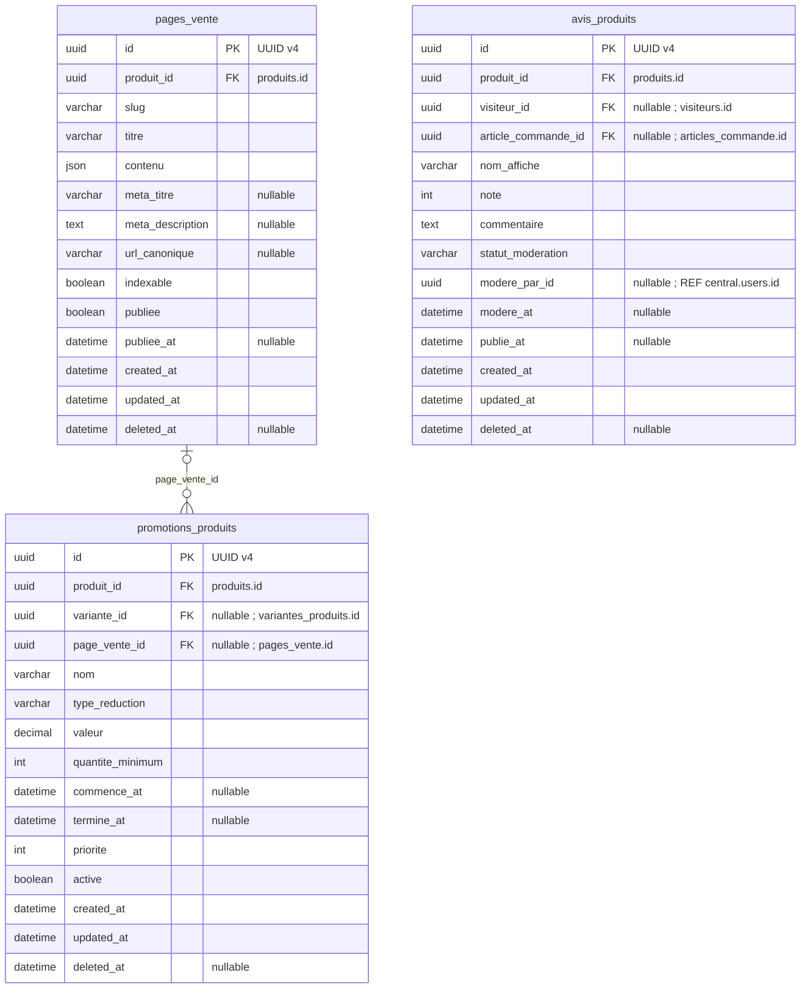
```mermaid
erDiagram
    direction TB
    pages_vente {
        uuid id PK "UUID v4"
        uuid produit_id FK "produits.id"
        varchar slug
        varchar titre
        json contenu
        varchar meta_titre "nullable"
        text meta_description "nullable"
        varchar url_canonique "nullable"
        boolean indexable
        boolean publiee
        datetime publiee_at "nullable"
        datetime created_at
        datetime updated_at
        datetime deleted_at "nullable"
    }
    promotions_produits {
        uuid id PK "UUID v4"
        uuid produit_id FK "produits.id"
        uuid variante_id FK "nullable ; variantes_produits.id"
        uuid page_vente_id FK "nullable ; pages_vente.id"
        varchar nom
        varchar type_reduction
        decimal valeur
        int quantite_minimum
        datetime commence_at "nullable"
        datetime termine_at "nullable"
        int priorite
        boolean active
        datetime created_at
        datetime updated_at
        datetime deleted_at "nullable"
    }
    avis_produits {
        uuid id PK "UUID v4"
        uuid produit_id FK "produits.id"
        uuid visiteur_id FK "nullable ; visiteurs.id"
        uuid article_commande_id FK "nullable ; articles_commande.id"
        varchar nom_affiche
        int note
        text commentaire
        varchar statut_moderation
        uuid modere_par_id "nullable ; REF central.users.id"
        datetime modere_at "nullable"
        datetime publie_at "nullable"
        datetime created_at
        datetime updated_at
        datetime deleted_at "nullable"
    }
    pages_vente |o--o{ promotions_produits : page_vente_id
```

Les références vers un autre module sont indiquées sur les champs, même si leur flèche n’est pas redessinée ici.

- **`pages_vente` :** UNIQUE(slug). Plusieurs pages peuvent présenter le même produit. Prix/stock calculés depuis variantes et promotions ; pas de prix indépendant dans le contenu. La page n’est pas une condition obligatoire pour commander. Pas de canonical automatique vers la catégorie.

- **`promotions_produits` :** type=pourcentage|montant_unitaire|prix_unitaire_fixe. Quantité>=1 ; pourcentage entre 0 et 100 ; prix final>=0. Variante et page du même produit. Une promotion maximum par ligne : priorité, puis plus avantageuse, puis UUID pour départager. Ciblage de page contrôlé côté serveur, jamais par une simple valeur libre envoyée par le client.

- **`avis_produits` :** note entière de 1 à 5. statut=en_attente|publie|masque|rejete. Le score public utilise les avis publiés. Le label achat vérifié nécessite une preuve de commande liée ; nom et téléphone saisis ne suffisent pas. Les avis masqués restent auditables.

### T6 — Visiteurs et statistiques

**`visiteurs` — Identifiant pseudonyme d’un navigateur dans cette boutique ; aucun mot de passe.**

**`sessions_visite` — Une visite continue ; un visiteur peut avoir plusieurs sessions.**

**`evenements_navigation` — Événements nécessaires aux vues, paniers et parcours de conversion.**

**`preferences_visiteur` — Préférences de mesure et version du texte présenté, séparées de l’identité panier.**

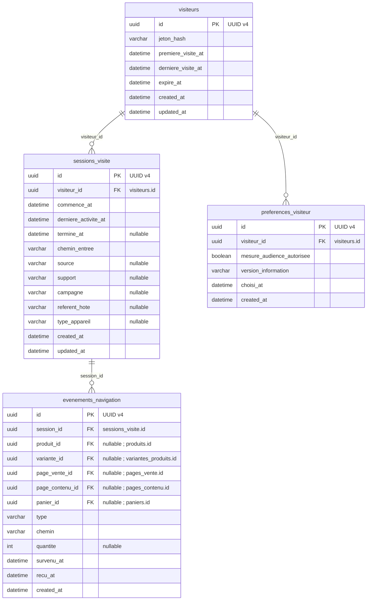
```mermaid
erDiagram
    direction TB
    visiteurs {
        uuid id PK "UUID v4"
        varchar jeton_hash
        datetime premiere_visite_at
        datetime derniere_visite_at
        datetime expire_at
        datetime created_at
        datetime updated_at
    }
    sessions_visite {
        uuid id PK "UUID v4"
        uuid visiteur_id FK "visiteurs.id"
        datetime commence_at
        datetime derniere_activite_at
        datetime termine_at "nullable"
        varchar chemin_entree
        varchar source "nullable"
        varchar support "nullable"
        varchar campagne "nullable"
        varchar referent_hote "nullable"
        varchar type_appareil "nullable"
        datetime created_at
        datetime updated_at
    }
    evenements_navigation {
        uuid id PK "UUID v4"
        uuid session_id FK "sessions_visite.id"
        uuid produit_id FK "nullable ; produits.id"
        uuid variante_id FK "nullable ; variantes_produits.id"
        uuid page_vente_id FK "nullable ; pages_vente.id"
        uuid page_contenu_id FK "nullable ; pages_contenu.id"
        uuid panier_id FK "nullable ; paniers.id"
        varchar type
        varchar chemin
        int quantite "nullable"
        datetime survenu_at
        datetime recu_at
        datetime created_at
    }
    preferences_visiteur {
        uuid id PK "UUID v4"
        uuid visiteur_id FK "visiteurs.id"
        boolean mesure_audience_autorisee
        varchar version_information
        datetime choisi_at
        datetime created_at
    }
    visiteurs ||--o{ sessions_visite : visiteur_id
    sessions_visite ||--o{ evenements_navigation : session_id
    visiteurs ||--o{ preferences_visiteur : visiteur_id
```

Les références vers un autre module sont indiquées sur les champs, même si leur flèche n’est pas redessinée ici.

- **`visiteurs` :** UNIQUE(jeton_hash). Le cookie porte un secret aléatoire opaque distinct du UUID. Aucun identifiant commun entre commerçants. Ni IP ni fingerprint utilisés comme identité fiable.

- **`sessions_visite` :** Index(visiteur_id,commence_at). Proposition : nouvelle session après 30 minutes d’inactivité. Source/support/campagne sont des labels internes facultatifs, sans connecter un réseau social. Ne pas stocker une URL de référence contenant des secrets.

- **`evenements_navigation` :** UUID de l’événement = clé de déduplication. Types page_vue, produit_vu, recherche, ajout_panier, retrait_panier, checkout_commence ; achats/retours proviennent du serveur métier. Valider les références et dates client. Pour une page produit, enregistrer un seul événement produit_vu qui compte aussi comme vue de page.

- **`preferences_visiteur` :** Conserver l’historique des choix. Le panier peut fonctionner sans mesure d’audience. La durée et les conditions de collecte sont à fixer avant mise en ligne ; cette table n’affirme pas une conformité juridique automatique.

### T7 — Panier

**`paniers` — Panier invité conservé côté serveur.**

**`articles_panier` — Lignes de panier avec variante et personnalisation.**

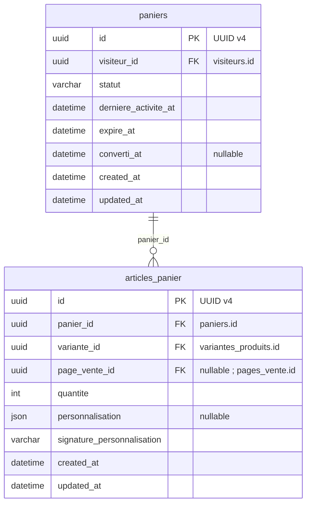
```mermaid
erDiagram
    direction TB
    paniers {
        uuid id PK "UUID v4"
        uuid visiteur_id FK "visiteurs.id"
        varchar statut
        datetime derniere_activite_at
        datetime expire_at
        datetime converti_at "nullable"
        datetime created_at
        datetime updated_at
    }
    articles_panier {
        uuid id PK "UUID v4"
        uuid panier_id FK "paniers.id"
        uuid variante_id FK "variantes_produits.id"
        uuid page_vente_id FK "nullable ; pages_vente.id"
        int quantite
        json personnalisation "nullable"
        varchar signature_personnalisation
        datetime created_at
        datetime updated_at
    }
    paniers ||--o{ articles_panier : panier_id
```

Les références vers un autre module sont indiquées sur les champs, même si leur flèche n’est pas redessinée ici.

- **`paniers` :** statut=actif|abandonne|converti|expire. Un panier actif par visiteur. Un panier abandonné peut être réactivé ; un panier converti est figé. Pas de réservation de stock lors d’un simple ajout au panier.

- **`articles_panier` :** UNIQUE(panier_id,variante_id,signature_personnalisation,page_origine_normalisee). Quantité>0. Deux bouquets de même variante avec des messages différents restent deux lignes. Les prix affichés sont recalculés ; aucune confiance dans les prix du navigateur.

### T8 — Commande et versions

**`commandes` — Identité stable et décision commerciale de la commande.**

**`revisions_commandes` — Photographie de la commande à chaque modification : destinataire, frais et totaux.**

**`articles_commande` — Lignes d’une révision ; prix et coût historiques conservés.**

**`historique_commandes` — Journal des décisions, appels, remplacements et changements de champs.**

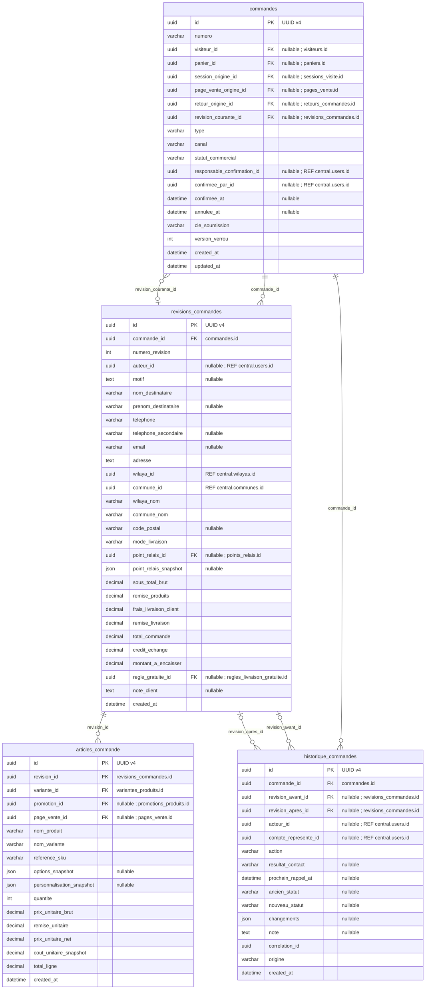
```mermaid
erDiagram
    direction TB
    commandes {
        uuid id PK "UUID v4"
        varchar numero
        uuid visiteur_id FK "nullable ; visiteurs.id"
        uuid panier_id FK "nullable ; paniers.id"
        uuid session_origine_id FK "nullable ; sessions_visite.id"
        uuid page_vente_origine_id FK "nullable ; pages_vente.id"
        uuid retour_origine_id FK "nullable ; retours_commandes.id"
        uuid revision_courante_id FK "nullable ; revisions_commandes.id"
        varchar type
        varchar canal
        varchar statut_commercial
        uuid responsable_confirmation_id "nullable ; REF central.users.id"
        uuid confirmee_par_id "nullable ; REF central.users.id"
        datetime confirmee_at "nullable"
        datetime annulee_at "nullable"
        varchar cle_soumission
        int version_verrou
        datetime created_at
        datetime updated_at
    }
    revisions_commandes {
        uuid id PK "UUID v4"
        uuid commande_id FK "commandes.id"
        int numero_revision
        uuid auteur_id "nullable ; REF central.users.id"
        text motif "nullable"
        varchar nom_destinataire
        varchar prenom_destinataire "nullable"
        varchar telephone
        varchar telephone_secondaire "nullable"
        varchar email "nullable"
        text adresse
        uuid wilaya_id "REF central.wilayas.id"
        uuid commune_id "REF central.communes.id"
        varchar wilaya_nom
        varchar commune_nom
        varchar code_postal "nullable"
        varchar mode_livraison
        uuid point_relais_id FK "nullable ; points_relais.id"
        json point_relais_snapshot "nullable"
        decimal sous_total_brut
        decimal remise_produits
        decimal frais_livraison_client
        decimal remise_livraison
        decimal total_commande
        decimal credit_echange
        decimal montant_a_encaisser
        uuid regle_gratuite_id FK "nullable ; regles_livraison_gratuite.id"
        text note_client "nullable"
        datetime created_at
    }
    articles_commande {
        uuid id PK "UUID v4"
        uuid revision_id FK "revisions_commandes.id"
        uuid variante_id FK "variantes_produits.id"
        uuid promotion_id FK "nullable ; promotions_produits.id"
        uuid page_vente_id FK "nullable ; pages_vente.id"
        varchar nom_produit
        varchar nom_variante
        varchar reference_sku
        json options_snapshot "nullable"
        json personnalisation_snapshot "nullable"
        int quantite
        decimal prix_unitaire_brut
        decimal remise_unitaire
        decimal prix_unitaire_net
        decimal cout_unitaire_snapshot
        decimal total_ligne
        datetime created_at
    }
    historique_commandes {
        uuid id PK "UUID v4"
        uuid commande_id FK "commandes.id"
        uuid revision_avant_id FK "nullable ; revisions_commandes.id"
        uuid revision_apres_id FK "nullable ; revisions_commandes.id"
        uuid acteur_id "nullable ; REF central.users.id"
        uuid compte_represente_id "nullable ; REF central.users.id"
        varchar action
        varchar resultat_contact "nullable"
        datetime prochain_rappel_at "nullable"
        varchar ancien_statut "nullable"
        varchar nouveau_statut "nullable"
        json changements "nullable"
        text note "nullable"
        uuid correlation_id
        varchar origine
        datetime created_at
    }
    revisions_commandes |o--o{ commandes : revision_courante_id
    commandes ||--o{ revisions_commandes : commande_id
    revisions_commandes ||--o{ articles_commande : revision_id
    commandes ||--o{ historique_commandes : commande_id
    revisions_commandes |o--o{ historique_commandes : revision_avant_id
    revisions_commandes |o--o{ historique_commandes : revision_apres_id
```

Les références vers un autre module sont indiquées sur les champs, même si leur flèche n’est pas redessinée ici.

- **`commandes` :** UNIQUE(numero), UNIQUE(cle_soumission), UNIQUE(panier_id) hors NULL. type=standard|remplacement ; canal=panier|page_vente|manuel. Une commande peut avoir plusieurs produits via ses lignes. Statut commercial distinct de livraison et de l’argent. Au maximum une commande de remplacement active pour un retour. Brouillon interne pendant la transaction seulement si la révision courante est NULL.

- **`revisions_commandes` :** UNIQUE(commande_id,numero_revision). Immuable une fois validée. total=sous_total_brut-remise_produits+frais_livraison_client-remise_livraison ; COD=total-credit_echange. Pas de taxes ni de carte. Adresse complète exigée à domicile, coordonnées du bureau figées pour stop desk. Le numéro de téléphone est du texte. La révision courante doit appartenir à la même commande.

- **`articles_commande` :** Quantité>0. net=brut-remise, total=quantité*net. Le produit est accessible via la variante ; ne pas relier directement commandes à un produit unique. Lire uniquement les lignes de la révision pertinente pour les statistiques. Aucune suppression des anciennes lignes.

- **`historique_commandes` :** Résultats contact : confirme, rappeler, ne_repond_pas, numero_incorrect, annule. Un résultat d’appel n’est pas automatiquement un statut de livraison. Modifications de quantité, variante, prix, adresse et stock reliées par correlation_id. Historique append-only.

### T9 — Stock et retours

**`reservations_stock` — Quantités affectées à une commande confirmée mais non expédiée.**

**`mouvements_stock` — Journal des variations physiques, réservations et pertes.**

**`retours_commandes` — Retour de la totalité d’un colis, jamais retour partiel au point de livraison.**

**`articles_retour` — Inspection par article du colis retourné intégralement.**

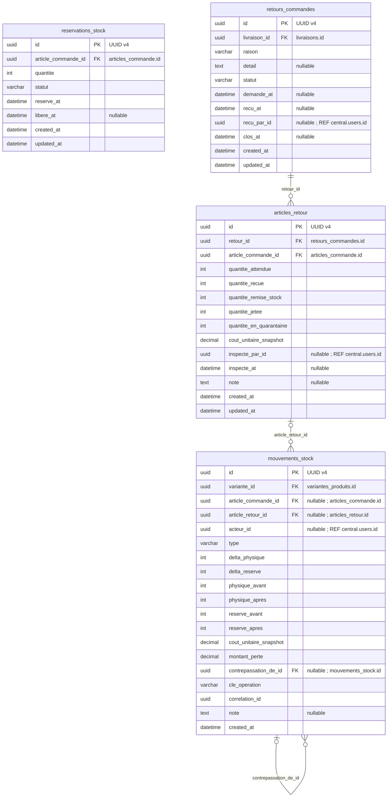
```mermaid
erDiagram
    direction TB
    reservations_stock {
        uuid id PK "UUID v4"
        uuid article_commande_id FK "articles_commande.id"
        int quantite
        varchar statut
        datetime reserve_at
        datetime libere_at "nullable"
        datetime created_at
        datetime updated_at
    }
    mouvements_stock {
        uuid id PK "UUID v4"
        uuid variante_id FK "variantes_produits.id"
        uuid article_commande_id FK "nullable ; articles_commande.id"
        uuid article_retour_id FK "nullable ; articles_retour.id"
        uuid acteur_id "nullable ; REF central.users.id"
        varchar type
        int delta_physique
        int delta_reserve
        int physique_avant
        int physique_apres
        int reserve_avant
        int reserve_apres
        decimal cout_unitaire_snapshot
        decimal montant_perte
        uuid contrepassation_de_id FK "nullable ; mouvements_stock.id"
        varchar cle_operation
        uuid correlation_id
        text note "nullable"
        datetime created_at
    }
    retours_commandes {
        uuid id PK "UUID v4"
        uuid livraison_id FK "livraisons.id"
        varchar raison
        text detail "nullable"
        varchar statut
        datetime demande_at "nullable"
        datetime recu_at "nullable"
        uuid recu_par_id "nullable ; REF central.users.id"
        datetime clos_at "nullable"
        datetime created_at
        datetime updated_at
    }
    articles_retour {
        uuid id PK "UUID v4"
        uuid retour_id FK "retours_commandes.id"
        uuid article_commande_id FK "articles_commande.id"
        int quantite_attendue
        int quantite_recue
        int quantite_remise_stock
        int quantite_jetee
        int quantite_en_quarantaine
        decimal cout_unitaire_snapshot
        uuid inspecte_par_id "nullable ; REF central.users.id"
        datetime inspecte_at "nullable"
        text note "nullable"
        datetime created_at
        datetime updated_at
    }
    articles_retour |o--o{ mouvements_stock : article_retour_id
    mouvements_stock |o--o{ mouvements_stock : contrepassation_de_id
    retours_commandes ||--o{ articles_retour : retour_id
```

Les références vers un autre module sont indiquées sur les champs, même si leur flèche n’est pas redessinée ici.

- **`reservations_stock` :** UNIQUE(article_commande_id). Statut=active|liberee|consommee. Réserver à confirmation manuelle ; contrôler de nouveau lors d’une modification. Réserver n’est pas annoncer une réception de marchandises.

- **`mouvements_stock` :** UNIQUE(cle_operation). Même transaction que les compteurs de variante et réservations. physique_apres=avant+delta ; idem réserve. Ne pas éditer un mouvement : ajouter une contrepassation explicite. Un retour cassé après expédition peut produire delta_physique=0 et montant_perte>0 ; il n’était plus en stock vendable.

- **`retours_commandes` :** UNIQUE(livraison_id). demandé|en_transit|recu|en_inspection|clos. La réception physique locale doit être confirmée avant remise en stock ; un statut distant ne suffit pas. Une réexpédition après retour utilise une nouvelle commande liée.

- **`articles_retour` :** UNIQUE(retour_id,article_commande_id). Toutes les lignes de la révision expédiée sont attendues avec leurs quantités entières. Somme remise+jetée+quarantaine <= reçue <= attendue ; écarts signalés. Une ligne d’inspection ne signifie pas que l’acheteur peut accepter partiellement le colis.

### T10 — Livraison et prix

**`prestataires_livraison` — Livreurs internes et sociétés de livraison, avec un même modèle de reversement.**

**`tarifs_livraison_client` — Ce que la boutique facture au client, séparé du coût du transporteur.**

**`tarifs_prestataires` — Coût prévu pour la boutique selon prestataire, zone, mode et opération.**

**`regles_livraison_gratuite` — Exceptions automatiques de livraison offerte.**

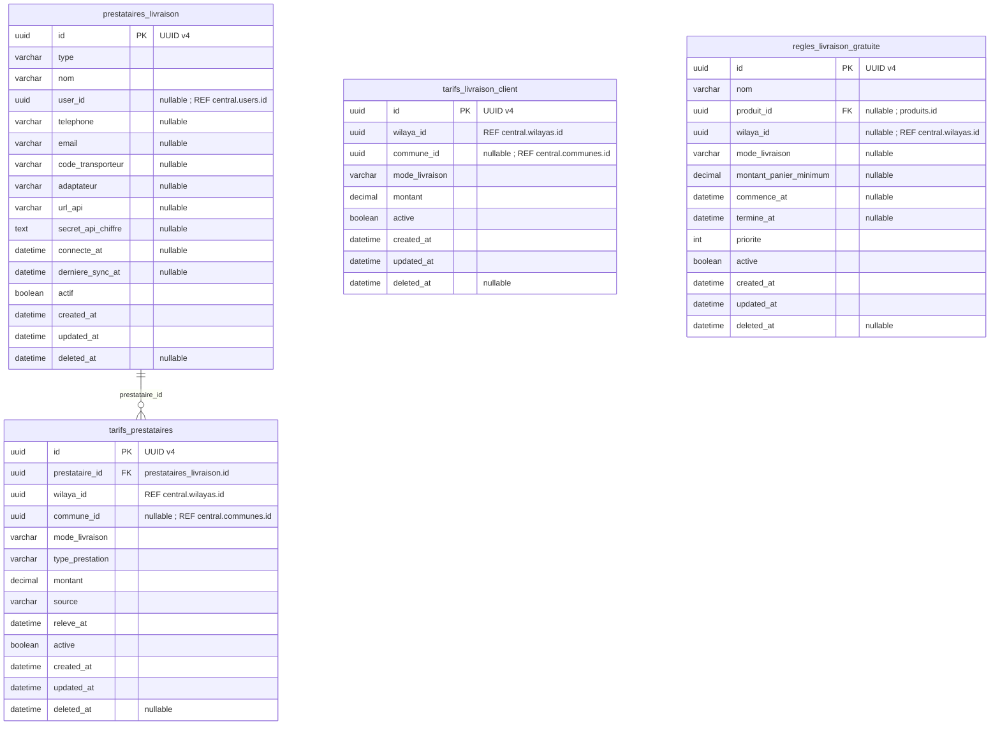
```mermaid
erDiagram
    direction TB
    prestataires_livraison {
        uuid id PK "UUID v4"
        varchar type
        varchar nom
        uuid user_id "nullable ; REF central.users.id"
        varchar telephone "nullable"
        varchar email "nullable"
        varchar code_transporteur "nullable"
        varchar adaptateur "nullable"
        varchar url_api "nullable"
        text secret_api_chiffre "nullable"
        datetime connecte_at "nullable"
        datetime derniere_sync_at "nullable"
        boolean actif
        datetime created_at
        datetime updated_at
        datetime deleted_at "nullable"
    }
    tarifs_livraison_client {
        uuid id PK "UUID v4"
        uuid wilaya_id "REF central.wilayas.id"
        uuid commune_id "nullable ; REF central.communes.id"
        varchar mode_livraison
        decimal montant
        boolean active
        datetime created_at
        datetime updated_at
        datetime deleted_at "nullable"
    }
    tarifs_prestataires {
        uuid id PK "UUID v4"
        uuid prestataire_id FK "prestataires_livraison.id"
        uuid wilaya_id "REF central.wilayas.id"
        uuid commune_id "nullable ; REF central.communes.id"
        varchar mode_livraison
        varchar type_prestation
        decimal montant
        varchar source
        datetime releve_at
        boolean active
        datetime created_at
        datetime updated_at
        datetime deleted_at "nullable"
    }
    regles_livraison_gratuite {
        uuid id PK "UUID v4"
        varchar nom
        uuid produit_id FK "nullable ; produits.id"
        uuid wilaya_id "nullable ; REF central.wilayas.id"
        varchar mode_livraison "nullable"
        decimal montant_panier_minimum "nullable"
        datetime commence_at "nullable"
        datetime termine_at "nullable"
        int priorite
        boolean active
        datetime created_at
        datetime updated_at
        datetime deleted_at "nullable"
    }
    prestataires_livraison ||--o{ tarifs_prestataires : prestataire_id
```

Les références vers un autre module sont indiquées sur les champs, même si leur flèche n’est pas redessinée ici.

- **`prestataires_livraison` :** type=livreur_interne|societe. user_id associé à un membre autorisé pour un livreur connecté ; aucun secret API pour l’interne. Société DHD : adaptateur=ecotrack. URL de base configurable depuis la plateforme du compte, validée par liste autorisée côté serveur ; ne pas deviner une URL définitive. Le secret n’est jamais exposé dans le navigateur.

- **`tarifs_livraison_client` :** UNIQUE(wilaya_id,commune_normalisee,mode_livraison). Tarif commune prioritaire puis wilaya. Tarif absent = livraison indisponible, pas gratuite. Vérifier toutes les quantités et afficher le total avant soumission.

- **`tarifs_prestataires` :** type_prestation=livraison|retour|echange|recouvrement. source=manuel|api. UNIQUE(prestataire_id,wilaya_id,commune_normalisee,mode_livraison,type_prestation). Une valeur zéro issue de l’API ne prouve pas à elle seule que la prestation est offerte ou disponible.

- **`regles_livraison_gratuite` :** Règle simple : si tous les critères renseignés sont remplis, la livraison de la commande entière est offerte. produit_id signifie présence de ce produit. Pas d’addition de frais par ligne : un colis unique. La gratuité client ne supprime jamais le coût réel du prestataire.

### T11 — Transporteur et colis

**`correspondances_geo_transporteur` — Correspondance entre géographie interne et codes/libellés du transporteur.**

**`points_relais` — Bureaux/stop desks disponibles chez un transporteur.**

**`livraisons` — Un seul colis regroupant tous les articles d’une commande.**

**`evenements_livraison` — Événements normalisés et statuts bruts conservés.**

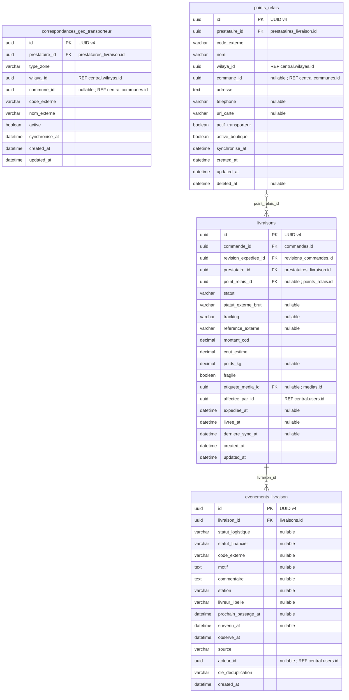
```mermaid
erDiagram
    direction TB
    correspondances_geo_transporteur {
        uuid id PK "UUID v4"
        uuid prestataire_id FK "prestataires_livraison.id"
        varchar type_zone
        uuid wilaya_id "REF central.wilayas.id"
        uuid commune_id "nullable ; REF central.communes.id"
        varchar code_externe
        varchar nom_externe
        boolean active
        datetime synchronise_at
        datetime created_at
        datetime updated_at
    }
    points_relais {
        uuid id PK "UUID v4"
        uuid prestataire_id FK "prestataires_livraison.id"
        varchar code_externe
        varchar nom
        uuid wilaya_id "REF central.wilayas.id"
        uuid commune_id "nullable ; REF central.communes.id"
        text adresse
        varchar telephone "nullable"
        varchar url_carte "nullable"
        boolean actif_transporteur
        boolean active_boutique
        datetime synchronise_at
        datetime created_at
        datetime updated_at
        datetime deleted_at "nullable"
    }
    livraisons {
        uuid id PK "UUID v4"
        uuid commande_id FK "commandes.id"
        uuid revision_expediee_id FK "revisions_commandes.id"
        uuid prestataire_id FK "prestataires_livraison.id"
        uuid point_relais_id FK "nullable ; points_relais.id"
        varchar statut
        varchar statut_externe_brut "nullable"
        varchar tracking "nullable"
        varchar reference_externe "nullable"
        decimal montant_cod
        decimal cout_estime
        decimal poids_kg "nullable"
        boolean fragile
        uuid etiquete_media_id FK "nullable ; medias.id"
        uuid affectee_par_id "REF central.users.id"
        datetime expediee_at "nullable"
        datetime livree_at "nullable"
        datetime derniere_sync_at "nullable"
        datetime created_at
        datetime updated_at
    }
    evenements_livraison {
        uuid id PK "UUID v4"
        uuid livraison_id FK "livraisons.id"
        varchar statut_logistique "nullable"
        varchar statut_financier "nullable"
        varchar code_externe "nullable"
        text motif "nullable"
        text commentaire "nullable"
        varchar station "nullable"
        varchar livreur_libelle "nullable"
        datetime prochain_passage_at "nullable"
        datetime survenu_at "nullable"
        datetime observe_at
        varchar source
        uuid acteur_id "nullable ; REF central.users.id"
        varchar cle_deduplication
        datetime created_at
    }
    points_relais |o--o{ livraisons : point_relais_id
    livraisons ||--o{ evenements_livraison : livraison_id
```

Les références vers un autre module sont indiquées sur les champs, même si leur flèche n’est pas redessinée ici.

- **`correspondances_geo_transporteur` :** type_zone=wilaya|commune ; commune_id obligatoire pour commune, NULL pour wilaya. Unicité sur prestataire + type + identifiant interne ; code externe à normaliser avec le code wilaya si le fournisseur le réutilise. Ne pas envoyer un UUID local comme code_wilaya Ecotrack.

- **`points_relais` :** UNIQUE(prestataire_id,code_externe). Une resynchronisation ne réactive pas un bureau masqué par le commerçant. Disponibilité = active des deux côtés. Conserver les bureaux historiques en désactivation, sans casser les commandes.

- **`livraisons` :** UNIQUE(commande_id), UNIQUE(prestataire_id,tracking) hors NULL. Révision figée et de la même commande. Tous ses articles partent ensemble. Une modification avant remise physique met à jour la révision associée sous contrôle ; après remise, création d’un remplacement séparé. Point relais appartenant au prestataire. Le prix réel se trouve dans depenses.

- **`evenements_livraison` :** UNIQUE(cle_deduplication) incluant le prestataire et tracking dans le calcul. Source=manuel|polling. Conserver les inconnus pour diagnostic, sans deviner leur sens. Les événements anciens n’écrasent pas aveuglément l’état courant.

### T12 — Intégration Ecotrack

**`operations_transporteur` — File durable des opérations à envoyer au transporteur.**

**`tentatives_operations_transporteur` — Trace de chaque tentative HTTP et de son résultat.**

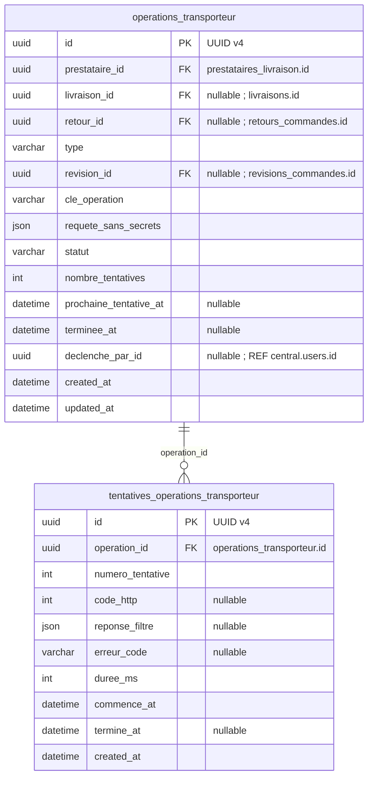
```mermaid
erDiagram
    direction TB
    operations_transporteur {
        uuid id PK "UUID v4"
        uuid prestataire_id FK "prestataires_livraison.id"
        uuid livraison_id FK "nullable ; livraisons.id"
        uuid retour_id FK "nullable ; retours_commandes.id"
        varchar type
        uuid revision_id FK "nullable ; revisions_commandes.id"
        varchar cle_operation
        json requete_sans_secrets
        varchar statut
        int nombre_tentatives
        datetime prochaine_tentative_at "nullable"
        datetime terminee_at "nullable"
        uuid declenche_par_id "nullable ; REF central.users.id"
        datetime created_at
        datetime updated_at
    }
    tentatives_operations_transporteur {
        uuid id PK "UUID v4"
        uuid operation_id FK "operations_transporteur.id"
        int numero_tentative
        int code_http "nullable"
        json reponse_filtre "nullable"
        varchar erreur_code "nullable"
        int duree_ms
        datetime commence_at
        datetime termine_at "nullable"
        datetime created_at
    }
    operations_transporteur ||--o{ tentatives_operations_transporteur : operation_id
```

Les références vers un autre module sont indiquées sur les champs, même si leur flèche n’est pas redessinée ici.

- **`operations_transporteur` :** UNIQUE(cle_operation). Types create_order, valid_order, update_order, suivi, fees, geographie, label, ask_return, valid_returns, note. Créer puis valider chez le transporteur sont deux étapes. Statut résultat_incertain après timeout d’une création : rapprochement avant toute nouvelle création. Aucune promesse d’idempotence distante non documentée.

- **`tentatives_operations_transporteur` :** UNIQUE(operation_id,numero_tentative). Masquer token, Authorization et données personnelles inutiles ; limiter la conservation des corps API. Pas de secrets dans les paramètres journalisés.

### T13 — Argent et reversements

**`recouvrements` — État de l’argent d’un colis, distinct de sa livraison et de sa confirmation.**

**`bordereaux_reversement` — Lot de règlement avec un livreur ou une société : brut, net ou paiement de frais.**

**`lignes_reversement` — Ventilation d’un bordereau par colis, pour éviter les doubles reversements.**

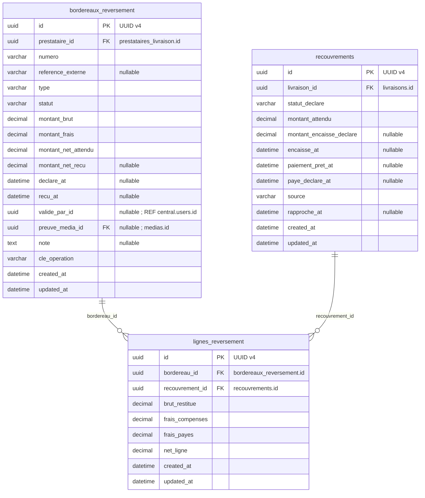
```mermaid
erDiagram
    direction TB
    recouvrements {
        uuid id PK "UUID v4"
        uuid livraison_id FK "livraisons.id"
        varchar statut_declare
        decimal montant_attendu
        decimal montant_encaisse_declare "nullable"
        datetime encaisse_at "nullable"
        datetime paiement_pret_at "nullable"
        datetime paye_declare_at "nullable"
        varchar source
        datetime rapproche_at "nullable"
        datetime created_at
        datetime updated_at
    }
    bordereaux_reversement {
        uuid id PK "UUID v4"
        uuid prestataire_id FK "prestataires_livraison.id"
        varchar numero
        varchar reference_externe "nullable"
        varchar type
        varchar statut
        decimal montant_brut
        decimal montant_frais
        decimal montant_net_attendu
        decimal montant_net_recu "nullable"
        datetime declare_at "nullable"
        datetime recu_at "nullable"
        uuid valide_par_id "nullable ; REF central.users.id"
        uuid preuve_media_id FK "nullable ; medias.id"
        text note "nullable"
        varchar cle_operation
        datetime created_at
        datetime updated_at
    }
    lignes_reversement {
        uuid id PK "UUID v4"
        uuid bordereau_id FK "bordereaux_reversement.id"
        uuid recouvrement_id FK "recouvrements.id"
        decimal brut_restitue
        decimal frais_compenses
        decimal frais_payes
        decimal net_ligne
        datetime created_at
        datetime updated_at
    }
    bordereaux_reversement ||--o{ lignes_reversement : bordereau_id
    recouvrements ||--o{ lignes_reversement : recouvrement_id
```

Les références vers un autre module sont indiquées sur les champs, même si leur flèche n’est pas redessinée ici.

- **`recouvrements` :** UNIQUE(livraison_id). Statuts en_attente_livraison, livre_non_encaisse, encaisse_non_paye, paiements_prets, paye_et_archive, sans_encaissement. Le statut distant paye_et_archive n’est pas à lui seul une preuve de réception bancaire/espèces. Les montants rapprochés sont calculés depuis les bordereaux validés. Un refus impayé donne 0 encaissé, pas le total prévu.

- **`bordereaux_reversement` :** UNIQUE(numero), UNIQUE(cle_operation). type=reversement_brut|reglement_net|paiement_frais. Net signé : positif reçu par le commerçant, négatif payé au prestataire. Statut=brouillon|pret|recu|rapproche|annule. Totaux calculés côté serveur à partir des lignes, écart net signalé. Référence externe unique par prestataire lorsqu’elle existe.

- **`lignes_reversement` :** UNIQUE(bordereau_id,recouvrement_id). net_ligne=brut_restitue-frais_compenses-frais_payes. Champs>=0 sauf net signé. Même prestataire que la livraison. La somme des bruts rapprochés ne dépasse pas le montant encaissé vérifié ; les frais ne sont réglés qu’une fois. Les lignes allouent un paiement mais ne créent pas une deuxième dépense.

### T14 — Coûts, remboursements et documents

**`depenses` — Coûts réels : publicité, emballage, livraison, retour, frais généraux.**

**`regularisations_clients` — Remboursement réel ou crédit d’échange lorsqu’un colis déjà payé est retourné.**

**`bons_commande` — Bon de commande facultatif, figé sur une révision précise.**

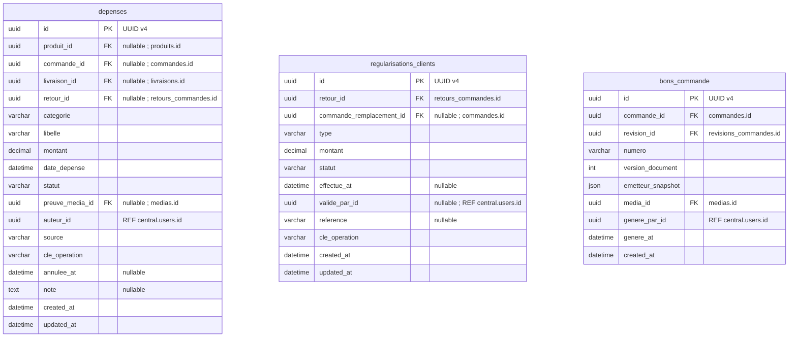
```mermaid
erDiagram
    direction TB
    depenses {
        uuid id PK "UUID v4"
        uuid produit_id FK "nullable ; produits.id"
        uuid commande_id FK "nullable ; commandes.id"
        uuid livraison_id FK "nullable ; livraisons.id"
        uuid retour_id FK "nullable ; retours_commandes.id"
        varchar categorie
        varchar libelle
        decimal montant
        datetime date_depense
        varchar statut
        uuid preuve_media_id FK "nullable ; medias.id"
        uuid auteur_id "REF central.users.id"
        varchar source
        varchar cle_operation
        datetime annulee_at "nullable"
        text note "nullable"
        datetime created_at
        datetime updated_at
    }
    regularisations_clients {
        uuid id PK "UUID v4"
        uuid retour_id FK "retours_commandes.id"
        uuid commande_remplacement_id FK "nullable ; commandes.id"
        varchar type
        decimal montant
        varchar statut
        datetime effectue_at "nullable"
        uuid valide_par_id "nullable ; REF central.users.id"
        varchar reference "nullable"
        varchar cle_operation
        datetime created_at
        datetime updated_at
    }
    bons_commande {
        uuid id PK "UUID v4"
        uuid commande_id FK "commandes.id"
        uuid revision_id FK "revisions_commandes.id"
        varchar numero
        int version_document
        json emetteur_snapshot
        uuid media_id FK "medias.id"
        uuid genere_par_id "REF central.users.id"
        datetime genere_at
        datetime created_at
    }
```

Les références vers un autre module sont indiquées sur les champs, même si leur flèche n’est pas redessinée ici.

- **`depenses` :** UNIQUE(cle_operation). Montant>=0 ; statut=constatee|annulee. Dimensions simultanées seulement si cohérentes : livraison et commande associées par exemple. Une dépense produit est soustraite une fois au résultat produit/période, pas à chaque commande. Les pertes de stock sont dans mouvements_stock ; ne pas les ressaisir ici.

- **`regularisations_clients` :** UNIQUE(cle_operation). type=remboursement_especes|credit_echange. Pas de remboursement si rien n’a été payé. Crédit uniquement sur une commande de remplacement liée au même retour. Somme crédits+remboursements limitée au montant éligible payé. Le crédit réduit le COD du remplacement ; il n’est pas une réduction de son prix commercial.

- **`bons_commande` :** UNIQUE(numero,version_document). Révision appartenant à la commande. Le PDF conserve les coordonnées de la boutique et du destinataire, lignes, prix, quantités, livraison, total DZD. Une nouvelle révision génère une nouvelle version du bon ; ne pas écraser le document déjà émis. Pas de moteur de facturation fiscale dans le périmètre.

### T15 — Audit et évolution ciblée

**`journal_audit` — Audit transversal de catalogue, stock, avis, contenus et finances.**

**`personnalisations_theme` — ÉVOLUTION : présentation personnalisée autorisée par abonnement ou essai.**

```mermaid
erDiagram
    direction TB
    journal_audit {
        uuid id PK "UUID v4"
        uuid acteur_id "nullable ; REF central.users.id"
        uuid compte_represente_id "nullable ; REF central.users.id"
        varchar action
        varchar cible_type
        uuid cible_id "nullable"
        json avant "nullable"
        json apres "nullable"
        uuid correlation_id
        varchar origine
        datetime created_at
    }
    personnalisations_theme {
        uuid id PK "UUID v4"
        varchar code_theme
        int version
        json configuration
        text css_filtre "nullable"
        varchar statut
        datetime publie_at "nullable"
        uuid auteur_id "REF central.users.id"
        datetime created_at
        datetime updated_at
        datetime deleted_at "nullable"
    }
```

Les références vers un autre module sont indiquées sur les champs, même si leur flèche n’est pas redessinée ici.

- **`journal_audit` :** Append-only. Cible polymorphe logique, jamais FK fictive. Les événements détaillés de commandes restent dans historique_commandes. Le root peut intervenir mais pas effacer ses traces métier.

- **`personnalisations_theme` :** Pas nécessaire au MVP : un seul template et les champs de boutique suffisent. CSS limité à des propriétés/sélecteurs autorisés, sans JavaScript, réseau arbitraire ni masquage des informations de checkout. Aucun code serveur stocké. L’expiration de l’essai revient au template standard sans supprimer les commandes.

## 6. Relations majeures à retenir

| Parent | Relation | Enfant | Règle |
|---|---|---|---|
| users | 1 → N | tenants | Plusieurs boutiques pour un propriétaire si son quota l’autorise. |
| users / tenants | N ↔ N | membres_tenants | Appartenance et rôles spécifiques à chaque boutique. |
| plans / fonctionnalités | N ↔ N | plans_fonctionnalites | Capacités et plafonds commerciaux. |
| roles / permissions | N ↔ N | roles_permissions | Droits d’action indépendants des plafonds. |
| categories | 0..1 parent → N enfants | categories | Sous-catégories facultatives, aucun cycle. |
| produits | 1 → N | variantes_produits | Au moins une variante vendable pour publier. |
| produits | 1 → N | pages_vente | Plusieurs landing pages pour comparer leurs performances. |
| visiteurs | 1 → N | paniers / sessions_visite | Identification du navigateur, sans compte acheteur. |
| paniers | 1 → N | articles_panier | Plusieurs produits/variantes et personnalisations. |
| paniers | 1 → 0..1 | commandes | Une soumission répétée ne crée pas plusieurs commandes. |
| commandes | 1 → N | revisions_commandes | Une seule révision courante ; historique immuable. |
| revisions_commandes | 1 → N | articles_commande | Tous les détails de prix/coût de cette version. |
| commandes | 1 → 0..1 | livraisons | Aucun fractionnement en plusieurs colis. |
| livraisons | 1 → 0..1 | retours_commandes | Retour intégral du colis. |
| retours_commandes | 1 → N | articles_retour | Inspection par article, même si le retour est intégral. |
| retours_commandes | 1 → N historiques | commandes de remplacement | Au maximum un remplacement actif ; un remplacement annulé reste visible. |
| livraisons | 1 → 0..1 | recouvrements | Créé dès la prise en charge du cycle COD. |
| bordereaux_reversement / recouvrements | N ↔ N | lignes_reversement | Lots de reversement, rapprochement et règlement de frais. |

## 7. Permissions : comment satisfaire ton besoin de tout limiter

**Calcul normal pour un membre :** compte actif + tenant accessible + appartenance active + fonctionnalité active + quota disponible + permission d’action + absence d’interdiction explicite.

Les fonctionnalités concernent le propriétaire de la boutique et son abonnement, même si l’action est effectuée par un employé. Les permissions concernent la personne qui agit. Le propriétaire dispose du rôle propriétaire, mais son abonnement limite toujours les fonctionnalités commerciales de ses boutiques.

**Administrateur délégué :** permission de plateforme + permission métier requise + contrôle des cibles autorisées/interdites. Il n’est pas nécessaire de l’ajouter comme membre de toutes les boutiques. Il peut utiliser les fonctions d’assistance sur une boutique gratuite si sa délégation l’autorise ; cela n’active pas le plan payant pour les utilisateurs de cette boutique. Une session d’assistance doit conserver l’intersection entre la délégation de l’administrateur et les opérations qu’il veut exécuter, jamais hériter aveuglément du pouvoir du compte représenté.

**Racine :** accès global et fonctionnalités disponibles sans limitation commerciale. Ce contournement est réservé au compte racine ; ne pas donner ce même booléen aux administrateurs « dérivés ». Créer un administrateur délégué à partir d’un rôle complet, puis retirer/interdire des droits, satisfait ton besoin de cases à décocher.

| Besoin | Configuration |
|---|---|
| Gestionnaire : créer et modifier sans supprimer | Rôle tenant avec produits.creer + produits.modifier ; produits.supprimer absent ou explicitement interdit. |
| Employé privé d’accès à la rentabilité | Retirer finances.lire et depenses.lire ; filtrer aussi les champs de coûts dans les réponses catalogue. |
| Livreur ne voit que ses colis | Permission livraison.lire_assignees, plus filtre prestataires_livraison.user_id = utilisateur courant. |
| Admin du SaaS exclu d’une boutique | restriction_admins interdire tenants.acceder sur cette boutique. |
| Admin exclu d’un compte et de ses boutiques | Restriction ciblée sur le propriétaire et contrôle à chaque accès à un de ses tenants. |
| Admin ne peut pas prendre l’identité d’un membre | Interdire utilisateurs.usurper globalement ou pour le compte ciblé. |
| Beta CSS de 14 jours | Exception datée de design.personnalise ; expiration évaluée côté serveur, sans dépendre uniquement d’un cron. |
| Plan gratuit | Quota compte boutiques.nombre = 1 ; domaines.personnalises désactivé. |

Une case en BDD ne protège pas une fonctionnalité par magie : chaque action serveur doit consulter la permission correspondante. Les Gates/Policies Laravel conviennent à ce contrôle par action et par ressource [S3]. Les fonctions « sensibles » comme attribution de rôles et exceptions commerciales ne sont modifiables que par des administrateurs autorisés ; un propriétaire ne peut pas s’offrir un plan payant.

Les règles d’intégrité ne sont pas des options de plan : ne pas facturer deux fois, garder l’audit, vérifier les montants et respecter le tenant restent obligatoires pour tous les acteurs. Les révocations doivent invalider le cache de permissions et les accès d’assistance actifs.

## 8. Stock : scénario exact proposé

| Événement | Stock physique | Stock réservé | Disponible | Écriture |
|---|---:|---:|---:|---|
| Entrée manuelle de 10 | +10 | 0 | +10 | mouvement entree_manuelle |
| Ajout au panier | 0 | 0 | 0 | article de panier seulement |
| Nouvelle commande à traiter | 0 | 0 | 0 | commande + révision + lignes |
| Confirmation manuelle de 2 | 0 | +2 | −2 | réservation + mouvement reservation |
| Expédition de ces 2 | −2 | −2 | 0 | réservation consommée + mouvement expedition |
| Annulation avant expédition | 0 | −2 | +2 | réservation libérée + mouvement liberation |
| Retour simplement annoncé | 0 | 0 | 0 | retour / événement logistique |
| Retour physiquement reçu, en attente d’inspection | 0 | 0 | 0 | quantités reçues dans articles_retour |
| Article inspecté et réutilisable | +quantité | 0 | +quantité | mouvement remise_stock_retour |
| Article reçu cassé puis jeté | 0 | 0 | 0 | montant_perte, lié à article_retour |
| Produit cassé sur l’étagère | −quantité | 0 | −quantité | mouvement perte_stock avec coût |

Ici `stock_physique` désigne le stock physique **vendable dans la boutique**, pas les articles en transit ni en quarantaine. Les retours non encore remis en vente restent dans articles_retour. Le disponible baisse bien à la confirmation, conformément à ton cahier des charges, sans confondre réservation et sortie réelle.

Si le négatif est interdit : vérifier le disponible lors de la soumission, puis de nouveau au moment de confirmer. Deux commandes en attente peuvent demander la même dernière unité ; une seule pourra être confirmée. Verrouiller les variantes concernées dans un ordre stable au moment de la transaction pour éviter une double réservation. Si le négatif est autorisé, la quantité disponible peut devenir négative et doit être visible dans le dashboard.

**Modification avant expédition, exemple bleu → rouge :** nouvelle révision complète ; libérer la réservation du bleu ; réserver le rouge ; vérifier la disponibilité ; changer revision_courante_id ; journaliser l’avant/après. Tout réussit dans une transaction, ou rien ne change. Les mouvements gardent la même correlation_id. Si la commande n’avait jamais été confirmée, il n’existe pas de réservation à libérer.

**Échange après retour :** réceptionner et inspecter le colis d’origine ; remettre chaque article réutilisable en stock ; créer une commande de remplacement liée à ce retour ; réserver puis expédier le nouveau contenu après confirmation. L’ancienne livraison garde ses références et montants. C’est ainsi que le +1 ancien produit et le −1 nouveau produit restent justifiables sans réécrire le passé.

## 9. État commercial, livraison et argent

| Suivi | Exemples | Table faisant autorité |
|---|---|---|
| Commercial | nouvelle, en_attente_confirmation, confirmee, annulee, cloturee | commandes |
| Contacts | rappeler, ne_repond_pas, numero_incorrect, confirme | historique_commandes |
| Logistique | a_preparer, prete, expediee, en_transit, en_livraison, livree, refusee, retour_en_transit, retour_recu, annulee | livraisons + evenements_livraison |
| Financier déclaré | en_attente_livraison, livre_non_encaisse, encaisse_non_paye, paiements_prets, paye_et_archive, sans_encaissement | recouvrements |
| Argent réellement reçu | bordereau reçu et rapproché, avec montants alloués | bordereaux_reversement + lignes_reversement |

Un écran peut afficher un statut synthétique de commande, mais il doit le dériver de ces suivis. Ne pas écraser la décision manuelle de confirmation lorsqu’un statut transporteur arrive.

**Livreur de la boutique :** selon ta règle, quand il marque « livré », l’application enregistre simultanément l’encaissement attendu dans sa caisse et passe à `encaisse_non_paye`. Cela suppose une livraison COD intégralement payée. Un cas exceptionnel livré sans collecte peut utiliser `livre_non_encaisse`. Ensuite, préparation du règlement → `paiements_prets`, puis réception et rapprochement par le commerçant → `paye_et_archive`. Le livreur ne valide pas lui-même l’argent reçu par le commerçant.

**DHD :** conserver les quatre libellés de l’API, sans prétendre que leur simple nom suffit à connaître un montant réellement transféré. Ces statuts reflètent les étapes de son circuit de caisse. Si le prestataire annonce payé mais que le commerçant n’a pas confirmé réception du montant, l’écart reste affiché. Un changement de statut n’est pas une ligne de versement supplémentaire. Si un colis avait déjà été payé avant son retour, conserver son encaissement historique et traiter le remboursement ou crédit ; ne pas remettre cet encaissement à zéro.

Le montant net peut être calculé comme **brut collecté − frais compensés**, ou les frais peuvent être réglés séparément. Un retour non encaissé peut entraîner des frais de retour sans revenu : le règlement de ces frais peut donc avoir un montant net négatif pour le commerçant.

## 10. Adaptation Ecotrack/DHD

**Niveau de preuve :** les éléments ci-dessous ont été lus dans la collection `ECOTRACK API` jointe à Codflow, et recoupés avec son adaptateur et ses types. Le portail DHD a refusé la consultation web (HTTP 403). La collection est donc une documentation fournie, pas la preuve d’un test réussi sur ton compte DHD actuel. Les fonctions utilisables devront être validées avec ce compte, sans inventer un endpoint de versement absent de la collection.

| Champ/opération fourni dans la collection | Utilisation dans ce modèle |
|---|---|
| `montant`, global et comprenant la livraison | livraisons.montant_cod, figé à partir de la révision envoyée. |
| `produit`, description du ou des produits | Résumé des articles ; garder les détails complets dans articles_commande. |
| `stock=0` | Tes produits sont gérés manuellement dans ta boutique ; pas de stock déporté chez DHD dans le périmètre. |
| `type=1` livraison | Type standard de création de colis. |
| `type=2` échange et `produit_a_recuperer` | Capacité connue de la documentation, à activer après validation métier ; la première version peut recevoir le retour puis envoyer un remplacement standard. |
| `stop_desk` | mode_livraison et points_relais ; code bureau fournisseur si nécessaire. |
| `code_wilaya`, `commune` | Valeurs attendues par le prestataire via correspondances_geo_transporteur ; jamais les UUID internes. |
| `/api/v1/create/order` puis `/api/v1/valid/order` | Deux opérations distinctes, déclenchées seulement pour une commande confirmée ; leur succès ne prouve pas encore la remise physique au transporteur. |
| `/api/v1/get/order/label` | Étiquette privée liée à la livraison. |
| `/api/v1/get/tracking/info` et `/api/v1/get/trackings/info` | Historique local, motifs et dates, avec déduplication. |
| `/api/v1/get/orders/status` | Synchronisation logistique/financière, jusqu’à 100 trackings dans la collection fournie. |
| `/api/v1/get/orders` | La collection décrit les commandes en cours, 40 par page, et exclut les archivées ; ne pas utiliser ce seul endpoint pour conclure que l’argent n’a pas été payé. |
| `/api/v1/get/fees` | Tarifs de livraison, échange, recouvrement et retour du compte ; les coûts facturés au client restent indépendants. |
| `/api/v1/ask/for/order/return` | Demande distante, pas preuve de réception physique locale. |
| `/api/v1/valid/returns` | Validation distante de réception ; distincte du tri et des pertes dans ta boutique. |

La collection montre notamment les clés `livre_non_encaisse`, `encaisse_non_paye`, `paiements_prets`, `paye_et_archive`. Elle ne fournit pas, dans les endpoints examinés, un registre détaillé de versements permettant de rapprocher automatiquement chaque centime. Les bordereaux peuvent donc être saisis/confirmés localement ; l’automatisation du rapprochement attendra une capacité documentée du compte.

Conserver les statuts externes bruts. `retour_chez_livreur`, `retour_transit_entrepot` et `retour_recu` ne doivent pas tous provoquer une remise en stock. Certains événements peuvent arriver plusieurs fois, en retard ou ne pas avoir de date exploitable. Leur application suit des transitions contrôlées ; une simple échelle numérique des statuts ne suffit pas pour les retours ou corrections.

La version examinée de Codflow s’appuie sur le polling pour Ecotrack, sans webhook Ecotrack implémenté. Le schéma prévoit donc une synchronisation planifiée sans présumer qu’un webhook est disponible. Après une livraison, continuer la synchronisation financière jusqu’au rapprochement ; ne pas arrêter tous les suivis dès `livree`.

Le journal des opérations gère aussi un point critique : un timeout peut survenir après que le prestataire a créé le colis. Avant de recommencer, rechercher/rapprocher la référence existante. Une clé d’opération locale empêche tes propres doubles traitements, mais ne prouve pas l’idempotence de l’API distante.

## 11. Rentabilité : formules sans double comptage

**Prix d’une révision :**

`Sous-total brut = somme(quantité × prix unitaire brut)`

`Total commercial = sous-total brut − remises produits + livraison client − remise livraison`

`COD à collecter = total commercial − crédit d’échange validé`

**Résultat opérationnel d’une période :**

`Ventes livrées nettes des retours reconnus + livraison facturée conservée − coût des marchandises effectivement vendues − pertes de marchandises − dépenses réelles constatées`

Les dépenses comprennent publicité, emballage, coût du livreur/transporteur, retours et autres frais saisis. Les montants en attente de reversement ne sont pas encore de la trésorerie disponible. Les revenus et les encaissements doivent être deux indicateurs distincts.

| Cas | Traitement |
|---|---|
| Commande refusée avant paiement, produit intact remis en stock | Aucun revenu ; pas de coût de marchandise vendue ; frais de transport/retour éventuellement perdus. |
| Commande refusée, produit cassé au retour | Aucun revenu ; coût du produit reconnu en perte une seule fois ; frais de transport/retour en plus. |
| Commande livrée, argent encore chez le prestataire | Vente réalisée ; créance COD en attente ; trésorerie reçue=0 tant que rien n’est reversé. |
| Commande déjà livrée puis retournée | Contrepasser la vente et son coût de marchandises vendues dans la période de reconnaissance du retour ; remettre le stock ou constater une perte. Ne pas effacer les événements historiques. |
| Remboursement d’une vente déjà contrepassée | Sortie de trésorerie ; ne pas soustraire une deuxième fois le même remboursement du revenu. |
| Crédit d’échange | Solde réutilisé sur le remplacement, déduit du COD ; ne pas compter le crédit comme une nouvelle entrée d’argent. |
| Frais déjà retenus sur le bordereau | Dépense constatée une fois dans depenses ; ligne de reversement = son règlement, pas une deuxième charge. |
| Publicité de 10 000 DA pour un produit sur un mois | Dépense de produit/période de 10 000 DA ; pas 10 000 DA de charge sur chacune des commandes. |

**Exemple :** produits vendus 5 000 DA, livraison client 500 DA, coût d’achat 3 000 DA, transport réel 650 DA, publicité affectée 300 DA → résultat 1 550 DA. Le prestataire collecte 5 500 DA. S’il retient 650 DA, il reverse 4 850 DA ; les 650 DA ne sont pas soustraits une seconde fois du résultat.

Les coûts d’achat figés sur les articles sont des coûts déclarés par le commerçant. Sans lots d’achat, inventaire valorisé et méthode FIFO/coût moyen, la marge reste **estimée à partir de ces coûts**, même si le suivi de l’argent est exact. Le schéma ne promet pas un bénéfice comptable certifié.

Pour répartir une dépense globale sur plusieurs produits, appliquer une règle d’allocation déclarée dans le reporting, ou laisser la dépense au niveau boutique. Ne pas inventer une précision par produit absente des données.

## 12. Statistiques internes et identification invitée

`visiteurs` reconnaît un navigateur au moyen d’un cookie propre à la boutique. `sessions_visite` regroupe ses visites et `evenements_navigation` enregistre ses actions. `paniers` conserve ses articles indépendamment d’un compte. Ce fonctionnement correspond aux usages de session/panier décrits par MDN [S4].

**Limite réelle :** cela ne permet pas d’identifier sûrement une personne physique, ni de la retrouver automatiquement sur un autre appareil, en navigation privée, après suppression du cookie ou sur un autre domaine. Une même personne peut compter plusieurs fois ; plusieurs personnes sur un navigateur partagé peuvent compter une fois. Les visiteurs uniques doivent être présentés comme « navigateurs identifiés », pas comme un recensement exact de personnes. Aucun suivi entre boutiques n’est nécessaire.

Les coordonnées deviennent connues lors de la commande et sont figées dans sa révision. Elles ne donnent pas automatiquement accès à l’historique d’autres commandes avec le même téléphone. Un lien de suivi public doit être signé, limité à une commande et indépendant de l’UUID ; un UUID n’est pas une autorisation.

| Indicateur | Source fiable | Règle |
|---|---|---|
| Vues de page / produit / landing page | evenements_navigation | Dédupliquer les événements ; exclure le trafic interne/test et les robots détectés. |
| Visiteurs uniques sur une période | sessions_visite + visiteurs | COUNT DISTINCT visiteur_id sur la période, pas somme des uniques quotidiens. |
| Nombre de variantes d’un produit | variantes_produits | COUNT des variantes non supprimées ; distinguer actives et total. |
| Sessions | sessions_visite | Nombre de sessions commencées ; expliquer les sessions chevauchant une borne. |
| Ajouts au panier | événements ajout_panier | Mesure d’action, différente du nombre de paniers encore actifs. |
| Paniers abandonnés | paniers + dernières activités + absence de commande | Proposition : abandon après 24 heures sans activité ; un panier revenu peut être réactivé. |
| Commandes reçues | commandes | Une clé de soumission unique ; ne pas compter les révisions comme des commandes supplémentaires. |
| Ventes livrées par produit | livraison + révision expédiée + articles | Quantités et prix réellement envoyés/livrés, pas les prix actuels du catalogue. |
| Retours par produit | retours + articles_retour | Séparer retour demandé, reçu et perte. |
| Produit le plus vendu | quantités livrées nettes de retours | Afficher la période et la définition, différente du produit avec le plus de commandes reçues. |
| Performance d’une page de vente | sessions/événements + page d’origine de la commande | Commandes / sessions exposées selon une convention d’attribution déclarée. Ne pas créditer toutes les pages vues d’une même vente. |
| Rentabilité | prix/coûts figés, pertes, dépenses | Présenter marge estimée et frais réels séparément. |
| Argent chez livreur/société | encaissements déclarés − bruts rapprochés | Contrôler les écarts et distinguer brut détenu / net attendu. |

Les périodes heure/jour/semaine/mois/année sont des filtres et agrégations. Les événements métier datés permettent de ne pas réécrire le mois précédent lors d’un retour ultérieur. Un indicateur « commandes livrées en août » et un indicateur « commandes créées en août qui ont finalement été livrées » sont deux analyses différentes : les nommer explicitement.

La conservation des événements bruts est configurable. Proposition initiale : 400 jours pour les comparaisons annuelles, à valider selon volume et politique de conservation. Après purge, ne pas prétendre recalculer des visiteurs uniques annuels exacts à partir de compteurs horaires. Des agrégats supplémentaires ne seront ajoutés qu’après mesure du volume ; ils restent des caches, pas une nouvelle vérité métier.

## 13. Ce que Codflow apporte, et ce qui n’est pas repris

Analyse ciblée du code et des schémas fournis, sans exécution du projet ni audit de sécurité complet. Les promesses marketing de son README ne sont pas une validation de chacune de ses fonctionnalités.

| Élément effectivement consulté | Enseignement retenu | Adaptation à ton SaaS |
|---|---|---|
| cod-shared/db/schema.ts : products, variants, images | SKU, variantes, médias, publication et SEO | Toujours une variante, pas de stock/prix dupliqué entre produit simple et variantes. |
| order_products | Prix par article et snapshots | Conserver ces prix même si Ecotrack utilise un montant global. |
| product_categories | Hiérarchie parent/enfant | FK locale réelle, contrôle des cycles. |
| landing_pages + README | Plusieurs pages par produit et comparaison | Origine facultative sur commandes/lignes et événements internes. |
| drivers et driver-payments | Différence livraison client / rémunération livreur ; versement brut ou net | Prestataire commun interne/société, lots et rapprochement sans compteurs financiers libres. |
| stock README | Journal des variations | Adapter le moment : confirmation manuelle puis expédition, conformément à ton cahier des charges. |
| status-mapping.ts Ecotrack | Mapping de statuts | Conserver un suivi financier séparé ; distinguer les étapes du retour avant remise en stock. |
| Collection Postman Ecotrack | Création, validation, suivi, frais, bureaux et retours | Adaptateur et opérations durables ; aucune API financière supplémentaire inventée. |
| company API logs / événements | Trace des intégrations | Déduplication, masquage des secrets, traitement des résultats incertains. |
| reviews | Modération | Avis sans compte ; ne pas prétendre qu’un avis est vérifié sans preuve. |
| Architecture README / schema.ts | Hono, Drizzle, D1/SQLite | Source d’idées fonctionnelles, pas migrations Laravel/MySQL à copier. |

Non repris : retours partiels au point de livraison, Meta Pixel/CAPI, suivi publicitaire externe, OAuth/MCP pour agents, CRM avancé, B2B, multidevise et stocks déportés. Ces éléments dépassent tes dernières réponses. Les flottants présents dans certains montants Codflow ne sont pas repris : `DECIMAL` est utilisé ici.

## 14. Prise en compte complète de tes transcriptions

| Recherche fournie | Conséquence sur le modèle ou l’application |
|---|---|
| Fiche produit Baymard : images à l’échelle, sur modèle, détails et preuve visuelle | Médias multiples avec rôle et texte alternatif ; possibilité de photos de mise en situation. Le choix des photos reste éditorial. |
| Onglets horizontaux, sections repliables et visibilité de l’information | Règles du template, pas tables supplémentaires. Informations de livraison/retour accessibles depuis la fiche. |
| Prix par unité et frais visibles tôt | Unité/contenu sur le produit, tarif livraison client calculable avant panier. Une estimation doit afficher ses conditions. |
| Caractéristiques regroupées, unités cohérentes, explications | Dictionnaire caracteristiques et valeurs par produit. |
| Avis, photos d’acheteurs, réponses négatives | Avis/modération retenus ; photos dans les avis et réponses publiques non activées dans le périmètre actuel choisi. Galerie produit disponible indépendamment. |
| Favoris sans inscription et cadeaux | Non retenus pour cette version : tu as confirmé le panier invité, pas ces fonctions supplémentaires. |
| Checkout : moins de champs, invités, adresse complémentaire facultative | Données minimales dans la révision ; prenom, email, téléphone secondaire facultatifs. UI doit rendre l’absence d’inscription explicite. |
| Checkout : ville/région automatique et adresse de facturation | Sélection wilaya/commune adaptée à ton cas ; pas d’autodétection par code postal présentée comme fiable sans référentiel validé. Pas de seconde adresse de facturation obligatoire en COD. |
| Création de compte retardée | Aucun compte acheteur pour l’instant ; donc aucune obligation d’ajouter un mot de passe en checkout. |
| SEO : titres, descriptions, URL, images, FAQ et données structurées | Champs SEO et slugs, alt, marque/SKU, prix/stock/avis réutilisables ; JSON-LD généré depuis les données existantes, pas une table de copies du prix. |
| SEO : canonicals vers catégories et promesses de classement | Ne pas appliquer mécaniquement : une catégorie n’est généralement pas un duplicata de sa fiche produit. Google présente le canonical pour pages identiques ou très similaires [S5]. Pas de garantie de classement. |
| SEO : mot-clé, tailles de titres/alt, rich snippets | Les seuils donnés dans une vidéo ne deviennent pas des contraintes BDD rigides. Les données structurées peuvent rendre une page éligible à des présentations enrichies, sans les garantir [S6]. |
| Tutoriel GA4 : sessions, pages, périodes, canaux, conversions | Concepts conservés dans la mesure interne ; création de compte GA4, Tag Manager et plugins d’installation non nécessaires. |
| Chiffres d’abandon/benchmarks dans les vidéos | Certaines transcriptions citent 2019/2025 et des populations américaines : ne pas les présenter comme des mesures du marché algérien en 2026. |

Le guest checkout visible reste une bonne base selon Baymard [S7], mais les recommandations d’ergonomie ne se traduisent pas toutes par de nouvelles tables. Les quatre transcriptions servent à couvrir les besoins et à identifier les limites, pas à imposer indistinctement toutes leurs affirmations.

## 15. Contrôles indispensables avant migrations

1. **Références locales :** FK indexées, mêmes types UUID, suppression RESTRICT pour les documents transactionnels. Mise à jour de produit/prix/catégorie ne change pas les snapshots.
2. **Unicités :** email central, domaine, SKU/slug par boutique, numéro de commande, clé de soumission, signature variante, clés d’opération. Pour contexte NULL, utiliser une expression normalisée.
3. **Transactions :** confirmation/réservation ; changement de variante ; expédition ; remise en stock ; perte ; réception d’un reversement. Les appels API restent hors transaction SQL longue, avec enregistrement durable de l’intention.
4. **Versions :** chaque révision appartient à la bonne commande ; les lignes du retour à la révision réellement expédiée ; le bon à sa révision ; le remplacement au bon retour.
5. **Quantités :** positives pour les lignes ; zéro permis seulement pour les compteurs/inspections ; pas de retour supérieur à l’expédié ; pas de remise en stock ni de perte en double.
6. **Montants :** calcul serveur, arrondis documentés, remises bornées, crédit d’échange limité, aucun dépassement des montants collectés dans le rapprochement.
7. **États :** impossible d’expédier une commande non confirmée ; impossible de remettre le stock à partir d’un simple retour demandé ; mise à jour transporteur sans confirmation commerciale automatique.
8. **Historique :** lignes financières et mouvements corrigés par événements compensatoires. Une correction d’un ancien état logistique déclenche les compensations requises, pas une édition isolée du champ statut.
9. **Concurrence :** verrou de version sur commandes, verrouillage des variantes et recouvrements, validation atomique des quotas et des paiements. Ordre stable de verrouillage.
10. **Isolation :** permission + tenant contrôlés pour pages admin, endpoints, exports, médias privés, jobs et assistance. Clés de cache préfixées par tenant et version d’autorisation.
11. **Index de lecture :** commandes(statut_commercial,created_at), historiques(commande_id,created_at), variantes(produit_id,active), événements(session_id,survenu_at), événements(produit_id,survenu_at), événements(page_vente_id,survenu_at), sessions(visiteur_id,commence_at), livraisons(prestataire_id,statut), dépenses(date_depense,produit_id), opérations(statut,prochaine_tentative_at). Ajouter les index de FK ; éviter d’indexer tout sans usage mesuré.
12. **Provisionnement :** état creation/en_migration/active/erreur pour le tenant, jobs idempotents et reprise après échec. La suppression logique d’une boutique ne doit pas exécuter automatiquement un DROP DATABASE.
13. **Publication/design :** la personnalisation modifie la présentation ; stock, prix, permissions, champs autorisés et validation de commande restent contrôlés par le serveur. Restreindre également le CSS pour ne pas masquer ou travestir les montants affichés.
14. **Statistiques :** déduplication, exclusions trafic test, dates locales correctes, compte des révisions évité, distinction navigateurs/personnes. Un refus de mesure n’empêche pas le fonctionnement du panier.

## 16. Ordre de mise en œuvre

| Lot | Tables/modules principaux |
|---|---|
| Base SaaS | users, tenants, domains, membres, rôles/permissions, plan gratuit, audit. |
| Catalogue et vitrine | boutique, adresses, liens, médias, catégories, produits/variantes, options, pages et promotions simples. |
| Vente COD | visiteurs, panier, commandes/révisions/lignes, confirmation, réservations, mouvements, tarifs client, livraison manuelle. |
| Exploitation | retours et inspection, recouvrements, reversements, dépenses, bons de commande, avis, événements/statistiques. |
| Amélioration DHD/Ecotrack | Champs de connexion prestataire, mappings géographiques, bureaux, tarifs API, opérations/tentatives, suivi et étiquettes. |
| Plus tard | personnalisations_theme et options commerciales associées, sans changer le cœur commande/stock. |

Les tables de stock, retours et finance restent les mêmes pour un livreur interne et DHD. L’intégration ajoute les échanges avec le prestataire ; elle ne remplace pas le modèle de gestion interne.

## 17. Sources et limites de vérification

### Documentation consultée sur le Web

- **[S1] Tenancy for Laravel — Tenants :** https://tenancyforlaravel.com/docs/v3/tenants/ — UUID, modèle tenant, colonne data et personnalisation.
- **[S2] Tenancy for Laravel — Domains et multi-database :** https://tenancyforlaravel.com/docs/v3/domains/ et https://tenancyforlaravel.com/docs/v3/multi-database-tenancy/ — identification et séparation des BDD.
- **[S3] Laravel — Authorization :** https://laravel.com/framework/docs/13.x/authorization — Gates/Policies. Cité pour le mécanisme, pas pour imposer Laravel 13 à ton projet.
- **[S4] MDN — Using HTTP cookies :** https://developer.mozilla.org/en-US/docs/Web/HTTP/Guides/Cookies — sessions, paniers, persistance et limites des cookies.
- **[S5] Google Search Central — Canonicalisation :** https://developers.google.com/search/docs/crawling-indexing/consolidate-duplicate-urls
- **[S6] Google Search Central — Product structured data :** https://developers.google.com/search/docs/appearance/structured-data/product
- **[S7] Baymard — Checkout UX :** https://baymard.com/learn/checkout-flow-ux-optimization — guest checkout visible et réduction des frictions.

### Sources fournies et examinées localement

- `codflow-main.zip` : README, schéma `cod-shared/db/schema.ts`, documentation des livreurs/règlements/stock, limitations connues, adaptateur/statuts/types Ecotrack.
- Collection `codflow-main/.agents/skills/Ecotrack/postman_collection.json`, intitulée **ECOTRACK API**, et référence `API-REFERENCE.md`. Son identité est `e70df4ed-4d0c-4b8e-aa89-cf36be6fb823`. La collection accompagne le code reçu ; son actualité sur le compte DHD n’a pas été certifiée.
- `Texte collé(20260922-083627).txt` : fiche produit / Baymard.
- `Texte collé (2)(3).txt` : optimisation du checkout / Baymard.
- `Texte collé (3)(1).txt` : SEO de fiches Shopify.
- `Texte collé (4).txt` : GA4.
- Tes notes, ton premier ERD, le cahier des charges recopié et tes réponses de cadrage.

Les tableaux, noms de tables et règles proposées sont une **synthèse de conception adaptée à ton projet**, pas un schéma officiel prescrit par ces sources. Le modèle a fait l’objet de contrôles structurels de ses références et scénarios ; aucun appel authentifié DHD, migration de ta BDD ou essai de production n’a été réalisé.
