# Schéma BDD — SaaS e-commerce algérien

Version V3 consolidée du 24 septembre 2026 — intégration des corrections du document « les derniere modiff.docx ». Les diagrammes, champs, contraintes, parcours et critères de validation sont mis à jour ensemble. Les choix fiscaux, juridiques et les capacités API restant à valider sont explicitement distingués des décisions métier retenues.

Ce document contient **49 tables centrales et 66 tables par boutique**, dont `personnalisations_theme` réservée à une évolution. Les 95 tables de la V2 sont conservées et complétées. Les tables techniques Laravel (sessions, cache, jobs, migrations, réinitialisation de mot de passe) sont exclues du décompte.

Les diagrammes sont répartis en modules pour rester exploitables. **Les champs, les références et les contraintes écrites font ensemble le schéma** : Mermaid ne peut pas imposer toutes les règles transactionnelles. Ce document n’est pas une migration SQL déjà exécutée.

## 1. Décisions retenues

| Sujet | Décision de conception |
|---|---|
| Isolation | Une BDD centrale, puis une BDD par boutique. Un même propriétaire peut avoir plusieurs boutiques. |
| Tenant | `tenants` désigne les boutiques isolées ; `boutique` contient le profil public dans chacune de leurs BDD. |
| Comptes | Identités et autorisations d’équipe au central, données commerciales au tenant. Pas de compte obligatoire pour les acheteurs. |
| Identifiants | UUID, pas ULID. UUID v4 est la convention proposée ; même représentation pour PK et références. |
| Marché | Algérie et DZD au lancement ; codes pays/devise internationaux, résultats fiscaux historisés, sans moteur fiscal universel. |
| Produits | Produits physiques standards ou personnalisés, dont les bouquets. Aucun agenda de rendez-vous. |
| Catalogue | Produits, variantes, catégories hiérarchiques, images/vidéos, caractéristiques, étiquettes, promotions sans code. |
| Panier | Panier invité côté serveur ; plusieurs produits d’une seule boutique. |
| Commandes | Checkout en attente ; accord téléphonique saisi par le commerçant sur une révision précise et réservation atomique à cette confirmation ; contrôle opérationnel distinct ; aucun paiement carte. |
| Colis | Une commande donne au maximum un colis, avec l’ensemble de son contenu. Pas d’expédition fractionnée. |
| Retours | Retour physique du colis entier au MVP ; SAV et corrections financières par ligne. Un manquant ne transforme pas le retour en retour partiel volontaire. Les obligations envers le client restent à valider juridiquement. |
| Remplacement | Remplacement ou échange après expédition via une nouvelle commande liée à un incident et à sa ligne d’origine ; jamais une seconde livraison sur la commande initiale. Plafonds communs avec les remboursements. Compensation d’échange affectée à une seule vente, sans portefeuille client. |
| Stock | Physique vendable, réservé, quarantaine et disponible non négatifs. Pas de survente ni précommande au MVP ; pas de multi-entrepôts. |
| Argent | Montant COD global par colis, mais prix/coût détaillés par ligne dans ta BDD. Encaissement et reversement distincts. |
| Abonnement | Rattaché au propriétaire ; expiration payante → gratuit automatique, une boutique active, autres hors_quota, données conservées. Fonctionnalités, quotas et exceptions datées. |
| Administrateurs | Root complet ; administrateurs délégués limitables par action, boutique et compte ciblé. |
| Statistiques | Mesure interne des visiteurs et événements ; ventes/retours fondés sur les événements métier. Aucun GA4 requis. |
| Site | Un template, profil public, plusieurs adresses et liens sociaux. Personnalisation CSS encadrée plus tard. |
| Documents | Contrats par révision acceptée, preuves de transmission, factures et avoirs à snapshots fiscaux, preuve de réception indépendante de l’étiquette. |
| Propriété | Propriétaire fixé à la création et immuable ; gestion délégable. |
| Comptes transporteur | Comptes centraux partageables entre boutiques du même propriétaire ; secrets uniquement au central. |
| Conservation | Politiques versionnées par catégorie, durées à faire valider ; purge/anonymisation contrôlée des données éligibles, protection des preuves encore requises. |

**Modules complétés en V3 :** confirmation téléphonique et accords distincts (T19/T21), manquants (T9), incidents multi-causes (T18), lignage produit (T7/T8), sauvegardes/restauration (C12), données personnelles (C14/T21), facturation SaaS (C13), obligations de facturation et échanges (T22).

**Parcours retenu :** ni le panier ni la soumission au checkout ne réservent le stock. La soumission crée une commande `a_confirmer`, avec révision et lignes immuables. Le commerçant appelle, annonce le contenu et le total, puis saisit l’accord téléphonique : contrat et réservations sont créés dans une seule transaction. Le contrôle opérationnel ne réserve pas une deuxième fois ; seule la remise physique sort les produits. Cette règle remplace explicitement la réservation au checkout de la V2. Les prix affichés ne garantissent pas une disponibilité jusqu’à l’appel : recontrôle obligatoire avant confirmation. Tarif de livraison par colis. Ventes en caisse, multi-entrepôts, comptes acheteurs, codes promo, cartes et marketplace restent hors MVP.

## 2. Corrections nécessaires par rapport à ton premier modèle

1. **Conserver `articles_commande`.** Le montant global Ecotrack sert à l’encaissement du colis. Il ne remplace pas les prix, remises, quantités et coûts unitaires nécessaires à la rentabilité, au stock et au bon de commande.
2. **Dissocier produit et page marketing.** Une commande est liée aux variantes par ses lignes. Une page de vente est une origine facultative ; commander depuis `/shop`, un panier ou une saisie manuelle reste possible.
3. **Ne pas stocker le profil de boutique dans `users`.** Le nom du site, le logo, les adresses, les réseaux et les couleurs sont différents d’une boutique à une autre.
4. **Unifier produits simples et variantes.** Même un produit simple a une variante standard. Il n’y a ainsi qu’un seul emplacement pour le prix, le coût, le SKU et le stock.
5. **Distinguer permissions et abonnement.** Le plan indique ce que la boutique peut utiliser ; les permissions indiquent ce qu’un membre peut faire. Un gestionnaire peut modifier sans supprimer même si le propriétaire possède un plan complet.
6. **Conserver le retour comme entité.** Un statut de commande ne suffit pas pour inspecter les lignes, chiffrer les pertes et prouver la remise en stock.
7. **Préserver les versions.** Changer une variante avant expédition produit une nouvelle révision ; après expédition, l’ancien contenu reste intact.
8. **Distinguer les trois cycles.** Commercial, logistique et argent n’ont pas les mêmes événements ni la même fin.
9. **Pas de tables par heure/jour/mois/année.** Des dates et événements bien indexés permettent ces regroupements. Ne pas stocker `nombre_ventes` dans chaque produit comme source de vérité.
10. **`deleted_at` n’est pas universel.** Catalogue, rôles et contenu peuvent être archivés/restaurés. Commandes, audits et mouvements sont conservés avec annulation, clôture ou contrepassation, sans effacement métier.

## 3. Conventions de lecture et d’intégrité

- `uuid` : identifiant logique UUID ; proposition physique MySQL `CHAR(36)` avec jeu de caractères ASCII et collation ascii_bin cohérents. Normaliser en minuscules. Un stockage `BINARY(16)` reste une optimisation ultérieure, à appliquer partout de façon cohérente.
- `varchar` sans longueur dans les diagrammes signifie `VARCHAR(255)` ; codes/statuts peuvent être limités davantage dans les migrations. Les index composites doivent tenir dans les limites InnoDB : codes ASCII et longueurs dédiées plutôt que plusieurs textes UTF-8 de 255 caractères. `char(n)` est toujours dimensionné, jamais `CHAR` seul. Téléphones, codes géographiques, NIF/NIS/RC et codes-barres sont des chaînes, jamais des nombres.
- Pays : `CHAR(2)` ISO 3166-1 alpha-2 ; devise : `CHAR(3)` ISO 4217 ; couleur : `CHAR(7)` au format `#RRGGBB` ; SHA-256 hexadécimal : `CHAR(64)` ASCII. Valider leur format et leur valeur côté serveur. Le MVP ne prétend pas gérer automatiquement la fiscalité, les adresses et les arrondis de tous les pays : activer une autre devise nécessite une règle d’échelle monétaire et des flux de rapprochement compatibles.
- `decimal` monétaire : `DECIMAL(14,2)` ; pas de FLOAT/DOUBLE pour l’argent. Poids/dimensions/contenus peuvent utiliser une échelle adaptée ; `decimal_geo` désigne `DECIMAL(10,7)`.
- `datetime` : `DATETIME(6)` stocké en UTC. Les statistiques calendaires sont calculées en `Africa/Algiers`, avec bornes locales converties en UTC.
- `nullable` signifie que le champ est facultatif. Les autres champs sont requis, sauf phase transactionnelle explicitement mentionnée.
- `PK` = clé primaire ; `FK` = clé étrangère **dans la même BDD** ; `UK` = unicité simple indiquée. Les unicités composites et conditionnelles sont précisées dans le texte.
- Une référence `central.users`, `central.tenants`, `central.wilayas` ou `central.communes` dans une BDD tenant est une **référence logique**, pas une FK SQL inter-BDD. La connexion centrale valide l’existence ; les objets de référence sont archivés plutôt que supprimés.
- Les acteurs centraux des journaux peuvent être NULL pour une action système. `origine` indique serveur, utilisateur, transporteur ou tâche ; `compte_represente_id` conserve une éventuelle session d’assistance.
- `contexte_normalise`, `commune_normalisee`, `type_cible` et autres expressions d’unicité sont des expressions ou colonnes techniques calculées à créer dans les migrations. Ne pas se reposer sur une simple unicité SQL contenant NULL pour ces cas.
- Les relations et requêtes tenant passent toujours par le contexte validé. Le visiteur public n’accède qu’aux données publiées et à son propre panier/suivi autorisé. Les APIs, tâches de fond, fichiers et clés de cache doivent conserver l’isolation autant que les BDD. Cache : préfixe tenants:{uuid}:..., espaces central:... séparés. Job : tenant UUID et version de contexte validés, connexion/cache/filesystem initialisés puis purgés en finally ; jamais de tenant résiduel dans un worker réutilisé. Les préfixes physiques de fichiers sont ceux de T2 ; sélectionner la BDD seule ne les isole pas.
- Une BDD distincte n’est pas une instance complète de l’application déployée pour chaque commerçant : le code et les services peuvent être partagés. Tenancy fournit notamment la sélection de BDD ; il ne crée pas automatiquement toutes tes règles d’autorisation.
- Les noms `users`, `tenants`, `domains`, `data`, `created_at`, `updated_at` et `deleted_at` facilitent les conventions Laravel. Les autres noms restent français. Les sessions et réinitialisations de mot de passe suivent les migrations du mécanisme Laravel retenu ; leurs secrets opaques ne sont pas des UUID métier. Les modèles/migrations devront adapter Domain et les colonnes personnalisées au package effectivement installé. Aucune version de Laravel installée n’a été supposée.

## 4. BDD centrale : `saas_central`

Les autorisations restent centrales pour qu’un seul compte puisse participer à plusieurs boutiques. Les tables centrales ne contiennent ni paniers, ni catalogue, ni adresses des acheteurs finaux ; les coordonnées du commerçant facturé par le SaaS appartiennent en revanche à ses snapshots de facturation centrale.

### C1 — Identités et boutiques

**`users` — Commerçants, collaborateurs et administrateurs du SaaS ; aucun acheteur invité dans cette table.**

**`tenants` — Une boutique = un tenant = une BDD séparée.**

**`domains` — Sous-domaines gratuits et domaines personnalisés rattachés à une boutique.**

**`membres_tenants` — Appartenance d’un compte à une équipe.**

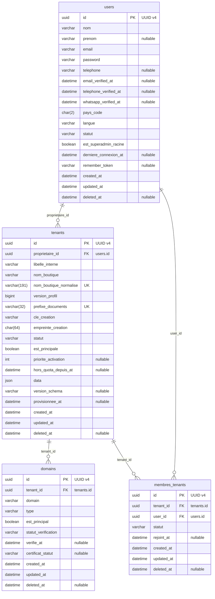
```mermaid
erDiagram
    direction TB
    users {
        uuid id PK "UUID v4"
        varchar nom
        varchar prenom "nullable"
        varchar email
        varchar password
        varchar telephone "nullable"
        datetime email_verified_at "nullable"
        datetime telephone_verified_at "nullable"
        datetime whatsapp_verified_at "nullable"
        char(2) pays_code
        varchar langue
        varchar statut
        boolean est_superadmin_racine
        datetime derniere_connexion_at "nullable"
        varchar remember_token "nullable"
        datetime created_at
        datetime updated_at
        datetime deleted_at "nullable"
    }
    tenants {
        uuid id PK "UUID v4"
        uuid proprietaire_id FK "users.id"
        varchar libelle_interne
        varchar nom_boutique
        varchar(191) nom_boutique_normalise UK
        bigint version_profil
        varchar(32) prefixe_documents UK
        varchar cle_creation
        char(64) empreinte_creation
        varchar statut
        boolean est_principale
        int priorite_activation "nullable"
        datetime hors_quota_depuis_at "nullable"
        json data
        varchar version_schema "nullable"
        datetime provisionnee_at "nullable"
        datetime created_at
        datetime updated_at
        datetime deleted_at "nullable"
    }
    domains {
        uuid id PK "UUID v4"
        uuid tenant_id FK "tenants.id"
        varchar domain
        varchar type
        boolean est_principal
        varchar statut_verification
        datetime verifie_at "nullable"
        varchar certificat_statut "nullable"
        datetime created_at
        datetime updated_at
        datetime deleted_at "nullable"
    }
    membres_tenants {
        uuid id PK "UUID v4"
        uuid tenant_id FK "tenants.id"
        uuid user_id FK "users.id"
        varchar statut
        datetime rejoint_at "nullable"
        datetime created_at
        datetime updated_at
        datetime deleted_at "nullable"
    }
    users ||--o{ tenants : proprietaire_id
    tenants ||--o{ domains : tenant_id
    tenants ||--o{ membres_tenants : tenant_id
    users ||--o{ membres_tenants : user_id
```

Les références vers un autre module sont indiquées sur les champs, même si leur flèche n’est pas redessinée ici.

- **`users` :** UNIQUE(email normalisé). Pays DZ par défaut. Password contient un hachage. Au maximum un compte racine actif, contrainte conditionnelle à prévoir. Seul le compte racine a le contournement global ; un administrateur délégué conserve toutes les restrictions explicites. La langue est une préférence, pas une table de traductions du catalogue.

- **`tenants` :** proprietaire_id NOT NULL, FK RESTRICT vers users ; UNIQUE(id,proprietaire_id). BEFORE UPDATE refuse tout changement de propriétaire, également interdit par le service, même pour root. Propriétaire actif à la création ; suppression logique/physique de son compte bloquée tant qu’une boutique lui est rattachée. `nom_boutique` est la source centrale ; `nom_boutique_normalise` UNIQUE, NOT NULL, collation binaire UTF-8, normalisation serveur versionnée : NFC, espaces Unicode regroupés, trim, casefold. Exemple «  Alpha  Store » → « alpha store ». Rejeter le vide et toute longueur excessive, ne jamais tronquer pour indexer. Les noms des boutiques archivées restent réservés au MVP. `cle_creation` est NOT NULL, idempotente par propriétaire : UNIQUE(proprietaire_id,cle_creation), jamais UNIQUE(cle_creation) seul. `empreinte_creation` fige le SHA-256 du contenu canonique versionné de la demande ; même paire/même empreinte → même tenant, empreinte différente → conflit 409. Relire cette paire AVANT le contrôle du quota : une reprise ne consomme pas une nouvelle place. `prefixe_documents` est un code de série globalement unique, immuable après utilisation. `version_profil` augmente à chaque changement du profil central à répliquer. `data` porte les métadonnées Tenancy, dont le nom technique de BDD unique. Statut=en_provisionnement|actif|hors_quota|suspendu|suspendu_restauration|echec_provisionnement|archive. Une seule boutique principale non archivée par propriétaire via clé générée conditionnelle UNIQUE ; priorite_activation positive facultative mémorise son choix de conservation. Le quota ne réactive jamais une suspension administrative ou de restauration. La date hors_quota_depuis_at suit la projection de quota. Aucun accès SQL direct aux commerçants.

- **`domains` :** UNIQUE(domain normalisé). Un domaine principal actif au maximum par tenant. type=sous_domaine|personnalise. Le domaine personnalisé exige la fonctionnalité correspondante. Adapter le modèle Domain et sa migration aux UUID. Pas de table sous_domaines distincte.

- **`membres_tenants` :** UNIQUE(tenant_id,user_id), UNIQUE(id,tenant_id). Le provisionnement crée l’appartenance du propriétaire dans la transaction centrale de création du tenant. Interdire sa suppression, son changement de user_id/tenant_id et sa désactivation tant que le tenant existe, par triggers et service. Aucun rôle propriétaire assignable : la propriété et ses droits de gestion sont dérivés uniquement de tenants.proprietaire_id, avec limites du plan et contrôles sensibles. Les autres membres ont leurs rôles dans membres_roles ; une réinvitation restaure la même appartenance.

### C2 — Permissions

**`fonctionnalites` — Catalogue des capacités activables et des quotas commerciaux.**

**`permissions` — Actions atomiques autorisées côté serveur.**

**`roles` — Rôles globaux du SaaS ou rôles personnalisés d’une boutique.**

**`roles_permissions` — Permissions accordées à un rôle.**

**`users_roles` — Attribution des seuls rôles plateforme à un compte.**

**`membres_roles` — Attribution de rôles tenant à une appartenance de la même boutique.**

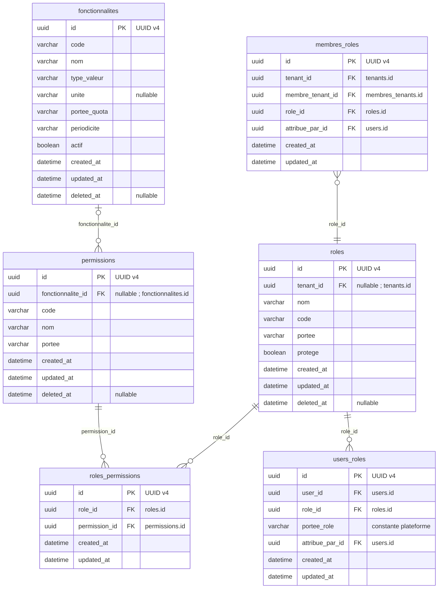
```mermaid
erDiagram
    direction TB
    fonctionnalites {
        uuid id PK "UUID v4"
        varchar code
        varchar nom
        varchar type_valeur
        varchar unite "nullable"
        varchar portee_quota
        varchar periodicite
        boolean actif
        datetime created_at
        datetime updated_at
        datetime deleted_at "nullable"
    }
    permissions {
        uuid id PK "UUID v4"
        uuid fonctionnalite_id FK "nullable ; fonctionnalites.id"
        varchar code
        varchar nom
        varchar portee
        datetime created_at
        datetime updated_at
        datetime deleted_at "nullable"
    }
    roles {
        uuid id PK "UUID v4"
        uuid tenant_id FK "nullable ; tenants.id"
        varchar nom
        varchar code
        varchar portee
        boolean protege
        datetime created_at
        datetime updated_at
        datetime deleted_at "nullable"
    }
    roles_permissions {
        uuid id PK "UUID v4"
        uuid role_id FK "roles.id"
        uuid permission_id FK "permissions.id"
        datetime created_at
        datetime updated_at
    }
    users_roles {
        uuid id PK "UUID v4"
        uuid user_id FK "users.id"
        uuid role_id FK "roles.id"
        varchar portee_role "constante plateforme"
        uuid attribue_par_id FK "users.id"
        datetime created_at
        datetime updated_at
    }
    membres_roles {
        uuid id PK "UUID v4"
        uuid tenant_id FK "tenants.id"
        uuid membre_tenant_id FK "membres_tenants.id"
        uuid role_id FK "roles.id"
        uuid attribue_par_id FK "users.id"
        datetime created_at
        datetime updated_at
    }
    membres_roles }o--|| roles : role_id
    fonctionnalites |o--o{ permissions : fonctionnalite_id
    roles ||--o{ roles_permissions : role_id
    permissions ||--o{ roles_permissions : permission_id
    roles ||--o{ users_roles : role_id
```

Les références vers un autre module sont indiquées sur les champs, même si leur flèche n’est pas redessinée ici.

- **`fonctionnalites` :** UNIQUE(code). type_valeur=booleen|quota ; portee_quota=compte|tenant ; periodicite=aucune|jour|mois. Les quotas journaliers utilisent une fenêtre calendaire explicite. Exemples boutiques.nombre, domaines.personnalises, design.personnalise, livraison.ecotrack, statistiques.lire. Les fonctionnalités doivent correspondre à des contrôles réellement implémentés.

- **`permissions` :** UNIQUE(code). portee=plateforme|tenant. Exemples produits.creer, produits.modifier, produits.supprimer, stock.ajuster, commandes.confirmer, commandes.modifier, finances.valider_reversement, tenants.acceder, utilisateurs.usurper. Une fonctionnalité non commerciale peut ne pas avoir de fonctionnalite_id.

- **`roles` :** portee=plateforme exige tenant_id NULL ; portee=tenant exige un tenant. UNIQUE(contexte_normalise,code), contexte_normalise vaut plateforme ou UUID du tenant. La simple contrainte UNIQUE(tenant_id,code) ne suffit pas pour les lignes globales avec NULL.

- **`roles_permissions` :** UNIQUE(role_id,permission_id). Égalité obligatoire roles.portee=permissions.portee : tenant → tenant et plateforme → plateforme. Service Laravel ET triggers BEFORE INSERT/UPDATE sur le pivot refusent une différence avec SIGNAL SQLSTATE '45000'. Les portées des rôles et permissions sont immuables dès création (triggers BEFORE UPDATE), ce qui ferme le contournement par modification des parents. Pour l’assistance, créer des permissions plateforme dédiées et contrôlées par cible ; ne pas attacher une permission tenant à un rôle plateforme. Toute mutation invalide les caches. Les comptes SQL applicatifs n’ont aucun droit DDL.

- **`users_roles` :** UNIQUE(user_id,role_id). Réservé à la plateforme : CHECK(portee_role='plateforme') et FK(role_id,portee_role) → roles(id,portee), clé parent UNIQUE. Les rôles tenant sont uniquement dans membres_roles. Aucun administrateur délégué ne peut attribuer plus de droits que sa délégation.

- **`membres_roles` :** UNIQUE(membre_tenant_id,role_id). FK(membre_tenant_id,tenant_id) → membres_tenants(id,tenant_id) et FK(role_id,tenant_id) → roles(id,tenant_id), avec clés parents UNIQUE. tenant_id NOT NULL exclut les rôles plateforme. L’appartenance doit être active à l’attribution et à chaque requête ; une révocation invalide immédiatement le cache des droits.

### C3 — Exceptions et accès administratifs

**`exceptions_permissions` — Autorisation ou interdiction ciblée pour une personne.**

**`restrictions_admins` — Exceptions ciblant des boutiques ou des comptes pour les administrateurs délégués.**

**`invitations_equipes` — Invitation d’un membre avec un premier rôle.**

**`sessions_assistance` — Accès temporaire d’un administrateur au contexte d’une boutique ou d’un membre.**

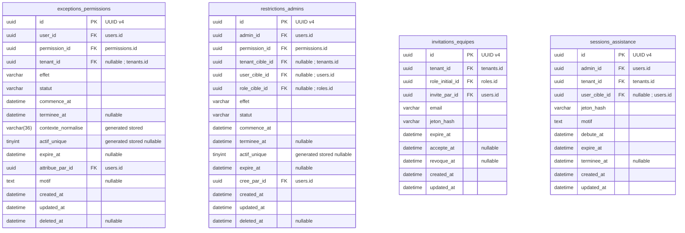
```mermaid
erDiagram
    direction TB
    exceptions_permissions {
        uuid id PK "UUID v4"
        uuid user_id FK "users.id"
        uuid permission_id FK "permissions.id"
        uuid tenant_id FK "nullable ; tenants.id"
        varchar effet
        varchar statut
        datetime commence_at
        datetime terminee_at "nullable"
        varchar(36) contexte_normalise "generated stored"
        tinyint actif_unique "generated stored nullable"
        datetime expire_at "nullable"
        uuid attribue_par_id FK "users.id"
        text motif "nullable"
        datetime created_at
        datetime updated_at
        datetime deleted_at "nullable"
    }
    restrictions_admins {
        uuid id PK "UUID v4"
        uuid admin_id FK "users.id"
        uuid permission_id FK "permissions.id"
        uuid tenant_cible_id FK "nullable ; tenants.id"
        uuid user_cible_id FK "nullable ; users.id"
        uuid role_cible_id FK "nullable ; roles.id"
        varchar effet
        varchar statut
        datetime commence_at
        datetime terminee_at "nullable"
        tinyint actif_unique "generated stored nullable"
        datetime expire_at "nullable"
        uuid cree_par_id FK "users.id"
        datetime created_at
        datetime updated_at
        datetime deleted_at "nullable"
    }
    invitations_equipes {
        uuid id PK "UUID v4"
        uuid tenant_id FK "tenants.id"
        uuid role_initial_id FK "roles.id"
        uuid invite_par_id FK "users.id"
        varchar email
        varchar jeton_hash
        datetime expire_at
        datetime accepte_at "nullable"
        datetime revoque_at "nullable"
        datetime created_at
        datetime updated_at
    }
    sessions_assistance {
        uuid id PK "UUID v4"
        uuid admin_id FK "users.id"
        uuid tenant_id FK "tenants.id"
        uuid user_cible_id FK "nullable ; users.id"
        varchar jeton_hash
        text motif
        datetime debute_at
        datetime expire_at
        datetime terminee_at "nullable"
        datetime created_at
        datetime updated_at
    }
```

Les références vers un autre module sont indiquées sur les champs, même si leur flèche n’est pas redessinée ici.

- **`exceptions_permissions` :** effet=autoriser|interdire ; statut=active|expiree|revoquee. `contexte_normalise=COALESCE(tenant_id,'plateforme')` ; `actif_unique=CASE WHEN statut='active' AND deleted_at IS NULL THEN 1 ELSE NULL END`. UNIQUE(user_id,permission_id,contexte_normalise,actif_unique) conserve toutes les périodes anciennes. CHECK(expire_at IS NULL OR expire_at>commence_at). Autorisation effective uniquement si statut actif, non supprimée et date dans [commence_at,expire_at) ; le cron n’est pas une garantie d’expiration. Avant renouvellement, verrouiller le user bénéficiaire, expirer une ancienne ligne échue puis insérer la nouvelle dans la même transaction. `terminee_at` trace révocation/expiration ; ne pas réécrire motif/auteur/période d’une ancienne attribution. Interdiction prioritaire sur les rôles ; aucun contournement du plan ou de l’appartenance. Invalidation du cache à chaque mutation et expiration limitée par la borne temporelle. Pas de NOW() dans les colonnes générées.

- **`restrictions_admins` :** Exactement une cible renseignée parmi tenant, user et rôle. La cible rôle limite la consultation/administration de ce rôle ; les comptes représentés se contrôlent séparément. Une interdiction visant un propriétaire peut bloquer l’accès à toutes ses boutiques selon la permission tenants.acceder. Une autorisation ciblée ne crée pas de permission globale absente. UNIQUE(admin_id,permission_id,type_cible,cible_normalisee,actif_unique). Même historisation active/expiree/revoquee et contrôle temporel que exceptions_permissions, sous verrou du compte administrateur ; actif_unique vaut 1 pour une ligne active non supprimée, NULL sinon. Les anciennes lignes ne sont pas réutilisées.

- **`invitations_equipes` :** UNIQUE(jeton_hash). Le rôle appartient au tenant invité. Plusieurs rôles peuvent ensuite être ajoutés par membres_roles. FK(role_initial_id,tenant_id) → roles(id,tenant_id). Jeton consommable une seule fois.

- **`sessions_assistance` :** Les vérifications de permissions et restrictions restent actives à chaque action. Journaliser simultanément l’acteur réel et le compte représenté. L’usurpation ne doit jamais donner les droits supérieurs du compte cible à un administrateur limité.

### C4 — Plans et abonnements

**`plans` — Offre commerciale versionnée et réutilisable.**

**`plans_fonctionnalites` — Activation et limite de chaque capacité dans un plan.**

**`abonnements` — Abonnement du propriétaire ; couvre ses boutiques et son quota global.**

**`exceptions_fonctionnalites` — Activation, désactivation ou quota personnalisé, notamment un essai beta daté.**

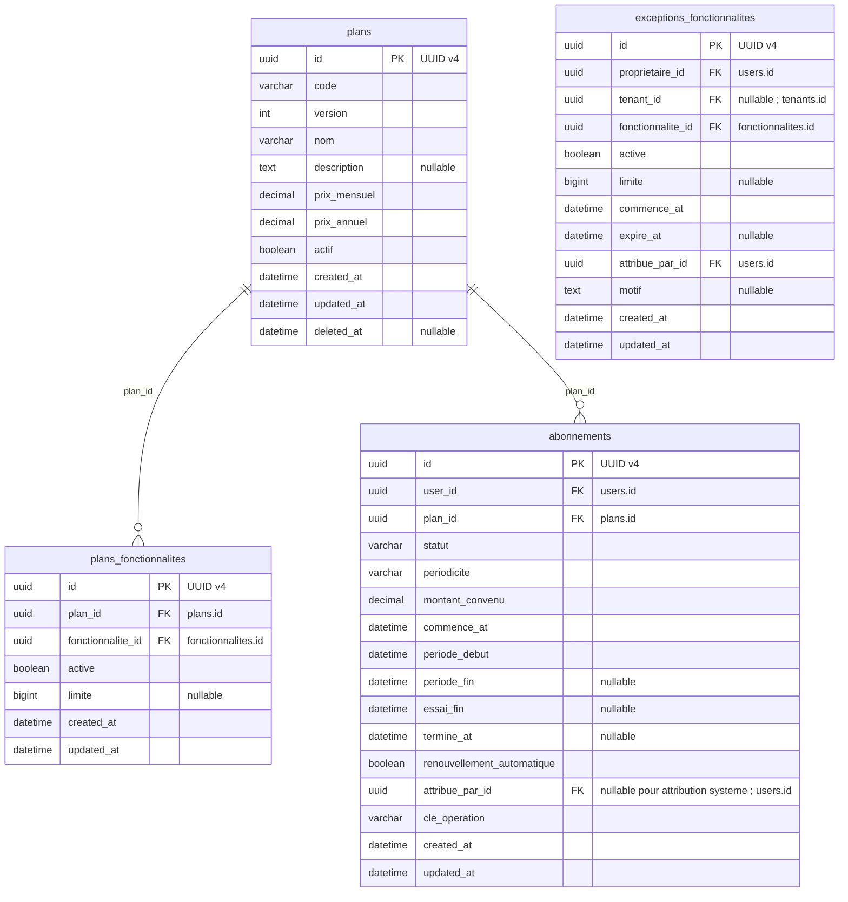
```mermaid
erDiagram
    direction TB
    plans {
        uuid id PK "UUID v4"
        varchar code
        int version
        varchar nom
        text description "nullable"
        decimal prix_mensuel
        decimal prix_annuel
        boolean actif
        datetime created_at
        datetime updated_at
        datetime deleted_at "nullable"
    }
    plans_fonctionnalites {
        uuid id PK "UUID v4"
        uuid plan_id FK "plans.id"
        uuid fonctionnalite_id FK "fonctionnalites.id"
        boolean active
        bigint limite "nullable"
        datetime created_at
        datetime updated_at
    }
    abonnements {
        uuid id PK "UUID v4"
        uuid user_id FK "users.id"
        uuid plan_id FK "plans.id"
        varchar statut
        varchar periodicite
        decimal montant_convenu
        datetime commence_at
        datetime periode_debut
        datetime periode_fin "nullable"
        datetime essai_fin "nullable"
        datetime termine_at "nullable"
        boolean renouvellement_automatique
        uuid attribue_par_id FK "nullable pour attribution systeme ; users.id"
        varchar cle_operation
        datetime created_at
        datetime updated_at
    }
    exceptions_fonctionnalites {
        uuid id PK "UUID v4"
        uuid proprietaire_id FK "users.id"
        uuid tenant_id FK "nullable ; tenants.id"
        uuid fonctionnalite_id FK "fonctionnalites.id"
        boolean active
        bigint limite "nullable"
        datetime commence_at
        datetime expire_at "nullable"
        uuid attribue_par_id FK "users.id"
        text motif "nullable"
        datetime created_at
        datetime updated_at
    }
    plans ||--o{ plans_fonctionnalites : plan_id
    plans ||--o{ abonnements : plan_id
```

Les références vers un autre module sont indiquées sur les champs, même si leur flèche n’est pas redessinée ici.

- **`plans` :** UNIQUE(code,version). DZD uniquement. Un plan déjà souscrit devient immuable : nouvelle version pour changer son contenu sans modifier rétroactivement tous les abonnements. Plan gratuit : prix=0 et quota de boutiques=1.

- **`plans_fonctionnalites` :** UNIQUE(plan_id,fonctionnalite_id). Pour quota : active=false signifie indisponible ; active=true et limite=NULL signifie illimité ; sinon limite>=0. Pour booléen : limite=NULL. Une capacité absente est désactivée. Immuable avec le plan utilisé.

- **`abonnements` :** Attribution payante manuelle par un administrateur autorisé ; plan gratuit attribué automatiquement à la création et après expiration du payant. renouvellement_automatique=false concerne le renouvellement payant, pas le basculement gratuit. statut=en_attente|actif|expire|annule. UNIQUE(cle_operation). Colonne générée proprietaire_actif_id = CASE WHEN statut='actif' THEN user_id ELSE NULL END, avec UNIQUE(proprietaire_actif_id). Activation : transaction, verrou FOR UPDATE sur users du propriétaire, clôture de l’ancien abonnement puis activation du nouveau. Droits actifs seulement si statut=actif et date dans [commence_at,periode_fin), borne finale facultative pour gratuit. Le contrôle des dates ne dépend pas du cron. À expiration, clôturer l’abonnement payant et créer idempotemment le gratuit sous verrou propriétaire ; appliquer hors_quota aux boutiques excédentaires, sans suppression. Les contrôles serveur calculent immédiatement les droits gratuits et l’ensemble éligible même si le cron est arrêté ; ils ne se fient pas à un ancien statut actif. Voir 7.2. Conserver montants et périodes historiques.

- **`exceptions_fonctionnalites` :** intervalles [commence_at,expire_at), borne finale facultative ; CHECK(expire_at IS NULL OR expire_at>commence_at). `active` est la valeur métier de la fonctionnalité, PAS le statut temporel de l’exception : active=false peut interdire pendant toute la période. Aucun chevauchement pour (proprietaire_id,COALESCE(tenant_id,contexte_compte),fonctionnalite_id). Toutes les insertions/modifications verrouillent d’abord users du propriétaire, lisent les périodes en lecture courante, testent le chevauchement puis écrivent dans la même transaction. Aucun CHECK inter-lignes fictif. tenant NULL = compte ; tenant spécifique prime puis compte puis plan. Un quota de portée compte refuse une exception tenant. FK(tenant_id,proprietaire_id) → tenants(id,proprietaire_id) ; même contrôle pour consommations_fonctionnalites. Une modification des dates est auditée ; une période consommée n’est pas réécrite rétroactivement.

### C5 — Suivi SaaS et référentiel

**`consommations_fonctionnalites` — Compteur technique de quotas, uniquement lorsque nécessaire.**

**`echeances_abonnement` — Montants dus pour le service SaaS, distincts des encaissements des boutiques.**

**`reglements_abonnement` — Paiements SaaS enregistrés et validés manuellement.**

**`wilayas` — Référentiel algérien partagé.**

**`communes` — Communes du référentiel partagé.**

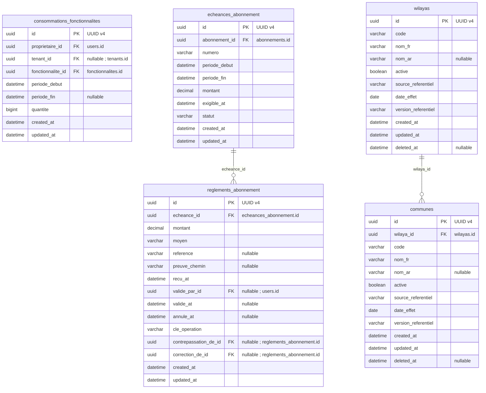
```mermaid
erDiagram
    direction TB
    consommations_fonctionnalites {
        uuid id PK "UUID v4"
        uuid proprietaire_id FK "users.id"
        uuid tenant_id FK "nullable ; tenants.id"
        uuid fonctionnalite_id FK "fonctionnalites.id"
        datetime periode_debut
        datetime periode_fin "nullable"
        bigint quantite
        datetime created_at
        datetime updated_at
    }
    echeances_abonnement {
        uuid id PK "UUID v4"
        uuid abonnement_id FK "abonnements.id"
        varchar numero
        datetime periode_debut
        datetime periode_fin
        decimal montant
        datetime exigible_at
        varchar statut
        datetime created_at
        datetime updated_at
    }
    reglements_abonnement {
        uuid id PK "UUID v4"
        uuid echeance_id FK "echeances_abonnement.id"
        decimal montant
        varchar moyen
        varchar reference "nullable"
        varchar preuve_chemin "nullable"
        datetime recu_at
        uuid valide_par_id FK "nullable ; users.id"
        datetime valide_at "nullable"
        datetime annule_at "nullable"
        varchar cle_operation
        uuid contrepassation_de_id FK "nullable ; reglements_abonnement.id"
        uuid correction_de_id FK "nullable ; reglements_abonnement.id"
        datetime created_at
        datetime updated_at
    }
    wilayas {
        uuid id PK "UUID v4"
        varchar code
        varchar nom_fr
        varchar nom_ar "nullable"
        boolean active
        varchar source_referentiel
        date date_effet
        varchar version_referentiel
        datetime created_at
        datetime updated_at
        datetime deleted_at "nullable"
    }
    communes {
        uuid id PK "UUID v4"
        uuid wilaya_id FK "wilayas.id"
        varchar code
        varchar nom_fr
        varchar nom_ar "nullable"
        boolean active
        varchar source_referentiel
        date date_effet
        varchar version_referentiel
        datetime created_at
        datetime updated_at
        datetime deleted_at "nullable"
    }
    echeances_abonnement ||--o{ reglements_abonnement : echeance_id
    wilayas ||--o{ communes : wilaya_id
```

Les références vers un autre module sont indiquées sur les champs, même si leur flèche n’est pas redessinée ici.

- **`consommations_fonctionnalites` :** UNIQUE(proprietaire_id,contexte_normalise,fonctionnalite_id,periode_debut). Mise à jour atomique, contrôlée par le serveur, compteur recalculable. Pour une NOUVELLE création, boutiques.nombre compte TOUS les tenants non supprimés du propriétaire, y compris hors_quota, en_provisionnement, suspendu et echec_provisionnement, sous verrou ; voir 7.1. Pour l’exploitation après rétrogradation, sélectionner au plus le quota de boutiques actives existantes (7.2), sans supprimer les excédentaires. Un échec récupérable conserve sa place, une libération définitive est explicite. Pas de second compteur concurrent. Quotas d’un membre = ceux du propriétaire de la boutique.

- **`echeances_abonnement` :** UNIQUE(numero). DZD ; état dû/partiel/réglé dérivé des règlements validés. Pas une facture fiscale présumée.

- **`reglements_abonnement` :** UNIQUE(cle_operation), UNIQUE(contrepassation_de_id) hors NULL. Montant>0 pour un paiement, négatif uniquement pour son inverse exact. Une ligne validée est immuable ; correction par contrepassation puis nouvelle ligne, même échéance. annule_at réservé aux lignes non encore validées, exclues des sommes. Verrouiller l’échéance à la validation, interdire un solde négatif ou supérieur au montant dû sans traitement explicite du trop-perçu. Le moyen reste configurable ; aucune donnée de carte.

- **`wilayas` :** UNIQUE(code). Référentiel initial à importer depuis les annexes officielles : loi 26-06 du 4 avril 2026, 69 wilayas et 1 541 communes [S10]. Source, version et date d’effet tracées ; jamais de CHECK limitant les codes à 58 ou le nombre de lignes à 69. Les codes transporteur restent indépendants, même si une desserte utilise temporairement une ancienne zone.

- **`communes` :** UNIQUE(wilaya_id,code). Vérifier l’appartenance commune/wilaya. Un code postal ne remplace pas l’identifiant d’une commune.

### C6 — Audit SaaS

**`journal_audit_central` — Historique des connexions sensibles, droits, plans, domaines et accès inter-boutiques.**

**`verifications_contacts` — Défis temporaires pour vérifier le téléphone ou le canal WhatsApp du compte SaaS.**

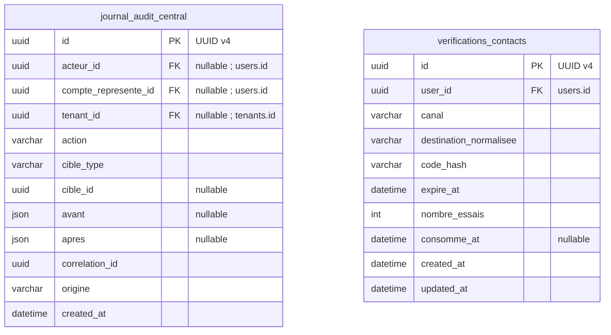
```mermaid
erDiagram
    direction TB
    journal_audit_central {
        uuid id PK "UUID v4"
        uuid acteur_id FK "nullable ; users.id"
        uuid compte_represente_id FK "nullable ; users.id"
        uuid tenant_id FK "nullable ; tenants.id"
        varchar action
        varchar cible_type
        uuid cible_id "nullable"
        json avant "nullable"
        json apres "nullable"
        uuid correlation_id
        varchar origine
        datetime created_at
    }
    verifications_contacts {
        uuid id PK "UUID v4"
        uuid user_id FK "users.id"
        varchar canal
        varchar destination_normalisee
        varchar code_hash
        datetime expire_at
        int nombre_essais
        datetime consomme_at "nullable"
        datetime created_at
        datetime updated_at
    }
```

Les références vers un autre module sont indiquées sur les champs, même si leur flèche n’est pas redessinée ici.

- **`journal_audit_central` :** Écriture append-only ; ne jamais journaliser mots de passe, OTP, tokens de connexion ou secrets API. Les cibles polymorphes sont des références logiques. Aucun bouton de suppression métier, même pour le root.

- **`verifications_contacts` :** canal=telephone|whatsapp. Hachage du code, durée courte et nombre d’essais limité. Vérifier une destination ne prouve pas qu’une autre destination ou un autre canal l’est. Si le téléphone change, remettre à NULL les vérifications associées. L’email et le mot de passe peuvent utiliser les mécanismes standards Laravel.

### C7 — Comptes transporteur et tarifs versionnés

Les comptes API sont mutualisés au niveau du propriétaire, jamais entre propriétaires différents. Le profil local `prestataires_livraison` référence le compte sans recopier ses secrets. Le pivot utilise `tenant_id` plutôt que `boutique_id` : l’identité centrale d’une boutique est `tenants.id`.

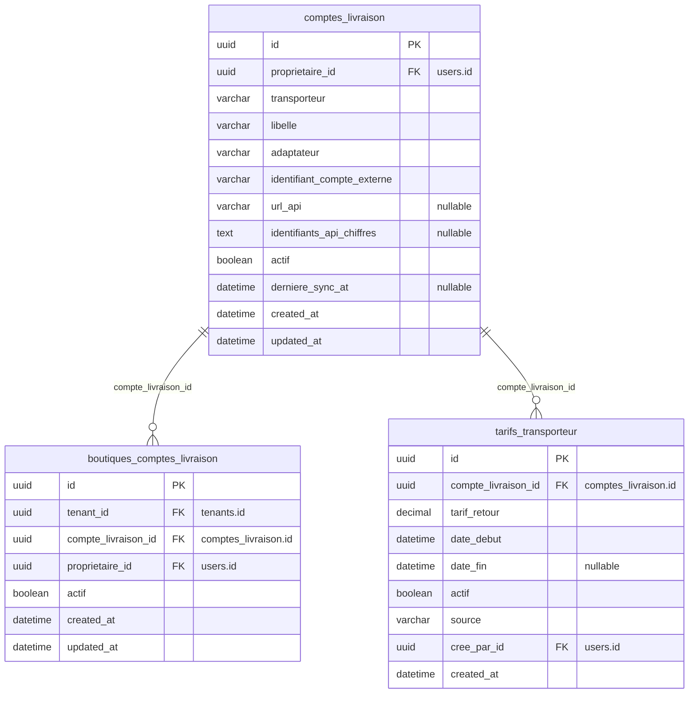
```mermaid
erDiagram
    direction TB
    comptes_livraison {
        uuid id PK
        uuid proprietaire_id FK "users.id"
        varchar transporteur
        varchar libelle
        varchar adaptateur
        varchar identifiant_compte_externe
        varchar url_api "nullable"
        text identifiants_api_chiffres "nullable"
        boolean actif
        datetime derniere_sync_at "nullable"
        datetime created_at
        datetime updated_at
    }
    boutiques_comptes_livraison {
        uuid id PK
        uuid tenant_id FK "tenants.id"
        uuid compte_livraison_id FK "comptes_livraison.id"
        uuid proprietaire_id FK "users.id"
        boolean actif
        datetime created_at
        datetime updated_at
    }
    tarifs_transporteur {
        uuid id PK
        uuid compte_livraison_id FK "comptes_livraison.id"
        decimal tarif_retour
        datetime date_debut
        datetime date_fin "nullable"
        boolean actif
        varchar source
        uuid cree_par_id FK "users.id"
        datetime created_at
    }
    comptes_livraison ||--o{ boutiques_comptes_livraison : compte_livraison_id
    comptes_livraison ||--o{ tarifs_transporteur : compte_livraison_id
```

- **`comptes_livraison` :** UNIQUE(id,proprietaire_id), UNIQUE(transporteur,identifiant_compte_externe). Le compte externe canonique est vérifié avant activation pour éviter deux enregistrements du même compte ; à défaut d’identification fiable par API, activation manuelle contrôlée. Propriétaire et identité externe immuables dès utilisation. Secrets chiffrés au repos, déchiffrables uniquement par le connecteur serveur ; URL autorisée pour éviter les appels arbitraires. Un compte manuel peut ne pas avoir de secret. Un rôle d’une boutique ne donne jamais accès aux autres boutiques utilisant ce compte.
- **`boutiques_comptes_livraison` :** UNIQUE(tenant_id,compte_livraison_id), UNIQUE(id,tenant_id,compte_livraison_id). FK(tenant_id,proprietaire_id) → tenants(id,proprietaire_id) et FK(compte_livraison_id,proprietaire_id) → comptes_livraison(id,proprietaire_id). L’association et le compte doivent être actifs pour de nouveaux envois. Leur désactivation conserve les liens historiques et autorise un rapprochement de clôture contrôlé.
- **`tarifs_transporteur` :** UNIQUE(compte_livraison_id,date_debut), tarif_retour>=0, date_fin NULL ou >date_debut. Intervalles semi-ouverts [date_debut,date_fin), sans chevauchement pour un compte ; insertion sous verrou du compte. Les montants déjà appliqués ne changent jamais. Pour un changement futur, fermer l’ancien intervalle sans invalider les frais historiques, puis créer la nouvelle version. `actif` autorise l’utilisation de la version ; une version échue reste consultable. Source manuel|api. Un tarif nul signifie gratuit explicitement, jamais « inconnu ».

**Application d’un tarif de retour.** Le fait générateur retenu est l’acceptation du retour par le transporteur, et non la simple demande du commerçant. Sa date fiable est enregistrée dans frais_transporteur.fait_generateur_at ; à défaut, date de première observation et source_date=observation. Sélectionner le tarif du compte à cette date et figer montant, tarif_source_id et tarif_snapshot. Si aucun tarif n’est applicable, signaler une anomalie et bloquer la constatation financière automatique sans bloquer la réception physique ; aucun zéro inventé. Un montant réellement facturé différent se corrige par écritures compensatoires après vérification. Ce fait générateur reste un paramètre de l’adaptateur à valider contre le contrat du compte avant lancement.

### C8 — Routage des colis et règlements partagés

Ces tables centrales contiennent des identifiants et des montants de routage, pas les produits ni les coordonnées des acheteurs. Elles empêchent qu’un polling de compte partagé attribue le même colis ou règlement à deux boutiques.

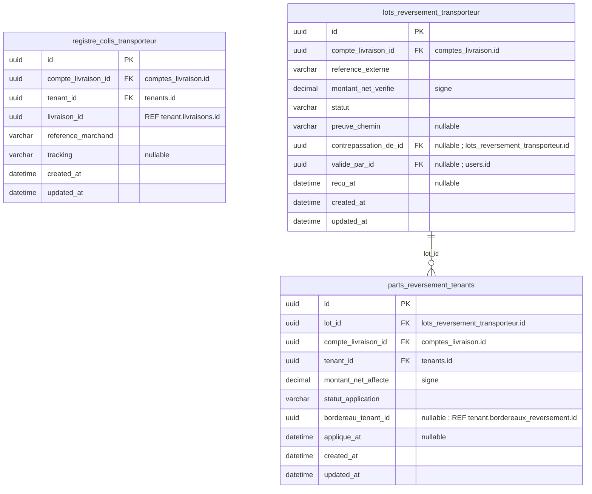
```mermaid
erDiagram
    direction TB
    registre_colis_transporteur {
        uuid id PK
        uuid compte_livraison_id FK "comptes_livraison.id"
        uuid tenant_id FK "tenants.id"
        uuid livraison_id "REF tenant.livraisons.id"
        varchar reference_marchand
        varchar tracking "nullable"
        datetime created_at
        datetime updated_at
    }
    lots_reversement_transporteur {
        uuid id PK
        uuid compte_livraison_id FK "comptes_livraison.id"
        varchar reference_externe
        decimal montant_net_verifie "signe"
        varchar statut
        varchar preuve_chemin "nullable"
        uuid contrepassation_de_id FK "nullable ; lots_reversement_transporteur.id"
        uuid valide_par_id FK "nullable ; users.id"
        datetime recu_at "nullable"
        datetime created_at
        datetime updated_at
    }
    parts_reversement_tenants {
        uuid id PK
        uuid lot_id FK "lots_reversement_transporteur.id"
        uuid compte_livraison_id FK "comptes_livraison.id"
        uuid tenant_id FK "tenants.id"
        decimal montant_net_affecte "signe"
        varchar statut_application
        uuid bordereau_tenant_id "nullable ; REF tenant.bordereaux_reversement.id"
        datetime applique_at "nullable"
        datetime created_at
        datetime updated_at
    }
    lots_reversement_transporteur ||--o{ parts_reversement_tenants : lot_id
```

- **`registre_colis_transporteur` :** UNIQUE(compte_livraison_id,reference_marchand), UNIQUE(compte_livraison_id,tracking) hors NULL, UNIQUE(tenant_id,livraison_id). FK(tenant_id,compte_livraison_id) → boutiques_comptes_livraison(tenant_id,compte_livraison_id). Référence marchand stable calculée depuis tenant et livraison, sans données personnelles. Routage immuable dès envoi. Les événements inconnus ne sont pas appliqués à une boutique par simple ressemblance de numéro ; rapprochement manuel. Le job consomme le compte une fois et route seulement les identifiants connus.
- **`lots_reversement_transporteur` :** UNIQUE(compte_livraison_id,reference_externe), UNIQUE(id,compte_livraison_id), UNIQUE(contrepassation_de_id) hors NULL. Statut=brouillon|valide|annule. Un lot validé est figé ; annulation financière via lot inverse, jamais en retirant les montants historiques. Contrôle de preuve et validation humaine si l’API ne fournit pas un bordereau détaillé. Montant signé pour les paiements de frais. Une référence de saisie manuelle doit être stable et contrôlée pour éviter les doublons.
- **`parts_reversement_tenants` :** UNIQUE(lot_id,tenant_id), FK(lot_id,compte_livraison_id) → lots_reversement_transporteur(id,compte_livraison_id), FK(tenant_id,compte_livraison_id) → boutiques_comptes_livraison(tenant_id,compte_livraison_id). Avant validation du lot, somme des parts = net vérifié sous verrou du lot. Parts figées après validation ; statut_application=en_attente|appliquee|erreur. Chaque BDD tenant crée son bordereau de façon idempotente sur UNIQUE(part_centrale_id). Un crash entre commit tenant et accusé central est repris en recherchant cette même clé. Le central prouve la réception globale ; les lignes locales en expliquent la ventilation. Ne jamais additionner les montants centraux aux locaux dans le résultat financier.

Il n’existe pas de transaction atomique couvrant arbitrairement les deux connexions : enregistrement durable, clés stables, états de reprise et réconciliation sont obligatoires. Un compte personnel à une seule boutique utilise le même protocole. Un livreur interne, sans compte central, utilise directement les bordereaux locaux.

### C9 — Historique des déploiements des BDD

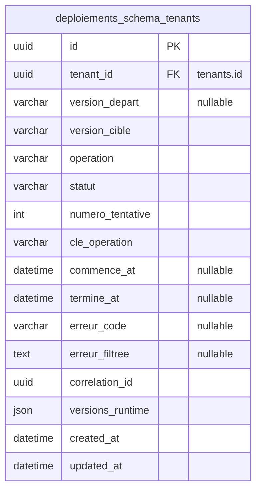
```mermaid
erDiagram
    direction TB
    deploiements_schema_tenants {
        uuid id PK
        uuid tenant_id FK "tenants.id"
        varchar version_depart "nullable"
        varchar version_cible
        varchar operation
        varchar statut
        int numero_tentative
        varchar cle_operation
        datetime commence_at "nullable"
        datetime termine_at "nullable"
        varchar erreur_code "nullable"
        text erreur_filtree "nullable"
        uuid correlation_id
        json versions_runtime
        datetime created_at
        datetime updated_at
    }
```

**Contraintes :** UNIQUE(cle_operation), index(tenant_id,created_at). operation=provisionnement|migration|restauration_controle ; statut=en_attente|en_cours|reussi|echec. Une seule opération en cours par tenant via clé générée conditionnelle UNIQUE et verrou de déploiement. Chaque reprise conserve l’échec précédent et crée une nouvelle tentative. versions_runtime fige PHP, Laravel, stancl/tenancy, MySQL et version applicative réellement utilisés. tenants.version_schema est mis à jour seulement après succès ; la table technique migrations de chaque BDD reste le détail des migrations exécutées. Une migration échouée ne rend pas le tenant actif. Après restauration, contrôler références centrales, autorisations, registre transporteur, parts de règlements et jobs avant réactivation. Une intention externe incertaine reste à rapprocher ; ne pas la renvoyer aveuglément après restauration.

### C10 — Identité légale du vendeur

**Hypothèse MVP retenue : un propriétaire correspond à une seule entité légale, commune à ses boutiques.** Ce choix reprend F9/G1 des notes ; il ne découle pas de la propriété technique du compte. Gérer plusieurs sociétés pour un même propriétaire nécessiterait un rattachement explicite par tenant et une migration dédiée.

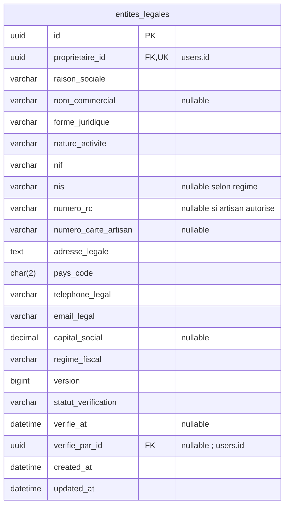
```mermaid
erDiagram
    direction TB
    entites_legales {
        uuid id PK
        uuid proprietaire_id FK,UK "users.id"
        varchar raison_sociale
        varchar nom_commercial "nullable"
        varchar forme_juridique
        varchar nature_activite
        varchar nif
        varchar nis "nullable selon regime"
        varchar numero_rc "nullable si artisan autorise"
        varchar numero_carte_artisan "nullable"
        text adresse_legale
        char(2) pays_code
        varchar telephone_legal
        varchar email_legal
        decimal capital_social "nullable"
        varchar regime_fiscal
        bigint version
        varchar statut_verification
        datetime verifie_at "nullable"
        uuid verifie_par_id FK "nullable ; users.id"
        datetime created_at
        datetime updated_at
    }
```

UNIQUE(proprietaire_id) ; FK RESTRICT. Numéros conservés en chaînes, normalisation et validation selon le régime déclaré, pas de longueur numérique algérienne imposée à un identifiant international futur. Au moins RC ou carte artisan renseigné dans un profil vérifié ; conditions de validité contrôlées selon activité. Capital NULL si inapplicable ; sinon >=0. `statut_verification=a_completer|a_verifier|verifiee|a_corriger` ; absence d’identité vérifiée bloque l’activation commerciale, pas la création du brouillon de boutique. Propriétaire immuable. Un changement incrémente version, révoque la validation si nécessaire et laisse une trace filtrée au central.

La révision acceptée et les factures figent `entite_legale_id`, version et données requises dans leur snapshot vendeur. Cette copie est une preuve historique, pas un second profil modifiable. Lire l’identité centrale dans une courte transaction et utiliser ce snapshot déterminé pour l’opération locale ; aucune promesse de commit distribué. Un changement de société juridiquement distincte n’est pas traité comme une simple correction de libellé. Adresse commerciale, nom de boutique et identité légale sont trois notions distinctes.

### C11 — Politiques et exécutions de conservation

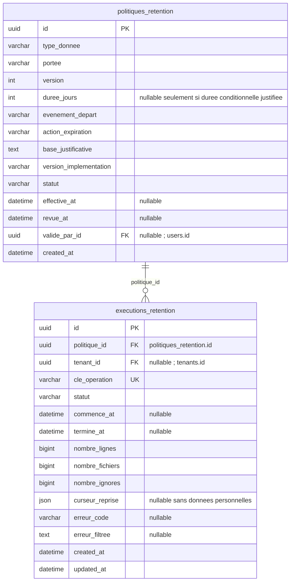
```mermaid
erDiagram
    direction TB
    politiques_retention {
        uuid id PK
        varchar type_donnee
        varchar portee
        int version
        int duree_jours "nullable seulement si duree conditionnelle justifiee"
        varchar evenement_depart
        varchar action_expiration
        text base_justificative
        varchar version_implementation
        varchar statut
        datetime effective_at "nullable"
        datetime revue_at "nullable"
        uuid valide_par_id FK "nullable ; users.id"
        datetime created_at
    }
    executions_retention {
        uuid id PK
        uuid politique_id FK "politiques_retention.id"
        uuid tenant_id FK "nullable ; tenants.id"
        varchar cle_operation UK
        varchar statut
        datetime commence_at "nullable"
        datetime termine_at "nullable"
        bigint nombre_lignes
        bigint nombre_fichiers
        bigint nombre_ignores
        json curseur_reprise "nullable sans donnees personnelles"
        varchar erreur_code "nullable"
        text erreur_filtree "nullable"
        datetime created_at
        datetime updated_at
    }
    politiques_retention ||--o{ executions_retention : politique_id
```

- `politiques_retention` : UNIQUE(type_donnee,portee,version), portee=central|tenant. action_expiration=purge|anonymise|conserve ; statut=brouillon|validee|retiree. Durée positive lorsqu’elle existe ; `conserve` exige un fondement et une date/condition de revue, jamais « pour toujours » par défaut. La définition appliquée est immuable ; nouvelle version pour toute évolution. La version applicable à une exécution est choisie explicitement selon effective_at et enregistrée dans politique_id ; une seule version courante résolue par catégorie/portée. L’implémentation est une allowlist de traitements serveur, pas du SQL administrable. Les durées ne sont pas inventées ici : elles sont validées avant collecte réelle.
- `executions_retention` : scope central → tenant NULL ; scope tenant → tenant obligatoire, vérifié côté service. statut=en_attente|en_cours|reussie|echec ; UNIQUE(cle_operation), clé déterministe politique/tenant/fenêtre. Le lot local est idempotent, son ACK central peut être repris ; compteurs reconstruits depuis les lots techniques persistés, pas incrémentés aveuglément après un crash. Pas de copie des données effacées dans le journal. Les exécutions centrales n’ont accès qu’au tenant annoncé ; reprise avec curseur stable. Voir section 12 pour les dépendances, gels de conservation et sauvegardes.

### C12 — Sauvegardes et restaurations par boutique

Les sauvegardes sont pilotées au central, afin que leurs références et l’historique de restauration ne disparaissent pas avec la BDD restaurée. Les fichiers sont privés, chiffrés et accompagnés d’une empreinte ; les clés de chiffrement ne sont pas conservées dans ces tables.

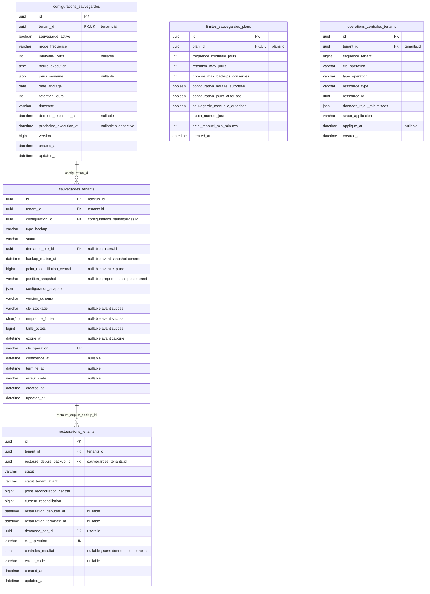
```mermaid
erDiagram
    direction TB
    configurations_sauvegardes {
        uuid id PK
        uuid tenant_id FK,UK "tenants.id"
        boolean sauvegarde_active
        varchar mode_frequence
        int intervalle_jours "nullable"
        time heure_execution
        json jours_semaine "nullable"
        date date_ancrage
        int retention_jours
        varchar timezone
        datetime derniere_execution_at "nullable"
        datetime prochaine_execution_at "nullable si desactive"
        bigint version
        datetime created_at
        datetime updated_at
    }
    limites_sauvegardes_plans {
        uuid id PK
        uuid plan_id FK,UK "plans.id"
        int frequence_minimale_jours
        int retention_max_jours
        int nombre_max_backups_conserves
        boolean configuration_horaire_autorisee
        boolean configuration_jours_autorisee
        boolean sauvegarde_manuelle_autorisee
        int quota_manuel_jour
        int delai_manuel_min_minutes
        datetime created_at
    }
    sauvegardes_tenants {
        uuid id PK "backup_id"
        uuid tenant_id FK "tenants.id"
        uuid configuration_id FK "configurations_sauvegardes.id"
        varchar type_backup
        varchar statut
        uuid demande_par_id FK "nullable ; users.id"
        datetime backup_realise_at "nullable avant snapshot coherent"
        bigint point_reconciliation_central "nullable avant capture"
        varchar position_snapshot "nullable ; repere technique coherent"
        json configuration_snapshot
        varchar version_schema
        varchar cle_stockage "nullable avant succes"
        char(64) empreinte_fichier "nullable avant succes"
        bigint taille_octets "nullable avant succes"
        datetime expire_at "nullable avant capture"
        varchar cle_operation UK
        datetime commence_at "nullable"
        datetime termine_at "nullable"
        varchar erreur_code "nullable"
        datetime created_at
        datetime updated_at
    }
    restaurations_tenants {
        uuid id PK
        uuid tenant_id FK "tenants.id"
        uuid restaure_depuis_backup_id FK "sauvegardes_tenants.id"
        varchar statut
        varchar statut_tenant_avant
        bigint point_reconciliation_central
        bigint curseur_reconciliation
        datetime restauration_debutee_at "nullable"
        datetime restauration_terminee_at "nullable"
        uuid demande_par_id FK "users.id"
        varchar cle_operation UK
        json controles_resultat "nullable ; sans donnees personnelles"
        varchar erreur_code "nullable"
        datetime created_at
        datetime updated_at
    }
    operations_centrales_tenants {
        uuid id PK
        uuid tenant_id FK "tenants.id"
        bigint sequence_tenant
        varchar cle_operation
        varchar type_operation
        varchar ressource_type
        uuid ressource_id
        json donnees_rejeu_minimisees
        varchar statut_application
        datetime applique_at "nullable"
        datetime created_at
    }
    configurations_sauvegardes ||--o{ sauvegardes_tenants : configuration_id
    sauvegardes_tenants ||--o{ restaurations_tenants : restaure_depuis_backup_id
```

- **Configuration :** une ligne par tenant, créée au provisionnement. Politique minimale automatique sur tous les plans ; l’utilisateur ne désactive pas la protection obligatoire, `sauvegarde_active=false` est réservé à une suspension technique auditée. Exemple initial configurable : tous les 7 jours à 02:00, rétention 14 jours, Africa/Algiers. Ce sont des valeurs de produit, pas des durées légales. `mode_frequence=quotidien|intervalle|jours_semaine`. Quotidien : intervalle/jours NULL ; intervalle : intervalle_jours>=1 et jours NULL ; jours_semaine : intervalle NULL et tableau non vide de jours ISO 1–7 distincts. CHECK des champs dépendants, validation serveur du JSON. Date d’ancrage locale fixe le cycle d’intervalle ; calculer les échéances en timezone puis stocker les instants en UTC. Une échéance ratée produit au plus un rattrapage, pas une avalanche de sauvegardes. Changements sous verrou configuration, version incrémentée ; les backups précédents gardent leur expire_at.
- **Limites du plan :** une ligne immuable avec chaque version de plan ; valeurs entières positives (quota/délai manuels peuvent valoir zéro pour interdiction/absence de délai). Les options payantes sont représentées par une version de plan incluant l’option ou des exceptions fonctionnelles validées, sans modifier un plan historique. Valider l’espacement minimal réel des jours choisis, pas seulement leur nombre ; fréquence, rétention, choix horaire/jours et sauvegarde manuelle doivent respecter les droits effectifs. Quota manuel : fenêtre locale définie, verrou propriétaire/configuration et comptage des demandes acceptées, y compris en attente. Après downgrade, adapter les futures exécutions au plan gratuit ; aucune réduction rétroactive de expire_at des backups existants. Le maximum conservé bloque une nouvelle demande manuelle ou déclenche une alerte capacité si tous les backups sont encore protégés ; ne pas supprimer une pièce avant son expiration pour faire de la place. Le service doit conserver la protection automatique minimale.
- **Backups :** type_backup=automatique|manuel|avant_migration ; statut=programme|en_cours|termine|echec|expire|supprime. UNIQUE(id,tenant_id), FK(configuration_id,tenant_id) → configurations_sauvegardes(id,tenant_id), parent UNIQUE. Clé automatique déterministe tenant/créneau ; un retry reprend la même intention. Les champs fichier, empreinte, taille>=0, point et date de snapshot sont obligatoires pour termine ; expire_at calculé à la capture selon configuration_snapshot. Une expiration logique ne prouve pas une suppression physique ; celle-ci doit être vérifiée et auditée. Aucun backup incomplet proposé pour restauration. Vérifier réellement intégrité et restauration périodique. Conserver le journal de métadonnées après suppression du fichier.
- **Journal central durable :** UNIQUE(tenant_id,sequence_tenant), UNIQUE(tenant_id,cle_operation). Sous verrou du tenant, allouer la séquence et écrire l’intention dans la même transaction que la mutation centrale concernée. Un simple AUTO_INCREMENT global ou un timestamp n’est pas présenté comme un ordre de commit sûr. Aucune opération centrale affectant le tenant ne contourne ce protocole : projection de profil, part de reversement, routage, état d’abonnement à appliquer, etc. Le contenu de rejeu contient des identifiants et des faits minimisés, jamais les coordonnées acheteur. L’application locale utilise sa clé métier/outbox de déduplication ; l’ACK central est une projection, pas une preuve que la BDD restaurée possède encore l’écriture. Conserver les intentions nécessaires au moins jusqu’à expiration des backups qui peuvent les précéder, avec politique de rétention validée.
- **Point de réconciliation :** pour capturer un backup cohérent, mettre temporairement les écritures métier et workers du tenant en pause, attendre les transactions actives, acquérir les verrous de coordination centraux, relever le dernier préfixe contigu appliqué, puis établir le snapshot cohérent local avant de reprendre les écritures. Toute intention non acquittée, même antérieure au point, reste dans la liste de réconciliation. Une opération externe déjà envoyée ne doit pas être oubliée : conserver son intention technique minimale et son résultat/incertitude au central avant appel, puis rapprocher ; aucun rejeu HTTP mutateur automatique. Si un snapshot cohérent ne peut être obtenu, la sauvegarde échoue explicitement.
- **Restauration :** FK(restaure_depuis_backup_id,tenant_id) → sauvegardes_tenants(id,tenant_id). Une seule restauration active par tenant via clé générée UNIQUE. Statut=demande|en_cours|reconciliation|terminee|echec. Sous contrôle d’exploitation, passer le tenant à suspendu_restauration, bloquer checkout/écritures et fencing des workers, vérifier backup/empreinte/version, restaurer puis rattraper les migrations compatibles. Rechercher les intentions postérieures au point ET toutes les antérieures non convergées ; vérifier leurs clés dans la BDD locale et recréer uniquement les faits absents. Rejouer n’exécute pas une seconde collecte de fonds ni une seconde création de colis. Rapprocher transporteur/finance, jobs, fichiers et politiques de rétention, puis contrôler stock, FK, quotas et autorisations. Après convergence seulement, recalculer le statut autorisé (actif, hors_quota ou suspension administrative), jamais forcer actif. Un échec reste suspendu_restauration ; la reprise garde la même cle_operation.

Une sauvegarde ancienne ne permet pas de reconstituer toute commande locale créée après sa capture à partir des seuls journaux centraux. Prévoir les sauvegardes des journaux binaires/PITR et la sauvegarde/version des fichiers pour le RPO validé ; à défaut, documenter la perte potentielle et traiter manuellement les objets transporteur orphelins. Le point central assure une réconciliation inter-systèmes, pas une garantie de perte de données nulle.

### C13 — Facturation du SaaS au commerçant

Cette facturation est indépendante des ventes de chaque boutique. Une échéance est une dette d’abonnement ; elle n’est pas automatiquement une facture. La règle fiscale d’émission est versionnée dans C14 et doit être validée avant activation commerciale.

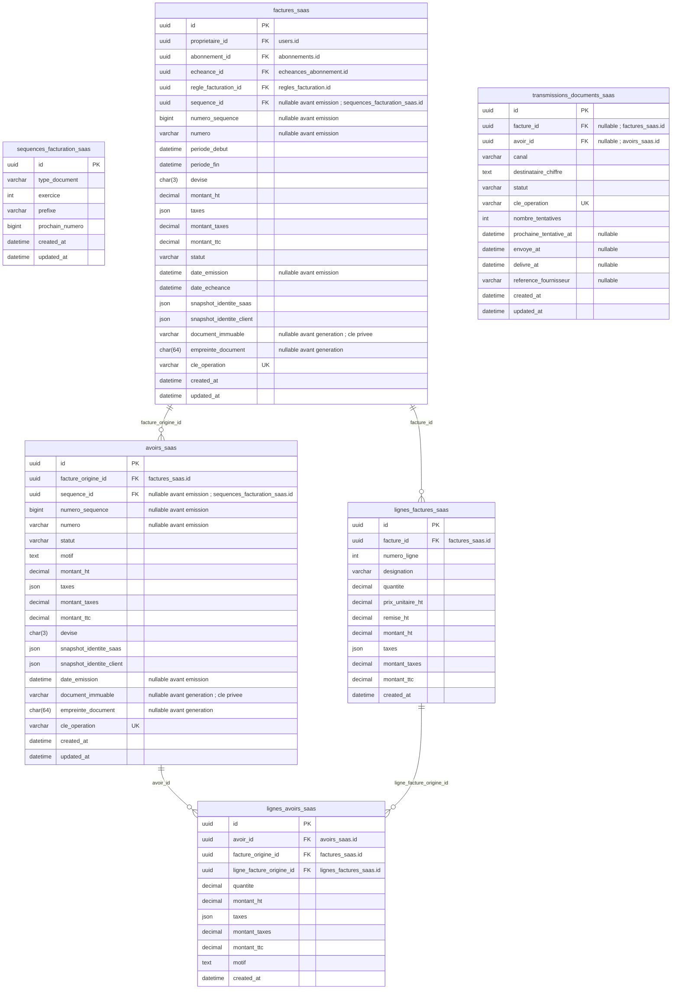
```mermaid
erDiagram
    direction TB
    sequences_facturation_saas {
        uuid id PK
        varchar type_document
        int exercice
        varchar prefixe
        bigint prochain_numero
        datetime created_at
        datetime updated_at
    }
    factures_saas {
        uuid id PK
        uuid proprietaire_id FK "users.id"
        uuid abonnement_id FK "abonnements.id"
        uuid echeance_id FK "echeances_abonnement.id"
        uuid regle_facturation_id FK "regles_facturation.id"
        uuid sequence_id FK "nullable avant emission ; sequences_facturation_saas.id"
        bigint numero_sequence "nullable avant emission"
        varchar numero "nullable avant emission"
        datetime periode_debut
        datetime periode_fin
        char(3) devise
        decimal montant_ht
        json taxes
        decimal montant_taxes
        decimal montant_ttc
        varchar statut
        datetime date_emission "nullable avant emission"
        datetime date_echeance
        json snapshot_identite_saas
        json snapshot_identite_client
        varchar document_immuable "nullable avant generation ; cle privee"
        char(64) empreinte_document "nullable avant generation"
        varchar cle_operation UK
        datetime created_at
        datetime updated_at
    }
    lignes_factures_saas {
        uuid id PK
        uuid facture_id FK "factures_saas.id"
        int numero_ligne
        varchar designation
        decimal quantite
        decimal prix_unitaire_ht
        decimal remise_ht
        decimal montant_ht
        json taxes
        decimal montant_taxes
        decimal montant_ttc
        datetime created_at
    }
    avoirs_saas {
        uuid id PK
        uuid facture_origine_id FK "factures_saas.id"
        uuid sequence_id FK "nullable avant emission ; sequences_facturation_saas.id"
        bigint numero_sequence "nullable avant emission"
        varchar numero "nullable avant emission"
        varchar statut
        text motif
        decimal montant_ht
        json taxes
        decimal montant_taxes
        decimal montant_ttc
        char(3) devise
        json snapshot_identite_saas
        json snapshot_identite_client
        datetime date_emission "nullable avant emission"
        varchar document_immuable "nullable avant generation ; cle privee"
        char(64) empreinte_document "nullable avant generation"
        varchar cle_operation UK
        datetime created_at
        datetime updated_at
    }
    lignes_avoirs_saas {
        uuid id PK
        uuid avoir_id FK "avoirs_saas.id"
        uuid facture_origine_id FK "factures_saas.id"
        uuid ligne_facture_origine_id FK "lignes_factures_saas.id"
        decimal quantite
        decimal montant_ht
        json taxes
        decimal montant_taxes
        decimal montant_ttc
        text motif
        datetime created_at
    }
    transmissions_documents_saas {
        uuid id PK
        uuid facture_id FK "nullable ; factures_saas.id"
        uuid avoir_id FK "nullable ; avoirs_saas.id"
        varchar canal
        text destinataire_chiffre
        varchar statut
        varchar cle_operation UK
        int nombre_tentatives
        datetime prochaine_tentative_at "nullable"
        datetime envoye_at "nullable"
        datetime delivre_at "nullable"
        varchar reference_fournisseur "nullable"
        datetime created_at
        datetime updated_at
    }
    factures_saas ||--o{ lignes_factures_saas : facture_id
    factures_saas ||--o{ avoirs_saas : facture_origine_id
    avoirs_saas ||--o{ lignes_avoirs_saas : avoir_id
    lignes_factures_saas ||--o{ lignes_avoirs_saas : ligne_facture_origine_id
```

- **Factures :** UNIQUE(numero) hors NULL, UNIQUE(sequence_id,numero_sequence), UNIQUE(cle_operation). Statut=brouillon|emise|annulee_brouillon. La période est [debut,fin), fin>debut ; montants>=0, HT+taxes=TTC et égalité aux sommes de lignes. DZD au MVP. Contrôler structure et somme du JSON taxes. FK(abonnement_id,proprietaire_id) → abonnements(id,user_id), clé parent UNIQUE ; FK(echeance_id,abonnement_id) → echeances_abonnement(id,abonnement_id), clé parent UNIQUE. Le fait générateur durable déclenche obligatoirement une facture par échéance/occurrence validée avec une clé stable ; aucun doublon au retry. L’échéance et les règlements conservent leur sens de dette/paiements, les rectifications fiscales passent par avoir. Une correction du dû après facture/avoir doit être rapprochée, jamais changée silencieusement pour correspondre au paiement. Aucun remboursement SaaS automatique n’est inféré d’un avoir : son exécution réelle nécessite une preuve et un flux de remboursement distinct de l’annulation technique d’un paiement. Le périmètre présent conserve les factures/avoirs et paiements SaaS ; un remboursement SaaS effectif reste une procédure comptable externe documentée tant qu’un journal dédié de décaissements SaaS n’est pas implémenté. Ne pas utiliser une contrepassation de paiement pour prétendre que le paiement initial n’a jamais eu lieu.
- **Lignes :** UNIQUE(facture_id,numero_ligne), UNIQUE(id,facture_id), quantité>0, prix/remise/base/taxes/TTC>=0. Version du plan, période et nature de l’option incluses dans la désignation/snapshot document ; aucun recalcul historique depuis le plan courant. Émission seulement avec au moins une ligne et identité légale du SaaS et du client complètes.
- **Avoirs :** origine obligatoire, facture émise de même devise ; montants positifs exprimant la réduction, pas un règlement. UNIQUE(numero), UNIQUE(sequence_id,numero_sequence), UNIQUE(id,facture_origine_id). FK(avoir_id,facture_origine_id) → avoirs_saas(id,facture_origine_id) et FK(ligne_facture_origine_id,facture_origine_id) → lignes_factures_saas(id,facture_id). UNIQUE(avoir_id,ligne_facture_origine_id). Sous verrou facture puis lignes, les avoirs émis et brouillons réservés ne dépassent ni quantités ni HT/taxes/TTC facturés ; annuler un brouillon libère sa réserve. Période, propriétaire et abonnement sont obtenus depuis la facture d’origine ; ne pas maintenir des copies modifiables concurrentes.
- **Numérotation et immutabilité :** UNIQUE(type_document,exercice), type=facture|avoir, prochain_numero>0 ; allocation sous verrou, pas MAX+1. Contrôler le type de séquence avant émission. Facture/avoir émis et leurs lignes sont immuables via triggers/privilèges ; correction par nouveau document lié. Fichier privé central/... produit depuis snapshots figés, renseigné une seule fois avec empreinte. La numérotation SaaS concerne son émetteur légal, pas les séries commerciales des tenants.
- **Transmission :** exactement une FK facture/avoir non NULL ; même protocole durable que T19, créé à l’émission, reprise avec clé stable, statut=en_attente|en_cours|envoye|delivre|echec_reessayable|echec_definitif|incertain. PDF ou lien accessible après autorisation ; un portail consultable seul ne prouve pas l’envoi. Les flux SaaS ne sont jamais additionnés aux recettes des boutiques.

### C14 — Règles de facturation et gouvernance des données

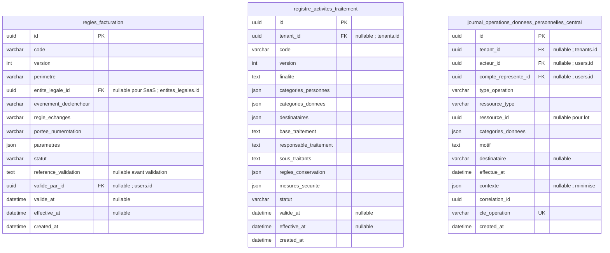
```mermaid
erDiagram
    direction TB
    regles_facturation {
        uuid id PK
        varchar code
        int version
        varchar perimetre
        uuid entite_legale_id FK "nullable pour SaaS ; entites_legales.id"
        varchar evenement_declencheur
        varchar regle_echanges
        varchar portee_numerotation
        json parametres
        varchar statut
        text reference_validation "nullable avant validation"
        uuid valide_par_id FK "nullable ; users.id"
        datetime valide_at "nullable"
        datetime effective_at "nullable"
        datetime created_at
    }
    registre_activites_traitement {
        uuid id PK
        uuid tenant_id FK "nullable ; tenants.id"
        varchar code
        int version
        text finalite
        json categories_personnes
        json categories_donnees
        json destinataires
        text base_traitement
        text responsable_traitement
        text sous_traitants
        json regles_conservation
        json mesures_securite
        varchar statut
        datetime valide_at "nullable"
        datetime effective_at "nullable"
        datetime created_at
    }
    journal_operations_donnees_personnelles_central {
        uuid id PK
        uuid tenant_id FK "nullable ; tenants.id"
        uuid acteur_id FK "nullable ; users.id"
        uuid compte_represente_id FK "nullable ; users.id"
        varchar type_operation
        varchar ressource_type
        uuid ressource_id "nullable pour lot"
        json categories_donnees
        text motif
        varchar destinataire "nullable"
        datetime effectue_at
        json contexte "nullable ; minimise"
        uuid correlation_id
        varchar cle_operation UK
        datetime created_at
    }
```

- **Règles fiscales :** UNIQUE(code,version), perimetre=saas|boutique ; entite_legale_id requis pour boutique et NULL pour SaaS. Statut=brouillon|validee|retiree. Une version validée/utilisée est immuable ; la sélection de la version effective est déterministe et sans chevauchement par périmètre/émetteur, sous verrou de coordination. Le déclencheur exact, les échanges et la portée de numérotation ne sont pas inventés : valeurs `a_valider` admises seulement en brouillon. Aucune émission/activation commerciale sans règle validée. `portee_numerotation=boutique|entite_legale` pour les commerçants ; pour SaaS, émetteur SaaS. La validation d’un texte de règle n’exécute pas du code : allowlist d’événements et d’implémentations serveur versionnées. Pour les tenants, conserver copie exacte versionnée dans chaque obligation de facturation (T22) ; aucune FK inter-BDD.
- **Registre :** documentation des traitements, distincte du journal d’événements. UNIQUE(contexte_normalise,code,version), contexte=tenant UUID ou central ; pas de simple UNIQUE sur tenant_id nullable. Version utilisée immuable ; finalités, personnes, données, destinataires, responsabilités, conservation et mesures de sécurité sont documentés, sans liste nominative des acheteurs. Le responsable juridique/DPO valide périmètre, rôles SaaS/commerçant/transporteur, transferts et durées avant production.
- **Journal central :** opérations effectivement réalisées sur les données centrales ou les accès transversaux ; aucune copie des coordonnées des acheteurs. Append-only avec rôle d’écriture dédié, lecture restreinte et rétention privilégiée tracée. Événements métier : collecte, consultation_fiche_client, export_clients, transmission_transporteur, modification_donnee_personnelle, suppression_donnee_personnelle, anonymisation, chiffrement, effacement_retention, selon périmètre validé. Pour un export en lot, conserver nombre/catégories et référence sécurisée du lot, pas les 500 fiches. Ressources tenant référencées logiquement avec tenant_id obligatoire ; une lecture locale est journalisée localement en T21. Corrélation/déduplication évitent deux faits faussement distincts pour la même action. Ne pas journaliser chaque SELECT SQL.

## 5. BDD de chaque boutique : `tenant_<uuid>`

Ce même modèle est migré dans chaque BDD tenant. Aucun `tenant_id` n’est ajouté à toutes les lignes : le contexte de connexion assure déjà la séparation. La ligne unique `boutique` conserve la référence de rattachement.

### T1 — Profil public

**`boutique` — Profil public unique dans la BDD de la boutique.**

**`adresses_boutique` — Plusieurs adresses et localisations publiques ; ne crée pas de gestion de caisse.**

**`liens_sociaux` — Plusieurs liens, y compris plusieurs pages sur un même réseau.**

**`pages_contenu` — Accueil, À propos, contact, conditions, politique de retour et confidentialité.**

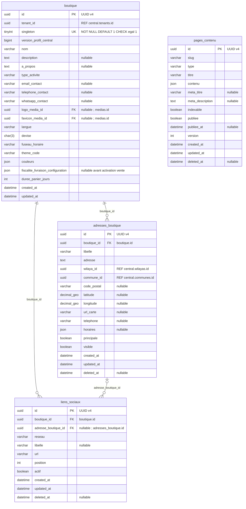
```mermaid
erDiagram
    direction TB
    boutique {
        uuid id PK "UUID v4"
        uuid tenant_id "REF central.tenants.id"
        tinyint singleton UK "NOT NULL DEFAULT 1 CHECK egal 1"
        bigint version_profil_central
        varchar nom
        text description "nullable"
        text a_propos "nullable"
        varchar type_activite
        varchar email_contact "nullable"
        varchar telephone_contact "nullable"
        varchar whatsapp_contact "nullable"
        uuid logo_media_id FK "nullable ; medias.id"
        uuid favicon_media_id FK "nullable ; medias.id"
        varchar langue
        char(3) devise
        varchar fuseau_horaire
        varchar theme_code
        json couleurs
        json fiscalite_livraison_configuration "nullable avant activation vente"
        int duree_panier_jours
        datetime created_at
        datetime updated_at
    }
    adresses_boutique {
        uuid id PK "UUID v4"
        uuid boutique_id FK "boutique.id"
        varchar libelle
        text adresse
        uuid wilaya_id "REF central.wilayas.id"
        uuid commune_id "REF central.communes.id"
        varchar code_postal "nullable"
        decimal_geo latitude "nullable"
        decimal_geo longitude "nullable"
        varchar url_carte "nullable"
        varchar telephone "nullable"
        json horaires "nullable"
        boolean principale
        boolean visible
        datetime created_at
        datetime updated_at
        datetime deleted_at "nullable"
    }
    liens_sociaux {
        uuid id PK "UUID v4"
        uuid boutique_id FK "boutique.id"
        uuid adresse_boutique_id FK "nullable ; adresses_boutique.id"
        varchar reseau
        varchar libelle "nullable"
        varchar url
        int position
        boolean actif
        datetime created_at
        datetime updated_at
        datetime deleted_at "nullable"
    }
    pages_contenu {
        uuid id PK "UUID v4"
        varchar slug
        varchar type
        varchar titre
        json contenu
        varchar meta_titre "nullable"
        text meta_description "nullable"
        boolean indexable
        boolean publiee
        datetime publiee_at "nullable"
        int version
        datetime created_at
        datetime updated_at
        datetime deleted_at "nullable"
    }
    boutique ||--o{ adresses_boutique : boutique_id
    boutique ||--o{ liens_sociaux : boutique_id
    adresses_boutique |o--o{ liens_sociaux : adresse_boutique_id
```

Les références vers un autre module sont indiquées sur les champs, même si leur flèche n’est pas redessinée ici.

- **`boutique` :** UNIQUE(tenant_id), et surtout singleton TINYINT NOT NULL DEFAULT 1, CHECK(singleton=1), UNIQUE(singleton) : au maximum UNE ligne, même avec deux tenant_id différents. Provisionnement obligatoire de cette ligne ; son existence exacte relève du contrôle de santé, pas du UNIQUE. tenant_id égal à la BDD attendue et immuable après INSERT ; suppression du profil refusée par le rôle applicatif. DZD/Africa/Algiers par défaut, theme_code=template_initial. `nom` est une projection de tenants.nom_boutique : renommage central d’abord, application locale idempotente selon version_profil_central, réconciliation périodique des versions. Ne jamais accepter un renommage uniquement local ; une panne locale ne libère pas le nom central. Logo, contacts et couleurs restent locaux. Changer de devise après une première commande est refusé au MVP.

- **`adresses_boutique` :** Une seule adresse principale active. Vérifier commune/wilaya. Horaires structurés par jour dans un JSON limité au contenu public. Pas de stock par adresse dans ce périmètre.

- **`liens_sociaux` :** Ne pas imposer UNIQUE(reseau). Ce sont des liens publics, sans tokens de publication ni calendrier marketing.

- **`pages_contenu` :** UNIQUE(slug). Structure JSON définie par le template initial ; pas de code arbitraire. FAQ, menu/header/footer et textes institutionnels peuvent être des blocs de ce template ; leur affichage ne justifie pas chacun une table.

### T2 — Catalogue principal

**`medias` — Métadonnées de fichiers images, vidéos, logos et documents.**

**`categories` — Catégories et sous-catégories avec une seule table.**

**`produits` — Descriptif commercial commun à toutes les variantes.**

**`variantes_produits` — Unité vendable : une variante par combinaison ; une variante standard pour un produit sans options.**


```mermaid
erDiagram
    direction TB
    medias {
        uuid id PK "UUID v4"
        varchar cle_stockage
        varchar mime_type
        varchar nom_original
        bigint taille_octets
        int largeur "nullable"
        int hauteur "nullable"
        int duree_secondes "nullable"
        text texte_alternatif "nullable"
        uuid cree_par_id "nullable ; REF central.users.id"
        datetime created_at
        datetime updated_at
        datetime deleted_at "nullable"
    }
    categories {
        uuid id PK "UUID v4"
        uuid parent_id FK "nullable ; categories.id"
        varchar nom
        varchar slug
        text description "nullable"
        uuid media_id FK "nullable ; medias.id"
        int position
        boolean active
        varchar meta_titre "nullable"
        text meta_description "nullable"
        datetime created_at
        datetime updated_at
        datetime deleted_at "nullable"
    }
    produits {
        uuid id PK "UUID v4"
        uuid categorie_id FK "nullable ; categories.id"
        varchar nom
        varchar slug
        text description_courte "nullable"
        text description "nullable"
        json avantages "nullable"
        json faq "nullable"
        varchar marque "nullable"
        varchar type
        boolean personnalisation_autorisee
        text consignes_personnalisation "nullable"
        varchar unite_vente
        decimal quantite_contenu "nullable"
        varchar unite_contenu "nullable"
        varchar statut
        datetime publie_at "nullable"
        boolean mis_en_avant
        varchar meta_titre "nullable"
        text meta_description "nullable"
        boolean indexable
        datetime created_at
        datetime updated_at
        datetime deleted_at "nullable"
    }
    variantes_produits {
        uuid id PK "UUID v4"
        uuid produit_id FK "produits.id"
        varchar libelle
        varchar reference_sku
        varchar code_barres "nullable"
        varchar signature_combinaison
        decimal prix_vente
        decimal cout_unitaire
        decimal ancien_prix "nullable"
        json fiscalite_configuration "nullable avant mise en vente"
        int stock_physique
        int stock_reserve
        int stock_quarantaine
        int seuil_stock_faible
        decimal poids_kg "nullable"
        decimal longueur_cm "nullable"
        decimal largeur_cm "nullable"
        decimal hauteur_cm "nullable"
        boolean active
        int position
        datetime created_at
        datetime updated_at
        datetime deleted_at "nullable"
    }
    categories |o--o{ categories : parent_id
    medias |o--o{ categories : media_id
    categories |o--o{ produits : categorie_id
    produits ||--o{ variantes_produits : produit_id
```

Les références vers un autre module sont indiquées sur les champs, même si leur flèche n’est pas redessinée ici.

- **`medias` :** UNIQUE(cle_stockage). Clé physique construite exclusivement par le serveur : tenants/{tenant_uuid}/public/{identifiant_opaque} ou tenants/{tenant_uuid}/private/{identifiant_opaque}. Les pièces centrales utilisent central/... . Refuser traversée de chemin, préfixe d’un autre tenant et toute clé complète fournie par le client. Vérifier tenant, média, visibilité et autorisation avant signature ; URL privée courte et non transférable entre contextes autorisés, jamais présentée comme une garantie contre le partage du lien lui-même. Fichier dans le stockage de fichiers, pas un BLOB dans chaque produit. Documents privés servis après autorisation ; médias publics séparés. Les textes alternatifs ne sont pas arbitrairement limités à 30 caractères.

- **`categories` :** UNIQUE(slug). parent_id NULL = catégorie principale. Empêcher les cycles. Un produit a une catégorie principale dans ce périmètre ; les étiquettes permettent les regroupements transversaux.

- **`produits` :** UNIQUE(slug). type=physique_standard|physique_personnalise. Un bouquet personnalisé reste livrable : aucun agenda de services. Prix, coût, SKU, code-barres et stock sont portés par la variante, même pour un produit simple. Prix par unité de contenu calculable si pertinent.

- **`variantes_produits` :** UNIQUE(reference_sku), UNIQUE(produit_id,signature_combinaison), UNIQUE(id,produit_id). Index(code_barres), chaîne conservant ses zéros. produit_id est immuable dès INSERT : trigger BEFORE UPDATE avec SIGNAL et refus applicatif ; corriger par archivage puis création sous le bon produit. CHECK(stock_physique>=0 AND stock_reserve>=0 AND stock_quarantaine>=0 AND stock_reserve<=stock_physique). Disponible calculé P-R. Aucun champ survente_autorisee au MVP. Réservation uniquement si disponible>=q, expédition si réservations actives et physique>=q, sous verrous. Les trois compteurs sont matérialisés depuis mouvements_stock, initialisés à zéro puis alimentés par ouverture. prix_vente TTC, cout_unitaire et seuil_stock_faible>=0 ; ancien_prix NULL ou>=0. Les règles fiscales configurées sont figées dans la révision avant facturation, voir T17. Signature recalculée et validée depuis les options.

### T3 — Options et images

**`options_produit` — Axes de variation propres au produit : taille, couleur, matière, modèle.**

**`valeurs_options` — Valeurs possibles d’un axe.**

**`variantes_valeurs` — Composition normalisée de chaque variante.**

**`medias_produits` — Galerie générale et médias spécifiques à une variante.**

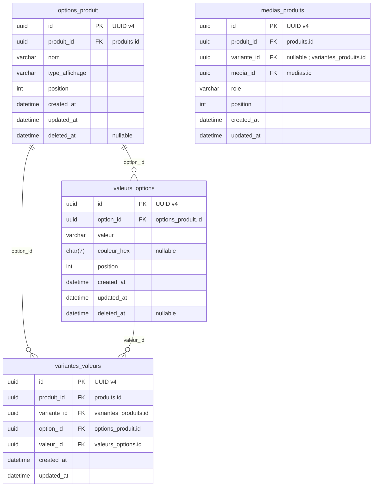
```mermaid
erDiagram
    direction TB
    options_produit {
        uuid id PK "UUID v4"
        uuid produit_id FK "produits.id"
        varchar nom
        varchar type_affichage
        int position
        datetime created_at
        datetime updated_at
        datetime deleted_at "nullable"
    }
    valeurs_options {
        uuid id PK "UUID v4"
        uuid option_id FK "options_produit.id"
        varchar valeur
        char(7) couleur_hex "nullable"
        int position
        datetime created_at
        datetime updated_at
        datetime deleted_at "nullable"
    }
    variantes_valeurs {
        uuid id PK "UUID v4"
        uuid produit_id FK "produits.id"
        uuid variante_id FK "variantes_produits.id"
        uuid option_id FK "options_produit.id"
        uuid valeur_id FK "valeurs_options.id"
        datetime created_at
        datetime updated_at
    }
    medias_produits {
        uuid id PK "UUID v4"
        uuid produit_id FK "produits.id"
        uuid variante_id FK "nullable ; variantes_produits.id"
        uuid media_id FK "medias.id"
        varchar role
        int position
        datetime created_at
        datetime updated_at
    }
    options_produit ||--o{ valeurs_options : option_id
    options_produit ||--o{ variantes_valeurs : option_id
    valeurs_options ||--o{ variantes_valeurs : valeur_id
```

Les références vers un autre module sont indiquées sur les champs, même si leur flèche n’est pas redessinée ici.

- **`options_produit` :** UNIQUE(produit_id,nom normalisé). Une caractéristique descriptive non achetable n’est pas un axe de variante.

- **`valeurs_options` :** UNIQUE(option_id,valeur normalisée). Une couleur hexadécimale est facultative.

- **`variantes_valeurs` :** UNIQUE(variante_id,option_id). valeur_id doit appartenir à option_id ; l’option et la variante au même produit. Renforcer par clés composites là où possible. Chaque variante possède exactement une valeur pour chaque axe actif du produit ; aucune valeur pour la variante standard.

- **`medias_produits` :** La variante éventuelle appartient au produit. role=principal|galerie|guide_taille|mise_en_situation. Au maximum un principal par portée produit/variante. Les galeries peuvent contenir images ou vidéos.

### T4 — Classement et caractéristiques

**`etiquettes` — Tags e-commerce réutilisables.**

**`produits_etiquettes` — Relation entre produits et tags.**

**`caracteristiques` — Dictionnaire de caractéristiques descriptives cohérentes.**

**`produits_caracteristiques` — Valeur descriptive d’une caractéristique pour un produit.**

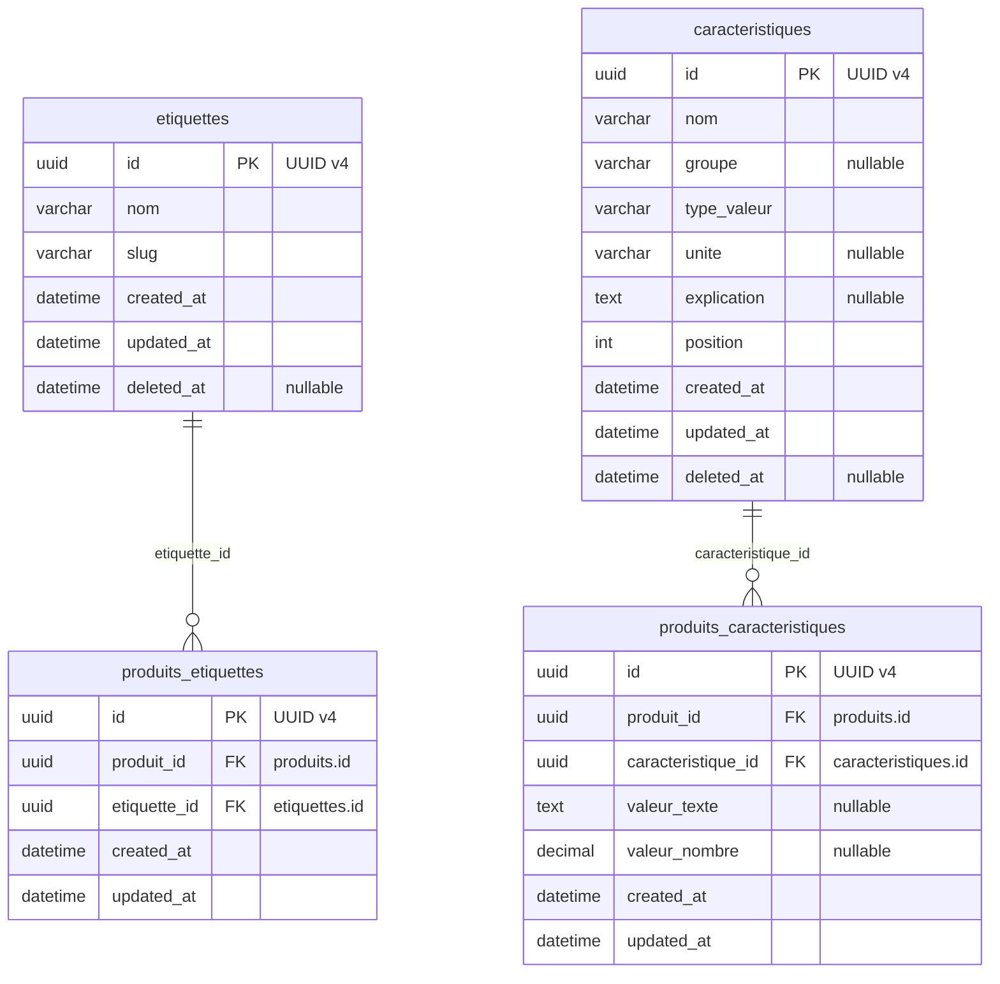
```mermaid
erDiagram
    direction TB
    etiquettes {
        uuid id PK "UUID v4"
        varchar nom
        varchar slug
        datetime created_at
        datetime updated_at
        datetime deleted_at "nullable"
    }
    produits_etiquettes {
        uuid id PK "UUID v4"
        uuid produit_id FK "produits.id"
        uuid etiquette_id FK "etiquettes.id"
        datetime created_at
        datetime updated_at
    }
    caracteristiques {
        uuid id PK "UUID v4"
        varchar nom
        varchar groupe "nullable"
        varchar type_valeur
        varchar unite "nullable"
        text explication "nullable"
        int position
        datetime created_at
        datetime updated_at
        datetime deleted_at "nullable"
    }
    produits_caracteristiques {
        uuid id PK "UUID v4"
        uuid produit_id FK "produits.id"
        uuid caracteristique_id FK "caracteristiques.id"
        text valeur_texte "nullable"
        decimal valeur_nombre "nullable"
        datetime created_at
        datetime updated_at
    }
    etiquettes ||--o{ produits_etiquettes : etiquette_id
    caracteristiques ||--o{ produits_caracteristiques : caracteristique_id
```

Les références vers un autre module sont indiquées sur les champs, même si leur flèche n’est pas redessinée ici.

- **`etiquettes` :** UNIQUE(slug).

- **`produits_etiquettes` :** UNIQUE(produit_id,etiquette_id).

- **`caracteristiques` :** UNIQUE(nom,groupe normalisé). Exemples composition, capacité, dimensions. Permet unités cohérentes et explications, sans créer de variantes inutiles.

- **`produits_caracteristiques` :** UNIQUE(produit_id,caracteristique_id). Une valeur compatible avec le type défini ; contrôler texte/nombre. Les filtres d’options utilisent les tables options/valeurs.

### T5 — Vente et avis

**`pages_vente` — Landing page mono-produit avec URL partageable.**

**`promotions_produits` — Réductions automatiques, sans code promo.**

**`avis_produits` — Avis déposés sans compte et modérés par la boutique.**

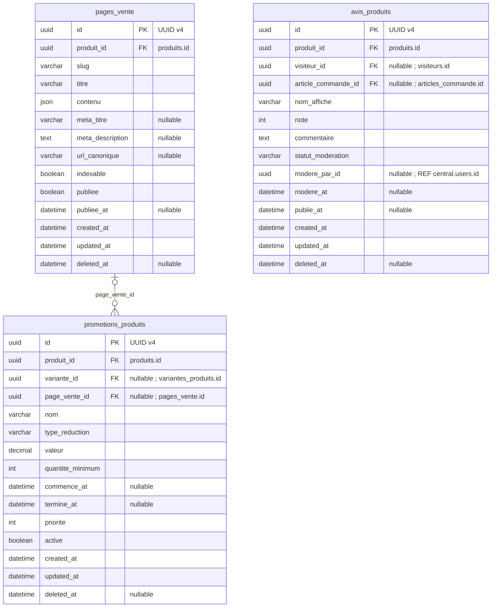
```mermaid
erDiagram
    direction TB
    pages_vente {
        uuid id PK "UUID v4"
        uuid produit_id FK "produits.id"
        varchar slug
        varchar titre
        json contenu
        varchar meta_titre "nullable"
        text meta_description "nullable"
        varchar url_canonique "nullable"
        boolean indexable
        boolean publiee
        datetime publiee_at "nullable"
        datetime created_at
        datetime updated_at
        datetime deleted_at "nullable"
    }
    promotions_produits {
        uuid id PK "UUID v4"
        uuid produit_id FK "produits.id"
        uuid variante_id FK "nullable ; variantes_produits.id"
        uuid page_vente_id FK "nullable ; pages_vente.id"
        varchar nom
        varchar type_reduction
        decimal valeur
        int quantite_minimum
        datetime commence_at "nullable"
        datetime termine_at "nullable"
        int priorite
        boolean active
        datetime created_at
        datetime updated_at
        datetime deleted_at "nullable"
    }
    avis_produits {
        uuid id PK "UUID v4"
        uuid produit_id FK "produits.id"
        uuid visiteur_id FK "nullable ; visiteurs.id"
        uuid article_commande_id FK "nullable ; articles_commande.id"
        varchar nom_affiche
        int note
        text commentaire
        varchar statut_moderation
        uuid modere_par_id "nullable ; REF central.users.id"
        datetime modere_at "nullable"
        datetime publie_at "nullable"
        datetime created_at
        datetime updated_at
        datetime deleted_at "nullable"
    }
    pages_vente |o--o{ promotions_produits : page_vente_id
```

Les références vers un autre module sont indiquées sur les champs, même si leur flèche n’est pas redessinée ici.

- **`pages_vente` :** UNIQUE(slug), UNIQUE(id,produit_id). produit_id immuable dès INSERT ; archiver et créer une page distincte en cas de changement de produit. Plusieurs pages peuvent présenter le même produit. Prix/stock calculés depuis variantes et promotions ; pas de prix indépendant dans le contenu. La page n’est pas une condition obligatoire pour commander. Pas de canonical automatique vers la catégorie.

- **`promotions_produits` :** type=pourcentage|montant_unitaire|prix_unitaire_fixe. Quantité>=1 ; pourcentage entre 0 et 100 ; prix final>=0. Variante et page du même produit. Une promotion maximum par ligne : priorité, puis plus avantageuse, puis UUID pour départager. Ciblage de page contrôlé côté serveur, jamais par une simple valeur libre envoyée par le client.

- **`avis_produits` :** note entière de 1 à 5. statut=en_attente|publie|masque|rejete. Le score public utilise les avis publiés. FK(article_commande_id,produit_id) → articles_commande(id,produit_id). Le label achat vérifié nécessite aussi une preuve d’accès à la commande réellement livrée ; nom et téléphone saisis ne suffisent pas. La FK prouve le produit, pas l’identité de l’auteur de l’avis. Les avis masqués restent auditables.

### T6 — Visiteurs et statistiques

**`visiteurs` — Identifiant pseudonyme d’un navigateur dans cette boutique ; aucun mot de passe.**

**`sessions_visite` — Une visite continue ; un visiteur peut avoir plusieurs sessions.**

**`evenements_navigation` — Événements nécessaires aux vues, paniers et parcours de conversion.**

**`preferences_visiteur` — Préférences de mesure et version du texte présenté, séparées de l’identité panier.**

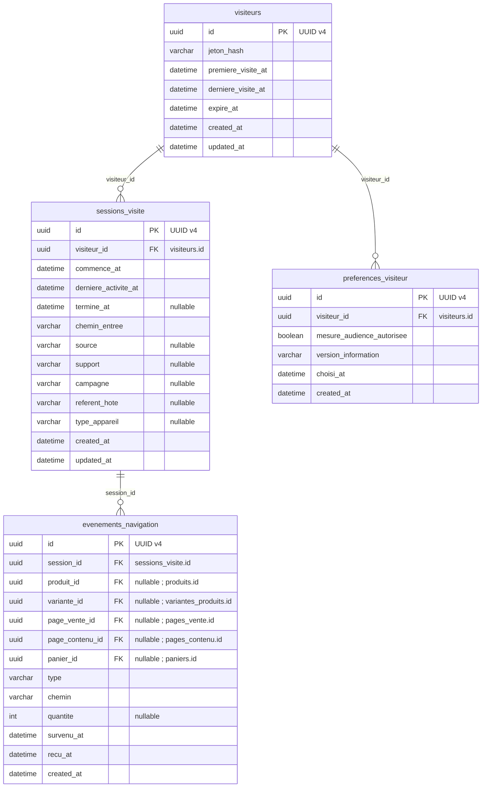
```mermaid
erDiagram
    direction TB
    visiteurs {
        uuid id PK "UUID v4"
        varchar jeton_hash
        datetime premiere_visite_at
        datetime derniere_visite_at
        datetime expire_at
        datetime created_at
        datetime updated_at
    }
    sessions_visite {
        uuid id PK "UUID v4"
        uuid visiteur_id FK "visiteurs.id"
        datetime commence_at
        datetime derniere_activite_at
        datetime termine_at "nullable"
        varchar chemin_entree
        varchar source "nullable"
        varchar support "nullable"
        varchar campagne "nullable"
        varchar referent_hote "nullable"
        varchar type_appareil "nullable"
        datetime created_at
        datetime updated_at
    }
    evenements_navigation {
        uuid id PK "UUID v4"
        uuid session_id FK "sessions_visite.id"
        uuid produit_id FK "nullable ; produits.id"
        uuid variante_id FK "nullable ; variantes_produits.id"
        uuid page_vente_id FK "nullable ; pages_vente.id"
        uuid page_contenu_id FK "nullable ; pages_contenu.id"
        uuid panier_id FK "nullable ; paniers.id"
        varchar type
        varchar chemin
        int quantite "nullable"
        datetime survenu_at
        datetime recu_at
        datetime created_at
    }
    preferences_visiteur {
        uuid id PK "UUID v4"
        uuid visiteur_id FK "visiteurs.id"
        boolean mesure_audience_autorisee
        varchar version_information
        datetime choisi_at
        datetime created_at
    }
    visiteurs ||--o{ sessions_visite : visiteur_id
    sessions_visite ||--o{ evenements_navigation : session_id
    visiteurs ||--o{ preferences_visiteur : visiteur_id
```

Les références vers un autre module sont indiquées sur les champs, même si leur flèche n’est pas redessinée ici.

- **`visiteurs` :** UNIQUE(jeton_hash). Le cookie porte un secret aléatoire opaque distinct du UUID. Aucun identifiant commun entre commerçants. Ni IP ni fingerprint utilisés comme identité fiable.

- **`sessions_visite` :** Index(visiteur_id,commence_at). Proposition : nouvelle session après 30 minutes d’inactivité. Source/support/campagne sont des labels internes facultatifs, sans connecter un réseau social. Ne pas stocker une URL de référence contenant des secrets.

- **`evenements_navigation` :** UUID de l’événement = clé de déduplication. Types page_vue, produit_vu, recherche, ajout_panier, retrait_panier, checkout_commence ; achats/retours proviennent du serveur métier. Valider les références et dates client. Pour une page produit, enregistrer un seul événement produit_vu qui compte aussi comme vue de page.

- **`preferences_visiteur` :** Conserver l’historique des choix. Le panier peut fonctionner sans mesure d’audience. La durée et les conditions de collecte sont à fixer avant mise en ligne ; cette table n’affirme pas une conformité juridique automatique.

### T7 — Panier

**`paniers` — Panier invité conservé côté serveur.**

**`articles_panier` — Lignes de panier avec variante et personnalisation.**

```mermaid
erDiagram
    direction TB
    paniers {
        uuid id PK "UUID v4"
        uuid visiteur_id FK "visiteurs.id"
        varchar statut
        datetime derniere_activite_at
        datetime expire_at
        datetime converti_at "nullable"
        datetime created_at
        datetime updated_at
    }
    articles_panier {
        uuid id PK "UUID v4"
        uuid panier_id FK "paniers.id"
        uuid variante_id FK "variantes_produits.id"
        uuid produit_id FK "produits.id"
        uuid page_vente_id FK "nullable ; pages_vente.id"
        int quantite
        json personnalisation "nullable"
        varchar signature_personnalisation
        datetime created_at
        datetime updated_at
    }
    paniers ||--o{ articles_panier : panier_id
```

Les références vers un autre module sont indiquées sur les champs, même si leur flèche n’est pas redessinée ici.

- **`paniers` :** statut=actif|abandonne|converti|expire. Un panier actif par visiteur. Un panier abandonné peut être réactivé ; un panier converti est figé. Pas de réservation de stock lors d’un simple ajout au panier.

- **`articles_panier` :** UNIQUE(panier_id,variante_id,signature_personnalisation,page_origine_normalisee). Quantité>0. Deux bouquets de même variante avec des messages différents restent deux lignes. Les prix affichés sont recalculés ; aucune confiance dans les prix du navigateur. produit_id NOT NULL ; FK(variante_id,produit_id) → variantes_produits(id,produit_id), FK(page_vente_id,produit_id) → pages_vente(id,produit_id). Une page facultative ne peut donc désigner un autre produit.

### T8 — Commande et versions

**`commandes` — Identité stable et décision commerciale de la commande.**

**`revisions_commandes` — Photographie de la commande à chaque modification : destinataire, frais et totaux.**

**`articles_commande` — Lignes d’une révision ; prix et coût historiques conservés.**

**`historique_commandes` — Journal des décisions, appels, remplacements et changements de champs.**

```mermaid
erDiagram
    direction TB
    commandes {
        uuid id PK "UUID v4"
        varchar numero
        uuid visiteur_id FK "nullable ; visiteurs.id"
        uuid panier_id FK "nullable ; paniers.id"
        uuid accord_collecte_id FK "nullable pour reprise historique documentee ; accords_collecte_donnees.id"
        uuid session_origine_id FK "nullable ; sessions_visite.id"
        uuid page_vente_origine_id FK "nullable ; pages_vente.id"
        uuid retour_origine_id FK "nullable ; retours_commandes.id"
        uuid commande_origine_id FK "nullable ; commandes.id"
        uuid incident_origine_id FK "nullable ; incidents_commande.id"
        int quantite_incident_origine "nullable"
        varchar motif_remplacement "nullable"
        uuid revision_courante_id FK "nullable ; revisions_commandes.id"
        varchar type_commande
        varchar canal
        varchar statut_commercial
        uuid responsable_confirmation_id "nullable ; REF central.users.id"
        datetime confirmation_client_at "nullable avant acceptation"
        varchar confirmation_client_mode "nullable avant acceptation"
        datetime confirme_operationnellement_at "nullable"
        uuid confirme_operationnellement_par_id "nullable ; REF central.users.id"
        datetime annulee_at "nullable"
        varchar cle_soumission
        char(64) empreinte_soumission "SHA-256 hex 64"
        int version_verrou
        boolean gel_conservation
        text motif_gel_conservation "nullable"
        datetime revue_gel_at "nullable"
        datetime created_at
        datetime updated_at
    }
    revisions_commandes {
        uuid id PK "UUID v4"
        uuid commande_id FK "commandes.id"
        int numero_revision
        char(3) devise
        char(2) pays_code
        json vendeur_legal_snapshot
        json fiscalite_livraison_snapshot
        uuid auteur_id "nullable ; REF central.users.id"
        text motif "nullable"
        varchar nom_destinataire
        varchar prenom_destinataire "nullable"
        varchar telephone
        varchar telephone_secondaire "nullable"
        varchar email "nullable"
        text adresse
        uuid wilaya_id "REF central.wilayas.id"
        uuid commune_id "REF central.communes.id"
        varchar wilaya_nom
        varchar commune_nom
        varchar code_postal "nullable"
        varchar(32) mode_livraison
        uuid point_relais_id FK "nullable ; points_relais.id"
        json point_relais_snapshot "nullable"
        decimal sous_total_catalogue
        decimal sous_total_applique
        decimal frais_livraison_client
        decimal remise_livraison
        varchar prise_en_charge_livraison
        decimal montant_livraison_commercant "estimation figee"
        decimal total_commande
        decimal montant_compensation_echange "DEFAULT 0"
        decimal montant_a_encaisser
        uuid regle_gratuite_id FK "nullable ; regles_livraison_gratuite.id"
        text note_client "nullable"
        varchar conditions_vente_version
        json conditions_vente_snapshot
        datetime created_at
    }
    articles_commande {
        uuid id PK "UUID v4"
        uuid revision_id FK "revisions_commandes.id"
        uuid variante_id FK "variantes_produits.id"
        uuid produit_id FK "produits.id"
        uuid promotion_id FK "nullable ; promotions_produits.id"
        uuid page_vente_id FK "nullable ; pages_vente.id"
        varchar nom_produit
        varchar nom_variante
        varchar reference_sku
        json options_snapshot "nullable"
        json personnalisation_snapshot "nullable"
        int quantite
        decimal prix_unitaire_catalogue
        decimal prix_unitaire_applique
        boolean prix_modifie_manuellement
        text motif_modification_prix "nullable"
        varchar origine_prix
        json promotion_snapshot "nullable"
        decimal cout_unitaire_snapshot
        decimal total_ligne
        json fiscalite_snapshot
        datetime created_at
    }
    historique_commandes {
        uuid id PK "UUID v4"
        uuid commande_id FK "commandes.id"
        uuid revision_avant_id FK "nullable ; revisions_commandes.id"
        uuid revision_apres_id FK "nullable ; revisions_commandes.id"
        uuid acteur_id "nullable ; REF central.users.id"
        uuid compte_represente_id "nullable ; REF central.users.id"
        varchar action
        varchar resultat_contact "nullable"
        datetime prochain_rappel_at "nullable"
        varchar ancien_statut "nullable"
        varchar nouveau_statut "nullable"
        json changements "nullable"
        text note "nullable"
        uuid correlation_id
        varchar origine
        datetime created_at
    }
    revisions_commandes |o--o{ commandes : revision_courante_id
    commandes ||--o{ revisions_commandes : commande_id
    revisions_commandes ||--o{ articles_commande : revision_id
    commandes ||--o{ historique_commandes : commande_id
    revisions_commandes |o--o{ historique_commandes : revision_avant_id
    revisions_commandes |o--o{ historique_commandes : revision_apres_id
```

Les références vers un autre module sont indiquées sur les champs, même si leur flèche n’est pas redessinée ici.

- **`commandes` :** UNIQUE(numero), UNIQUE(cle_soumission), UNIQUE(panier_id) hors NULL. type_commande=standard|remplacement|echange ; canal=panier|page_vente|manuel. Standard : commande_origine_id, incident_origine_id, quantite_incident_origine, retour_origine_id et motif_remplacement NULL. Remplacement/échange : origine standard expédiée, incident de cette commande, quantité source >0 et motif obligatoires ; origine différente de soi. Un remplacement traite UN incident d’UNE ligne ; plusieurs lignes incidentées produisent plusieurs commandes de remplacement au MVP. Somme des quantités des lignes destination = quantite_incident_origine. Remplacement gratuit : variante/personnalisation préservées sauf substitution documentée. Échange : nouvelle variante et prix explicitement annoncés et confirmés ; produits/quantités substitués identifiés dans la nouvelle révision, avec compensation affectée selon T22. Les cas automatisés restent un échange d’une quantité donnée pour la même quantité de nouvelles unités ; lots de quantités différentes exigent une évolution explicite. FK(incident_origine_id,commande_origine_id) → incidents_commande(id,commande_id). Si retour_origine_id présent, il correspond à celui de l’incident ; contrôle transactionnel. Les quantités d’un remplacement ou échange non annulé consomment le budget incident dès création, même avant expédition. Annulation avant remise libère ce budget une seule fois ; après remise, il reste consommé. `confirmation_client_at/mode` sont des projections de la première confirmation téléphonique dans contrats_commandes ; le détail des versions acceptées est dans contrats_commandes. Le contrôle opérationnel manuel n’est pas une acceptation du consommateur. revision_courante_id NULL seulement dans la transaction initiale, jamais exposé. Empreinte de soumission immuable ; clé seule non suffisante pour accéder à la commande.

- **`revisions_commandes` :** UNIQUE(commande_id,numero_revision), UNIQUE(id,commande_id), UNIQUE(id,commande_id,mode_livraison), UNIQUE(id,commande_id,point_relais_id). Immuable dès validation de la transaction de création ; chaque changement produit une nouvelle révision. sous_total_catalogue=Σ(quantite×prix_unitaire_catalogue), sous_total_applique=Σ(total_ligne). total_commande=sous_total_applique+frais_livraison_client-remise_livraison ; montant_a_encaisser=total_commande-montant_compensation_echange, avec 0<=montant_compensation_echange<=sous_total_applique ; compensation nulle hors échange (T22). CHECK des montants non négatifs et remise_livraison<=frais_livraison_client. devise, pays_code, vendeur_legal_snapshot et fiscalite_livraison_snapshot sont figés ; un profil brouillon incomplet ne peut être confirmé. Un snapshot fiscal vide ne signifie jamais taxe nulle. frais_livraison_client est le montant demandé avant remise ; montant_livraison_client désigne dans les notes sa valeur nette, calculée ici sans deuxième colonne. prise_en_charge_livraison=client|commercant|livreur|societe_livraison|mixte ; montant_livraison_commercant est une estimation figée, les frais réels sont uniquement dans frais_transporteur. Mode fermé domicile|stop_desk. CHECK((mode_livraison='domicile' AND point_relais_id IS NULL) OR (mode_livraison='stop_desk' AND point_relais_id IS NOT NULL)). Adresse complète à domicile, snapshot bureau obligatoire en stop desk. Pas de portefeuille client ; seule la compensation d’échange affectée de T22 est autorisée ; prix commerciaux TTC, ventilation fiscale de lignes et livraison figée selon T17. conditions_vente_snapshot conserve le texte/blocs et la version réellement présentés ; modification de pages_contenu ne réécrit pas ce snapshot. L’acceptation éventuelle des conditions au checkout est exclusivement dans acceptations_conditions_vente (T21), avec révision/version/date/mode propres. Aucun champ d’acceptation n’est ajouté après création dans cette révision. Une soumission reste a_confirmer jusqu’à l’accord téléphonique documenté dans contrats_commandes. Toute nouvelle révision proposée est une photographie immuable ; les acceptations sont dans contrats_commandes, sans modifier rétroactivement la révision. Les changements de produit, quantité, prix, adresse ou conditions nécessitent un nouvel accord avant envoi ; conserver la réservation du contenu effectivement engagé pendant cette procédure, voir section 8.

- **`articles_commande` :** Quantité>0, prix catalogue/appliqué et coût>=0. total_ligne=ROUND(quantite×prix_unitaire_applique,2). origine_prix=catalogue|promotion|manuel|remplacement. Prix manuel uniquement pour un acteur autorisé, prix_modifie_manuellement=true et motif obligatoire ; une promotion automatique seule ne met pas ce booléen à true. Un prix manuel remplace la promotion, il ne se cumule pas implicitement avec elle. Les snapshots et promotion_snapshot expliquent l’ancien calcul. Sur un remplacement pour incident reconnu, prix_unitaire_applique=0 ; le coût reste réel et le prix catalogue demeure mémorisé. Les lignes sont immuables ; UNIQUE(id,revision_id), UNIQUE(id,variante_id), UNIQUE(id,produit_id). produit_id NOT NULL ; FK(variante_id,produit_id) → variantes_produits(id,produit_id), FK(page_vente_id,produit_id) → pages_vente(id,produit_id). Les modifications ne changent jamais variantes_produits.prix_vente.

- **`historique_commandes` :** Résultats contact : confirme, rappeler, ne_repond_pas, numero_incorrect, annule. Un résultat d’appel n’est pas automatiquement un statut de livraison. Modifications de quantité, variante, prix, adresse et stock reliées par correlation_id. Historique append-only.

### T9 — Stock et retours

**`reservations_stock` — Quantités affectées dès l’acceptation client, puis consommées lors de la remise physique.**

**`mouvements_stock` — Journal des variations physiques, réservations et pertes.**

**`retours_commandes` — Retour de la totalité d’un colis, jamais retour partiel au point de livraison.**

**`articles_retour` — Inspection par article du colis retourné intégralement.**

```mermaid
erDiagram
    direction TB
    reservations_stock {
        uuid id PK "UUID v4"
        uuid article_commande_id FK "articles_commande.id"
        int quantite
        varchar statut
        datetime reserve_at
        datetime libere_at "nullable"
        datetime created_at
        datetime updated_at
    }
    mouvements_stock {
        uuid id PK "UUID v4"
        uuid variante_id FK "variantes_produits.id"
        bigint sequence_variante
        uuid article_commande_id FK "nullable ; articles_commande.id"
        uuid article_retour_id FK "nullable ; articles_retour.id"
        uuid acteur_id "nullable ; REF central.users.id"
        varchar type
        int delta_physique
        int delta_reserve
        int delta_quarantaine
        int delta_recu_retour
        int delta_remis_retour
        int delta_perdu_retour
        int delta_manquant_retour "NOT NULL DEFAULT 0"
        int physique_avant
        int physique_apres
        int reserve_avant
        int reserve_apres
        int quarantaine_avant
        int quarantaine_apres
        decimal cout_unitaire_snapshot
        decimal montant_perte
        uuid contrepassation_de_id FK "nullable ; mouvements_stock.id"
        varchar cle_operation
        uuid correlation_id
        text note "nullable"
        datetime created_at
    }
    retours_commandes {
        uuid id PK "UUID v4"
        uuid livraison_id FK "livraisons.id"
        uuid commande_id FK "commandes.id"
        uuid revision_expediee_id FK "revisions_commandes.id"
        varchar raison
        text detail "nullable"
        varchar statut
        datetime demande_at "nullable"
        datetime recu_at "nullable"
        uuid recu_par_id "nullable ; REF central.users.id"
        datetime clos_at "nullable"
        datetime created_at
        datetime updated_at
    }
    articles_retour {
        uuid id PK "UUID v4"
        uuid retour_id FK "retours_commandes.id"
        uuid article_commande_id FK "articles_commande.id"
        uuid revision_expediee_id FK "revisions_commandes.id"
        uuid variante_id FK "variantes_produits.id"
        int quantite_attendue
        int quantite_recue
        int quantite_remise_stock
        int quantite_perdue
        int quantite_en_quarantaine
        int quantite_manquante_documentee
        text motif_ecart "nullable"
        decimal cout_unitaire_snapshot
        uuid inspecte_par_id "nullable ; REF central.users.id"
        datetime inspecte_at "nullable"
        text note "nullable"
        datetime created_at
        datetime updated_at
    }
    articles_retour |o--o{ mouvements_stock : article_retour_id
    mouvements_stock |o--o{ mouvements_stock : contrepassation_de_id
    retours_commandes ||--o{ articles_retour : retour_id
```

Les références vers un autre module sont indiquées sur les champs, même si leur flèche n’est pas redessinée ici.

- **`reservations_stock` :** UNIQUE(article_commande_id). Statut=active|liberee|consommee ; quantité>0 égale à celle de la ligne lorsqu’active. Réserver à confirmation TÉLÉPHONIQUE atomique ; le contrôle opérationnel ne réserve rien de plus. Pour un remplacement gratuit accepté, réserver également sans survente ; une révision remplacée libère ses réservations et la nouvelle réserve dans la même transaction. Chaque variante est verrouillée dans un ordre stable. Somme des réservations actives par variante = stock_reserve. La remise physique consomme les réservations ; une commande annulée avant remise les libère.

- **`mouvements_stock` :** UNIQUE(variante_id,sequence_variante), séquence allouée sous verrou de la variante et strictement croissante ; UNIQUE(cle_operation), UNIQUE(contrepassation_de_id). Journal append-only, même transaction que compteurs, réservations et inspection. physique_apres=physique_avant+delta_physique ; mêmes égalités pour réservé et quarantaine. Tous les soldes après>=0. Types : ouverture, entree_manuelle, reservation, liberation, expedition, entree_quarantaine, quarantaine_vers_vendable, quarantaine_vers_perte, perte_stock, manquant_retour_constate, contrepassation. Une réception de retour entre d’abord en quarantaine : delta_recu_retour=+q, delta_quarantaine=+q ; disposition vendable : delta_remis_retour=+q, delta_quarantaine=-q, delta_physique=+q ; perte : delta_perdu_retour=+q, delta_quarantaine=-q, montant_perte=coût×q. Manquant constaté q : delta_manquant_retour=+q, delta_physique=delta_reserve=delta_quarantaine=0, montant_perte=q×cout_unitaire_snapshot ; article_retour_id obligatoire et autres deltas retour=0. La perte de gestion est constatée ici une seule fois ; responsabilité, indemnisation, avoir et remboursement restent des décisions séparées. Correction par inverse exact (-q et montant inverse), jamais UPDATE du mouvement. Les autres deltas de retour valent zéro. Toute réception/disposition est liée à article_retour_id et à sa variante. La quarantaine initiale hors retour est représentée par ouverture ; sa libération hors retour utilise les mêmes deltas physiques/quarantaine sans deltas de retour. Une contrepassation inverse tous les deltas et montant_perte, conserve les mêmes références et verrouille l’original ; interdiction de contrepasser une contrepassation. Refuser l’inverse si les soldes ou le cycle métier ne le permettent plus. Une correction crée ensuite un nouveau mouvement lié par correlation_id.

- **`retours_commandes` :** UNIQUE(livraison_id), UNIQUE(id,revision_expediee_id), UNIQUE(id,commande_id), UNIQUE(id,livraison_id). Statuts demande|en_transit|recu|en_inspection|clos. FK(livraison_id,commande_id,revision_expediee_id) → livraisons(id,commande_id,revision_expediee_id). Le retour complet conserve toutes les lignes et quantités expédiées ; création atomique sous verrou de livraison. recu_at exige une réception locale et ne vient pas d’un simple statut distant. La clôture de réception peut laisser une quarantaine suivie ultérieurement ; la libération reste journalisée.

- **`articles_retour` :** UNIQUE(retour_id,article_commande_id), UNIQUE(id,variante_id). FK(retour_id,revision_expediee_id) → retours_commandes(id,revision_expediee_id), FK(article_commande_id,revision_expediee_id) → articles_commande(id,revision_id), FK(article_commande_id,variante_id) → articles_commande(id,variante_id). quantite_attendue égale à la quantité de la ligne expédiée ; validation sous verrou. Tous les compteurs>=0 ; CHECK(recue<=attendue), CHECK(remise_stock+perdue+en_quarantaine=recue), CHECK(recue+manquante_documentee<=attendue). À clôture : recue+manquante_documentee=attendue et motif_ecart obligatoire si manquant. Les quantités reçues, vendables, perdues, en quarantaine et manquantes sont matérialisées depuis les mouvements ; quantite_manquante_documentee=Σdelta_manquant_retour ; toute réception est d’abord mise en quarantaine, donc aucun écart indéterminé ne masque des unités reçues. Les manquants ne sont pas des unités reçues et ne sont jamais ajoutés au stock.

### T10 — Livraison et prix

**`prestataires_livraison` — Livreurs internes et sociétés de livraison, avec un même modèle de reversement.**

**`tarifs_livraison_client` — Ce que la boutique facture au client, séparé du coût du transporteur.**

**`tarifs_prestataires` — Estimation locale du service selon zone/mode ; hors tarif de retour des comptes société.**

**`regles_livraison_gratuite` — Exceptions automatiques de livraison offerte.**

```mermaid
erDiagram
    direction TB
    prestataires_livraison {
        uuid id PK "UUID v4"
        varchar type
        varchar nom
        uuid user_id "nullable ; REF central.users.id"
        varchar telephone "nullable"
        varchar email "nullable"
        varchar code_transporteur "nullable"
        uuid compte_livraison_id "nullable ; REF central.comptes_livraison.id"
        datetime derniere_sync_at "nullable"
        boolean actif
        datetime created_at
        datetime updated_at
        datetime deleted_at "nullable"
    }
    tarifs_livraison_client {
        uuid id PK "UUID v4"
        uuid wilaya_id "REF central.wilayas.id"
        uuid commune_id "nullable ; REF central.communes.id"
        varchar(32) mode_livraison
        decimal montant
        boolean active
        datetime created_at
        datetime updated_at
        datetime deleted_at "nullable"
    }
    tarifs_prestataires {
        uuid id PK "UUID v4"
        uuid prestataire_id FK "prestataires_livraison.id"
        uuid wilaya_id "REF central.wilayas.id"
        uuid commune_id "nullable ; REF central.communes.id"
        varchar(32) mode_livraison
        varchar(32) type_prestation
        decimal montant
        varchar source
        datetime releve_at
        boolean active
        datetime created_at
        datetime updated_at
        datetime deleted_at "nullable"
    }
    regles_livraison_gratuite {
        uuid id PK "UUID v4"
        varchar nom
        uuid produit_id FK "nullable ; produits.id"
        uuid wilaya_id "nullable ; REF central.wilayas.id"
        varchar mode_livraison "nullable"
        decimal montant_panier_minimum "nullable"
        datetime commence_at "nullable"
        datetime termine_at "nullable"
        int priorite
        boolean active
        datetime created_at
        datetime updated_at
        datetime deleted_at "nullable"
    }
    prestataires_livraison ||--o{ tarifs_prestataires : prestataire_id
```

Les références vers un autre module sont indiquées sur les champs, même si leur flèche n’est pas redessinée ici.

- **`prestataires_livraison` :** type=livreur_interne|societe. Société : compte_livraison_id obligatoire, compte central autorisé pour le tenant ; UNIQUE(compte_livraison_id) hors NULL. Interne : compte NULL, user_id facultatif mais membre actif autorisé si connecté. Les secrets et URL API sont uniquement au central. Le rattachement au compte devient immuable dès utilisation ; créer un autre prestataire pour changer de compte. Désactivation sans suppression historique.

- **`tarifs_livraison_client` :** UNIQUE(wilaya_id,commune_normalisee,mode_livraison). Tarif commune prioritaire puis wilaya. Tarif absent = livraison indisponible, pas gratuite. Vérifier toutes les quantités et afficher le total avant soumission.

- **`tarifs_prestataires` :** Devis/cache local pour livraison, seconde_tentative ou remplacement, selon zone et mode ; le tarif de retour provient exclusivement de central.tarifs_transporteur. Montant>=0, source=manuel|api ; UNIQUE(prestataire_id,wilaya_id,commune_normalisee,mode_livraison,type_prestation). Aucune valeur importée ne devient automatiquement une dette du commerçant : la répartition des payeurs est explicite. L’historique financier est figé dans frais_transporteur, pas recalculé depuis ce cache. Pour un livreur interne, les frais de retour suivent un accord saisi et figé manuellement.

- **`regles_livraison_gratuite` :** Règle simple : si tous les critères renseignés sont remplis, la livraison de la commande entière est offerte. produit_id signifie présence de ce produit. Pas d’addition de frais par ligne : un colis unique. La gratuité client ne supprime jamais le coût réel du prestataire.

### T11 — Transporteur et colis

**`correspondances_geo_transporteur` — Correspondance entre géographie interne et codes/libellés du transporteur.**

**`points_relais` — Bureaux/stop desks disponibles chez un transporteur.**

**`livraisons` — Un seul colis regroupant tous les articles d’une commande.**

**`evenements_livraison` — Événements normalisés et statuts bruts conservés.**

```mermaid
erDiagram
    direction TB
    correspondances_geo_transporteur {
        uuid id PK "UUID v4"
        uuid prestataire_id FK "prestataires_livraison.id"
        varchar(16) type_zone
        uuid wilaya_id "REF central.wilayas.id"
        uuid commune_id "nullable ; REF central.communes.id"
        varchar code_externe
        varchar nom_externe
        varchar code_wilaya_externe
        varchar source_verification
        datetime verifie_at "nullable"
        varchar version_mapping
        boolean active
        datetime synchronise_at
        datetime created_at
        datetime updated_at
    }
    points_relais {
        uuid id PK "UUID v4"
        uuid prestataire_id FK "prestataires_livraison.id"
        varchar code_externe
        varchar nom
        uuid wilaya_id "REF central.wilayas.id"
        uuid commune_id "nullable ; REF central.communes.id"
        text adresse
        varchar telephone "nullable"
        varchar url_carte "nullable"
        boolean actif_transporteur
        boolean active_boutique
        datetime synchronise_at
        datetime created_at
        datetime updated_at
        datetime deleted_at "nullable"
    }
    livraisons {
        uuid id PK "UUID v4"
        uuid commande_id FK "commandes.id"
        uuid revision_expediee_id FK "revisions_commandes.id"
        uuid prestataire_id FK "prestataires_livraison.id"
        uuid registre_colis_id "nullable ; REF central.registre_colis_transporteur.id"
        uuid point_relais_id FK "nullable ; points_relais.id"
        varchar(32) mode_livraison
        varchar statut
        varchar statut_externe_brut "nullable"
        varchar tracking "nullable"
        varchar reference_externe "nullable"
        decimal montant_cod
        decimal cout_estime
        decimal poids_kg "nullable"
        boolean fragile
        uuid etiquete_media_id FK "nullable ; medias.id"
        uuid affectee_par_id "REF central.users.id"
        datetime expediee_at "nullable"
        datetime validee_transporteur_at "nullable"
        datetime accuse_reception_at "nullable"
        varchar accuse_reception_source "nullable"
        uuid preuve_reception_media_id FK "nullable ; medias.id"
        varchar preuve_reception_reference_externe "nullable"
        char(64) empreinte_preuve "nullable"
        datetime livree_at "nullable"
        datetime derniere_sync_at "nullable"
        datetime created_at
        datetime updated_at
    }
    evenements_livraison {
        uuid id PK "UUID v4"
        uuid livraison_id FK "livraisons.id"
        varchar statut_logistique "nullable"
        varchar statut_financier "nullable"
        varchar code_externe "nullable"
        varchar type_evenement
        varchar activity_externe_brute "nullable"
        varchar statut_externe_brut "nullable"
        varchar version_adaptateur
        json payload_externe_filtre "nullable"
        char(64) empreinte_payload
        datetime payload_expire_at "nullable"
        datetime payload_purge_at "nullable"
        text motif "nullable"
        text commentaire "nullable"
        varchar station "nullable"
        varchar livreur_libelle "nullable"
        datetime prochain_passage_at "nullable"
        datetime survenu_at "nullable"
        datetime observe_at
        varchar source
        uuid acteur_id "nullable ; REF central.users.id"
        varchar cle_deduplication
        datetime created_at
    }
    points_relais |o--o{ livraisons : point_relais_id
    livraisons ||--o{ evenements_livraison : livraison_id
```

Les références vers un autre module sont indiquées sur les champs, même si leur flèche n’est pas redessinée ici.

- **`correspondances_geo_transporteur` :** type_zone=wilaya|commune ; commune_id obligatoire pour commune, NULL pour wilaya. UNIQUE(prestataire_id,type_zone,wilaya_id,commune_normalisee). code_externe désigne le code de la zone ; code_wilaya_externe donne son contexte externe, obligatoire même pour une commune. Plusieurs zones internes peuvent correspondre à une ancienne zone externe : pas de UNIQUE global sur code_externe. Mapping actif et vérifié requis à l’envoi ; sinon livraison indisponible pour cette route. Vérifier wilaya/commune/desk via le compte réel, ne pas inventer de conversion automatique. Ne pas envoyer un UUID local comme code_wilaya Ecotrack.

- **`points_relais` :** UNIQUE(prestataire_id,code_externe). Une resynchronisation ne réactive pas un bureau masqué par le commerçant. Disponibilité = active des deux côtés. Conserver les bureaux historiques en désactivation, sans casser les commandes.

- **`livraisons` :** UNIQUE(registre_colis_id) hors NULL, UNIQUE(commande_id), UNIQUE(prestataire_id,tracking) hors NULL, UNIQUE(id,commande_id,revision_expediee_id), UNIQUE(id,commande_id), UNIQUE(id,prestataire_id). FK(revision_expediee_id,commande_id) → revisions_commandes(id,commande_id). Tous les articles partent ensemble. CHECK de mode/point identique à celui des révisions. FK(revision_expediee_id,commande_id,mode_livraison) → revisions_commandes(id,commande_id,mode_livraison) ET FK(revision_expediee_id,commande_id,point_relais_id) → revisions_commandes(id,commande_id,point_relais_id). La première FK, avec mode NOT NULL, évite de contourner la seconde en envoyant NULL à la place d’un stop desk ; pour stop_desk la seconde impose le point exact. [S13] Avant remise, modifier la révision uniquement après synchronisation/rapprochement des opérations distantes ; dès validee_transporteur_at OU expediee_at, révision, contenu et COD immuables. Une validation API fige le contenu mais ne prouve pas une remise physique et ne sort pas le stock. Le COD est revisions_commandes.montant_a_encaisser de la révision expédiée et peut être zéro ; jamais recalculé depuis une facture ou un tarif actuel. FK(point_relais_id,prestataire_id) → points_relais(id,prestataire_id). Registre central obligatoire pour société dès allocation d’une référence externe, contrôlé via service central. Les frais réels sont dans frais_transporteur. Vérifier registre.tenant_id=tenant courant ET registre.livraison_id=livraisons.id. Les champs accuse_reception et preuve_reception sont indépendants de livree_at ; étiquette et statut distant ne sont pas des signatures client. Média privé et empreinte des octets si fichier disponible ; référence externe accompagnée de sa source. Remise de la copie client tracée par transmissions_documents. Une preuve inconnue reste NULL avec anomalie visible, jamais fabriquée. Un retour empêche tout changement de la révision liée par ses FK. Après création distante réussie (même avant remise physique), prestataire_id et compte associé ne peuvent plus changer au MVP ; l’API et le service bloquent ce changement, renforcé par trigger sur la livraison à partir du résultat durable. Toute opération en cours/incertaine bloque également une réaffectation.

- **`evenements_livraison` :** UNIQUE(cle_deduplication) incluant compte/prestataire et tracking dans le calcul. Journal de faits append-only ; seule purge autorisée du payload diagnostic selon C11, sans réécrire les événements. Empreinte et version d’adaptateur conservées. Source=manuel|polling. Conserver les inconnus pour diagnostic, sans deviner leur sens. Les événements anciens n’écrasent pas aveuglément l’état courant.

### T12 — Intégration Ecotrack

**`operations_transporteur` — File durable des opérations à envoyer au transporteur.**

**`tentatives_operations_transporteur` — Trace de chaque tentative HTTP et de son résultat.**

```mermaid
erDiagram
    direction TB
    operations_transporteur {
        uuid id PK "UUID v4"
        uuid prestataire_id FK "prestataires_livraison.id"
        uuid livraison_id FK "nullable ; livraisons.id"
        uuid commande_id FK "nullable ; commandes.id"
        uuid retour_id FK "nullable ; retours_commandes.id"
        varchar type
        uuid revision_id FK "nullable ; revisions_commandes.id"
        varchar cle_operation
        json requete_sans_secrets "metadonnees techniques uniquement"
        text requete_personnelle_chiffree "nullable apres purge ou sans donnees personnelles"
        char(64) empreinte_requete
        datetime requete_expire_at "nullable si aucun payload personnel"
        datetime requete_purge_at "nullable"
        varchar reference_marchand "nullable hors colis"
        varchar version_adaptateur
        json resultat_technique "nullable ; sans donnees personnelles"
        varchar statut
        int nombre_tentatives
        datetime prochaine_tentative_at "nullable"
        datetime terminee_at "nullable"
        datetime envoi_commence_at "nullable"
        datetime supersedee_at "nullable"
        uuid supersedee_par_operation_id FK "nullable ; operations_transporteur.id"
        uuid declenche_par_id "nullable ; REF central.users.id"
        datetime created_at
        datetime updated_at
    }
    tentatives_operations_transporteur {
        uuid id PK "UUID v4"
        uuid operation_id FK "operations_transporteur.id"
        int numero_tentative
        int code_http "nullable"
        json reponse_filtre "nullable"
        datetime payload_expire_at "nullable"
        datetime payload_purge_at "nullable"
        varchar erreur_code "nullable"
        int duree_ms
        datetime commence_at
        datetime termine_at "nullable"
        datetime created_at
    }
    operations_transporteur ||--o{ tentatives_operations_transporteur : operation_id
```

Les références vers un autre module sont indiquées sur les champs, même si leur flèche n’est pas redessinée ici.

- **`operations_transporteur` :** UNIQUE(cle_operation). Types create_order, valid_order, update_order, suivi, fees, geographie, label, ask_return, valid_returns, note. Statuts en_attente|en_cours|reussie|echec_reessayable|echec_definitif|resultat_incertain|supersedee. Toute opération de colis exige livraison_id, commande_id et revision_id cohérents ; fees/geographie sont les seules opérations sans commande. FK(revision_id,commande_id) → revisions_commandes(id,commande_id), FK(livraison_id,commande_id) → livraisons(id,commande_id) ; contrôle prestataire et retour sous verrou. Pour les mutations avant expédition, vérifier la révision courante au démarrage ; sinon supersedee sans envoi. Suivi/retour/étiquette après remise ciblent la révision expédiée immuable. envoi_commence_at est persisté avant l’appel HTTP ; les modifications de commande sont alors bloquées jusqu’au résultat certain ou rapprochement. Un timeout ambigu, connexion interrompue, 502/503/504 après effet possible, réponse non interprétable, crash après envoi ou après réception avant COMMIT imposent resultat_incertain, jamais une création aveugle. Les retries automatiques HTTP/proxy des mutations sont désactivés tant que leur sûreté n’est pas démontrée. supersedee_par_operation_id facultatif, rempli si une opération de remplacement existe. L’intention et le résultat technique sont durables ; appel HTTP hors transaction longue. Empreinte SHA-256 du format canonique versionné de la requête initiale ; même cle_operation avec autre empreinte → conflit. reference_marchand stable et égale au registre central pour un colis. Les coordonnées nécessaires à une reprise sont dans requete_personnelle_chiffree, jamais en JSON clair ; chiffrer avant persistance, isoler les clés et fixer requete_expire_at. Après expiration, effacer ce seul payload via processus de rétention et dater requete_purge_at ; conserver clé, référence, empreinte, résultat minimisé, dates et version_adaptateur. Une opération incertaine reste incertaine après purge ; ne jamais reconstruire et renvoyer aveuglément les données personnelles depuis une révision actuelle.

- **`tentatives_operations_transporteur` :** UNIQUE(operation_id,numero_tentative). Conserver les réponses filtrées et erreurs utiles sans secrets ni données personnelles inutiles. Rétention courte des payloads de diagnostic selon C11 ; conserver seulement les faits métier et références nécessaires. Les corps bruts ne sont pas conservés par défaut ; retirer secrets et données personnelles inutiles avant toute persistance. Après achèvement, les faits et résultats sont append-only ; seule la charge de diagnostic éligible peut être purgée par le processus dédié avec payload_purge_at.

### T13 — Argent et reversements

**`recouvrements` — État de l’argent d’un colis, distinct de sa livraison et de sa confirmation.**

**`bordereaux_reversement` — Règlement local ventilé entre recettes produits, frais commerçant et indemnisations.**

**`lignes_reversement` — Ventilation d’un bordereau par colis, pour éviter les doubles reversements.**

```mermaid
erDiagram
    direction TB
    recouvrements {
        uuid id PK "UUID v4"
        uuid livraison_id FK "livraisons.id"
        varchar statut_declare
        decimal montant_attendu
        decimal montant_encaisse_declare "nullable"
        datetime encaisse_at "nullable"
        datetime paiement_pret_at "nullable"
        datetime paye_declare_at "nullable"
        varchar source
        datetime rapproche_at "nullable"
        datetime created_at
        datetime updated_at
    }
    bordereaux_reversement {
        uuid id PK "UUID v4"
        uuid prestataire_id FK "prestataires_livraison.id"
        varchar numero
        varchar reference_externe "nullable"
        varchar type
        varchar statut
        decimal montant_brut
        decimal montant_frais
        decimal montant_net_attendu
        decimal montant_net_recu "nullable"
        datetime declare_at "nullable"
        datetime recu_at "nullable"
        uuid valide_par_id "nullable ; REF central.users.id"
        uuid preuve_media_id FK "nullable ; medias.id"
        text note "nullable"
        varchar cle_operation
        uuid part_centrale_id "nullable ; REF central.parts_reversement_tenants.id"
        uuid contrepassation_de_id FK "nullable ; bordereaux_reversement.id"
        datetime rapproche_at "nullable"
        datetime created_at
        datetime updated_at
    }
    lignes_reversement {
        uuid id PK "UUID v4"
        uuid bordereau_id FK "bordereaux_reversement.id"
        uuid recouvrement_id FK "recouvrements.id"
        decimal montant_restitue "signe"
        uuid contrepassation_de_id FK "nullable ; lignes_reversement.id"
        uuid correction_de_id FK "nullable ; lignes_reversement.id"
        varchar cle_operation
        datetime created_at
    }
    bordereaux_reversement ||--o{ lignes_reversement : bordereau_id
    recouvrements ||--o{ lignes_reversement : recouvrement_id
```

Les références vers un autre module sont indiquées sur les champs, même si leur flèche n’est pas redessinée ici.

- **`recouvrements` :** UNIQUE(livraison_id). montant_attendu=COD figé, montant_encaisse_declare reste une observation transporteur, jamais une preuve de paiement. L’encaissement vérifié est la somme des ecritures_encaissement validées ; aucun compteur modifiable concurrent. Statuts en_attente_livraison|livre_non_encaisse|encaisse_non_paye|paiements_prets|paye_et_archive|sans_encaissement. Les dates et états distants ne prouvent pas la réception de fonds par le commerçant.

- **`bordereaux_reversement` :** UNIQUE(prestataire_id,numero), UNIQUE(cle_operation), UNIQUE(part_centrale_id) hors NULL, UNIQUE(contrepassation_de_id) hors NULL. type=reversement|reglement_net|paiement_frais|indemnisation|correction. Statut=brouillon|pret|recu|rapproche|annule. montant_brut=Σ lignes_reversement.montant_restitue + Σ indemnisations_transporteur.montant ; montant_frais=Σ reglements_frais_transporteur.montant ; net_attendu=brut-frais. Net signé : positif reçu, négatif payé. Rapprochement seulement après vérification du net réel, de tous les plafonds et de la preuve. Une fois rapproché, montants/lignes immuables. Annulation simple autorisée uniquement avant rapprochement ; après, bordereau compensatoire et lignes inverses, original conservé rapproché. Les brouillons annulés et leurs lignes ne participent à aucune somme. La référence d’un lot société partagé est gérée au central, pas supposée unique dans une seule boutique.

- **`lignes_reversement` :** UNIQUE(cle_operation), UNIQUE(contrepassation_de_id) hors NULL ; index(recouvrement_id). Plusieurs allocations autorisées, chacune identifiée. Montant>0 sauf contrepassation exacte négative ; correction_de_id relie la nouvelle écriture positive à l’ancienne. Même prestataire que le recouvrement/livraison, contrôle transactionnel. Σ des montants sur bordereaux rapprochés doit rester entre 0 et le montant reversable du colis. Une ligne ne règle aucun frais et ne crée aucune charge : les frais ont leurs propres allocations vers frais_transporteur.

### T14 — Coûts, remboursements et documents

**`depenses` — Coûts réels hors frais transporteur et pertes de stock : publicité, emballage et frais généraux.**

**`regularisations_clients` — Remboursements réels, sans portefeuille ni crédit client.**

**`bons_commande` — Bon de commande facultatif, figé sur une révision précise.**

```mermaid
erDiagram
    direction TB
    depenses {
        uuid id PK "UUID v4"
        uuid produit_id FK "nullable ; produits.id"
        uuid commande_id FK "nullable ; commandes.id"
        uuid livraison_id FK "nullable ; livraisons.id"
        uuid retour_id FK "nullable ; retours_commandes.id"
        varchar categorie
        varchar libelle
        decimal montant
        datetime date_depense
        varchar statut
        uuid preuve_media_id FK "nullable ; medias.id"
        uuid auteur_id "REF central.users.id"
        varchar source
        varchar cle_operation
        uuid contrepassation_de_id FK "nullable ; depenses.id"
        uuid correction_de_id FK "nullable ; depenses.id"
        datetime annulee_at "nullable"
        text note "nullable"
        datetime created_at
        datetime updated_at
    }
    regularisations_clients {
        uuid id PK "UUID v4"
        uuid commande_id FK "commandes.id"
        uuid retour_id FK "nullable ; retours_commandes.id"
        uuid incident_id FK "incidents_commande.id"
        uuid avoir_id FK "nullable ; factures.id type avoir"
        uuid commande_echange_id FK "nullable ; commandes.id"
        int quantite_compensee
        varchar nature_montant
        varchar type
        decimal montant "signe"
        varchar statut
        datetime effectue_at "nullable"
        uuid valide_par_id "nullable ; REF central.users.id"
        varchar reference "nullable"
        uuid preuve_media_id FK "nullable ; medias.id"
        text motif
        varchar cle_operation
        uuid contrepassation_de_id FK "nullable ; regularisations_clients.id"
        uuid correction_de_id FK "nullable ; regularisations_clients.id"
        datetime created_at
        datetime updated_at
    }
    bons_commande {
        uuid id PK "UUID v4"
        uuid commande_id FK "commandes.id"
        uuid revision_id FK "revisions_commandes.id"
        varchar numero
        int version_document
        json emetteur_snapshot
        uuid media_id FK "medias.id"
        uuid genere_par_id "REF central.users.id"
        datetime genere_at
        datetime created_at
    }
```

Les références vers un autre module sont indiquées sur les champs, même si leur flèche n’est pas redessinée ici.

- **`depenses` :** UNIQUE(cle_operation), UNIQUE(contrepassation_de_id) hors NULL. statut=brouillon|constatee|annulee. Montant positif ordinaire, négatif uniquement pour une contrepassation exacte ; les dépenses constatées restent immuables. Corriger 650 en 600 par +650, -650, +600 avec liens de contrepassation/correction ; ne pas exclure l’original de la somme en plus de son inverse. Annulation simple uniquement en brouillon. Frais transporteur interdits ici (source unique frais_transporteur) ; pertes uniquement dans mouvements_stock. Les dimensions simultanées doivent être cohérentes ; FK composites livraison/commande et retour/commande, avec commande_id obligatoire si l’une est renseignée. Une dépense produit/période n’est imputée qu’une fois.

- **`regularisations_clients` :** UNIQUE(cle_operation), UNIQUE(contrepassation_de_id) hors NULL. type=remboursement_especes|remboursement_virement|contrepassation ; statut=brouillon|effectue|annule. incident_id obligatoire ; FK(incident_id,commande_id) → incidents_commande(id,commande_id). nature_montant=produit|livraison|difference_echange. Différence d’échange : quantite_compensee=0, commande_echange_id obligatoire et avoir_id obligatoire ; plafonds monétaires de T22 sans seconde compensation de quantité. Produit : quantite_compensee>0 ordinaire, inverse exact négatif en contrepassation ; frais livraison : quantite_compensee=0, montant suivi dans son plafond distinct. Même unité non compensable par remboursement ET remplacement ; voir T18. Un brouillon positif réserve déjà sa quantité et son montant. Un inverse en brouillon ne libère aucun droit ; seule sa validation fait diminuer le consommé. Aucun crédit librement dépensable ; l’affectation précise d’un avoir à une commande d’échange relève uniquement de T22. Retour facultatif pour un geste après incident ; FK(retour_id,commande_id) → retours_commandes(id,commande_id). FK(avoir_id,commande_id) → factures(id,commande_id) ; si avoir_id renseigné, exiger type avoir émis et mêmes lignes/incident. Une restitution corrigeant une vente déjà facturée lie l’avoir autorisé, sans le considérer comme preuve de paiement. Un remboursement effectué nécessite un encaissement vérifié et une décision autorisée, motif et preuve ; somme nette des remboursements effectifs <= montant éligible réellement payé (plafonné par l’encaissement vérifié). Validation sous verrou des commandes concernées par UUID, puis incident et parents financiers, dans l’ordre commun décrit en section 8. Les frais remboursés sont imputés au plafond livraison de la commande entière, pas une fois par incident. Le retour éventuel correspond à celui de l’incident. Après effectue, correction par inverse puis nouvelle écriture, sans modifier l’original. Un remplacement gratuit n’autorise pas automatiquement un remboursement supplémentaire.

- **`bons_commande` :** UNIQUE(numero,version_document). FK(revision_id,commande_id) → revisions_commandes(id,commande_id). PDF privé et immuable, conservant coordonnées, lignes et totaux. Une nouvelle révision produit une nouvelle version ; média non écrasable. Bon et facture sont deux documents différents.

### T15 — Audit et évolution ciblée

**`journal_audit` — Audit transversal de catalogue, stock, avis, contenus et finances.**

**`personnalisations_theme` — ÉVOLUTION : présentation personnalisée autorisée par abonnement ou essai.**

```mermaid
erDiagram
    direction TB
    journal_audit {
        uuid id PK "UUID v4"
        uuid acteur_id "nullable ; REF central.users.id"
        uuid compte_represente_id "nullable ; REF central.users.id"
        varchar action
        varchar cible_type
        uuid cible_id "nullable"
        json avant "nullable"
        json apres "nullable"
        uuid correlation_id
        varchar origine
        datetime created_at
    }
    personnalisations_theme {
        uuid id PK "UUID v4"
        varchar code_theme
        int version
        json configuration
        text css_filtre "nullable"
        varchar statut
        datetime publie_at "nullable"
        uuid auteur_id "REF central.users.id"
        datetime created_at
        datetime updated_at
        datetime deleted_at "nullable"
    }
```

Les références vers un autre module sont indiquées sur les champs, même si leur flèche n’est pas redessinée ici.

- **`journal_audit` :** Append-only métier. Allowlist de champs par action ; jamais Model::toArray() générique. Pour commandes.adresse_modifiee, enregistrer commande_id, revision_avant_id, revision_apres_id, acteur_id : pas une nouvelle copie de l’adresse/téléphone. Exclure password/hash, OTP, Bearer, Authorization, cookie, clés et tokens API. Même règle sur historique_commandes.changements/notes, logs HTTP, exceptions et journal central. Texte libre limité et filtré ; politiques de rétention appliquées par le processus privilégié décrit en section 12. Cible polymorphe logique, jamais FK fictive. Les événements détaillés de commandes restent dans historique_commandes. Le root peut intervenir mais pas effacer ses traces métier.

- **`personnalisations_theme` :** Pas nécessaire au MVP : un seul template et les champs de boutique suffisent. CSS limité à des propriétés/sélecteurs autorisés, sans JavaScript, réseau arbitraire ni masquage des informations de checkout. Aucun code serveur stocké. L’expiration de l’essai revient au template standard sans supprimer les commandes.


### T16 — Frais transporteur et preuve d’encaissement

```mermaid
erDiagram
    direction TB
    frais_transporteur {
        uuid id PK
        uuid livraison_id FK "livraisons.id"
        uuid prestataire_id FK "prestataires_livraison.id"
        uuid retour_id FK "nullable ; retours_commandes.id"
        uuid compte_livraison_id "nullable ; REF central.comptes_livraison.id"
        uuid tarif_source_id "nullable ; REF central.tarifs_transporteur.id"
        json tarif_snapshot "nullable"
        varchar type_frais
        varchar payeur
        varchar mode_reglement
        decimal montant "signe"
        varchar statut
        datetime fait_generateur_at
        varchar source_date
        datetime constate_at "nullable"
        varchar reference_externe "nullable"
        uuid preuve_media_id FK "nullable ; medias.id"
        uuid contrepassation_de_id FK "nullable ; frais_transporteur.id"
        uuid correction_de_id FK "nullable ; frais_transporteur.id"
        varchar cle_operation
        datetime created_at
        datetime updated_at
    }
    reglements_frais_transporteur {
        uuid id PK
        uuid bordereau_id FK "bordereaux_reversement.id"
        uuid frais_transporteur_id FK "frais_transporteur.id"
        decimal montant "signe"
        varchar mode
        uuid contrepassation_de_id FK "nullable ; reglements_frais_transporteur.id"
        uuid correction_de_id FK "nullable ; reglements_frais_transporteur.id"
        varchar cle_operation
        datetime created_at
    }
    ecritures_encaissement {
        uuid id PK
        uuid recouvrement_id FK "recouvrements.id"
        decimal montant "signe"
        datetime encaisse_at
        datetime verifie_at
        uuid verifie_par_id "REF central.users.id"
        uuid preuve_media_id FK "nullable ; medias.id"
        varchar reference
        text motif
        uuid contrepassation_de_id FK "nullable ; ecritures_encaissement.id"
        uuid correction_de_id FK "nullable ; ecritures_encaissement.id"
        varchar cle_operation
        datetime created_at
    }
    frais_transporteur ||--o{ reglements_frais_transporteur : frais_transporteur_id
```

- **`frais_transporteur` :** UNIQUE(cle_operation), UNIQUE(contrepassation_de_id) hors NULL. type_frais=livraison|retour|seconde_tentative|remplacement|autre. payeur=client|commercant|livreur|societe_livraison ; mode_reglement=retenu_encaissement|compensation|paiement_separe|pris_en_charge. statut=brouillon|constate|annule. Les frais payés par le client et retenus sur le COD sont enregistrés pour expliquer le net, sans être une charge du commerçant. Seuls payeur=commercant et statut=constate alimentent les charges ; ils sont réglables par reglements_frais_transporteur. Un même service partagé entre payeurs produit plusieurs lignes correspondant à leurs quotes-parts, jamais le total répété pour chacun. FK(livraison_id,prestataire_id) → livraisons(id,prestataire_id), FK(retour_id,livraison_id) → retours_commandes(id,livraison_id). compte_livraison_id doit correspondre au compte du prestataire, validé par le serveur ; NULL pour interne. Snapshot du tarif appliqué immuable même si la grille centrale évolue. Frais retour automatiques dédupliqués avec une clé dérivée du retour et du type de frais ; ne pas utiliser un UUID aléatoire à chaque polling. Toute écriture constatée est immuable ; correction par inverse exact puis nouvelle écriture. Une constatation client retenue ne peut excéder l’encaissement vérifié ni le montant de livraison client éligible sans traiter un écart explicite.
- **`reglements_frais_transporteur` :** UNIQUE(cle_operation), UNIQUE(contrepassation_de_id) hors NULL. mode=compensation|paiement_separe. Frais du même prestataire que le bordereau, payeur=commercant, déjà constatés. Sous verrou du frais, 0<=somme nette des allocations sur bordereaux rapprochés<=montant effectif du frais (original + contrepassation). Pour corriger un frais déjà payé, contrepasser d’abord son allocation dans le même processus de correction puis affecter la nouvelle écriture ; ne pas perdre le trop-payé, qui devient un montant à recouvrer auprès du prestataire. Une écriture d’allocation n’est jamais une seconde charge.
- **`ecritures_encaissement` :** UNIQUE(cle_operation), UNIQUE(contrepassation_de_id) hors NULL. Append-only dès insertion ; seuls des montants vérifiés y entrent. Un encaissement ordinaire est positif ; un refus impayé donne somme=0 sans fausse écriture positive. Un inverse négatif conserve le même recouvrement. Somme nette>=0 et <=COD attendu ; un trop-perçu exige une investigation et une régularisation contrôlée plutôt qu’une augmentation silencieuse de la vente. La référence/preuve atteste l’encaissement chez le transporteur, pas sa réception par le commerçant. Une diminution ne peut rendre les reversements déjà rapprochés supérieurs au nouveau plafond : correction coordonnée sous verrous.

Les tables ajoutées matérialisent des faits manquants dans les notes : allocation de paiement à un frais précis et journal des encaissements vérifiés. Elles évitent des compteurs financiers modifiables sans historique.

### T17 — Indemnisations et factures historiques

```mermaid
erDiagram
    direction TB
    indemnisations_transporteur {
        uuid id PK
        uuid bordereau_id FK "bordereaux_reversement.id"
        uuid livraison_id FK "livraisons.id"
        uuid commande_remplacement_id FK "nullable ; commandes.id"
        decimal montant "signe"
        varchar motif
        varchar reference_externe
        uuid preuve_media_id FK "nullable ; medias.id"
        uuid contrepassation_de_id FK "nullable ; indemnisations_transporteur.id"
        uuid correction_de_id FK "nullable ; indemnisations_transporteur.id"
        varchar cle_operation
        datetime created_at
    }
    factures {
        uuid id PK
        uuid commande_id FK "commandes.id"
        uuid revision_id FK "revisions_commandes.id"
        varchar type_document
        uuid facture_origine_id FK "nullable ; factures.id"
        uuid sequence_id FK "nullable ; sequences_documents.id"
        bigint numero_sequence "nullable avant emission"
        int version_format_snapshot
        char(3) devise
        varchar numero "nullable avant emission"
        varchar statut
        json vendeur_snapshot
        json client_snapshot
        json articles_snapshot
        json totaux_snapshot
        uuid media_id FK "nullable ; medias.id"
        varchar fournisseur_externe "nullable"
        varchar reference_externe "nullable"
        varchar document_externe_url "nullable"
        char(64) empreinte_document "nullable ; SHA-256"
        datetime emise_at "nullable"
        datetime annulee_at "nullable"
        text motif_annulation "nullable"
        uuid emise_par_id "nullable ; REF central.users.id"
        varchar cle_operation
        varchar motif_document "nullable sauf avoir"
        uuid incident_id FK "nullable ; incidents_commande.id"
        datetime created_at
        datetime updated_at
    }
```

- **`indemnisations_transporteur` :** UNIQUE(cle_operation), UNIQUE(contrepassation_de_id) hors NULL. Un remboursement de frais ou dédommagement payé par le prestataire au commerçant est séparé du COD et du remboursement client. La livraison et le bordereau ont le même prestataire ; un remplacement éventuel se rattache à la commande de cette livraison, contrôlé sous verrou. Montant>0 sauf inverse exact. L’indemnisation devient effective uniquement avec un bordereau rapproché ; les promesses peuvent rester sur un brouillon. Les pièces et références sont contrôlées pour ne pas importer deux fois la même indemnisation. Ne pas enregistrer simultanément une baisse de frais et une indemnisation pour une seule réduction de dette. Un frais réellement payé puis remboursé peut rester en charge, avec indemnisation distincte : les deux flux existent réellement.
- **`factures` :** UNIQUE(numero) hors NULL, UNIQUE(sequence_id,numero_sequence) hors NULL, UNIQUE(cle_operation), UNIQUE(fournisseur_externe,reference_externe) si renseignés ensemble. FK(revision_id,commande_id) → revisions_commandes(id,commande_id). type_document=facture|avoir ; UNIQUE(id,commande_id). CHECK couplant type_document et facture_origine_id : facture → NULL, avoir → NOT NULL et différent de soi ; l’origine doit être une facture émise, pas un autre avoir, vérifié sous verrou. Un avoir exige motif_document non vide et facture_origine_id de cette commande via FK(facture_origine_id,commande_id) → factures(id,commande_id), clé parent UNIQUE. statut=brouillon|emise|annulee_brouillon ; un avoir émis est un document fiscal de correction, PAS un crédit dépensable et PAS une preuve de remboursement. Numéro alloué sous verrou sequences_documents à l’émission, préfixe boutique stable central ; fournisseur externe : numéro/reçu final importés sous idempotence sans inventer un numéro local concurrent. Snapshots versionnés : identité légale vendeur, acheteur, lignes fiscales détaillées et totaux, voir 10.4. FK(incident_id,commande_id) → incidents_commande(id,commande_id) lorsque renseigné. Révision confirmée requise ; valeurs définitives figées à l’émission. L’émission obligatoire suit obligations_facturation et sa règle validée (T22), indépendamment du reversement transporteur. Numéro, snapshots, média et empreinte d’un document émis ne sont jamais réécrits par le métier. Seul un brouillon non émis peut être annulé directement. L’annulation d’une vente après émission conserve facture et statut historique emise ; correction via avoir puis nouveau document selon la procédure fiscale validée. annulee_at/motif_annulation décrivent uniquement l’annulation d’un brouillon ; toute rectification fiscale ultérieure est un nouveau document lié. Ne jamais réutiliser un numéro. PDF différé : media_id/empreinte remplis une seule fois sur les snapshots figés ; état de génération suivi par le job et transmission reprise durablement. Un lien externe seul ne suffit pas à conserver la pièce. Plafonner les avoirs par ligne et cumul contre la facture d’origine, sous verrou ; un avoir ne déclenche pas automatiquement de remboursement.

### T18 — Incidents par ligne et plafonds des remèdes

```mermaid
erDiagram
    direction TB
    incidents_commande {
        uuid id PK
        uuid commande_id FK "commandes.id"
        uuid livraison_id FK "livraisons.id"
        uuid revision_expediee_id FK "revisions_commandes.id"
        uuid article_commande_id FK,UK "articles_commande.id"
        uuid retour_id FK "nullable ; retours_commandes.id"
        int quantite_affectee "projection de la somme des details"
        decimal montant_eligible_produits
        decimal montant_eligible_livraison
        varchar statut
        varchar cle_operation UK
        text motif
        uuid ouvert_par_id "nullable ; REF central.users.id"
        uuid valide_par_id "nullable ; REF central.users.id"
        datetime valide_at "nullable"
        datetime clos_at "nullable"
        datetime created_at
        datetime updated_at
    }
    incidents_commande_details {
        uuid id PK
        uuid incident_id FK "incidents_commande.id"
        varchar type
        int quantite
        text motif
        uuid auteur_id "nullable ; REF central.users.id"
        datetime created_at
        datetime updated_at
    }
    incidents_commande ||--o{ incidents_commande_details : incident_id
```

Dossier lié à la **ligne expédiée précise**, donc deux bouquets de même variante avec deux personnalisations restent distincts. UNIQUE(article_commande_id) au MVP : un seul dossier par ligne, réouvrable et enrichi par historique_commandes. Cette décision évite de dupliquer des incidents pour contourner le plafond ; plusieurs causes sont ventilées dans incidents_commande_details. Chaque détail : type=casse|perte|manquant|non_conforme|retour|autre, quantite>0 et motif requis. Sous verrou commande puis incident, SUM(details.quantite)<=article_commande.quantite et quantite_affectee=SUM(details.quantite). Une unité n’est comptée qu’une fois dans cette ventilation : choisir sa cause principale et décrire les causes secondaires dans le motif. Exemple 3 unités : 1 cassée + 1 manquante, la troisième correcte ne consomme aucun budget. Création/modification des détails et projection sont atomiques, auditées ; aucune diminution sous les remèdes déjà engagés. Le dossier porte le statut=ouvert|valide|rejete|clos. Quantité affectée >0 et <= quantité expédiée ; ne jamais la diminuer sous la quantité déjà engagée. Montants éligibles>=0, alloués par décision documentée, pas automatiquement égaux au total commande. La clôture ne libère aucun budget consommé.

Clés parents : UNIQUE(id,commande_id) ; FK(livraison_id,commande_id,revision_expediee_id) → livraisons(id,commande_id,revision_expediee_id), FK(article_commande_id,revision_expediee_id) → articles_commande(id,revision_id), FK(retour_id,livraison_id) → retours_commandes(id,livraison_id). Définir les parents avant d’ajouter les FK cycliques. L’incident peut exister sans retour : une photo et une décision de SAV peuvent justifier un remplacement sans collecte physique.

**Protocole commun remplacement/remboursement :** verrous des commandes concernées par UUID, puis incident, puis recouvrement et autres parents financiers nécessaires ; relecture courante des remèdes. Soit Qr la somme des quantite_incident_origine des commandes de remplacement ET d’échange non annulées, Qf les quantités de remboursements produits réservées/effectuées nettes des seules contrepassations effectuées. Exiger Qr+Qf<=quantite_affectee avant insertion/validation. Le budget SAV est réservé dès création du remplacement ; son stock est réservé à son acceptation selon le même protocole que les autres commandes. Un brouillon sans acceptation ne réserve donc pas encore de stock. Réessayer une action avec la même clé ne consomme pas une seconde quantité. Un remboursement brouillon annulé libère sa réserve ; une correction effectuée passe par inverse exact. Aucun inverse en attente ne crée de disponibilité. Une commande déjà expédiée n’est pas annulable pour libérer artificiellement son budget SAV.

Mêmes contrôles sur les montants : somme des remboursements produits engagés <= montant_eligible_produits ET valeur TTC réellement payée des quantités concernées ; une unité remboursée partiellement compte comme unité compensée et ne peut recevoir un remplacement au MVP. Paiements fractionnés d’un même remède non gérés sans entité d’allocation supplémentaire. Frais de livraison : quantite_compensee=0, plafond séparé par incident ET cumul de la commande <= livraison nette éligible réellement payée. Contrôle global des remboursements <= encaissement vérifié. Les remboursements de produit, de livraison et de différence d’échange utilisent des lignes distinctes si nécessaire. La différence d’échange ne consomme aucune nouvelle unité mais reste plafonnée monétairement selon T22. Les montants sont réservés dès brouillon, pour empêcher deux décisions simultanées.

Après incident sur un remplacement ou un échange, le MVP ne crée pas automatiquement une chaîne de remplacements : traitement SAV manuel documenté et évolution à concevoir avant automatisation. Ne pas contourner cela en ouvrant un second dossier pour la ligne initiale. Les décisions, plafonds et preuves sont audités sans exposer inutilement les données de l’acheteur.

### T19 — Contrats acceptés et transmission des documents

```mermaid
erDiagram
    direction TB
    contrats_commandes {
        uuid id PK
        uuid commande_id FK "commandes.id"
        uuid revision_id FK "revisions_commandes.id"
        int version_format
        datetime confirme_client_at
        varchar confirmation_mode
        uuid confirme_par_user_id "REF central.users.id"
        varchar cle_operation UK
        json preuve_confirmation_filtree "nullable"
        json document_snapshot
        char(64) empreinte
        uuid media_id FK "nullable ; medias.id"
        char(64) empreinte_media "nullable"
        datetime transmis_at "nullable projection premier succes"
        varchar canal_transmission "nullable projection"
        varchar reference_transmission "nullable projection"
        datetime created_at
    }
    transmissions_documents {
        uuid id PK
        uuid contrat_id FK "nullable ; contrats_commandes.id"
        uuid facture_id FK "nullable ; factures.id"
        uuid livraison_id FK "nullable ; livraisons.id pour copie accuse"
        varchar canal
        text destinataire_chiffre "nullable selon canal"
        varchar statut
        varchar cle_operation UK
        int nombre_tentatives
        datetime prochaine_tentative_at "nullable"
        varchar reference_fournisseur "nullable"
        datetime envoye_at "nullable"
        datetime delivre_at "nullable"
        varchar erreur_code "nullable"
        uuid preuve_media_id FK "nullable ; medias.id"
        datetime created_at
        datetime updated_at
    }
    contrats_commandes ||--o{ transmissions_documents : contrat_id
```

- `contrats_commandes` : UNIQUE(commande_id,revision_id), FK(revision_id,commande_id) → revisions_commandes(id,commande_id). La confirmation est attachée à une révision exacte ; le snapshot complet contient vendeur identifié/version, client, lignes, TTC, livraison, conditions, version de format et confirmation. `empreinte`=SHA-256 du JSON canonique, `empreinte_media`=SHA-256 des octets du document : ne pas confondre les deux. Création immuable dans la transaction d’acceptation/réservation, y compris avenant avant expédition. Le média peut être produit après commit à partir du snapshot exact. confirmation_mode=telephone (CHECK pour le MVP), confirme_par_user_id obligatoire, confirme_client_at=date de l’accord déclaré et created_at=date de saisie. Le commerçant appelle puis clique « Confirmer la commande » ; aucun retour du client sur le site n’est exigé. Note/référence facultative minimisée : la déclaration du commerçant ne constitue pas à elle seule une preuve indépendante de l’appel. UNIQUE(cle_operation) et UNIQUE(commande_id,revision_id) dédupliquent le double clic. L’acceptation des conditions et l’accord de collecte sont des événements distincts (T21). Les trois projections de première transmission sont remplies depuis une transmission réussie et jamais depuis la seule création du contrat.
- `transmissions_documents` : exactement UNE des trois FK est non NULL (CHECK explicite avec IS NOT NULL). Pour livraison, l’objet est la copie de l’accusé, jamais son étiquette. canal=email|sms_lien|whatsapp_lien|remise_documentee ; statut=en_attente|en_cours|envoye|delivre|echec_reessayable|echec_definitif|incertain. Référence fournisseur et preuve adaptées au canal. Une acceptation par le fournisseur établit au mieux « envoyé », pas « lu par le client ». Aucun numéro/e-mail inventé pour remplir la preuve. Si un canal nécessite une adresse absente, obtenir un canal utilisable ou maintenir l’anomalie à résoudre, sans prétendre la transmission faite.
- C’est une outbox locale durable : ligne créée dans la transaction qui produit le document, envoi après commit, retries et déduplication par cle_operation. Un timeout ambigu est incertain et rapproché selon les capacités du fournisseur. Les tentatives techniques détaillées utilisent le mécanisme de jobs retenu sans effacer la trace d’échec de cette action. Accès aux documents via liens signés limités, jamais téléphone/UUID seuls. Le destinataire est chiffré et soumis à la politique de rétention.

### T20 — Séquences de documents

```mermaid
erDiagram
    direction TB
    sequences_documents {
        uuid id PK
        varchar(32) prefixe_boutique "copie central.tenants.prefixe_documents"
        varchar type_document
        int exercice
        bigint prochain_numero
        datetime created_at
        datetime updated_at
    }
```

UNIQUE(type_document,exercice) dans la BDD tenant ; prefixe_boutique fixé centralement et jamais réutilisé pour une autre boutique. type_document=facture|avoir. À l’émission locale : verrou sur cette ligne stable, lire/incrémenter prochain_numero, attribuer numéro et snapshots, commit atomique. Initialiser les séquences avant usage ; en création concurrente, gérer l’unicité puis relire sous verrou. Pas de MAX(numero)+1. Format proposé : préfixe-type-exercice-numéro ; politique de séries par boutique pour une même entité légale à valider avant production. Si une séquence unique par société est requise, déplacer son allocation dans le central avec registre d’attribution idempotent avant activation, sans simulation de transaction distribuée. Le bon de commande peut utiliser numero_commande + version_document.

### T21 — Accords distincts et opérations sur les données personnelles

```mermaid
erDiagram
    direction TB
    acceptations_conditions_vente {
        uuid id PK
        uuid commande_id FK "commandes.id"
        uuid revision_id FK "revisions_commandes.id"
        varchar conditions_vente_version
        char(64) empreinte_conditions
        datetime accepte_at
        varchar mode_acceptation
        json preuve_filtree "nullable"
        varchar cle_operation UK
        datetime created_at
    }
    accords_collecte_donnees {
        uuid id PK
        uuid visiteur_id FK "nullable ; visiteurs.id"
        uuid panier_id FK "nullable ; paniers.id"
        varchar cle_parcours UK
        varchar version_information_donnees
        char(64) empreinte_information_donnees
        json information_snapshot
        datetime accord_collecte_at
        varchar mode_accord
        json preuve_filtree "nullable"
        datetime created_at
    }
    journal_operations_donnees_personnelles {
        uuid id PK
        uuid acteur_id "nullable ; REF central.users.id"
        uuid compte_represente_id "nullable ; REF central.users.id"
        varchar type_operation
        varchar ressource_type
        uuid ressource_id "nullable pour lot"
        json categories_donnees
        text motif
        varchar destinataire "nullable"
        datetime effectue_at
        json contexte "nullable ; minimise"
        uuid correlation_id
        varchar cle_operation UK
        datetime created_at
    }
```

- **Conditions de vente :** événement immuable distinct du contrat téléphonique et de l’accord de collecte. FK(revision_id,commande_id) → revisions_commandes(id,commande_id). Mode MVP=checkout ; version et empreinte doivent correspondre aux conditions de la révision ; serveur vérifie le hash du snapshot canonique. Une nouvelle révision n’hérite pas automatiquement d’un nouvel accord de conditions. Si un nouvel accord de conditions est requis, le recueillir explicitement et le tracer ; ne pas transformer l’appel en acceptation implicite. Dédupliquer avec cle_operation. Cette table peut être vide si aucun événement n’a été réellement recueilli ; ne pas fabriquer des dates pour satisfaire un champ.
- **Collecte :** information et accord recueillis avant la collecte des coordonnées de checkout, pas seulement à la confirmation téléphonique. Le serveur émet une cle_parcours opaque, présente la version informative, reçoit l’accord explicite puis autorise la collecte du nom/téléphone/adresse. Aucune autosauvegarde de ces coordonnées avant cette étape. Accord append-only lié au navigateur/parcours, horodatage serveur, preuve minimale ; mode_accord=checkout_explicite|saisie_assistee_documentee, ce dernier exige une information/accord réellement obtenus, sans les présumer depuis la saisie d’un employé. Si panier_id est présent, vérifier son visiteur sous verrou. `commandes.accord_collecte_id` lie la commande à cette preuve ; requis pour toute nouvelle collecte standard, et réutilisable pour un SAV seulement si la finalité et l’information le couvrent. La commande de remplacement/échange conserve le lien à l’origine ; aucun faux accord nouveau. Un retrait ultérieur se trace comme événement distinct et n’efface pas la preuve historique ; appliquer la règle juridique validée pour la poursuite de la finalité. Aucune identité personnelle complète dans preuve_filtree.
- **Journal tenant :** même format minimisé et garanties que C14 ; tenant implicite par connexion, ajouté dans l’enveloppe si export vers stockage d’audit externe. Catégories et motifs contrôlés par allowlist ; acteur NULL seulement pour système/visiteur non authentifié, identifié par origine dans contexte. Accès à une fiche de destinataire de commande, export, transmission API et rétention produisent les événements métier exigés, avec ressources/dates/acteurs et destinataire si pertinent. Le modèle n’ajoute pas un compte acheteur obligatoire ni une table clients uniquement pour journaliser ces actions.
- **Implémentation :** les modifications et leur audit local sont atomiques ; pour consultation/export, tracer avant remise des données selon la politique de disponibilité définie. Pour appel distant, tracer intention puis résultat corrélés ; ne pas prétendre que la transmission a réussi si son résultat est incertain. Les politiques fixent explicitement durée, accès, protection anti-altération et éventuel stockage externe immuable. L’empreinte n’est pas une anonymisation. Les traces d’analytics ne constituent pas la preuve de collecte.

### T22 — Émission obligatoire et compensation d’échange

`factures.type_document=facture|avoir` est le modèle de documents typés conservé. **Il n’y a pas une deuxième table `avoirs` dans la BDD boutique** : les avoirs y ont leur facture d’origine, leurs lignes/quantités/motifs dans les snapshots et leur séquence propre. La table centrale `avoirs_saas` concerne une autre relation commerciale.

```mermaid
erDiagram
    direction TB
    obligations_facturation {
        uuid id PK
        uuid commande_id FK "commandes.id"
        uuid revision_id FK "revisions_commandes.id"
        uuid regle_facturation_id "REF central.regles_facturation.id"
        json regle_snapshot
        varchar evenement_type
        uuid evenement_id
        datetime fait_generateur_at
        varchar type_document
        uuid facture_origine_id FK "nullable ; factures.id"
        uuid facture_id FK "nullable ; factures.id"
        varchar statut
        varchar cle_operation UK
        int nombre_tentatives
        datetime prochaine_tentative_at "nullable"
        varchar erreur_code "nullable"
        datetime created_at
        datetime updated_at
    }
    compensations_echanges {
        uuid id PK
        uuid incident_id FK "incidents_commande.id"
        uuid commande_origine_id FK "commandes.id"
        uuid avoir_origine_id FK "factures.id ; type avoir"
        uuid commande_destination_id FK "commandes.id"
        uuid revision_destination_id FK "revisions_commandes.id"
        decimal montant
        varchar statut
        varchar cle_operation UK
        uuid contrepassation_de_id FK "nullable ; compensations_echanges.id"
        datetime effectue_at "nullable"
        datetime created_at
    }
```

- **Obligation :** FK(revision_id,commande_id) → revisions_commandes(id,commande_id), FK(facture_id,commande_id) → factures(id,commande_id), FK(facture_origine_id,commande_id) → factures(id,commande_id). Type=facture|avoir ; origine NULL pour facture, obligatoire pour avoir. UNIQUE(facture_id) hors NULL. Clé métier stable issue de l’occurrence du fait générateur et du type de pièce ; la règle ne se change pas au retry pour créer une deuxième facture. Statut=a_emettre|en_cours|emise|erreur ; conserver une erreur visible et réessayer, jamais annuler silencieusement une obligation. L’événement métier et cette intention sont commités ensemble ; si fait constaté externe, son import crée l’intention dans la même transaction. Un rapprochement périodique cherche les faits générateurs sans obligation et les obligations sans document. Émission idempotente de factures avec cle_operation dérivée, puis transmission T19. Révision confirmée exigée ; un avoir reste lié à la facture originale même après fermeture de commande. Les règles de déclenchement exactes restent à valider, puis doivent être implémentées comme contraintes de service obligatoires.
- **Compensation dédiée :** sert uniquement à affecter un avoir émis d’une ancienne vente à UNE commande d’échange identifiée ; aucun solde client librement dépensable. FK(incident_id,commande_origine_id) → incidents_commande(id,commande_id) ; FK(avoir_origine_id,commande_origine_id) → factures(id,commande_id) ; FK(revision_destination_id,commande_destination_id) → revisions_commandes(id,commande_id). Le service vérifie type_document=avoir, statut=emise, origine de l’incident et type_commande=echange. Origine et destination distinctes. Montant>0, sauf inverse exact ; UNIQUE(contrepassation_de_id). Statut=reservee|effectuee|annulee_avant_effet. Une affectation réservée consomme déjà le disponible de l’avoir ; une inverse ne libère ce disponible qu’une fois effectuée. Après effet, pas de modification/suppression, uniquement contrepassation traçable. Annulation avant effet uniquement avant figement distant de la destination.
- **Plafonds coordonnés :** verrouiller les commandes par UUID, incident puis facture/avoir et parents financiers dans l’ordre commun. Pour chaque avoir, somme des compensations réservées/effectuées nettes + remboursements liés engagés/effectifs <= TTC de l’avoir. Un avoir sur une vente impayée ne crée aucun crédit de compensation : au niveau de la commande d’origine, somme de toutes les compensations engagées/effectives et remboursements engagés/effectifs <= encaissement initial vérifié, net des seules contrepassations effectives. Plafonner la compensation produits à la valeur de produits effectivement payée et créditée, en excluant les frais non éligibles. Réserver ce budget avant tout envoi externe de la destination et interdire une correction d’encaissement qui rendrait les affectations excessives sans correction coordonnée. Les régularisations lient avoir_id lorsque le remboursement corrige une facture émise ; elles gardent aussi leurs plafonds d’encaissement réel. Les compensations ne créent ni cash ni revenu : l’avoir corrige la vente initiale, la nouvelle facture représente la nouvelle vente, la compensation en acquitte une part. Si plusieurs avoirs couvrent les mêmes unités, plafonner aussi contre la facture originale et les remèdes de l’incident.
- **Révision destination :** montant_compensation_echange est un snapshot non négatif, égal à la somme affectée à cette révision lors de sa confirmation ; CHECK <= sous_total_applique : la compensation couvre les produits, les nouveaux frais de livraison restent payables séparément dans le COD. montant_a_encaisser=total_commande-montant_compensation_echange. Valeur nulle pour standard/remplacement gratuit. Une évolution avant envoi crée une nouvelle révision et réaffecte atomiquement les réserves ; une livraison déjà figée ne change pas son COD. Le solde effectif de compensation est validé avec le fait de nouvelle vente défini par la règle comptable, et ne dépend pas du reversement transporteur. Une compensation annulée après un effet externe ne doit pas rendre le COD distant contradictoire : geler puis rapprocher et corriger via nouvelles pièces.
- **Budget de quantité :** échange et remplacement consomment le même Qr du dossier incident. La restitution de la seule différence de prix d’un échange consomme un budget monétaire distinct, avec nature_montant=difference_echange, quantite_compensee=0 et commande_echange_id obligatoire. Elle ne rembourse pas une deuxième fois les unités déjà remplacées ; montant plafonné par avoir non affecté, différence positive réelle et encaissement initial. Un remboursement ordinaire de produits conserve sa quantité compensée et reste exclusif d’un remplacement sur ces mêmes unités. Coordonner ces plafonds dans UNE transaction locale.

**Cas documentaires à prendre en charge**

| Situation | Représentation et règle |
|---|---|
| Retour total remboursé | Retour complet, inspection, décision de remboursement ; avoir lié à facture originale si émise ; paiement réel séparé, plafonné à l’encaissement |
| Correction d’une seule unité | Avoir/remboursement partiel permis sur la ligne concernée ; ce cas financier n’active pas un retour physique partiel dans T9 |
| Article cassé/défectueux | Incident multi-causes ; décision réparation/remplacement/échange/remboursement tracée. La casse ne crée pas automatiquement un avoir. Réparation gérée manuellement dans le dossier, sans faux flux de stock |
| Remplacement identique sans supplément | Nouvelle commande de remplacement gratuite liée à incident, nouvelle livraison ; facture originale conservée, document justificatif et éventuels avoir/nouvelle facture selon règle fiscale validée |
| Échange 8 000 → 8 000 | Nouvelle commande d’échange de valeur 8 000 ; si règle avoir + nouvelle facture, affectation 8 000, COD produits 0 ; original et retour conservés |
| Échange 8 000 → 10 000 | Avoir émis 8 000 affecté à nouvelle vente 10 000 ; complément produits COD 2 000, plus frais de livraison annoncés et acceptés |
| Échange 10 000 → 8 000 | Affectation 8 000 et restitution réelle de différence 2 000 depuis l’avoir disponible, après validation ; pas de portefeuille client |
| Manquant au retour | Constat stock chiffré, enquête/responsabilité et décision SAV ; aucun remboursement ou avoir automatique |
| Colis refusé | Refus, retour et réception distincts ; si facture déjà émise, correction liée à cette facture, jamais suppression |
| Colis perdu/cassé chez transporteur | Incident/perte et indemnisation transporteur séparés de remboursement client, remplacement et documents de vente |
| COD encaissé, reversement en attente | Facture émise selon sa règle ; paiement client chez transporteur et créance commerçant séparés ; aucune attente du reversement pour effacer l’obligation de facturation |

**Arbitrage explicite avec les notes :** leur exemple d’échange mentionne une nouvelle révision et une nouvelle livraison. Après expédition, la révision originale reste immuable et UNIQUE(livraisons.commande_id) est conservé : la nouvelle révision appartient à la nouvelle commande d’échange liée à l’originale. Une modification de taille AVANT expédition peut rester une nouvelle révision de la même commande, avec nouvel accord téléphonique. Le retour physique partiel demeure hors MVP. Si la règle fiscale validée impose un autre mécanisme documentaire pour un échange sans différence, adapter le document justificatif et les obligations avant d’activer ce cas ; ne pas appliquer automatiquement un avoir par défaut.

## 6. Contraintes relationnelles obligatoires

Les FK simples dessinées dans Mermaid restent utiles, mais les FK composites ci-dessous sont obligatoires dans les migrations. Chaque clé parent citée doit avoir exactement l’index UNIQUE indiqué. UUID de mêmes type, longueur et collation des deux côtés ; InnoDB, ON UPDATE RESTRICT et ON DELETE RESTRICT par défaut pour les données historiques. Aucune cascade ne doit effacer commandes, documents, finance, stock ou audit. [S1]

### 6.1 Révisions et colis

| Table enfant et colonnes | Clé UNIQUE parent référencée | Garantie |
|---|---|---|
| commandes(revision_courante_id,id) | revisions_commandes(id,commande_id) | Révision de cette commande |
| livraisons(revision_expediee_id,commande_id) | revisions_commandes(id,commande_id) | Colis de cette commande |
| livraisons(revision_expediee_id,commande_id,mode_livraison) | revisions_commandes(id,commande_id,mode_livraison) | Mode exact, sans contournement par NULL |
| livraisons(revision_expediee_id,commande_id,point_relais_id) | revisions_commandes(id,commande_id,point_relais_id) | Stop desk exact de la révision |
| acceptations_conditions_vente(revision_id,commande_id) | revisions_commandes(id,commande_id) | Conditions acceptées pour la bonne révision |
| bons_commande(revision_id,commande_id) | revisions_commandes(id,commande_id) | Bon de cette commande |
| factures(revision_id,commande_id) | revisions_commandes(id,commande_id) | Facture de cette commande |
| factures(facture_origine_id,commande_id) | factures(id,commande_id) | Avoir de la même commande |
| contrats_commandes(revision_id,commande_id) | revisions_commandes(id,commande_id) | Acceptation de cette version |
| incidents_commande(livraison_id,commande_id,revision_expediee_id) | livraisons(id,commande_id,revision_expediee_id) | Incident du colis expédié |
| incidents_commande(article_commande_id,revision_expediee_id) | articles_commande(id,revision_id) | Ligne source précise |
| incidents_commande(retour_id,livraison_id) | retours_commandes(id,livraison_id) | Retour du même colis |
| commandes(incident_origine_id,commande_origine_id) | incidents_commande(id,commande_id) | Origine du remplacement |
| regularisations_clients(incident_id,commande_id) | incidents_commande(id,commande_id) | Origine du remboursement |
| historique_commandes(revision_avant_id,commande_id) | revisions_commandes(id,commande_id) | Ancien état de cette commande |
| historique_commandes(revision_apres_id,commande_id) | revisions_commandes(id,commande_id) | Nouvel état de cette commande |
| retours_commandes(livraison_id,commande_id,revision_expediee_id) | livraisons(id,commande_id,revision_expediee_id) | Retour du contenu expédié |
| articles_retour(retour_id,revision_expediee_id) | retours_commandes(id,revision_expediee_id) | Même révision que le retour |
| articles_retour(article_commande_id,revision_expediee_id) | articles_commande(id,revision_id) | Ligne de la révision expédiée |
| articles_retour(article_commande_id,variante_id) | articles_commande(id,variante_id) | Variante de cette ligne |
| commandes(retour_origine_id,commande_origine_id) | retours_commandes(id,commande_id) | Retour de la commande d’origine |
| mouvements_stock(article_commande_id,variante_id) | articles_commande(id,variante_id) | Mouvement de la bonne variante |
| mouvements_stock(article_retour_id,variante_id) | articles_retour(id,variante_id) | Mouvement du bon article retourné |
| operations_transporteur(revision_id,commande_id) | revisions_commandes(id,commande_id) | Intention de cette commande |
| operations_transporteur(livraison_id,commande_id) | livraisons(id,commande_id) | Intention de ce colis |
| livraisons(point_relais_id,prestataire_id) | points_relais(id,prestataire_id) | Bureau du bon prestataire |

Lorsque mouvements_stock.article_retour_id est renseigné, le service impose aussi que article_commande_id soit celui de la ligne de retour. Pour les opérations avec retour, retour.livraison_id doit être livraison_id ; le prestataire est toujours celui du colis.

**Cycle commande/révision.** Créer les tables puis ajouter les FK cycliques par ALTER TABLE. En transaction : insérer la commande avec revision_courante_id=NULL, insérer sa révision complète et ses lignes, affecter le pointeur puis commit. Aucun checkout/worker ne publie une commande incomplète ; un contrôleur d’intégrité détecte toute commande persistée sans révision. InnoDB vérifie les FK immédiatement et ne fournit pas de contraintes différées au commit ; le caractère non NULL final relève ici du service transactionnel. [S1]

Exemple de traduction SQL des garanties principales (à intégrer aux migrations complètes) :

```sql
ALTER TABLE revisions_commandes
  ADD CONSTRAINT uq_revision_commande UNIQUE (id, commande_id);
ALTER TABLE livraisons
  ADD CONSTRAINT fk_livraison_revision_commande
  FOREIGN KEY (revision_expediee_id, commande_id)
  REFERENCES revisions_commandes (id, commande_id)
  ON DELETE RESTRICT ON UPDATE RESTRICT;
ALTER TABLE mouvements_stock
  ADD CONSTRAINT uq_stock_contrepassation UNIQUE (contrepassation_de_id);
ALTER TABLE variantes_produits
  ADD CONSTRAINT ck_stock_non_negatif
  CHECK (stock_physique >= 0 AND stock_reserve >= 0
         AND stock_quarantaine >= 0 AND stock_reserve <= stock_physique);
```

Les autres FK composites du tableau suivent la même traduction. Un CHECK ne peut pas garantir qu’une somme d’allocations financières ou de lignes de commande respecte un plafond parent : le service verrouille ce parent et toutes les écritures pertinentes.

### 6.2 Catalogue

| Clé parent UNIQUE à ajouter | FK enfant |
|---|---|
| variantes_produits(id,produit_id) | variantes_valeurs(variante_id,produit_id), medias_produits(variante_id,produit_id), promotions_produits(variante_id,produit_id), articles_panier(variante_id,produit_id), articles_commande(variante_id,produit_id) |
| options_produit(id,produit_id) | variantes_valeurs(option_id,produit_id) |
| valeurs_options(id,option_id) | variantes_valeurs(valeur_id,option_id) |
| pages_vente(id,produit_id) | promotions_produits(page_vente_id,produit_id), articles_panier(page_vente_id,produit_id), articles_commande(page_vente_id,produit_id) |
| articles_commande(id,produit_id) | avis_produits(article_commande_id,produit_id) |
| adresses_boutique(id,boutique_id) | liens_sociaux(adresse_boutique_id,boutique_id) |

Une FK composite contenant un NULL ne garantit pas l’autre moitié du lien : produit_id reste NOT NULL dans medias_produits/promotions/variantes_valeurs, et la FK simple obligatoire existe également. Une variante NULL signifie galerie/promotion générale. Les promotions historiques des lignes sont figées ; leur éligibilité (produit, variante, page, quantité, dates) est vérifiée au calcul serveur, puis n’est pas recalculée depuis la promotion actuelle. Paniers, lignes de commande et avis vérifiés sont protégés au même produit par ces FK composites. Pour les seuls événements analytics sans effet financier/stock, validation serveur acceptable. Ne pas accepter un article d’une autre commande comme preuve d’achat d’un avis.

L’exhaustivité des axes actifs d’une variante, l’absence de cycles de catégories et l’égalité des quantités attendues d’un retour aux quantités expédiées sont des invariants inter-lignes : validation transactionnelle, pas un CHECK fictif avec sous-requête. Les CHECK portent sur les colonnes d’une même ligne. [S3]

### 6.3 Central et autorisations

| Clé parent UNIQUE | FK enfant |
|---|---|
| membres_tenants(id,tenant_id) | membres_roles(membre_tenant_id,tenant_id) |
| roles(id,tenant_id) | membres_roles(role_id,tenant_id), invitations_equipes(role_initial_id,tenant_id) |
| roles(id,portee) | users_roles(role_id,portee_role) |
| tenants(id,proprietaire_id) | exceptions_fonctionnalites(tenant_id,proprietaire_id), consommations_fonctionnalites(tenant_id,proprietaire_id), boutiques_comptes_livraison(tenant_id,proprietaire_id) |
| comptes_livraison(id,proprietaire_id) | boutiques_comptes_livraison(compte_livraison_id,proprietaire_id) |

CHECK roles : (portee='plateforme' AND tenant_id IS NULL) OR (portee='tenant' AND tenant_id IS NOT NULL). Le code propriétaire n’est pas un rôle assignable. Le propriétaire est une relation immuable, les administrateurs n’en reçoivent que les actions déléguées. Les triggers protègent la propriété, l’appartenance du propriétaire et la suppression de son compte ; leur accès DDL est réservé à l’exploitation. La suspension d’un tenant ne supprime aucune appartenance historique.

Unicités conditionnelles à matérialiser par colonne générée nullable et UNIQUE : domaine principal actif d’un tenant, compte racine actif, abonnement actif d’un propriétaire, panier actif d’un visiteur, adresse principale active, média principal de portée produit/variante, déploiement en cours d’un tenant, exception de permission/restriction active. Ne pas utiliser NOW() dans ces expressions : l’état explicite est mis à jour transactionnellement et les bornes de dates sont aussi contrôlées à la lecture. Les contextes NULL des permissions/quotas sont normalisés par une valeur sentinelle interdite comme UUID métier. [S4]

### 6.4 Exemples de protections supplémentaires

Extraits de conception à intégrer une seule fois aux migrations complètes ; nettoyer les éventuels doublons existants avant d’ajouter une contrainte.

```sql
ALTER TABLE boutique
  ADD COLUMN singleton TINYINT NOT NULL DEFAULT 1,
  ADD CONSTRAINT ck_boutique_singleton CHECK (singleton = 1),
  ADD CONSTRAINT uq_boutique_singleton UNIQUE (singleton),
  ADD CONSTRAINT uq_boutique_tenant UNIQUE (tenant_id);

ALTER TABLE livraisons
  ADD CONSTRAINT uq_livraison_registre UNIQUE (registre_colis_id);

-- Remplace l'ancienne unicité permanente ; supprimer l'ancien index
-- par son nom réel dans la migration avant d'ajouter celui-ci.
ALTER TABLE exceptions_permissions
  ADD COLUMN contexte_normalise VARCHAR(36)
    GENERATED ALWAYS AS (COALESCE(tenant_id, 'plateforme')) STORED,
  ADD COLUMN actif_unique TINYINT
    GENERATED ALWAYS AS
      (CASE WHEN statut = 'active' AND deleted_at IS NULL THEN 1 ELSE NULL END) STORED,
  ADD CONSTRAINT uq_exception_active
    UNIQUE (user_id, permission_id, contexte_normalise, actif_unique);
```

Le trigger de variante compare OLD.produit_id et NEW.produit_id avec `<=>` et émet SIGNAL SQLSTATE '45000' en cas de différence. Même mécanisme pour les propriétés centrales immuables. Les droits DDL restent hors du rôle applicatif. Les colonnes générées ne contiennent aucun appel à l’heure courante ; les services vérifient les dates à chaque décision [S3, S4, S7].

### 6.5 Compléments obligatoires de la V3

Les liens simples présents dans les nouveaux diagrammes sont des FK SQL locales, sauf les champs marqués REF central/tenant. Les FK composites supplémentaires de C12, C13, T21 et T22 sont obligatoires comme celles des tableaux précédents. Créer les UNIQUE parents déclarés avant les FK, et ajouter les références cycliques ensuite. Les seuls liens polymorphes (ressource_type/ressource_id, événement métier) sont validés par le service, pas par une FK générique fictive.

Exemple du verrouillage structurel du lieu de livraison, à intégrer une seule fois après nettoyage des données existantes ; mode_livraison est NOT NULL des deux côtés :

```sql
ALTER TABLE revisions_commandes
  ADD CONSTRAINT uq_revision_mode UNIQUE (id, commande_id, mode_livraison),
  ADD CONSTRAINT uq_revision_point UNIQUE (id, commande_id, point_relais_id),
  ADD CONSTRAINT ck_revision_mode_point CHECK (
    (mode_livraison = 'domicile' AND point_relais_id IS NULL) OR
    (mode_livraison = 'stop_desk' AND point_relais_id IS NOT NULL)
  );
ALTER TABLE livraisons
  ADD CONSTRAINT ck_livraison_mode_point CHECK (
    (mode_livraison = 'domicile' AND point_relais_id IS NULL) OR
    (mode_livraison = 'stop_desk' AND point_relais_id IS NOT NULL)
  ),
  ADD CONSTRAINT fk_livraison_mode_revision
    FOREIGN KEY (revision_expediee_id, commande_id, mode_livraison)
    REFERENCES revisions_commandes (id, commande_id, mode_livraison)
    ON DELETE RESTRICT ON UPDATE RESTRICT,
  ADD CONSTRAINT fk_livraison_point_revision
    FOREIGN KEY (revision_expediee_id, commande_id, point_relais_id)
    REFERENCES revisions_commandes (id, commande_id, point_relais_id)
    ON DELETE RESTRICT ON UPDATE RESTRICT;
```

Conserver en plus la FK du point vers son prestataire. La FK point seule ne suffit pas avec NULL ; la FK de mode obligatoire ferme cette possibilité [S13]. Mode domicile/stop_desk également imposé aux tarifs ; la règle de gratuité peut avoir mode NULL pour tous les modes.

Permissions : triggers BEFORE INSERT et BEFORE UPDATE du pivot lisent les deux portées et refusent si elles diffèrent ; la référence absente est aussi refusée par FK. Triggers BEFORE UPDATE sur roles.portee et permissions.portee interdisent leur changement dès création, afin qu’une association valide ne devienne pas invalide ensuite. Vérifier les deux sens tenant/plateforme par INSERT SQL direct, ainsi que la modification des parents [S14].

Migration de données éventuelles : ne pas supprimer les anciens champs d’acceptation avant d’avoir classé leur sens réel et copié les accords de conditions dans T21. Ne pas fabriquer un appel téléphonique à partir d’une ancienne date checkout. Les lignes inclassables sont signalées à résoudre. Backfill produit_id depuis la variante, vérifier toute page/avis incompatible avant FK ; ne pas corriger silencieusement les références historiques. La V3 est une conception, ces migrations ne sont pas exécutées ici.

## 7. Autorisations et propriété

**Membre :** utilisateur actif, tenant accessible, appartenance active, permission de l’action, aucune interdiction explicite, fonctionnalité du plan du propriétaire et quota disponibles. Les coûts d’achat et marges sont filtrés aussi dans les réponses API du catalogue. Les jobs réévaluent les droits au moment d’exécution et n’utilisent pas une ancienne décision du navigateur.

**Propriétaire :** identifié uniquement par tenants.proprietaire_id, bénéficie des actions de gestion du tenant prévues par le serveur, sous réserve des restrictions explicites et du plan. Son compte ne peut pas céder la boutique. Un administrateur de boutique peut gérer catalogue/commandes sans devenir propriétaire.

**Administrateur plateforme délégué :** rôle plateforme, permission métier, périmètre de cibles et restrictions vérifiés à chaque action. Les sessions d’assistance conservent acteur réel et compte représenté et ne donnent pas automatiquement les droits du compte représenté. Les permissions d’un tenant n’accordent aucun accès aux autres boutiques du compte transporteur partagé.

**Racine :** contournement des limitations commerciales selon la politique de plateforme ; aucun contournement des FK, de la propriété immuable, des preuves de paiement ou des journaux immuables. Les modifications de rôles/permissions invalident les caches ; clés toujours préfixées par tenant et version des autorisations.

### 7.1 Provisionnement sous quota et renommage

Toutes les mutations pouvant changer le quota ou son occupation utilisent **la même ligne users du propriétaire comme verrou stable** : créations/restaurations de tenants, libération définitive de place, activation/rétrogradation d’abonnement et exceptions fonctionnelles. Une désactivation simple ne libère aucune place.

```text
TRANSACTION sur connexion centrale
  verrouiller users(proprietaire_id) FOR UPDATE
  rechercher (proprietaire_id,cle_creation) ; si existe, comparer empreinte et reprendre
  résoudre abonnement et exceptions à la date courante
  lire en lecture courante les tenants non supprimés du propriétaire
  compter ces lignes, y compris provisionnements en cours/échoués
  si quota disponible : INSERT tenant en_provisionnement + membre propriétaire
  INSERT intention de déploiement, nom central unique et cle_creation stable
COMMIT
provisionner BDD hors transaction longue, de façon idempotente
activer seulement après toutes les étapes vérifiées
```

Sous REPEATABLE READ, compter une liste relue avec verrou (`SELECT id ... FOR UPDATE`) évite un ancien snapshot de COUNT. Les lectures qui déterminent les plafonds sont courantes elles aussi ; pas de snapshot précédemment mis en cache. Toutes les opérations concurrentes respectent le protocole. Deadlock/timeout SQL : rollback complet et retry borné de la transaction idempotente, jamais seulement de l’INSERT final. Le DDL tenant ne reste pas dans la transaction centrale.

Renommage : normaliser puis UPDATE central avec UNIQUE, incrémenter version_profil ; job durable de projection et rattrapage périodique des versions. La tâche persistée est créée sur la connexion centrale dans la même transaction, via la table technique jobs/outbox retenue. Un simple dispatch après commit sans rattrapage laisse un risque de crash : le balayage des versions le couvre. Comparer la version locale avant application, ignorer un message plus ancien. À la création, une collision de nom annule toute la réservation centrale du quota ; la place n’est pas comptée deux fois lors d’une reprise.

### 7.2 Expiration du payant et choix des boutiques actives

Le gratuit est le plan de repli obligatoire, même si aucune souscription payante n’est active. Sous verrou users du propriétaire : clôturer le payant échu, retrouver/créer le gratuit avec une clé déterministe de transition, résoudre quota et exceptions, puis sélectionner les boutiques éligibles. La date d’expiration est contrôlée à chaque décision sensible ; un cron arrêté ne prolonge pas les droits payants.

Ordre de sélection : choix explicite `priorite_activation`, sinon boutique `est_principale`, sinon active la plus ancienne ; UUID départage les égalités. Pour le quota gratuit=1, un seul tenant éligible reste actif. L’éligibilité exclut archive, échec/provisionnement et suspensions administratives/de restauration ; un recalcul de quota ne les annule pas. Excédentaires → hors_quota et date ; aucune suppression des commandes, médias, catalogue ou BDD. Le choix principal et les priorités appartiennent au propriétaire et restent uniques/cohérents sous son verrou.

Hors quota : propriétaire autorisé à consulter/exporter ses données et gérer son abonnement/choix, catalogue éventuellement public, mais checkout, nouvelles commandes, nouvelles confirmations/expéditions et modifications commerciales importantes refusés côté serveur. Désactiver aussi les jobs commerciaux premium. Les traitements techniques de preuve, sécurité, rétention, rapprochement des colis déjà envoyés et clôture d’obligations existantes continuent sous un périmètre système/SAV contrôlé ; une expiration ne doit pas effacer une dette ni faire perdre un remboursement dû. Aucun nouveau commerce n’est autorisé par cette exception de clôture.

Changer de boutique active se fait dans UNE transaction centrale : ancienne hors_quota puis nouvelle active, quota recontrôlé. Invalider caches, routage checkout et droits ; tous les points d’entrée, API et jobs recontrôlent le droit central avant une nouvelle action. À upgrade, réactiver les hors_quota éligibles dans la limite du quota, en conservant leurs données ; conserver les autres suspensions. Une nouvelle boutique reste refusée tant que le nombre de tenants existants non supprimés atteint le quota : désactiver n’ouvre pas une place artificielle.

Une requête de création déjà acceptée retrouve son tenant via (proprietaire_id,cle_creation) AVANT le comptage : reprise après crash = même boutique. Deux propriétaires peuvent réutiliser la même chaîne de clé. Le provisionnement crée la configuration de sauvegarde par défaut et les intentions de profil nécessaires.

## 8. Parcours commande et concurrence

1. **Avant collecte** : afficher l’information versionnée, recueillir l’accord distinct de T21, puis accepter les coordonnées nécessaires. Ne pas confondre cet accord avec analytics, conditions de vente ou confirmation téléphonique.
2. **Panier et checkout** : panier sans réservation. Recalculer prix TTC, disponibilité indicative, fiscalité et livraison ; afficher récapitulatif et total. Soumission idempotente : verrou panier si présent, création commande `a_confirmer`, révision/lignes immuables, éventuelle acceptation des conditions séparée, conversion du panier. Aucun contrat téléphonique, aucune réservation et aucune commande prétendue confirmée à cette étape. Refuser une indisponibilité déjà connue, mais recontrôler impérativement à l’appel. Le client est informé de l’attente de confirmation. Cette décision de réservation tardive est une adaptation du parcours demandé ; la portée contractuelle exacte de la soumission et l’information de disponibilité doivent être validées avant mise en production.
3. **Idempotence** : empreinte_soumission SHA-256 du format canonique versionné initial, montants en chaînes décimales, ordre stable. Même clé/même contenu → même commande après autorisation ; autre contenu → 409. UNIQUE(panier_id) déduplique la conversion. Empreinte inchangée malgré un changement ultérieur de catalogue. Une confirmation utilise sa propre clé dans contrats_commandes.
4. **Appel et proposition** : le commerçant annonce articles, quantités, variantes, adresse, mode/desk, livraison et total. Toute modification crée une nouvelle révision B ; A reste inchangée. L’accord porte explicitement sur B. Les champs version/revision attendus sont envoyés avec le clic de confirmation : une création concurrente de C ne transforme jamais l’accord B en accord C. Vérifier version_verrou ; conflit → relecture et nouvelle décision, pas acceptation automatique de la version la plus récente.
5. **Confirmation téléphonique atomique** : verrou commande puis variantes par UUID ; vérifier droits, statut tenant, révision ciblée, P-R>=q et conditions requises. Créer contrat (telephone, auteur, date accord/date saisie), réservations et mouvements, basculer revision_courante_id sur la version confirmée, statut `confirmee`, projections de première confirmation et outbox documentaire ; commit ensemble. Si stock insuffisant, rollback : aucune confirmation enregistrée, contacter le client pour une nouvelle proposition. Le hash de B reste identique avant/après confirmation. Aucun deuxième clic du client sur le site requis.
6. **Contrôle opérationnel** : préparation/anti-fraude après confirmation, champs confirme_operationnellement_at/par_id ; aucun nouveau mouvement de réservation. Peut être effectué dans la même action autorisée que l’appel, mais les faits restent distincts. Une absence de réponse avant accord maintient a_confirmer ; un accord précédent ne s’efface pas par simple changement de statut.
7. **Révision après première confirmation, avant figement distant** : créer une proposition immuable ; l’ancienne version engagée garde ses réservations. Au nouvel accord ciblé, verrou commande et variantes, libérer les anciennes puis réserver les nouvelles dans UNE transaction, créer le contrat de cette révision et réinitialiser le contrôle opérationnel si nécessaire. Manque de stock → rollback complet conservant l’ancien engagement. Sans accord, la proposition n’est pas expédiable ; ni confirmation_client_at ni l’ancien contrat ne l’autorisent.
8. **Envoi transporteur** : vérifier contrat de la révision exacte, contrôle opérationnel et contexte valide. Persister intention locale et référence de coordination centrale, marquer envoi_commence_at avant HTTP ; aucun verrou SQL long pendant l’appel. Worker perdu après ce marqueur, coupure, timeout, 502/503/504 potentiellement après traitement ou réponse invalide → resultat_incertain. Bloquer opérations incompatibles et réaffectation. Même cle_operation/reference_marchand, rapprochement ; jamais retry mutateur aveugle. Une ancienne révision non envoyée est supersedee.
9. **Validation puis remise** : une validation distante prouvée fige révision/COD/adresse mais ne sort aucun stock. À la remise physique documentée, vérifier contrat exact, réservations et stock ; sortir P et R une seule fois et renseigner expediee_at. Une intention incertaine bloque une remise contradictoire. Après remise, aucun changement de contenu et aucune annulation qui remettrait artificiellement du stock.
10. **SAV et facturation** : incident unique par ligne avec détails multi-causes, retour complet éventuel, budgets communs et documents correctifs. Remplacement/échange = nouvelle commande liée (T22), une livraison propre. À chaque fait générateur fiscal validé, écrire l’obligation de facture/avoir dans la transaction du fait ; la transmission et le paiement restent distincts.

Saisie manuelle : brouillon avant proposition, puis a_confirmer ; même accord téléphonique et même réservation atomique. Une saisie d’employé ne constitue pas automatiquement une information/autorisation préalable de collecte. Un remplacement gratuit suit aussi le contrôle d’accord et de stock.

**Ordre de verrous :** central : propriétaire puis tenants triés et enfants ; tenant : panier si concerné, commandes par UUID, incidents par UUID, livraison/opération ou parents financiers dans un ordre commun documenté, variantes par UUID, puis lignes dépendantes. Toute opération SAV portant sur origine et destination verrouille les deux commandes dans cet ordre. Une perte sur stock réservé identifie d’abord les commandes, les verrouille puis les variantes et revalide la liste ; réessayer si elle a changé. Retry SQL borné de la transaction entière, jamais d’un seul INSERT ni d’un HTTP mutateur. Les transactions locales ne sont pas présentées comme une transaction distribuée avec le central.

### États séparés

- Commercial : brouillon → a_confirmer → confirmee → cloturee ; annulee par procédure avant remise seulement si résultat distant certain. Les projections de première confirmation ne servent pas de permission d’envoi pour une révision nouvelle.
- Logistique : preparee, a_expedier, en_ramassage, preparation_transporteur, prise_en_charge, en_transit, en_preparation_livraison, en_livraison, suspendue, livree, retour_en_cours, retour_en_transit, retour_en_traitement, retour_recu, retour_termine, incident, annulee. Validation API et remise physique restent des faits distincts. Les transitions relèvent de l’adaptateur vérifié.
- Financier : facture/avoir émis, encaissement vérifié, compensation d’échange et reversement sont des objets distincts. livred, encaissed et payed ne sont pas interchangeables. Une livraison peut être terminée alors que le transporteur doit encore de l’argent.

Annuler ou clôturer ne supprime ni contrat, ni facture, ni dette. Chaque compensation de stock/argent utilise ses écritures dédiées.

## 9. Stock et retours

Pour une variante : P=physique vendable, R=réservé, Q=quarantaine, A=P-R. Toujours P>=0, R>=0, Q>=0 et R<=P. Toute réservation, standard ou remplacement, exige A>=q ; pas de précommande au MVP. Une perte physique réelle n’est pas masquée : si du stock réservé est touché, libérer/réaffecter les engagements insuffisants, signaler l’indisponibilité et engager un traitement client dans la même transaction de constatation. Une réallocation ultérieure utilise une nouvelle révision et des réservations traçables ; ne pas réactiver silencieusement une réservation consommée/libérée.

| Événement pour q unités | delta_physique | delta_reserve | delta_quarantaine |
|---|---:|---:|---:|
| Ouverture ou réception manuelle vendable | +q | 0 | 0 |
| Ajout au panier / soumission au checkout | 0 | 0 | 0 |
| Confirmation téléphonique enregistrée | 0 | +q | 0 |
| Contrôle opérationnel manuel | 0 | 0 | 0 |
| Annulation avant remise | 0 | -q | 0 |
| Expédition | -q | -q | 0 |
| Retour annoncé | 0 | 0 | 0 |
| Retour physiquement reçu | 0 | 0 | +q |
| Inspection ou libération vers vendable | +q | 0 | -q |
| Quarantaine vers perte | 0 | 0 | -q |
| Perte de produit vendable en boutique | -q | 0 | 0 |

**Exemple sans survente :** P=5, demande de 8 → refus complet, aucun R supplémentaire et aucune commande présentée comme acceptée. Deux appels confirmant la dernière unité → une seule transaction confirme et réserve ; des soumissions a_confirmer peuvent coexister sans engagement de stock. Une précommande future aurait un type, une offre et un workflow séparés ; ne pas réintroduire un booléen de contournement.

**Reconstitution :** P=Σdelta_physique, R=Σdelta_reserve, Q=Σdelta_quarantaine depuis les mouvements d’ouverture ; ne pas ajouter une deuxième fois un solde d’ouverture externe. R doit aussi égaler la somme des reservations_stock actives. Tous les deltas retour sont INT NOT NULL DEFAULT 0. Le journal et les compteurs sont écrits atomiquement ; un contrôle périodique détecte les écarts sans les corriger silencieusement.

**Retour :** reçu = remis vendable + perdu + encore en quarantaine. Attendu = reçu + manquant documenté à la clôture. Tout reçu entre d’abord en quarantaine, même si son inspection et sa remise en vente suivent dans la même transaction. Exemple 5 reçus : +5 en quarantaine, puis -3/+3 vendables, puis -2 en quarantaine et 2 pertes. Les mouvements liés à la ligne permettent de reconstruire son état à une date passée. Les manquants sont journalisés par manquant_retour_constate avec delta_manquant_retour=+q et montant_perte=q×coût, dédupliqué par opération métier de la ligne ; P/R/Q restent inchangés. Une découverte ultérieure contre-passe ce constat puis réceptionne réellement l’article. Reconstituer reçu=Σdelta_recu_retour, remis=Σdelta_remis_retour, perdu=Σdelta_perdu_retour, manquant=Σdelta_manquant_retour et quarantaine=Σdelta_quarantaine des mouvements de cette ligne. Une indemnisation ne supprime pas le constat quantitatif. Aucune unité manquante ne devient une unité reçue.

**Contrepassation :** verrou original et variante, inverse exact unique, contrôle de tous les soldes et références. Ne pas utiliser une contrepassation brute de sortie pour simuler un retour réel : ce dernier suit le processus de réception/inspection. Les corrections d’inspection modifient les compteurs uniquement via mouvements. Le retour complet ne permet jamais de choisir un sous-ensemble expédié comme « retour complet ».

## 10. Finance et rentabilité sans double comptage

### 10.1 Prix commercial et COD

Tous les montants sont en DECIMAL(14,2), DZD. Arrondi au centime en arithmétique décimale (moitié vers le haut pour valeurs positives), à la fixation du prix unitaire puis du total de ligne. Sous-total = somme des lignes arrondies. Les contrepassations inversent exactement les montants enregistrés.

- sous_total_catalogue = Σ quantité × prix_unitaire_catalogue.
- sous_total_applique = Σ total_ligne ; total_ligne = quantité × prix_unitaire_applique.
- livraison_client_nette = frais_livraison_client − remise_livraison.
- total_commande = sous_total_applique + livraison_client_nette.
- COD = total_commande − montant_compensation_echange ; ce dernier vaut zéro hors échange. Une affectation d’avoir est strictement rattachée selon T22, jamais un portefeuille client.

Les différences prix catalogue/prix appliqué sont explicables par origine_prix et snapshots. Une modification manuelle affecte uniquement la révision concernée.

### 10.2 Recouvrement et frais

E = somme nette des ecritures_encaissement vérifiées du colis. Fclient = somme nette des frais constatés payeur=client, mode=retenu_encaissement. **Reversable = E − Fclient**, avec 0<=Fclient<=E. La somme des lignes_reversement sur bordereaux rapprochés reste entre zéro et Reversable. Un frais retenu doit être constaté avant de rapprocher le reversement ; pas de frais « oublié » ajouté après paiement sans procédure de correction.

Fcommercant = somme nette des frais constatés payeur=commercant. Ces frais sont des charges, réglées une fois via reglements_frais_transporteur. Ils peuvent être compensés sur le versement de produits ou payés séparément. Les frais pris en charge par livreur/société ne sont pas une dette du commerçant. Un écart de facturation est enregistré et vérifié, pas absorbé en modifiant le COD historique.

| Cas | Encaissement client | Frais client retenus | Reversable produits | Frais commerçant | Net reçu |
|---|---:|---:|---:|---:|---:|
| Produits 5 000, livraison 650 payée par client | 5 650 | 650 | 5 000 | 0 | 5 000 |
| Refus sans paiement, tarif retour 300 | 0 | 0 | 0 | 300 | -300 si réglé séparément |
| Remplacement gratuit, livraison 650 payée par commerçant | 0 | 0 | 0 | 650 | -650 si réglé séparément |
| Remplacement gratuit, livraison 650 payée par client et retenue | 650 | 650 | 0 | 0 | 0 |
| Retour 300 compensé sur un reversement produits de 5 000 | selon colis | selon colis | 5 000 | 300 | 4 700 |

Dans la dernière ligne, deux colis différents peuvent être ventilés dans le même bordereau du même prestataire. Les allocations de frais restent liées à leur colis de retour.

**Correction monétaire :** original +650, inverse -650, remplacement +600 ; original et inverse restent inclus dans la somme. Une ligne annulée avant constatation/rapprochement ne compte pas. Une ligne déjà effective n’est pas simplement marquée annulée en plus de son inverse. Une contrepassation est unique, référence une écriture ordinaire du même objet, en inverse exactement le montant et ne peut elle-même être contrepassée ; une correction suivante cible la nouvelle écriture ordinaire. Les services verrouillent recouvrement, frais et bordereau dans un ordre stable, vérifient les plafonds puis valident atomiquement les lignes locales. Les tables à journal validé sont protégées contre UPDATE/DELETE par triggers ou privilèges dédiés ; pour les tables à brouillon, les triggers bloquent les changements de montants après validation.

### 10.3 Résultat et trésorerie

Résultat de gestion estimé = ventes produits livrées hors taxes collectées, nettes des retours reconnus + part de livraison effectivement conservée par la boutique + indemnisations effectives − coût des marchandises sorties pour ventes/remplacements − pertes reconnues non déjà comptées en coût vendu − frais_transporteur à charge commerçant − autres depenses constatées.

Un refus ne crée pas une vente. Si un retour annule une vente, contrepasser le revenu et le coût vendu à la date du retour reconnu, puis valoriser les pertes éventuelles une fois. Un remplacement gratuit conserve le coût des produits expédiés ; ne pas ajouter encore comme perte le même coût déjà reconnu sur la vente originale pour un article cassé chez le client. Un remboursement est une sortie de trésorerie : si la vente a déjà été contrepassée, ne pas diminuer le résultat une seconde fois. Une indemnisation est distincte d’un reversement COD. Si des taxes collectées existent, calculer les ventes nettes hors taxes collectées ; utiliser des coûts cohérents avec leur traitement déductible/non déductible. Les exemples TTC sans ventilation ne constituent pas un calcul de résultat fiscal.

Exemple normal : produits 5 000, coût 3 000, livraison 650 intégralement payée par le client et retenue par le transporteur → marge avant autres frais = 2 000, pas 1 350. Les coûts d’achat sont déclaratifs, sans méthode FIFO/coût moyen ni registre fiscal : la marge reste une estimation de gestion. Créance produits non reversée = Reversable − reversements rapprochés ; les dettes transporteur et remboursements clients sont affichés séparément. La trésorerie suit uniquement les mouvements effectivement reçus/payés.

### 10.4 Facturation : structure des snapshots

Les éléments fiscaux sont prévus dès le calcul de la révision et conservés tels qu’appliqués. Configurations de la variante et de la livraison validées selon l’entité légale ; si elles sont manquantes, ne pas déduire une exonération ni appliquer un taux par défaut arbitraire. La facture copie les résultats historiques, pas les taux actuels du catalogue. Prix d’affichage TTC ; aucun ajout inattendu de taxe après le clic client.

| Snapshot | Champs obligatoires du format serveur |
|---|---|
| vendeur_snapshot | version_format, entite_legale_id, version_entite, raison_sociale/identité, nom_commercial, forme_juridique, nature_activite, nif, nis, numero_rc ou carte_artisan selon régime, adresse_legale, pays_code, telephone_legal, email_legal, capital_social si applicable, regime_fiscal |
| client_snapshot | type=particulier au MVP, nom, prénom si renseigné, adresse, pays_code, coordonnées nécessaires ; B2B futur exige les identifiants et mentions adaptés |
| articles_snapshot[] | article_commande_id, designation, options/personnalisation pertinentes, quantite, prix_unitaire_ht, prix_unitaire_ttc, remise_ht, total_ht, taxes[], total_taxes, total_ttc, motif_exoneration éventuel |
| taxes[] | code, nature, base_ht, taux (chaîne décimale), montant ; entrée explicite même si exonération, avec motif applicable |
| totaux_snapshot | devise, total_produits_ht, total_taxes_produits, livraison_ht, taxes_livraison[], livraison_taxes, livraison_ttc, remise_livraison_ttc, total_ht, total_taxes, total_ttc, total_ttc_lettres, mode_paiement, date_reglement nullable si non réglé, echeance éventuelle, règle_arrondi, version_calcul |

Champs inapplicables explicitement NULL selon le schéma JSON ; montants en chaînes décimales, jamais nombre binaire flottant. `fiscalite_snapshot` de la ligne contient cette ventilation monétaire ; `fiscalite_livraison_snapshot` contient celle de la livraison après remise, plus la règle d’allocation de remise. La remise livraison n’est soustraite qu’une fois. Pour un taux simple connu et validé : base HT déduite du TTC avec arithmétique décimale, taxe=différence arrondie ; régimes multiples nécessitent leur règle explicite. Quantités/prix affichés, bases, taxes et arrondis doivent se réconcilier ; conserver l’ajustement d’arrondi lorsqu’un prix unitaire HT arrondi ne reproduit pas exactement le total de ligne.

À l’émission d’une facture couvrant toute la révision, vérifier total_ht+total_taxes=total_ttc, total_ttc=total_commande et devise=révision.devise. Pour un avoir partiel, vérifier HT+taxes=TTC crédité, même devise et plafond des seules lignes créditées ; son total ne doit pas être forcé au total de la commande. Un avoir référence les lignes de la facture d’origine et les quantités/montants crédités, avec sa propre numérotation ; la somme créditée par ligne ne dépasse pas son montant net facturé. Aucun changement rétroactif de facture pour signaler son paiement : le règlement ultérieur vient du journal financier et, si requis, d’un reçu complémentaire. Le PDF et sa transmission sont distincts de l’existence du snapshot.

Le décret 05-468 encadre les informations de facture et distingue les frais de transport [S9]. Les champs ci-dessus sont une proposition technique permettant de figer ces informations ; régime applicable, taux, mentions, numérotation et forme finale doivent être validés pour le vendeur. Aucun taux fiscal universel ni durée légale inventés.

## 11. Intégration DHD et Ecotrack

**Provenance :** les noms d’endpoints, événements, statuts et limites ci-dessous sont conservés depuis la V2, qui les attribuait à `note et machin v2.docx`. Les dernières notes demandent explicitement leur validation ; ils ne sont pas des garanties établies dans la V3. La collection Postman source n’est pas jointe à cette demande et n’a pas été relue ici. Le mapping est une spécification d’adaptateur à vérifier contre la collection et le compte cible, pas un test API réalisé. Ne pas supposer que tous les comptes DHD/ECOTRACK ont les mêmes garanties.

### 11.1 Traitement centralisé

Une classe versionnée `EcotrackAdapter` construit les requêtes, filtre les secrets, reconnaît les alias explicitement testés, calcule une clé de déduplication puis produit les événements internes. Aucun mapping dispersé dans les contrôleurs. `evenements_livraison` conserve activity_externe_brute et statut_externe_brut EXACTS ; payload_externe_filtre conserve les données utiles après retrait des secrets. L’empreinte est celle du payload canonique filtré documenté, sans dépendre de la date du polling. Le payload diagnostic peut expirer ; les faits métier minimisés restent conservés selon leur propre politique.

Déduplication : compte transporteur + tracking + activity/status + date source + champs métier stables + version de canonicalisation. UNIQUE(cle_deduplication) dans le tenant. Exclure les champs volatils ; des événements indiscernables faute d’identifiant fournisseur ne sont pas promis « exactement une fois » à distance. Les effets stock/finance disposent en plus de leurs clés métier stables.

### 11.2 Activités

| activity externe | Événement interne | Conséquence autorisée |
|---|---|---|
| order_information_received_by_carrier | expedition_validee_transporteur | Enregistrement/validation signalée ; aucun stock sorti sans prise en charge physique |
| picked | colis_pris_en_charge | Prise en charge physique, à appliquer idempotemment après contrôle |
| accepted_by_carrier | colis_recu_centre_tri | Observation de transit ; rapprocher une remise encore absente |
| dispatched_to_driver | colis_remis_livreur | Préparation de livraison finale |
| attempt_delivery | tentative_livraison | Tentative, pas succès garanti |
| return_asked | retour_initie | Retour engagé à distinguer de la seule demande API |
| return_in_transit | retour_en_transit | Colis sur chemin retour, aucune remise en stock |
| Return_received | retour_recu_vendeur_declare | Déclaration distante ; réception/inspection locale distinctes |
| livred | livraison_reussie | Logistique livrée, pas de paiement supposé |
| encaissed | cod_encaisse_declare | Observation d’encaissement à vérifier avant écriture monétaire |
| payed | reversement_declare | Observation de paiement, rapprochement de fonds encore nécessaire |
| notification_on_order | information_suivi | Information non structurante |
| autre valeur | mapping_inconnu | Conserver/alerter, aucun changement métier deviné |

Les effets financiers sont volontairement plus prudents que certains libellés de l’audit : un statut ne suffit pas à prouver un montant et un versement bancaire. Une donnée API peut devenir une preuve d’encaissement seulement si sa sémantique, son montant et sa référence sont validés par le protocole du compte ; sinon vérification humaine. `ecritures_encaissement` conserve alors une preuve et une clé stable. `payed` ne crée jamais seul un bordereau rapproché.

### 11.3 Statut courant

| status externe | livraisons.statut interne | Observation financière éventuelle |
|---|---|---|
| prete_a_expedier | a_expedier | Aucune |
| en_ramassage | en_ramassage | Aucune |
| en_preparation_stock | preparation_transporteur | Aucune |
| vers_hub, en_hub, vers_wilaya | en_transit | Aucune |
| en_preparation | en_preparation_livraison | Aucune |
| en_livraison | en_livraison | Aucune |
| suspendu | suspendue | Aucun effacement de créance |
| livre_non_encaisse | livree | livre_non_encaisse |
| encaisse_non_paye | livree | encaisse_non_paye |
| paiements_prets | livree | paiements_prets |
| paye_et_archive | livree | paye_et_archive déclaré |
| retour_chez_livreur | retour_en_cours | Aucun encaissement inventé |
| retour_transit_entrepot | retour_en_transit | Aucun |
| retour_en_traitement | retour_en_traitement | Aucun |
| retour_recu | retour_recu déclaré | Réception locale encore à contrôler |
| retour_archive | retour_termine déclaré | Ne clôture pas l’inspection ni les dettes automatiquement |
| annule | annulee si transition compatible | Anomalie si déjà remis/encaissé sans compensation |

Alias explicitement signalés par les notes : `payé_et_archivé` et libellés humains (« Prêt à expédier », « Livre encaissé non payé », etc.). Maintenir un dictionnaire testé par endpoint, pas un nettoyage qui devine le sens de toute nouvelle chaîne. Inconnu → statut courant inchangé. Le statut externe logistique ne remplace jamais retours_commandes.recu_at local.

`survenu_at` est la date de l’événement fournisseur convertie en UTC après validation de son fuseau ; `observe_at` est la date d’import. Sans heure fiable, laisser survenu_at NULL et traiter l’incertitude, pas une fausse date. Un événement de transit à 10 h reçu après une livraison à 15 h rejoint le journal sans régression automatique. Les corrections explicites du fournisseur exigent une transition documentée, éventuellement des compensations, pas un simple tri de statuts.

### 11.4 Endpoints et protocole

| Fonction/endpoint cité dans les notes | Règle de service |
|---|---|
| POST /api/v1/create/order | Référence SaaS stable, intention durable ; timeout après envoi = résultat incertain, pas de retry aveugle |
| POST /api/v1/valid/order | Fige la révision distante ; renseigner validee_transporteur_at, pas expediee_at par simple déduction |
| Modification avant validation | Seulement tant que non validée, révision courante et absence d’opération incertaine ; confirmer les endpoints exacts dans la collection |
| GET /api/v1/get/tracking/info | Suivi d’un tracking avec historique |
| GET /api/v1/get/trackings/info | Suivi groupé ; taille de lot selon l’endpoint, taille maximale à confirmer (100 cité par la V2, non garanti) |
| POST /api/v1/ask/for/order/return | success signifie demande_retour_envoyee ; ne prouve ni prise en charge ni retour réel |
| POST /api/v1/valid/returns | Envoyer après réception locale réelle, même si inspection encore en cours ; clé stable par retour |
| Étiquette PDF | Média privé ; ne constitue pas une preuve de réception client |
| Wilayas/communes/desks | Codes externes obtenus et vérifiés par compte ; jamais UUID interne transmis |

Polling prévu, sans prétendre qu’un webhook inexistant dans les notes est disponible. Appels batch, priorisation des colis actifs et poursuite du suivi financier après livraison. La V2 citait 50/minute, 1 500/heure, 15 000/jour par utilisateur ou IP : ces nombres sont des hypothèses historiques non confirmées, pas des capacités garanties ni des valeurs de production validées. Configurer les limites à partir d’une documentation officielle exploitable ou de tests contrôlés du compte. Limiteur partagé par compte ET sortie IP entre tous les tenants concernés, backoff avec jitter, respect Retry-After et 429. Ne pas donner chaque quota complet à chaque boutique d’un compte mutualisé.

Aucune clé d’idempotence distante garantie dans les notes pour create/order. Après timeout : rechercher la référence stable avec les capacités effectivement disponibles ; résultat ambigu → rapprochement humain et blocage des opérations incompatibles. Une recherche vide éventuellement retardée ne prouve pas immédiatement l’absence de création. Mise à jour du registre central et de la livraison locale par protocole de reprise ; contrôler les deux identifiants tenant/livraison.

Token Bearer chiffré au central, jamais journalisé ni envoyé au navigateur. Filtrer requêtes/réponses/erreurs et limiter les URLs appelables. Fait générateur des frais retour, preuves POD, prise en charge du COD zéro, codes géographiques actuels et structure des bordereaux restent à valider en essais réels. Le mapping indépendant gère le décalage éventuel entre les 69 wilayas internes et les anciens codes 1–58 cités dans la documentation ; aucune adresse n’est remappée automatiquement vers une zone supposée équivalente.

## 12. Vitrine, statistiques et conservation

Le commerçant modifie textes/blocs via pages_contenu.contenu et pages_vente.contenu, couleurs/logo via boutique et médias via medias. Un seul template pour le MVP ; personnalisations_theme reste une évolution. Le JSON suit une structure serveur versionnée ; aucun code arbitraire ni montant commercial indépendant dans une page. SEO : slugs, titres, descriptions, alt et données structurées générées depuis le catalogue. Les menus, FAQ et sections visuelles ne nécessitent pas chacun une table.

Les acheteurs restent invités. visiteurs identifie un navigateur dans une boutique, pas une personne certaine entre appareils ; sessions_visite et evenements_navigation alimentent les vues/parcours. Le choix de mesure d’audience est conservé dans preferences_visiteur ; refuser la mesure ne bloque pas le panier. Un lien de suivi signé donne accès à une seule commande ; ni UUID ni téléphone seuls ne donnent l’accès à un historique.

| Indicateur | Source et définition |
|---|---|
| Visiteurs uniques | COUNT DISTINCT visiteur_id sur la période ; pas somme des uniques quotidiens |
| Vues et parcours | Événements dédupliqués, exclusion trafic interne/test connu |
| Paniers abandonnés | Dernière activité et absence de commande ; retour possible au panier |
| Commandes reçues | commandes, pas nombre de révisions |
| Produits livrés | Lignes de la révision expédiée et livraison effective |
| Retours | Retours reçus/inspectés ; distinguer demandes et pertes |
| Meilleure vente | Quantités livrées nettes des retours sur période explicite |
| Pages performantes | Attribution déclarée à la page d’origine ; ne pas créditer toutes les pages vues |
| Argent à recevoir | Encaissement vérifié moins frais client retenus et reversements rapprochés |
| Coûts et résultat | Snapshots, frais, dépenses, pertes et indemnisations sans double comptage |

Filtres heure/jour/mois/année en Africa/Algiers avec dates stockées UTC. Séparer cohorte de commandes créées et événements survenus dans la période. Les retours tardifs ne réécrivent pas silencieusement les événements antérieurs.

**Conservation :** remplacer l’ancienne règle de conservation indéfinie par C11. Les durées sont validées avant production, avec finalité, point de départ, action, base justificative et version ; l’absence de durée validée est un point à résoudre avant collecte, pas une autorisation de tout garder. La loi 18-07, art. 9, prévoit une limitation à la durée nécessaire ; tenir compte de sa modification par 25-11 [S11–S12].

| Catégorie | Politique à configurer |
|---|---|
| Factures, avoirs, contrats et écritures financières | Conservation probatoire/comptable selon régime et obligations validées ; pas de purge sur la durée analytics |
| Commandes et coordonnées nécessaires au SAV | Durée justifiée par exécution, preuve et litige ; accès restreint après usage opérationnel |
| Stock et quantités métier | Historique durable, données personnelles minimisées |
| Visiteurs/sessions/événements | Durée limitée ; anonymisation réelle ou purge après fin de finalité |
| Paniers abandonnés et jetons | Expiration de l’usage séparée de l’effacement des données éligibles |
| Payloads transporteur, traces HTTP et diagnostics | Courte durée ; purge du payload sans supprimer les écritures issues d’un fait vérifié |
| Audits et traces de transmission | Durée documentée, allowlist et références ; pas de duplication des documents |
| Fichiers et sauvegardes | Même politique de finalité, calendrier de rotation et réapplication après restauration |

Un gel probatoire (`commandes.gel_conservation`, motif, date de revue) protège les données liées lors d’un litige ; il n’autorise pas une conservation sans revue. Le job de rétention résout ces dépendances avant traitement, journalise seulement compteurs/identifiants techniques et version, puis purge/anonymise par lots idempotents. Une empreinte ou un UUID corrélable ne garantit pas à lui seul l’anonymat.

Pas de cascade qui efface commande/stock/finance à cause d’un visiteur. Si un panier converti ou une référence obligatoire empêche une suppression, anonymiser les données personnelles de l’objet tout en conservant sa clé technique, ou traiter explicitement ses dépendances éligibles. Ne pas mettre à NULL un champ requis par sa migration. Les références d’attribution facultatives peuvent être détachées de façon contrôlée ; les métriques doivent signaler la période réellement disponible après purge.

Les requete_expire_at/requete_purge_at de operations_transporteur couvrent aussi la requête personnelle chiffrée ; les payload_expire_at/payload_purge_at autorisent la suppression du diagnostic filtré tout en conservant type, dates, empreinte et effets métier. L’immutabilité métier est maintenue pour quantités, montants, preuves encore requises et transitions. La rétention utilise un rôle/processus dédié aux seules colonnes/données autorisées ; ne pas désactiver globalement les triggers et ne pas créer une porte de suppression métier pour root. Après expiration des obligations, tout traitement des pièces/snapshots est une opération de rétention tracée, pas une « correction » de leur contenu historique ; une pièce anonymisée n’est plus présentée comme l’original dont l’empreinte a été vérifiée.

`deleted_at` n’est ni anonymisation ni purge. Une suppression logique de boutique ne déclenche aucun DROP DATABASE. Contrôler stockage, archives, accès aux pièces, rotation des sauvegardes et restauration avec rattrapage des politiques avant réouverture du tenant.

## 13. Index, exploitation et vérification

Créer les index des FK et des contraintes UNIQUE, puis les index de lecture suivants, en évitant les doublons de préfixe :

- commandes(statut_commercial,created_at), commandes(commande_origine_id).
- historique_commandes(commande_id,created_at), variantes_produits(produit_id,active).
- sessions_visite(visiteur_id,commence_at), evenements_navigation(session_id,survenu_at), (produit_id,survenu_at), (page_vente_id,survenu_at).
- mouvements_stock(variante_id,created_at,id), mouvements_stock(article_retour_id,created_at,id).
- livraisons(prestataire_id,statut), evenements_livraison(livraison_id,observe_at).
- operations_transporteur(statut,prochaine_tentative_at), operations_transporteur(livraison_id,statut).
- lignes_reversement(recouvrement_id), ecritures_encaissement(recouvrement_id,encaisse_at).
- regularisations_clients(retour_id,statut), frais_transporteur(livraison_id,statut), frais_transporteur(retour_id), reglements_frais_transporteur(frais_transporteur_id).
- depenses(date_depense,produit_id), depenses(livraison_id), depenses(retour_id).
- deploiements_schema_tenants(tenant_id,created_at), parts_reversement_tenants(statut_application,created_at).

Index complémentaires : tenants(proprietaire_id,deleted_at,statut), exceptions_permissions(user_id,statut,expire_at), exceptions_fonctionnalites(proprietaire_id,fonctionnalite_id,tenant_id,commence_at), incidents_commande(commande_id,statut), commandes(incident_origine_id,statut_commercial), regularisations_clients(incident_id,statut), contrats_commandes(commande_id,created_at), transmissions_documents(statut,prochaine_tentative_at), executions_retention(statut,created_at), evenements_livraison(livraison_id,survenu_at), et payload_expire_at sur les diagnostics purgés. Valider la longueur des clés composées de plusieurs VARCHAR avant migration ; les empreintes et UUID ont des types fixes.

Index V3 : configurations_sauvegardes(sauvegarde_active,prochaine_execution_at), sauvegardes_tenants(tenant_id,statut,backup_realise_at), sauvegardes_tenants(expire_at), operations_centrales_tenants(tenant_id,sequence_tenant), restaurations_tenants(tenant_id,statut), incidents_commande_details(incident_id), obligations_facturation(statut,prochaine_tentative_at), compensations_echanges(avoir_origine_id,statut), operations_transporteur(requete_expire_at), journaux personnels(effectue_at,type_operation) adaptés à leurs noms réels, factures_saas(proprietaire_id,date_emission).

Confirmer les index avec EXPLAIN sur données représentatives. Pour reconstituer un historique strict à timestamp égal, utiliser sequence_variante allouée sous verrou, et contrôler la chaîne avant/après ; un UUID v4 ne fournit pas un ordre de commit.

**Versions :** ce document cible les capacités de MySQL 8.4/InnoDB pour ses contraintes ; il ne prétend pas connaître les versions installées du projet. Avant migrations, enregistrer les versions exactes PHP/Laravel/stancl/tenancy/MySQL et conserver composer.lock. La documentation Tenancy v4 existe et annonce des exigences plus élevées ; ne pas mélanger ses instructions avec les migrations/configurations v3. Vérifier les contraintes Composer du tag retenu et ses migrations réelles. [S5–S6]

**Déploiement :** créer central puis tenant, ajouter les FK cycliques après création des tables, seed des référentiels/permissions et provisioning idempotent. Tester sauvegarde/restauration sur une seule boutique. Le statut central et deploiements_schema_tenants montrent les succès et échecs individuellement ; une panne au tenant 37 ne doit pas faire perdre l’état des 36 premiers. Les DDL peuvent produire des commits implicites : reprise par migration/étape, pas promesse de rollback global d’un déploiement.

### Scénarios d’acceptation à implémenter

| Test | Résultat attendu |
|---|---|
| Révision A associée à livraison/bon/facture B | Refus SQL |
| Article d’une autre révision ajouté au retour | Refus SQL |
| Option d’un autre produit ou valeur d’un autre axe | Refus SQL |
| Rôle tenant B affecté à membre A | Refus SQL |
| Rôle tenant inséré dans users_roles | Refus SQL |
| Changement propriétaire, retrait de son appartenance, suppression de son compte | Refus en service et en BDD |
| Deux activations d’abonnement pour le même propriétaire | Une seule active |
| Deux confirmations téléphoniques sur dernière unité | Une seule réservation/commande confirmée, autre en attente |
| Confirmer et réserver 8 avec physique 5 au MVP | Refus atomique, aucune confirmation enregistrée |
| Double contrepassation d’un mouvement | Un seul commit |
| Retour 5, puis 3 vendables et 2 perdus | Q=0 ; états historiques reconstructibles |
| Casse d’un pot sur cinq livrés | Remplacement d’un pot gratuit sans retour partiel |
| Prix exceptionnel 4 500 au lieu de 5 000 | Catalogue inchangé, révision calculée à 4 500 |
| Même checkout exact / même clé avec contenu différent | Même commande / conflit explicite |
| Job R3 en attente après passage à R4 | Supersedee, aucun envoi R3 |
| Modification pendant appel ou résultat incertain | Bloquée jusqu’au rapprochement |
| Tarif retour 300 puis changement à 350 | Ancien retour reste à 300 |
| Livraison 5 000+650 payée, frais retenus 650 | Reversable 5 000, aucune charge 650 commerçant |
| Même frais réglé simultanément par deux bordereaux | Plafond respecté sous verrou |
| Correction financière 650 vers 600 | +650,-650,+600, historique intact |
| Même compte API utilisé par deux boutiques | Tracking routé une fois ; aucun accès croisé |
| Crash après commit bordereau tenant avant ACK central | Reprise sur part_centrale_id, aucun doublon |
| Émission facture puis changement catalogue/boutique | Facture originale identique |
| Migration d’un tenant échoue puis reprend | Historique conservé, activation seulement au succès |
| Deux créations de boutique, quota restant 1 | Une seule ligne nouvelle, même si provisioning asynchrone |
| Réessai après échec de provisioning | Même tenant/place ; aucune deuxième consommation |
| Alpha Store / «  ALPHA  STORE » | Une seule boutique, collision centrale |
| Crash après renommage central | Projection locale rattrapée, aucune perte de réservation du nom |
| Deux profils boutique avec tenant_id différents | Deuxième ligne refusée par singleton |
| Permission expirée puis réaccordée trois fois | Trois lignes historiques, une seule active au maximum |
| Cron d’expiration arrêté | Permission échue refusée malgré statut matériel ancien |
| Intervalles fonctionnels concurrents qui chevauchent | Une seule insertion ; périodes adjacentes admises |
| Changement produit_id d’une variante | Refus SQL et applicatif, statistiques historiques intactes |
| Remplacement et remboursement simultanés d’une unité | Un seul budget disponible, brouillons inclus |
| Deux dossiers incident pour la même ligne | Un seul dossier, enrichissement audité du premier |
| Deux lignes identiques sauf personnalisation | Chaque incident vise sa vraie ligne |
| Annulation remplacement avant remise | Budget et stock libérés une seule fois |
| Contrepassation remboursement encore brouillon | Aucun budget libéré avant effet réel |
| Frais livraison remboursés sur deux incidents | Plafond global commande respecté |
| Checkout puis confirmation téléphonique | Checkout sans contrat/réservation ; confirmation crée exactement un contrat et une réservation |
| Nouvelle révision proposée sans accord client | Ancienne révision engagée/réservée ; aucun envoi de la proposition |
| Modification acceptée sans stock suffisant | Rollback complet, ancien contrat/réservations préservés |
| Révision acceptée puis changement identité/taux | Contrat et facture conservent les valeurs historiques |
| Transmission contrat en échec | Intention durable, retry, jamais faux transmis_at |
| Deux émissions de facture concurrentes | Numéros distincts, snapshots immuables |
| Avoir puis remboursement | Document et cash suivis séparément, pas de crédit portefeuille |
| Même registre central sur deux livraisons | Refus UNIQUE local et contrôle central |
| valid_order réussi sans prise en charge physique | Contenu figé, P et R inchangés |
| livred sans encaissed / encaissed sans payed | Pas de faux encaissement/versement validé |
| payed sans preuve de fonds reçus | Déclaration conservée, bordereau pas rapproché automatiquement |
| Événement de transit tardif, statut/activité inconnus | Journal conservé, aucune régression aveugle |
| Demande retour API ignorée par transporteur | Aucun retour reçu ni stock reconstitué |
| Return_received distant sans réception locale | Observation distante, inspection locale non inventée |
| Validation réception retour avant réception locale | Envoi refusé |
| Timeout create/order | Incertain ; aucun double colis créé par retry aveugle |
| 429 / Retry-After / batch de 100 si supporté | Quotas mutualisés et reprise temporisée |
| Wilaya interne nouvelle sans mapping vérifié | Route bloquée, aucun code fournisseur inventé |
| Étiquette disponible sans POD | Preuve de réception encore manquante |
| Audit d’une modification d’adresse | Références de révision, aucun secret ou copie inutile |
| Rétention avec commande liée ou gel probatoire | Dépendances préservées ; pas de cascade destructive |
| Crash pendant un lot de rétention | Reprise idempotente sans double comptage |
| Tentative de lecture tenant B depuis A | Refus BDD/cache/jobs/médias/export, y compris compte transporteur partagé |

| Accord sur B puis proposition C concurrente | Contrat cible B ou conflit de version ; C jamais confirmée implicitement |
| Hash de B avant/après confirmation | Identique ; date et auteur uniquement dans le contrat |
| Double clic Confirmer | Un contrat et un effet de stock |
| Conditions acceptées sans appel | Commande a_confirmer, aucun contrat téléphone |
| Stop desk X accepté puis Y demandé dans livraison | Refus SQL |
| Stop desk accepté puis mode domicile/point NULL dans livraison | Refus SQL sur mode, même si FK nullable serait ignorée |
| Domicile avec point non NULL | Refus CHECK |
| Retour attendu 5, reçu 3, manquant 2 | Journal reconstruit les cinq compteurs ; P/R/Q inchangés pour les deux manquants |
| Manquant retrouvé | Contrepassation -q puis réception réelle, aucune double perte |
| Variante A et page B dans panier/commande | Refus SQL |
| Avis lié à une ligne d’un autre produit | Refus SQL ; preuve d’identité toujours contrôlée en plus |
| Rôle tenant + permission plateforme et cas inverse | Refus triggers ; changement de portée parent refusé |
| Même cle_creation pour deux propriétaires | Deux demandes permises ; même propriétaire/autre empreinte=409 |
| Payload transporteur expiré | Coordonnées chiffrées effacées, références/empreinte/résultat conservés ; pas de retry aveugle |
| Backup quotidien, tous les 3 jours, lundi/vendredi | Échéances UTC correctes à partir du fuseau et respect des limites de plan |
| Changement de fréquence | Backups existants et leur expire_at inchangés |
| Deux demandes manuelles concurrentes au dernier quota | Une seule acceptée sous verrou |
| Restauration avec ACK ancien déjà central | Recherche locale par clé puis recréation du seul fait manquant ; pas de second paiement/colis |
| Journal central antérieur non convergé au watermark | Toujours inclus au rapprochement |
| Même nom média dans A et B | Clés physiques distinctes ; accès privé croisé refusé |
| Ligne de 3 : 1 cassé et 1 manquant | Un dossier, deux détails, quantité affectée=2 ; ajout dépassant 3 refusé |
| Expiration Pro de trois boutiques, cron arrêté | Droits gratuits immédiats, une éligible, deux hors_quota, aucune suppression |
| Changement boutique active puis upgrade | Quota jamais dépassé, suspensions administratives préservées, données intactes |
| Accord collecte absent | Aucune collecte des coordonnées ni autosauvegarde permise |
| Consultation/export/transmission/purge | Journal métier minimisé, acteur/date/motif/ressource et destinataire traçables |
| Fait générateur puis crash worker facture | Obligation persistée, une seule facture à la reprise et transmission durable |
| Retour/refus après facture | Original inchangé, avoir lié si décision financière validée |
| Casse ou manquant sans décision financière | Aucun avoir/remboursement automatique |
| Échange 8 000 vers 10 000 | Nouvelle commande/facture, affectation 8 000, complément 2 000 hors frais |
| Échange 10 000 vers 8 000 | Affectation 8 000, différence remboursable 2 000 sous plafond, aucune double unité compensée |
| Remboursement et affectation simultanés d’un avoir | Cumul plafonné sous le même verrou |
| Deux avoirs SaaS concurrents sur dernière ligne disponible | Un seul budget consommé ; mêmes parent facture et ligne |
| Facture SaaS, échéance et règlement | Trois faits distincts ; jamais additionnés aux ventes tenant |

Ces scénarios sont des critères à implémenter sur MySQL réel, avec connexions concurrentes et pannes simulées. Ils ne sont pas présentés comme des tests exécutés dans cette réécriture documentaire.

## 14. Traçabilité des notes professionnelles intégrées en V3

La référence est « les derniere modiff.docx ». Ses premiers paragraphes utilisent aussi DB-11 à DB-15 et PRIV-01, alors que les développements sont numérotés DB-1 à DB-5 et F1 à F15 : la correspondance ci-dessous suit le contenu des corrections, sans inventer un nouveau problème.

| Note ou correction | Intégration dans le schéma |
|---|---|
| DB-1 / F1 — confirmation | Champs d’acceptation retirés de revisions_commandes ; contrats_commandes=confirmation telephone avec auteur/date/idempotence ; conditions séparées T21 ; parcours de réservation explicite section 8 |
| DB-2 / F2 — desk accepté | Modes domicile/stop_desk fermés, CHECK point et FK composites exactes ; FK supplémentaire sur mode pour éviter contournement par NULL |
| DB-3 / F3 — manquants | delta_manquant_retour, type manquant_retour_constate, perte valorisée, contrepassation et reconstruction des cinq compteurs |
| DB-4 / F4 — même produit | produit_id et FK composites panier/ligne/page/variante/avis ; analytics contrôlés par service |
| SEC-01 / F5 — permissions | Portées égales dans les deux sens, validation Laravel + triggers pivot, portées parents immuables |
| DB-5 / F6 — création | UNIQUE(proprietaire_id,cle_creation), empreinte_creation et reprise avant comptage quota |
| PRIV-01 cité / F7 — payload | Empreinte, chiffrement des coordonnées de requête, expiration/purge ; conservation des références et résultats techniques minimisés |
| API-01 / F8 — résultat incertain | Coupures/timeouts/crash/502–504 ambigus, clé et référence stables, blocage et rapprochement ; aucune idempotence Ecotrack présumée |
| OPS-01 / F9 — backups | C12 : configuration et limites par plan, historique, point central cohérent, journal durable, restauration idempotente ; limite RPO explicitée |
| SEC-02 / F10 — isolation | Namespace fichiers physique, clés construites serveur, cache/jobs initialisés et nettoyés par tenant |
| BUS-01 / F11 — causes d’incident | incidents_commande_details ; dossier unique par ligne, somme protégée sous verrou et budget commun |
| BUS-02 / F12 — expiration | Gratuit automatique, choix principal/plus ancien, hors_quota sans suppression, lecture/export et checkout bloqué ; upgrade et permutation transactionnels |
| DZ-01 / F13 — traitements | Registre central distinct et journaux dédiés central/tenant ; événements métier sensibles, données minimisées, validation du périmètre |
| DZ-02 / F13 — collecte | Accord préalable versionné lié au parcours puis à la commande, distinct des conditions et du téléphone |
| DZ-04 / F14 — boutiques | Règle fiscale à valider, obligation durable d’émission, factures/avoirs typés immuables, retours/SAV/paiement séparés, échanges et différences affectées |
| DZ-04 / F15 — SaaS | factures_saas, lignes_factures_saas, avoirs_saas, lignes_avoirs_saas, séquences et transmission ; séparation des paiements/échéances |

### Décisions métier fixées

Incidents multi-causes autorisés ; retour physique partiel hors MVP ; expiration payante vers gratuit/hors_quota ; backups automatiques configurables ; restauration avec réconciliation ; isolation physique des fichiers ; timeout ambigu=incertain ; factures émises immuables ; propriétaire immuable ; un colis par commande. Le stock est réservé lors de la confirmation téléphonique atomique, après une soumission en attente. Un échange après expédition utilise une nouvelle commande liée pour préserver ces invariants.

### Décisions et validations encore requises

| Sujet | Point à valider avant activation concernée |
|---|---|
| Fait générateur facture | Événement exact pour vente boutique et service SaaS, traduction serveur obligatoire ; aucune valeur arbitraire imposée |
| Fiscalité des échanges | Pièces requises pour même prix, supplément, restitution de différence et remplacement défectueux ; activer uniquement les cas couverts par règle validée |
| Numérotation | Série par boutique ou par entité légale ; si société unique, allocation centrale idempotente à réaliser avant gel de T20 |
| Domaine .com.dz | Suffisance ou non d’un sous-domaine SaaS et formalités propres à chaque vendeur ; aucune conformité présumée |
| Ecotrack/DHD | Endpoints, recherche reference_marchand, idempotence distante, POD, reversements, limites et sémantique des statuts à vérifier officiellement et par tests contrôlés |
| Données personnelles | Responsables/sous-traitants, base de traitement, durées, registre et journal, information/accord, protection et conservation des backups à valider |
| Entité légale | Hypothèse actuelle : une entité par propriétaire ; multi-entités demande une évolution des liens, séries et facturation |

La présence de tables et de critères de test ne constitue pas une conformité attestée ni une migration validée. Les aspects métier tranchés ci-dessus ne restent pas des arbitrages ouverts ; les validations fiscales/juridiques et externes sont conservées comme telles.

## 15. Ordre de mise en œuvre

| Lot | Modules |
|---|---|
| Fondations | Versions, central, noms uniques, quotas concurrentiels, propriété fixe, entité légale, membres/rôles, abonnement, audit, déploiements |
| Catalogue et vitrine | Profil, médias, variantes/options, pages, prix/promotion |
| Vente | Panier, accord collecte, checkout en attente idempotent, conditions distinctes, révisions, confirmation téléphonique/réservation atomique, contrats et transmission |
| Stock et logistique | Réservations, mouvements, livraison entière, retours/quarantaine, remplacements |
| Finance et documents | Incidents multi-causes et budgets, encaissements, frais, remboursements, obligations de facturation boutique/SaaS, avoirs, échanges affectés, preuves et transmissions |
| Comptes et API | Comptes partagés, tarifs retour, registre colis, lots/parts, outbox, suivi/rapprochement |
| Mesure et exploitation | Analytics avec rétention, sauvegardes/restauration, migrations par tenant, tests de concurrence et isolation |
| Évolution | Personnalisation avancée, agrégats après mesure ; pas de sharding/microservices requis |

## 16. Sources et limites

**Documents de cette révision effectivement lus :** `Schema-BDD-SaaS-Ecommerce-Corrige-V2(3).md` et `les derniere modiff.docx`, fournis avec cette demande. Les autres archives/cahiers des charges mentionnés par la version antérieure n’ont pas été réaudités. Les détails ECOTRACK sont attribués aux notes fournies, sans prétendre avoir testé le compte ou relu une collection non jointe.

Références documentaires héritées de la V2 (S1–S12), à revalider avant production. Cette consolidation ne constitue pas un nouvel audit juridique. S13–S14 ont été consultées pour les contraintes ajoutées le 24 septembre 2026 :

- [S1 — MySQL 8.4, foreign keys](https://dev.mysql.com/doc/refman/8.4/en/create-table-foreign-keys.html) : types, index et contraintes composites.
- [S2 — MySQL 8.4, locking reads](https://dev.mysql.com/doc/refman/8.4/en/innodb-locking-reads.html) : lectures courantes et sérialisation transactionnelle.
- [S3 — MySQL 8.4, CHECK](https://dev.mysql.com/doc/refman/8.4/en/create-table-check-constraints.html) : portée locale et limites des expressions.
- [S4 — MySQL 8.4, CREATE INDEX](https://dev.mysql.com/doc/refman/8.4/en/create-index.html) : index uniques et valeurs NULL.
- [S5 — Tenancy v4, démarrage](https://v4.tenancyforlaravel.com/getting-started/) et [S6 — changelog](https://v4.tenancyforlaravel.com/changelog/) : vérifier les exigences de la génération effectivement retenue.
- [S7 — MySQL 8.4, colonnes générées](https://dev.mysql.com/doc/refman/8.4/en/create-table-generated-columns.html) : expressions déterministes.
- [S8 — Loi 18-05, JO 28 du 16 mai 2018](https://www.joradp.dz/FTP/jo-francais/2018/F2018028.pdf) : commerce électronique, notamment articles 8, 11–13, 17, 19–24. Confirmation du consommateur, transmission du contrat, facture, réception et disponibilité motivent les adaptations du modèle.
- [S9 — Décret 05-468, JO 80 du 11 décembre 2005](https://www.joradp.dz/FTP/jo-francais/2005/F2005080.pdf), pages 16–18 : cadre de facturation. Vérifier l’applicabilité et les textes complémentaires pour le régime du vendeur.
- [S10 — Loi 26-06, JO 25 du 5 avril 2026](https://www.joradp.dz/FTP/jo-francais/2026/F2026025.pdf) : découpage territorial, 69 wilayas / 1 541 communes ; vérifier les annexes lors de l’import des données.
- [S11 — Loi 18-07, JO 34 du 10 juin 2018](https://www.joradp.dz/FTP/jo-francais/2018/F2018034.pdf), notamment article 9 ; [S12 — Loi 25-11, JO 48 du 24 juillet 2025](https://www.joradp.dz/FTP/jo-francais/2025/F2025048.pdf) : protection des données et évolution du cadre.

- [S13 — MySQL 8.4, différences des FK](https://dev.mysql.com/doc/refman/8.4/en/ansi-diff-foreign-keys.html) : sémantique des FK composites contenant NULL ; justification du contrôle supplémentaire de mode.
- [S14 — MySQL 8.4, CREATE TRIGGER](https://dev.mysql.com/doc/refman/8.4/en/create-trigger.html) : contrôle BEFORE INSERT/UPDATE et accès OLD/NEW.

Les sources juridiques motivent les besoins de données ; les choix de tables et transactions sont des propositions d’architecture, pas une certification juridique ou fiscale. Domaines/hébergement, identité légale, taxes, preuve de réception, retours et durées exigent une validation opérationnelle avant lancement. Les références externes n’attestent pas les versions réellement installées.

**Portée de la livraison :** document de conception complet, schémas et contraintes consolidés, vérification documentaire des tables/références. Ce fichier n’est ni une migration SQL exhaustive exécutée ni un compte rendu de tests de concurrence. Le chantier suivant consiste à traduire les contraintes, triggers, services et JSON versionnés en migrations/tests MySQL, puis tester l’isolation et l’API réelle. Les ajouts matérialisent les preuves et contrôles demandés ; ni microservices, ni sharding, ni infrastructure d’événements généralisée n’est requise ici.

## Annexe Inventaire complet

### BDD centrale — 49 tables

1. `users`
2. `tenants`
3. `domains`
4. `membres_tenants`
5. `fonctionnalites`
6. `permissions`
7. `roles`
8. `roles_permissions`
9. `users_roles`
10. `membres_roles`
11. `exceptions_permissions`
12. `restrictions_admins`
13. `invitations_equipes`
14. `sessions_assistance`
15. `plans`
16. `plans_fonctionnalites`
17. `abonnements`
18. `exceptions_fonctionnalites`
19. `consommations_fonctionnalites`
20. `echeances_abonnement`
21. `reglements_abonnement`
22. `wilayas`
23. `communes`
24. `journal_audit_central`
25. `verifications_contacts`
26. `comptes_livraison`
27. `boutiques_comptes_livraison`
28. `tarifs_transporteur`
29. `registre_colis_transporteur`
30. `lots_reversement_transporteur`
31. `parts_reversement_tenants`
32. `deploiements_schema_tenants`
33. `entites_legales`
34. `politiques_retention`
35. `executions_retention`
36. `configurations_sauvegardes`
37. `limites_sauvegardes_plans`
38. `sauvegardes_tenants`
39. `restaurations_tenants`
40. `operations_centrales_tenants`
41. `sequences_facturation_saas`
42. `factures_saas`
43. `lignes_factures_saas`
44. `avoirs_saas`
45. `lignes_avoirs_saas`
46. `transmissions_documents_saas`
47. `regles_facturation`
48. `registre_activites_traitement`
49. `journal_operations_donnees_personnelles_central`

### BDD boutique — 66 tables

1. `boutique`
2. `adresses_boutique`
3. `liens_sociaux`
4. `pages_contenu`
5. `medias`
6. `categories`
7. `produits`
8. `variantes_produits`
9. `options_produit`
10. `valeurs_options`
11. `variantes_valeurs`
12. `medias_produits`
13. `etiquettes`
14. `produits_etiquettes`
15. `caracteristiques`
16. `produits_caracteristiques`
17. `pages_vente`
18. `promotions_produits`
19. `avis_produits`
20. `visiteurs`
21. `sessions_visite`
22. `evenements_navigation`
23. `preferences_visiteur`
24. `paniers`
25. `articles_panier`
26. `commandes`
27. `revisions_commandes`
28. `articles_commande`
29. `historique_commandes`
30. `reservations_stock`
31. `mouvements_stock`
32. `retours_commandes`
33. `articles_retour`
34. `prestataires_livraison`
35. `tarifs_livraison_client`
36. `tarifs_prestataires`
37. `regles_livraison_gratuite`
38. `correspondances_geo_transporteur`
39. `points_relais`
40. `livraisons`
41. `evenements_livraison`
42. `operations_transporteur`
43. `tentatives_operations_transporteur`
44. `recouvrements`
45. `bordereaux_reversement`
46. `lignes_reversement`
47. `depenses`
48. `regularisations_clients`
49. `bons_commande`
50. `journal_audit`
51. `personnalisations_theme` — évolution
52. `frais_transporteur`
53. `reglements_frais_transporteur`
54. `ecritures_encaissement`
55. `indemnisations_transporteur`
56. `factures`
57. `incidents_commande`
58. `incidents_commande_details`
59. `contrats_commandes`
60. `transmissions_documents`
61. `sequences_documents`
62. `acceptations_conditions_vente`
63. `accords_collecte_donnees`
64. `journal_operations_donnees_personnelles`
65. `obligations_facturation`
66. `compensations_echanges`

