# Schéma BDD — SaaS e-commerce algérien

Version V3.2 consolidée du 24 septembre 2026 — intégration des corrections du document « les derniere modiff.docx », des correctifs AUD-01 à AUD-09 et des corrections complémentaires AUD-10, AUD-11, AUD-12, AUD-15, AUD-16, AUD-17 et AUD-18 du document « des bug et des truc encore.docx ». Les diagrammes, champs, contraintes, parcours et critères de validation sont mis à jour ensemble. Les choix fiscaux, juridiques et les capacités API restant à valider sont explicitement distingués des décisions métier retenues.

Ce document contient **49 tables centrales et 69 tables par boutique**, dont `personnalisations_theme` réservée à une évolution. La table `accords_collecte_donnees` de la V3.1 est supprimée : la preuve d’information liée au checkout est portée directement par `commandes`, conformément à AUD-10. Les tables techniques Laravel (sessions, cache, jobs, migrations, réinitialisation de mot de passe) sont exclues du décompte.

Les diagrammes sont répartis en modules pour rester exploitables. **Les champs, les références et les contraintes écrites font ensemble le schéma** : Mermaid ne peut pas imposer toutes les règles transactionnelles. Ce document n’est pas une migration SQL déjà exécutée.

## 1. Décisions retenues

| Sujet | Décision de conception |
|---|---|
| Isolation | Une BDD centrale, puis une BDD par boutique. Un même propriétaire peut avoir plusieurs boutiques. |
| Tenant | `tenants` désigne les boutiques isolées ; `boutique` contient le profil public dans chacune de leurs BDD. |
| Comptes | Identités et autorisations d’équipe au central, données commerciales au tenant. Pas de compte obligatoire pour les acheteurs. |
| Identifiants | UUID, pas ULID. UUID v4 est la convention proposée ; même représentation pour PK et références. |
| Marché | Algérie et DZD au lancement ; codes pays/devise internationaux, résultats fiscaux historisés, sans moteur fiscal universel. |
| Produits | Produits physiques standards ou personnalisés, dont les bouquets. Aucun agenda de rendez-vous. L’identité physique d’une variante devient immuable dès sa première utilisation métier. |
| Catalogue | Produits, variantes, catégories hiérarchiques, images/vidéos, caractéristiques, étiquettes, promotions sans code. |
| Panier | Panier invité côté serveur ; plusieurs produits d’une seule boutique. |
| Commandes | Checkout en attente ; les informations nécessaires à la commande sont saisies après présentation de l’information données au client, dont la version/preuve minimale est conservée dans `commandes` ; accord téléphonique saisi par le commerçant sur une révision précise et réservation atomique à cette confirmation ; contrôle opérationnel distinct ; aucun paiement carte. |
| Colis | Une commande donne au maximum un colis, avec l’ensemble de son contenu. Pas d’expédition fractionnée. |
| Retours | Retour physique du colis entier au MVP ; SAV et corrections financières par ligne. La règle « toutes les lignes du colis » reste une règle métier versionnable et non une limitation structurelle de la BDD, afin de permettre un retour partiel futur sans refonte. Un manquant ne transforme pas le retour en retour partiel volontaire. Les obligations envers le client restent à valider juridiquement. |
| Remplacement | Remplacement ou échange après expédition via une nouvelle commande liée à un incident et à sa ligne d’origine ; jamais une seconde livraison sur la commande initiale. Plafonds communs avec les remboursements. Compensation d’échange affectée à une seule vente, sans portefeuille client. |
| Stock | Physique vendable, réservé, quarantaine et disponible non négatifs. Pas de survente ni précommande au MVP ; pas de multi-entrepôts. |
| Argent | Montant COD global par colis, mais prix/coût détaillés par ligne dans ta BDD. Encaissement et reversement distincts. |
| Abonnement | Rattaché au propriétaire ; paiements validés manuellement sur preuve/reçu ; arrêt demandé = fin de renouvellement et maintien des droits jusqu’à la fin de la période déjà payée, sauf décision administrative explicite. Aucun remboursement/décaissement automatique géré par le SaaS. Expiration payante → gratuit automatique, une boutique active, autres hors_quota, données conservées. Fonctionnalités, quotas et exceptions datées. |
| Administrateurs | Root complet sur l’administration centrale ; administrateurs délégués limitables par action et cible centrale. Aucun accès d’assistance aux boutiques et aucune usurpation de compte. |
| Statistiques | Mesure interne des visiteurs et événements ; ventes/retours fondés sur les événements métier. Les corrections commerciales utilisent un événement économique finalisé avec date d’effet explicite. Aucun GA4 requis. |
| Site | Un template, profil public, plusieurs adresses et liens sociaux. Personnalisation CSS encadrée plus tard. |
| Documents | Contrats par révision acceptée, preuves de transmission, factures et avoirs à snapshots fiscaux, preuve de réception indépendante de l’étiquette. Toute identité documentaire émise est aussi inscrite dans un registre central durable avant transmission. |
| Propriété | Propriétaire fixé à la création et immuable ; gestion délégable. |
| Comptes transporteur | Comptes centraux partageables entre boutiques du même propriétaire ; secrets uniquement au central. |
| Conservation | Politiques versionnées par catégorie, durées à faire valider ; purge/anonymisation contrôlée des données éligibles, protection des preuves encore requises. Sauvegarde/PITR du central distincts des tenants et reprise contrôlée après restauration. |

**Modules complétés en V3.2 :** confirmation téléphonique et conditions distinctes (T19/T21), preuve minimale d’information données directement dans la commande (T8), manquants (T9), incidents multi-causes (T18), lignage produit (T7/T8), identité physique des variantes (T2/T3), sauvegardes/restauration tenant et reprise centrale (C12), registre durable des documents émis (C12/T17/T20), données personnelles (C14/T21), facturation SaaS et politique de remboursement hors application (C13), créances transporteur (T16), obligations de facturation et échanges (T22), corrections économiques structurées y compris hors produit (T23), contrepassations rattachées au même objet métier (C5/T9/T13/T14/T16/T23), enveloppe de capacité multi-BDD à benchmarker et gate d’activation DHD/EcoTrack.

**Parcours retenu :** ni le panier ni la soumission au checkout ne réservent le stock. La soumission crée une commande `a_confirmer`, avec révision et lignes immuables. Le commerçant appelle, annonce le contenu et le total, puis saisit l’accord téléphonique : contrat et réservations sont créés dans une seule transaction. Le contrôle opérationnel ne réserve pas une deuxième fois ; seule la remise physique sort les produits. Cette règle remplace explicitement la réservation au checkout de la V2. Les prix affichés ne garantissent pas une disponibilité jusqu’à l’appel : recontrôle obligatoire avant confirmation. Tarif de livraison par colis. Ventes en caisse, multi-entrepôts, comptes acheteurs, codes promo, cartes et marketplace restent hors MVP.

## 2. Corrections nécessaires par rapport à ton premier modèle

1. **Conserver `articles_commande`.** Le montant global Ecotrack sert à l’encaissement du colis. Il ne remplace pas les prix, remises, quantités et coûts unitaires nécessaires à la rentabilité, au stock et au bon de commande.
2. **Dissocier produit et page marketing.** Une commande est liée aux variantes par ses lignes. Une page de vente est une origine facultative ; commander depuis `/shop`, un panier ou une saisie manuelle reste possible.
3. **Ne pas stocker le profil de boutique dans `users`.** Le nom du site, le logo, les adresses, les réseaux et les couleurs sont différents d’une boutique à une autre.
4. **Unifier produits simples et variantes.** Même un produit simple a une variante standard. Il n’y a ainsi qu’un seul emplacement pour le prix, le coût, le SKU et le stock.
5. **Distinguer permissions et abonnement.** Le plan indique ce que la boutique peut utiliser ; les permissions indiquent ce qu’un membre peut faire. Un gestionnaire peut modifier sans supprimer même si le propriétaire possède un plan complet.
6. **Conserver le retour comme entité.** Un statut de commande ne suffit pas pour inspecter les lignes, chiffrer les pertes et prouver la remise en stock.
7. **Préserver les versions.** Changer une variante avant expédition produit une nouvelle révision ; après expédition, l’ancien contenu reste intact.
8. **Distinguer les trois cycles.** Commercial, logistique et argent n’ont pas les mêmes événements ni la même fin.
9. **Pas de tables par heure/jour/mois/année.** Des dates et événements bien indexés permettent ces regroupements. Ne pas stocker `nombre_ventes` dans chaque produit comme source de vérité.
10. **`deleted_at` n’est pas universel.** Catalogue, rôles et contenu peuvent être archivés/restaurés. Commandes, audits et mouvements sont conservés avec annulation, clôture ou contrepassation, sans effacement métier.

## 3. Conventions de lecture et d’intégrité

- `uuid` : identifiant logique UUID ; proposition physique MySQL `CHAR(36)` avec jeu de caractères ASCII et collation ascii_bin cohérents. Normaliser en minuscules. Un stockage `BINARY(16)` reste une optimisation ultérieure, à appliquer partout de façon cohérente.
- `varchar` sans longueur dans les diagrammes signifie `VARCHAR(255)` ; codes/statuts peuvent être limités davantage dans les migrations. Les index composites doivent tenir dans les limites InnoDB : codes ASCII et longueurs dédiées plutôt que plusieurs textes UTF-8 de 255 caractères. `char(n)` est toujours dimensionné, jamais `CHAR` seul. Téléphones, codes géographiques, NIF/NIS/RC et codes-barres sont des chaînes, jamais des nombres.
- Pays : `CHAR(2)` ISO 3166-1 alpha-2 ; devise : `CHAR(3)` ISO 4217 ; couleur : `CHAR(7)` au format `#RRGGBB` ; SHA-256 hexadécimal : `CHAR(64)` ASCII. Valider leur format et leur valeur côté serveur. Le MVP ne prétend pas gérer automatiquement la fiscalité, les adresses et les arrondis de tous les pays : activer une autre devise nécessite une règle d’échelle monétaire et des flux de rapprochement compatibles.
- `decimal` monétaire : `DECIMAL(14,2)` ; pas de FLOAT/DOUBLE pour l’argent. Poids/dimensions/contenus peuvent utiliser une échelle adaptée ; `decimal_geo` désigne `DECIMAL(10,7)`.
- `datetime` : `DATETIME(6)` stocké en UTC. Les statistiques calendaires sont calculées en `Africa/Algiers`, avec bornes locales converties en UTC.
- `nullable` signifie que le champ est facultatif. Les autres champs sont requis, sauf phase transactionnelle explicitement mentionnée.
- `PK` = clé primaire ; `FK` = clé étrangère **dans la même BDD** ; `UK` = unicité simple indiquée. Les unicités composites et conditionnelles sont précisées dans le texte.
- Une référence `central.users`, `central.tenants`, `central.wilayas` ou `central.communes` dans une BDD tenant est une **référence logique**, pas une FK SQL inter-BDD. La connexion centrale valide l’existence ; les objets de référence sont archivés plutôt que supprimés.
- Les acteurs des journaux peuvent être NULL pour une action système. `acteur_id` identifie le compte qui effectue réellement l’action. `origine` indique serveur, utilisateur, transporteur ou tâche. Aucune action ne s’effectue sous l’identité d’un autre compte.
- `contexte_normalise`, `commune_normalisee`, `type_cible` et autres expressions d’unicité sont des expressions ou colonnes techniques calculées à créer dans les migrations. Ne pas se reposer sur une simple unicité SQL contenant NULL pour ces cas.
- Les relations et requêtes tenant passent toujours par le contexte validé. Le visiteur public n’accède qu’aux données publiées et à son propre panier/suivi autorisé. Les APIs, tâches de fond, fichiers et clés de cache doivent conserver l’isolation autant que les BDD. Cache : préfixe tenants:{uuid}:..., espaces central:... séparés. Job : tenant UUID et version de contexte validés, connexion/cache/filesystem initialisés puis purgés en finally ; jamais de tenant résiduel dans un worker réutilisé. Les préfixes physiques de fichiers sont ceux de T2 ; sélectionner la BDD seule ne les isole pas.
- Une BDD distincte n’est pas une instance complète de l’application déployée pour chaque commerçant : le code et les services peuvent être partagés. Tenancy fournit notamment la sélection de BDD ; il ne crée pas automatiquement toutes tes règles d’autorisation.
- Les noms `users`, `tenants`, `domains`, `data`, `created_at`, `updated_at` et `deleted_at` facilitent les conventions Laravel. Les autres noms restent français. Les sessions et réinitialisations de mot de passe suivent les migrations du mécanisme Laravel retenu ; leurs secrets opaques ne sont pas des UUID métier. Les modèles/migrations devront adapter Domain et les colonnes personnalisées au package effectivement installé. Aucune version de Laravel installée n’a été supposée.

## 4. BDD centrale : `saas_central`

Les autorisations restent centrales pour qu’un seul compte puisse participer à plusieurs boutiques. Les tables centrales ne contiennent ni paniers, ni catalogue, ni adresses des acheteurs finaux ; les coordonnées du commerçant facturé par le SaaS appartiennent en revanche à ses snapshots de facturation centrale.

### C1 — Identités et boutiques

**`users` — Les comptes des personnes qui utilisent le SaaS : propriétaires, employés et administrateurs. Exemple : le compte de Nazim avec son email et son mot de passe protégé. Les acheteurs invités n’ont pas de compte ici.**

**`tenants` — La liste des boutiques, avec leur propriétaire. Exemple : « Boutique Karim » appartient à Karim et possède sa propre base de données.**

**`domains` — Les adresses web qui permettent d’ouvrir chaque boutique. Exemple : boutique-karim.monsaas.dz mène à la boutique de Karim.**

**`membres_tenants` — Indique quelles personnes font partie de quelles boutiques. Exemple : Nazim travaille dans la boutique de Karim. Ses droits précis sont définis séparément par ses rôles.**

**`verifications_contacts` — Les codes temporaires utilisés pour vérifier un téléphone ou WhatsApp. Exemple : Nazim reçoit un code et le saisit pour montrer qu’il a accès au contact indiqué.**

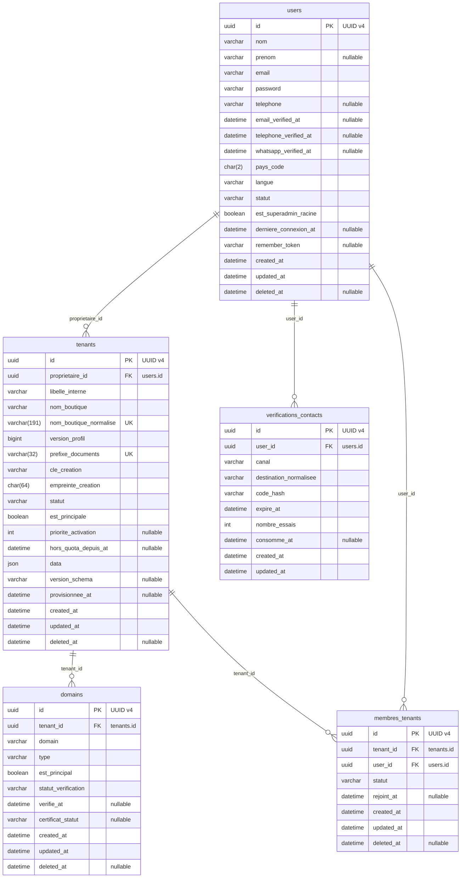
```mermaid
erDiagram
    direction TB
    users {
        uuid id PK "UUID v4"
        varchar nom
        varchar prenom "nullable"
        varchar email
        varchar password
        varchar telephone "nullable"
        datetime email_verified_at "nullable"
        datetime telephone_verified_at "nullable"
        datetime whatsapp_verified_at "nullable"
        char(2) pays_code
        varchar langue
        varchar statut
        boolean est_superadmin_racine
        datetime derniere_connexion_at "nullable"
        varchar remember_token "nullable"
        datetime created_at
        datetime updated_at
        datetime deleted_at "nullable"
    }
    tenants {
        uuid id PK "UUID v4"
        uuid proprietaire_id FK "users.id"
        varchar libelle_interne
        varchar nom_boutique
        varchar(191) nom_boutique_normalise UK
        bigint version_profil
        varchar(32) prefixe_documents UK
        varchar cle_creation
        char(64) empreinte_creation
        varchar statut
        boolean est_principale
        int priorite_activation "nullable"
        datetime hors_quota_depuis_at "nullable"
        json data
        varchar version_schema "nullable"
        datetime provisionnee_at "nullable"
        datetime created_at
        datetime updated_at
        datetime deleted_at "nullable"
    }
    domains {
        uuid id PK "UUID v4"
        uuid tenant_id FK "tenants.id"
        varchar domain
        varchar type
        boolean est_principal
        varchar statut_verification
        datetime verifie_at "nullable"
        varchar certificat_statut "nullable"
        datetime created_at
        datetime updated_at
        datetime deleted_at "nullable"
    }
    membres_tenants {
        uuid id PK "UUID v4"
        uuid tenant_id FK "tenants.id"
        uuid user_id FK "users.id"
        varchar statut
        datetime rejoint_at "nullable"
        datetime created_at
        datetime updated_at
        datetime deleted_at "nullable"
    }
    verifications_contacts {
        uuid id PK "UUID v4"
        uuid user_id FK "users.id"
        varchar canal
        varchar destination_normalisee
        varchar code_hash
        datetime expire_at
        int nombre_essais
        datetime consomme_at "nullable"
        datetime created_at
        datetime updated_at
    }
    users ||--o{ verifications_contacts : user_id
    users ||--o{ tenants : proprietaire_id
    tenants ||--o{ domains : tenant_id
    tenants ||--o{ membres_tenants : tenant_id
    users ||--o{ membres_tenants : user_id
```

#### Explication très simple des champs


**`users` :**

- **`id`** : le numéro unique qui permet de reconnaître cette ligne dans la base. Deux lignes différentes ne peuvent pas avoir le même `id`.
- **`nom`** : le nom affiché à l’utilisateur. Exemple : « Nombre de boutiques » ou « Livraison EcoTrack ».
- **`prenom`** : le prénom de la personne. Il peut rester vide si le SaaS n’en a pas besoin ou ne le connaît pas encore.
- **`email`** : l’adresse email du compte.
- **`password`** : le mot de passe protégé par hachage. Le mot de passe réel ne doit jamais être stocké tel quel.
- **`telephone`** : le numéro de téléphone. Il est gardé comme texte pour ne pas perdre le `0`, le `+213` ou d’autres signes utiles. Ce champ peut rester vide quand cette information n’est pas nécessaire ou pas encore connue.
- **`email_verified_at`** : la date et l’heure liées à **email verified**. Elle permet de savoir exactement quand cette étape a eu lieu. Ce champ peut rester vide quand cette information n’est pas nécessaire ou pas encore connue.
- **`telephone_verified_at`** : la date et l’heure liées à **telephone verified**. Elle permet de savoir exactement quand cette étape a eu lieu. Ce champ peut rester vide quand cette information n’est pas nécessaire ou pas encore connue.
- **`whatsapp_verified_at`** : la date et l’heure liées à **whatsapp verified**. Elle permet de savoir exactement quand cette étape a eu lieu. Ce champ peut rester vide quand cette information n’est pas nécessaire ou pas encore connue.
- **`pays_code`** : le code court du pays. Exemple : `DZ` pour l’Algérie.
- **`langue`** : la langue préférée pour l’affichage. Exemple : `fr` ou `ar`.
- **`statut`** : indique où en est l’élément. Exemple : `en_attente`, `actif`, `termine` ou `annule` selon la table.
- **`est_superadmin_racine`** : indique si le compte est le super administrateur racine du SaaS. `true` = compte root ; `false` = utilisateur normal, propriétaire, employé ou administrateur délégué selon ses rôles.
- **`derniere_connexion_at`** : la date et l’heure liées à **derniere connexion**. Elle permet de savoir exactement quand cette étape a eu lieu. Ce champ peut rester vide quand cette information n’est pas nécessaire ou pas encore connue.
- **`remember_token`** : un jeton technique utilisé par Laravel pour la fonction « se souvenir de moi ». Il peut rester vide.
- **`created_at`** : la date où cette ligne a été créée dans la base.
- **`updated_at`** : la date de la dernière modification de cette ligne. Exemple : si tu modifies l’élément aujourd’hui, cette date devient celle d’aujourd’hui.
- **`deleted_at`** : la date où l’élément a été retiré sans effacer son ancienne ligne. Si ce champ est vide, l’élément n’est pas supprimé.

**`tenants` :**

- **`id`** : le numéro unique qui permet de reconnaître cette ligne dans la base. Deux lignes différentes ne peuvent pas avoir le même `id`.
- **`proprietaire_id`** : l’identifiant du propriétaire. Il sert à relier cette ligne à la bonne information au lieu de recopier toutes ses données.
- **`libelle_interne`** : un nom utilisé seulement dans l’administration, pas forcément montré aux visiteurs.
- **`nom_boutique`** : le nom officiel de la boutique dans le SaaS. Exemple : « Karim Shoes ».
- **`nom_boutique_normalise`** : une version nettoyée du nom utilisée pour comparer les boutiques. Exemple : «  Karim  Shoes » devient quelque chose comme « karim shoes », afin d’éviter deux noms considérés identiques.
- **`version_profil`** : un numéro qui augmente quand le profil central change. Exemple : version 4 puis 5 après une modification.
- **`prefixe_documents`** : un petit code propre à la boutique utilisé dans la numérotation de ses documents. Exemple : `KRM` dans `KRM-FAC-2026-0001`.
- **`cle_creation`** : une clé donnée à une demande de création. Exemple : si Karim clique deux fois sur « Créer la boutique » à cause d’un réseau lent, la même clé permet de retrouver la première création au lieu d’en créer deux.
- **`empreinte_creation`** : une empreinte calculée à partir du contenu de la demande de création. Elle permet de vérifier que la même clé n’est pas réutilisée avec des informations différentes.
- **`statut`** : indique où en est l’élément. Exemple : `en_attente`, `actif`, `termine` ou `annule` selon la table.
- **`est_principale`** : indique si cet élément est le principal. Exemple : l’adresse principale de la boutique.
- **`priorite_activation`** : le choix de priorité entre plusieurs boutiques. Exemple : si le plan n’en autorise plus qu’une, cette valeur aide à savoir laquelle le propriétaire veut garder active. Ce champ peut rester vide quand cette information n’est pas nécessaire ou pas encore connue.
- **`hors_quota_depuis_at`** : la date depuis laquelle la boutique dépasse ce que le plan permet. Exemple : après passage de Pro à Gratuit, une deuxième boutique peut devenir `hors_quota` à cette date. Ce champ peut rester vide quand cette information n’est pas nécessaire ou pas encore connue.
- **`data`** : des informations techniques supplémentaires regroupées au même endroit. Exemple : le nom technique de la base créée pour cette boutique.
- **`version_schema`** : la version du schéma de base de données installée pour cette boutique. Elle aide à savoir si une migration technique manque. Ce champ peut rester vide quand cette information n’est pas nécessaire ou pas encore connue.
- **`provisionnee_at`** : la date où la base et les ressources techniques de la boutique ont fini d’être créées. Ce champ peut rester vide quand cette information n’est pas nécessaire ou pas encore connue.
- **`created_at`** : la date où cette ligne a été créée dans la base.
- **`updated_at`** : la date de la dernière modification de cette ligne. Exemple : si tu modifies l’élément aujourd’hui, cette date devient celle d’aujourd’hui.
- **`deleted_at`** : la date où l’élément a été retiré sans effacer son ancienne ligne. Si ce champ est vide, l’élément n’est pas supprimé.

**`domains` :**

- **`id`** : le numéro unique qui permet de reconnaître cette ligne dans la base. Deux lignes différentes ne peuvent pas avoir le même `id`.
- **`tenant_id`** : l’identifiant de la boutique. Il sert à relier cette ligne à la bonne information au lieu de recopier toutes ses données.
- **`domain`** : l’adresse web de la boutique. Exemple : `boutique-karim.monsaas.dz`.
- **`type`** : indique la catégorie de l’élément. Exemple : un domaine peut être `sous_domaine` ou `personnalise`.
- **`est_principal`** : indique si cet élément est le principal parmi plusieurs. Exemple : le domaine principal de la boutique.
- **`statut_verification`** : indique où en est la vérification. Exemple : `a_verifier`, `verifiee` ou `a_corriger`.
- **`verifie_at`** : la date où l’information a été vérifiée. Ce champ peut rester vide quand cette information n’est pas nécessaire ou pas encore connue.
- **`certificat_statut`** : indique où en est le certificat de sécurité HTTPS du domaine. Exemple : en attente, actif ou en erreur. Ce champ peut rester vide quand cette information n’est pas nécessaire ou pas encore connue.
- **`created_at`** : la date où cette ligne a été créée dans la base.
- **`updated_at`** : la date de la dernière modification de cette ligne. Exemple : si tu modifies l’élément aujourd’hui, cette date devient celle d’aujourd’hui.
- **`deleted_at`** : la date où l’élément a été retiré sans effacer son ancienne ligne. Si ce champ est vide, l’élément n’est pas supprimé.

**`membres_tenants` :**

- **`id`** : le numéro unique qui permet de reconnaître cette ligne dans la base. Deux lignes différentes ne peuvent pas avoir le même `id`.
- **`tenant_id`** : l’identifiant de la boutique. Il sert à relier cette ligne à la bonne information au lieu de recopier toutes ses données.
- **`user_id`** : l’identifiant du compte utilisateur. Il sert à relier cette ligne à la bonne information au lieu de recopier toutes ses données.
- **`statut`** : indique où en est l’élément. Exemple : `en_attente`, `actif`, `termine` ou `annule` selon la table.
- **`rejoint_at`** : la date et l’heure liées à **rejoint**. Elle permet de savoir exactement quand cette étape a eu lieu. Ce champ peut rester vide quand cette information n’est pas nécessaire ou pas encore connue.
- **`created_at`** : la date où cette ligne a été créée dans la base.
- **`updated_at`** : la date de la dernière modification de cette ligne. Exemple : si tu modifies l’élément aujourd’hui, cette date devient celle d’aujourd’hui.
- **`deleted_at`** : la date où l’élément a été retiré sans effacer son ancienne ligne. Si ce champ est vide, l’élément n’est pas supprimé.

**`verifications_contacts` :**

- **`id`** : le numéro unique qui permet de reconnaître cette ligne dans la base. Deux lignes différentes ne peuvent pas avoir le même `id`.
- **`user_id`** : l’identifiant du compte utilisateur. Il sert à relier cette ligne à la bonne information au lieu de recopier toutes ses données.
- **`canal`** : indique par quel moyen on communique. Exemple : téléphone ou WhatsApp.
- **`destination_normalisee`** : le téléphone ou contact remis dans un format standard pour comparer correctement deux valeurs écrites différemment.
- **`code_hash`** : la version protégée du code temporaire. Le vrai code n’est pas conservé directement dans la base.
- **`expire_at`** : la date où l’élément n’est plus valable.
- **`nombre_essais`** : le nombre de tentatives déjà faites. Exemple : 2 codes faux saisis.
- **`consomme_at`** : la date où le code, jeton ou droit à usage unique a été utilisé. S’il est vide, il n’a pas encore été consommé.
- **`created_at`** : la date où cette ligne a été créée dans la base.
- **`updated_at`** : la date de la dernière modification de cette ligne. Exemple : si tu modifies l’élément aujourd’hui, cette date devient celle d’aujourd’hui.


Les références vers un autre module sont indiquées sur les champs, même si leur flèche n’est pas redessinée ici.

- **`users` :** Deux comptes ne peuvent pas utiliser le même email une fois l’email normalisé. Le pays par défaut est `DZ`. `password` contient uniquement le mot de passe haché, jamais le mot de passe réel. Il ne doit y avoir qu’un seul compte `root` actif. Le `root` peut tout administrer dans la partie centrale du SaaS. Un administrateur délégué garde seulement les droits qui lui ont été donnés. Même un administrateur plateforme ne peut pas entrer automatiquement dans le back-office d’une boutique : il faut toujours vérifier qu’il appartient à cette boutique et qu’il possède les droits nécessaires. `langue` sert seulement à choisir la langue de l’interface.

- **`tenants` :** Chaque boutique doit obligatoirement avoir un propriétaire dans `users`. Une fois la boutique créée, son propriétaire ne peut plus être changé, même par le `root`. Tant qu’une boutique appartient à un utilisateur, son compte ne peut pas être supprimé. `nom_boutique` est le vrai nom central de la boutique. `nom_boutique_normalise` est une version nettoyée utilisée pour comparer les noms : par exemple «  Alpha  Store » devient « alpha store ». Deux boutiques ne peuvent pas avoir le même nom normalisé, et un nom archivé reste réservé au MVP. `cle_creation` sert à éviter de créer deux fois la même boutique si la même demande est envoyée deux fois : elle est unique pour un même propriétaire. `empreinte_creation` vérifie aussi que la deuxième demande contient exactement les mêmes données. Même clé + même empreinte = on retrouve la même boutique ; même clé + données différentes = erreur `409`. Cette vérification se fait avant le quota pour qu’un simple retry ne consomme pas une place en plus. `prefixe_documents` est unique dans tout le SaaS et ne change plus après avoir été utilisé sur un document. `version_profil` augmente quand le profil central change afin de savoir quoi recopier dans la BDD boutique. `data` contient les informations techniques Tenancy, comme le nom de la BDD. Les statuts possibles sont `en_provisionnement`, `actif`, `hors_quota`, `suspendu`, `suspendu_restauration`, `echec_provisionnement` et `archive`. Un propriétaire ne peut avoir qu’une seule boutique principale non archivée. `priorite_activation` sert à mémoriser quelle boutique il préfère garder active si son plan n’en autorise plus autant. Une boutique suspendue ne redevient jamais active simplement parce qu’une place de quota se libère. `hors_quota_depuis_at` garde la date où elle est passée hors quota. Le commerçant n’a jamais d’accès SQL direct à sa BDD.

- **`domains` :** Deux boutiques ne peuvent pas utiliser le même domaine une fois le domaine normalisé. Une boutique peut avoir plusieurs domaines, mais un seul domaine principal actif. `type` vaut `sous_domaine` ou `personnalise`. Un domaine personnalisé n’est autorisé que si l’abonnement donne cette fonctionnalité. Le modèle `Domain` et sa migration doivent utiliser les UUID du projet. Il n’y a pas besoin d’une table séparée `sous_domaines` : les deux types restent dans `domains`.

- **`membres_tenants` :** Un même utilisateur ne peut apparaître qu’une seule fois comme membre d’une même boutique. Quand une boutique est créée, le propriétaire est automatiquement ajouté comme membre dans la même création centrale. Tant que la boutique existe, cette appartenance du propriétaire ne peut pas être supprimée, déplacée vers un autre utilisateur, déplacée vers une autre boutique ou désactivée. Il n’existe pas de rôle « propriétaire » à attribuer : le propriétaire est toujours celui indiqué par `tenants.proprietaire_id`. Les autres membres reçoivent leurs rôles dans `membres_roles`. Si une personne déjà connue est réinvitée, on réactive son ancienne appartenance au lieu d’en créer une deuxième.

- **`verifications_contacts` :** `canal` vaut `telephone` ou `whatsapp`. Le vrai code de vérification n’est pas stocké : on garde seulement son hachage. Le code expire rapidement et le nombre d’essais est limité. Vérifier un numéro de téléphone ne signifie pas automatiquement que WhatsApp est vérifié, et vérifier un ancien numéro ne valide pas un nouveau numéro. Si le téléphone du compte change, les anciennes dates de vérification liées à ce numéro sont remises à `NULL`. L’email et le mot de passe peuvent continuer à utiliser les mécanismes standards de Laravel.

### C2 — Permissions

**`fonctionnalites` — Ce que l’abonnement permet d’utiliser et en quelle quantité. Exemple : le plan Pro permet de créer jusqu’à 3 boutiques.**

**`permissions` — Les actions qu’un utilisateur peut faire. Exemple : ajouter un produit, modifier une commande ou consulter les statistiques.**

**`roles` — Un groupe de permissions auquel on donne un nom. Exemple : « Gestionnaire des commandes » permet de consulter et confirmer les commandes. Un rôle concerne soit l’administration du SaaS, soit une boutique précise.**

**`roles_permissions` — Indique quelles permissions sont comprises dans chaque rôle. Exemple : le rôle « Gestionnaire des commandes » contient « consulter les commandes » et « confirmer les commandes », mais pas « supprimer les produits ».**

**`users_roles` — Indique le rôle d’une personne dans l’administration du SaaS. Exemple : Ahmed a le rôle « Gestionnaire des abonnements » pour gérer les abonnements des commerçants.**

**`membres_roles` — Indique le rôle d’une personne dans une boutique précise. Exemple : Nazim est « Gestionnaire des commandes » dans la boutique de Karim. Cela ne lui donne aucun droit dans les autres boutiques.**

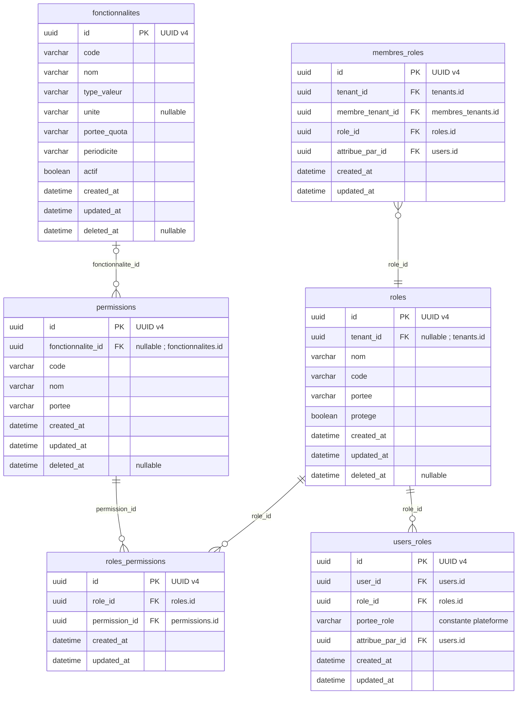
```mermaid
erDiagram
    direction TB
    fonctionnalites {
        uuid id PK "UUID v4"
        varchar code
        varchar nom
        varchar type_valeur
        varchar unite "nullable"
        varchar portee_quota
        varchar periodicite
        boolean actif
        datetime created_at
        datetime updated_at
        datetime deleted_at "nullable"
    }
    permissions {
        uuid id PK "UUID v4"
        uuid fonctionnalite_id FK "nullable ; fonctionnalites.id"
        varchar code
        varchar nom
        varchar portee
        datetime created_at
        datetime updated_at
        datetime deleted_at "nullable"
    }
    roles {
        uuid id PK "UUID v4"
        uuid tenant_id FK "nullable ; tenants.id"
        varchar nom
        varchar code
        varchar portee
        boolean protege
        datetime created_at
        datetime updated_at
        datetime deleted_at "nullable"
    }
    roles_permissions {
        uuid id PK "UUID v4"
        uuid role_id FK "roles.id"
        uuid permission_id FK "permissions.id"
        datetime created_at
        datetime updated_at
    }
    users_roles {
        uuid id PK "UUID v4"
        uuid user_id FK "users.id"
        uuid role_id FK "roles.id"
        varchar portee_role "constante plateforme"
        uuid attribue_par_id FK "users.id"
        datetime created_at
        datetime updated_at
    }
    membres_roles {
        uuid id PK "UUID v4"
        uuid tenant_id FK "tenants.id"
        uuid membre_tenant_id FK "membres_tenants.id"
        uuid role_id FK "roles.id"
        uuid attribue_par_id FK "users.id"
        datetime created_at
        datetime updated_at
    }
    membres_roles }o--|| roles : role_id
    fonctionnalites |o--o{ permissions : fonctionnalite_id
    roles ||--o{ roles_permissions : role_id
    permissions ||--o{ roles_permissions : permission_id
    roles ||--o{ users_roles : role_id
```

#### Explication très simple des champs

**`fonctionnalites` :**

- **`id`** : le numéro unique qui permet de reconnaître cette fonctionnalité dans la base.
- **`code`** : le petit nom utilisé par le programme pour reconnaître l’élément. Exemple : `boutiques.nombre` ou `produits.creer`.
- **`nom`** : le nom affiché à l’utilisateur. Exemple : « Nombre de boutiques » ou « Livraison EcoTrack ».
- **`type_valeur`** : indique si la fonctionnalité se règle par **oui/non** ou par **un nombre maximum**. Exemple : « Peut-il utiliser EcoTrack ? Oui. » ou « Combien de boutiques ? 3. »
- **`unite`** : explique ce que le nombre représente. Exemple : dans **« 3 boutiques »**, le nombre est 3 et l’unité est « boutiques ». Pour une fonction seulement oui/non, ce champ peut rester vide.
- **`portee_quota`** : indique à qui s’applique la limite. Exemple : **3 boutiques pour Karim au total**, ou une limite calculée séparément pour chacune de ses boutiques.
- **`periodicite`** : indique quand le compteur recommence. Exemple avec une limite de **5 utilisations** : `jour` = 5 aujourd’hui puis de nouveau 5 demain ; `mois` = 5 ce mois-ci puis de nouveau 5 le mois suivant ; `aucune` = la limite ne recommence pas avec le temps. Par exemple, posséder déjà 3 boutiques ne permet pas d’en créer 3 nouvelles au début du mois suivant.
- **`actif`** : indique si cette fonctionnalité est proposée par le SaaS. Exemple : elle peut exister dans la liste mais être désactivée parce qu’elle n’est pas encore prête. Cela ne veut pas dire que tous les abonnements y ont accès.
- **`created_at`** : la date où cette fonctionnalité a été ajoutée dans la base.
- **`updated_at`** : la date de sa dernière modification. Exemple : tu changes son nom aujourd’hui ; cette date devient celle d’aujourd’hui.
- **`deleted_at`** : la date où cette fonctionnalité a été retirée tout en gardant son ancienne ligne dans la base. Si ce champ est vide, elle n’a pas été retirée.

**`permissions` :**

- **`id`** : le numéro unique qui permet de reconnaître cette ligne dans la base. Deux lignes différentes ne peuvent pas avoir le même `id`.
- **`fonctionnalite_id`** : l’identifiant de la fonctionnalité. Il sert à relier cette ligne à la bonne information au lieu de recopier toutes ses données. Ce champ peut rester vide quand cette information n’est pas nécessaire ou pas encore connue.
- **`code`** : le petit nom utilisé par le programme pour reconnaître l’élément. Exemple : `boutiques.nombre` ou `produits.creer`.
- **`nom`** : le nom affiché à l’utilisateur. Exemple : « Nombre de boutiques » ou « Livraison EcoTrack ».
- **`portee`** : indique dans quel endroit la règle s’applique. Exemple : `plateforme` pour l’administration du SaaS ou `tenant` pour une boutique.
- **`created_at`** : la date où cette ligne a été créée dans la base.
- **`updated_at`** : la date de la dernière modification de cette ligne. Exemple : si tu modifies l’élément aujourd’hui, cette date devient celle d’aujourd’hui.
- **`deleted_at`** : la date où l’élément a été retiré sans effacer son ancienne ligne. Si ce champ est vide, l’élément n’est pas supprimé.

**`roles` :**

- **`id`** : le numéro unique qui permet de reconnaître cette ligne dans la base. Deux lignes différentes ne peuvent pas avoir le même `id`.
- **`tenant_id`** : l’identifiant de la boutique. Il sert à relier cette ligne à la bonne information au lieu de recopier toutes ses données. Ce champ peut rester vide quand cette information n’est pas nécessaire ou pas encore connue.
- **`nom`** : le nom affiché à l’utilisateur. Exemple : « Nombre de boutiques » ou « Livraison EcoTrack ».
- **`code`** : le petit nom utilisé par le programme pour reconnaître l’élément. Exemple : `boutiques.nombre` ou `produits.creer`.
- **`portee`** : indique dans quel endroit la règle s’applique. Exemple : `plateforme` pour l’administration du SaaS ou `tenant` pour une boutique.
- **`protege`** : indique si l’élément est protégé contre certaines modifications ou suppressions. Exemple : un rôle système important peut être protégé.
- **`created_at`** : la date où cette ligne a été créée dans la base.
- **`updated_at`** : la date de la dernière modification de cette ligne. Exemple : si tu modifies l’élément aujourd’hui, cette date devient celle d’aujourd’hui.
- **`deleted_at`** : la date où l’élément a été retiré sans effacer son ancienne ligne. Si ce champ est vide, l’élément n’est pas supprimé.

**`roles_permissions` :**

- **`id`** : le numéro unique qui permet de reconnaître cette ligne dans la base. Deux lignes différentes ne peuvent pas avoir le même `id`.
- **`role_id`** : l’identifiant du rôle. Il sert à relier cette ligne à la bonne information au lieu de recopier toutes ses données.
- **`permission_id`** : l’identifiant de la permission. Il sert à relier cette ligne à la bonne information au lieu de recopier toutes ses données.
- **`created_at`** : la date où cette ligne a été créée dans la base.
- **`updated_at`** : la date de la dernière modification de cette ligne. Exemple : si tu modifies l’élément aujourd’hui, cette date devient celle d’aujourd’hui.

**`users_roles` :**

- **`id`** : le numéro unique qui permet de reconnaître cette ligne dans la base. Deux lignes différentes ne peuvent pas avoir le même `id`.
- **`user_id`** : l’identifiant du compte utilisateur. Il sert à relier cette ligne à la bonne information au lieu de recopier toutes ses données.
- **`role_id`** : l’identifiant du rôle. Il sert à relier cette ligne à la bonne information au lieu de recopier toutes ses données.
- **`portee_role`** : confirme que le rôle est utilisé dans la bonne zone. Ici, par exemple, `plateforme` signifie que le rôle sert à administrer le SaaS.
- **`attribue_par_id`** : l’identifiant de la personne qui a donné ce droit. Il sert à relier cette ligne à la bonne information au lieu de recopier toutes ses données.
- **`created_at`** : la date où cette ligne a été créée dans la base.
- **`updated_at`** : la date de la dernière modification de cette ligne. Exemple : si tu modifies l’élément aujourd’hui, cette date devient celle d’aujourd’hui.

**`membres_roles` :**

- **`id`** : le numéro unique qui permet de reconnaître cette ligne dans la base. Deux lignes différentes ne peuvent pas avoir le même `id`.
- **`tenant_id`** : l’identifiant de la boutique. Il sert à relier cette ligne à la bonne information au lieu de recopier toutes ses données.
- **`membre_tenant_id`** : l’identifiant du membre de l’équipe. Il sert à relier cette ligne à la bonne information au lieu de recopier toutes ses données.
- **`role_id`** : l’identifiant du rôle. Il sert à relier cette ligne à la bonne information au lieu de recopier toutes ses données.
- **`attribue_par_id`** : l’identifiant de la personne qui a donné ce droit. Il sert à relier cette ligne à la bonne information au lieu de recopier toutes ses données.
- **`created_at`** : la date où cette ligne a été créée dans la base.
- **`updated_at`** : la date de la dernière modification de cette ligne. Exemple : si tu modifies l’élément aujourd’hui, cette date devient celle d’aujourd’hui.


Les références vers un autre module sont indiquées sur les champs, même si leur flèche n’est pas redessinée ici.

- **`fonctionnalites` :** Chaque fonctionnalité possède un `code` unique. `type_valeur=booleen` signifie simplement oui/non ; `type_valeur=quota` signifie qu’on autorise un nombre maximum. `portee_quota=compte` veut dire que la limite est partagée par toutes les boutiques du propriétaire ; `tenant` veut dire que chaque boutique a sa propre limite. `periodicite=jour` recommence chaque jour, `mois` recommence chaque mois et `aucune` ne recommence pas avec le temps. Exemple : `boutiques.nombre=3` avec `aucune` signifie que Karim peut avoir 3 boutiques au total ; le mois suivant il n’en gagne pas 3 nouvelles. Les codes comme `boutiques.nombre`, `domaines.personnalises`, `design.personnalise`, `livraison.ecotrack` ou `statistiques.lire` doivent correspondre à de vrais contrôles dans le code de l’application.

- **`permissions` :** Chaque permission possède un `code` unique. `portee=plateforme` signifie que l’action concerne l’administration du SaaS ; `portee=tenant` signifie qu’elle concerne le back-office d’une boutique. Exemples : `produits.creer`, `stock.ajuster`, `commandes.confirmer` ou `finances.valider_reversement`. `fonctionnalite_id` peut rester vide lorsqu’une permission sert à une action interne qui n’est pas vendue comme fonctionnalité d’abonnement.

- **`roles` :** Un rôle `plateforme` n’appartient à aucune boutique, donc `tenant_id=NULL`. Un rôle `tenant` appartient obligatoirement à une boutique précise. Dans un même contexte, deux rôles ne peuvent pas avoir le même `code`. Exemple : la boutique A peut avoir un rôle `gestionnaire`, et la boutique B peut aussi avoir son propre rôle `gestionnaire`, car ce ne sont pas le même contexte. Pour les rôles plateforme, on utilise une valeur technique comme `plateforme` pour que l’unicité fonctionne correctement même quand `tenant_id` est vide.

- **`roles_permissions` :** Une même permission ne peut être ajoutée qu’une seule fois au même rôle. Un rôle boutique accepte seulement des permissions boutique, et un rôle plateforme accepte seulement des permissions plateforme. Si quelqu’un essaie de mélanger les deux, Laravel et la BDD refusent l’écriture. La portée d’un rôle ou d’une permission ne peut plus être changée après sa création, sinon on pourrait contourner cette protection. Un rôle plateforme ne donne jamais accès au back-office marchand d’une boutique. Dès qu’un rôle ou ses permissions changent, le cache des droits doit être vidé pour que le changement soit pris en compte immédiatement. Le compte SQL utilisé par l’application ne doit pas pouvoir modifier la structure de la BDD avec des commandes DDL.

- **`users_roles` :** Cette table sert uniquement aux rôles de la plateforme. Un même utilisateur ne peut recevoir qu’une seule fois le même rôle. `portee_role` doit toujours valoir `plateforme`, et le rôle lié doit lui aussi être un rôle plateforme. Les rôles des boutiques ne vont jamais ici : ils vont dans `membres_roles`. Un administrateur délégué ne peut pas donner à quelqu’un des droits plus grands que ceux qu’il a lui-même le droit de déléguer.

- **`membres_roles` :** Un même membre ne peut recevoir qu’une seule fois le même rôle. Le membre, le rôle et `tenant_id` doivent tous parler de la même boutique. `tenant_id` est obligatoire, donc un rôle plateforme ne peut pas arriver dans cette table. Le membre doit être encore actif dans la boutique quand on lui donne le rôle et chaque fois qu’une requête utilise ses droits. Si son appartenance ou son rôle est retiré, le cache de ses droits est immédiatement invalidé.

### C3 — Invitations, exceptions et restrictions administratives

**`exceptions_permissions` — Ajoute ou interdit une action à une personne dans un contexte précis, éventuellement pour une durée limitée. Exemple : Nazim garde son rôle, mais on lui interdit de modifier les commandes de cette boutique.**

**`restrictions_admins` — Limite les actions d’un administrateur dans l’administration centrale du SaaS. Exemple : Ahmed peut gérer les abonnements, mais pas celui de Karim. Cette table ne lui ouvre pas l’intérieur des boutiques.**

**`invitations_equipes` — Les invitations pour rejoindre l’équipe d’une boutique avec un rôle choisi. Exemple : Karim invite Nazim par email comme gestionnaire des commandes ; Nazim doit accepter une invitation encore valable.**


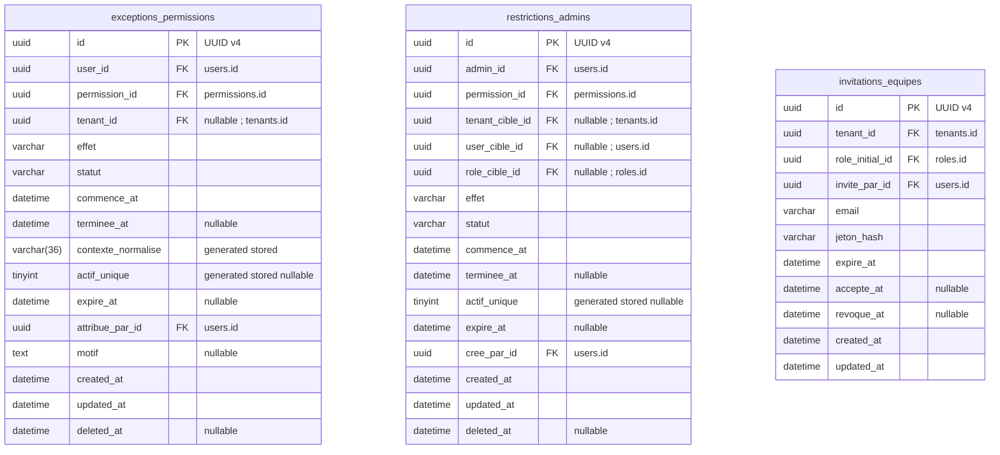
```mermaid
erDiagram
    direction TB
    exceptions_permissions {
        uuid id PK "UUID v4"
        uuid user_id FK "users.id"
        uuid permission_id FK "permissions.id"
        uuid tenant_id FK "nullable ; tenants.id"
        varchar effet
        varchar statut
        datetime commence_at
        datetime terminee_at "nullable"
        varchar(36) contexte_normalise "generated stored"
        tinyint actif_unique "generated stored nullable"
        datetime expire_at "nullable"
        uuid attribue_par_id FK "users.id"
        text motif "nullable"
        datetime created_at
        datetime updated_at
        datetime deleted_at "nullable"
    }
    restrictions_admins {
        uuid id PK "UUID v4"
        uuid admin_id FK "users.id"
        uuid permission_id FK "permissions.id"
        uuid tenant_cible_id FK "nullable ; tenants.id"
        uuid user_cible_id FK "nullable ; users.id"
        uuid role_cible_id FK "nullable ; roles.id"
        varchar effet
        varchar statut
        datetime commence_at
        datetime terminee_at "nullable"
        tinyint actif_unique "generated stored nullable"
        datetime expire_at "nullable"
        uuid cree_par_id FK "users.id"
        datetime created_at
        datetime updated_at
        datetime deleted_at "nullable"
    }
    invitations_equipes {
        uuid id PK "UUID v4"
        uuid tenant_id FK "tenants.id"
        uuid role_initial_id FK "roles.id"
        uuid invite_par_id FK "users.id"
        varchar email
        varchar jeton_hash
        datetime expire_at
        datetime accepte_at "nullable"
        datetime revoque_at "nullable"
        datetime created_at
        datetime updated_at
    }
```

#### Explication très simple des champs

**`exceptions_permissions` :**

- **`id`** : le numéro unique qui permet de reconnaître cette ligne dans la base. Deux lignes différentes ne peuvent pas avoir le même `id`.
- **`user_id`** : l’identifiant du compte utilisateur. Il sert à relier cette ligne à la bonne information au lieu de recopier toutes ses données.
- **`permission_id`** : l’identifiant de la permission. Il sert à relier cette ligne à la bonne information au lieu de recopier toutes ses données.
- **`tenant_id`** : l’identifiant de la boutique. Il sert à relier cette ligne à la bonne information au lieu de recopier toutes ses données. Ce champ peut rester vide quand cette information n’est pas nécessaire ou pas encore connue.
- **`effet`** : indique ce que la règle fait. Exemple : `autoriser` donne le droit ; `interdire` le bloque.
- **`statut`** : indique où en est l’élément. Exemple : `en_attente`, `actif`, `termine` ou `annule` selon la table.
- **`commence_at`** : la date et l’heure où la période ou l’action commence.
- **`terminee_at`** : la date et l’heure où cette attribution ou règle a pris fin. Ce champ peut rester vide quand cette information n’est pas nécessaire ou pas encore connue.
- **`contexte_normalise`** : une valeur technique calculée pour représenter toujours le contexte de la même manière. Exemple : `plateforme` ou l’identifiant d’une boutique. Cela permet d’appliquer correctement les règles d’unicité.
- **`actif_unique`** : un petit champ technique calculé pour empêcher qu’il y ait deux règles actives identiques en même temps. Les anciennes règles terminées peuvent quand même rester dans l’historique. Ce champ peut rester vide quand cette information n’est pas nécessaire ou pas encore connue.
- **`expire_at`** : la date où l’élément n’est plus valable. Ce champ peut rester vide quand cette information n’est pas nécessaire ou pas encore connue.
- **`attribue_par_id`** : l’identifiant de la personne qui a donné ce droit. Il sert à relier cette ligne à la bonne information au lieu de recopier toutes ses données.
- **`motif`** : explique pourquoi l’action ou la décision a été faite. Ce champ peut rester vide quand cette information n’est pas nécessaire ou pas encore connue.
- **`created_at`** : la date où cette ligne a été créée dans la base.
- **`updated_at`** : la date de la dernière modification de cette ligne. Exemple : si tu modifies l’élément aujourd’hui, cette date devient celle d’aujourd’hui.
- **`deleted_at`** : la date où l’élément a été retiré sans effacer son ancienne ligne. Si ce champ est vide, l’élément n’est pas supprimé.

**`restrictions_admins` :**

- **`id`** : le numéro unique qui permet de reconnaître cette ligne dans la base. Deux lignes différentes ne peuvent pas avoir le même `id`.
- **`admin_id`** : l’identifiant de l’administrateur. Il sert à relier cette ligne à la bonne information au lieu de recopier toutes ses données.
- **`permission_id`** : l’identifiant de la permission. Il sert à relier cette ligne à la bonne information au lieu de recopier toutes ses données.
- **`tenant_cible_id`** : l’identifiant de la boutique visée. Il sert à relier cette ligne à la bonne information au lieu de recopier toutes ses données. Ce champ peut rester vide quand cette information n’est pas nécessaire ou pas encore connue.
- **`user_cible_id`** : l’identifiant de l’utilisateur visé. Il sert à relier cette ligne à la bonne information au lieu de recopier toutes ses données. Ce champ peut rester vide quand cette information n’est pas nécessaire ou pas encore connue.
- **`role_cible_id`** : l’identifiant du rôle visé. Il sert à relier cette ligne à la bonne information au lieu de recopier toutes ses données. Ce champ peut rester vide quand cette information n’est pas nécessaire ou pas encore connue.
- **`effet`** : indique ce que la règle fait. Exemple : `autoriser` donne le droit ; `interdire` le bloque.
- **`statut`** : indique où en est l’élément. Exemple : `en_attente`, `actif`, `termine` ou `annule` selon la table.
- **`commence_at`** : la date et l’heure où la période ou l’action commence.
- **`terminee_at`** : la date et l’heure où cette attribution ou règle a pris fin. Ce champ peut rester vide quand cette information n’est pas nécessaire ou pas encore connue.
- **`actif_unique`** : un petit champ technique calculé pour empêcher qu’il y ait deux règles actives identiques en même temps. Les anciennes règles terminées peuvent quand même rester dans l’historique. Ce champ peut rester vide quand cette information n’est pas nécessaire ou pas encore connue.
- **`expire_at`** : la date où l’élément n’est plus valable. Ce champ peut rester vide quand cette information n’est pas nécessaire ou pas encore connue.
- **`cree_par_id`** : l’identifiant de la personne qui a créé l’élément. Il sert à relier cette ligne à la bonne information au lieu de recopier toutes ses données.
- **`created_at`** : la date où cette ligne a été créée dans la base.
- **`updated_at`** : la date de la dernière modification de cette ligne. Exemple : si tu modifies l’élément aujourd’hui, cette date devient celle d’aujourd’hui.
- **`deleted_at`** : la date où l’élément a été retiré sans effacer son ancienne ligne. Si ce champ est vide, l’élément n’est pas supprimé.

**`invitations_equipes` :**

- **`id`** : le numéro unique qui permet de reconnaître cette ligne dans la base. Deux lignes différentes ne peuvent pas avoir le même `id`.
- **`tenant_id`** : l’identifiant de la boutique. Il sert à relier cette ligne à la bonne information au lieu de recopier toutes ses données.
- **`role_initial_id`** : l’identifiant du rôle proposé dans l’invitation. Il sert à relier cette ligne à la bonne information au lieu de recopier toutes ses données.
- **`invite_par_id`** : l’identifiant de la personne qui a envoyé l’invitation. Il sert à relier cette ligne à la bonne information au lieu de recopier toutes ses données.
- **`email`** : l’adresse email du compte.
- **`jeton_hash`** : la version protégée du jeton d’invitation. Si la base est lue, le vrai lien secret n’est pas directement récupérable.
- **`expire_at`** : la date où l’élément n’est plus valable.
- **`accepte_at`** : la date et l’heure liées à **accepte**. Elle permet de savoir exactement quand cette étape a eu lieu. Ce champ peut rester vide quand cette information n’est pas nécessaire ou pas encore connue.
- **`revoque_at`** : la date et l’heure liées à **revoque**. Elle permet de savoir exactement quand cette étape a eu lieu. Ce champ peut rester vide quand cette information n’est pas nécessaire ou pas encore connue.
- **`created_at`** : la date où cette ligne a été créée dans la base.
- **`updated_at`** : la date de la dernière modification de cette ligne. Exemple : si tu modifies l’élément aujourd’hui, cette date devient celle d’aujourd’hui.


Les références vers un autre module sont indiquées sur les champs, même si leur flèche n’est pas redessinée ici.

- **`exceptions_permissions` :** Cette table permet de donner ou de retirer temporairement une permission précise à un utilisateur. `effet=autoriser` ajoute le droit ; `interdire` le bloque. `statut` indique si la règle est `active`, `expiree` ou `revoquee`. Pour une permission de boutique, `tenant_id` est obligatoire et l’utilisateur doit réellement appartenir à cette boutique. Pour une permission plateforme, `tenant_id` doit être vide. Laravel et la BDD refusent les mélanges incorrects. Une règle ne fonctionne que pendant sa période : à partir de `commence_at` et avant `expire_at` si une date de fin existe. On ne dépend pas seulement d’un cron pour savoir qu’elle est expirée : chaque contrôle regarde aussi les dates. Il ne peut pas y avoir deux exceptions actives identiques pour le même utilisateur, la même permission et le même contexte. Les anciennes exceptions restent dans l’historique au lieu d’être réutilisées. Si on renouvelle une exception, on termine l’ancienne puis on crée une nouvelle ligne dans la même transaction. Une interdiction passe avant les permissions reçues par les rôles. Une exception ne permet jamais de dépasser le plan ou d’accéder à une boutique dont l’utilisateur n’est pas membre. `attribue_par_id` doit avoir le droit de déléguer cette permission ; simplement posséder la permission ne suffit pas. Après chaque ajout, révocation ou expiration, le cache des droits est vidé. Les colonnes techniques calculées ne doivent pas utiliser `NOW()`.

- **`restrictions_admins` :** Une restriction vise exactement une chose : soit une boutique, soit un utilisateur, soit un rôle. Elle sert seulement à limiter les actions d’un administrateur dans la partie centrale du SaaS. Exemple : Ahmed peut avoir la permission de gérer les abonnements, mais une restriction peut l’empêcher de toucher au compte de Karim. Cela ne lui donne jamais accès au back-office marchand d’une boutique et ne lui permet jamais d’agir comme un autre utilisateur. Une autorisation ciblée ne crée pas une permission globale que l’administrateur ne possède pas déjà. Il ne peut pas y avoir deux règles actives identiques sur la même cible. Comme pour `exceptions_permissions`, les dates sont vérifiées à chaque utilisation, les anciennes lignes restent dans l’historique et ne sont pas recyclées.

- **`invitations_equipes` :** Chaque jeton d’invitation est unique. Le rôle proposé dans l’invitation doit appartenir à la même boutique que l’invitation. Une fois la personne entrée dans l’équipe, on peut lui ajouter d’autres rôles avec `membres_roles`. Le jeton d’invitation ne peut être utilisé qu’une seule fois : après acceptation, il ne doit plus permettre une deuxième entrée.

### C4 — Plans et abonnements

**`plans` — Les offres d’abonnement proposées aux commerçants, avec leurs versions. Exemple : Gratuit et Pro. Une ancienne version reste conservée pour comprendre les anciens abonnements.**

**`plans_fonctionnalites` — Indique ce que chaque offre permet et ses limites. Exemple : l’offre Gratuit autorise 1 boutique et l’offre Pro en autorise 3.**

**`abonnements` — Indique l’offre d’un propriétaire et sa période d’utilisation. Exemple : Karim possède un abonnement Pro qui couvre ses boutiques dans les limites de cette offre.**

**`exceptions_fonctionnalites` — Un changement particulier aux possibilités ou aux limites habituelles de l’abonnement. Exemple : autoriser temporairement Karim à tester une fonction normalement absente de son offre.**

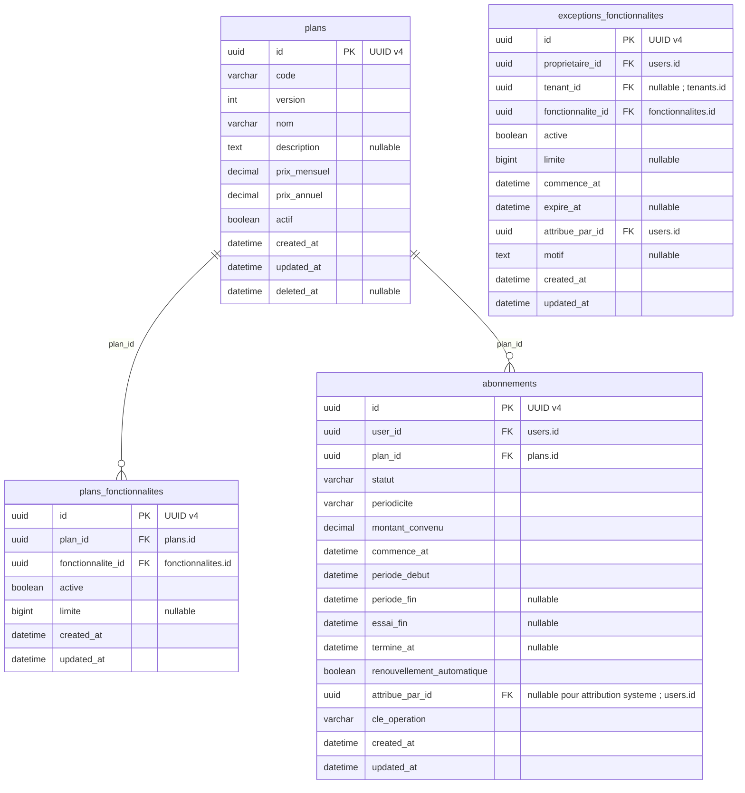
```mermaid
erDiagram
    direction TB
    plans {
        uuid id PK "UUID v4"
        varchar code
        int version
        varchar nom
        text description "nullable"
        decimal prix_mensuel
        decimal prix_annuel
        boolean actif
        datetime created_at
        datetime updated_at
        datetime deleted_at "nullable"
    }
    plans_fonctionnalites {
        uuid id PK "UUID v4"
        uuid plan_id FK "plans.id"
        uuid fonctionnalite_id FK "fonctionnalites.id"
        boolean active
        bigint limite "nullable"
        datetime created_at
        datetime updated_at
    }
    abonnements {
        uuid id PK "UUID v4"
        uuid user_id FK "users.id"
        uuid plan_id FK "plans.id"
        varchar statut
        varchar periodicite
        decimal montant_convenu
        datetime commence_at
        datetime periode_debut
        datetime periode_fin "nullable"
        datetime essai_fin "nullable"
        datetime termine_at "nullable"
        boolean renouvellement_automatique
        uuid attribue_par_id FK "nullable pour attribution systeme ; users.id"
        varchar cle_operation
        datetime created_at
        datetime updated_at
    }
    exceptions_fonctionnalites {
        uuid id PK "UUID v4"
        uuid proprietaire_id FK "users.id"
        uuid tenant_id FK "nullable ; tenants.id"
        uuid fonctionnalite_id FK "fonctionnalites.id"
        boolean active
        bigint limite "nullable"
        datetime commence_at
        datetime expire_at "nullable"
        uuid attribue_par_id FK "users.id"
        text motif "nullable"
        datetime created_at
        datetime updated_at
    }
    plans ||--o{ plans_fonctionnalites : plan_id
    plans ||--o{ abonnements : plan_id
```

#### Explication très simple des champs

**`plans` :**

- **`id`** : le numéro unique qui permet de reconnaître cette ligne dans la base. Deux lignes différentes ne peuvent pas avoir le même `id`.
- **`code`** : le petit nom utilisé par le programme pour reconnaître l’élément. Exemple : `boutiques.nombre` ou `produits.creer`.
- **`version`** : le numéro de version de cet élément. Exemple : version 1, puis version 2 après une évolution ; l’ancienne version peut rester conservée pour comprendre l’historique.
- **`nom`** : le nom affiché à l’utilisateur. Exemple : « Nombre de boutiques » ou « Livraison EcoTrack ».
- **`description`** : un texte qui explique l’élément plus en détail. Il peut rester vide si aucune explication supplémentaire n’est nécessaire.
- **`prix_mensuel`** : le prix à payer pour un mois d’abonnement.
- **`prix_annuel`** : le prix à payer pour une année d’abonnement.
- **`actif`** : indique si l’élément peut encore être utilisé. `true` = oui, `false` = non.
- **`created_at`** : la date où cette ligne a été créée dans la base.
- **`updated_at`** : la date de la dernière modification de cette ligne. Exemple : si tu modifies l’élément aujourd’hui, cette date devient celle d’aujourd’hui.
- **`deleted_at`** : la date où l’élément a été retiré sans effacer son ancienne ligne. Si ce champ est vide, l’élément n’est pas supprimé.

**`plans_fonctionnalites` :**

- **`id`** : le numéro unique qui permet de reconnaître cette ligne dans la base. Deux lignes différentes ne peuvent pas avoir le même `id`.
- **`plan_id`** : l’identifiant du plan d’abonnement. Il sert à relier cette ligne à la bonne information au lieu de recopier toutes ses données.
- **`fonctionnalite_id`** : l’identifiant de la fonctionnalité. Il sert à relier cette ligne à la bonne information au lieu de recopier toutes ses données.
- **`active`** : indique si cette possibilité est autorisée. `true` = oui, `false` = non.
- **`limite`** : le nombre maximum autorisé. Exemple : `3` peut vouloir dire maximum 3 boutiques. Si le champ est vide dans un cas prévu comme illimité, il n’y a pas de nombre maximum. Ce champ peut rester vide quand cette information n’est pas nécessaire ou pas encore connue.
- **`created_at`** : la date où cette ligne a été créée dans la base.
- **`updated_at`** : la date de la dernière modification de cette ligne. Exemple : si tu modifies l’élément aujourd’hui, cette date devient celle d’aujourd’hui.

**`abonnements` :**

- **`id`** : le numéro unique qui permet de reconnaître cette ligne dans la base. Deux lignes différentes ne peuvent pas avoir le même `id`.
- **`user_id`** : l’identifiant du compte utilisateur. Il sert à relier cette ligne à la bonne information au lieu de recopier toutes ses données.
- **`plan_id`** : l’identifiant du plan d’abonnement. Il sert à relier cette ligne à la bonne information au lieu de recopier toutes ses données.
- **`statut`** : indique où en est l’élément. Exemple : `en_attente`, `actif`, `termine` ou `annule` selon la table.
- **`periodicite`** : indique la durée choisie pour l’abonnement payant. Exemple : `mensuel` pour payer par mois ou `annuel` pour payer par année, selon les valeurs prévues par le SaaS.
- **`montant_convenu`** : le montant qui a été décidé pour cet abonnement, afin de garder le prix réellement accepté même si le tarif du plan change plus tard.
- **`commence_at`** : la date et l’heure où la période ou l’action commence.
- **`periode_debut`** : le début de la période concernée. Exemple : début du mois payé.
- **`periode_fin`** : la fin de la période concernée. Exemple : fin du mois payé. Peut rester vide lorsque la période n’a pas de fin prévue.
- **`essai_fin`** : la date où la période d’essai se termine. Elle peut rester vide s’il n’y a pas d’essai.
- **`termine_at`** : la date et l’heure où elle s’est terminée. Peut rester vide tant que ce n’est pas terminé.
- **`renouvellement_automatique`** : indique si l’abonnement payant doit être renouvelé automatiquement selon la règle prévue. `false` signifie qu’on ne prépare pas un nouveau renouvellement payant.
- **`attribue_par_id`** : l’identifiant de la personne qui a donné ce droit. Il sert à relier cette ligne à la bonne information au lieu de recopier toutes ses données. Ce champ peut rester vide quand cette information n’est pas nécessaire ou pas encore connue.
- **`cle_operation`** : une clé unique utilisée pour reconnaître une opération déjà faite. Exemple : si le serveur reçoit deux fois la même demande après une coupure, cette clé aide à éviter de faire l’opération deux fois.
- **`created_at`** : la date où cette ligne a été créée dans la base.
- **`updated_at`** : la date de la dernière modification de cette ligne. Exemple : si tu modifies l’élément aujourd’hui, cette date devient celle d’aujourd’hui.

**`exceptions_fonctionnalites` :**

- **`id`** : le numéro unique qui permet de reconnaître cette ligne dans la base. Deux lignes différentes ne peuvent pas avoir le même `id`.
- **`proprietaire_id`** : l’identifiant du propriétaire. Il sert à relier cette ligne à la bonne information au lieu de recopier toutes ses données.
- **`tenant_id`** : l’identifiant de la boutique. Il sert à relier cette ligne à la bonne information au lieu de recopier toutes ses données. Ce champ peut rester vide quand cette information n’est pas nécessaire ou pas encore connue.
- **`fonctionnalite_id`** : l’identifiant de la fonctionnalité. Il sert à relier cette ligne à la bonne information au lieu de recopier toutes ses données.
- **`active`** : indique si cette possibilité est autorisée. `true` = oui, `false` = non.
- **`limite`** : le nombre maximum autorisé. Exemple : `3` peut vouloir dire maximum 3 boutiques. Si le champ est vide dans un cas prévu comme illimité, il n’y a pas de nombre maximum. Ce champ peut rester vide quand cette information n’est pas nécessaire ou pas encore connue.
- **`commence_at`** : la date et l’heure où la période ou l’action commence.
- **`expire_at`** : la date où l’élément n’est plus valable. Ce champ peut rester vide quand cette information n’est pas nécessaire ou pas encore connue.
- **`attribue_par_id`** : l’identifiant de la personne qui a donné ce droit. Il sert à relier cette ligne à la bonne information au lieu de recopier toutes ses données.
- **`motif`** : explique pourquoi l’action ou la décision a été faite. Ce champ peut rester vide quand cette information n’est pas nécessaire ou pas encore connue.
- **`created_at`** : la date où cette ligne a été créée dans la base.
- **`updated_at`** : la date de la dernière modification de cette ligne. Exemple : si tu modifies l’élément aujourd’hui, cette date devient celle d’aujourd’hui.


Les références vers un autre module sont indiquées sur les champs, même si leur flèche n’est pas redessinée ici.

- **`plans` :** Le couple `code + version` est unique. Les prix sont en DZD dans ce MVP. Dès qu’un plan a été utilisé par un abonnement, on ne modifie plus son ancienne version. Exemple : si `Pro v1` autorisait 3 boutiques et qu’on veut passer à 5, on crée `Pro v2` au lieu de transformer le passé. Le plan gratuit coûte `0` et autorise 1 boutique.

- **`plans_fonctionnalites` :** Une fonctionnalité ne peut apparaître qu’une seule fois dans un même plan. Pour un quota : `active=false` signifie que la fonction est interdite ; `active=true` avec `limite=NULL` signifie qu’elle est illimitée ; sinon `limite` contient le maximum autorisé et doit être positif ou nul. Pour une fonctionnalité oui/non, `limite` reste vide. Si une fonctionnalité n’apparaît pas dans le plan, elle est considérée comme désactivée. Quand un plan a déjà été utilisé, ces règles restent figées avec cette version du plan.

- **`abonnements` :** Un abonnement payant est attribué manuellement par un administrateur autorisé. Le plan gratuit est donné automatiquement lors de la création du compte et après la fin d’un abonnement payant. Le SaaS ne prélève pas automatiquement l’argent et ne rembourse pas automatiquement : les paiements sont vérifiés dans `reglements_abonnement`. Si le commerçant demande l’arrêt, on coupe seulement le prochain renouvellement payant ; il garde les droits jusqu’à la fin de la période qu’il a déjà payée. On garde la trace de cette demande. Changer de formule crée une nouvelle attribution au bon moment au lieu de réécrire l’ancien abonnement. `renouvellement_automatique=false` signifie seulement « ne pas renouveler le payant » ; cela n’empêche pas le passage automatique au gratuit. Les statuts sont `en_attente`, `actif`, `expire` et `annule`. `cle_operation` est unique afin qu’un retry ne crée pas deux abonnements. Un propriétaire ne peut avoir qu’un seul abonnement actif à la fois. Pour activer un nouveau plan, on verrouille son compte, on ferme l’ancien abonnement puis on active le nouveau dans la même transaction. Les droits ne sont valables que si le statut est actif ET si la date actuelle se trouve dans la période autorisée ; le système ne dépend donc pas d’un cron pour savoir qu’un abonnement est fini. À l’expiration du payant, on crée le gratuit une seule fois, puis les boutiques qui dépassent le nouveau quota passent `hors_quota` sans supprimer leurs données. Les montants et périodes historiques restent conservés.

- **`exceptions_fonctionnalites` :** Une exception change temporairement une fonctionnalité pour un propriétaire ou pour une boutique. Sa période commence à `commence_at` et s’arrête avant `expire_at` lorsqu’une date de fin existe. `active=false` peut servir à interdire une fonction pendant cette période ; ce champ ne dit pas si l’exception est « expirée ». Deux exceptions qui concernent le même propriétaire, la même fonctionnalité et le même contexte ne doivent pas se chevaucher dans le temps. Pour éviter les collisions, on verrouille le propriétaire, on vérifie les périodes existantes puis on écrit le changement dans la même transaction. `tenant_id=NULL` signifie que l’exception concerne tout le compte. Une exception de boutique est plus précise et passe avant l’exception du compte, qui passe elle-même avant le plan. Si un quota est défini au niveau du compte, on n’autorise pas une exception au niveau d’une seule boutique. La boutique indiquée doit réellement appartenir à ce propriétaire. Les changements de dates sont audités et on ne réécrit pas une ancienne période déjà utilisée.

### C5 — Suivi SaaS et référentiel

**`consommations_fonctionnalites` — Compte certaines utilisations quand un compteur est nécessaire pour vérifier une limite. Exemple : suivre le nombre d’utilisations d’une fonction pendant un mois. Le nombre de boutiques se calcule depuis les boutiques existantes.**

**`echeances_abonnement` — Les sommes que le commerçant doit payer pour son abonnement SaaS. Exemple : Karim doit payer 3 000 DA pour une période. Cela ne prouve pas encore qu’il a payé.**

**`reglements_abonnement` — Les paiements d’abonnement enregistrés, puis vérifiés manuellement. Exemple : un administrateur valide les 3 000 DA versés par Karim après contrôle du reçu.**

**`wilayas` — La liste des wilayas, commune à toutes les boutiques. Exemple : Alger peut être sélectionnée dans une adresse de livraison.**

**`communes` — La liste des communes et la wilaya de chacune. Exemple : vérifier que la commune choisie appartient bien à la wilaya indiquée, sans vérifier l’existence de la maison.**

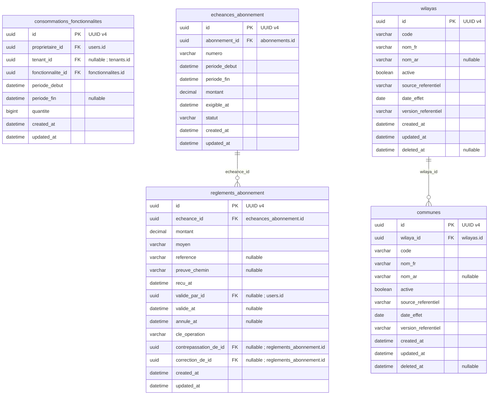
```mermaid
erDiagram
    direction TB
    consommations_fonctionnalites {
        uuid id PK "UUID v4"
        uuid proprietaire_id FK "users.id"
        uuid tenant_id FK "nullable ; tenants.id"
        uuid fonctionnalite_id FK "fonctionnalites.id"
        datetime periode_debut
        datetime periode_fin "nullable"
        bigint quantite
        datetime created_at
        datetime updated_at
    }
    echeances_abonnement {
        uuid id PK "UUID v4"
        uuid abonnement_id FK "abonnements.id"
        varchar numero
        datetime periode_debut
        datetime periode_fin
        decimal montant
        datetime exigible_at
        varchar statut
        datetime created_at
        datetime updated_at
    }
    reglements_abonnement {
        uuid id PK "UUID v4"
        uuid echeance_id FK "echeances_abonnement.id"
        decimal montant
        varchar moyen
        varchar reference "nullable"
        varchar preuve_chemin "nullable"
        datetime recu_at
        uuid valide_par_id FK "nullable ; users.id"
        datetime valide_at "nullable"
        datetime annule_at "nullable"
        varchar cle_operation
        uuid contrepassation_de_id FK "nullable ; reglements_abonnement.id"
        uuid correction_de_id FK "nullable ; reglements_abonnement.id"
        datetime created_at
        datetime updated_at
    }
    wilayas {
        uuid id PK "UUID v4"
        varchar code
        varchar nom_fr
        varchar nom_ar "nullable"
        boolean active
        varchar source_referentiel
        date date_effet
        varchar version_referentiel
        datetime created_at
        datetime updated_at
        datetime deleted_at "nullable"
    }
    communes {
        uuid id PK "UUID v4"
        uuid wilaya_id FK "wilayas.id"
        varchar code
        varchar nom_fr
        varchar nom_ar "nullable"
        boolean active
        varchar source_referentiel
        date date_effet
        varchar version_referentiel
        datetime created_at
        datetime updated_at
        datetime deleted_at "nullable"
    }
    echeances_abonnement ||--o{ reglements_abonnement : echeance_id
    wilayas ||--o{ communes : wilaya_id
```

#### Explication très simple des champs

**`consommations_fonctionnalites` :**

- **`id`** : le numéro unique qui permet de reconnaître cette ligne dans la base. Deux lignes différentes ne peuvent pas avoir le même `id`.
- **`proprietaire_id`** : l’identifiant du propriétaire. Il sert à relier cette ligne à la bonne information au lieu de recopier toutes ses données.
- **`tenant_id`** : l’identifiant de la boutique. Il sert à relier cette ligne à la bonne information au lieu de recopier toutes ses données. Ce champ peut rester vide quand cette information n’est pas nécessaire ou pas encore connue.
- **`fonctionnalite_id`** : l’identifiant de la fonctionnalité. Il sert à relier cette ligne à la bonne information au lieu de recopier toutes ses données.
- **`periode_debut`** : le début de la période concernée. Exemple : début du mois payé.
- **`periode_fin`** : la fin de la période concernée. Exemple : fin du mois payé. Peut rester vide lorsque la période n’a pas de fin prévue.
- **`quantite`** : le nombre d’éléments concernés. Exemple : `2` signifie deux unités du produit.
- **`created_at`** : la date où cette ligne a été créée dans la base.
- **`updated_at`** : la date de la dernière modification de cette ligne. Exemple : si tu modifies l’élément aujourd’hui, cette date devient celle d’aujourd’hui.

**`echeances_abonnement` :**

- **`id`** : le numéro unique qui permet de reconnaître cette ligne dans la base. Deux lignes différentes ne peuvent pas avoir le même `id`.
- **`abonnement_id`** : l’identifiant de l’abonnement. Il sert à relier cette ligne à la bonne information au lieu de recopier toutes ses données.
- **`numero`** : le numéro lisible de l’élément. Exemple : numéro d’échéance ou de facture selon la table.
- **`periode_debut`** : le début de la période concernée. Exemple : début du mois payé.
- **`periode_fin`** : la fin de la période concernée. Exemple : fin du mois payé. Peut rester vide lorsque la période n’a pas de fin prévue.
- **`montant`** : la somme d’argent de cette ligne, en DZD au lancement. Exemple : `3000` signifie 3 000 DA.
- **`exigible_at`** : la date et l’heure liées à **exigible**. Elle permet de savoir exactement quand cette étape a eu lieu.
- **`statut`** : indique où en est l’élément. Exemple : `en_attente`, `actif`, `termine` ou `annule` selon la table.
- **`created_at`** : la date où cette ligne a été créée dans la base.
- **`updated_at`** : la date de la dernière modification de cette ligne. Exemple : si tu modifies l’élément aujourd’hui, cette date devient celle d’aujourd’hui.

**`reglements_abonnement` :**

- **`id`** : le numéro unique qui permet de reconnaître cette ligne dans la base. Deux lignes différentes ne peuvent pas avoir le même `id`.
- **`echeance_id`** : l’identifiant de l’échéance à payer. Il sert à relier cette ligne à la bonne information au lieu de recopier toutes ses données.
- **`montant`** : la somme d’argent de cette ligne, en DZD au lancement. Exemple : `3000` signifie 3 000 DA.
- **`moyen`** : la manière utilisée pour payer. Exemple : virement, espèces ou autre moyen autorisé par le SaaS.
- **`reference`** : un numéro ou texte de référence qui aide à reconnaître l’opération. Exemple : numéro d’un reçu ou référence externe. Ce champ peut rester vide quand cette information n’est pas nécessaire ou pas encore connue.
- **`preuve_chemin`** : l’endroit où est rangé le fichier servant de preuve, par exemple un reçu ou un bordereau. Le fichier lui-même n’est pas stocké dans ce champ. Ce champ peut rester vide quand cette information n’est pas nécessaire ou pas encore connue.
- **`recu_at`** : la date et l’heure liées à **recu**. Elle permet de savoir exactement quand cette étape a eu lieu.
- **`valide_par_id`** : l’identifiant de la personne qui a validé. Il sert à relier cette ligne à la bonne information au lieu de recopier toutes ses données. Ce champ peut rester vide quand cette information n’est pas nécessaire ou pas encore connue.
- **`valide_at`** : la date et l’heure liées à **valide**. Elle permet de savoir exactement quand cette étape a eu lieu. Ce champ peut rester vide quand cette information n’est pas nécessaire ou pas encore connue.
- **`annule_at`** : la date et l’heure liées à **annule**. Elle permet de savoir exactement quand cette étape a eu lieu. Ce champ peut rester vide quand cette information n’est pas nécessaire ou pas encore connue.
- **`cle_operation`** : une clé unique utilisée pour reconnaître une opération déjà faite. Exemple : si le serveur reçoit deux fois la même demande après une coupure, cette clé aide à éviter de faire l’opération deux fois.
- **`contrepassation_de_id`** : l’identifiant de l’ancienne écriture annulée par une écriture inverse. Il sert à relier cette ligne à la bonne information au lieu de recopier toutes ses données. Ce champ peut rester vide quand cette information n’est pas nécessaire ou pas encore connue.
- **`correction_de_id`** : l’identifiant de l’ancienne écriture que cette ligne corrige. Il sert à relier cette ligne à la bonne information au lieu de recopier toutes ses données. Ce champ peut rester vide quand cette information n’est pas nécessaire ou pas encore connue.
- **`created_at`** : la date où cette ligne a été créée dans la base.
- **`updated_at`** : la date de la dernière modification de cette ligne. Exemple : si tu modifies l’élément aujourd’hui, cette date devient celle d’aujourd’hui.

**`wilayas` :**

- **`id`** : le numéro unique qui permet de reconnaître cette ligne dans la base. Deux lignes différentes ne peuvent pas avoir le même `id`.
- **`code`** : le petit nom utilisé par le programme pour reconnaître l’élément. Exemple : `boutiques.nombre` ou `produits.creer`.
- **`nom_fr`** : le nom en français.
- **`nom_ar`** : le nom en arabe. Il peut rester vide si cette traduction n’est pas encore renseignée.
- **`active`** : indique si cette possibilité est autorisée. `true` = oui, `false` = non.
- **`source_referentiel`** : indique d’où vient la liste officielle utilisée. Exemple : le texte officiel ayant servi à importer les wilayas.
- **`date_effet`** : la date à partir de laquelle l’information ou la correction doit compter. Exemple : une correction enregistrée aujourd’hui peut devoir compter pour la vente d’hier.
- **`version_referentiel`** : indique quelle version de cette liste officielle a été utilisée.
- **`created_at`** : la date où cette ligne a été créée dans la base.
- **`updated_at`** : la date de la dernière modification de cette ligne. Exemple : si tu modifies l’élément aujourd’hui, cette date devient celle d’aujourd’hui.
- **`deleted_at`** : la date où l’élément a été retiré sans effacer son ancienne ligne. Si ce champ est vide, l’élément n’est pas supprimé.

**`communes` :**

- **`id`** : le numéro unique qui permet de reconnaître cette ligne dans la base. Deux lignes différentes ne peuvent pas avoir le même `id`.
- **`wilaya_id`** : l’identifiant de la wilaya. Il sert à relier cette ligne à la bonne information au lieu de recopier toutes ses données.
- **`code`** : le petit nom utilisé par le programme pour reconnaître l’élément. Exemple : `boutiques.nombre` ou `produits.creer`.
- **`nom_fr`** : le nom en français.
- **`nom_ar`** : le nom en arabe. Il peut rester vide si cette traduction n’est pas encore renseignée.
- **`active`** : indique si cette possibilité est autorisée. `true` = oui, `false` = non.
- **`source_referentiel`** : indique d’où vient la liste officielle utilisée. Exemple : le texte officiel ayant servi à importer les wilayas.
- **`date_effet`** : la date à partir de laquelle l’information ou la correction doit compter. Exemple : une correction enregistrée aujourd’hui peut devoir compter pour la vente d’hier.
- **`version_referentiel`** : indique quelle version de cette liste officielle a été utilisée.
- **`created_at`** : la date où cette ligne a été créée dans la base.
- **`updated_at`** : la date de la dernière modification de cette ligne. Exemple : si tu modifies l’élément aujourd’hui, cette date devient celle d’aujourd’hui.
- **`deleted_at`** : la date où l’élément a été retiré sans effacer son ancienne ligne. Si ce champ est vide, l’élément n’est pas supprimé.


Les références vers un autre module sont indiquées sur les champs, même si leur flèche n’est pas redessinée ici.

- **`consommations_fonctionnalites` :** Pour une même fonctionnalité, un même propriétaire, un même contexte et une même période, il n’existe qu’un seul compteur. Sa mise à jour doit être atomique : deux requêtes en même temps ne doivent pas pouvoir dépasser le quota. Quand on vérifie `boutiques.nombre` pour créer une nouvelle boutique, on compte toutes les boutiques non supprimées du propriétaire, même celles qui sont `hors_quota`, en cours de création, suspendues ou en échec récupérable. On verrouille le propriétaire pendant ce contrôle. Si un plan devient plus petit, on ne supprime pas les boutiques en trop : on garde seulement jusqu’au quota comme actives et les autres passent `hors_quota`. Un échec récupérable continue de prendre une place tant qu’on n’a pas explicitement abandonné cette création. On n’entretient pas un deuxième compteur séparé du vrai nombre de boutiques. Un membre d’équipe utilise toujours les quotas du propriétaire de sa boutique.

- **`echeances_abonnement` :** Chaque échéance possède un `numero` unique. Les montants sont en DZD. Son état `dû`, `partiel` ou `réglé` se calcule à partir des règlements réellement validés. Cette table dit simplement « combien le commerçant doit payer » ; elle ne doit pas être présentée automatiquement comme une facture fiscale.

- **`reglements_abonnement` :** `cle_operation` est unique pour éviter les doublons. Une contrepassation ne peut annuler qu’un règlement de la même échéance et ne peut jamais s’annuler elle-même. Un paiement normal a un montant positif. Pour corriger un paiement déjà validé, on ne modifie pas l’ancienne ligne : on crée d’abord son inverse exact avec un montant négatif, puis la nouvelle ligne correcte, toujours sur la même échéance. `annule_at` sert seulement à annuler une ligne qui n’avait pas encore été validée ; une ligne annulée n’entre pas dans les sommes. Quand on valide un règlement, on verrouille l’échéance pour empêcher deux validations simultanées de créer un solde impossible. On refuse un total négatif ou supérieur au montant dû sauf si un traitement explicite du trop-perçu existe. Le moyen de paiement reste configurable, mais aucune donnée de carte bancaire n’est stockée ici.

- **`wilayas` :** Chaque `code` de wilaya est unique. Le référentiel initial doit venir des annexes officielles citées en [S10], avec 69 wilayas et 1 541 communes dans la version utilisée par ce document. On garde aussi la source, la version et la date d’effet du référentiel. Il ne faut jamais coder en dur « maximum 58 » ni obliger la table à contenir exactement 69 lignes, car le découpage administratif peut évoluer. Les codes utilisés par un transporteur restent séparés des codes officiels.

- **`communes` :** Dans une même wilaya, deux communes ne peuvent pas avoir le même `code`. Quand une commune est choisie, on vérifie qu’elle appartient bien à la wilaya indiquée. Le code postal ne remplace pas l’identifiant de la commune : deux notions différentes restent deux informations différentes.

### C6 — Audit SaaS

**`journal_audit_central` — Le carnet des actions importantes dans l’administration du SaaS : qui a fait quoi et quand. Exemple : Ahmed a modifié l’abonnement de Karim à une date précise.**

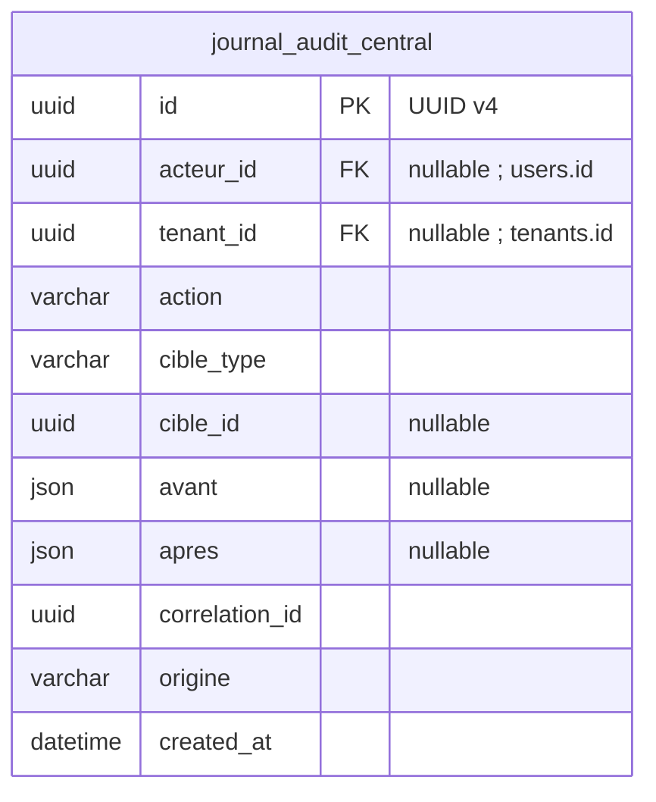
```mermaid
erDiagram
    direction TB
    journal_audit_central {
        uuid id PK "UUID v4"
        uuid acteur_id FK "nullable ; users.id"
        uuid tenant_id FK "nullable ; tenants.id"
        varchar action
        varchar cible_type
        uuid cible_id "nullable"
        json avant "nullable"
        json apres "nullable"
        uuid correlation_id
        varchar origine
        datetime created_at
    }
```

#### Explication très simple des champs

**`journal_audit_central` :**

- **`id`** : le numéro unique qui permet de reconnaître cette ligne dans la base. Deux lignes différentes ne peuvent pas avoir le même `id`.
- **`acteur_id`** : l’identifiant de la personne qui a fait l’action. Il sert à relier cette ligne à la bonne information au lieu de recopier toutes ses données. Ce champ peut rester vide quand cette information n’est pas nécessaire ou pas encore connue.
- **`tenant_id`** : l’identifiant de la boutique. Il sert à relier cette ligne à la bonne information au lieu de recopier toutes ses données. Ce champ peut rester vide quand cette information n’est pas nécessaire ou pas encore connue.
- **`action`** : le nom de l’action réalisée. Exemple : `abonnement.modifier`.
- **`cible_type`** : le type de chose concernée par l’action. Exemple : `tenant`, `user` ou `role`.
- **`cible_id`** : l’identifiant de l’élément précis concerné par l’action. Ce champ peut rester vide quand cette information n’est pas nécessaire ou pas encore connue.
- **`avant`** : une petite copie des informations importantes avant la modification. Exemple : ancien statut = `actif`. Ce champ peut rester vide quand cette information n’est pas nécessaire ou pas encore connue.
- **`apres`** : une petite copie des informations importantes après la modification. Exemple : nouveau statut = `suspendu`. Ce champ peut rester vide quand cette information n’est pas nécessaire ou pas encore connue.
- **`correlation_id`** : un numéro commun utilisé pour relier plusieurs traces qui appartiennent à la même grande opération. Exemple : une création de boutique qui produit plusieurs actions techniques.
- **`origine`** : indique d’où vient l’action. Exemple : utilisateur, serveur, tâche automatique ou transporteur.
- **`created_at`** : la date où cette ligne a été créée dans la base.


Les références vers un autre module sont indiquées sur les champs, même si leur flèche n’est pas redessinée ici.

- **`journal_audit_central` :** Ce journal fonctionne comme un carnet qu’on ne gomme pas : on ajoute de nouvelles lignes mais on ne réécrit pas les anciennes. On n’y enregistre jamais les mots de passe, codes OTP, tokens de connexion ou secrets API. `cible_type` et `cible_id` servent à dire quel objet était concerné, même si cet objet n’a pas une FK SQL directe vers le journal. Même le compte `root` ne possède pas de bouton métier permettant d’effacer les traces d’audit.

### C7 — Comptes transporteur et tarifs versionnés

**`comptes_livraison` — Les comptes utilisés par un propriétaire auprès des transporteurs, avec les informations de connexion protégées. Exemple : Karim utilise son compte EcoTrack pour plusieurs de ses boutiques.**

**`boutiques_comptes_livraison` — Indique quelles boutiques utilisent quel compte transporteur. Exemple : les deux boutiques de Karim utilisent son même compte EcoTrack, sans partager leurs données commerciales.**

**`tarifs_transporteur` — Les prix de retour convenus pour un compte transporteur, avec leurs dates d’application. Exemple : un retour coûte 300 DA pendant une période ; un nouveau tarif ne change pas les anciens frais.**

Les comptes API sont mutualisés au niveau du propriétaire, jamais entre propriétaires différents. Le profil local `prestataires_livraison` référence le compte sans recopier ses secrets. Le pivot utilise `tenant_id` plutôt que `boutique_id` : l’identité centrale d’une boutique est `tenants.id`.

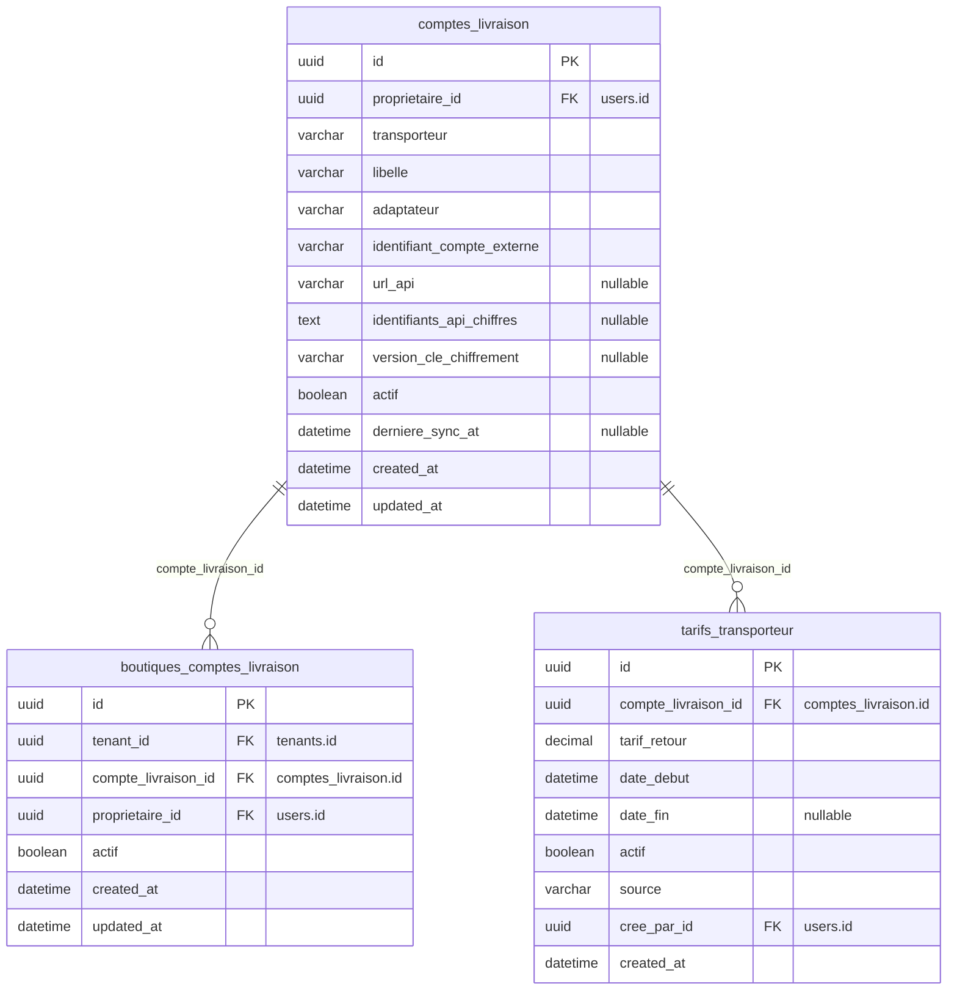
```mermaid
erDiagram
    direction TB
    comptes_livraison {
        uuid id PK
        uuid proprietaire_id FK "users.id"
        varchar transporteur
        varchar libelle
        varchar adaptateur
        varchar identifiant_compte_externe
        varchar url_api "nullable"
        text identifiants_api_chiffres "nullable"
        varchar version_cle_chiffrement "nullable"
        boolean actif
        datetime derniere_sync_at "nullable"
        datetime created_at
        datetime updated_at
    }
    boutiques_comptes_livraison {
        uuid id PK
        uuid tenant_id FK "tenants.id"
        uuid compte_livraison_id FK "comptes_livraison.id"
        uuid proprietaire_id FK "users.id"
        boolean actif
        datetime created_at
        datetime updated_at
    }
    tarifs_transporteur {
        uuid id PK
        uuid compte_livraison_id FK "comptes_livraison.id"
        decimal tarif_retour
        datetime date_debut
        datetime date_fin "nullable"
        boolean actif
        varchar source
        uuid cree_par_id FK "users.id"
        datetime created_at
    }
    comptes_livraison ||--o{ boutiques_comptes_livraison : compte_livraison_id
    comptes_livraison ||--o{ tarifs_transporteur : compte_livraison_id
```

#### Explication très simple des champs

**`comptes_livraison` :**

- **`id`** : le numéro unique qui permet de reconnaître cette ligne dans la base. Deux lignes différentes ne peuvent pas avoir le même `id`.
- **`proprietaire_id`** : l’identifiant du propriétaire. Il sert à relier cette ligne à la bonne information au lieu de recopier toutes ses données.
- **`transporteur`** : le nom du transporteur concerné. Exemple : EcoTrack ou un autre prestataire configuré.
- **`libelle`** : un nom court utilisé pour reconnaître facilement l’élément à l’écran.
- **`adaptateur`** : le nom du morceau de programme qui sait parler avec ce transporteur. Cela permet d’utiliser des APIs différentes sans mélanger leur logique.
- **`identifiant_compte_externe`** : le numéro ou nom qui identifie ce compte chez le transporteur.
- **`url_api`** : l’adresse utilisée par le serveur pour parler avec l’API du transporteur. Ce champ peut rester vide quand cette information n’est pas nécessaire ou pas encore connue.
- **`identifiants_api_chiffres`** : les informations secrètes de connexion au transporteur, enregistrées sous forme chiffrée et non lisible directement. Ce champ peut rester vide quand cette information n’est pas nécessaire ou pas encore connue.
- **`version_cle_chiffrement`** : indique quelle version de la clé a servi à chiffrer les secrets. La clé elle-même n’est pas stockée ici. Ce champ peut rester vide quand cette information n’est pas nécessaire ou pas encore connue.
- **`actif`** : indique si l’élément peut encore être utilisé. `true` = oui, `false` = non.
- **`derniere_sync_at`** : la dernière fois où le SaaS a synchronisé ce compte avec le service externe. Ce champ peut rester vide quand cette information n’est pas nécessaire ou pas encore connue.
- **`created_at`** : la date où cette ligne a été créée dans la base.
- **`updated_at`** : la date de la dernière modification de cette ligne. Exemple : si tu modifies l’élément aujourd’hui, cette date devient celle d’aujourd’hui.

**`boutiques_comptes_livraison` :**

- **`id`** : le numéro unique qui permet de reconnaître cette ligne dans la base. Deux lignes différentes ne peuvent pas avoir le même `id`.
- **`tenant_id`** : l’identifiant de la boutique. Il sert à relier cette ligne à la bonne information au lieu de recopier toutes ses données.
- **`compte_livraison_id`** : l’identifiant du compte transporteur. Il sert à relier cette ligne à la bonne information au lieu de recopier toutes ses données.
- **`proprietaire_id`** : l’identifiant du propriétaire. Il sert à relier cette ligne à la bonne information au lieu de recopier toutes ses données.
- **`actif`** : indique si l’élément peut encore être utilisé. `true` = oui, `false` = non.
- **`created_at`** : la date où cette ligne a été créée dans la base.
- **`updated_at`** : la date de la dernière modification de cette ligne. Exemple : si tu modifies l’élément aujourd’hui, cette date devient celle d’aujourd’hui.

**`tarifs_transporteur` :**

- **`id`** : le numéro unique qui permet de reconnaître cette ligne dans la base. Deux lignes différentes ne peuvent pas avoir le même `id`.
- **`compte_livraison_id`** : l’identifiant du compte transporteur. Il sert à relier cette ligne à la bonne information au lieu de recopier toutes ses données.
- **`tarif_retour`** : le prix facturé pour un retour selon ce compte transporteur. Exemple : 300 DA.
- **`date_debut`** : la date où cette règle ou ce tarif commence à s’appliquer.
- **`date_fin`** : la date où cette règle ou ce tarif arrête de s’appliquer. Si elle est vide, il n’y a pas encore de fin prévue.
- **`actif`** : indique si l’élément peut encore être utilisé. `true` = oui, `false` = non.
- **`source`** : indique d’où vient l’information. Exemple : saisie manuelle ou réponse de l’API.
- **`cree_par_id`** : l’identifiant de la personne qui a créé l’élément. Il sert à relier cette ligne à la bonne information au lieu de recopier toutes ses données.
- **`created_at`** : la date où cette ligne a été créée dans la base.


- **`comptes_livraison` :** UNIQUE(id,proprietaire_id), UNIQUE(transporteur,identifiant_compte_externe). Le compte externe canonique est vérifié avant activation pour éviter deux enregistrements du même compte ; à défaut d’identification fiable par API, activation manuelle contrôlée. Propriétaire et identité externe immuables dès utilisation. Secrets chiffrés au repos, déchiffrables uniquement par le connecteur serveur ; `version_cle_chiffrement` identifie la version de clé utilisée. **La clé maître elle-même reste hors de cette BDD**, dans le gestionnaire de secrets/clé de l’infrastructure, avec sauvegarde/versionnement indépendants afin qu’une restauration centrale ne réactive pas aveuglément une ancienne clé. URL autorisée pour éviter les appels arbitraires. Un compte manuel peut ne pas avoir de secret. Un rôle d’une boutique ne donne jamais accès aux autres boutiques utilisant ce compte.
- **`boutiques_comptes_livraison` :** UNIQUE(tenant_id,compte_livraison_id), UNIQUE(id,tenant_id,compte_livraison_id). FK(tenant_id,proprietaire_id) → tenants(id,proprietaire_id) et FK(compte_livraison_id,proprietaire_id) → comptes_livraison(id,proprietaire_id). L’association et le compte doivent être actifs pour de nouveaux envois. Leur désactivation conserve les liens historiques et autorise un rapprochement de clôture contrôlé.
- **`tarifs_transporteur` :** UNIQUE(compte_livraison_id,date_debut), tarif_retour>=0, date_fin NULL ou >date_debut. Intervalles semi-ouverts [date_debut,date_fin), sans chevauchement pour un compte ; insertion sous verrou du compte. Les montants déjà appliqués ne changent jamais. Pour un changement futur, fermer l’ancien intervalle sans invalider les frais historiques, puis créer la nouvelle version. `actif` autorise l’utilisation de la version ; une version échue reste consultable. Source manuel|api. Un tarif nul signifie gratuit explicitement, jamais « inconnu ».

**Application d’un tarif de retour.** Le fait générateur retenu est l’acceptation du retour par le transporteur, et non la simple demande du commerçant. Sa date fiable est enregistrée dans frais_transporteur.fait_generateur_at ; à défaut, date de première observation et source_date=observation. Sélectionner le tarif du compte à cette date et figer montant, tarif_source_id et tarif_snapshot. Si aucun tarif n’est applicable, signaler une anomalie et bloquer la constatation financière automatique sans bloquer la réception physique ; aucun zéro inventé. Un montant réellement facturé différent se corrige par écritures compensatoires après vérification. Ce fait générateur reste un paramètre de l’adaptateur à valider contre le contrat du compte avant lancement.

### C8 — Routage des colis et règlements partagés

**`registre_colis_transporteur` — Indique à quelle boutique appartient chaque colis d’un compte transporteur. Exemple : le suivi reçu pour le colis X doit être envoyé à la boutique de Karim, pas à une autre.**

**`lots_reversement_transporteur` — Les règlements globaux d’un compte transporteur, avant leur répartition entre boutiques. Exemple : un versement vérifié de 20 000 DA concerne les deux boutiques de Karim.**

**`parts_reversement_tenants` — La part de chaque boutique dans un règlement global du transporteur. Exemple : sur 20 000 DA, 12 000 DA reviennent à la première boutique et 8 000 DA à la seconde.**

Ces tables centrales contiennent des identifiants et des montants de routage, pas les produits ni les coordonnées des acheteurs. Elles empêchent qu’un polling de compte partagé attribue le même colis ou règlement à deux boutiques.

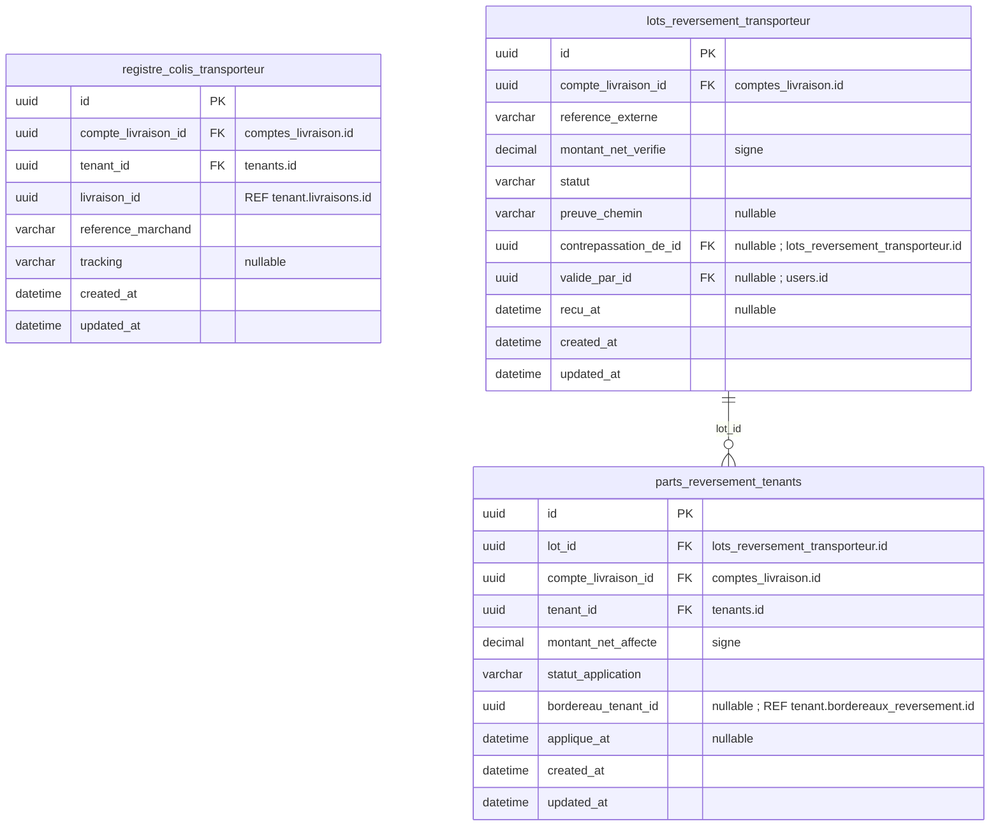
```mermaid
erDiagram
    direction TB
    registre_colis_transporteur {
        uuid id PK
        uuid compte_livraison_id FK "comptes_livraison.id"
        uuid tenant_id FK "tenants.id"
        uuid livraison_id "REF tenant.livraisons.id"
        varchar reference_marchand
        varchar tracking "nullable"
        datetime created_at
        datetime updated_at
    }
    lots_reversement_transporteur {
        uuid id PK
        uuid compte_livraison_id FK "comptes_livraison.id"
        varchar reference_externe
        decimal montant_net_verifie "signe"
        varchar statut
        varchar preuve_chemin "nullable"
        uuid contrepassation_de_id FK "nullable ; lots_reversement_transporteur.id"
        uuid valide_par_id FK "nullable ; users.id"
        datetime recu_at "nullable"
        datetime created_at
        datetime updated_at
    }
    parts_reversement_tenants {
        uuid id PK
        uuid lot_id FK "lots_reversement_transporteur.id"
        uuid compte_livraison_id FK "comptes_livraison.id"
        uuid tenant_id FK "tenants.id"
        decimal montant_net_affecte "signe"
        varchar statut_application
        uuid bordereau_tenant_id "nullable ; REF tenant.bordereaux_reversement.id"
        datetime applique_at "nullable"
        datetime created_at
        datetime updated_at
    }
    lots_reversement_transporteur ||--o{ parts_reversement_tenants : lot_id
```

#### Explication très simple des champs

**`registre_colis_transporteur` :**

- **`id`** : le numéro unique qui permet de reconnaître cette ligne dans la base. Deux lignes différentes ne peuvent pas avoir le même `id`.
- **`compte_livraison_id`** : l’identifiant du compte transporteur. Il sert à relier cette ligne à la bonne information au lieu de recopier toutes ses données.
- **`tenant_id`** : l’identifiant de la boutique. Il sert à relier cette ligne à la bonne information au lieu de recopier toutes ses données.
- **`livraison_id`** : l’identifiant de la livraison. Il sert à relier cette ligne à la bonne information au lieu de recopier toutes ses données.
- **`reference_marchand`** : un numéro stable créé côté marchand/SaaS pour reconnaître le colis chez le transporteur.
- **`tracking`** : le numéro de suivi du colis donné par le transporteur. Ce champ peut rester vide quand cette information n’est pas nécessaire ou pas encore connue.
- **`created_at`** : la date où cette ligne a été créée dans la base.
- **`updated_at`** : la date de la dernière modification de cette ligne. Exemple : si tu modifies l’élément aujourd’hui, cette date devient celle d’aujourd’hui.

**`lots_reversement_transporteur` :**

- **`id`** : le numéro unique qui permet de reconnaître cette ligne dans la base. Deux lignes différentes ne peuvent pas avoir le même `id`.
- **`compte_livraison_id`** : l’identifiant du compte transporteur. Il sert à relier cette ligne à la bonne information au lieu de recopier toutes ses données.
- **`reference_externe`** : le numéro donné par un système extérieur. Exemple : référence d’un reversement chez le transporteur.
- **`montant_net_verifie`** : le montant net réellement vérifié pour ce lot, après contrôle des informations disponibles.
- **`statut`** : indique où en est l’élément. Exemple : `en_attente`, `actif`, `termine` ou `annule` selon la table.
- **`preuve_chemin`** : l’endroit où est rangé le fichier servant de preuve, par exemple un reçu ou un bordereau. Le fichier lui-même n’est pas stocké dans ce champ. Ce champ peut rester vide quand cette information n’est pas nécessaire ou pas encore connue.
- **`contrepassation_de_id`** : l’identifiant de l’ancienne écriture annulée par une écriture inverse. Il sert à relier cette ligne à la bonne information au lieu de recopier toutes ses données. Ce champ peut rester vide quand cette information n’est pas nécessaire ou pas encore connue.
- **`valide_par_id`** : l’identifiant de la personne qui a validé. Il sert à relier cette ligne à la bonne information au lieu de recopier toutes ses données. Ce champ peut rester vide quand cette information n’est pas nécessaire ou pas encore connue.
- **`recu_at`** : la date et l’heure liées à **recu**. Elle permet de savoir exactement quand cette étape a eu lieu. Ce champ peut rester vide quand cette information n’est pas nécessaire ou pas encore connue.
- **`created_at`** : la date où cette ligne a été créée dans la base.
- **`updated_at`** : la date de la dernière modification de cette ligne. Exemple : si tu modifies l’élément aujourd’hui, cette date devient celle d’aujourd’hui.

**`parts_reversement_tenants` :**

- **`id`** : le numéro unique qui permet de reconnaître cette ligne dans la base. Deux lignes différentes ne peuvent pas avoir le même `id`.
- **`lot_id`** : l’identifiant du lot de reversement. Il sert à relier cette ligne à la bonne information au lieu de recopier toutes ses données.
- **`compte_livraison_id`** : l’identifiant du compte transporteur. Il sert à relier cette ligne à la bonne information au lieu de recopier toutes ses données.
- **`tenant_id`** : l’identifiant de la boutique. Il sert à relier cette ligne à la bonne information au lieu de recopier toutes ses données.
- **`montant_net_affecte`** : la partie du montant global attribuée à cette boutique.
- **`statut_application`** : indique si la part ou l’opération a déjà été appliquée dans la base de la boutique. Exemple : `en_attente`, `appliquee` ou `erreur`.
- **`bordereau_tenant_id`** : l’identifiant du bordereau créé dans la base de la boutique. Il sert à relier cette ligne à la bonne information au lieu de recopier toutes ses données. Ce champ peut rester vide quand cette information n’est pas nécessaire ou pas encore connue.
- **`applique_at`** : la date et l’heure liées à **applique**. Elle permet de savoir exactement quand cette étape a eu lieu. Ce champ peut rester vide quand cette information n’est pas nécessaire ou pas encore connue.
- **`created_at`** : la date où cette ligne a été créée dans la base.
- **`updated_at`** : la date de la dernière modification de cette ligne. Exemple : si tu modifies l’élément aujourd’hui, cette date devient celle d’aujourd’hui.


- **`registre_colis_transporteur` :** UNIQUE(compte_livraison_id,reference_marchand), UNIQUE(compte_livraison_id,tracking) hors NULL, UNIQUE(tenant_id,livraison_id). FK(tenant_id,compte_livraison_id) → boutiques_comptes_livraison(tenant_id,compte_livraison_id). Référence marchand stable calculée depuis tenant et livraison, sans données personnelles. Routage immuable dès envoi. Les événements inconnus ne sont pas appliqués à une boutique par simple ressemblance de numéro ; rapprochement manuel. Le job consomme le compte une fois et route seulement les identifiants connus.
- **`lots_reversement_transporteur` :** UNIQUE(compte_livraison_id,reference_externe), UNIQUE(id,compte_livraison_id), UNIQUE(contrepassation_de_id) hors NULL. Statut=brouillon|valide|annule. Un lot validé est figé ; annulation financière via lot inverse, jamais en retirant les montants historiques. Contrôle de preuve et validation humaine si l’API ne fournit pas un bordereau détaillé. Montant signé pour les paiements de frais. Une référence de saisie manuelle doit être stable et contrôlée pour éviter les doublons.
- **`parts_reversement_tenants` :** UNIQUE(lot_id,tenant_id), FK(lot_id,compte_livraison_id) → lots_reversement_transporteur(id,compte_livraison_id), FK(tenant_id,compte_livraison_id) → boutiques_comptes_livraison(tenant_id,compte_livraison_id). Avant validation du lot, somme des parts = net vérifié sous verrou du lot. Parts figées après validation ; statut_application=en_attente|appliquee|erreur. Chaque BDD tenant crée son bordereau de façon idempotente sur UNIQUE(part_centrale_id). Un crash entre commit tenant et accusé central est repris en recherchant cette même clé. Le central prouve la réception globale ; les lignes locales en expliquent la ventilation. Ne jamais additionner les montants centraux aux locaux dans le résultat financier.

Il n’existe pas de transaction atomique couvrant arbitrairement les deux connexions : enregistrement durable, clés stables, états de reprise et réconciliation sont obligatoires. Un compte personnel à une seule boutique utilise le même protocole. Un livreur interne, sans compte central, utilise directement les bordereaux locaux.

### C9 — Historique des déploiements des BDD

**`deploiements_schema_tenants` — L’historique de création et de mise à jour technique des bases des boutiques. Exemple : la mise à jour de la boutique de Karim a réussi, tandis qu’une autre doit être réessayée.**

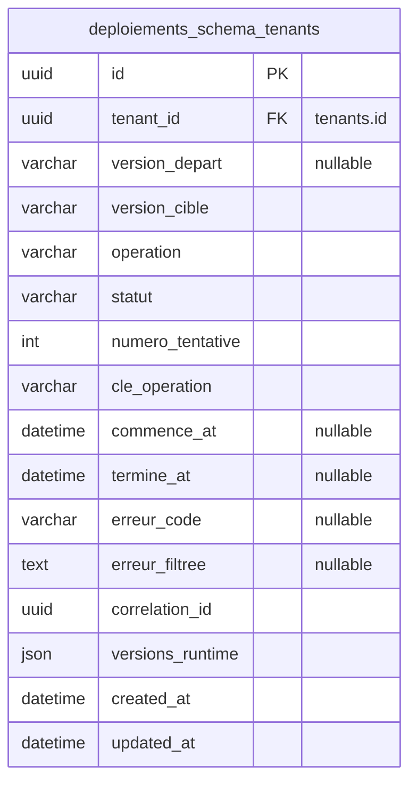
```mermaid
erDiagram
    direction TB
    deploiements_schema_tenants {
        uuid id PK
        uuid tenant_id FK "tenants.id"
        varchar version_depart "nullable"
        varchar version_cible
        varchar operation
        varchar statut
        int numero_tentative
        varchar cle_operation
        datetime commence_at "nullable"
        datetime termine_at "nullable"
        varchar erreur_code "nullable"
        text erreur_filtree "nullable"
        uuid correlation_id
        json versions_runtime
        datetime created_at
        datetime updated_at
    }
```

#### Explication très simple des champs

**`deploiements_schema_tenants` :**

- **`id`** : le numéro unique qui permet de reconnaître cette ligne dans la base. Deux lignes différentes ne peuvent pas avoir le même `id`.
- **`tenant_id`** : l’identifiant de la boutique. Il sert à relier cette ligne à la bonne information au lieu de recopier toutes ses données.
- **`version_depart`** : la version technique présente avant la migration. Ce champ peut rester vide quand cette information n’est pas nécessaire ou pas encore connue.
- **`version_cible`** : la version technique que l’on veut installer.
- **`operation`** : le type de travail technique réalisé. Exemple : création de base, migration ou restauration.
- **`statut`** : indique où en est l’élément. Exemple : `en_attente`, `actif`, `termine` ou `annule` selon la table.
- **`numero_tentative`** : le numéro de l’essai. Exemple : 1 pour le premier essai, 2 après un nouvel essai.
- **`cle_operation`** : une clé unique utilisée pour reconnaître une opération déjà faite. Exemple : si le serveur reçoit deux fois la même demande après une coupure, cette clé aide à éviter de faire l’opération deux fois.
- **`commence_at`** : la date et l’heure où la période ou l’action commence. Ce champ peut rester vide quand cette information n’est pas nécessaire ou pas encore connue.
- **`termine_at`** : la date et l’heure où elle s’est terminée. Peut rester vide tant que ce n’est pas terminé.
- **`erreur_code`** : un petit code qui permet de reconnaître le type d’erreur sans stocker un long message sensible. Ce champ peut rester vide quand cette information n’est pas nécessaire ou pas encore connue.
- **`erreur_filtree`** : un message d’erreur nettoyé pour ne pas enregistrer de mot de passe, jeton ou autre secret. Ce champ peut rester vide quand cette information n’est pas nécessaire ou pas encore connue.
- **`correlation_id`** : un numéro commun utilisé pour relier plusieurs traces qui appartiennent à la même grande opération. Exemple : une création de boutique qui produit plusieurs actions techniques.
- **`versions_runtime`** : la liste des versions réellement utilisées pendant l’opération. Exemple : version de PHP, Laravel, MySQL et de l’application.
- **`created_at`** : la date où cette ligne a été créée dans la base.
- **`updated_at`** : la date de la dernière modification de cette ligne. Exemple : si tu modifies l’élément aujourd’hui, cette date devient celle d’aujourd’hui.


**Contraintes :** UNIQUE(cle_operation), index(tenant_id,created_at). operation=provisionnement|migration|restauration_controle ; statut=en_attente|en_cours|reussi|echec. Une seule opération en cours par tenant via clé générée conditionnelle UNIQUE et verrou de déploiement. Chaque reprise conserve l’échec précédent et crée une nouvelle tentative. versions_runtime fige PHP, Laravel, stancl/tenancy, MySQL et version applicative réellement utilisés. tenants.version_schema est mis à jour seulement après succès ; la table technique migrations de chaque BDD reste le détail des migrations exécutées. Une migration échouée ne rend pas le tenant actif. Après restauration, contrôler références centrales, autorisations, registre transporteur, parts de règlements et jobs avant réactivation. Une intention externe incertaine reste à rapprocher ; ne pas la renvoyer aveuglément après restauration.

### C10 — Identité légale du vendeur

**`entites_legales` — Les informations officielles du vendeur utilisées notamment sur les factures. Exemple : le nom de son entreprise, son adresse légale et ses identifiants. Dans ce modèle, un propriétaire a une seule identité légale pour ses boutiques.**

**Hypothèse MVP retenue : un propriétaire correspond à une seule entité légale, commune à ses boutiques.** Ce choix reprend F9/G1 des notes ; il ne découle pas de la propriété technique du compte. Gérer plusieurs sociétés pour un même propriétaire nécessiterait un rattachement explicite par tenant et une migration dédiée.

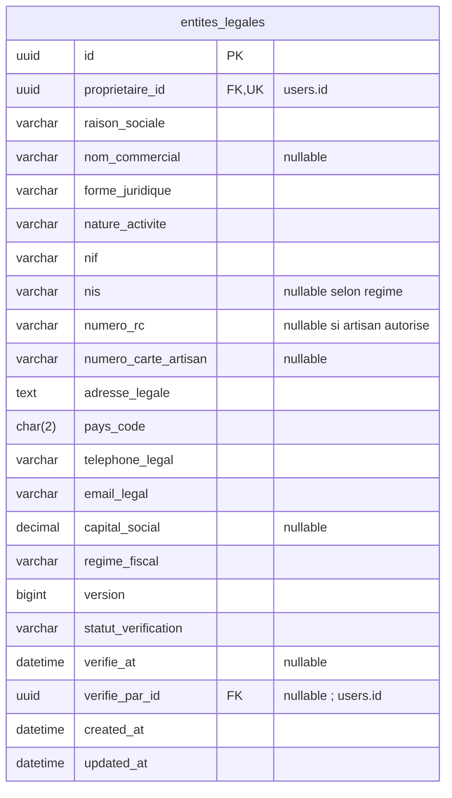
```mermaid
erDiagram
    direction TB
    entites_legales {
        uuid id PK
        uuid proprietaire_id FK,UK "users.id"
        varchar raison_sociale
        varchar nom_commercial "nullable"
        varchar forme_juridique
        varchar nature_activite
        varchar nif
        varchar nis "nullable selon regime"
        varchar numero_rc "nullable si artisan autorise"
        varchar numero_carte_artisan "nullable"
        text adresse_legale
        char(2) pays_code
        varchar telephone_legal
        varchar email_legal
        decimal capital_social "nullable"
        varchar regime_fiscal
        bigint version
        varchar statut_verification
        datetime verifie_at "nullable"
        uuid verifie_par_id FK "nullable ; users.id"
        datetime created_at
        datetime updated_at
    }
```

#### Explication très simple des champs


**`entites_legales` :**

- **`id`** : le numéro unique qui permet de reconnaître cette ligne dans la base. Deux lignes différentes ne peuvent pas avoir le même `id`.
- **`proprietaire_id`** : l’identifiant du propriétaire. Il sert à relier cette ligne à la bonne information au lieu de recopier toutes ses données.
- **`raison_sociale`** : le nom légal de l’entreprise ou de l’activité du vendeur.
- **`nom_commercial`** : le nom utilisé commercialement s’il est différent du nom légal. Ce champ peut rester vide quand cette information n’est pas nécessaire ou pas encore connue.
- **`forme_juridique`** : la forme juridique déclarée de l’activité.
- **`nature_activite`** : le type d’activité exercée par le vendeur.
- **`nif`** : le numéro d’identification fiscale, conservé comme texte.
- **`nis`** : le numéro d’identification statistique lorsqu’il est nécessaire. Ce champ peut rester vide quand cette information n’est pas nécessaire ou pas encore connue.
- **`numero_rc`** : le numéro du registre de commerce lorsqu’il s’applique. Ce champ peut rester vide quand cette information n’est pas nécessaire ou pas encore connue.
- **`numero_carte_artisan`** : le numéro de carte d’artisan lorsqu’il s’applique. Ce champ peut rester vide quand cette information n’est pas nécessaire ou pas encore connue.
- **`adresse_legale`** : l’adresse officielle de l’entité légale.
- **`pays_code`** : le code court du pays. Exemple : `DZ` pour l’Algérie.
- **`telephone_legal`** : le téléphone officiel de l’entité légale.
- **`email_legal`** : l’email officiel de l’entité légale.
- **`capital_social`** : le capital social déclaré lorsqu’il existe.
- **`regime_fiscal`** : le régime fiscal déclaré pour cette entité.
- **`version`** : le numéro de version de cet élément. Exemple : version 1, puis version 2 après une évolution ; l’ancienne version peut rester conservée pour comprendre l’historique.
- **`statut_verification`** : indique où en est la vérification. Exemple : `a_verifier`, `verifiee` ou `a_corriger`.
- **`verifie_at`** : la date où l’information a été vérifiée. Ce champ peut rester vide quand cette information n’est pas nécessaire ou pas encore connue.
- **`verifie_par_id`** : l’identifiant de la personne qui a vérifié. Il sert à relier cette ligne à la bonne information au lieu de recopier toutes ses données. Ce champ peut rester vide quand cette information n’est pas nécessaire ou pas encore connue.
- **`created_at`** : la date où cette ligne a été créée dans la base.
- **`updated_at`** : la date de la dernière modification de cette ligne. Exemple : si tu modifies l’élément aujourd’hui, cette date devient celle d’aujourd’hui.


UNIQUE(proprietaire_id) ; FK RESTRICT. Numéros conservés en chaînes, normalisation et validation selon le régime déclaré, pas de longueur numérique algérienne imposée à un identifiant international futur. Au moins RC ou carte artisan renseigné dans un profil vérifié ; conditions de validité contrôlées selon activité. Capital NULL si inapplicable ; sinon >=0. `statut_verification=a_completer|a_verifier|verifiee|a_corriger` ; absence d’identité vérifiée bloque l’activation commerciale, pas la création du brouillon de boutique. Propriétaire immuable. Un changement incrémente version, révoque la validation si nécessaire et laisse une trace filtrée au central.

La révision acceptée et les factures figent `entite_legale_id`, version et données requises dans leur snapshot vendeur. Cette copie est une preuve historique, pas un second profil modifiable. Lire l’identité centrale dans une courte transaction et utiliser ce snapshot déterminé pour l’opération locale ; aucune promesse de commit distribué. Un changement de société juridiquement distincte n’est pas traité comme une simple correction de libellé. Adresse commerciale, nom de boutique et identité légale sont trois notions distinctes.

### C11 — Politiques et exécutions de conservation

**`politiques_retention` — Les règles qui indiquent combien de temps garder chaque catégorie de données et quoi faire ensuite. Exemple : supprimer certaines données à la fin d’une durée validée.**

**`executions_retention` — L’historique des opérations qui appliquent ces règles de conservation. Exemple : une tâche a traité des données anciennes et indique combien de lignes ont été traitées ou ignorées.**

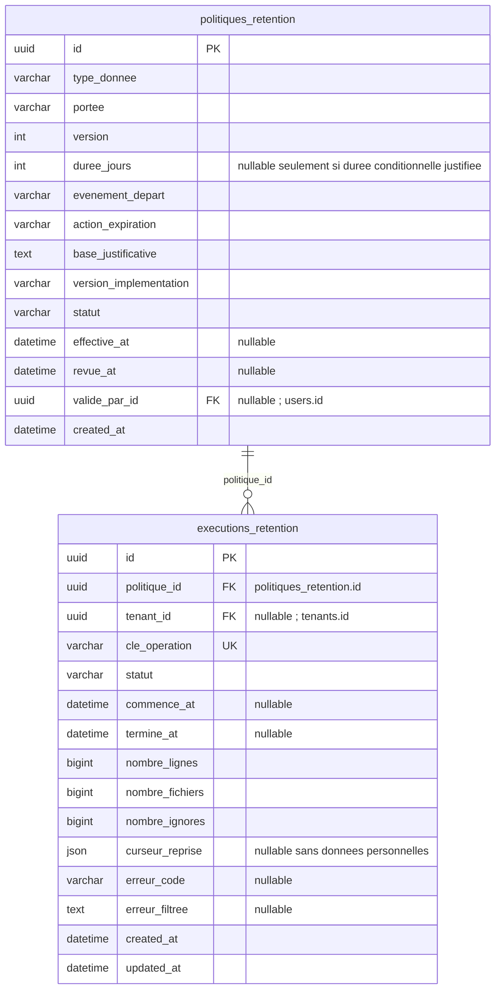
```mermaid
erDiagram
    direction TB
    politiques_retention {
        uuid id PK
        varchar type_donnee
        varchar portee
        int version
        int duree_jours "nullable seulement si duree conditionnelle justifiee"
        varchar evenement_depart
        varchar action_expiration
        text base_justificative
        varchar version_implementation
        varchar statut
        datetime effective_at "nullable"
        datetime revue_at "nullable"
        uuid valide_par_id FK "nullable ; users.id"
        datetime created_at
    }
    executions_retention {
        uuid id PK
        uuid politique_id FK "politiques_retention.id"
        uuid tenant_id FK "nullable ; tenants.id"
        varchar cle_operation UK
        varchar statut
        datetime commence_at "nullable"
        datetime termine_at "nullable"
        bigint nombre_lignes
        bigint nombre_fichiers
        bigint nombre_ignores
        json curseur_reprise "nullable sans donnees personnelles"
        varchar erreur_code "nullable"
        text erreur_filtree "nullable"
        datetime created_at
        datetime updated_at
    }
    politiques_retention ||--o{ executions_retention : politique_id
```

#### Explication très simple des champs


**`politiques_retention` :**

- **`id`** : le numéro unique qui permet de reconnaître cette ligne dans la base. Deux lignes différentes ne peuvent pas avoir le même `id`.
- **`type_donnee`** : le type de données concerné par la règle. Exemple : données de commande ou données de contact.
- **`portee`** : indique dans quel endroit la règle s’applique. Exemple : `plateforme` pour l’administration du SaaS ou `tenant` pour une boutique.
- **`version`** : le numéro de version de cet élément. Exemple : version 1, puis version 2 après une évolution ; l’ancienne version peut rester conservée pour comprendre l’historique.
- **`duree_jours`** : le nombre de jours pendant lesquels les données doivent être gardées lorsque la règle utilise une durée fixe. Ce champ peut rester vide quand cette information n’est pas nécessaire ou pas encore connue.
- **`evenement_depart`** : l’événement à partir duquel on commence à compter la durée. Exemple : fermeture d’une commande.
- **`action_expiration`** : ce qu’il faut faire à la fin de la durée. Exemple : supprimer, anonymiser ou conserver si une raison validée l’exige.
- **`base_justificative`** : le texte qui explique pourquoi cette règle de conservation existe.
- **`version_implementation`** : la version du traitement informatique qui applique cette règle.
- **`statut`** : indique où en est l’élément. Exemple : `en_attente`, `actif`, `termine` ou `annule` selon la table.
- **`effective_at`** : la date à partir de laquelle cette version devient réellement applicable. Ce champ peut rester vide quand cette information n’est pas nécessaire ou pas encore connue.
- **`revue_at`** : la date prévue ou réalisée pour revoir cette règle. Ce champ peut rester vide quand cette information n’est pas nécessaire ou pas encore connue.
- **`valide_par_id`** : l’identifiant de la personne qui a validé. Il sert à relier cette ligne à la bonne information au lieu de recopier toutes ses données. Ce champ peut rester vide quand cette information n’est pas nécessaire ou pas encore connue.
- **`created_at`** : la date où cette ligne a été créée dans la base.

**`executions_retention` :**

- **`id`** : le numéro unique qui permet de reconnaître cette ligne dans la base. Deux lignes différentes ne peuvent pas avoir le même `id`.
- **`politique_id`** : l’identifiant de la règle de conservation. Il sert à relier cette ligne à la bonne information au lieu de recopier toutes ses données.
- **`tenant_id`** : l’identifiant de la boutique. Il sert à relier cette ligne à la bonne information au lieu de recopier toutes ses données. Ce champ peut rester vide quand cette information n’est pas nécessaire ou pas encore connue.
- **`cle_operation`** : une clé unique utilisée pour reconnaître une opération déjà faite. Exemple : si le serveur reçoit deux fois la même demande après une coupure, cette clé aide à éviter de faire l’opération deux fois.
- **`statut`** : indique où en est l’élément. Exemple : `en_attente`, `actif`, `termine` ou `annule` selon la table.
- **`commence_at`** : la date et l’heure où la période ou l’action commence. Ce champ peut rester vide quand cette information n’est pas nécessaire ou pas encore connue.
- **`termine_at`** : la date et l’heure où elle s’est terminée. Peut rester vide tant que ce n’est pas terminé.
- **`nombre_lignes`** : le nombre de lignes de base traitées par l’opération.
- **`nombre_fichiers`** : le nombre de fichiers traités par l’opération.
- **`nombre_ignores`** : le nombre d’éléments laissés de côté parce qu’ils ne pouvaient pas encore être supprimés ou traités.
- **`curseur_reprise`** : une petite information technique qui indique où reprendre après une coupure, sans recommencer tout le travail depuis le début. Ce champ peut rester vide quand cette information n’est pas nécessaire ou pas encore connue.
- **`erreur_code`** : un petit code qui permet de reconnaître le type d’erreur sans stocker un long message sensible. Ce champ peut rester vide quand cette information n’est pas nécessaire ou pas encore connue.
- **`erreur_filtree`** : un message d’erreur nettoyé pour ne pas enregistrer de mot de passe, jeton ou autre secret. Ce champ peut rester vide quand cette information n’est pas nécessaire ou pas encore connue.
- **`created_at`** : la date où cette ligne a été créée dans la base.
- **`updated_at`** : la date de la dernière modification de cette ligne. Exemple : si tu modifies l’élément aujourd’hui, cette date devient celle d’aujourd’hui.


- `politiques_retention` : UNIQUE(type_donnee,portee,version), portee=central|tenant. action_expiration=purge|anonymise|conserve ; statut=brouillon|validee|retiree. Durée positive lorsqu’elle existe ; `conserve` exige un fondement et une date/condition de revue, jamais « pour toujours » par défaut. La définition appliquée est immuable ; nouvelle version pour toute évolution. La version applicable à une exécution est choisie explicitement selon effective_at et enregistrée dans politique_id ; une seule version courante résolue par catégorie/portée. L’implémentation est une allowlist de traitements serveur, pas du SQL administrable. Les durées ne sont pas inventées ici : elles sont validées avant collecte réelle.
- `executions_retention` : scope central → tenant NULL ; scope tenant → tenant obligatoire, vérifié côté service. statut=en_attente|en_cours|reussie|echec ; UNIQUE(cle_operation), clé déterministe politique/tenant/fenêtre. Le lot local est idempotent, son ACK central peut être repris ; compteurs reconstruits depuis les lots techniques persistés, pas incrémentés aveuglément après un crash. Pas de copie des données effacées dans le journal. Les exécutions centrales n’ont accès qu’au tenant annoncé ; reprise avec curseur stable. Voir section 12 pour les dépendances, gels de conservation et sauvegardes.

### C12 — Sauvegardes/restaurations tenant, registre documentaire et reprise centrale

**`configurations_sauvegardes` — Le planning des copies de sécurité d’une boutique. Exemple : sauvegarder chaque jour à une heure choisie et conserver les copies pendant la durée prévue.**

**`limites_sauvegardes_plans` — Ce que chaque abonnement autorise pour les sauvegardes. Exemple : permettre ou non de choisir l’heure, et limiter le nombre de copies conservées.**

**`sauvegardes_tenants` — La liste des copies de sécurité réalisées ou tentées pour les boutiques. Exemple : la sauvegarde de lundi a réussi ; on conserve sa date et l’emplacement de son fichier protégé.**

**`restaurations_tenants` — L’historique des tentatives pour remettre une boutique dans l’état d’une sauvegarde. Exemple : restaurer la copie de lundi, puis vérifier les données avant de rouvrir la boutique.**

**`operations_centrales_tenants` — Les opérations centrales à transmettre ou à réappliquer à une boutique, avec leur état. Exemple : après une restauration, retrouver une opération centrale que la copie restaurée ne contient pas encore.**

**`registre_documents_emis` — La liste durable des documents déjà émis et de leurs numéros. Exemple : après une restauration, empêcher qu’un numéro de facture déjà utilisé soit attribué à une autre facture.**

Les sauvegardes tenant sont pilotées au central, afin que leurs références et l’historique de restauration ne disparaissent pas avec la BDD tenant restaurée. Les fichiers sont privés, chiffrés et accompagnés d’une empreinte ; les clés de chiffrement ne sont pas conservées dans ces tables. **La BDD centrale possède en plus son propre backup/PITR et son propre runbook de reprise, stockés/pilotés hors de la BDD centrale elle-même.** C12 conserve aussi un registre durable des identités documentaires émises afin qu’une restauration tenant ne puisse pas réutiliser un numéro déjà sorti du système.

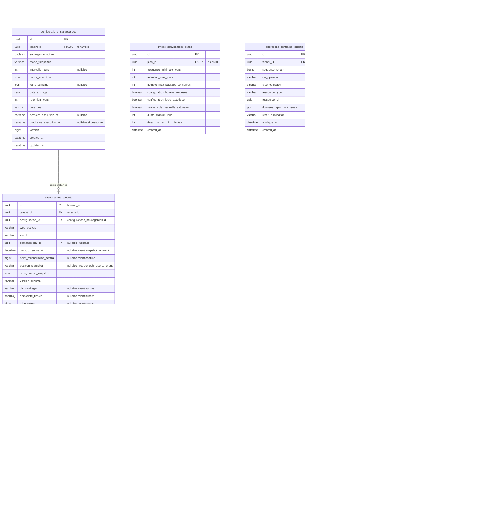
```mermaid
erDiagram
    direction TB
    configurations_sauvegardes {
        uuid id PK
        uuid tenant_id FK,UK "tenants.id"
        boolean sauvegarde_active
        varchar mode_frequence
        int intervalle_jours "nullable"
        time heure_execution
        json jours_semaine "nullable"
        date date_ancrage
        int retention_jours
        varchar timezone
        datetime derniere_execution_at "nullable"
        datetime prochaine_execution_at "nullable si desactive"
        bigint version
        datetime created_at
        datetime updated_at
    }
    limites_sauvegardes_plans {
        uuid id PK
        uuid plan_id FK,UK "plans.id"
        int frequence_minimale_jours
        int retention_max_jours
        int nombre_max_backups_conserves
        boolean configuration_horaire_autorisee
        boolean configuration_jours_autorisee
        boolean sauvegarde_manuelle_autorisee
        int quota_manuel_jour
        int delai_manuel_min_minutes
        datetime created_at
    }
    sauvegardes_tenants {
        uuid id PK "backup_id"
        uuid tenant_id FK "tenants.id"
        uuid configuration_id FK "configurations_sauvegardes.id"
        varchar type_backup
        varchar statut
        uuid demande_par_id FK "nullable ; users.id"
        datetime backup_realise_at "nullable avant snapshot coherent"
        bigint point_reconciliation_central "nullable avant capture"
        varchar position_snapshot "nullable ; repere technique coherent"
        json configuration_snapshot
        varchar version_schema
        varchar cle_stockage "nullable avant succes"
        char(64) empreinte_fichier "nullable avant succes"
        bigint taille_octets "nullable avant succes"
        datetime expire_at "nullable avant capture"
        varchar cle_operation UK
        datetime commence_at "nullable"
        datetime termine_at "nullable"
        varchar erreur_code "nullable"
        datetime created_at
        datetime updated_at
    }
    restaurations_tenants {
        uuid id PK
        uuid tenant_id FK "tenants.id"
        uuid restaure_depuis_backup_id FK "sauvegardes_tenants.id"
        varchar statut
        varchar statut_tenant_avant
        bigint point_reconciliation_central
        bigint curseur_reconciliation
        datetime restauration_debutee_at "nullable"
        datetime restauration_terminee_at "nullable"
        uuid demande_par_id FK "users.id"
        varchar cle_operation UK
        json controles_resultat "nullable ; sans donnees personnelles"
        varchar erreur_code "nullable"
        datetime created_at
        datetime updated_at
    }
    operations_centrales_tenants {
        uuid id PK
        uuid tenant_id FK "tenants.id"
        bigint sequence_tenant
        varchar cle_operation
        varchar type_operation
        varchar ressource_type
        uuid ressource_id
        json donnees_rejeu_minimisees
        varchar statut_application
        datetime applique_at "nullable"
        datetime created_at
    }
    registre_documents_emis {
        uuid id PK
        varchar portee_document
        uuid tenant_id FK "nullable ; tenants.id"
        uuid proprietaire_id FK "nullable ; users.id"
        varchar contexte_document "generated stored"
        uuid document_id
        varchar type_document
        varchar serie
        int exercice
        bigint numero_sequence
        varchar numero_document
        uuid commande_id "nullable ; REF tenant.commandes.id"
        uuid revision_id "nullable ; REF tenant.revisions_commandes.id"
        uuid facture_origine_id "nullable ; REF tenant.factures.id"
        varchar cle_emission_document
        char(64) empreinte_document
        varchar cle_stockage_document
        datetime date_emission
        datetime date_transmission "nullable"
        varchar statut
        datetime created_at
        datetime updated_at
    }
    configurations_sauvegardes ||--o{ sauvegardes_tenants : configuration_id
    sauvegardes_tenants ||--o{ restaurations_tenants : restaure_depuis_backup_id
```

#### Explication très simple des champs


**`configurations_sauvegardes` :**

- **`id`** : le numéro unique qui permet de reconnaître cette ligne dans la base. Deux lignes différentes ne peuvent pas avoir le même `id`.
- **`tenant_id`** : l’identifiant de la boutique. Il sert à relier cette ligne à la bonne information au lieu de recopier toutes ses données.
- **`sauvegarde_active`** : indique si les sauvegardes automatiques de cette boutique sont activées.
- **`mode_frequence`** : indique comment le planning est défini. Exemple : tous les X jours ou certains jours de la semaine.
- **`intervalle_jours`** : le nombre de jours entre deux sauvegardes. Exemple : `2` = une sauvegarde tous les deux jours. Ce champ peut rester vide quand cette information n’est pas nécessaire ou pas encore connue.
- **`heure_execution`** : l’heure à laquelle la sauvegarde automatique doit démarrer.
- **`jours_semaine`** : les jours choisis quand le planning utilise des jours précis. Exemple : lundi, mercredi et vendredi. Ce champ peut rester vide quand cette information n’est pas nécessaire ou pas encore connue.
- **`date_ancrage`** : la date de départ utilisée pour calculer les répétitions. Exemple : si on sauvegarde tous les 3 jours, on compte à partir de cette date.
- **`retention_jours`** : le nombre de jours pendant lesquels une sauvegarde est gardée avant de pouvoir être supprimée.
- **`timezone`** : la zone horaire utilisée pour calculer correctement les heures de cette configuration.
- **`derniere_execution_at`** : la dernière fois où cette tâche a été exécutée. Ce champ peut rester vide quand cette information n’est pas nécessaire ou pas encore connue.
- **`prochaine_execution_at`** : la prochaine date prévue pour exécuter automatiquement cette tâche. Ce champ peut rester vide quand cette information n’est pas nécessaire ou pas encore connue.
- **`version`** : le numéro de version de cet élément. Exemple : version 1, puis version 2 après une évolution ; l’ancienne version peut rester conservée pour comprendre l’historique.
- **`created_at`** : la date où cette ligne a été créée dans la base.
- **`updated_at`** : la date de la dernière modification de cette ligne. Exemple : si tu modifies l’élément aujourd’hui, cette date devient celle d’aujourd’hui.

**`limites_sauvegardes_plans` :**

- **`id`** : le numéro unique qui permet de reconnaître cette ligne dans la base. Deux lignes différentes ne peuvent pas avoir le même `id`.
- **`plan_id`** : l’identifiant du plan d’abonnement. Il sert à relier cette ligne à la bonne information au lieu de recopier toutes ses données.
- **`frequence_minimale_jours`** : le plus petit intervalle autorisé par le plan. Exemple : `1` permet au maximum une sauvegarde planifiée chaque jour.
- **`retention_max_jours`** : la durée maximale pendant laquelle le plan permet de garder les sauvegardes.
- **`nombre_max_backups_conserves`** : le nombre maximum de sauvegardes qui peuvent rester conservées en même temps.
- **`configuration_horaire_autorisee`** : indique si ce plan permet au commerçant de choisir lui-même l’heure de sauvegarde.
- **`configuration_jours_autorisee`** : indique si ce plan permet de choisir des jours précis de sauvegarde.
- **`sauvegarde_manuelle_autorisee`** : indique si le commerçant peut lancer une sauvegarde manuellement.
- **`quota_manuel_jour`** : le nombre maximum de sauvegardes manuelles autorisées dans une journée. Exemple : `2` = deux sauvegardes manuelles aujourd’hui, puis le compteur repart demain.
- **`delai_manuel_min_minutes`** : le nombre minimum de minutes à attendre entre deux sauvegardes manuelles.
- **`created_at`** : la date où cette ligne a été créée dans la base.

**`sauvegardes_tenants` :**

- **`id`** : le numéro unique qui permet de reconnaître cette ligne dans la base. Deux lignes différentes ne peuvent pas avoir le même `id`.
- **`tenant_id`** : l’identifiant de la boutique. Il sert à relier cette ligne à la bonne information au lieu de recopier toutes ses données.
- **`configuration_id`** : l’identifiant de la configuration. Il sert à relier cette ligne à la bonne information au lieu de recopier toutes ses données.
- **`type_backup`** : le type de sauvegarde réalisé. Exemple : sauvegarde automatique ou manuelle selon les valeurs prévues.
- **`statut`** : indique où en est l’élément. Exemple : `en_attente`, `actif`, `termine` ou `annule` selon la table.
- **`demande_par_id`** : l’identifiant de la personne qui a fait la demande. Il sert à relier cette ligne à la bonne information au lieu de recopier toutes ses données. Ce champ peut rester vide quand cette information n’est pas nécessaire ou pas encore connue.
- **`backup_realise_at`** : la date où la sauvegarde a réellement été produite. Ce champ peut rester vide quand cette information n’est pas nécessaire ou pas encore connue.
- **`point_reconciliation_central`** : la position ou référence utilisée pour savoir jusqu’où les opérations centrales ont été rapprochées après une restauration. Ce champ peut rester vide quand cette information n’est pas nécessaire ou pas encore connue.
- **`position_snapshot`** : une **copie figée** de position au moment important de l’opération. Si l’information d’origine change plus tard, cette ancienne ligne garde la valeur utilisée à ce moment-là. Ce champ peut rester vide quand cette information n’est pas nécessaire ou pas encore connue.
- **`configuration_snapshot`** : une **copie figée** de configuration au moment important de l’opération. Si l’information d’origine change plus tard, cette ancienne ligne garde la valeur utilisée à ce moment-là.
- **`version_schema`** : la version du schéma de base de données installée pour cette boutique. Elle aide à savoir si une migration technique manque.
- **`cle_stockage`** : le chemin ou la clé interne utilisée pour retrouver le fichier dans le stockage privé/public. Ce champ peut rester vide quand cette information n’est pas nécessaire ou pas encore connue.
- **`empreinte_fichier`** : une signature calculée à partir du fichier pour vérifier qu’il n’a pas été modifié ou abîmé. Ce champ peut rester vide quand cette information n’est pas nécessaire ou pas encore connue.
- **`taille_octets`** : la taille du fichier. Ce champ peut rester vide quand cette information n’est pas nécessaire ou pas encore connue.
- **`expire_at`** : la date où l’élément n’est plus valable. Ce champ peut rester vide quand cette information n’est pas nécessaire ou pas encore connue.
- **`cle_operation`** : une clé unique utilisée pour reconnaître une opération déjà faite. Exemple : si le serveur reçoit deux fois la même demande après une coupure, cette clé aide à éviter de faire l’opération deux fois.
- **`commence_at`** : la date et l’heure où la période ou l’action commence. Ce champ peut rester vide quand cette information n’est pas nécessaire ou pas encore connue.
- **`termine_at`** : la date et l’heure où elle s’est terminée. Peut rester vide tant que ce n’est pas terminé.
- **`erreur_code`** : un petit code qui permet de reconnaître le type d’erreur sans stocker un long message sensible. Ce champ peut rester vide quand cette information n’est pas nécessaire ou pas encore connue.
- **`created_at`** : la date où cette ligne a été créée dans la base.
- **`updated_at`** : la date de la dernière modification de cette ligne. Exemple : si tu modifies l’élément aujourd’hui, cette date devient celle d’aujourd’hui.

**`restaurations_tenants` :**

- **`id`** : le numéro unique qui permet de reconnaître cette ligne dans la base. Deux lignes différentes ne peuvent pas avoir le même `id`.
- **`tenant_id`** : l’identifiant de la boutique. Il sert à relier cette ligne à la bonne information au lieu de recopier toutes ses données.
- **`restaure_depuis_backup_id`** : l’identifiant de la sauvegarde utilisée pour restaurer. Il sert à relier cette ligne à la bonne information au lieu de recopier toutes ses données.
- **`statut`** : indique où en est l’élément. Exemple : `en_attente`, `actif`, `termine` ou `annule` selon la table.
- **`statut_tenant_avant`** : indique où en est **tenant avant**. Exemple : en attente, actif, terminé ou en erreur selon les valeurs prévues pour cette table.
- **`point_reconciliation_central`** : la position ou référence utilisée pour savoir jusqu’où les opérations centrales ont été rapprochées après une restauration.
- **`curseur_reconciliation`** : un numéro qui indique jusqu’où le rapprochement a déjà été fait après une restauration. Cela permet de reprendre sans tout recommencer.
- **`restauration_debutee_at`** : la date où la restauration a commencé. Ce champ peut rester vide quand cette information n’est pas nécessaire ou pas encore connue.
- **`restauration_terminee_at`** : la date où la restauration s’est terminée. Ce champ peut rester vide quand cette information n’est pas nécessaire ou pas encore connue.
- **`demande_par_id`** : l’identifiant de la personne qui a fait la demande. Il sert à relier cette ligne à la bonne information au lieu de recopier toutes ses données.
- **`cle_operation`** : une clé unique utilisée pour reconnaître une opération déjà faite. Exemple : si le serveur reçoit deux fois la même demande après une coupure, cette clé aide à éviter de faire l’opération deux fois.
- **`controles_resultat`** : le résultat des vérifications faites après restauration avant de rouvrir la boutique. Ce champ peut rester vide quand cette information n’est pas nécessaire ou pas encore connue.
- **`erreur_code`** : un petit code qui permet de reconnaître le type d’erreur sans stocker un long message sensible. Ce champ peut rester vide quand cette information n’est pas nécessaire ou pas encore connue.
- **`created_at`** : la date où cette ligne a été créée dans la base.
- **`updated_at`** : la date de la dernière modification de cette ligne. Exemple : si tu modifies l’élément aujourd’hui, cette date devient celle d’aujourd’hui.

**`operations_centrales_tenants` :**

- **`id`** : le numéro unique qui permet de reconnaître cette ligne dans la base. Deux lignes différentes ne peuvent pas avoir le même `id`.
- **`tenant_id`** : l’identifiant de la boutique. Il sert à relier cette ligne à la bonne information au lieu de recopier toutes ses données.
- **`sequence_tenant`** : le numéro d’ordre de l’opération pour cette boutique. Exemple : 15 signifie qu’elle vient après l’opération 14.
- **`cle_operation`** : une clé unique utilisée pour reconnaître une opération déjà faite. Exemple : si le serveur reçoit deux fois la même demande après une coupure, cette clé aide à éviter de faire l’opération deux fois.
- **`type_operation`** : indique quelle action a été faite sur les données ou le système. Exemple : export, suppression ou anonymisation.
- **`ressource_type`** : le type d’élément concerné. Exemple : client, commande ou fichier.
- **`ressource_id`** : l’identifiant de l’élément précis concerné. Il peut rester vide si l’opération porte sur un lot entier.
- **`donnees_rejeu_minimisees`** : plusieurs petits réglages liés à **donnees rejeu minimisees**, regroupés ensemble de manière structurée.
- **`statut_application`** : indique si la part ou l’opération a déjà été appliquée dans la base de la boutique. Exemple : `en_attente`, `appliquee` ou `erreur`.
- **`applique_at`** : la date et l’heure liées à **applique**. Elle permet de savoir exactement quand cette étape a eu lieu. Ce champ peut rester vide quand cette information n’est pas nécessaire ou pas encore connue.
- **`created_at`** : la date où cette ligne a été créée dans la base.

**`registre_documents_emis` :**

- **`id`** : le numéro unique qui permet de reconnaître cette ligne dans la base. Deux lignes différentes ne peuvent pas avoir le même `id`.
- **`portee_document`** : indique à quel ensemble appartient la numérotation du document. Exemple : série propre à une boutique ou au SaaS.
- **`tenant_id`** : l’identifiant de la boutique. Il sert à relier cette ligne à la bonne information au lieu de recopier toutes ses données. Ce champ peut rester vide quand cette information n’est pas nécessaire ou pas encore connue.
- **`proprietaire_id`** : l’identifiant du propriétaire. Il sert à relier cette ligne à la bonne information au lieu de recopier toutes ses données. Ce champ peut rester vide quand cette information n’est pas nécessaire ou pas encore connue.
- **`contexte_document`** : une valeur technique calculée qui permet de reconnaître clairement la série de documents concernée.
- **`document_id`** : l’identifiant du document. Il sert à relier cette ligne à la bonne information au lieu de recopier toutes ses données.
- **`type_document`** : indique quel document c’est. Exemple : facture, avoir ou autre type prévu.
- **`serie`** : le code de série utilisé dans la numérotation. Exemple : `FAC` pour les factures.
- **`exercice`** : l’année ou période de numérotation concernée. Exemple : `2026`.
- **`numero_sequence`** : le nombre utilisé à l’intérieur de la série du document. Exemple : `123` dans `FAC-2026-000123`.
- **`numero_document`** : le numéro lisible du document. Exemple : `FAC-2026-000123`.
- **`commande_id`** : l’identifiant de la commande. Il sert à relier cette ligne à la bonne information au lieu de recopier toutes ses données. Ce champ peut rester vide quand cette information n’est pas nécessaire ou pas encore connue.
- **`revision_id`** : l’identifiant de la version de la commande. Il sert à relier cette ligne à la bonne information au lieu de recopier toutes ses données. Ce champ peut rester vide quand cette information n’est pas nécessaire ou pas encore connue.
- **`facture_origine_id`** : l’identifiant de la facture d’origine. Il sert à relier cette ligne à la bonne information au lieu de recopier toutes ses données. Ce champ peut rester vide quand cette information n’est pas nécessaire ou pas encore connue.
- **`cle_emission_document`** : une clé unique qui empêche d’émettre deux fois deux documents différents pour la même demande.
- **`empreinte_document`** : une signature du contenu du document qui permet de vérifier qu’il est resté identique.
- **`cle_stockage_document`** : une clé technique stable pour reconnaître stockage document. Elle aide surtout à éviter les doublons quand la même demande est reçue deux fois.
- **`date_emission`** : la date officielle d’émission du document.
- **`date_transmission`** : la date où le document a été transmis. Ce champ peut rester vide quand cette information n’est pas nécessaire ou pas encore connue.
- **`statut`** : indique où en est l’élément. Exemple : `en_attente`, `actif`, `termine` ou `annule` selon la table.
- **`created_at`** : la date où cette ligne a été créée dans la base.
- **`updated_at`** : la date de la dernière modification de cette ligne. Exemple : si tu modifies l’élément aujourd’hui, cette date devient celle d’aujourd’hui.


- **Configuration :** une ligne par tenant, créée au provisionnement. Politique minimale automatique sur tous les plans ; l’utilisateur ne désactive pas la protection obligatoire, `sauvegarde_active=false` est réservé à une suspension technique auditée. Exemple initial configurable : tous les 7 jours à 02:00, rétention 14 jours, Africa/Algiers. Ce sont des valeurs de produit, pas des durées légales. `mode_frequence=quotidien|intervalle|jours_semaine`. Quotidien : intervalle/jours NULL ; intervalle : intervalle_jours>=1 et jours NULL ; jours_semaine : intervalle NULL et tableau non vide de jours ISO 1–7 distincts. CHECK des champs dépendants, validation serveur du JSON. Date d’ancrage locale fixe le cycle d’intervalle ; calculer les échéances en timezone puis stocker les instants en UTC. Une échéance ratée produit au plus un rattrapage, pas une avalanche de sauvegardes. Changements sous verrou configuration, version incrémentée ; les backups précédents gardent leur expire_at.
- **Limites du plan :** une ligne immuable avec chaque version de plan ; valeurs entières positives (quota/délai manuels peuvent valoir zéro pour interdiction/absence de délai). Les options payantes sont représentées par une version de plan incluant l’option ou des exceptions fonctionnelles validées, sans modifier un plan historique. Valider l’espacement minimal réel des jours choisis, pas seulement leur nombre ; fréquence, rétention, choix horaire/jours et sauvegarde manuelle doivent respecter les droits effectifs. Quota manuel : fenêtre locale définie, verrou propriétaire/configuration et comptage des demandes acceptées, y compris en attente. Après downgrade, adapter les futures exécutions au plan gratuit ; aucune réduction rétroactive de expire_at des backups existants. Le maximum conservé bloque une nouvelle demande manuelle ou déclenche une alerte capacité si tous les backups sont encore protégés ; ne pas supprimer une pièce avant son expiration pour faire de la place. Le service doit conserver la protection automatique minimale.
- **Backups :** type_backup=automatique|manuel|avant_migration ; statut=programme|en_cours|termine|echec|expire|supprime. UNIQUE(id,tenant_id), FK(configuration_id,tenant_id) → configurations_sauvegardes(id,tenant_id), parent UNIQUE. Clé automatique déterministe tenant/créneau ; un retry reprend la même intention. Les champs fichier, empreinte, taille>=0, point et date de snapshot sont obligatoires pour termine ; expire_at calculé à la capture selon configuration_snapshot. Une expiration logique ne prouve pas une suppression physique ; celle-ci doit être vérifiée et auditée. Aucun backup incomplet proposé pour restauration. Vérifier réellement intégrité et restauration périodique. Conserver le journal de métadonnées après suppression du fichier.
- **Journal central durable :** UNIQUE(tenant_id,sequence_tenant), UNIQUE(tenant_id,cle_operation). Sous verrou du tenant, allouer la séquence et écrire l’intention dans la même transaction que la mutation centrale concernée. Un simple AUTO_INCREMENT global ou un timestamp n’est pas présenté comme un ordre de commit sûr. Aucune opération centrale affectant le tenant ne contourne ce protocole : projection de profil, part de reversement, routage, état d’abonnement à appliquer, etc. Le contenu de rejeu contient des identifiants et des faits minimisés, jamais les coordonnées acheteur. L’application locale utilise sa clé métier/outbox de déduplication ; l’ACK central est une projection, pas une preuve que la BDD restaurée possède encore l’écriture. Conserver les intentions nécessaires au moins jusqu’à expiration des backups qui peuvent les précéder, avec politique de rétention validée.
- **Registre documentaire durable — AUD-04 :** `portee_document=tenant|saas`. Pour `tenant`, `tenant_id` est obligatoire et `proprietaire_id` peut être NULL ; pour `saas`, `tenant_id` est NULL et `proprietaire_id` est obligatoire. `contexte_document` est une valeur technique normalisée utilisée dans les contraintes. Imposer UNIQUE(contexte_document,type_document,serie,exercice,numero_sequence), UNIQUE(contexte_document,numero_document), UNIQUE(contexte_document,document_id) et UNIQUE(contexte_document,cle_emission_document). Une identité enregistrée comme émise n’est jamais réutilisable. `cle_stockage_document` pointe vers un PDF/snapshot privé hors du périmètre de restauration de la BDD tenant, avec empreinte SHA-256. L’enregistrement central et le stockage objet ne sont pas une transaction distribuée : clé stable, états intermédiaires, reprise et rapprochement obligatoires. Une pièce tenant ne peut être transmise avant que son identité d’émission et son snapshot durable soient retrouvables.
- **Point de réconciliation :** pour capturer un backup cohérent, mettre temporairement les écritures métier et workers du tenant en pause, attendre les transactions actives, acquérir les verrous de coordination centraux, relever le dernier préfixe contigu appliqué, puis établir le snapshot cohérent local avant de reprendre les écritures. Toute intention non acquittée, même antérieure au point, reste dans la liste de réconciliation. Une opération externe déjà envoyée ne doit pas être oubliée : conserver son intention technique minimale et son résultat/incertitude au central avant appel, puis rapprocher ; aucun rejeu HTTP mutateur automatique. Si un snapshot cohérent ne peut être obtenu, la sauvegarde échoue explicitement.
- **Restauration :** FK(restaure_depuis_backup_id,tenant_id) → sauvegardes_tenants(id,tenant_id). Une seule restauration active par tenant via clé générée UNIQUE. Statut=demande|en_cours|reconciliation|terminee|echec. Sous contrôle d’exploitation, passer le tenant à suspendu_restauration, bloquer checkout/écritures et fencing des workers, vérifier backup/empreinte/version, restaurer puis rattraper les migrations compatibles. Rechercher les intentions postérieures au point ET toutes les antérieures non convergées ; vérifier leurs clés dans la BDD locale et recréer uniquement les faits absents. Rejouer n’exécute pas une seconde collecte de fonds ni une seconde création de colis. Rapprocher transporteur/finance, jobs, fichiers et politiques de rétention, puis contrôler stock, FK, quotas et autorisations. Après convergence seulement, recalculer le statut autorisé (actif, hors_quota ou suspension administrative), jamais forcer actif. Un échec reste suspendu_restauration ; la reprise garde la même cle_operation.
- **Protection de la numérotation après restauration — AUD-04 :** avant toute réouverture documentaire, comparer `sequences_documents`, `factures`, transmissions locales, `registre_documents_emis` et les objets S3/MinIO. Si la base restaurée propose 101 mais que le registre connaît 101–103, la prochaine position sûre doit être >=104 selon la série applicable. Une pièce déjà transmise doit être retransmise avec le même numéro/snapshot, jamais recréée sous une nouvelle identité. Si l’historique ne peut pas être reconstruit avec certitude, bloquer toute nouvelle émission.
- **Reprise de la BDD centrale — AUD-09 :** les backups complets, binlogs/PITR, manifestes de sauvegarde et clés nécessaires à leur déchiffrement sont conservés hors du serveur/volume de la BDD centrale et testés régulièrement. Lors d’une perte/restauration du central, un **mode `reprise_centrale` porté par l’orchestrateur ou l’exploitation, donc extérieur à la BDD restaurée**, bloque au minimum les mutations de permissions, tenants, abonnements, secrets, règlements/reversements et opérations externes irréversibles. Restaurer le central, identifier le point temporel, récupérer les clés/secret manager, puis rapprocher avec les BDD tenant, banque/transporteurs, stockage documentaire et journaux externes avant réactivation. Une permission révoquée après le backup ne doit pas être réintroduite ; un règlement déjà exécuté ne doit jamais être rejoué. Invalider caches et jobs sensibles après restauration. Si un état critique reste ambigu, conserver l’accès/action concerné bloqué (`bloquee_reconciliation`) plutôt que deviner. Le central restauré est un état ancien connu, pas automatiquement la vérité actuelle.

Une sauvegarde ancienne ne permet pas de reconstituer toute commande locale créée après sa capture à partir des seuls journaux centraux. Prévoir les sauvegardes des journaux binaires/PITR et la sauvegarde/version des fichiers pour le RPO validé ; à défaut, documenter la perte potentielle et traiter manuellement les objets transporteur orphelins. Le point central assure une réconciliation inter-systèmes, pas une garantie de perte de données nulle.

### C13 — Facturation du SaaS au commerçant

**`sequences_facturation_saas` — Les compteurs qui donnent les prochains numéros aux factures et aux avoirs du SaaS. Exemple : deux factures d’abonnement créées en même temps doivent recevoir des numéros différents.**

**`factures_saas` — Les factures du SaaS adressées aux commerçants pour leurs abonnements ou options. Exemple : la facture de l’abonnement Pro de Karim ; ce n’est pas une facture pour un produit vendu dans sa boutique.**

**`lignes_factures_saas` — Le détail de ce qui est facturé au commerçant. Exemple : une ligne pour l’abonnement et une autre pour une option, avec leurs prix et leurs taxes.**

**`avoirs_saas` — Les documents qui corrigent à la baisse une facture du SaaS déjà émise. Exemple : retirer un montant facturé en trop. Un avoir ne prouve pas que de l’argent a été remboursé.**

**`lignes_avoirs_saas` — Le détail des éléments corrigés sur une facture du SaaS. Exemple : préciser quelle option avait été facturée en trop et de combien son montant est réduit.**

**`transmissions_documents_saas` — Le suivi de l’envoi des factures et des avoirs aux commerçants. Exemple : la facture de Karim est en attente d’envoi, envoyée ou en échec.**

Cette facturation est indépendante des ventes de chaque boutique. Une échéance est une dette d’abonnement ; elle n’est pas automatiquement une facture. La règle fiscale d’émission est versionnée dans C14 et doit être validée avant activation commerciale.

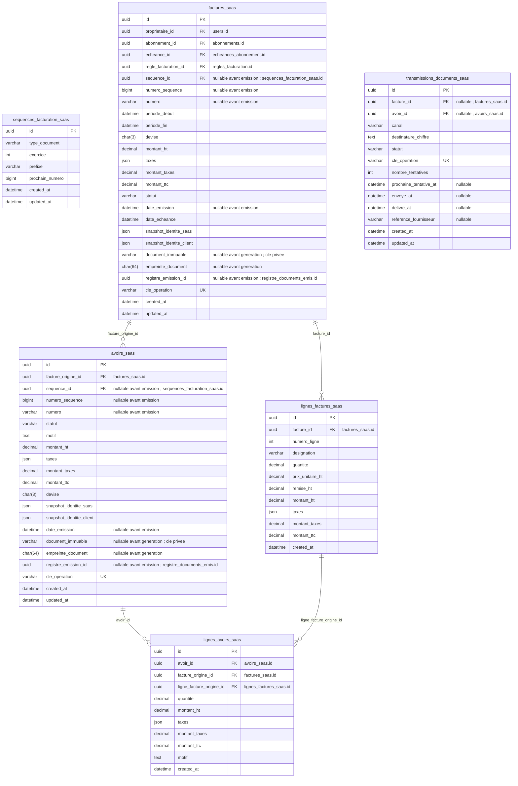
```mermaid
erDiagram
    direction TB
    sequences_facturation_saas {
        uuid id PK
        varchar type_document
        int exercice
        varchar prefixe
        bigint prochain_numero
        datetime created_at
        datetime updated_at
    }
    factures_saas {
        uuid id PK
        uuid proprietaire_id FK "users.id"
        uuid abonnement_id FK "abonnements.id"
        uuid echeance_id FK "echeances_abonnement.id"
        uuid regle_facturation_id FK "regles_facturation.id"
        uuid sequence_id FK "nullable avant emission ; sequences_facturation_saas.id"
        bigint numero_sequence "nullable avant emission"
        varchar numero "nullable avant emission"
        datetime periode_debut
        datetime periode_fin
        char(3) devise
        decimal montant_ht
        json taxes
        decimal montant_taxes
        decimal montant_ttc
        varchar statut
        datetime date_emission "nullable avant emission"
        datetime date_echeance
        json snapshot_identite_saas
        json snapshot_identite_client
        varchar document_immuable "nullable avant generation ; cle privee"
        char(64) empreinte_document "nullable avant generation"
        uuid registre_emission_id "nullable avant emission ; registre_documents_emis.id"
        varchar cle_operation UK
        datetime created_at
        datetime updated_at
    }
    lignes_factures_saas {
        uuid id PK
        uuid facture_id FK "factures_saas.id"
        int numero_ligne
        varchar designation
        decimal quantite
        decimal prix_unitaire_ht
        decimal remise_ht
        decimal montant_ht
        json taxes
        decimal montant_taxes
        decimal montant_ttc
        datetime created_at
    }
    avoirs_saas {
        uuid id PK
        uuid facture_origine_id FK "factures_saas.id"
        uuid sequence_id FK "nullable avant emission ; sequences_facturation_saas.id"
        bigint numero_sequence "nullable avant emission"
        varchar numero "nullable avant emission"
        varchar statut
        text motif
        decimal montant_ht
        json taxes
        decimal montant_taxes
        decimal montant_ttc
        char(3) devise
        json snapshot_identite_saas
        json snapshot_identite_client
        datetime date_emission "nullable avant emission"
        varchar document_immuable "nullable avant generation ; cle privee"
        char(64) empreinte_document "nullable avant generation"
        uuid registre_emission_id "nullable avant emission ; registre_documents_emis.id"
        varchar cle_operation UK
        datetime created_at
        datetime updated_at
    }
    lignes_avoirs_saas {
        uuid id PK
        uuid avoir_id FK "avoirs_saas.id"
        uuid facture_origine_id FK "factures_saas.id"
        uuid ligne_facture_origine_id FK "lignes_factures_saas.id"
        decimal quantite
        decimal montant_ht
        json taxes
        decimal montant_taxes
        decimal montant_ttc
        text motif
        datetime created_at
    }
    transmissions_documents_saas {
        uuid id PK
        uuid facture_id FK "nullable ; factures_saas.id"
        uuid avoir_id FK "nullable ; avoirs_saas.id"
        varchar canal
        text destinataire_chiffre
        varchar statut
        varchar cle_operation UK
        int nombre_tentatives
        datetime prochaine_tentative_at "nullable"
        datetime envoye_at "nullable"
        datetime delivre_at "nullable"
        varchar reference_fournisseur "nullable"
        datetime created_at
        datetime updated_at
    }
    factures_saas ||--o{ lignes_factures_saas : facture_id
    factures_saas ||--o{ avoirs_saas : facture_origine_id
    avoirs_saas ||--o{ lignes_avoirs_saas : avoir_id
    lignes_factures_saas ||--o{ lignes_avoirs_saas : ligne_facture_origine_id
```

#### Explication très simple des champs


**`sequences_facturation_saas` :**

- **`id`** : le numéro unique qui permet de reconnaître cette ligne dans la base. Deux lignes différentes ne peuvent pas avoir le même `id`.
- **`type_document`** : indique quel document c’est. Exemple : facture, avoir ou autre type prévu.
- **`exercice`** : l’année ou période de numérotation concernée. Exemple : `2026`.
- **`prefixe`** : le début fixe ajouté devant les numéros. Exemple : `FAC` pour les factures.
- **`prochain_numero`** : le prochain nombre disponible dans cette série. Exemple : si le dernier document était 102, le prochain peut être 103.
- **`created_at`** : la date où cette ligne a été créée dans la base.
- **`updated_at`** : la date de la dernière modification de cette ligne. Exemple : si tu modifies l’élément aujourd’hui, cette date devient celle d’aujourd’hui.

**`factures_saas` :**

- **`id`** : le numéro unique qui permet de reconnaître cette ligne dans la base. Deux lignes différentes ne peuvent pas avoir le même `id`.
- **`proprietaire_id`** : l’identifiant du propriétaire. Il sert à relier cette ligne à la bonne information au lieu de recopier toutes ses données.
- **`abonnement_id`** : l’identifiant de l’abonnement. Il sert à relier cette ligne à la bonne information au lieu de recopier toutes ses données.
- **`echeance_id`** : l’identifiant de l’échéance à payer. Il sert à relier cette ligne à la bonne information au lieu de recopier toutes ses données.
- **`regle_facturation_id`** : la règle de facturation précise utilisée pour décider comment ce document devait être créé.
- **`sequence_id`** : l’identifiant du compteur de numérotation. Il sert à relier cette ligne à la bonne information au lieu de recopier toutes ses données. Ce champ peut rester vide quand cette information n’est pas nécessaire ou pas encore connue.
- **`numero_sequence`** : le nombre utilisé à l’intérieur de la série du document. Exemple : `123` dans `FAC-2026-000123`. Ce champ peut rester vide quand cette information n’est pas nécessaire ou pas encore connue.
- **`numero`** : le numéro lisible de l’élément. Exemple : numéro d’échéance ou de facture selon la table. Ce champ peut rester vide quand cette information n’est pas nécessaire ou pas encore connue.
- **`periode_debut`** : le début de la période concernée. Exemple : début du mois payé.
- **`periode_fin`** : la fin de la période concernée. Exemple : fin du mois payé. Peut rester vide lorsque la période n’a pas de fin prévue.
- **`devise`** : la monnaie utilisée. Exemple : `DZD` pour le dinar algérien.
- **`montant_ht`** : le montant avant taxes.
- **`taxes`** : plusieurs petits réglages liés à **taxes**, regroupés ensemble de manière structurée.
- **`montant_taxes`** : le montant total des taxes.
- **`montant_ttc`** : le montant final avec les taxes.
- **`statut`** : indique où en est l’élément. Exemple : `en_attente`, `actif`, `termine` ou `annule` selon la table.
- **`date_emission`** : la date officielle d’émission du document. Ce champ peut rester vide quand cette information n’est pas nécessaire ou pas encore connue.
- **`date_echeance`** : la date utilisée pour **echeance**.
- **`snapshot_identite_saas`** : une copie figée des informations légales du SaaS au moment de la facture. Si le profil change plus tard, l’ancienne facture garde les anciennes informations.
- **`snapshot_identite_client`** : une copie figée du nom, téléphone et adresse nécessaires à cette commande. Si le client donne plus tard une autre adresse, l’ancienne commande garde ce qu’elle utilisait.
- **`document_immuable`** : indique que le document, une fois officiellement émis, ne doit plus être modifié comme un simple brouillon. Ce champ peut rester vide quand cette information n’est pas nécessaire ou pas encore connue.
- **`empreinte_document`** : une signature du contenu du document qui permet de vérifier qu’il est resté identique. Ce champ peut rester vide quand cette information n’est pas nécessaire ou pas encore connue.
- **`registre_emission_id`** : l’identifiant de l’enregistrement du document émis. Il sert à relier cette ligne à la bonne information au lieu de recopier toutes ses données. Ce champ peut rester vide quand cette information n’est pas nécessaire ou pas encore connue.
- **`cle_operation`** : une clé unique utilisée pour reconnaître une opération déjà faite. Exemple : si le serveur reçoit deux fois la même demande après une coupure, cette clé aide à éviter de faire l’opération deux fois.
- **`created_at`** : la date où cette ligne a été créée dans la base.
- **`updated_at`** : la date de la dernière modification de cette ligne. Exemple : si tu modifies l’élément aujourd’hui, cette date devient celle d’aujourd’hui.

**`lignes_factures_saas` :**

- **`id`** : le numéro unique qui permet de reconnaître cette ligne dans la base. Deux lignes différentes ne peuvent pas avoir le même `id`.
- **`facture_id`** : l’identifiant de la facture. Il sert à relier cette ligne à la bonne information au lieu de recopier toutes ses données.
- **`numero_ligne`** : la position de cette ligne dans le document. Exemple : 1 pour la première ligne, 2 pour la deuxième.
- **`designation`** : le nom ou texte qui explique ce qui est facturé sur cette ligne. Exemple : « Abonnement Pro — septembre 2026 ».
- **`quantite`** : le nombre d’éléments concernés. Exemple : `2` signifie deux unités du produit.
- **`prix_unitaire_ht`** : le prix correspondant à **unitaire HT**.
- **`remise_ht`** : la réduction appliquée avant taxes sur cette ligne.
- **`montant_ht`** : le montant avant taxes.
- **`taxes`** : plusieurs petits réglages liés à **taxes**, regroupés ensemble de manière structurée.
- **`montant_taxes`** : le montant total des taxes.
- **`montant_ttc`** : le montant final avec les taxes.
- **`created_at`** : la date où cette ligne a été créée dans la base.

**`avoirs_saas` :**

- **`id`** : le numéro unique qui permet de reconnaître cette ligne dans la base. Deux lignes différentes ne peuvent pas avoir le même `id`.
- **`facture_origine_id`** : l’identifiant de la facture d’origine. Il sert à relier cette ligne à la bonne information au lieu de recopier toutes ses données.
- **`sequence_id`** : l’identifiant du compteur de numérotation. Il sert à relier cette ligne à la bonne information au lieu de recopier toutes ses données. Ce champ peut rester vide quand cette information n’est pas nécessaire ou pas encore connue.
- **`numero_sequence`** : le nombre utilisé à l’intérieur de la série du document. Exemple : `123` dans `FAC-2026-000123`. Ce champ peut rester vide quand cette information n’est pas nécessaire ou pas encore connue.
- **`numero`** : le numéro lisible de l’élément. Exemple : numéro d’échéance ou de facture selon la table. Ce champ peut rester vide quand cette information n’est pas nécessaire ou pas encore connue.
- **`statut`** : indique où en est l’élément. Exemple : `en_attente`, `actif`, `termine` ou `annule` selon la table.
- **`motif`** : explique pourquoi l’action ou la décision a été faite.
- **`montant_ht`** : le montant avant taxes.
- **`taxes`** : plusieurs petits réglages liés à **taxes**, regroupés ensemble de manière structurée.
- **`montant_taxes`** : le montant total des taxes.
- **`montant_ttc`** : le montant final avec les taxes.
- **`devise`** : la monnaie utilisée. Exemple : `DZD` pour le dinar algérien.
- **`snapshot_identite_saas`** : une copie figée des informations légales du SaaS au moment de la facture. Si le profil change plus tard, l’ancienne facture garde les anciennes informations.
- **`snapshot_identite_client`** : une copie figée du nom, téléphone et adresse nécessaires à cette commande. Si le client donne plus tard une autre adresse, l’ancienne commande garde ce qu’elle utilisait.
- **`date_emission`** : la date officielle d’émission du document. Ce champ peut rester vide quand cette information n’est pas nécessaire ou pas encore connue.
- **`document_immuable`** : indique que le document, une fois officiellement émis, ne doit plus être modifié comme un simple brouillon. Ce champ peut rester vide quand cette information n’est pas nécessaire ou pas encore connue.
- **`empreinte_document`** : une signature du contenu du document qui permet de vérifier qu’il est resté identique. Ce champ peut rester vide quand cette information n’est pas nécessaire ou pas encore connue.
- **`registre_emission_id`** : l’identifiant de l’enregistrement du document émis. Il sert à relier cette ligne à la bonne information au lieu de recopier toutes ses données. Ce champ peut rester vide quand cette information n’est pas nécessaire ou pas encore connue.
- **`cle_operation`** : une clé unique utilisée pour reconnaître une opération déjà faite. Exemple : si le serveur reçoit deux fois la même demande après une coupure, cette clé aide à éviter de faire l’opération deux fois.
- **`created_at`** : la date où cette ligne a été créée dans la base.
- **`updated_at`** : la date de la dernière modification de cette ligne. Exemple : si tu modifies l’élément aujourd’hui, cette date devient celle d’aujourd’hui.

**`lignes_avoirs_saas` :**

- **`id`** : le numéro unique qui permet de reconnaître cette ligne dans la base. Deux lignes différentes ne peuvent pas avoir le même `id`.
- **`avoir_id`** : l’identifiant de l’avoir. Il sert à relier cette ligne à la bonne information au lieu de recopier toutes ses données.
- **`facture_origine_id`** : l’identifiant de la facture d’origine. Il sert à relier cette ligne à la bonne information au lieu de recopier toutes ses données.
- **`ligne_facture_origine_id`** : l’identifiant de la ligne de facture d’origine. Il sert à relier cette ligne à la bonne information au lieu de recopier toutes ses données.
- **`quantite`** : le nombre d’éléments concernés. Exemple : `2` signifie deux unités du produit.
- **`montant_ht`** : le montant avant taxes.
- **`taxes`** : plusieurs petits réglages liés à **taxes**, regroupés ensemble de manière structurée.
- **`montant_taxes`** : le montant total des taxes.
- **`montant_ttc`** : le montant final avec les taxes.
- **`motif`** : explique pourquoi l’action ou la décision a été faite.
- **`created_at`** : la date où cette ligne a été créée dans la base.

**`transmissions_documents_saas` :**

- **`id`** : le numéro unique qui permet de reconnaître cette ligne dans la base. Deux lignes différentes ne peuvent pas avoir le même `id`.
- **`facture_id`** : l’identifiant de la facture. Il sert à relier cette ligne à la bonne information au lieu de recopier toutes ses données. Ce champ peut rester vide quand cette information n’est pas nécessaire ou pas encore connue.
- **`avoir_id`** : l’identifiant de l’avoir. Il sert à relier cette ligne à la bonne information au lieu de recopier toutes ses données. Ce champ peut rester vide quand cette information n’est pas nécessaire ou pas encore connue.
- **`canal`** : indique par quel moyen on communique. Exemple : téléphone ou WhatsApp.
- **`destinataire_chiffre`** : les coordonnées du destinataire enregistrées de manière protégée lorsqu’elles doivent être conservées.
- **`statut`** : indique où en est l’élément. Exemple : `en_attente`, `actif`, `termine` ou `annule` selon la table.
- **`cle_operation`** : une clé unique utilisée pour reconnaître une opération déjà faite. Exemple : si le serveur reçoit deux fois la même demande après une coupure, cette clé aide à éviter de faire l’opération deux fois.
- **`nombre_tentatives`** : le nombre de **tentatives**. Exemple : `3` signifie qu’il y en a trois.
- **`prochaine_tentative_at`** : la date prévue pour retenter l’opération après un échec récupérable. Ce champ peut rester vide quand cette information n’est pas nécessaire ou pas encore connue.
- **`envoye_at`** : la date où l’envoi a été effectué. Ce champ peut rester vide quand cette information n’est pas nécessaire ou pas encore connue.
- **`delivre_at`** : la date où la réception ou livraison du message a été confirmée quand cette information existe. Ce champ peut rester vide quand cette information n’est pas nécessaire ou pas encore connue.
- **`reference_fournisseur`** : le numéro de facture, reçu ou référence donné par le fournisseur. Ce champ peut rester vide quand cette information n’est pas nécessaire ou pas encore connue.
- **`created_at`** : la date où cette ligne a été créée dans la base.
- **`updated_at`** : la date de la dernière modification de cette ligne. Exemple : si tu modifies l’élément aujourd’hui, cette date devient celle d’aujourd’hui.


- **Factures :** UNIQUE(numero) hors NULL, UNIQUE(sequence_id,numero_sequence), UNIQUE(cle_operation). Statut=brouillon|emise|annulee_brouillon. La période est [debut,fin), fin>debut ; montants>=0, HT+taxes=TTC et égalité aux sommes de lignes. DZD au MVP. Contrôler structure et somme du JSON taxes. FK(abonnement_id,proprietaire_id) → abonnements(id,user_id), clé parent UNIQUE ; FK(echeance_id,abonnement_id) → echeances_abonnement(id,abonnement_id), clé parent UNIQUE. Le fait générateur durable déclenche obligatoirement une facture par échéance/occurrence validée avec une clé stable ; aucun doublon au retry. L’échéance et les règlements conservent leur sens de dette/paiements, les rectifications fiscales passent par avoir. Une correction du dû après facture/avoir doit être rapprochée, jamais changée silencieusement pour correspondre au paiement. Aucun remboursement SaaS automatique n’est inféré d’un avoir. **Décision AUD-16 : le SaaS n’exécute ni ne suit comme trésorerie interne les remboursements réels d’abonnement.** Les paiements sont validés manuellement sur reçu/preuve ; une résiliation normale laisse la période déjà payée active jusqu’à son terme, puis empêche le renouvellement payant. Un remboursement exceptionnel, s’il est décidé, reste une procédure manuelle externe à l’application et ne crée donc pas de table `decaissements_saas` dans le périmètre actuel. Un avoir reste un document de correction et non une preuve que de l’argent a été remis. Ne pas utiliser une contrepassation de paiement pour prétendre que le paiement initial n’a jamais eu lieu. Si le produit commence un jour à exécuter ou suivre ces remboursements réels, un journal de décaissements dédié deviendra obligatoire.
- **Lignes :** UNIQUE(facture_id,numero_ligne), UNIQUE(id,facture_id), quantité>0, prix/remise/base/taxes/TTC>=0. Version du plan, période et nature de l’option incluses dans la désignation/snapshot document ; aucun recalcul historique depuis le plan courant. Émission seulement avec au moins une ligne et identité légale du SaaS et du client complètes.
- **Avoirs :** origine obligatoire, facture émise de même devise ; montants positifs exprimant la réduction, pas un règlement. UNIQUE(numero), UNIQUE(sequence_id,numero_sequence), UNIQUE(id,facture_origine_id). FK(avoir_id,facture_origine_id) → avoirs_saas(id,facture_origine_id) et FK(ligne_facture_origine_id,facture_origine_id) → lignes_factures_saas(id,facture_id). UNIQUE(avoir_id,ligne_facture_origine_id). Sous verrou facture puis lignes, les avoirs émis et brouillons réservés ne dépassent ni quantités ni HT/taxes/TTC facturés ; annuler un brouillon libère sa réserve. Période, propriétaire et abonnement sont obtenus depuis la facture d’origine ; ne pas maintenir des copies modifiables concurrentes.
- **Numérotation et immutabilité :** UNIQUE(type_document,exercice), type=facture|avoir, prochain_numero>0 ; allocation sous verrou, pas MAX+1. Contrôler le type de séquence avant émission. Facture/avoir émis et leurs lignes sont immuables via triggers/privilèges ; correction par nouveau document lié. Fichier privé `central/...` produit depuis snapshots figés, renseigné une seule fois avec empreinte. **Avant transmission, facture/avoir SaaS inscrit son identité dans `registre_documents_emis` avec `portee_document=saas`, puis renseigne `registre_emission_id`.** Comme ce registre appartient lui aussi au central, une restauration centrale doit le rapprocher avec le stockage documentaire versionné/immuable et les manifestes/PITR externes avant toute nouvelle émission ; aucune séquence restaurée n’est reprise aveuglément. La numérotation SaaS concerne son émetteur légal, pas les séries commerciales des tenants.
- **Transmission :** exactement une FK facture/avoir non NULL ; même protocole durable que T19, créé à l’émission, reprise avec clé stable, statut=en_attente|en_cours|envoye|delivre|echec_reessayable|echec_definitif|incertain. PDF ou lien accessible après autorisation ; un portail consultable seul ne prouve pas l’envoi. Les flux SaaS ne sont jamais additionnés aux recettes des boutiques.

### C14 — Règles de facturation et gouvernance des données

**`regles_facturation` — Les règles validées qui indiquent quand et comment produire les documents de facturation. Exemple : quel événement doit déclencher une facture. Les anciennes versions restent conservées.**

**`registre_activites_traitement` — Explique quelles données personnelles sont utilisées, pourquoi, par qui et pendant combien de temps. Exemple : documenter l’utilisation des coordonnées nécessaires à une livraison, sans lister tous les acheteurs.**

**`journal_operations_donnees_personnelles_central` — Le carnet des opérations réellement faites sur les données personnelles au niveau central. Exemple : noter qui a exporté des données et quand, sans recopier toutes ces données dans le carnet.**

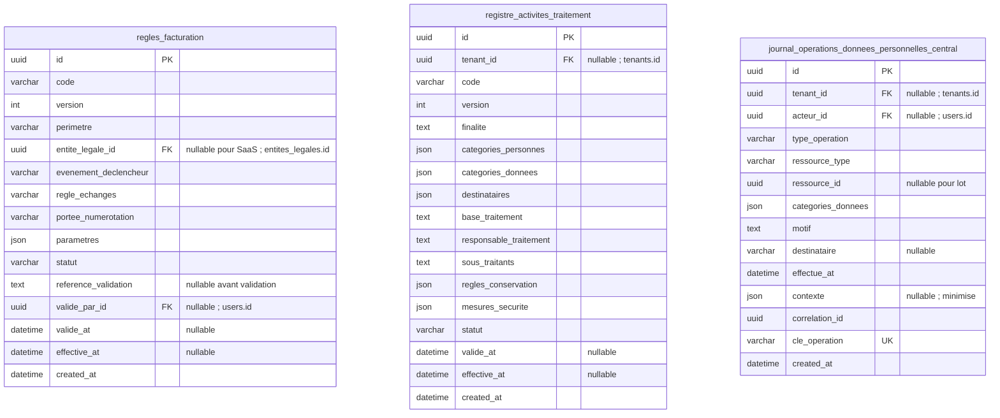
```mermaid
erDiagram
    direction TB
    regles_facturation {
        uuid id PK
        varchar code
        int version
        varchar perimetre
        uuid entite_legale_id FK "nullable pour SaaS ; entites_legales.id"
        varchar evenement_declencheur
        varchar regle_echanges
        varchar portee_numerotation
        json parametres
        varchar statut
        text reference_validation "nullable avant validation"
        uuid valide_par_id FK "nullable ; users.id"
        datetime valide_at "nullable"
        datetime effective_at "nullable"
        datetime created_at
    }
    registre_activites_traitement {
        uuid id PK
        uuid tenant_id FK "nullable ; tenants.id"
        varchar code
        int version
        text finalite
        json categories_personnes
        json categories_donnees
        json destinataires
        text base_traitement
        text responsable_traitement
        text sous_traitants
        json regles_conservation
        json mesures_securite
        varchar statut
        datetime valide_at "nullable"
        datetime effective_at "nullable"
        datetime created_at
    }
    journal_operations_donnees_personnelles_central {
        uuid id PK
        uuid tenant_id FK "nullable ; tenants.id"
        uuid acteur_id FK "nullable ; users.id"
        varchar type_operation
        varchar ressource_type
        uuid ressource_id "nullable pour lot"
        json categories_donnees
        text motif
        varchar destinataire "nullable"
        datetime effectue_at
        json contexte "nullable ; minimise"
        uuid correlation_id
        varchar cle_operation UK
        datetime created_at
    }
```

#### Explication très simple des champs


**`regles_facturation` :**

- **`id`** : le numéro unique qui permet de reconnaître cette ligne dans la base. Deux lignes différentes ne peuvent pas avoir le même `id`.
- **`code`** : le petit nom utilisé par le programme pour reconnaître l’élément. Exemple : `boutiques.nombre` ou `produits.creer`.
- **`version`** : le numéro de version de cet élément. Exemple : version 1, puis version 2 après une évolution ; l’ancienne version peut rester conservée pour comprendre l’historique.
- **`perimetre`** : indique à quelle partie du système la règle s’applique. Exemple : `saas` ou `boutique`.
- **`entite_legale_id`** : l’identifiant de l’identité légale du vendeur. Il sert à relier cette ligne à la bonne information au lieu de recopier toutes ses données. Ce champ peut rester vide quand cette information n’est pas nécessaire ou pas encore connue.
- **`evenement_declencheur`** : l’événement qui dit « maintenant, il faut appliquer cette règle ». Exemple : une vente finalisée qui déclenche l’émission d’une facture.
- **`regle_echanges`** : explique comment les échanges/remplacements doivent être traités pour la facturation.
- **`portee_numerotation`** : indique à quel niveau les numéros sont uniques. Exemple : une série propre à une boutique ou une série du SaaS.
- **`parametres`** : les réglages supplémentaires de cette règle, regroupés dans un format structuré.
- **`statut`** : indique où en est l’élément. Exemple : `en_attente`, `actif`, `termine` ou `annule` selon la table.
- **`reference_validation`** : la référence qui prouve ou explique qui a validé cette règle et sur quelle base. Ce champ peut rester vide quand cette information n’est pas nécessaire ou pas encore connue.
- **`valide_par_id`** : l’identifiant de la personne qui a validé. Il sert à relier cette ligne à la bonne information au lieu de recopier toutes ses données. Ce champ peut rester vide quand cette information n’est pas nécessaire ou pas encore connue.
- **`valide_at`** : la date et l’heure liées à **valide**. Elle permet de savoir exactement quand cette étape a eu lieu. Ce champ peut rester vide quand cette information n’est pas nécessaire ou pas encore connue.
- **`effective_at`** : la date à partir de laquelle cette version devient réellement applicable. Ce champ peut rester vide quand cette information n’est pas nécessaire ou pas encore connue.
- **`created_at`** : la date où cette ligne a été créée dans la base.

**`registre_activites_traitement` :**

- **`id`** : le numéro unique qui permet de reconnaître cette ligne dans la base. Deux lignes différentes ne peuvent pas avoir le même `id`.
- **`tenant_id`** : l’identifiant de la boutique. Il sert à relier cette ligne à la bonne information au lieu de recopier toutes ses données. Ce champ peut rester vide quand cette information n’est pas nécessaire ou pas encore connue.
- **`code`** : le petit nom utilisé par le programme pour reconnaître l’élément. Exemple : `boutiques.nombre` ou `produits.creer`.
- **`version`** : le numéro de version de cet élément. Exemple : version 1, puis version 2 après une évolution ; l’ancienne version peut rester conservée pour comprendre l’historique.
- **`finalite`** : explique pourquoi les données personnelles sont utilisées. Exemple : utiliser une adresse pour livrer une commande.
- **`categories_personnes`** : les groupes de personnes concernés. Exemple : acheteurs, commerçants ou membres d’équipe.
- **`categories_donnees`** : les types d’informations concernés. Exemple : nom, téléphone ou adresse, sans recopier toutes les valeurs ici.
- **`destinataires`** : les personnes ou services qui peuvent recevoir ces données. Exemple : le transporteur pour livrer le colis.
- **`base_traitement`** : explique la raison qui autorise ou justifie ce traitement de données selon la règle validée.
- **`responsable_traitement`** : indique qui décide pourquoi et comment ces données sont utilisées.
- **`sous_traitants`** : indique les prestataires qui traitent des données pour le service.
- **`regles_conservation`** : résume les règles qui disent combien de temps ces données sont gardées.
- **`mesures_securite`** : résume les protections mises en place. Exemple : chiffrement, limitation des accès et journalisation.
- **`statut`** : indique où en est l’élément. Exemple : `en_attente`, `actif`, `termine` ou `annule` selon la table.
- **`valide_at`** : la date et l’heure liées à **valide**. Elle permet de savoir exactement quand cette étape a eu lieu. Ce champ peut rester vide quand cette information n’est pas nécessaire ou pas encore connue.
- **`effective_at`** : la date à partir de laquelle cette version devient réellement applicable. Ce champ peut rester vide quand cette information n’est pas nécessaire ou pas encore connue.
- **`created_at`** : la date où cette ligne a été créée dans la base.

**`journal_operations_donnees_personnelles_central` :**

- **`id`** : le numéro unique qui permet de reconnaître cette ligne dans la base. Deux lignes différentes ne peuvent pas avoir le même `id`.
- **`tenant_id`** : l’identifiant de la boutique. Il sert à relier cette ligne à la bonne information au lieu de recopier toutes ses données. Ce champ peut rester vide quand cette information n’est pas nécessaire ou pas encore connue.
- **`acteur_id`** : l’identifiant de la personne qui a fait l’action. Il sert à relier cette ligne à la bonne information au lieu de recopier toutes ses données. Ce champ peut rester vide quand cette information n’est pas nécessaire ou pas encore connue.
- **`type_operation`** : indique quelle action a été faite sur les données ou le système. Exemple : export, suppression ou anonymisation.
- **`ressource_type`** : le type d’élément concerné. Exemple : client, commande ou fichier.
- **`ressource_id`** : l’identifiant de l’élément précis concerné. Il peut rester vide si l’opération porte sur un lot entier.
- **`categories_donnees`** : les types d’informations concernés. Exemple : nom, téléphone ou adresse, sans recopier toutes les valeurs ici.
- **`motif`** : explique pourquoi l’action ou la décision a été faite.
- **`destinataire`** : indique à qui l’information ou le document a été envoyé lorsque cela doit être tracé. Ce champ peut rester vide quand cette information n’est pas nécessaire ou pas encore connue.
- **`effectue_at`** : la date où l’opération a réellement été faite.
- **`contexte`** : quelques informations utiles pour comprendre l’opération, sans recopier inutilement des données sensibles. Ce champ peut rester vide quand cette information n’est pas nécessaire ou pas encore connue.
- **`correlation_id`** : un numéro commun utilisé pour relier plusieurs traces qui appartiennent à la même grande opération. Exemple : une création de boutique qui produit plusieurs actions techniques.
- **`cle_operation`** : une clé unique utilisée pour reconnaître une opération déjà faite. Exemple : si le serveur reçoit deux fois la même demande après une coupure, cette clé aide à éviter de faire l’opération deux fois.
- **`created_at`** : la date où cette ligne a été créée dans la base.


- **Règles fiscales :** UNIQUE(code,version), perimetre=saas|boutique ; entite_legale_id requis pour boutique et NULL pour SaaS. Statut=brouillon|validee|retiree. Une version validée/utilisée est immuable ; la sélection de la version effective est déterministe et sans chevauchement par périmètre/émetteur, sous verrou de coordination. Le déclencheur exact, les échanges et la portée de numérotation ne sont pas inventés : valeurs `a_valider` admises seulement en brouillon. Aucune émission/activation commerciale sans règle validée. `portee_numerotation=boutique|entite_legale` pour les commerçants ; pour SaaS, émetteur SaaS. La validation d’un texte de règle n’exécute pas du code : allowlist d’événements et d’implémentations serveur versionnées. Pour les tenants, conserver copie exacte versionnée dans chaque obligation de facturation (T22) ; aucune FK inter-BDD.
- **Registre :** documentation des traitements, distincte du journal d’événements. UNIQUE(contexte_normalise,code,version), contexte=tenant UUID ou central ; pas de simple UNIQUE sur tenant_id nullable. Version utilisée immuable ; finalités, personnes, données, destinataires, responsabilités, conservation et mesures de sécurité sont documentés, sans liste nominative des acheteurs. Le responsable juridique/DPO valide périmètre, rôles SaaS/commerçant/transporteur, transferts et durées avant production.
- **Journal central :** opérations effectivement réalisées sur les données centrales ou les accès transversaux ; aucune copie des coordonnées des acheteurs. Append-only avec rôle d’écriture dédié, lecture restreinte et rétention privilégiée tracée. Événements métier : collecte, consultation_fiche_client, export_clients, transmission_transporteur, modification_donnee_personnelle, suppression_donnee_personnelle, anonymisation, chiffrement, effacement_retention, selon périmètre validé. Pour un export en lot, conserver nombre/catégories et référence sécurisée du lot, pas les 500 fiches. Ressources tenant référencées logiquement avec tenant_id obligatoire ; une lecture locale est journalisée localement en T21. Corrélation/déduplication évitent deux faits faussement distincts pour la même action. Ne pas journaliser chaque SELECT SQL.

## 5. BDD de chaque boutique : `tenant_<uuid>`

Ce même modèle est migré dans chaque BDD tenant. Aucun `tenant_id` n’est ajouté à toutes les lignes : le contexte de connexion assure déjà la séparation. La ligne unique `boutique` conserve la référence de rattachement.

### T1 — Profil public

**`boutique` — La fiche publique de la boutique : son nom affiché, son logo, ses contacts et sa présentation. Exemple : les informations que les visiteurs voient sur le site de Karim.**

**`adresses_boutique` — Les adresses publiques de la boutique et leur emplacement sur une carte. Exemple : une adresse pour le magasin et une autre pour un point de retrait. Cela n’ajoute pas une caisse de magasin.**

**`liens_sociaux` — Les liens vers les pages de la boutique sur les réseaux sociaux. Exemple : son compte Instagram et deux pages Facebook différentes.**

**`pages_contenu` — Le contenu des pages d’information du site. Exemple : Karim écrit le texte de « À propos », de « Contact » ou de sa politique de retour.**

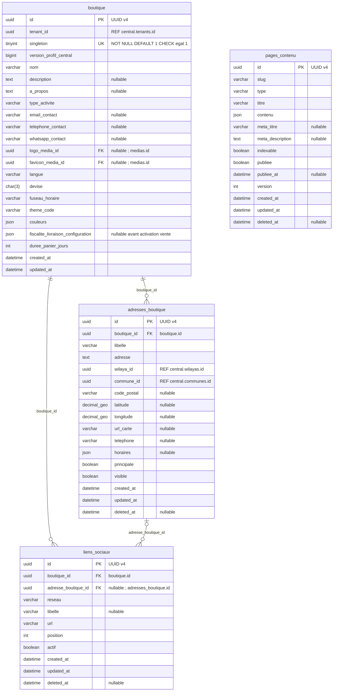
```mermaid
erDiagram
    direction TB
    boutique {
        uuid id PK "UUID v4"
        uuid tenant_id "REF central.tenants.id"
        tinyint singleton UK "NOT NULL DEFAULT 1 CHECK egal 1"
        bigint version_profil_central
        varchar nom
        text description "nullable"
        text a_propos "nullable"
        varchar type_activite
        varchar email_contact "nullable"
        varchar telephone_contact "nullable"
        varchar whatsapp_contact "nullable"
        uuid logo_media_id FK "nullable ; medias.id"
        uuid favicon_media_id FK "nullable ; medias.id"
        varchar langue
        char(3) devise
        varchar fuseau_horaire
        varchar theme_code
        json couleurs
        json fiscalite_livraison_configuration "nullable avant activation vente"
        int duree_panier_jours
        datetime created_at
        datetime updated_at
    }
    adresses_boutique {
        uuid id PK "UUID v4"
        uuid boutique_id FK "boutique.id"
        varchar libelle
        text adresse
        uuid wilaya_id "REF central.wilayas.id"
        uuid commune_id "REF central.communes.id"
        varchar code_postal "nullable"
        decimal_geo latitude "nullable"
        decimal_geo longitude "nullable"
        varchar url_carte "nullable"
        varchar telephone "nullable"
        json horaires "nullable"
        boolean principale
        boolean visible
        datetime created_at
        datetime updated_at
        datetime deleted_at "nullable"
    }
    liens_sociaux {
        uuid id PK "UUID v4"
        uuid boutique_id FK "boutique.id"
        uuid adresse_boutique_id FK "nullable ; adresses_boutique.id"
        varchar reseau
        varchar libelle "nullable"
        varchar url
        int position
        boolean actif
        datetime created_at
        datetime updated_at
        datetime deleted_at "nullable"
    }
    pages_contenu {
        uuid id PK "UUID v4"
        varchar slug
        varchar type
        varchar titre
        json contenu
        varchar meta_titre "nullable"
        text meta_description "nullable"
        boolean indexable
        boolean publiee
        datetime publiee_at "nullable"
        int version
        datetime created_at
        datetime updated_at
        datetime deleted_at "nullable"
    }
    boutique ||--o{ adresses_boutique : boutique_id
    boutique ||--o{ liens_sociaux : boutique_id
    adresses_boutique |o--o{ liens_sociaux : adresse_boutique_id
```

#### Explication très simple des champs

**`boutique` :**

- **`id`** : le numéro unique qui permet de reconnaître cette ligne dans la base. Deux lignes différentes ne peuvent pas avoir le même `id`.
- **`tenant_id`** : l’identifiant de la boutique. Il sert à relier cette ligne à la bonne information au lieu de recopier toutes ses données.
- **`singleton`** : un petit verrou technique qui garantit qu’il n’existe qu’une seule ligne de ce type dans la base. Exemple : une seule fiche `boutique`.
- **`version_profil_central`** : la dernière version du profil central que cette boutique a reçue. Cela permet de voir si elle est à jour.
- **`nom`** : le nom affiché à l’utilisateur. Exemple : « Nombre de boutiques » ou « Livraison EcoTrack ».
- **`description`** : un texte qui explique l’élément plus en détail. Il peut rester vide si aucune explication supplémentaire n’est nécessaire.
- **`a_propos`** : le texte de présentation de la boutique. Exemple : son histoire ou ce qu’elle vend. Ce champ peut rester vide quand cette information n’est pas nécessaire ou pas encore connue.
- **`type_activite`** : le type d’activité de la boutique. Exemple : vêtements, restaurant ou salon.
- **`email_contact`** : l’email public que les visiteurs peuvent utiliser pour contacter la boutique. Ce champ peut rester vide quand cette information n’est pas nécessaire ou pas encore connue.
- **`telephone_contact`** : le téléphone public de la boutique. Ce champ peut rester vide quand cette information n’est pas nécessaire ou pas encore connue.
- **`whatsapp_contact`** : le numéro WhatsApp public de la boutique. Ce champ peut rester vide quand cette information n’est pas nécessaire ou pas encore connue.
- **`logo_media_id`** : le fichier utilisé comme logo de la boutique. Ce champ peut rester vide quand cette information n’est pas nécessaire ou pas encore connue.
- **`favicon_media_id`** : la petite image affichée dans l’onglet du navigateur. Ce champ peut rester vide quand cette information n’est pas nécessaire ou pas encore connue.
- **`langue`** : la langue préférée pour l’affichage. Exemple : `fr` ou `ar`.
- **`devise`** : la monnaie utilisée. Exemple : `DZD` pour le dinar algérien.
- **`fuseau_horaire`** : la zone utilisée pour afficher les dates et heures. Exemple : `Africa/Algiers`.
- **`theme_code`** : le modèle visuel choisi pour le site. Exemple : `standard`.
- **`couleurs`** : les couleurs choisies pour le site, enregistrées ensemble. Exemple : couleur principale et couleur des boutons.
- **`fiscalite_livraison_configuration`** : les réglages qui expliquent comment les frais de livraison doivent être traités dans les calculs fiscaux. Ils doivent être validés avant la vente réelle. Ce champ peut rester vide quand cette information n’est pas nécessaire ou pas encore connue.
- **`duree_panier_jours`** : le nombre de jours pendant lesquels un panier invité peut rester conservé avant d’expirer.
- **`created_at`** : la date où cette ligne a été créée dans la base.
- **`updated_at`** : la date de la dernière modification de cette ligne. Exemple : si tu modifies l’élément aujourd’hui, cette date devient celle d’aujourd’hui.

**`adresses_boutique` :**

- **`id`** : le numéro unique qui permet de reconnaître cette ligne dans la base. Deux lignes différentes ne peuvent pas avoir le même `id`.
- **`boutique_id`** : l’identifiant de la fiche de la boutique. Il sert à relier cette ligne à la bonne information au lieu de recopier toutes ses données.
- **`libelle`** : un nom court utilisé pour reconnaître facilement l’élément à l’écran.
- **`adresse`** : l’adresse écrite. Exemple : rue, cité ou quartier.
- **`wilaya_id`** : l’identifiant de la wilaya. Il sert à relier cette ligne à la bonne information au lieu de recopier toutes ses données.
- **`commune_id`** : l’identifiant de la commune. Il sert à relier cette ligne à la bonne information au lieu de recopier toutes ses données.
- **`code_postal`** : le code postal lorsqu’il est connu. Ce champ peut rester vide quand cette information n’est pas nécessaire ou pas encore connue.
- **`latitude`** : la position nord/sud utilisée pour placer l’adresse sur une carte. Ce champ peut rester vide quand cette information n’est pas nécessaire ou pas encore connue.
- **`longitude`** : la position est/ouest utilisée pour placer l’adresse sur une carte. Ce champ peut rester vide quand cette information n’est pas nécessaire ou pas encore connue.
- **`url_carte`** : un lien vers la position sur une carte. Ce champ peut rester vide quand cette information n’est pas nécessaire ou pas encore connue.
- **`telephone`** : le numéro de téléphone. Il est gardé comme texte pour ne pas perdre le `0`, le `+213` ou d’autres signes utiles. Ce champ peut rester vide quand cette information n’est pas nécessaire ou pas encore connue.
- **`horaires`** : les heures d’ouverture regroupées par jour. Exemple : samedi 09:00–18:00. Ce champ peut rester vide quand cette information n’est pas nécessaire ou pas encore connue.
- **`principale`** : indique si cette ligne est la principale parmi plusieurs choix.
- **`visible`** : indique si les visiteurs peuvent voir l’élément sur le site.
- **`created_at`** : la date où cette ligne a été créée dans la base.
- **`updated_at`** : la date de la dernière modification de cette ligne. Exemple : si tu modifies l’élément aujourd’hui, cette date devient celle d’aujourd’hui.
- **`deleted_at`** : la date où l’élément a été retiré sans effacer son ancienne ligne. Si ce champ est vide, l’élément n’est pas supprimé.

**`liens_sociaux` :**

- **`id`** : le numéro unique qui permet de reconnaître cette ligne dans la base. Deux lignes différentes ne peuvent pas avoir le même `id`.
- **`boutique_id`** : l’identifiant de la fiche de la boutique. Il sert à relier cette ligne à la bonne information au lieu de recopier toutes ses données.
- **`adresse_boutique_id`** : l’identifiant de l’adresse de la boutique. Il sert à relier cette ligne à la bonne information au lieu de recopier toutes ses données. Ce champ peut rester vide quand cette information n’est pas nécessaire ou pas encore connue.
- **`reseau`** : le réseau social concerné. Exemple : Instagram, Facebook ou TikTok.
- **`libelle`** : un nom court utilisé pour reconnaître facilement l’élément à l’écran. Ce champ peut rester vide quand cette information n’est pas nécessaire ou pas encore connue.
- **`url`** : le lien web à ouvrir.
- **`position`** : l’ordre d’affichage. Exemple : 1 apparaît avant 2.
- **`actif`** : indique si l’élément peut encore être utilisé. `true` = oui, `false` = non.
- **`created_at`** : la date où cette ligne a été créée dans la base.
- **`updated_at`** : la date de la dernière modification de cette ligne. Exemple : si tu modifies l’élément aujourd’hui, cette date devient celle d’aujourd’hui.
- **`deleted_at`** : la date où l’élément a été retiré sans effacer son ancienne ligne. Si ce champ est vide, l’élément n’est pas supprimé.

**`pages_contenu` :**

- **`id`** : le numéro unique qui permet de reconnaître cette ligne dans la base. Deux lignes différentes ne peuvent pas avoir le même `id`.
- **`slug`** : la partie simple de l’adresse web. Exemple : `a-propos` dans `/a-propos`.
- **`type`** : indique la catégorie de l’élément. Exemple : un domaine peut être `sous_domaine` ou `personnalise`.
- **`titre`** : le titre affiché à l’utilisateur.
- **`contenu`** : le texte ou contenu principal de la page.
- **`meta_titre`** : le titre prévu pour les moteurs de recherche et le partage web. Ce champ peut rester vide quand cette information n’est pas nécessaire ou pas encore connue.
- **`meta_description`** : la petite description prévue pour les moteurs de recherche. Ce champ peut rester vide quand cette information n’est pas nécessaire ou pas encore connue.
- **`indexable`** : indique si les moteurs de recherche sont autorisés à indexer cette page.
- **`publiee`** : indique si l’élément est publié et donc prêt à être montré.
- **`publiee_at`** : la date et l’heure liées à **publiee**. Elle permet de savoir exactement quand cette étape a eu lieu. Ce champ peut rester vide quand cette information n’est pas nécessaire ou pas encore connue.
- **`version`** : le numéro de version de cet élément. Exemple : version 1, puis version 2 après une évolution ; l’ancienne version peut rester conservée pour comprendre l’historique.
- **`created_at`** : la date où cette ligne a été créée dans la base.
- **`updated_at`** : la date de la dernière modification de cette ligne. Exemple : si tu modifies l’élément aujourd’hui, cette date devient celle d’aujourd’hui.
- **`deleted_at`** : la date où l’élément a été retiré sans effacer son ancienne ligne. Si ce champ est vide, l’élément n’est pas supprimé.


Les références vers un autre module sont indiquées sur les champs, même si leur flèche n’est pas redessinée ici.

- **`boutique` :** Il doit exister une seule ligne `boutique` dans la BDD de la boutique. Le champ technique `singleton=1` avec `UNIQUE(singleton)` empêche d’en créer une deuxième, même avec un autre `tenant_id`. Le provisionnement doit créer cette ligne et un contrôle de santé vérifie qu’elle existe bien. `tenant_id` doit correspondre à la boutique attendue et ne change plus après l’insertion. L’application refuse de supprimer ce profil. Par défaut, la devise est DZD, le fuseau est `Africa/Algiers` et le thème est le template initial. `nom` est une copie du nom central `tenants.nom_boutique` : pour renommer une boutique, on change d’abord le nom au central, puis on réplique la nouvelle version ici. On ne permet jamais un renommage uniquement local. Si la copie locale échoue, le nom reste quand même réservé au central. Le logo, les contacts et les couleurs restent propres à cette BDD boutique. Au MVP, après la première commande, la devise ne peut plus être changée.

- **`adresses_boutique` :** Une boutique peut avoir plusieurs adresses, mais une seule adresse principale active. Si une commune est indiquée, elle doit appartenir à la wilaya choisie. Les horaires sont stockés dans un JSON simple organisé par jour et limité à des informations publiques. Cette table décrit des adresses publiques ; elle ne crée pas plusieurs stocks ou entrepôts.

- **`liens_sociaux` :** Une boutique peut avoir plusieurs liens du même réseau. Exemple : deux pages Facebook sont autorisées, donc on ne met pas `UNIQUE(reseau)`. Cette table contient seulement des liens publics ; elle ne stocke aucun token permettant de publier sur les réseaux et ne gère pas de calendrier marketing.

- **`pages_contenu` :** Chaque `slug` est unique dans la boutique. Le contenu JSON doit suivre les blocs autorisés par le template du site ; le commerçant ne peut pas y mettre du code arbitraire. Des éléments comme FAQ, menu, header, footer, « À propos » ou textes institutionnels peuvent être représentés par ces blocs au lieu de créer une table séparée pour chacun.

### T2 — Catalogue principal

**`medias` — Les informations permettant de retrouver les fichiers de la boutique : images, vidéos, logos ou documents. Exemple : l’emplacement et le type de la photo d’un produit ; le fichier lui-même est stocké séparément.**

**`categories` — Les familles de produits et leurs sous-familles. Exemple : « Vêtements » contient « T-shirts ». Une seule table permet d’organiser les deux niveaux.**

**`produits` — La présentation commune d’un produit : son nom, sa description et les informations partagées par ses versions. Exemple : le modèle « T-shirt coton », proposé ensuite en plusieurs tailles et couleurs.**

**`variantes_produits` — Les versions précises que l’on peut acheter, avec leur prix et leur stock. Exemple : « T-shirt rouge, taille M ». Un produit sans choix possède aussi une variante standard.**

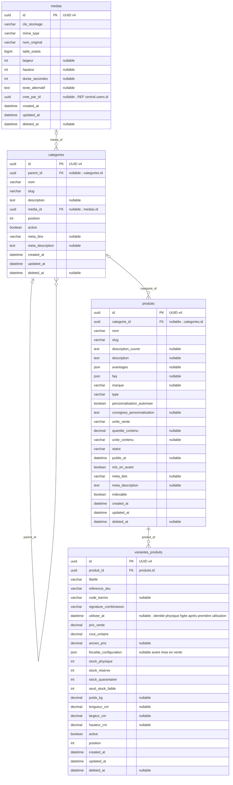
```mermaid
erDiagram
    direction TB
    medias {
        uuid id PK "UUID v4"
        varchar cle_stockage
        varchar mime_type
        varchar nom_original
        bigint taille_octets
        int largeur "nullable"
        int hauteur "nullable"
        int duree_secondes "nullable"
        text texte_alternatif "nullable"
        uuid cree_par_id "nullable ; REF central.users.id"
        datetime created_at
        datetime updated_at
        datetime deleted_at "nullable"
    }
    categories {
        uuid id PK "UUID v4"
        uuid parent_id FK "nullable ; categories.id"
        varchar nom
        varchar slug
        text description "nullable"
        uuid media_id FK "nullable ; medias.id"
        int position
        boolean active
        varchar meta_titre "nullable"
        text meta_description "nullable"
        datetime created_at
        datetime updated_at
        datetime deleted_at "nullable"
    }
    produits {
        uuid id PK "UUID v4"
        uuid categorie_id FK "nullable ; categories.id"
        varchar nom
        varchar slug
        text description_courte "nullable"
        text description "nullable"
        json avantages "nullable"
        json faq "nullable"
        varchar marque "nullable"
        varchar type
        boolean personnalisation_autorisee
        text consignes_personnalisation "nullable"
        varchar unite_vente
        decimal quantite_contenu "nullable"
        varchar unite_contenu "nullable"
        varchar statut
        datetime publie_at "nullable"
        boolean mis_en_avant
        varchar meta_titre "nullable"
        text meta_description "nullable"
        boolean indexable
        datetime created_at
        datetime updated_at
        datetime deleted_at "nullable"
    }
    variantes_produits {
        uuid id PK "UUID v4"
        uuid produit_id FK "produits.id"
        varchar libelle
        varchar reference_sku
        varchar code_barres "nullable"
        varchar signature_combinaison
        datetime utilisee_at "nullable ; identité physique figée après première utilisation"
        decimal prix_vente
        decimal cout_unitaire
        decimal ancien_prix "nullable"
        json fiscalite_configuration "nullable avant mise en vente"
        int stock_physique
        int stock_reserve
        int stock_quarantaine
        int seuil_stock_faible
        decimal poids_kg "nullable"
        decimal longueur_cm "nullable"
        decimal largeur_cm "nullable"
        decimal hauteur_cm "nullable"
        boolean active
        int position
        datetime created_at
        datetime updated_at
        datetime deleted_at "nullable"
    }
    categories |o--o{ categories : parent_id
    medias |o--o{ categories : media_id
    categories |o--o{ produits : categorie_id
    produits ||--o{ variantes_produits : produit_id
```

#### Explication très simple des champs

**`medias` :**

- **`id`** : le numéro unique qui permet de reconnaître cette ligne dans la base. Deux lignes différentes ne peuvent pas avoir le même `id`.
- **`cle_stockage`** : le chemin ou la clé interne utilisée pour retrouver le fichier dans le stockage privé/public.
- **`mime_type`** : le type technique du fichier. Exemple : `image/jpeg` ou `video/mp4`.
- **`nom_original`** : le nom original du fichier envoyé par l’utilisateur.
- **`taille_octets`** : la taille du fichier.
- **`largeur`** : la largeur de l’image ou vidéo en pixels lorsque cette information existe. Ce champ peut rester vide quand cette information n’est pas nécessaire ou pas encore connue.
- **`hauteur`** : la hauteur en pixels lorsque cette information existe. Ce champ peut rester vide quand cette information n’est pas nécessaire ou pas encore connue.
- **`duree_secondes`** : une durée exprimée en secondes pour **duree**. Ce champ peut rester vide quand cette information n’est pas nécessaire ou pas encore connue.
- **`texte_alternatif`** : un texte qui décrit l’image pour l’accessibilité et lorsque l’image ne s’affiche pas. Ce champ peut rester vide quand cette information n’est pas nécessaire ou pas encore connue.
- **`cree_par_id`** : l’identifiant de la personne qui a créé l’élément. Il sert à relier cette ligne à la bonne information au lieu de recopier toutes ses données. Ce champ peut rester vide quand cette information n’est pas nécessaire ou pas encore connue.
- **`created_at`** : la date où cette ligne a été créée dans la base.
- **`updated_at`** : la date de la dernière modification de cette ligne. Exemple : si tu modifies l’élément aujourd’hui, cette date devient celle d’aujourd’hui.
- **`deleted_at`** : la date où l’élément a été retiré sans effacer son ancienne ligne. Si ce champ est vide, l’élément n’est pas supprimé.

**`categories` :**

- **`id`** : le numéro unique qui permet de reconnaître cette ligne dans la base. Deux lignes différentes ne peuvent pas avoir le même `id`.
- **`parent_id`** : l’élément parent. Exemple : une sous-catégorie « Chaussures » peut avoir « Mode » comme catégorie parent. Ce champ peut rester vide quand cette information n’est pas nécessaire ou pas encore connue.
- **`nom`** : le nom affiché à l’utilisateur. Exemple : « Nombre de boutiques » ou « Livraison EcoTrack ».
- **`slug`** : la partie simple de l’adresse web. Exemple : `a-propos` dans `/a-propos`.
- **`description`** : un texte qui explique l’élément plus en détail. Il peut rester vide si aucune explication supplémentaire n’est nécessaire.
- **`media_id`** : l’identifiant du fichier/image/vidéo. Il sert à relier cette ligne à la bonne information au lieu de recopier toutes ses données. Ce champ peut rester vide quand cette information n’est pas nécessaire ou pas encore connue.
- **`position`** : l’ordre d’affichage. Exemple : 1 apparaît avant 2.
- **`active`** : indique si cette possibilité est autorisée. `true` = oui, `false` = non.
- **`meta_titre`** : le titre prévu pour les moteurs de recherche et le partage web. Ce champ peut rester vide quand cette information n’est pas nécessaire ou pas encore connue.
- **`meta_description`** : la petite description prévue pour les moteurs de recherche. Ce champ peut rester vide quand cette information n’est pas nécessaire ou pas encore connue.
- **`created_at`** : la date où cette ligne a été créée dans la base.
- **`updated_at`** : la date de la dernière modification de cette ligne. Exemple : si tu modifies l’élément aujourd’hui, cette date devient celle d’aujourd’hui.
- **`deleted_at`** : la date où l’élément a été retiré sans effacer son ancienne ligne. Si ce champ est vide, l’élément n’est pas supprimé.

**`produits` :**

- **`id`** : le numéro unique qui permet de reconnaître cette ligne dans la base. Deux lignes différentes ne peuvent pas avoir le même `id`.
- **`categorie_id`** : l’identifiant de la catégorie. Il sert à relier cette ligne à la bonne information au lieu de recopier toutes ses données. Ce champ peut rester vide quand cette information n’est pas nécessaire ou pas encore connue.
- **`nom`** : le nom affiché à l’utilisateur. Exemple : « Nombre de boutiques » ou « Livraison EcoTrack ».
- **`slug`** : la partie simple de l’adresse web. Exemple : `a-propos` dans `/a-propos`.
- **`description_courte`** : une petite description affichée rapidement, plus courte que la description complète. Ce champ peut rester vide quand cette information n’est pas nécessaire ou pas encore connue.
- **`description`** : un texte qui explique l’élément plus en détail. Il peut rester vide si aucune explication supplémentaire n’est nécessaire.
- **`avantages`** : plusieurs petits réglages liés à **avantages**, regroupés ensemble de manière structurée. Ce champ peut rester vide quand cette information n’est pas nécessaire ou pas encore connue.
- **`faq`** : plusieurs petits réglages liés à **faq**, regroupés ensemble de manière structurée. Ce champ peut rester vide quand cette information n’est pas nécessaire ou pas encore connue.
- **`marque`** : la marque du produit lorsqu’il en a une. Ce champ peut rester vide quand cette information n’est pas nécessaire ou pas encore connue.
- **`type`** : indique la catégorie de l’élément. Exemple : un domaine peut être `sous_domaine` ou `personnalise`.
- **`personnalisation_autorisee`** : un **oui/non** pour indiquer si **personnalisation autorisee** est vrai ou autorisé. `true` = oui ; `false` = non.
- **`consignes_personnalisation`** : les instructions données au client pour personnaliser le produit. Exemple : « Écrivez le prénom à imprimer ». Ce champ peut rester vide pour un produit normal.
- **`unite_vente`** : ce que représente une unité vendue. Exemple : `pièce`, `boîte` ou `bouquet`.
- **`quantite_contenu`** : le nombre d’unités correspondant à **contenu**. Exemple : `2` signifie deux unités. Ce champ peut rester vide quand cette information n’est pas nécessaire ou pas encore connue.
- **`unite_contenu`** : l’unité utilisée pour décrire le contenu. Exemple : une bouteille de `500 ml`. Ce champ peut rester vide si ce n’est pas utile.
- **`statut`** : indique où en est l’élément. Exemple : `en_attente`, `actif`, `termine` ou `annule` selon la table.
- **`publie_at`** : la date où l’élément a été publié. Ce champ peut rester vide quand cette information n’est pas nécessaire ou pas encore connue.
- **`mis_en_avant`** : indique si l’élément doit être davantage mis en évidence sur le site.
- **`meta_titre`** : le titre prévu pour les moteurs de recherche et le partage web. Ce champ peut rester vide quand cette information n’est pas nécessaire ou pas encore connue.
- **`meta_description`** : la petite description prévue pour les moteurs de recherche. Ce champ peut rester vide quand cette information n’est pas nécessaire ou pas encore connue.
- **`indexable`** : indique si les moteurs de recherche sont autorisés à indexer cette page.
- **`created_at`** : la date où cette ligne a été créée dans la base.
- **`updated_at`** : la date de la dernière modification de cette ligne. Exemple : si tu modifies l’élément aujourd’hui, cette date devient celle d’aujourd’hui.
- **`deleted_at`** : la date où l’élément a été retiré sans effacer son ancienne ligne. Si ce champ est vide, l’élément n’est pas supprimé.

**`variantes_produits` :**

- **`id`** : le numéro unique qui permet de reconnaître cette ligne dans la base. Deux lignes différentes ne peuvent pas avoir le même `id`.
- **`produit_id`** : l’identifiant du produit. Il sert à relier cette ligne à la bonne information au lieu de recopier toutes ses données.
- **`libelle`** : un nom court utilisé pour reconnaître facilement l’élément à l’écran.
- **`reference_sku`** : la référence utilisée pour reconnaître **SKU** sans se baser seulement sur son nom.
- **`code_barres`** : le code-barres de la variante lorsqu’il existe.
- **`signature_combinaison`** : une signature calculée à partir des options choisies pour empêcher deux variantes représentant exactement la même combinaison.
- **`utilisee_at`** : la date et l’heure liées à **utilisee**. Elle permet de savoir exactement quand cette étape a eu lieu. Ce champ peut rester vide quand cette information n’est pas nécessaire ou pas encore connue.
- **`prix_vente`** : le prix de vente actuel de cette variante.
- **`cout_unitaire`** : le coût d’achat ou de revient d’une unité pour le commerçant.
- **`ancien_prix`** : le prix affiché comme ancien prix avant la promotion. Ce champ peut rester vide quand cette information n’est pas nécessaire ou pas encore connue.
- **`fiscalite_configuration`** : les informations nécessaires pour appliquer la règle fiscale prévue à ce moment-là, sans changer l’historique plus tard. Ce champ peut rester vide quand cette information n’est pas nécessaire ou pas encore connue.
- **`stock_physique`** : le nombre d’unités réellement présentes physiquement.
- **`stock_reserve`** : le nombre d’unités gardées de côté pour des commandes déjà confirmées.
- **`stock_quarantaine`** : le nombre d’unités mises de côté parce qu’elles doivent être vérifiées et ne peuvent pas être vendues tout de suite.
- **`seuil_stock_faible`** : le niveau à partir duquel le système doit prévenir que le stock devient faible.
- **`poids_kg`** : le poids en kilogrammes. Ce champ peut rester vide quand cette information n’est pas nécessaire ou pas encore connue.
- **`longueur_cm`** : la longueur en centimètres. Ce champ peut rester vide quand cette information n’est pas nécessaire ou pas encore connue.
- **`largeur_cm`** : la largeur en centimètres. Ce champ peut rester vide quand cette information n’est pas nécessaire ou pas encore connue.
- **`hauteur_cm`** : la hauteur en centimètres. Ce champ peut rester vide quand cette information n’est pas nécessaire ou pas encore connue.
- **`active`** : indique si cette possibilité est autorisée. `true` = oui, `false` = non.
- **`position`** : l’ordre d’affichage. Exemple : 1 apparaît avant 2.
- **`created_at`** : la date où cette ligne a été créée dans la base.
- **`updated_at`** : la date de la dernière modification de cette ligne. Exemple : si tu modifies l’élément aujourd’hui, cette date devient celle d’aujourd’hui.
- **`deleted_at`** : la date où l’élément a été retiré sans effacer son ancienne ligne. Si ce champ est vide, l’élément n’est pas supprimé.


Les références vers un autre module sont indiquées sur les champs, même si leur flèche n’est pas redessinée ici.

- **`medias` :** Chaque `cle_stockage` est unique. Le chemin du fichier est construit uniquement par le serveur, par exemple `tenants/{tenant_uuid}/public/...` ou `tenants/{tenant_uuid}/private/...`. Le client n’a pas le droit d’envoyer lui-même un chemin complet, d’utiliser `../` pour sortir de son dossier ou de viser le dossier d’une autre boutique. Avant de générer un lien d’accès, le serveur vérifie la boutique, le média, sa visibilité et les droits de l’utilisateur. Les liens privés doivent expirer rapidement. Le fichier réel reste dans S3/MinIO ou un autre stockage de fichiers ; on ne met pas le contenu binaire du fichier directement dans chaque produit. Les documents privés passent toujours par une autorisation. Les médias publics et privés restent séparés. Le texte alternatif d’une image n’est pas limité artificiellement à 30 caractères.

- **`categories` :** Chaque catégorie possède un `slug` unique. `parent_id=NULL` signifie que c’est une catégorie principale. Le système doit empêcher une boucle comme A → B → C → A. Dans ce modèle, un produit possède une catégorie principale ; les étiquettes servent aux autres regroupements transversaux.

- **`produits` :** Chaque produit possède un `slug` unique. `type` vaut `physique_standard` ou `physique_personnalise`. Même un bouquet personnalisé reste un produit physique à livrer ; ce module ne gère pas de rendez-vous. Le prix, le coût, le SKU, le code-barres et le stock ne sont pas stockés directement sur `produits` : ils sont portés par `variantes_produits`, même lorsqu’un produit n’a qu’une seule variante standard. Quand c’est utile, le prix par unité de contenu peut être calculé.

- **`variantes_produits` :** Chaque SKU est unique, et deux variantes d’un même produit ne peuvent pas représenter exactement la même combinaison d’options. `produit_id` ne peut jamais être changé après la création de la variante : si une variante a été attachée au mauvais produit, on l’archive et on en crée une nouvelle. Dès qu’une variante est utilisée pour la première fois dans le stock, une réservation ou une commande, `utilisee_at` est rempli. À partir de ce moment, son identité physique est figée : une taille 40 ne devient jamais une taille 41 et une variante rouge ne devient jamais bleue. Pour changer l’identité physique, on crée une nouvelle variante avec un nouvel UUID. Une ancienne variante archivée n’est jamais recyclée pour un autre produit physique. Lorsqu’un premier usage arrive au même moment qu’une modification, la ligne est verrouillée avec `FOR UPDATE` pour qu’une seule opération gagne proprement. Les stocks `stock_physique`, `stock_reserve` et `stock_quarantaine` ne peuvent jamais devenir négatifs, et le stock réservé ne peut jamais dépasser le stock physique. Le disponible correspond à `physique - réservé`. Le MVP n’autorise ni survente ni précommande. Une réservation n’est créée que s’il reste assez de disponible, et une expédition n’est faite que si la réservation et le physique le permettent, toujours sous verrou. Les compteurs de stock sont alimentés par `mouvements_stock`. Les prix, coûts et seuils de stock faible sont positifs ou nuls. Les informations fiscales utilisées pour une vente seront ensuite figées dans la révision de commande.

### T3 — Options et images

**`options_produit` — Les types de choix proposés pour un produit. Exemple : pour un t-shirt, le client peut choisir une taille et une couleur.**

**`valeurs_options` — Les choix disponibles pour chaque option. Exemple : M et L pour la taille ; rouge et bleu pour la couleur.**

**`variantes_valeurs` — Indique les choix qui composent chaque variante. Exemple : cette variante correspond à la taille M et à la couleur rouge.**

**`medias_produits` — Relie les photos ou vidéos à un produit ou à une variante précise. Exemple : montrer une photo générale du t-shirt et une photo particulière de sa version rouge.**

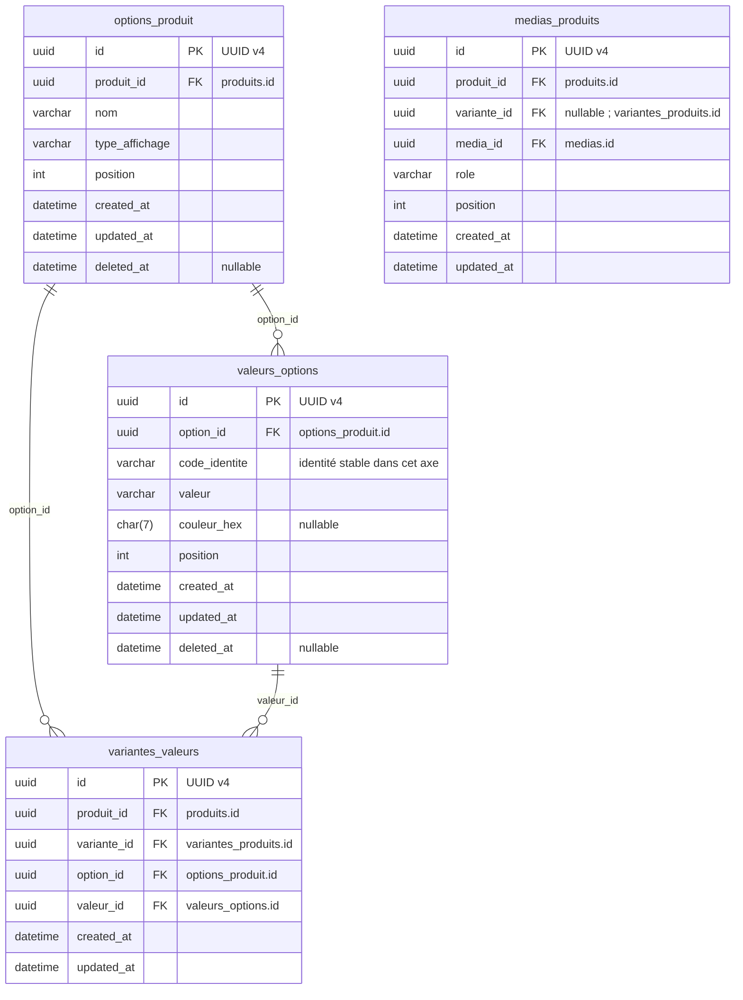
```mermaid
erDiagram
    direction TB
    options_produit {
        uuid id PK "UUID v4"
        uuid produit_id FK "produits.id"
        varchar nom
        varchar type_affichage
        int position
        datetime created_at
        datetime updated_at
        datetime deleted_at "nullable"
    }
    valeurs_options {
        uuid id PK "UUID v4"
        uuid option_id FK "options_produit.id"
        varchar code_identite "identité stable dans cet axe"
        varchar valeur
        char(7) couleur_hex "nullable"
        int position
        datetime created_at
        datetime updated_at
        datetime deleted_at "nullable"
    }
    variantes_valeurs {
        uuid id PK "UUID v4"
        uuid produit_id FK "produits.id"
        uuid variante_id FK "variantes_produits.id"
        uuid option_id FK "options_produit.id"
        uuid valeur_id FK "valeurs_options.id"
        datetime created_at
        datetime updated_at
    }
    medias_produits {
        uuid id PK "UUID v4"
        uuid produit_id FK "produits.id"
        uuid variante_id FK "nullable ; variantes_produits.id"
        uuid media_id FK "medias.id"
        varchar role
        int position
        datetime created_at
        datetime updated_at
    }
    options_produit ||--o{ valeurs_options : option_id
    options_produit ||--o{ variantes_valeurs : option_id
    valeurs_options ||--o{ variantes_valeurs : valeur_id
```

#### Explication très simple des champs

**`options_produit` :**

- **`id`** : le numéro unique qui permet de reconnaître cette ligne dans la base. Deux lignes différentes ne peuvent pas avoir le même `id`.
- **`produit_id`** : l’identifiant du produit. Il sert à relier cette ligne à la bonne information au lieu de recopier toutes ses données.
- **`nom`** : le nom affiché à l’utilisateur. Exemple : « Nombre de boutiques » ou « Livraison EcoTrack ».
- **`type_affichage`** : la façon d’afficher l’option. Exemple : boutons, liste ou pastilles de couleur.
- **`position`** : l’ordre d’affichage. Exemple : 1 apparaît avant 2.
- **`created_at`** : la date où cette ligne a été créée dans la base.
- **`updated_at`** : la date de la dernière modification de cette ligne. Exemple : si tu modifies l’élément aujourd’hui, cette date devient celle d’aujourd’hui.
- **`deleted_at`** : la date où l’élément a été retiré sans effacer son ancienne ligne. Si ce champ est vide, l’élément n’est pas supprimé.

**`valeurs_options` :**

- **`id`** : le numéro unique qui permet de reconnaître cette ligne dans la base. Deux lignes différentes ne peuvent pas avoir le même `id`.
- **`option_id`** : l’option concernée. Exemple : « Taille ».
- **`code_identite`** : le code utilisé pour reconnaître **identite** de manière stable dans le programme ou chez un service externe.
- **`valeur`** : la valeur enregistrée. Exemple : `Rouge`, `XL` ou une autre valeur selon la table.
- **`couleur_hex`** : la couleur écrite sous forme de code web. Exemple : `#FF0000` pour rouge. Ce champ peut rester vide quand cette information n’est pas nécessaire ou pas encore connue.
- **`position`** : l’ordre d’affichage. Exemple : 1 apparaît avant 2.
- **`created_at`** : la date où cette ligne a été créée dans la base.
- **`updated_at`** : la date de la dernière modification de cette ligne. Exemple : si tu modifies l’élément aujourd’hui, cette date devient celle d’aujourd’hui.
- **`deleted_at`** : la date où l’élément a été retiré sans effacer son ancienne ligne. Si ce champ est vide, l’élément n’est pas supprimé.

**`variantes_valeurs` :**

- **`id`** : le numéro unique qui permet de reconnaître cette ligne dans la base. Deux lignes différentes ne peuvent pas avoir le même `id`.
- **`produit_id`** : l’identifiant du produit. Il sert à relier cette ligne à la bonne information au lieu de recopier toutes ses données.
- **`variante_id`** : l’identifiant de la variante du produit. Il sert à relier cette ligne à la bonne information au lieu de recopier toutes ses données.
- **`option_id`** : l’option concernée. Exemple : « Taille ».
- **`valeur_id`** : la valeur choisie pour l’option. Exemple : « 42 » pour l’option Taille.
- **`created_at`** : la date où cette ligne a été créée dans la base.
- **`updated_at`** : la date de la dernière modification de cette ligne. Exemple : si tu modifies l’élément aujourd’hui, cette date devient celle d’aujourd’hui.

**`medias_produits` :**

- **`id`** : le numéro unique qui permet de reconnaître cette ligne dans la base. Deux lignes différentes ne peuvent pas avoir le même `id`.
- **`produit_id`** : l’identifiant du produit. Il sert à relier cette ligne à la bonne information au lieu de recopier toutes ses données.
- **`variante_id`** : l’identifiant de la variante du produit. Il sert à relier cette ligne à la bonne information au lieu de recopier toutes ses données. Ce champ peut rester vide quand cette information n’est pas nécessaire ou pas encore connue.
- **`media_id`** : l’identifiant du fichier/image/vidéo. Il sert à relier cette ligne à la bonne information au lieu de recopier toutes ses données.
- **`role`** : indique le rôle du média pour le produit. Exemple : image principale, image secondaire ou vidéo.
- **`position`** : l’ordre d’affichage. Exemple : 1 apparaît avant 2.
- **`created_at`** : la date où cette ligne a été créée dans la base.
- **`updated_at`** : la date de la dernière modification de cette ligne. Exemple : si tu modifies l’élément aujourd’hui, cette date devient celle d’aujourd’hui.


Les références vers un autre module sont indiquées sur les champs, même si leur flèche n’est pas redessinée ici.

- **`options_produit` :** Dans un même produit, deux options ne peuvent pas avoir le même nom une fois le nom normalisé. Une option représente quelque chose que l’acheteur choisit pour créer une vraie variante, par exemple `Taille` ou `Couleur`. Une simple information descriptive comme « lavable à 30 °C » ne doit pas devenir une option de variante.

- **`valeurs_options` :** Dans une même option, deux valeurs ne peuvent pas être identiques après normalisation, et chaque `code_identite` est unique dans cette option. `code_identite` représente l’identité stable de la valeur. Exemple : la valeur qui représente la taille 40 ne doit jamais être transformée plus tard en taille 41. Dès qu’une valeur est utilisée par une variante déjà utilisée en stock ou en commande, sa signification physique est figée. On peut encore corriger un libellé, par exemple une faute d’orthographe, seulement si la signification reste exactement la même. La couleur hexadécimale reste facultative.

- **`variantes_valeurs` :** Une variante ne peut avoir qu’une seule valeur pour une même option. La `valeur_id` doit réellement appartenir à `option_id`, et l’option comme la variante doivent appartenir au même produit. Pour chaque axe actif, une variante doit avoir exactement une valeur. Exemple : si le produit utilise Taille et Couleur, une variante doit avoir une taille et une couleur. La variante standard n’a aucune valeur d’option. Dès que la variante a déjà été utilisée (`utilisee_at` rempli), on refuse d’ajouter, modifier ou supprimer sa composition, aussi bien dans le service que dans la BDD. Les imports passent par la même règle : pour changer l’identité historique, on crée une nouvelle variante.

- **`medias_produits` :** Si un média vise une variante précise, cette variante doit appartenir au produit indiqué. `role` peut être `principal`, `galerie`, `guide_taille` ou `mise_en_situation`. Il ne peut y avoir qu’un média principal pour le produit lui-même, et un seul principal par variante lorsqu’on utilise une image spécifique à une variante. Les galeries peuvent contenir des images ou des vidéos.

### T4 — Classement et caractéristiques

**`etiquettes` — Les petits mots utilisés pour classer ou mettre en avant les produits. Exemple : « Été » ou « Idée cadeau ».**

**`produits_etiquettes` — Indique quelles étiquettes sont attachées à chaque produit. Exemple : le même t-shirt peut porter les étiquettes « Été » et « Idée cadeau ».**

**`caracteristiques` — La liste des informations servant à décrire les produits. Exemple : le poids ou le pays de fabrication ; ce ne sont pas forcément des choix proposés à l’achat.**

**`produits_caracteristiques` — La valeur d’une caractéristique pour un produit précis. Exemple : le poids de ce pot de miel est de 500 grammes.**

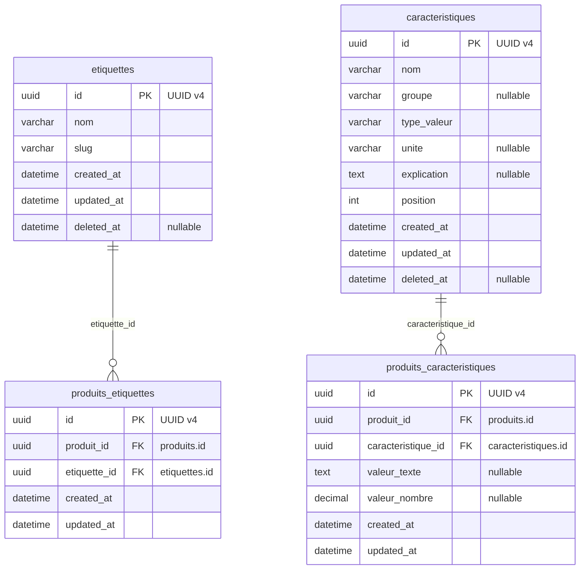
```mermaid
erDiagram
    direction TB
    etiquettes {
        uuid id PK "UUID v4"
        varchar nom
        varchar slug
        datetime created_at
        datetime updated_at
        datetime deleted_at "nullable"
    }
    produits_etiquettes {
        uuid id PK "UUID v4"
        uuid produit_id FK "produits.id"
        uuid etiquette_id FK "etiquettes.id"
        datetime created_at
        datetime updated_at
    }
    caracteristiques {
        uuid id PK "UUID v4"
        varchar nom
        varchar groupe "nullable"
        varchar type_valeur
        varchar unite "nullable"
        text explication "nullable"
        int position
        datetime created_at
        datetime updated_at
        datetime deleted_at "nullable"
    }
    produits_caracteristiques {
        uuid id PK "UUID v4"
        uuid produit_id FK "produits.id"
        uuid caracteristique_id FK "caracteristiques.id"
        text valeur_texte "nullable"
        decimal valeur_nombre "nullable"
        datetime created_at
        datetime updated_at
    }
    etiquettes ||--o{ produits_etiquettes : etiquette_id
    caracteristiques ||--o{ produits_caracteristiques : caracteristique_id
```

#### Explication très simple des champs

**`etiquettes` :**

- **`id`** : le numéro unique qui permet de reconnaître cette ligne dans la base. Deux lignes différentes ne peuvent pas avoir le même `id`.
- **`nom`** : le nom affiché à l’utilisateur. Exemple : « Nombre de boutiques » ou « Livraison EcoTrack ».
- **`slug`** : la partie simple de l’adresse web. Exemple : `a-propos` dans `/a-propos`.
- **`created_at`** : la date où cette ligne a été créée dans la base.
- **`updated_at`** : la date de la dernière modification de cette ligne. Exemple : si tu modifies l’élément aujourd’hui, cette date devient celle d’aujourd’hui.
- **`deleted_at`** : la date où l’élément a été retiré sans effacer son ancienne ligne. Si ce champ est vide, l’élément n’est pas supprimé.

**`produits_etiquettes` :**

- **`id`** : le numéro unique qui permet de reconnaître cette ligne dans la base. Deux lignes différentes ne peuvent pas avoir le même `id`.
- **`produit_id`** : l’identifiant du produit. Il sert à relier cette ligne à la bonne information au lieu de recopier toutes ses données.
- **`etiquette_id`** : l’identifiant de l’étiquette. Il sert à relier cette ligne à la bonne information au lieu de recopier toutes ses données.
- **`created_at`** : la date où cette ligne a été créée dans la base.
- **`updated_at`** : la date de la dernière modification de cette ligne. Exemple : si tu modifies l’élément aujourd’hui, cette date devient celle d’aujourd’hui.

**`caracteristiques` :**

- **`id`** : le numéro unique qui permet de reconnaître cette ligne dans la base. Deux lignes différentes ne peuvent pas avoir le même `id`.
- **`nom`** : le nom affiché à l’utilisateur. Exemple : « Nombre de boutiques » ou « Livraison EcoTrack ».
- **`groupe`** : un nom qui permet de ranger plusieurs caractéristiques ensemble. Exemple : « Dimensions » pour longueur, largeur et hauteur. Ce champ peut rester vide quand cette information n’est pas nécessaire ou pas encore connue.
- **`type_valeur`** : indique si la fonctionnalité se règle par **oui/non** ou par **un nombre maximum**. Exemple : « Peut-il utiliser EcoTrack ? Oui. » ou « Combien de boutiques ? 3. »
- **`unite`** : explique ce que le nombre représente. Exemple : dans **« 3 boutiques »**, le nombre est 3 et l’unité est « boutiques ». Pour une fonction seulement oui/non, ce champ peut rester vide.
- **`explication`** : un texte simple qui aide à comprendre la caractéristique. Exemple : expliquer ce que veut dire « matière ». Ce champ peut rester vide.
- **`position`** : l’ordre d’affichage. Exemple : 1 apparaît avant 2.
- **`created_at`** : la date où cette ligne a été créée dans la base.
- **`updated_at`** : la date de la dernière modification de cette ligne. Exemple : si tu modifies l’élément aujourd’hui, cette date devient celle d’aujourd’hui.
- **`deleted_at`** : la date où l’élément a été retiré sans effacer son ancienne ligne. Si ce champ est vide, l’élément n’est pas supprimé.

**`produits_caracteristiques` :**

- **`id`** : le numéro unique qui permet de reconnaître cette ligne dans la base. Deux lignes différentes ne peuvent pas avoir le même `id`.
- **`produit_id`** : l’identifiant du produit. Il sert à relier cette ligne à la bonne information au lieu de recopier toutes ses données.
- **`caracteristique_id`** : l’identifiant de la caractéristique. Il sert à relier cette ligne à la bonne information au lieu de recopier toutes ses données.
- **`valeur_texte`** : la valeur écrite en texte pour cette caractéristique. Exemple : `Coton`. Ce champ peut rester vide quand cette information n’est pas nécessaire ou pas encore connue.
- **`valeur_nombre`** : la valeur numérique de la caractéristique quand elle se mesure avec un nombre. Exemple : `500`. Ce champ peut rester vide quand cette information n’est pas nécessaire ou pas encore connue.
- **`created_at`** : la date où cette ligne a été créée dans la base.
- **`updated_at`** : la date de la dernière modification de cette ligne. Exemple : si tu modifies l’élément aujourd’hui, cette date devient celle d’aujourd’hui.


Les références vers un autre module sont indiquées sur les champs, même si leur flèche n’est pas redessinée ici.

- **`etiquettes` :** Chaque étiquette possède un `slug` unique. Deux étiquettes ne peuvent donc pas utiliser la même adresse logique dans la boutique.

- **`produits_etiquettes` :** Le même produit ne peut recevoir la même étiquette qu’une seule fois. Exemple : si le produit « T-shirt A » possède déjà l’étiquette `ete`, on ne crée pas une deuxième liaison identique.

- **`caracteristiques` :** Une caractéristique est unique pour un même `nom` et un même groupe normalisé. Exemples : `composition`, `capacité` ou `dimensions`. Cette table sert aux informations descriptives et aux unités cohérentes. Elle évite de créer une variante juste pour une information que l’acheteur ne choisit pas.

- **`produits_caracteristiques` :** Un produit ne peut avoir qu’une seule valeur pour une même caractéristique. La valeur enregistrée doit respecter le type de la caractéristique : un champ numérique reçoit un nombre, un champ texte reçoit du texte, etc. Les filtres basés sur de vraies options choisissables comme taille ou couleur continuent d’utiliser `options_produit` et `valeurs_options`, pas cette table.

### T5 — Vente et avis

**`pages_vente` — Les pages qui présentent un seul produit pour donner envie de le commander. Exemple : une page partageable avec les avantages d’un produit, ses images et son formulaire de commande.**

**`promotions_produits` — Les réductions appliquées automatiquement aux produits, sans code à saisir. Exemple : une réduction sur un produit pendant une période choisie.**

**`avis_produits` — Les notes et commentaires laissés sur les produits, même sans compte acheteur. Exemple : un client écrit « Très bon produit » ; la boutique décide ensuite de publier ou de masquer cet avis.**

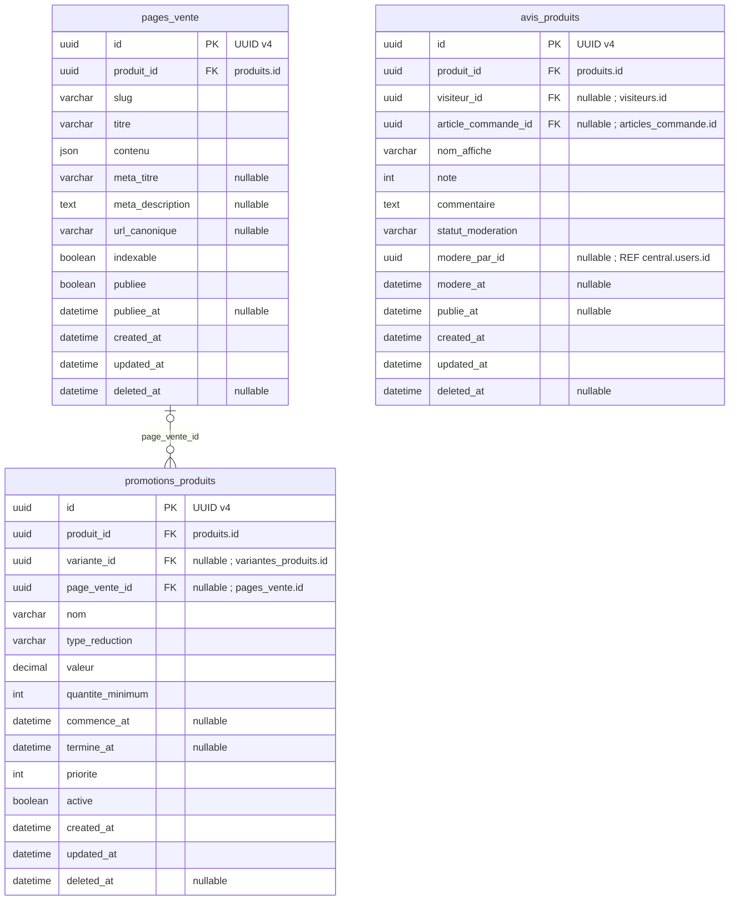
```mermaid
erDiagram
    direction TB
    pages_vente {
        uuid id PK "UUID v4"
        uuid produit_id FK "produits.id"
        varchar slug
        varchar titre
        json contenu
        varchar meta_titre "nullable"
        text meta_description "nullable"
        varchar url_canonique "nullable"
        boolean indexable
        boolean publiee
        datetime publiee_at "nullable"
        datetime created_at
        datetime updated_at
        datetime deleted_at "nullable"
    }
    promotions_produits {
        uuid id PK "UUID v4"
        uuid produit_id FK "produits.id"
        uuid variante_id FK "nullable ; variantes_produits.id"
        uuid page_vente_id FK "nullable ; pages_vente.id"
        varchar nom
        varchar type_reduction
        decimal valeur
        int quantite_minimum
        datetime commence_at "nullable"
        datetime termine_at "nullable"
        int priorite
        boolean active
        datetime created_at
        datetime updated_at
        datetime deleted_at "nullable"
    }
    avis_produits {
        uuid id PK "UUID v4"
        uuid produit_id FK "produits.id"
        uuid visiteur_id FK "nullable ; visiteurs.id"
        uuid article_commande_id FK "nullable ; articles_commande.id"
        varchar nom_affiche
        int note
        text commentaire
        varchar statut_moderation
        uuid modere_par_id "nullable ; REF central.users.id"
        datetime modere_at "nullable"
        datetime publie_at "nullable"
        datetime created_at
        datetime updated_at
        datetime deleted_at "nullable"
    }
    pages_vente |o--o{ promotions_produits : page_vente_id
```

#### Explication très simple des champs

**`pages_vente` :**

- **`id`** : le numéro unique qui permet de reconnaître cette ligne dans la base. Deux lignes différentes ne peuvent pas avoir le même `id`.
- **`produit_id`** : l’identifiant du produit. Il sert à relier cette ligne à la bonne information au lieu de recopier toutes ses données.
- **`slug`** : la partie simple de l’adresse web. Exemple : `a-propos` dans `/a-propos`.
- **`titre`** : le titre affiché à l’utilisateur.
- **`contenu`** : le texte ou contenu principal de la page.
- **`meta_titre`** : le titre prévu pour les moteurs de recherche et le partage web. Ce champ peut rester vide quand cette information n’est pas nécessaire ou pas encore connue.
- **`meta_description`** : la petite description prévue pour les moteurs de recherche. Ce champ peut rester vide quand cette information n’est pas nécessaire ou pas encore connue.
- **`url_canonique`** : l’adresse web principale que les moteurs de recherche doivent considérer comme la vraie version de cette page. Ce champ peut rester vide quand cette information n’est pas nécessaire ou pas encore connue.
- **`indexable`** : indique si les moteurs de recherche sont autorisés à indexer cette page.
- **`publiee`** : indique si l’élément est publié et donc prêt à être montré.
- **`publiee_at`** : la date et l’heure liées à **publiee**. Elle permet de savoir exactement quand cette étape a eu lieu. Ce champ peut rester vide quand cette information n’est pas nécessaire ou pas encore connue.
- **`created_at`** : la date où cette ligne a été créée dans la base.
- **`updated_at`** : la date de la dernière modification de cette ligne. Exemple : si tu modifies l’élément aujourd’hui, cette date devient celle d’aujourd’hui.
- **`deleted_at`** : la date où l’élément a été retiré sans effacer son ancienne ligne. Si ce champ est vide, l’élément n’est pas supprimé.

**`promotions_produits` :**

- **`id`** : le numéro unique qui permet de reconnaître cette ligne dans la base. Deux lignes différentes ne peuvent pas avoir le même `id`.
- **`produit_id`** : l’identifiant du produit. Il sert à relier cette ligne à la bonne information au lieu de recopier toutes ses données.
- **`variante_id`** : l’identifiant de la variante du produit. Il sert à relier cette ligne à la bonne information au lieu de recopier toutes ses données. Ce champ peut rester vide quand cette information n’est pas nécessaire ou pas encore connue.
- **`page_vente_id`** : l’identifiant de la page de vente. Il sert à relier cette ligne à la bonne information au lieu de recopier toutes ses données. Ce champ peut rester vide quand cette information n’est pas nécessaire ou pas encore connue.
- **`nom`** : le nom affiché à l’utilisateur. Exemple : « Nombre de boutiques » ou « Livraison EcoTrack ».
- **`type_reduction`** : la manière de calculer la promotion. Exemple : pourcentage ou montant fixe.
- **`valeur`** : la valeur enregistrée. Exemple : `Rouge`, `XL` ou une autre valeur selon la table.
- **`quantite_minimum`** : le nombre d’unités correspondant à **minimum**. Exemple : `2` signifie deux unités.
- **`commence_at`** : la date et l’heure où la période ou l’action commence. Ce champ peut rester vide quand cette information n’est pas nécessaire ou pas encore connue.
- **`termine_at`** : la date et l’heure où elle s’est terminée. Peut rester vide tant que ce n’est pas terminé.
- **`priorite`** : un nombre utilisé pour décider quel élément passe avant un autre. Exemple : priorité 1 avant priorité 2.
- **`active`** : indique si cette possibilité est autorisée. `true` = oui, `false` = non.
- **`created_at`** : la date où cette ligne a été créée dans la base.
- **`updated_at`** : la date de la dernière modification de cette ligne. Exemple : si tu modifies l’élément aujourd’hui, cette date devient celle d’aujourd’hui.
- **`deleted_at`** : la date où l’élément a été retiré sans effacer son ancienne ligne. Si ce champ est vide, l’élément n’est pas supprimé.

**`avis_produits` :**

- **`id`** : le numéro unique qui permet de reconnaître cette ligne dans la base. Deux lignes différentes ne peuvent pas avoir le même `id`.
- **`produit_id`** : l’identifiant du produit. Il sert à relier cette ligne à la bonne information au lieu de recopier toutes ses données.
- **`visiteur_id`** : l’identifiant du visiteur. Il sert à relier cette ligne à la bonne information au lieu de recopier toutes ses données. Ce champ peut rester vide quand cette information n’est pas nécessaire ou pas encore connue.
- **`article_commande_id`** : l’identifiant de la ligne de produit de la commande. Il sert à relier cette ligne à la bonne information au lieu de recopier toutes ses données. Ce champ peut rester vide quand cette information n’est pas nécessaire ou pas encore connue.
- **`nom_affiche`** : le nom réellement montré aux visiteurs.
- **`note`** : une information libre ajoutée pour aider à comprendre la ligne. Selon la table, cela peut être une note interne ou une note chiffrée.
- **`commentaire`** : le texte écrit par le client ou l’utilisateur.
- **`statut_moderation`** : indique si l’avis est en attente, accepté ou refusé.
- **`modere_par_id`** : l’identifiant de la personne qui a modéré. Il sert à relier cette ligne à la bonne information au lieu de recopier toutes ses données. Ce champ peut rester vide quand cette information n’est pas nécessaire ou pas encore connue.
- **`modere_at`** : la date où l’avis a été vérifié. Ce champ peut rester vide quand cette information n’est pas nécessaire ou pas encore connue.
- **`publie_at`** : la date où l’élément a été publié. Ce champ peut rester vide quand cette information n’est pas nécessaire ou pas encore connue.
- **`created_at`** : la date où cette ligne a été créée dans la base.
- **`updated_at`** : la date de la dernière modification de cette ligne. Exemple : si tu modifies l’élément aujourd’hui, cette date devient celle d’aujourd’hui.
- **`deleted_at`** : la date où l’élément a été retiré sans effacer son ancienne ligne. Si ce champ est vide, l’élément n’est pas supprimé.


Les références vers un autre module sont indiquées sur les champs, même si leur flèche n’est pas redessinée ici.

- **`pages_vente` :** Chaque page de vente possède un `slug` unique. Une page est liée à un produit précis et `produit_id` ne peut plus être changé après sa création : si on veut vendre un autre produit avec une autre page, on archive l’ancienne page et on en crée une nouvelle. Un même produit peut avoir plusieurs pages de vente différentes. La page ne possède pas son propre prix ou son propre stock : elle affiche les valeurs calculées depuis les variantes et les promotions. Un produit peut aussi être commandé sans passer par une page de vente. La page n’est pas automatiquement redirigée vers la catégorie du produit.

- **`promotions_produits` :** Une promotion peut être un `pourcentage`, un `montant_unitaire` retiré ou un `prix_unitaire_fixe`. La quantité minimale doit être au moins 1, un pourcentage doit rester entre 0 et 100 et le prix final ne peut jamais être négatif. Si la promotion vise une variante ou une page précise, cette variante et cette page doivent appartenir au même produit. Une seule promotion est retenue pour une ligne de commande. S’il y en a plusieurs, on regarde d’abord la priorité, puis la plus avantageuse, puis l’UUID pour départager de manière stable. Le serveur décide si une page autorise la promotion ; il ne fait jamais confiance à un simple `page_id` envoyé par le navigateur.

- **`avis_produits` :** La note est un entier de 1 à 5. Le statut peut être `en_attente`, `publie`, `masque` ou `rejete`. Seuls les avis publiés entrent dans la note publique. Si un avis dit « achat vérifié », `article_commande_id` doit réellement appartenir à ce produit ET le système doit avoir une preuve que l’auteur possède l’accès à la commande livrée. Saisir seulement le même nom ou le même téléphone ne suffit pas. La FK prouve que l’article concernait ce produit, pas automatiquement l’identité de la personne qui écrit. Un avis masqué reste conservé pour audit.

### T6 — Visiteurs et statistiques

**`visiteurs` — Un identifiant pour reconnaître un navigateur dans cette boutique, sans créer de compte acheteur. Exemple : reconnaître le même navigateur lors d’un retour sur le site, sans garantir qu’il s’agit de la même personne.**

**`sessions_visite` — Les différentes visites d’un navigateur sur la boutique. Exemple : une visite le matin puis une autre le soir peuvent former deux sessions pour le même visiteur.**

**`evenements_navigation` — Les actions suivies pour comprendre le parcours sur le site. Exemple : ouvrir une fiche produit, ajouter un article au panier puis arriver à la commande.**

**`preferences_visiteur` — Les choix du visiteur concernant la mesure de sa navigation. Exemple : refuser cette mesure tout en continuant à utiliser le panier et à commander.**

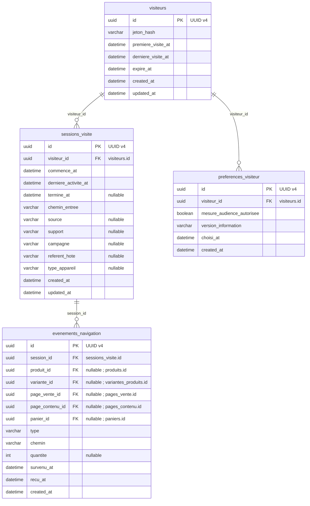
```mermaid
erDiagram
    direction TB
    visiteurs {
        uuid id PK "UUID v4"
        varchar jeton_hash
        datetime premiere_visite_at
        datetime derniere_visite_at
        datetime expire_at
        datetime created_at
        datetime updated_at
    }
    sessions_visite {
        uuid id PK "UUID v4"
        uuid visiteur_id FK "visiteurs.id"
        datetime commence_at
        datetime derniere_activite_at
        datetime termine_at "nullable"
        varchar chemin_entree
        varchar source "nullable"
        varchar support "nullable"
        varchar campagne "nullable"
        varchar referent_hote "nullable"
        varchar type_appareil "nullable"
        datetime created_at
        datetime updated_at
    }
    evenements_navigation {
        uuid id PK "UUID v4"
        uuid session_id FK "sessions_visite.id"
        uuid produit_id FK "nullable ; produits.id"
        uuid variante_id FK "nullable ; variantes_produits.id"
        uuid page_vente_id FK "nullable ; pages_vente.id"
        uuid page_contenu_id FK "nullable ; pages_contenu.id"
        uuid panier_id FK "nullable ; paniers.id"
        varchar type
        varchar chemin
        int quantite "nullable"
        datetime survenu_at
        datetime recu_at
        datetime created_at
    }
    preferences_visiteur {
        uuid id PK "UUID v4"
        uuid visiteur_id FK "visiteurs.id"
        boolean mesure_audience_autorisee
        varchar version_information
        datetime choisi_at
        datetime created_at
    }
    visiteurs ||--o{ sessions_visite : visiteur_id
    sessions_visite ||--o{ evenements_navigation : session_id
    visiteurs ||--o{ preferences_visiteur : visiteur_id
```

#### Explication très simple des champs

**`visiteurs` :**

- **`id`** : le numéro unique qui permet de reconnaître cette ligne dans la base. Deux lignes différentes ne peuvent pas avoir le même `id`.
- **`jeton_hash`** : la version protégée du jeton d’invitation. Si la base est lue, le vrai lien secret n’est pas directement récupérable.
- **`premiere_visite_at`** : la date de la première visite connue de ce visiteur.
- **`derniere_visite_at`** : la date de sa dernière visite connue.
- **`expire_at`** : la date où l’élément n’est plus valable.
- **`created_at`** : la date où cette ligne a été créée dans la base.
- **`updated_at`** : la date de la dernière modification de cette ligne. Exemple : si tu modifies l’élément aujourd’hui, cette date devient celle d’aujourd’hui.

**`sessions_visite` :**

- **`id`** : le numéro unique qui permet de reconnaître cette ligne dans la base. Deux lignes différentes ne peuvent pas avoir le même `id`.
- **`visiteur_id`** : l’identifiant du visiteur. Il sert à relier cette ligne à la bonne information au lieu de recopier toutes ses données.
- **`commence_at`** : la date et l’heure où la période ou l’action commence.
- **`derniere_activite_at`** : la date et l’heure liées à **derniere activite**. Elle permet de savoir exactement quand cette étape a eu lieu.
- **`termine_at`** : la date et l’heure où elle s’est terminée. Peut rester vide tant que ce n’est pas terminé.
- **`chemin_entree`** : la première page visitée dans cette session. Exemple : `/produit/chaussure-noire`.
- **`source`** : indique d’où vient l’information. Exemple : saisie manuelle ou réponse de l’API. Ce champ peut rester vide quand cette information n’est pas nécessaire ou pas encore connue.
- **`support`** : une information sur le support utilisé pour arriver sur le site, par exemple une source marketing ou un canal suivi. Ce champ peut rester vide quand cette information n’est pas nécessaire ou pas encore connue.
- **`campagne`** : le nom ou code d’une campagne marketing utilisé pour savoir d’où vient la visite. Ce champ peut rester vide quand cette information n’est pas nécessaire ou pas encore connue.
- **`referent_hote`** : le site ou domaine qui a envoyé le visiteur vers la boutique. Ce champ peut rester vide quand cette information n’est pas nécessaire ou pas encore connue.
- **`type_appareil`** : le type d’appareil utilisé. Exemple : téléphone, ordinateur ou tablette. Ce champ peut rester vide quand cette information n’est pas nécessaire ou pas encore connue.
- **`created_at`** : la date où cette ligne a été créée dans la base.
- **`updated_at`** : la date de la dernière modification de cette ligne. Exemple : si tu modifies l’élément aujourd’hui, cette date devient celle d’aujourd’hui.

**`evenements_navigation` :**

- **`id`** : le numéro unique qui permet de reconnaître cette ligne dans la base. Deux lignes différentes ne peuvent pas avoir le même `id`.
- **`session_id`** : la session de navigation concernée.
- **`produit_id`** : l’identifiant du produit. Il sert à relier cette ligne à la bonne information au lieu de recopier toutes ses données. Ce champ peut rester vide quand cette information n’est pas nécessaire ou pas encore connue.
- **`variante_id`** : l’identifiant de la variante du produit. Il sert à relier cette ligne à la bonne information au lieu de recopier toutes ses données. Ce champ peut rester vide quand cette information n’est pas nécessaire ou pas encore connue.
- **`page_vente_id`** : l’identifiant de la page de vente. Il sert à relier cette ligne à la bonne information au lieu de recopier toutes ses données. Ce champ peut rester vide quand cette information n’est pas nécessaire ou pas encore connue.
- **`page_contenu_id`** : l’identifiant de la page de contenu. Il sert à relier cette ligne à la bonne information au lieu de recopier toutes ses données. Ce champ peut rester vide quand cette information n’est pas nécessaire ou pas encore connue.
- **`panier_id`** : l’identifiant du panier. Il sert à relier cette ligne à la bonne information au lieu de recopier toutes ses données. Ce champ peut rester vide quand cette information n’est pas nécessaire ou pas encore connue.
- **`type`** : indique la catégorie de l’élément. Exemple : un domaine peut être `sous_domaine` ou `personnalise`.
- **`chemin`** : l’endroit où le fichier est rangé dans le stockage privé.
- **`quantite`** : le nombre d’éléments concernés. Exemple : `2` signifie deux unités du produit. Ce champ peut rester vide quand cette information n’est pas nécessaire ou pas encore connue.
- **`survenu_at`** : la date et l’heure où l’événement s’est produit.
- **`recu_at`** : la date et l’heure liées à **recu**. Elle permet de savoir exactement quand cette étape a eu lieu.
- **`created_at`** : la date où cette ligne a été créée dans la base.

**`preferences_visiteur` :**

- **`id`** : le numéro unique qui permet de reconnaître cette ligne dans la base. Deux lignes différentes ne peuvent pas avoir le même `id`.
- **`visiteur_id`** : l’identifiant du visiteur. Il sert à relier cette ligne à la bonne information au lieu de recopier toutes ses données.
- **`mesure_audience_autorisee`** : indique si la mesure d’audience prévue par le site peut être utilisée pour ce visiteur selon la règle retenue.
- **`version_information`** : la version du texte d’information montrée au client.
- **`choisi_at`** : la date et l’heure liées à **choisi**. Elle permet de savoir exactement quand cette étape a eu lieu.
- **`created_at`** : la date où cette ligne a été créée dans la base.


Les références vers un autre module sont indiquées sur les champs, même si leur flèche n’est pas redessinée ici.

- **`visiteurs` :** Chaque `jeton_hash` est unique. Le cookie du navigateur contient un secret aléatoire différent de l’UUID interne de la ligne. Une boutique ne partage pas cet identifiant avec une autre boutique. L’adresse IP ou une empreinte du navigateur ne sont pas utilisées comme identité fiable du visiteur.

- **`sessions_visite` :** On indexe `visiteur_id + commence_at` pour retrouver rapidement les sessions d’un visiteur. La règle proposée est de commencer une nouvelle session après 30 minutes sans activité. `source`, `support` et `campagne` sont seulement des étiquettes internes facultatives ; elles ne connectent pas automatiquement Instagram, Facebook ou un autre réseau. On ne stocke pas comme référent une URL qui pourrait contenir un token ou un secret.

- **`evenements_navigation` :** L’UUID de l’événement sert aussi à éviter d’enregistrer deux fois le même événement. Les types prévus sont `page_vue`, `produit_vu`, `recherche`, `ajout_panier`, `retrait_panier` et `checkout_commence`. Les achats et les retours ne sont pas déclarés par le navigateur : ils viennent du serveur métier pour être fiables. Les références envoyées par le client et leurs dates sont vérifiées avant enregistrement. Pour une fiche produit, un seul événement `produit_vu` suffit ; on ne crée pas en plus un deuxième événement `page_vue` pour compter deux fois la même visite.

- **`preferences_visiteur` :** On conserve l’historique des choix faits par le visiteur lorsque cette collecte est activée. Le panier doit continuer à fonctionner même si la mesure d’audience n’est pas utilisée. La durée de conservation et les conditions exactes de collecte doivent être décidées avant la mise en ligne. La présence de cette table ne signifie pas à elle seule que le traitement est juridiquement conforme.

### T7 — Panier

**`paniers` — Les paniers conservés par le site pour les acheteurs invités. Exemple : un visiteur ajoute deux produits avant de renseigner ses coordonnées ; cela ne réserve pas encore le stock.**

**`articles_panier` — Le contenu détaillé de chaque panier. Exemple : deux t-shirts rouges taille M, avec une éventuelle personnalisation, forment une ligne du panier.**

```mermaid
erDiagram
    direction TB
    paniers {
        uuid id PK "UUID v4"
        uuid visiteur_id FK "visiteurs.id"
        varchar statut
        datetime derniere_activite_at
        datetime expire_at
        datetime converti_at "nullable"
        datetime created_at
        datetime updated_at
    }
    articles_panier {
        uuid id PK "UUID v4"
        uuid panier_id FK "paniers.id"
        uuid variante_id FK "variantes_produits.id"
        uuid produit_id FK "produits.id"
        uuid page_vente_id FK "nullable ; pages_vente.id"
        int quantite
        json personnalisation "nullable"
        varchar signature_personnalisation
        datetime created_at
        datetime updated_at
    }
    paniers ||--o{ articles_panier : panier_id
```

#### Explication très simple des champs

**`paniers` :**

- **`id`** : le numéro unique qui permet de reconnaître cette ligne dans la base. Deux lignes différentes ne peuvent pas avoir le même `id`.
- **`visiteur_id`** : l’identifiant du visiteur. Il sert à relier cette ligne à la bonne information au lieu de recopier toutes ses données.
- **`statut`** : indique où en est l’élément. Exemple : `en_attente`, `actif`, `termine` ou `annule` selon la table.
- **`derniere_activite_at`** : la date et l’heure liées à **derniere activite**. Elle permet de savoir exactement quand cette étape a eu lieu.
- **`expire_at`** : la date où l’élément n’est plus valable.
- **`converti_at`** : la date où le panier a été transformé en commande. Ce champ peut rester vide quand cette information n’est pas nécessaire ou pas encore connue.
- **`created_at`** : la date où cette ligne a été créée dans la base.
- **`updated_at`** : la date de la dernière modification de cette ligne. Exemple : si tu modifies l’élément aujourd’hui, cette date devient celle d’aujourd’hui.

**`articles_panier` :**

- **`id`** : le numéro unique qui permet de reconnaître cette ligne dans la base. Deux lignes différentes ne peuvent pas avoir le même `id`.
- **`panier_id`** : l’identifiant du panier. Il sert à relier cette ligne à la bonne information au lieu de recopier toutes ses données.
- **`variante_id`** : l’identifiant de la variante du produit. Il sert à relier cette ligne à la bonne information au lieu de recopier toutes ses données.
- **`produit_id`** : l’identifiant du produit. Il sert à relier cette ligne à la bonne information au lieu de recopier toutes ses données.
- **`page_vente_id`** : l’identifiant de la page de vente. Il sert à relier cette ligne à la bonne information au lieu de recopier toutes ses données. Ce champ peut rester vide quand cette information n’est pas nécessaire ou pas encore connue.
- **`quantite`** : le nombre d’éléments concernés. Exemple : `2` signifie deux unités du produit.
- **`personnalisation`** : les choix personnalisés du client pour cet article. Exemple : texte à imprimer ou couleur spéciale. Ce champ peut rester vide quand cette information n’est pas nécessaire ou pas encore connue.
- **`signature_personnalisation`** : une signature calculée à partir des choix personnalisés de l’article. Elle permet de savoir si deux articles ont exactement la même personnalisation.
- **`created_at`** : la date où cette ligne a été créée dans la base.
- **`updated_at`** : la date de la dernière modification de cette ligne. Exemple : si tu modifies l’élément aujourd’hui, cette date devient celle d’aujourd’hui.


Les références vers un autre module sont indiquées sur les champs, même si leur flèche n’est pas redessinée ici.

- **`paniers` :** Un panier peut être `actif`, `abandonne`, `converti` ou `expire`. Un visiteur ne peut avoir qu’un seul panier actif à la fois. Un panier abandonné peut redevenir actif si le parcours reprend. Dès qu’un panier est converti en commande, son contenu est figé. Ajouter un produit au panier ne réserve aucun stock : quelqu’un d’autre peut encore acheter le produit avant la confirmation téléphonique.

- **`articles_panier` :** Dans un même panier, une ligne est unique selon la variante, la personnalisation et la page d’origine. Deux bouquets de la même variante avec deux messages personnalisés différents restent donc deux lignes différentes. `quantite` doit être supérieure à 0. Le navigateur n’est jamais la source de vérité du prix : le serveur recalcule les prix au moment nécessaire. `produit_id` est obligatoire. La variante choisie doit appartenir à ce produit, et si une `page_vente_id` est fournie, elle doit elle aussi présenter ce même produit. Une page de vente facultative ne peut donc pas être utilisée pour faire commander un autre produit.

### T8 — Commande et versions

**`commandes` — La fiche principale de chaque commande, avec son identité et son état commercial. Exemple : la commande de Karim reste la même commande même si son contenu est modifié avant expédition.**

**`revisions_commandes` — Les copies successives du contenu d’une commande à chaque modification. Exemple : la première version contient une taille M ; une nouvelle version contient une taille L, sans effacer l’ancienne.**

**`articles_commande` — Les produits et quantités d’une version précise de commande, avec les prix et coûts conservés à ce moment-là. Exemple : deux t-shirts à 2 000 DA chacun, même si le prix du catalogue change ensuite.**

**`historique_commandes` — Le carnet des actions et décisions concernant une commande. Exemple : noter un appel sans réponse, une confirmation ou un changement de taille, avec sa date et son auteur.**

```mermaid
erDiagram
    direction TB
    commandes {
        uuid id PK "UUID v4"
        varchar numero
        uuid visiteur_id FK "nullable ; visiteurs.id"
        uuid panier_id FK "nullable ; paniers.id"
        varchar politique_donnees_version
        datetime information_donnees_acceptee_at
        char(64) texte_information_hash "SHA-256 hex nullable si snapshot/version suffisamment probants"
        uuid session_origine_id FK "nullable ; sessions_visite.id"
        uuid page_vente_origine_id FK "nullable ; pages_vente.id"
        uuid retour_origine_id FK "nullable ; retours_commandes.id"
        uuid commande_origine_id FK "nullable ; commandes.id"
        uuid incident_origine_id FK "nullable ; incidents_commande.id"
        int quantite_incident_origine "nullable"
        varchar motif_remplacement "nullable"
        uuid revision_courante_id FK "nullable ; revisions_commandes.id"
        varchar type_commande
        varchar canal
        varchar statut_commercial
        uuid responsable_confirmation_id "nullable ; REF central.users.id"
        datetime confirmation_client_at "nullable avant acceptation"
        varchar confirmation_client_mode "nullable avant acceptation"
        datetime confirme_operationnellement_at "nullable"
        uuid confirme_operationnellement_par_id "nullable ; REF central.users.id"
        datetime annulee_at "nullable"
        varchar cle_soumission
        char(64) empreinte_soumission "SHA-256 hex 64"
        int version_verrou
        boolean gel_conservation
        text motif_gel_conservation "nullable"
        datetime revue_gel_at "nullable"
        datetime created_at
        datetime updated_at
    }
    revisions_commandes {
        uuid id PK "UUID v4"
        uuid commande_id FK "commandes.id"
        int numero_revision
        char(3) devise
        char(2) pays_code
        json vendeur_legal_snapshot
        json fiscalite_livraison_snapshot
        uuid auteur_id "nullable ; REF central.users.id"
        text motif "nullable"
        varchar nom_destinataire
        varchar prenom_destinataire "nullable"
        varchar telephone
        varchar telephone_secondaire "nullable"
        varchar email "nullable"
        text adresse
        uuid wilaya_id "REF central.wilayas.id"
        uuid commune_id "REF central.communes.id"
        varchar wilaya_nom
        varchar commune_nom
        varchar code_postal "nullable"
        varchar(32) mode_livraison
        uuid point_relais_id FK "nullable ; points_relais.id"
        json point_relais_snapshot "nullable"
        decimal sous_total_catalogue
        decimal sous_total_applique
        decimal frais_livraison_client
        decimal remise_livraison
        varchar prise_en_charge_livraison
        decimal montant_livraison_commercant "estimation figee"
        decimal total_commande
        decimal montant_compensation_echange "DEFAULT 0"
        decimal montant_a_encaisser
        uuid regle_gratuite_id FK "nullable ; regles_livraison_gratuite.id"
        text note_client "nullable"
        varchar conditions_vente_version
        json conditions_vente_snapshot
        datetime created_at
    }
    articles_commande {
        uuid id PK "UUID v4"
        uuid revision_id FK "revisions_commandes.id"
        uuid variante_id FK "variantes_produits.id"
        uuid produit_id FK "produits.id"
        uuid promotion_id FK "nullable ; promotions_produits.id"
        uuid page_vente_id FK "nullable ; pages_vente.id"
        varchar nom_produit
        varchar nom_variante
        varchar reference_sku
        json options_snapshot "nullable"
        json personnalisation_snapshot "nullable"
        int quantite
        decimal prix_unitaire_catalogue
        decimal prix_unitaire_applique
        boolean prix_modifie_manuellement
        text motif_modification_prix "nullable"
        varchar origine_prix
        json promotion_snapshot "nullable"
        decimal cout_unitaire_snapshot
        decimal total_ligne
        json fiscalite_snapshot
        datetime created_at
    }
    historique_commandes {
        uuid id PK "UUID v4"
        uuid commande_id FK "commandes.id"
        uuid revision_avant_id FK "nullable ; revisions_commandes.id"
        uuid revision_apres_id FK "nullable ; revisions_commandes.id"
        uuid acteur_id "nullable ; REF central.users.id"
        varchar action
        varchar resultat_contact "nullable"
        datetime prochain_rappel_at "nullable"
        varchar ancien_statut "nullable"
        varchar nouveau_statut "nullable"
        json changements "nullable"
        text note "nullable"
        uuid correlation_id
        varchar origine
        datetime created_at
    }
    revisions_commandes |o--o{ commandes : revision_courante_id
    commandes ||--o{ revisions_commandes : commande_id
    revisions_commandes ||--o{ articles_commande : revision_id
    commandes ||--o{ historique_commandes : commande_id
    revisions_commandes |o--o{ historique_commandes : revision_avant_id
    revisions_commandes |o--o{ historique_commandes : revision_apres_id
```

#### Explication très simple des champs

**`commandes` :**

- **`id`** : le numéro unique qui permet de reconnaître cette ligne dans la base. Deux lignes différentes ne peuvent pas avoir le même `id`.
- **`numero`** : le numéro lisible de l’élément. Exemple : numéro d’échéance ou de facture selon la table.
- **`visiteur_id`** : l’identifiant du visiteur. Il sert à relier cette ligne à la bonne information au lieu de recopier toutes ses données. Ce champ peut rester vide quand cette information n’est pas nécessaire ou pas encore connue.
- **`panier_id`** : l’identifiant du panier. Il sert à relier cette ligne à la bonne information au lieu de recopier toutes ses données. Ce champ peut rester vide quand cette information n’est pas nécessaire ou pas encore connue.
- **`politique_donnees_version`** : la version de la politique d’information sur les données personnelles montrée au client pendant ce checkout.
- **`information_donnees_acceptee_at`** : la date où le client a continué le checkout après que l’information sur l’utilisation de ses données lui a été présentée.
- **`texte_information_hash`** : une empreinte du texte montré au client, pour pouvoir prouver quelle version a été présentée sans dupliquer inutilement le texte. Ce champ peut rester vide quand cette information n’est pas nécessaire ou pas encore connue.
- **`session_origine_id`** : l’identifiant de la session d’origine. Il sert à relier cette ligne à la bonne information au lieu de recopier toutes ses données. Ce champ peut rester vide quand cette information n’est pas nécessaire ou pas encore connue.
- **`page_vente_origine_id`** : l’identifiant de la page de vente d’origine. Il sert à relier cette ligne à la bonne information au lieu de recopier toutes ses données. Ce champ peut rester vide quand cette information n’est pas nécessaire ou pas encore connue.
- **`retour_origine_id`** : l’identifiant du retour d’origine. Il sert à relier cette ligne à la bonne information au lieu de recopier toutes ses données. Ce champ peut rester vide quand cette information n’est pas nécessaire ou pas encore connue.
- **`commande_origine_id`** : l’identifiant de la commande d’origine. Il sert à relier cette ligne à la bonne information au lieu de recopier toutes ses données. Ce champ peut rester vide quand cette information n’est pas nécessaire ou pas encore connue.
- **`incident_origine_id`** : l’identifiant de l’incident d’origine. Il sert à relier cette ligne à la bonne information au lieu de recopier toutes ses données. Ce champ peut rester vide quand cette information n’est pas nécessaire ou pas encore connue.
- **`quantite_incident_origine`** : le nombre d’unités correspondant à **incident origine**. Exemple : `2` signifie deux unités. Ce champ peut rester vide quand cette information n’est pas nécessaire ou pas encore connue.
- **`motif_remplacement`** : explique la raison de **remplacement**. Cela permet de comprendre plus tard pourquoi la décision a été prise. Ce champ peut rester vide quand cette information n’est pas nécessaire ou pas encore connue.
- **`revision_courante_id`** : l’identifiant de la version actuelle de la commande. Il sert à relier cette ligne à la bonne information au lieu de recopier toutes ses données. Ce champ peut rester vide quand cette information n’est pas nécessaire ou pas encore connue.
- **`type_commande`** : indique la catégorie de **commande** utilisée pour cette ligne.
- **`canal`** : indique par quel moyen on communique. Exemple : téléphone ou WhatsApp.
- **`statut_commercial`** : indique où en est la commande du point de vue de la vente.
- **`responsable_confirmation_id`** : l’identifiant de la personne responsable de la confirmation. Il sert à relier cette ligne à la bonne information au lieu de recopier toutes ses données. Ce champ peut rester vide quand cette information n’est pas nécessaire ou pas encore connue.
- **`confirmation_client_at`** : la date et l’heure liées à **confirmation client**. Elle permet de savoir exactement quand cette étape a eu lieu. Ce champ peut rester vide quand cette information n’est pas nécessaire ou pas encore connue.
- **`confirmation_client_mode`** : la manière dont l’accord du client a été confirmé. Dans le MVP, cela peut être la confirmation téléphonique saisie par le commerçant. Ce champ peut rester vide quand cette information n’est pas nécessaire ou pas encore connue.
- **`confirme_operationnellement_at`** : la date et l’heure liées à **confirme operationnellement**. Elle permet de savoir exactement quand cette étape a eu lieu. Ce champ peut rester vide quand cette information n’est pas nécessaire ou pas encore connue.
- **`confirme_operationnellement_par_id`** : l’identifiant de la personne qui a validé le contrôle opérationnel. Il sert à relier cette ligne à la bonne information au lieu de recopier toutes ses données. Ce champ peut rester vide quand cette information n’est pas nécessaire ou pas encore connue.
- **`annulee_at`** : la date et l’heure liées à **annulee**. Elle permet de savoir exactement quand cette étape a eu lieu. Ce champ peut rester vide quand cette information n’est pas nécessaire ou pas encore connue.
- **`cle_soumission`** : une clé qui reconnaît une soumission précise. Elle évite qu’un double clic ou un nouvel envoi réseau crée deux fois la même chose.
- **`empreinte_soumission`** : une empreinte du contenu envoyé. Exemple : si la même clé revient avec un autre panier, le système voit que le contenu n’est pas identique.
- **`version_verrou`** : le numéro de version de verrou. Exemple : version 1, puis version 2 après une évolution ; l’ancienne version peut rester conservée pour comprendre l’historique.
- **`gel_conservation`** : un **oui/non** pour indiquer si **gel conservation** est vrai ou autorisé. `true` = oui ; `false` = non.
- **`motif_gel_conservation`** : explique la raison de **gel conservation**. Cela permet de comprendre plus tard pourquoi la décision a été prise. Ce champ peut rester vide quand cette information n’est pas nécessaire ou pas encore connue.
- **`revue_gel_at`** : la date et l’heure liées à **revue gel**. Elle permet de savoir exactement quand cette étape a eu lieu. Ce champ peut rester vide quand cette information n’est pas nécessaire ou pas encore connue.
- **`created_at`** : la date où cette ligne a été créée dans la base.
- **`updated_at`** : la date de la dernière modification de cette ligne. Exemple : si tu modifies l’élément aujourd’hui, cette date devient celle d’aujourd’hui.

**`revisions_commandes` :**

- **`id`** : le numéro unique qui permet de reconnaître cette ligne dans la base. Deux lignes différentes ne peuvent pas avoir le même `id`.
- **`commande_id`** : l’identifiant de la commande. Il sert à relier cette ligne à la bonne information au lieu de recopier toutes ses données.
- **`numero_revision`** : le numéro de version de la commande. Exemple : 1 pour la première version, 2 après une modification avant expédition.
- **`devise`** : la monnaie utilisée. Exemple : `DZD` pour le dinar algérien.
- **`pays_code`** : le code court du pays. Exemple : `DZ` pour l’Algérie.
- **`vendeur_legal_snapshot`** : une copie figée des informations légales du vendeur au moment de la facture.
- **`fiscalite_livraison_snapshot`** : une copie figée de la manière dont les frais de livraison ont été traités fiscalement pour ce document.
- **`auteur_id`** : l’identifiant de la personne qui a créé l’élément. Il sert à relier cette ligne à la bonne information au lieu de recopier toutes ses données. Ce champ peut rester vide quand cette information n’est pas nécessaire ou pas encore connue.
- **`motif`** : explique pourquoi l’action ou la décision a été faite. Ce champ peut rester vide quand cette information n’est pas nécessaire ou pas encore connue.
- **`nom_destinataire`** : le nom de **destinataire** affiché ou conservé pour cette ligne.
- **`prenom_destinataire`** : le prénom de la personne qui recevra le colis. Il peut rester vide si seul le nom nécessaire est renseigné.
- **`telephone`** : le numéro de téléphone. Il est gardé comme texte pour ne pas perdre le `0`, le `+213` ou d’autres signes utiles.
- **`telephone_secondaire`** : le numéro de téléphone utilisé pour **secondaire**. Ce champ peut rester vide quand cette information n’est pas nécessaire ou pas encore connue.
- **`email`** : l’adresse email du compte. Ce champ peut rester vide quand cette information n’est pas nécessaire ou pas encore connue.
- **`adresse`** : l’adresse écrite. Exemple : rue, cité ou quartier.
- **`wilaya_id`** : l’identifiant de la wilaya. Il sert à relier cette ligne à la bonne information au lieu de recopier toutes ses données.
- **`commune_id`** : l’identifiant de la commune. Il sert à relier cette ligne à la bonne information au lieu de recopier toutes ses données.
- **`wilaya_nom`** : le nom de la wilaya copié dans la version de commande pour garder l’historique tel qu’il était au moment de la vente.
- **`commune_nom`** : le nom de la commune copié dans la version de commande pour garder l’historique.
- **`code_postal`** : le code postal lorsqu’il est connu. Ce champ peut rester vide quand cette information n’est pas nécessaire ou pas encore connue.
- **`mode_livraison`** : la façon de livrer choisie. Exemple : domicile ou point relais.
- **`point_relais_id`** : l’identifiant du point relais. Il sert à relier cette ligne à la bonne information au lieu de recopier toutes ses données. Ce champ peut rester vide quand cette information n’est pas nécessaire ou pas encore connue.
- **`point_relais_snapshot`** : une copie figée des informations du point relais choisi au moment de l’expédition. Ce champ peut rester vide quand cette information n’est pas nécessaire ou pas encore connue.
- **`sous_total_catalogue`** : le total calculé avec les prix normaux du catalogue avant les changements manuels appliqués à la commande.
- **`sous_total_applique`** : le total réellement utilisé après les changements de prix ou remises prévus.
- **`frais_livraison_client`** : le montant de livraison payé par le client.
- **`remise_livraison`** : la réduction appliquée aux frais de livraison.
- **`prise_en_charge_livraison`** : indique qui prend en charge les frais de livraison selon la règle choisie.
- **`montant_livraison_commercant`** : la somme d’argent correspondant à **livraison commercant**. Exemple : `1500` représente 1 500 DA au lancement.
- **`total_commande`** : le montant total de la commande à cette révision.
- **`montant_compensation_echange`** : la somme d’argent correspondant à **compensation echange**. Exemple : `1500` représente 1 500 DA au lancement.
- **`montant_a_encaisser`** : le montant que le livreur doit demander au client lors de la livraison.
- **`regle_gratuite_id`** : l’identifiant de la règle de livraison gratuite. Il sert à relier cette ligne à la bonne information au lieu de recopier toutes ses données. Ce champ peut rester vide quand cette information n’est pas nécessaire ou pas encore connue.
- **`note_client`** : la note donnée par le client. Exemple : 4 sur 5. Ce champ peut rester vide quand cette information n’est pas nécessaire ou pas encore connue.
- **`conditions_vente_version`** : la version des conditions de vente applicables à cette commande.
- **`conditions_vente_snapshot`** : une copie figée du texte ou des informations importantes des conditions acceptées.
- **`created_at`** : la date où cette ligne a été créée dans la base.

**`articles_commande` :**

- **`id`** : le numéro unique qui permet de reconnaître cette ligne dans la base. Deux lignes différentes ne peuvent pas avoir le même `id`.
- **`revision_id`** : l’identifiant de la version de la commande. Il sert à relier cette ligne à la bonne information au lieu de recopier toutes ses données.
- **`variante_id`** : l’identifiant de la variante du produit. Il sert à relier cette ligne à la bonne information au lieu de recopier toutes ses données.
- **`produit_id`** : l’identifiant du produit. Il sert à relier cette ligne à la bonne information au lieu de recopier toutes ses données.
- **`promotion_id`** : l’identifiant de la promotion. Il sert à relier cette ligne à la bonne information au lieu de recopier toutes ses données. Ce champ peut rester vide quand cette information n’est pas nécessaire ou pas encore connue.
- **`page_vente_id`** : l’identifiant de la page de vente. Il sert à relier cette ligne à la bonne information au lieu de recopier toutes ses données. Ce champ peut rester vide quand cette information n’est pas nécessaire ou pas encore connue.
- **`nom_produit`** : le nom de **produit** affiché ou conservé pour cette ligne.
- **`nom_variante`** : le nom de **variante** affiché ou conservé pour cette ligne.
- **`reference_sku`** : la référence utilisée pour reconnaître **SKU** sans se baser seulement sur son nom.
- **`options_snapshot`** : une **copie figée** de options au moment important de l’opération. Si l’information d’origine change plus tard, cette ancienne ligne garde la valeur utilisée à ce moment-là. Ce champ peut rester vide quand cette information n’est pas nécessaire ou pas encore connue.
- **`personnalisation_snapshot`** : une **copie figée** de personnalisation au moment important de l’opération. Si l’information d’origine change plus tard, cette ancienne ligne garde la valeur utilisée à ce moment-là. Ce champ peut rester vide quand cette information n’est pas nécessaire ou pas encore connue.
- **`quantite`** : le nombre d’éléments concernés. Exemple : `2` signifie deux unités du produit.
- **`prix_unitaire_catalogue`** : le prix du produit tel qu’il était dans le catalogue au moment de l’ajout.
- **`prix_unitaire_applique`** : le prix réellement utilisé pour cette ligne de commande. Il peut être différent du prix actuel du catalogue.
- **`prix_modifie_manuellement`** : indique si le commerçant a changé manuellement le prix de cette ligne.
- **`motif_modification_prix`** : explique pourquoi le prix a été changé manuellement. Exemple : remise faite à un ami. Ce champ peut rester vide quand cette information n’est pas nécessaire ou pas encore connue.
- **`origine_prix`** : indique d’où vient le prix utilisé. Exemple : catalogue, promotion ou modification manuelle.
- **`promotion_snapshot`** : une **copie figée** de promotion au moment important de l’opération. Si l’information d’origine change plus tard, cette ancienne ligne garde la valeur utilisée à ce moment-là. Ce champ peut rester vide quand cette information n’est pas nécessaire ou pas encore connue.
- **`cout_unitaire_snapshot`** : une copie du coût unitaire au moment de la vente, afin que la marge historique ne change pas si le coût catalogue change plus tard.
- **`total_ligne`** : le total de cette ligne après quantité et règles de prix prévues.
- **`fiscalite_snapshot`** : une copie figée des règles ou informations fiscales utilisées pour calculer ce document.
- **`created_at`** : la date où cette ligne a été créée dans la base.

**`historique_commandes` :**

- **`id`** : le numéro unique qui permet de reconnaître cette ligne dans la base. Deux lignes différentes ne peuvent pas avoir le même `id`.
- **`commande_id`** : l’identifiant de la commande. Il sert à relier cette ligne à la bonne information au lieu de recopier toutes ses données.
- **`revision_avant_id`** : l’identifiant de l’ancienne version de commande. Il sert à relier cette ligne à la bonne information au lieu de recopier toutes ses données. Ce champ peut rester vide quand cette information n’est pas nécessaire ou pas encore connue.
- **`revision_apres_id`** : l’identifiant de la nouvelle version de commande. Il sert à relier cette ligne à la bonne information au lieu de recopier toutes ses données. Ce champ peut rester vide quand cette information n’est pas nécessaire ou pas encore connue.
- **`acteur_id`** : l’identifiant de la personne qui a fait l’action. Il sert à relier cette ligne à la bonne information au lieu de recopier toutes ses données. Ce champ peut rester vide quand cette information n’est pas nécessaire ou pas encore connue.
- **`action`** : le nom de l’action réalisée. Exemple : `abonnement.modifier`.
- **`resultat_contact`** : le résultat de l’appel ou du contact avec le client. Exemple : confirmé, injoignable ou refusé selon les valeurs prévues. Ce champ peut rester vide quand cette information n’est pas nécessaire ou pas encore connue.
- **`prochain_rappel_at`** : la date et l’heure liées à **prochain rappel**. Elle permet de savoir exactement quand cette étape a eu lieu. Ce champ peut rester vide quand cette information n’est pas nécessaire ou pas encore connue.
- **`ancien_statut`** : le statut avant l’action. Ce champ peut rester vide quand cette information n’est pas nécessaire ou pas encore connue.
- **`nouveau_statut`** : le statut après l’action. Ce champ peut rester vide quand cette information n’est pas nécessaire ou pas encore connue.
- **`changements`** : un résumé structuré de ce qui a changé, sans recopier des secrets ou toutes les données. Ce champ peut rester vide quand cette information n’est pas nécessaire ou pas encore connue.
- **`note`** : une information libre ajoutée pour aider à comprendre la ligne. Selon la table, cela peut être une note interne ou une note chiffrée. Ce champ peut rester vide quand cette information n’est pas nécessaire ou pas encore connue.
- **`correlation_id`** : un numéro commun utilisé pour relier plusieurs traces qui appartiennent à la même grande opération. Exemple : une création de boutique qui produit plusieurs actions techniques.
- **`origine`** : indique d’où vient l’action. Exemple : utilisateur, serveur, tâche automatique ou transporteur.
- **`created_at`** : la date où cette ligne a été créée dans la base.


Les références vers un autre module sont indiquées sur les champs, même si leur flèche n’est pas redessinée ici.

- **`commandes` :** `numero` et `cle_soumission` sont uniques, et un même panier ne peut créer qu’une seule commande. `type_commande` vaut `standard`, `remplacement` ou `echange`. `canal` indique si la commande vient du panier, d’une page de vente ou d’une saisie manuelle. Une commande standard n’a aucune commande ou incident d’origine. Un remplacement ou un échange doit au contraire pointer vers une commande standard déjà expédiée et vers l’incident précis qui l’a provoqué. Il traite un seul incident d’une seule ligne au MVP ; plusieurs lignes en problème donnent donc plusieurs commandes de remplacement. La quantité totale de la nouvelle commande doit correspondre à la quantité reconnue dans l’incident. Pour un remplacement gratuit, on garde normalement la même variante et la même personnalisation sauf si une substitution est clairement documentée. Un échange valorisé peut utiliser une variante différente et possède une vraie valeur commerciale annoncée au client ; sa compensation est gérée par T22. Si un remplacement identique doit finalement être facturé comme une nouvelle vente, on utilise ce mécanisme d’échange valorisé au lieu de mettre artificiellement un prix sur une commande de remplacement gratuite. Toute nouvelle commande issue d’un checkout avec coordonnées doit garder `politique_donnees_version` et `information_donnees_acceptee_at`; `texte_information_hash` peut garder l’empreinte exacte du texte présenté. Il n’existe plus de case facultative de consentement permettant quand même de commander : la soumission garde la preuve de l’information affichée. Les consentements vraiment facultatifs, comme une future newsletter, restent séparés. Si un retour d’origine est indiqué, il doit être celui du même incident. Dès qu’un remplacement ou un échange non annulé est créé, sa quantité consomme le budget disponible de l’incident. Une annulation avant remise le libère une seule fois ; après remise il reste consommé. `confirmation_client_at` et `confirmation_client_mode` sont seulement un résumé de la première confirmation téléphonique ; le détail complet est dans `contrats_commandes`. Le contrôle opérationnel du commerçant n’est pas une acceptation du client. `revision_courante_id` ne peut être vide que pendant la très courte transaction de création. La clé et l’empreinte de soumission servent à éviter les doublons, mais connaître cette clé seule ne donne pas accès à la commande.

- **`revisions_commandes` :** Une commande peut avoir plusieurs révisions numérotées, mais chaque numéro de révision n’existe qu’une fois pour cette commande. Une révision devient immuable dès qu’elle est créée : si quelque chose change, on crée une nouvelle révision au lieu de modifier l’ancienne. `sous_total_catalogue` additionne quantité × prix catalogue ; `sous_total_applique` additionne les vrais totaux de lignes après promotions ou prix manuels. `total_commande = sous_total_applique + frais_livraison_client - remise_livraison`. `montant_a_encaisser = total_commande - montant_compensation_echange`. La compensation ne peut jamais être négative ni dépasser la valeur des produits, et elle vaut 0 hors échange. Les montants doivent rester cohérents et non négatifs. La devise, le pays, l’identité légale du vendeur et les règles fiscales utilisées sont copiés dans la révision pour garder exactement ce qui était vrai au moment de la commande. Un snapshot fiscal vide ne veut jamais dire automatiquement « taxe = 0 ». `frais_livraison_client` est ce qu’on demande au client pour la livraison. `prise_en_charge_livraison` indique qui supporte ce coût. `montant_livraison_commercant` est seulement une estimation figée ; les vrais frais du transporteur sont dans `frais_transporteur`. Le mode de livraison vaut seulement `domicile` ou `stop_desk`. À domicile, aucun point relais ne doit être choisi ; en `stop_desk`, un point relais est obligatoire et son snapshot est conservé. Il n’existe pas de portefeuille client : seule la compensation d’échange prévue dans T22 est autorisée. `conditions_vente_snapshot` garde exactement les conditions montrées au client ; modifier plus tard la page « conditions » ne change pas les anciennes commandes. L’acceptation éventuelle de ces conditions est stockée séparément dans T21 avec sa propre date et sa propre version. Une commande reste `a_confirmer` tant que l’accord téléphonique n’a pas été enregistré. Si le produit, la quantité, le prix, l’adresse ou les conditions changent, il faut une nouvelle révision et un nouvel accord avant envoi.

- **`articles_commande` :** `quantite` doit être supérieure à 0. Les prix catalogue, prix appliqué et coût ne peuvent pas être négatifs. `total_ligne` correspond à `quantite × prix_unitaire_applique`, arrondi à 2 décimales. `origine_prix` indique si le prix vient du catalogue, d’une promotion, d’un prix manuel ou d’un remplacement. Un prix manuel n’est autorisé que pour un utilisateur qui possède ce droit, avec `prix_modifie_manuellement=true` et un motif obligatoire. Il remplace la promotion au lieu de s’y ajouter sans règle explicite. Les snapshots gardent l’ancien calcul. Dans un remplacement gratuit reconnu, `prix_unitaire_applique=0`, mais le vrai coût du produit et son prix catalogue restent mémorisés. Une ligne de commande est immuable. La variante, le produit et éventuellement la page de vente doivent tous être cohérents entre eux. Modifier une commande ne modifie jamais le prix actuel stocké dans `variantes_produits`.

- **`historique_commandes` :** Le résultat d’un appel peut être `confirme`, `rappeler`, `ne_repond_pas`, `numero_incorrect` ou `annule`. Un résultat d’appel ne devient pas automatiquement un statut de livraison. Quand plusieurs changements appartiennent à la même opération, par exemple variante + quantité + prix + stock, ils partagent le même `correlation_id` pour pouvoir les relier. Ce journal est `append-only` : on ajoute des événements, on ne réécrit pas les anciens.

### T9 — Stock et retours

**`reservations_stock` — Les quantités mises de côté pour une commande après l’accord du client. Exemple : après confirmation téléphonique, réserver deux t-shirts ; leur sortie physique est enregistrée lors de la remise du colis.**

**`mouvements_stock` — Le carnet de tous les changements de stock. Exemple : recevoir dix articles, en réserver deux, les expédier ou constater une perte, en gardant l’explication de chaque changement.**

**`retours_commandes` — Les dossiers des colis qui reviennent à la boutique. Exemple : un client refuse son colis. Au lancement, le retour porte sur tout le colis ; la structure permet une évolution future.**

**`articles_retour` — Le détail de ce qui est attendu et constaté dans un retour. Exemple : sur trois articles attendus, deux sont reçus et un manque ; les articles reçus peuvent être revendables ou abîmés.**

```mermaid
erDiagram
    direction TB
    reservations_stock {
        uuid id PK "UUID v4"
        uuid article_commande_id FK "articles_commande.id"
        int quantite
        varchar statut
        datetime reserve_at
        datetime libere_at "nullable"
        datetime created_at
        datetime updated_at
    }
    mouvements_stock {
        uuid id PK "UUID v4"
        uuid variante_id FK "variantes_produits.id"
        bigint sequence_variante
        uuid article_commande_id FK "nullable ; articles_commande.id"
        uuid article_retour_id FK "nullable ; articles_retour.id"
        uuid acteur_id "nullable ; REF central.users.id"
        varchar type
        int delta_physique
        int delta_reserve
        int delta_quarantaine
        int delta_recu_retour
        int delta_remis_retour
        int delta_perdu_retour
        int delta_manquant_retour "NOT NULL DEFAULT 0"
        int physique_avant
        int physique_apres
        int reserve_avant
        int reserve_apres
        int quarantaine_avant
        int quarantaine_apres
        decimal cout_unitaire_snapshot
        decimal montant_perte
        uuid contrepassation_de_id FK "nullable ; mouvements_stock.id"
        varchar cle_operation
        uuid correlation_id
        text note "nullable"
        datetime created_at
    }
    retours_commandes {
        uuid id PK "UUID v4"
        uuid livraison_id FK "livraisons.id"
        uuid commande_id FK "commandes.id"
        uuid revision_expediee_id FK "revisions_commandes.id"
        varchar raison
        text detail "nullable"
        varchar statut
        datetime demande_at "nullable"
        datetime recu_at "nullable"
        uuid recu_par_id "nullable ; REF central.users.id"
        datetime clos_at "nullable"
        datetime created_at
        datetime updated_at
    }
    articles_retour {
        uuid id PK "UUID v4"
        uuid retour_id FK "retours_commandes.id"
        uuid article_commande_id FK "articles_commande.id"
        uuid revision_expediee_id FK "revisions_commandes.id"
        uuid variante_id FK "variantes_produits.id"
        int quantite_attendue
        int quantite_recue
        int quantite_remise_stock
        int quantite_perdue
        int quantite_en_quarantaine
        int quantite_manquante_documentee
        text motif_ecart "nullable"
        decimal cout_unitaire_snapshot
        uuid inspecte_par_id "nullable ; REF central.users.id"
        datetime inspecte_at "nullable"
        text note "nullable"
        datetime created_at
        datetime updated_at
    }
    articles_retour |o--o{ mouvements_stock : article_retour_id
    mouvements_stock |o--o{ mouvements_stock : contrepassation_de_id
    retours_commandes ||--o{ articles_retour : retour_id
```

#### Explication très simple des champs

**`reservations_stock` :**

- **`id`** : le numéro unique qui permet de reconnaître cette ligne dans la base. Deux lignes différentes ne peuvent pas avoir le même `id`.
- **`article_commande_id`** : l’identifiant de la ligne de produit de la commande. Il sert à relier cette ligne à la bonne information au lieu de recopier toutes ses données.
- **`quantite`** : le nombre d’éléments concernés. Exemple : `2` signifie deux unités du produit.
- **`statut`** : indique où en est l’élément. Exemple : `en_attente`, `actif`, `termine` ou `annule` selon la table.
- **`reserve_at`** : la date et l’heure liées à **reserve**. Elle permet de savoir exactement quand cette étape a eu lieu.
- **`libere_at`** : la date et l’heure liées à **libere**. Elle permet de savoir exactement quand cette étape a eu lieu. Ce champ peut rester vide quand cette information n’est pas nécessaire ou pas encore connue.
- **`created_at`** : la date où cette ligne a été créée dans la base.
- **`updated_at`** : la date de la dernière modification de cette ligne. Exemple : si tu modifies l’élément aujourd’hui, cette date devient celle d’aujourd’hui.

**`mouvements_stock` :**

- **`id`** : le numéro unique qui permet de reconnaître cette ligne dans la base. Deux lignes différentes ne peuvent pas avoir le même `id`.
- **`variante_id`** : l’identifiant de la variante du produit. Il sert à relier cette ligne à la bonne information au lieu de recopier toutes ses données.
- **`sequence_variante`** : le numéro d’ordre des mouvements de stock pour cette variante. Il aide à remettre les mouvements dans le bon ordre.
- **`article_commande_id`** : l’identifiant de la ligne de produit de la commande. Il sert à relier cette ligne à la bonne information au lieu de recopier toutes ses données. Ce champ peut rester vide quand cette information n’est pas nécessaire ou pas encore connue.
- **`article_retour_id`** : l’identifiant de la ligne du retour. Il sert à relier cette ligne à la bonne information au lieu de recopier toutes ses données. Ce champ peut rester vide quand cette information n’est pas nécessaire ou pas encore connue.
- **`acteur_id`** : l’identifiant de la personne qui a fait l’action. Il sert à relier cette ligne à la bonne information au lieu de recopier toutes ses données. Ce champ peut rester vide quand cette information n’est pas nécessaire ou pas encore connue.
- **`type`** : indique la catégorie de l’élément. Exemple : un domaine peut être `sous_domaine` ou `personnalise`.
- **`delta_physique`** : le changement du stock physique. Exemple : `-2` signifie que deux unités ont quitté le stock physique.
- **`delta_reserve`** : le changement du stock réservé. Exemple : `+1` réserve une unité ; `-1` la libère.
- **`delta_quarantaine`** : le changement du stock en quarantaine.
- **`delta_recu_retour`** : le nombre d’unités ajoutées au journal parce qu’elles ont été reçues lors d’un retour.
- **`delta_remis_retour`** : le nombre d’unités revenues dans le stock vendable après contrôle du retour.
- **`delta_perdu_retour`** : le nombre d’unités reconnues perdues pendant le traitement d’un retour.
- **`delta_manquant_retour`** : le nombre d’unités attendues dans le retour mais non reçues.
- **`physique_avant`** : le stock physique juste avant le mouvement.
- **`physique_apres`** : le stock physique juste après le mouvement.
- **`reserve_avant`** : le stock réservé juste avant le mouvement.
- **`reserve_apres`** : le stock réservé juste après le mouvement.
- **`quarantaine_avant`** : le stock en quarantaine juste avant le mouvement.
- **`quarantaine_apres`** : le stock en quarantaine juste après le mouvement.
- **`cout_unitaire_snapshot`** : une copie du coût unitaire au moment de la vente, afin que la marge historique ne change pas si le coût catalogue change plus tard.
- **`montant_perte`** : le montant estimé de la perte liée à l’incident.
- **`contrepassation_de_id`** : l’identifiant de l’ancienne écriture annulée par une écriture inverse. Il sert à relier cette ligne à la bonne information au lieu de recopier toutes ses données. Ce champ peut rester vide quand cette information n’est pas nécessaire ou pas encore connue.
- **`cle_operation`** : une clé unique utilisée pour reconnaître une opération déjà faite. Exemple : si le serveur reçoit deux fois la même demande après une coupure, cette clé aide à éviter de faire l’opération deux fois.
- **`correlation_id`** : un numéro commun utilisé pour relier plusieurs traces qui appartiennent à la même grande opération. Exemple : une création de boutique qui produit plusieurs actions techniques.
- **`note`** : une information libre ajoutée pour aider à comprendre la ligne. Selon la table, cela peut être une note interne ou une note chiffrée. Ce champ peut rester vide quand cette information n’est pas nécessaire ou pas encore connue.
- **`created_at`** : la date où cette ligne a été créée dans la base.

**`retours_commandes` :**

- **`id`** : le numéro unique qui permet de reconnaître cette ligne dans la base. Deux lignes différentes ne peuvent pas avoir le même `id`.
- **`livraison_id`** : l’identifiant de la livraison. Il sert à relier cette ligne à la bonne information au lieu de recopier toutes ses données.
- **`commande_id`** : l’identifiant de la commande. Il sert à relier cette ligne à la bonne information au lieu de recopier toutes ses données.
- **`revision_expediee_id`** : l’identifiant de la version réellement expédiée. Il sert à relier cette ligne à la bonne information au lieu de recopier toutes ses données.
- **`raison`** : la raison principale de l’action. Exemple : retour parce que le client a refusé le colis.
- **`detail`** : quelques détails utiles sur l’événement, sans y mettre de secrets. Ce champ peut rester vide quand cette information n’est pas nécessaire ou pas encore connue.
- **`statut`** : indique où en est l’élément. Exemple : `en_attente`, `actif`, `termine` ou `annule` selon la table.
- **`demande_at`** : la date et l’heure liées à **demande**. Elle permet de savoir exactement quand cette étape a eu lieu. Ce champ peut rester vide quand cette information n’est pas nécessaire ou pas encore connue.
- **`recu_at`** : la date et l’heure liées à **recu**. Elle permet de savoir exactement quand cette étape a eu lieu. Ce champ peut rester vide quand cette information n’est pas nécessaire ou pas encore connue.
- **`recu_par_id`** : l’identifiant de la personne qui a reçu. Il sert à relier cette ligne à la bonne information au lieu de recopier toutes ses données. Ce champ peut rester vide quand cette information n’est pas nécessaire ou pas encore connue.
- **`clos_at`** : la date et l’heure liées à **clos**. Elle permet de savoir exactement quand cette étape a eu lieu. Ce champ peut rester vide quand cette information n’est pas nécessaire ou pas encore connue.
- **`created_at`** : la date où cette ligne a été créée dans la base.
- **`updated_at`** : la date de la dernière modification de cette ligne. Exemple : si tu modifies l’élément aujourd’hui, cette date devient celle d’aujourd’hui.

**`articles_retour` :**

- **`id`** : le numéro unique qui permet de reconnaître cette ligne dans la base. Deux lignes différentes ne peuvent pas avoir le même `id`.
- **`retour_id`** : l’identifiant du retour. Il sert à relier cette ligne à la bonne information au lieu de recopier toutes ses données.
- **`article_commande_id`** : l’identifiant de la ligne de produit de la commande. Il sert à relier cette ligne à la bonne information au lieu de recopier toutes ses données.
- **`revision_expediee_id`** : l’identifiant de la version réellement expédiée. Il sert à relier cette ligne à la bonne information au lieu de recopier toutes ses données.
- **`variante_id`** : l’identifiant de la variante du produit. Il sert à relier cette ligne à la bonne information au lieu de recopier toutes ses données.
- **`quantite_attendue`** : le nombre d’unités que l’on s’attend à recevoir ou traiter.
- **`quantite_recue`** : le nombre d’unités réellement reçues.
- **`quantite_remise_stock`** : le nombre d’unités contrôlées puis remises dans le stock vendable.
- **`quantite_perdue`** : le nombre d’unités considérées comme perdues.
- **`quantite_en_quarantaine`** : le nombre d’unités gardées à part pour vérification.
- **`quantite_manquante_documentee`** : le nombre d’unités qui devaient revenir mais qui manquent, avec une explication enregistrée.
- **`motif_ecart`** : explique pourquoi le montant reçu est différent du montant attendu. Ce champ peut rester vide quand cette information n’est pas nécessaire ou pas encore connue.
- **`cout_unitaire_snapshot`** : une copie du coût unitaire au moment de la vente, afin que la marge historique ne change pas si le coût catalogue change plus tard.
- **`inspecte_par_id`** : l’identifiant de la personne qui a inspecté. Il sert à relier cette ligne à la bonne information au lieu de recopier toutes ses données. Ce champ peut rester vide quand cette information n’est pas nécessaire ou pas encore connue.
- **`inspecte_at`** : la date et l’heure liées à **inspecte**. Elle permet de savoir exactement quand cette étape a eu lieu. Ce champ peut rester vide quand cette information n’est pas nécessaire ou pas encore connue.
- **`note`** : une information libre ajoutée pour aider à comprendre la ligne. Selon la table, cela peut être une note interne ou une note chiffrée. Ce champ peut rester vide quand cette information n’est pas nécessaire ou pas encore connue.
- **`created_at`** : la date où cette ligne a été créée dans la base.
- **`updated_at`** : la date de la dernière modification de cette ligne. Exemple : si tu modifies l’élément aujourd’hui, cette date devient celle d’aujourd’hui.


Les références vers un autre module sont indiquées sur les champs, même si leur flèche n’est pas redessinée ici.

- **`reservations_stock` :** Une ligne de commande ne peut avoir qu’une seule réservation de stock. Le statut vaut `active`, `liberee` ou `consommee`. Quand la réservation est active, sa quantité doit être exactement celle de la ligne de commande. Le stock est réservé au moment de la confirmation téléphonique, dans la même transaction que cette confirmation ; le contrôle opérationnel qui vient après ne réserve rien une deuxième fois. Un remplacement gratuit accepté réserve lui aussi son stock sans permettre la survente. Si on remplace une révision avant expédition, les anciennes réservations sont libérées et les nouvelles sont créées dans la même transaction. Les variantes sont verrouillées dans un ordre stable pour éviter que deux commandes simultanées se bloquent mutuellement. Pour chaque variante, la somme des réservations actives doit être égale à `stock_reserve`. Quand le colis est réellement remis au transporteur, la réservation est consommée ; si la commande est annulée avant cette remise, elle est libérée.

- **`mouvements_stock` :** Cette table est le journal officiel de tous les mouvements de stock. Chaque variante possède sa propre séquence `1, 2, 3...`, toujours croissante, et `cle_operation` évite d’enregistrer deux fois la même opération. Un mouvement ne peut annuler qu’un mouvement de la même variante et ne peut jamais s’annuler lui-même. On ne modifie jamais un ancien mouvement : pour corriger une erreur, on écrit une contrepassation qui fait exactement l’inverse, puis éventuellement un nouveau mouvement correct. Tous les changements de compteurs, réservations et mouvements sont écrits ensemble dans la même transaction. Après chaque mouvement, le physique, le réservé et la quarantaine doivent rester positifs ou nuls. Les types couvrent notamment l’ouverture, l’entrée manuelle, la réservation, la libération, l’expédition, la quarantaine, la perte, le manquant de retour et la contrepassation. Lorsqu’un colis revient, les unités reçues entrent d’abord en quarantaine. Après inspection, une unité peut soit redevenir vendable, soit être déclarée perdue. Si une unité attendue n’est jamais revenue, on enregistre `delta_manquant_retour` mais on ne l’ajoute pas au stock, puisqu’elle n’a pas été reçue. La perte financière est enregistrée ici une seule fois avec le coût snapshot ; décider ensuite qui est responsable, s’il y a indemnisation, avoir ou remboursement est un autre sujet. Une contrepassation inverse tous les deltas et le montant de perte du mouvement original, garde les mêmes références et verrouille l’original. On refuse l’inverse si cela rendrait les soldes impossibles ou si le cycle métier a déjà avancé d’une manière incompatible. Une correction finale reçoit le même `correlation_id` pour montrer qu’elle appartient au même dossier.

- **`retours_commandes` :** Une livraison ne peut avoir qu’un seul retour. Le retour est lié à la bonne commande et exactement à la révision qui avait été expédiée. Ses statuts sont `demande`, `en_transit`, `recu`, `en_inspection` et `clos`. Au MVP, un retour physique concerne obligatoirement tout le colis : à l’ouverture du retour, le système crée une ligne `articles_retour` pour chaque ligne expédiée, avec toute sa quantité. Il refuse qu’on omette volontairement un produit ou qu’on demande volontairement une quantité plus petite. Cette règle est placée dans le service métier pour pouvoir être retirée plus tard si tu autorises les retours partiels, sans refaire toute la BDD. Si un article devait revenir mais manque réellement dans le colis, on le note `manquant_documente` : ce n’est pas considéré comme un retour partiel choisi par le client. `recu_at` n’est rempli que lorsqu’on a réellement reçu le colis localement ; un simple statut envoyé par le transporteur ne suffit pas. Fermer la réception n’oblige pas à sortir immédiatement les produits de quarantaine : leur inspection peut continuer ensuite et reste tracée.

- **`articles_retour` :** Une même ligne de commande ne peut apparaître qu’une seule fois dans un même retour. Chaque ligne de retour doit correspondre à la bonne révision expédiée et à la bonne variante. Techniquement, `quantite_attendue` doit être supérieure à 0 et ne peut pas dépasser la quantité qui avait été expédiée. Au MVP, on impose encore plus simple : `quantite_attendue` doit être exactement égale à la quantité expédiée, et chaque ligne expédiée doit avoir sa ligne de retour. Tous les compteurs restent positifs ou nuls. On ne peut pas recevoir plus que ce qu’on attendait. Ce qui a été reçu doit toujours être expliqué comme « remis en stock », « perdu » ou « encore en quarantaine ». À la clôture, `reçue + manquante_documentee = attendue`. S’il manque quelque chose, un `motif_ecart` est obligatoire. Les quantités finales viennent du journal `mouvements_stock`, notamment `quantite_manquante_documentee = somme des delta_manquant_retour`. Une unité manquante n’a jamais été reçue, donc elle ne doit jamais augmenter le stock.

### T10 — Livraison et prix

**`prestataires_livraison` — Les personnes ou sociétés qui livrent pour la boutique. Exemple : un livreur interne ou EcoTrack, avec le suivi de l’argent qu’ils doivent reverser.**

**`tarifs_livraison_client` — Le prix de livraison demandé à l’acheteur. Exemple : le client paie 600 DA pour une livraison dans une zone donnée ; ce prix peut différer du coût payé au transporteur.**

**`tarifs_prestataires` — Le coût estimé de la livraison pour la boutique selon la zone et le mode choisi. Exemple : estimer le coût d’une livraison à domicile. Les tarifs de retour des comptes société sont gérés séparément au central.**

**`regles_livraison_gratuite` — Les conditions qui rendent automatiquement la livraison gratuite pour le client. Exemple : offrir la livraison lorsque la commande remplit la règle définie par la boutique.**

```mermaid
erDiagram
    direction TB
    prestataires_livraison {
        uuid id PK "UUID v4"
        varchar type
        varchar nom
        uuid user_id "nullable ; REF central.users.id"
        varchar telephone "nullable"
        varchar email "nullable"
        varchar code_transporteur "nullable"
        uuid compte_livraison_id "nullable ; REF central.comptes_livraison.id"
        datetime derniere_sync_at "nullable"
        boolean actif
        datetime created_at
        datetime updated_at
        datetime deleted_at "nullable"
    }
    tarifs_livraison_client {
        uuid id PK "UUID v4"
        uuid wilaya_id "REF central.wilayas.id"
        uuid commune_id "nullable ; REF central.communes.id"
        varchar(32) mode_livraison
        decimal montant
        boolean active
        datetime created_at
        datetime updated_at
        datetime deleted_at "nullable"
    }
    tarifs_prestataires {
        uuid id PK "UUID v4"
        uuid prestataire_id FK "prestataires_livraison.id"
        uuid wilaya_id "REF central.wilayas.id"
        uuid commune_id "nullable ; REF central.communes.id"
        varchar(32) mode_livraison
        varchar(32) type_prestation
        decimal montant
        varchar source
        datetime releve_at
        boolean active
        datetime created_at
        datetime updated_at
        datetime deleted_at "nullable"
    }
    regles_livraison_gratuite {
        uuid id PK "UUID v4"
        varchar nom
        uuid produit_id FK "nullable ; produits.id"
        uuid wilaya_id "nullable ; REF central.wilayas.id"
        varchar mode_livraison "nullable"
        decimal montant_panier_minimum "nullable"
        datetime commence_at "nullable"
        datetime termine_at "nullable"
        int priorite
        boolean active
        datetime created_at
        datetime updated_at
        datetime deleted_at "nullable"
    }
    prestataires_livraison ||--o{ tarifs_prestataires : prestataire_id
```

#### Explication très simple des champs

**`prestataires_livraison` :**

- **`id`** : le numéro unique qui permet de reconnaître cette ligne dans la base. Deux lignes différentes ne peuvent pas avoir le même `id`.
- **`type`** : indique la catégorie de l’élément. Exemple : un domaine peut être `sous_domaine` ou `personnalise`.
- **`nom`** : le nom affiché à l’utilisateur. Exemple : « Nombre de boutiques » ou « Livraison EcoTrack ».
- **`user_id`** : l’identifiant du compte utilisateur. Il sert à relier cette ligne à la bonne information au lieu de recopier toutes ses données. Ce champ peut rester vide quand cette information n’est pas nécessaire ou pas encore connue.
- **`telephone`** : le numéro de téléphone. Il est gardé comme texte pour ne pas perdre le `0`, le `+213` ou d’autres signes utiles. Ce champ peut rester vide quand cette information n’est pas nécessaire ou pas encore connue.
- **`email`** : l’adresse email du compte. Ce champ peut rester vide quand cette information n’est pas nécessaire ou pas encore connue.
- **`code_transporteur`** : le code utilisé par le transporteur pour reconnaître une zone ou un service. Ce champ peut rester vide quand cette information n’est pas nécessaire ou pas encore connue.
- **`compte_livraison_id`** : l’identifiant du compte transporteur. Il sert à relier cette ligne à la bonne information au lieu de recopier toutes ses données. Ce champ peut rester vide quand cette information n’est pas nécessaire ou pas encore connue.
- **`derniere_sync_at`** : la dernière fois où le SaaS a synchronisé ce compte avec le service externe. Ce champ peut rester vide quand cette information n’est pas nécessaire ou pas encore connue.
- **`actif`** : indique si l’élément peut encore être utilisé. `true` = oui, `false` = non.
- **`created_at`** : la date où cette ligne a été créée dans la base.
- **`updated_at`** : la date de la dernière modification de cette ligne. Exemple : si tu modifies l’élément aujourd’hui, cette date devient celle d’aujourd’hui.
- **`deleted_at`** : la date où l’élément a été retiré sans effacer son ancienne ligne. Si ce champ est vide, l’élément n’est pas supprimé.

**`tarifs_livraison_client` :**

- **`id`** : le numéro unique qui permet de reconnaître cette ligne dans la base. Deux lignes différentes ne peuvent pas avoir le même `id`.
- **`wilaya_id`** : l’identifiant de la wilaya. Il sert à relier cette ligne à la bonne information au lieu de recopier toutes ses données.
- **`commune_id`** : l’identifiant de la commune. Il sert à relier cette ligne à la bonne information au lieu de recopier toutes ses données. Ce champ peut rester vide quand cette information n’est pas nécessaire ou pas encore connue.
- **`mode_livraison`** : la façon de livrer choisie. Exemple : domicile ou point relais.
- **`montant`** : la somme d’argent de cette ligne, en DZD au lancement. Exemple : `3000` signifie 3 000 DA.
- **`active`** : indique si cette possibilité est autorisée. `true` = oui, `false` = non.
- **`created_at`** : la date où cette ligne a été créée dans la base.
- **`updated_at`** : la date de la dernière modification de cette ligne. Exemple : si tu modifies l’élément aujourd’hui, cette date devient celle d’aujourd’hui.
- **`deleted_at`** : la date où l’élément a été retiré sans effacer son ancienne ligne. Si ce champ est vide, l’élément n’est pas supprimé.

**`tarifs_prestataires` :**

- **`id`** : le numéro unique qui permet de reconnaître cette ligne dans la base. Deux lignes différentes ne peuvent pas avoir le même `id`.
- **`prestataire_id`** : l’identifiant du transporteur ou livreur. Il sert à relier cette ligne à la bonne information au lieu de recopier toutes ses données.
- **`wilaya_id`** : l’identifiant de la wilaya. Il sert à relier cette ligne à la bonne information au lieu de recopier toutes ses données.
- **`commune_id`** : l’identifiant de la commune. Il sert à relier cette ligne à la bonne information au lieu de recopier toutes ses données. Ce champ peut rester vide quand cette information n’est pas nécessaire ou pas encore connue.
- **`mode_livraison`** : la façon de livrer choisie. Exemple : domicile ou point relais.
- **`type_prestation`** : indique la catégorie de **prestation** utilisée pour cette ligne.
- **`montant`** : la somme d’argent de cette ligne, en DZD au lancement. Exemple : `3000` signifie 3 000 DA.
- **`source`** : indique d’où vient l’information. Exemple : saisie manuelle ou réponse de l’API.
- **`releve_at`** : la date et l’heure liées à **releve**. Elle permet de savoir exactement quand cette étape a eu lieu.
- **`active`** : indique si cette possibilité est autorisée. `true` = oui, `false` = non.
- **`created_at`** : la date où cette ligne a été créée dans la base.
- **`updated_at`** : la date de la dernière modification de cette ligne. Exemple : si tu modifies l’élément aujourd’hui, cette date devient celle d’aujourd’hui.
- **`deleted_at`** : la date où l’élément a été retiré sans effacer son ancienne ligne. Si ce champ est vide, l’élément n’est pas supprimé.

**`regles_livraison_gratuite` :**

- **`id`** : le numéro unique qui permet de reconnaître cette ligne dans la base. Deux lignes différentes ne peuvent pas avoir le même `id`.
- **`nom`** : le nom affiché à l’utilisateur. Exemple : « Nombre de boutiques » ou « Livraison EcoTrack ».
- **`produit_id`** : l’identifiant du produit. Il sert à relier cette ligne à la bonne information au lieu de recopier toutes ses données. Ce champ peut rester vide quand cette information n’est pas nécessaire ou pas encore connue.
- **`wilaya_id`** : l’identifiant de la wilaya. Il sert à relier cette ligne à la bonne information au lieu de recopier toutes ses données. Ce champ peut rester vide quand cette information n’est pas nécessaire ou pas encore connue.
- **`mode_livraison`** : la façon de livrer choisie. Exemple : domicile ou point relais. Ce champ peut rester vide quand cette information n’est pas nécessaire ou pas encore connue.
- **`montant_panier_minimum`** : la somme d’argent correspondant à **panier minimum**. Exemple : `1500` représente 1 500 DA au lancement. Ce champ peut rester vide quand cette information n’est pas nécessaire ou pas encore connue.
- **`commence_at`** : la date et l’heure où la période ou l’action commence. Ce champ peut rester vide quand cette information n’est pas nécessaire ou pas encore connue.
- **`termine_at`** : la date et l’heure où elle s’est terminée. Peut rester vide tant que ce n’est pas terminé.
- **`priorite`** : un nombre utilisé pour décider quel élément passe avant un autre. Exemple : priorité 1 avant priorité 2.
- **`active`** : indique si cette possibilité est autorisée. `true` = oui, `false` = non.
- **`created_at`** : la date où cette ligne a été créée dans la base.
- **`updated_at`** : la date de la dernière modification de cette ligne. Exemple : si tu modifies l’élément aujourd’hui, cette date devient celle d’aujourd’hui.
- **`deleted_at`** : la date où l’élément a été retiré sans effacer son ancienne ligne. Si ce champ est vide, l’élément n’est pas supprimé.


Les références vers un autre module sont indiquées sur les champs, même si leur flèche n’est pas redessinée ici.

- **`prestataires_livraison` :** Un prestataire est soit un `livreur_interne`, soit une `societe`. Pour une société, `compte_livraison_id` est obligatoire et doit pointer vers un compte transporteur central autorisé pour cette boutique. Un même compte central n’est lié qu’une seule fois ici. Pour un livreur interne, il n’y a pas de compte transporteur central ; `user_id` peut être vide, mais s’il est renseigné la personne doit être un membre actif autorisé de la boutique. Les mots de passe, clés API et URL sensibles restent uniquement dans la BDD centrale. Dès qu’un prestataire a été utilisé, on ne change plus le compte transporteur auquel il est lié : pour changer de compte, on crée un nouveau prestataire. On peut désactiver l’ancien sans supprimer son historique.

- **`tarifs_livraison_client` :** Pour une même wilaya, commune et mode de livraison, il ne peut exister qu’un seul tarif actif correspondant. Si un tarif précis existe pour la commune, il passe avant le tarif général de la wilaya. S’il n’existe aucun tarif applicable, cela signifie « livraison indisponible », pas « livraison gratuite ». Avant que le client soumette sa commande, le serveur vérifie les quantités et affiche le total complet.

- **`tarifs_prestataires` :** Cette table sert de devis ou de cache local pour connaître le coût prévu d’une livraison, d’une seconde tentative ou d’un remplacement selon la zone et le mode. Le tarif de retour, lui, ne vient jamais d’ici : il vient de `central.tarifs_transporteur`. Le montant ne peut pas être négatif et la source vaut `manuel` ou `api`. Pour une même combinaison prestataire + zone + mode + type de prestation, il n’existe qu’un seul tarif. Importer un montant depuis une API ne signifie pas automatiquement que le commerçant le doit : il faut encore savoir qui doit payer. Les vrais frais historiques sont figés dans `frais_transporteur` et ne sont jamais recalculés plus tard à partir de ce cache. Pour un livreur interne, les frais de retour suivent un montant saisi et figé manuellement.

- **`regles_livraison_gratuite` :** Une règle est appliquée seulement si tous ses critères renseignés sont vrais. Si elle est satisfaite, la livraison de toute la commande devient gratuite pour le client. Si `produit_id` est rempli, cela veut dire que ce produit doit être présent dans la commande. On ne calcule pas un frais de livraison pour chaque ligne : la commande part dans un seul colis. « Gratuite pour le client » ne veut pas dire « gratuite pour le commerçant » : le prestataire peut toujours facturer son vrai coût.

### T11 — Transporteur et colis

**`correspondances_geo_transporteur` — Relie les wilayas et communes du SaaS aux noms ou codes utilisés par chaque transporteur. Exemple : traduire une commune choisie sur le site en code reconnu par EcoTrack.**

**`points_relais` — Les bureaux du transporteur où le client peut retirer son colis. Exemple : choisir un stop desk au lieu d’une livraison à domicile.**

**`livraisons` — Le colis envoyé pour une commande et les informations permettant de le suivre. Exemple : une commande de trois produits part dans un seul colis avec un numéro de suivi.**

**`evenements_livraison` — Les étapes reçues pendant le transport, avec le message original du transporteur. Exemple : « en livraison », puis « livré » ou « refusé ».**

```mermaid
erDiagram
    direction TB
    correspondances_geo_transporteur {
        uuid id PK "UUID v4"
        uuid prestataire_id FK "prestataires_livraison.id"
        varchar(16) type_zone
        uuid wilaya_id "REF central.wilayas.id"
        uuid commune_id "nullable ; REF central.communes.id"
        varchar code_externe
        varchar nom_externe
        varchar code_wilaya_externe
        varchar source_verification
        datetime verifie_at "nullable"
        varchar version_mapping
        boolean active
        datetime synchronise_at
        datetime created_at
        datetime updated_at
    }
    points_relais {
        uuid id PK "UUID v4"
        uuid prestataire_id FK "prestataires_livraison.id"
        varchar code_externe
        varchar nom
        uuid wilaya_id "REF central.wilayas.id"
        uuid commune_id "nullable ; REF central.communes.id"
        text adresse
        varchar telephone "nullable"
        varchar url_carte "nullable"
        boolean actif_transporteur
        boolean active_boutique
        datetime synchronise_at
        datetime created_at
        datetime updated_at
        datetime deleted_at "nullable"
    }
    livraisons {
        uuid id PK "UUID v4"
        uuid commande_id FK "commandes.id"
        uuid revision_expediee_id FK "revisions_commandes.id"
        uuid prestataire_id FK "prestataires_livraison.id"
        uuid registre_colis_id "nullable ; REF central.registre_colis_transporteur.id"
        uuid point_relais_id FK "nullable ; points_relais.id"
        varchar(32) mode_livraison
        varchar statut
        varchar statut_externe_brut "nullable"
        varchar tracking "nullable"
        varchar reference_externe "nullable"
        decimal montant_cod
        decimal cout_estime
        decimal poids_kg "nullable"
        boolean fragile
        uuid etiquete_media_id FK "nullable ; medias.id"
        uuid affectee_par_id "REF central.users.id"
        datetime expediee_at "nullable"
        datetime validee_transporteur_at "nullable"
        datetime accuse_reception_at "nullable"
        varchar accuse_reception_source "nullable"
        uuid preuve_reception_media_id FK "nullable ; medias.id"
        varchar preuve_reception_reference_externe "nullable"
        char(64) empreinte_preuve "nullable"
        datetime livree_at "nullable"
        datetime derniere_sync_at "nullable"
        datetime created_at
        datetime updated_at
    }
    evenements_livraison {
        uuid id PK "UUID v4"
        uuid livraison_id FK "livraisons.id"
        varchar statut_logistique "nullable"
        varchar statut_financier "nullable"
        varchar code_externe "nullable"
        varchar type_evenement
        varchar activity_externe_brute "nullable"
        varchar statut_externe_brut "nullable"
        varchar version_adaptateur
        json payload_externe_filtre "nullable"
        char(64) empreinte_payload
        datetime payload_expire_at "nullable"
        datetime payload_purge_at "nullable"
        text motif "nullable"
        text commentaire "nullable"
        varchar station "nullable"
        varchar livreur_libelle "nullable"
        datetime prochain_passage_at "nullable"
        datetime survenu_at "nullable"
        datetime observe_at
        varchar source
        uuid acteur_id "nullable ; REF central.users.id"
        varchar cle_deduplication
        datetime created_at
    }
    points_relais |o--o{ livraisons : point_relais_id
    livraisons ||--o{ evenements_livraison : livraison_id
```

#### Explication très simple des champs


**`correspondances_geo_transporteur` :**

- **`id`** : le numéro unique qui permet de reconnaître cette ligne dans la base. Deux lignes différentes ne peuvent pas avoir le même `id`.
- **`prestataire_id`** : l’identifiant du transporteur ou livreur. Il sert à relier cette ligne à la bonne information au lieu de recopier toutes ses données.
- **`type_zone`** : indique la catégorie de **zone** utilisée pour cette ligne.
- **`wilaya_id`** : l’identifiant de la wilaya. Il sert à relier cette ligne à la bonne information au lieu de recopier toutes ses données.
- **`commune_id`** : l’identifiant de la commune. Il sert à relier cette ligne à la bonne information au lieu de recopier toutes ses données. Ce champ peut rester vide quand cette information n’est pas nécessaire ou pas encore connue.
- **`code_externe`** : le code utilisé pour reconnaître **externe** de manière stable dans le programme ou chez un service externe.
- **`nom_externe`** : le nom utilisé par le transporteur pour cet élément.
- **`code_wilaya_externe`** : le code de wilaya attendu par ce transporteur, qui peut être différent du code interne du SaaS.
- **`source_verification`** : indique d’où vient **verification** afin de savoir si l’information vient du SaaS, d’un utilisateur ou d’un service externe.
- **`verifie_at`** : la date où l’information a été vérifiée. Ce champ peut rester vide quand cette information n’est pas nécessaire ou pas encore connue.
- **`version_mapping`** : la version des règles utilisées pour traduire les statuts du transporteur en statuts internes.
- **`active`** : indique si cette possibilité est autorisée. `true` = oui, `false` = non.
- **`synchronise_at`** : la date et l’heure liées à **synchronise**. Elle permet de savoir exactement quand cette étape a eu lieu.
- **`created_at`** : la date où cette ligne a été créée dans la base.
- **`updated_at`** : la date de la dernière modification de cette ligne. Exemple : si tu modifies l’élément aujourd’hui, cette date devient celle d’aujourd’hui.

**`points_relais` :**

- **`id`** : le numéro unique qui permet de reconnaître cette ligne dans la base. Deux lignes différentes ne peuvent pas avoir le même `id`.
- **`prestataire_id`** : l’identifiant du transporteur ou livreur. Il sert à relier cette ligne à la bonne information au lieu de recopier toutes ses données.
- **`code_externe`** : le code utilisé pour reconnaître **externe** de manière stable dans le programme ou chez un service externe.
- **`nom`** : le nom affiché à l’utilisateur. Exemple : « Nombre de boutiques » ou « Livraison EcoTrack ».
- **`wilaya_id`** : l’identifiant de la wilaya. Il sert à relier cette ligne à la bonne information au lieu de recopier toutes ses données.
- **`commune_id`** : l’identifiant de la commune. Il sert à relier cette ligne à la bonne information au lieu de recopier toutes ses données. Ce champ peut rester vide quand cette information n’est pas nécessaire ou pas encore connue.
- **`adresse`** : l’adresse écrite. Exemple : rue, cité ou quartier.
- **`telephone`** : le numéro de téléphone. Il est gardé comme texte pour ne pas perdre le `0`, le `+213` ou d’autres signes utiles. Ce champ peut rester vide quand cette information n’est pas nécessaire ou pas encore connue.
- **`url_carte`** : un lien vers la position sur une carte. Ce champ peut rester vide quand cette information n’est pas nécessaire ou pas encore connue.
- **`actif_transporteur`** : un **oui/non** pour indiquer si **actif transporteur** est vrai ou autorisé. `true` = oui ; `false` = non.
- **`active_boutique`** : un **oui/non** pour indiquer si **active boutique** est vrai ou autorisé. `true` = oui ; `false` = non.
- **`synchronise_at`** : la date et l’heure liées à **synchronise**. Elle permet de savoir exactement quand cette étape a eu lieu.
- **`created_at`** : la date où cette ligne a été créée dans la base.
- **`updated_at`** : la date de la dernière modification de cette ligne. Exemple : si tu modifies l’élément aujourd’hui, cette date devient celle d’aujourd’hui.
- **`deleted_at`** : la date où l’élément a été retiré sans effacer son ancienne ligne. Si ce champ est vide, l’élément n’est pas supprimé.

**`livraisons` :**

- **`id`** : le numéro unique qui permet de reconnaître cette ligne dans la base. Deux lignes différentes ne peuvent pas avoir le même `id`.
- **`commande_id`** : l’identifiant de la commande. Il sert à relier cette ligne à la bonne information au lieu de recopier toutes ses données.
- **`revision_expediee_id`** : l’identifiant de la version réellement expédiée. Il sert à relier cette ligne à la bonne information au lieu de recopier toutes ses données.
- **`prestataire_id`** : l’identifiant du transporteur ou livreur. Il sert à relier cette ligne à la bonne information au lieu de recopier toutes ses données.
- **`registre_colis_id`** : l’identifiant de l’enregistrement central du colis. Il sert à relier cette ligne à la bonne information au lieu de recopier toutes ses données. Ce champ peut rester vide quand cette information n’est pas nécessaire ou pas encore connue.
- **`point_relais_id`** : l’identifiant du point relais. Il sert à relier cette ligne à la bonne information au lieu de recopier toutes ses données. Ce champ peut rester vide quand cette information n’est pas nécessaire ou pas encore connue.
- **`mode_livraison`** : la façon de livrer choisie. Exemple : domicile ou point relais.
- **`statut`** : indique où en est l’élément. Exemple : `en_attente`, `actif`, `termine` ou `annule` selon la table.
- **`statut_externe_brut`** : le statut exact reçu du transporteur avant de le traduire dans les statuts internes du SaaS. Ce champ peut rester vide quand cette information n’est pas nécessaire ou pas encore connue.
- **`tracking`** : le numéro de suivi du colis donné par le transporteur. Ce champ peut rester vide quand cette information n’est pas nécessaire ou pas encore connue.
- **`reference_externe`** : le numéro donné par un système extérieur. Exemple : référence d’un reversement chez le transporteur. Ce champ peut rester vide quand cette information n’est pas nécessaire ou pas encore connue.
- **`montant_cod`** : la somme d’argent correspondant à **COD**. Exemple : `1500` représente 1 500 DA au lancement.
- **`cout_estime`** : le coût correspondant à **estime**, utilisé pour connaître ce que cela coûte réellement au commerçant.
- **`poids_kg`** : le poids en kilogrammes. Ce champ peut rester vide quand cette information n’est pas nécessaire ou pas encore connue.
- **`fragile`** : indique si le produit ou la variante doit être traité comme fragile.
- **`etiquete_media_id`** : l’identifiant lié à **etiquete media**. Il sert à retrouver l’élément correspondant. Ce champ peut rester vide quand cette information n’est pas nécessaire ou pas encore connue.
- **`affectee_par_id`** : l’identifiant de la personne qui a affecté. Il sert à relier cette ligne à la bonne information au lieu de recopier toutes ses données.
- **`expediee_at`** : la date et l’heure liées à **expediee**. Elle permet de savoir exactement quand cette étape a eu lieu. Ce champ peut rester vide quand cette information n’est pas nécessaire ou pas encore connue.
- **`validee_transporteur_at`** : la date et l’heure liées à **validee transporteur**. Elle permet de savoir exactement quand cette étape a eu lieu. Ce champ peut rester vide quand cette information n’est pas nécessaire ou pas encore connue.
- **`accuse_reception_at`** : la date et l’heure liées à **accuse reception**. Elle permet de savoir exactement quand cette étape a eu lieu. Ce champ peut rester vide quand cette information n’est pas nécessaire ou pas encore connue.
- **`accuse_reception_source`** : indique d’où vient la preuve que le colis ou document a été reçu. Exemple : transporteur, saisie manuelle ou autre source prévue. Ce champ peut rester vide quand cette information n’est pas nécessaire ou pas encore connue.
- **`preuve_reception_media_id`** : l’identifiant lié à **preuve reception media**. Il sert à retrouver l’élément correspondant. Ce champ peut rester vide quand cette information n’est pas nécessaire ou pas encore connue.
- **`preuve_reception_reference_externe`** : la référence donnée par le système extérieur pour la preuve de réception. Ce champ peut rester vide quand cette information n’est pas nécessaire ou pas encore connue.
- **`empreinte_preuve`** : une petite signature calculée à partir de preuve. Elle permet de vérifier que le contenu n’a pas changé sans stocker une deuxième copie complète. Ce champ peut rester vide quand cette information n’est pas nécessaire ou pas encore connue.
- **`livree_at`** : la date et l’heure liées à **livree**. Elle permet de savoir exactement quand cette étape a eu lieu. Ce champ peut rester vide quand cette information n’est pas nécessaire ou pas encore connue.
- **`derniere_sync_at`** : la dernière fois où le SaaS a synchronisé ce compte avec le service externe. Ce champ peut rester vide quand cette information n’est pas nécessaire ou pas encore connue.
- **`created_at`** : la date où cette ligne a été créée dans la base.
- **`updated_at`** : la date de la dernière modification de cette ligne. Exemple : si tu modifies l’élément aujourd’hui, cette date devient celle d’aujourd’hui.

**`evenements_livraison` :**

- **`id`** : le numéro unique qui permet de reconnaître cette ligne dans la base. Deux lignes différentes ne peuvent pas avoir le même `id`.
- **`livraison_id`** : l’identifiant de la livraison. Il sert à relier cette ligne à la bonne information au lieu de recopier toutes ses données.
- **`statut_logistique`** : indique où en est le colis. Exemple : préparé, expédié, livré, refusé ou retourné. Ce champ peut rester vide quand cette information n’est pas nécessaire ou pas encore connue.
- **`statut_financier`** : indique où en est l’argent lié à la commande. Exemple : à encaisser, encaissé, à reverser ou rapproché. Ce champ peut rester vide quand cette information n’est pas nécessaire ou pas encore connue.
- **`code_externe`** : le code utilisé pour reconnaître **externe** de manière stable dans le programme ou chez un service externe. Ce champ peut rester vide quand cette information n’est pas nécessaire ou pas encore connue.
- **`type_evenement`** : le type d’événement enregistré. Exemple : vue produit, ajout au panier ou début de checkout.
- **`activity_externe_brute`** : le texte ou code d’activité exact reçu du transporteur, conservé seulement si nécessaire pour comprendre son événement. Ce champ peut rester vide quand cette information n’est pas nécessaire ou pas encore connue.
- **`statut_externe_brut`** : le statut exact reçu du transporteur avant de le traduire dans les statuts internes du SaaS. Ce champ peut rester vide quand cette information n’est pas nécessaire ou pas encore connue.
- **`version_adaptateur`** : le numéro de version de adaptateur. Exemple : version 1, puis version 2 après une évolution ; l’ancienne version peut rester conservée pour comprendre l’historique.
- **`payload_externe_filtre`** : une copie nettoyée de la réponse externe, sans secrets inutiles. Ce champ peut rester vide quand cette information n’est pas nécessaire ou pas encore connue.
- **`empreinte_payload`** : une petite signature calculée à partir de payload. Elle permet de vérifier que le contenu n’a pas changé sans stocker une deuxième copie complète.
- **`payload_expire_at`** : la date et l’heure liées à **payload expire**. Elle permet de savoir exactement quand cette étape a eu lieu. Ce champ peut rester vide quand cette information n’est pas nécessaire ou pas encore connue.
- **`payload_purge_at`** : la date et l’heure liées à **payload purge**. Elle permet de savoir exactement quand cette étape a eu lieu. Ce champ peut rester vide quand cette information n’est pas nécessaire ou pas encore connue.
- **`motif`** : explique pourquoi l’action ou la décision a été faite. Ce champ peut rester vide quand cette information n’est pas nécessaire ou pas encore connue.
- **`commentaire`** : le texte écrit par le client ou l’utilisateur. Ce champ peut rester vide quand cette information n’est pas nécessaire ou pas encore connue.
- **`station`** : la station ou agence du transporteur concernée lorsqu’elle existe.
- **`livreur_libelle`** : le nom ou libellé du livreur fourni par le transporteur lorsqu’il existe.
- **`prochain_passage_at`** : la date et l’heure liées à **prochain passage**. Elle permet de savoir exactement quand cette étape a eu lieu. Ce champ peut rester vide quand cette information n’est pas nécessaire ou pas encore connue.
- **`survenu_at`** : la date et l’heure où l’événement s’est produit. Ce champ peut rester vide quand cette information n’est pas nécessaire ou pas encore connue.
- **`observe_at`** : la date où le SaaS a vu cet événement.
- **`source`** : indique d’où vient l’information. Exemple : saisie manuelle ou réponse de l’API.
- **`acteur_id`** : l’identifiant de la personne qui a fait l’action. Il sert à relier cette ligne à la bonne information au lieu de recopier toutes ses données. Ce champ peut rester vide quand cette information n’est pas nécessaire ou pas encore connue.
- **`cle_deduplication`** : une clé utilisée pour repérer deux messages ou événements qui représentent en réalité la même action.
- **`created_at`** : la date où cette ligne a été créée dans la base.


Les références vers un autre module sont indiquées sur les champs, même si leur flèche n’est pas redessinée ici.

- **`correspondances_geo_transporteur` :** Cette table fait le pont entre tes wilayas/communes et les codes compris par le transporteur. `type_zone` vaut `wilaya` ou `commune`. Pour une commune, `commune_id` est obligatoire ; pour une wilaya il reste vide. Une même combinaison prestataire + type de zone + wilaya + commune ne peut exister qu’une seule fois. `code_externe` est le code de la zone chez le transporteur et `code_wilaya_externe` donne le contexte de la wilaya chez ce transporteur, même pour une commune. Plusieurs zones internes peuvent parfois pointer vers une ancienne zone externe, donc `code_externe` n’est pas unique dans toute la table. Avant d’envoyer un colis, le mapping doit être actif et vérifié ; sinon cette route est considérée indisponible. Les codes wilaya, commune et point relais doivent être vérifiés avec le vrai compte transporteur. On ne transforme jamais automatiquement un UUID local en code EcoTrack.

- **`points_relais` :** Pour un même prestataire, chaque `code_externe` de point relais est unique. Si le commerçant a volontairement masqué un bureau, une synchronisation suivante ne doit pas le réactiver automatiquement. Un point est disponible seulement s’il est actif côté transporteur ET autorisé côté boutique. Les anciens points relais sont désactivés mais conservés, afin que les anciennes commandes continuent de pointer vers quelque chose qui existe.

- **`livraisons` :** Une commande ne peut avoir qu’une seule livraison dans ce MVP, et un tracking donné ne peut apparaître qu’une seule fois pour le même prestataire. La livraison doit pointer vers la bonne commande et exactement vers la révision expédiée. Tous les articles de cette révision partent ensemble dans le même colis. Le mode et le point relais doivent être identiques à ceux enregistrés dans la révision : `domicile` sans point relais, ou `stop_desk` avec exactement le point relais choisi. Avant la remise physique, une modification reste possible seulement après avoir vérifié qu’aucune opération distante n’est en cours ou incertaine. Dès que le transporteur a validé le colis ou que le colis est réellement expédié, la révision, son contenu et le montant COD ne changent plus. Une validation API signifie seulement que le transporteur a accepté l’ordre : elle ne prouve pas encore que le colis lui a été remis et elle ne sort donc pas le stock. Le COD utilisé est exactement `revisions_commandes.montant_a_encaisser` de la révision expédiée, même s’il vaut 0 ; on ne le recalcule jamais depuis une facture ou un tarif plus récent. Pour une société de livraison, un enregistrement doit aussi exister dans le registre central dès qu’une référence externe est attribuée, et ce registre doit pointer vers la boutique et la livraison courantes. Les vrais frais restent dans `frais_transporteur`. `livree_at`, l’accusé de réception et la preuve de réception sont trois informations différentes : une étiquette ou un statut distant ne devient jamais automatiquement une signature du client. Si une vraie preuve existe sous forme de fichier, elle reste privée et son empreinte peut être conservée. La remise d’un document au client est suivie dans `transmissions_documents`. Si une preuve est inconnue, on laisse le champ vide et on signale l’anomalie au lieu d’inventer une valeur. Lorsqu’un retour existe, la révision expédiée ne peut plus être remplacée par une autre. Après une création réussie chez le transporteur, le prestataire et son compte ne peuvent plus être changés au MVP. Une opération en cours ou au résultat incertain bloque aussi ce changement.

- **`evenements_livraison` :** `cle_deduplication` empêche d’enregistrer deux fois le même événement pour le même compte/prestataire et le même tracking. Ce journal est `append-only` : on ajoute les faits reçus sans réécrire les anciens. Seule une partie de diagnostic devenue inutile peut être purgée selon C11. On garde l’empreinte et la version de l’adaptateur qui a interprété l’événement. `source` vaut `manuel` ou `polling`. Si le transporteur envoie un événement inconnu, on le conserve pour diagnostic au lieu de lui inventer un sens. Un vieil événement reçu en retard ne doit pas écraser automatiquement un état plus récent.

### T12 — Intégration Ecotrack

**`operations_transporteur` — Les demandes à envoyer au transporteur, conservées pour pouvoir les suivre et les reprendre. Exemple : demander la création d’un colis sans créer un deuxième colis si la réponse est incertaine.**

**`tentatives_operations_transporteur` — Le résultat de chaque essai de communication avec le transporteur. Exemple : le premier essai échoue ; une nouvelle tentative est enregistrée séparément sans effacer la précédente.**

```mermaid
erDiagram
    direction TB
    operations_transporteur {
        uuid id PK "UUID v4"
        uuid prestataire_id FK "prestataires_livraison.id"
        uuid livraison_id FK "nullable ; livraisons.id"
        uuid commande_id FK "nullable ; commandes.id"
        uuid retour_id FK "nullable ; retours_commandes.id"
        varchar type
        uuid revision_id FK "nullable ; revisions_commandes.id"
        varchar cle_operation
        json requete_sans_secrets "metadonnees techniques uniquement"
        text requete_personnelle_chiffree "nullable apres purge ou sans donnees personnelles"
        char(64) empreinte_requete
        datetime requete_expire_at "nullable si aucun payload personnel"
        datetime requete_purge_at "nullable"
        varchar reference_marchand "nullable hors colis"
        varchar version_adaptateur
        json resultat_technique "nullable ; sans donnees personnelles"
        varchar statut
        int nombre_tentatives
        datetime prochaine_tentative_at "nullable"
        datetime terminee_at "nullable"
        datetime envoi_commence_at "nullable"
        datetime supersedee_at "nullable"
        uuid supersedee_par_operation_id FK "nullable ; operations_transporteur.id"
        uuid declenche_par_id "nullable ; REF central.users.id"
        datetime created_at
        datetime updated_at
    }
    tentatives_operations_transporteur {
        uuid id PK "UUID v4"
        uuid operation_id FK "operations_transporteur.id"
        int numero_tentative
        int code_http "nullable"
        json reponse_filtre "nullable"
        datetime payload_expire_at "nullable"
        datetime payload_purge_at "nullable"
        varchar erreur_code "nullable"
        int duree_ms
        datetime commence_at
        datetime termine_at "nullable"
        datetime created_at
    }
    operations_transporteur ||--o{ tentatives_operations_transporteur : operation_id
```

#### Explication très simple des champs

**`operations_transporteur` :**

- **`id`** : le numéro unique qui permet de reconnaître cette ligne dans la base. Deux lignes différentes ne peuvent pas avoir le même `id`.
- **`prestataire_id`** : l’identifiant du transporteur ou livreur. Il sert à relier cette ligne à la bonne information au lieu de recopier toutes ses données.
- **`livraison_id`** : l’identifiant de la livraison. Il sert à relier cette ligne à la bonne information au lieu de recopier toutes ses données. Ce champ peut rester vide quand cette information n’est pas nécessaire ou pas encore connue.
- **`commande_id`** : l’identifiant de la commande. Il sert à relier cette ligne à la bonne information au lieu de recopier toutes ses données. Ce champ peut rester vide quand cette information n’est pas nécessaire ou pas encore connue.
- **`retour_id`** : l’identifiant du retour. Il sert à relier cette ligne à la bonne information au lieu de recopier toutes ses données. Ce champ peut rester vide quand cette information n’est pas nécessaire ou pas encore connue.
- **`type`** : indique la catégorie de l’élément. Exemple : un domaine peut être `sous_domaine` ou `personnalise`.
- **`revision_id`** : l’identifiant de la version de la commande. Il sert à relier cette ligne à la bonne information au lieu de recopier toutes ses données. Ce champ peut rester vide quand cette information n’est pas nécessaire ou pas encore connue.
- **`cle_operation`** : une clé unique utilisée pour reconnaître une opération déjà faite. Exemple : si le serveur reçoit deux fois la même demande après une coupure, cette clé aide à éviter de faire l’opération deux fois.
- **`requete_sans_secrets`** : une copie de la demande envoyée à l’API après retrait des mots de passe, clés et données inutiles.
- **`requete_personnelle_chiffree`** : les données personnelles nécessaires à l’appel transporteur, enregistrées sous forme chiffrée seulement tant qu’elles sont encore utiles. Elles peuvent ensuite être supprimées. Ce champ peut rester vide quand cette information n’est pas nécessaire ou pas encore connue.
- **`empreinte_requete`** : une petite signature calculée à partir de requete. Elle permet de vérifier que le contenu n’a pas changé sans stocker une deuxième copie complète.
- **`requete_expire_at`** : la date et l’heure liées à **requete expire**. Elle permet de savoir exactement quand cette étape a eu lieu. Ce champ peut rester vide quand cette information n’est pas nécessaire ou pas encore connue.
- **`requete_purge_at`** : la date et l’heure liées à **requete purge**. Elle permet de savoir exactement quand cette étape a eu lieu. Ce champ peut rester vide quand cette information n’est pas nécessaire ou pas encore connue.
- **`reference_marchand`** : un numéro stable créé côté marchand/SaaS pour reconnaître le colis chez le transporteur. Ce champ peut rester vide quand cette information n’est pas nécessaire ou pas encore connue.
- **`version_adaptateur`** : le numéro de version de adaptateur. Exemple : version 1, puis version 2 après une évolution ; l’ancienne version peut rester conservée pour comprendre l’historique.
- **`resultat_technique`** : indique si l’appel technique a réussi, échoué ou reste incertain. Ce champ peut rester vide quand cette information n’est pas nécessaire ou pas encore connue.
- **`statut`** : indique où en est l’élément. Exemple : `en_attente`, `actif`, `termine` ou `annule` selon la table.
- **`nombre_tentatives`** : le nombre de **tentatives**. Exemple : `3` signifie qu’il y en a trois.
- **`prochaine_tentative_at`** : la date prévue pour retenter l’opération après un échec récupérable. Ce champ peut rester vide quand cette information n’est pas nécessaire ou pas encore connue.
- **`terminee_at`** : la date et l’heure où cette attribution ou règle a pris fin. Ce champ peut rester vide quand cette information n’est pas nécessaire ou pas encore connue.
- **`envoi_commence_at`** : la date et l’heure liées à **envoi commence**. Elle permet de savoir exactement quand cette étape a eu lieu. Ce champ peut rester vide quand cette information n’est pas nécessaire ou pas encore connue.
- **`supersedee_at`** : la date et l’heure liées à **supersedee**. Elle permet de savoir exactement quand cette étape a eu lieu. Ce champ peut rester vide quand cette information n’est pas nécessaire ou pas encore connue.
- **`supersedee_par_operation_id`** : l’identifiant de l’opération plus récente qui remplace celle-ci. Il sert à relier cette ligne à la bonne information au lieu de recopier toutes ses données. Ce champ peut rester vide quand cette information n’est pas nécessaire ou pas encore connue.
- **`declenche_par_id`** : l’identifiant de la personne ou action qui a déclenché. Il sert à relier cette ligne à la bonne information au lieu de recopier toutes ses données. Ce champ peut rester vide quand cette information n’est pas nécessaire ou pas encore connue.
- **`created_at`** : la date où cette ligne a été créée dans la base.
- **`updated_at`** : la date de la dernière modification de cette ligne. Exemple : si tu modifies l’élément aujourd’hui, cette date devient celle d’aujourd’hui.

**`tentatives_operations_transporteur` :**

- **`id`** : le numéro unique qui permet de reconnaître cette ligne dans la base. Deux lignes différentes ne peuvent pas avoir le même `id`.
- **`operation_id`** : l’identifiant de l’opération. Il sert à relier cette ligne à la bonne information au lieu de recopier toutes ses données.
- **`numero_tentative`** : le numéro de l’essai. Exemple : 1 pour le premier essai, 2 après un nouvel essai.
- **`code_http`** : le code renvoyé par l’API. Exemple : 200, 400 ou 500. Ce champ peut rester vide quand cette information n’est pas nécessaire ou pas encore connue.
- **`reponse_filtre`** : une copie nettoyée de la réponse reçue de l’API. Ce champ peut rester vide quand cette information n’est pas nécessaire ou pas encore connue.
- **`payload_expire_at`** : la date et l’heure liées à **payload expire**. Elle permet de savoir exactement quand cette étape a eu lieu. Ce champ peut rester vide quand cette information n’est pas nécessaire ou pas encore connue.
- **`payload_purge_at`** : la date et l’heure liées à **payload purge**. Elle permet de savoir exactement quand cette étape a eu lieu. Ce champ peut rester vide quand cette information n’est pas nécessaire ou pas encore connue.
- **`erreur_code`** : un petit code qui permet de reconnaître le type d’erreur sans stocker un long message sensible. Ce champ peut rester vide quand cette information n’est pas nécessaire ou pas encore connue.
- **`duree_ms`** : le temps pris par l’appel, en millisecondes.
- **`commence_at`** : la date et l’heure où la période ou l’action commence.
- **`termine_at`** : la date et l’heure où elle s’est terminée. Peut rester vide tant que ce n’est pas terminé.
- **`created_at`** : la date où cette ligne a été créée dans la base.


Les références vers un autre module sont indiquées sur les champs, même si leur flèche n’est pas redessinée ici.

- **`operations_transporteur` :** `cle_operation` est unique pour qu’un retry ne crée pas deux opérations. Les types couvrent la création, validation, modification, suivi, frais, géographie, étiquette, demande/validation de retour et note. Les statuts sont `en_attente`, `en_cours`, `reussie`, `echec_reessayable`, `echec_definitif`, `resultat_incertain` et `supersedee`. Une opération qui touche un colis doit pointer vers la bonne livraison, la bonne commande et la bonne révision ; seules les opérations générales comme `fees` ou `geographie` peuvent exister sans commande. Avant de modifier un colis non encore expédié, on vérifie que la révision visée est toujours la révision courante ; sinon l’opération devient `supersedee` et n’est pas envoyée. Après remise, le suivi, les retours et les étiquettes utilisent toujours la révision réellement expédiée. Juste avant l’appel HTTP, on enregistre `envoi_commence_at`. À partir de ce moment, on bloque les modifications de commande jusqu’à avoir un résultat certain ou avoir fait un rapprochement. Si on ne sait pas si l’appel a été exécuté chez le transporteur — timeout, coupure réseau, 502/503/504 après effet possible, réponse incompréhensible ou crash au mauvais moment — on met `resultat_incertain`. On ne renvoie surtout pas aveuglément la création, sinon on pourrait créer deux colis. Les retries automatiques des opérations qui modifient l’extérieur restent désactivés tant qu’on n’a pas prouvé qu’ils sont sûrs. Si une nouvelle opération remplace l’ancienne, `supersedee_par_operation_id` peut pointer vers elle. On garde durablement l’intention et le résultat, mais l’appel HTTP lui-même ne doit pas garder une longue transaction SQL ouverte. L’empreinte SHA-256 de la requête initiale permet de vérifier qu’une même `cle_operation` n’est pas réutilisée avec un autre contenu. `reference_marchand` reste stable et correspond au registre central. Les coordonnées personnelles éventuellement nécessaires à une reprise sont stockées chiffrées dans `requete_personnelle_chiffree`, jamais en JSON clair. Après `requete_expire_at`, ce payload est effacé par le processus de rétention et `requete_purge_at` garde la date de purge, tandis que les identifiants techniques minimaux restent. Une opération restée incertaine ne devient pas certaine simplement parce que le payload a été supprimé ; on ne reconstruit pas les données depuis une commande actuelle pour renvoyer l’appel.

- **`tentatives_operations_transporteur` :** Pour une même opération, chaque `numero_tentative` est unique. On garde seulement les réponses et erreurs utiles, après avoir retiré secrets et données personnelles inutiles. Les gros payloads de diagnostic ont une durée de vie courte définie par C11. Les corps HTTP bruts ne sont pas conservés par défaut. Quand l’opération est terminée, les faits et le résultat restent `append-only`; seule la partie de diagnostic autorisée peut être purgée, et `payload_purge_at` indique quand cette purge a eu lieu.

### T13 — Argent et reversements

**`recouvrements` — Le suivi de l’argent lié à un colis : ce qui doit être encaissé et reversé. Exemple : le client a payé le livreur, mais le commerçant attend encore son argent.**

**`bordereaux_reversement` — Les documents de suivi d’un règlement avec le livreur ou le transporteur pour cette boutique. Exemple : expliquer le montant reçu en distinguant ventes, frais et indemnisations.**

**`lignes_reversement` — Le détail d’un reversement pour chaque colis. Exemple : préciser que 4 000 DA du versement concernent le colis A et 6 000 DA le colis B, sans les compter deux fois.**

```mermaid
erDiagram
    direction TB
    recouvrements {
        uuid id PK "UUID v4"
        uuid livraison_id FK "livraisons.id"
        varchar statut_declare
        decimal montant_attendu
        decimal montant_encaisse_declare "nullable"
        datetime encaisse_at "nullable"
        datetime paiement_pret_at "nullable"
        datetime paye_declare_at "nullable"
        varchar source
        datetime rapproche_at "nullable"
        datetime created_at
        datetime updated_at
    }
    bordereaux_reversement {
        uuid id PK "UUID v4"
        uuid prestataire_id FK "prestataires_livraison.id"
        varchar numero
        varchar reference_externe "nullable"
        varchar type
        varchar statut
        decimal montant_brut
        decimal montant_frais
        decimal montant_net_attendu
        decimal montant_net_recu "nullable"
        datetime declare_at "nullable"
        datetime recu_at "nullable"
        uuid valide_par_id "nullable ; REF central.users.id"
        uuid preuve_media_id FK "nullable ; medias.id"
        text note "nullable"
        varchar cle_operation
        uuid part_centrale_id "nullable ; REF central.parts_reversement_tenants.id"
        uuid contrepassation_de_id FK "nullable ; bordereaux_reversement.id"
        datetime rapproche_at "nullable"
        datetime created_at
        datetime updated_at
    }
    lignes_reversement {
        uuid id PK "UUID v4"
        uuid bordereau_id FK "bordereaux_reversement.id"
        uuid recouvrement_id FK "recouvrements.id"
        decimal montant_restitue "signe"
        uuid contrepassation_de_id FK "nullable ; lignes_reversement.id"
        uuid correction_de_id FK "nullable ; lignes_reversement.id"
        varchar cle_operation
        datetime created_at
    }
    bordereaux_reversement ||--o{ lignes_reversement : bordereau_id
    recouvrements ||--o{ lignes_reversement : recouvrement_id
```

#### Explication très simple des champs

**`recouvrements` :**

- **`id`** : le numéro unique qui permet de reconnaître cette ligne dans la base. Deux lignes différentes ne peuvent pas avoir le même `id`.
- **`livraison_id`** : l’identifiant de la livraison. Il sert à relier cette ligne à la bonne information au lieu de recopier toutes ses données.
- **`statut_declare`** : indique où en est **declare**. Exemple : en attente, actif, terminé ou en erreur selon les valeurs prévues pour cette table.
- **`montant_attendu`** : le montant que l’on pense devoir recevoir selon les ventes et frais connus.
- **`montant_encaisse_declare`** : le montant déclaré comme encaissé avant ou pendant la vérification. Ce champ peut rester vide quand cette information n’est pas nécessaire ou pas encore connue.
- **`encaisse_at`** : la date où l’argent a réellement été encaissé auprès du client. Ce champ peut rester vide quand cette information n’est pas nécessaire ou pas encore connue.
- **`paiement_pret_at`** : la date et l’heure liées à **paiement pret**. Elle permet de savoir exactement quand cette étape a eu lieu. Ce champ peut rester vide quand cette information n’est pas nécessaire ou pas encore connue.
- **`paye_declare_at`** : la date et l’heure liées à **paye declare**. Elle permet de savoir exactement quand cette étape a eu lieu. Ce champ peut rester vide quand cette information n’est pas nécessaire ou pas encore connue.
- **`source`** : indique d’où vient l’information. Exemple : saisie manuelle ou réponse de l’API.
- **`rapproche_at`** : la date où le montant reçu a été comparé et rapproché avec ce qui était attendu. Ce champ peut rester vide quand cette information n’est pas nécessaire ou pas encore connue.
- **`created_at`** : la date où cette ligne a été créée dans la base.
- **`updated_at`** : la date de la dernière modification de cette ligne. Exemple : si tu modifies l’élément aujourd’hui, cette date devient celle d’aujourd’hui.

**`bordereaux_reversement` :**

- **`id`** : le numéro unique qui permet de reconnaître cette ligne dans la base. Deux lignes différentes ne peuvent pas avoir le même `id`.
- **`prestataire_id`** : l’identifiant du transporteur ou livreur. Il sert à relier cette ligne à la bonne information au lieu de recopier toutes ses données.
- **`numero`** : le numéro lisible de l’élément. Exemple : numéro d’échéance ou de facture selon la table.
- **`reference_externe`** : le numéro donné par un système extérieur. Exemple : référence d’un reversement chez le transporteur. Ce champ peut rester vide quand cette information n’est pas nécessaire ou pas encore connue.
- **`type`** : indique la catégorie de l’élément. Exemple : un domaine peut être `sous_domaine` ou `personnalise`.
- **`statut`** : indique où en est l’élément. Exemple : `en_attente`, `actif`, `termine` ou `annule` selon la table.
- **`montant_brut`** : la somme d’argent correspondant à **brut**. Exemple : `1500` représente 1 500 DA au lancement.
- **`montant_frais`** : la somme d’argent correspondant à **frais**. Exemple : `1500` représente 1 500 DA au lancement.
- **`montant_net_attendu`** : la somme d’argent correspondant à **net attendu**. Exemple : `1500` représente 1 500 DA au lancement.
- **`montant_net_recu`** : le montant net réellement reçu. Ce champ peut rester vide quand cette information n’est pas nécessaire ou pas encore connue.
- **`declare_at`** : la date et l’heure liées à **declare**. Elle permet de savoir exactement quand cette étape a eu lieu. Ce champ peut rester vide quand cette information n’est pas nécessaire ou pas encore connue.
- **`recu_at`** : la date et l’heure liées à **recu**. Elle permet de savoir exactement quand cette étape a eu lieu. Ce champ peut rester vide quand cette information n’est pas nécessaire ou pas encore connue.
- **`valide_par_id`** : l’identifiant de la personne qui a validé. Il sert à relier cette ligne à la bonne information au lieu de recopier toutes ses données. Ce champ peut rester vide quand cette information n’est pas nécessaire ou pas encore connue.
- **`preuve_media_id`** : l’identifiant lié à **preuve media**. Il sert à retrouver l’élément correspondant. Ce champ peut rester vide quand cette information n’est pas nécessaire ou pas encore connue.
- **`note`** : une information libre ajoutée pour aider à comprendre la ligne. Selon la table, cela peut être une note interne ou une note chiffrée. Ce champ peut rester vide quand cette information n’est pas nécessaire ou pas encore connue.
- **`cle_operation`** : une clé unique utilisée pour reconnaître une opération déjà faite. Exemple : si le serveur reçoit deux fois la même demande après une coupure, cette clé aide à éviter de faire l’opération deux fois.
- **`part_centrale_id`** : l’identifiant de la part centrale du reversement. Il sert à relier cette ligne à la bonne information au lieu de recopier toutes ses données. Ce champ peut rester vide quand cette information n’est pas nécessaire ou pas encore connue.
- **`contrepassation_de_id`** : l’identifiant de l’ancienne écriture annulée par une écriture inverse. Il sert à relier cette ligne à la bonne information au lieu de recopier toutes ses données. Ce champ peut rester vide quand cette information n’est pas nécessaire ou pas encore connue.
- **`rapproche_at`** : la date où le montant reçu a été comparé et rapproché avec ce qui était attendu. Ce champ peut rester vide quand cette information n’est pas nécessaire ou pas encore connue.
- **`created_at`** : la date où cette ligne a été créée dans la base.
- **`updated_at`** : la date de la dernière modification de cette ligne. Exemple : si tu modifies l’élément aujourd’hui, cette date devient celle d’aujourd’hui.

**`lignes_reversement` :**

- **`id`** : le numéro unique qui permet de reconnaître cette ligne dans la base. Deux lignes différentes ne peuvent pas avoir le même `id`.
- **`bordereau_id`** : l’identifiant du bordereau de reversement. Il sert à relier cette ligne à la bonne information au lieu de recopier toutes ses données.
- **`recouvrement_id`** : l’identifiant du recouvrement. Il sert à relier cette ligne à la bonne information au lieu de recopier toutes ses données.
- **`montant_restitue`** : le montant rendu au client ou compensé selon le flux prévu.
- **`contrepassation_de_id`** : l’identifiant de l’ancienne écriture annulée par une écriture inverse. Il sert à relier cette ligne à la bonne information au lieu de recopier toutes ses données. Ce champ peut rester vide quand cette information n’est pas nécessaire ou pas encore connue.
- **`correction_de_id`** : l’identifiant de l’ancienne écriture que cette ligne corrige. Il sert à relier cette ligne à la bonne information au lieu de recopier toutes ses données. Ce champ peut rester vide quand cette information n’est pas nécessaire ou pas encore connue.
- **`cle_operation`** : une clé unique utilisée pour reconnaître une opération déjà faite. Exemple : si le serveur reçoit deux fois la même demande après une coupure, cette clé aide à éviter de faire l’opération deux fois.
- **`created_at`** : la date où cette ligne a été créée dans la base.


Les références vers un autre module sont indiquées sur les champs, même si leur flèche n’est pas redessinée ici.

- **`recouvrements` :** Une livraison ne peut avoir qu’un seul recouvrement. `montant_attendu` est le COD figé de cette livraison. `montant_encaisse_declare` est seulement ce que le transporteur dit avoir encaissé ; ce n’est pas encore une preuve que l’argent a réellement été vérifié. Le montant réellement reconnu comme encaissé se calcule à partir des `ecritures_encaissement` validées, au lieu de maintenir un deuxième compteur modifiable à la main. Les statuts décrivent les étapes : attente de livraison, livré mais non encaissé, encaissé mais pas encore reversé, paiements prêts, payé/archivé ou sans encaissement. Une date ou un statut venant du transporteur ne prouve jamais à lui seul que le commerçant a reçu l’argent.

- **`bordereaux_reversement` :** Un numéro de bordereau est unique pour un même prestataire, `cle_operation` est unique, une `part_centrale_id` ne peut être appliquée qu’une fois et une contrepassation ne peut viser qu’un seul original. `type` peut être `reversement`, `reglement_net`, `paiement_frais`, `indemnisation` ou `correction`. Le statut peut être `brouillon`, `pret`, `recu`, `rapproche` ou `annule`. `montant_brut` additionne les montants à rendre au commerçant et les indemnisations. `montant_frais` additionne les frais réellement réglés. `net_attendu = brut - frais`. Un net positif signifie de l’argent reçu par le commerçant ; un net négatif signifie de l’argent qu’il a payé. On ne passe à `rapproche` qu’après avoir comparé le montant réel et les preuves. Une fois rapproché, on ne modifie plus ses montants ni ses lignes. Avant rapprochement, un brouillon peut être annulé simplement. Après rapprochement, on garde l’original et on crée un bordereau inverse pour corriger. Les brouillons annulés et leurs lignes ne comptent dans aucun total. Pour un compte transporteur partagé entre plusieurs boutiques, la référence globale du lot est gérée au central.

- **`lignes_reversement` :** `cle_operation` évite les doublons. Une contrepassation ou une correction doit toujours rester sur le même `recouvrement_id` que la ligne d’origine ; elle ne peut pas corriger le colis d’une autre livraison. Plusieurs versements partiels sont autorisés, chacun avec sa propre ligne. Un montant normal est positif ; une contrepassation est exactement le même montant en négatif. `correction_de_id` permet de relier la nouvelle écriture correcte à l’ancienne. Le prestataire doit être le même que celui du recouvrement et de la livraison. La somme nette des lignes présentes dans des bordereaux rapprochés doit rester entre 0 et le montant réellement reversable pour le colis. Une ligne de reversement sert seulement à rendre l’argent du colis : elle ne règle pas un frais transporteur, car les frais ont leurs propres allocations dans `frais_transporteur`.

### T14 — Coûts, remboursements et documents

**`depenses` — Les autres dépenses réelles de la boutique, hors frais transporteur et pertes de stock déjà suivis ailleurs. Exemple : publicité, emballages ou frais généraux.**

**`regularisations_clients` — Le suivi des remboursements aux acheteurs, avec leurs montants, motifs et états. Exemple : enregistrer un remboursement réellement effectué, sans créer de portefeuille client.**

**`bons_commande` — Les bons de commande facultatifs correspondant à une version précise de la commande. Exemple : conserver un document indiquant exactement les articles et les prix de cette version.**

```mermaid
erDiagram
    direction TB
    depenses {
        uuid id PK "UUID v4"
        uuid produit_id FK "nullable ; produits.id"
        uuid commande_id FK "nullable ; commandes.id"
        uuid livraison_id FK "nullable ; livraisons.id"
        uuid retour_id FK "nullable ; retours_commandes.id"
        varchar categorie
        varchar libelle
        decimal montant
        datetime date_depense
        varchar statut
        uuid preuve_media_id FK "nullable ; medias.id"
        uuid auteur_id "REF central.users.id"
        varchar source
        varchar cle_operation
        uuid contrepassation_de_id FK "nullable ; depenses.id"
        uuid correction_de_id FK "nullable ; depenses.id"
        datetime annulee_at "nullable"
        text note "nullable"
        datetime created_at
        datetime updated_at
    }
    regularisations_clients {
        uuid id PK "UUID v4"
        uuid commande_id FK "commandes.id"
        uuid retour_id FK "nullable ; retours_commandes.id"
        uuid incident_id FK "incidents_commande.id"
        uuid avoir_id FK "nullable ; factures.id type avoir"
        uuid commande_echange_id FK "nullable ; commandes.id"
        int quantite_compensee
        varchar nature_montant
        varchar type
        decimal montant "signe"
        varchar statut
        datetime effectue_at "nullable"
        uuid valide_par_id "nullable ; REF central.users.id"
        varchar reference "nullable"
        uuid preuve_media_id FK "nullable ; medias.id"
        text motif
        varchar cle_operation
        uuid contrepassation_de_id FK "nullable ; regularisations_clients.id"
        uuid correction_de_id FK "nullable ; regularisations_clients.id"
        datetime created_at
        datetime updated_at
    }
    bons_commande {
        uuid id PK "UUID v4"
        uuid commande_id FK "commandes.id"
        uuid revision_id FK "revisions_commandes.id"
        varchar numero
        int version_document
        json emetteur_snapshot
        uuid media_id FK "medias.id"
        uuid genere_par_id "REF central.users.id"
        datetime genere_at
        datetime created_at
    }
```

#### Explication très simple des champs

**`depenses` :**

- **`id`** : le numéro unique qui permet de reconnaître cette ligne dans la base. Deux lignes différentes ne peuvent pas avoir le même `id`.
- **`produit_id`** : l’identifiant du produit. Il sert à relier cette ligne à la bonne information au lieu de recopier toutes ses données. Ce champ peut rester vide quand cette information n’est pas nécessaire ou pas encore connue.
- **`commande_id`** : l’identifiant de la commande. Il sert à relier cette ligne à la bonne information au lieu de recopier toutes ses données. Ce champ peut rester vide quand cette information n’est pas nécessaire ou pas encore connue.
- **`livraison_id`** : l’identifiant de la livraison. Il sert à relier cette ligne à la bonne information au lieu de recopier toutes ses données. Ce champ peut rester vide quand cette information n’est pas nécessaire ou pas encore connue.
- **`retour_id`** : l’identifiant du retour. Il sert à relier cette ligne à la bonne information au lieu de recopier toutes ses données. Ce champ peut rester vide quand cette information n’est pas nécessaire ou pas encore connue.
- **`categorie`** : la catégorie de l’élément. Exemple : transport, publicité ou autre type de dépense.
- **`libelle`** : un nom court utilisé pour reconnaître facilement l’élément à l’écran.
- **`montant`** : la somme d’argent de cette ligne, en DZD au lancement. Exemple : `3000` signifie 3 000 DA.
- **`date_depense`** : la date à laquelle la dépense doit être comptée.
- **`statut`** : indique où en est l’élément. Exemple : `en_attente`, `actif`, `termine` ou `annule` selon la table.
- **`preuve_media_id`** : l’identifiant lié à **preuve media**. Il sert à retrouver l’élément correspondant. Ce champ peut rester vide quand cette information n’est pas nécessaire ou pas encore connue.
- **`auteur_id`** : l’identifiant de la personne qui a créé l’élément. Il sert à relier cette ligne à la bonne information au lieu de recopier toutes ses données.
- **`source`** : indique d’où vient l’information. Exemple : saisie manuelle ou réponse de l’API.
- **`cle_operation`** : une clé unique utilisée pour reconnaître une opération déjà faite. Exemple : si le serveur reçoit deux fois la même demande après une coupure, cette clé aide à éviter de faire l’opération deux fois.
- **`contrepassation_de_id`** : l’identifiant de l’ancienne écriture annulée par une écriture inverse. Il sert à relier cette ligne à la bonne information au lieu de recopier toutes ses données. Ce champ peut rester vide quand cette information n’est pas nécessaire ou pas encore connue.
- **`correction_de_id`** : l’identifiant de l’ancienne écriture que cette ligne corrige. Il sert à relier cette ligne à la bonne information au lieu de recopier toutes ses données. Ce champ peut rester vide quand cette information n’est pas nécessaire ou pas encore connue.
- **`annulee_at`** : la date et l’heure liées à **annulee**. Elle permet de savoir exactement quand cette étape a eu lieu. Ce champ peut rester vide quand cette information n’est pas nécessaire ou pas encore connue.
- **`note`** : une information libre ajoutée pour aider à comprendre la ligne. Selon la table, cela peut être une note interne ou une note chiffrée. Ce champ peut rester vide quand cette information n’est pas nécessaire ou pas encore connue.
- **`created_at`** : la date où cette ligne a été créée dans la base.
- **`updated_at`** : la date de la dernière modification de cette ligne. Exemple : si tu modifies l’élément aujourd’hui, cette date devient celle d’aujourd’hui.

**`regularisations_clients` :**

- **`id`** : le numéro unique qui permet de reconnaître cette ligne dans la base. Deux lignes différentes ne peuvent pas avoir le même `id`.
- **`commande_id`** : l’identifiant de la commande. Il sert à relier cette ligne à la bonne information au lieu de recopier toutes ses données.
- **`retour_id`** : l’identifiant du retour. Il sert à relier cette ligne à la bonne information au lieu de recopier toutes ses données. Ce champ peut rester vide quand cette information n’est pas nécessaire ou pas encore connue.
- **`incident_id`** : l’identifiant de l’incident de commande. Il sert à relier cette ligne à la bonne information au lieu de recopier toutes ses données.
- **`avoir_id`** : l’identifiant de l’avoir. Il sert à relier cette ligne à la bonne information au lieu de recopier toutes ses données. Ce champ peut rester vide quand cette information n’est pas nécessaire ou pas encore connue.
- **`commande_echange_id`** : l’identifiant de la commande d’échange. Il sert à relier cette ligne à la bonne information au lieu de recopier toutes ses données. Ce champ peut rester vide quand cette information n’est pas nécessaire ou pas encore connue.
- **`quantite_compensee`** : le nombre d’unités correspondant à **compensee**. Exemple : `2` signifie deux unités.
- **`nature_montant`** : explique ce que représente le montant. Exemple : frais, remboursement ou correction.
- **`type`** : indique la catégorie de l’élément. Exemple : un domaine peut être `sous_domaine` ou `personnalise`.
- **`montant`** : la somme d’argent de cette ligne, en DZD au lancement. Exemple : `3000` signifie 3 000 DA.
- **`statut`** : indique où en est l’élément. Exemple : `en_attente`, `actif`, `termine` ou `annule` selon la table.
- **`effectue_at`** : la date où l’opération a réellement été faite. Ce champ peut rester vide quand cette information n’est pas nécessaire ou pas encore connue.
- **`valide_par_id`** : l’identifiant de la personne qui a validé. Il sert à relier cette ligne à la bonne information au lieu de recopier toutes ses données. Ce champ peut rester vide quand cette information n’est pas nécessaire ou pas encore connue.
- **`reference`** : un numéro ou texte de référence qui aide à reconnaître l’opération. Exemple : numéro d’un reçu ou référence externe. Ce champ peut rester vide quand cette information n’est pas nécessaire ou pas encore connue.
- **`preuve_media_id`** : l’identifiant lié à **preuve media**. Il sert à retrouver l’élément correspondant. Ce champ peut rester vide quand cette information n’est pas nécessaire ou pas encore connue.
- **`motif`** : explique pourquoi l’action ou la décision a été faite.
- **`cle_operation`** : une clé unique utilisée pour reconnaître une opération déjà faite. Exemple : si le serveur reçoit deux fois la même demande après une coupure, cette clé aide à éviter de faire l’opération deux fois.
- **`contrepassation_de_id`** : l’identifiant de l’ancienne écriture annulée par une écriture inverse. Il sert à relier cette ligne à la bonne information au lieu de recopier toutes ses données. Ce champ peut rester vide quand cette information n’est pas nécessaire ou pas encore connue.
- **`correction_de_id`** : l’identifiant de l’ancienne écriture que cette ligne corrige. Il sert à relier cette ligne à la bonne information au lieu de recopier toutes ses données. Ce champ peut rester vide quand cette information n’est pas nécessaire ou pas encore connue.
- **`created_at`** : la date où cette ligne a été créée dans la base.
- **`updated_at`** : la date de la dernière modification de cette ligne. Exemple : si tu modifies l’élément aujourd’hui, cette date devient celle d’aujourd’hui.

**`bons_commande` :**

- **`id`** : le numéro unique qui permet de reconnaître cette ligne dans la base. Deux lignes différentes ne peuvent pas avoir le même `id`.
- **`commande_id`** : l’identifiant de la commande. Il sert à relier cette ligne à la bonne information au lieu de recopier toutes ses données.
- **`revision_id`** : l’identifiant de la version de la commande. Il sert à relier cette ligne à la bonne information au lieu de recopier toutes ses données.
- **`numero`** : le numéro lisible de l’élément. Exemple : numéro d’échéance ou de facture selon la table.
- **`version_document`** : le numéro de version de document. Exemple : version 1, puis version 2 après une évolution ; l’ancienne version peut rester conservée pour comprendre l’historique.
- **`emetteur_snapshot`** : une **copie figée** de emetteur au moment important de l’opération. Si l’information d’origine change plus tard, cette ancienne ligne garde la valeur utilisée à ce moment-là.
- **`media_id`** : l’identifiant du fichier/image/vidéo. Il sert à relier cette ligne à la bonne information au lieu de recopier toutes ses données.
- **`genere_par_id`** : l’identifiant de la personne qui a généré. Il sert à relier cette ligne à la bonne information au lieu de recopier toutes ses données.
- **`genere_at`** : la date et l’heure liées à **genere**. Elle permet de savoir exactement quand cette étape a eu lieu.
- **`created_at`** : la date où cette ligne a été créée dans la base.


Les références vers un autre module sont indiquées sur les champs, même si leur flèche n’est pas redessinée ici.

- **`depenses` :** `cle_operation` empêche les doublons et une dépense ne peut avoir qu’une contrepassation directe. Le statut peut être `brouillon`, `constatee` ou `annulee`. Une dépense normale a un montant positif. Une valeur négative est autorisée uniquement pour annuler exactement une dépense déjà constatée. Exemple : si 650 DA ont été enregistrés alors qu’il fallait 600 DA, on garde `+650`, on ajoute `-650`, puis on ajoute `+600`. On ne modifie pas la ligne `+650` et on ne l’enlève pas une deuxième fois du calcul. Un brouillon peut être annulé simplement ; une dépense déjà constatée reste immuable. Les frais transporteur ne vont jamais ici, car leur source officielle est `frais_transporteur`. Les pertes de stock restent dans `mouvements_stock`. Si une dépense pointe à la fois vers une livraison, une commande ou un retour, ces références doivent toutes parler du même dossier. Une même dépense calculée pour un produit et une période ne doit être comptée qu’une fois.

- **`regularisations_clients` :** `cle_operation` évite les doublons. Une contrepassation ou une correction doit rester sur la même commande ET le même incident que l’écriture originale. Le type peut être `remboursement_especes`, `remboursement_virement` ou `contrepassation`, et le statut `brouillon`, `effectue` ou `annule`. Un incident est obligatoire et doit appartenir à la commande indiquée. `nature_montant` précise si l’argent concerne le produit, la livraison ou une différence d’échange. Pour une différence d’échange, on ne compense pas une quantité de produit ici : `quantite_compensee=0`, et la commande d’échange ainsi que l’avoir sont obligatoires. Pour un remboursement produit normal, la quantité compensée est positive ; l’inverse exact utilise une quantité négative. Pour la livraison, la quantité reste 0 car on rembourse de l’argent, pas des unités. Une même unité ne peut pas être à la fois remboursée et remplacée. Même au statut brouillon, une régularisation positive réserve déjà son budget pour éviter que deux personnes promettent le même remboursement. Une contrepassation encore brouillon ne libère rien ; elle libère seulement après validation. Il n’y a pas de portefeuille ou crédit librement réutilisable par le client : une compensation d’échange est liée à la vente précise prévue en T22. Un retour physique est facultatif pour certains gestes commerciaux, mais s’il est indiqué il doit appartenir à la même commande. Si un avoir est lié, il doit être un vrai avoir déjà émis pour la même commande et les mêmes lignes/incident. Un avoir n’est pas une preuve que l’argent a été remboursé. Pour passer un remboursement à `effectue`, il faut un encaissement vérifié, une décision autorisée, un motif et une preuve. Le total net remboursé ne peut jamais dépasser ce que le client a réellement payé et ce qui est éligible au remboursement. Pendant la validation, les commandes et objets financiers concernés sont verrouillés dans un ordre stable pour éviter les doubles remboursements. Le plafond des frais de livraison appartient à toute la commande, pas à chaque incident séparément. Après qu’un remboursement est effectué, on ne le modifie plus : on écrit son inverse puis une nouvelle ligne correcte. Un remplacement gratuit ne donne pas automatiquement droit à un remboursement en plus.

- **`bons_commande` :** Un même `numero` peut avoir plusieurs versions de document, mais le couple `numero + version_document` reste unique. Le bon doit pointer vers la bonne commande et la bonne révision. Le PDF est privé et ne change plus après création ; il garde les coordonnées, les lignes et les totaux de cette version. Si la commande reçoit une nouvelle révision, on crée une nouvelle version du bon au lieu d’écraser le fichier précédent. Un bon de commande et une facture sont deux documents différents et ne doivent pas être confondus.

### T15 — Audit et évolution ciblée

**`journal_audit` — Le carnet des actions importantes à l’intérieur de la boutique. Exemple : noter qui a modifié un produit, ajusté le stock ou masqué un avis, et quand.**

**`personnalisations_theme` — ÉVOLUTION : les réglages de présentation personnalisée permis par l’abonnement ou un essai. Exemple : conserver une personnalisation du thème lorsque cette fonction sera activée.**

```mermaid
erDiagram
    direction TB
    journal_audit {
        uuid id PK "UUID v4"
        uuid acteur_id "nullable ; REF central.users.id"
        varchar action
        varchar cible_type
        uuid cible_id "nullable"
        json avant "nullable"
        json apres "nullable"
        uuid correlation_id
        varchar origine
        datetime created_at
    }
    personnalisations_theme {
        uuid id PK "UUID v4"
        varchar code_theme
        int version
        json configuration
        text css_filtre "nullable"
        varchar statut
        datetime publie_at "nullable"
        uuid auteur_id "REF central.users.id"
        datetime created_at
        datetime updated_at
        datetime deleted_at "nullable"
    }
```

#### Explication très simple des champs

**`journal_audit` :**

- **`id`** : le numéro unique qui permet de reconnaître cette ligne dans la base. Deux lignes différentes ne peuvent pas avoir le même `id`.
- **`acteur_id`** : l’identifiant de la personne qui a fait l’action. Il sert à relier cette ligne à la bonne information au lieu de recopier toutes ses données. Ce champ peut rester vide quand cette information n’est pas nécessaire ou pas encore connue.
- **`action`** : le nom de l’action réalisée. Exemple : `abonnement.modifier`.
- **`cible_type`** : le type de chose concernée par l’action. Exemple : `tenant`, `user` ou `role`.
- **`cible_id`** : l’identifiant de l’élément précis concerné par l’action. Ce champ peut rester vide quand cette information n’est pas nécessaire ou pas encore connue.
- **`avant`** : une petite copie des informations importantes avant la modification. Exemple : ancien statut = `actif`. Ce champ peut rester vide quand cette information n’est pas nécessaire ou pas encore connue.
- **`apres`** : une petite copie des informations importantes après la modification. Exemple : nouveau statut = `suspendu`. Ce champ peut rester vide quand cette information n’est pas nécessaire ou pas encore connue.
- **`correlation_id`** : un numéro commun utilisé pour relier plusieurs traces qui appartiennent à la même grande opération. Exemple : une création de boutique qui produit plusieurs actions techniques.
- **`origine`** : indique d’où vient l’action. Exemple : utilisateur, serveur, tâche automatique ou transporteur.
- **`created_at`** : la date où cette ligne a été créée dans la base.

**`personnalisations_theme` :**

- **`id`** : le numéro unique qui permet de reconnaître cette ligne dans la base. Deux lignes différentes ne peuvent pas avoir le même `id`.
- **`code_theme`** : le code utilisé pour reconnaître **theme** de manière stable dans le programme ou chez un service externe.
- **`version`** : le numéro de version de cet élément. Exemple : version 1, puis version 2 après une évolution ; l’ancienne version peut rester conservée pour comprendre l’historique.
- **`configuration`** : plusieurs petits réglages liés à **configuration**, regroupés ensemble de manière structurée.
- **`css_filtre`** : le CSS personnalisé après filtrage des règles interdites. Il ne doit pas contenir de JavaScript ni permettre de masquer des informations importantes. Ce champ peut rester vide quand cette information n’est pas nécessaire ou pas encore connue.
- **`statut`** : indique où en est l’élément. Exemple : `en_attente`, `actif`, `termine` ou `annule` selon la table.
- **`publie_at`** : la date où l’élément a été publié. Ce champ peut rester vide quand cette information n’est pas nécessaire ou pas encore connue.
- **`auteur_id`** : l’identifiant de la personne qui a créé l’élément. Il sert à relier cette ligne à la bonne information au lieu de recopier toutes ses données.
- **`created_at`** : la date où cette ligne a été créée dans la base.
- **`updated_at`** : la date de la dernière modification de cette ligne. Exemple : si tu modifies l’élément aujourd’hui, cette date devient celle d’aujourd’hui.
- **`deleted_at`** : la date où l’élément a été retiré sans effacer son ancienne ligne. Si ce champ est vide, l’élément n’est pas supprimé.


Les références vers un autre module sont indiquées sur les champs, même si leur flèche n’est pas redessinée ici.

- **`journal_audit` :** Ce journal est `append-only` : on ajoute les actions, mais on ne réécrit pas les anciennes. Pour chaque type d’action, on définit à l’avance les champs autorisés à enregistrer au lieu de faire un `Model::toArray()` qui pourrait copier trop d’informations. Exemple : pour un changement d’adresse de commande, on garde `commande_id`, l’ancienne révision, la nouvelle révision et l’acteur ; on ne recopie pas une nouvelle fois l’adresse et le téléphone dans le journal. Les mots de passe, hash sensibles, OTP, Bearer tokens, headers `Authorization`, cookies, clés et tokens API sont toujours exclus. La même règle s’applique aux notes d’historique, logs HTTP, exceptions et journal central. Les textes libres sont limités et filtrés. Les anciennes données d’audit ne sont purgées que par le processus de rétention prévu en section 12. `cible_type` et `cible_id` peuvent référencer logiquement plusieurs types d’objets sans inventer une fausse FK SQL. Le détail métier des changements de commande reste dans `historique_commandes`. Même le `root` peut agir, mais ne peut pas effacer sa propre trace métier.

- **`personnalisations_theme` :** Cette table n’est pas nécessaire pour le MVP : un seul template et les champs simples de `boutique` suffisent. Si elle est activée plus tard, le CSS personnalisé doit être limité à une liste de propriétés et sélecteurs autorisés. On n’autorise ni JavaScript, ni appel réseau arbitraire, ni CSS permettant de cacher les informations importantes du checkout. Aucun code serveur n’est stocké ici. Si l’essai de personnalisation se termine, la boutique revient au template standard ; ses commandes et données métier ne sont évidemment pas supprimées.

### T16 — Frais transporteur, créances et preuve d’encaissement

**`frais_transporteur` — Les frais liés au transport et la personne qui doit les payer. Exemple : des frais de retour à la charge du commerçant, distincts de la livraison payée par l’acheteur.**

**`reglements_frais_transporteur` — Indique comment les frais dus par le commerçant au transporteur sont réglés. Exemple : un frais de retour est déduit d’un reversement ou payé séparément, sans compter une deuxième dépense.**

**`creances_transporteur` — Les sommes que le transporteur doit rendre après correction de frais déjà payés. Exemple : 650 DA ont été payés au lieu de 600 DA ; le transporteur doit encore 50 DA au commerçant.**

**`allocations_creances_transporteur` — Indique comment le transporteur règle les sommes qu’il doit après une correction de frais. Exemple : les 50 DA dus sont remboursés ou déduits d’un prochain frais.**

**`ecritures_encaissement` — Les montants réellement encaissés auprès du client et vérifiés, avec leurs éventuelles corrections. Exemple : confirmer que le livreur a reçu 5 000 DA ; cela ne prouve pas encore leur reversement au commerçant.**

```mermaid
erDiagram
    direction TB
    frais_transporteur {
        uuid id PK
        uuid livraison_id FK "livraisons.id"
        uuid prestataire_id FK "prestataires_livraison.id"
        uuid retour_id FK "nullable ; retours_commandes.id"
        uuid compte_livraison_id "nullable ; REF central.comptes_livraison.id"
        uuid tarif_source_id "nullable ; REF central.tarifs_transporteur.id"
        json tarif_snapshot "nullable"
        varchar type_frais
        varchar payeur
        varchar mode_reglement
        decimal montant "signe"
        varchar statut
        datetime fait_generateur_at
        varchar source_date
        datetime constate_at "nullable"
        varchar reference_externe "nullable"
        uuid preuve_media_id FK "nullable ; medias.id"
        uuid contrepassation_de_id FK "nullable ; frais_transporteur.id"
        uuid correction_de_id FK "nullable ; frais_transporteur.id"
        varchar cle_operation
        datetime created_at
        datetime updated_at
    }
    reglements_frais_transporteur {
        uuid id PK
        uuid bordereau_id FK "bordereaux_reversement.id"
        uuid frais_transporteur_id FK "frais_transporteur.id"
        decimal montant "signe"
        varchar mode
        uuid contrepassation_de_id FK "nullable ; reglements_frais_transporteur.id"
        uuid correction_de_id FK "nullable ; reglements_frais_transporteur.id"
        varchar cle_operation
        datetime created_at
    }
    creances_transporteur {
        uuid id PK
        uuid prestataire_id FK "prestataires_livraison.id"
        uuid frais_transporteur_id FK "frais_transporteur.id"
        uuid reglement_frais_origine_id FK "nullable ; reglements_frais_transporteur.id"
        decimal montant_initial
        decimal montant_restant "projection materialisee"
        varchar motif
        varchar statut
        varchar cle_operation
        uuid contrepassation_de_id FK "nullable ; creances_transporteur.id"
        datetime reconnue_at
        datetime soldee_at "nullable"
        datetime created_at
        datetime updated_at
    }
    allocations_creances_transporteur {
        uuid id PK
        uuid creance_id FK "creances_transporteur.id"
        varchar type_apurement
        uuid bordereau_id FK "nullable ; bordereaux_reversement.id"
        uuid frais_transporteur_id FK "nullable ; frais_transporteur.id"
        decimal montant "signe"
        varchar reference_externe "nullable"
        varchar cle_operation
        uuid contrepassation_de_id FK "nullable ; allocations_creances_transporteur.id"
        datetime effectue_at
        datetime created_at
    }
    ecritures_encaissement {
        uuid id PK
        uuid recouvrement_id FK "recouvrements.id"
        decimal montant "signe"
        datetime encaisse_at
        datetime verifie_at
        uuid verifie_par_id "REF central.users.id"
        uuid preuve_media_id FK "nullable ; medias.id"
        varchar reference
        text motif
        uuid contrepassation_de_id FK "nullable ; ecritures_encaissement.id"
        uuid correction_de_id FK "nullable ; ecritures_encaissement.id"
        varchar cle_operation
        datetime created_at
    }
    frais_transporteur ||--o{ reglements_frais_transporteur : frais_transporteur_id
    frais_transporteur ||--o{ creances_transporteur : frais_transporteur_id
    creances_transporteur ||--o{ allocations_creances_transporteur : creance_id
```

#### Explication très simple des champs

**`frais_transporteur` :**

- **`id`** : le numéro unique qui permet de reconnaître cette ligne dans la base. Deux lignes différentes ne peuvent pas avoir le même `id`.
- **`livraison_id`** : l’identifiant de la livraison. Il sert à relier cette ligne à la bonne information au lieu de recopier toutes ses données.
- **`prestataire_id`** : l’identifiant du transporteur ou livreur. Il sert à relier cette ligne à la bonne information au lieu de recopier toutes ses données.
- **`retour_id`** : l’identifiant du retour. Il sert à relier cette ligne à la bonne information au lieu de recopier toutes ses données. Ce champ peut rester vide quand cette information n’est pas nécessaire ou pas encore connue.
- **`compte_livraison_id`** : l’identifiant du compte transporteur. Il sert à relier cette ligne à la bonne information au lieu de recopier toutes ses données. Ce champ peut rester vide quand cette information n’est pas nécessaire ou pas encore connue.
- **`tarif_source_id`** : l’identifiant lié à **tarif source**. Il sert à retrouver l’élément correspondant. Ce champ peut rester vide quand cette information n’est pas nécessaire ou pas encore connue.
- **`tarif_snapshot`** : une copie figée du tarif utilisé pour calculer ce frais. Si le tarif change demain, l’ancien frais garde son ancien prix. Ce champ peut rester vide quand cette information n’est pas nécessaire ou pas encore connue.
- **`type_frais`** : le type de frais du transporteur. Exemple : frais de retour ou autre frais prévu.
- **`payeur`** : indique qui doit supporter le frais. Exemple : commerçant ou autre partie prévue.
- **`mode_reglement`** : la façon dont le règlement a été fait. Exemple : déduction, versement ou autre mode autorisé.
- **`montant`** : la somme d’argent de cette ligne, en DZD au lancement. Exemple : `3000` signifie 3 000 DA.
- **`statut`** : indique où en est l’élément. Exemple : `en_attente`, `actif`, `termine` ou `annule` selon la table.
- **`fait_generateur_at`** : la date de l’événement qui fait réellement naître le frais. Exemple : la date où le transporteur accepte le retour.
- **`source_date`** : indique d’où vient la date utilisée. Exemple : date fournie par le transporteur ou première date observée par le SaaS.
- **`constate_at`** : la date et l’heure liées à **constate**. Elle permet de savoir exactement quand cette étape a eu lieu. Ce champ peut rester vide quand cette information n’est pas nécessaire ou pas encore connue.
- **`reference_externe`** : le numéro donné par un système extérieur. Exemple : référence d’un reversement chez le transporteur. Ce champ peut rester vide quand cette information n’est pas nécessaire ou pas encore connue.
- **`preuve_media_id`** : l’identifiant lié à **preuve media**. Il sert à retrouver l’élément correspondant. Ce champ peut rester vide quand cette information n’est pas nécessaire ou pas encore connue.
- **`contrepassation_de_id`** : l’identifiant de l’ancienne écriture annulée par une écriture inverse. Il sert à relier cette ligne à la bonne information au lieu de recopier toutes ses données. Ce champ peut rester vide quand cette information n’est pas nécessaire ou pas encore connue.
- **`correction_de_id`** : l’identifiant de l’ancienne écriture que cette ligne corrige. Il sert à relier cette ligne à la bonne information au lieu de recopier toutes ses données. Ce champ peut rester vide quand cette information n’est pas nécessaire ou pas encore connue.
- **`cle_operation`** : une clé unique utilisée pour reconnaître une opération déjà faite. Exemple : si le serveur reçoit deux fois la même demande après une coupure, cette clé aide à éviter de faire l’opération deux fois.
- **`created_at`** : la date où cette ligne a été créée dans la base.
- **`updated_at`** : la date de la dernière modification de cette ligne. Exemple : si tu modifies l’élément aujourd’hui, cette date devient celle d’aujourd’hui.

**`reglements_frais_transporteur` :**

- **`id`** : le numéro unique qui permet de reconnaître cette ligne dans la base. Deux lignes différentes ne peuvent pas avoir le même `id`.
- **`bordereau_id`** : l’identifiant du bordereau de reversement. Il sert à relier cette ligne à la bonne information au lieu de recopier toutes ses données.
- **`frais_transporteur_id`** : l’identifiant des frais du transporteur. Il sert à relier cette ligne à la bonne information au lieu de recopier toutes ses données.
- **`montant`** : la somme d’argent de cette ligne, en DZD au lancement. Exemple : `3000` signifie 3 000 DA.
- **`mode`** : indique la manière utilisée pour cette opération. Exemple : paiement séparé, déduction ou autre mode prévu.
- **`contrepassation_de_id`** : l’identifiant de l’ancienne écriture annulée par une écriture inverse. Il sert à relier cette ligne à la bonne information au lieu de recopier toutes ses données. Ce champ peut rester vide quand cette information n’est pas nécessaire ou pas encore connue.
- **`correction_de_id`** : l’identifiant de l’ancienne écriture que cette ligne corrige. Il sert à relier cette ligne à la bonne information au lieu de recopier toutes ses données. Ce champ peut rester vide quand cette information n’est pas nécessaire ou pas encore connue.
- **`cle_operation`** : une clé unique utilisée pour reconnaître une opération déjà faite. Exemple : si le serveur reçoit deux fois la même demande après une coupure, cette clé aide à éviter de faire l’opération deux fois.
- **`created_at`** : la date où cette ligne a été créée dans la base.

**`creances_transporteur` :**

- **`id`** : le numéro unique qui permet de reconnaître cette ligne dans la base. Deux lignes différentes ne peuvent pas avoir le même `id`.
- **`prestataire_id`** : l’identifiant du transporteur ou livreur. Il sert à relier cette ligne à la bonne information au lieu de recopier toutes ses données.
- **`frais_transporteur_id`** : l’identifiant des frais du transporteur. Il sert à relier cette ligne à la bonne information au lieu de recopier toutes ses données.
- **`reglement_frais_origine_id`** : l’identifiant du règlement de frais d’origine. Il sert à relier cette ligne à la bonne information au lieu de recopier toutes ses données. Ce champ peut rester vide quand cette information n’est pas nécessaire ou pas encore connue.
- **`montant_initial`** : le montant du frais au moment où il a été constaté.
- **`montant_restant`** : la partie du montant qui n’a pas encore été réglée ou affectée.
- **`motif`** : explique pourquoi l’action ou la décision a été faite.
- **`statut`** : indique où en est l’élément. Exemple : `en_attente`, `actif`, `termine` ou `annule` selon la table.
- **`cle_operation`** : une clé unique utilisée pour reconnaître une opération déjà faite. Exemple : si le serveur reçoit deux fois la même demande après une coupure, cette clé aide à éviter de faire l’opération deux fois.
- **`contrepassation_de_id`** : l’identifiant de l’ancienne écriture annulée par une écriture inverse. Il sert à relier cette ligne à la bonne information au lieu de recopier toutes ses données. Ce champ peut rester vide quand cette information n’est pas nécessaire ou pas encore connue.
- **`reconnue_at`** : la date et l’heure liées à **reconnue**. Elle permet de savoir exactement quand cette étape a eu lieu.
- **`soldee_at`** : la date et l’heure liées à **soldee**. Elle permet de savoir exactement quand cette étape a eu lieu. Ce champ peut rester vide quand cette information n’est pas nécessaire ou pas encore connue.
- **`created_at`** : la date où cette ligne a été créée dans la base.
- **`updated_at`** : la date de la dernière modification de cette ligne. Exemple : si tu modifies l’élément aujourd’hui, cette date devient celle d’aujourd’hui.

**`allocations_creances_transporteur` :**

- **`id`** : le numéro unique qui permet de reconnaître cette ligne dans la base. Deux lignes différentes ne peuvent pas avoir le même `id`.
- **`creance_id`** : la somme due par le transporteur que ce règlement vient réduire.
- **`type_apurement`** : indique la catégorie de **apurement** utilisée pour cette ligne.
- **`bordereau_id`** : l’identifiant du bordereau de reversement. Il sert à relier cette ligne à la bonne information au lieu de recopier toutes ses données. Ce champ peut rester vide quand cette information n’est pas nécessaire ou pas encore connue.
- **`frais_transporteur_id`** : l’identifiant des frais du transporteur. Il sert à relier cette ligne à la bonne information au lieu de recopier toutes ses données. Ce champ peut rester vide quand cette information n’est pas nécessaire ou pas encore connue.
- **`montant`** : la somme d’argent de cette ligne, en DZD au lancement. Exemple : `3000` signifie 3 000 DA.
- **`reference_externe`** : le numéro donné par un système extérieur. Exemple : référence d’un reversement chez le transporteur. Ce champ peut rester vide quand cette information n’est pas nécessaire ou pas encore connue.
- **`cle_operation`** : une clé unique utilisée pour reconnaître une opération déjà faite. Exemple : si le serveur reçoit deux fois la même demande après une coupure, cette clé aide à éviter de faire l’opération deux fois.
- **`contrepassation_de_id`** : l’identifiant de l’ancienne écriture annulée par une écriture inverse. Il sert à relier cette ligne à la bonne information au lieu de recopier toutes ses données. Ce champ peut rester vide quand cette information n’est pas nécessaire ou pas encore connue.
- **`effectue_at`** : la date où l’opération a réellement été faite.
- **`created_at`** : la date où cette ligne a été créée dans la base.

**`ecritures_encaissement` :**

- **`id`** : le numéro unique qui permet de reconnaître cette ligne dans la base. Deux lignes différentes ne peuvent pas avoir le même `id`.
- **`recouvrement_id`** : l’identifiant du recouvrement. Il sert à relier cette ligne à la bonne information au lieu de recopier toutes ses données.
- **`montant`** : la somme d’argent de cette ligne, en DZD au lancement. Exemple : `3000` signifie 3 000 DA.
- **`encaisse_at`** : la date où l’argent a réellement été encaissé auprès du client.
- **`verifie_at`** : la date où l’information a été vérifiée.
- **`verifie_par_id`** : l’identifiant de la personne qui a vérifié. Il sert à relier cette ligne à la bonne information au lieu de recopier toutes ses données.
- **`preuve_media_id`** : l’identifiant lié à **preuve media**. Il sert à retrouver l’élément correspondant. Ce champ peut rester vide quand cette information n’est pas nécessaire ou pas encore connue.
- **`reference`** : un numéro ou texte de référence qui aide à reconnaître l’opération. Exemple : numéro d’un reçu ou référence externe.
- **`motif`** : explique pourquoi l’action ou la décision a été faite.
- **`contrepassation_de_id`** : l’identifiant de l’ancienne écriture annulée par une écriture inverse. Il sert à relier cette ligne à la bonne information au lieu de recopier toutes ses données. Ce champ peut rester vide quand cette information n’est pas nécessaire ou pas encore connue.
- **`correction_de_id`** : l’identifiant de l’ancienne écriture que cette ligne corrige. Il sert à relier cette ligne à la bonne information au lieu de recopier toutes ses données. Ce champ peut rester vide quand cette information n’est pas nécessaire ou pas encore connue.
- **`cle_operation`** : une clé unique utilisée pour reconnaître une opération déjà faite. Exemple : si le serveur reçoit deux fois la même demande après une coupure, cette clé aide à éviter de faire l’opération deux fois.
- **`created_at`** : la date où cette ligne a été créée dans la base.


- **`frais_transporteur` :** UNIQUE(cle_operation), UNIQUE(contrepassation_de_id) hors NULL. type_frais=livraison|retour|seconde_tentative|remplacement|autre. payeur=client|commercant|livreur|societe_livraison ; mode_reglement=retenu_encaissement|compensation|paiement_separe|pris_en_charge. statut=brouillon|constate|annule. Les frais payés par le client et retenus sur le COD sont enregistrés pour expliquer le net, sans être une charge du commerçant. Seuls payeur=commercant et statut=constate alimentent les charges ; ils sont réglables par reglements_frais_transporteur. Un même service partagé entre payeurs produit plusieurs lignes correspondant à leurs quotes-parts, jamais le total répété pour chacun. FK(livraison_id,prestataire_id) → livraisons(id,prestataire_id), FK(retour_id,livraison_id) → retours_commandes(id,livraison_id). compte_livraison_id doit correspondre au compte du prestataire, validé par le serveur ; NULL pour interne. Snapshot du tarif appliqué immuable même si la grille centrale évolue. Frais retour automatiques dédupliqués avec une clé dérivée du retour et du type de frais ; ne pas utiliser un UUID aléatoire à chaque polling. Toute écriture constatée est immuable ; correction par inverse exact puis nouvelle écriture. Une constatation client retenue ne peut excéder l’encaissement vérifié ni le montant de livraison client éligible sans traiter un écart explicite.
- **`reglements_frais_transporteur` :** UNIQUE(cle_operation), UNIQUE(contrepassation_de_id) hors NULL. mode=compensation|paiement_separe. Frais du même prestataire que le bordereau, payeur=commercant, déjà constatés. Sous verrou du frais, 0<=somme nette des allocations sur bordereaux rapprochés<=montant effectif du frais (original + contrepassation). Pour corriger un frais déjà payé, contrepasser/réaffecter son allocation sans créer de mouvement bancaire fictif ; le trop-payé reconnu devient une `creances_transporteur`. Une écriture d’allocation n’est jamais une seconde charge.
- **`creances_transporteur` — AUD-02 :** représente un montant reconnu dû par le transporteur après correction d’un frais déjà payé, sans présumer qu’il a été encaissé. UNIQUE(cle_operation), UNIQUE(contrepassation_de_id) hors NULL. `montant_initial>0`, `0<=montant_restant<=montant_initial`; `montant_restant` est une projection vérifiable depuis les allocations nettes. statut=ouverte|partiellement_apuree|remboursee|compensee|annulee_par_contrepassation. Exemple : paiement réel 650, frais corrigé 600 → charge nette 600, trésorerie -650, créance 50. La création de la créance ne produit aucun `+50` bancaire. Une erreur sur une créance finalisée se corrige par contrepassation puis nouvelle écriture, pas par réécriture silencieuse.
- **`allocations_creances_transporteur` :** UNIQUE(cle_operation), UNIQUE(contrepassation_de_id) hors NULL. `type_apurement=remboursement_bancaire|compensation_frais|compensation_bordereau|autre_reglement_valide`. Sous `FOR UPDATE` sur la créance, exiger que la somme nette des allocations ne dépasse jamais `montant_initial`. Un remboursement bancaire exige un bordereau/preuve réellement rapproché ; une compensation de frais référence le frais futur effectivement réduit. Une réaffectation interne sans cash n’entre jamais dans le net bancaire. Quand le net des allocations atteint `montant_initial`, `montant_restant=0` et la créance est soldée.
- **`ecritures_encaissement` :** UNIQUE(cle_operation), UNIQUE(contrepassation_de_id) hors NULL, UNIQUE(id,recouvrement_id). FK composite `(contrepassation_de_id,recouvrement_id)` → `ecritures_encaissement(id,recouvrement_id)` ; appliquer la même contrainte à `correction_de_id` lorsqu’il est renseigné ; CHECK `contrepassation_de_id IS NULL OR contrepassation_de_id<>id`. Un inverse/correctif reste donc sur le même recouvrement. Append-only dès insertion ; seuls des montants vérifiés y entrent. Un encaissement ordinaire est positif ; un refus impayé donne somme=0 sans fausse écriture positive. Un inverse négatif conserve le même recouvrement. Somme nette>=0 et <=COD attendu ; un trop-perçu exige une investigation et une régularisation contrôlée plutôt qu’une augmentation silencieuse de la vente. La référence/preuve atteste l’encaissement chez le transporteur, pas sa réception par le commerçant. Une diminution ne peut rendre les reversements déjà rapprochés supérieurs au nouveau plafond : correction coordonnée sous verrous.

Les tables ajoutées matérialisent des faits manquants dans les notes : allocation de paiement à un frais précis et journal des encaissements vérifiés. Elles évitent des compteurs financiers modifiables sans historique.

### T17 — Indemnisations et factures historiques

**`indemnisations_transporteur` — Les dédommagements du transporteur pour un problème comme une perte ou une casse. Exemple : un montant versé au commerçant pour un colis perdu, séparé de l’argent payé par le client.**

**`factures` — Les factures de vente de la boutique et les avoirs qui les corrigent, avec leur contenu historique conservé. Exemple : garder la facture d’origine puis créer un avoir si son montant doit être réduit.**

```mermaid
erDiagram
    direction TB
    indemnisations_transporteur {
        uuid id PK
        uuid bordereau_id FK "bordereaux_reversement.id"
        uuid livraison_id FK "livraisons.id"
        uuid commande_remplacement_id FK "nullable ; commandes.id"
        decimal montant "signe"
        varchar motif
        varchar reference_externe
        uuid preuve_media_id FK "nullable ; medias.id"
        uuid contrepassation_de_id FK "nullable ; indemnisations_transporteur.id"
        uuid correction_de_id FK "nullable ; indemnisations_transporteur.id"
        varchar cle_operation
        datetime created_at
    }
    factures {
        uuid id PK
        uuid commande_id FK "commandes.id"
        uuid revision_id FK "revisions_commandes.id"
        varchar type_document
        uuid facture_origine_id FK "nullable ; factures.id"
        uuid sequence_id FK "nullable ; sequences_documents.id"
        bigint numero_sequence "nullable avant emission"
        int version_format_snapshot
        char(3) devise
        varchar numero "nullable avant emission"
        varchar statut
        json vendeur_snapshot
        json client_snapshot
        json articles_snapshot
        json totaux_snapshot
        uuid media_id FK "nullable ; medias.id"
        varchar fournisseur_externe "nullable"
        varchar reference_externe "nullable"
        varchar document_externe_url "nullable"
        char(64) empreinte_document "nullable ; SHA-256"
        uuid registre_emission_central_id "nullable avant emission ; REF central.registre_documents_emis.id"
        datetime emise_at "nullable"
        datetime annulee_at "nullable"
        text motif_annulation "nullable"
        uuid emise_par_id "nullable ; REF central.users.id"
        varchar cle_operation
        varchar motif_document "nullable sauf avoir"
        uuid incident_id FK "nullable ; incidents_commande.id"
        datetime created_at
        datetime updated_at
    }
```

#### Explication très simple des champs

**`indemnisations_transporteur` :**

- **`id`** : le numéro unique qui permet de reconnaître cette ligne dans la base. Deux lignes différentes ne peuvent pas avoir le même `id`.
- **`bordereau_id`** : l’identifiant du bordereau de reversement. Il sert à relier cette ligne à la bonne information au lieu de recopier toutes ses données.
- **`livraison_id`** : l’identifiant de la livraison. Il sert à relier cette ligne à la bonne information au lieu de recopier toutes ses données.
- **`commande_remplacement_id`** : l’identifiant de la commande de remplacement. Il sert à relier cette ligne à la bonne information au lieu de recopier toutes ses données. Ce champ peut rester vide quand cette information n’est pas nécessaire ou pas encore connue.
- **`montant`** : la somme d’argent de cette ligne, en DZD au lancement. Exemple : `3000` signifie 3 000 DA.
- **`motif`** : explique pourquoi l’action ou la décision a été faite.
- **`reference_externe`** : le numéro donné par un système extérieur. Exemple : référence d’un reversement chez le transporteur.
- **`preuve_media_id`** : l’identifiant lié à **preuve media**. Il sert à retrouver l’élément correspondant. Ce champ peut rester vide quand cette information n’est pas nécessaire ou pas encore connue.
- **`contrepassation_de_id`** : l’identifiant de l’ancienne écriture annulée par une écriture inverse. Il sert à relier cette ligne à la bonne information au lieu de recopier toutes ses données. Ce champ peut rester vide quand cette information n’est pas nécessaire ou pas encore connue.
- **`correction_de_id`** : l’identifiant de l’ancienne écriture que cette ligne corrige. Il sert à relier cette ligne à la bonne information au lieu de recopier toutes ses données. Ce champ peut rester vide quand cette information n’est pas nécessaire ou pas encore connue.
- **`cle_operation`** : une clé unique utilisée pour reconnaître une opération déjà faite. Exemple : si le serveur reçoit deux fois la même demande après une coupure, cette clé aide à éviter de faire l’opération deux fois.
- **`created_at`** : la date où cette ligne a été créée dans la base.

**`factures` :**

- **`id`** : le numéro unique qui permet de reconnaître cette ligne dans la base. Deux lignes différentes ne peuvent pas avoir le même `id`.
- **`commande_id`** : l’identifiant de la commande. Il sert à relier cette ligne à la bonne information au lieu de recopier toutes ses données.
- **`revision_id`** : l’identifiant de la version de la commande. Il sert à relier cette ligne à la bonne information au lieu de recopier toutes ses données.
- **`type_document`** : indique quel document c’est. Exemple : facture, avoir ou autre type prévu.
- **`facture_origine_id`** : l’identifiant de la facture d’origine. Il sert à relier cette ligne à la bonne information au lieu de recopier toutes ses données. Ce champ peut rester vide quand cette information n’est pas nécessaire ou pas encore connue.
- **`sequence_id`** : l’identifiant du compteur de numérotation. Il sert à relier cette ligne à la bonne information au lieu de recopier toutes ses données. Ce champ peut rester vide quand cette information n’est pas nécessaire ou pas encore connue.
- **`numero_sequence`** : le nombre utilisé à l’intérieur de la série du document. Exemple : `123` dans `FAC-2026-000123`. Ce champ peut rester vide quand cette information n’est pas nécessaire ou pas encore connue.
- **`version_format_snapshot`** : une **copie figée** de version format au moment important de l’opération. Si l’information d’origine change plus tard, cette ancienne ligne garde la valeur utilisée à ce moment-là.
- **`devise`** : la monnaie utilisée. Exemple : `DZD` pour le dinar algérien.
- **`numero`** : le numéro lisible de l’élément. Exemple : numéro d’échéance ou de facture selon la table. Ce champ peut rester vide quand cette information n’est pas nécessaire ou pas encore connue.
- **`statut`** : indique où en est l’élément. Exemple : `en_attente`, `actif`, `termine` ou `annule` selon la table.
- **`vendeur_snapshot`** : une copie figée des informations du vendeur utilisées pour cette commande.
- **`client_snapshot`** : une copie figée des informations client utilisées par cette version de commande.
- **`articles_snapshot`** : une **copie figée** de articles au moment important de l’opération. Si l’information d’origine change plus tard, cette ancienne ligne garde la valeur utilisée à ce moment-là.
- **`totaux_snapshot`** : une copie figée des totaux de la commande à ce moment précis.
- **`media_id`** : l’identifiant du fichier/image/vidéo. Il sert à relier cette ligne à la bonne information au lieu de recopier toutes ses données. Ce champ peut rester vide quand cette information n’est pas nécessaire ou pas encore connue.
- **`fournisseur_externe`** : le nom du fournisseur ou service extérieur auquel la dépense est liée. Ce champ peut rester vide quand cette information n’est pas nécessaire ou pas encore connue.
- **`reference_externe`** : le numéro donné par un système extérieur. Exemple : référence d’un reversement chez le transporteur. Ce champ peut rester vide quand cette information n’est pas nécessaire ou pas encore connue.
- **`document_externe_url`** : un lien vers un document fourni par le service extérieur lorsqu’il existe.
- **`empreinte_document`** : une signature du contenu du document qui permet de vérifier qu’il est resté identique. Ce champ peut rester vide quand cette information n’est pas nécessaire ou pas encore connue.
- **`registre_emission_central_id`** : l’identifiant de l’enregistrement central durable du document. Il sert à relier cette ligne à la bonne information au lieu de recopier toutes ses données. Ce champ peut rester vide quand cette information n’est pas nécessaire ou pas encore connue.
- **`emise_at`** : la date et l’heure liées à **emise**. Elle permet de savoir exactement quand cette étape a eu lieu. Ce champ peut rester vide quand cette information n’est pas nécessaire ou pas encore connue.
- **`annulee_at`** : la date et l’heure liées à **annulee**. Elle permet de savoir exactement quand cette étape a eu lieu. Ce champ peut rester vide quand cette information n’est pas nécessaire ou pas encore connue.
- **`motif_annulation`** : explique la raison de **annulation**. Cela permet de comprendre plus tard pourquoi la décision a été prise. Ce champ peut rester vide quand cette information n’est pas nécessaire ou pas encore connue.
- **`emise_par_id`** : l’identifiant de la personne qui a émis. Il sert à relier cette ligne à la bonne information au lieu de recopier toutes ses données. Ce champ peut rester vide quand cette information n’est pas nécessaire ou pas encore connue.
- **`cle_operation`** : une clé unique utilisée pour reconnaître une opération déjà faite. Exemple : si le serveur reçoit deux fois la même demande après une coupure, cette clé aide à éviter de faire l’opération deux fois.
- **`motif_document`** : explique la raison de **document**. Cela permet de comprendre plus tard pourquoi la décision a été prise. Ce champ peut rester vide quand cette information n’est pas nécessaire ou pas encore connue.
- **`incident_id`** : l’identifiant de l’incident de commande. Il sert à relier cette ligne à la bonne information au lieu de recopier toutes ses données. Ce champ peut rester vide quand cette information n’est pas nécessaire ou pas encore connue.
- **`created_at`** : la date où cette ligne a été créée dans la base.
- **`updated_at`** : la date de la dernière modification de cette ligne. Exemple : si tu modifies l’élément aujourd’hui, cette date devient celle d’aujourd’hui.


- **`indemnisations_transporteur` :** UNIQUE(cle_operation), UNIQUE(contrepassation_de_id) hors NULL. Un dédommagement pour perte/casse ou autre sinistre payé par le prestataire au commerçant est séparé du COD et du remboursement client. La livraison et le bordereau ont le même prestataire ; un remplacement éventuel se rattache à la commande de cette livraison, contrôlé sous verrou. Montant>0 sauf inverse exact. L’indemnisation devient effective uniquement avec un bordereau rapproché ; les promesses peuvent rester sur un brouillon. Les pièces et références sont contrôlées pour ne pas importer deux fois la même indemnisation. **Le remboursement d’un trop-payé issu d’une correction de frais n’est pas une indemnisation : il apure `creances_transporteur` via T16.** Ne pas enregistrer simultanément une baisse de frais et une indemnisation pour une seule réduction de dette.
- **`factures` :** UNIQUE(numero) hors NULL, UNIQUE(sequence_id,numero_sequence) hors NULL, UNIQUE(cle_operation), UNIQUE(fournisseur_externe,reference_externe) si renseignés ensemble. Ajouter les clés parents composites `UNIQUE(id,commande_id)`, `UNIQUE(id,commande_id,revision_id,type_document)` et `UNIQUE(id,commande_id,revision_id,type_document,facture_origine_id)` pour permettre les liens exacts de T22. FK(revision_id,commande_id) → revisions_commandes(id,commande_id). type_document=facture|avoir. CHECK couplant type_document et facture_origine_id : facture → NULL, avoir → NOT NULL et différent de soi ; l’origine doit être une facture émise, pas un autre avoir, vérifié sous verrou. Un avoir exige motif_document non vide et facture_origine_id de cette commande via FK(facture_origine_id,commande_id) → factures(id,commande_id). statut=brouillon|en_enregistrement|emise|annulee_brouillon ; un avoir émis est un document fiscal de correction, PAS un crédit dépensable et PAS une preuve de remboursement. Numéro alloué sous verrou `sequences_documents` lors du passage en `en_enregistrement`, avec préfixe boutique stable central ; fournisseur externe : numéro/reçu final importés sous idempotence sans inventer un numéro local concurrent. Snapshots versionnés : identité légale vendeur, acheteur, lignes fiscales détaillées et totaux, voir 10.4. FK(incident_id,commande_id) → incidents_commande(id,commande_id) lorsque renseigné. Révision confirmée requise ; valeurs définitives figées à l’émission. L’émission obligatoire suit `obligations_facturation` et sa règle validée (T22), indépendamment du reversement transporteur. **Avant `statut=emise` et avant toute transmission, le worker produit le snapshot/PDF durable, calcule `empreinte_document`, inscrit ou retrouve la même `cle_operation` dans `central.registre_documents_emis`, puis renseigne une seule fois `registre_emission_central_id`.** Central, tenant et stockage objet n’étant pas atomiques, toute reprise utilise la même clé et rapproche l’état au lieu de consommer un nouveau numéro. Numéro, snapshots, média, empreinte et registre d’émission d’un document émis ne sont jamais réécrits par le métier. Seul un brouillon non émis peut être annulé directement. L’annulation d’une vente après émission conserve facture et statut historique `emise` ; correction via avoir puis nouveau document selon la procédure fiscale validée. `annulee_at/motif_annulation` décrivent uniquement l’annulation d’un brouillon ; toute rectification fiscale ultérieure est un nouveau document lié. Ne jamais réutiliser un numéro. PDF différé : le document peut rester `en_enregistrement` pendant la génération/inscription durable ; aucune transmission n’est permise avant convergence. Un lien externe seul ne suffit pas à conserver la pièce. Plafonner les avoirs par ligne et cumul contre la facture d’origine, sous verrou ; un avoir ne déclenche pas automatiquement de remboursement.

### T18 — Incidents par ligne et plafonds des remèdes

**`incidents_commande` — Le dossier d’un problème concernant une ligne de produits expédiée et les limites de sa prise en charge. Exemple : un article cassé pour lequel on examine un remplacement ou un remboursement.**

**`incidents_commande_details` — Les différents problèmes et quantités dans un dossier d’incident. Exemple : sur trois articles, un est cassé, un manque et le troisième est correct ; on ne compte pas deux fois le même article.**

```mermaid
erDiagram
    direction TB
    incidents_commande {
        uuid id PK
        uuid commande_id FK "commandes.id"
        uuid livraison_id FK "livraisons.id"
        uuid revision_expediee_id FK "revisions_commandes.id"
        uuid article_commande_id FK,UK "articles_commande.id"
        uuid retour_id FK "nullable ; retours_commandes.id"
        int quantite_affectee "projection de la somme des details"
        decimal montant_eligible_produits
        decimal montant_eligible_livraison
        varchar statut
        varchar cle_operation UK
        text motif
        uuid ouvert_par_id "nullable ; REF central.users.id"
        uuid valide_par_id "nullable ; REF central.users.id"
        datetime valide_at "nullable"
        datetime clos_at "nullable"
        datetime created_at
        datetime updated_at
    }
    incidents_commande_details {
        uuid id PK
        uuid incident_id FK "incidents_commande.id"
        varchar type
        int quantite
        text motif
        uuid auteur_id "nullable ; REF central.users.id"
        datetime created_at
        datetime updated_at
    }
    incidents_commande ||--o{ incidents_commande_details : incident_id
```

#### Explication très simple des champs

**`incidents_commande` :**

- **`id`** : le numéro unique qui permet de reconnaître cette ligne dans la base. Deux lignes différentes ne peuvent pas avoir le même `id`.
- **`commande_id`** : l’identifiant de la commande. Il sert à relier cette ligne à la bonne information au lieu de recopier toutes ses données.
- **`livraison_id`** : l’identifiant de la livraison. Il sert à relier cette ligne à la bonne information au lieu de recopier toutes ses données.
- **`revision_expediee_id`** : l’identifiant de la version réellement expédiée. Il sert à relier cette ligne à la bonne information au lieu de recopier toutes ses données.
- **`article_commande_id`** : l’identifiant de la ligne de produit de la commande. Il sert à relier cette ligne à la bonne information au lieu de recopier toutes ses données.
- **`retour_id`** : l’identifiant du retour. Il sert à relier cette ligne à la bonne information au lieu de recopier toutes ses données. Ce champ peut rester vide quand cette information n’est pas nécessaire ou pas encore connue.
- **`quantite_affectee`** : la quantité de la créance ou du montant affectée par cette ligne.
- **`montant_eligible_produits`** : la somme d’argent correspondant à **eligible produits**. Exemple : `1500` représente 1 500 DA au lancement.
- **`montant_eligible_livraison`** : la somme d’argent correspondant à **eligible livraison**. Exemple : `1500` représente 1 500 DA au lancement.
- **`statut`** : indique où en est l’élément. Exemple : `en_attente`, `actif`, `termine` ou `annule` selon la table.
- **`cle_operation`** : une clé unique utilisée pour reconnaître une opération déjà faite. Exemple : si le serveur reçoit deux fois la même demande après une coupure, cette clé aide à éviter de faire l’opération deux fois.
- **`motif`** : explique pourquoi l’action ou la décision a été faite.
- **`ouvert_par_id`** : l’identifiant de la personne qui a ouvert. Il sert à relier cette ligne à la bonne information au lieu de recopier toutes ses données. Ce champ peut rester vide quand cette information n’est pas nécessaire ou pas encore connue.
- **`valide_par_id`** : l’identifiant de la personne qui a validé. Il sert à relier cette ligne à la bonne information au lieu de recopier toutes ses données. Ce champ peut rester vide quand cette information n’est pas nécessaire ou pas encore connue.
- **`valide_at`** : la date et l’heure liées à **valide**. Elle permet de savoir exactement quand cette étape a eu lieu. Ce champ peut rester vide quand cette information n’est pas nécessaire ou pas encore connue.
- **`clos_at`** : la date et l’heure liées à **clos**. Elle permet de savoir exactement quand cette étape a eu lieu. Ce champ peut rester vide quand cette information n’est pas nécessaire ou pas encore connue.
- **`created_at`** : la date où cette ligne a été créée dans la base.
- **`updated_at`** : la date de la dernière modification de cette ligne. Exemple : si tu modifies l’élément aujourd’hui, cette date devient celle d’aujourd’hui.

**`incidents_commande_details` :**

- **`id`** : le numéro unique qui permet de reconnaître cette ligne dans la base. Deux lignes différentes ne peuvent pas avoir le même `id`.
- **`incident_id`** : l’identifiant de l’incident de commande. Il sert à relier cette ligne à la bonne information au lieu de recopier toutes ses données.
- **`type`** : indique la catégorie de l’élément. Exemple : un domaine peut être `sous_domaine` ou `personnalise`.
- **`quantite`** : le nombre d’éléments concernés. Exemple : `2` signifie deux unités du produit.
- **`motif`** : explique pourquoi l’action ou la décision a été faite.
- **`auteur_id`** : l’identifiant de la personne qui a créé l’élément. Il sert à relier cette ligne à la bonne information au lieu de recopier toutes ses données. Ce champ peut rester vide quand cette information n’est pas nécessaire ou pas encore connue.
- **`created_at`** : la date où cette ligne a été créée dans la base.
- **`updated_at`** : la date de la dernière modification de cette ligne. Exemple : si tu modifies l’élément aujourd’hui, cette date devient celle d’aujourd’hui.


Dossier lié à la **ligne expédiée précise**, donc deux bouquets de même variante avec deux personnalisations restent distincts. UNIQUE(article_commande_id) au MVP : un seul dossier par ligne, réouvrable et enrichi par historique_commandes. Cette décision évite de dupliquer des incidents pour contourner le plafond ; plusieurs causes sont ventilées dans incidents_commande_details. Chaque détail : type=casse|perte|manquant|non_conforme|retour|autre, quantite>0 et motif requis. Sous verrou commande puis incident, SUM(details.quantite)<=article_commande.quantite et quantite_affectee=SUM(details.quantite). Une unité n’est comptée qu’une fois dans cette ventilation : choisir sa cause principale et décrire les causes secondaires dans le motif. Exemple 3 unités : 1 cassée + 1 manquante, la troisième correcte ne consomme aucun budget. Création/modification des détails et projection sont atomiques, auditées ; aucune diminution sous les remèdes déjà engagés. Le dossier porte le statut=ouvert|valide|rejete|clos. Quantité affectée >0 et <= quantité expédiée ; ne jamais la diminuer sous la quantité déjà engagée. Montants éligibles>=0, alloués par décision documentée, pas automatiquement égaux au total commande. La clôture ne libère aucun budget consommé.

Clés parents : UNIQUE(id,commande_id) ; FK(livraison_id,commande_id,revision_expediee_id) → livraisons(id,commande_id,revision_expediee_id), FK(article_commande_id,revision_expediee_id) → articles_commande(id,revision_id), FK(retour_id,livraison_id) → retours_commandes(id,livraison_id). Définir les parents avant d’ajouter les FK cycliques. L’incident peut exister sans retour : une photo et une décision de SAV peuvent justifier un remplacement sans collecte physique. **En revanche, si une prise en charge nécessite un retour physique dans le MVP, il n’existe pas de réception SAV isolée par article : le retour T9 porte sur tout le colis.**

**Protocole commun remplacement/remboursement :** verrous des commandes concernées par UUID, puis incident, puis recouvrement et autres parents financiers nécessaires ; relecture courante des remèdes. Soit Qr la somme des quantite_incident_origine des commandes de remplacement ET d’échange non annulées, Qf les quantités de remboursements produits réservées/effectuées nettes des seules contrepassations effectuées. Exiger Qr+Qf<=quantite_affectee avant insertion/validation. Le budget SAV est réservé dès création du remplacement ; son stock est réservé à son acceptation selon le même protocole que les autres commandes. Un brouillon sans acceptation ne réserve donc pas encore de stock. Réessayer une action avec la même clé ne consomme pas une seconde quantité. Un remboursement brouillon annulé libère sa réserve ; une correction effectuée passe par inverse exact. Aucun inverse en attente ne crée de disponibilité. Une commande déjà expédiée n’est pas annulable pour libérer artificiellement son budget SAV.

Mêmes contrôles sur les montants : somme des remboursements produits engagés <= montant_eligible_produits ET valeur TTC réellement payée des quantités concernées ; une unité remboursée partiellement compte comme unité compensée et ne peut recevoir un remplacement au MVP. Paiements fractionnés d’un même remède non gérés sans entité d’allocation supplémentaire. Frais de livraison : quantite_compensee=0, plafond séparé par incident ET cumul de la commande <= livraison nette éligible réellement payée. Contrôle global des remboursements <= encaissement vérifié. Les remboursements de produit, de livraison et de différence d’échange utilisent des lignes distinctes si nécessaire. La différence d’échange ne consomme aucune nouvelle unité mais reste plafonnée monétairement selon T22. Les montants sont réservés dès brouillon, pour empêcher deux décisions simultanées.

Après incident sur un remplacement ou un échange, le MVP ne crée pas automatiquement une chaîne de remplacements : traitement SAV manuel documenté et évolution à concevoir avant automatisation. Ne pas contourner cela en ouvrant un second dossier pour la ligne initiale. Les décisions, plafonds et preuves sont audités sans exposer inutilement les données de l’acheteur.

### T19 — Contrats acceptés et transmission des documents

**`contrats_commandes` — Le contenu exact de la commande accepté par téléphone, avec la date de l’accord déclaré et la personne qui l’a enregistré. Exemple : le commerçant confirme les articles, les prix et la livraison annoncés au client.**

**`transmissions_documents` — Le suivi de l’envoi des documents au client. Exemple : savoir si un contrat, une facture ou une copie de preuve de réception a été envoyé, livré ou reste en échec.**

```mermaid
erDiagram
    direction TB
    contrats_commandes {
        uuid id PK
        uuid commande_id FK "commandes.id"
        uuid revision_id FK "revisions_commandes.id"
        int version_format
        datetime confirme_client_at
        varchar confirmation_mode
        uuid confirme_par_user_id "REF central.users.id"
        varchar cle_operation UK
        json preuve_confirmation_filtree "nullable"
        json document_snapshot
        char(64) empreinte
        uuid media_id FK "nullable ; medias.id"
        char(64) empreinte_media "nullable"
        datetime transmis_at "nullable projection premier succes"
        varchar canal_transmission "nullable projection"
        varchar reference_transmission "nullable projection"
        datetime created_at
    }
    transmissions_documents {
        uuid id PK
        uuid contrat_id FK "nullable ; contrats_commandes.id"
        uuid facture_id FK "nullable ; factures.id"
        uuid livraison_id FK "nullable ; livraisons.id pour copie accuse"
        varchar canal
        text destinataire_chiffre "nullable selon canal"
        varchar statut
        varchar cle_operation UK
        int nombre_tentatives
        datetime prochaine_tentative_at "nullable"
        varchar reference_fournisseur "nullable"
        datetime envoye_at "nullable"
        datetime delivre_at "nullable"
        varchar erreur_code "nullable"
        uuid preuve_media_id FK "nullable ; medias.id"
        datetime created_at
        datetime updated_at
    }
    contrats_commandes ||--o{ transmissions_documents : contrat_id
```

#### Explication très simple des champs

**`contrats_commandes` :**

- **`id`** : le numéro unique qui permet de reconnaître cette ligne dans la base. Deux lignes différentes ne peuvent pas avoir le même `id`.
- **`commande_id`** : l’identifiant de la commande. Il sert à relier cette ligne à la bonne information au lieu de recopier toutes ses données.
- **`revision_id`** : l’identifiant de la version de la commande. Il sert à relier cette ligne à la bonne information au lieu de recopier toutes ses données.
- **`version_format`** : le numéro de version de format. Exemple : version 1, puis version 2 après une évolution ; l’ancienne version peut rester conservée pour comprendre l’historique.
- **`confirme_client_at`** : la date et l’heure liées à **confirme client**. Elle permet de savoir exactement quand cette étape a eu lieu.
- **`confirmation_mode`** : la manière dont le client a donné son accord au contrat. Dans le MVP, l’exemple principal est l’accord téléphonique.
- **`confirme_par_user_id`** : l’identifiant de la personne qui a saisi la confirmation. Il sert à relier cette ligne à la bonne information au lieu de recopier toutes ses données.
- **`cle_operation`** : une clé unique utilisée pour reconnaître une opération déjà faite. Exemple : si le serveur reçoit deux fois la même demande après une coupure, cette clé aide à éviter de faire l’opération deux fois.
- **`preuve_confirmation_filtree`** : plusieurs petits réglages liés à **preuve confirmation filtree**, regroupés ensemble de manière structurée. Ce champ peut rester vide quand cette information n’est pas nécessaire ou pas encore connue.
- **`document_snapshot`** : une copie figée du document ou de ses informations importantes au moment de l’envoi.
- **`empreinte`** : une petite signature calculée à partir des données. Elle sert à vérifier que le contenu n’a pas changé sans recopier tout le contenu.
- **`media_id`** : l’identifiant du fichier/image/vidéo. Il sert à relier cette ligne à la bonne information au lieu de recopier toutes ses données. Ce champ peut rester vide quand cette information n’est pas nécessaire ou pas encore connue.
- **`empreinte_media`** : une signature du fichier qui permet de vérifier son contenu et parfois de repérer un doublon. Ce champ peut rester vide quand cette information n’est pas nécessaire ou pas encore connue.
- **`transmis_at`** : la date et l’heure liées à **transmis**. Elle permet de savoir exactement quand cette étape a eu lieu. Ce champ peut rester vide quand cette information n’est pas nécessaire ou pas encore connue.
- **`canal_transmission`** : le moyen utilisé pour envoyer le document. Exemple : email, lien sécurisé ou autre canal prévu. Ce champ peut rester vide quand cette information n’est pas nécessaire ou pas encore connue.
- **`reference_transmission`** : la référence utilisée pour reconnaître **transmission** sans se baser seulement sur son nom. Ce champ peut rester vide quand cette information n’est pas nécessaire ou pas encore connue.
- **`created_at`** : la date où cette ligne a été créée dans la base.

**`transmissions_documents` :**

- **`id`** : le numéro unique qui permet de reconnaître cette ligne dans la base. Deux lignes différentes ne peuvent pas avoir le même `id`.
- **`contrat_id`** : l’identifiant du contrat de commande. Il sert à relier cette ligne à la bonne information au lieu de recopier toutes ses données. Ce champ peut rester vide quand cette information n’est pas nécessaire ou pas encore connue.
- **`facture_id`** : l’identifiant de la facture. Il sert à relier cette ligne à la bonne information au lieu de recopier toutes ses données. Ce champ peut rester vide quand cette information n’est pas nécessaire ou pas encore connue.
- **`livraison_id`** : l’identifiant de la livraison. Il sert à relier cette ligne à la bonne information au lieu de recopier toutes ses données. Ce champ peut rester vide quand cette information n’est pas nécessaire ou pas encore connue.
- **`canal`** : indique par quel moyen on communique. Exemple : téléphone ou WhatsApp.
- **`destinataire_chiffre`** : les coordonnées du destinataire enregistrées de manière protégée lorsqu’elles doivent être conservées. Ce champ peut rester vide quand cette information n’est pas nécessaire ou pas encore connue.
- **`statut`** : indique où en est l’élément. Exemple : `en_attente`, `actif`, `termine` ou `annule` selon la table.
- **`cle_operation`** : une clé unique utilisée pour reconnaître une opération déjà faite. Exemple : si le serveur reçoit deux fois la même demande après une coupure, cette clé aide à éviter de faire l’opération deux fois.
- **`nombre_tentatives`** : le nombre de **tentatives**. Exemple : `3` signifie qu’il y en a trois.
- **`prochaine_tentative_at`** : la date prévue pour retenter l’opération après un échec récupérable. Ce champ peut rester vide quand cette information n’est pas nécessaire ou pas encore connue.
- **`reference_fournisseur`** : le numéro de facture, reçu ou référence donné par le fournisseur. Ce champ peut rester vide quand cette information n’est pas nécessaire ou pas encore connue.
- **`envoye_at`** : la date où l’envoi a été effectué. Ce champ peut rester vide quand cette information n’est pas nécessaire ou pas encore connue.
- **`delivre_at`** : la date où la réception ou livraison du message a été confirmée quand cette information existe. Ce champ peut rester vide quand cette information n’est pas nécessaire ou pas encore connue.
- **`erreur_code`** : un petit code qui permet de reconnaître le type d’erreur sans stocker un long message sensible. Ce champ peut rester vide quand cette information n’est pas nécessaire ou pas encore connue.
- **`preuve_media_id`** : l’identifiant lié à **preuve media**. Il sert à retrouver l’élément correspondant. Ce champ peut rester vide quand cette information n’est pas nécessaire ou pas encore connue.
- **`created_at`** : la date où cette ligne a été créée dans la base.
- **`updated_at`** : la date de la dernière modification de cette ligne. Exemple : si tu modifies l’élément aujourd’hui, cette date devient celle d’aujourd’hui.


- `contrats_commandes` : UNIQUE(commande_id,revision_id), FK(revision_id,commande_id) → revisions_commandes(id,commande_id). La confirmation est attachée à une révision exacte ; le snapshot complet contient vendeur identifié/version, client, lignes, TTC, livraison, conditions, version de format et confirmation. `empreinte`=SHA-256 du JSON canonique, `empreinte_media`=SHA-256 des octets du document : ne pas confondre les deux. Création immuable dans la transaction d’acceptation/réservation, y compris avenant avant expédition. Le média peut être produit après commit à partir du snapshot exact. confirmation_mode=telephone (CHECK pour le MVP), confirme_par_user_id obligatoire, confirme_client_at=date de l’accord déclaré et created_at=date de saisie. Le commerçant appelle puis clique « Confirmer la commande » ; aucun retour du client sur le site n’est exigé. Note/référence facultative minimisée : la déclaration du commerçant ne constitue pas à elle seule une preuve indépendante de l’appel. UNIQUE(cle_operation) et UNIQUE(commande_id,revision_id) dédupliquent le double clic. L’acceptation des conditions reste un événement distinct (T21). La preuve minimale de l’information relative aux données de commande est portée directement par `commandes` (T8), sans table `accords_collecte_donnees`. Les trois projections de première transmission sont remplies depuis une transmission réussie et jamais depuis la seule création du contrat.
- `transmissions_documents` : exactement UNE des trois FK est non NULL (CHECK explicite avec IS NOT NULL). Pour livraison, l’objet est la copie de l’accusé, jamais son étiquette. canal=email|sms_lien|whatsapp_lien|remise_documentee ; statut=en_attente|en_cours|envoye|delivre|echec_reessayable|echec_definitif|incertain. Référence fournisseur et preuve adaptées au canal. Une acceptation par le fournisseur établit au mieux « envoyé », pas « lu par le client ». Aucun numéro/e-mail inventé pour remplir la preuve. Si un canal nécessite une adresse absente, obtenir un canal utilisable ou maintenir l’anomalie à résoudre, sans prétendre la transmission faite.
- C’est une outbox locale durable : ligne créée dans la transaction qui produit le document, envoi après commit, retries et déduplication par cle_operation. Un timeout ambigu est incertain et rapproché selon les capacités du fournisseur. Les tentatives techniques détaillées utilisent le mécanisme de jobs retenu sans effacer la trace d’échec de cette action. Accès aux documents via liens signés limités, jamais téléphone/UUID seuls. Le destinataire est chiffré et soumis à la politique de rétention.

### T20 — Séquences de documents

**`sequences_documents` — Les compteurs des numéros de factures et d’avoirs de la boutique. Exemple : attribuer un nouveau numéro à chaque document sans réutiliser un numéro déjà émis, même après restauration.**

```mermaid
erDiagram
    direction TB
    sequences_documents {
        uuid id PK
        varchar(32) prefixe_boutique "copie central.tenants.prefixe_documents"
        varchar type_document
        int exercice
        bigint prochain_numero
        datetime created_at
        datetime updated_at
    }
```

#### Explication très simple des champs

**`sequences_documents` :**

- **`id`** : le numéro unique qui permet de reconnaître cette ligne dans la base. Deux lignes différentes ne peuvent pas avoir le même `id`.
- **`prefixe_boutique`** : la copie du préfixe documentaire de la boutique utilisée pour construire ses numéros. Exemple : `KRM`.
- **`type_document`** : indique quel document c’est. Exemple : facture, avoir ou autre type prévu.
- **`exercice`** : l’année ou période de numérotation concernée. Exemple : `2026`.
- **`prochain_numero`** : le prochain nombre disponible dans cette série. Exemple : si le dernier document était 102, le prochain peut être 103.
- **`created_at`** : la date où cette ligne a été créée dans la base.
- **`updated_at`** : la date de la dernière modification de cette ligne. Exemple : si tu modifies l’élément aujourd’hui, cette date devient celle d’aujourd’hui.


UNIQUE(type_document,exercice) dans la BDD tenant ; prefixe_boutique fixé centralement et jamais réutilisé pour une autre boutique. type_document=facture|avoir. À l’émission locale : verrou sur cette ligne stable, lire/incrémenter `prochain_numero`, attribuer numéro et snapshots puis entrer en état `en_enregistrement`. **Avant que le document devienne `emis` ou soit transmis, son identité est enregistrée/retrouvée idempotemment dans `central.registre_documents_emis` et son snapshot/PDF durable est vérifié.** Initialiser les séquences avant usage ; en création concurrente, gérer l’unicité puis relire sous verrou. Pas de MAX(numero)+1. Après restauration tenant, `prochain_numero` n’est jamais accepté seul : rapprocher le registre central et reconstruire une borne sûre ; tout numéro déjà émis reste consommé. Format proposé : préfixe-type-exercice-numéro ; politique de séries par boutique pour une même entité légale à valider avant production. Si une séquence unique par société est requise, déplacer son allocation dans le central avec registre d’attribution idempotent avant activation, sans simulation de transaction distribuée. Le bon de commande peut utiliser numero_commande + version_document.

### T21 — Conditions de vente et opérations sur les données personnelles

**`acceptations_conditions_vente` — Les acceptations des conditions de vente réellement recueillies pour une version précise de commande. Exemple : conserver la date et la version des conditions acceptées au checkout, séparément de la confirmation téléphonique.**

**`journal_operations_donnees_personnelles` — Le carnet des opérations sur les données personnelles dans cette boutique. Exemple : noter l’envoi des coordonnées nécessaires au transporteur ou un export, sans recopier toutes les données dans le journal.**

```mermaid
erDiagram
    direction TB
    acceptations_conditions_vente {
        uuid id PK
        uuid commande_id FK "commandes.id"
        uuid revision_id FK "revisions_commandes.id"
        varchar conditions_vente_version
        char(64) empreinte_conditions
        datetime accepte_at
        varchar mode_acceptation
        json preuve_filtree "nullable"
        varchar cle_operation UK
        datetime created_at
    }
    journal_operations_donnees_personnelles {
        uuid id PK
        uuid acteur_id "nullable ; REF central.users.id"
        varchar type_operation
        varchar ressource_type
        uuid ressource_id "nullable pour lot"
        json categories_donnees
        text motif
        varchar destinataire "nullable"
        datetime effectue_at
        json contexte "nullable ; minimise"
        uuid correlation_id
        varchar cle_operation UK
        datetime created_at
    }
```

#### Explication très simple des champs

**`acceptations_conditions_vente` :**

- **`id`** : le numéro unique qui permet de reconnaître cette ligne dans la base. Deux lignes différentes ne peuvent pas avoir le même `id`.
- **`commande_id`** : l’identifiant de la commande. Il sert à relier cette ligne à la bonne information au lieu de recopier toutes ses données.
- **`revision_id`** : l’identifiant de la version de la commande. Il sert à relier cette ligne à la bonne information au lieu de recopier toutes ses données.
- **`conditions_vente_version`** : la version des conditions de vente applicables à cette commande.
- **`empreinte_conditions`** : une petite signature calculée à partir de conditions. Elle permet de vérifier que le contenu n’a pas changé sans stocker une deuxième copie complète.
- **`accepte_at`** : la date et l’heure liées à **accepte**. Elle permet de savoir exactement quand cette étape a eu lieu.
- **`mode_acceptation`** : indique la manière choisie pour **acceptation**.
- **`preuve_filtree`** : plusieurs petits réglages liés à **preuve filtree**, regroupés ensemble de manière structurée. Ce champ peut rester vide quand cette information n’est pas nécessaire ou pas encore connue.
- **`cle_operation`** : une clé unique utilisée pour reconnaître une opération déjà faite. Exemple : si le serveur reçoit deux fois la même demande après une coupure, cette clé aide à éviter de faire l’opération deux fois.
- **`created_at`** : la date où cette ligne a été créée dans la base.

**`journal_operations_donnees_personnelles` :**

- **`id`** : le numéro unique qui permet de reconnaître cette ligne dans la base. Deux lignes différentes ne peuvent pas avoir le même `id`.
- **`acteur_id`** : l’identifiant de la personne qui a fait l’action. Il sert à relier cette ligne à la bonne information au lieu de recopier toutes ses données. Ce champ peut rester vide quand cette information n’est pas nécessaire ou pas encore connue.
- **`type_operation`** : indique quelle action a été faite sur les données ou le système. Exemple : export, suppression ou anonymisation.
- **`ressource_type`** : le type d’élément concerné. Exemple : client, commande ou fichier.
- **`ressource_id`** : l’identifiant de l’élément précis concerné. Il peut rester vide si l’opération porte sur un lot entier.
- **`categories_donnees`** : les types d’informations concernés. Exemple : nom, téléphone ou adresse, sans recopier toutes les valeurs ici.
- **`motif`** : explique pourquoi l’action ou la décision a été faite.
- **`destinataire`** : indique à qui l’information ou le document a été envoyé lorsque cela doit être tracé. Ce champ peut rester vide quand cette information n’est pas nécessaire ou pas encore connue.
- **`effectue_at`** : la date où l’opération a réellement été faite.
- **`contexte`** : quelques informations utiles pour comprendre l’opération, sans recopier inutilement des données sensibles. Ce champ peut rester vide quand cette information n’est pas nécessaire ou pas encore connue.
- **`correlation_id`** : un numéro commun utilisé pour relier plusieurs traces qui appartiennent à la même grande opération. Exemple : une création de boutique qui produit plusieurs actions techniques.
- **`cle_operation`** : une clé unique utilisée pour reconnaître une opération déjà faite. Exemple : si le serveur reçoit deux fois la même demande après une coupure, cette clé aide à éviter de faire l’opération deux fois.
- **`created_at`** : la date où cette ligne a été créée dans la base.


- **Conditions de vente :** événement immuable distinct du contrat téléphonique et de l’information relative aux données de commande. FK(revision_id,commande_id) → revisions_commandes(id,commande_id). Mode MVP=checkout ; version et empreinte doivent correspondre aux conditions de la révision ; serveur vérifie le hash du snapshot canonique. Une nouvelle révision n’hérite pas automatiquement d’une nouvelle acceptation de conditions. Si une nouvelle acceptation est requise, la recueillir explicitement et la tracer ; ne pas transformer l’appel en acceptation implicite. Dédupliquer avec cle_operation. Cette table peut être vide si aucun événement n’a été réellement recueilli ; ne pas fabriquer des dates pour satisfaire un champ.

- **Information données au checkout — AUD-10 :** la table `accords_collecte_donnees` est supprimée ainsi que `commandes.accord_collecte_id`. Le client ne reçoit pas une option facultative « accepter/refuser » tout en pouvant quand même commander. Avant la validation, le checkout affiche clairement l’information versionnée expliquant l’utilisation des nom, téléphone, adresse et autres données nécessaires au traitement de la commande. L’action « Passer commande » valide le parcours ; la commande conserve directement `politique_donnees_version`, `information_donnees_acceptee_at` et, lorsque utilisé, `texte_information_hash`. Une saisie assistée/manuelle doit conserver la même preuve d’information réellement fournie au client, sans fabriquer une acceptation. Les consentements réellement facultatifs, comme la prospection ou une newsletter future, doivent être modélisés séparément s’ils sont activés et ne sont jamais déduits du passage de commande.

- **Journal tenant :** même format minimisé et garanties que C14 ; tenant implicite par connexion, ajouté dans l’enveloppe si export vers stockage d’audit externe. Catégories et motifs contrôlés par allowlist ; acteur NULL seulement pour système/visiteur non authentifié, identifié par origine dans contexte. Accès à une fiche de destinataire de commande, export, transmission API et rétention produisent les événements métier exigés, avec ressources/dates/acteurs et destinataire si pertinent. Le modèle n’ajoute pas un compte acheteur obligatoire ni une table clients uniquement pour journaliser ces actions.

- **Implémentation :** les modifications et leur audit local sont atomiques ; pour consultation/export, tracer avant remise des données selon la politique de disponibilité définie. Pour appel distant, tracer intention puis résultat corrélés ; ne pas prétendre que la transmission a réussi si son résultat est incertain. Les politiques fixent explicitement durée, accès, protection anti-altération et éventuel stockage externe immuable. L’empreinte n’est pas une anonymisation. Les traces d’analytics ne constituent pas la preuve de l’information fournie au checkout.

### T22 — Émission obligatoire et compensation d’échange

**`obligations_facturation` — Les factures ou avoirs que le système doit produire après un événement prévu par une règle validée. Exemple : garder une facture à émettre dans la liste jusqu’à ce que son émission réussisse.**

**`compensations_echanges` — La part d’un avoir utilisée pour payer une nouvelle commande d’échange précise. Exemple : affecter 8 000 DA à un échange coûtant 10 000 DA, avec 2 000 DA de produits restant à payer, sans portefeuille client.**

`factures.type_document=facture|avoir` est le modèle de documents typés conservé. **Il n’y a pas une deuxième table `avoirs` dans la BDD boutique** : les avoirs y ont leur facture d’origine, leurs lignes/quantités/motifs dans les snapshots et leur séquence propre. La table centrale `avoirs_saas` concerne une autre relation commerciale.

```mermaid
erDiagram
    direction TB
    obligations_facturation {
        uuid id PK
        uuid commande_id FK "commandes.id"
        uuid revision_id FK "revisions_commandes.id"
        uuid regle_facturation_id "REF central.regles_facturation.id"
        json regle_snapshot
        varchar evenement_type
        uuid evenement_id
        datetime fait_generateur_at
        varchar type_document
        uuid facture_origine_id FK "nullable ; factures.id"
        uuid facture_id FK "nullable ; factures.id"
        varchar statut
        varchar cle_operation UK
        int nombre_tentatives
        datetime prochaine_tentative_at "nullable"
        varchar erreur_code "nullable"
        datetime created_at
        datetime updated_at
    }
    compensations_echanges {
        uuid id PK
        uuid incident_id FK "incidents_commande.id"
        uuid commande_origine_id FK "commandes.id"
        uuid avoir_origine_id FK "factures.id ; type avoir"
        uuid commande_destination_id FK "commandes.id"
        uuid revision_destination_id FK "revisions_commandes.id"
        decimal montant
        varchar statut
        varchar cle_operation UK
        uuid contrepassation_de_id FK "nullable ; compensations_echanges.id"
        datetime effectue_at "nullable"
        datetime created_at
    }
```

#### Explication très simple des champs

**`obligations_facturation` :**

- **`id`** : le numéro unique qui permet de reconnaître cette ligne dans la base. Deux lignes différentes ne peuvent pas avoir le même `id`.
- **`commande_id`** : l’identifiant de la commande. Il sert à relier cette ligne à la bonne information au lieu de recopier toutes ses données.
- **`revision_id`** : l’identifiant de la version de la commande. Il sert à relier cette ligne à la bonne information au lieu de recopier toutes ses données.
- **`regle_facturation_id`** : la règle de facturation précise utilisée pour décider comment ce document devait être créé.
- **`regle_snapshot`** : une **copie figée** de regle au moment important de l’opération. Si l’information d’origine change plus tard, cette ancienne ligne garde la valeur utilisée à ce moment-là.
- **`evenement_type`** : le type d’événement qui a créé l’obligation de facturer. Exemple : vente finalisée, avoir à produire ou autre événement prévu.
- **`evenement_id`** : l’identifiant de l’événement. Il sert à relier cette ligne à la bonne information au lieu de recopier toutes ses données.
- **`fait_generateur_at`** : la date de l’événement qui fait réellement naître le frais. Exemple : la date où le transporteur accepte le retour.
- **`type_document`** : indique quel document c’est. Exemple : facture, avoir ou autre type prévu.
- **`facture_origine_id`** : l’identifiant de la facture d’origine. Il sert à relier cette ligne à la bonne information au lieu de recopier toutes ses données. Ce champ peut rester vide quand cette information n’est pas nécessaire ou pas encore connue.
- **`facture_id`** : l’identifiant de la facture. Il sert à relier cette ligne à la bonne information au lieu de recopier toutes ses données. Ce champ peut rester vide quand cette information n’est pas nécessaire ou pas encore connue.
- **`statut`** : indique où en est l’élément. Exemple : `en_attente`, `actif`, `termine` ou `annule` selon la table.
- **`cle_operation`** : une clé unique utilisée pour reconnaître une opération déjà faite. Exemple : si le serveur reçoit deux fois la même demande après une coupure, cette clé aide à éviter de faire l’opération deux fois.
- **`nombre_tentatives`** : le nombre de **tentatives**. Exemple : `3` signifie qu’il y en a trois.
- **`prochaine_tentative_at`** : la date prévue pour retenter l’opération après un échec récupérable. Ce champ peut rester vide quand cette information n’est pas nécessaire ou pas encore connue.
- **`erreur_code`** : un petit code qui permet de reconnaître le type d’erreur sans stocker un long message sensible. Ce champ peut rester vide quand cette information n’est pas nécessaire ou pas encore connue.
- **`created_at`** : la date où cette ligne a été créée dans la base.
- **`updated_at`** : la date de la dernière modification de cette ligne. Exemple : si tu modifies l’élément aujourd’hui, cette date devient celle d’aujourd’hui.

**`compensations_echanges` :**

- **`id`** : le numéro unique qui permet de reconnaître cette ligne dans la base. Deux lignes différentes ne peuvent pas avoir le même `id`.
- **`incident_id`** : l’identifiant de l’incident de commande. Il sert à relier cette ligne à la bonne information au lieu de recopier toutes ses données.
- **`commande_origine_id`** : l’identifiant de la commande d’origine. Il sert à relier cette ligne à la bonne information au lieu de recopier toutes ses données.
- **`avoir_origine_id`** : l’identifiant de l’avoir d’origine. Il sert à relier cette ligne à la bonne information au lieu de recopier toutes ses données.
- **`commande_destination_id`** : l’identifiant de la nouvelle commande liée. Il sert à relier cette ligne à la bonne information au lieu de recopier toutes ses données.
- **`revision_destination_id`** : l’identifiant de la version de commande de destination. Il sert à relier cette ligne à la bonne information au lieu de recopier toutes ses données.
- **`montant`** : la somme d’argent de cette ligne, en DZD au lancement. Exemple : `3000` signifie 3 000 DA.
- **`statut`** : indique où en est l’élément. Exemple : `en_attente`, `actif`, `termine` ou `annule` selon la table.
- **`cle_operation`** : une clé unique utilisée pour reconnaître une opération déjà faite. Exemple : si le serveur reçoit deux fois la même demande après une coupure, cette clé aide à éviter de faire l’opération deux fois.
- **`contrepassation_de_id`** : l’identifiant de l’ancienne écriture annulée par une écriture inverse. Il sert à relier cette ligne à la bonne information au lieu de recopier toutes ses données. Ce champ peut rester vide quand cette information n’est pas nécessaire ou pas encore connue.
- **`effectue_at`** : la date où l’opération a réellement été faite. Ce champ peut rester vide quand cette information n’est pas nécessaire ou pas encore connue.
- **`created_at`** : la date où cette ligne a été créée dans la base.


- **Obligation — AUD-03 :** FK(revision_id,commande_id) → revisions_commandes(id,commande_id). `type_document=facture|avoir`; origine NULL pour facture, obligatoire pour avoir. Le document satisfaisant l’obligation doit correspondre **simultanément** à la bonne commande, la bonne révision et le bon type : FK composite `(facture_id,commande_id,revision_id,type_document)` → `factures(id,commande_id,revision_id,type_document)`. Pour un avoir, renforcer aussi l’égalité de l’origine par FK composite `(facture_id,commande_id,revision_id,type_document,facture_origine_id)` → `factures(id,commande_id,revision_id,type_document,facture_origine_id)` ; la FK simple sur `facture_origine_id` garde la validation de l’origine elle-même. UNIQUE(facture_id) hors NULL. Statut=a_emettre|en_cours|emise|erreur. **`statut=emise` est interdit si `facture_id` est NULL ou si le document lié n’a pas lui-même `factures.statut='emise'`.** Le service et un trigger de transition vérifient ce statut, l’origine et l’impossibilité de remplacer le document après satisfaction. Clé métier stable issue de l’occurrence du fait générateur et du type de pièce ; la règle ne se change pas au retry pour créer une deuxième facture. L’événement métier et cette intention sont commités ensemble ; si fait constaté externe, son import crée l’intention dans la même transaction. Un rapprochement périodique cherche les faits générateurs sans obligation et les obligations sans document. Émission idempotente de factures avec `cle_operation` dérivée, puis transmission T19. Révision confirmée exigée ; un avoir reste lié à la facture originale même après fermeture de commande. Une clé d’idempotence évite les doublons mais ne remplace jamais ces contraintes de correspondance documentaire.
- **Compensation dédiée :** sert uniquement à affecter un avoir émis d’une ancienne vente à UNE commande d’échange identifiée ; aucun solde client librement dépensable. FK(incident_id,commande_origine_id) → incidents_commande(id,commande_id) ; FK(avoir_origine_id,commande_origine_id) → factures(id,commande_id) ; FK(revision_destination_id,commande_destination_id) → revisions_commandes(id,commande_id). Le service vérifie type_document=avoir, statut=emise, origine de l’incident et type_commande=echange. Origine et destination distinctes. Montant>0, sauf inverse exact ; UNIQUE(contrepassation_de_id). Statut=reservee|effectuee|annulee_avant_effet. Une affectation réservée consomme déjà le disponible de l’avoir ; une inverse ne libère ce disponible qu’une fois effectuée. Après effet, pas de modification/suppression, uniquement contrepassation traçable. Annulation avant effet uniquement avant figement distant de la destination.
- **Plafonds coordonnés :** verrouiller les commandes par UUID, incident puis facture/avoir et parents financiers dans l’ordre commun. Pour chaque avoir, somme des compensations réservées/effectuées nettes + remboursements liés engagés/effectifs <= TTC de l’avoir. Un avoir sur une vente impayée ne crée aucun crédit de compensation : au niveau de la commande d’origine, somme de toutes les compensations engagées/effectives et remboursements engagés/effectifs <= encaissement initial vérifié, net des seules contrepassations effectives. Plafonner la compensation produits à la valeur de produits effectivement payée et créditée, en excluant les frais non éligibles. Réserver ce budget avant tout envoi externe de la destination et interdire une correction d’encaissement qui rendrait les affectations excessives sans correction coordonnée. Les régularisations lient avoir_id lorsque le remboursement corrige une facture émise ; elles gardent aussi leurs plafonds d’encaissement réel. Les compensations ne créent ni cash ni revenu : l’avoir corrige la vente initiale, la nouvelle facture représente la nouvelle vente, la compensation en acquitte une part. Si plusieurs avoirs couvrent les mêmes unités, plafonner aussi contre la facture originale et les remèdes de l’incident.
- **Révision destination :** montant_compensation_echange est un snapshot non négatif, égal à la somme affectée à cette révision lors de sa confirmation ; CHECK <= sous_total_applique : la compensation couvre les produits, les nouveaux frais de livraison restent payables séparément dans le COD. montant_a_encaisser=total_commande-montant_compensation_echange. Valeur nulle pour standard/remplacement gratuit. Une évolution avant envoi crée une nouvelle révision et réaffecte atomiquement les réserves ; une livraison déjà figée ne change pas son COD. Le solde effectif de compensation est validé avec le fait de nouvelle vente défini par la règle comptable, et ne dépend pas du reversement transporteur. Une compensation annulée après un effet externe ne doit pas rendre le COD distant contradictoire : geler puis rapprocher et corriger via nouvelles pièces.
- **Budget de quantité :** échange et remplacement consomment le même Qr du dossier incident. La restitution de la seule différence de prix d’un échange consomme un budget monétaire distinct, avec nature_montant=difference_echange, quantite_compensee=0 et commande_echange_id obligatoire. Elle ne rembourse pas une deuxième fois les unités déjà remplacées ; montant plafonné par avoir non affecté, différence positive réelle et encaissement initial. Un remboursement ordinaire de produits conserve sa quantité compensée et reste exclusif d’un remplacement sur ces mêmes unités. Coordonner ces plafonds dans UNE transaction locale.

**Cas documentaires à prendre en charge**

| Situation | Représentation et règle |
|---|---|
| Retour total remboursé | Retour complet, inspection, décision de remboursement ; avoir lié à facture originale si émise ; paiement réel séparé, plafonné à l’encaissement |
| Correction d’une seule unité | Avoir/remboursement partiel permis sur la ligne concernée ; ce cas financier n’active pas un retour physique partiel dans T9 |
| Article cassé/défectueux | Incident multi-causes ; décision réparation/remplacement/échange/remboursement tracée. La casse ne crée pas automatiquement un avoir. Réparation gérée manuellement dans le dossier, sans faux flux de stock |
| Remplacement identique sans supplément | **Si traitement SAV gratuit :** nouvelle commande `remplacement`, lignes produits à 0, aucune nouvelle facture valorisée incompatible avec cette révision. **Si la règle validée exige avoir + nouvelle facture valorisée :** utiliser le mécanisme `echange` valorisé, nouvelle révision/facture à la valeur commerciale, compensation affectée, reste client éventuellement 0. |
| Échange 8 000 → 8 000 | Nouvelle commande d’échange de valeur 8 000 ; si règle avoir + nouvelle facture, affectation 8 000, COD produits 0 ; original et retour conservés |
| Échange 8 000 → 10 000 | Avoir émis 8 000 affecté à nouvelle vente 10 000 ; complément produits COD 2 000, plus frais de livraison annoncés et acceptés |
| Échange 10 000 → 8 000 | Affectation 8 000 et restitution réelle de différence 2 000 depuis l’avoir disponible, après validation ; pas de portefeuille client |
| Manquant au retour | Constat stock chiffré, enquête/responsabilité et décision SAV ; aucun remboursement ou avoir automatique |
| Colis refusé | Refus, retour et réception distincts ; si facture déjà émise, correction liée à cette facture, jamais suppression |
| Colis perdu/cassé chez transporteur | Incident/perte et indemnisation transporteur séparés de remboursement client, remplacement et documents de vente |
| COD encaissé, reversement en attente | Facture émise selon sa règle ; paiement client chez transporteur et créance commerçant séparés ; aucune attente du reversement pour effacer l’obligation de facturation |

**Arbitrage explicite avec les notes — AUD-07/AUD-08 :** leur exemple d’échange mentionne une nouvelle révision et une nouvelle livraison. Après expédition, la révision originale reste immuable et UNIQUE(livraisons.commande_id) est conservé : la nouvelle révision appartient à la nouvelle commande liée à l’originale. Une modification de taille AVANT expédition peut rester une nouvelle révision de la même commande, avec nouvel accord téléphonique. **Le retour physique partiel demeure interdit : si un retour physique est ouvert, toutes les lignes de la révision expédiée sont attendues.** Pour un remplacement gratuit, la valeur produits de la nouvelle révision reste 0 et aucune facture complète valorisée ne peut lui être rattachée. Si la règle fiscale validée exige une nouvelle facture valorisée, utiliser le mécanisme d’échange valorisé avec compensation ; ne jamais créer une facture de 8 000 sur une révision à 0.


### T23 — Reconnaissance économique et corrections commerciales

**`corrections_commerciales` — Les décisions qui corrigent les montants des ventes, avec la date où elles comptent dans les statistiques. Exemple : enregistrer une réduction après un retour, séparément du retour physique et du remboursement réel.**

**`lignes_corrections_commerciales` — Le détail d’une correction commerciale pour chaque ligne de produits concernée. Exemple : retirer 2 000 DA de ventes pour un article et indiquer aussi la correction de son coût dans les résultats.**

La réception physique d’un retour, la décision économique, l’avoir et le remboursement sont quatre faits distincts. Les indicateurs commerciaux utilisent l’événement finalisé ci-dessous, pas la date de réception du colis ni la date du cash.

```mermaid
erDiagram
    direction TB
    corrections_commerciales {
        uuid id PK
        uuid commande_id FK "commandes.id"
        uuid revision_source_id FK "revisions_commandes.id"
        uuid incident_id FK "nullable ; incidents_commande.id"
        varchar type_correction
        varchar statut
        decimal delta_revenu_hors_produits "signe DEFAULT 0"
        varchar nature_hors_produits "aucune|livraison|geste_global|autre"
        datetime date_effet
        datetime date_enregistrement
        text motif
        varchar cle_operation UK
        uuid correction_de_id FK "nullable ; corrections_commerciales.id"
        uuid acteur_id "nullable ; REF central.users.id"
        datetime created_at
    }
    lignes_corrections_commerciales {
        uuid id PK
        uuid correction_id FK "corrections_commerciales.id"
        uuid revision_source_id FK "revisions_commandes.id"
        uuid article_commande_id FK "articles_commande.id"
        int quantite_concernee
        decimal montant_vente_reference
        decimal delta_revenu "signe"
        decimal delta_cout_vendu "signe"
        text motif_detaille "nullable"
        datetime created_at
    }
    corrections_commerciales ||--o{ lignes_corrections_commerciales : correction_id
```

#### Explication très simple des champs

**`corrections_commerciales` :**

- **`id`** : le numéro unique qui permet de reconnaître cette ligne dans la base. Deux lignes différentes ne peuvent pas avoir le même `id`.
- **`commande_id`** : l’identifiant de la commande. Il sert à relier cette ligne à la bonne information au lieu de recopier toutes ses données.
- **`revision_source_id`** : l’identifiant de la version de commande servant de source. Il sert à relier cette ligne à la bonne information au lieu de recopier toutes ses données.
- **`incident_id`** : l’identifiant de l’incident de commande. Il sert à relier cette ligne à la bonne information au lieu de recopier toutes ses données. Ce champ peut rester vide quand cette information n’est pas nécessaire ou pas encore connue.
- **`type_correction`** : le type de correction économique. Exemple : réduction après retour, geste commercial ou autre correction prévue.
- **`statut`** : indique où en est l’élément. Exemple : `en_attente`, `actif`, `termine` ou `annule` selon la table.
- **`delta_revenu_hors_produits`** : la correction de revenu qui ne correspond pas directement à une ligne produit. Exemple : corriger 500 DA de livraison.
- **`nature_hors_produits`** : indique ce que représente la correction hors produit. Exemple : livraison, geste global ou autre.
- **`date_effet`** : la date à partir de laquelle l’information ou la correction doit compter. Exemple : une correction enregistrée aujourd’hui peut devoir compter pour la vente d’hier.
- **`date_enregistrement`** : la date où la correction a été saisie dans le système ; elle peut être différente de la date où elle doit compter.
- **`motif`** : explique pourquoi l’action ou la décision a été faite.
- **`cle_operation`** : une clé unique utilisée pour reconnaître une opération déjà faite. Exemple : si le serveur reçoit deux fois la même demande après une coupure, cette clé aide à éviter de faire l’opération deux fois.
- **`correction_de_id`** : l’identifiant de l’ancienne écriture que cette ligne corrige. Il sert à relier cette ligne à la bonne information au lieu de recopier toutes ses données. Ce champ peut rester vide quand cette information n’est pas nécessaire ou pas encore connue.
- **`acteur_id`** : l’identifiant de la personne qui a fait l’action. Il sert à relier cette ligne à la bonne information au lieu de recopier toutes ses données. Ce champ peut rester vide quand cette information n’est pas nécessaire ou pas encore connue.
- **`created_at`** : la date où cette ligne a été créée dans la base.

**`lignes_corrections_commerciales` :**

- **`id`** : le numéro unique qui permet de reconnaître cette ligne dans la base. Deux lignes différentes ne peuvent pas avoir le même `id`.
- **`correction_id`** : l’identifiant de la correction commerciale. Il sert à relier cette ligne à la bonne information au lieu de recopier toutes ses données.
- **`revision_source_id`** : l’identifiant de la version de commande servant de source. Il sert à relier cette ligne à la bonne information au lieu de recopier toutes ses données.
- **`article_commande_id`** : l’identifiant de la ligne de produit de la commande. Il sert à relier cette ligne à la bonne information au lieu de recopier toutes ses données.
- **`quantite_concernee`** : le nombre d’unités correspondant à **concernee**. Exemple : `2` signifie deux unités.
- **`montant_vente_reference`** : la somme d’argent correspondant à **vente reference**. Exemple : `1500` représente 1 500 DA au lancement.
- **`delta_revenu`** : le changement à appliquer au chiffre d’affaires pour cette ligne. Exemple : `-2000` retire 2 000 DA des ventes reconnues.
- **`delta_cout_vendu`** : le changement à appliquer au coût des produits vendus pour calculer correctement la marge.
- **`motif_detaille`** : explique la raison de **detaille**. Cela permet de comprendre plus tard pourquoi la décision a été prise. Ce champ peut rester vide quand cette information n’est pas nécessaire ou pas encore connue.
- **`created_at`** : la date où cette ligne a été créée dans la base.


- **`corrections_commerciales` — AUD-06/AUD-12 :** UNIQUE(cle_operation), UNIQUE(correction_de_id) hors NULL, UNIQUE(id,revision_source_id), UNIQUE(id,commande_id,revision_source_id). FK(revision_source_id,commande_id) → revisions_commandes(id,commande_id) ; si incident renseigné, FK(incident_id,commande_id) → incidents_commande(id,commande_id). FK composite `(correction_de_id,commande_id,revision_source_id)` → `corrections_commerciales(id,commande_id,revision_source_id)` et CHECK `correction_de_id IS NULL OR correction_de_id<>id` : une correction de correction reste sur la même commande et la même révision source. `type_correction=retour|annulation|geste_commercial|echange|autre`. `statut=brouillon|finalisee|contrepassation`. `nature_hors_produits=aucune|livraison|geste_global|autre` et `delta_revenu_hors_produits` est signé. CHECK : nature=`aucune` ⇒ delta=0 ; nature différente de `aucune` ⇒ delta<>0. Une correction peut comporter uniquement des lignes produit, uniquement un impact hors produit, ou les deux ; à la finalisation, au moins un impact non nul doit exister. Exemple : remboursement commercial des seuls 650 DZD de livraison → `nature_hors_produits=livraison`, `delta_revenu_hors_produits=-650`, aucune ligne produit. `date_effet` est la période économique utilisée par les indicateurs ; `date_enregistrement` est l’instant où la décision est réellement enregistrée. Au MVP, une décision finalisée prend effet à sa date commerciale explicite ; elle ne réécrit pas silencieusement une période déjà publiée. Une ligne finalisée est immuable ; une erreur se corrige par un nouvel événement lié via `correction_de_id`, jamais par UPDATE destructif. L’ouverture d’un incident ou la réception d’un retour ne crée pas automatiquement cette correction.
- **`lignes_corrections_commerciales` :** UNIQUE(correction_id,article_commande_id). FK(correction_id,revision_source_id) → corrections_commerciales(id,revision_source_id) et FK(article_commande_id,revision_source_id) → articles_commande(id,revision_id), avec clés parents UNIQUE ; la ligne concernée appartient donc obligatoirement à la révision source. `quantite_concernee>0`. Sous verrou de la commande/révision puis des lignes concernées, la **quantité corrigée nette cumulée** de chaque `article_commande_id` (corrections finalisées moins leurs contrepassations exactes) + la nouvelle quantité ne peut jamais dépasser la quantité admissible de la ligne. Une seconde correction quantité=1 sur une ligne vendue quantité=1 est donc refusée, sauf si elle constitue l’inverse documenté d’une correction précédente. Une contrepassation doit reprendre les mêmes lignes/quantités et inverser exactement les deltas correspondants ; elle ne crée pas un nouveau budget de correction tant qu’elle n’est pas finalisée. `montant_vente_reference>=0`. `delta_revenu` et `delta_cout_vendu` sont signés et expliquent exactement l’impact de gestion ; exemple d’annulation de 8 000 : `delta_revenu=-8000`. L’impact revenu total de l’événement = Σ `lignes_corrections_commerciales.delta_revenu` + `corrections_commerciales.delta_revenu_hors_produits`. Les quantités/statistiques produit utilisent uniquement les lignes produit ; une correction de livraison ne doit jamais être attribuée artificiellement à un article. Les montants fiscaux restent dans factures/avoirs et le mouvement de trésorerie dans `regularisations_clients`/journaux financiers : cette table ne simule ni document fiscal ni paiement.

**Convention temporelle :** vente en janvier, colis reçu en février, décision commerciale finalisée en mars, remboursement en avril → vente initiale en janvier, correction commerciale en mars (`date_effet`), cash en avril. Les exports exposent séparément `date_retour_physique`, `date_effet_correction`, `date_emission_document` et `date_remboursement` lorsqu’elles existent.

## 6. Contraintes relationnelles obligatoires

Les FK simples dessinées dans Mermaid restent utiles, mais les FK composites ci-dessous sont obligatoires dans les migrations. Chaque clé parent citée doit avoir exactement l’index UNIQUE indiqué. UUID de mêmes type, longueur et collation des deux côtés ; InnoDB, ON UPDATE RESTRICT et ON DELETE RESTRICT par défaut pour les données historiques. Aucune cascade ne doit effacer commandes, documents, finance, stock ou audit. [S1]

### 6.1 Révisions et colis

| Table enfant et colonnes | Clé UNIQUE parent référencée | Garantie |
|---|---|---|
| commandes(revision_courante_id,id) | revisions_commandes(id,commande_id) | Révision de cette commande |
| livraisons(revision_expediee_id,commande_id) | revisions_commandes(id,commande_id) | Colis de cette commande |
| livraisons(revision_expediee_id,commande_id,mode_livraison) | revisions_commandes(id,commande_id,mode_livraison) | Mode exact, sans contournement par NULL |
| livraisons(revision_expediee_id,commande_id,point_relais_id) | revisions_commandes(id,commande_id,point_relais_id) | Stop desk exact de la révision |
| acceptations_conditions_vente(revision_id,commande_id) | revisions_commandes(id,commande_id) | Conditions acceptées pour la bonne révision |
| bons_commande(revision_id,commande_id) | revisions_commandes(id,commande_id) | Bon de cette commande |
| factures(revision_id,commande_id) | revisions_commandes(id,commande_id) | Facture de cette commande |
| factures(facture_origine_id,commande_id) | factures(id,commande_id) | Avoir de la même commande |
| contrats_commandes(revision_id,commande_id) | revisions_commandes(id,commande_id) | Acceptation de cette version |
| incidents_commande(livraison_id,commande_id,revision_expediee_id) | livraisons(id,commande_id,revision_expediee_id) | Incident du colis expédié |
| incidents_commande(article_commande_id,revision_expediee_id) | articles_commande(id,revision_id) | Ligne source précise |
| incidents_commande(retour_id,livraison_id) | retours_commandes(id,livraison_id) | Retour du même colis |
| commandes(incident_origine_id,commande_origine_id) | incidents_commande(id,commande_id) | Origine du remplacement |
| regularisations_clients(incident_id,commande_id) | incidents_commande(id,commande_id) | Origine du remboursement |
| historique_commandes(revision_avant_id,commande_id) | revisions_commandes(id,commande_id) | Ancien état de cette commande |
| historique_commandes(revision_apres_id,commande_id) | revisions_commandes(id,commande_id) | Nouvel état de cette commande |
| retours_commandes(livraison_id,commande_id,revision_expediee_id) | livraisons(id,commande_id,revision_expediee_id) | Retour du contenu expédié |
| articles_retour(retour_id,revision_expediee_id) | retours_commandes(id,revision_expediee_id) | Même révision que le retour |
| articles_retour(article_commande_id,revision_expediee_id) | articles_commande(id,revision_id) | Ligne de la révision expédiée |
| articles_retour(article_commande_id,variante_id) | articles_commande(id,variante_id) | Variante de cette ligne |
| commandes(retour_origine_id,commande_origine_id) | retours_commandes(id,commande_id) | Retour de la commande d’origine |
| mouvements_stock(article_commande_id,variante_id) | articles_commande(id,variante_id) | Mouvement de la bonne variante |
| mouvements_stock(article_retour_id,variante_id) | articles_retour(id,variante_id) | Mouvement du bon article retourné |
| operations_transporteur(revision_id,commande_id) | revisions_commandes(id,commande_id) | Intention de cette commande |
| operations_transporteur(livraison_id,commande_id) | livraisons(id,commande_id) | Intention de ce colis |
| livraisons(point_relais_id,prestataire_id) | points_relais(id,prestataire_id) | Bureau du bon prestataire |

Lorsque mouvements_stock.article_retour_id est renseigné, le service impose aussi que article_commande_id soit celui de la ligne de retour. Pour les opérations avec retour, retour.livraison_id doit être livraison_id ; le prestataire est toujours celui du colis.

**Cycle commande/révision.** Créer les tables puis ajouter les FK cycliques par ALTER TABLE. En transaction : insérer la commande avec revision_courante_id=NULL, insérer sa révision complète et ses lignes, affecter le pointeur puis commit. Aucun checkout/worker ne publie une commande incomplète ; un contrôleur d’intégrité détecte toute commande persistée sans révision. InnoDB vérifie les FK immédiatement et ne fournit pas de contraintes différées au commit ; le caractère non NULL final relève ici du service transactionnel. [S1]

Exemple de traduction SQL des garanties principales (à intégrer aux migrations complètes) :

```sql
ALTER TABLE revisions_commandes
  ADD CONSTRAINT uq_revision_commande UNIQUE (id, commande_id);
ALTER TABLE livraisons
  ADD CONSTRAINT fk_livraison_revision_commande
  FOREIGN KEY (revision_expediee_id, commande_id)
  REFERENCES revisions_commandes (id, commande_id)
  ON DELETE RESTRICT ON UPDATE RESTRICT;
ALTER TABLE mouvements_stock
  ADD CONSTRAINT uq_stock_contrepassation UNIQUE (contrepassation_de_id);
ALTER TABLE variantes_produits
  ADD CONSTRAINT ck_stock_non_negatif
  CHECK (stock_physique >= 0 AND stock_reserve >= 0
         AND stock_quarantaine >= 0 AND stock_reserve <= stock_physique);
```

Les autres FK composites du tableau suivent la même traduction. Un CHECK ne peut pas garantir qu’une somme d’allocations financières ou de lignes de commande respecte un plafond parent : le service verrouille ce parent et toutes les écritures pertinentes.

### 6.2 Catalogue

| Clé parent UNIQUE à ajouter | FK enfant |
|---|---|
| variantes_produits(id,produit_id) | variantes_valeurs(variante_id,produit_id), medias_produits(variante_id,produit_id), promotions_produits(variante_id,produit_id), articles_panier(variante_id,produit_id), articles_commande(variante_id,produit_id) |
| options_produit(id,produit_id) | variantes_valeurs(option_id,produit_id) |
| valeurs_options(id,option_id) | variantes_valeurs(valeur_id,option_id) |
| pages_vente(id,produit_id) | promotions_produits(page_vente_id,produit_id), articles_panier(page_vente_id,produit_id), articles_commande(page_vente_id,produit_id) |
| articles_commande(id,produit_id) | avis_produits(article_commande_id,produit_id) |
| adresses_boutique(id,boutique_id) | liens_sociaux(adresse_boutique_id,boutique_id) |

Une FK composite contenant un NULL ne garantit pas l’autre moitié du lien : produit_id reste NOT NULL dans medias_produits/promotions/variantes_valeurs, et la FK simple obligatoire existe également. Une variante NULL signifie galerie/promotion générale. Les promotions historiques des lignes sont figées ; leur éligibilité (produit, variante, page, quantité, dates) est vérifiée au calcul serveur, puis n’est pas recalculée depuis la promotion actuelle. Paniers, lignes de commande et avis vérifiés sont protégés au même produit par ces FK composites. Pour les seuls événements analytics sans effet financier/stock, validation serveur acceptable. Ne pas accepter un article d’une autre commande comme preuve d’achat d’un avis.

L’exhaustivité des axes actifs d’une variante et l’absence de cycles de catégories sont des invariants inter-lignes. Pour les retours, la structure impose seulement que les lignes appartiennent à la révision expédiée et que les quantités attendues ne dépassent pas les quantités expédiées ; **la politique MVP « toutes les lignes, quantité totale » est une validation transactionnelle versionnable**, pas un CHECK structurel irréversible. Les CHECK portent sur les colonnes d’une même ligne. [S3]

### 6.3 Central et autorisations

| Clé parent UNIQUE | FK enfant |
|---|---|
| membres_tenants(id,tenant_id) | membres_roles(membre_tenant_id,tenant_id) |
| roles(id,tenant_id) | membres_roles(role_id,tenant_id), invitations_equipes(role_initial_id,tenant_id) |
| roles(id,portee) | users_roles(role_id,portee_role) |
| tenants(id,proprietaire_id) | exceptions_fonctionnalites(tenant_id,proprietaire_id), consommations_fonctionnalites(tenant_id,proprietaire_id), boutiques_comptes_livraison(tenant_id,proprietaire_id) |
| comptes_livraison(id,proprietaire_id) | boutiques_comptes_livraison(compte_livraison_id,proprietaire_id) |

CHECK roles : (portee='plateforme' AND tenant_id IS NULL) OR (portee='tenant' AND tenant_id IS NOT NULL). Le code propriétaire n’est pas un rôle assignable. Le propriétaire est une relation immuable, les administrateurs n’en reçoivent que les actions déléguées. Les triggers protègent la propriété, l’appartenance du propriétaire et la suppression de son compte ; leur accès DDL est réservé à l’exploitation. La suspension d’un tenant ne supprime aucune appartenance historique.

**Exceptions de permission — AUD-05 :** le même contrat de portée est obligatoire sur `exceptions_permissions` : permission tenant ⇒ `tenant_id` obligatoire ; permission plateforme ⇒ `tenant_id IS NULL`. Comme la portée appartient au parent `permissions`, cette règle est vérifiée par service et trigger, pas par un CHECK local fictif. L’auteur doit également être autorisé à déléguer la permission dans le contexte ciblé ; l’auto-attribution n’échappe pas à cette règle.

Unicités conditionnelles à matérialiser par colonne générée nullable et UNIQUE : domaine principal actif d’un tenant, compte racine actif, abonnement actif d’un propriétaire, panier actif d’un visiteur, adresse principale active, média principal de portée produit/variante, déploiement en cours d’un tenant, exception de permission/restriction active. Ne pas utiliser NOW() dans ces expressions : l’état explicite est mis à jour transactionnellement et les bornes de dates sont aussi contrôlées à la lecture. Les contextes NULL des permissions/quotas sont normalisés par une valeur sentinelle interdite comme UUID métier. [S4]

### 6.4 Exemples de protections supplémentaires

Extraits de conception à intégrer une seule fois aux migrations complètes ; nettoyer les éventuels doublons existants avant d’ajouter une contrainte.

```sql
ALTER TABLE boutique
  ADD COLUMN singleton TINYINT NOT NULL DEFAULT 1,
  ADD CONSTRAINT ck_boutique_singleton CHECK (singleton = 1),
  ADD CONSTRAINT uq_boutique_singleton UNIQUE (singleton),
  ADD CONSTRAINT uq_boutique_tenant UNIQUE (tenant_id);

ALTER TABLE livraisons
  ADD CONSTRAINT uq_livraison_registre UNIQUE (registre_colis_id);

-- Remplace l'ancienne unicité permanente ; supprimer l'ancien index
-- par son nom réel dans la migration avant d'ajouter celui-ci.
ALTER TABLE exceptions_permissions
  ADD COLUMN contexte_normalise VARCHAR(36)
    GENERATED ALWAYS AS (COALESCE(tenant_id, 'plateforme')) STORED,
  ADD COLUMN actif_unique TINYINT
    GENERATED ALWAYS AS
      (CASE WHEN statut = 'active' AND deleted_at IS NULL THEN 1 ELSE NULL END) STORED,
  ADD CONSTRAINT uq_exception_active
    UNIQUE (user_id, permission_id, contexte_normalise, actif_unique);
```

Le trigger de variante compare OLD.produit_id et NEW.produit_id avec `<=>` et émet SIGNAL SQLSTATE '45000' en cas de différence. **AUD-01 :** la modification de `variantes_valeurs` et toute mutation de composition doit aussi verrouiller `variantes_produits`; si `utilisee_at IS NOT NULL`, toute modification d’identité physique est refusée. La première réservation, le premier mouvement et la première ligne de commande renseignent `utilisee_at` sous ce même verrou. Les imports utilisent le même service. Même mécanisme pour les propriétés centrales immuables. Les droits DDL restent hors du rôle applicatif. Les colonnes générées ne contiennent aucun appel à l’heure courante ; les services vérifient les dates à chaque décision [S3, S4, S7].

### 6.5 Compléments obligatoires de la V3.2

Les liens simples présents dans les nouveaux diagrammes sont des FK SQL locales, sauf les champs marqués REF central/tenant. Les FK composites supplémentaires de C12, C13 et T22 sont obligatoires comme celles des tableaux précédents ; T21 ne contient plus de table d’accord de collecte. Les nouvelles FK composites de contrepassation sont définies en 6.6. Créer les UNIQUE parents déclarés avant les FK, et ajouter les références cycliques ensuite. Les seuls liens polymorphes (ressource_type/ressource_id, événement métier) sont validés par le service, pas par une FK générique fictive.

**AUD-03 — exemple de correspondance obligation/document :**

```sql
ALTER TABLE factures
  ADD CONSTRAINT uq_facture_contexte
    UNIQUE (id, commande_id, revision_id, type_document),
  ADD CONSTRAINT uq_facture_contexte_origine
    UNIQUE (id, commande_id, revision_id, type_document, facture_origine_id);

ALTER TABLE obligations_facturation
  ADD CONSTRAINT fk_obligation_document_exact
    FOREIGN KEY (facture_id, commande_id, revision_id, type_document)
    REFERENCES factures (id, commande_id, revision_id, type_document),
  ADD CONSTRAINT fk_obligation_avoir_origine_exacte
    FOREIGN KEY (facture_id, commande_id, revision_id, type_document, facture_origine_id)
    REFERENCES factures (id, commande_id, revision_id, type_document, facture_origine_id);
```

La seconde FK renforce le cas avoir lorsque `facture_origine_id` est non NULL ; les triggers/services restent obligatoires pour les transitions et pour vérifier `factures.statut='emise'` avant `obligations_facturation.statut='emise'`.


Exemple du verrouillage structurel du lieu de livraison, à intégrer une seule fois après nettoyage des données existantes ; mode_livraison est NOT NULL des deux côtés :

```sql
ALTER TABLE revisions_commandes
  ADD CONSTRAINT uq_revision_mode UNIQUE (id, commande_id, mode_livraison),
  ADD CONSTRAINT uq_revision_point UNIQUE (id, commande_id, point_relais_id),
  ADD CONSTRAINT ck_revision_mode_point CHECK (
    (mode_livraison = 'domicile' AND point_relais_id IS NULL) OR
    (mode_livraison = 'stop_desk' AND point_relais_id IS NOT NULL)
  );
ALTER TABLE livraisons
  ADD CONSTRAINT ck_livraison_mode_point CHECK (
    (mode_livraison = 'domicile' AND point_relais_id IS NULL) OR
    (mode_livraison = 'stop_desk' AND point_relais_id IS NOT NULL)
  ),
  ADD CONSTRAINT fk_livraison_mode_revision
    FOREIGN KEY (revision_expediee_id, commande_id, mode_livraison)
    REFERENCES revisions_commandes (id, commande_id, mode_livraison)
    ON DELETE RESTRICT ON UPDATE RESTRICT,
  ADD CONSTRAINT fk_livraison_point_revision
    FOREIGN KEY (revision_expediee_id, commande_id, point_relais_id)
    REFERENCES revisions_commandes (id, commande_id, point_relais_id)
    ON DELETE RESTRICT ON UPDATE RESTRICT;
```

Conserver en plus la FK du point vers son prestataire. La FK point seule ne suffit pas avec NULL ; la FK de mode obligatoire ferme cette possibilité [S13]. Mode domicile/stop_desk également imposé aux tarifs ; la règle de gratuité peut avoir mode NULL pour tous les modes.

Permissions : triggers BEFORE INSERT et BEFORE UPDATE du pivot lisent les deux portées et refusent si elles diffèrent ; la référence absente est aussi refusée par FK. Triggers BEFORE UPDATE sur roles.portee et permissions.portee interdisent leur changement dès création, afin qu’une association valide ne devienne pas invalide ensuite. Vérifier les deux sens tenant/plateforme par INSERT SQL direct, ainsi que la modification des parents [S14].

Migration de données éventuelles : ne pas supprimer les anciens champs d’acceptation avant d’avoir classé leur sens réel et copié les acceptations de conditions dans T21. Pour l’ancienne table `accords_collecte_donnees`, migrer uniquement les preuves réellement démontrables vers les nouveaux champs de `commandes` lorsque le rattachement commande/parcours est certain ; sinon conserver l’archive de migration hors modèle actif plutôt que d’inventer une preuve. Ne pas fabriquer un appel téléphonique à partir d’une ancienne date checkout. Les lignes inclassables sont signalées à résoudre. Backfill produit_id depuis la variante, vérifier toute page/avis incompatible avant FK ; ne pas corriger silencieusement les références historiques. La V3.2 est une conception, ces migrations ne sont pas exécutées ici.

### 6.6 Contrepassations rattachées au même objet métier — AUD-11

Une self-FK simple `contrepassation_de_id → même_table.id` ne suffit pas : elle prouve seulement que l’écriture originale existe. Les migrations doivent aussi garantir que l’original appartient au même parent métier.

| Journal | Clé parent à rendre UNIQUE | FK composite de contrepassation |
|---|---|---|
| `reglements_abonnement` | `(id,echeance_id)` | `(contrepassation_de_id,echeance_id)` → même table |
| `mouvements_stock` | `(id,variante_id)` | `(contrepassation_de_id,variante_id)` → même table |
| `lignes_reversement` | `(id,recouvrement_id)` | `(contrepassation_de_id,recouvrement_id)` → même table |
| `ecritures_encaissement` | `(id,recouvrement_id)` | `(contrepassation_de_id,recouvrement_id)` → même table |
| `regularisations_clients` | `(id,commande_id,incident_id)` | `(contrepassation_de_id,commande_id,incident_id)` → même table |
| `corrections_commerciales` | `(id,commande_id,revision_source_id)` | `(correction_de_id,commande_id,revision_source_id)` → même table |

Quand une table possède aussi `correction_de_id`, appliquer le même rattachement composite à ce lien. `UNIQUE(contrepassation_de_id)` hors NULL empêche d’annuler deux fois la même écriture. Ajouter `CHECK(contrepassation_de_id IS NULL OR contrepassation_de_id<>id)` (ou l’équivalent sur `correction_de_id`) pour interdire l’auto-référence.

La FK composite ne peut pas vérifier « montant/deltas = inverse exact ». Cette égalité reste contrôlée sous verrou par le service ou un trigger : même parent, mêmes références métier exigées, montant et tous les deltas exactement opposés, original ordinaire non déjà contrepassé, contrepassation elle-même non contrepassable.

## 7. Autorisations et propriété

**Membre :** utilisateur actif, tenant accessible, appartenance active, permission de l’action, aucune interdiction explicite, fonctionnalité du plan du propriétaire et quota disponibles. Les coûts d’achat et marges sont filtrés aussi dans les réponses API du catalogue. Les jobs réévaluent les droits au moment d’exécution et n’utilisent pas une ancienne décision du navigateur.

**Propriétaire :** identifié uniquement par tenants.proprietaire_id, bénéficie des actions de gestion du tenant prévues par le serveur, sous réserve des restrictions explicites et du plan. Son compte ne peut pas céder la boutique. Un administrateur de boutique peut gérer catalogue/commandes sans devenir propriétaire.

**Administrateur plateforme délégué :** rôle plateforme, permission d’administration centrale, périmètre de cibles et restrictions vérifiés à chaque action. Aucun accès temporaire d’assistance et aucune usurpation de compte. L’accès au back-office marchand exige une appartenance active à la boutique et les droits tenant correspondants. Les permissions d’un tenant n’accordent aucun accès aux autres boutiques du compte transporteur partagé.

**Racine :** droits complets d’administration centrale, sans accès automatique au back-office marchand des boutiques et sans usurpation de compte. Aucun contournement des FK, de la propriété immuable, des preuves de paiement ou des journaux immuables. Les modifications de rôles/permissions invalident les caches ; clés toujours préfixées par tenant et version des autorisations.

### 7.1 Provisionnement sous quota et renommage

Toutes les mutations pouvant changer le quota ou son occupation utilisent **la même ligne users du propriétaire comme verrou stable** : créations/restaurations de tenants, libération définitive de place, activation/rétrogradation d’abonnement et exceptions fonctionnelles. Une désactivation simple ne libère aucune place.

```text
TRANSACTION sur connexion centrale
  verrouiller users(proprietaire_id) FOR UPDATE
  rechercher (proprietaire_id,cle_creation) ; si existe, comparer empreinte et reprendre
  résoudre abonnement et exceptions à la date courante
  lire en lecture courante les tenants non supprimés du propriétaire
  compter ces lignes, y compris provisionnements en cours/échoués
  si quota disponible : INSERT tenant en_provisionnement + membre propriétaire
  INSERT intention de déploiement, nom central unique et cle_creation stable
COMMIT
provisionner BDD hors transaction longue, de façon idempotente
activer seulement après toutes les étapes vérifiées
```

Sous REPEATABLE READ, compter une liste relue avec verrou (`SELECT id ... FOR UPDATE`) évite un ancien snapshot de COUNT. Les lectures qui déterminent les plafonds sont courantes elles aussi ; pas de snapshot précédemment mis en cache. Toutes les opérations concurrentes respectent le protocole. Deadlock/timeout SQL : rollback complet et retry borné de la transaction idempotente, jamais seulement de l’INSERT final. Le DDL tenant ne reste pas dans la transaction centrale.

Renommage : normaliser puis UPDATE central avec UNIQUE, incrémenter version_profil ; job durable de projection et rattrapage périodique des versions. La tâche persistée est créée sur la connexion centrale dans la même transaction, via la table technique jobs/outbox retenue. Un simple dispatch après commit sans rattrapage laisse un risque de crash : le balayage des versions le couvre. Comparer la version locale avant application, ignorer un message plus ancien. À la création, une collision de nom annule toute la réservation centrale du quota ; la place n’est pas comptée deux fois lors d’une reprise.

### 7.2 Expiration du payant et choix des boutiques actives

Le gratuit est le plan de repli obligatoire, même si aucune souscription payante n’est active. Sous verrou users du propriétaire : clôturer le payant échu, retrouver/créer le gratuit avec une clé déterministe de transition, résoudre quota et exceptions, puis sélectionner les boutiques éligibles. La date d’expiration est contrôlée à chaque décision sensible ; un cron arrêté ne prolonge pas les droits payants.

Ordre de sélection : choix explicite `priorite_activation`, sinon boutique `est_principale`, sinon active la plus ancienne ; UUID départage les égalités. Pour le quota gratuit=1, un seul tenant éligible reste actif. L’éligibilité exclut archive, échec/provisionnement et suspensions administratives/de restauration ; un recalcul de quota ne les annule pas. Excédentaires → hors_quota et date ; aucune suppression des commandes, médias, catalogue ou BDD. Le choix principal et les priorités appartiennent au propriétaire et restent uniques/cohérents sous son verrou.

Hors quota : propriétaire autorisé à consulter/exporter ses données et gérer son abonnement/choix, catalogue éventuellement public, mais checkout, nouvelles commandes, nouvelles confirmations/expéditions et modifications commerciales importantes refusés côté serveur. Désactiver aussi les jobs commerciaux premium. Les traitements techniques de preuve, sécurité, rétention, rapprochement des colis déjà envoyés et clôture d’obligations existantes continuent sous un périmètre système/SAV contrôlé ; une expiration ne doit pas effacer une dette ni faire perdre un remboursement dû. Aucun nouveau commerce n’est autorisé par cette exception de clôture.

Changer de boutique active se fait dans UNE transaction centrale : ancienne hors_quota puis nouvelle active, quota recontrôlé. Invalider caches, routage checkout et droits ; tous les points d’entrée, API et jobs recontrôlent le droit central avant une nouvelle action. À upgrade, réactiver les hors_quota éligibles dans la limite du quota, en conservant leurs données ; conserver les autres suspensions. Une nouvelle boutique reste refusée tant que le nombre de tenants existants non supprimés atteint le quota : désactiver n’ouvre pas une place artificielle.

Une requête de création déjà acceptée retrouve son tenant via (proprietaire_id,cle_creation) AVANT le comptage : reprise après crash = même boutique. Deux propriétaires peuvent réutiliser la même chaîne de clé. Le provisionnement crée la configuration de sauvegarde par défaut et les intentions de profil nécessaires.

## 8. Parcours commande et concurrence

1. **Information avant validation du checkout — AUD-10** : afficher clairement l’information versionnée expliquant l’utilisation des coordonnées nécessaires à la commande. Il n’y a pas de consentement facultatif « accepter/refuser » permettant malgré tout de commander. Au clic « Passer commande », conserver directement dans `commandes` la version présentée, l’horodatage serveur et éventuellement le hash du texte. Ne pas confondre cette preuve d’information avec analytics, prospection/newsletter, conditions de vente ou confirmation téléphonique.
2. **Panier et checkout** : panier sans réservation. Recalculer prix TTC, disponibilité indicative, fiscalité et livraison ; afficher récapitulatif et total. Soumission idempotente : verrou panier si présent, création commande `a_confirmer`, révision/lignes immuables, éventuelle acceptation des conditions séparée, conversion du panier. Aucun contrat téléphonique, aucune réservation et aucune commande prétendue confirmée à cette étape. Refuser une indisponibilité déjà connue, mais recontrôler impérativement à l’appel. Le client est informé de l’attente de confirmation. Cette décision de réservation tardive est une adaptation du parcours demandé ; la portée contractuelle exacte de la soumission et l’information de disponibilité doivent être validées avant mise en production.
3. **Idempotence** : empreinte_soumission SHA-256 du format canonique versionné initial, montants en chaînes décimales, ordre stable. Même clé/même contenu → même commande après autorisation ; autre contenu → 409. UNIQUE(panier_id) déduplique la conversion. Empreinte inchangée malgré un changement ultérieur de catalogue. Une confirmation utilise sa propre clé dans contrats_commandes.
4. **Appel et proposition** : le commerçant annonce articles, quantités, variantes, adresse, mode/desk, livraison et total. Toute modification crée une nouvelle révision B ; A reste inchangée. L’accord porte explicitement sur B. Les champs version/revision attendus sont envoyés avec le clic de confirmation : une création concurrente de C ne transforme jamais l’accord B en accord C. Vérifier version_verrou ; conflit → relecture et nouvelle décision, pas acceptation automatique de la version la plus récente.
5. **Confirmation téléphonique atomique** : verrou commande puis variantes par UUID ; vérifier droits, statut tenant, révision ciblée, P-R>=q et conditions requises. Créer contrat (telephone, auteur, date accord/date saisie), réservations et mouvements, basculer revision_courante_id sur la version confirmée, statut `confirmee`, projections de première confirmation et outbox documentaire ; commit ensemble. Si stock insuffisant, rollback : aucune confirmation enregistrée, contacter le client pour une nouvelle proposition. Le hash de B reste identique avant/après confirmation. Aucun deuxième clic du client sur le site requis.
6. **Contrôle opérationnel** : préparation/anti-fraude après confirmation, champs confirme_operationnellement_at/par_id ; aucun nouveau mouvement de réservation. Peut être effectué dans la même action autorisée que l’appel, mais les faits restent distincts. Une absence de réponse avant accord maintient a_confirmer ; un accord précédent ne s’efface pas par simple changement de statut.
7. **Révision après première confirmation, avant figement distant** : créer une proposition immuable ; l’ancienne version engagée garde ses réservations. Au nouvel accord ciblé, verrou commande et variantes, libérer les anciennes puis réserver les nouvelles dans UNE transaction, créer le contrat de cette révision et réinitialiser le contrôle opérationnel si nécessaire. Manque de stock → rollback complet conservant l’ancien engagement. Sans accord, la proposition n’est pas expédiable ; ni confirmation_client_at ni l’ancien contrat ne l’autorisent.
8. **Envoi transporteur** : vérifier contrat de la révision exacte, contrôle opérationnel et contexte valide. Persister intention locale et référence de coordination centrale, marquer envoi_commence_at avant HTTP ; aucun verrou SQL long pendant l’appel. Worker perdu après ce marqueur, coupure, timeout, 502/503/504 potentiellement après traitement ou réponse invalide → resultat_incertain. Bloquer opérations incompatibles et réaffectation. Même cle_operation/reference_marchand, rapprochement ; jamais retry mutateur aveugle. Une ancienne révision non envoyée est supersedee.
9. **Validation puis remise** : une validation distante prouvée fige révision/COD/adresse mais ne sort aucun stock. À la remise physique documentée, vérifier contrat exact, réservations et stock ; sortir P et R une seule fois et renseigner expediee_at. Une intention incertaine bloque une remise contradictoire. Après remise, aucun changement de contenu et aucune annulation qui remettrait artificiellement du stock.
10. **SAV et facturation** : incident unique par ligne avec détails multi-causes, retour complet éventuel, budgets communs et documents correctifs. Remplacement/échange = nouvelle commande liée (T22), une livraison propre. À chaque fait générateur fiscal validé, écrire l’obligation de facture/avoir dans la transaction du fait ; la transmission et le paiement restent distincts.

Saisie manuelle : brouillon avant proposition, puis a_confirmer ; même accord téléphonique et même réservation atomique. L’employé doit fournir au client l’information données prévue par le parcours assisté et enregistrer sa version/horodatage sur la commande ; il ne faut pas fabriquer cette preuve sans information réellement fournie. Aucun consentement marketing n’est déduit de cette saisie. Un remplacement gratuit suit aussi le contrôle d’accord et de stock.

**Ordre de verrous :** central : propriétaire puis tenants triés et enfants ; tenant : panier si concerné, commandes par UUID, incidents par UUID, livraison/opération ou parents financiers dans un ordre commun documenté, variantes par UUID, puis lignes dépendantes. Toute opération SAV portant sur origine et destination verrouille les deux commandes dans cet ordre. Une perte sur stock réservé identifie d’abord les commandes, les verrouille puis les variantes et revalide la liste ; réessayer si elle a changé. Retry SQL borné de la transaction entière, jamais d’un seul INSERT ni d’un HTTP mutateur. Les transactions locales ne sont pas présentées comme une transaction distribuée avec le central.

### États séparés

- Commercial : brouillon → a_confirmer → confirmee → cloturee ; annulee par procédure avant remise seulement si résultat distant certain. Les projections de première confirmation ne servent pas de permission d’envoi pour une révision nouvelle.
- Logistique : preparee, a_expedier, en_ramassage, preparation_transporteur, prise_en_charge, en_transit, en_preparation_livraison, en_livraison, suspendue, livree, retour_en_cours, retour_en_transit, retour_en_traitement, retour_recu, retour_termine, incident, annulee. Validation API et remise physique restent des faits distincts. Les transitions relèvent de l’adaptateur vérifié.
- Financier : facture/avoir émis, encaissement vérifié, compensation d’échange et reversement sont des objets distincts. livred, encaissed et payed ne sont pas interchangeables. Une livraison peut être terminée alors que le transporteur doit encore de l’argent.

Annuler ou clôturer ne supprime ni contrat, ni facture, ni dette. Chaque compensation de stock/argent utilise ses écritures dédiées.

## 9. Stock et retours

Pour une variante : P=physique vendable, R=réservé, Q=quarantaine, A=P-R. Toujours P>=0, R>=0, Q>=0 et R<=P. Toute réservation, standard ou remplacement, exige A>=q ; pas de précommande au MVP. Une perte physique réelle n’est pas masquée : si du stock réservé est touché, libérer/réaffecter les engagements insuffisants, signaler l’indisponibilité et engager un traitement client dans la même transaction de constatation. Une réallocation ultérieure utilise une nouvelle révision et des réservations traçables ; ne pas réactiver silencieusement une réservation consommée/libérée.

| Événement pour q unités | delta_physique | delta_reserve | delta_quarantaine |
|---|---:|---:|---:|
| Ouverture ou réception manuelle vendable | +q | 0 | 0 |
| Ajout au panier / soumission au checkout | 0 | 0 | 0 |
| Confirmation téléphonique enregistrée | 0 | +q | 0 |
| Contrôle opérationnel manuel | 0 | 0 | 0 |
| Annulation avant remise | 0 | -q | 0 |
| Expédition | -q | -q | 0 |
| Retour annoncé | 0 | 0 | 0 |
| Retour physiquement reçu | 0 | 0 | +q |
| Inspection ou libération vers vendable | +q | 0 | -q |
| Quarantaine vers perte | 0 | 0 | -q |
| Perte de produit vendable en boutique | -q | 0 | 0 |

**Exemple sans survente :** P=5, demande de 8 → refus complet, aucun R supplémentaire et aucune commande présentée comme acceptée. Deux appels confirmant la dernière unité → une seule transaction confirme et réserve ; des soumissions a_confirmer peuvent coexister sans engagement de stock. Une précommande future aurait un type, une offre et un workflow séparés ; ne pas réintroduire un booléen de contournement.

**Reconstitution :** P=Σdelta_physique, R=Σdelta_reserve, Q=Σdelta_quarantaine depuis les mouvements d’ouverture ; ne pas ajouter une deuxième fois un solde d’ouverture externe. R doit aussi égaler la somme des reservations_stock actives. Tous les deltas retour sont INT NOT NULL DEFAULT 0. Le journal et les compteurs sont écrits atomiquement ; un contrôle périodique détecte les écarts sans les corriger silencieusement.

**Retour :** reçu = remis vendable + perdu + encore en quarantaine. Attendu = reçu + manquant documenté à la clôture. Tout reçu entre d’abord en quarantaine, même si son inspection et sa remise en vente suivent dans la même transaction. Exemple 5 reçus : +5 en quarantaine, puis -3/+3 vendables, puis -2 en quarantaine et 2 pertes. Les mouvements liés à la ligne permettent de reconstruire son état à une date passée. Les manquants sont journalisés par manquant_retour_constate avec delta_manquant_retour=+q et montant_perte=q×coût, dédupliqué par opération métier de la ligne ; P/R/Q restent inchangés. Une découverte ultérieure contre-passe ce constat puis réceptionne réellement l’article. Reconstituer reçu=Σdelta_recu_retour, remis=Σdelta_remis_retour, perdu=Σdelta_perdu_retour, manquant=Σdelta_manquant_retour et quarantaine=Σdelta_quarantaine des mouvements de cette ligne. Une indemnisation ne supprime pas le constat quantitatif. Aucune unité manquante ne devient une unité reçue.

**Contrepassation :** verrou original et variante, inverse exact unique, contrôle de tous les soldes et références. Ne pas utiliser une contrepassation brute de sortie pour simuler un retour réel : ce dernier suit le processus de réception/inspection. Les corrections d’inspection modifient les compteurs uniquement via mouvements. Au MVP, la règle métier de retour complet ne permet jamais de choisir un sous-ensemble expédié comme « retour complet ». Cette restriction est isolée dans le service de validation afin de pouvoir autoriser un sous-ensemble dans une version future sans refonte du schéma.

## 10. Finance et rentabilité sans double comptage

### 10.1 Prix commercial et COD

Tous les montants sont en DECIMAL(14,2), DZD. Arrondi au centime en arithmétique décimale (moitié vers le haut pour valeurs positives), à la fixation du prix unitaire puis du total de ligne. Sous-total = somme des lignes arrondies. Les contrepassations inversent exactement les montants enregistrés.

- sous_total_catalogue = Σ quantité × prix_unitaire_catalogue.
- sous_total_applique = Σ total_ligne ; total_ligne = quantité × prix_unitaire_applique.
- livraison_client_nette = frais_livraison_client − remise_livraison.
- total_commande = sous_total_applique + livraison_client_nette.
- COD = total_commande − montant_compensation_echange ; ce dernier vaut zéro hors échange. Une affectation d’avoir est strictement rattachée selon T22, jamais un portefeuille client.

Les différences prix catalogue/prix appliqué sont explicables par origine_prix et snapshots. Une modification manuelle affecte uniquement la révision concernée.

### 10.2 Recouvrement et frais

E = somme nette des ecritures_encaissement vérifiées du colis. Fclient = somme nette des frais constatés payeur=client, mode=retenu_encaissement. **Reversable = E − Fclient**, avec 0<=Fclient<=E. La somme des lignes_reversement sur bordereaux rapprochés reste entre zéro et Reversable. Un frais retenu doit être constaté avant de rapprocher le reversement ; pas de frais « oublié » ajouté après paiement sans procédure de correction.

Fcommercant = somme nette des frais constatés payeur=commercant. Ces frais sont des charges, réglées une fois via reglements_frais_transporteur. Ils peuvent être compensés sur le versement de produits ou payés séparément. Les frais pris en charge par livreur/société ne sont pas une dette du commerçant. Un écart de facturation est enregistré et vérifié, pas absorbé en modifiant le COD historique.

| Cas | Encaissement client | Frais client retenus | Reversable produits | Frais commerçant | Net reçu |
|---|---:|---:|---:|---:|---:|
| Produits 5 000, livraison 650 payée par client | 5 650 | 650 | 5 000 | 0 | 5 000 |
| Refus sans paiement, tarif retour 300 | 0 | 0 | 0 | 300 | -300 si réglé séparément |
| Remplacement gratuit, livraison 650 payée par commerçant | 0 | 0 | 0 | 650 | -650 si réglé séparément |
| Remplacement gratuit, livraison 650 payée par client et retenue | 650 | 650 | 0 | 0 | 0 |
| Retour 300 compensé sur un reversement produits de 5 000 | selon colis | selon colis | 5 000 | 300 | 4 700 |

Dans la dernière ligne, deux colis différents peuvent être ventilés dans le même bordereau du même prestataire. Les allocations de frais restent liées à leur colis de retour.

**Correction monétaire — AUD-02 :** original +650, inverse -650, remplacement +600 corrige la **charge** à 600 ; si 650 avaient déjà été réellement payés, la trésorerie reste néanmoins -650 tant qu’aucun remboursement/compensation n’est reçu. Le trop-payé 50 crée immédiatement une `creances_transporteur` de 50. La réaffectation de l’ancien paiement vers le nouveau frais est comptable et ne génère aucun encaissement. Lors d’un remboursement bancaire réel de 50 : cash +50 et créance 0 ; lors d’une compensation future de 50 : la créance est apurée contre le montant futur et seul le cash réellement payé est enregistré. Une ligne annulée avant constatation/rapprochement ne compte pas. Une ligne déjà effective n’est pas simplement marquée annulée en plus de son inverse. Une contrepassation est unique, référence une écriture ordinaire du même objet, en inverse exactement le montant et ne peut elle-même être contrepassée ; une correction suivante cible la nouvelle écriture ordinaire. Les services verrouillent recouvrement, frais, créance et bordereau dans un ordre stable, vérifient les plafonds puis valident atomiquement les lignes locales. Les tables à journal validé sont protégées contre UPDATE/DELETE par triggers ou privilèges dédiés ; pour les tables à brouillon, les triggers bloquent les changements de montants après validation.

### 10.3 Résultat et trésorerie

Résultat de gestion estimé = ventes produits livrées hors taxes collectées, nettes des retours reconnus + part de livraison effectivement conservée par la boutique + indemnisations effectives − coût des marchandises sorties pour ventes/remplacements − pertes reconnues non déjà comptées en coût vendu − frais_transporteur à charge commerçant − autres depenses constatées.

Un refus ne crée pas une vente. **AUD-06 : une réception physique de retour ne corrige pas automatiquement le revenu.** La correction commerciale est portée par `corrections_commerciales`/`lignes_corrections_commerciales` finalisées : `date_effet` fixe la période économique, `date_enregistrement` conserve l’instant de saisie, les `delta_revenu`/`delta_cout_vendu` signés expliquent les lignes produit et `delta_revenu_hors_produits` explique notamment une correction de livraison ou un geste global. L’impact revenu total est la somme des deltas produit et hors produit, sans attribuer artificiellement un remboursement de livraison à un article. Exemple : vente janvier, retour physique février, décision économique mars, remboursement avril → revenu corrigé en mars et trésorerie en avril. Un remplacement gratuit conserve le coût des produits expédiés ; ne pas ajouter encore comme perte le même coût déjà reconnu sur la vente originale pour un article cassé chez le client. Un remboursement est une sortie de trésorerie : si la vente a déjà été corrigée économiquement, ne pas diminuer le résultat une seconde fois. Une indemnisation est distincte d’un reversement COD. Si des taxes collectées existent, calculer les ventes nettes hors taxes collectées ; utiliser des coûts cohérents avec leur traitement déductible/non déductible. Les exemples TTC sans ventilation ne constituent pas un calcul de résultat fiscal.

Exemple normal : produits 5 000, coût 3 000, livraison 650 intégralement payée par le client et retenue par le transporteur → marge avant autres frais = 2 000, pas 1 350. Les coûts d’achat sont déclaratifs, sans méthode FIFO/coût moyen ni registre fiscal : la marge reste une estimation de gestion. Créance produits non reversée = Reversable − reversements rapprochés ; les dettes transporteur et remboursements clients sont affichés séparément. La trésorerie suit uniquement les mouvements effectivement reçus/payés.

### 10.4 Facturation : structure des snapshots

Les éléments fiscaux sont prévus dès le calcul de la révision et conservés tels qu’appliqués. Configurations de la variante et de la livraison validées selon l’entité légale ; si elles sont manquantes, ne pas déduire une exonération ni appliquer un taux par défaut arbitraire. La facture copie les résultats historiques, pas les taux actuels du catalogue. Prix d’affichage TTC ; aucun ajout inattendu de taxe après le clic client.

| Snapshot | Champs obligatoires du format serveur |
|---|---|
| vendeur_snapshot | version_format, entite_legale_id, version_entite, raison_sociale/identité, nom_commercial, forme_juridique, nature_activite, nif, nis, numero_rc ou carte_artisan selon régime, adresse_legale, pays_code, telephone_legal, email_legal, capital_social si applicable, regime_fiscal |
| client_snapshot | type=particulier au MVP, nom, prénom si renseigné, adresse, pays_code, coordonnées nécessaires ; B2B futur exige les identifiants et mentions adaptés |
| articles_snapshot[] | article_commande_id, designation, options/personnalisation pertinentes, quantite, prix_unitaire_ht, prix_unitaire_ttc, remise_ht, total_ht, taxes[], total_taxes, total_ttc, motif_exoneration éventuel |
| taxes[] | code, nature, base_ht, taux (chaîne décimale), montant ; entrée explicite même si exonération, avec motif applicable |
| totaux_snapshot | devise, total_produits_ht, total_taxes_produits, livraison_ht, taxes_livraison[], livraison_taxes, livraison_ttc, remise_livraison_ttc, total_ht, total_taxes, total_ttc, total_ttc_lettres, mode_paiement, date_reglement nullable si non réglé, echeance éventuelle, règle_arrondi, version_calcul |

Champs inapplicables explicitement NULL selon le schéma JSON ; montants en chaînes décimales, jamais nombre binaire flottant. `fiscalite_snapshot` de la ligne contient cette ventilation monétaire ; `fiscalite_livraison_snapshot` contient celle de la livraison après remise, plus la règle d’allocation de remise. La remise livraison n’est soustraite qu’une fois. Pour un taux simple connu et validé : base HT déduite du TTC avec arithmétique décimale, taxe=différence arrondie ; régimes multiples nécessitent leur règle explicite. Quantités/prix affichés, bases, taxes et arrondis doivent se réconcilier ; conserver l’ajustement d’arrondi lorsqu’un prix unitaire HT arrondi ne reproduit pas exactement le total de ligne.

À l’émission d’une facture couvrant toute la révision, vérifier total_ht+total_taxes=total_ttc, total_ttc=total_commande et devise=révision.devise. Pour un avoir partiel, vérifier HT+taxes=TTC crédité, même devise et plafond des seules lignes créditées ; son total ne doit pas être forcé au total de la commande. Un avoir référence les lignes de la facture d’origine et les quantités/montants crédités, avec sa propre numérotation ; la somme créditée par ligne ne dépasse pas son montant net facturé. Aucun changement rétroactif de facture pour signaler son paiement : le règlement ultérieur vient du journal financier et, si requis, d’un reçu complémentaire. Le PDF et sa transmission sont distincts de l’existence du snapshot.

Le décret 05-468 encadre les informations de facture et distingue les frais de transport [S9]. Les champs ci-dessus sont une proposition technique permettant de figer ces informations ; régime applicable, taux, mentions, numérotation et forme finale doivent être validés pour le vendeur. Aucun taux fiscal universel ni durée légale inventés.

## 11. Intégration DHD et Ecotrack

**Provenance :** les noms d’endpoints, événements, statuts et limites ci-dessous sont conservés depuis la V2, qui les attribuait à `note et machin v2.docx`. Les dernières notes demandent explicitement leur validation ; ils ne sont pas des garanties établies dans la V3.2. La collection Postman source n’est pas jointe à cette demande et n’a pas été relue ici. Le mapping est une spécification d’adaptateur à vérifier contre la collection et le compte cible, pas un test API réalisé. Ne pas supposer que tous les comptes DHD/ECOTRACK ont les mêmes garanties.

### 11.1 Traitement centralisé

Une classe versionnée `EcotrackAdapter` construit les requêtes, filtre les secrets, reconnaît les alias explicitement testés, calcule une clé de déduplication puis produit les événements internes. Aucun mapping dispersé dans les contrôleurs. `evenements_livraison` conserve activity_externe_brute et statut_externe_brut EXACTS ; payload_externe_filtre conserve les données utiles après retrait des secrets. L’empreinte est celle du payload canonique filtré documenté, sans dépendre de la date du polling. Le payload diagnostic peut expirer ; les faits métier minimisés restent conservés selon leur propre politique.

Déduplication : compte transporteur + tracking + activity/status + date source + champs métier stables + version de canonicalisation. UNIQUE(cle_deduplication) dans le tenant. Exclure les champs volatils ; des événements indiscernables faute d’identifiant fournisseur ne sont pas promis « exactement une fois » à distance. Les effets stock/finance disposent en plus de leurs clés métier stables.

### 11.2 Activités

| activity externe | Événement interne | Conséquence autorisée |
|---|---|---|
| order_information_received_by_carrier | expedition_validee_transporteur | Enregistrement/validation signalée ; aucun stock sorti sans prise en charge physique |
| picked | colis_pris_en_charge | Prise en charge physique, à appliquer idempotemment après contrôle |
| accepted_by_carrier | colis_recu_centre_tri | Observation de transit ; rapprocher une remise encore absente |
| dispatched_to_driver | colis_remis_livreur | Préparation de livraison finale |
| attempt_delivery | tentative_livraison | Tentative, pas succès garanti |
| return_asked | retour_initie | Retour engagé à distinguer de la seule demande API |
| return_in_transit | retour_en_transit | Colis sur chemin retour, aucune remise en stock |
| Return_received | retour_recu_vendeur_declare | Déclaration distante ; réception/inspection locale distinctes |
| livred | livraison_reussie | Logistique livrée, pas de paiement supposé |
| encaissed | cod_encaisse_declare | Observation d’encaissement à vérifier avant écriture monétaire |
| payed | reversement_declare | Observation de paiement, rapprochement de fonds encore nécessaire |
| notification_on_order | information_suivi | Information non structurante |
| autre valeur | mapping_inconnu | Conserver/alerter, aucun changement métier deviné |

Les effets financiers sont volontairement plus prudents que certains libellés de l’audit : un statut ne suffit pas à prouver un montant et un versement bancaire. Une donnée API peut devenir une preuve d’encaissement seulement si sa sémantique, son montant et sa référence sont validés par le protocole du compte ; sinon vérification humaine. `ecritures_encaissement` conserve alors une preuve et une clé stable. `payed` ne crée jamais seul un bordereau rapproché.

### 11.3 Statut courant

| status externe | livraisons.statut interne | Observation financière éventuelle |
|---|---|---|
| prete_a_expedier | a_expedier | Aucune |
| en_ramassage | en_ramassage | Aucune |
| en_preparation_stock | preparation_transporteur | Aucune |
| vers_hub, en_hub, vers_wilaya | en_transit | Aucune |
| en_preparation | en_preparation_livraison | Aucune |
| en_livraison | en_livraison | Aucune |
| suspendu | suspendue | Aucun effacement de créance |
| livre_non_encaisse | livree | livre_non_encaisse |
| encaisse_non_paye | livree | encaisse_non_paye |
| paiements_prets | livree | paiements_prets |
| paye_et_archive | livree | paye_et_archive déclaré |
| retour_chez_livreur | retour_en_cours | Aucun encaissement inventé |
| retour_transit_entrepot | retour_en_transit | Aucun |
| retour_en_traitement | retour_en_traitement | Aucun |
| retour_recu | retour_recu déclaré | Réception locale encore à contrôler |
| retour_archive | retour_termine déclaré | Ne clôture pas l’inspection ni les dettes automatiquement |
| annule | annulee si transition compatible | Anomalie si déjà remis/encaissé sans compensation |

Alias explicitement signalés par les notes : `payé_et_archivé` et libellés humains (« Prêt à expédier », « Livre encaissé non payé », etc.). Maintenir un dictionnaire testé par endpoint, pas un nettoyage qui devine le sens de toute nouvelle chaîne. Inconnu → statut courant inchangé. Le statut externe logistique ne remplace jamais retours_commandes.recu_at local.

`survenu_at` est la date de l’événement fournisseur convertie en UTC après validation de son fuseau ; `observe_at` est la date d’import. Sans heure fiable, laisser survenu_at NULL et traiter l’incertitude, pas une fausse date. Un événement de transit à 10 h reçu après une livraison à 15 h rejoint le journal sans régression automatique. Les corrections explicites du fournisseur exigent une transition documentée, éventuellement des compensations, pas un simple tri de statuts.

### 11.4 Endpoints et protocole

| Fonction/endpoint cité dans les notes | Règle de service |
|---|---|
| POST /api/v1/create/order | Référence SaaS stable, intention durable ; timeout après envoi = résultat incertain, pas de retry aveugle |
| POST /api/v1/valid/order | Fige la révision distante ; renseigner validee_transporteur_at, pas expediee_at par simple déduction |
| Modification avant validation | Seulement tant que non validée, révision courante et absence d’opération incertaine ; confirmer les endpoints exacts dans la collection |
| GET /api/v1/get/tracking/info | Suivi d’un tracking avec historique |
| GET /api/v1/get/trackings/info | Suivi groupé ; taille de lot selon l’endpoint, taille maximale à confirmer (100 cité par la V2, non garanti) |
| POST /api/v1/ask/for/order/return | success signifie demande_retour_envoyee ; ne prouve ni prise en charge ni retour réel |
| POST /api/v1/valid/returns | Envoyer après réception locale réelle, même si inspection encore en cours ; clé stable par retour |
| Étiquette PDF | Média privé ; ne constitue pas une preuve de réception client |
| Wilayas/communes/desks | Codes externes obtenus et vérifiés par compte ; jamais UUID interne transmis |

Polling prévu, sans prétendre qu’un webhook inexistant dans les notes est disponible. Appels batch, priorisation des colis actifs et poursuite du suivi financier après livraison. La V2 citait 50/minute, 1 500/heure, 15 000/jour par utilisateur ou IP : ces nombres sont des hypothèses historiques non confirmées, pas des capacités garanties ni des valeurs de production validées. Configurer les limites à partir d’une documentation officielle exploitable ou de tests contrôlés du compte. Limiteur partagé par compte ET sortie IP entre tous les tenants concernés, backoff avec jitter, respect Retry-After et 429. Ne pas donner chaque quota complet à chaque boutique d’un compte mutualisé.

Aucune clé d’idempotence distante garantie dans les notes pour create/order. Après timeout : rechercher la référence stable avec les capacités effectivement disponibles ; résultat ambigu → rapprochement humain et blocage des opérations incompatibles. Une recherche vide éventuellement retardée ne prouve pas immédiatement l’absence de création. Mise à jour du registre central et de la livraison locale par protocole de reprise ; contrôler les deux identifiants tenant/livraison.

Token Bearer chiffré au central, jamais journalisé ni envoyé au navigateur. Filtrer requêtes/réponses/erreurs et limiter les URLs appelables. Fait générateur des frais retour, preuves POD, prise en charge du COD zéro, codes géographiques actuels et structure des bordereaux restent à valider en essais réels. Le mapping indépendant gère le décalage éventuel entre les 69 wilayas internes et les anciens codes 1–58 cités dans la documentation ; aucune adresse n’est remappée automatiquement vers une zone supposée équivalente.

## 12. Vitrine, statistiques et conservation

Le commerçant modifie textes/blocs via pages_contenu.contenu et pages_vente.contenu, couleurs/logo via boutique et médias via medias. Un seul template pour le MVP ; personnalisations_theme reste une évolution. Le JSON suit une structure serveur versionnée ; aucun code arbitraire ni montant commercial indépendant dans une page. SEO : slugs, titres, descriptions, alt et données structurées générées depuis le catalogue. Les menus, FAQ et sections visuelles ne nécessitent pas chacun une table.

Les acheteurs restent invités. visiteurs identifie un navigateur dans une boutique, pas une personne certaine entre appareils ; sessions_visite et evenements_navigation alimentent les vues/parcours. Le choix de mesure d’audience est conservé dans preferences_visiteur ; refuser la mesure ne bloque pas le panier. Un lien de suivi signé donne accès à une seule commande ; ni UUID ni téléphone seuls ne donnent l’accès à un historique.

| Indicateur | Source et définition |
|---|---|
| Visiteurs uniques | COUNT DISTINCT visiteur_id sur la période ; pas somme des uniques quotidiens |
| Vues et parcours | Événements dédupliqués, exclusion trafic interne/test connu |
| Paniers abandonnés | Dernière activité et absence de commande ; retour possible au panier |
| Commandes reçues | commandes, pas nombre de révisions |
| Produits livrés | Lignes de la révision expédiée et livraison effective |
| Retours | Retours reçus/inspectés ; distinguer demandes et pertes |
| Meilleure vente | Quantités livrées, corrigées uniquement par les `lignes_corrections_commerciales` produit finalisées selon leur `date_effet` ; `delta_revenu_hors_produits` (ex. livraison) ne modifie jamais les quantités produit |
| Pages performantes | Attribution déclarée à la page d’origine ; ne pas créditer toutes les pages vues |
| Argent à recevoir | Encaissement vérifié moins frais client retenus et reversements rapprochés |
| Coûts et résultat | Snapshots + deltas produit + `delta_revenu_hors_produits` des corrections finalisées + frais, dépenses, pertes et indemnisations sans double comptage |

Filtres heure/jour/mois/année en Africa/Algiers avec dates stockées UTC. Séparer cohorte de commandes créées et événements survenus dans la période. Les retours physiques tardifs ne réécrivent pas silencieusement les événements antérieurs ; la correction économique apparaît selon `corrections_commerciales.date_effet`, distincte de la date de réception, de l’avoir et du remboursement. Les exports conservent aussi `date_enregistrement` afin de reconstruire ce qui était connu à chaque clôture.

**Conservation :** remplacer l’ancienne règle de conservation indéfinie par C11. Les durées sont validées avant production, avec finalité, point de départ, action, base justificative et version ; l’absence de durée validée est un point à résoudre avant collecte, pas une autorisation de tout garder. La loi 18-07, art. 9, prévoit une limitation à la durée nécessaire ; tenir compte de sa modification par 25-11 [S11–S12].

| Catégorie | Politique à configurer |
|---|---|
| Factures, avoirs, contrats et écritures financières | Conservation probatoire/comptable selon régime et obligations validées ; pas de purge sur la durée analytics |
| Commandes et coordonnées nécessaires au SAV | Durée justifiée par exécution, preuve et litige ; accès restreint après usage opérationnel |
| Stock et quantités métier | Historique durable, données personnelles minimisées |
| Visiteurs/sessions/événements | Durée limitée ; anonymisation réelle ou purge après fin de finalité |
| Paniers abandonnés et jetons | Expiration de l’usage séparée de l’effacement des données éligibles |
| Payloads transporteur, traces HTTP et diagnostics | Courte durée ; purge du payload sans supprimer les écritures issues d’un fait vérifié |
| Audits et traces de transmission | Durée documentée, allowlist et références ; pas de duplication des documents |
| Fichiers et sauvegardes | Même politique de finalité, calendrier de rotation et réapplication après restauration |

Un gel probatoire (`commandes.gel_conservation`, motif, date de revue) protège les données liées lors d’un litige ; il n’autorise pas une conservation sans revue. Le job de rétention résout ces dépendances avant traitement, journalise seulement compteurs/identifiants techniques et version, puis purge/anonymise par lots idempotents. Une empreinte ou un UUID corrélable ne garantit pas à lui seul l’anonymat.

Pas de cascade qui efface commande/stock/finance à cause d’un visiteur. Si un panier converti ou une référence obligatoire empêche une suppression, anonymiser les données personnelles de l’objet tout en conservant sa clé technique, ou traiter explicitement ses dépendances éligibles. Ne pas mettre à NULL un champ requis par sa migration. Les références d’attribution facultatives peuvent être détachées de façon contrôlée ; les métriques doivent signaler la période réellement disponible après purge.

Les requete_expire_at/requete_purge_at de operations_transporteur couvrent aussi la requête personnelle chiffrée ; les payload_expire_at/payload_purge_at autorisent la suppression du diagnostic filtré tout en conservant type, dates, empreinte et effets métier. L’immutabilité métier est maintenue pour quantités, montants, preuves encore requises et transitions. La rétention utilise un rôle/processus dédié aux seules colonnes/données autorisées ; ne pas désactiver globalement les triggers et ne pas créer une porte de suppression métier pour root. Après expiration des obligations, tout traitement des pièces/snapshots est une opération de rétention tracée, pas une « correction » de leur contenu historique ; une pièce anonymisée n’est plus présentée comme l’original dont l’empreinte a été vérifiée.

`deleted_at` n’est ni anonymisation ni purge. Une suppression logique de boutique ne déclenche aucun DROP DATABASE. Contrôler stockage, archives, accès aux pièces, rotation des sauvegardes et restauration avec rattrapage des politiques avant réouverture du tenant.

## 13. Index, exploitation et vérification

Créer les index des FK et des contraintes UNIQUE, puis les index de lecture suivants, en évitant les doublons de préfixe :

- commandes(statut_commercial,created_at), commandes(commande_origine_id).
- historique_commandes(commande_id,created_at), variantes_produits(produit_id,active).
- sessions_visite(visiteur_id,commence_at), evenements_navigation(session_id,survenu_at), (produit_id,survenu_at), (page_vente_id,survenu_at).
- mouvements_stock(variante_id,created_at,id), mouvements_stock(article_retour_id,created_at,id).
- livraisons(prestataire_id,statut), evenements_livraison(livraison_id,observe_at).
- operations_transporteur(statut,prochaine_tentative_at), operations_transporteur(livraison_id,statut).
- lignes_reversement(recouvrement_id), ecritures_encaissement(recouvrement_id,encaisse_at).
- regularisations_clients(retour_id,statut), frais_transporteur(livraison_id,statut), frais_transporteur(retour_id), reglements_frais_transporteur(frais_transporteur_id).
- depenses(date_depense,produit_id), depenses(livraison_id), depenses(retour_id).
- deploiements_schema_tenants(tenant_id,created_at), parts_reversement_tenants(statut_application,created_at).

Index complémentaires : tenants(proprietaire_id,deleted_at,statut), exceptions_permissions(user_id,statut,expire_at), exceptions_fonctionnalites(proprietaire_id,fonctionnalite_id,tenant_id,commence_at), incidents_commande(commande_id,statut), commandes(incident_origine_id,statut_commercial), regularisations_clients(incident_id,statut), contrats_commandes(commande_id,created_at), transmissions_documents(statut,prochaine_tentative_at), executions_retention(statut,created_at), evenements_livraison(livraison_id,survenu_at), et payload_expire_at sur les diagnostics purgés. Valider la longueur des clés composées de plusieurs VARCHAR avant migration ; les empreintes et UUID ont des types fixes.

Index V3.2 : configurations_sauvegardes(sauvegarde_active,prochaine_execution_at), sauvegardes_tenants(tenant_id,statut,backup_realise_at), sauvegardes_tenants(expire_at), operations_centrales_tenants(tenant_id,sequence_tenant), restaurations_tenants(tenant_id,statut), registre_documents_emis(contexte_document,date_emission), registre_documents_emis(cle_emission_document), incidents_commande_details(incident_id), obligations_facturation(statut,prochaine_tentative_at), compensations_echanges(avoir_origine_id,statut), creances_transporteur(prestataire_id,statut,montant_restant), allocations_creances_transporteur(creance_id,effectue_at), corrections_commerciales(statut,date_effet), lignes_corrections_commerciales(article_commande_id), operations_transporteur(requete_expire_at), journaux personnels(effectue_at,type_operation) adaptés à leurs noms réels, factures_saas(proprietaire_id,date_emission).

Confirmer les index avec EXPLAIN sur données représentatives. Pour reconstituer un historique strict à timestamp égal, utiliser sequence_variante allouée sous verrou, et contrôler la chaîne avant/après ; un UUID v4 ne fournit pas un ordre de commit.

**Versions :** ce document cible les capacités de MySQL 8.4/InnoDB pour ses contraintes ; il ne prétend pas connaître les versions installées du projet. Avant migrations, enregistrer les versions exactes PHP/Laravel/stancl/tenancy/MySQL et conserver composer.lock. La documentation Tenancy v4 existe et annonce des exigences plus élevées ; ne pas mélanger ses instructions avec les migrations/configurations v3. Vérifier les contraintes Composer du tag retenu et ses migrations réelles. [S5–S6]

**Déploiement et reprise :** créer central puis tenant, ajouter les FK cycliques après création des tables, seed des référentiels/permissions et provisioning idempotent. Tester sauvegarde/restauration sur une seule boutique **et tester séparément la perte/restauration de la BDD centrale**. Les backups/PITR du central, les clés de déchiffrement et les manifestes permettant sa restauration ne dépendent pas uniquement de cette BDD. Pendant une reprise centrale, activer le mode externe `reprise_centrale`, bloquer les effets sensibles, rapprocher tenants/systèmes externes puis seulement réouvrir. Le statut central et `deploiements_schema_tenants` montrent les succès et échecs individuellement ; une panne au tenant 37 ne doit pas faire perdre l’état des 36 premiers. Les DDL peuvent produire des commits implicites : reprise par migration/étape, pas promesse de rollback global d’un déploiement.

### Scénarios d’acceptation à implémenter

| Test | Résultat attendu |
|---|---|
| Révision A associée à livraison/bon/facture B | Refus SQL |
| Article d’une autre révision ajouté au retour | Refus SQL |
| Option d’un autre produit ou valeur d’un autre axe | Refus SQL |
| Rôle tenant B affecté à membre A | Refus SQL |
| Rôle tenant inséré dans users_roles | Refus SQL |
| Changement propriétaire, retrait de son appartenance, suppression de son compte | Refus en service et en BDD |
| Deux activations d’abonnement pour le même propriétaire | Une seule active |
| Deux confirmations téléphoniques sur dernière unité | Une seule réservation/commande confirmée, autre en attente |
| Confirmer et réserver 8 avec physique 5 au MVP | Refus atomique, aucune confirmation enregistrée |
| Double contrepassation d’un mouvement | Un seul commit |
| Retour 5, puis 3 vendables et 2 perdus | Q=0 ; états historiques reconstructibles |
| Casse d’un pot sur cinq livrés | Remplacement d’un pot gratuit sans retour partiel |
| Prix exceptionnel 4 500 au lieu de 5 000 | Catalogue inchangé, révision calculée à 4 500 |
| Même checkout exact / même clé avec contenu différent | Même commande / conflit explicite |
| Job R3 en attente après passage à R4 | Supersedee, aucun envoi R3 |
| Modification pendant appel ou résultat incertain | Bloquée jusqu’au rapprochement |
| Tarif retour 300 puis changement à 350 | Ancien retour reste à 300 |
| Livraison 5 000+650 payée, frais retenus 650 | Reversable 5 000, aucune charge 650 commerçant |
| Même frais réglé simultanément par deux bordereaux | Plafond respecté sous verrou |
| Frais payé 650 puis corrigé à 600, avant remboursement | Charge nette 600, trésorerie -650, créance transporteur 50 ; aucun +50 fictif |
| Remboursement réel ultérieur des 50 | Trésorerie nette -600, créance 0 ; allocation unique du remboursement |
| Même compte API utilisé par deux boutiques | Tracking routé une fois ; aucun accès croisé |
| Crash après commit bordereau tenant avant ACK central | Reprise sur part_centrale_id, aucun doublon |
| Émission facture puis changement catalogue/boutique | Facture originale identique |
| Migration d’un tenant échoue puis reprend | Historique conservé, activation seulement au succès |
| Deux créations de boutique, quota restant 1 | Une seule ligne nouvelle, même si provisioning asynchrone |
| Réessai après échec de provisioning | Même tenant/place ; aucune deuxième consommation |
| Alpha Store / «  ALPHA  STORE » | Une seule boutique, collision centrale |
| Crash après renommage central | Projection locale rattrapée, aucune perte de réservation du nom |
| Deux profils boutique avec tenant_id différents | Deuxième ligne refusée par singleton |
| Permission expirée puis réaccordée trois fois | Trois lignes historiques, une seule active au maximum |
| Cron d’expiration arrêté | Permission échue refusée malgré statut matériel ancien |
| Intervalles fonctionnels concurrents qui chevauchent | Une seule insertion ; périodes adjacentes admises |
| Changement produit_id d’une variante | Refus SQL et applicatif, statistiques historiques intactes |
| Variante taille 40 déjà utilisée puis tentative 40→41 | Refus sous verrou ; créer un nouvel UUID pour taille 41 |
| Remplacement et remboursement simultanés d’une unité | Un seul budget disponible, brouillons inclus |
| Deux dossiers incident pour la même ligne | Un seul dossier, enrichissement audité du premier |
| Deux lignes identiques sauf personnalisation | Chaque incident vise sa vraie ligne |
| Annulation remplacement avant remise | Budget et stock libérés une seule fois |
| Contrepassation remboursement encore brouillon | Aucun budget libéré avant effet réel |
| Frais livraison remboursés sur deux incidents | Plafond global commande respecté |
| Checkout puis confirmation téléphonique | Checkout sans contrat/réservation ; confirmation crée exactement un contrat et une réservation |
| Nouvelle révision proposée sans accord client | Ancienne révision engagée/réservée ; aucun envoi de la proposition |
| Modification acceptée sans stock suffisant | Rollback complet, ancien contrat/réservations préservés |
| Révision acceptée puis changement identité/taux | Contrat et facture conservent les valeurs historiques |
| Transmission contrat en échec | Intention durable, retry, jamais faux transmis_at |
| Deux émissions de facture concurrentes | Numéros distincts, snapshots immuables |
| Avoir puis remboursement | Document et cash suivis séparément, pas de crédit portefeuille |
| Même registre central sur deux livraisons | Refus UNIQUE local et contrôle central |
| valid_order réussi sans prise en charge physique | Contenu figé, P et R inchangés |
| livred sans encaissed / encaissed sans payed | Pas de faux encaissement/versement validé |
| payed sans preuve de fonds reçus | Déclaration conservée, bordereau pas rapproché automatiquement |
| Événement de transit tardif, statut/activité inconnus | Journal conservé, aucune régression aveugle |
| Demande retour API ignorée par transporteur | Aucun retour reçu ni stock reconstitué |
| Return_received distant sans réception locale | Observation distante, inspection locale non inventée |
| Validation réception retour avant réception locale | Envoi refusé |
| Timeout create/order | Incertain ; aucun double colis créé par retry aveugle |
| 429 / Retry-After / batch de 100 si supporté | Quotas mutualisés et reprise temporisée |
| Wilaya interne nouvelle sans mapping vérifié | Route bloquée, aucun code fournisseur inventé |
| Étiquette disponible sans POD | Preuve de réception encore manquante |
| Audit d’une modification d’adresse | Références de révision, aucun secret ou copie inutile |
| Rétention avec commande liée ou gel probatoire | Dépendances préservées ; pas de cascade destructive |
| Crash pendant un lot de rétention | Reprise idempotente sans double comptage |
| Tentative de lecture tenant B depuis A | Refus BDD/cache/jobs/médias/export, y compris compte transporteur partagé |

| Accord sur B puis proposition C concurrente | Contrat cible B ou conflit de version ; C jamais confirmée implicitement |
| Hash de B avant/après confirmation | Identique ; date et auteur uniquement dans le contrat |
| Double clic Confirmer | Un contrat et un effet de stock |
| Conditions acceptées sans appel | Commande a_confirmer, aucun contrat téléphone |
| Stop desk X accepté puis Y demandé dans livraison | Refus SQL |
| Stop desk accepté puis mode domicile/point NULL dans livraison | Refus SQL sur mode, même si FK nullable serait ignorée |
| Domicile avec point non NULL | Refus CHECK |
| Tentative de retour physique d’une seule ligne sur colis multi-articles | Refus ; toutes les lignes expédiées sont créées comme attendues |
| Retour attendu 5, reçu 3, manquant 2 | Journal reconstruit les cinq compteurs ; P/R/Q inchangés pour les deux manquants |
| Manquant retrouvé | Contrepassation -q puis réception réelle, aucune double perte |
| Variante A et page B dans panier/commande | Refus SQL |
| Avis lié à une ligne d’un autre produit | Refus SQL ; preuve d’identité toujours contrôlée en plus |
| Rôle tenant + permission plateforme et cas inverse | Refus triggers ; changement de portée parent refusé |
| Exception permission tenant sans tenant / plateforme avec tenant | Refus service + trigger ; aucune élévation par exception |
| Admin tente une exception qu’il ne peut déléguer, y compris pour lui-même | Refus |
| Même cle_creation pour deux propriétaires | Deux demandes permises ; même propriétaire/autre empreinte=409 |
| Payload transporteur expiré | Coordonnées chiffrées effacées, références/empreinte/résultat conservés ; pas de retry aveugle |
| Backup quotidien, tous les 3 jours, lundi/vendredi | Échéances UTC correctes à partir du fuseau et respect des limites de plan |
| Changement de fréquence | Backups existants et leur expire_at inchangés |
| Deux demandes manuelles concurrentes au dernier quota | Une seule acceptée sous verrou |
| Restauration avec ACK ancien déjà central | Recherche locale par clé puis recréation du seul fait manquant ; pas de second paiement/colis |
| Central restauré avant révocation permission | Permission sensible reste bloquée jusqu’au rapprochement ; ancienne autorisation non réintroduite |
| Central restauré avant règlement réellement exécuté | Rapprochement externe détecte le paiement ; aucun second règlement |
| Journal central antérieur non convergé au watermark | Toujours inclus au rapprochement |
| Même nom média dans A et B | Clés physiques distinctes ; accès privé croisé refusé |
| Ligne de 3 : 1 cassé et 1 manquant | Un dossier, deux détails, quantité affectée=2 ; ajout dépassant 3 refusé |
| Expiration Pro de trois boutiques, cron arrêté | Droits gratuits immédiats, une éligible, deux hors_quota, aucune suppression |
| Changement boutique active puis upgrade | Quota jamais dépassé, suspensions administratives préservées, données intactes |
| Information données de commande absente | Nouvelle commande refusée tant que `politique_donnees_version` et `information_donnees_acceptee_at` ne sont pas enregistrés ; aucun consentement marketing n’est déduit |
| Consultation/export/transmission/purge | Journal métier minimisé, acteur/date/motif/ressource et destinataire traçables |
| Fait générateur puis crash worker facture | Obligation persistée, une seule facture à la reprise et transmission durable |
| Obligation R2 reliée à facture R1 / mauvais type / mauvaise origine | Refus des FK composites ou de la transition ; jamais `emise` |
| Facture 101 émise après backup puis restauration tenant | Registre central empêche toute réutilisation de 101 ; séquence reconstruite |
| Retour/refus après facture | Original inchangé, avoir lié si décision financière validée |
| Vente janvier, retour février, décision mars, remboursement avril | Correction économique en mars, cash en avril ; reconstruction reproductible |
| Casse ou manquant sans décision financière | Aucun avoir/remboursement automatique |
| Échange 8 000 vers 10 000 | Nouvelle commande/facture, affectation 8 000, complément 2 000 hors frais |
| Échange 10 000 vers 8 000 | Affectation 8 000, différence remboursable 2 000 sous plafond, aucune double unité compensée |
| Remboursement et affectation simultanés d’un avoir | Cumul plafonné sous le même verrou |
| Deux avoirs SaaS concurrents sur dernière ligne disponible | Un seul budget consommé ; mêmes parent facture et ligne |
| Facture SaaS, échéance et règlement | Trois faits distincts ; jamais additionnés aux ventes tenant |
| Contrepassation règlement E1 tentée depuis E2 | Échec SQL par FK composite avant Laravel |
| Contrepassation stock variante A tentée sur variante B | Échec SQL ; même variante obligatoire |
| Même écriture contrepassée deux fois / auto-contrepassation | Échec d’unicité ou CHECK |
| Correction livraison seule -650 DZD | T23 finalisable sans ligne produit, `nature_hors_produits=livraison`, quantités produit inchangées |
| Deux corrections quantité 1 sur une ligne vendue quantité 1 | Deuxième refusée sous verrou, sauf contrepassation exacte de la première |
| Retour partiel B sur commande A+B+C au MVP | Refus par règle métier versionnée ; structure BDD reste capable de l’accepter si la politique future change |
| Arrêt d’abonnement payé en cours de période | Droits maintenus jusqu’à `periode_fin`, aucun remboursement/décaissement automatique créé |
| DHD/EcoTrack non validé | Connecteur désactivé ; aucune opération réelle autorisée avant campagne de validation documentée |

Ces scénarios sont des critères à implémenter sur MySQL réel, avec connexions concurrentes et pannes simulées. Ils ne sont pas présentés comme des tests exécutés dans cette réécriture documentaire.

### 13.1 Enveloppe de capacité multi-BDD — AUD-17

Le choix « une BDD par boutique » est conservé. Avec **69 tables tenant actuellement**, l’ordre de grandeur reste proche de 70 tables par boutique :

- 100 boutiques ≈ 6 900 tables tenant ;
- 500 boutiques ≈ 34 500 tables tenant ;
- 2 000 boutiques ≈ 138 000 tables tenant ;
- 5 000 boutiques ≈ 345 000 tables tenant.

Ces nombres ne constituent pas une limite MySQL. Ils définissent des paliers de benchmark obligatoires avant d’annoncer une capacité commerciale. Pour chaque palier, mesurer au minimum : temps de provisionnement, migration de tous les tenants, backup, restore, fenêtre de déploiement, CPU/RAM, connexions, workers/jobs, taille des métadonnées InnoDB et reprise après échec.

La capacité officiellement supportée est celle démontrée par les mesures réelles de l’infrastructure cible. Ne pas introduire sharding ou microservices par anticipation ; les envisager seulement si les benchmarks montrent une limite réelle.

### 13.2 Gate d’activation DHD/EcoTrack — AUD-18

L’architecture actuelle `operations_transporteur`/`tentatives_operations_transporteur` est conservée : intention persistée avant HTTP, référence marchand stable, `resultat_incertain` pour résultat ambigu et absence de retry mutateur aveugle.

**Le connecteur réel reste désactivé tant que la documentation et le compte effectivement utilisés n’ont pas validé par tests contrôlés** : création, recherche par référence marchand, modification, validation, annulation, stop desk, retour, échange, POD/preuve de livraison, frais, recouvrements/reversements, limites, appels dupliqués, événements dupliqués ou hors ordre et timeout après création distante réelle. Les endpoints, statuts et garanties d’idempotence ne sont jamais figés à partir d’une hypothèse.

## 14. Traçabilité des notes professionnelles et corrections intégrées en V3.2

La référence est « les derniere modiff.docx ». Ses premiers paragraphes utilisent aussi DB-11 à DB-15 et PRIV-01, alors que les développements sont numérotés DB-1 à DB-5 et F1 à F15 : la correspondance ci-dessous suit le contenu des corrections, sans inventer un nouveau problème.

| Note ou correction | Intégration dans le schéma |
|---|---|
| DB-1 / F1 — confirmation | Champs d’acceptation retirés de revisions_commandes ; contrats_commandes=confirmation telephone avec auteur/date/idempotence ; conditions séparées T21 ; parcours de réservation explicite section 8 |
| DB-2 / F2 — desk accepté | Modes domicile/stop_desk fermés, CHECK point et FK composites exactes ; FK supplémentaire sur mode pour éviter contournement par NULL |
| DB-3 / F3 — manquants | delta_manquant_retour, type manquant_retour_constate, perte valorisée, contrepassation et reconstruction des cinq compteurs |
| DB-4 / F4 — même produit | produit_id et FK composites panier/ligne/page/variante/avis ; analytics contrôlés par service |
| SEC-01 / F5 — permissions | Portées égales dans les deux sens, validation Laravel + triggers pivot, portées parents immuables |
| DB-5 / F6 — création | UNIQUE(proprietaire_id,cle_creation), empreinte_creation et reprise avant comptage quota |
| PRIV-01 cité / F7 — payload | Empreinte, chiffrement des coordonnées de requête, expiration/purge ; conservation des références et résultats techniques minimisés |
| API-01 / F8 — résultat incertain | Coupures/timeouts/crash/502–504 ambigus, clé et référence stables, blocage et rapprochement ; aucune idempotence Ecotrack présumée |
| OPS-01 / F9 — backups | C12 : configuration et limites par plan, historique, point central cohérent, journal durable, restauration idempotente ; limite RPO explicitée |
| SEC-02 / F10 — isolation | Namespace fichiers physique, clés construites serveur, cache/jobs initialisés et nettoyés par tenant |
| BUS-01 / F11 — causes d’incident | incidents_commande_details ; dossier unique par ligne, somme protégée sous verrou et budget commun |
| BUS-02 / F12 — expiration | Gratuit automatique, choix principal/plus ancien, hors_quota sans suppression, lecture/export et checkout bloqué ; upgrade et permutation transactionnels |
| DZ-01 / F13 — traitements | Registre central distinct et journaux dédiés central/tenant ; événements métier sensibles, données minimisées, validation du périmètre |
| DZ-02 / F13 — collecte | Remplacé en V3.2 par AUD-10 : information versionnée liée directement à la commande ; plus de table d’accord de collecte séparée ; conditions et téléphone restent distincts |
| DZ-04 / F14 — boutiques | Règle fiscale à valider, obligation durable d’émission, factures/avoirs typés immuables, retours/SAV/paiement séparés, échanges et différences affectées |
| DZ-04 / F15 — SaaS | factures_saas, lignes_factures_saas, avoirs_saas, lignes_avoirs_saas, séquences et transmission ; séparation des paiements/échéances |

### Corrections complémentaires « des bug et des truc encore.docx »

Le fichier fourni contient AUD-10, AUD-11, AUD-12, AUD-15, AUD-16, AUD-17 et AUD-18. AUD-13, AUD-14 et AUD-19 n’y figurent pas et ne sont donc pas ajoutés comme nouvelles exigences dans cette révision.

| Correction | Intégration V3.2 |
|---|---|
| AUD-10 — information données de commande | Suppression de `accords_collecte_donnees` et `commandes.accord_collecte_id` ; version/horodatage/hash portés directement par `commandes` ; consentements marketing éventuels séparés |
| AUD-11 — même objet métier | FK composites de contrepassation/correction sur échéance, variante, recouvrement, commande+incident et commande+révision ; unicité et anti-auto-référence |
| AUD-12 — correction hors produit | `delta_revenu_hors_produits`, `nature_hors_produits`, correction livraison sans ligne produit et plafond cumulé de quantité corrigée |
| AUD-15 — retour complet réversible | Politique MVP « colis entier » conservée dans le service ; structure `articles_retour` compatible avec retour partiel futur |
| AUD-16 — décaissements SaaS | Aucun `decaissements_saas` au périmètre actuel ; remboursements exceptionnels traités manuellement hors application |
| AUD-17 — scalabilité | Paliers de benchmark multi-BDD et capacité supportée définie par mesures réelles |
| AUD-18 — DHD/EcoTrack | Architecture prudente conservée ; connecteur bloqué avant validation de l’API réelle |

### Décisions métier fixées

Incidents multi-causes autorisés ; retour physique partiel hors MVP mais structure réversible ; identité physique des variantes figée après première utilisation ; créances transporteur explicites ; expiration payante vers gratuit/hors_quota ; paiements d’abonnement validés manuellement et aucun décaissement/remboursement automatique SaaS ; backups automatiques configurables ; restauration tenant et reprise centrale avec réconciliation ; registre durable des documents émis ; corrections économiques structurées y compris hors produit ; contrepassations contraintes au même objet métier ; isolation physique des fichiers ; timeout ambigu=incertain ; factures émises immuables ; propriétaire immuable ; un colis par commande. Le stock est réservé lors de la confirmation téléphonique atomique, après une soumission en attente. Un échange après expédition utilise une nouvelle commande liée pour préserver ces invariants.

### Décisions et validations encore requises

| Sujet | Point à valider avant activation concernée |
|---|---|
| Fait générateur facture | Événement exact pour vente boutique et service SaaS, traduction serveur obligatoire ; aucune valeur arbitraire imposée |
| Fiscalité des échanges | Pièces requises pour même prix, supplément, restitution de différence et remplacement défectueux ; activer uniquement les cas couverts par règle validée |
| Numérotation | Série par boutique ou par entité légale ; si société unique, allocation centrale idempotente à réaliser avant gel de T20 |
| Domaine .com.dz | Suffisance ou non d’un sous-domaine SaaS et formalités propres à chaque vendeur ; aucune conformité présumée |
| Ecotrack/DHD | Endpoints, recherche reference_marchand, idempotence distante, POD, reversements, limites et sémantique des statuts à vérifier officiellement et par tests contrôlés ; connecteur désactivé jusqu’à validation complète AUD-18 |
| Données personnelles | Responsables/sous-traitants, base de traitement, durées, registre et journal, information checkout, éventuels consentements facultatifs séparés, protection et conservation des backups à valider |
| Scalabilité multi-BDD | Capacité officielle à fixer après benchmarks 100/500/2 000/5 000 tenants ; aucune promesse de très grande échelle sans mesures réelles |
| Entité légale | Hypothèse actuelle : une entité par propriétaire ; multi-entités demande une évolution des liens, séries et facturation |

La présence de tables et de critères de test ne constitue pas une conformité attestée ni une migration validée. Les aspects métier tranchés ci-dessus ne restent pas des arbitrages ouverts ; les validations fiscales/juridiques et externes sont conservées comme telles.

## 15. Ordre de mise en œuvre

| Lot | Modules |
|---|---|
| Fondations | Versions, central, noms uniques, quotas concurrentiels, propriété fixe, entité légale, membres/rôles, abonnement, audit, déploiements |
| Catalogue et vitrine | Profil, médias, variantes/options, pages, prix/promotion |
| Vente | Panier, information données versionnée portée par `commandes`, checkout en attente idempotent, conditions distinctes, révisions, confirmation téléphonique/réservation atomique, contrats et transmission |
| Stock et logistique | Réservations, mouvements, livraison entière, retours/quarantaine, remplacements |
| Finance et documents | Incidents multi-causes et budgets, encaissements, frais, remboursements, obligations de facturation boutique/SaaS, avoirs, échanges affectés, preuves et transmissions |
| Comptes et API | Comptes partagés, tarifs retour, registre colis, lots/parts, outbox, suivi/rapprochement |
| Mesure et exploitation | Analytics avec rétention, sauvegardes/restauration, migrations par tenant, tests de concurrence et isolation |
| Évolution | Personnalisation avancée, agrégats après mesure ; pas de sharding/microservices requis |

## 16. Sources et limites

**Documents de cette révision effectivement lus :** `Schema-BDD-SaaS-Ecommerce-Corrige-V2(3).md` et `les derniere modiff.docx`, fournis avec cette demande. Les autres archives/cahiers des charges mentionnés par la version antérieure n’ont pas été réaudités. Les détails ECOTRACK sont attribués aux notes fournies, sans prétendre avoir testé le compte ou relu une collection non jointe.

Références documentaires héritées de la V2 (S1–S12), à revalider avant production. Cette consolidation ne constitue pas un nouvel audit juridique. S13–S14 ont été consultées pour les contraintes ajoutées le 24 septembre 2026 :

- [S1 — MySQL 8.4, foreign keys](https://dev.mysql.com/doc/refman/8.4/en/create-table-foreign-keys.html) : types, index et contraintes composites.
- [S2 — MySQL 8.4, locking reads](https://dev.mysql.com/doc/refman/8.4/en/innodb-locking-reads.html) : lectures courantes et sérialisation transactionnelle.
- [S3 — MySQL 8.4, CHECK](https://dev.mysql.com/doc/refman/8.4/en/create-table-check-constraints.html) : portée locale et limites des expressions.
- [S4 — MySQL 8.4, CREATE INDEX](https://dev.mysql.com/doc/refman/8.4/en/create-index.html) : index uniques et valeurs NULL.
- [S5 — Tenancy v4, démarrage](https://v4.tenancyforlaravel.com/getting-started/) et [S6 — changelog](https://v4.tenancyforlaravel.com/changelog/) : vérifier les exigences de la génération effectivement retenue.
- [S7 — MySQL 8.4, colonnes générées](https://dev.mysql.com/doc/refman/8.4/en/create-table-generated-columns.html) : expressions déterministes.
- [S8 — Loi 18-05, JO 28 du 16 mai 2018](https://www.joradp.dz/FTP/jo-francais/2018/F2018028.pdf) : commerce électronique, notamment articles 8, 11–13, 17, 19–24. Confirmation du consommateur, transmission du contrat, facture, réception et disponibilité motivent les adaptations du modèle.
- [S9 — Décret 05-468, JO 80 du 11 décembre 2005](https://www.joradp.dz/FTP/jo-francais/2005/F2005080.pdf), pages 16–18 : cadre de facturation. Vérifier l’applicabilité et les textes complémentaires pour le régime du vendeur.
- [S10 — Loi 26-06, JO 25 du 5 avril 2026](https://www.joradp.dz/FTP/jo-francais/2026/F2026025.pdf) : découpage territorial, 69 wilayas / 1 541 communes ; vérifier les annexes lors de l’import des données.
- [S11 — Loi 18-07, JO 34 du 10 juin 2018](https://www.joradp.dz/FTP/jo-francais/2018/F2018034.pdf), notamment article 9 ; [S12 — Loi 25-11, JO 48 du 24 juillet 2025](https://www.joradp.dz/FTP/jo-francais/2025/F2025048.pdf) : protection des données et évolution du cadre.

- [S13 — MySQL 8.4, différences des FK](https://dev.mysql.com/doc/refman/8.4/en/ansi-diff-foreign-keys.html) : sémantique des FK composites contenant NULL ; justification du contrôle supplémentaire de mode.
- [S14 — MySQL 8.4, CREATE TRIGGER](https://dev.mysql.com/doc/refman/8.4/en/create-trigger.html) : contrôle BEFORE INSERT/UPDATE et accès OLD/NEW.

Les sources juridiques motivent les besoins de données ; les choix de tables et transactions sont des propositions d’architecture, pas une certification juridique ou fiscale. Domaines/hébergement, identité légale, taxes, preuve de réception, retours et durées exigent une validation opérationnelle avant lancement. Les références externes n’attestent pas les versions réellement installées.

**Portée de la livraison :** document de conception complet, schémas et contraintes consolidés, vérification documentaire des tables/références. Ce fichier n’est ni une migration SQL exhaustive exécutée ni un compte rendu de tests de concurrence. Le chantier suivant consiste à traduire les contraintes, triggers, services et JSON versionnés en migrations/tests MySQL, puis tester l’isolation et l’API réelle. Les ajouts matérialisent les preuves et contrôles demandés ; ni microservices, ni sharding, ni infrastructure d’événements généralisée n’est requise ici.

## Annexe Inventaire complet

### BDD centrale — 49 tables

1. `users`
2. `tenants`
3. `domains`
4. `membres_tenants`
5. `fonctionnalites`
6. `permissions`
7. `roles`
8. `roles_permissions`
9. `users_roles`
10. `membres_roles`
11. `exceptions_permissions`
12. `restrictions_admins`
13. `invitations_equipes`
14. `plans`
15. `plans_fonctionnalites`
16. `abonnements`
17. `exceptions_fonctionnalites`
18. `consommations_fonctionnalites`
19. `echeances_abonnement`
20. `reglements_abonnement`
21. `wilayas`
22. `communes`
23. `journal_audit_central`
24. `verifications_contacts`
25. `comptes_livraison`
26. `boutiques_comptes_livraison`
27. `tarifs_transporteur`
28. `registre_colis_transporteur`
29. `lots_reversement_transporteur`
30. `parts_reversement_tenants`
31. `deploiements_schema_tenants`
32. `entites_legales`
33. `politiques_retention`
34. `executions_retention`
35. `configurations_sauvegardes`
36. `limites_sauvegardes_plans`
37. `sauvegardes_tenants`
38. `restaurations_tenants`
39. `operations_centrales_tenants`
40. `registre_documents_emis`
41. `sequences_facturation_saas`
42. `factures_saas`
43. `lignes_factures_saas`
44. `avoirs_saas`
45. `lignes_avoirs_saas`
46. `transmissions_documents_saas`
47. `regles_facturation`
48. `registre_activites_traitement`
49. `journal_operations_donnees_personnelles_central`

### BDD boutique — 69 tables

1. `boutique`
2. `adresses_boutique`
3. `liens_sociaux`
4. `pages_contenu`
5. `medias`
6. `categories`
7. `produits`
8. `variantes_produits`
9. `options_produit`
10. `valeurs_options`
11. `variantes_valeurs`
12. `medias_produits`
13. `etiquettes`
14. `produits_etiquettes`
15. `caracteristiques`
16. `produits_caracteristiques`
17. `pages_vente`
18. `promotions_produits`
19. `avis_produits`
20. `visiteurs`
21. `sessions_visite`
22. `evenements_navigation`
23. `preferences_visiteur`
24. `paniers`
25. `articles_panier`
26. `commandes`
27. `revisions_commandes`
28. `articles_commande`
29. `historique_commandes`
30. `reservations_stock`
31. `mouvements_stock`
32. `retours_commandes`
33. `articles_retour`
34. `prestataires_livraison`
35. `tarifs_livraison_client`
36. `tarifs_prestataires`
37. `regles_livraison_gratuite`
38. `correspondances_geo_transporteur`
39. `points_relais`
40. `livraisons`
41. `evenements_livraison`
42. `operations_transporteur`
43. `tentatives_operations_transporteur`
44. `recouvrements`
45. `bordereaux_reversement`
46. `lignes_reversement`
47. `depenses`
48. `regularisations_clients`
49. `bons_commande`
50. `journal_audit`
51. `personnalisations_theme` — évolution
52. `frais_transporteur`
53. `reglements_frais_transporteur`
54. `creances_transporteur`
55. `allocations_creances_transporteur`
56. `ecritures_encaissement`
57. `indemnisations_transporteur`
58. `factures`
59. `incidents_commande`
60. `incidents_commande_details`
61. `contrats_commandes`
62. `transmissions_documents`
63. `sequences_documents`
64. `acceptations_conditions_vente`
65. `journal_operations_donnees_personnelles`
66. `obligations_facturation`
67. `compensations_echanges`
68. `corrections_commerciales`
69. `lignes_corrections_commerciales`

