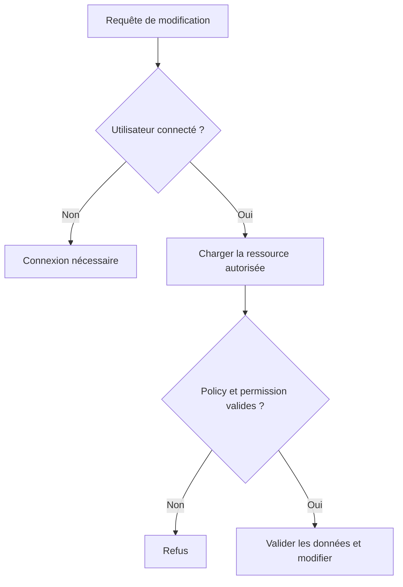
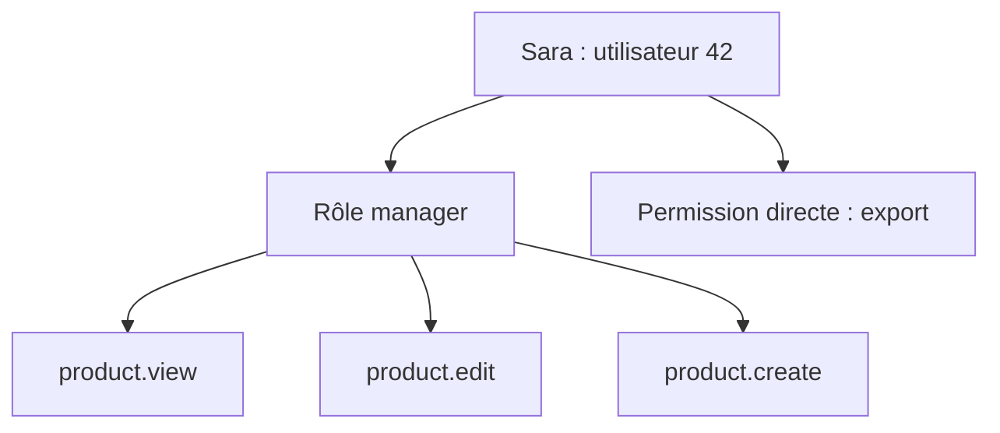
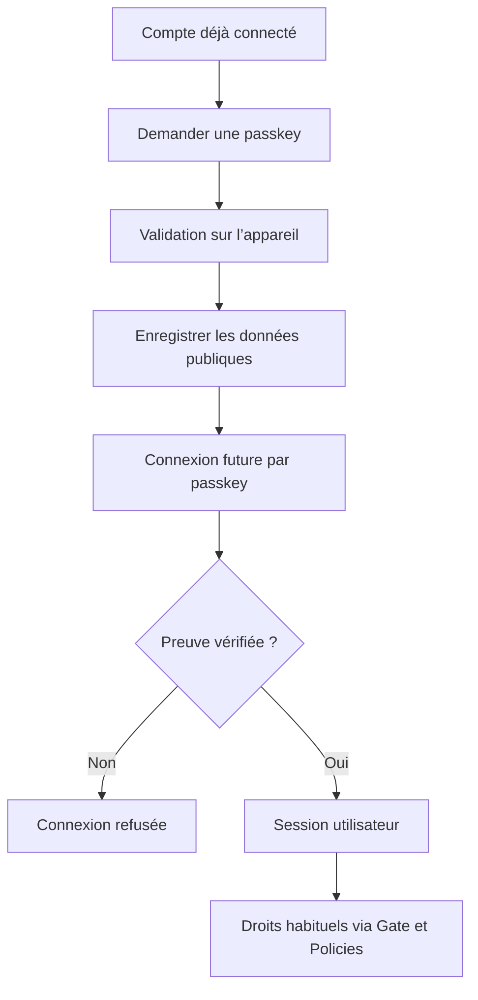
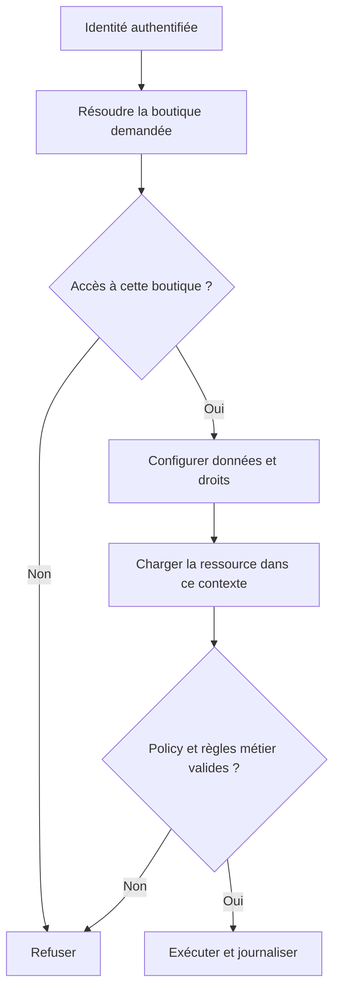

# Laravel, Spatie Permission et Passkeys — Documentation et recherche consolidées

**Date de consolidation : 29 septembre 2026**  
**Langue des explications : français.** Les noms d’API et les extraits sources restent dans leur langue d’origine.  
**Périmètre : les six fichiers fournis, les trois transcriptions vidéo et des vérifications ciblées dans les documentations officielles.**

Ce document explique ce que fait chaque mécanisme, pourquoi l’utiliser, où placer le code et comment relier les différentes parties. Il contient une synthèse organisée, des exemples réécrits, une analyse des limites des tutoriels, une adaptation indicative au cas d’un SaaS e-commerce et des annexes documentaires. Les tutoriels ne constituent pas, à eux seuls, une implémentation complète de sécurité pour un SaaS multi-boutique.

Les exemples sont documentaires : ils n’ont pas été exécutés dans une application Laravel. Les extraits partiels sont signalés. Les exemples à une seule base ne doivent pas être copiés tels quels dans une application multi-tenant. Les services métier proposés dans la partie SaaS sont des éléments à développer, pas des classes livrées par Spatie.

## Sommaire

1. [Sources, méthode et traçabilité](#s01)
2. [Comprendre les pièces du système](#s02)
3. [Versions et compatibilité](#s03)
4. [Installer Spatie Permission](#s04)
5. [Tables et relations](#s05)
6. [Créer les permissions et les rôles](#s06)
7. [Catalogue des méthodes Spatie](#s07)
8. [Gates et Policies Laravel](#s08)
9. [Protéger les routes et les opérations](#s09)
10. [Afficher les droits dans Blade et Inertia](#s10)
11. [Vidéo Laravel 11 : analyse détaillée](#s11)
12. [Vidéo Laravel 12 : analyse détaillée](#s12)
13. [Exemples Livewire : produits, utilisateurs et rôles](#s13)
14. [Super-admin, admin et utilisateur ordinaire](#s14)
15. [Guards, cache, UUID et fonctions avancées](#s15)
16. [Authentification Laravel : documentation complète expliquée](#s16)
17. [Passkeys : fonctionnement et vidéo](#s17)
18. [Installation et interface des passkeys](#s18)
19. [Passkeys : exploitation et cas difficiles](#s19)
20. [Adaptation indicative à un SaaS multi-boutique](#s20)
21. [Erreurs, corrections et dépannage](#s21)
22. [Plan de réalisation et vérifications](#s22)
23. [Matrice de couverture des sources](#s23)
24. [Bibliographie officielle complémentaire](#s24)
25. [Annexes : corpus fourni et transcription passkeys](#annexes)

<a id="s01"></a>
## 1. Sources, méthode et traçabilité

### 1.1 Les sept éléments fournis

| Référence | Élément fourni | Source et contenu effectivement disponibles |
|---|---|---|
| F1 | `Fichier markdown(20260929-082337).md collé` | Capture HTML de [Spatie Permission v8 — Installation in Laravel](https://spatie.be/docs/laravel-permission/v8/installation-laravel). Le lien canonique dans le fichier identifie bien v8. |
| F2 | `Fichier markdown (2).md collé` | Capture HTML de [Spatie Permission v8 — Basic Usage](https://spatie.be/docs/laravel-permission/v8/basic-usage/basic-usage). |
| V1 | `Texte collé (3)(2).txt` | Transcription fournie de [Laravel 11 Full Course 2025: Spatie Roles and Permissions — Lesson #9](https://www.youtube.com/watch?v=3hSBJCVwh78). |
| F3 | `Fichier markdown (4).md collé` | Documentation [Laravel — Authorization](https://laravel.com/framework/docs/13.x/authorization). Les liens du fichier désignent Laravel 13. |
| F4 | `Fichier markdown (5).md collé` | Documentation [Laravel — Authentication](https://laravel.com/framework/docs/authentication). L’URL du fichier ne fige pas un numéro de version. |
| V2 | `Texte collé (6).txt` | Transcription fournie de [Laravel 12 Spatie Roles and Permissions with Starter Kit](https://www.youtube.com/watch?v=OiMqLZlB8DY). |
| V3 | Texte directement collé dans la demande | Transcription fournie de [Laravel Passkeys Tutorial: Implementing Spatie’s Package](https://www.youtube.com/watch?v=tMWh6wM00s0). Le présentateur se présente comme Tony. |

**Les vidéos ont été analysées à partir des transcriptions fournies.** Aucun minutage n’est inventé. Le code affiché à l’écran n’est pas entièrement retranscrit par la reconnaissance vocale : les blocs de code de la synthèse sont donc des reconstructions pédagogiques ou des exemples corrigés, pas une extraction garantie du dépôt des auteurs.

### 1.2 Comment lire les attributions

- **Sources : F1, F2…** : contenu présent dans les pièces jointes.
- **Sources : V1, V2, V3** : idée exprimée dans une transcription.
- **Vérification : O…** : documentation officielle consultée en complément ; liens regroupés à la section 24.
- **Proposition / adaptation** : décision d’architecture ou exemple original, qui ne doit pas être attribué à la vidéo.

Une attribution placée au début d’une sous-section couvre son explication et ses exemples, sauf indication contraire. Les corrections sont identifiées pour éviter de confondre le tutoriel et la solution proposée.

### 1.3 Nettoyage des pièces jointes

F1 et F2 représentent environ 24,6 et 26,1 Mo, mais leur taille provient surtout d’espaces, de balisage et de contenu de navigation. Le corps documentaire utile a été extrait. Les scripts, styles, SVG, pied de page commercial et espaces de présentation ne constituent pas des fonctionnalités Laravel.

Les annexes conservent le corps utile de F1/F2, les textes fournis F3/F4 et les transcriptions V1/V2. Leur mise en forme d’origine peut être imparfaite. La partie principale présente le code sous une forme lisible. V3 est reprise dans une transcription documentaire française détaillée, sans prétendre reproduire mot pour mot les hésitations orales.

### 1.4 Ce que signifie « complet » ici

Toutes les familles d’idées présentes dans le corpus sont couvertes : installation, modèle utilisateur, rôles, permissions, tables, seeders, interfaces CRUD, middleware, Blade, Inertia, Policies, authentification, sessions, guards, providers et passkeys. Les pages seulement mentionnées dans le menu Spatie ne deviennent pas automatiquement des sources intégralement fournies ; elles sont identifiées comme pistes complémentaires lorsque leur contenu n’est pas présent.

<a id="s02"></a>
## 2. Comprendre les pièces du système

**Sources : F2, F3, F4, V1, V2, V3.**

### 2.1 Quatre questions différentes

| Question | Mécanisme | Exemple simple |
|---|---|---|
| Qui est connecté ? | Authentification Laravel | « C’est Sara, utilisateur 42. » |
| Comment prouve-t-elle son identité ? | Mot de passe ou passkey | Sara utilise son gestionnaire de passkeys. |
| Quels droits possède-t-elle ? | Spatie Permission | Sara a `product.edit` grâce au rôle `manager`. |
| Peut-elle modifier cet objet précis ? | Policy et contexte métier | Le produit appartient à la boutique dans laquelle Sara travaille. |

**Une passkey ne donne aucun rôle.** Un utilisateur peut se connecter correctement et recevoir un refus lorsqu’il tente de supprimer un produit. Inversement, avoir un rôle dans la base ne suffit pas à ouvrir une session.

### 2.2 Vocabulaire essentiel

| Terme | Explication | Exemple |
|---|---|---|
| Utilisateur | Une identité reconnue par l’application | Sara et son adresse e-mail |
| Rôle | Un groupe de permissions | `manager` |
| Permission | Le droit de faire une action nommée | `product.create` |
| Permission directe | Droit donné directement à une personne | Autoriser exceptionnellement Sara à exporter |
| Permission héritée | Droit reçu grâce à un rôle | Le rôle manager autorise la modification |
| Guard | La manière de reconnaître l’utilisateur à chaque requête | `web` avec session |
| Provider | Le moyen de retrouver les utilisateurs | Modèle Eloquent `User` |
| Middleware | Contrôle exécuté sur le passage d’une requête | Refuser une page sans connexion |
| Gate | Question d’autorisation nommée | Peut-on consulter le tableau de bord ? |
| Policy | Classe regroupant les règles d’un type d’objet | `ProductPolicy` |
| Trait | Ensemble de méthodes ajouté à une classe | `HasRoles` |
| Seeder | Code qui crée des données de départ | Permissions du catalogue |
| Migration | Code qui crée ou modifie les tables | Création de `roles` |
| Pivot | Table qui relie des enregistrements | Liaison utilisateur/rôle |
| CRUD | Créer, lire, modifier, supprimer | Gestion des produits |
| Session | État permettant au serveur de reconnaître une connexion | L’utilisateur reste connecté après un clic |
| Passkey | Identifiant cryptographique utilisé pour se connecter | Validation par le gestionnaire du téléphone |

### 2.3 Chemin complet d’une action



Le bouton visible dans le navigateur aide l’utilisateur à comprendre ce qu’il peut faire. Le contrôle exécuté sur le serveur décide réellement si l’opération est acceptée.

### 2.4 Pourquoi vérifier une permission plutôt qu’un nom de rôle

V1 recommande de vérifier `manage users`, et V2 utilise des droits plus précis tels que `product.create`.

```php
// Extrait : un droit précis.
if ($user->can('product.edit')) {
    // Affichage ou logique autorisée.
}
```

Cela permet de créer demain un rôle `responsable-catalogue` sans modifier toutes les conditions du code. Le rôle devient un moyen de distribuer des permissions ; la permission reste le nom stable de l’action.

Les rôles restent utiles pour administrer les personnes, afficher leurs responsabilités ou définir une exception explicite. Ils ne disparaissent pas du système.

<a id="s03"></a>
## 3. Versions et compatibilité

**Sources : titres V1/V2, liens de F1/F2/F3. Vérifications : O1 et O10.**

### 3.1 Ne pas mélanger les générations

| Élément | Version identifiée | Conséquence |
|---|---|---|
| V1 | Laravel 11 | Son projet et son organisation reflètent cette génération. |
| V2 | Laravel 12, starter kit Livewire | Les chemins et composants correspondent au kit utilisé dans la vidéo. |
| F1/F2 | Spatie Permission v8 | Ce ne sont pas des captures v6. |
| F3 | Laravel 13 | Certaines API illustrées peuvent être plus récentes que Laravel 11. |
| F4 | Lien non versionné | Ne pas en déduire automatiquement Laravel 11 ou 12. |
| V3 | Starter kit Livewire, numéro exact non établi par le texte | Vérifier les dépendances avant de reproduire. |

La matrice Spatie consultée associe Permission `^6.0` à Laravel 8–12 et Permission `^7.0`/`^8.0` à Laravel 12–13 avec PHP 8.3+. Il faut aussi respecter les exigences propres à Laravel et aux autres dépendances. La documentation Passkeys consultée annonce PHP 8.4+ et Laravel 12+. Ces informations décrivent les documents disponibles au moment de cette consolidation, pas toutes les anciennes releases.

### 3.2 Vérifier un projet existant

```bash
php -v
php artisan --version
composer show laravel/framework
composer show spatie/laravel-permission
composer show spatie/laravel-passkeys
composer check-platform-reqs
```

`composer show` échoue normalement si le paquet n’est pas installé. Ce n’est pas une panne du projet.

Conserver `composer.lock` et le fichier de verrouillage npm. Ils indiquent les versions réellement utilisées. Une commande non versionnée exécutée aujourd’hui peut installer une autre version que celle de la vidéo.

### 3.3 Quand Composer refuse l’installation

Dans V3, une première installation échoue et le présentateur relance avec toutes les dépendances. La transcription ne fournit pas le conflit exact.

```bash
composer require spatie/laravel-passkeys --with-all-dependencies
```

**Interprétation :** cette option autorise Composer à ajuster des dépendances déjà verrouillées. Elle ne rend pas PHP incompatible soudainement compatible et ne garantit pas l’absence de régression. Lire l’erreur, examiner les modifications du verrouillage et vérifier l’application. Ne pas remplacer ce diagnostic par `--ignore-platform-reqs`.

<a id="s04"></a>
## 4. Installer Spatie Permission

**Sources : F1, V1, V2.**

### 4.1 Préparer le projet

Dans V2, le présentateur crée une application, choisit Livewire, l’authentification Laravel et Pest, puis passe de SQLite à MySQL. Pest est le framework de tests choisi pour le tutoriel : Spatie n’impose pas Pest.

Exemple de création, avec les choix proposés par la version de l’installateur :

```bash
laravel new demo-permissions
cd demo-permissions
```

Exemple `.env` MySQL pour le développement, à adapter :

```dotenv
DB_CONNECTION=mysql
DB_HOST=127.0.0.1
DB_PORT=3306
DB_DATABASE=demo_permissions
DB_USERNAME=demo_permissions
DB_PASSWORD=remplacer_par_un_secret_local
```

Le nom de base doit correspondre à une base existante. Dans V2, une confusion de nom explique pourquoi les tables ne semblent pas apparaître. Modifier `.env` ne crée pas automatiquement la base dans MySQL.

### 4.2 Installer et publier

```bash
composer require spatie/laravel-permission
php artisan vendor:publish --provider="Spatie\Permission\PermissionServiceProvider"
```

| Étape | Ce qu’elle fait | Pourquoi |
|---|---|---|
| Composer | Télécharge le paquet compatible | Ajoute les classes et services |
| Publication | Copie la configuration et la migration dans le projet | Permet d’adapter le schéma avant sa création |
| Configuration | Définit modèles, tables, teams et cache | Aligne le paquet sur le projet |
| Migration | Crée les tables | Rend le stockage disponible |
| Trait | Ajoute les méthodes au modèle utilisateur | Permet `assignRole`, relations et contrôles |

Le service provider est découvert automatiquement. F1 indique l’ajout manuel possible dans `bootstrap/providers.php` si nécessaire ; il ne faut pas systématiquement dupliquer cet enregistrement.

### 4.3 Avant `migrate`

F1 demande de traiter ces points avant de créer les tables :

1. **UUID :** adapter les colonnes concernées si les identifiants ne sont pas des entiers.
2. **Teams :** activer l’option si les attributions doivent être contextualisées par équipe/boutique.
3. **Nom de clé team :** choisir éventuellement un autre nom que celui fourni.
4. **Index MySQL :** examiner la migration si une erreur de taille d’index apparaît.
5. **Cache en base :** disposer de la migration et de la table de cache.
6. **Configuration existante :** ne pas écraser aveuglément un `config/permission.php` déjà utilisé.

```bash
php artisan config:clear
php artisan migrate
```

F1 propose aussi `php artisan optimize:clear`, qui nettoie plus largement les caches d’optimisation. Le simple `config:clear` répond au besoin précis de recharger la configuration avant migration.

### 4.4 Ajouter `HasRoles`

Dans `app/Models/User.php`, conserver le contenu du modèle existant et ajouter l’import et le trait :

```php
use Spatie\Permission\Traits\HasRoles;

// À l'intérieur de la classe User :
use HasRoles;
```

Exemple minimal de structure, à ne pas utiliser pour écraser les attributs du starter kit :

```php
namespace App\Models;

use Illuminate\Foundation\Auth\User as Authenticatable;
use Spatie\Permission\Traits\HasRoles;

class User extends Authenticatable
{
    use HasRoles;
}
```

Éviter les propriétés ou relations maison nommées `role`, `roles`, `permission` ou `permissions` qui entrent en conflit avec celles du trait. L’utilisateur standard Laravel implémente déjà les contrats nécessaires. [O1]

<a id="s05"></a>
## 5. Tables et relations

**Sources : V1, V2, F2. Schéma explicatif reconstruit à partir de leurs descriptions ; la migration publiée reste la référence exacte.**

### 5.1 Les cinq tables de Spatie

| Table | À quoi elle sert | Principales données, sans teams |
|---|---|---|
| `roles` | Catalogue des groupes de droits | `id`, `name`, `guard_name`, dates |
| `permissions` | Catalogue des actions autorisables | `id`, `name`, `guard_name`, dates |
| `role_has_permissions` | Permissions attribuées à chaque rôle | `role_id`, `permission_id` |
| `model_has_roles` | Rôles attribués à un modèle utilisateur | `role_id`, `model_type`, `model_id` |
| `model_has_permissions` | Permissions directement attribuées à un modèle utilisateur | `permission_id`, `model_type`, `model_id` |

Les noms sont configurables. Les clés exactes, index, types et variantes teams/UUID doivent être lus dans la migration de la version installée. Les pivots n’ont pas nécessairement un `id` autonome ni des dates.

### 5.2 Pourquoi `model_id` plutôt que `user_id`

Le paquet peut attribuer des droits à plusieurs types de modèles. `model_type` indique le type de modèle ; `model_id` indique l’identifiant dans ce type. Avec une morph map, le type enregistré peut être un alias plutôt que le nom PHP complet.

Exemple :

| `role_id` | `model_type` | `model_id` | Sens |
|---|---|---|---|
| 2 | `App\Models\User` | 42 | L’utilisateur 42 possède le rôle 2 |
| 5 | `App\Models\User` | 42 | Le même utilisateur possède aussi le rôle 5 |

L’exemple V1 utilise un utilisateur d’ID 1. Cela illustre une relation, pas une règle selon laquelle le premier utilisateur serait toujours l’administrateur.

### 5.3 Exemple complet d’attribution



Sara reçoit l’union des permissions de ses rôles et de ses permissions directes. Donner deux rôles n’installe pas automatiquement une priorité entre eux.

**Conséquence :** retirer une permission directe ne supprime pas la même permission si un rôle la fournit encore. De même, retirer un rôle ne retire pas les droits provenant d’un autre rôle.

### 5.4 Où est `role_id` dans `users` ?

Dans le modèle standard du paquet, on n’en a pas besoin. L’attribution est dans `model_has_roles`. Un champ unique `users.role_id` exprimerait au maximum un rôle, alors que V2 montre plusieurs rôles par utilisateur.

Si un schéma métier possède déjà un champ `role_id`, il faut décider comment migrer sa responsabilité. Garder deux chemins d’attribution indépendants crée un risque de désaccord entre l’interface et les contrôles.

### 5.5 Trois informations à ne pas confondre

- Le rôle `admin` indique un groupe de droits.
- `guard_name = web` indique l’espace d’authentification utilisé pour ces droits.
- Une boutique ou un tenant indique le contexte métier où ces droits sont valables.

`guard_name = admin` ne veut pas dire « ce compte est administrateur ». Un guard nommé admin pourrait même authentifier plusieurs rôles différents.

<a id="s06"></a>
## 6. Créer les permissions et les rôles

**Sources : F2, V1, V2. Les noms et la robustesse du seeder ci-dessous sont une adaptation.**

### 6.1 Choisir un vocabulaire stable

| Action | Permission proposée |
|---|---|
| Voir les produits administrables | `product.view` |
| Créer un produit | `product.create` |
| Modifier un produit | `product.edit` |
| Supprimer un produit | `product.delete` |
| Voir les rôles | `role.view` |
| Créer un rôle | `role.create` |
| Modifier les permissions d’un rôle | `role.edit` |
| Supprimer un rôle | `role.delete` |
| Voir les utilisateurs | `user.view` |
| Créer un utilisateur | `user.create` |
| Modifier un utilisateur | `user.edit` |
| Supprimer un utilisateur | `user.delete` |
| Changer les rôles d’un utilisateur | `user.assign-role` |

Les huit permissions `role.*` et `product.*` reprennent V2. Les droits `user.*` et le droit spécifique d’attribution sont des ajouts pour combler son périmètre volontairement incomplet.

Les points dans `product.edit` sont une convention de nommage. Ils n’activent pas automatiquement les wildcards. `product` ou `product.*` n’accorde pas spontanément les quatre droits.

### 6.2 Seeder réexécutable pour une application sans teams

```bash
php artisan make:seeder RolesAndPermissionsSeeder
```

`database/seeders/RolesAndPermissionsSeeder.php` :

```php
<?php

namespace Database\Seeders;

use Illuminate\Database\Seeder;
use Spatie\Permission\Models\Permission;
use Spatie\Permission\Models\Role;
use Spatie\Permission\PermissionRegistrar;

class RolesAndPermissionsSeeder extends Seeder
{
    public function run(): void
    {
        app(PermissionRegistrar::class)->forgetCachedPermissions();

        $catalogue = [
            'product.view', 'product.create', 'product.edit', 'product.delete',
            'role.view', 'role.create', 'role.edit', 'role.delete',
            'user.view', 'user.create', 'user.edit', 'user.delete',
            'user.assign-role',
        ];

        foreach ($catalogue as $name) {
            Permission::findOrCreate($name, 'web');
        }

        $definitions = [
            'reader' => ['product.view'],
            'manager' => [
                'product.view', 'product.create', 'product.edit', 'product.delete',
            ],
            'admin' => $catalogue,
        ];

        foreach ($definitions as $name => $permissionNames) {
            $role = Role::findOrCreate($name, 'web');
            $role->syncPermissions($permissionNames);
        }

        app(PermissionRegistrar::class)->forgetCachedPermissions();
    }
}
```

```bash
php artisan db:seed --class=RolesAndPermissionsSeeder
```

`findOrCreate` permet de rejouer la création sans recréer le même nom/guard. En revanche, `syncPermissions` remplace le contenu du rôle : ce seeder exprime des rôles gérés par le code. Si l’interface doit permettre de modifier ces mêmes rôles durablement, relancer ce seeder peut écraser ces personnalisations. Séparer les rôles système des rôles personnalisés ou adopter une stratégie d’ajouts contrôlés.

Pour un projet utilisant des modèles personnalisés, importer `App\Models\Role` et `App\Models\Permission` à la place des modèles de base. Pour teams, compléter le contexte et les règles de portée avant d’utiliser ce seeder.

### 6.3 Attribution à une personne

```php
// Extrait à exécuter dans une commande d'administration autorisée.
$user = \App\Models\User::query()
    ->where('email', $emailVerifie)
    ->firstOrFail();

$user->assignRole('manager');
```

`$emailVerifie` représente une identité choisie et contrôlée par l’administrateur. Le premier administrateur doit être créé par une procédure maîtrisée, pas par un formulaire d’inscription public qui accepte librement `roles[]`.

### 6.4 Ajout, remplacement, retrait

```php
$user->assignRole('manager');                 // Ajouter un rôle.
$user->syncRoles(['manager', 'reader']);       // Remplacer la liste des rôles.
$user->removeRole('reader');                  // Retirer ce rôle.

$role->givePermissionTo('product.edit');       // Ajouter un droit au rôle.
$role->syncPermissions(['product.view']);      // Remplacer ses droits.
$role->revokePermissionTo('product.edit');     // Retirer ce droit du rôle.
```

**Exemple :** un rôle possède `view`, `create`, `edit`. `syncPermissions(['view'])` conserve seulement `view`. Ce n’est pas une opération d’ajout.

<a id="s07"></a>
## 7. Catalogue des méthodes Spatie

**Source principale : F2. Compléments : O5, O7 et O16.**

### 7.1 Créer et relier

| Méthode | Objet | Effet |
|---|---|---|
| `Role::create([...])` | Catalogue des rôles | Crée un rôle |
| `Permission::create([...])` | Catalogue des permissions | Crée une permission |
| `$role->givePermissionTo($permission)` | Rôle | Ajoute une permission |
| `$permission->assignRole($role)` | Permission | Même relation, depuis l’autre côté |
| `$role->syncPermissions($permissions)` | Rôle | Remplace ses permissions |
| `$permission->syncRoles($roles)` | Permission | Remplace les rôles liés à cette permission |
| `$role->revokePermissionTo($permission)` | Rôle | Retire la relation |
| `$permission->removeRole($role)` | Permission | Même retrait, depuis l’autre côté |
| `$user->assignRole($role)` | Utilisateur | Ajoute une attribution |
| `$user->syncRoles($roles)` | Utilisateur | Remplace ses attributions dans le contexte applicable |

F2 illustre la création avec `name`. En présence de plusieurs guards, préciser `guard_name` ; même avec un seul guard, l’expliciter dans les seeders rend l’intention plus lisible.

### 7.2 Lire les droits et les rôles

```php
$user->getPermissionNames();       // Noms des permissions directes.
$user->permissions;                // Relation des permissions directes.
$user->getDirectPermissions();     // Objets attribués directement.
$user->getPermissionsViaRoles();   // Objets reçus grâce aux rôles.
$user->getAllPermissions();        // Directes + héritées.
$user->getRoleNames();             // Noms des rôles.
```

**Piège :** `getPermissionNames()` n’est pas le catalogue de tous les droits effectifs. Pour afficher les droits directs et hérités :

```php
$names = $user->getAllPermissions()->pluck('name');
```

Cette liste décrit les attributions Spatie. Elle ne remplace pas une décision de Policy sur un objet précis et ne représente pas forcément les autorisations accordées par un `Gate::before` global.

### 7.3 Interroger les utilisateurs

```php
User::role('manager')->get();
User::withoutRole('manager')->get();
User::permission('product.edit')->get();
User::withoutPermission('product.edit')->get();
User::with('roles')->paginate(25);
User::with('permissions')->paginate(25);
User::doesntHave('roles')->get();
Role::whereNotIn('name', ['system-root', 'system-support'])->get();
```

`permission()` prend en compte les attributions directes et celles héritées des rôles. Comme toute requête de données, elle doit être limitée au contexte autorisé lorsqu’on travaille avec plusieurs boutiques.

### 7.4 Compter sans charger toute la table

F2 montre une méthode qui charge les utilisateurs puis filtre leurs rôles en mémoire. C’est compréhensible pour apprendre, mais on peut exprimer directement le comptage :

```php
$count = User::role('manager')->count();
```

**Amélioration proposée :** utiliser une agrégation en base lorsque l’objectif est uniquement un nombre. Charger des milliers d’utilisateurs, leurs rôles puis des tableaux intermédiaires augmente inutilement la mémoire utilisée.

### 7.4 bis — Autres contrôles de rôles et permissions

Le paquet propose aussi, selon l’API documentée de la version installée, `hasAnyRole`, `hasAllRoles`, `hasExactRoles`, `hasAnyPermission`, `hasAllPermissions` et `hasDirectPermission`. Les variantes « any » demandent au moins un élément ; les variantes « all » demandent l’ensemble. `hasExactRoles` compare la composition des rôles ; `hasDirectPermission` ne représente pas les permissions héritées.

Ces méthodes sont utiles pour inspecter les attributions. Pour décider d’une action métier avec une Policy ou une exception Gate, conserver un contrôle Laravel adapté. Les méthodes de rôle peuvent accepter des noms, des objets Role ou des collections selon leur signature documentée. [O16, O7]

### 7.5 Contrôler un droit

```php
$user->can('product.edit');
$user->cannot('product.edit');
$user->hasRole('manager');
$user->hasPermissionTo('product.edit');
```

`can()` passe par Laravel Gate. `hasPermissionTo()` inspecte les mécanismes du paquet et ne profite pas automatiquement de l’exception super-admin définie dans Gate. Utiliser `can()` pour les décisions applicatives qui doivent être cohérentes avec les Policies et les exceptions Gate. [O7]

<a id="s08"></a>
## 8. Gates et Policies Laravel

**Source : F3. Les exemples de cours proviennent de V1 ; les exemples de produits sont des adaptations.**

### 8.1 Gate : une question nommée

Dans la méthode `boot()` de `AppServiceProvider`, exemple d’une capacité métier générale :

```php
Gate::define('dashboard.view', function (User $user): bool {
    return $user->can('product.view');
});
```

Ajouter les imports `App\Models\User` et `Illuminate\Support\Facades\Gate`. La capacité `dashboard.view` ci-dessus est une Gate applicative ; il n’est pas nécessaire de créer en plus une permission Spatie homonyme.

Ne pas définir une Gate `product.edit` qui s’appelle elle-même avec `$user->can('product.edit')` : cela introduirait une récursion.

### 8.2 API Gate couverte par F3

| API | Résultat ou usage |
|---|---|
| `Gate::allows('ability', $model)` | Booléen : autorisé ? |
| `Gate::denies('ability', $model)` | Booléen inverse |
| `Gate::check([...], $model)` | Vérifier l’ensemble des capacités indiquées |
| `Gate::any([...], $model)` | Au moins une capacité autorisée |
| `Gate::none([...], $model)` | Aucune capacité autorisée |
| `Gate::authorize('ability', $model)` | Continue ou lève une exception d’autorisation |
| `Gate::inspect('ability', $model)` | Réponse détaillée avec message |
| `Gate::forUser($user)` | Évalue pour une autre identité |
| `Gate::before(...)` | Intercepte avant la décision ordinaire |
| `Gate::after(...)` | Exécute un traitement après la décision |
| `Gate::allowIf(...)` | Vérification ponctuelle sans Gate nommée |
| `Gate::denyIf(...)` | Refus ponctuel sans Gate nommée |

Les appels d’autorisation ordinaires utilisent l’utilisateur courant sans qu’il soit nécessaire de le passer manuellement comme premier argument.

### 8.3 Réponses détaillées

```php
use Illuminate\Auth\Access\Response;

// Extrait de Policy.
return $condition
    ? Response::allow()
    : Response::deny('Vous ne pouvez pas modifier ce produit.');
```

`Response::denyWithStatus(404)` et `Response::denyAsNotFound()` permettent de masquer l’existence d’un objet. Le statut 403 signifie généralement « accès refusé » ; le 404 peut signifier « non disponible dans ce contexte ».

```php
$response = Gate::inspect('update', $product);

if ($response->denied()) {
    $message = $response->message();
}
```

`Gate::authorize()` transmet le refus à la gestion d’erreurs Laravel. La validation des champs reste une étape différente.

### 8.4 Policy : les actions sur un modèle

```bash
php artisan make:policy ProductPolicy --model=Product
```

Méthodes usuelles :

| Méthode | Objet contrôlé |
|---|---|
| `viewAny(User $user)` | Accès à la liste administrative |
| `view(User $user, Product $product)` | Lecture d’un produit |
| `create(User $user)` | Création avant que l’objet existe |
| `update(User $user, Product $product)` | Modification |
| `delete(User $user, Product $product)` | Suppression |
| `restore(...)` | Restauration si suppression logique |
| `forceDelete(...)` | Suppression définitive si le projet la propose |

La présence d’une méthode dans une Policy n’ajoute pas automatiquement le comportement métier correspondant au modèle.

### 8.5 Exemple pour une application à une seule boutique

```php
<?php

namespace App\Policies;

use App\Models\Product;
use App\Models\User;

class ProductPolicy
{
    public function viewAny(User $user): bool
    {
        return $user->can('product.view');
    }

    public function view(User $user, Product $product): bool
    {
        return $user->can('product.view');
    }

    public function create(User $user): bool
    {
        return $user->can('product.create');
    }

    public function update(User $user, Product $product): bool
    {
        return $user->can('product.edit');
    }

    public function delete(User $user, Product $product): bool
    {
        return $user->can('product.delete');
    }
}
```

Cet exemple décide seulement selon les permissions, car son périmètre est volontairement une seule boutique. Il ne démontre aucune isolation multi-tenant.

### 8.6 Enregistrer la Policy

Les conventions de nommage permettent la découverte automatique. Une association explicite reste simple :

```php
// AppServiceProvider::boot(), imports à ajouter.
Gate::policy(Product::class, ProductPolicy::class);
```

F3 présente aussi `Gate::guessPolicyNamesUsing(...)` et l’attribut `#[UsePolicy(...)]`. Ces options sont à vérifier sur la version Laravel installée, particulièrement si le projet reproduit la vidéo Laravel 11.

### 8.7 Contrôler la création et la modification

```php
Gate::authorize('create', Product::class);
Gate::authorize('update', $product);
```

On passe la **classe** pour une action avant création ; on passe **l’objet** pour une action sur un enregistrement existant.

### 8.8 Propriétaire d’un cours et administrateur dans V1

La vidéo élargit une règle de propriété : l’auteur du cours peut agir, et une personne ayant `manage users` peut aussi agir. C’est une démonstration de l’opérateur OU.

**Correction de vocabulaire proposée :** un droit `course.delete-any` décrit mieux la suppression des cours d’autrui qu’un droit `manage users`.

```php
// Exemple reconstruit : Course possède un champ user_id.
public function delete(User $user, Course $course): bool
{
    return (string) $user->id === (string) $course->user_id
        || $user->can('course.delete-any');
}
```

Ajouter le droit au catalogue avant utilisation. Modifier la règle `delete` ne modifie pas `update`. V1 montre précisément qu’un accès à l’écran d’édition peut être autorisé alors que l’enregistrement de la modification reste refusé : chaque action possède son propre contrôle.

### 8.9 Contexte supplémentaire et visiteurs

F3 permet de transmettre plusieurs arguments :

```php
Gate::authorize('update', [$post, $categoryId]);
```

Le premier modèle identifie la Policy ; les suivants enrichissent sa décision. Un argument provenant du navigateur reste à valider et à rattacher au bon contexte.

Par défaut, les Gates/Policies ordinaires refusent les invités. Pour une capacité publique, une signature `?User $user` peut permettre de traiter ce cas. Une fiche produit publique n’a pas nécessairement les mêmes règles qu’une fiche administrative.

### 8.10 Les hooks ne sont pas interchangeables

- Dans `before`, `true` autorise, `false` refuse, `null` laisse la décision normale continuer.
- Dans la documentation F3, le retour de `after` ne remplace pas une décision déjà non nulle.
- `allowIf` et `denyIf` n’exécutent pas les hooks `before`/`after`.
- Le `before` d’une Policy n’est pas appelé si cette Policy ne possède pas la méthode correspondant à la capacité vérifiée.

Ces détails expliquent pourquoi deux écritures d’apparence proche peuvent donner des résultats différents pour un super-admin.

<a id="s09"></a>
## 9. Protéger les routes et les opérations

**Sources : F3, V1, V2. Compléments : O3 et O9.**

### 9.1 Le middleware `auth`

```php
Route::get('/dashboard', DashboardController::class)
    ->middleware('auth');
```

Il demande une connexion. Il ne vérifie pas que la personne peut administrer les utilisateurs, supprimer un rôle ou modifier un produit.

### 9.2 Le middleware Laravel `can`

V1 utilise une écriture équivalente à :

```php
Route::get('/admin/users', [ManageUsersController::class, 'index'])
    ->middleware(['auth', 'can:manage users'])
    ->name('admin.manage-users');
```

`can` est fourni par Laravel. Spatie fournit les permissions que Gate peut vérifier. Dire que `can` est exclusivement un middleware Spatie serait inexact.

Avec une Policy et un paramètre de route :

```php
Route::put('/products/{product}', [ProductController::class, 'update'])
    ->middleware(['auth', 'can:update,product']);
```

La route doit résoudre `product` dans le périmètre autorisé. Un contrôle sur une permission générale ne corrige pas une mauvaise sélection de ressource.

### 9.3 Les middleware Spatie

Dans les squelettes Laravel récents, ajouter les alias dans le callback `withMiddleware` existant de `bootstrap/app.php` :

```php
use Illuminate\Foundation\Configuration\Middleware;
use Spatie\Permission\Middleware\PermissionMiddleware;
use Spatie\Permission\Middleware\RoleMiddleware;
use Spatie\Permission\Middleware\RoleOrPermissionMiddleware;

// Extrait du chaînage Application::configure(...).
->withMiddleware(function (Middleware $middleware): void {
    $middleware->alias([
        'role' => RoleMiddleware::class,
        'permission' => PermissionMiddleware::class,
        'role_or_permission' => RoleOrPermissionMiddleware::class,
    ]);
})
```

Le namespace récent est `Middleware` au singulier. Les anciens tutoriels peuvent montrer `Middlewares`. [O3]

```php
->middleware('permission:product.create')
->middleware('role:manager')
->middleware('role_or_permission:manager|product.edit')
```

V2 utilise une liste avec `|` pour autoriser l’accès à la liste si la personne possède au moins l’un des droits :

```php
->middleware('permission:product.view|product.create|product.edit|product.delete')
```

**Choix métier à expliciter :** cette condition autorise à consulter la liste quelqu’un qui possède seulement le droit de supprimer. Cela peut convenir au tutoriel ; dans un produit réel, on peut exiger `product.view` et attribuer ce droit avec les rôles qui modifient ou suppriment.

### 9.4 Page, lecture et écriture

| Accès | Contrôle attendu |
|---|---|
| Liste des produits | Droit de voir la liste et requête limitée au contexte |
| Formulaire de création | Droit de créer |
| Enregistrement de création | Même droit, revérifié côté serveur |
| Formulaire d’édition | Droit sur le produit précis |
| Enregistrement d’édition | Droit sur le produit précis, données validées |
| Suppression | Droit sur le produit précis au moment de l’action |

Une route GET autorisée ne protège pas automatiquement toutes les méthodes POST, PUT, DELETE ou Livewire correspondantes.

### 9.5 Cas Livewire

Les méthodes publiques déclenchables par le navigateur doivent valider et autoriser leurs actions. Une personne peut appeler une action ou modifier un paramètre même si le bouton correspondant est caché. `wire:confirm` demande une confirmation visuelle ; ce n’est pas une autorisation. [O9]

```php
// Extrait d'un composant pour une application à une seule boutique.
public function delete(string $id): void
{
    $product = Product::query()->findOrFail($id);
    Gate::authorize('delete', $product);

    $product->delete();
    session()->flash('success', 'Produit supprimé.');
}
```

Dans un SaaS, remplacer la récupération générale par une récupération dans la connexion ou le périmètre du tenant vérifié. Autoriser à nouveau lors de l’enregistrement, même si `mount()` a déjà autorisé l’affichage.

<a id="s10"></a>
## 10. Afficher les droits dans Blade et Inertia

**Sources : F3, V1, V2.**

### 10.1 Blade

```blade
@can('product.create')
    <a href="{{ route('products.create') }}">Créer un produit</a>
@endcan

@can('update', $product)
    <a href="{{ route('products.edit', $product) }}">Modifier</a>
@endcan

@cannot('delete', $product)
    <p>Vous ne pouvez pas supprimer ce produit.</p>
@endcannot
```

F3 présente aussi `@elsecan`, `@elsecannot` et `@canany`.

```blade
@canany(['role.view', 'role.create', 'role.edit', 'role.delete'])
    <a href="{{ route('roles.index') }}">Rôles</a>
@endcanany
```

Garder la même définition d’accès pour le menu et la page. Si le menu utilise « au moins un droit » mais que la page exige `role.view`, l’utilisateur pourrait voir un lien qui mène à un refus.

### 10.2 Inertia : transmettre des décisions d’affichage

V1 utilise le middleware `HandleInertiaRequests` et Vue. Exemple corrigé pour employer Gate via `can()` et traiter un visiteur non connecté :

```php
// Extrait de HandleInertiaRequests.
public function share(\Illuminate\Http\Request $request): array
{
    return [
        ...parent::share($request),
        'permissions' => [
            'can_manage_users' => $request->user()?->can('manage users') ?? false,
        ],
    ];
}
```

Dans un composant Vue :

```vue
<script setup>
import { Link, usePage } from '@inertiajs/vue3'
const page = usePage()
</script>

<template>
  <Link v-if="page.props.permissions?.can_manage_users" href="/admin/users">
    Gérer les utilisateurs
  </Link>
</template>
```

La vidéo met à jour le menu mobile et le menu principal. Il faut penser aux deux si le layout les contient séparément.

### 10.3 Décisions propres à chaque objet

Un indicateur global `product.edit = true` ne dit pas quels produits précis sont modifiables. Pour une liste, on peut envoyer une décision par ligne :

```php
// Extrait, après sélection autorisée et pagination des produits.
[
    'id' => $product->id,
    'name' => $product->name,
    'can' => [
        'update' => $request->user()->can('update', $product),
        'delete' => $request->user()->can('delete', $product),
    ],
]
```

Ces booléens servent à l’affichage. Le serveur doit recalculer l’autorisation quand la personne agit ; il ne doit pas accepter un `can.delete` envoyé par le client comme preuve.

### 10.4 Données partagées et confidentialité

V1 affiche temporairement les props pour comprendre Inertia, puis remplace ces données de test par les permissions. Cette inspection est pédagogique. Dans l’application finale, n’envoyer que les champs nécessaires ; ne pas sérialiser par facilité toutes les données des utilisateurs, leurs secrets ou des ressources d’autres boutiques.

<a id="s11"></a>
## 11. Vidéo Laravel 11 : analyse détaillée

**Source : V1 — [vidéo](https://www.youtube.com/watch?v=3hSBJCVwh78), transcription fournie dans `Texte collé (3)(2).txt`.**

### 11.1 Objectif et point de départ

Le cours précédent avait présenté les Policies. La leçon ajoute les rôles et permissions à une application qui possède déjà des utilisateurs, des cours, un layout et des pages Inertia/Vue. Elle n’explique donc pas de zéro toute l’authentification.

### 11.2 Parcours complet

| Étape | Ce que fait le présentateur | Pourquoi |
|---|---|---|
| 1 | Installe `spatie/laravel-permission` | Obtenir le stockage et l’API des droits |
| 2 | Publie migration et configuration | Préparer les tables |
| 3 | N’utilise pas teams | Son exemple n’a pas de contexte d’équipe |
| 4 | Nettoie la configuration et migre | Créer les tables |
| 5 | Ajoute `HasRoles` à `User` | Utiliser les rôles sur les comptes |
| 6 | Crée un seeder | Définir les droits de départ par code |
| 7 | Crée `admin` et `manage users` | Exemple minimal : un rôle, une permission |
| 8 | Lie le droit au rôle | Construire le groupe de droits |
| 9 | Donne le rôle à l’utilisateur d’ID 1 | Choisir le compte de démonstration |
| 10 | Inspecte les cinq tables | Montrer les relations réellement enregistrées |
| 11 | Crée un autre utilisateur, Dave | Comparer un compte privilégié et un compte ordinaire |
| 12 | Crée un contrôleur de gestion des utilisateurs | Préparer une page administrative |
| 13 | Retourne une page Inertia avec les utilisateurs | Transmettre des données au frontend |
| 14 | Organise les dossiers de pages | Séparer les pages administratives |
| 15 | Ajoute des liens de menu | Ouvrir la page depuis les deux comptes |
| 16 | Ajoute `can:manage users` sur la route | Refuser la page à Dave |
| 17 | Partage un indicateur de permission via Inertia | Donner au frontend une information d’affichage |
| 18 | Ajoute les `v-if` sur les menus | Cacher les liens inutilisables |
| 19 | Modifie une Policy de cours | Autoriser l’auteur ou l’administrateur à agir |
| 20 | Compare affichage, modification et suppression | Montrer que les capacités sont indépendantes |

### 11.3 Points de code à retenir

- `User::find(1)` est un choix ponctuel du jeu de données, pas une manière fiable d’identifier l’administrateur en production.
- `Role::create`, `Permission::create`, `givePermissionTo` et `assignRole` construisent les relations.
- `Inertia::render(...)` retourne une page ; le nom de page doit correspondre au chemin attendu par la résolution Inertia.
- `User::all()` rend l’exemple court ; une liste administrative réelle devrait filtrer les colonnes et paginer.
- `HandleInertiaRequests::share()` ajoute des props communes.
- `usePage()` permet à Vue de lire ces props.
- `v-if` change l’affichage, pas la permission côté serveur.
- Le test de propriété dans une Policy reste utile même avec Spatie.

### 11.4 Les limites à corriger

| Élément vidéo | Limite | Adaptation proposée |
|---|---|---|
| Permission unique `manage users` | Trop générale pour des actions sur les cours | Droits séparés par domaine et action |
| Compte d’ID 1 | Peut être absent ou représenter une autre personne | Commande d’amorçage contrôlée |
| Liste de tous les utilisateurs | Expose trop de données et charge tout en mémoire | Sélection minimale et pagination |
| `hasPermissionTo` dans les props | Ne suit pas un éventuel super-admin Gate | Employer `can()` pour la décision d’affichage |
| Contrôles ajoutés progressivement | Des écrans sont temporairement accessibles à tous | Livrer chaque fonctionnalité avec son autorisation |
| Explication orale de `can` | Peut laisser penser que le middleware appartient à Spatie | Distinguer middleware Laravel et permissions Spatie |

### 11.5 Détails de présentation conservés

Le présentateur précise avoir refilmé un premier exemple, puis avoir réenregistré un passage à cause d’un problème de capture. Cela explique d’éventuels décalages visuels ou noms de fichiers affichés différemment. Son choix de dossiers imbriqués pour les pages est une convention d’organisation, pas une condition imposée par Spatie.

<a id="s12"></a>
## 12. Vidéo Laravel 12 : analyse détaillée

**Source : V2 — [vidéo](https://www.youtube.com/watch?v=OiMqLZlB8DY), transcription fournie dans `Texte collé (6).txt`.**

### 12.1 Démonstration initiale

Le présentateur montre une interface comportant Utilisateurs, Rôles et Produits. Il crée un rôle de démonstration avec des droits limités, l’attribue à un compte et se connecte avec ce compte dans une autre fenêtre. En modifiant les cases du rôle, il montre l’apparition ou la disparition des boutons et des menus, puis le refus de certaines URL.

Le terme « super admin » utilisé oralement pour son compte ne démontre pas, à lui seul, l’existence d’un `Gate::before` ou d’un champ racine. La transcription montre surtout des rôles contenant des listes de permissions.

### 12.2 Création du projet

- `laravel new` pour créer le projet.
- Starter kit Livewire.
- Authentification Laravel intégrée.
- Pest pour les tests.
- Installation des dépendances npm.
- Passage à MySQL dans `.env`.
- Migration et vérification dans TablePlus.
- `php artisan serve` et `npm run dev` pour le développement.

L’éditeur et TablePlus sont des outils du présentateur ; l’intégration ne dépend pas de leur utilisation.

### 12.3 Module utilisateurs

| Élément | Réalisation décrite | Rôle de cet élément |
|---|---|---|
| `UserIndex` | Liste des utilisateurs | Page de consultation |
| `UserCreate` | Nom, e-mail, mot de passe, confirmation | Formulaire de création |
| `UserEdit` | Chargement avec `mount`, mot de passe facultatif | Formulaire de modification |
| `UserShow` | Nom et e-mail | Fiche de consultation |
| Méthode `delete` | Recherche par ID et suppression | Action depuis la liste |
| Routes nommées | `users.index`, `users.create`, etc. | Liens cohérents entre pages |
| Sidebar | Lien Utilisateurs | Navigation |
| Message de session | Créé / modifié / supprimé | Retour après une action |

Le présentateur utilise Flux pour les champs et les boutons, et une table stylée avec Tailwind. `wire:model` relie les champs aux propriétés, `wire:submit` appelle une méthode, `wire:click` déclenche la suppression, `wire:confirm` affiche une confirmation.

Il constate qu’un bouton de formulaire doit avoir `type="submit"` pour déclencher la soumission attendue. Il ajoute des marges, ajuste la largeur du formulaire, les couleurs des boutons et les intitulés. Ces détails concernent l’ergonomie, pas les droits d’accès.

### 12.4 Validation et mot de passe

La création exige les champs principaux et une confirmation correspondante. Le présentateur simplifie volontairement les contraintes du mot de passe. L’édition conserve l’ancien mot de passe si le champ est vide ; un nouveau mot de passe est haché avant enregistrement.

**Correction terminologique :** le hachage du mot de passe n’est pas un chiffrement que l’application peut inverser pour retrouver le mot de passe original.

Pour une application réelle, compléter par l’unicité de l’e-mail, des longueurs maximales, les règles du projet pour le mot de passe et l’autorisation de chaque opération. Ne pas préremplir un formulaire avec le hash stocké.

### 12.5 Module produits

Le tutoriel crée une table simple avec `name` et `detail`, puis un modèle `Product` avec ces champs dans `$fillable`. Il reproduit les composants Index, Create, Edit et Show, plus une méthode de suppression.

Ce produit de démonstration ne comprend ni prix, ni stock, ni variante, ni images, ni expédition. Le tutoriel explique les permissions sur un CRUD ; il ne fournit pas un catalogue e-commerce complet.

La copie du module utilisateurs accélère la démonstration mais entraîne des corrections successives de noms de variables, routes, libellés, colonnes et messages. Vérifier ces éléments après chaque duplication.

### 12.6 Installation de Spatie et permissions initiales

Le présentateur installe le paquet, publie ses fichiers et inspecte les tables. Il souligne que les modèles `Role` et `Permission` sont fournis par le paquet, même s’ils n’apparaissent pas dans `app/Models`.

Son `PermissionSeeder` crée :

```text
role.view
role.create
role.edit
role.delete
product.view
product.create
product.edit
product.delete
```

Il utilise des modèles Spatie et une boucle sur la liste. Une exécution répétée avec `create` peut rencontrer un doublon : la section 6 propose une variante réexécutable.

### 12.7 Module rôles

Le formulaire contient un nom et un groupe de cases à cocher. Deux données doivent rester distinctes :

- `allPermissions` : le catalogue affiché ;
- `permissions` : les valeurs sélectionnées par l’utilisateur.

Le rôle est créé, puis `syncPermissions` enregistre les cases retenues. En édition, les permissions déjà associées sont récupérées avec `pluck('name')` pour précocher les cases.

L’unicité du nom doit ignorer le rôle que l’on modifie, sans ignorer un identifiant arbitraire fourni par le navigateur. En contexte multi-guard ou teams, l’unicité doit correspondre à la portée réelle du modèle, pas forcément à toute la table.

### 12.8 Afficher les relations sans multiplier les requêtes

La vidéo identifie le problème N+1 : afficher les permissions de chaque rôle peut lancer une requête supplémentaire par ligne. Elle ajoute le chargement anticipé :

```php
$roles = Role::with('permissions')->get();
```

Une amélioration pour les listes importantes :

```php
$roles = Role::with('permissions')->orderBy('name')->paginate(25);
```

Même logique pour `User::with('roles')`. La pagination ne doit pas supprimer le filtrage d’accès.

### 12.9 Plusieurs rôles par utilisateur

Après ajout de `HasRoles` au modèle `User`, les formulaires utilisateurs reçoivent un catalogue de rôles et une liste de cases sélectionnées. `syncRoles` enregistre le résultat. La vidéo vérifie plusieurs lignes dans `model_has_roles` pour un même utilisateur.

En édition, `roles->pluck('name')` préremplit les cases. Cela illustre un formulaire simple à un guard et une portée ; dans un SaaS, il faut aussi vérifier quels rôles l’administrateur courant a le droit d’attribuer.

### 12.10 Les protections ajoutées à la fin

1. `@can` sur les boutons de création, consultation, édition et suppression.
2. Alias des middleware Spatie dans `bootstrap/app.php`.
3. Middleware `permission:` sur les routes.
4. Condition de menu si la personne possède au moins un droit du module.
5. Test d’accès direct à une URL sans permission.

**Limite explicite du tutoriel :** le module utilisateurs reste accessible parce que ses permissions ne sont pas implémentées dans cet exemple. Le présentateur le reconnaît à la fin. Il faut compléter ce module avant tout usage réel.

### 12.11 Pourquoi ce point est particulièrement important

Si un utilisateur ordinaire peut ouvrir la gestion des utilisateurs et s’attribuer le rôle administrateur, les protections du catalogue de produits deviennent contournables. Contrôler l’attribution d’un rôle est une permission sensible, distincte de la simple modification du nom ou de l’e-mail d’un compte.

<a id="s13"></a>
## 13. Exemples Livewire : produits, utilisateurs et rôles

**Base : V2 et F3. Les exemples ci-dessous sont des reconstructions corrigées, pour une application sans teams et à une seule boutique.**

### 13.1 Organisation des fichiers

| Type | Exemples de chemins |
|---|---|
| Modèles | `app/Models/User.php`, `app/Models/Product.php` |
| Policies | `app/Policies/ProductPolicy.php`, `app/Policies/UserPolicy.php` |
| Composants | `app/Livewire/Products/ProductIndex.php`, `ProductCreate.php`, `ProductEdit.php`, `ProductShow.php` |
| Vues | `resources/views/livewire/products/product-index.blade.php` et variantes |
| Rôles | Composants équivalents sous `app/Livewire/Roles` |
| Utilisateurs | Composants équivalents sous `app/Livewire/Users` |
| Routes | `routes/web.php` |
| Seeders | `database/seeders/RolesAndPermissionsSeeder.php` |
| Alias middleware | `bootstrap/app.php` |
| Configuration Spatie | `config/permission.php` |

Cette organisation suit les classes Livewire des tutoriels. Selon la génération du starter kit, des pages peuvent être organisées autrement, notamment avec des composants monofichiers. Respecter la structure du projet existant.

### 13.2 Modèle et migration du produit de démonstration

```php
// Extrait de migration : table pédagogique.
Schema::create('products', function (Blueprint $table): void {
    $table->id();
    $table->string('name');
    $table->text('detail');
    $table->timestamps();
});
```

```php
namespace App\Models;

use Illuminate\Database\Eloquent\Model;

class Product extends Model
{
    protected $fillable = ['name', 'detail'];
}
```

`$fillable` limite l’affectation en masse ; il ne remplace ni la validation ni la Policy.

### 13.3 Création de produit

```php
<?php

namespace App\Livewire\Products;

use App\Models\Product;
use Illuminate\Support\Facades\Gate;
use Livewire\Component;

class ProductCreate extends Component
{
    public string $name = '';
    public string $detail = '';

    public function mount(): void
    {
        Gate::authorize('create', Product::class);
    }

    public function submit()
    {
        Gate::authorize('create', Product::class);

        $data = $this->validate([
            'name' => ['required', 'string', 'max:255'],
            'detail' => ['required', 'string', 'max:10000'],
        ]);

        Product::create($data);
        session()->flash('success', 'Produit créé.');

        return redirect()->route('products.index');
    }

    public function render()
    {
        return view('livewire.products.product-create');
    }
}
```

Vue correspondante, sans dépendre d’un composant Flux précis :

```blade
<div>
    <h1>Créer un produit</h1>
    <form wire:submit="submit">
        <label for="name">Nom</label>
        <input id="name" type="text" wire:model="name">
        @error('name') <p>{{ $message }}</p> @enderror

        <label for="detail">Description</label>
        <textarea id="detail" wire:model="detail"></textarea>
        @error('detail') <p>{{ $message }}</p> @enderror

        <button type="submit" wire:loading.attr="disabled">Enregistrer</button>
    </form>
</div>
```

Flux peut remplacer ces éléments de présentation ; il ne change pas la validation et l’autorisation du composant.

### 13.4 Liste et suppression

```php
<?php

namespace App\Livewire\Products;

use App\Models\Product;
use Illuminate\Support\Facades\Gate;
use Livewire\Component;
use Livewire\WithPagination;

class ProductIndex extends Component
{
    use WithPagination;

    public function delete(string $id): void
    {
        $product = Product::query()->findOrFail($id);
        Gate::authorize('delete', $product);
        $product->delete();
        session()->flash('success', 'Produit supprimé.');
    }

    public function render()
    {
        Gate::authorize('viewAny', Product::class);

        return view('livewire.products.product-index', [
            'products' => Product::query()->latest()->paginate(25),
        ]);
    }
}
```

Vue, extrait de boucle :

```blade
@foreach ($products as $product)
    <div wire:key="product-{{ $product->id }}">
        <span>{{ $product->name }}</span>
        @can('delete', $product)
            <button
                type="button"
                wire:click="delete('{{ $product->id }}')"
                wire:confirm="Supprimer ce produit ?"
            >Supprimer</button>
        @endcan
    </div>
@endforeach

{{ $products->links() }}
```

L’identifiant est une clé générée par la base/application. S’il est remplacé par une valeur arbitraire, utiliser une sérialisation adaptée au contexte JavaScript. Le serveur ne doit jamais considérer l’argument transmis comme une preuve d’accès.

### 13.5 Édition : charger, afficher, revérifier

Extrait à intégrer dans un composant d’édition :

```php
public Product $product;
public string $name = '';
public string $detail = '';

public function mount(Product $product): void
{
    Gate::authorize('update', $product);
    $this->product = $product;
    $this->name = $product->name;
    $this->detail = $product->detail;
}

public function submit()
{
    $product = Product::query()->findOrFail($this->product->getKey());
    Gate::authorize('update', $product);

    $data = $this->validate([
        'name' => ['required', 'string', 'max:255'],
        'detail' => ['required', 'string', 'max:10000'],
    ]);

    $product->update($data);
    session()->flash('success', 'Produit modifié.');

    return redirect()->route('products.index');
}
```

Dans une application multi-tenant, la récupération et la réhydratation du modèle doivent utiliser le même contexte autorisé. Une propriété de modèle Livewire ne dispense pas de vérifier l’action. [O9]

### 13.6 Routes de ces composants

```php
use App\Livewire\Products\ProductCreate;
use App\Livewire\Products\ProductEdit;
use App\Livewire\Products\ProductIndex;
use Illuminate\Support\Facades\Route;

Route::middleware('auth')->group(function (): void {
    Route::get('/products', ProductIndex::class)
        ->name('products.index');
    Route::get('/products/create', ProductCreate::class)
        ->name('products.create');
    Route::get('/products/{product}/edit', ProductEdit::class)
        ->name('products.edit');
});
```

Ces composants exécutent leurs contrôles Gate. On peut ajouter les middleware de permission pour refuser plus tôt ; ils ne remplacent pas les contrôles à l’enregistrement. Le composant `ProductEdit` doit être complété avec son `render()` et sa vue, sur le même modèle que la création.

### 13.7 Validation d’un utilisateur

Extrait de règles de création :

```php
use Illuminate\Validation\Rules\Password;

$data = $this->validate([
    'name' => ['required', 'string', 'max:255'],
    'email' => ['required', 'email', 'max:255', 'unique:users,email'],
    'password' => ['required', 'confirmed', Password::defaults()],
]);
```

La règle `confirmed` attend une propriété `password_confirmation`. Si le formulaire conserve `confirm_password` comme dans certaines reconstructions de la transcription, adapter explicitement la règle ou renommer le champ.

À la création :

```php
$user = User::create([
    'name' => $data['name'],
    'email' => $data['email'],
    'password' => Hash::make($data['password']),
]);
```

Les imports `User` et `Hash` sont nécessaires. Garder une stratégie cohérente avec le cast `hashed` éventuel du modèle du starter kit. Pour l’édition, un champ vide signifie conserver l’ancien mot de passe ; un champ rempli doit être validé puis haché.

### 13.8 Création de rôle : contrôler le catalogue proposé

Exemple partiel de traitement, réservé à une page administrative autorisée. La liste blanche représente ici une règle de délégation volontairement limitée aux produits :

```php
use Illuminate\Support\Facades\DB;
use Illuminate\Support\Facades\Gate;
use Illuminate\Validation\Rule;
use Spatie\Permission\Models\Role;

Gate::authorize('role.create');

$allowed = ['product.view', 'product.create', 'product.edit', 'product.delete'];

$data = $this->validate([
    'name' => [
        'required', 'string', 'max:100',
        Rule::unique('roles', 'name')->where('guard_name', 'web'),
    ],
    'permissions' => ['present', 'array'],
    'permissions.*' => ['string', 'distinct', Rule::in($allowed)],
]);

DB::transaction(function () use ($data): void {
    $role = Role::create([
        'name' => $data['name'],
        'guard_name' => 'web',
    ]);
    $role->syncPermissions($data['permissions']);
});
```

**Conditions de cet exemple :** les quatre permissions existent ; aucun `Gate::before` ne donne de privilèges selon un nom de rôle librement créable ; la connexion de transaction est celle des modèles ; teams est désactivé. Si le projet introduit des noms réservés comme `super-admin`, leur création, renommage et attribution doivent être interdits à ce formulaire.

Il faut recalculer `$allowed` côté serveur selon la politique de délégation. Une liste `allPermissions` envoyée au navigateur n’est pas une liste de confiance lors de la sauvegarde.

### 13.9 Édition, suppression et attribution des rôles

| Opération | Contrôles à ajouter à l’idée du tutoriel |
|---|---|
| Modifier un rôle | Rôle chargé dans la bonne portée, `role.edit`, permissions délégables |
| Renommer un rôle | Unicité dans sa portée et protection des noms système |
| Supprimer un rôle | `role.delete`, protection des rôles indispensables, conséquences pour les membres |
| Attribuer des rôles | `user.assign-role`, droits sur l’utilisateur cible, liste de rôles attribuables |
| Retirer ses propres droits | Règle explicite pour éviter un verrouillage administratif involontaire |
| Modifier un compte racine | Opération distincte et restreinte |

Pour l’unicité à l’édition, utiliser `Rule::unique(...)->ignore($role)` avec **le modèle déjà chargé et autorisé**. Ne pas passer directement un identifiant non vérifié reçu du client à `ignore()`.

La création d’un utilisateur et l’attribution de ses rôles peuvent être regroupées dans une transaction sur leur connexion commune. Une transaction sur la connexion par défaut ne couvre pas automatiquement des modèles qui écrivent dans une autre base.

<a id="s14"></a>
## 14. Super-admin, admin et utilisateur ordinaire

**Sources : F2, F3, V1, V2. Vérification ciblée : O7.**

### 14.1 Trois notions séparées

| Notion | Définition |
|---|---|
| Utilisateur ordinaire | Compte authentifiable ; peut avoir zéro, un ou plusieurs rôles |
| Administrateur | Rôle auquel l’application attribue un ensemble de droits |
| Super-admin | Exception d’autorisation explicitement définie par l’application |

Le nom d’un rôle n’accorde rien par magie. Un rôle appelé `super-admin` sans permissions et sans logique d’exception reste un rôle sans droits.

### 14.2 Deux stratégies possibles

**Stratégie A :** un rôle admin reçoit la liste des permissions. Lorsqu’une nouvelle permission est créée, il faut décider si ce rôle la reçoit.

**Stratégie B :** une règle Gate reconnaît une identité racine et autorise les capacités concernées. Cette exception doit rester sous contrôle et ne doit pas être attribuable par les formulaires ordinaires.

Exemple original pour une application qui a choisi et créé un booléen `is_root` protégé :

```php
// AppServiceProvider::boot(). Exemple d'exception globale.
Gate::before(function (User $user, string $ability): ?bool {
    return $user->is_root ? true : null;
});
```

`is_root` n’est pas ajouté par Spatie. Il faut une migration, un cast booléen, une procédure d’administration et une protection contre l’affectation par un formulaire public. Ce champ est une proposition pédagogique, pas une lecture de ton schéma de base de données.

### 14.3 Limite d’une exception globale

Un `true` avant une Policy peut éviter que ses contrôles métier soient exécutés. Si une règle est obligatoire même pour la racine — par exemple une contrainte d’intégrité — la faire respecter dans le service métier ou la base, et ne pas se reposer uniquement sur cette Policy.

Pour un SaaS, un administrateur de boutique ne doit jamais devenir un administrateur global parce que son rôle local se nomme `admin`. La portée de l’exception doit être explicite.

### 14.4 Cohérence des contrôles

Avec un super-admin Gate, utiliser les contrôles Laravel `can`, `cannot`, `Gate::authorize` et `@can`. Les méthodes directes Spatie ne traversent pas cette exception. Le retour normal du hook doit être `null`, sinon un `false` général empêcherait les utilisateurs ordinaires d’être évalués selon leurs droits. [O7]

<a id="s15"></a>
## 15. Guards, cache, UUID et fonctions avancées

### 15.1 Guards

**Sources : F2, F4. Vérification : O5.**

Un guard indique comment une requête est authentifiée. Les noms de rôles et permissions sont associés à un `guard_name`. Utiliser un rôle du guard `admin` avec un utilisateur résolu dans le guard `web` peut produire une erreur de correspondance.

```php
Permission::findOrCreate('product.view', 'web');
Role::findOrCreate('manager', 'web');
```

Un seul guard peut suffire pour des utilisateurs ayant plusieurs niveaux de privilèges. Créer un guard par rôle ou par boutique sans besoin d’authentification distinct complique le système.

### 15.2 Cache

**Source : F1 pour le cache de configuration. Vérification complémentaire : O6.**

Distinguer le cache Laravel de configuration et le cache Spatie des rôles/permissions. Les opérations prévues par le paquet gèrent normalement leur invalidation ; des modifications SQL directes peuvent nécessiter un nettoyage explicite. Des relations déjà chargées sur un objet utilisateur peuvent également devoir être rechargées.

```bash
php artisan permission:cache-reset
```

```php
app(\Spatie\Permission\PermissionRegistrar::class)->forgetCachedPermissions();
```

Dans un processus qui change de tenant et de configuration de cache, la documentation consultée prévoit une réinitialisation du registrar :

```php
app(\Spatie\Permission\PermissionRegistrar::class)->initializeCache();
```

Ce n’est pas une commande à exécuter automatiquement à chaque clic. Tester la stratégie avec le type d’isolation choisi, les workers persistants et les relations déjà en mémoire. [O6]

### 15.3 UUID et ULID

**Source : F1. Vérification complémentaire : O4.**

Si `users.id` est un UUID, les colonnes `model_id` doivent pouvoir stocker cet UUID. Si rôles et permissions utilisent eux aussi des UUID, adapter également leurs clés et les pivots associés, puis configurer les modèles étendus.

Conserver le nom `id` avec un type UUID peut éviter de changer inutilement tous les noms de clés. La génération des identifiants, les index et les types des relations doivent rester cohérents. Le choix UUID v4, v7 ou ULID est distinct du choix d’utiliser une chaîne : vérifier le générateur du projet au lieu de supposer que `HasUuids` produit toujours le format souhaité. [O4]

### 15.4 Teams

**Source : F1 pour l’activation. Vérification : O8.**

Teams permet de contextualiser les attributions. Cela peut représenter une boutique, mais le paquet ne crée pas pour autant son catalogue de produits ni sa base de données.

```php
setPermissionsTeamId($tenantId);
$user->unsetRelation('roles')->unsetRelation('permissions');
```

Le changement de contexte doit précéder les vérifications et être accompagné de l’oubli des relations chargées. L’identifiant doit provenir d’un tenant résolu et autorisé, pas d’un champ envoyé librement par le client. Activer teams avant les migrations initiales ; sur une installation existante, préparer une évolution de schéma et de données. [O8]

### 15.5 Autres thèmes visibles dans le menu Spatie fourni

Le menu de F1/F2 mentionne les sujets suivants. Cette liste ne signifie pas que les fichiers contenaient le texte complet de toutes ces pages.

| Sujet | Utilité générale | Place dans cette consolidation |
|---|---|---|
| Direct Permissions | Exceptions individuelles | Méthodes et limites couvertes |
| Using Permissions via Roles | Distribution des droits par groupes | Couvert |
| Enums | Centraliser les noms dans du code typé | Piste, vérifier l’API de la version |
| Wildcard permissions | Regrouper des correspondances de noms | Piste, activation et sémantique à lire avant usage |
| Blade directives | Adapter l’affichage | Couvert |
| Multiple guards | Plusieurs espaces d’authentification | Couvert au niveau nécessaire |
| Artisan Commands | Administration en ligne de commande | Installation, seeders et cache couverts |
| Passport Client Credentials | Droits sur des clients API | Hors implémentation des vidéos |
| Model Policies | Vérifier les ressources | Couvert |
| Performance Tips | Réduire les requêtes | Pagination, eager loading et comptage couverts |
| Testing / Seeding | Initialiser et vérifier les droits | Couvert |
| Exceptions | Comprendre les erreurs du paquet | Dépannage couvert |
| Extending | Personnaliser modèles et comportement | Points de vigilance couverts |
| Events | Réagir à des changements | Piste à vérifier selon version/configuration |
| Custom Permission Check | Modifier l’intégration des décisions | Ne pas changer sans besoin concret |
| UUID/ULID | Identifiants non entiers | Couvert au niveau de préparation |
| Timestamps | Dates sur relations personnalisées | Option à concevoir, pas une hypothèse sur les pivots |
| UI Options | Interfaces tierces | Aucun outil supplémentaire imposé ici |
| PhpStorm Interaction | Assistance de l’éditeur | Aucun effet sur les autorisations exécutées |

<a id="s16"></a>
## 16. Authentification Laravel : documentation complète expliquée

**Source principale de toute cette section : F4.**

### 16.1 Les composants

`config/auth.php` relie les guards aux providers. Le guard reconnaît la connexion ; le provider retrouve l’utilisateur dans son stockage. Les rôles sont une autre couche.

Dans une application web avec session, le navigateur conserve un cookie de session. À la requête suivante, Laravel retrouve la session et l’identité. Pour une API utilisant un token, le client transmet un identifiant d’accès que le serveur vérifie.

### 16.2 Choix d’outils d’authentification

| Besoin | Outil décrit par F4 | Ce qu’il apporte |
|---|---|---|
| Application Laravel web intégrée | Authentification Laravel et sessions | Connexion par navigateur |
| Formulaires prêts à adapter | Starter kit | Pages et logique d’authentification |
| Backend d’auth sans interface imposée | Fortify | Routes et actions d’authentification |
| SPA propriétaire, mobile, tokens simples | Sanctum | Sessions SPA et/ou tokens selon le client |
| Serveur OAuth2 | Passport | Fonctionnalités OAuth2 |
| Autoriser une opération métier | Gate, Policy, Spatie Permission | Décision de droit, après identification |

F4 évoque également Passport pour un serveur MCP nécessitant OAuth. C’est un cas adjacent, pas un prérequis aux écrans présentés dans les vidéos.

Les « abilities » d’un token et les permissions Spatie ne deviennent pas automatiquement une seule table. Une API peut devoir vérifier à la fois la capacité du token, les droits de l’utilisateur et le contexte de la ressource.

### 16.3 Structure de l’utilisateur

La documentation demande une colonne de mot de passe assez longue — au moins 60 caractères dans son explication — et présente `remember_token` comme une chaîne nullable de 100 caractères. Les migrations Laravel usuelles prévoient déjà ces champs ; conserver une taille adaptée aux algorithmes configurés plutôt que réduire la colonne sans raison.

Le modèle Laravel `User` standard implémente l’interface d’authentification. Un provider Eloquent est courant, mais Laravel peut utiliser un provider base de données ou une implémentation adaptée à un autre stockage.

### 16.4 Lire l’utilisateur courant

```php
use Illuminate\Support\Facades\Auth;

$user = Auth::user();
$id = Auth::id();
$isAuthenticated = Auth::check();

// Dans une action recevant Request :
$user = $request->user();
```

Sur une route publique, l’utilisateur peut être `null`. Sur une route administrative, utiliser le middleware `auth` plutôt que répéter une vérification artisanale incomplète.

### 16.5 Redirections et guards de routes

```php
Route::get('/panel', PanelController::class)->middleware('auth:web');
```

F4 présente `redirectGuestsTo()` pour choisir la destination des invités et `redirectUsersTo()` pour celle des utilisateurs déjà connectés qui passent par le middleware `guest`. Ces réglages appartiennent au callback de configuration des middleware du squelette Laravel concerné.

L’alias `auth:admin` sélectionne un guard nommé `admin`. Il ne teste pas un rôle appelé admin.

### 16.5 bis — Limitation des tentatives de connexion

F4 indique que les starter kits limitent les tentatives de connexion. Son exemple décrit un blocage d’une minute après plusieurs échecs, associé à l’identifiant de connexion et à l’adresse IP. Le seuil exact doit être lu dans le starter kit installé ; la transcription ne justifie pas d’inventer un nombre de tentatives universel.

Une page de connexion créée manuellement doit recevoir sa propre limitation. Les endpoints de confirmation, récupération et passkeys doivent également être examinés selon leurs protections effectives : limiter le formulaire de mot de passe ne limite pas automatiquement une autre route.

### 16.6 Connexion manuelle

Extrait de méthode de contrôleur :

```php
public function authenticate(\Illuminate\Http\Request $request)
{
    $credentials = $request->validate([
        'email' => ['required', 'email'],
        'password' => ['required', 'string'],
    ]);

    if (\Illuminate\Support\Facades\Auth::attempt($credentials)) {
        $request->session()->regenerate();
        return redirect()->intended('/dashboard');
    }

    return back()->withErrors([
        'email' => 'Identifiants incorrects.',
    ])->onlyInput('email');
}
```

**À comprendre :** on transmet le mot de passe saisi à `attempt`, sans le hacher préalablement soi-même. Laravel utilise le provider et le hasher pour le comparer au hash enregistré. Ce n’est pas une simple égalité entre deux nouveaux hashes aléatoires.

`regenerate()` renouvelle la session après connexion. `intended()` retrouve la destination initialement demandée, avec une destination de secours.

### 16.7 Conditions supplémentaires

```php
Auth::attempt([
    'email' => $email,
    'password' => $password,
    'active' => true,
]);
```

`active` est un champ applicatif à créer si ce choix est retenu. F4 montre aussi une closure de requête et `attemptWhen()` pour inspecter l’utilisateur potentiel.

**Adaptation importante :** une condition de connexion fondée sur le mot de passe ne s’applique pas magiquement à une connexion par passkey ou token. Les règles de suspension du compte doivent être cohérentes sur chaque méthode de connexion et sur les sessions existantes.

### 16.8 Se souvenir de l’utilisateur

```php
Auth::attempt($credentials, $remember);
Auth::viaRemember();
```

Le second argument permet la reconnexion persistante prévue par le guard. `remember_token` n’est ni une permission, ni une passkey, ni le mot de passe. La déconnexion, l’expiration des cookies et les règles de sécurité du projet influencent le comportement observé.

### 16.9 Autres méthodes

| Méthode | Usage | Précaution |
|---|---|---|
| `Auth::login($user)` | Connecter une identité déjà vérifiée | N’effectue pas une vérification de mot de passe |
| `Auth::guard('admin')->login($user)` | Choisir le guard | Doit correspondre à la configuration |
| `Auth::loginUsingId($id)` | Connecter à partir d’une clé connue | Ne jamais exposer comme connexion publique par ID |
| `Auth::once($credentials)` | Authentifier pour une requête | Pas de session/cookie créé par cette méthode ; pas d’événement Login selon F4 |
| `Auth::onceBasic()` | HTTP Basic sans session persistante | Cas spécialisé |

Ces API supposent que le chemin d’appel est sécurisé. Posséder l’ID d’un utilisateur n’est pas une preuve de son identité.

### 16.10 HTTP Basic et FastCGI

`auth.basic` protège une route par un dialogue d’identifiants HTTP Basic. Ce mécanisme ne fournit pas une interface de gestion des rôles. Il doit être utilisé avec HTTPS.

F4 donne, pour Apache/FastCGI lorsque l’en-tête Authorization n’est pas transmis, ce réglage de `.htaccess` :

```apache
RewriteCond %{HTTP:Authorization} ^(.+)$
RewriteRule .* - [E=HTTP_AUTHORIZATION:%{HTTP:Authorization}]
```

C’est une correction de configuration serveur conditionnelle, pas une commande Laravel à exécuter systématiquement.

### 16.11 Déconnexion

```php
Auth::logout();
$request->session()->invalidate();
$request->session()->regenerateToken();

return redirect('/');
```

Ces trois opérations traitent l’identité de session, la session elle-même et le token CSRF. Se déconnecter ne supprime pas les rôles enregistrés ni les passkeys du compte.

### 16.12 Déconnexion des autres appareils

F4 présente `Auth::logoutOtherDevices($currentPassword)` avec l’utilisation du middleware `auth.session` sur les routes concernées. Le mécanisme demande le mot de passe courant et doit être testé avec les guards du projet.

Pour des comptes réellement sans mot de passe, ne pas supposer que ce parcours fonctionne tel quel : prévoir une méthode de réauthentification et de révocation de sessions adaptée.

### 16.13 Confirmation du mot de passe

L’objectif est de demander une preuve récente avant une opération sensible. Le parcours décrit par F4 comprend :

1. une page de confirmation ;
2. un traitement qui vérifie avec `Hash::check` ;
3. `$request->session()->passwordConfirmed()` ;
4. un middleware `password.confirm` sur la zone protégée.

La durée documentée par défaut est de trois heures et se règle dans `config/auth.php` via `password_timeout`. La route de confirmation doit limiter les tentatives. Le middleware `auth` reste nécessaire pour les zones où un utilisateur connecté est requis.

Ne pas confondre la confirmation du mot de passe lors de la création de compte avec cette réauthentification ultérieure.

### 16.14 Guards personnalisés

F4 montre deux mécanismes :

- `Auth::extend(...)` pour retourner un objet implémentant le contrat `Guard` ;
- `Auth::viaRequest(...)` pour résoudre l’utilisateur par une closure recevant la requête.

Puis le driver est référencé dans `config/auth.php`. L’exemple pédagogique qui cherche un utilisateur par token ne définit pas à lui seul un système complet de tokens : expiration, hachage, révocation et limitation des essais doivent être traités si ce mécanisme est réellement développé.

### 16.15 Providers personnalisés

`Auth::provider(...)` enregistre un provider, ensuite associé à un guard. Cette extension sert lorsqu’on souhaite retrouver les utilisateurs autrement que par le provider habituel.

| Méthode du contrat `UserProvider` fourni | Responsabilité |
|---|---|
| `retrieveById` | Retrouver l’utilisateur par clé |
| `retrieveByToken` | Retrouver pour le mécanisme remember |
| `updateRememberToken` | Mettre à jour ce token |
| `retrieveByCredentials` | Retrouver le candidat selon les identifiants |
| `validateCredentials` | Vérifier les identifiants secrets |
| `rehashPasswordIfRequired` | Mettre à niveau le hash si nécessaire |

`retrieveByCredentials` ne doit pas se charger lui-même de toute la validation du mot de passe ; le contrat sépare les responsabilités.

### 16.16 Contrat `Authenticatable`

| Méthode | Information fournie |
|---|---|
| `getAuthIdentifierName()` | Nom de la clé d’identification |
| `getAuthIdentifier()` | Valeur de cette clé |
| `getAuthPasswordName()` | Nom de la colonne du hash |
| `getAuthPassword()` | Hash enregistré |
| `getRememberToken()` | Token de reconnexion persistante |
| `setRememberToken($value)` | Mise à jour de ce token |
| `getRememberTokenName()` | Nom de sa colonne |

Le modèle `User` Laravel standard évite généralement d’avoir à écrire ces méthodes soi-même.

### 16.17 Rehachage automatique

F4 décrit le rehachage lors de la connexion quand les paramètres du hasher évoluent. `BCRYPT_ROUNDS` et `config/hashing.php` concernent notamment le coût bcrypt. Ce coût ne doit pas être augmenté sans vérifier l’impact sur le temps de connexion.

```bash
php artisan config:publish hashing
```

La configuration peut désactiver `rehash_on_login`, mais le document fourni présente cette possibilité, pas une recommandation de la désactiver.

### 16.18 Événements mentionnés dans F4

| Événement sous `Illuminate\Auth\Events` | Sens général |
|---|---|
| `Registered` | Création de compte signalée |
| `Attempting` | Tentative d’authentification |
| `Authenticated` | Utilisateur authentifié |
| `Login` | Connexion |
| `Failed` | Échec |
| `Validated` | Identifiants validés |
| `Verified` | Vérification d’adresse effectuée |
| `Logout` | Déconnexion |
| `CurrentDeviceLogout` | Déconnexion de l’appareil courant |
| `OtherDeviceLogout` | Déconnexion d’autres appareils |
| `Lockout` | Blocage lié aux tentatives |
| `PasswordReset` | Réinitialisation du mot de passe |
| `PasswordResetLinkSent` | Envoi du lien de réinitialisation |

On peut utiliser des listeners pour l’audit ou des notifications, mais le déclenchement exact dépend du parcours et des méthodes utilisées. Ne pas journaliser les mots de passe, tokens ou secrets. Une connexion par passkey doit être vérifiée sur son propre parcours d’événements.

<a id="s17"></a>
## 17. Passkeys : fonctionnement et vidéo

**Sources : V3. Compléments officiels : O10 à O15.**

### 17.1 Ce que fait le paquet

`spatie/laravel-passkeys` permet d’enregistrer des passkeys et de les utiliser pour authentifier les utilisateurs. Il s’ajoute à l’authentification ; il ne remplace pas `spatie/laravel-permission`.

Le paquet propose notamment une interface Livewire de gestion et un composant Blade de connexion. Une intégration Inertia peut demander un autre raccordement avec ses actions. Le tutoriel fourni choisit Livewire.

### 17.2 La paire de clés

Une passkey repose sur une clé publique et une clé privée. L’application stocke les informations publiques nécessaires à la vérification ; la clé privée reste dans l’authentificateur ou le gestionnaire. À la connexion, un défi est signé et vérifié. La validation locale peut utiliser un code, une biométrie ou une clé de sécurité selon l’appareil. Le site ne reçoit pas ton empreinte digitale. [O12]

### 17.3 Enregistrer puis se connecter



L’enregistrement d’une nouvelle clé est une opération sensible : une clé ajoutée à un compte permet ensuite de s’y connecter. L’interface doit être réservée au propriétaire du compte et, selon le niveau de risque retenu, demander une authentification récente.

### 17.4 Analyse complète du parcours V3

| Étape | Action décrite | Explication |
|---|---|---|
| 1 | Présentation du paquet et de son application de démonstration | Le dépôt de démonstration n’utilise pas forcément le même starter kit |
| 2 | Création d’un nouveau projet via le terminal Warp | Warp est un choix d’outil, pas une dépendance |
| 3 | Choix Livewire et authentification intégrée | Correspond aux composants employés |
| 4 | Refus d’installer Laravel Boost dans l’assistant | Aucun rôle dans le fonctionnement des passkeys montré |
| 5 | Installation Composer | Ajoute la partie PHP |
| 6 | Relance avec toutes les dépendances après un échec | Résout le conflit local du tutoriel, cause exacte non fournie |
| 7 | Interface `HasPasskeys` et trait `InteractsWithPasskeys` | Ajoute le contrat et les comportements au modèle |
| 8 | Remarque sur un modèle d’authentification différent | La configuration doit désigner le bon modèle |
| 9 | Publication et exécution de migration | Prépare le stockage |
| 10 | Installation JavaScript | Ajoute l’interface navigateur de WebAuthn |
| 11 | Imports dans `app.js` | Rend les fonctions disponibles au frontend |
| 12 | Construction npm | Produit les assets utilisables |
| 13 | Ajout des routes du paquet | Rend accessibles les traitements nécessaires |
| 14 | Publication facultative de la configuration | Permet les personnalisations |
| 15 | Ajout du composant de connexion | Affiche l’option passkey dans la page login |
| 16 | Publication des vues | Permet de personnaliser leur présentation |
| 17 | Création d’un onglet Passkeys dans Settings | Sépare la gestion des clés du nom/e-mail |
| 18 | Adaptation des couleurs et textes | Rend la page lisible en clair/sombre |
| 19 | Premier essai sans résultat visible | Le présentateur consulte la console |
| 20 | Activation HTTPS et correction de `APP_URL` | Aligne le domaine et le contexte de sécurité |
| 21 | Création d’une passkey | Confirmation par le mécanisme local de l’appareil |
| 22 | Déconnexion et connexion avec la clé | Vérifie le parcours de bout en bout |
| 23 | Création d’un second utilisateur et d’une seconde passkey | Montre la sélection entre plusieurs identités |

### 17.5 Corrections de transcription

| Forme orale/transcrite | Terme technique retenu |
|---|---|
| « Spati », « spotty » | Spatie |
| « pasis », « basis », « press key » | Passkeys selon le contexte |
| « web n » | WebAuthn |
| « Android Java file » dans le passage d’import | Fichier JavaScript d’entrée, d’après la suite qui nomme `app.js` |
| « encrypted » pour les mots de passe dans V2 | Hachés |
| « cedar » dans V1/V2 | Seeder |
| « roots » lorsqu’il s’agit de `web.php` | Routes |

Lorsqu’une classe, un tag ou une commande n’est pas intelligible dans la transcription, l’exemple de la section 18 s’appuie sur l’installation officielle plutôt que sur une devinette phonétique.

<a id="s18"></a>
## 18. Installation et interface des passkeys

**Base du parcours : V3. Noms d’API recoupés avec O11. Les extraits sont réécrits et à ajuster au projet.**

### 18.1 Préparation

Disposer d’une application Laravel compatible, d’une connexion utilisateur fonctionnelle, de Livewire pour l’interface montrée et d’un environnement de développement adapté à WebAuthn. La documentation consultée annonce PHP 8.4+ et Laravel 12+ ; vérifier le paquet effectivement résolu. [O10]

```bash
composer require spatie/laravel-passkeys
```

Ne pas ajouter immédiatement l’option de mise à jour globale des dépendances si aucune erreur ne l’exige.

### 18.2 Modèle utilisateur combinant permissions et passkeys

```php
namespace App\Models;

use Illuminate\Foundation\Auth\User as Authenticatable;
use Spatie\LaravelPasskeys\Models\Concerns\HasPasskeys;
use Spatie\LaravelPasskeys\Models\Concerns\InteractsWithPasskeys;
use Spatie\Permission\Traits\HasRoles;

class User extends Authenticatable implements HasPasskeys
{
    use HasRoles;
    use InteractsWithPasskeys;

    // Conserver aussi les traits, casts, champs et méthodes du modèle existant.
}
```

`HasPasskeys` est une interface : elle va après `implements`. `InteractsWithPasskeys` et `HasRoles` sont des traits : ils vont dans la classe. Les mettre tous après `use` ou tous après `implements` serait incorrect.

La page d’installation consultée emploie le namespace `Spatie\LaravelPasskeys`. Une page complémentaire sur le modèle personnalisé affichait un autre namespace ; vérifier les classes de la version réellement installée avant d’étendre le modèle. Aucun namespace ne doit être corrigé au hasard à partir de la transcription.

### 18.3 Modèle d’authentification différent

Si l’application n’utilise pas le modèle par défaut, le guide prévoit une configuration `AUTH_MODEL`. Utiliser la classe réellement authentifiée et vérifier aussi le provider dans `config/auth.php`.

```dotenv
AUTH_MODEL=App\Models\User
```

Cette ligne illustre la valeur par défaut ; elle n’est pas une obligation à ajouter si la configuration est déjà correcte.

### 18.4 Migration

```bash
php artisan vendor:publish --tag="passkeys-migrations"
php artisan migrate
```

Avant de migrer, vérifier la compatibilité avec les UUID et la connexion de stockage. La transcription dit que les passkeys sont enregistrées dans la base mais ne fournit pas le schéma intégral de leur migration. Ne pas inventer une migration parallèle avec des colonnes supposées : lire celle du paquet installé.

Le stockage doit permettre de rattacher chaque clé à l’identité appropriée, de la nommer, de vérifier les assertions et de suivre son usage selon l’implémentation. Ces responsabilités ne signifient pas qu’il existe une colonne portant exactement chacun de ces noms.

### 18.5 JavaScript

```bash
npm install @simplewebauthn/browser
```

Dans le fichier d’entrée effectivement chargé par Vite, par exemple `resources/js/app.js` :

```javascript
import {
    browserSupportsWebAuthn as supportsPasskeys,
    startAuthentication as authenticateWithPasskey,
    startRegistration as registerPasskey,
} from '@simplewebauthn/browser'

Object.assign(window, {
    browserSupportsWebAuthn: supportsPasskeys,
    startAuthentication: authenticateWithPasskey,
    startRegistration: registerPasskey,
})
```

Les alias locaux ci-dessus sont une réécriture ; les noms exposés sur `window` correspondent à l’intégration attendue par les composants de l’installation consultée. Si le starter kit charge déjà un fichier `bootstrap.js`, l’import peut y être placé comme le suggère la documentation, à condition qu’il soit effectivement exécuté.

```bash
npm run build
```

Pendant les adaptations visuelles, V3 utilise `npm run dev`. En déploiement, les fichiers construits doivent être servis par l’application. Un import dans un fichier jamais chargé ne rend aucune fonction disponible dans le navigateur.

### 18.6 Routes et configuration

Dans `routes/web.php` :

```php
use Illuminate\Support\Facades\Route;

Route::passkeys();
```

Cette macro enregistre les routes du paquet. Ne pas placer aveuglément toutes ses routes dans un groupe `auth` : les routes de connexion doivent pouvoir être utilisées par une personne déconnectée. Contrôler les middleware du paquet installé et protéger les opérations de gestion selon leur rôle.

Publication facultative :

```bash
php artisan vendor:publish --tag="passkeys-config"
```

Le guide consulté expose une destination après connexion, une configuration de la partie qui authentifie (`relying_party`), les modèles et les actions personnalisables. L’ID de la relying party y est dérivé de l’hôte de `APP_URL`. Lire le fichier publié avant de changer ces valeurs. [O11]

### 18.7 Connexion et gestion

Dans la vue de connexion :

```blade
<x-authenticate-passkey />
```

Dans la page de gestion réservée à l’utilisateur connecté :

```blade
<livewire:passkeys />
```

La transcription désigne parfois tous les composants comme Livewire ; l’installation consultée distingue le composant Blade de connexion et celui de gestion Livewire.

### 18.8 Une page dédiée dans les paramètres

V3 ajoute une entrée Passkeys aux paramètres, copie une page existante pour conserver son layout, puis remplace son contenu par le composant. Exemple de route simple, **si le projet utilise des vues Blade classiques** :

```php
Route::view('/settings/passkeys', 'settings.passkeys')
    ->middleware('auth')
    ->name('settings.passkeys');
```

Créer `resources/views/settings/passkeys.blade.php` avec le layout du projet et le composant de gestion. Le nom `settings.passkeys` est une proposition plus explicite ; V3 hésite oralement entre des noms de route orientés `create` et `manage`.

Si le kit possède déjà des pages Livewire/Volt ou une autre convention, ajouter la page dans cette convention. Copier uniquement un nom de chemin tiré de la vidéo n’est pas suffisant.

### 18.9 Personnaliser l’apparence

```bash
php artisan vendor:publish --tag="passkeys-views"
```

V3 ajuste :

- le titre et le sous-titre de la page ;
- la présence d’un titre en double ;
- la couleur du texte en mode clair et sombre ;
- la couleur du bouton de création et son survol ;
- les arrondis du bouton ;
- le fond de la liste des clés en mode sombre ;
- le texte indiquant le nom et la dernière utilisation ;
- le bouton de suppression et son survol rouge.

Les classes Tailwind exactes sont des choix visuels, pas des paramètres cryptographiques. Éviter de modifier directement les fichiers du paquet dans `vendor`, car une mise à jour peut les remplacer. Après publication, suivre les évolutions des vues du paquet pour ne pas conserver indéfiniment une ancienne structure.

### 18.10 HTTPS et `APP_URL`

V3 montre un essai où la création ne semble rien faire. Le présentateur ouvre la console, sécurise son domaine local avec HTTPS et remplace l’URL générique dans `.env` par l’URL réellement utilisée.

```dotenv
APP_URL=https://demo-passkeys.test
```

```bash
php artisan config:clear
```

Cette valeur est un exemple. Le domaine doit réellement pointer sur l’application et être servi avec un certificat accepté. WebAuthn exige un contexte sécurisé ; certains environnements localhost bénéficient d’un traitement particulier, mais cela ne dispense pas de HTTPS pour un domaine de test ordinaire ou la production.

### 18.11 Essai de bout en bout

1. Se connecter normalement.
2. Ouvrir les paramètres Passkeys.
3. Donner un nom parlant à la clé, par exemple « Téléphone personnel ».
4. Créer la clé et confirmer sur l’authentificateur.
5. Vérifier qu’elle apparaît dans la liste.
6. Se déconnecter.
7. Choisir la connexion par passkey.
8. Sélectionner la bonne identité si plusieurs sont proposées.
9. Confirmer localement et vérifier l’identité connectée.
10. Essayer une action autorisée et une action interdite par les rôles.

Le dernier point démontre que passkey et permissions restent deux couches distinctes.

<a id="s19"></a>
## 19. Passkeys : exploitation et cas difficiles

**Cette section regroupe des implications techniques et propositions d’exploitation. Elles dépassent la démonstration V3 ; ce ne sont pas des fonctionnalités toutes garanties par le tutoriel.**

### 19.1 Perte d’accès

Prévoir ce qui se passe si l’utilisateur perd son appareil, son gestionnaire ou toutes ses clés. On peut proposer plusieurs passkeys, une méthode de secours et un parcours de récupération maîtrisé. Le choix doit éviter qu’une récupération trop facile annule la protection apportée par la passkey.

Ajouter une passkey ne supprime pas automatiquement le mot de passe existant. Supprimer la dernière méthode de connexion exige une règle explicite : bloquer l’opération ou vérifier qu’une autre méthode utilisable existe.

### 19.2 Suppression et sessions existantes

Supprimer une passkey empêche son utilisation future auprès du serveur qui ne la reconnaît plus. Cela ne garantit pas automatiquement la fermeture de toutes les sessions déjà ouvertes. La révocation des sessions doit être une décision et une action distinctes si le besoin l’exige.

Ne jamais permettre à un utilisateur de supprimer la passkey d’un autre simplement en changeant un identifiant dans la requête. Charger la clé depuis les relations de l’utilisateur authentifié et vérifier l’autorisation côté serveur.

### 19.3 Changement de domaine

Les passkeys sont liées à une identité de site — relying party — et au contexte WebAuthn. Une clé enregistrée pour un domaine ne fonctionne pas arbitrairement sur un autre domaine sans lien autorisé. Changer l’hôte, les sous-domaines ou la configuration après déploiement nécessite une stratégie de migration et des essais.

**Proposition pour un SaaS :** centraliser la connexion des commerçants sur un domaine d’administration stable. Les domaines personnalisés des boutiques ne doivent pas conduire à supposer qu’une passkey sera valable partout. Cette proposition concerne l’architecture, pas une option magique de Spatie.

### 19.4 Authentification récente

`password.confirm` traite une confirmation par mot de passe. Si le produit souhaite une confirmation par passkey avant une opération sensible, il faut concevoir ce parcours et vérifier son résultat côté serveur. Afficher simplement la page de login passkey ne marque pas automatiquement tous les contrôles de confirmation Laravel comme satisfaits.

### 19.5 Suspension de compte

Un compte suspendu ne doit pas pouvoir se reconnecter en changeant simplement de méthode d’authentification. Vérifier les parcours mot de passe, passkey, tokens et sessions persistantes. La condition `active` de `Auth::attempt()` ne couvre pas à elle seule les autres parcours.

### 19.6 Journalisation

Le guide complémentaire O14 mentionne l’événement `Spatie\LaravelPasskeys\Events\PasskeyUsedToAuthenticateEvent`. Vérifier sa présence et sa charge utile dans la version installée avant d’écrire un listener.

Proposition de journal : identité, type d’action, date, succès/échec et contexte utile. Ne pas y recopier les secrets, les données privées de l’authentificateur ou des réponses cryptographiques complètes sans nécessité démontrée.

### 19.7 Intégration Inertia

La documentation possède une page spécifique [Usage in Inertia](https://spatie.be/docs/laravel-passkeys/v1/basic-usage/usage-in-inertia). Elle prévoit l’utilisation des actions du paquet et des traitements adaptés pour créer/supprimer les clés. Ce n’est pas le code montré par V3 : ne pas coller directement une balise Blade dans un composant Vue ou React en espérant qu’elle soit exécutée. [O15]

<a id="s20"></a>
## 20. Adaptation indicative à un SaaS multi-boutique

**Proposition d’architecture, distincte des sources vidéo.** Les fichiers fournis ne contiennent pas le schéma complet de ton SaaS. Cette section explique les décisions à prendre ; elle ne prétend pas remplacer ni modifier un schéma C1/C2 existant.

### 20.1 Une identité et plusieurs contextes

Une même personne peut être administratrice de la boutique A et préparatrice de la boutique B. Un rôle global `admin` sur l’utilisateur, sans portée, ne permet pas de représenter correctement cette différence.

| Identité | Boutique | Rôle | Exemple de droit |
|---|---|---|---|
| Sara | A | Administratrice | Modifier le catalogue A |
| Sara | B | Préparatrice | Consulter les commandes B |
| Mehdi | A | Lecteur | Lire sans modifier |

Le système doit répondre à « Sara peut-elle modifier **ce produit, dans cette boutique** ? ».

### 20.2 Séparer les responsabilités

| Information | Responsabilité |
|---|---|
| Identité du compte | Qui se connecte |
| Appartenance à une boutique | Dans quelles boutiques cette personne peut entrer |
| Rôles de boutique | Quelles actions elle peut y effectuer |
| Propriété de la boutique | Qui possède la boutique selon les règles métier |
| Plan et quotas | Quelles fonctionnalités et limites sont achetées |
| Passkeys | Comment le compte prouve son identité |

Une permission `product.create` n’implique pas que le plan autorise encore un produit supplémentaire. Une passkey ne prouve pas l’appartenance à une boutique. Un rôle nommé propriétaire ne doit pas devenir une deuxième source contradictoire de la propriété réelle.

### 20.3 Deux architectures de stockage possibles

| Option | Principe | Point à résoudre |
|---|---|---|
| Permissions centrales avec teams | Identités et attributions dans la base centrale, contexte par boutique | Connexions explicites, portées, contexte team et droits centraux |
| Permissions dans chaque base boutique | Catalogues/attributions isolés par connexion tenant | Liaison à l’identité centrale, initialisation, migrations et cache tenant |

**Ne pas mélanger implicitement les deux.** Le fait que les produits soient dans une base tenant n’impose pas automatiquement que les identités et toutes les attributions Spatie y soient aussi stockées.

Aucune compatibilité précise avec une version d’un paquet de tenancy n’est démontrée par les trois vidéos. Vérifier cette intégration séparément sur les versions verrouillées.

### 20.4 Si les permissions restent centrales

Définir explicitement la connexion centrale des modèles concernés et des opérations de gestion. Tester les relations pivot quand la connexion par défaut bascule vers un tenant. Un modèle utilisateur central ne garantit pas, à lui seul, que chaque requête d’un modèle Spatie non configuré utilisera la bonne base.

Les transactions doivent viser la connexion qui possède les données modifiées. Les contraintes et index d’attribution doivent être cohérents avec les UUID et la portée boutique.

### 20.5 Si les permissions sont dans la base tenant

Chaque boutique a son catalogue et ses attributions. Il faut préparer leur initialisation, leur mise à jour et la manière dont l’utilisateur authentifié est représenté dans ce contexte. Le cache des permissions doit être isolé ; les jobs et workers doivent nettoyer le contexte en sortie, y compris après une exception.

Une requête portant un UUID de produit valide ne suffit pas : il faut charger le produit sur la connexion attendue. Les UUID évitent certains conflits d’identifiants, mais ne constituent pas une autorisation.

### 20.6 Ordre d’une requête administrative



Le routage, le binding de modèles, l’initialisation du tenant et les middleware d’autorisation doivent respecter cet ordre logique. Sinon, une ressource peut être chargée dans la mauvaise base avant même que la Policy soit appelée.

### 20.7 Droits globaux et droits de boutique

| Domaine | Exemples de capacités, à choisir dans le projet |
|---|---|
| Administration de la plateforme | Gérer les plans, activer une boutique, traiter les abonnements |
| Catalogue de boutique | Créer/modifier/publier un produit |
| Commandes | Confirmer, préparer, expédier, annuler |
| Membres | Inviter, retirer, attribuer un rôle local |
| Statistiques | Voir les ventes ou exporter |
| Compte personnel | Gérer ses propres passkeys |

Un rôle local `admin` peut avoir tous les droits du catalogue local sans avoir le droit de modifier les plans de la plateforme. Les opérations de plateforme doivent disposer d’un contrôle distinct.

### 20.8 Délégation : posséder un droit n’est pas toujours pouvoir le donner

Exemple : un responsable peut supprimer des produits parce qu’il est expérimenté, mais ne doit pas forcément distribuer ce droit à tous ses collègues. Définir les permissions et rôles **attribuables** par chaque administrateur.

Vérifications proposées lors d’un changement de rôle :

1. L’acteur peut-il gérer les membres de cette boutique ?
2. Le compte cible est-il bien membre de cette boutique ?
3. Le rôle appartient-il au bon contexte ?
4. Le rôle est-il attribuable par cet acteur ?
5. Le changement touche-t-il un rôle système ou une identité protégée ?
6. Le résultat laisse-t-il une administration valide selon les règles du produit ?

Ces contrôles doivent porter sur les données soumises, pas seulement sur les options visibles dans le formulaire.

### 20.9 Portée des opérations Livewire

Pour chaque appel Livewire, le contexte tenant doit être rétabli et vérifié. Une visite initiale correcte de `/boutique-A/products` ne garantit pas que tous les appels suivants utilisent la même connexion si le pipeline n’a pas été conçu pour cela.

Pseudocode volontairement non exécutable :

```text
utilisateur = identité de la session
boutique = résoudre une référence contrôlée côté serveur
vérifier l'appartenance active
initialiser la connexion et le contexte des droits
produit = chercher uniquement dans les données de cette boutique
autoriser la modification du produit
valider les valeurs
appliquer l'opération métier
nettoyer les contextes dans tous les chemins de sortie
```

### 20.10 Pourquoi il n’y a pas ici de migration SaaS définitive

Les tutoriels ne fixent ni la stratégie centrale/tenant, ni le format exact des identifiants, ni les droits globaux, ni la délégation. Donner une migration prétendument définitive sans ces informations imposerait des choix absents des sources. La préparation nécessaire est explicitée, et le code à une seule boutique reste utilisable pour comprendre les mécanismes.

<a id="s21"></a>
## 21. Erreurs, corrections et dépannage

### 21.1 Corrections transversales des tutoriels

| Référence | Idée ou raccourci | Correction ou limite |
|---|---|---|
| V1 | Admin identifié par ID 1 | Identité d’amorçage vérifiée, sans hypothèse sur l’ordre des comptes |
| V1 | `manage users` autorise une suppression de cours | Séparer les permissions par domaine |
| V1 | `can` présenté dans un contexte Spatie | Middleware Laravel, données de permissions Spatie |
| V1 | Données complètes de tous les utilisateurs | Filtrer et paginer |
| V1 | `hasPermissionTo` pour le frontend | Employer Gate si les exceptions Gate doivent s’appliquer |
| V2 | Validation de démonstration minimale | Ajouter unicité, longueurs, confirmation et règles du projet |
| V2 | Mot de passe simple pour les essais | Réservé au jeu de données de développement |
| V2 | Mot de passe « chiffré » | Hachage, non chiffrement réversible |
| V2 | `find($id)` puis accès immédiat | Traiter l’absence, par exemple `findOrFail`, dans le bon contexte |
| V2 | Cases masquées / boutons cachés | Toujours vérifier l’action côté serveur |
| V2 | `wire:confirm` | Confirmation ergonomique uniquement |
| V2 | Toutes les permissions proposées à un créateur de rôle | Limiter aux permissions délégables |
| V2 | Rôles sélectionnés directement réutilisés | Valider existence, guard, portée et possibilité d’attribution |
| V2 | CRUD utilisateurs non protégé | Compléter avant utilisation réelle |
| V2 | `syncRoles` / `syncPermissions` | Remplacement, pas simple ajout |
| V2 | `required` sur toutes les listes | Décider si un rôle sans droit ou un compte sans rôle est permis |
| V2 | Droit delete suffisant pour accéder à l’index | Décision à expliciter, pas une règle universelle |
| V3 | Relance Composer avec toutes les dépendances | Lire le conflit et contrôler ce qui change |
| V3 | Composant de connexion décrit oralement comme Livewire | Vérifier le tag Blade officiel |
| V3 | Essai HTTP échoué | Aligner HTTPS, URL et configuration |
| V3 | Styles copiés d’une page existante | Vérifier layout, titres, contraste et routes |
| F1/F3 + vidéos | Plusieurs générations de versions | Ne pas mélanger les chemins et API sans vérification |

### 21.2 Tableau de dépannage

| Symptôme | Causes possibles | Vérification utile |
|---|---|---|
| `assignRole` inconnu | Trait/import absent ou mauvais modèle | Ouvrir le modèle authentifié et ses traits |
| Permission introuvable | Seeder absent, nom différent, mauvais guard/contexte | Lire les enregistrements et le nom exact |
| Guard incompatible | Attributions dans un autre espace | Comparer utilisateur, rôle et permission |
| Table de permissions absente | Migration non exécutée ou mauvaise base | Connexion active, migrations, `.env` |
| Tables invisibles dans le client SQL | Mauvaise base sélectionnée | Cas rencontré dans V2 : comparer le nom exact |
| Erreur de cache en base | Table de cache manquante | Migrations du cache et `CACHE_STORE` |
| Droits anciens après changement | Cache ou relation déjà chargée | Méthodes du paquet, reset ciblé, rechargement |
| Admin bloqué alors qu’il devrait passer | Hook retourne `false`, appel direct `hasPermissionTo`, mauvaise portée | Suivre la décision Gate réelle |
| Bouton absent mais action possible | Protection uniquement frontend | Autoriser la méthode serveur |
| Accès au formulaire, sauvegarde refusée | Contrôles distincts ou droit révoqué | Comparer `mount`, route et `submit` |
| Rôle partiellement créé après erreur | Redirection fautive après insertion, absence de transaction | Cas V2 : vérifier l’enregistrement avant de réessayer |
| Cases non précochées | Mauvaise propriété ou absence de `pluck` | Vérifier valeurs et `wire:model` |
| Trop de requêtes sur une liste | Chargement paresseux des relations | `with('roles')` / `with('permissions')` |
| Passkey : aucun effet apparent | Erreur JavaScript ou contexte WebAuthn invalide | Console, assets, HTTPS, URL |
| `startRegistration` absent | Import non chargé ou assets obsolètes | Point d’entrée Vite et compilation |
| Passkey fonctionne sur un hôte mais pas un autre | Configuration de domaine/RP différente | Tester le domaine d’enregistrement et celui de connexion |
| Plusieurs comptes proposés | Plusieurs identités disponibles chez l’authentificateur | Sélectionner le bon compte, comme dans V3 |
| Connexion réussie mais action refusée | Authentification correcte, permission absente | Examiner les rôles et la Policy |
| Produit d’une autre boutique accessible | Portée ou connexion incorrecte | Tester le chargement de ressource avant la Policy |

### 21.3 Diagnostic ordonné d’un refus d’accès

1. Le bon utilisateur est-il connecté ?
2. Le bon guard est-il utilisé ?
3. Le bon contexte boutique est-il actif ?
4. Le rôle est-il attribué dans ce contexte ?
5. La permission existe-t-elle avec le bon nom et guard ?
6. La permission vient-elle d’un rôle ou d’une attribution directe ?
7. L’appel passe-t-il par Gate ou par une méthode directe Spatie ?
8. Une Policy ajoute-t-elle une condition de propriété, de statut ou de contexte ?
9. Des relations/caches chargés avant un changement sont-ils encore réutilisés ?
10. La ressource existe-t-elle dans le contexte autorisé ?

Ce diagnostic évite d’ajouter des exceptions globales simplement pour faire disparaître un 403.

<a id="s22"></a>
## 22. Plan de réalisation et vérifications

**Proposition pratique issue de l’analyse, pas un programme de tests fourni par les vidéos.**

### 22.1 Ordre conseillé

| Phase | Travail | Résultat vérifiable |
|---|---|---|
| 1 | Choisir et verrouiller les versions | Composer et npm cohérents |
| 2 | Vérifier le starter kit et l’authentification | Connexion, déconnexion et récupération fonctionnelles |
| 3 | Décider la portée des droits | Une boutique, teams central ou base tenant |
| 4 | Adapter UUID/teams avant migration | Schéma correspondant à l’architecture |
| 5 | Installer Permission et ajouter le trait | Méthodes accessibles sur le bon modèle |
| 6 | Écrire le catalogue de permissions | Noms stables et responsabilités compréhensibles |
| 7 | Initialiser rôles système et compte d’administration | Aucun choix de privilège dans l’inscription publique |
| 8 | Écrire Gates et Policies | Contrôles centralisés et lisibles |
| 9 | Protéger chaque action de CRUD | GET et mutations vérifiés |
| 10 | Construire l’interface de gestion | Formulaires validés et délégation limitée |
| 11 | Adapter menus et boutons | Affichage cohérent avec le serveur |
| 12 | Ajouter Passkeys | Nouvelle méthode de connexion indépendante des rôles |
| 13 | Définir récupération, révocation et audit | Cas de perte et de suspension traités |
| 14 | Tester les changements de droits et de contexte | Aucun accès conservé par erreur |

### 22.2 Matrice de tests fonctionnels

| Cas | Résultat attendu |
|---|---|
| Invité ouvre une page administrative | Connexion nécessaire |
| Compte connecté sans droit ouvre la liste | Refus selon la règle de liste |
| Lecteur essaie une URL de création | Refus |
| Lecteur appelle directement une mutation Livewire | Refus et aucune modification en base |
| Éditeur modifie une ressource autorisée | Succès |
| Éditeur essaie de supprimer sans droit | Refus |
| Permission retirée pendant que le formulaire reste ouvert | Enregistrement ultérieur refusé |
| `syncPermissions` reçoit une liste réduite | Les permissions absentes sont retirées |
| Retrait d’une permission directe encore héritée d’un rôle | Le droit reste effectif |
| Un utilisateur reçoit deux rôles | Union attendue, sans priorité inventée |
| Créateur de rôle soumet une permission interdite | Refus |
| Administrateur local tente d’attribuer une identité racine | Refus |
| Enregistrement introuvable | Réponse maîtrisée, aucune erreur de propriété sur `null` |
| Deux boutiques utilisent un nom de rôle identique | Aucun mélange de portée |
| Changement de boutique dans un worker réutilisé | Aucun rôle de la précédente boutique réutilisé |
| Connexion par passkey d’un compte limité | Même identité, mêmes limites de permission |
| Création passkey annulée | Aucun enregistrement utilisable incomplet |
| Passkey supprimée puis réutilisée | Authentification refusée |
| Suppression de la dernière méthode de connexion | Règle de secours appliquée |
| Compte suspendu essaie mot de passe et passkey | Refus cohérent avec la règle du projet |
| Domaine/HTTPS incorrects | Échec explicite, diagnostic compréhensible |

### 22.3 Exemple de test Pest d’autorisation sur une route

Exemple à adapter : la route PUT doit exister, les factories doivent être présentes et le contrôleur doit appliquer la Policy de la section 8.

```php
use App\Models\Product;
use App\Models\User;
use Spatie\Permission\Models\Permission;
use Spatie\Permission\PermissionRegistrar;

it('refuse la modification sans permission', function () {
    app(PermissionRegistrar::class)->forgetCachedPermissions();
    Permission::findOrCreate('product.edit', 'web');

    $user = User::factory()->create();
    $product = Product::factory()->create(['name' => 'Nom initial']);

    $this->actingAs($user)
        ->put('/products/'.$product->getKey(), [
            'name' => 'Nom interdit',
            'detail' => 'Texte',
        ])
        ->assertForbidden();

    expect($product->fresh()->name)->toBe('Nom initial');
});
```

Cet exemple nécessite la remise à zéro de la base dans l’environnement de tests, par exemple avec `RefreshDatabase` configuré selon le projet. Il ne prouve rien tant qu’il n’est pas exécuté sur l’implémentation concernée.

### 22.4 Exemple de test d’appel Livewire direct

```php
use App\Livewire\Products\ProductIndex;
use Livewire\Livewire;

// Extrait : les variables et permissions de test sont préparées au préalable.
Livewire::actingAs($reader)
    ->test(ProductIndex::class)
    ->call('delete', (string) $product->getKey())
    ->assertForbidden();
```

Le lecteur doit posséder le droit d’ouvrir la liste mais pas celui de supprimer, afin de vérifier réellement l’action `delete`. Contrôler ensuite que le produit existe toujours. Ce test est plus révélateur qu’une simple vérification visuelle de l’absence du bouton.

### 22.5 Limites de validation de ce document

- Les six fichiers ont été lus et leur contenu utile rapproché des transcriptions.
- Les versions et plusieurs points sensibles ont été recoupés dans des sources officielles.
- Les exemples ont été relus pour distinguer contrôle serveur, interface et contexte tenant.
- Aucune application Laravel n’a été installée ni exécutée pour ce travail documentaire.
- Aucun test de navigateur WebAuthn, aucune migration ni aucun test Pest n’a été exécuté.
- Les extraits SaaS et les chemins de starter kit nécessitent une adaptation au projet réel.

<a id="s23"></a>
## 23. Matrice de couverture des sources

| Source | Idées recensées | Sections principales |
|---|---|---|
| F1 — Installation | Composer, provider, publication, configuration, UUID, teams, clé team, index MySQL, cache en base, cache de configuration, migration, trait | 3–5, 15, 21 |
| F2 — Basic Usage | Trait, création, relations dans les deux sens, synchronisation, retrait, guards, droits directs/hérités, noms de rôles, scopes, Eloquent, comptage | 2, 5–7, 15 |
| V1 — Laravel 11 | Seeder admin, permission `manage users`, utilisateur ID 1, Dave, tables, contrôleur, Inertia, dossiers, menus mobile/desktop, middleware can, partage de props, v-if, Policy propriétaire/admin, distinction edit/update/delete | 6, 8–11 |
| V2 — Laravel 12 | Projet Livewire/Pest, MySQL, CRUD users/products/roles, Flux/Tailwind, wire:model/submit/click/confirm, validation, hash, mot de passe facultatif, flashes, migrations, fillable, seeders, cases, pluck, sync, unicité, N+1, multiples rôles, alias middleware, menus, limites du module users | 4–7, 9–10, 12–13, 21 |
| F3 — Authorization | Gates, callbacks, forUser, any/none/check, authorize/inspect, réponses 403/404, before/after, inline, Policies, découverte/enregistrement/attributs, méthodes, invités, filtres, modèles/classes, middleware, Blade, contexte additionnel, Inertia | 8–10, 14 |
| F4 — Authentication | Guards/providers, starter kits, colonnes, sessions/cookies, API, Sanctum/Passport/Fortify, utilisateur courant, auth/guest/redirections, throttling, attempt/attemptWhen/conditions, remember, login/once/basic, déconnexion, autres appareils, confirmation, extensions, contrats, rehachage, événements | 2, 15–16 |
| V3 — Passkeys | Projet Livewire, Composer et dépendances, interface/trait, modèle auth, migration, JS, build, routes, configuration, composants, vues, onglet paramètres, styles, HTTPS, APP_URL, console, enregistrement, connexion, second compte | 17–19, annexe G |
| Compléments officiels | Compatibilité, différences Gate/méthodes directes, middleware récents, teams, UUID, cache, sécurité Livewire, passkeys et événements | 3, 9, 14–15, 17–20, 24 |
| Adaptations originales | Délégation, rôles système, protection des utilisateurs, plans vs permissions, isolation tenant, transactions, tests, récupération et exploitation passkeys | 6, 13–14, 19–22 |

<a id="s24"></a>
## 24. Bibliographie officielle complémentaire

Les références F/V restent les sources principales. Les pages ci-dessous servent à vérifier ou compléter des points précis. Les liens Spatie ont parfois été accessibles via leur indexation ou via leur source GitHub, certaines ouvertures directes renvoyant un format non lisible par l’outil de consultation. Une recherche vide ou une erreur d’ouverture n’est pas considérée comme preuve du contenu d’une page.

| ID | Source | Utilisation et statut |
|---|---|---|
| O1 | [Spatie Permission — Prerequisites](https://spatie.be/docs/laravel-permission/v8/prerequisites), [source GitHub](https://github.com/spatie/laravel-permission/blob/main/docs/prerequisites.md) | Matrice de compatibilité et précautions sur le modèle ; source GitHub lue |
| O2 | [Spatie Permission — Roles vs Permissions](https://spatie.be/docs/laravel-permission/v8/best-practices/roles-vs-permissions) | Vérification indexée de l’usage des permissions via Gate |
| O3 | [Spatie Permission — Middleware](https://spatie.be/docs/laravel-permission/v8/basic-usage/middleware) | Vérification indexée des alias/classes et du middleware Laravel can |
| O4 | [Spatie Permission — UUID/ULID](https://spatie.be/docs/laravel-permission/v8/advanced-usage/uuid) | Vérification indexée des adaptations migrations/modèles ; pas une migration SaaS exhaustive |
| O5 | [Spatie Permission — Multiple guards](https://spatie.be/docs/laravel-permission/v8/basic-usage/multiple-guards) | Vérification indexée des correspondances de guard |
| O6 | [Spatie Permission — Cache](https://spatie.be/docs/laravel-permission/v8/advanced-usage/cache) | Extraits indexés sur invalidation et initialisation après changement de cache/tenant |
| O7 | [Spatie Permission — Super-admin](https://spatie.be/docs/laravel-permission/v8/basic-usage/super-admin) | Extraits indexés sur Gate et le contournement par les méthodes `has...` |
| O8 | [Spatie Permission — Teams permissions](https://spatie.be/docs/laravel-permission/v8/basic-usage/teams-permissions) | Extraits indexés sur le contexte team et les relations utilisateur |
| O9 | [Livewire 3 — Security](https://livewire.laravel.com/docs/3.x/security) | Page consultée sur actions, arguments, propriétés et autorisation |
| O10 | [Spatie Passkeys — Requirements](https://spatie.be/docs/laravel-passkeys/v1/requirements) | Exigences PHP/Laravel vérifiées dans les résultats indexés |
| O11 | [Spatie Passkeys — Installation & setup](https://spatie.be/docs/laravel-passkeys/v1/installation-setup), [source GitHub](https://github.com/spatie/laravel-passkeys/blob/main/docs/installation-setup.md) | Source GitHub lue pour interface, trait, JS, routes et tags |
| O12 | [Spatie Passkeys — How passkeys work](https://spatie.be/docs/laravel-passkeys/v1/basic-usage/how-passkeys-work) | Extraits indexés sur clés publique/privée et défi |
| O13 | [Spatie Passkeys — Authentication](https://spatie.be/docs/laravel-passkeys/v1/basic-usage/authenticating-using-passkeys) | Vérification indexée du parcours et de la redirection |
| O14 | [Spatie Passkeys — Listening for events](https://spatie.be/docs/laravel-passkeys/v1/advanced-usage/listening-for-events) | Nom de l’événement d’authentification vérifié dans l’index |
| O15 | [Spatie Passkeys — Usage in Inertia](https://spatie.be/docs/laravel-passkeys/v1/basic-usage/usage-in-inertia) | Extraits indexés ; piste d’intégration distincte de la vidéo Livewire |
| O16 | [Spatie Permission — Using Permissions via Roles](https://spatie.be/docs/laravel-permission/v8/basic-usage/role-permissions) | Méthodes d’attribution et retrait, recoupement indexé |
| O17 | [Spatie Passkeys — Dépôt](https://github.com/spatie/laravel-passkeys) | README consulté, rôle du paquet et composants |
| O18 | [Spatie Passkeys — Application de démonstration](https://github.com/spatie/laravel-passkeys-app) | README consulté ; application d’exemple, pas preuve du starter kit employé par V3 |

### 24.1 Références non vérifiées intégralement

Les fichiers source précis du modèle Passkey, de sa migration et de son `composer.json` n’ont pas pu être ouverts lors des vérifications complémentaires. Le document n’en reproduit donc pas un schéma ou un contenu supposé. Pour une implémentation, les fichiers présents dans `vendor` et les versions verrouillées du projet restent à inspecter.

### 24.2 Portée temporelle

Une URL non versionnée, une branche GitHub `main` ou une documentation v1 peut évoluer. Le fichier présent est une consolidation datée ; conserver les liens et les versions du projet lors de sa mise en application.

<a id="annexes"></a>
## 25. Annexes — Corpus fourni

Les annexes documentaires suivantes sont incluses pour retrouver les détails de départ dans le même fichier. Elles ne sont pas des instructions supplémentaires à appliquer aveuglément. La synthèse précédente explique les erreurs de transcription, les différences de versions et les corrections proposées.

Les annexes A/B contiennent le texte du corps documentaire extrait des captures HTML, sans navigation commerciale ni scripts. Les annexes C/D conservent le texte des documents Laravel fournis. Les annexes E/F conservent les transcriptions anglaises fournies. Le balisage des annexes est volontairement encapsulé dans des blocs pour ne pas casser le sommaire et les exemples de la synthèse.


### Annexe A — Spatie Permission : installation

**Source : F1.** Texte fourni, corps extrait pour A/B ; ne pas confondre cette archive avec les exemples corrigés.

`````text
Laravel Version Compatibility
See the "Prerequisites" documentation page for compatibility details.
#
#
Installing
Consult the
Prerequisites
page for important considerations regarding your
User
models!
This package
publishes a
config/permission.php
file
. If you already have a file by that name, you must rename or remove it.
You can
install the package via composer
:
composer require spatie/laravel-permission
The Service Provider will automatically be registered; however, if you wish to manually register it, you can manually add the
Spatie\Permission\PermissionServiceProvider::class
service provider to the array in
bootstrap/providers.php
.
You should publish
the migration
and the
config/permission.php
config file
with:
php artisan vendor\:publish --provider="Spatie\Permission\PermissionServiceProvider"
BEFORE RUNNING MIGRATIONS
If you are using UUIDs
, see the Advanced section of the docs on UUID steps, before you continue. It explains some changes you may want to make to the migrations and config file before continuing. It also mentions important considerations after extending this package's models for UUID capability.
If you are going to use the TEAMS features
you must update your
config/permission.php
config file
:
must set
'teams' => true,
and (optional) you may set
team_foreign_key
name in the config file if you want to use a custom foreign key in your database for teams
If you are using MySQL 8+
, look at the
Prerequisites
docs page for notes about MySQL 8+ to set/limit the index key length, and edit accordingly. If you get
ERROR: 1071 Specified key was too long
then you need to do this.
If you are using CACHE_STORE=database
, be sure to
install Laravel's cache migration
, else you will encounter cache errors.
Clear your config cache
. This package requires access to the
permission
config settings in order to run migrations. If you've been caching configurations locally, clear your config cache with either of these commands:
php artisan optimize\:clear
 # or
 php artisan config\:clear
Run the migrations
: After the config and migration have been published and configured, you can create the tables for this package by running:
php artisan migrate
Add the necessary trait to your User model
:
use
Illuminate\Foundation\Auth\User
as
Authenticatable
;
use
Spatie\Permission\Traits\HasRoles
;
class
User
extends
Authenticatable
{
use
HasRoles
;
// ...
}
Consult the
Basic Usage
section of the docs to get started using the features of this package.
.
#
#
Default config file contents
You can view the default config file contents at:
https\://github.com/spatie/laravel-permission/blob/main/config/permission.php
`````


### Annexe B — Spatie Permission : utilisation de base

**Source : F2.** Texte fourni, corps extrait pour A/B ; ne pas confondre cette archive avec les exemples corrigés.

`````text
Add The Trait
First, add the
Spatie\Permission\Traits\HasRoles
trait to your
User
model(s):
use
Illuminate\Foundation\Auth\User
as
Authenticatable
;
use
Spatie\Permission\Traits\HasRoles
;
class
User
extends
Authenticatable
{
use
HasRoles
;
// ...
}
#
#
Create Roles and Permissions
This package allows for users to be associated with permissions and roles. A permission is a specific ability or capability, and a role is a named group of permissions.
A
Role
and a
Permission
are regular Eloquent models. They require a
name
and can be created like this:
use
Spatie\Permission\Models\Role
;
use
Spatie\Permission\Models\Permission
;
$role
=
Role
::
create
([
'name'
=>
'writer'
]);
$permission
=
Permission
::
create
([
'name'
=>
'edit articles'
]);
#
#
Assign A Permission To A Role
A permission can be assigned to a role using either of these methods:
$role
->
givePermissionTo
(
$permission
);
$permission
->
assignRole
(
$role
);
#
#
Sync Permissions To A Role
Multiple permissions can be synced to a role using either of these methods:
$role
->
syncPermissions
(
$permissions
);
$permission
->
syncRoles
(
$roles
);
#
#
Remove Permission From A Role
A permission can be removed from a role using either of these methods:
$role
->
revokePermissionTo
(
$permission
);
$permission
->
removeRole
(
$role
);
#
#
Guard Name
If you're using multiple guards then the
guard_name
attribute must be set as well. Read about it in the
using multiple guards
documentation.
#
#
Get Permissions For A User
The
HasRoles
trait adds Eloquent relationships to your models, which can be accessed directly or used as a base query:
// get a list of all permissions directly assigned to the user
$permissionNames
=
$user
->
getPermissionNames
();
// collection of name strings
$permissions
=
$user
->
permissions
;
// collection of permission objects
// get all permissions for the user, either directly, or from roles, or from both
$permissions
=
$user
->
getDirectPermissions
();
$permissions
=
$user
->
getPermissionsViaRoles
();
$permissions
=
$user
->
getAllPermissions
();
// get the names of the user's roles
$roles
=
$user
->
getRoleNames
();
// Returns a collection
#
#
Scopes
The
HasRoles
trait also adds
role
and
withoutRole
scopes to your models to scope the query to certain roles or permissions:
$users
=
User
::
role
(
'writer'
)->
get
();
// Returns only users with the role 'writer'
$nonEditors
=
User
::
withoutRole
(
'editor'
)->
get
();
// Returns only users without the role 'editor'
The
role
and
withoutRole
scopes can accept a string, a
\Spatie\Permission\Models\Role
object or an
\Illuminate\Support\Collection
object.
The same trait also adds scopes to only get users that have or don't have a certain permission.
$users
=
User
::
permission
(
'edit articles'
)->
get
();
// Returns only users with the permission 'edit articles' (inherited or directly)
$usersWhoCannotEditArticles
=
User
::
withoutPermission
(
'edit articles'
)->
get
();
// Returns all users without the permission 'edit articles' (inherited or directly)
The scope can accept a string, a
\Spatie\Permission\Models\Permission
object or an
\Illuminate\Support\Collection
object.
#
#
Eloquent Calls
Since Role and Permission models are extended from Eloquent models, basic Eloquent calls can be used as well:
$allUsersWithAllTheirRoles
=
User
::
with
(
'roles'
)->
get
();
$allUsersWithAllTheirDirectPermissions
=
User
::
with
(
'permissions'
)->
get
();
$allRolesInDatabase
=
Role
::
all
()->
pluck
(
'name'
);
$usersWithoutAnyRoles
=
User
::
doesntHave
(
'roles'
)->
get
();
$allRolesExceptAandB
=
Role
::
whereNotIn
(
'name'
, [
'role A'
,
'role B'
])->
get
();
#
#
Counting Users Having A Role
One way to count all users who have a certain role is by filtering the collection of all Users with their Roles:
$managersCount
=
User
::
with
(
'roles'
)->
get
()->
filter
(
fn
(
$user
) =>
$user
->
roles
->
where
(
'name'
,
'Manager'
)->
toArray
()
)->
count
();
`````


### Annexe C — Laravel : Authorization

**Source : F3.** Texte fourni, corps extrait pour A/B ; ne pas confondre cette archive avec les exemples corrigés.

`````text
# Authorization

## [Introduction](https://laravel.com/framework/docs/13.x/authorization#introduction)

In addition to providing built-in [authentication](https://laravel.com/framework/docs/authentication) services, Laravel also provides a simple way to authorize user actions against a given resource. For example, even though a user is authenticated, they may not be authorized to update or delete certain Eloquent models or database records managed by your application. Laravel's authorization features provide an easy, organized way of managing these types of authorization checks.

Laravel provides two primary ways of authorizing actions: [gates](https://laravel.com/framework/docs/13.x/authorization#gates) and [policies](https://laravel.com/framework/docs/13.x/authorization#creating-policies). Think of gates and policies like routes and controllers. Gates provide a simple, closure-based approach to authorization while policies, like controllers, group logic around a particular model or resource. In this documentation, we'll explore gates first and then examine policies.

You do not need to choose between exclusively using gates or exclusively using policies when building an application. Most applications will most likely contain some mixture of gates and policies, and that is perfectly fine! Gates are most applicable to actions that are not related to any model or resource, such as viewing an administrator dashboard. In contrast, policies should be used when you wish to authorize an action for a particular model or resource.

## [Gates](https://laravel.com/framework/docs/13.x/authorization#gates)

### [Writing Gates](https://laravel.com/framework/docs/13.x/authorization#writing-gates)

svg

Gates are a great way to learn the basics of Laravel's authorization features; however, when building robust Laravel applications you should consider using [policies](https://laravel.com/framework/docs/13.x/authorization#creating-policies) to organize your authorization rules.

Gates are simply closures that determine if a user is authorized to perform a given action. Typically, gates are defined within the **`boot`** method of the **`App\Providers\AppServiceProvider`** class using the **`Gate`** facade. Gates always receive a user instance as their first argument and may optionally receive additional arguments such as a relevant Eloquent model.

In this example, we'll define a gate to determine if a user can update a given **`App\Models\Post`** model. The gate will accomplish this by comparing the user's **`id`** against the **`user_id`** of the user that created the post:

```
use App\Models\Post;
```

**`use App\Models\User;`**

**`use Illuminate\Support\Facades\Gate;`**

**`/**`**

**` * Bootstrap any application services.`**

**`*/`**

**`public function boot(): void`**

**`{`**

**`Gate::define('update-post', function (User $user, Post $post) {`**

**`return $user->id === $post->user_id;`**

**`    });`**

**`}`**

svg

Like controllers, gates may also be defined using a class callback array:

```
use App\Policies\PostPolicy;
```

**`use Illuminate\Support\Facades\Gate;`**

**`/**`**

**` * Bootstrap any application services.`**

**`*/`**

**`public function boot(): void`**

**`{`**

**`Gate::define('update-post', [PostPolicy::class, 'update']);`**

**`}`**

svg

### [Authorizing Actions](https://laravel.com/framework/docs/13.x/authorization#authorizing-actions-via-gates)

To authorize an action using gates, you should use the **`allows`** or **`denies`** methods provided by the **`Gate`** facade. Note that you are not required to pass the currently authenticated user to these methods. Laravel will automatically take care of passing the user into the gate closure. It is typical to call the gate authorization methods within your application's controllers before performing an action that requires authorization:

```
<?php
```

**`namespace App\Http\Controllers;`**

**`use App\Models\Post;`**

**`use Illuminate\Http\RedirectResponse;`**

**`use Illuminate\Http\Request;`**

**`use Illuminate\Support\Facades\Gate;`**

**`class PostController extends Controller`**

**`{`**

**`/**`**

**`     * Update the given post.`**

**`*/`**

**`public function update(Request $request, Post $post): RedirectResponse`**

**`    {`**

**`if (! Gate::allows('update-post', $post)) {`**

**`abort(403);`**

**`        }`**

**`// Update the post...`**

**`return redirect('/posts');`**

**`    }`**

**`}`**

svg

If you would like to determine if a user other than the currently authenticated user is authorized to perform an action, you may use the **`forUser`** method on the **`Gate`** facade:

```
if (Gate::forUser($user)->allows('update-post', $post)) {
```

**`// The user can update the post...`**

**`}`**

**`if (Gate::forUser($user)->denies('update-post', $post)) {`**

**`// The user can't update the post...`**

**`}`**

svg

You may authorize multiple actions at a time using the **`any`** or **`none`** methods:

```
if (Gate::any(['update-post', 'delete-post'], $post)) {
```

**`// The user can update or delete the post...`**

**`}`**

**`if (Gate::none(['update-post', 'delete-post'], $post)) {`**

**`// The user can't update or delete the post...`**

**`}`**

svg

#### [Authorizing or Throwing Exceptions](https://laravel.com/framework/docs/13.x/authorization#authorizing-or-throwing-exceptions)

If you would like to attempt to authorize an action and automatically throw an **`Illuminate\Auth\Access\AuthorizationException`** if the user is not allowed to perform the given action, you may use the **`Gate`** facade's **`authorize`** method. Instances of **`AuthorizationException`** are automatically converted to a 403 HTTP response by Laravel:

```
Gate::authorize('update-post', $post);
```

**`// The action is authorized...`**

svg

#### [Supplying Additional Context](https://laravel.com/framework/docs/13.x/authorization#gates-supplying-additional-context)

The gate methods for authorizing abilities (**`allows`**, **`denies`**, **`check`**, **`any`**, **`none`**, **`authorize`**, **`can`**, **`cannot`**) and the authorization [Blade directives](https://laravel.com/framework/docs/13.x/authorization#via-blade-templates) (**`@can`**, **`@cannot`**, **`@canany`**) can receive an array as their second argument. These array elements are passed as parameters to the gate closure, and can be used for additional context when making authorization decisions:

```
use App\Models\Category;
```

**`use App\Models\User;`**

**`use Illuminate\Support\Facades\Gate;`**

**`Gate::define('create-post', function (User $user, Category $category, bool $pinned) {`**

**`if (! $user->canPublishToGroup($category->group)) {`**

**`return false;`**

**`    } elseif ($pinned && ! $user->canPinPosts()) {`**

**`return false;`**

**`    }`**

**`return true;`**

**`});`**

**`if (Gate::check('create-post', [$category, $pinned])) {`**

**`// The user can create the post...`**

**`}`**

svg

### [Gate Responses](https://laravel.com/framework/docs/13.x/authorization#gate-responses)

So far, we have only examined gates that return simple boolean values. However, sometimes you may wish to return a more detailed response, including an error message. To do so, you may return an **`Illuminate\Auth\Access\Response`** from your gate:

```
use App\Models\User;
```

**`use Illuminate\Auth\Access\Response;`**

**`use Illuminate\Support\Facades\Gate;`**

**`Gate::define('edit-settings', function (User $user) {`**

**`return $user->isAdmin`**

**`? Response::allow()`**

**`: Response::deny('You must be an administrator.');`**

**`});`**

svg

Even when you return an authorization response from your gate, the **`Gate::allows`** method will still return a simple boolean value; however, you may use the **`Gate::inspect`** method to get the full authorization response returned by the gate:

```
$response = Gate::inspect('edit-settings');
```

**`if ($response->allowed()) {`**

**`// The action is authorized...`**

**`} else {`**

**`echo $response->message();`**

**`}`**

svg

When using the **`Gate::authorize`** method, which throws an **`AuthorizationException`** if the action is not authorized, the error message provided by the authorization response will be propagated to the HTTP response:

```
Gate::authorize('edit-settings');
```

**`// The action is authorized...`**

svg

#### [Customizing The HTTP Response Status](https://laravel.com/framework/docs/13.x/authorization#customizing-gate-response-status)

When an action is denied via a Gate, a **`403`** HTTP response is returned; however, it can sometimes be useful to return an alternative HTTP status code. You may customize the HTTP status code returned for a failed authorization check using the **`denyWithStatus`** static constructor on the **`Illuminate\Auth\Access\Response`** class:

```
use App\Models\User;
```

**`use Illuminate\Auth\Access\Response;`**

**`use Illuminate\Support\Facades\Gate;`**

**`Gate::define('edit-settings', function (User $user) {`**

**`return $user->isAdmin`**

**`? Response::allow()`**

**`: Response::denyWithStatus(404);`**

**`});`**

svg

Because hiding resources via a **`404`** response is such a common pattern for web applications, the **`denyAsNotFound`** method is offered for convenience:

```
use App\Models\User;
```

**`use Illuminate\Auth\Access\Response;`**

**`use Illuminate\Support\Facades\Gate;`**

**`Gate::define('edit-settings', function (User $user) {`**

**`return $user->isAdmin`**

**`? Response::allow()`**

**`: Response::denyAsNotFound();`**

**`});`**

svg

### [Intercepting Gate Checks](https://laravel.com/framework/docs/13.x/authorization#intercepting-gate-checks)

Sometimes, you may wish to grant all abilities to a specific user. You may use the **`before`** method to define a closure that is run before all other authorization checks:

```
use App\Models\User;
```

**`use Illuminate\Support\Facades\Gate;`**

**`Gate::before(function (User $user, string $ability) {`**

**`if ($user->isAdministrator()) {`**

**`return true;`**

**`    }`**

**`});`**

svg

If the **`before`** closure returns a non-null result that result will be considered the result of the authorization check.

You may use the **`after`** method to define a closure to be executed after all other authorization checks:

```
use App\Models\User;
```

**`Gate::after(function (User $user, string $ability, bool|null $result, mixed $arguments) {`**

**`if ($user->isAdministrator()) {`**

**`return true;`**

**`    }`**

**`});`**

svg

Values returned by **`after`** closures will not override the result of the authorization check unless the gate or policy returned **`null`**.

### [Inline Authorization](https://laravel.com/framework/docs/13.x/authorization#inline-authorization)

Occasionally, you may wish to determine if the currently authenticated user is authorized to perform a given action without writing a dedicated gate that corresponds to the action. Laravel allows you to perform these types of "inline" authorization checks via the **`Gate::allowIf`** and **`Gate::denyIf`** methods. Inline authorization does not execute any defined ["before" or "after" authorization hooks](https://laravel.com/framework/docs/13.x/authorization#intercepting-gate-checks):

```
use App\Models\User;
```

**`use Illuminate\Support\Facades\Gate;`**

**`Gate::allowIf(fn (User $user) => $user->isAdministrator());`**

**`Gate::denyIf(fn (User $user) => $user->banned());`**

svg

If the action is not authorized or if no user is currently authenticated, Laravel will automatically throw an **`Illuminate\Auth\Access\AuthorizationException`** exception. Instances of **`AuthorizationException`** are automatically converted to a 403 HTTP response by Laravel's exception handler.

## [Creating Policies](https://laravel.com/framework/docs/13.x/authorization#creating-policies)

### [Generating Policies](https://laravel.com/framework/docs/13.x/authorization#generating-policies)

Policies are classes that organize authorization logic around a particular model or resource. For example, if your application is a blog, you may have an **`App\Models\Post`** model and a corresponding **`App\Policies\PostPolicy`** to authorize user actions such as creating or updating posts.

You may generate a policy using the **`make:policy`** Artisan command. The generated policy will be placed in the **`app/Policies`** directory. If this directory does not exist in your application, Laravel will create it for you:

```
php artisan make:policy PostPolicy
```

svg

The **`make:policy`** command will generate an empty policy class. If you would like to generate a class with example policy methods related to viewing, creating, updating, and deleting the resource, you may provide a **`--model`** option when executing the command:

```
php artisan make:policy PostPolicy --model=Post
```

svg

### [Registering Policies](https://laravel.com/framework/docs/13.x/authorization#registering-policies)

#### [Policy Discovery](https://laravel.com/framework/docs/13.x/authorization#policy-discovery)

By default, Laravel automatically discover policies as long as the model and policy follow standard Laravel naming conventions. Specifically, the policies must be in a **`Policies`** directory at or above the directory that contains your models. So, for example, the models may be placed in the **`app/Models`** directory while the policies may be placed in the **`app/Policies`** directory. In this situation, Laravel will check for policies in **`app/Models/Policies`** then **`app/Policies`**. In addition, the policy name must match the model name and have a **`Policy`** suffix. So, a **`User`** model would correspond to a **`UserPolicy`** policy class.

If you would like to define your own policy discovery logic, you may register a custom policy discovery callback using the **`Gate::guessPolicyNamesUsing`** method. Typically, this method should be called from the **`boot`** method of your application's **`AppServiceProvider`**:

```
use Illuminate\Support\Facades\Gate;
```

**`Gate::guessPolicyNamesUsing(function (string $modelClass) {`**

**`// Return the name of the policy class for the given model...`**

**`});`**

svg

#### [Manually Registering Policies](https://laravel.com/framework/docs/13.x/authorization#manually-registering-policies)

Using the **`Gate`** facade, you may manually register policies and their corresponding models within the **`boot`** method of your application's **`AppServiceProvider`**:

```
use App\Models\Order;
```

**`use App\Policies\OrderPolicy;`**

**`use Illuminate\Support\Facades\Gate;`**

**`/**`**

**` * Bootstrap any application services.`**

**`*/`**

**`public function boot(): void`**

**`{`**

**`Gate::policy(Order::class, OrderPolicy::class);`**

**`}`**

svg

Alternatively, you may place the **`UsePolicy`** attribute on a model class to inform Laravel of the model's corresponding policy:

```
<?php
```

**`namespace App\Models;`**

**`use App\Policies\OrderPolicy;`**

**`use Illuminate\Database\Eloquent\Attributes\UsePolicy;`**

**`use Illuminate\Database\Eloquent\Model;`**

**`#[UsePolicy(OrderPolicy::class)]`**

**`class Order extends Model`**

**`{`**

**`//`**

**`}`**

svg

## [Writing Policies](https://laravel.com/framework/docs/13.x/authorization#writing-policies)

### [Policy Methods](https://laravel.com/framework/docs/13.x/authorization#policy-methods)

Once the policy class has been registered, you may add methods for each action it authorizes. For example, let's define an **`update`** method on our **`PostPolicy`** which determines if a given **`App\Models\User`** can update a given **`App\Models\Post`** instance.

The **`update`** method will receive a **`User`** and a **`Post`** instance as its arguments, and should return **`true`** or **`false`** indicating whether the user is authorized to update the given **`Post`**. So, in this example, we will verify that the user's **`id`** matches the **`user_id`** on the post:

```
<?php
```

**`namespace App\Policies;`**

**`use App\Models\Post;`**

**`use App\Models\User;`**

**`class PostPolicy`**

**`{`**

**`/**`**

**`     * Determine if the given post can be updated by the user.`**

**`*/`**

**`public function update(User $user, Post $post): bool`**

**`    {`**

**`return $user->id === $post->user_id;`**

**`    }`**

**`}`**

svg

You may continue to define additional methods on the policy as needed for the various actions it authorizes. For example, you might define **`view`** or **`delete`** methods to authorize various **`Post`** related actions, but remember you are free to give your policy methods any name you like.

If you used the **`--model`** option when generating your policy via the Artisan console, it will already contain methods for the **`viewAny`**, **`view`**, **`create`**, **`update`**, **`delete`**, **`restore`**, and **`forceDelete`** actions.

svg

All policies are resolved via the Laravel [service container](https://laravel.com/framework/docs/container), allowing you to type-hint any needed dependencies in the policy's constructor to have them automatically injected.

### [Policy Responses](https://laravel.com/framework/docs/13.x/authorization#policy-responses)

So far, we have only examined policy methods that return simple boolean values. However, sometimes you may wish to return a more detailed response, including an error message. To do so, you may return an **`Illuminate\Auth\Access\Response`** instance from your policy method:

```
use App\Models\Post;
```

**`use App\Models\User;`**

**`use Illuminate\Auth\Access\Response;`**

**`/**`**

**` * Determine if the given post can be updated by the user.`**

**`*/`**

**`public function update(User $user, Post $post): Response`**

**`{`**

**`return $user->id === $post->user_id`**

**`? Response::allow()`**

**`: Response::deny('You do not own this post.');`**

**`}`**

svg

When returning an authorization response from your policy, the **`Gate::allows`** method will still return a simple boolean value; however, you may use the **`Gate::inspect`** method to get the full authorization response returned by the gate:

```
use Illuminate\Support\Facades\Gate;
```

**`$response = Gate::inspect('update', $post);`**

**`if ($response->allowed()) {`**

**`// The action is authorized...`**

**`} else {`**

**`echo $response->message();`**

**`}`**

svg

When using the **`Gate::authorize`** method, which throws an **`AuthorizationException`** if the action is not authorized, the error message provided by the authorization response will be propagated to the HTTP response:

```
Gate::authorize('update', $post);
```

**`// The action is authorized...`**

svg

#### [Customizing the HTTP Response Status](https://laravel.com/framework/docs/13.x/authorization#customizing-policy-response-status)

When an action is denied via a policy method, a **`403`** HTTP response is returned; however, it can sometimes be useful to return an alternative HTTP status code. You may customize the HTTP status code returned for a failed authorization check using the **`denyWithStatus`** static constructor on the **`Illuminate\Auth\Access\Response`** class:

```
use App\Models\Post;
```

**`use App\Models\User;`**

**`use Illuminate\Auth\Access\Response;`**

**`/**`**

**` * Determine if the given post can be updated by the user.`**

**`*/`**

**`public function update(User $user, Post $post): Response`**

**`{`**

**`return $user->id === $post->user_id`**

**`? Response::allow()`**

**`: Response::denyWithStatus(404);`**

**`}`**

svg

Because hiding resources via a **`404`** response is such a common pattern for web applications, the **`denyAsNotFound`** method is offered for convenience:

```
use App\Models\Post;
```

**`use App\Models\User;`**

**`use Illuminate\Auth\Access\Response;`**

**`/**`**

**` * Determine if the given post can be updated by the user.`**

**`*/`**

**`public function update(User $user, Post $post): Response`**

**`{`**

**`return $user->id === $post->user_id`**

**`? Response::allow()`**

**`: Response::denyAsNotFound();`**

**`}`**

svg

### [Methods Without Models](https://laravel.com/framework/docs/13.x/authorization#methods-without-models)

Some policy methods only receive an instance of the currently authenticated user. This situation is most common when authorizing **`create`** actions. For example, if you are creating a blog, you may wish to determine if a user is authorized to create any posts at all. In these situations, your policy method should only expect to receive a user instance:

```
/**
```

**` * Determine if the given user can create posts.`**

**`*/`**

**`public function create(User $user): bool`**

**`{`**

**`return $user->role == 'writer';`**

**`}`**

svg

### [Guest Users](https://laravel.com/framework/docs/13.x/authorization#guest-users)

By default, all gates and policies automatically return **`false`** if the incoming HTTP request was not initiated by an authenticated user. However, you may allow these authorization checks to pass through to your gates and policies by declaring an "optional" type-hint or supplying a **`null`** default value for the user argument definition:

```
<?php
```

**`namespace App\Policies;`**

**`use App\Models\Post;`**

**`use App\Models\User;`**

**`class PostPolicy`**

**`{`**

**`/**`**

**`     * Determine if the given post can be updated by the user.`**

**`*/`**

**`public function update(?User $user, Post $post): bool`**

**`    {`**

**`return $user?->id === $post->user_id;`**

**`    }`**

**`}`**

svg

### [Policy Filters](https://laravel.com/framework/docs/13.x/authorization#policy-filters)

For certain users, you may wish to authorize all actions within a given policy. To accomplish this, define a **`before`** method on the policy. The **`before`** method will be executed before any other methods on the policy, giving you an opportunity to authorize the action before the intended policy method is actually called. This feature is most commonly used for authorizing application administrators to perform any action:

```
use App\Models\User;
```

**`/**`**

**` * Perform pre-authorization checks.`**

**`*/`**

**`public function before(User $user, string $ability): bool|null`**

**`{`**

**`if ($user->isAdministrator()) {`**

**`return true;`**

**`    }`**

**`return null;`**

**`}`**

svg

If you would like to deny all authorization checks for a particular type of user then you may return **`false`** from the **`before`** method. If **`null`** is returned, the authorization check will fall through to the policy method.

svg

The **`before`** method of a policy class will not be called if the class doesn't contain a method with a name matching the name of the ability being checked.

## [Authorizing Actions Using Policies](https://laravel.com/framework/docs/13.x/authorization#authorizing-actions-using-policies)

### [Via the User Model](https://laravel.com/framework/docs/13.x/authorization#via-the-user-model)

The **`App\Models\User`** model that is included with your Laravel application includes two helpful methods for authorizing actions: **`can`** and **`cannot`**. The **`can`** and **`cannot`** methods receive the name of the action you wish to authorize and the relevant model. For example, let's determine if a user is authorized to update a given **`App\Models\Post`** model. Typically, this will be done within a controller method:

```
<?php
```

**`namespace App\Http\Controllers;`**

**`use App\Models\Post;`**

**`use Illuminate\Http\RedirectResponse;`**

**`use Illuminate\Http\Request;`**

**`class PostController extends Controller`**

**`{`**

**`/**`**

**`     * Update the given post.`**

**`*/`**

**`public function update(Request $request, Post $post): RedirectResponse`**

**`    {`**

**`if ($request->user()->cannot('update', $post)) {`**

**`abort(403);`**

**`        }`**

**`// Update the post...`**

**`return redirect('/posts');`**

**`    }`**

**`}`**

svg

If a [policy is registered](https://laravel.com/framework/docs/13.x/authorization#registering-policies) for the given model, the **`can`** method will automatically call the appropriate policy and return the boolean result. If no policy is registered for the model, the **`can`** method will attempt to call the closure-based Gate matching the given action name.

#### [Actions That Don't Require Models](https://laravel.com/framework/docs/13.x/authorization#user-model-actions-that-dont-require-models)

Remember, some actions may correspond to policy methods like **`create`** that do not require a model instance. In these situations, you may pass a class name to the **`can`** method. The class name will be used to determine which policy to use when authorizing the action:

```
<?php
```

**`namespace App\Http\Controllers;`**

**`use App\Models\Post;`**

**`use Illuminate\Http\RedirectResponse;`**

**`use Illuminate\Http\Request;`**

**`class PostController extends Controller`**

**`{`**

**`/**`**

**`     * Create a post.`**

**`*/`**

**`public function store(Request $request): RedirectResponse`**

**`    {`**

**`if ($request->user()->cannot('create', Post::class)) {`**

**`abort(403);`**

**`        }`**

**`// Create the post...`**

**`return redirect('/posts');`**

**`    }`**

**`}`**

svg

### [Via the ](https://laravel.com/framework/docs/13.x/authorization#via-the-gate-facade)[`Gate`](https://laravel.com/framework/docs/13.x/authorization#via-the-gate-facade)[ Facade](https://laravel.com/framework/docs/13.x/authorization#via-the-gate-facade)

In addition to helpful methods provided to the **`App\Models\User`** model, you can always authorize actions via the **`Gate`** facade's **`authorize`** method.

Like the **`can`** method, this method accepts the name of the action you wish to authorize and the relevant model. If the action is not authorized, the **`authorize`** method will throw an **`Illuminate\Auth\Access\AuthorizationException`** exception which the Laravel exception handler will automatically convert to an HTTP response with a 403 status code:

```
<?php
```

**`namespace App\Http\Controllers;`**

**`use App\Models\Post;`**

**`use Illuminate\Http\RedirectResponse;`**

**`use Illuminate\Http\Request;`**

**`use Illuminate\Support\Facades\Gate;`**

**`class PostController extends Controller`**

**`{`**

**`/**`**

**`     * Update the given blog post.`**

**`     *`**

**`     * @throws \Illuminate\Auth\Access\AuthorizationException`**

**`*/`**

**`public function update(Request $request, Post $post): RedirectResponse`**

**`    {`**

**`Gate::authorize('update', $post);`**

**`// The current user can update the blog post...`**

**`return redirect('/posts');`**

**`    }`**

**`}`**

svg

#### [Actions That Don't Require Models](https://laravel.com/framework/docs/13.x/authorization#controller-actions-that-dont-require-models)

As previously discussed, some policy methods like **`create`** do not require a model instance. In these situations, you should pass a class name to the **`authorize`** method. The class name will be used to determine which policy to use when authorizing the action:

```
use App\Models\Post;
```

**`use Illuminate\Http\RedirectResponse;`**

**`use Illuminate\Http\Request;`**

**`use Illuminate\Support\Facades\Gate;`**

**`/**`**

**` * Create a new blog post.`**

**` *`**

**` * @throws \Illuminate\Auth\Access\AuthorizationException`**

**`*/`**

**`public function create(Request $request): RedirectResponse`**

**`{`**

**`Gate::authorize('create', Post::class);`**

**`// The current user can create blog posts...`**

**`return redirect('/posts');`**

**`}`**

svg

### [Via Middleware](https://laravel.com/framework/docs/13.x/authorization#via-middleware)

Laravel includes a middleware that can authorize actions before the incoming request even reaches your routes or controllers. By default, the **`Illuminate\Auth\Middleware\Authorize`** middleware may be attached to a route using the **`can`** [middleware alias](https://laravel.com/framework/docs/middleware#middleware-aliases), which is automatically registered by Laravel. Let's explore an example of using the **`can`** middleware to authorize that a user can update a post:

```
use App\Models\Post;
```

**`Route::put('/post/{post}', function (Post $post) {`**

**`// The current user may update the post...`**

**`})->middleware('can:update,post');`**

svg

In this example, we're passing the **`can`** middleware two arguments. The first is the name of the action we wish to authorize and the second is the route parameter we wish to pass to the policy method. In this case, since we are using [implicit model binding](https://laravel.com/framework/docs/routing#implicit-binding), an **`App\Models\Post`** model will be passed to the policy method. If the user is not authorized to perform the given action, an HTTP response with a 403 status code will be returned by the middleware.

For convenience, you may also attach the **`can`** middleware to your route using the **`can`** method:

```
use App\Models\Post;
```

**`Route::put('/post/{post}', function (Post $post) {`**

**`// The current user may update the post...`**

**`})->can('update', 'post');`**

svg

If you are using [controller middleware attributes](https://laravel.com/framework/docs/controllers#middleware-attributes), you may apply the **`can`** middleware via the **`Authorize`** attribute:

```
use Illuminate\Routing\Attributes\Controllers\Authorize;
```

**`#[Authorize('update', 'post')]`**

**`public function update(Post $post)`**

**`{`**

**`// The current user may update the post...`**

**`}`**

svg

#### [Actions That Don't Require Models](https://laravel.com/framework/docs/13.x/authorization#middleware-actions-that-dont-require-models)

Again, some policy methods like **`create`** do not require a model instance. In these situations, you may pass a class name to the middleware. The class name will be used to determine which policy to use when authorizing the action:

```
Route::post('/post', function () {
```

**`// The current user may create posts...`**

**`})->middleware('can:create,App\Models\Post');`**

svg

Specifying the entire class name within a string middleware definition can become cumbersome. For that reason, you may choose to attach the **`can`** middleware to your route using the **`can`** method:

```
use App\Models\Post;
```

**`Route::post('/post', function () {`**

**`// The current user may create posts...`**

**`})->can('create', Post::class);`**

svg

### [Via Blade Templates](https://laravel.com/framework/docs/13.x/authorization#via-blade-templates)

When writing Blade templates, you may wish to display a portion of the page only if the user is authorized to perform a given action. For example, you may wish to show an update form for a blog post only if the user can actually update the post. In this situation, you may use the **`@can`** and **`@cannot`** directives:

```
@can('update', $post)
```

**`<!-- The current user can update the post... -->`**

**`@elsecan('create', App\Models\Post::class)`**

**`<!-- The current user can create new posts... -->`**

**`@else`**

**`<!-- ... -->`**

**`@endcan`**

**`@cannot('update', $post)`**

**`<!-- The current user cannot update the post... -->`**

**`@elsecannot('create', App\Models\Post::class)`**

**`<!-- The current user cannot create new posts... -->`**

**`@endcannot`**

svg

These directives are convenient shortcuts for writing **`@if`** and **`@unless`** statements. The **`@can`** and **`@cannot`** statements above are equivalent to the following statements:

```
@if (Auth::user()->can('update', $post))
```

**`<!-- The current user can update the post... -->`**

**`@endif`**

**`@unless (Auth::user()->can('update', $post))`**

**`<!-- The current user cannot update the post... -->`**

**`@endunless`**

svg

You may also determine if a user is authorized to perform any action from a given array of actions. To accomplish this, use the **`@canany`** directive:

```
@canany(['update', 'view', 'delete'], $post)
```

**`<!-- The current user can update, view, or delete the post... -->`**

**`@elsecanany(['create'], \App\Models\Post::class)`**

**`<!-- The current user can create a post... -->`**

**`@endcanany`**

svg

#### [Actions That Don't Require Models](https://laravel.com/framework/docs/13.x/authorization#blade-actions-that-dont-require-models)

Like most of the other authorization methods, you may pass a class name to the **`@can`** and **`@cannot`** directives if the action does not require a model instance:

```
@can('create', App\Models\Post::class)
```

**`<!-- The current user can create posts... -->`**

**`@endcan`**

**`@cannot('create', App\Models\Post::class)`**

**`<!-- The current user can't create posts... -->`**

**`@endcannot`**

svg

### [Supplying Additional Context](https://laravel.com/framework/docs/13.x/authorization#supplying-additional-context)

When authorizing actions using policies, you may pass an array as the second argument to the various authorization functions and helpers. The first element in the array will be used to determine which policy should be invoked, while the rest of the array elements are passed as parameters to the policy method and can be used for additional context when making authorization decisions. For example, consider the following **`PostPolicy`** method definition which contains an additional **`$category`** parameter:

```
/**
```

**` * Determine if the given post can be updated by the user.`**

**`*/`**

**`public function update(User $user, Post $post, int $category): bool`**

**`{`**

**`return $user->id === $post->user_id &&`**

**`$user->canUpdateCategory($category);`**

**`}`**

svg

When attempting to determine if the authenticated user can update a given post, we can invoke this policy method like so:

```
/**
```

**` * Update the given blog post.`**

**` *`**

**` * @throws \Illuminate\Auth\Access\AuthorizationException`**

**`*/`**

**`public function update(Request $request, Post $post): RedirectResponse`**

**`{`**

**`Gate::authorize('update', [$post, $request->category]);`**

**`// The current user can update the blog post...`**

**`return redirect('/posts');`**

**`}`**

svg

## [Authorization & Inertia](https://laravel.com/framework/docs/13.x/authorization#authorization-and-inertia)

Although authorization must always be handled on the server, it can often be convenient to provide your frontend application with authorization data in order to properly render your application's UI. Laravel does not define a required convention for exposing authorization information to an Inertia powered frontend.

However, if you are using one of Laravel's Inertia-based [starter kits](https://laravel.com/framework/docs/starter-kits), your application already contains a **`HandleInertiaRequests`** middleware. Within this middleware's **`share`** method, you may return shared data that will be provided to all Inertia pages in your application. This shared data can serve as a convenient location to define authorization information for the user:

```
<?php
```

**`namespace App\Http\Middleware;`**

**`use App\Models\Post;`**

**`use Illuminate\Http\Request;`**

**`use Inertia\Middleware;`**

**`class HandleInertiaRequests extends Middleware`**

**`{`**

**`// ...`**

**`/**`**

**`     * Define the props that are shared by default.`**

**`     *`**

**`     * @return array<string, mixed>`**

**`*/`**

**`public function share(Request $request)`**

**`    {`**

**`return [`**

**`...parent::share($request),`**

**`'auth' => [`**

**`'user' => $request->user(),`**

**`'permissions' => [`**

**`'post' => [`**

**`'create' => $request->user()->can('create', Post::class),`**

**`                    ],`**

**`                ],`**

**`            ],`**

**`        ];`**

**`    }`**

**`}`**
`````


### Annexe D — Laravel : Authentication

**Source : F4.** Texte fourni, corps extrait pour A/B ; ne pas confondre cette archive avec les exemples corrigés.

`````text
# Authentication

## [Introduction](https://laravel.com/framework/docs/authentication#introduction)

Many web applications provide a way for their users to authenticate with the application and "login". Implementing this feature in web applications can be a complex and potentially risky endeavor. For this reason, Laravel strives to give you the tools you need to implement authentication quickly, securely, and easily.

At its core, Laravel's authentication facilities are made up of "guards" and "providers". Guards define how users are authenticated for each request. For example, Laravel ships with a **`session`** guard which maintains state using session storage and cookies.

Providers define how users are retrieved from your persistent storage. Laravel ships with support for retrieving users using [Eloquent](https://laravel.com/framework/docs/eloquent) and the database query builder. However, you are free to define additional providers as needed for your application.

Your application's authentication configuration file is located at **`config/auth.php`**. This file contains several well-documented options for tweaking the behavior of Laravel's authentication services.

svg

Guards and providers should not be confused with "roles" and "permissions". To learn more about authorizing user actions via permissions, please refer to the [authorization](https://laravel.com/framework/docs/authorization) documentation.

### [Starter Kits](https://laravel.com/framework/docs/authentication#starter-kits)

Want to get started fast? Install a [Laravel application starter kit](https://laravel.com/framework/docs/starter-kits) in a fresh Laravel application. After migrating your database, navigate your browser to **`/register`** or any other URL that is assigned to your application. The starter kits will take care of scaffolding your entire authentication system!

**Even if you choose not to use a starter kit in your final Laravel application, installing a** [**starter kit**](https://laravel.com/framework/docs/starter-kits) **can be a wonderful opportunity to learn how to implement all of Laravel's authentication functionality in an actual Laravel project.** Since the Laravel starter kits contain authentication controllers, routes, and views for you, you can examine the code within these files to learn how Laravel's authentication features may be implemented.

### [Database Considerations](https://laravel.com/framework/docs/authentication#introduction-database-considerations)

By default, Laravel includes an **`App\Models\User`** [Eloquent model](https://laravel.com/framework/docs/eloquent) in your **`app/Models`** directory. This model may be used with the default Eloquent authentication driver.

If your application is not using Eloquent, you may use the **`database`** authentication provider which uses the Laravel query builder. If your application is using MongoDB, check out MongoDB's official [Laravel user authentication documentation](https://www.mongodb.com/docs/drivers/php/laravel-mongodb/current/user-authentication/).

When building the database schema for the **`App\Models\User`** model, make sure the password column is at least 60 characters in length. Of course, the **`users`** table migration that is included in new Laravel applications already creates a column that exceeds this length.

Also, you should verify that your **`users`** (or equivalent) table contains a nullable, string **`remember_token`** column of 100 characters. This column will be used to store a token for users that select the "remember me" option when logging into your application. Again, the default **`users`** table migration that is included in new Laravel applications already contains this column.

### [Ecosystem Overview](https://laravel.com/framework/docs/authentication#ecosystem-overview)

Laravel offers several packages related to authentication. Before continuing, we'll review the general authentication ecosystem in Laravel and discuss each package's intended purpose.

First, consider how authentication works. When using a web browser, a user will provide their username and password via a login form. If these credentials are correct, the application will store information about the authenticated user in the user's [session](https://laravel.com/framework/docs/session). A cookie issued to the browser contains the session ID so that subsequent requests to the application can associate the user with the correct session. After the session cookie is received, the application will retrieve the session data based on the session ID, note that the authentication information has been stored in the session, and will consider the user as "authenticated".

When a remote service needs to authenticate to access an API, cookies are not typically used for authentication because there is no web browser. Instead, the remote service sends an API token to the API on each request. The application may validate the incoming token against a table of valid API tokens and "authenticate" the request as being performed by the user associated with that API token.

#### [Laravel's Built-in Browser Authentication Services](https://laravel.com/framework/docs/authentication#laravels-built-in-browser-authentication-services)

Laravel includes built-in authentication and session services which are typically accessed via the **`Auth`** and **`Session`** facades. These features provide cookie-based authentication for requests that are initiated from web browsers. They provide methods that allow you to verify a user's credentials and authenticate the user. In addition, these services will automatically store the proper authentication data in the user's session and issue the user's session cookie. A discussion of how to use these services is contained within this documentation.

**Application Starter Kits**

As discussed in this documentation, you can interact with these authentication services manually to build your application's own authentication layer. However, to help you get started more quickly, we have released [free starter kits](https://laravel.com/framework/docs/starter-kits) that provide robust, modern scaffolding of the entire authentication layer.

#### [Laravel's API Authentication Services](https://laravel.com/framework/docs/authentication#laravels-api-authentication-services)

Laravel provides two optional packages to assist you in managing API tokens and authenticating requests made with API tokens: [Passport](https://laravel.com/framework/docs/passport) and [Sanctum](https://laravel.com/framework/docs/sanctum). Please note that these libraries and Laravel's built-in cookie based authentication libraries are not mutually exclusive. These libraries primarily focus on API token authentication while the built-in authentication services focus on cookie based browser authentication. Many applications will use both Laravel's built-in cookie based authentication services and one of Laravel's API authentication packages.

**Passport**

Passport is an OAuth2 authentication provider, offering a variety of OAuth2 "grant types" which allow you to issue various types of tokens. In general, this is a robust and complex package for API authentication. However, most applications do not require the complex features offered by the OAuth2 spec, which can be confusing for both users and developers. In addition, developers have been historically confused about how to authenticate SPA applications or mobile applications using OAuth2 authentication providers like Passport.

**Sanctum**

In response to the complexity of OAuth2 and developer confusion, we set out to build a simpler, more streamlined authentication package that could handle both first-party web requests from a web browser and API requests via tokens. This goal was realized with the release of [Laravel Sanctum](https://laravel.com/framework/docs/sanctum), which should be considered the preferred and recommended authentication package for applications that will be offering a first-party web UI in addition to an API, or will be powered by a single-page application (SPA) that exists separately from the backend Laravel application, or applications that offer a mobile client.

Laravel Sanctum is a hybrid web / API authentication package that can manage your application's entire authentication process. This is possible because when Sanctum based applications receive a request, Sanctum will first determine if the request includes a session cookie that references an authenticated session. Sanctum accomplishes this by calling Laravel's built-in authentication services which we discussed earlier. If the request is not being authenticated via a session cookie, Sanctum will inspect the request for an API token. If an API token is present, Sanctum will authenticate the request using that token. To learn more about this process, please consult Sanctum's ["how it works"](https://laravel.com/framework/docs/sanctum#how-it-works) documentation.

#### [Summary and Choosing Your Stack](https://laravel.com/framework/docs/authentication#summary-choosing-your-stack)

In summary, if your application will be accessed using a browser and you are building a monolithic Laravel application, your application will use Laravel's built-in authentication services.

Next, if your application offers an API that will be consumed by third parties, you will choose between [Passport](https://laravel.com/framework/docs/passport) or [Sanctum](https://laravel.com/framework/docs/sanctum) to provide API token authentication for your application. In general, Sanctum should be preferred when possible since it is a simple, complete solution for API authentication, SPA authentication, and mobile authentication, including support for "scopes" or "abilities".

If you are building a single-page application (SPA) that will be powered by a Laravel backend, you should use [Laravel Sanctum](https://laravel.com/framework/docs/sanctum). When using Sanctum, you will either need to [manually implement your own backend authentication routes](https://laravel.com/framework/docs/authentication#authenticating-users) or utilize [Laravel Fortify](https://laravel.com/framework/docs/fortify) as a headless authentication backend service that provides routes and controllers for features such as registration, password reset, email verification, and more.

Passport may be chosen when your application absolutely needs all of the features provided by the OAuth2 specification. Additionally, if you are building an [MCP server](https://laravel.com/framework/docs/mcp) that will be accessed by AI clients, you should use Passport, as MCP clients typically expect to [authenticate using OAuth](https://laravel.com/framework/docs/mcp#oauth).

And, if you would like to get started quickly, we are pleased to recommend [our application starter kits](https://laravel.com/framework/docs/starter-kits) as a quick way to start a new Laravel application that already uses our preferred authentication stack of Laravel's built-in authentication services.

## [Authentication Quickstart](https://laravel.com/framework/docs/authentication#authentication-quickstart)

svg

This portion of the documentation discusses authenticating users via the [Laravel application starter kits](https://laravel.com/framework/docs/starter-kits), which includes UI scaffolding to help you get started quickly. If you would like to integrate with Laravel's authentication systems directly, check out the documentation on [manually authenticating users](https://laravel.com/framework/docs/authentication#authenticating-users).

### [Install a Starter Kit](https://laravel.com/framework/docs/authentication#install-a-starter-kit)

First, you should [install a Laravel application starter kit](https://laravel.com/framework/docs/starter-kits). Our starter kits offer beautifully designed starting points for incorporating authentication into your fresh Laravel application.

### [Retrieving the Authenticated User](https://laravel.com/framework/docs/authentication#retrieving-the-authenticated-user)

After creating an application from a starter kit and allowing users to register and authenticate with your application, you will often need to interact with the currently authenticated user. While handling an incoming request, you may access the authenticated user via the **`Auth`** facade's **`user`** method:

```
use Illuminate\Support\Facades\Auth;
```

**`// Retrieve the currently authenticated user...`**

**`$user = Auth::user();`**

**`// Retrieve the currently authenticated user's ID...`**

**`$id = Auth::id();`**

svg

Alternatively, once a user is authenticated, you may access the authenticated user via an **`Illuminate\Http\Request`** instance. Remember, type-hinted classes will automatically be injected into your controller methods. By type-hinting the **`Illuminate\Http\Request`** object, you may gain convenient access to the authenticated user from any controller method in your application via the request's **`user`** method:

```
<?php
```

**`namespace App\Http\Controllers;`**

**`use Illuminate\Http\RedirectResponse;`**

**`use Illuminate\Http\Request;`**

**`class FlightController extends Controller`**

**`{`**

**`/**`**

**`     * Update the flight information for an existing flight.`**

**`*/`**

**`public function update(Request $request): RedirectResponse`**

**`    {`**

**`$user = $request->user();`**

**`// ...`**

**`return redirect('/flights');`**

**`    }`**

**`}`**

svg

#### [Determining if the Current User is Authenticated](https://laravel.com/framework/docs/authentication#determining-if-the-current-user-is-authenticated)

To determine if the user making the incoming HTTP request is authenticated, you may use the **`check`** method on the **`Auth`** facade. This method will return **`true`** if the user is authenticated:

```
use Illuminate\Support\Facades\Auth;
```

**`if (Auth::check()) {`**

**`// The user is logged in...`**

**`}`**

svg

svg

Even though it is possible to determine if a user is authenticated using the **`check`** method, you will typically use a middleware to verify that the user is authenticated before allowing the user access to certain routes / controllers. To learn more about this, check out the documentation on [protecting routes](https://laravel.com/framework/docs/authentication#protecting-routes).

### [Protecting Routes](https://laravel.com/framework/docs/authentication#protecting-routes)

[Route middleware](https://laravel.com/framework/docs/middleware) can be used to only allow authenticated users to access a given route. Laravel ships with an **`auth`** middleware, which is a [middleware alias](https://laravel.com/framework/docs/middleware#middleware-aliases) for the **`Illuminate\Auth\Middleware\Authenticate`** class. Since this middleware is already aliased internally by Laravel, all you need to do is attach the middleware to a route definition:

```
Route::get('/flights', function () {
```

**`// Only authenticated users may access this route...`**

**`})->middleware('auth');`**

svg

#### [Redirecting Unauthenticated Users](https://laravel.com/framework/docs/authentication#redirecting-unauthenticated-users)

When the **`auth`** middleware detects an unauthenticated user, it will redirect the user to the **`login`** [named route](https://laravel.com/framework/docs/routing#named-routes). You may modify this behavior using the **`redirectGuestsTo`** method within your application's **`bootstrap/app.php`** file:

```
use Illuminate\Http\Request;
```

**`->withMiddleware(function (Middleware $middleware): void {`**

**`$middleware->redirectGuestsTo('/login');`**

**`// Using a closure...`**

**`$middleware->redirectGuestsTo(fn (Request $request) => route('login'));`**

**`})`**

svg

#### [Redirecting Authenticated Users](https://laravel.com/framework/docs/authentication#redirecting-authenticated-users)

When the **`guest`** middleware detects an authenticated user, it will redirect the user to the **`dashboard`** or **`home`** named route. You may modify this behavior using the **`redirectUsersTo`** method within your application's **`bootstrap/app.php`** file:

```
use Illuminate\Http\Request;
```

**`->withMiddleware(function (Middleware $middleware): void {`**

**`$middleware->redirectUsersTo('/panel');`**

**`// Using a closure...`**

**`$middleware->redirectUsersTo(fn (Request $request) => route('panel'));`**

**`})`**

svg

#### [Specifying a Guard](https://laravel.com/framework/docs/authentication#specifying-a-guard)

When attaching the **`auth`** middleware to a route, you may also specify which "guard" should be used to authenticate the user. The guard specified should correspond to one of the keys in the **`guards`** array of your **`auth.php`** configuration file:

```
Route::get('/flights', function () {
```

**`// Only authenticated users may access this route...`**

**`})->middleware('auth:admin');`**

svg

### [Login Throttling](https://laravel.com/framework/docs/authentication#login-throttling)

If you are using one of our [application starter kits](https://laravel.com/framework/docs/starter-kits), rate limiting will automatically be applied to login attempts. By default, the user will not be able to login for one minute if they fail to provide the correct credentials after several attempts. The throttling is unique to the user's username / email address and their IP address.

svg

If you would like to rate limit other routes in your application, check out the [rate limiting documentation](https://laravel.com/framework/docs/routing#rate-limiting).

## [Manually Authenticating Users](https://laravel.com/framework/docs/authentication#authenticating-users)

You are not required to use the authentication scaffolding included with Laravel's [application starter kits](https://laravel.com/framework/docs/starter-kits). If you choose not to use this scaffolding, you will need to manage user authentication using the Laravel authentication classes directly. Don't worry, it's a cinch!

We will access Laravel's authentication services via the **`Auth`** [facade](https://laravel.com/framework/docs/facades), so we'll need to make sure to import the **`Auth`** facade at the top of the class. Next, let's check out the **`attempt`** method. The **`attempt`** method is normally used to handle authentication attempts from your application's "login" form. If authentication is successful, you should regenerate the user's [session](https://laravel.com/framework/docs/session) to prevent [session fixation](https://en.wikipedia.org/wiki/Session_fixation):

```
<?php
```

**`namespace App\Http\Controllers;`**

**`use Illuminate\Http\Request;`**

**`use Illuminate\Http\RedirectResponse;`**

**`use Illuminate\Support\Facades\Auth;`**

**`class LoginController extends Controller`**

**`{`**

**`/**`**

**`     * Handle an authentication attempt.`**

**`*/`**

**`public function authenticate(Request $request): RedirectResponse`**

**`    {`**

**`$credentials = $request->validate([`**

**`'email' => ['required', 'email'],`**

**`'password' => ['required'],`**

**`        ]);`**

**`if (Auth::attempt($credentials)) {`**

**`$request->session()->regenerate();`**

**`return redirect()->intended('dashboard');`**

**`        }`**

**`return back()->withErrors([`**

**`'email' => 'The provided credentials do not match our records.',`**

**`        ])->onlyInput('email');`**

**`    }`**

**`}`**

svg

The **`attempt`** method accepts an array of key / value pairs as its first argument. The values in the array will be used to find the user in your database table. So, in the example above, the user will be retrieved by the value of the **`email`** column. If the user is found, the hashed password stored in the database will be compared with the **`password`** value passed to the method via the array. You should not hash the incoming request's **`password`** value, since the framework will automatically hash the value before comparing it to the hashed password in the database. An authenticated session will be started for the user if the two hashed passwords match.

Remember, Laravel's authentication services will retrieve users from your database based on your authentication guard's "provider" configuration. In the default **`config/auth.php`** configuration file, the Eloquent user provider is specified and it is instructed to use the **`App\Models\User`** model when retrieving users. You may change these values within your configuration file based on the needs of your application.

The **`attempt`** method will return **`true`** if authentication was successful. Otherwise, **`false`** will be returned.

The **`intended`** method provided by Laravel's redirector will redirect the user to the URL they were attempting to access before being intercepted by the authentication middleware. A fallback URI may be given to this method in case the intended destination is not available.

#### [Specifying Additional Conditions](https://laravel.com/framework/docs/authentication#specifying-additional-conditions)

If you wish, you may also add extra query conditions to the authentication query in addition to the user's email and password. To accomplish this, we may simply add the query conditions to the array passed to the **`attempt`** method. For example, we may verify that the user is marked as "active":

```
if (Auth::attempt(['email' => $email, 'password' => $password, 'active' => 1])) {
```

**`// Authentication was successful...`**

**`}`**

svg

For complex query conditions, you may provide a closure in your array of credentials. This closure will be invoked with the query instance, allowing you to customize the query based on your application's needs:

```
use Illuminate\Database\Eloquent\Builder;
```

**`if (Auth::attempt([`**

**`'email' => $email,`**

**`'password' => $password,`**

**`fn (Builder $query) => $query->has('activeSubscription'),`**

**`])) {`**

**`// Authentication was successful...`**

**`}`**

svg

svg

In these examples, **`email`** is not a required option, it is merely used as an example. You should use whatever column name corresponds to a "username" in your database table.

The **`attemptWhen`** method, which receives a closure as its second argument, may be used to perform more extensive inspection of the potential user before actually authenticating the user. The closure receives the potential user and should return **`true`** or **`false`** to indicate if the user may be authenticated:

```
if (Auth::attemptWhen([
```

**`'email' => $email,`**

**`'password' => $password,`**

**`], function (User $user) {`**

**`return $user->isNotBanned();`**

**`})) {`**

**`// Authentication was successful...`**

**`}`**

svg

#### [Accessing Specific Guard Instances](https://laravel.com/framework/docs/authentication#accessing-specific-guard-instances)

Via the **`Auth`** facade's **`guard`** method, you may specify which guard instance you would like to utilize when authenticating the user. This allows you to manage authentication for separate parts of your application using entirely separate authenticatable models or user tables.

The guard name passed to the **`guard`** method should correspond to one of the guards configured in your **`auth.php`** configuration file:

```
if (Auth::guard('admin')->attempt($credentials)) {
```

**`// ...`**

**`}`**

svg

### [Remembering Users](https://laravel.com/framework/docs/authentication#remembering-users)

Many web applications provide a "remember me" checkbox on their login form. If you would like to provide "remember me" functionality in your application, you may pass a boolean value as the second argument to the **`attempt`** method.

When this value is **`true`**, Laravel will keep the user authenticated indefinitely or until they manually logout. Your **`users`** table must include the string **`remember_token`** column, which will be used to store the "remember me" token. The **`users`** table migration included with new Laravel applications already includes this column:

```
use Illuminate\Support\Facades\Auth;
```

**`if (Auth::attempt(['email' => $email, 'password' => $password], $remember)) {`**

**`// The user is being remembered...`**

**`}`**

svg

If your application offers "remember me" functionality, you may use the **`viaRemember`** method to determine if the currently authenticated user was authenticated using the "remember me" cookie:

```
use Illuminate\Support\Facades\Auth;
```

**`if (Auth::viaRemember()) {`**

**`// ...`**

**`}`**

svg

### [Other Authentication Methods](https://laravel.com/framework/docs/authentication#other-authentication-methods)

#### [Authenticate a User Instance](https://laravel.com/framework/docs/authentication#authenticate-a-user-instance)

If you need to set an existing user instance as the currently authenticated user, you may pass the user instance to the **`Auth`** facade's **`login`** method. The given user instance must be an implementation of the **`Illuminate\Contracts\Auth\Authenticatable`** [contract](https://laravel.com/framework/docs/contracts). The **`App\Models\User`** model included with Laravel already implements this interface. This method of authentication is useful when you already have a valid user instance, such as directly after a user registers with your application:

```
use Illuminate\Support\Facades\Auth;
```

**`Auth::login($user);`**

svg

You may pass a boolean value as the second argument to the **`login`** method. This value indicates if "remember me" functionality is desired for the authenticated session. Remember, this means that the session will be authenticated indefinitely or until the user manually logs out of the application:

```
Auth::login($user, $remember = true);
```

svg

If needed, you may specify an authentication guard before calling the **`login`** method:

```
Auth::guard('admin')->login($user);
```

svg

#### [Authenticate a User by ID](https://laravel.com/framework/docs/authentication#authenticate-a-user-by-id)

To authenticate a user using their database record's primary key, you may use the **`loginUsingId`** method. This method accepts the primary key of the user you wish to authenticate:

```
Auth::loginUsingId(1);
```

svg

You may pass a boolean value to the **`remember`** argument of the **`loginUsingId`** method. This value indicates if "remember me" functionality is desired for the authenticated session. Remember, this means that the session will be authenticated indefinitely or until the user manually logs out of the application:

```
Auth::loginUsingId(1, remember: true);
```

svg

#### [Authenticate a User Once](https://laravel.com/framework/docs/authentication#authenticate-a-user-once)

You may use the **`once`** method to authenticate a user with the application for a single request. No sessions or cookies will be utilized when calling this method, and the **`Login`** event will not be dispatched:

```
if (Auth::once($credentials)) {
```

**`// ...`**

**`}`**

svg

## [HTTP Basic Authentication](https://laravel.com/framework/docs/authentication#http-basic-authentication)

[HTTP Basic Authentication](https://en.wikipedia.org/wiki/Basic_access_authentication) provides a quick way to authenticate users of your application without setting up a dedicated "login" page. To get started, attach the **`auth.basic`** [middleware](https://laravel.com/framework/docs/middleware) to a route. The **`auth.basic`** middleware is included with the Laravel framework, so you do not need to define it:

```
Route::get('/profile', function () {
```

**`// Only authenticated users may access this route...`**

**`})->middleware('auth.basic');`**

svg

Once the middleware has been attached to the route, you will automatically be prompted for credentials when accessing the route in your browser. By default, the **`auth.basic`** middleware will assume the **`email`** column on your **`users`** database table is the user's "username".

#### [A Note on FastCGI](https://laravel.com/framework/docs/authentication#a-note-on-fastcgi)

If you are using [PHP FastCGI](https://www.php.net/manual/en/install.fpm.php) and Apache to serve your Laravel application, HTTP Basic authentication may not work correctly. To correct these problems, the following lines may be added to your application's **`.htaccess`** file:

```
RewriteCond %{HTTP:Authorization} ^(.+)$
```

**`RewriteRule .* - [E=HTTP_AUTHORIZATION:%{HTTP:Authorization}]`**

svg

### [Stateless HTTP Basic Authentication](https://laravel.com/framework/docs/authentication#stateless-http-basic-authentication)

You may also use HTTP Basic Authentication without setting a user identifier cookie in the session. This is primarily helpful if you choose to use HTTP Authentication to authenticate requests to your application's API. To accomplish this, [define a middleware](https://laravel.com/framework/docs/middleware) that calls the **`onceBasic`** method. If no response is returned by the **`onceBasic`** method, the request may be passed further into the application:

```
<?php
```

**`namespace App\Http\Middleware;`**

**`use Closure;`**

**`use Illuminate\Http\Request;`**

**`use Illuminate\Support\Facades\Auth;`**

**`use Symfony\Component\HttpFoundation\Response;`**

**`class AuthenticateOnceWithBasicAuth`**

**`{`**

**`/**`**

**`     * Handle an incoming request.`**

**`     *`**

**`     * @param  \Closure(\Illuminate\Http\Request): (\Symfony\Component\HttpFoundation\Response)  $next`**

**`*/`**

**`public function handle(Request $request, Closure $next): Response`**

**`    {`**

**`return Auth::onceBasic() ?: $next($request);`**

**`    }`**

**`}`**

svg

Next, attach the middleware to a route:

```
Route::get('/api/user', function () {
```

**`// Only authenticated users may access this route...`**

**`})->middleware(AuthenticateOnceWithBasicAuth::class);`**

svg

## [Logging Out](https://laravel.com/framework/docs/authentication#logging-out)

To manually log users out of your application, you may use the **`logout`** method provided by the **`Auth`** facade. This will remove the authentication information from the user's session so that subsequent requests are not authenticated.

In addition to calling the **`logout`** method, it is recommended that you invalidate the user's session and regenerate their [CSRF token](https://laravel.com/framework/docs/csrf). After logging the user out, you would typically redirect the user to the root of your application:

```
use Illuminate\Http\Request;
```

**`use Illuminate\Http\RedirectResponse;`**

**`use Illuminate\Support\Facades\Auth;`**

**`/**`**

**` * Log the user out of the application.`**

**`*/`**

**`public function logout(Request $request): RedirectResponse`**

**`{`**

**`Auth::logout();`**

**`$request->session()->invalidate();`**

**`$request->session()->regenerateToken();`**

**`return redirect('/');`**

**`}`**

svg

### [Invalidating Sessions on Other Devices](https://laravel.com/framework/docs/authentication#invalidating-sessions-on-other-devices)

Laravel also provides a mechanism for invalidating and "logging out" a user's sessions that are active on other devices without invalidating the session on their current device. This feature is typically utilized when a user is changing or updating their password and you would like to invalidate sessions on other devices while keeping the current device authenticated.

Before getting started, you should make sure that the **`Illuminate\Session\Middleware\AuthenticateSession`** middleware is included on the routes that should receive session authentication. Typically, you should place this middleware on a route group definition so that it can be applied to the majority of your application's routes. By default, the **`AuthenticateSession`** middleware may be attached to a route using the **`auth.session`** [middleware alias](https://laravel.com/framework/docs/middleware#middleware-aliases):

```
Route::middleware(['auth', 'auth.session'])->group(function () {
```

**`Route::get('/', function () {`**

**`// ...`**

**`    });`**

**`});`**

svg

Then, you may use the **`logoutOtherDevices`** method provided by the **`Auth`** facade. This method requires the user to confirm their current password, which your application should accept through an input form:

```
use Illuminate\Support\Facades\Auth;
```

**`Auth::logoutOtherDevices($currentPassword);`**

svg

When the **`logoutOtherDevices`** method is invoked, the user's other sessions will be invalidated entirely, meaning they will be "logged out" of all guards they were previously authenticated by.

## [Password Confirmation](https://laravel.com/framework/docs/authentication#password-confirmation)

While building your application, you may occasionally have actions that should require the user to confirm their password before the action is performed or before the user is redirected to a sensitive area of the application. Laravel includes built-in middleware to make this process a breeze. Implementing this feature will require you to define two routes: one route to display a view asking the user to confirm their password and another route to confirm that the password is valid and redirect the user to their intended destination.

svg

The following documentation discusses how to integrate with Laravel's password confirmation features directly; however, if you would like to get started more quickly, the [Laravel application starter kits](https://laravel.com/framework/docs/starter-kits) include support for this feature!

### [Configuration](https://laravel.com/framework/docs/authentication#password-confirmation-configuration)

After confirming their password, a user will not be asked to confirm their password again for three hours. However, you may configure the length of time before the user is re-prompted for their password by changing the value of the **`password_timeout`** configuration value within your application's **`config/auth.php`** configuration file.

### [Routing](https://laravel.com/framework/docs/authentication#password-confirmation-routing)

#### [The Password Confirmation Form](https://laravel.com/framework/docs/authentication#the-password-confirmation-form)

First, we will define a route to display a view that requests the user to confirm their password:

```
Route::get('/confirm-password', function () {
```

**`return view('auth.confirm-password');`**

**`})->middleware('auth')->name('password.confirm');`**

svg

As you might expect, the view that is returned by this route should have a form containing a **`password`** field. In addition, feel free to include text within the view that explains that the user is entering a protected area of the application and must confirm their password.

#### [Confirming the Password](https://laravel.com/framework/docs/authentication#confirming-the-password)

Next, we will define a route that will handle the form request from the "confirm password" view. This route will be responsible for validating the password and redirecting the user to their intended destination:

```
use Illuminate\Http\Request;
```

**`use Illuminate\Support\Facades\Hash;`**

**`Route::post('/confirm-password', function (Request $request) {`**

**`if (! Hash::check($request->password, $request->user()->password)) {`**

**`return back()->withErrors([`**

**`'password' => ['The provided password does not match our records.']`**

**`        ]);`**

**`    }`**

**`$request->session()->passwordConfirmed();`**

**`return redirect()->intended();`**

**`})->middleware(['auth', 'throttle:6,1']);`**

svg

Before moving on, let's examine this route in more detail. First, the request's **`password`** field is determined to actually match the authenticated user's password. If the password is valid, we need to inform Laravel's session that the user has confirmed their password. The **`passwordConfirmed`** method will set a timestamp in the user's session that Laravel can use to determine when the user last confirmed their password. Finally, we can redirect the user to their intended destination.

### [Protecting Routes](https://laravel.com/framework/docs/authentication#password-confirmation-protecting-routes)

You should ensure that any route that performs an action which requires recent password confirmation is assigned the **`password.confirm`** middleware. This middleware is included with the default installation of Laravel and will automatically store the user's intended destination in the session so that the user may be redirected to that location after confirming their password. After storing the user's intended destination in the session, the middleware will redirect the user to the **`password.confirm`** [named route](https://laravel.com/framework/docs/routing#named-routes):

```
Route::get('/settings', function () {
```

**`// ...`**

**`})->middleware(['password.confirm']);`**

**`Route::post('/settings', function () {`**

**`// ...`**

**`})->middleware(['password.confirm']);`**

svg

## [Adding Custom Guards](https://laravel.com/framework/docs/authentication#adding-custom-guards)

You may define your own authentication guards using the **`extend`** method on the **`Auth`** facade. You should place your call to the **`extend`** method within a [service provider](https://laravel.com/framework/docs/providers). Since Laravel already ships with an **`AppServiceProvider`**, we can place the code in that provider:

```
<?php
```

**`namespace App\Providers;`**

**`use App\Services\Auth\JwtGuard;`**

**`use Illuminate\Contracts\Foundation\Application;`**

**`use Illuminate\Support\Facades\Auth;`**

**`use Illuminate\Support\ServiceProvider;`**

**`class AppServiceProvider extends ServiceProvider`**

**`{`**

**`// ...`**

**`/**`**

**`     * Bootstrap any application services.`**

**`*/`**

**`public function boot(): void`**

**`    {`**

**`Auth::extend('jwt', function (Application $app, string $name, array $config) {`**

**`// Return an instance of Illuminate\Contracts\Auth\Guard...`**

**`return new JwtGuard(Auth::createUserProvider($config['provider']));`**

**`        });`**

**`    }`**

**`}`**

svg

As you can see in the example above, the callback passed to the **`extend`** method should return an implementation of **`Illuminate\Contracts\Auth\Guard`**. This interface contains a few methods you will need to implement to define a custom guard. Once your custom guard has been defined, you may reference the guard in the **`guards`** configuration of your **`auth.php`** configuration file:

```
'guards' => [
```

**`'api' => [`**

**`'driver' => 'jwt',`**

**`'provider' => 'users',`**

**`    ],`**

**`],`**

svg

### [Closure Request Guards](https://laravel.com/framework/docs/authentication#closure-request-guards)

The simplest way to implement a custom, HTTP request based authentication system is by using the **`Auth::viaRequest`** method. This method allows you to quickly define your authentication process using a single closure.

To get started, call the **`Auth::viaRequest`** method within the **`boot`** method of your application's **`AppServiceProvider`**. The **`viaRequest`** method accepts an authentication driver name as its first argument. This name can be any string that describes your custom guard. The second argument passed to the method should be a closure that receives the incoming HTTP request and returns a user instance or, if authentication fails, **`null`**:

```
use App\Models\User;
```

**`use Illuminate\Http\Request;`**

**`use Illuminate\Support\Facades\Auth;`**

**`/**`**

**` * Bootstrap any application services.`**

**`*/`**

**`public function boot(): void`**

**`{`**

**`Auth::viaRequest('custom-token', function (Request $request) {`**

**`return User::where('token', (string) $request->token)->first();`**

**`    });`**

**`}`**

svg

Once your custom authentication driver has been defined, you may configure it as a driver within the **`guards`** configuration of your **`auth.php`** configuration file:

```
'guards' => [
```

**`'api' => [`**

**`'driver' => 'custom-token',`**

**`    ],`**

**`],`**

svg

Finally, you may reference the guard when assigning the authentication middleware to a route:

```
Route::middleware('auth:api')->group(function () {
```

**`// ...`**

**`});`**

svg

## [Adding Custom User Providers](https://laravel.com/framework/docs/authentication#adding-custom-user-providers)

If you are not using a traditional relational database to store your users, you will need to extend Laravel with your own authentication user provider. We will use the **`provider`** method on the **`Auth`** facade to define a custom user provider. The user provider resolver should return an implementation of **`Illuminate\Contracts\Auth\UserProvider`**:

```
<?php
```

**`namespace App\Providers;`**

**`use App\Extensions\MongoUserProvider;`**

**`use Illuminate\Contracts\Foundation\Application;`**

**`use Illuminate\Support\Facades\Auth;`**

**`use Illuminate\Support\ServiceProvider;`**

**`class AppServiceProvider extends ServiceProvider`**

**`{`**

**`// ...`**

**`/**`**

**`     * Bootstrap any application services.`**

**`*/`**

**`public function boot(): void`**

**`    {`**

**`Auth::provider('mongo', function (Application $app, array $config) {`**

**`// Return an instance of Illuminate\Contracts\Auth\UserProvider...`**

**`return new MongoUserProvider($app->make('mongo.connection'));`**

**`        });`**

**`    }`**

**`}`**

svg

After you have registered the provider using the **`provider`** method, you may switch to the new user provider in your **`auth.php`** configuration file. First, define a **`provider`** that uses your new driver:

```
'providers' => [
```

**`'users' => [`**

**`'driver' => 'mongo',`**

**`    ],`**

**`],`**

svg

Finally, you may reference this provider in your **`guards`** configuration:

```
'guards' => [
```

**`'web' => [`**

**`'driver' => 'session',`**

**`'provider' => 'users',`**

**`    ],`**

**`],`**

svg

### [The User Provider Contract](https://laravel.com/framework/docs/authentication#the-user-provider-contract)

**`Illuminate\Contracts\Auth\UserProvider`** implementations are responsible for fetching an **`Illuminate\Contracts\Auth\Authenticatable`** implementation out of a persistent storage system, such as MySQL, MongoDB, etc. These two interfaces allow the Laravel authentication mechanisms to continue functioning regardless of how the user data is stored or what type of class is used to represent the authenticated user:

Let's take a look at the **`Illuminate\Contracts\Auth\UserProvider`** contract:

```
<?php
```

**`namespace Illuminate\Contracts\Auth;`**

**`interface UserProvider`**

**`{`**

**`public function retrieveById($identifier);`**

**`public function retrieveByToken($identifier, $token);`**

**`public function updateRememberToken(Authenticatable $user, $token);`**

**`public function retrieveByCredentials(array $credentials);`**

**`public function validateCredentials(Authenticatable $user, array $credentials);`**

**`public function rehashPasswordIfRequired(Authenticatable $user, array $credentials, bool $force = false);`**

**`}`**

svg

The **`retrieveById`** function typically receives a key representing the user, such as an auto-incrementing ID from a MySQL database. The **`Authenticatable`** implementation matching the ID should be retrieved and returned by the method.

The **`retrieveByToken`** function retrieves a user by their unique **`$identifier`** and "remember me" **`$token`**, typically stored in a database column like **`remember_token`**. As with the previous method, the **`Authenticatable`** implementation with a matching token value should be returned by this method.

The **`updateRememberToken`** method updates the **`$user`** instance's **`remember_token`** with the new **`$token`**. A fresh token is assigned to users on a successful "remember me" authentication attempt or when the user is logging out.

The **`retrieveByCredentials`** method receives the array of credentials passed to the **`Auth::attempt`** method when attempting to authenticate with an application. The method should then "query" the underlying persistent storage for the user matching those credentials. Typically, this method will run a query with a "where" condition that searches for a user record with a "username" matching the value of **`$credentials['username']`**. The method should return an implementation of **`Authenticatable`**. **This method should not attempt to do any password validation or authentication.**

The **`validateCredentials`** method should compare the given **`$user`** with the **`$credentials`** to authenticate the user. For example, this method will typically use the **`Hash::check`** method to compare the value of **`$user->getAuthPassword()`** to the value of **`$credentials['password']`**. This method should return **`true`** or **`false`** indicating whether the password is valid.

The **`rehashPasswordIfRequired`** method should rehash the given **`$user`**'s password if required and supported. For example, this method will typically use the **`Hash::needsRehash`** method to determine if the **`$credentials['password']`** value needs to be rehashed. If the password needs to be rehashed, the method should use the **`Hash::make`** method to rehash the password and update the user's record in the underlying persistent storage.

### [The Authenticatable Contract](https://laravel.com/framework/docs/authentication#the-authenticatable-contract)

Now that we have explored each of the methods on the **`UserProvider`**, let's take a look at the **`Authenticatable`** contract. Remember, user providers should return implementations of this interface from the **`retrieveById`**, **`retrieveByToken`**, and **`retrieveByCredentials`** methods:

```
<?php
```

**`namespace Illuminate\Contracts\Auth;`**

**`interface Authenticatable`**

**`{`**

**`public function getAuthIdentifierName();`**

**`public function getAuthIdentifier();`**

**`public function getAuthPasswordName();`**

**`public function getAuthPassword();`**

**`public function getRememberToken();`**

**`public function setRememberToken($value);`**

**`public function getRememberTokenName();`**

**`}`**

svg

This interface is simple. The **`getAuthIdentifierName`** method should return the name of the "primary key" column for the user and the **`getAuthIdentifier`** method should return the "primary key" of the user. When using a MySQL back-end, this would likely be the auto-incrementing primary key assigned to the user record. The **`getAuthPasswordName`** method should return the name of the user's password column. The **`getAuthPassword`** method should return the user's hashed password.

This interface allows the authentication system to work with any "user" class, regardless of what ORM or storage abstraction layer you are using. By default, Laravel includes an **`App\Models\User`** class in the **`app/Models`** directory which implements this interface.

## [Automatic Password Rehashing](https://laravel.com/framework/docs/authentication#automatic-password-rehashing)

Laravel's default password hashing algorithm is bcrypt. The "work factor" for bcrypt hashes can be adjusted via your application's **`config/hashing.php`** configuration file or the **`BCRYPT_ROUNDS`** environment variable.

Typically, the bcrypt work factor should be increased over time as CPU / GPU processing power increases. If you increase the bcrypt work factor for your application, Laravel will gracefully and automatically rehash user passwords as users authenticate with your application via Laravel's starter kits or when you [manually authenticate users](https://laravel.com/framework/docs/authentication#authenticating-users) via the **`attempt`** method.

Typically, automatic password rehashing should not disrupt your application; however, you may disable this behavior by publishing the **`hashing`** configuration file:

```
php artisan config:publish hashing
```

svg

Once the configuration file has been published, you may set the **`rehash_on_login`** configuration value to **`false`**:

```
'rehash_on_login' => false,
```

svg

## [Events](https://laravel.com/framework/docs/authentication#events)

Laravel dispatches a variety of [events](https://laravel.com/framework/docs/events) during the authentication process. You may [define listeners](https://laravel.com/framework/docs/events) for any of the following events:

| Event Name                                         |
| -------------------------------------------------- |
| **`Illuminate\Auth\Events\Registered`**            |
| **`Illuminate\Auth\Events\Attempting`**            |
| **`Illuminate\Auth\Events\Authenticated`**         |
| **`Illuminate\Auth\Events\Login`**                 |
| **`Illuminate\Auth\Events\Failed`**                |
| **`Illuminate\Auth\Events\Validated`**             |
| **`Illuminate\Auth\Events\Verified`**              |
| **`Illuminate\Auth\Events\Logout`**                |
| **`Illuminate\Auth\Events\CurrentDeviceLogout`**   |
| **`Illuminate\Auth\Events\OtherDeviceLogout`**     |
| **`Illuminate\Auth\Events\Lockout`**               |
| **`Illuminate\Auth\Events\PasswordReset`**         |
| **`Illuminate\Auth\Events\PasswordResetLinkSent`** |
`````


### Annexe E — Transcription vidéo Laravel 11

**Source : V1.** Texte fourni, corps extrait pour A/B ; ne pas confondre cette archive avec les exemples corrigés.

`````text
welcome back in the previous video we looked at using policies to protect resources um in this video we're going to look at roles and permissions so roles and permissions allow us to give certain users roles with certain permissions so that they can perform actions that other users can't so it's going to be really simple to implement this is another thing that people find quite complicated but trust me it's really easy to do so I've got a little confession to make I did just film this video uh but the example I used was so terrible that I decided to film it again so we're going to film it again so uh that's good for all of us cuz it's freshing my mind so we're going to use the laravel permission package by spaty or spatti Dobe and this is a very very popular package and they create a lot of packages actually for laravel um so we're going to have a little look at what we need to do and we're just going to install it so if we come to the website I'll put all these links available for you to access easily and we're going to say installation installation for laral so we're just going to copy this command here and run it here so what this will allow us to do is all sorts of uh different ways of protecting our Roots protecting methods and controllers um and displaying certain bits of information on the screen to some users and hiding it from others so we can do a lot of it but we're going to cover everything we can do in this video everything you are going to want to do we're going to cover in this video so let's just go through and do all the stuff we have to do this is optional we're not going to do that publish the migrations so this is going to actually create some tables in our database so we're going to publish those very good uh what do we need to do now before running migrations we don't have teams we're okay there we're going to run this command to clear the cache okay and now we're going to run the migration and that's going to create some tables in our database lovely and then we're going to add this to our users model that has roles trait so go to user model going to pop that down here and we're going to need to include that up here as well so I don't know what has rolls you know what for some reason it's not Auto completing but we'll find out what we need to do with that um let's just go to the next basic usage and it's going to probably tell us there well I know it is because I just filmed this video yeah um I'm a good actor right there we go that's what we need so we're going to put that in our users or user model save that and now we're pretty good to go so what we want to do is we want to actually seed our database with roles and permissions um there are different ways of doing this you could have some sort of dashboard where you control all the roles and permissions but it's not necessary in a lot of cases so for our example we are just going to create one role and that is going to be the admin role so anybody who doesn't have the admin role would just be a standard user um but anyone that has the admin role they're going to have certain permissions assigned to this admin role and they will be able to perform actions relating to those permissions so I'll try not to explain it and I'm just going to show you and it should make sense so what we want to do is we're going to create a cedar and we're going to do some of this fun stuff in the Cedar so what we need to go to is the laravel docs and we're going to have a look for database seeding so this is another interesting thing you're going to learn so we're going to basically writing a Ceda we're going to generate a Ceda and I've just remembered I don't think I've deleted the CED that I just used so I'm just going to try and delete that if I haven't already let me have a little look I did delete it so it's going to be in this Cedar folder is going to appear so we're going to run this command and we're going to give our Cedar and name we're going to call it roll Cedar you can call it whatever you want but it's just for your own reference and let's have a little look what's in there so basically when we run this it's just going to execute what is in this run method here so let's have a little look at our spy docs so we need to use this so we want to create a role and we want to create a permission and we want to assign that permission to the role and then once we've done that we're going to assign that role to a user so let's have a look at that so we're going to put this up here and now we're going to see how do we create a role okay we're just going to create a roll and permission at the same time so let's just paste that in there and then we're going to make some adjustments so the role I'm going to call this Ro admin and we're going to call the role admin and then we're just going to for Simplicity give the admin one permission so admin role is going to have one permission you can have as many permissions as you need it's quite often hard to think of all the permissions you're going to need uh when you're doing this but uh you can always add more later so we're just going to give it the permission to view or should I say manage users manage [Music] users because only the admin is going to have this permission to manage users we don't want our standard user to be able to manage users that would just be weird and dangerous so we just want the admin to do that so we're going to say permission manage users and now we're going to go back to spaty spatty how do you pronounce it spaty or spatty let me know um and we're going to say roll give permission okay so you can do it either way you can assign a role to permission or you can give permissions to the role so we're just going to copy that and we're going to change that to ro admin give permission to manage users and what we're also going to do is we're going to assign this role to one user and that user is going to be the user we've created and that is my user account so the way we're going to do that is we're going to use the ID of the user we know that user is ID number one there is only one user with id1 and that is the user we've created so we know that this is safe to do so what we're going to do is we're going to say uh we're going to get the user model up here I don't know what's happened but that intell sense thing stopped working oh no hasn't okay weird not sure why I was putting out there maybe that's a saying right so we're going to say user equals and we go user this is how you find a specific model from the database we're going to say oh find and then we pass the ID one so that's going to return the user with ID one if it exists and we know it does exist cuz we've already created it and then we're going to say let's have a little look at how are we going to assign a role to a user how do we do that probably very simple assign Ro there we go so we need to use this assign role and we say user assign Ro and we assign the role rooll admin that we just create up here and now we need to run the Ceda so let's go to the larabel docs here and you can see we just run this command here and we pass the name of the cedar which is roll Cedar and that is going to seed our database so we go and have a little look at our database now you see we've got all these new tables this is from when we ran the migration uh so these are the Spy spatty tables we've got model has permissions model has roles permissions rols Ro has permissions okay so if we refresh that we're going to see that we have some entries so model has permissions so the model uh is the user model so that's what we were applying this role to so model has roles you can see there's an entry here uh so our user with id1 now has the role admin uh we can see Rolos there's one role that is the admin role and R has permissions there's one entry there because we have assigned one permission to our one role so the manage users permission is assigned to the admin role and the admin role is assigned to our user with id1 so what we' essentially done is created relationships so those relationships I just said so we got our user which has a relationship with the role so that role belongs to to that user uh or is assigned to that user and the role admin has permissions so you can see it's relationships and that's how it's all linked so if we go back to our application we can now start using those roles and permissions so the recommended way of doing stuff with roles and permissions well spatty spy recommend that you do it via permissions so you don't say oh if this user has role admin they can perform this task you say if this user has the permission can manage users they can manage users um this is obviously kind of down to preference but it does make sense um when you start using it so we want to do a few things we want to create another view with all of our users listed where the user who has the admin permission or the admin role should I say sorry the admin role with the manage users permission can manage the users and only the users with that permission can do that so let's have a look at how we do that we also want to go back into our policy that we made for the courses and we want to make it that an admin or a user with a certain permission can also delete any course so the person who owns the course can do it or the person who created the course should I say can delete it and also the admin can create it so the first thing we want to do is create another user let's create a new user so we're go on Incognito and we're going to say local we're going to create a user call Dave Dave coding Goblin so these users currently have the exact same information display to them however the user we have here my account is an admin and Dave is just a standard user with no role and no permissions so let's create a new controller and this is going to be for our manage users so we're going to create a controller we're going to create a route and we're going to create a view or a page where we can display all of the users and then we're going to start using permissions to dictate who can and who cannot view that so let's see how we do that so we're going to say PHP artisan make controller I'm going to say manage users controller we're just making a controller we're not making a model we're not making migrations this is just purely to dictate the displaying of this page so let's go and have a little look at this new newly created controller controllers manage users controller so we're going to say use inertia inertia and then we're going to say public function index and for now we're simply going to return a newly created page which we haven't created yet so we're going to say inertia going to say manage oh manage users index index and we want to pass all of the users to this page so we're going to say we need the user model so we're going to say all users equals user all so that is going to get all users from the database and now we want to come down here and we're just going to pass those users so we're going to say all users all users lovely now we're going to create the root for that so Roots web we're just going to say we're just going to copy this actually we're just going to copy a again and we're going to say manage users we going to put in Brackets admin just for our own reference there so we're going to say admin manage users we're going to use the manage users controller up here hopefully that is included up there yeah it has and the method is going to be index which we did just create manage users it's going to be the name of our route so we get in there and now we're going to create the vue.js file so come down to pages and we need to create what do we call it manage users index index so in hindsight it's probably better to actually call this admin manage users index index because we're going to have realistically more paths uh that we're going to be using for admin in the long run down the line okay and it will just help us remember so we're actually going to change that we don't to change anything there we're going to add that in here so we're going to say admin new folder admin another new folder manage users new folder index new file index is worth noting I'm just doing all these folders to keep it tidy it will work exactly the same if you literally just have had all of these files loose in the pages folder it's just a matter of preference future John here sorry to interrupt I'm just editing the video and the screen recording is actually corrupted or broken whatever you want to call it anyway I re-recorded the screen record uh so if it doesn't match up perfectly that's why and if things seem to like be a bit different I can see green file names that's why but it's all the same all right back to the video but I do recommend you have some sort of structure that you stick to because it does keep it organized so we're just going to create our vue.js file so script setup template app playout oops title manage users okay so we are passing all users props so we're going to say const props equals Define props all users and it's an array and we will just output that here so we can see it working so we haven't actually created a link up here that's what we're going to do now so we'll go to our app layout and we're just going to go and copy existing link and just call this one manage users and in brackets I am going to put admin so this is just going to make it clear in our mind what's happening here so we're going to say manage users in fact we're going to change that to admin do manage users so I've changed the name of the route there to admin. manage users just to make it clear what's happening get rid of that we don't pass anything and we're just going to put that in there too now we're going to do the same thing for the main menu so that was on mobile so we're just going to copy this just replicate it so we're going to say manage users admin admin do manage users hopefully this is making sense if you have any questions do leave them for for me down below I'm going to save that and now we're going to see we have this manage users and if we click it takes us to manage users so this is on our account that is assigned the admin role with the manage users permission but we can do the exact same thing currently on our other account because we haven't actually implemented any of the functionality so what we're going to do now is we're going to firstly protect this entire route we're going to use the root middleware provided by spatty to protect this route to prevent anyone who hasn't got that permission from accessing this page so they're still going to be able to see that menu item it's still going to be visible but they're not going to be actually be able to view this so let's see how we do that so it's really simple to do you go to your route and you just include a specific middleware here so we're going to go so this is a a larabel slpy specific thing we're going to say Can colon and then you just put the name of the permission so you say manage users that's the name of the permission so save that and then what we're going to find see that so this is our user Dave he does not have that permission he can't access this page anymore but if we go back to dashboard we are still going to see that menu item up there so you click it and it's not going to work the user with the permission the admin who has that permission can see it and can also access it still so we're getting there but now we want to hide this menu item from any user that does not have the permission to view that because it's just a terrible experience we don't need them to see that we don't want to confuse them so what we need to do is we need to use some inertia Js functionality so this is again built in and it's really simple to do and this is probably going to blow your mind how easy all this stuff is to do so what we do is we come to the middleware folder here handle inertia requests and you're going to see there's this here this share so this is where we can share data on every page so no matter what page R viewing we can pass certain data here so let's have a little look how we do that if we go to the inertia JS website you're going to see on this page here shared data we can see it here so what we're going to do this is that array merge we're just going to copy this and we're going to see an example of what happens and then we're going to adjust it so that it meets our exact requirements so if we just change that so what this is going to do is append this test um property to the page props so remember before we us that use page and we could see we output and we had like props jet stream had all sorts of stuff this that this is going to be appended to that object so let's just have a Look So currently this is saying if the user logged in that's what this request user is and the question mark So if it is logged in it's going to apply this users ID name and email if they're not logged in it's going to assign null to test so if we save that now and if we come back to we might as well just do on the page on so we're going to just have to do use page so we say import use page from inertia and then we say const page equals use page and if we get rid of all users for a second we're just going to replace that with page and we're just going to see what we have so if we come to our user that can actually view that page so we're going to say see props here now if I search for test test there we go just have to refresh it we're going to see we get the ID the name and the email and that's as expected because of what's in here so what we want to do is we actually want to change this to display our permissions but we are going to put our specific permission and if that permission exists it's going to return true if that permission does not exist for this user for the role assigned to the user it's going to return false if the user isn't logged in it's going to return null so how do we do that we're going to just basically say permissions and then we're going to do an array with each key being the permission we're going to check for so we only currently have one permission and we're going to say can manage users so because this is going to return a booing value we want it to be kind of obvious to us so we say can so what we need to do is go to spatty spacy and see how we do that so how do we say does user have permission so we can go has permission there you go has permission to so we're going to be using that so what we can say is can manage users so first thing we check is the user logged in so if the user is logged in we then want to check if they can manage users so we want to say request user has permission to and then we say manage users and that's it so so let's just save that and then have a look at what we get here so let's go permissions we can see permissions can manage users is true now we want to use that in our app layout so this is going to conditionally hide and display that link in the navigation menu so we want to once again use use page and now we just want to access that permissions can manage users permission so the way we do that is we're going to go to our link that we want to conditionally view so we're going to say V if equals page props permissions can manage users then they're going to be able to see that link there so let's just put that to our mobile link as well save that and now let's refresh that and we are going to be able to see that here and Dave if Dave goes to dashboard not only can he not access that page he can't see the link to it either so that's really handy so next thing we want to do is we want to actually use our permissions in the policy that we created so let's refresh ourselves we created our course controller and we had these methods so you can create a course you can view it edit it it update it and delete it and we only want the user that created the course to be able to do the edit update and delete actions but we also want admin to be able to do that because we trust admin and they might need to go in and help that user do something so what we're going to do is we'll do it for this delete uh this delete method so we can see what's going on go to our policy currently as it is we've created the policy so that only the user that created the course can delete it but we're going to actually set that so the admin can do it too or the user with manage users permission can to so what we do is we come to our policy and we just put another condition here and we use the same logic as we did in our handle inertia request middleware has permission to manage users then it will return true so let's have a little look and see if we can actually do that ourselves so currently when you go on courses this ID here is the user so if we have a little look at what id our user Dave has so it's actually ID3 so if we put ID3 hopefully we're going to see Dave's course is here we see Dave's course that's very handy so we can now not edit it because we can't because I haven't allowed that but this is a good example actually so if we actually apply this to to the edits method we will So currently we can't but now because we've added that to our policy we can and we can also delete it but Dave on the other hand if Dave was to look at us he can look at our courses but he can't edit cuz he does not have that permission and we can actually delete his courses but we can't update them yet so I try and update them we can't but we can delete so that is how you use permissions roles and permissions in laravel let me know if you have any questions because that was quite a lot um but hopefully you found that quite simple see you in the next one
`````


### Annexe F — Transcription vidéo Laravel 12

**Source : V2.** Texte fourni, corps extrait pour A/B ; ne pas confondre cette archive avec les exemples corrigés.

`````text
Hi guys, today's video I'm going to cover how to implement role and permissions in Laravel 12 starter kits because lots of user have requested to me like implement role and permissions module. So we can uh go through with Laravel 12 starter kit. So I already have implemented and before start to step by step I want to show you the demo. So let me go here and I am logged in as a super admin over here and click on users. You can see that there is a what user have attached the roles I have displayed and go to the roles. You can see that what what permission that role have. Okay. So first of all I will create demo ro. So I will just say demo ro and I will give just role view and product view permission. Click on submit. You can see that it's created a new role over here. Now let me go to the users and create new user and just use the fact filler and I will keep simple the password what I can remember and I will choose demo ro what we have and click on submit. You can see that user has created and this is the user and go to the new window. So go here and open the application go to the login and remove the space and just login 1 2 3 4 5 6 and just login. You can see that right now I have a users, ROS and products. If I click on ROS, I can just see show button because I have just given view permission. Same thing for the product. I can just see show page. Okay, show button. Okay, so now let me go here and go to the ROS. Let's play with it. And if I go and I want to give all the permission and click on it. And if I go and refresh it, you can see that I can also view edit and delete button as well. Okay, same thing if I go and add it. I just don't want to give any RO permission. If I go here and refresh, you can see that it's also removed from here. And even if I say just rolls, okay, and hit enter, you can see that user does not have a right permission. So it's make sure like permission is working perfectly fine. So let me go here and I want to give create and edit not delete. Okay, just save it and refresh it. I can access but I cannot see the delete. So same thing you can like uh this is very simple demo and same thing I'm going to show you the step by step on say like this way okay so let's get started with the fresh Laravel application so let me close this okay and let me close this as well and go to the terminal okay and just remove this just clear it okay and remove this all the tabs that what I have just created okay just go back okay and now I'm going to start. Okay. So I will just say Laravel new. And it is asking for the project name. So I will say Laravel roles. Okay. And then it is asking for which starter kit you want to choose. I'm going to go with livewire and keep basic authentication system of Laravel and paste as a testing framework. And let's wait a moment to download fresh Laravel 12 application with starter kit installed. Okay. So let's wait a moment. Okay. Now you can see that is also asking to the npm install. I will say yes. Okay. So let's wait a moment to download all npm dependencies. Okay. That's great. Now let me go here. Laravel test roles. Yeah. And let me clear it. Okay. Now let me go to my VS code editor. Go here and open the folder of the project. So go here and roles. Okay. First of all I will go to the env by default Laravel has SQLite. I'm going to use MySQL and just comment it out. And I have already created ROS Laravel ROS database and root my password. Save it and let's double check. PHP artisan migrate. So let's run all the tables. Yeah, nothing to migrate. Save it. Okay. And just click on that. Maybe something happened over here. Yeah, I'm already rolls. And go to the table plus. Hit refresh. It's nothing. Maybe it's rolls. Okay, it should be a just roll. Okay, save it. Okay. And now let me go PHP artisan migrate. And if I go and hit refresh, you can see that by default all the tables are created that Laravel provides. Okay. And let me go here. PHP artisan sir. Our application is running over here. And now let me go to the browser and localhost. Go to register. Okay. And I will use the fact filler for now. Just use and click to create click to create account. Okay. Yeah. Now you can see that there is a simple dashboard over here and with the login over here. Okay. Firstly I will create users module. So in setup detail for that. So let me go here and open new tab over here and just say PHP artisan mac livewire and I will say users slash inside the user folder I will create user index because I will create a separate livewire class for edit uh like index edit and create and view as well. So hit enter and you can see over here I have created users inside user index.php PHP livewire model. So go here and go to the app livewire and inside the users folder user index file over there. Okay. And then let me go here resource views livewire and inside users folder and user index over here. Okay. So first of all I will just copy this heading. Okay. I am not going to do anything over here. just copy and paste and I will just say users and manage all your users something like that title and let me go to the component layouts app and sidebar I'm going to add that link as well so I will just say before first I think I need to create the link so let me create the route for it so go here before to do that so I will just say route get users and then user index what we have created. Okay. And I will also provide the name users dot index. Save it. Okay. And now let me go to the sidebar and add the link. Okay. So icon I will keep users because uh heroic icon larl by default using users and then users dot index is route and just scroll it and just say users dot index okay and here I will say just user save it okay and now let me go here and I need to refresh it so I will keep open npm runde so it's automatic run run div okay so I don't have to do So many things. Okay, refresh it. And if I click on users, you can see that users, your all users. Okay, over here. And here I'm going to display. Okay, so let me go here and go to the blade file. Create new div. And I will use the tile CSS table. So this is the sample table. So I don't have to write all the CSS manually. Okay. And just refresh it. And you can see that there is a beautiful tables are coming over here. So let me go here and just say id name column and I will email and not actions action I will keep okay and save it on this is uh great and also I will define the width I think around 80 pixel maybe yeah this is perfect okay now what I will do also just copy this and I'm adding one more button first of all like create user because this is important so let me change the color and just see green. Okay. And refresh. You can see that create user and make me some space between users uh button and table. So I will just say MT4. You can see that now if I click on create user it should be redirect to the create page. Okay. So first of all I need to create new liveware component user create. Okay. And now let me go here and you can see that inside my live wire component user create over here. Okay. Same thing if I go here. So proper manage we are going to manage crude model for like users like index create. Same thing. Let me go to the route file user/create. Okay. And then I will just use user create what we have and just create it. Save it. Okay. Now let me go and just instead of button I'm going to use a a tag. Okay. And just provide the link. Okay. So just say route and here I'm going to say users create and save it. And if I click on create user you can see that there is a blank page but it's working perfectly fine. So let me go here and then I will just copy this and just paste it over here. I don't want to use this table. Remove this. And instead of create user, I will just say back button. Okay. And this route I'm going to change index and manage like users. Instead of that, I'm going to say just create user. And here I will say just create user like just form for create new user. Okay. And go here. You can see that form for create new user. Just the dummy title I have just given. But you can do more. Okay. And now let me go and create a form. Okay. And I will use the form and remove this action for now. And I'm just okay. Laravel will also using flux library. So I'm going to use the flux library for input. And go to the I already have a link saved. So let me go input okay and click on it. You can see that here they given the example but they already given the single example over here and I will just say label will be name. Okay and I will define the place holder and let's say name. Okay and save it. Okay if I go here you can see that name but there is a not spacing properly. Same thing I just need to add class over here and that's class is empty six and space. So every input module they automatically make the spacing proper. Okay, this is for input. Same thing I will take also email and place builder will be email and I will also define type for it like uh type is email because of name was with by default uh input. Save it. Okay. And refresh. You can see that name email over here. Same thing. Let me go here to the first of all inside the like user create class I will define livewire variable name email. Okay. And I will also take the password and I will also take the confirm password. Okay. And save it. Okay. And now let me bind it as well. So just via model just name. Same for email. Email and I will do for password. Okay. And label will be password and type will be password. So no one can view and placeholder will be password. Okay. Same thing I will just say model will be confirm password. Okay. Label will be confirm password. Okay. type will be password but placeholder let me change it to confirm password. Okay, save it. Okay, and at the end I also need required a button. So let me go to again plux library and just search for the [Music] button from the sidebar. I don't know why it's not coming. Yeah, button. If I click on it, you can see that they also provide the primary danger and all the button. I will keep primary button. So, copy this. Just paste it over here and I will just say submit button. Okay, save it. Now, let me go here and you can see that there is a beautiful design and have implemented like simple form with uh like we can create name, email and password. This is long long input but I can make it short. So, let me go here and I will just say class. Sorry, not here. Here I'm going to just define the class W 100. Yeah, now it's short. Make it 150. So that will be perfect. Yeah, now it's perfect. Okay, so you can see that name, email and password. Confirm password. Now I will create a new function. So when you submit wire submit call submit method. Okay. So I am going to create user create class and then here I'm going to create like submit method. remove this and first of all I will define the validation validate okay and then define the validation name I will keep required and same for the email required and then email it should be a email we already use type email but uh double check okay and then password right now I'm just say required not main max or anything I'm going to do okay And then it should be same as confirm password. Okay, save it. And let's check validation is working fine or not. Refresh it and click on it. Yeah, there is nothing. Let me go here. And why did that types of happening? So let me keep console open. Refresh it and click. Yeah, because let me go here and go to the user create here. Maybe we don't define type should be submit because by default button will be button. There is no type submit. Refresh it and click on submit. Yeah, that's perfect. Okay, you can see that like the password field is required and password field must be matched with confirm password. Okay, now if everything is fine then there should be a create new user. Okay. So let me go and I will just say user and I will take user from user model and create name I will take from these name. Then email I will take from this email variable and password we need to hashm so that encrypted okay and then I just take from the these password field okay this is perfectly fine after that return to route okay and what route so users dot index and I will also pass the success message like simple success message success and that like user created save it. Okay. So that means user will create redirect to the users dot index and let me go to the index and let me display the session alert. I already create add snippet for that. Save it. So success message and now let me go here and use refresh it and fact filler. Let me use it and click on create. You can see that user created over here. So that means this is perfect. Let me go here to the table plus refresh. You can see that they have created a new user over here. Okay. But I also want to display over here that users. So let me go here. Go to the user index again. And here I will say users user model get. So that means it's all and I will also pass as a compact users. Okay. Now let me go to the users index.blade file and just what I need to use for each attribute users dollar users I mean and just user. Okay. And just put it over here and make the proper format. Okay. So just Yep. here. This is perfect. And refresh. Here I'm going to display the ID from the user object ID and then user name. Okay. And then just over here user email. Save it. Okay. Now let me go refresh. You can see over here that's name and email are displaying over here. Okay. So now what I'm going to do the next is edit page. If I click on edit that should be open the edit page and you we can change the name and email and password also. Okay. So let me go here and create the live wire component for it. So add it. Yeah you can see that it's created inside the users folder. So let me go here. You can see same thing. I am going to inside the route file I will just take the id then I will say edit and user addedit and user dot addit save it okay now let me go to the index blade file again I need to add the URL over there so we can go there so let me go index and here instead of button I'm going to use a tag okay and then hf I will use route out what I created users do. And then user ID I have just passed. Save it. Okay. And now let me go and refresh it. Click on edit. You can see that I have redirect but there is a blank page because we haven't do anything yet. Okay. So let me go here and I already created a form. So I will just copy the create form of the users and go to the edit and just paste it. Okay. So I'm not going to nothing. So here just create user. I will just say edit user and form for edit user. Save it and back button is fine and rest of all fine for now. Okay. Now let me go here and go to the yeah edit. First of all, I need to define the variable name, email, and password and confirm password. Okay. And then I'm going to create new function call mount function. So before this live wire class load, this function will load. So that's also because we have pass here. If I go into here, I we have passed the ID. So I'm going to get the ID on mount function. So let me go here and let me close this. Okay. So it's not going to Yeah. Here I'm going to say say ID. Okay. And here also I'm going to define new variables called user and just say this user and here user colon find. I will find the dollar ID from the ID and then I will just add like name and I will take the name from this user name. Okay. And save it. Same thing for the email. I'll just take the email from user object. Save it. Okay. Now let me go and let's see. You can see edit user and this is the name and this is the email address. So this is perfect. Okay. Now let me go and create the submit method because we already defined there. Okay. So copy this submit method from the create user create file and go here and because we already have to implement this all validation just password will be not required. Okay. So remove this this and then I will just say dollar this user name equal to dollar this name. Okay. Same thing for the email. I'll just say email. Okay. And then I will check if there is a password dollar this password because password is not required. We haven't have set this user password. But if you are user is adding then hashm dollar base password and at the end I'm going to save it. Okay. This user I want to keep it simple. So save it. And message I'm going to change is user updated. Okay. Save it. That's perfect. Now let me go here and I'm just dot dot and click on submit. You can see that. So that means user updated is working perfectly fine. Okay. Now what I need to do the next is for delete. Okay. So if I if I go and delete then I it should be remove the user. Okay. So let me go here. Okay. And create go to the index. So let me remove this. Okay. So it's don't u yeah interfere. So yeah make it the clear. Okay. So let me go index and here I will just say while click and delete. Okay. And I also need to pass the user ID. So I will just say user ID. Okay. And I will create a new method function delete and passing as ID. Just debug it. Okay. we able to get it or not. Just refresh and click on delete. You can see that I am able to get it but before confirmation I cannot delete. So we must need to implement the confirmation box. So I'm going to use default Laravel live wire also provide the confirmation. So let me go here and I will just say wire confirm. Are you sure to remove this user? Save it. This is perfect. If I refresh it and if I say delete, you can see that are you sure to remove this user? No. If I say yes, then you can see that now it's allowed to go to that class method. Okay, this is perfect. It's simple, but you can use like maybe like a sweet alert or whatever you want to use. Okay. So then I will just say user user find dollar ID and then I will just say user delete. Save it. Okay. If everything fine, let me refresh it and click on delete. Yes, you can see that record is deleted. We can also display the message. So session because flash success and I will say user deleted. Okay, save it. But let me create a new user. So yeah, create it. Let let me create another user as well. So maybe something some users over here. And now I am able to delete that. Okay. So if I click on it and click on delete, user deleted. So user deleted is also working perfectly fine. Okay. Now let me add a view as well. So let me go and create user show. Okay. And it's created a new wire class and blade file. So let me go here and go to the route get method and just remove this user show. Okay. And just say show. Okay, save it. We are also able to send the ID. Save it. Okay, now let me go to the index again and just copy this. Just paste it. And we are using to use show. Save it. Okay. Now let me go here refresh. You can see over here add it. But it should be say show now perfectly fine. But there is no spacing. So let me go here and M R2 maybe one. We can keep. Yeah, now perfectly fine the space but button is the same color. So, let me change it as well. So, it should be like something different. Whatever color you can use it, but I will use gray for now. This is simple. Okay. And if I click on show, it's showing nothing right now. But let me go here and copy the addit code and just go and paste it over here. I will just say show user and I this page is for show user. Okay, save it. Back button is perfectly fine. I don't want to do this all. Okay, save it. And first of all, I will go go to the show. Okay, and here I will again use mount method and I will get the ID. Okay. And then I will define public user variable over here. Make some spacing. Dollar this user. And I will find the user from the ID. Save it. Okay. So now I can able access the user over here inside my show file. So just I will use the P tag and strong name. Okay. user name. Okay. Same thing for email. Just say email. Save it. Okay. And now refresh. You can see but there is no spacing. So what I'm going to do is class MT2 some spacing. I'm not going to do a very beautiful design. Just simple for you to understand. You can see over here. Let me also make some space over here. Yeah, you can see that very simple page. If I click on back, you can see I can back it. Okay. Yeah, maybe this color we can change it about the back color. So, let me go to the create. Okay. And yeah, let me go here and just green too. I will just say blue. Yeah, this is perfect. Let me go here. Same thing for the edit. I need to do and just add it and change the color. You can use any color what you want to use it but for me blue is fine for now. Okay. Real. Yeah. And click on users. You can see that now we have a perfectly set up delete for the users like uh you can create, you can add it, you can delete and you can show it as well. Next I will create a product screwed operation. So we can add permission for that. So let me go here and create a migration for it first. Okay. So PHP artisan Mac migration. Okay. And it is asking for the name. So I will say just create products table. Okay. And it's created a new migration over here. So let me go to editor and just go to the database migration. And you can see that here I'm going to add string data type with name column. Okay. And then text data type for detail. Okay. And save it. Okay. Let me run the migration. PHP artisen migrate. And let me create model for it. So PHP artisan mac model and this is just product. Okay. And let me go here. And you can see inside the models they created a product model. And here I will just say protected fillable. Okay. And here let me define the column name. So name and detail. Save it. Okay. Now what I will do? I will create the crude operation for this product module. So let me go and what we did exactly for user. So I will create all the um uh all the uh like live wire component for products. So products slash product index. Yeah. And then for create and then for edit and then for show. Okay. What we exactly did for user. So let me do it quickly. So let me go here and create route. what we did done for users. Just copy this, paste it over here. And instead of users, I will just say products. Okay. And let me change this all the classes. Okay. Product index. Okay. Then for create product create class and then product edit. Okay. and then product show product show and save it. So that means all the routes that we defined for user same routes we defined for products. Okay, save it and let me go to the sidebar. So let me close this yarn used file. Okay, so let me go resource views and components and layout app and sidebar. I'm going to add product menu. So just control D. And here I'm going to use list bullet icon. Okay. And do it for products dot index. And if there is products dot index then selected dot. Okay. And let me go here and just say products. Okay. Save it. Okay. Let me go here and yeah just I need to login again. So I have to sign up and just fake filler and click on create account. You can see here I have just added products over here and click on it. Right now we don't have a nothing. Okay. So now let me go and I will just copy and paste from the users because we already know what we need to do. Okay. So let me close first this all the files so it's not going to confuse us. Okay. Yeah. And now let me go for products index. And here I'm going to get all the products first. Okay product route get all and let me pass in compact products. Okay. And save it. And now let me go to the index for the users index. So I will just copy the entire okay file and then go to the products index file okay just paste it okay and from the top you can see here just say products okay manage all your products okay and then for the create we already created route for products create and create product save it okay and then we pass products variable over here and I will just change it user [Music] to product. Okay. And we have a ID, name and then detail. Okay. So rest of all I will keep. And here for show route I will create I have created products.show. For edit products doedit and for delete we are going to change later. Okay. So save it. Okay. And now let me go here and you can see that create product we don't have a right now product. So it's not showing over here. And if I click on create product right now we don't have anything. So same thing I will go to the I will go for create user and same thing I will define this all the variable over here. Okay create product and then we just need to define detail because uh we have just name and detail two columns over there. Okay. And then for the yeah go to the user create and copy the entire blade file and create product page. Paste it and just create product and create new product and then you can see that products.index is the back URL. Okay. And then confirm password and email. We don't have any field just we have one text area because right now we used the input. So I will just say text area. Okay. And detail and detail and we don't have need to pass the type and just say detail. Okay. Save it. Okay. Now let me go. You can see here like name and detail and submit button. Okay. Same thing. Let me go here and go to the our user create class. Just copy this and go to the product create pasteed this submit method and we have name that already required and then we have a detail field okay so just detail and then user create instead of user I will just say product create okay and we don't have a password detail and just say detail save it and same thing redirect I need to do products dot index and then you can see for the success message I need to say just product save it okay and refresh and if I click on it validation is working fine and use the fact filler and just click on submit you can see that the name and the email over here showing but let me go here go to the index product index and just see detail save it okay and now you can see that it's become detailed so that means create and listing are properly working fine. Same thing. Let me go and click on edit. It's not working over here because let me go and copy this create product over here and just go to edit paste it and just say create product. Edit product and form for addit product. Okay. And then back URL is per perfectly fine and rest of all perfectly fine over here. Same thing. Let me go to the live wire class and add it here. Let me define public variable. First I will define product variable. Then I will define name. Then I will define detail. Okay. And then function and I will use mount what we done for user. And just we are getting the ID over there. And just product product find. Okay. find from the id. Okay, if we have a product this and then I will just say name I will get from the product object. Same thing for detail. Yeah, this is perfectly fine. and save it. And now let me go and you can see here that's already filable name and detail over here. Okay, same thing I will go to the user edit submit method. I will copy that submit method and here I'm going to just paste it. Okay, and I'm going to change the validation rules. I will just say required for detail and then name equal to name. It's not a user, it's just product. Okay, product name equal to this name and product detail equal to this detail variable. Okay, we don't have a password for product. So remove this and I will say just product. Okay, and then products dot index. So redirect after that and just say product updated. Save it. Okay, now let me go and I will just change it and click on submit. You can see over here product updated successfully. Let me also do it for the delete. So before that I'm going to create a new product over here fact filler and just click you can see delete button. So let me go here and what in user index it does just copy that and go to the product index. I'm going to copy because it's just simple for example we are going to do so that's why. Okay. So product okay find and product variable and after that product deleted save it okay and if I click on delete are you sure you want to remove this user instead of user I will say product okay so let me go here product index change the message over here save it okay and if I click on delete yeah you can see that product deleted same thing I need to do for show method. So let me go here and what we have done for user just copy this entire thing and just paste it for product and I will change the variable product. Okay. And then product model find and store to the product. Save it. Okay. Same thing I will copy the entire show page of user and paste it to the product show page. And here I will say product. Okay. Then product and user in products dot index and name will be coming from product. Okay. And details coming from product detail. Save it. Okay. Now let me go here and click on show page. You can see that name in detail. Right now we keep simple and this module we are going to use for a permission and I can show you the demo. Next we are going to use Laravel spacia roles and permission composer package to manage role and permissions. So let me go here and Google it. So just go to the Google Laravel spacia roles and permissions Laravel permission composer package. You can see that. So if I go to the install in Laravel they have provided how to install it and they have a proper documentation about how to use middleware, how to use in bled and conditions and all the things. Okay. So let's see what we need and we are going to use that but you can study it in detail if you want. Okay. So first of all for install the uh the uh permission we need to use this command to install Laravel permission package. So copy and just let me clear it and paste it. Okay. And it will take some time to install special level permission package. Okay. That will help us to manage roles and permission and all. Okay. And now you can see that installed and next command is you can see that publish the configurations file. So that means configurations files and routes file. Okay. Sorry migrations file. Okay. So copy this and just run it. And you can see that it's created this configuration file. So let me go here into the VS code editor. And let me close these all for now. Yeah. And let me go to the config. And inside the config there is a permission.php file. And they have all the things managed like where is their permission model and where is the role model and what is the table's name like roles and permissions. If you want to modify then you can change it but right now we want to keep same for this example but you can customize as well. Okay. And the next thing you can see that they have already provide like created a migrations file and all for the all the tables. Okay. So let me go here and go to the database migration and at the end you can see over here they have already created a migration for permissions for roles and for all the tables. Okay. So let me run the migration. Okay. PHP artisan migrate. Okay. And you can see that migration is run. Let me go to the table first and hit refresh. You can see over here there is a roles table. You can see with the name and with the guard. Okay. Same thing if I go to the permission you can see the permission permission name with the guard. Okay. And then you can see role has a multiple permissions. So there is another table they have created. And then you can see model has a permission. So that means like user directly have a multiple permission and same thing model has a role. So user can connect it to the multiple roles. So you understand they have automatically created this all the tables and they have already implemented relationship as well. So we just need to use it. Okay. Now next what I'm going to create I will define our own some permissions for roles module and for product module. So uh like we uh when we create role at that time we can choose that permission. So let me create cedar for it. Okay. So remove it. PHP artisen mac cedar and permission cedar. Okay. And it's created a cedar file over there. Just let me close it and go to the database. cedar and permission cedar. Here I'm going to define the permission. Okay. And I will define the permissions like ro dot view. Okay. And ro dot create and then ro doedit and then ro dot delete. Okay. So that means we can manage if user has a create permission they can create a role. If they have a delete permission they they can delete the role. They have edit permission they can edit the role. Same thing I want to do for product. So copy this and just paste it and just instead of roll I will just say product. Okay save it. And then what I need to do is let me go here go to the documentation and if I click on basic use. Okay here you can see that how you can create the permission and this is the model. By default they have already created model because if you go here we don't you don't found the model. So let me go you can see you don't have but they have already created over here. So now let me go and create this permission. So for each permissions okay and then I'm going to use this permission create and then array I will just pass the name dot value. Okay save it. Okay now let me run this cedar. Okay so PHP artisan db col seed and permission cedar. Hit enter. You can see that cedar is done. Let me go to the table plus and go to the permission. You can see that we have all the permission have created over here. Okay. Next, I will create ro module where you can create a role with uh like with multiple permissions. So, let me go here and create a livewire module for it. Okay. So PHP artisan mac livewire and roles/ ro index. Okay. And you can see that ro index is created. Let me go here and let me remove this one and go to the route file not console web do.php. Okay. And just copy this and rolls ro index and rolls. Okay, save it and let me go here and in sidebar let me add this option. Okay, layout app sidebar and here let me add the link. Okay, so I'm going to use the icon called link slash. Okay, you can use the different one but for now I'm going to use this one. Rolls dot index. ROS dot index. And here just I will say RO. Okay, save it. Okay, now you can see that they have added ROS. If I click on it, there is a blank page right now. Same thing I will go here and I will copy the users index page for now. So just go here and yeah, let me close this one so it's not going to confuse us. users index and just copy this. Okay. And then go to the roles index just paste it and from the top I will say roles and then there your all roles save it and then I will change it later this all. Okay. So ro and here I'm going to just display name for now and then I will display display the permissions. Save it. Okay. And now let me go here. You can see that users variable undefined. So let me go to the live wire roles and ro index. Here I will get all the roles. Okay. And I will use role permission model. You can see that I am going to use spatia permission models role. Okay. And get all okay so get and at the end compact. And I'm going to pass all the roles. Okay. Save it. go to the index file and just change to the roles and instead of user I will just say ro save it okay now let me go here right now we don't have any role so it's nothing but when you click on create it should be a create role page where you can select the multiple permission and give the role name okay so let me go here and create new live wire component for it. Okay, just say create. Okay, and go to the here I will just say create. Okay, ro create and ros dot create. Okay, save it. Okay, and now let me go here and what exactly we done for create user? I will just copy this form. Okay. And just paste it to the user create blend file and create ro. Okay. And create new ro. And back button will be ro store index. And I don't want anything over here. Just keep the name. Save it. Okay. Now let me go here and click on create ro. You can see it's redirect over here because let me go to the index file here. We need to change it roles.create because we created a new route. And click on create ro. You can see that now we have a name. So name we can define it but we also need to get all the permission and there should be a checkbox and display. So what I'm going to do just go here ro create and I will define public variable that's called name because we also required the name and then I'm going to say all permissions okay and then I will just use mount so before call this class it execute this function okay so what I will to just get all the permission from the permission model. Okay, save it. Okay, and then I'm going to display this all the permission over here. Okay, so what I'm going to do, I will use the flux library that already Laravel does checkbox. So here is the checkbox. If I go and I want to use group. So just copy this code and I'm going to just paste it over here. Okay, then I will take another variable. Let me go to the role create and that's called permissions. Okay, and this is also variable name. I need to just bind it over here and give the label permissions. Okay. And then let me remove this all just keep one and I will just loop over here for each loop for and all dollar all permissions. Okay. And item will be permission. Okay. And put this inside. Okay. Just paste it home space and remove this one. Okay. Okay. And label will be name what we have in permission in Cedar view what we have given. Okay. Permission name and value also I will keep the same. Okay. Save it. Okay. And now let me go here and go to our application. Yeah you can see that there is a problem with for each loop and all the permission as a permission that null given. So let me go here and what is the problem? So let me define as a yeah and same thing I also need to define in array okay because this all in array save it okay now let me go here and you can see that right now I don't have any permission why because all maybe get it save it and let me go and refresh you can see that now nothing one thing I have missing thing. So let me go. It should be not directly the variable just say this all permission. So that means inside that variable that assign save it. Okay. Now let me go here and you can see here there is all the list of permission that we have here is displaying like name and you can see that view create addit delete and all. Okay. Now I can choose you can see and if I click on submit that should be a create a new role. So let me go here and create a submit method. Okay. So same thing I will go to the users and create I will just copy this. Okay. So I don't have to worry about this thing and validate name and I will also pass the unique name. So it should be also unique. Unique will have a table name roles and column will be name. So name will be unique and for permission I will just say required. Okay. So yeah this is the variable. Let me copy it if I made a mistake. Yeah. And then what I need to do, I need to create role. Okay. Ro colon. Okay. Create. Okay. And then how can I create? So let me go to the documentation and you can see that you just need to give the name. So let me go here just say name. And what is the name? I can get from these name. Okay. After creating the role, we need to synchronize all the permission to this role like we need to assign all the permission to that u role you know. So let me go here and go to the documentation below. You can see here synchronize permissions. Okay. So same thing just copy and paste here paste it. Yeah that's perfect. And let me go after submit it should be redirect to the you rolls index and ro created. Okay, save it. Okay. Yeah, it should be a permission. Yeah, this permission. Save it. But double check it is coming or not. Okay, I think it's coming. Save it. Okay. And let me go here and just first copy this two. Okay. And just click on submit. RO index is not provided. So let me give roles. Save it. And second. Okay. And choose these two. and click on submit. You can see that role created first is also created but just not redirected. Same thing it's created but here you can see that I have not uh display the permissions. So let me go and display that permissions. Okay. So go to the role and permission here because we don't have a email. So what I'm going to do is over here if condition if ro has a permission because uh you know there is already already automatic defined by the specialia composer package this all relationship okay if there then what I'm going to do I will take the design from the page okay and click here and I will display the permission on this page default Okay. How save it and for it just all the permission and dollar save it. Okay. And then permission dot name and let me move it. Okay. Save it. Okay. Now let me go here and you can see that right now we have a two roll dot view product dot view. So this is perfectly fine. But I have used n plus have a issue if directly I'm going to use here. So let me go to the ro index and just I will do with with and pass the all permission. Okay. So we can use eagle loading. Save it. Okay. And you can see it's working perfectly fine. Now let me go and do it for the edit. If I click on edit, it should be again I can change the permission or the role name. Okay. So let me go and let me show you as well in database. So you can also it can be help. Okay. So let me go and rolls. You can see that this is the role created and role has a permission. So that also attach over here properly. You can see. Okay. This is perfect. Okay. And now ro dot for the edit. Okay. created the component and let me go to the blade file and here I will just say ID edit and ro edit roles dot addedit save it okay and now let me do it for like what we does for um just ro create same thing I need to do for ro edit just paste it and addit ro form for edit ro. Okay, roll back is fine and everything rest of all is fine. Okay, now let me go and same thing what does for create I will just copy the entire variable. Okay, for edit because we need to define the name all permissions and permissions but for the mount I can get the ID. Okay, because id we have a parameter and same thing I will also pass ro variable and then what I'm going to do is this ro roll ro model okay column find I will find from the ID save it yeah and then this name I will take from the role object save it okay now let me go here and click on edit it's go to the user is a redirect but let me change the route name over there. So let me go here into the RO index roles doedit click on edit and now you can see that permission not found so let me go and roll edit because we have copy and paste so that's why save it and you can see that now you can see first and but permission are not going to selected so what I need to do is just do for permission role and permissions. I can get all the permission and I will say just pluck and pluck with the name. Okay, save it. So that means this all the selected permission will by default selected over here. And now next what I need to do is just copy this submit method. Go here and inside edit submit method I will just paste it. Keep same like for the name product and just not create it should be something like this way. This role name equal to this name. Okay. And then this role should be saved. Okay. This is all fine. Ro variable will be coming from this role. Okay, save it. This is perfectly fine. Now, let me go here and just I'm adding these two. Okay, and click on submit. You can see that this n name is already taken because we have implemented unique validation. So, I just comma and I will pass the ID. So, it will be work with the update method. Okay. So, this ro and ID. Third argument I need to pass ID. Okay. Now, let me change it again. Check these two and click on create. You can see over here our update things is also working perfectly fine. Role is created but not it should not created it should be a updated save edit and delete. You can see that it's working perfectly fine. Now what I'm going to do is for delete so I can also delete the uh ro. Okay. So let me go here and yeah let me go and go for index. You can see that delete method and are you sure you want to remove this role instead of user save it and let me create delete method over here. So function delete and dollar id and then I will get the ro object from the id. So just ro find id and role I can delete it once delete then I will just use session/ message and success and second argument I'm going to pass role [Music] div save it now if I click on delete you can are you sure you want to delete. Okay. Yes, you can see that role deleted. And now same thing, let me do for show. So let me go here and create the component. Just say show. Okay. And let me create route for it. So go here and roll show. Okay. And ROS dot show. Save it. Go to the ro index and let me change it to roles dot show. Save it. If I go here and click on view, you can see that right now we have nothing. So let me go and just copy what we have in product. Okay, product show page. Just copy this and paste it to the ro show page. Save it. Okay. Here I will just say roles dot index and show for ro show. Save it. Okay. Yeah. product is undefined because let me go here delete this and I will pass the role variable. Okay. So, ro show. And here what I'm going to do public dollar ro and I will use mount. Okay. And I will get the ID on it. And just say this ro equal to ro model colon find and find from the ID. Save it. And let me go here and still it says refresh product variable undefined show and ro show. Let me go ro. Yeah, perfectly fine. You can see that name are displaying. Now I also need to display the permissions. So let me go here and what exactly done in index page? I need to do here permission. Okay. And then inside the index I'm just copy this condition. Okay. this looping statement because it's displaying so I'm not going to do from scratch okay just make it proper format save it okay now if I go you can see that name is the first and permission is role dot view rotreate and rot view you can see over here now let me go back and create some role proper role okay I will create admin role and there will be all the permission and submit it. You can see that admin have everything but there is a design is not perfectly fine. So let me go to the index page and add some margin. Okay. Yep. Now perfect. Okay. Create a new role and that's for a user and user can just roll view. Sorry, not roll view and product view. Okay. That's it. and they can create the product. Okay. Then I will just say manager new role and I will give create a new sorry and they can manage entire product. Okay. If I go here I can create another like a team lead and they can create role as well and rest of all they can manage it and submit. You can see that right now we have a multiple roles and you can edit delete and all the things. Next I'm going to the users module and when you create the user at that time you can also choose the roles. So each user have a multiple role something like that we need to do over here. Okay. So what I'm going to do first of all I will go to the documentation. Okay. And you can see that inside the basic uses I need to use this trait in users table. So that way we can assign a multiple roles to the user. So copy this and go to let me remove this all for now. Okay. and go to the model and then just paste it and use it over here. Okay, save it. Okay. Now what I'm going to do just go and when you click uh create you can see let me go and go to the user create here I will take another variable that's called roles like all roles save it okay and then I will use function and mount method so that means before load this component I'm going to assign all the roles to this u this all roles variable. Okay, dollar this all roles and I will use ro model colon all save it. Same thing I will also take another variable that's called public roles equal to array. Save it. Okay. Yeah, this is great. Okay. Now, let me go here into the create page. Okay. So, go to the create bled file and here at the end I'm going to add again what we does for permission. So let me go and copy this checkbox group and just paste it over here. Okay, instead of permissions I will create roles roles and I have also passed the variable that's called all roles. Okay, all roles and just checkbox with the role name and something like this we save it. Okay. Now let me go and you can see that there is already created all the roles and list over here coming. So when you create the user you just need to choose the role. Okay. And now let me go here and here I will just add role will be required. Okay. So roles sorry invalidation. Yeah roles will be required. Okay. And after create the user, I will store this object to the user variable. Okay. And then if I go to the documentation and if I click on like using permission v roles. If I go you can see that you can synchronize roles something like this way with the user. So copy this and just paste it and I will get this array from this roles. Okay. Save it. Now let me go and create a new user. Okay. And I will choose manager and the user. Okay. Two two role I'm going to select and submit it. You can see that user is created. And now let me go here into the database. And if I go to the model has a role. You can see over here this is the model user model and role ID is four and model ID is six. That means user ID is six. You can see that two roles we selected and the database entry is correctly. Now what I need to do go to the index method and here after email I'm going to just say roles. Okay and same thing what we have a display the permissions I have to just do same thing for user role. So go to the index and copy this condition paste it and I can take all the roles something like this way roles and from the user object from the user object save it and now let me go here and you can see that first three user we don't have any role but last user has a user and manager these two roles so this is like uh really useful and if I go to the edit I can also change it right now I don't have any options for that go back click on edit you can see so same thing let me go here and yeah for create I have defined two variables all roles go to the user edit and add this public and I will say roles equal to array okay mount function is already using over here So I just need to do for all. Copy this. Paste it and use the role model. Save it. But for the roles, copy. Okay. And now let me go create and go to the blade file. Copy this. Okay. Go to the edit. And after the confirm password, I'm going to save it. You can see that all the roles are there. But there is a not selected roles. So same thing. Let me go here and uh edit and here dollar this roles equal to this user ro. So that user has all roles and I will get just array of the name pluck name. Save it. If I go you can see that both manager and user role is selected. And at the end what we does for create synchronize the permission for addit I will say this user save it. Okay. And if I say team lead and click on submit you can see that if I go add it and admin user click on it. You can see that multiple role we can manage it over here. Okay. So you can understand how easily we can connect user to with the role. I'm going to edit this user and change the password so I can keep remember and login. Okay. 1 2 3 4 5 6. And I just want to give just manager role and click on submit. Okay. And now let me login as this user. So let me go here and on the new window and just login. Okay. And here 1 2 3 4 5 6 and click on login. You can see that I can see all the manuals. If I click on ROS, I can see show, edit, delete. Same thing for the products. But if you go to the ROS and go to the manager, you can see over here they have just you roll view permission, but they cannot see the create, edit, and delete button as well. Same thing for the product, they can see everything. But for RO right now, they can see everything. So what I'm going to do? So go to again documentation and go to the BL directives. they have already provided uh at the red can directive and we can use it. So copy this and go to the code. First of all I will add the condition for role. So we have created permission for create role create role dot create if they have this permission they can and can they can see this button. Okay, you can see that it's gone because they don't have a permission. Okay, same thing. Let me go here and for view roll dot view and can. Okay, same thing for roll do.edit Edit add the red and can I need to do for delete roll dot delete add the red and can okay save it. So you can see that now just we can see show button addit and delete has gone. Okay I have to also define for product. So let me go to the index page and also add condition for that. product dot create and can. Okay. And copy this product dot view can. And same thing product dotedit can product dot delete. at the rate and again can okay and let's see over here go to the products I can see everything because I already have a permission okay now let me go here okay and go to as a super admin and go to the role as a manager role go to the edit and I don't want to give the role do view permission as well submit it and now I can access the product but if I go to the roles you can see that icon even I can access the roles so this is not like a better way, right? Because otherwise user can access they cannot see the button but they can access the URL, right? So what we need to do go to again the documentation and there is a middleware just copy this and first of all you need to declare all the all the per all the you know all the routes in that middleware. Okay. So just go here copy this and go to the bootstrap and app here I need to just paste it. So that means ros permissions ro or permission that's all the permission we need uh added middleware over here. Now how to use it? So go here and they already provided for permission. So scroll down. This is the four permission. Okay. So go to the route for product. I'm going to add it middleware and permission. I will define product dot view or product dot create or product dot edit or product dot delete. This means if anyone access the user then they can access this page. Okay. Same thing. Just copy this. Paste it over here. And this route only can access if they have a product create permission. Okay. Just copy this. This is for edit. This is for show. Save it. Okay. So now you can see that this is perfectly fine. Same thing I need to define for roles. So at the end copy this paste for index and they can access the index page if they have a ro create ro edit and ro delete permission ro. Okay. And copy again rotreate ro do dot edit ro do dot delete. Okay. And save it. Now let me go here and you can see that directly user does not have the right or permission. You can see that same thing if I go and products you can see that now I can access the product but I cannot access the roles module. Same thing let me go here and edit the manager role and just I want to give edit delete and view permission submit it for the product and refresh it. You can see that the create page is not able to access. Same thing if I say just directly from the URL hit enter user does not have the right permission. So this is working perfectly fine. Okay. There is a one thing I want to also add is right now I don't have access for roles. Then how can I I don't know why it's still showing over here. So I need to add the condition for that as well. So go to again the documentation and yeah you need to go here and just say maybe I have already open for that. Yeah you can see this is the condition. So I will just copy this and go to the sidebar component layouts app sidebar and if user can roll dot view if user has a rot view permission or if User have a dot create permission or user have a edit permission or user has a role do delete permission then and then this link able to see this. Okay, save it and go here. You can see that that role module is not able to access and user cannot see as well. Okay, same thing. Let me add for product. Copy this and instead of roll I will just say product. Okay. Add the red and if okay and save it. This is perfect. Okay. I I can access it. You can see that users module still I can access because we haven't added a permission for users. But this is for example I want to show you. So if you want then you can add the permission for it as well on cedar for users. But for this example I haven't added. So yeah this is the basic role and permission module. You can do much more thing from that composer package and you can read the documentation and at the end I will just say don't forget to like, share and subscribe my channel for more videos about Laravel and share with your friends. Thank you so much for watching guys. See you in the next video.
`````


### Annexe G — Transcription documentaire française de la vidéo Passkeys

**Source : V3 — transcription anglaise directement fournie dans la demande.** Cette annexe reformule les étapes et remarques dans leur ordre ; ce n’est pas une transcription mot à mot ni un relevé du code visible à l’écran.

1. Le présentateur, Tony, annonce une démonstration du paquet de passkeys de Spatie.
2. Il montre que la documentation comporte une application de démonstration et précise qu’elle ne correspond pas au dernier starter kit qu’il souhaite utiliser.
3. Il ouvre son terminal Warp et lance la création d’un projet Laravel. Le nom de projet sert uniquement à sa démonstration.
4. Il choisit Livewire, l’authentification intégrée et ne retient pas Laravel Boost dans les choix montrés.
5. Il rappelle que l’intégration présentée emploie Livewire et consulte les étapes d’installation du paquet.
6. Il précise que plusieurs solutions de passkeys existent et exprime sa préférence personnelle pour les paquets Spatie. Ce jugement est une opinion de l’auteur, pas un résultat comparatif établi.
7. Il entre dans le dossier du projet et lance Composer pour installer le paquet.
8. Une première tentative échoue. Il relance avec la possibilité de mettre à jour toutes les dépendances et l’installation aboutit. Le texte ne donne pas l’erreur exacte.
9. Dans le modèle utilisateur, il ajoute l’interface HasPasskeys et le trait InteractsWithPasskeys.
10. Il explique qu’un autre modèle d’authentification doit être configuré si le projet ne repose pas sur le modèle par défaut.
11. Il publie la migration du paquet et exécute les migrations Laravel.
12. Il installe les dépendances JavaScript utilisées pour l’intégration navigateur de WebAuthn.
13. Il copie les imports et l’initialisation suggérés par la documentation. Celle-ci mentionne un fichier de bootstrap JavaScript ; lui les place dans app.js.
14. Il lance la construction des assets avec npm.
15. Il ouvre les routes web et ajoute les routes du paquet.
16. Il présente la publication du fichier de configuration comme une option de personnalisation.
17. Il ouvre la vue de connexion du starter kit et y ajoute le composant d’authentification par passkey.
18. La documentation propose de mettre le composant de gestion dans le profil. Il préfère lui réserver une page dans les paramètres.
19. Il publie les vues du paquet pour pouvoir modifier leur style.
20. Il démarre l’application et crée un compte de démonstration avec un outil de remplissage automatique.
21. Dans Settings, la page Profile contient le nom et l’e-mail. Il décide de ne pas y ajouter la gestion des passkeys.
22. Il copie un lien de la navigation des paramètres, le renomme Passkeys et lui associe un nom de route.
23. Il crée une route dédiée et hésite oralement entre un chemin create et un chemin manage. Ces noms n’ont pas de valeur obligatoire pour le paquet.
24. Il crée la page ou le composant nécessaire en s’appuyant sur une page existante de paramètres.
25. Il renomme les éléments copiés et y place le composant Livewire de gestion des passkeys.
26. Il recharge l’application, ouvre la nouvelle entrée et constate que le composant s’affiche.
27. Il retire un titre devenu inutile ou redondant dans la vue personnalisée.
28. Il lance npm run dev pour voir les modifications de style pendant le développement.
29. Il ajuste la couleur du texte en mode clair, puis une couleur plus lisible en mode sombre.
30. Il adapte le bouton de création : fond bleu, changement au survol et arrondis selon sa préférence visuelle.
31. Il modifie le titre et le sous-titre hérités d’une autre page pour afficher Passkeys et l’idée de gérer ses passkeys.
32. Il saisit un nom de test et tente de créer une clé, mais aucun résultat visible ne se produit.
33. Il ouvre l’inspecteur et la console du navigateur pour comprendre l’erreur.
34. Il sécurise son site local avec HTTPS via son environnement de développement.
35. Il modifie APP_URL dans .env pour remplacer localhost par le domaine réel de son projet, avec HTTPS.
36. Il recharge puis relance la création. Le mécanisme de validation locale lui demande une confirmation sur son appareil.
37. La passkey est créée et apparaît dans l’interface.
38. Il corrige aussi la présentation de la liste en mode sombre : couleur de fond et couleur du texte.
39. Il observe les informations affichées, notamment le nom de la clé et sa dernière utilisation.
40. Il adapte le bouton de suppression, son survol rouge et ses arrondis.
41. Il se déconnecte et revient sur la page de connexion.
42. Il clique sur l’option d’authentification par passkey, confirme localement et constate qu’il est reconnecté.
43. Il rappelle que la page de paramètres permet d’ajouter plusieurs clés.
44. Il crée ensuite un second utilisateur de démonstration.
45. Pour ce second utilisateur, il ouvre les paramètres et crée une passkey avec un autre nom.
46. Il se déconnecte à nouveau et revient sur la connexion par passkey.
47. Le sélecteur propose désormais plusieurs identités enregistrées. Il choisit celle qu’il souhaite utiliser.
48. Il conclut la démonstration en invitant à s’abonner, aimer et partager la vidéo. Ces remarques finales n’ajoutent pas de fonctionnalité technique.

**Correspondance avec les sections principales :** installation et composants en section 18 ; fonctionnement en section 17 ; perte d’appareil, domaines, sessions, suspension et récupération en section 19. Ces derniers sujets sont des compléments d’analyse, pas des démonstrations présentes dans la vidéo.

---

Fin du document consolidé.
