# Schéma BDD — SaaS e-commerce algérien

Version V4.2 consolidée du 29 septembre 2026 — application complète des demandes de « les modiff a efectuer le jours 4.txt » sur la version du schéma modifiée par le propriétaire du projet. Les recherches, notes Markdown, TXT et DOCX du dépôt sont utilisées comme ressources ; les décisions du jour 4 priment lorsqu’elles remplacent une ancienne architecture. Les comptes/permissions Spatie, Activity Log v5, PK numériques/UUID publics et les corrections d’abonnement/facture déjà présentes sont conservés. Diagrammes, champs, contraintes, parcours et inventaires sont harmonisés avec les transports, règles de boutique et registres locaux, le profil professionnel dans users et le retrait de la sauvegarde/restauration.

Ce document contient **33 tables centrales et 83 tables par boutique**, dont theme_customizations réservée à une évolution. Les tables techniques Laravel et le stockage optionnel des passkeys sont exclus du décompte. Les cinq tables Spatie Permission et activity_log sont incluses ; les trois pivots natifs n’ont pas d’identifiant autonome. Les tableaux de traçabilité V4.1 et V4.2 détaillent les demandes antérieures préservées, les changements du jour 4 et leurs vérifications.

Les diagrammes sont répartis en modules pour rester exploitables. **Les champs, les références et les contraintes écrites font ensemble le schéma** : Mermaid ne peut pas imposer toutes les règles transactionnelles. Ce document n’est pas une migration SQL déjà exécutée.

## 1. Décisions retenues

| Sujet | Décision de conception |
|---|---|
| Isolation | Une BDD centrale, puis une BDD par boutique. Un même propriétaire peut avoir plusieurs boutiques. |
| Tenant | `tenants` désigne les boutiques isolées ; `shop` contient le profil public dans chacune de leurs BDD. |
| Comptes | Propriétaires et administration SaaS au central ; comptes, mots de passe, membres, permissions et invitations indépendants dans chaque BDD boutique. Acheteurs invités sans compte obligatoire. |
| Identifiants | id BIGINT UNSIGNED auto-incrémenté pour PK/FK locales ; uuid v4 unique et indexé pour l’extérieur. Pivots Spatie à PK composite ; références entre BDD par UUID. |
| Marché | Algérie et DZD au lancement ; codes pays/devise internationaux, résultats fiscaux historisés, sans moteur fiscal universel. |
| Produits | Produits physiques standards ou personnalisés, dont les bouquets. Aucun agenda de rendez-vous. L’identité physique d’une variante devient immuable dès sa première utilisation métier. |
| Catalogue | Produits, variantes, catégories hiérarchiques, images/vidéos, caractéristiques, étiquettes, promotions sans code. |
| Panier | Panier invité côté serveur ; plusieurs produits d’une seule boutique. |
| Commandes | Checkout en attente ; les informations nécessaires à la commande sont saisies après présentation de l’information données au client, dont la version/preuve minimale est conservée dans `orders` ; accord téléphonique saisi par le commerçant sur une révision précise et réservation atomique à cette confirmation ; contrôle opérationnel distinct ; aucun paiement carte. |
| Colis | Une commande donne au maximum un colis, avec l’ensemble de son contenu. Pas d’expédition fractionnée. |
| Retours | Retour physique du colis entier au MVP ; SAV et corrections financières par ligne. La règle « toutes les lignes du colis » reste une règle métier versionnable et non une limitation structurelle de la BDD, afin de permettre un retour partiel futur sans refonte. Un manquant ne transforme pas le retour en retour partiel volontaire. Les obligations envers le client restent à valider juridiquement. |
| Remplacement | Remplacement ou échange après expédition via une nouvelle commande liée à un incident et à sa ligne d’origine ; jamais une seconde livraison sur la commande initiale. Plafonds communs avec les remboursements. Compensation d’échange affectée à une seule vente, sans portefeuille client. |
| Stock | Physique vendable, réservé, quarantaine et disponible non négatifs. Pas de survente ni précommande au MVP ; pas de multi-entrepôts. |
| Argent | Montant COD global par colis, mais prix/coût détaillés par ligne dans ta BDD. Encaissement et reversement distincts. |
| Abonnement | Rattaché au propriétaire, avec `tenant_id` facultatif pour cibler explicitement une boutique ; paiements validés manuellement sur preuve/reçu ; arrêt demandé = fin de renouvellement et maintien des droits jusqu’à la fin de la période déjà payée, sauf décision administrative explicite. Aucun remboursement/décaissement automatique géré par le SaaS. Expiration payante → gratuit automatique, une boutique active, autres hors_quota, données conservées. Fonctionnalités, quotas et exceptions datées. |
| Administrateurs | Root complet sur l’administration centrale ; administrateurs délégués limitables par action et cible centrale. Aucun accès d’assistance aux boutiques et aucune usurpation de compte. |
| Statistiques | Mesure interne des visiteurs et événements ; ventes/retours fondés sur les événements métier. Les corrections commerciales utilisent un événement économique finalisé avec date d’effet explicite. Aucun GA4 requis. |
| Site | Un template, profil public, plusieurs adresses et liens sociaux. Personnalisation CSS encadrée plus tard. |
| Documents | Contrats par révision acceptée, preuves de transmission, factures et avoirs à snapshots fiscaux ; séquences et preuves dans la BDD émettrice, génération du PDF idempotente et transmission après émission. |
| Propriété | Propriétaire fixé à la création et immuable ; gestion délégable. |
| Comptes transporteur | Comptes, secrets, tarifs, colis et reversements dans chaque BDD boutique ; même clé EcoTrack copiable entre boutiques du propriétaire, avec filtrage par colis local. |
| Conservation | Politiques versionnées par catégorie, durées à faire valider ; purge/anonymisation contrôlée des données éligibles, protection des preuves encore requises. La fonctionnalité de sauvegarde/restauration est retirée du périmètre au jour 4. |

**Modules métier conservés et adaptés au jour 4 :** confirmation téléphonique et conditions distinctes (T19/T21), preuve d’information données dans orders (T8), manquants (T9), incidents multi-causes (T18), lignage et identité physique des variantes (T2/T3/T7/T8), données personnelles et audit (C6/T15/T21/T26), facturation SaaS, créances transporteur (T16), obligations de facturation et échanges (T22), corrections économiques (T23), contrepassations exactes et plafonds, déploiements multi-BDD et validation de l’API DHD/EcoTrack. Les prescriptions des anciennes notes propres aux sauvegardes/restaurations sont remplacées par la décision du jour 4.

**Parcours retenu :** ni le panier ni la soumission au checkout ne réservent le stock. La soumission crée une commande `a_confirmer`, avec révision et lignes immuables. Le commerçant appelle, annonce le contenu et le total, puis saisit l’accord téléphonique : contrat et réservations sont créés dans une seule transaction. Le contrôle opérationnel ne réserve pas une deuxième fois ; seule la remise physique sort les produits. Cette règle remplace explicitement la réservation au checkout de la V2. Les prix affichés ne garantissent pas une disponibilité jusqu’à l’appel : recontrôle obligatoire avant confirmation. Tarif de livraison par colis. Ventes en caisse, multi-entrepôts, comptes acheteurs, codes promo, cartes et marketplace restent hors MVP.

## 2. Corrections nécessaires par rapport à ton premier modèle

1. **Conserver `order_items`.** Le montant global Ecotrack sert à l’encaissement du colis. Il ne remplace pas les prix, remises, quantités et coûts unitaires nécessaires à la rentabilité, au stock et au bon de commande.
2. **Dissocier produit et page marketing.** Une commande est liée aux variantes par ses lignes. Une page de vente est une origine facultative ; commander depuis `/shop`, un panier ou une saisie manuelle reste possible.
3. **Ne pas stocker le profil de boutique dans `users`.** Le nom du site, le logo, les adresses, les réseaux et les couleurs sont différents d’une boutique à une autre.
4. **Unifier produits simples et variantes.** Même un produit simple a une variante standard. Il n’y a ainsi qu’un seul emplacement pour le prix, le coût, le SKU et le stock.
5. **Distinguer permissions et abonnement.** Le plan indique ce que la boutique peut utiliser ; les permissions indiquent ce qu’un membre peut faire. Un gestionnaire peut modifier sans supprimer même si le propriétaire possède un plan complet.
6. **Conserver le retour comme entité.** Un statut de commande ne suffit pas pour inspecter les lignes, chiffrer les pertes et prouver la remise en stock.
7. **Préserver les versions.** Changer une variante avant expédition produit une nouvelle révision ; après expédition, l’ancien contenu reste intact.
8. **Distinguer les trois cycles.** Commercial, logistique et argent n’ont pas les mêmes événements ni la même fin.
9. **Pas de tables par heure/jour/mois/année.** Des dates et événements bien indexés permettent ces regroupements. Ne pas stocker `nombre_ventes` dans chaque produit comme source de vérité.
10. **`deleted_at` n’est pas universel.** Catalogue et contenu peuvent être archivés/restaurés. Les rôles Spatie suivent leur procédure de révocation et suppression contrôlée (C2), sans SoftDeletes. Commandes, audits et mouvements sont conservés avec annulation, clôture ou contrepassation, sans effacement métier.

## 3. Conventions de lecture et d’intégrité

### 3.1 Identifiants internes et identifiants publics

Chaque table métier possède `id BIGINT UNSIGNED AUTO_INCREMENT PRIMARY KEY` et `uuid CHAR(36) NOT NULL UNIQUE`. Un index UNIQUE suffit à indexer uuid ; ne pas ajouter un index redondant. UUID v4 généré avant insertion, normalisé en minuscules, ASCII/ascii_bin ; BINARY(16) demeure une optimisation ultérieure. Les relations et jointures **dans une même BDD** utilisent exclusivement id et les FK *_id du même type BIGINT UNSIGNED. Les trois pivots natifs Spatie sont l’exception technique décrite en C2 : PK composite, sans id/uuid autonomes.

Routes, API, formulaires, événements transmis, exports et ressources JSON utilisent uuid et *_uuid. Aucun id numérique (y compris model_id, subject_id, causer_id et les FK internes) n’est envoyé au client. Resource/DTO construit une liste de champs publics ; cacher uniquement id via $hidden ne suffit pas à masquer toutes les FK ou les tableaux JSON. Les liens entrants sont validés comme UUID puis résolus dans la BDD du contexte autorisé ; le service écrit leur id interne. Une route utilise `getRouteKeyName(): string { return 'uuid'; }`, sans remplacer la clé primaire Eloquent. UUID n’est jamais une autorisation.

Une référence entre BDD utilise le **UUID externe** (`province_uuid → central.provinces.uuid`, `central_user_uuid → central.users.uuid`) ; elle est notée REF, sans FK SQL inter-BDD. L’id central du tenant reste interne à central ; son UUID initialise tenancy, les jobs et les chemins de fichiers. Ces références ne sont pas des jointures d’identité : comparer une PK numérique centrale à une PK numérique locale est interdit. Les codes ISO, codes stables de fonctionnalités, références transporteur et numéros de documents restent des codes métier distincts.

Exemple de migration documentaire, sur la connexion du modèle :

```php
Schema::create('products', function (Blueprint $table) {
    $table->id();
    $table->uuid('uuid')->unique();
    $table->foreignId('category_id')->nullable()
        ->constrained('categories')->restrictOnDelete();
    $table->string('name');
    $table->unsignedTinyInteger('status')->default(1)->index()
        ->comment('PublicationStatusEnum: 1 Draft, 2 Published, 3 Archived');
    $table->timestamps(6);
});
```

Cet extrait illustre les types ; il ne remplace pas les autres champs/contraintes de T2. La génération du UUID appartient au modèle via creating (voir §7.5) ou au service pour une écriture groupée contrôlée. Éviter un trait qui ferait de uuid la PK ou changerait le format choisi sans vérification.

### 3.2 Types, temps et stockage

- `bigint_unsigned` dans Mermaid signifie BIGINT UNSIGNED ; `tinyint_unsigned` signifie TINYINT UNSIGNED, créé par unsignedTinyInteger. Le type bigint signé reste adapté aux quantités/deltas signés décrits ailleurs. Les deux côtés d’une FK ont exactement le même type.
- `varchar` non dimensionné signifie VARCHAR(255) ; noms Spatie 125 et guards 32 caractères limitent leurs index utf8mb4. Codes/empreintes/UUID ont des tailles et collations cohérentes. Téléphones, codes géographiques, références externes et NIF/NIS/RC sont des chaînes.
- Pays historiques : CHAR(2) ISO ; devise CHAR(3) ISO ; couleur CHAR(7) ; SHA-256 CHAR(64) ASCII. country_code reste conservé dans les snapshots juridiques/commerciaux, indépendamment de users.country_id.
- Argent : DECIMAL(14,2), aucun flottant ; dimensions/poids selon échelle appropriée ; decimal_geo=DECIMAL(10,7).
- datetime=DATETIME(6) UTC ; date reste un jour civil ; statistiques calendaires en Africa/Algiers avec bornes converties en UTC. Les instants et jours ne sont pas confondus.
- nullable signifie facultatif ; autres champs requis sauf phase transactionnelle explicitement documentée. PK=clé primaire ; FK=référence locale ; UK=unicité simple ; PK répétée signifie clé composite.
- Les champs, diagrammes et contraintes forment ensemble la spécification. Les colonnes générées utilisées par les unicités sont définies dans le texte et réalisées dans les migrations. Aucun CHECK ne garantit à lui seul une somme entre tables.
- Sessions, cache, jobs, migrations, reset de mot de passe et stockage optionnel de passkeys suivent les migrations techniques réellement installées ; leurs tokens opaques ne deviennent pas des UUID métier.

### 3.3 Enums et choix limités

Tous les états internes bornés sont des entiers non signés castés vers un enum PHP adossé à int. Chaque objet possède son vocabulaire, décrit dans le registre ci-dessous ; UserStatusEnum n’est jamais réutilisé pour l’argent ou la livraison. Le code numérique est stable et n’est jamais recyclé. Ajouter un CHECK(status IN (...)), NOT NULL quand requis, index adapté aux requêtes et valeur par défaut valide pour le parcours de création. Les états événementiels facultatifs n’ont pas de valeur inventée par défaut.

Les descriptions historiques en français (`a_confirmer`, `emise`, `incertain`...) expliquent le métier ; leur représentation physique est le code de l’enum correspondant. Aucune migration ou requête ne compare une colonne tinyint à ces mots. Une valeur externe inconnue reste dans raw_external_status/raw_external_activity et déclenche rapprochement sans attribuer un état interne arbitraire.

```php
namespace App\Enums\Users;

enum StatusEnum: int
{
    case ACTIVE = 1;
    case INACTIVE = 2;
    case SUSPENDED = 3;
    case DELETED = 4;

    public function label(): string
    {
        return __('user.status.' . strtolower($this->name));
    }

    public function color(): string
    {
        return match ($this) {
            self::ACTIVE => 'success',
            self::INACTIVE => 'warning',
            self::SUSPENDED, self::DELETED => 'error',
        };
    }

    public function icon(): string
    {
        return match ($this) {
            self::ACTIVE => 'bx bx-check-shield',
            self::INACTIVE => 'bx bx-pause-circle',
            self::SUSPENDED => 'bx bx-block',
            self::DELETED => 'bx bx-trash',
        };
    }

    public static function fromLabel(string $label): ?self
    {
        // Compatibilité avec un code technique anglais ; pas un libellé traduit.
        foreach (self::cases() as $case) {
            if (strtolower($case->name) === strtolower(trim($label))) return $case;
        }
        return null;
    }
}
```

Dans les diagrammes, UserStatusEnum désigne `App\Enums\Users\StatusEnum`. Les autres enums sont nommés par domaine (App\Enums\Orders\OrderStatusEnum, etc.). Le modèle User caste status vers ce StatusEnum. Pour une API entrante, utiliser une valeur entière validée (Rule::enum sur la version choisie) ; un label traduit est seulement de l’affichage. Les transitions légales restent contrôlées par service sous verrou : un enum valide n’autorise pas une transition arbitraire.

Chaque champ enum est aussi casté par son modèle Eloquent vers **la classe enum exacte du champ**. Exemple pour `users.status` :

```php
protected function casts(): array
{
    return [
        'status' => \App\Enums\Users\StatusEnum::class,
    ];
}
```

Le même principe s'applique aux autres champs : `products.status => PublicationStatusEnum::class`, `carrier_operations.type => CarrierOperationTypeEnum::class`, `document_deliveries.channel => DocumentDeliveryChannelEnum::class`, etc. Un champ `tinyint_unsigned` déclaré enum dans les diagrammes doit donc avoir le même enum dans la migration/commentaire, le registre ci-dessous, le cast Eloquent et les règles métier.

| Enum | Codes stables (TINYINT UNSIGNED) |
|---|---|
| `UserStatusEnum` | 1 ACTIVE ; 2 INACTIVE ; 3 SUSPENDED ; 4 DELETED |
| `TenantStatusEnum` | 1 PROVISIONING ; 2 ACTIVE ; 3 INACTIVE ; 4 SUSPENDED ; 5 OVER_QUOTA ; 6 PROVISIONING_FAILED ; 9 DELETED |
| `MemberStatusEnum` | 1 ACTIVE ; 2 INVITED ; 3 SUSPENDED ; 4 REVOKED |
| `DomainTypeEnum` | 1 SUBDOMAIN ; 2 CUSTOM |
| `VerificationStatusEnum` | 1 PENDING ; 2 VERIFIED ; 3 FAILED ; 4 EXPIRED ; 5 INCOMPLETE |
| `CertificateStatusEnum` | 1 PENDING ; 2 ACTIVE ; 3 ERROR ; 4 EXPIRED |
| `ContactChannelEnum` | 1 SMS ; 2 WHATSAPP ; 3 EMAIL |
| `FeatureValueTypeEnum` | 1 BOOLEAN ; 2 QUANTITY |
| `QuotaScopeEnum` | 1 OWNER ; 2 TENANT |
| `QuotaPeriodEnum` | 1 LIFETIME ; 2 DAILY ; 3 MONTHLY ; 4 YEARLY |
| `BillingPeriodEnum` | 1 MONTHLY ; 2 YEARLY |
| `PermissionEffectEnum` | 1 ALLOW ; 2 DENY |
| `RestrictionEffectEnum` | 1 DENY ; 2 ALLOW_ONLY |
| `OverrideStatusEnum` | 1 ACTIVE ; 2 REVOKED ; 3 EXPIRED ; 4 CLOSED |
| `SubscriptionStatusEnum` | 1 SCHEDULED ; 2 TRIAL ; 3 ACTIVE ; 4 EXPIRED ; 5 CANCELLED |
| `InstallmentStatusEnum` | 1 PENDING ; 2 PARTIALLY_PAID ; 3 PAID ; 4 CANCELLED |
| `RemittanceBatchStatusEnum` | 1 DECLARED ; 2 VERIFIED ; 3 REVERSED |
| `ExecutionStatusEnum` | 1 PENDING ; 2 RUNNING ; 3 SUCCEEDED ; 4 FAILED ; 5 CANCELLED |
| `DeploymentOperationEnum` | 1 PROVISIONING ; 2 MIGRATION |
| `PolicyStatusEnum` | 1 DRAFT ; 2 VALIDATED ; 3 ACTIVE ; 4 RETIRED |
| `RetentionRunStatusEnum` | 1 PENDING ; 2 RUNNING ; 3 SUCCEEDED ; 4 FAILED ; 5 PARTIAL |
| `DocumentStatusEnum` | 1 DRAFT ; 2 ISSUED ; 3 CANCELLED ; 4 PREPARING |
| `DocumentDeliveryStatusEnum` | 1 PENDING ; 2 RUNNING ; 3 SENT ; 4 DELIVERED ; 5 RETRYABLE_FAILURE ; 6 PERMANENT_FAILURE ; 7 UNCERTAIN ; 8 CANCELLED |
| `DocumentDeliveryChannelEnum` | 1 EMAIL ; 2 SMS_LINK ; 3 WHATSAPP_LINK ; 4 DOCUMENTED_HANDOFF |
| `PublicationStatusEnum` | 1 DRAFT ; 2 PUBLISHED ; 3 ARCHIVED |
| `ReviewModerationStatusEnum` | 1 PENDING ; 2 APPROVED ; 3 HIDDEN ; 4 REJECTED |
| `CartStatusEnum` | 1 ACTIVE ; 2 CONVERTED ; 3 EXPIRED ; 4 ABANDONED |
| `OrderStatusEnum` | 1 AWAITING_CONFIRMATION ; 2 CONFIRMED ; 3 CANCELLED ; 4 CLOSED |
| `StockReservationStatusEnum` | 1 ACTIVE ; 2 RELEASED ; 3 CONSUMED |
| `ReturnStatusEnum` | 1 REQUESTED ; 2 IN_TRANSIT ; 3 RECEIVED ; 4 INSPECTING ; 5 CLOSED ; 6 CANCELLED |
| `ShipmentStatusEnum` | 1 PENDING ; 2 PREPARED ; 3 HANDED_OVER ; 4 IN_TRANSIT ; 5 OUT_FOR_DELIVERY ; 6 DELIVERED ; 7 RETURNING ; 8 RETURNED ; 9 LOST ; 10 CANCELLED ; 11 INCIDENT |
| `ShipmentEventSourceEnum` | 1 MANUAL ; 2 POLLING ; 3 WEBHOOK |
| `CarrierOperationStatusEnum` | 1 PENDING ; 2 RUNNING ; 3 SUCCEEDED ; 4 RETRYABLE_FAILURE ; 5 PERMANENT_FAILURE ; 6 UNCERTAIN ; 7 SUPERSEDED ; 8 CANCELLED |
| `CollectionStatusEnum` | 1 PENDING ; 2 UNPAID ; 3 PAID ; 4 PAYMENT_READY ; 5 REMITTED ; 6 DISPUTED ; 7 CANCELLED |
| `RemittanceStatementStatusEnum` | 1 DRAFT ; 2 DECLARED ; 3 RECEIVED ; 4 RECONCILED ; 5 CANCELLED ; 6 REVERSED |
| `ExpenseStatusEnum` | 1 DRAFT ; 2 POSTED ; 3 CANCELLED ; 4 REVERSED |
| `AdjustmentStatusEnum` | 1 DRAFT ; 2 APPROVED ; 3 PERFORMED ; 4 CANCELLED ; 5 REVERSED |
| `CarrierFeeStatusEnum` | 1 ESTIMATED ; 2 RECOGNIZED ; 3 SETTLED ; 4 CANCELLED ; 5 REVERSED |
| `ReceivableStatusEnum` | 1 OPEN ; 2 PARTIALLY_SETTLED ; 3 SETTLED ; 4 CANCELLED ; 5 REVERSED |
| `IncidentStatusEnum` | 1 OPEN ; 2 VALIDATED ; 3 REJECTED ; 4 RESOLVED ; 5 CLOSED ; 6 CANCELLED |
| `BillingObligationStatusEnum` | 1 PENDING ; 2 READY ; 3 ISSUED ; 4 FAILED ; 5 CANCELLED |
| `ExchangeOffsetStatusEnum` | 1 DRAFT ; 2 RESERVED ; 3 APPLIED ; 4 CANCELLED ; 5 REVERSED |
| `CommercialCorrectionStatusEnum` | 1 DRAFT ; 2 FINALIZED ; 3 CANCELLED ; 4 REVERSED |
| `MediaVisibilityEnum` | 1 PUBLIC ; 2 PRIVATE |
| `ActivityOriginEnum` | 1 USER ; 2 SYSTEM ; 3 CARRIER ; 4 JOB |
| `DeploymentScopeEnum` | 1 CENTRAL ; 2 TENANT |
| `DocumentTypeEnum` | 1 INVOICE ; 2 CREDIT_NOTE ; 3 ORDER_DOCUMENT ; 4 CONTRACT ; 5 DELIVERY_PROOF |
| `ProductTypeEnum` | 1 STANDARD ; 2 CUSTOMIZED |
| `OptionDisplayTypeEnum` | 1 SELECT ; 2 COLOR ; 3 BUTTON |
| `AttributeValueTypeEnum` | 1 TEXT ; 2 NUMBER ; 3 BOOLEAN ; 4 DATE |
| `DiscountTypeEnum` | 1 PERCENTAGE ; 2 UNIT_AMOUNT ; 3 FIXED_UNIT_PRICE |
| `DeviceTypeEnum` | 1 DESKTOP ; 2 MOBILE ; 3 TABLET ; 4 OTHER |
| `OrderTypeEnum` | 1 SALE ; 2 REPLACEMENT ; 3 EXCHANGE |
| `OrderChannelEnum` | 1 STOREFRONT ; 2 MANUAL |
| `CustomerConfirmationModeEnum` | 1 PHONE |
| `DeliveryModeEnum` | 1 HOME ; 2 PICKUP |
| `ShippingChargeBearerEnum` | 1 CUSTOMER ; 2 MERCHANT ; 3 SHARED |
| `PriceOriginEnum` | 1 CATALOG ; 2 PROMOTION ; 3 MANUAL |
| `ContactOutcomeEnum` | 1 ACCEPTED ; 2 NO_ANSWER ; 3 CALLBACK ; 4 REFUSED ; 5 INVALID_CONTACT |
| `StockMovementTypeEnum` | 1 INITIAL ; 2 RECEIPT ; 3 RESERVATION ; 4 RELEASE ; 5 SHIPMENT ; 6 RETURN_RECEIPT ; 7 RETURN_RESTOCK ; 8 RETURN_LOSS ; 9 ADJUSTMENT ; 10 REVERSAL ; 11 RETURN_MISSING |
| `ReturnReasonEnum` | 1 REFUSED ; 2 UNDELIVERABLE ; 3 DEFECTIVE ; 4 INCORRECT ; 5 CUSTOMER_REQUEST ; 6 OTHER |
| `ShippingProviderTypeEnum` | 1 CARRIER ; 2 EMPLOYEE ; 3 OWNER |
| `ServiceTypeEnum` | 1 OUTBOUND ; 2 RETURN |
| `ProviderRateSourceEnum` | 1 MANUAL ; 2 API |
| `GeoZoneTypeEnum` | 1 PROVINCE ; 2 MUNICIPALITY |
| `CarrierOperationTypeEnum` | 1 CREATE_SHIPMENT ; 2 UPDATE_SHIPMENT ; 3 CANCEL_SHIPMENT ; 4 REQUEST_RETURN ; 5 SYNC_STATUS ; 6 SYNC_RATES ; 7 RECONCILE ; 8 VALIDATE_SHIPMENT ; 9 VALIDATE_RETURN ; 10 PRINT_LABEL ; 11 SYNC_ACTIVITIES ; 12 SYNC_CASH |
| `StatementTypeEnum` | 1 REMITTANCE ; 2 NET_SETTLEMENT ; 3 FEES_PAYMENT ; 4 COMPENSATION ; 5 CORRECTION |
| `AmountKindEnum` | 1 PRODUCT ; 2 SHIPPING ; 3 GLOBAL ; 4 EXCHANGE_DIFFERENCE |
| `AdjustmentTypeEnum` | 1 REFUND ; 2 ADDITIONAL_PAYMENT ; 3 OFFSET |
| `CarrierFeeTypeEnum` | 1 OUTBOUND ; 2 RETURN ; 3 STORAGE ; 4 OTHER ; 5 SECOND_ATTEMPT ; 6 REPLACEMENT |
| `FeePayerEnum` | 1 CUSTOMER ; 2 MERCHANT ; 3 COURIER ; 4 CARRIER |
| `FeeSettlementModeEnum` | 1 DEDUCTION ; 2 SEPARATE_PAYMENT ; 3 OFFSET ; 4 COVERED |
| `ReceivableSettlementTypeEnum` | 1 BANK_REFUND ; 2 FEE_OFFSET ; 3 STATEMENT_OFFSET ; 4 OTHER_VALID_SETTLEMENT |
| `IncidentTypeEnum` | 1 DAMAGED ; 2 DEFECTIVE ; 3 INCORRECT ; 4 MISSING ; 5 LOST ; 6 OTHER |
| `TermsAcceptanceModeEnum` | 1 CHECKOUT ; 2 PHONE |
| `CommercialCorrectionTypeEnum` | 1 RETURN ; 2 PRICE_REDUCTION ; 3 CANCELLATION ; 4 EXCHANGE ; 5 GOODWILL ; 6 REVERSAL ; 7 OTHER |
| `NonProductKindEnum` | 1 NONE ; 2 SHIPPING ; 3 GLOBAL_GOODWILL ; 4 OTHER |
| `ExpirationActionEnum` | 1 PURGE ; 2 ANONYMIZE ; 3 RETAIN |

| Table.champ | Enum | Null permis |
|---|---|---|
| `users.status` | `UserStatusEnum` | non |
| `tenants.status` | `TenantStatusEnum` | non |
| `domains.type` | `DomainTypeEnum` | non |
| `domains.verification_status` | `VerificationStatusEnum` | non |
| `domains.certificate_status` | `CertificateStatusEnum` | oui |
| `contact_verifications.channel` | `ContactChannelEnum` | non |
| `features.value_type` | `FeatureValueTypeEnum` | non |
| `features.quota_scope` | `QuotaScopeEnum` | non |
| `features.period` | `QuotaPeriodEnum` | non |
| `permission_overrides.effect` | `PermissionEffectEnum` | non |
| `permission_overrides.status` | `OverrideStatusEnum` | non |
| `admin_restrictions.effect` | `RestrictionEffectEnum` | non |
| `admin_restrictions.status` | `OverrideStatusEnum` | non |
| `subscriptions.status` | `SubscriptionStatusEnum` | non |
| `subscriptions.period` | `BillingPeriodEnum` | non |
| `subscription_installments.status` | `InstallmentStatusEnum` | non |
| `activity_log.origin` | `ActivityOriginEnum` | non |
| `carrier_remittance_batches.status` | `RemittanceBatchStatusEnum` | non |
| `tenant_schema_deployments.operation` | `DeploymentOperationEnum` | non |
| `tenant_schema_deployments.status` | `ExecutionStatusEnum` | non |
| `central.users.legal_verification_status` | `VerificationStatusEnum` | oui pour compte sans profil vendeur |
| `retention_policies.scope` | `DeploymentScopeEnum` | non |
| `retention_policies.expiration_action` | `ExpirationActionEnum` | non |
| `retention_policies.status` | `PolicyStatusEnum` | non |
| `retention_runs.status` | `RetentionRunStatusEnum` | non |
| `saas_document_sequences.document_type` | `DocumentTypeEnum` | non |
| `saas_invoices.status` | `DocumentStatusEnum` | non |
| `saas_credit_notes.status` | `DocumentStatusEnum` | non |
| `saas_document_deliveries.channel` | `DocumentDeliveryChannelEnum` | non |
| `saas_document_deliveries.status` | `DocumentDeliveryStatusEnum` | non |
| `saas_billing_rules.status` | `PolicyStatusEnum` | non |
| `billing_rules.status` | `PolicyStatusEnum` | non |
| `processing_activity_register.status` | `PolicyStatusEnum` | non |
| `media.visibility` | `MediaVisibilityEnum` | non |
| `products.type` | `ProductTypeEnum` | non |
| `products.status` | `PublicationStatusEnum` | non |
| `product_options.display_type` | `OptionDisplayTypeEnum` | non |
| `attributes.value_type` | `AttributeValueTypeEnum` | non |
| `product_promotions.discount_type` | `DiscountTypeEnum` | non |
| `product_reviews.moderation_status` | `ReviewModerationStatusEnum` | non |
| `visit_sessions.device_type` | `DeviceTypeEnum` | oui |
| `carts.status` | `CartStatusEnum` | non |
| `orders.order_type` | `OrderTypeEnum` | non |
| `orders.channel` | `OrderChannelEnum` | non |
| `orders.commercial_status` | `OrderStatusEnum` | non |
| `orders.customer_confirmation_mode` | `CustomerConfirmationModeEnum` | oui |
| `order_revisions.delivery_mode` | `DeliveryModeEnum` | non |
| `order_revisions.shipping_charge_bearer` | `ShippingChargeBearerEnum` | non |
| `order_items.price_origin` | `PriceOriginEnum` | non |
| `order_history.contact_outcome` | `ContactOutcomeEnum` | oui |
| `order_history.previous_status` | `OrderStatusEnum` | oui |
| `order_history.new_status` | `OrderStatusEnum` | oui |
| `order_history.origin` | `ActivityOriginEnum` | non |
| `stock_reservations.status` | `StockReservationStatusEnum` | non |
| `stock_movements.type` | `StockMovementTypeEnum` | non |
| `order_returns.reason` | `ReturnReasonEnum` | non |
| `order_returns.status` | `ReturnStatusEnum` | non |
| `shipping_providers.type` | `ShippingProviderTypeEnum` | non |
| `customer_shipping_rates.delivery_mode` | `DeliveryModeEnum` | non |
| `provider_rates.delivery_mode` | `DeliveryModeEnum` | non |
| `provider_rates.service_type` | `ServiceTypeEnum` | non |
| `provider_rates.source` | `ProviderRateSourceEnum` | non |
| `carrier_rate_versions.source` | `ProviderRateSourceEnum` | non |
| `free_shipping_rules.delivery_mode` | `DeliveryModeEnum` | oui |
| `carrier_geo_mappings.zone_type` | `GeoZoneTypeEnum` | non |
| `shipments.delivery_mode` | `DeliveryModeEnum` | non |
| `shipments.status` | `ShipmentStatusEnum` | non |
| `shipment_events.logistics_status` | `ShipmentStatusEnum` | oui |
| `shipment_events.financial_status` | `CollectionStatusEnum` | oui |
| `shipment_events.source` | `ShipmentEventSourceEnum` | non |
| `carrier_operations.type` | `CarrierOperationTypeEnum` | non |
| `carrier_operations.status` | `CarrierOperationStatusEnum` | non |
| `collections.declared_status` | `CollectionStatusEnum` | non |
| `remittance_statements.type` | `StatementTypeEnum` | non |
| `remittance_statements.status` | `RemittanceStatementStatusEnum` | non |
| `expenses.status` | `ExpenseStatusEnum` | non |
| `customer_adjustments.amount_kind` | `AmountKindEnum` | non |
| `customer_adjustments.type` | `AdjustmentTypeEnum` | non |
| `customer_adjustments.status` | `AdjustmentStatusEnum` | non |
| `theme_customizations.status` | `PublicationStatusEnum` | non |
| `carrier_fees.fee_type` | `CarrierFeeTypeEnum` | non |
| `carrier_fees.payer` | `FeePayerEnum` | non |
| `carrier_fees.settlement_mode` | `FeeSettlementModeEnum` | non |
| `carrier_fees.status` | `CarrierFeeStatusEnum` | non |
| `carrier_fee_payments.mode` | `FeeSettlementModeEnum` | non |
| `carrier_receivables.status` | `ReceivableStatusEnum` | non |
| `carrier_receivable_allocations.settlement_type` | `ReceivableSettlementTypeEnum` | non |
| `invoices.document_type` | `DocumentTypeEnum` | non |
| `invoices.status` | `DocumentStatusEnum` | non |
| `order_incidents.status` | `IncidentStatusEnum` | non |
| `order_incident_details.type` | `IncidentTypeEnum` | non |
| `order_contracts.confirmation_mode` | `CustomerConfirmationModeEnum` | non |
| `order_contracts.delivery_channel` | `DocumentDeliveryChannelEnum` | oui |
| `document_deliveries.channel` | `DocumentDeliveryChannelEnum` | non |
| `document_deliveries.status` | `DocumentDeliveryStatusEnum` | non |
| `document_sequences.document_type` | `DocumentTypeEnum` | non |
| `sales_terms_acceptances.acceptance_mode` | `TermsAcceptanceModeEnum` | non |
| `billing_obligations.document_type` | `DocumentTypeEnum` | non |
| `billing_obligations.status` | `BillingObligationStatusEnum` | non |
| `exchange_offsets.status` | `ExchangeOffsetStatusEnum` | non |
| `commercial_corrections.correction_type` | `CommercialCorrectionTypeEnum` | non |
| `commercial_corrections.status` | `CommercialCorrectionStatusEnum` | non |
| `commercial_corrections.non_product_kind` | `NonProductKindEnum` | non |
| `shop_members.status` | `MemberStatusEnum` | non |

Les structures centrales et locales homonymes utilisent leurs enums dans la connexion concernée. Les enums ci-dessus formalisent les choix décrits dans les modules ; une extension métier passe par une nouvelle valeur et les contrôles correspondants, jamais par un changement silencieux de sens.

**Champs qui restent textuels après vérification :** `name/guard_name` des packages ; `log_name`, `event`, `action` et `navigation_events.type` car leurs catalogues sont extensibles ; `content_pages.type` car le commerçant peut ajouter de nouveaux types/blocs de page sans migration ; `shop.business_type` car l’activité commerciale n’est pas une liste fermée ; `billing_rules.numbering_scope`, `saas_billing_rules.numbering_scope`, `retention_policies.data_type`, `personal_data_operations.operation_type/resource_type`, `shipment_events.event_type`, `carrier_fees.date_source`, `expenses.category` et les champs `source` externes car ce sont des codes métier/techniques extensibles ; états/codes bruts des transporteurs, MIME, locale, social network, SKU et fiscalité/forme juridique. Les booleans restent des booleans. Les montants et pourcentages restent DECIMAL. Conserver une chaîne lorsque le domaine n’est pas fermé ou que le package l’exige ; vérifier les valeurs autorisées au serveur.

### 3.4 Connexions et isolation

Base central explicite pour propriétaires, administration, plans/domaines et référentiels ; base tenant explicite pour comptes d’équipe, Spatie local, contenu, commerce et activités locales. Cache `central:...` ou `tenants:{tenant_uuid}:...`, sessions/providers séparés, espaces physiques de stockage séparés. Tenancy sélectionne la BDD ; le projet initialise aussi guards, modèles Spatie, registrar, activités, sessions et disque. Adapter le modèle Tenant du package retenu à une PK numérique auto-incrémentée : neutraliser tout générateur qui attribuerait un UUID à id, conserver les relations Domain/tenant_id numériques et configurer explicitement le nom de BDD tenant_{uuid}. Le UUID public sert à résoudre les routes et le contexte externe ; la clé interne du package reste un détail serveur. Tester son résolveur, sa sérialisation de jobs et ses bootstrappers sur les versions verrouillées avant migrations. Un worker réutilisé purge ces contextes en finally. Les APIs, Livewire, exports et URLs signées reproduisent les mêmes contrôles à chaque action.

## 4. BDD centrale : `saas_central`

Les identités SaaS des propriétaires et administrateurs restent centrales. Les identités et autorisations d’équipe sont indépendantes dans chaque BDD boutique (T24). Les tables centrales ne contiennent ni paniers, ni catalogue, ni adresses des acheteurs finaux ; les coordonnées du commerçant facturé par le SaaS appartiennent en revanche à ses snapshots de facturation centrale.

### C1 — Identités centrales, pays et boutiques

La BDD centrale contient les comptes SaaS des propriétaires et les comptes des administrateurs de plateforme (root, IT, gestionnaire des plans...). Les collaborateurs de boutique possèdent leurs comptes indépendants dans la BDD de leur boutique, décrits en T24. Un même e-mail central et local ne représente pas une session ou un mot de passe commun.


```mermaid
erDiagram
    direction TB
    countries {
        bigint_unsigned id PK "AUTO_INCREMENT ; interne"
        uuid uuid UK "UUID v4 ; public"
        char(2) code UK "ISO 3166-1 alpha-2"
        varchar name_fr
        varchar name_en
        varchar name_ar "nullable"
        boolean is_active
        datetime created_at
        datetime updated_at
    }
    users {
        bigint_unsigned id PK "AUTO_INCREMENT ; interne"
        uuid uuid UK "UUID v4 ; public"
        varchar name
        varchar first_name "nullable"
        varchar email UK
        varchar password
        varchar phone "nullable"
        datetime email_verified_at "nullable"
        datetime phone_verified_at "nullable"
        datetime whatsapp_verified_at "nullable"
        bigint_unsigned country_id FK "countries.id"
        varchar legal_name "nullable ; raison sociale seulement si distincte du nom de la personne"
        varchar legal_form "nullable avant dossier professionnel"
        varchar activity_nature "nullable avant dossier professionnel"
        varchar nif "nullable avant verification"
        varchar nis "nullable selon regime"
        varchar registration_number "nullable selon activite"
        varchar artisan_card_number "nullable selon activite"
        text legal_address "nullable avant verification"
        decimal share_capital "nullable si inapplicable"
        varchar tax_regime "nullable avant verification"
        bigint_unsigned legal_profile_version "nullable pour administrateur ; 1 au premier profil vendeur"
        tinyint_unsigned legal_verification_status "nullable pour administrateur ; VerificationStatusEnum"
        datetime legal_verified_at "nullable"
        bigint_unsigned legal_verified_by_id FK "nullable ; users.id ; administrateur central habilite"
        varchar(10) locale
        tinyint_unsigned status "UserStatusEnum ; DEFAULT 1"
        datetime last_login_at "nullable"
        varchar(100) remember_token "nullable"
        datetime created_at
        datetime updated_at
        datetime deleted_at "nullable"
    }
    tenants {
        bigint_unsigned id PK "AUTO_INCREMENT ; interne"
        uuid uuid UK "UUID v4 ; public"
        bigint_unsigned user_id FK "users.id ; propriétaire immuable"
        varchar internal_label
        varchar shop_name
        varchar(63) slug UK
        bigint_unsigned profile_version
        varchar(32) document_prefix UK
        varchar creation_key
        char(64) creation_hash
        tinyint_unsigned status "TenantStatusEnum"
        boolean is_primary
        int activation_priority "nullable"
        datetime over_quota_since_at "nullable"
        json data
        varchar schema_version "nullable"
        datetime provisioned_at "nullable"
        datetime created_at
        datetime updated_at
        datetime deleted_at "nullable"
    }
    domains {
        bigint_unsigned id PK "AUTO_INCREMENT ; interne"
        uuid uuid UK "UUID v4 ; public"
        bigint_unsigned tenant_id FK "tenants.id"
        varchar(253) domain UK
        tinyint_unsigned type "DomainTypeEnum"
        boolean is_primary
        tinyint_unsigned verification_status "VerificationStatusEnum"
        datetime verified_at "nullable"
        tinyint_unsigned certificate_status "nullable ; CertificateStatusEnum"
        datetime created_at
        datetime updated_at
        datetime deleted_at "nullable"
    }
    contact_verifications {
        bigint_unsigned id PK "AUTO_INCREMENT ; interne"
        uuid uuid UK "UUID v4 ; public"
        bigint_unsigned user_id FK "users.id"
        tinyint_unsigned channel "ContactChannelEnum"
        varchar normalized_destination
        varchar code_hash
        datetime expires_at
        int attempts_count
        datetime consumed_at "nullable"
        datetime created_at
        datetime updated_at
    }
    countries ||--o{ users : country_id
    users ||--o{ tenants : user_id
    tenants ||--o{ domains : tenant_id
    users ||--o{ contact_verifications : user_id
```

**`countries` :**

- **`id`** : clé primaire numérique interne, auto-incrémentée ; jamais envoyée au client.
- **`uuid`** : identifiant public unique et indexé, utilisé dans les routes, formulaires, exports et ressources JSON.
- **`code`** : code ISO unique ; le nom traduit est séparé du code.
- **`name_fr / name_en / name_ar`** : noms affichables ; le nom arabe peut être complété ultérieurement.
- **`is_active`** : pays disponible à la sélection, sans activer automatiquement un nouveau marché ou une devise.

**Pays de référence confirmés par le propriétaire du projet :** DZ (Algérie), FR (France), SA (Arabie saoudite), SD (Soudan), EG (Égypte).

| code | name_fr | name_en | is_active au lancement |
|---|---|---|---|
| DZ | Algérie | Algeria | true |
| FR | France | France | false |
| SA | Arabie saoudite | Saudi Arabia | false |
| SD | Soudan | Sudan | false |
| EG | Égypte | Egypt | false |

 Les identifiants numériques sont alloués par la BDD, jamais codés en dur dans le seeder ; retrouver le pays par son code ISO puis enregistrer son `id` dans `users.country_id`. L’Algérie (`DZ`) est active au lancement ; l’activation commerciale des autres pays exige les règles locales déjà prévues dans ce document.

**`users` :**

- **`id`** : clé primaire numérique interne, auto-incrémentée ; jamais envoyée au client.
- **`uuid`** : identifiant public unique et indexé, utilisé dans les routes, formulaires, exports et ressources JSON.
- **`name / first_name`** : nom et prénom du compte central.
- **`email`** : e-mail normalisé et unique dans cette base ; ne garantit aucune identité dans une boutique.
- **`password / remember_token`** : hachage du mot de passe et secret de session Laravel ; exclus des activités et du JSON.
- **`phone / email_verified_at / phone_verified_at / whatsapp_verified_at`** : contact et dates de vérification.
- **`country_id`** : FK numérique locale vers countries ; remplace le code pays directement sur users.
- **`locale`** : langue choisie, conservée comme code de langue extensible.
- **`status`** : code entier de l’enum propre à cet objet, défini au §3.3 ; les libellés sont traduits à l’affichage et les transitions contrôlées par le service.
- **`last_login_at`** : dernière connexion réussie.
- **`created_at / updated_at / deleted_at`** : dates de création, modification et suppression logique ; aucune purge implicite.

**`tenants` :**

- **`id`** : clé primaire numérique interne, auto-incrémentée ; jamais envoyée au client.
- **`uuid`** : identifiant public unique et indexé, utilisé dans les routes, formulaires, exports et ressources JSON.
- **`user_id`** : FK du propriétaire central ; son sens reste exclusivement propriétaire. Le renommage facilite les conventions Laravel sans autoriser de transfert.
- **`internal_label / shop_name`** : libellé d’administration et nom affiché ; shop_name ne sert pas de clé de routage.
- **`slug`** : identifiant URL lisible unique : karim-shoes. Minuscules ASCII, chiffres et tirets, 1–63 caractères, aucun tiret aux extrémités ; noms réservés refusés.
- **`profile_version`** : version de projection du profil central dans shop.
- **`document_prefix`** : préfixe documentaire unique et stable, indépendant du slug.
- **`creation_key / creation_hash`** : idempotence et empreinte de la demande ; UNIQUE(user_id,creation_key).
- **`status / is_primary / activation_priority / over_quota_since_at`** : état de provisioning et choix des boutiques sous quota ; voir enums et §7.
- **`data / schema_version / provisioned_at`** : données techniques de tenancy, version installée et fin du provisioning.
- **`created_at / updated_at / deleted_at`** : dates de suivi ; suppression logique sans DROP DATABASE.

**Slug et domaines :** le sous-domaine initial est `{tenants.slug}.{SAAS_BASE_DOMAIN}`, enregistré dans `domains.domain`. `domains.domain` est l’autorité de résolution pour sous-domaines et domaines personnalisés. `shop_name` peut changer sans modifier le slug ; un changement de slug est une opération centrale distincte qui réserve le nouveau domaine, vérifie certificat/routage, projette le profil et gère l’ancienne adresse avant bascule. L’UUID du tenant, son propriétaire, sa BDD et son préfixe documentaire restent stables. L’unicité des noms d’affichage n’est plus requise : deux boutiques peuvent avoir le même nom et des slugs différents.

**`domains` :**

- **`id`** : clé primaire numérique interne, auto-incrémentée ; jamais envoyée au client.
- **`uuid`** : identifiant public unique et indexé, utilisé dans les routes, formulaires, exports et ressources JSON.
- **`tenant_id`** : FK numérique locale ; un domaine mène à un seul tenant.
- **`domain`** : hôte normalisé (IDNA si nécessaire), sans protocole, chemin ou port ; UNIQUE global.
- **`type / verification_status / certificate_status`** : enums séparés pour type d’adresse, preuve de contrôle et état HTTPS.
- **`is_primary / verified_at`** : un seul domaine principal actif par tenant, date de vérification.
- **`created_at / updated_at / deleted_at`** : historique et retrait logique contrôlé.

**`contact_verifications` :**

- **`id`** : clé primaire numérique interne, auto-incrémentée ; jamais envoyée au client.
- **`uuid`** : identifiant public unique et indexé, utilisé dans les routes, formulaires, exports et ressources JSON.
- **`user_id`** : compte central vérifié ; la boutique possède sa propre table homonyme.
- **`channel / normalized_destination`** : canal borné et contact normalisé.
- **`code_hash / expires_at / attempts_count / consumed_at`** : code haché, expiration, limitation d’essais, consommation unique sous verrou.
- **`created_at / updated_at`** : dates techniques.

Aucun `shop_members`, mot de passe, rôle ou invitation de collaborateur de boutique n’est conservé au central. Aucun booléen de super-admin n’existe sur users : il est porté par roles (C2/T24).

**Profil professionnel du propriétaire, dans users :** le propriétaire a une seule fiche centrale. name/first_name, email, phone et country_id sont réutilisés ; aucune colonne legal_phone, legal_email ou copie du code pays n’est ajoutée. legal_name reste NULL pour une personne exerçant en son propre nom ; elle est renseignée seulement si la raison sociale est différente de l’identité du titulaire. legal_form, activity_nature, nif, nis, registration_number, artisan_card_number, legal_address, share_capital et tax_regime ajoutent uniquement les informations professionnelles absentes du compte. Le nom commercial de chaque boutique reste shop.name/tenants.shop_name ; ce n’est pas une seconde raison sociale.

legal_profile_version commence à 1 sur le premier dossier vendeur et augmente pour toute modification matérielle de l’identité ou des contacts réutilisés. legal_verification_status suit VerificationStatusEnum : 5 INCOMPLETE, 1 PENDING, 2 VERIFIED, 3 FAILED ou 4 EXPIRED. Les comptes d’administration sans activité vendeur ont ces champs professionnels NULL. Le service exige les informations applicables au régime déclaré, notamment un identifiant RC ou carte artisan lorsque requis ; identifiants en chaînes, capital NULL si inapplicable et sinon >=0. Une validation exige legal_verified_at et legal_verified_by_id, avec un administrateur central habilité. Changement matériel : incrémenter la version et revalider sous verrou du propriétaire ; aucun formulaire d’équipe ne peut modifier ce profil central. Une identité vérifiée est requise pour l’activation commerciale, tandis qu’un brouillon de boutique peut exister avant vérification. L’hypothèse d’un profil vendeur par propriétaire reste celle des notes ; aucun transfert de propriétaire n’est ajouté.

**Une seule source courante et des snapshots historiques :** la lecture autorisée de users/countries fournit uniquement la projection professionnelle nécessaire, jamais password, tokens, rôles ou autres comptes. Le serveur fige owner_uuid (users.uuid), legal_profile_version et les valeurs applicables dans legal_seller_snapshot/seller_snapshot et customer_identity_snapshot selon le document. Ces copies immuables préservent ce qui était vrai à la commande ou à la facture ; elles ne sont pas des profils éditables parallèles. Modifier le compte ne réécrit aucune pièce déjà émise. Il n’existe aucune FK SQL entre ce snapshot local et le propriétaire central. Le changement vers une société juridiquement distincte exige une décision métier explicite et de nouveaux snapshots, sans recycler l’historique.

| Données rapprochées | Source courante retenue | Motif de conservation d’une autre représentation |
|---|---|---|
| Nom, prénom, e-mail, téléphone et pays du propriétaire | users et countries par country_id | Aucun doublon de contact dans une seconde table d’identité |
| Raison sociale, adresse et identifiants professionnels | Champs complémentaires users | Valeurs absentes du compte initial ; NULL lorsque inapplicables |
| Contacts publics, logo, adresses et nom de la boutique | shop/shop_addresses | Profil public propre à cette boutique, qui peut différer du compte SaaS |
| Comptes locaux homonymes users | BDD de chaque boutique | Identités d’authentification indépendantes demandées, sans mot de passe partagé |
| Vendeur et acheteur sur contrats/factures | Snapshots immuables du document | Preuve historique ; aucune modification depuis le profil courant |
| Compte API et colis | carrier_accounts et shipments locaux | Aucun compte/pivot/registre transporteur central ni second mapping de colis |
| Total externe et part locale d’un versement | Lot local T25 et lignes financières T13/T16/T17 | Le total externe est une référence ; seules les lignes locales entrent dans la trésorerie |

### C2 — Fonctionnalités et autorisations centrales Spatie Permission

Source de préparation : [Documentation Laravel, Spatie Permission et Passkeys](Documentation-Laravel-Spatie-Permissions-Passkeys.md#s05), §§5, 8, 9, 14, 15 et 20. L’option retenue est une authentification indépendante par base. Les cinq tables natives sont conservées ; `teams=false`, car une BDD boutique délimite déjà son contexte. Les guards sont `central` au SaaS et `tenant` en boutique, sans créer un guard par rôle ou par boutique.

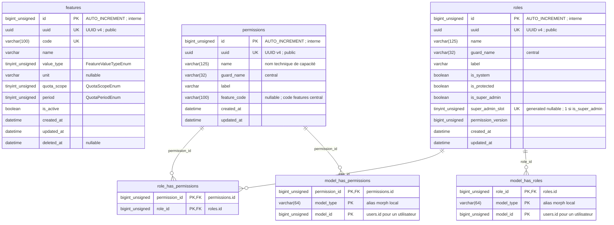
```mermaid
erDiagram
    direction TB
    features {
        bigint_unsigned id PK "AUTO_INCREMENT ; interne"
        uuid uuid UK "UUID v4 ; public"
        varchar(100) code UK
        varchar name
        tinyint_unsigned value_type "FeatureValueTypeEnum"
        varchar unit "nullable"
        tinyint_unsigned quota_scope "QuotaScopeEnum"
        tinyint_unsigned period "QuotaPeriodEnum"
        boolean is_active
        datetime created_at
        datetime updated_at
        datetime deleted_at "nullable"
    }
    permissions {
        bigint_unsigned id PK "AUTO_INCREMENT ; interne"
        uuid uuid UK "UUID v4 ; public"
        varchar(125) name "nom technique de capacité"
        varchar(32) guard_name "central"
        varchar label
        varchar(100) feature_code "nullable ; code features central"
        datetime created_at
        datetime updated_at
    }
    roles {
        bigint_unsigned id PK "AUTO_INCREMENT ; interne"
        uuid uuid UK "UUID v4 ; public"
        varchar(125) name
        varchar(32) guard_name "central"
        varchar label
        boolean is_system
        boolean is_protected
        boolean is_super_admin
        tinyint_unsigned super_admin_slot UK "generated nullable ; 1 si is_super_admin"
        bigint_unsigned permission_version
        datetime created_at
        datetime updated_at
    }
    role_has_permissions {
        bigint_unsigned permission_id PK,FK "permissions.id"
        bigint_unsigned role_id PK,FK "roles.id"
    }
    model_has_roles {
        bigint_unsigned role_id PK,FK "roles.id"
        varchar(64) model_type PK "alias morph local"
        bigint_unsigned model_id PK "users.id pour un utilisateur"
    }
    model_has_permissions {
        bigint_unsigned permission_id PK,FK "permissions.id"
        varchar(64) model_type PK "alias morph local"
        bigint_unsigned model_id PK "users.id pour un utilisateur"
    }
    roles ||--o{ role_has_permissions : role_id
    permissions ||--o{ role_has_permissions : permission_id
    roles ||--o{ model_has_roles : role_id
    permissions ||--o{ model_has_permissions : permission_id
```

**`features`** décrit les droits de l’abonnement et les quotas : code stable, nom, valeur booléenne/quantité, unité, portée propriétaire/boutique et période. Son rôle reste distinct des permissions d’une personne ; les plans se lient à cette table via plan_features.

**`permissions`** conserve `id`, `name`, `guard_name` et les timestamps natifs, plus `uuid`, `label` et `feature_code` facultatif. `name` est une capacité stable en anglais (`saas.users.create`, `saas.plans.manage`, `saas.subscriptions.assign`) ; `label` est sa présentation. UNIQUE(name,guard_name). Au central, feature_code reste NULL pour l’administration ; en boutique, il peut relier logiquement une action au catalogue central de fonctionnalités.

**`roles`** conserve les colonnes natives et reçoit uuid, label, is_system, is_protected, is_super_admin et permission_version. UNIQUE(name,guard_name). `is_super_admin` signifie une exception d’autorisation dans cette base et ce guard seulement ; ce booléen est une adaptation du projet. `super_admin_slot = CASE WHEN is_super_admin THEN 1 ELSE NULL END`, avec UNIQUE(super_admin_slot), réserve un seul rôle racine par BDD. `permission_version` augmente lors d’un changement de composition pour revalider les invitations et les caches. Le rôle central root est protégé ; au plus une attribution de ce rôle existe dans cette BDD. Le service/trigger verrouille la ligne du rôle avant attribution ou changement, vérifie les pivots et le compte et empêche les attributions concurrentes. Une rotation centrale dédiée préserve un accès root valide après commit ; aucune autre attribution de rôle n’a cette limite. En boutique, la même protection réserve shop-owner au seul propriétaire local. un administrateur IT peut recevoir saas.users.create sans pouvoir distribuer root ni attribuer un plan s’il n’en a pas la permission.

**Pivots natifs :** role_has_permissions a pour PK composite (permission_id,role_id). model_has_roles a pour PK (role_id,model_id,model_type) ; model_has_permissions a pour PK (permission_id,model_id,model_type). Ajouter les index (model_id,model_type). Les role_id/permission_id sont des FK BIGINT UNSIGNED locales ; model_id est la PK numérique du modèle indiqué par model_type. Le lien polymorphe n’est pas une FK SQL universelle : service, morph map et procédure de nettoyage contrôlent l’existence et le type. model_type central autorisé : `central_user`, mappé à App\Models\Central\User.

Ces trois pivots purement techniques constituent l’exception à la règle id+uuid : aucun id autonome, UUID, timestamp ou route de pivot. Une attribution externe reçoit les UUID de l’utilisateur et du rôle/permission, les résout dans la bonne BDD, puis utilise les méthodes du paquet (`assignRole`, `syncRoles`, `givePermissionTo`, `syncPermissions`). Son auteur, sa date et sa révocation sont tracés dans activity_log. Les autres liaisons métier (plan_features, variant_option_values...) gardent id+uuid et leur unicité métier.

Le modèle central User utilise HasRoles, la connexion central et le guard central ; le modèle local User utilise HasRoles, tenant et le guard tenant. Étendre Role/Permission pour la génération de uuid et leurs connexions ; configurer les modèles dans permission.php. À l’initialisation de chaque contexte, les modèles, la connexion et le PermissionRegistrar sont configurés ensemble, y compris dans les commandes et workers. Vérifier les migrations de Permission v8 réellement verrouillées avant développement. Aucune ancienne table parallèle d’attribution n’est maintenue.

**Archivage des droits :** aucun SoftDeletes sur les modèles Spatie dans ce schéma. Pour retirer un rôle, révoquer explicitement les attributions et invitations concernées via un service audité, puis supprimer seulement un rôle personnalisable devenu inutilisé. Les références métier requises sont protégées par RESTRICT ; ne pas laisser une cascade supprimer silencieusement une autorisation historique. Les rôles système et le catalogue de permissions ne sont pas supprimables depuis l’administration ordinaire. L’activité conserve les UUID et libellés filtrés nécessaires après disparition du sujet.

### C3 — Exceptions datées et restrictions de l’administration centrale

Spatie fournit les autorisations positives (rôles et permissions directes). Les interdictions, dates d’effet et restrictions de cibles déjà prévues restent des règles métier autour des Gates/Policies, jamais des pivots concurrents. Une autorisation permanente exceptionnelle utilise model_has_permissions ; une exception temporaire utilise permission_overrides et est évaluée à chaque décision. Spatie n’interprète pas nativement une interdiction.

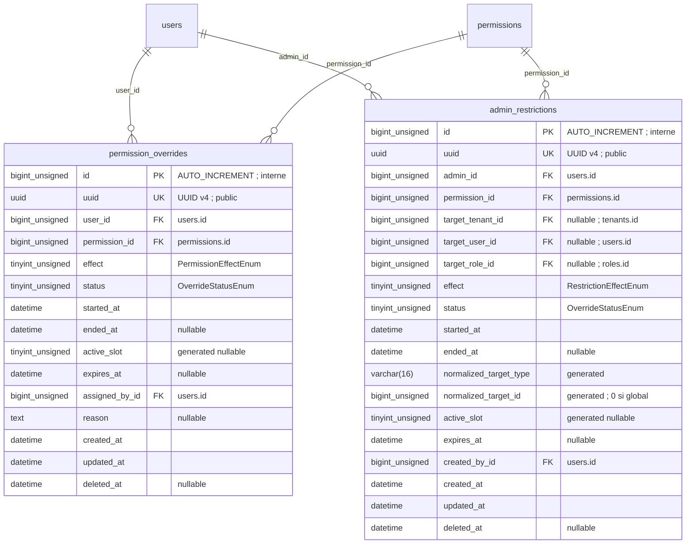
```mermaid
erDiagram
    direction TB
    permission_overrides {
        bigint_unsigned id PK "AUTO_INCREMENT ; interne"
        uuid uuid UK "UUID v4 ; public"
        bigint_unsigned user_id FK "users.id"
        bigint_unsigned permission_id FK "permissions.id"
        tinyint_unsigned effect "PermissionEffectEnum"
        tinyint_unsigned status "OverrideStatusEnum"
        datetime started_at
        datetime ended_at "nullable"
        tinyint_unsigned active_slot "generated nullable"
        datetime expires_at "nullable"
        bigint_unsigned assigned_by_id FK "users.id"
        text reason "nullable"
        datetime created_at
        datetime updated_at
        datetime deleted_at "nullable"
    }
    admin_restrictions {
        bigint_unsigned id PK "AUTO_INCREMENT ; interne"
        uuid uuid UK "UUID v4 ; public"
        bigint_unsigned admin_id FK "users.id"
        bigint_unsigned permission_id FK "permissions.id"
        bigint_unsigned target_tenant_id FK "nullable ; tenants.id"
        bigint_unsigned target_user_id FK "nullable ; users.id"
        bigint_unsigned target_role_id FK "nullable ; roles.id"
        tinyint_unsigned effect "RestrictionEffectEnum"
        tinyint_unsigned status "OverrideStatusEnum"
        datetime started_at
        datetime ended_at "nullable"
        varchar(16) normalized_target_type "generated"
        bigint_unsigned normalized_target_id "generated ; 0 si global"
        tinyint_unsigned active_slot "generated nullable"
        datetime expires_at "nullable"
        bigint_unsigned created_by_id FK "users.id"
        datetime created_at
        datetime updated_at
        datetime deleted_at "nullable"
    }
    users ||--o{ permission_overrides : user_id
    permissions ||--o{ permission_overrides : permission_id
    users ||--o{ admin_restrictions : admin_id
    permissions ||--o{ admin_restrictions : permission_id
```

permission_overrides : user_id désigne le bénéficiaire central, permission_id une permission du guard central, assigned_by_id l’auteur habilité ; effect vaut 1 ALLOW ou 2 DENY. Les dates bornent la validité ; status clôture/révoque l’exception ; reason justifie la décision. active_slot vaut 1 uniquement si status=1 et deleted_at IS NULL, sinon NULL ; UNIQUE(user_id,permission_id,active_slot). L’expiration est aussi évaluée à l’heure courante, jamais dans une colonne générée avec NOW(). Il n’existe plus de tenant_id pour l’appartenance ou la portée d’une permission centrale.

admin_restrictions : admin_id désigne l’administrateur délégué. permission_id décrit son action centrale ; exactement une cible parmi target_tenant_id, target_user_id, target_role_id peut être renseignée, ou aucune pour une règle globale. effect=1 DENY ou 2 ALLOW_ONLY ; une règle ALLOW_ONLY introduit une liste fermée de cibles, les DENY priment. Normaliser le type et la PK de cible dans des colonnes générées `normalized_target_type` et `normalized_target_id` (sentinelle numérique 0 uniquement pour absence de cible ; aucun parent réel n’a id=0), avec UNIQUE(admin_id,permission_id,normalized_target_type,normalized_target_id,effect,active_slot). Les règles ne peuvent pas ouvrir l’intérieur d’une boutique. Leur créateur, état et validité sont contrôlés à l’écriture et à la lecture.

Les invitations d’équipe ont été déplacées intégralement en T24. La racine centrale n’est ni un rôle assignable par un IT délégué ni une exception temporaire ordinaire. Les services de délégation interdisent élévation indirecte, auto-attribution et modification des rôles protégés.

### C4 — Plans et abonnements

**`plans` — Les offres d’abonnement proposées aux commerçants, avec leurs versions. Exemple : Gratuit et Pro. Une ancienne version reste conservée pour comprendre les anciens abonnements.**

**`plan_features` — Indique ce que chaque offre permet et ses limites. Exemple : l’offre Gratuit autorise 1 boutique et l’offre Pro en autorise 3.**

**`subscriptions` — Indique l’offre d’un propriétaire, sa période d’utilisation et, si nécessaire, la boutique ciblée par `tenant_id`. Exemple : Karim possède un abonnement Pro ; `tenant_id` peut préciser une boutique particulière, sinon l’abonnement reste au niveau du propriétaire.**

**`feature_overrides` — Un changement particulier aux possibilités ou aux limites habituelles de l’abonnement. Exemple : autoriser temporairement Karim à tester une fonction normalement absente de son offre.**

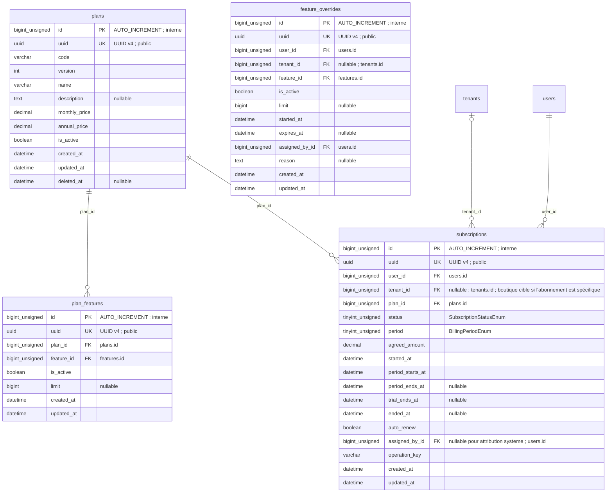
```mermaid
erDiagram
    direction TB
    plans {
        bigint_unsigned id PK "AUTO_INCREMENT ; interne"
        uuid uuid UK "UUID v4 ; public"
        varchar code
        int version
        varchar name
        text description "nullable"
        decimal monthly_price
        decimal annual_price
        boolean is_active
        datetime created_at
        datetime updated_at
        datetime deleted_at "nullable"
    }
    plan_features {
        bigint_unsigned id PK "AUTO_INCREMENT ; interne"
        uuid uuid UK "UUID v4 ; public"
        bigint_unsigned plan_id FK "plans.id"
        bigint_unsigned feature_id FK "features.id"
        boolean is_active
        bigint limit "nullable"
        datetime created_at
        datetime updated_at
    }
    subscriptions {
        bigint_unsigned id PK "AUTO_INCREMENT ; interne"
        uuid uuid UK "UUID v4 ; public"
        bigint_unsigned user_id FK "users.id"
        bigint_unsigned tenant_id FK "nullable ; tenants.id ; boutique cible si l'abonnement est spécifique"
        bigint_unsigned plan_id FK "plans.id"
        tinyint_unsigned status "SubscriptionStatusEnum"
        tinyint_unsigned period "BillingPeriodEnum"
        decimal agreed_amount
        datetime started_at
        datetime period_starts_at
        datetime period_ends_at "nullable"
        datetime trial_ends_at "nullable"
        datetime ended_at "nullable"
        boolean auto_renew
        bigint_unsigned assigned_by_id FK "nullable pour attribution systeme ; users.id"
        varchar operation_key
        datetime created_at
        datetime updated_at
    }
    feature_overrides {
        bigint_unsigned id PK "AUTO_INCREMENT ; interne"
        uuid uuid UK "UUID v4 ; public"
        bigint_unsigned user_id FK "users.id"
        bigint_unsigned tenant_id FK "nullable ; tenants.id"
        bigint_unsigned feature_id FK "features.id"
        boolean is_active
        bigint limit "nullable"
        datetime started_at
        datetime expires_at "nullable"
        bigint_unsigned assigned_by_id FK "users.id"
        text reason "nullable"
        datetime created_at
        datetime updated_at
    }
    plans ||--o{ plan_features : plan_id
    users ||--o{ subscriptions : user_id
    tenants |o--o{ subscriptions : tenant_id
    plans ||--o{ subscriptions : plan_id
```

#### Explication très simple des champs

**`plans` :**

- **`id`** : le numéro unique qui permet de reconnaître cette ligne dans la base. Deux lignes différentes ne peuvent pas avoir le même `id`.
- **`uuid`** : identifiant public UUID v4 unique et indexé ; routes, API, formulaires et exports utilisent cet identifiant, sans exposer la PK numérique.
- **`code`** : le petit nom utilisé par le programme pour reconnaître l’élément. Exemple : `boutiques.nombre` ou `product.create`.
- **`version`** : le numéro de version de cet élément. Exemple : version 1, puis version 2 après une évolution ; l’ancienne version peut rester conservée pour comprendre l’historique.
- **`name`** : le nom affiché à l’utilisateur. Exemple : « Nombre de boutiques » ou « Livraison EcoTrack ».
- **`description`** : un texte qui explique l’élément plus en détail. Il peut rester vide si aucune explication supplémentaire n’est nécessaire.
- **`monthly_price`** : le prix à payer pour un mois d’abonnement.
- **`annual_price`** : le prix à payer pour une année d’abonnement.
- **`is_active`** : indique si l’élément peut encore être utilisé. `true` = oui, `false` = non.
- **`created_at`** : la date où cette ligne a été créée dans la base.
- **`updated_at`** : la date de la dernière modification de cette ligne. Exemple : si tu modifies l’élément aujourd’hui, cette date devient celle d’aujourd’hui.
- **`deleted_at`** : la date où l’élément a été retiré sans effacer son ancienne ligne. Si ce champ est vide, l’élément n’est pas supprimé.

**`plan_features` :**

- **`id`** : le numéro unique qui permet de reconnaître cette ligne dans la base. Deux lignes différentes ne peuvent pas avoir le même `id`.
- **`uuid`** : identifiant public UUID v4 unique et indexé ; routes, API, formulaires et exports utilisent cet identifiant, sans exposer la PK numérique.
- **`plan_id`** : l’identifiant du plan d’abonnement. Il sert à relier cette ligne à la bonne information au lieu de recopier toutes ses données.
- **`feature_id`** : l’identifiant de la fonctionnalité. Il sert à relier cette ligne à la bonne information au lieu de recopier toutes ses données.
- **`is_active`** : indique si cette possibilité est autorisée. `true` = oui, `false` = non.
- **`limit`** : le nombre maximum autorisé. Exemple : `3` peut vouloir dire maximum 3 boutiques. Si le champ est vide dans un cas prévu comme illimité, il n’y a pas de nombre maximum. Ce champ peut rester vide quand cette information n’est pas nécessaire ou pas encore connue.
- **`created_at`** : la date où cette ligne a été créée dans la base.
- **`updated_at`** : la date de la dernière modification de cette ligne. Exemple : si tu modifies l’élément aujourd’hui, cette date devient celle d’aujourd’hui.

**`subscriptions` :**

- **`id`** : le numéro unique qui permet de reconnaître cette ligne dans la base. Deux lignes différentes ne peuvent pas avoir le même `id`.
- **`uuid`** : identifiant public UUID v4 unique et indexé ; routes, API, formulaires et exports utilisent cet identifiant, sans exposer la PK numérique.
- **`user_id`** : l’identifiant du propriétaire central auquel l’abonnement appartient.
- **`tenant_id`** : l’identifiant de la boutique concernée quand l’abonnement ou l’option est ciblé sur une boutique précise. Il peut rester vide pour un abonnement porté au niveau du propriétaire. Lorsqu’il est renseigné, cette boutique doit appartenir à `user_id`.
- **`plan_id`** : l’identifiant du plan d’abonnement. Il sert à relier cette ligne à la bonne information au lieu de recopier toutes ses données.
- **`status`** : code entier de l’enum propre à cet objet, défini au §3.3 ; les libellés sont traduits à l’affichage et les transitions contrôlées par le service.
- **`period`** : indique la durée choisie pour l’abonnement payant. Exemple : `mensuel` pour payer par mois ou `annuel` pour payer par année, selon les valeurs prévues par le SaaS.
- **`agreed_amount`** : le montant qui a été décidé pour cet abonnement, afin de garder le prix réellement accepté même si le tarif du plan change plus tard.
- **`started_at`** : la date et l’heure où la période ou l’action commence.
- **`period_starts_at`** : le début de la période concernée. Exemple : début du mois payé.
- **`period_ends_at`** : la fin de la période concernée. Exemple : fin du mois payé. Peut rester vide lorsque la période n’a pas de fin prévue.
- **`trial_ends_at`** : la date où la période d’essai se termine. Elle peut rester vide s’il n’y a pas d’essai.
- **`ended_at`** : la date et l’heure où elle s’est terminée. Peut rester vide tant que ce n’est pas terminé.
- **`auto_renew`** : indique si l’abonnement payant doit être renouvelé automatiquement selon la règle prévue. `false` signifie qu’on ne prépare pas un nouveau renouvellement payant.
- **`assigned_by_id`** : l’identifiant de la personne qui a donné ce droit. Il sert à relier cette ligne à la bonne information au lieu de recopier toutes ses données. Ce champ peut rester vide quand cette information n’est pas nécessaire ou pas encore connue.
- **`operation_key`** : une clé unique utilisée pour reconnaître une opération déjà faite. Exemple : si le serveur reçoit deux fois la même demande après une coupure, cette clé aide à éviter de faire l’opération deux fois.
- **`created_at`** : la date où cette ligne a été créée dans la base.
- **`updated_at`** : la date de la dernière modification de cette ligne. Exemple : si tu modifies l’élément aujourd’hui, cette date devient celle d’aujourd’hui.

**`feature_overrides` :**

- **`id`** : le numéro unique qui permet de reconnaître cette ligne dans la base. Deux lignes différentes ne peuvent pas avoir le même `id`.
- **`uuid`** : identifiant public UUID v4 unique et indexé ; routes, API, formulaires et exports utilisent cet identifiant, sans exposer la PK numérique.
- **`user_id`** : l’identifiant du propriétaire. Il sert à relier cette ligne à la bonne information au lieu de recopier toutes ses données.
- **`tenant_id`** : l’identifiant de la boutique. Il sert à relier cette ligne à la bonne information au lieu de recopier toutes ses données. Ce champ peut rester vide quand cette information n’est pas nécessaire ou pas encore connue.
- **`feature_id`** : l’identifiant de la fonctionnalité. Il sert à relier cette ligne à la bonne information au lieu de recopier toutes ses données.
- **`is_active`** : indique si cette possibilité est autorisée. `true` = oui, `false` = non.
- **`limit`** : le nombre maximum autorisé. Exemple : `3` peut vouloir dire maximum 3 boutiques. Si le champ est vide dans un cas prévu comme illimité, il n’y a pas de nombre maximum. Ce champ peut rester vide quand cette information n’est pas nécessaire ou pas encore connue.
- **`started_at`** : la date et l’heure où la période ou l’action commence.
- **`expires_at`** : la date où l’élément n’est plus valable. Ce champ peut rester vide quand cette information n’est pas nécessaire ou pas encore connue.
- **`assigned_by_id`** : l’identifiant de la personne qui a donné ce droit. Il sert à relier cette ligne à la bonne information au lieu de recopier toutes ses données.
- **`reason`** : explique pourquoi l’action ou la décision a été faite. Ce champ peut rester vide quand cette information n’est pas nécessaire ou pas encore connue.
- **`created_at`** : la date où cette ligne a été créée dans la base.
- **`updated_at`** : la date de la dernière modification de cette ligne. Exemple : si tu modifies l’élément aujourd’hui, cette date devient celle d’aujourd’hui.


Les références vers un autre module sont indiquées sur les champs, même si leur flèche n’est pas redessinée ici.

- **`plans` :** Le couple `code + version` est unique. Les prix sont en DZD dans ce MVP. Dès qu’un plan a été utilisé par un abonnement, on ne modifie plus son ancienne version. Exemple : si `Pro v1` autorisait 3 boutiques et qu’on veut passer à 5, on crée `Pro v2` au lieu de transformer le passé. Le plan gratuit coûte `0` et autorise 1 boutique.

- **`plan_features` :** Une fonctionnalité ne peut apparaître qu’une seule fois dans un même plan. Pour un quota : `is_active=false` signifie que la fonction est interdite ; `is_active=true` avec `limit=NULL` signifie qu’elle est illimitée ; sinon `limit` contient le maximum autorisé et doit être positif ou nul. Pour une fonctionnalité oui/non, `limit` reste vide. Si une fonctionnalité n’apparaît pas dans le plan, elle est considérée comme désactivée. Quand un plan a déjà été utilisé, ces règles restent figées avec cette version du plan.

- **`subscriptions` :** Un abonnement payant est attribué manuellement par un administrateur autorisé. `tenant_id` est facultatif : NULL signifie portée propriétaire ; lorsqu’il est renseigné, la relation `(tenant_id,user_id) → tenants(id,user_id)` garantit que la boutique appartient au même propriétaire. Le plan gratuit est donné automatiquement lors de la création du compte et après la fin d’un abonnement payant. Le SaaS ne prélève pas automatiquement l’argent et ne rembourse pas automatiquement : les paiements sont vérifiés dans `saas_invoices`. Si le commerçant demande l’arrêt, on coupe seulement le prochain renouvellement payant ; il garde les droits jusqu’à la fin de la période qu’il a déjà payée. On garde la trace de cette demande. Changer de formule crée une nouvelle attribution au bon moment au lieu de réécrire l’ancien abonnement. `auto_renew=false` signifie seulement « ne pas renouveler le payant » ; cela n’empêche pas le passage automatique au gratuit. Les statuts utilisent exactement `SubscriptionStatusEnum` : `1 SCHEDULED`, `2 TRIAL`, `3 ACTIVE`, `4 EXPIRED`, `5 CANCELLED`. `operation_key` est unique afin qu’un retry ne crée pas deux abonnements. Un propriétaire ne peut avoir qu’un seul abonnement actif à la fois. Pour activer un nouveau plan, on verrouille son compte, on ferme l’ancien abonnement puis on active le nouveau dans la même transaction. Les droits ne sont valables que si le statut est actif ET si la date actuelle se trouve dans la période autorisée ; le système ne dépend donc pas d’un cron pour savoir qu’un abonnement est fini. À l’expiration du payant, on crée le gratuit une seule fois, puis les boutiques qui dépassent le nouveau quota passent `hors_quota` sans supprimer leurs données. Les montants et périodes historiques restent conservés.

- **`feature_overrides` :** Une exception change temporairement une fonctionnalité pour un propriétaire ou pour une boutique. Sa période commence à `started_at` et s’arrête avant `expires_at` lorsqu’une date de fin existe. `is_active=false` peut servir à interdire une fonction pendant cette période ; ce champ ne dit pas si l’exception est « expirée ». Deux exceptions qui concernent le même propriétaire, la même fonctionnalité et le même contexte ne doivent pas se chevaucher dans le temps. Pour éviter les collisions, on verrouille le propriétaire, on vérifie les périodes existantes puis on écrit le changement dans la même transaction. `tenant_id=NULL` signifie que l’exception concerne tout le compte. Une exception de boutique est plus précise et passe avant l’exception du compte, qui passe elle-même avant le plan. Si un quota est défini au niveau du compte, on n’autorise pas une exception au niveau d’une seule boutique. La boutique indiquée doit réellement appartenir à ce propriétaire. Les changements de dates sont audités et on ne réécrit pas une ancienne période déjà utilisée.

### C5 — Suivi SaaS et référentiel

**`feature_usage` — Compte certaines utilisations quand un compteur est nécessaire pour vérifier une limite. Exemple : suivre le nombre d’utilisations d’une fonction pendant un mois. Le nombre de boutiques se calcule depuis les boutiques existantes.**

**`subscription_installments` — Les sommes que le commerçant doit payer pour son abonnement SaaS. Exemple : Karim doit payer 3 000 DA pour une période. La facture et la validation du paiement sont enregistrées dans l’unique table `saas_invoices` de C9.**

**`provinces` — La liste des wilayas, commune à toutes les boutiques. Exemple : Alger peut être sélectionnée dans une adresse de livraison.**

**`municipalities` — La liste des communes et la wilaya de chacune. Exemple : vérifier que la commune choisie appartient bien à la wilaya indiquée, sans vérifier l’existence de la maison.**

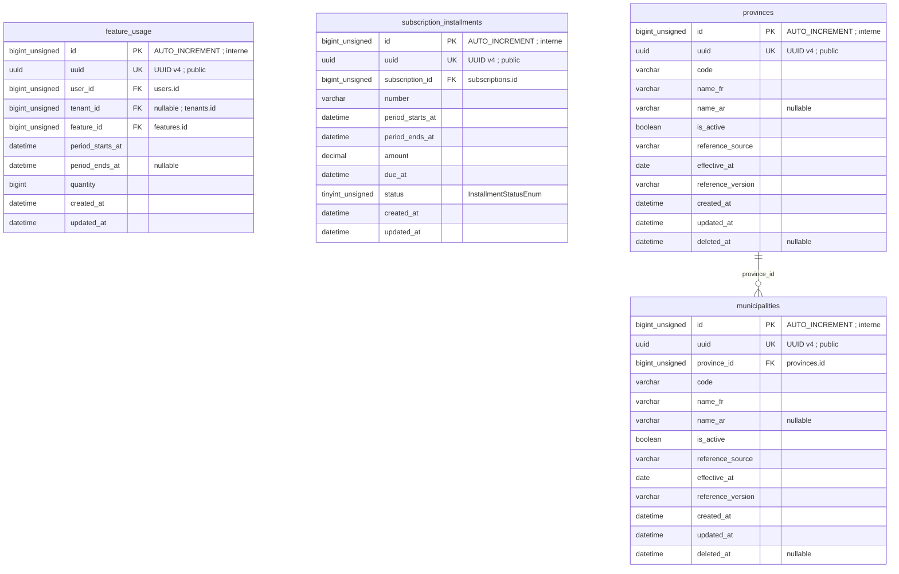
```mermaid
erDiagram
    direction TB
    feature_usage {
        bigint_unsigned id PK "AUTO_INCREMENT ; interne"
        uuid uuid UK "UUID v4 ; public"
        bigint_unsigned user_id FK "users.id"
        bigint_unsigned tenant_id FK "nullable ; tenants.id"
        bigint_unsigned feature_id FK "features.id"
        datetime period_starts_at
        datetime period_ends_at "nullable"
        bigint quantity
        datetime created_at
        datetime updated_at
    }
    subscription_installments {
        bigint_unsigned id PK "AUTO_INCREMENT ; interne"
        uuid uuid UK "UUID v4 ; public"
        bigint_unsigned subscription_id FK "subscriptions.id"
        varchar number
        datetime period_starts_at
        datetime period_ends_at
        decimal amount
        datetime due_at
        tinyint_unsigned status "InstallmentStatusEnum"
        datetime created_at
        datetime updated_at
    }
    provinces {
        bigint_unsigned id PK "AUTO_INCREMENT ; interne"
        uuid uuid UK "UUID v4 ; public"
        varchar code
        varchar name_fr
        varchar name_ar "nullable"
        boolean is_active
        varchar reference_source
        date effective_at
        varchar reference_version
        datetime created_at
        datetime updated_at
        datetime deleted_at "nullable"
    }
    municipalities {
        bigint_unsigned id PK "AUTO_INCREMENT ; interne"
        uuid uuid UK "UUID v4 ; public"
        bigint_unsigned province_id FK "provinces.id"
        varchar code
        varchar name_fr
        varchar name_ar "nullable"
        boolean is_active
        varchar reference_source
        date effective_at
        varchar reference_version
        datetime created_at
        datetime updated_at
        datetime deleted_at "nullable"
    }
    provinces ||--o{ municipalities : province_id
```

#### Explication très simple des champs

**`feature_usage` :**

- **`id`** : le numéro unique qui permet de reconnaître cette ligne dans la base. Deux lignes différentes ne peuvent pas avoir le même `id`.
- **`uuid`** : identifiant public UUID v4 unique et indexé ; routes, API, formulaires et exports utilisent cet identifiant, sans exposer la PK numérique.
- **`user_id`** : l’identifiant du propriétaire. Il sert à relier cette ligne à la bonne information au lieu de recopier toutes ses données.
- **`tenant_id`** : l’identifiant de la boutique. Il sert à relier cette ligne à la bonne information au lieu de recopier toutes ses données. Ce champ peut rester vide quand cette information n’est pas nécessaire ou pas encore connue.
- **`feature_id`** : l’identifiant de la fonctionnalité. Il sert à relier cette ligne à la bonne information au lieu de recopier toutes ses données.
- **`period_starts_at`** : le début de la période concernée. Exemple : début du mois payé.
- **`period_ends_at`** : la fin de la période concernée. Exemple : fin du mois payé. Peut rester vide lorsque la période n’a pas de fin prévue.
- **`quantity`** : le nombre d’éléments concernés. Exemple : `2` signifie deux unités du produit.
- **`created_at`** : la date où cette ligne a été créée dans la base.
- **`updated_at`** : la date de la dernière modification de cette ligne. Exemple : si tu modifies l’élément aujourd’hui, cette date devient celle d’aujourd’hui.

**`subscription_installments` :**

- **`id`** : le numéro unique qui permet de reconnaître cette ligne dans la base. Deux lignes différentes ne peuvent pas avoir le même `id`.
- **`uuid`** : identifiant public UUID v4 unique et indexé ; routes, API, formulaires et exports utilisent cet identifiant, sans exposer la PK numérique.
- **`subscription_id`** : l’identifiant de l’abonnement. Il sert à relier cette ligne à la bonne information au lieu de recopier toutes ses données.
- **`number`** : le numéro lisible de l’élément. Exemple : numéro d’échéance ou de facture selon la table.
- **`period_starts_at`** : le début de la période concernée. Exemple : début du mois payé.
- **`period_ends_at`** : la fin de la période concernée. Exemple : fin du mois payé. Peut rester vide lorsque la période n’a pas de fin prévue.
- **`amount`** : la somme d’argent de cette ligne, en DZD au lancement. Exemple : `3000` signifie 3 000 DA.
- **`due_at`** : la date et l’heure liées à **exigible**. Elle permet de savoir exactement quand cette étape a eu lieu.
- **`status`** : code entier de l’enum propre à cet objet, défini au §3.3 ; les libellés sont traduits à l’affichage et les transitions contrôlées par le service.
- **`created_at`** : la date où cette ligne a été créée dans la base.
- **`updated_at`** : la date de la dernière modification de cette ligne. Exemple : si tu modifies l’élément aujourd’hui, cette date devient celle d’aujourd’hui.


**`provinces` :**

- **`id`** : le numéro unique qui permet de reconnaître cette ligne dans la base. Deux lignes différentes ne peuvent pas avoir le même `id`.
- **`uuid`** : identifiant public UUID v4 unique et indexé ; routes, API, formulaires et exports utilisent cet identifiant, sans exposer la PK numérique.
- **`code`** : le petit nom utilisé par le programme pour reconnaître l’élément. Exemple : `boutiques.nombre` ou `product.create`.
- **`name_fr`** : le nom en français.
- **`name_ar`** : le nom en arabe. Il peut rester vide si cette traduction n’est pas encore renseignée.
- **`is_active`** : indique si cette possibilité est autorisée. `true` = oui, `false` = non.
- **`reference_source`** : indique d’où vient la liste officielle utilisée. Exemple : le texte officiel ayant servi à importer les wilayas.
- **`effective_at`** : la date à partir de laquelle l’information ou la correction doit compter. Exemple : une correction enregistrée aujourd’hui peut devoir compter pour la vente d’hier.
- **`reference_version`** : indique quelle version de cette liste officielle a été utilisée.
- **`created_at`** : la date où cette ligne a été créée dans la base.
- **`updated_at`** : la date de la dernière modification de cette ligne. Exemple : si tu modifies l’élément aujourd’hui, cette date devient celle d’aujourd’hui.
- **`deleted_at`** : la date où l’élément a été retiré sans effacer son ancienne ligne. Si ce champ est vide, l’élément n’est pas supprimé.

**`municipalities` :**

- **`id`** : le numéro unique qui permet de reconnaître cette ligne dans la base. Deux lignes différentes ne peuvent pas avoir le même `id`.
- **`uuid`** : identifiant public UUID v4 unique et indexé ; routes, API, formulaires et exports utilisent cet identifiant, sans exposer la PK numérique.
- **`province_id`** : l’identifiant de la wilaya. Il sert à relier cette ligne à la bonne information au lieu de recopier toutes ses données.
- **`code`** : le petit nom utilisé par le programme pour reconnaître l’élément. Exemple : `boutiques.nombre` ou `product.create`.
- **`name_fr`** : le nom en français.
- **`name_ar`** : le nom en arabe. Il peut rester vide si cette traduction n’est pas encore renseignée.
- **`is_active`** : indique si cette possibilité est autorisée. `true` = oui, `false` = non.
- **`reference_source`** : indique d’où vient la liste officielle utilisée. Exemple : le texte officiel ayant servi à importer les wilayas.
- **`effective_at`** : la date à partir de laquelle l’information ou la correction doit compter. Exemple : une correction enregistrée aujourd’hui peut devoir compter pour la vente d’hier.
- **`reference_version`** : indique quelle version de cette liste officielle a été utilisée.
- **`created_at`** : la date où cette ligne a été créée dans la base.
- **`updated_at`** : la date de la dernière modification de cette ligne. Exemple : si tu modifies l’élément aujourd’hui, cette date devient celle d’aujourd’hui.
- **`deleted_at`** : la date où l’élément a été retiré sans effacer son ancienne ligne. Si ce champ est vide, l’élément n’est pas supprimé.


Les références vers un autre module sont indiquées sur les champs, même si leur flèche n’est pas redessinée ici.

- **`feature_usage` :** Pour une même fonctionnalité, un même propriétaire, un même contexte et une même période, il n’existe qu’un seul compteur. Sa mise à jour doit être atomique : deux requêtes en même temps ne doivent pas pouvoir dépasser le quota. Quand on vérifie `boutiques.nombre` pour créer une nouvelle boutique, on compte toutes les boutiques non supprimées du propriétaire, même celles qui sont `hors_quota`, en cours de création, suspendues ou en échec récupérable. On verrouille le propriétaire pendant ce contrôle. Si un plan devient plus petit, on ne supprime pas les boutiques en trop : on garde seulement jusqu’au quota comme actives et les autres passent `hors_quota`. Un échec récupérable continue de prendre une place tant qu’on n’a pas explicitement abandonné cette création. On n’entretient pas un deuxième compteur séparé du vrai nombre de boutiques. Un membre d’équipe utilise toujours les quotas du propriétaire de sa boutique.

- **`subscription_installments` :** Chaque échéance possède un `number` unique. Les montants sont en DZD. Son état `PENDING`, `PARTIALLY_PAID`, `PAID` ou `CANCELLED` se calcule à partir des factures/paiements réellement validés dans `saas_invoices`. Cette table dit simplement « combien le commerçant doit payer » ; la facture correspondante est `saas_invoices`.


- **`provinces` :** Chaque `code` de wilaya est unique. Le référentiel initial doit venir des annexes officielles citées en [S10], avec 69 wilayas et 1 541 communes dans la version utilisée par ce document. On garde aussi la source, la version et la date d’effet du référentiel. Il ne faut jamais coder en dur « maximum 58 » ni obliger la table à contenir exactement 69 lignes, car le découpage administratif peut évoluer. Les codes utilisés par un transporteur restent séparés des codes officiels.

- **`municipalities` :** Dans une même wilaya, deux communes ne peuvent pas avoir le même `code`. Quand une commune est choisie, on vérifie qu’elle appartient bien à la wilaya indiquée. Le code postal ne remplace pas l’identifiant de la commune : deux notions différentes restent deux informations différentes.

### C6 — Activités centrales avec Spatie Laravel Activity Log v5

Le journal principal est désormais `activity_log`, alimenté par spatie/laravel-activitylog v5. Source de préparation : [Recherche complète Activity Log](Recherche_complete_Spatie_Laravel_Activity_Log.md), notamment §§12–38, 54–61 et 78–92. Les colonnes natives v5 sont conservées ; uuid, correlation_id, origin, operation_key et tenant_id sont des extensions du projet.

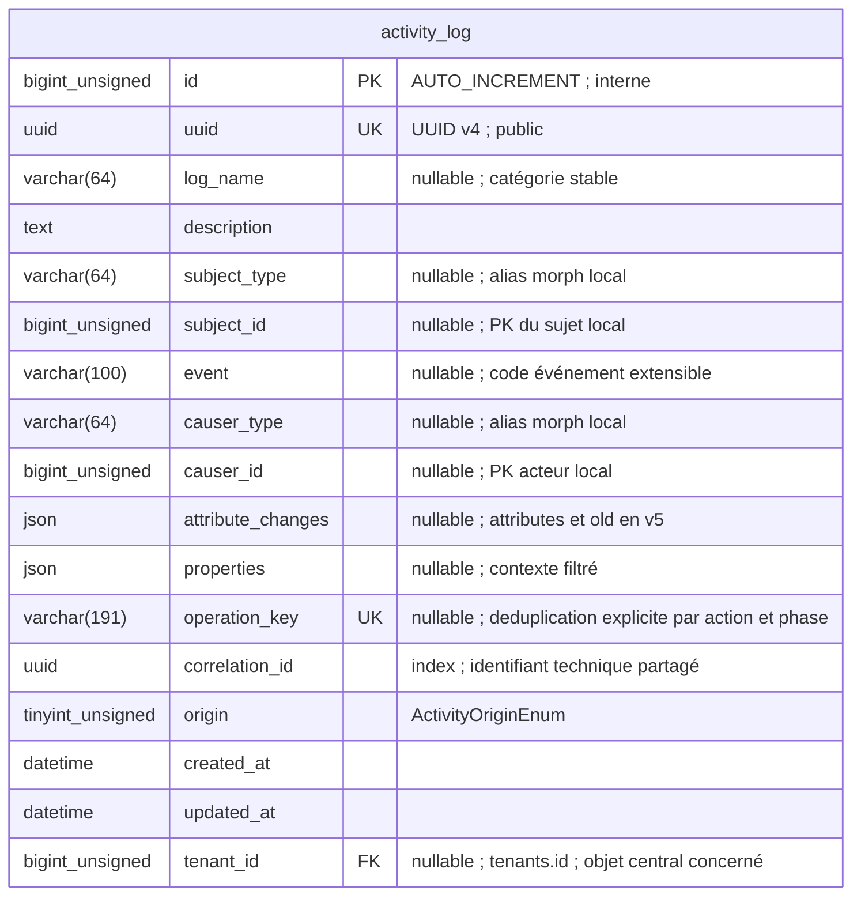
```mermaid
erDiagram
    direction TB
    activity_log {
        bigint_unsigned id PK "AUTO_INCREMENT ; interne"
        uuid uuid UK "UUID v4 ; public"
        varchar(64) log_name "nullable ; catégorie stable"
        text description
        varchar(64) subject_type "nullable ; alias morph local"
        bigint_unsigned subject_id "nullable ; PK du sujet local"
        varchar(100) event "nullable ; code événement extensible"
        varchar(64) causer_type "nullable ; alias morph local"
        bigint_unsigned causer_id "nullable ; PK acteur local"
        json attribute_changes "nullable ; attributes et old en v5"
        json properties "nullable ; contexte filtré"
        varchar(191) operation_key UK "nullable ; deduplication explicite par action et phase"
        uuid correlation_id "index ; identifiant technique partagé"
        tinyint_unsigned origin "ActivityOriginEnum"
        datetime created_at
        datetime updated_at
        bigint_unsigned tenant_id FK "nullable ; tenants.id ; objet central concerné"
    }

```

**`activity_log` :**

- **`id`** : clé primaire numérique interne, auto-incrémentée ; jamais envoyée au client.
- **`uuid`** : identifiant public unique et indexé, utilisé dans les routes, formulaires, exports et ressources JSON.
- **`log_name / event / description`** : catégorie, code stable de l’action et texte lisible. Les codes restent des chaînes extensibles compatibles avec le paquet.
- **`subject_type / subject_id`** : morphTo du sujet central, avec alias stable et PK numérique ; les deux sont NULL ou renseignés ensemble.
- **`causer_type / causer_id`** : morphTo de l’acteur central ; NULL pour un système ou un événement anonyme. Aucun compte d’équipe local n’est résolu par ce couple central.
- **`attribute_changes`** : changements de champs en v5, structurés en attributes (après) et old (avant), limités aux attributs autorisés.
- **`properties`** : contexte filtré, UUID publics et libellés utiles ; n’accueille ni copie complète de requête ni données de connexion.
- **`operation_key`** : clé facultative unique d’une action explicite et de sa phase ; une clé rejouée ne crée pas un second événement de succès. NULL pour les activités automatiques sans déduplication explicite.
- **`correlation_id`** : UUID technique généré pour l’opération, partagé entre ses activités et intentions ; indexé mais non unique.
- **`origin`** : ActivityOriginEnum : origine utilisateur, système, transporteur ou job.
- **`tenant_id`** : FK du tenant central concerné par une opération de plateforme, facultative ; ne représente aucune appartenance d’équipe.
- **`created_at / updated_at`** : timestamps conservés pour compatibilité ; toute modification d’activité est limitée aux procédures de rétention autorisées.

Les détails normatifs, la couverture des actions, les relations polymorphes, la connexion, les exemples et la rétention sont décrits au §7.7. Le SaaS consulte uniquement ce journal central : les activités internes des boutiques restent dans leurs BDD. Les journaux de stock, comptabilité, documents et données personnelles gardent leur rôle de preuve spécialisée.


### C7 — Historique des déploiements des BDD

**`tenant_schema_deployments` — L’historique de création et de mise à jour technique des bases des boutiques. Exemple : la mise à jour de la boutique de Karim a réussi, tandis qu’une autre doit être réessayée.**

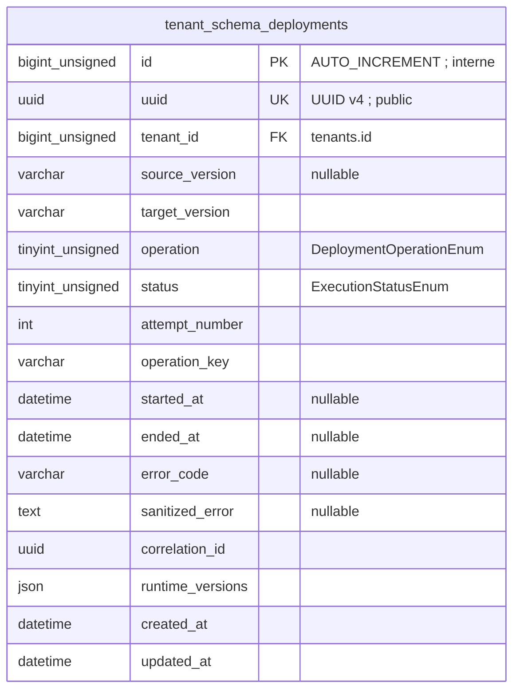
```mermaid
erDiagram
    direction TB
    tenant_schema_deployments {
        bigint_unsigned id PK "AUTO_INCREMENT ; interne"
        uuid uuid UK "UUID v4 ; public"
        bigint_unsigned tenant_id FK "tenants.id"
        varchar source_version "nullable"
        varchar target_version
        tinyint_unsigned operation "DeploymentOperationEnum"
        tinyint_unsigned status "ExecutionStatusEnum"
        int attempt_number
        varchar operation_key
        datetime started_at "nullable"
        datetime ended_at "nullable"
        varchar error_code "nullable"
        text sanitized_error "nullable"
        uuid correlation_id
        json runtime_versions
        datetime created_at
        datetime updated_at
    }
```

#### Explication très simple des champs

**`tenant_schema_deployments` :**

- **`id`** : le numéro unique qui permet de reconnaître cette ligne dans la base. Deux lignes différentes ne peuvent pas avoir le même `id`.
- **`uuid`** : identifiant public UUID v4 unique et indexé ; routes, API, formulaires et exports utilisent cet identifiant, sans exposer la PK numérique.
- **`tenant_id`** : l’identifiant de la boutique. Il sert à relier cette ligne à la bonne information au lieu de recopier toutes ses données.
- **`source_version`** : la version technique présente avant la migration. Ce champ peut rester vide quand cette information n’est pas nécessaire ou pas encore connue.
- **`target_version`** : la version technique que l’on veut installer.
- **`operation`** : code de `DeploymentOperationEnum` : `1 PROVISIONING`, `2 MIGRATION`.
- **`status`** : code entier de l’enum propre à cet objet, défini au §3.3 ; les libellés sont traduits à l’affichage et les transitions contrôlées par le service.
- **`attempt_number`** : le numéro de l’essai. Exemple : 1 pour le premier essai, 2 après un nouvel essai.
- **`operation_key`** : une clé unique utilisée pour reconnaître une opération déjà faite. Exemple : si le serveur reçoit deux fois la même demande après une coupure, cette clé aide à éviter de faire l’opération deux fois.
- **`started_at`** : la date et l’heure où la période ou l’action commence. Ce champ peut rester vide quand cette information n’est pas nécessaire ou pas encore connue.
- **`ended_at`** : la date et l’heure où elle s’est terminée. Peut rester vide tant que ce n’est pas terminé.
- **`error_code`** : un petit code qui permet de reconnaître le type d’erreur sans stocker un long message sensible. Ce champ peut rester vide quand cette information n’est pas nécessaire ou pas encore connue.
- **`sanitized_error`** : un message d’erreur nettoyé pour ne pas enregistrer de mot de passe, jeton ou autre secret. Ce champ peut rester vide quand cette information n’est pas nécessaire ou pas encore connue.
- **`correlation_id`** : un numéro commun utilisé pour relier plusieurs traces qui appartiennent à la même grande opération. Exemple : une création de boutique qui produit plusieurs actions techniques.
- **`runtime_versions`** : la liste des versions réellement utilisées pendant l’opération. Exemple : version de PHP, Laravel, MySQL et de l’application.
- **`created_at`** : la date où cette ligne a été créée dans la base.
- **`updated_at`** : la date de la dernière modification de cette ligne. Exemple : si tu modifies l’élément aujourd’hui, cette date devient celle d’aujourd’hui.


**Contraintes :** UNIQUE(operation_key), index(tenant_id,created_at). operation=1 PROVISIONING ou 2 MIGRATION ; status=1 PENDING, 2 RUNNING, 3 SUCCEEDED, 4 FAILED ou 5 CANCELLED. Une seule opération en cours par tenant, via clé générée conditionnelle UNIQUE et verrou de déploiement. Chaque reprise garde l’échec et crée une nouvelle tentative. runtime_versions fige PHP, Laravel, tenancy, MySQL et version applicative réellement utilisés. tenants.schema_version change seulement après succès ; migrations locales détaillent les migrations exécutées. Une migration échouée ne rend pas la boutique active. La reprise technique concerne l’étape de provisioning/migration, sans opération de retour de la BDD à un état antérieur.


### C8 — Politiques et exécutions de conservation

**`retention_policies` — Les règles qui indiquent combien de temps garder chaque catégorie de données et quoi faire ensuite. Exemple : supprimer certaines données à la fin d’une durée validée.**

**`retention_runs` — L’historique des opérations qui appliquent ces règles de conservation. Exemple : une tâche a traité des données anciennes et indique combien de lignes ont été traitées ou ignorées.**

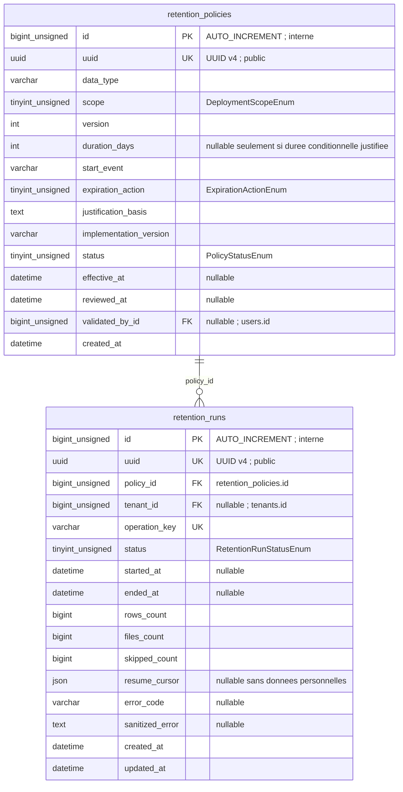
```mermaid
erDiagram
    direction TB
    retention_policies {
        bigint_unsigned id PK "AUTO_INCREMENT ; interne"
        uuid uuid UK "UUID v4 ; public"
        varchar data_type
        tinyint_unsigned scope "DeploymentScopeEnum"
        int version
        int duration_days "nullable seulement si duree conditionnelle justifiee"
        varchar start_event
        tinyint_unsigned expiration_action "ExpirationActionEnum"
        text justification_basis
        varchar implementation_version
        tinyint_unsigned status "PolicyStatusEnum"
        datetime effective_at "nullable"
        datetime reviewed_at "nullable"
        bigint_unsigned validated_by_id FK "nullable ; users.id"
        datetime created_at
    }
    retention_runs {
        bigint_unsigned id PK "AUTO_INCREMENT ; interne"
        uuid uuid UK "UUID v4 ; public"
        bigint_unsigned policy_id FK "retention_policies.id"
        bigint_unsigned tenant_id FK "nullable ; tenants.id"
        varchar operation_key UK
        tinyint_unsigned status "RetentionRunStatusEnum"
        datetime started_at "nullable"
        datetime ended_at "nullable"
        bigint rows_count
        bigint files_count
        bigint skipped_count
        json resume_cursor "nullable sans donnees personnelles"
        varchar error_code "nullable"
        text sanitized_error "nullable"
        datetime created_at
        datetime updated_at
    }
    retention_policies ||--o{ retention_runs : policy_id
```

#### Explication très simple des champs


**`retention_policies` :**

- **`id`** : le numéro unique qui permet de reconnaître cette ligne dans la base. Deux lignes différentes ne peuvent pas avoir le même `id`.
- **`uuid`** : identifiant public UUID v4 unique et indexé ; routes, API, formulaires et exports utilisent cet identifiant, sans exposer la PK numérique.
- **`data_type`** : le type de données concerné par la règle. Exemple : données de commande ou données de contact.
- **`scope`** : indique dans quel endroit la règle s’applique. Exemple : `plateforme` pour l’administration du SaaS ou `tenant` pour une boutique.
- **`version`** : le numéro de version de cet élément. Exemple : version 1, puis version 2 après une évolution ; l’ancienne version peut rester conservée pour comprendre l’historique.
- **`duration_days`** : le nombre de jours pendant lesquels les données doivent être gardées lorsque la règle utilise une durée fixe. Ce champ peut rester vide quand cette information n’est pas nécessaire ou pas encore connue.
- **`start_event`** : l’événement à partir duquel on commence à compter la durée. Exemple : fermeture d’une commande.
- **`expiration_action`** : ce qu’il faut faire à la fin de la durée. Exemple : supprimer, anonymiser ou conserver si une raison validée l’exige.
- **`justification_basis`** : le texte qui explique pourquoi cette règle de conservation existe.
- **`implementation_version`** : la version du traitement informatique qui applique cette règle.
- **`status`** : code entier de l’enum propre à cet objet, défini au §3.3 ; les libellés sont traduits à l’affichage et les transitions contrôlées par le service.
- **`effective_at`** : la date à partir de laquelle cette version devient réellement applicable. Ce champ peut rester vide quand cette information n’est pas nécessaire ou pas encore connue.
- **`reviewed_at`** : la date prévue ou réalisée pour revoir cette règle. Ce champ peut rester vide quand cette information n’est pas nécessaire ou pas encore connue.
- **`validated_by_id`** : l’identifiant de la personne qui a validé. Il sert à relier cette ligne à la bonne information au lieu de recopier toutes ses données. Ce champ peut rester vide quand cette information n’est pas nécessaire ou pas encore connue.
- **`created_at`** : la date où cette ligne a été créée dans la base.

**`retention_runs` :**

- **`id`** : le numéro unique qui permet de reconnaître cette ligne dans la base. Deux lignes différentes ne peuvent pas avoir le même `id`.
- **`uuid`** : identifiant public UUID v4 unique et indexé ; routes, API, formulaires et exports utilisent cet identifiant, sans exposer la PK numérique.
- **`policy_id`** : l’identifiant de la règle de conservation. Il sert à relier cette ligne à la bonne information au lieu de recopier toutes ses données.
- **`tenant_id`** : l’identifiant de la boutique. Il sert à relier cette ligne à la bonne information au lieu de recopier toutes ses données. Ce champ peut rester vide quand cette information n’est pas nécessaire ou pas encore connue.
- **`operation_key`** : une clé unique utilisée pour reconnaître une opération déjà faite. Exemple : si le serveur reçoit deux fois la même demande après une coupure, cette clé aide à éviter de faire l’opération deux fois.
- **`status`** : code entier de l’enum propre à cet objet, défini au §3.3 ; les libellés sont traduits à l’affichage et les transitions contrôlées par le service.
- **`started_at`** : la date et l’heure où la période ou l’action commence. Ce champ peut rester vide quand cette information n’est pas nécessaire ou pas encore connue.
- **`ended_at`** : la date et l’heure où elle s’est terminée. Peut rester vide tant que ce n’est pas terminé.
- **`rows_count`** : le nombre de lignes de base traitées par l’opération.
- **`files_count`** : le nombre de fichiers traités par l’opération.
- **`skipped_count`** : le nombre d’éléments laissés de côté parce qu’ils ne pouvaient pas encore être supprimés ou traités.
- **`resume_cursor`** : une petite information technique qui indique où reprendre après une coupure, sans recommencer tout le travail depuis le début. Ce champ peut rester vide quand cette information n’est pas nécessaire ou pas encore connue.
- **`error_code`** : un petit code qui permet de reconnaître le type d’erreur sans stocker un long message sensible. Ce champ peut rester vide quand cette information n’est pas nécessaire ou pas encore connue.
- **`sanitized_error`** : un message d’erreur nettoyé pour ne pas enregistrer de mot de passe, jeton ou autre secret. Ce champ peut rester vide quand cette information n’est pas nécessaire ou pas encore connue.
- **`created_at`** : la date où cette ligne a été créée dans la base.
- **`updated_at`** : la date de la dernière modification de cette ligne. Exemple : si tu modifies l’élément aujourd’hui, cette date devient celle d’aujourd’hui.


- `retention_policies` : UNIQUE(data_type,scope,version). `scope=1 CENTRAL | 2 TENANT` (`DeploymentScopeEnum`) ; `expiration_action=1 PURGE | 2 ANONYMIZE | 3 RETAIN` (`ExpirationActionEnum`) ; `status=1 DRAFT | 2 VALIDATED | 3 ACTIVE | 4 RETIRED` (`PolicyStatusEnum`). Durée positive lorsqu’elle existe ; `RETAIN` exige un fondement et une date/condition de revue, jamais « pour toujours » par défaut. La définition appliquée est immuable ; nouvelle version pour toute évolution. La version applicable à une exécution est choisie explicitement selon effective_at et enregistrée dans policy_id ; une seule version courante résolue par catégorie/portée. L’implémentation est une allowlist de traitements serveur, pas du SQL administrable. Les durées ne sont pas inventées ici : elles sont validées avant collecte réelle.
- `retention_runs` : scope central → tenant NULL ; scope tenant → tenant obligatoire, vérifié côté service. `status=1 PENDING | 2 RUNNING | 3 SUCCEEDED | 4 FAILED | 5 PARTIAL` (`RetentionRunStatusEnum`) ; UNIQUE(operation_key), clé déterministe politique/tenant/fenêtre. Le lot local est idempotent, son ACK central peut être repris ; compteurs reconstruits depuis les lots techniques persistés, pas incrémentés aveuglément après un crash. Pas de copie des données effacées dans le journal. Les exécutions centrales n’ont accès qu’au tenant annoncé ; reprise avec curseur stable. Voir section 12 pour les dépendances et gels de conservation.


### C9 — Facturation du SaaS au commerçant

**`saas_document_sequences` — Les compteurs qui donnent les prochains numéros aux factures et aux avoirs du SaaS. Exemple : deux factures d’abonnement créées en même temps doivent recevoir des numéros différents.**

**`saas_invoices` — Les factures du SaaS adressées aux commerçants pour leurs abonnements ou options. Exemple : la facture de l’abonnement Pro de Karim ; ce n’est pas une facture pour un produit vendu dans sa boutique.**

**`saas_invoice_lines` — Le détail de ce qui est facturé au commerçant. Exemple : une ligne pour l’abonnement et une autre pour une option, avec leurs prix et leurs taxes.**

**`saas_credit_notes` — Les documents qui corrigent à la baisse une facture du SaaS déjà émise. Exemple : retirer un montant facturé en trop. Un avoir ne prouve pas que de l’argent a été remboursé.**

**`saas_credit_note_lines` — Le détail des éléments corrigés sur une facture du SaaS. Exemple : préciser quelle option avait été facturée en trop et de combien son montant est réduit.**

**`saas_document_deliveries` — Le suivi de l’envoi des factures et des avoirs aux commerçants. Exemple : la facture de Karim est en attente d’envoi, envoyée ou en échec.**

Cette facturation est indépendante des ventes de chaque boutique. La table demandée autrefois sous le nom `reglements_abonnement` est désormais nommée **`saas_invoices`** : aucune seconde table de paiement d’abonnement n’est créée. Une échéance reste le montant dû pour une période ; `saas_invoices` porte la facture et les informations nécessaires à la vérification manuelle de son paiement. La règle d’émission SaaS est versionnée dans saas_billing_rules (C10) et doit être validée avant activation commerciale.

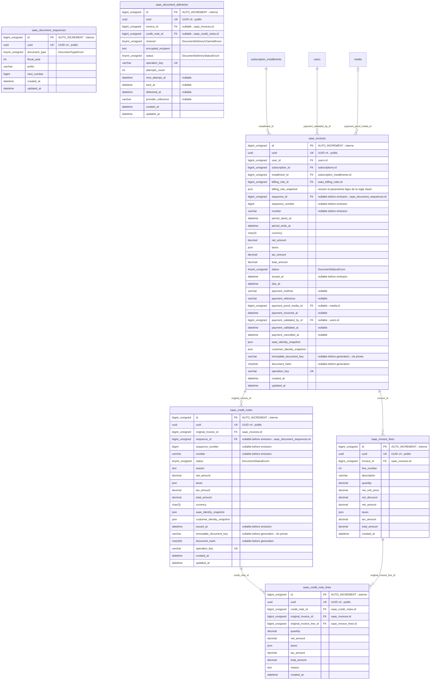
```mermaid
erDiagram
    direction TB
    saas_document_sequences {
        bigint_unsigned id PK "AUTO_INCREMENT ; interne"
        uuid uuid UK "UUID v4 ; public"
        tinyint_unsigned document_type "DocumentTypeEnum"
        int fiscal_year
        varchar prefix
        bigint next_number
        datetime created_at
        datetime updated_at
    }
    saas_invoices {
        bigint_unsigned id PK "AUTO_INCREMENT ; interne"
        uuid uuid UK "UUID v4 ; public"
        bigint_unsigned user_id FK "users.id"
        bigint_unsigned subscription_id FK "subscriptions.id"
        bigint_unsigned installment_id FK "subscription_installments.id"
        bigint_unsigned billing_rule_id FK "saas_billing_rules.id"
        json billing_rule_snapshot "version et parametres figes de la regle SaaS"
        bigint_unsigned sequence_id FK "nullable before emission ; saas_document_sequences.id"
        bigint sequence_number "nullable before emission"
        varchar number "nullable before emission"
        datetime period_starts_at
        datetime period_ends_at
        char(3) currency
        decimal net_amount
        json taxes
        decimal tax_amount
        decimal total_amount
        tinyint_unsigned status "DocumentStatusEnum"
        datetime issued_at "nullable before emission"
        datetime due_at
        varchar payment_method "nullable"
        varchar payment_reference "nullable"
        bigint_unsigned payment_proof_media_id FK "nullable ; media.id"
        datetime payment_received_at "nullable"
        bigint_unsigned payment_validated_by_id FK "nullable ; users.id"
        datetime payment_validated_at "nullable"
        datetime payment_cancelled_at "nullable"
        json saas_identity_snapshot
        json customer_identity_snapshot
        varchar immutable_document_key "nullable before generation ; cle privee"
        char(64) document_hash "nullable before generation"
        varchar operation_key UK
        datetime created_at
        datetime updated_at
    }
    saas_invoice_lines {
        bigint_unsigned id PK "AUTO_INCREMENT ; interne"
        uuid uuid UK "UUID v4 ; public"
        bigint_unsigned invoice_id FK "saas_invoices.id"
        int line_number
        varchar description
        decimal quantity
        decimal net_unit_price
        decimal net_discount
        decimal net_amount
        json taxes
        decimal tax_amount
        decimal total_amount
        datetime created_at
    }
    saas_credit_notes {
        bigint_unsigned id PK "AUTO_INCREMENT ; interne"
        uuid uuid UK "UUID v4 ; public"
        bigint_unsigned original_invoice_id FK "saas_invoices.id"
        bigint_unsigned sequence_id FK "nullable before emission ; saas_document_sequences.id"
        bigint sequence_number "nullable before emission"
        varchar number "nullable before emission"
        tinyint_unsigned status "DocumentStatusEnum"
        text reason
        decimal net_amount
        json taxes
        decimal tax_amount
        decimal total_amount
        char(3) currency
        json saas_identity_snapshot
        json customer_identity_snapshot
        datetime issued_at "nullable before emission"
        varchar immutable_document_key "nullable before generation ; cle privee"
        char(64) document_hash "nullable before generation"
        varchar operation_key UK
        datetime created_at
        datetime updated_at
    }
    saas_credit_note_lines {
        bigint_unsigned id PK "AUTO_INCREMENT ; interne"
        uuid uuid UK "UUID v4 ; public"
        bigint_unsigned credit_note_id FK "saas_credit_notes.id"
        bigint_unsigned original_invoice_id FK "saas_invoices.id"
        bigint_unsigned original_invoice_line_id FK "saas_invoice_lines.id"
        decimal quantity
        decimal net_amount
        json taxes
        decimal tax_amount
        decimal total_amount
        text reason
        datetime created_at
    }
    saas_document_deliveries {
        bigint_unsigned id PK "AUTO_INCREMENT ; interne"
        uuid uuid UK "UUID v4 ; public"
        bigint_unsigned invoice_id FK "nullable ; saas_invoices.id"
        bigint_unsigned credit_note_id FK "nullable ; saas_credit_notes.id"
        tinyint_unsigned channel "DocumentDeliveryChannelEnum"
        text encrypted_recipient
        tinyint_unsigned status "DocumentDeliveryStatusEnum"
        varchar operation_key UK
        int attempts_count
        datetime next_attempt_at "nullable"
        datetime sent_at "nullable"
        datetime delivered_at "nullable"
        varchar provider_reference "nullable"
        datetime created_at
        datetime updated_at
    }
    subscription_installments ||--o{ saas_invoices : installment_id
    users ||--o{ saas_invoices : payment_validated_by_id
    media |o--o{ saas_invoices : payment_proof_media_id
    saas_invoices ||--o{ saas_invoice_lines : invoice_id
    saas_invoices ||--o{ saas_credit_notes : original_invoice_id
    saas_credit_notes ||--o{ saas_credit_note_lines : credit_note_id
    saas_invoice_lines ||--o{ saas_credit_note_lines : original_invoice_line_id
```

#### Explication très simple des champs


**`saas_document_sequences` :**

- **`id`** : le numéro unique qui permet de reconnaître cette ligne dans la base. Deux lignes différentes ne peuvent pas avoir le même `id`.
- **`uuid`** : identifiant public UUID v4 unique et indexé ; routes, API, formulaires et exports utilisent cet identifiant, sans exposer la PK numérique.
- **`document_type`** : indique quel document c’est. Exemple : facture, avoir ou autre type prévu.
- **`fiscal_year`** : l’année ou période de numérotation concernée. Exemple : `2026`.
- **`prefix`** : le début fixe ajouté devant les numéros. Exemple : `FAC` pour les factures.
- **`next_number`** : le prochain nombre disponible dans cette série. Exemple : si le dernier document était 102, le prochain peut être 103.
- **`created_at`** : la date où cette ligne a été créée dans la base.
- **`updated_at`** : la date de la dernière modification de cette ligne. Exemple : si tu modifies l’élément aujourd’hui, cette date devient celle d’aujourd’hui.

**`saas_invoices` :**

- **`id`** : le numéro unique qui permet de reconnaître cette ligne dans la base. Deux lignes différentes ne peuvent pas avoir le même `id`.
- **`uuid`** : identifiant public UUID v4 unique et indexé ; routes, API, formulaires et exports utilisent cet identifiant, sans exposer la PK numérique.
- **`user_id`** : l’identifiant du propriétaire. Il sert à relier cette ligne à la bonne information au lieu de recopier toutes ses données.
- **`subscription_id`** : l’identifiant de l’abonnement. Il sert à relier cette ligne à la bonne information au lieu de recopier toutes ses données.
- **`installment_id`** : l’identifiant de l’échéance à payer. Il sert à relier cette ligne à la bonne information au lieu de recopier toutes ses données.
- **`billing_rule_id`** : la version de règle résolue dans la BDD de ce document ; saas_billing_rules pour le SaaS, billing_rules pour une obligation de boutique.
- **`billing_rule_snapshot`** : version et paramètres exacts de la règle SaaS, figés à l’émission ; ne pas relire une règle modifiée pour expliquer une ancienne facture.
- **`sequence_id`** : l’identifiant du compteur de numérotation. Il sert à relier cette ligne à la bonne information au lieu de recopier toutes ses données. Ce champ peut rester vide quand cette information n’est pas nécessaire ou pas encore connue.
- **`sequence_number`** : le nombre utilisé à l’intérieur de la série du document. Exemple : `123` dans `FAC-2026-000123`. Ce champ peut rester vide quand cette information n’est pas nécessaire ou pas encore connue.
- **`number`** : le numéro lisible de l’élément. Exemple : numéro d’échéance ou de facture selon la table. Ce champ peut rester vide quand cette information n’est pas nécessaire ou pas encore connue.
- **`period_starts_at`** : le début de la période concernée. Exemple : début du mois payé.
- **`period_ends_at`** : la fin de la période concernée. Exemple : fin du mois payé. Peut rester vide lorsque la période n’a pas de fin prévue.
- **`currency`** : la monnaie utilisée. Exemple : `DZD` pour le dinar algérien.
- **`net_amount`** : le montant avant taxes.
- **`taxes`** : plusieurs petits réglages liés à **taxes**, regroupés ensemble de manière structurée.
- **`tax_amount`** : le montant total des taxes.
- **`total_amount`** : le montant final avec les taxes.
- **`status`** : code entier de l’enum propre à cet objet, défini au §3.3 ; les libellés sont traduits à l’affichage et les transitions contrôlées par le service.
- **`issued_at`** : la date officielle d’émission du document. Ce champ peut rester vide quand cette information n’est pas nécessaire ou pas encore connue.
- **`due_at`** : la date utilisée pour **echeance**.
- **`payment_method`** : le moyen de paiement déclaré pour cette facture d’abonnement. Il peut rester vide tant qu’aucun paiement n’a été reçu.
- **`payment_reference`** : la référence du paiement ou du reçu. Elle peut rester vide si aucun identifiant externe n’existe.
- **`payment_proof_media_id`** : la preuve de paiement stockée dans la table centrale `media`, par exemple l’image ou le PDF d’un reçu. Elle peut rester vide avant réception.
- **`payment_received_at`** : la date où le paiement a été reçu ou déclaré reçu.
- **`payment_validated_by_id`** : l’administrateur central qui a vérifié le paiement ; facultatif avant validation.
- **`payment_validated_at`** : la date de validation manuelle du paiement.
- **`payment_cancelled_at`** : la date d’annulation auditée d’une validation de paiement erronée ; elle n’annule pas la facture fiscale ni un transfert bancaire. La preuve initiale et les activités restent conservées. Une correction du montant facturé passe séparément par un avoir.
- **`saas_identity_snapshot`** : une copie figée des informations légales du SaaS au moment de la facture. Si le profil change plus tard, l’ancienne facture garde les anciennes informations.
- **`customer_identity_snapshot`** : une copie figée du nom, téléphone et adresse nécessaires à cette commande. Si le client donne plus tard une autre adresse, l’ancienne commande garde ce qu’elle utilisait.
- **`immutable_document_key`** : indique que le document, une fois officiellement émis, ne doit plus être modifié comme un simple brouillon. Ce champ peut rester vide quand cette information n’est pas nécessaire ou pas encore connue.
- **`document_hash`** : une signature du contenu du document qui permet de vérifier qu’il est resté identique. Ce champ peut rester vide quand cette information n’est pas nécessaire ou pas encore connue.
- **`operation_key`** : une clé unique utilisée pour reconnaître une opération déjà faite. Exemple : si le serveur reçoit deux fois la même demande après une coupure, cette clé aide à éviter de faire l’opération deux fois.
- **`created_at`** : la date où cette ligne a été créée dans la base.
- **`updated_at`** : la date de la dernière modification de cette ligne. Exemple : si tu modifies l’élément aujourd’hui, cette date devient celle d’aujourd’hui.

**`saas_invoice_lines` :**

- **`id`** : le numéro unique qui permet de reconnaître cette ligne dans la base. Deux lignes différentes ne peuvent pas avoir le même `id`.
- **`uuid`** : identifiant public UUID v4 unique et indexé ; routes, API, formulaires et exports utilisent cet identifiant, sans exposer la PK numérique.
- **`invoice_id`** : l’identifiant de la facture. Il sert à relier cette ligne à la bonne information au lieu de recopier toutes ses données.
- **`line_number`** : la position de cette ligne dans le document. Exemple : 1 pour la première ligne, 2 pour la deuxième.
- **`description`** : le nom ou texte qui explique ce qui est facturé sur cette ligne. Exemple : « Abonnement Pro — septembre 2026 ».
- **`quantity`** : le nombre d’éléments concernés. Exemple : `2` signifie deux unités du produit.
- **`net_unit_price`** : le prix correspondant à **unitaire HT**.
- **`net_discount`** : la réduction appliquée avant taxes sur cette ligne.
- **`net_amount`** : le montant avant taxes.
- **`taxes`** : plusieurs petits réglages liés à **taxes**, regroupés ensemble de manière structurée.
- **`tax_amount`** : le montant total des taxes.
- **`total_amount`** : le montant final avec les taxes.
- **`created_at`** : la date où cette ligne a été créée dans la base.

**`saas_credit_notes` :**

- **`id`** : le numéro unique qui permet de reconnaître cette ligne dans la base. Deux lignes différentes ne peuvent pas avoir le même `id`.
- **`uuid`** : identifiant public UUID v4 unique et indexé ; routes, API, formulaires et exports utilisent cet identifiant, sans exposer la PK numérique.
- **`original_invoice_id`** : l’identifiant de la facture d’origine. Il sert à relier cette ligne à la bonne information au lieu de recopier toutes ses données.
- **`sequence_id`** : l’identifiant du compteur de numérotation. Il sert à relier cette ligne à la bonne information au lieu de recopier toutes ses données. Ce champ peut rester vide quand cette information n’est pas nécessaire ou pas encore connue.
- **`sequence_number`** : le nombre utilisé à l’intérieur de la série du document. Exemple : `123` dans `FAC-2026-000123`. Ce champ peut rester vide quand cette information n’est pas nécessaire ou pas encore connue.
- **`number`** : le numéro lisible de l’élément. Exemple : numéro d’échéance ou de facture selon la table. Ce champ peut rester vide quand cette information n’est pas nécessaire ou pas encore connue.
- **`status`** : code entier de l’enum propre à cet objet, défini au §3.3 ; les libellés sont traduits à l’affichage et les transitions contrôlées par le service.
- **`reason`** : explique pourquoi l’action ou la décision a été faite.
- **`net_amount`** : le montant avant taxes.
- **`taxes`** : plusieurs petits réglages liés à **taxes**, regroupés ensemble de manière structurée.
- **`tax_amount`** : le montant total des taxes.
- **`total_amount`** : le montant final avec les taxes.
- **`currency`** : la monnaie utilisée. Exemple : `DZD` pour le dinar algérien.
- **`saas_identity_snapshot`** : une copie figée des informations légales du SaaS au moment de la facture. Si le profil change plus tard, l’ancienne facture garde les anciennes informations.
- **`customer_identity_snapshot`** : une copie figée du nom, téléphone et adresse nécessaires à cette commande. Si le client donne plus tard une autre adresse, l’ancienne commande garde ce qu’elle utilisait.
- **`issued_at`** : la date officielle d’émission du document. Ce champ peut rester vide quand cette information n’est pas nécessaire ou pas encore connue.
- **`immutable_document_key`** : indique que le document, une fois officiellement émis, ne doit plus être modifié comme un simple brouillon. Ce champ peut rester vide quand cette information n’est pas nécessaire ou pas encore connue.
- **`document_hash`** : une signature du contenu du document qui permet de vérifier qu’il est resté identique. Ce champ peut rester vide quand cette information n’est pas nécessaire ou pas encore connue.
- **`operation_key`** : une clé unique utilisée pour reconnaître une opération déjà faite. Exemple : si le serveur reçoit deux fois la même demande après une coupure, cette clé aide à éviter de faire l’opération deux fois.
- **`created_at`** : la date où cette ligne a été créée dans la base.
- **`updated_at`** : la date de la dernière modification de cette ligne. Exemple : si tu modifies l’élément aujourd’hui, cette date devient celle d’aujourd’hui.

**`saas_credit_note_lines` :**

- **`id`** : le numéro unique qui permet de reconnaître cette ligne dans la base. Deux lignes différentes ne peuvent pas avoir le même `id`.
- **`uuid`** : identifiant public UUID v4 unique et indexé ; routes, API, formulaires et exports utilisent cet identifiant, sans exposer la PK numérique.
- **`credit_note_id`** : l’identifiant de l’avoir. Il sert à relier cette ligne à la bonne information au lieu de recopier toutes ses données.
- **`original_invoice_id`** : l’identifiant de la facture d’origine. Il sert à relier cette ligne à la bonne information au lieu de recopier toutes ses données.
- **`original_invoice_line_id`** : l’identifiant de la ligne de facture d’origine. Il sert à relier cette ligne à la bonne information au lieu de recopier toutes ses données.
- **`quantity`** : le nombre d’éléments concernés. Exemple : `2` signifie deux unités du produit.
- **`net_amount`** : le montant avant taxes.
- **`taxes`** : plusieurs petits réglages liés à **taxes**, regroupés ensemble de manière structurée.
- **`tax_amount`** : le montant total des taxes.
- **`total_amount`** : le montant final avec les taxes.
- **`reason`** : explique pourquoi l’action ou la décision a été faite.
- **`created_at`** : la date où cette ligne a été créée dans la base.

**`saas_document_deliveries` :**

- **`id`** : le numéro unique qui permet de reconnaître cette ligne dans la base. Deux lignes différentes ne peuvent pas avoir le même `id`.
- **`uuid`** : identifiant public UUID v4 unique et indexé ; routes, API, formulaires et exports utilisent cet identifiant, sans exposer la PK numérique.
- **`invoice_id`** : l’identifiant de la facture. Il sert à relier cette ligne à la bonne information au lieu de recopier toutes ses données. Ce champ peut rester vide quand cette information n’est pas nécessaire ou pas encore connue.
- **`credit_note_id`** : l’identifiant de l’avoir. Il sert à relier cette ligne à la bonne information au lieu de recopier toutes ses données. Ce champ peut rester vide quand cette information n’est pas nécessaire ou pas encore connue.
- **`channel`** : code de `DocumentDeliveryChannelEnum` : `EMAIL`, `SMS_LINK`, `WHATSAPP_LINK` ou `DOCUMENTED_HANDOFF`.
- **`encrypted_recipient`** : les coordonnées du destinataire enregistrées de manière protégée lorsqu’elles doivent être conservées.
- **`status`** : code entier de l’enum propre à cet objet, défini au §3.3 ; les libellés sont traduits à l’affichage et les transitions contrôlées par le service.
- **`operation_key`** : une clé unique utilisée pour reconnaître une opération déjà faite. Exemple : si le serveur reçoit deux fois la même demande après une coupure, cette clé aide à éviter de faire l’opération deux fois.
- **`attempts_count`** : le nombre de **tentatives**. Exemple : `3` signifie qu’il y en a trois.
- **`next_attempt_at`** : la date prévue pour retenter l’opération après un échec récupérable. Ce champ peut rester vide quand cette information n’est pas nécessaire ou pas encore connue.
- **`sent_at`** : la date où l’envoi a été effectué. Ce champ peut rester vide quand cette information n’est pas nécessaire ou pas encore connue.
- **`delivered_at`** : la date où la réception ou livraison du message a été confirmée quand cette information existe. Ce champ peut rester vide quand cette information n’est pas nécessaire ou pas encore connue.
- **`provider_reference`** : le numéro de facture, reçu ou référence donné par le fournisseur. Ce champ peut rester vide quand cette information n’est pas nécessaire ou pas encore connue.
- **`created_at`** : la date où cette ligne a été créée dans la base.
- **`updated_at`** : la date de la dernière modification de cette ligne. Exemple : si tu modifies l’élément aujourd’hui, cette date devient celle d’aujourd’hui.


- **Factures :** UNIQUE(number) hors NULL, UNIQUE(sequence_id,sequence_number), UNIQUE(operation_key). `status=1 DRAFT | 2 ISSUED | 3 CANCELLED | 4 PREPARING` (`DocumentStatusEnum` ; PREPARING correspond à la génération de la pièce sur une clé stable). La période est [debut,fin), fin>debut ; montants>=0, HT+taxes=TTC et égalité aux sommes de lignes. DZD au MVP. Contrôler structure et somme du JSON taxes. FK(subscription_id,user_id) → subscriptions(id,user_id), clé parent UNIQUE ; FK(installment_id,subscription_id) → subscription_installments(id,subscription_id), clé parent UNIQUE. Le fait générateur durable déclenche obligatoirement une facture par échéance/occurrence validée avec une clé stable ; aucun doublon au retry. L’échéance conserve son sens de dette ; la facture et la vérification manuelle de son paiement sont réunies dans `saas_invoices`, tandis que les rectifications fiscales passent par avoir. Une correction du dû après facture/avoir doit être rapprochée, jamais changée silencieusement pour correspondre au paiement. Aucun remboursement SaaS automatique n’est inféré d’un avoir. **Décision AUD-16 : le SaaS n’exécute ni ne suit comme trésorerie interne les remboursements réels d’abonnement.** Les paiements sont validés manuellement sur reçu/preuve ; une résiliation normale laisse la période déjà payée active jusqu’à son terme, puis empêche le renouvellement payant. Un remboursement exceptionnel, s’il est décidé, reste une procédure manuelle externe à l’application et ne crée donc pas de table `decaissements_saas` dans le périmètre actuel. Un avoir reste un document de correction et non une preuve que de l’argent a été remis. Ne pas utiliser une contrepassation de paiement pour prétendre que le paiement initial n’a jamais eu lieu. Si le produit commence un jour à exécuter ou suivre ces remboursements réels, un journal de décaissements dédié deviendra obligatoire.
- **Lignes :** UNIQUE(invoice_id,line_number), UNIQUE(id,invoice_id), quantité>0, prix/remise/base/taxes/TTC>=0. Version du plan, période et nature de l’option incluses dans la désignation/snapshot document ; aucun recalcul historique depuis le plan courant. Émission seulement avec au moins une ligne et identité légale du SaaS et du client complètes.
- **Avoirs :** origine obligatoire, facture émise de même devise ; montants positifs exprimant la réduction, pas un règlement. UNIQUE(number), UNIQUE(sequence_id,sequence_number), UNIQUE(id,original_invoice_id). FK(credit_note_id,original_invoice_id) → saas_credit_notes(id,original_invoice_id) et FK(original_invoice_line_id,original_invoice_id) → saas_invoice_lines(id,invoice_id). UNIQUE(credit_note_id,original_invoice_line_id). Sous verrou facture puis lignes, les avoirs émis et brouillons réservés ne dépassent ni quantités ni HT/taxes/TTC facturés ; annuler un brouillon libère sa réserve. Période, propriétaire et abonnement sont obtenus depuis la facture d’origine ; ne pas maintenir des copies modifiables concurrentes.
- **Numérotation et immutabilité SaaS :** UNIQUE(document_type,fiscal_year), document_type=1 INVOICE ou 2 CREDIT_NOTE, next_number>0 ; allocation sous verrou, jamais MAX+1. Contrôler le type de séquence et réserver une fois numéro, snapshots et operation_key dans la transaction centrale avec status=4 PREPARING. Produire le PDF privé sur une clé stable liée au UUID du document, puis vérifier son empreinte. Dans une transaction centrale courte, figer immutable_document_key/document_hash, passer à status=2 ISSUED et créer la transmission durable. Un échec de génération reprend le même UUID/numéro ; aucune émission ni transmission avant existence de la pièce vérifiée. Contenu fiscal, identité, numéro, lignes et fichier des factures/avoirs émis immuables ; correction fiscale par nouveau document lié. Les champs de vérification du paiement de saas_invoices suivent séparément le service manuel contrôlé et audité, sans modifier la pièce émise. Un numéro réservé n’est jamais réutilisé, même si la préparation est annulée. Les factures SaaS utilisent uniquement leur BDD, leurs séquences et leur émetteur SaaS.
- **Transmission :** exactement une FK facture/avoir non NULL ; même protocole durable que T19, créé à l’émission, reprise avec clé stable, `status=1 PENDING | 2 RUNNING | 3 SENT | 4 DELIVERED | 5 RETRYABLE_FAILURE | 6 PERMANENT_FAILURE | 7 UNCERTAIN | 8 CANCELLED` (`DocumentDeliveryStatusEnum`). PDF ou lien accessible après autorisation ; un portail consultable seul ne prouve pas l’envoi. Les flux SaaS ne sont jamais additionnés aux recettes des boutiques.

**Validation du paiement SaaS :** payment_method, payment_reference, payment_proof_media_id, payment_received_at, payment_validated_by_id, payment_validated_at et payment_cancelled_at décrivent la vérification manuelle, séparément de DocumentStatusEnum. Valider exige une preuve centrale privée, le vérificateur habilité et des dates cohérentes ; annuler exige une validation existante et un motif dans activity_log, avec ancienne preuve et anciens faits préservés. Verrouiller propriétaire, abonnement, échéance et facture dans l’ordre commun avant de recalculer les droits/périodes. Un retry reconnu ne valide ni n’annule deux fois ; une validation annulée ne compte plus comme paiement validé courant. Ces opérations ne changent ni HT/taxes/TTC, ni numéro, ni snapshots, ni PDF d’une facture émise et ne prétendent jamais rembourser l’argent. Les corrections fiscales et les événements de paiement sont distincts.

### C10 — Règles de facturation propres au SaaS

**saas_billing_rules** concerne uniquement les factures du SaaS adressées au propriétaire pour ses abonnements/options. Les règles des ventes de produits de chaque boutique sont dans sa propre table billing_rules (T26) ; elles ne sont ni administrées ni copiées dans cette table centrale. Cette distinction conserve la règle d’émission de saas_invoices sans ramener la facturation boutique au central.

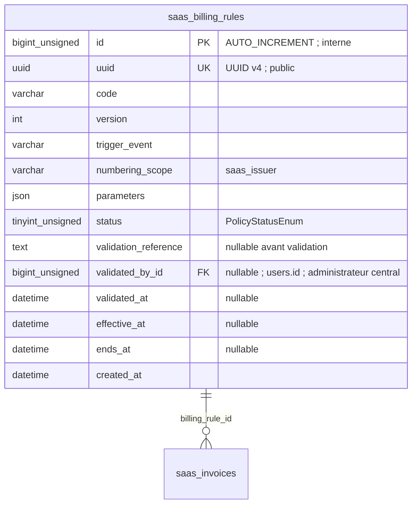
```mermaid
erDiagram
    direction TB
    saas_billing_rules {
        bigint_unsigned id PK "AUTO_INCREMENT ; interne"
        uuid uuid UK "UUID v4 ; public"
        varchar code
        int version
        varchar trigger_event
        varchar numbering_scope "saas_issuer"
        json parameters
        tinyint_unsigned status "PolicyStatusEnum"
        text validation_reference "nullable avant validation"
        bigint_unsigned validated_by_id FK "nullable ; users.id ; administrateur central"
        datetime validated_at "nullable"
        datetime effective_at "nullable"
        datetime ends_at "nullable"
        datetime created_at
    }
    saas_billing_rules ||--o{ saas_invoices : billing_rule_id
```

UNIQUE(code,version). status=1 DRAFT, 2 VALIDATED, 3 ACTIVE ou 4 RETIRED. Une version validée/utilisée est immuable ; retirer une version ferme son usage futur par une transition auditée sans changer les paramètres historiques. Les périodes effectives [effective_at,ends_at) ne se chevauchent pas pour le même code, sous verrou de la version 1 du même code dans saas_billing_rules, conservée comme ligne stable. Initialiser cette ligne avant activation ; gérer la collision UNIQUE d’une création concurrente puis relire sous verrou. Toutes les activations/fermetures du même code utilisent ce verrou et une lecture courante. Une activation exige validated_by_id, validated_at, validation_reference et des paramètres complets, avec événement et implémentation serveur autorisés. L’émetteur est celui du SaaS : aucune FK propriétaire vendeur ni scope tenant. Une facture conserve la FK vers sa version et un billing_rule_snapshot exact. Une occurrence d’échéance retrouve la même facture par operation_key ; une tâche de rapprochement détecte les échéances/faits générateurs sans facture. Aucun e-mail, téléphone ou document boutique n’est recopié dans la règle. Le fait générateur et les règles fiscales restent à faire valider avant activation.

Les opérations sur les données centrales et les décisions d’abonnement sont désormais enregistrées dans activity_log C6/§7.7. Le registre décrivant les traitements de boutique est local en T26 ; les événements sensibles effectivement réalisés dans une boutique restent locaux.

### C11 — Fichiers centraux et relations polymorphes

Une table `media` centrale sert aux reçus d’abonnement, pièces SaaS et contenus de plateforme. Elle ne contient aucun fichier privé d’une boutique. Le schéma est identique à celui de T2 ; model_id et created_by_id appartiennent ici au central.

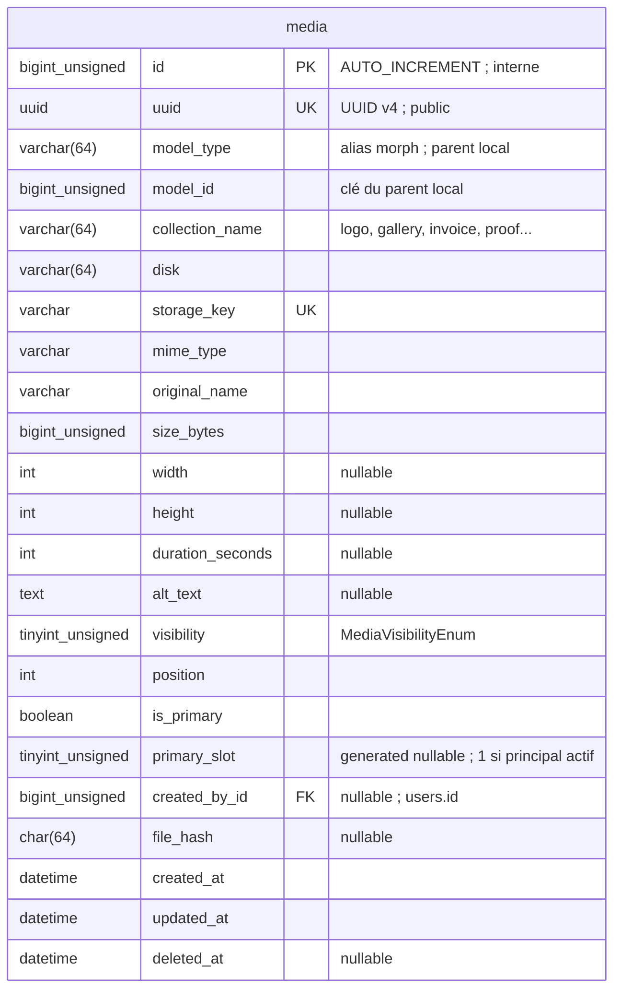
```mermaid
erDiagram
    direction TB
    media {
        bigint_unsigned id PK "AUTO_INCREMENT ; interne"
        uuid uuid UK "UUID v4 ; public"
        varchar(64) model_type "alias morph ; parent local"
        bigint_unsigned model_id "clé du parent local"
        varchar(64) collection_name "logo, gallery, invoice, proof..."
        varchar(64) disk
        varchar storage_key UK
        varchar mime_type
        varchar original_name
        bigint_unsigned size_bytes
        int width "nullable"
        int height "nullable"
        int duration_seconds "nullable"
        text alt_text "nullable"
        tinyint_unsigned visibility "MediaVisibilityEnum"
        int position
        boolean is_primary
        tinyint_unsigned primary_slot "generated nullable ; 1 si principal actif"
        bigint_unsigned created_by_id FK "nullable ; users.id"
        char(64) file_hash "nullable"
        datetime created_at
        datetime updated_at
        datetime deleted_at "nullable"
    }

```

Tous les champs ont le sens défini en T2 et au §7.6, avec chemins `central/public/...` ou `central/private/...`. Les anciens champs proof_storage_key et immutable_document_key désignent encore une clé de stockage immuable lorsqu’une preuve métier exige cette valeur ; ils ne constituent pas une seconde bibliothèque de fichiers. Un reçu ou document peut avoir un média rattaché par morph sans modifier son identité documentaire ou sa politique de conservation.

## 5. BDD de chaque boutique : `tenant_<uuid>`

Ce même modèle est migré dans chaque BDD tenant. Aucun `tenant_id` n’est ajouté à toutes les lignes : le contexte de connexion assure déjà la séparation. La ligne unique `shop` conserve la référence de rattachement.

### T1 — Profil public

**`shop` — La fiche publique de la boutique : son nom affiché, son logo, ses contacts et sa présentation. Exemple : les informations que les visiteurs voient sur le site de Karim.**

**`shop_addresses` — Les adresses publiques de la boutique et leur emplacement sur une carte. Exemple : une adresse pour le magasin et une autre pour un point de retrait. Cela n’ajoute pas une caisse de magasin.**

**`social_links` — Les liens vers les pages de la boutique sur les réseaux sociaux. Exemple : son compte Instagram et deux pages Facebook différentes.**

**`content_pages` — Le contenu des pages d’information du site. Exemple : Karim écrit le texte de « À propos », de « Contact » ou de sa politique de retour.**

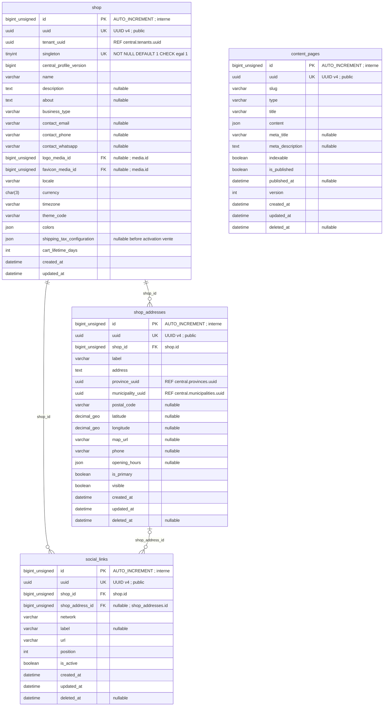
```mermaid
erDiagram
    direction TB
    shop {
        bigint_unsigned id PK "AUTO_INCREMENT ; interne"
        uuid uuid UK "UUID v4 ; public"
        uuid tenant_uuid "REF central.tenants.uuid"
        tinyint singleton UK "NOT NULL DEFAULT 1 CHECK egal 1"
        bigint central_profile_version
        varchar name
        text description "nullable"
        text about "nullable"
        varchar business_type
        varchar contact_email "nullable"
        varchar contact_phone "nullable"
        varchar contact_whatsapp "nullable"
        bigint_unsigned logo_media_id FK "nullable ; media.id"
        bigint_unsigned favicon_media_id FK "nullable ; media.id"
        varchar locale
        char(3) currency
        varchar timezone
        varchar theme_code
        json colors
        json shipping_tax_configuration "nullable before activation vente"
        int cart_lifetime_days
        datetime created_at
        datetime updated_at
    }
    shop_addresses {
        bigint_unsigned id PK "AUTO_INCREMENT ; interne"
        uuid uuid UK "UUID v4 ; public"
        bigint_unsigned shop_id FK "shop.id"
        varchar label
        text address
        uuid province_uuid "REF central.provinces.uuid"
        uuid municipality_uuid "REF central.municipalities.uuid"
        varchar postal_code "nullable"
        decimal_geo latitude "nullable"
        decimal_geo longitude "nullable"
        varchar map_url "nullable"
        varchar phone "nullable"
        json opening_hours "nullable"
        boolean is_primary
        boolean visible
        datetime created_at
        datetime updated_at
        datetime deleted_at "nullable"
    }
    social_links {
        bigint_unsigned id PK "AUTO_INCREMENT ; interne"
        uuid uuid UK "UUID v4 ; public"
        bigint_unsigned shop_id FK "shop.id"
        bigint_unsigned shop_address_id FK "nullable ; shop_addresses.id"
        varchar network
        varchar label "nullable"
        varchar url
        int position
        boolean is_active
        datetime created_at
        datetime updated_at
        datetime deleted_at "nullable"
    }
    content_pages {
        bigint_unsigned id PK "AUTO_INCREMENT ; interne"
        uuid uuid UK "UUID v4 ; public"
        varchar slug
        varchar type
        varchar title
        json content
        varchar meta_title "nullable"
        text meta_description "nullable"
        boolean indexable
        boolean is_published
        datetime published_at "nullable"
        int version
        datetime created_at
        datetime updated_at
        datetime deleted_at "nullable"
    }
    shop ||--o{ shop_addresses : shop_id
    shop ||--o{ social_links : shop_id
    shop_addresses |o--o{ social_links : shop_address_id
```

#### Explication très simple des champs

**`shop` :**

- **`id`** : le numéro unique qui permet de reconnaître cette ligne dans la base. Deux lignes différentes ne peuvent pas avoir le même `id`.
- **`uuid`** : identifiant public UUID v4 unique et indexé ; routes, API, formulaires et exports utilisent cet identifiant, sans exposer la PK numérique.
- **`tenant_uuid`** : l’identifiant de la boutique. Il sert à relier cette ligne à la bonne information au lieu de recopier toutes ses données.
- **`singleton`** : un petit verrou technique qui garantit qu’il n’existe qu’une seule ligne de ce type dans la base. Exemple : une seule fiche `shop`.
- **`central_profile_version`** : la dernière version du profil central que cette boutique a reçue. Cela permet de voir si elle est à jour.
- **`name`** : le nom affiché à l’utilisateur. Exemple : « Nombre de boutiques » ou « Livraison EcoTrack ».
- **`description`** : un texte qui explique l’élément plus en détail. Il peut rester vide si aucune explication supplémentaire n’est nécessaire.
- **`about`** : le texte de présentation de la boutique. Exemple : son histoire ou ce qu’elle vend. Ce champ peut rester vide quand cette information n’est pas nécessaire ou pas encore connue.
- **`business_type`** : le type d’activité de la boutique. Exemple : vêtements, restaurant ou salon.
- **`contact_email`** : l’email public que les visiteurs peuvent utiliser pour contacter la boutique. Ce champ peut rester vide quand cette information n’est pas nécessaire ou pas encore connue.
- **`contact_phone`** : le téléphone public de la boutique. Ce champ peut rester vide quand cette information n’est pas nécessaire ou pas encore connue.
- **`contact_whatsapp`** : le numéro WhatsApp public de la boutique. Ce champ peut rester vide quand cette information n’est pas nécessaire ou pas encore connue.
- **`logo_media_id`** : le fichier utilisé comme logo de la boutique. Ce champ peut rester vide quand cette information n’est pas nécessaire ou pas encore connue.
- **`favicon_media_id`** : la petite image affichée dans l’onglet du navigateur. Ce champ peut rester vide quand cette information n’est pas nécessaire ou pas encore connue.
- **`locale`** : la langue préférée pour l’affichage. Exemple : `fr` ou `ar`.
- **`currency`** : la monnaie utilisée. Exemple : `DZD` pour le dinar algérien.
- **`timezone`** : la zone utilisée pour afficher les dates et heures. Exemple : `Africa/Algiers`.
- **`theme_code`** : le modèle visuel choisi pour le site. Exemple : `standard`.
- **`colors`** : les couleurs choisies pour le site, enregistrées ensemble. Exemple : couleur principale et couleur des boutons.
- **`shipping_tax_configuration`** : les réglages qui expliquent comment les frais de livraison doivent être traités dans les calculs fiscaux. Ils doivent être validés avant la vente réelle. Ce champ peut rester vide quand cette information n’est pas nécessaire ou pas encore connue.
- **`cart_lifetime_days`** : le nombre de jours pendant lesquels un panier invité peut rester conservé avant d’expirer.
- **`created_at`** : la date où cette ligne a été créée dans la base.
- **`updated_at`** : la date de la dernière modification de cette ligne. Exemple : si tu modifies l’élément aujourd’hui, cette date devient celle d’aujourd’hui.

**`shop_addresses` :**

- **`id`** : le numéro unique qui permet de reconnaître cette ligne dans la base. Deux lignes différentes ne peuvent pas avoir le même `id`.
- **`uuid`** : identifiant public UUID v4 unique et indexé ; routes, API, formulaires et exports utilisent cet identifiant, sans exposer la PK numérique.
- **`shop_id`** : l’identifiant de la fiche de la boutique. Il sert à relier cette ligne à la bonne information au lieu de recopier toutes ses données.
- **`label`** : un nom court utilisé pour reconnaître facilement l’élément à l’écran.
- **`address`** : l’adresse écrite. Exemple : rue, cité ou quartier.
- **`province_uuid`** : l’identifiant de la wilaya. Il sert à relier cette ligne à la bonne information au lieu de recopier toutes ses données.
- **`municipality_uuid`** : l’identifiant de la commune. Il sert à relier cette ligne à la bonne information au lieu de recopier toutes ses données.
- **`postal_code`** : le code postal lorsqu’il est connu. Ce champ peut rester vide quand cette information n’est pas nécessaire ou pas encore connue.
- **`latitude`** : la position nord/sud utilisée pour placer l’adresse sur une carte. Ce champ peut rester vide quand cette information n’est pas nécessaire ou pas encore connue.
- **`longitude`** : la position est/ouest utilisée pour placer l’adresse sur une carte. Ce champ peut rester vide quand cette information n’est pas nécessaire ou pas encore connue.
- **`map_url`** : un lien vers la position sur une carte. Ce champ peut rester vide quand cette information n’est pas nécessaire ou pas encore connue.
- **`phone`** : le numéro de téléphone. Il est gardé comme texte pour ne pas perdre le `0`, le `+213` ou d’autres signes utiles. Ce champ peut rester vide quand cette information n’est pas nécessaire ou pas encore connue.
- **`opening_hours`** : les heures d’ouverture regroupées par jour. Exemple : samedi 09:00–18:00. Ce champ peut rester vide quand cette information n’est pas nécessaire ou pas encore connue.
- **`is_primary`** : indique si cette ligne est la principale parmi plusieurs choix.
- **`visible`** : indique si les visiteurs peuvent voir l’élément sur le site.
- **`created_at`** : la date où cette ligne a été créée dans la base.
- **`updated_at`** : la date de la dernière modification de cette ligne. Exemple : si tu modifies l’élément aujourd’hui, cette date devient celle d’aujourd’hui.
- **`deleted_at`** : la date où l’élément a été retiré sans effacer son ancienne ligne. Si ce champ est vide, l’élément n’est pas supprimé.

**`social_links` :**

- **`id`** : le numéro unique qui permet de reconnaître cette ligne dans la base. Deux lignes différentes ne peuvent pas avoir le même `id`.
- **`uuid`** : identifiant public UUID v4 unique et indexé ; routes, API, formulaires et exports utilisent cet identifiant, sans exposer la PK numérique.
- **`shop_id`** : l’identifiant de la fiche de la boutique. Il sert à relier cette ligne à la bonne information au lieu de recopier toutes ses données.
- **`shop_address_id`** : l’identifiant de l’adresse de la boutique. Il sert à relier cette ligne à la bonne information au lieu de recopier toutes ses données. Ce champ peut rester vide quand cette information n’est pas nécessaire ou pas encore connue.
- **`network`** : le réseau social concerné. Exemple : Instagram, Facebook ou TikTok.
- **`label`** : un nom court utilisé pour reconnaître facilement l’élément à l’écran. Ce champ peut rester vide quand cette information n’est pas nécessaire ou pas encore connue.
- **`url`** : le lien web à ouvrir.
- **`position`** : l’ordre d’affichage. Exemple : 1 apparaît avant 2.
- **`is_active`** : indique si l’élément peut encore être utilisé. `true` = oui, `false` = non.
- **`created_at`** : la date où cette ligne a été créée dans la base.
- **`updated_at`** : la date de la dernière modification de cette ligne. Exemple : si tu modifies l’élément aujourd’hui, cette date devient celle d’aujourd’hui.
- **`deleted_at`** : la date où l’élément a été retiré sans effacer son ancienne ligne. Si ce champ est vide, l’élément n’est pas supprimé.

**`content_pages` :**

- **`id`** : le numéro unique qui permet de reconnaître cette ligne dans la base. Deux lignes différentes ne peuvent pas avoir le même `id`.
- **`uuid`** : identifiant public UUID v4 unique et indexé ; routes, API, formulaires et exports utilisent cet identifiant, sans exposer la PK numérique.
- **`slug`** : la partie simple de l’adresse web. Exemple : `a-propos` dans `/a-propos`.
- **`type`** : type fonctionnel de page, conservé en texte car il est extensible. Exemples : `about`, `contact`, `faq`, `returns` ou un nouveau type ajouté par le template sans migration de BDD.
- **`title`** : le titre affiché à l’utilisateur.
- **`content`** : le texte ou contenu principal de la page.
- **`meta_title`** : le titre prévu pour les moteurs de recherche et le partage web. Ce champ peut rester vide quand cette information n’est pas nécessaire ou pas encore connue.
- **`meta_description`** : la petite description prévue pour les moteurs de recherche. Ce champ peut rester vide quand cette information n’est pas nécessaire ou pas encore connue.
- **`indexable`** : indique si les moteurs de recherche sont autorisés à indexer cette page.
- **`is_published`** : indique si l’élément est publié et donc prêt à être montré.
- **`published_at`** : la date et l’heure liées à **publiee**. Elle permet de savoir exactement quand cette étape a eu lieu. Ce champ peut rester vide quand cette information n’est pas nécessaire ou pas encore connue.
- **`version`** : le numéro de version de cet élément. Exemple : version 1, puis version 2 après une évolution ; l’ancienne version peut rester conservée pour comprendre l’historique.
- **`created_at`** : la date où cette ligne a été créée dans la base.
- **`updated_at`** : la date de la dernière modification de cette ligne. Exemple : si tu modifies l’élément aujourd’hui, cette date devient celle d’aujourd’hui.
- **`deleted_at`** : la date où l’élément a été retiré sans effacer son ancienne ligne. Si ce champ est vide, l’élément n’est pas supprimé.


Les références vers un autre module sont indiquées sur les champs, même si leur flèche n’est pas redessinée ici.

- **`shop` :** Il doit exister une seule ligne `shop` dans la BDD de la boutique. Le champ technique `singleton=1` avec `UNIQUE(singleton)` empêche d’en créer une deuxième, même avec un autre `tenant_uuid`. Le provisionnement doit créer cette ligne et un contrôle de santé vérifie qu’elle existe bien. `tenant_uuid` doit correspondre au `central.tenants.uuid` attendu et ne change plus après l’insertion. L’application refuse de supprimer ce profil. Par défaut, la devise est DZD, le fuseau est `Africa/Algiers` et le thème est le template initial. `name` est une copie du nom central `tenants.shop_name` : pour renommer une boutique, on change d’abord le nom au central, puis on réplique la nouvelle version ici. On ne permet jamais un renommage uniquement local. Si la projection locale échoue, le nom courant reste celui du central et la projection sera reprise ; seul le slug/domaine est réservé de manière unique. Le logo, les contacts et les couleurs restent propres à cette BDD boutique. Au MVP, après la première commande, la devise ne peut plus être changée.

- **`shop_addresses` :** Une boutique peut avoir plusieurs adresses, mais une seule adresse principale active. Si une commune est indiquée, elle doit appartenir à la wilaya choisie. Les horaires sont stockés dans un JSON simple organisé par jour et limité à des informations publiques. Cette table décrit des adresses publiques ; elle ne crée pas plusieurs stocks ou entrepôts.

- **`social_links` :** Une boutique peut avoir plusieurs liens du même réseau. Exemple : deux pages Facebook sont autorisées, donc on ne met pas `UNIQUE(network)`. Cette table contient seulement des liens publics ; elle ne stocke aucun token permettant de publier sur les réseaux et ne gère pas de calendrier marketing.

- **`content_pages` :** Chaque `slug` est unique dans la boutique. Le contenu JSON doit suivre les blocs autorisés par le template du site ; le commerçant ne peut pas y mettre du code arbitraire. Des éléments comme FAQ, menu, header, footer, « À propos » ou textes institutionnels peuvent être représentés par ces blocs au lieu de créer une table séparée pour chacun.

### T2 — Catalogue principal

**`media` — Les informations permettant de retrouver les fichiers de la boutique : images, vidéos, logos ou documents. Exemple : l’emplacement et le type de la photo d’un produit ; le fichier lui-même est stocké séparément.**

**`categories` — Les familles de produits et leurs sous-familles. Exemple : « Vêtements » contient « T-shirts ». Une seule table permet d’organiser les deux niveaux.**

**`products` — La présentation commune d’un produit : son nom, sa description et les informations partagées par ses versions. Exemple : le modèle « T-shirt coton », proposé ensuite en plusieurs tailles et couleurs.**

**`product_variants` — Les versions précises que l’on peut acheter, avec leur prix et leur stock. Exemple : « T-shirt rouge, taille M ». Un produit sans choix possède aussi une variante standard.**


```mermaid
erDiagram
    direction TB
    media {
        bigint_unsigned id PK "AUTO_INCREMENT ; interne"
        uuid uuid UK "UUID v4 ; public"
        varchar(64) model_type "alias morph ; parent local"
        bigint_unsigned model_id "clé du parent local"
        varchar(64) collection_name "logo, gallery, invoice, proof..."
        varchar(64) disk
        varchar storage_key UK
        varchar mime_type
        varchar original_name
        bigint_unsigned size_bytes
        int width "nullable"
        int height "nullable"
        int duration_seconds "nullable"
        text alt_text "nullable"
        tinyint_unsigned visibility "MediaVisibilityEnum"
        int position
        boolean is_primary
        tinyint_unsigned primary_slot "generated nullable ; 1 si principal actif"
        bigint_unsigned created_by_id FK "nullable ; users.id"
        char(64) file_hash "nullable"
        datetime created_at
        datetime updated_at
        datetime deleted_at "nullable"
    }
    categories {
        bigint_unsigned id PK "AUTO_INCREMENT ; interne"
        uuid uuid UK "UUID v4 ; public"
        bigint_unsigned parent_id FK "nullable ; categories.id"
        varchar name
        varchar slug
        text description "nullable"
        bigint_unsigned media_id FK "nullable ; media.id"
        int position
        boolean is_active
        varchar meta_title "nullable"
        text meta_description "nullable"
        datetime created_at
        datetime updated_at
        datetime deleted_at "nullable"
    }
    products {
        bigint_unsigned id PK "AUTO_INCREMENT ; interne"
        uuid uuid UK "UUID v4 ; public"
        bigint_unsigned category_id FK "nullable ; categories.id"
        varchar name
        varchar slug
        text short_description "nullable"
        text description "nullable"
        json benefits "nullable"
        json faq "nullable"
        varchar brand "nullable"
        tinyint_unsigned type "ProductTypeEnum"
        boolean allows_customization
        text customization_instructions "nullable"
        varchar sale_unit
        decimal content_quantity "nullable"
        varchar content_unit "nullable"
        tinyint_unsigned status "PublicationStatusEnum"
        datetime published_at "nullable"
        boolean is_featured
        varchar meta_title "nullable"
        text meta_description "nullable"
        boolean indexable
        datetime created_at
        datetime updated_at
        datetime deleted_at "nullable"
    }
    product_variants {
        bigint_unsigned id PK "AUTO_INCREMENT ; interne"
        uuid uuid UK "UUID v4 ; public"
        bigint_unsigned product_id FK "products.id"
        varchar label
        varchar sku
        varchar barcode "nullable"
        varchar combination_signature
        datetime used_at "nullable ; identité physique figée après première utilisation"
        decimal sale_price
        decimal unit_cost
        decimal previous_price "nullable"
        json tax_configuration "nullable before mise en vente"
        int physical_stock
        int reserved_stock
        int quarantine_stock
        int low_stock_threshold
        decimal weight_kg "nullable"
        decimal length_cm "nullable"
        decimal width_cm "nullable"
        decimal height_cm "nullable"
        boolean is_active
        int position
        datetime created_at
        datetime updated_at
        datetime deleted_at "nullable"
    }
    categories |o--o{ categories : parent_id
    media |o--o{ categories : media_id
    categories |o--o{ products : category_id
    products ||--o{ product_variants : product_id
```

#### Explication très simple des champs

**`media` :**

- **`id`** : clé primaire numérique interne, auto-incrémentée ; jamais envoyée au client.
- **`uuid`** : identifiant public unique et indexé, utilisé dans les routes, formulaires, exports et ressources JSON.
- **`model_type / model_id`** : parent polymorphe dans cette même BDD ; morphTo et morphMany.
- **`collection_name / position / is_primary`** : usage (gallery, logo, invoice, proof...) et ordre d’affichage.
- **`disk / storage_key / visibility`** : disque, clé unique et visibilité publique/privée, avec isolation physique par tenant.
- **`mime_type / original_name / size_bytes`** : type contrôlé, nom original et taille du fichier.
- **`width / height / duration_seconds / alt_text`** : métadonnées utiles et accessibilité, facultatives selon le fichier.
- **`created_by_id / file_hash`** : auteur local facultatif et empreinte de contrôle.
- **`created_at / updated_at / deleted_at`** : cycle du média ; un retrait logique n’efface pas une preuve requise.

**`categories` :**

- **`id`** : le numéro unique qui permet de reconnaître cette ligne dans la base. Deux lignes différentes ne peuvent pas avoir le même `id`.
- **`uuid`** : identifiant public UUID v4 unique et indexé ; routes, API, formulaires et exports utilisent cet identifiant, sans exposer la PK numérique.
- **`parent_id`** : l’élément parent. Exemple : une sous-catégorie « Chaussures » peut avoir « Mode » comme catégorie parent. Ce champ peut rester vide quand cette information n’est pas nécessaire ou pas encore connue.
- **`name`** : le nom affiché à l’utilisateur. Exemple : « Nombre de boutiques » ou « Livraison EcoTrack ».
- **`slug`** : la partie simple de l’adresse web. Exemple : `a-propos` dans `/a-propos`.
- **`description`** : un texte qui explique l’élément plus en détail. Il peut rester vide si aucune explication supplémentaire n’est nécessaire.
- **`media_id`** : l’identifiant du fichier/image/vidéo. Il sert à relier cette ligne à la bonne information au lieu de recopier toutes ses données. Ce champ peut rester vide quand cette information n’est pas nécessaire ou pas encore connue.
- **`position`** : l’ordre d’affichage. Exemple : 1 apparaît avant 2.
- **`is_active`** : indique si cette possibilité est autorisée. `true` = oui, `false` = non.
- **`meta_title`** : le titre prévu pour les moteurs de recherche et le partage web. Ce champ peut rester vide quand cette information n’est pas nécessaire ou pas encore connue.
- **`meta_description`** : la petite description prévue pour les moteurs de recherche. Ce champ peut rester vide quand cette information n’est pas nécessaire ou pas encore connue.
- **`created_at`** : la date où cette ligne a été créée dans la base.
- **`updated_at`** : la date de la dernière modification de cette ligne. Exemple : si tu modifies l’élément aujourd’hui, cette date devient celle d’aujourd’hui.
- **`deleted_at`** : la date où l’élément a été retiré sans effacer son ancienne ligne. Si ce champ est vide, l’élément n’est pas supprimé.

**`products` :**

- **`id`** : le numéro unique qui permet de reconnaître cette ligne dans la base. Deux lignes différentes ne peuvent pas avoir le même `id`.
- **`uuid`** : identifiant public UUID v4 unique et indexé ; routes, API, formulaires et exports utilisent cet identifiant, sans exposer la PK numérique.
- **`category_id`** : l’identifiant de la catégorie. Il sert à relier cette ligne à la bonne information au lieu de recopier toutes ses données. Ce champ peut rester vide quand cette information n’est pas nécessaire ou pas encore connue.
- **`name`** : le nom affiché à l’utilisateur. Exemple : « Nombre de boutiques » ou « Livraison EcoTrack ».
- **`slug`** : la partie simple de l’adresse web. Exemple : `a-propos` dans `/a-propos`.
- **`short_description`** : une petite description affichée rapidement, plus courte que la description complète. Ce champ peut rester vide quand cette information n’est pas nécessaire ou pas encore connue.
- **`description`** : un texte qui explique l’élément plus en détail. Il peut rester vide si aucune explication supplémentaire n’est nécessaire.
- **`benefits`** : plusieurs petits réglages liés à **avantages**, regroupés ensemble de manière structurée. Ce champ peut rester vide quand cette information n’est pas nécessaire ou pas encore connue.
- **`faq`** : plusieurs petits réglages liés à **faq**, regroupés ensemble de manière structurée. Ce champ peut rester vide quand cette information n’est pas nécessaire ou pas encore connue.
- **`brand`** : la marque du produit lorsqu’il en a une. Ce champ peut rester vide quand cette information n’est pas nécessaire ou pas encore connue.
- **`type`** : code de `ProductTypeEnum` : `1 STANDARD` pour un produit physique standard, `2 CUSTOMIZED` pour un produit physique personnalisable.
- **`allows_customization`** : un **oui/non** pour indiquer si **personnalisation autorisee** est vrai ou autorisé. `true` = oui ; `false` = non.
- **`customization_instructions`** : les instructions données au client pour personnaliser le produit. Exemple : « Écrivez le prénom à imprimer ». Ce champ peut rester vide pour un produit normal.
- **`sale_unit`** : ce que représente une unité vendue. Exemple : `pièce`, `boîte` ou `bouquet`.
- **`content_quantity`** : le nombre d’unités correspondant à **contenu**. Exemple : `2` signifie deux unités. Ce champ peut rester vide quand cette information n’est pas nécessaire ou pas encore connue.
- **`content_unit`** : l’unité utilisée pour décrire le contenu. Exemple : une bouteille de `500 ml`. Ce champ peut rester vide si ce n’est pas utile.
- **`status`** : code entier de l’enum propre à cet objet, défini au §3.3 ; les libellés sont traduits à l’affichage et les transitions contrôlées par le service.
- **`published_at`** : la date où l’élément a été publié. Ce champ peut rester vide quand cette information n’est pas nécessaire ou pas encore connue.
- **`is_featured`** : indique si l’élément doit être davantage mis en évidence sur le site.
- **`meta_title`** : le titre prévu pour les moteurs de recherche et le partage web. Ce champ peut rester vide quand cette information n’est pas nécessaire ou pas encore connue.
- **`meta_description`** : la petite description prévue pour les moteurs de recherche. Ce champ peut rester vide quand cette information n’est pas nécessaire ou pas encore connue.
- **`indexable`** : indique si les moteurs de recherche sont autorisés à indexer cette page.
- **`created_at`** : la date où cette ligne a été créée dans la base.
- **`updated_at`** : la date de la dernière modification de cette ligne. Exemple : si tu modifies l’élément aujourd’hui, cette date devient celle d’aujourd’hui.
- **`deleted_at`** : la date où l’élément a été retiré sans effacer son ancienne ligne. Si ce champ est vide, l’élément n’est pas supprimé.

**`product_variants` :**

- **`id`** : le numéro unique qui permet de reconnaître cette ligne dans la base. Deux lignes différentes ne peuvent pas avoir le même `id`.
- **`uuid`** : identifiant public UUID v4 unique et indexé ; routes, API, formulaires et exports utilisent cet identifiant, sans exposer la PK numérique.
- **`product_id`** : l’identifiant du produit. Il sert à relier cette ligne à la bonne information au lieu de recopier toutes ses données.
- **`label`** : un nom court utilisé pour reconnaître facilement l’élément à l’écran.
- **`sku`** : la référence utilisée pour reconnaître **SKU** sans se baser seulement sur son nom.
- **`barcode`** : le code-barres de la variante lorsqu’il existe.
- **`combination_signature`** : une signature calculée à partir des options choisies pour empêcher deux variantes représentant exactement la même combinaison.
- **`used_at`** : la date et l’heure liées à **utilisee**. Elle permet de savoir exactement quand cette étape a eu lieu. Ce champ peut rester vide quand cette information n’est pas nécessaire ou pas encore connue.
- **`sale_price`** : le prix de vente actuel de cette variante.
- **`unit_cost`** : le coût d’achat ou de revient d’une unité pour le commerçant.
- **`previous_price`** : le prix affiché comme ancien prix avant la promotion. Ce champ peut rester vide quand cette information n’est pas nécessaire ou pas encore connue.
- **`tax_configuration`** : les informations nécessaires pour appliquer la règle fiscale prévue à ce moment-là, sans changer l’historique plus tard. Ce champ peut rester vide quand cette information n’est pas nécessaire ou pas encore connue.
- **`physical_stock`** : le nombre d’unités réellement présentes physiquement.
- **`reserved_stock`** : le nombre d’unités gardées de côté pour des commandes déjà confirmées.
- **`quarantine_stock`** : le nombre d’unités mises de côté parce qu’elles doivent être vérifiées et ne peuvent pas être vendues tout de suite.
- **`low_stock_threshold`** : le niveau à partir duquel le système doit prévenir que le stock devient faible.
- **`weight_kg`** : le poids en kilogrammes. Ce champ peut rester vide quand cette information n’est pas nécessaire ou pas encore connue.
- **`length_cm`** : la longueur en centimètres. Ce champ peut rester vide quand cette information n’est pas nécessaire ou pas encore connue.
- **`width_cm`** : la largeur en centimètres. Ce champ peut rester vide quand cette information n’est pas nécessaire ou pas encore connue.
- **`height_cm`** : la hauteur en centimètres. Ce champ peut rester vide quand cette information n’est pas nécessaire ou pas encore connue.
- **`is_active`** : indique si cette possibilité est autorisée. `true` = oui, `false` = non.
- **`position`** : l’ordre d’affichage. Exemple : 1 apparaît avant 2.
- **`created_at`** : la date où cette ligne a été créée dans la base.
- **`updated_at`** : la date de la dernière modification de cette ligne. Exemple : si tu modifies l’élément aujourd’hui, cette date devient celle d’aujourd’hui.
- **`deleted_at`** : la date où l’élément a été retiré sans effacer son ancienne ligne. Si ce champ est vide, l’élément n’est pas supprimé.


Les références vers un autre module sont indiquées sur les champs, même si leur flèche n’est pas redessinée ici.

- **`media` :** Chaque `storage_key` est unique. Le chemin du fichier est construit uniquement par le serveur, par exemple `tenants/{tenant_uuid}/public/...` ou `tenants/{tenant_uuid}/private/...`. Le client n’a pas le droit d’envoyer lui-même un chemin complet, d’utiliser `../` pour sortir de son dossier ou de viser le dossier d’une autre boutique. Avant de générer un lien d’accès, le serveur vérifie la boutique, le média, sa visibilité et les droits de l’utilisateur. Les liens privés doivent expirer rapidement. Le fichier réel reste dans S3/MinIO ou un autre stockage de fichiers ; on ne met pas le contenu binaire du fichier directement dans chaque produit. Les documents privés passent toujours par une autorisation. Les médias publics et privés restent séparés. Le texte alternatif d’une image n’est pas limité artificiellement à 30 caractères.

- **`categories` :** Chaque catégorie possède un `slug` unique. `parent_id=NULL` signifie que c’est une catégorie principale. Le système doit empêcher une boucle comme A → B → C → A. Dans ce modèle, un produit possède une catégorie principale ; les étiquettes servent aux autres regroupements transversaux.

- **`products` :** Chaque produit possède un `slug` unique. `type` vaut `physique_standard` ou `physique_personnalise`. Même un bouquet personnalisé reste un produit physique à livrer ; ce module ne gère pas de rendez-vous. Le prix, le coût, le SKU, le code-barres et le stock ne sont pas stockés directement sur `products` : ils sont portés par `product_variants`, même lorsqu’un produit n’a qu’une seule variante standard. Quand c’est utile, le prix par unité de contenu peut être calculé.

- **`product_variants` :** Chaque SKU est unique, et deux variantes d’un même produit ne peuvent pas représenter exactement la même combinaison d’options. `product_id` ne peut jamais être changé après la création de la variante : si une variante a été attachée au mauvais produit, on l’archive et on en crée une nouvelle. Dès qu’une variante est utilisée pour la première fois dans le stock, une réservation ou une commande, `used_at` est rempli. À partir de ce moment, son identité physique est figée : une taille 40 ne devient jamais une taille 41 et une variante rouge ne devient jamais bleue. Pour changer l’identité physique, on crée une nouvelle variante avec un nouvel UUID. Une ancienne variante archivée n’est jamais recyclée pour un autre produit physique. Lorsqu’un premier usage arrive au même moment qu’une modification, la ligne est verrouillée avec `FOR UPDATE` pour qu’une seule opération gagne proprement. Les stocks `physical_stock`, `reserved_stock` et `quarantine_stock` ne peuvent jamais devenir négatifs, et le stock réservé ne peut jamais dépasser le stock physique. Le disponible correspond à `physique - réservé`. Le MVP n’autorise ni survente ni précommande. Une réservation n’est créée que s’il reste assez de disponible, et une expédition n’est faite que si la réservation et le physique le permettent, toujours sous verrou. Les compteurs de stock sont alimentés par `stock_movements`. Les prix, coûts et seuils de stock faible sont positifs ou nuls. Les informations fiscales utilisées pour une vente seront ensuite figées dans la révision de commande.

### T3 — Options et images

**`product_options` — Les types de choix proposés pour un produit. Exemple : pour un t-shirt, le client peut choisir une taille et une couleur.**

**`option_values` — Les choix disponibles pour chaque option. Exemple : M et L pour la taille ; rouge et bleu pour la couleur.**

**`variant_option_values` — Indique les choix qui composent chaque variante. Exemple : cette variante correspond à la taille M et à la couleur rouge.**

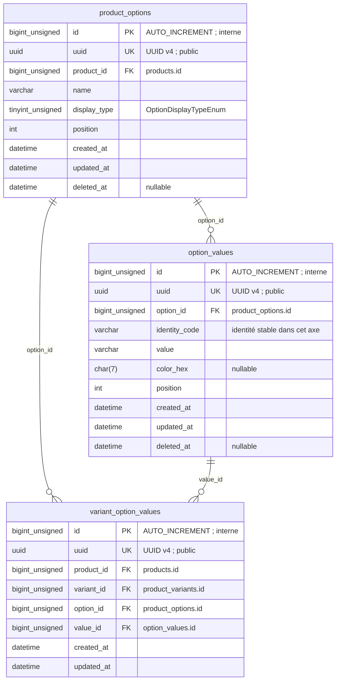
```mermaid
erDiagram
    direction TB
    product_options {
        bigint_unsigned id PK "AUTO_INCREMENT ; interne"
        uuid uuid UK "UUID v4 ; public"
        bigint_unsigned product_id FK "products.id"
        varchar name
        tinyint_unsigned display_type "OptionDisplayTypeEnum"
        int position
        datetime created_at
        datetime updated_at
        datetime deleted_at "nullable"
    }
    option_values {
        bigint_unsigned id PK "AUTO_INCREMENT ; interne"
        uuid uuid UK "UUID v4 ; public"
        bigint_unsigned option_id FK "product_options.id"
        varchar identity_code "identité stable dans cet axe"
        varchar value
        char(7) color_hex "nullable"
        int position
        datetime created_at
        datetime updated_at
        datetime deleted_at "nullable"
    }
    variant_option_values {
        bigint_unsigned id PK "AUTO_INCREMENT ; interne"
        uuid uuid UK "UUID v4 ; public"
        bigint_unsigned product_id FK "products.id"
        bigint_unsigned variant_id FK "product_variants.id"
        bigint_unsigned option_id FK "product_options.id"
        bigint_unsigned value_id FK "option_values.id"
        datetime created_at
        datetime updated_at
    }
    product_options ||--o{ option_values : option_id
    product_options ||--o{ variant_option_values : option_id
    option_values ||--o{ variant_option_values : value_id
```

#### Explication très simple des champs

**`product_options` :**

- **`id`** : le numéro unique qui permet de reconnaître cette ligne dans la base. Deux lignes différentes ne peuvent pas avoir le même `id`.
- **`uuid`** : identifiant public UUID v4 unique et indexé ; routes, API, formulaires et exports utilisent cet identifiant, sans exposer la PK numérique.
- **`product_id`** : l’identifiant du produit. Il sert à relier cette ligne à la bonne information au lieu de recopier toutes ses données.
- **`name`** : le nom affiché à l’utilisateur. Exemple : « Nombre de boutiques » ou « Livraison EcoTrack ».
- **`display_type`** : la façon d’afficher l’option. Exemple : boutons, liste ou pastilles de couleur.
- **`position`** : l’ordre d’affichage. Exemple : 1 apparaît avant 2.
- **`created_at`** : la date où cette ligne a été créée dans la base.
- **`updated_at`** : la date de la dernière modification de cette ligne. Exemple : si tu modifies l’élément aujourd’hui, cette date devient celle d’aujourd’hui.
- **`deleted_at`** : la date où l’élément a été retiré sans effacer son ancienne ligne. Si ce champ est vide, l’élément n’est pas supprimé.

**`option_values` :**

- **`id`** : le numéro unique qui permet de reconnaître cette ligne dans la base. Deux lignes différentes ne peuvent pas avoir le même `id`.
- **`uuid`** : identifiant public UUID v4 unique et indexé ; routes, API, formulaires et exports utilisent cet identifiant, sans exposer la PK numérique.
- **`option_id`** : l’option concernée. Exemple : « Taille ».
- **`identity_code`** : le code utilisé pour reconnaître **identite** de manière stable dans le programme ou chez un service externe.
- **`value`** : la valeur enregistrée. Exemple : `Rouge`, `XL` ou une autre valeur selon la table.
- **`color_hex`** : la couleur écrite sous forme de code web. Exemple : `#FF0000` pour rouge. Ce champ peut rester vide quand cette information n’est pas nécessaire ou pas encore connue.
- **`position`** : l’ordre d’affichage. Exemple : 1 apparaît avant 2.
- **`created_at`** : la date où cette ligne a été créée dans la base.
- **`updated_at`** : la date de la dernière modification de cette ligne. Exemple : si tu modifies l’élément aujourd’hui, cette date devient celle d’aujourd’hui.
- **`deleted_at`** : la date où l’élément a été retiré sans effacer son ancienne ligne. Si ce champ est vide, l’élément n’est pas supprimé.

**`variant_option_values` :**

- **`id`** : le numéro unique qui permet de reconnaître cette ligne dans la base. Deux lignes différentes ne peuvent pas avoir le même `id`.
- **`uuid`** : identifiant public UUID v4 unique et indexé ; routes, API, formulaires et exports utilisent cet identifiant, sans exposer la PK numérique.
- **`product_id`** : l’identifiant du produit. Il sert à relier cette ligne à la bonne information au lieu de recopier toutes ses données.
- **`variant_id`** : l’identifiant de la variante du produit. Il sert à relier cette ligne à la bonne information au lieu de recopier toutes ses données.
- **`option_id`** : l’option concernée. Exemple : « Taille ».
- **`value_id`** : la valeur choisie pour l’option. Exemple : « 42 » pour l’option Taille.
- **`created_at`** : la date où cette ligne a été créée dans la base.
- **`updated_at`** : la date de la dernière modification de cette ligne. Exemple : si tu modifies l’élément aujourd’hui, cette date devient celle d’aujourd’hui.


Les références vers un autre module sont indiquées sur les champs, même si leur flèche n’est pas redessinée ici.

- **`product_options` :** Dans un même produit, deux options ne peuvent pas avoir le même nom une fois le nom normalisé. Une option représente quelque chose que l’acheteur choisit pour créer une vraie variante, par exemple `Taille` ou `Couleur`. Une simple information descriptive comme « lavable à 30 °C » ne doit pas devenir une option de variante.

- **`option_values` :** Dans une même option, deux valeurs ne peuvent pas être identiques après normalisation, et chaque `identity_code` est unique dans cette option. `identity_code` représente l’identité stable de la valeur. Exemple : la valeur qui représente la taille 40 ne doit jamais être transformée plus tard en taille 41. Dès qu’une valeur est utilisée par une variante déjà utilisée en stock ou en commande, sa signification physique est figée. On peut encore corriger un libellé, par exemple une faute d’orthographe, seulement si la signification reste exactement la même. La couleur hexadécimale reste facultative.

- **`variant_option_values` :** Une variante ne peut avoir qu’une seule valeur pour une même option. La `value_id` doit réellement appartenir à `option_id`, et l’option comme la variante doivent appartenir au même produit. Pour chaque axe actif, une variante doit avoir exactement une valeur. Exemple : si le produit utilise Taille et Couleur, une variante doit avoir une taille et une couleur. La variante standard n’a aucune valeur d’option. Dès que la variante a déjà été utilisée (`used_at` rempli), on refuse d’ajouter, modifier ou supprimer sa composition, aussi bien dans le service que dans la BDD. Les imports passent par la même règle : pour changer l’identité historique, on crée une nouvelle variante.

- **Galeries polymorphes :** media vise products ou product_variants selon model_type/model_id, et collection_name=gallery. La variante est résolue dans la même boutique. Un seul principal actif par parent/collection ; le §7.6 remplace entièrement la liaison produit/média spécialisée.

### T4 — Classement et caractéristiques

**`tags` — Les petits mots utilisés pour classer ou mettre en avant les produits. Exemple : « Été » ou « Idée cadeau ».**

**`product_tags` — Indique quelles étiquettes sont attachées à chaque produit. Exemple : le même t-shirt peut porter les étiquettes « Été » et « Idée cadeau ».**

**`attributes` — La liste des informations servant à décrire les produits. Exemple : le poids ou le pays de fabrication ; ce ne sont pas forcément des choix proposés à l’achat.**

**`product_attributes` — La valeur d’une caractéristique pour un produit précis. Exemple : le poids de ce pot de miel est de 500 grammes.**

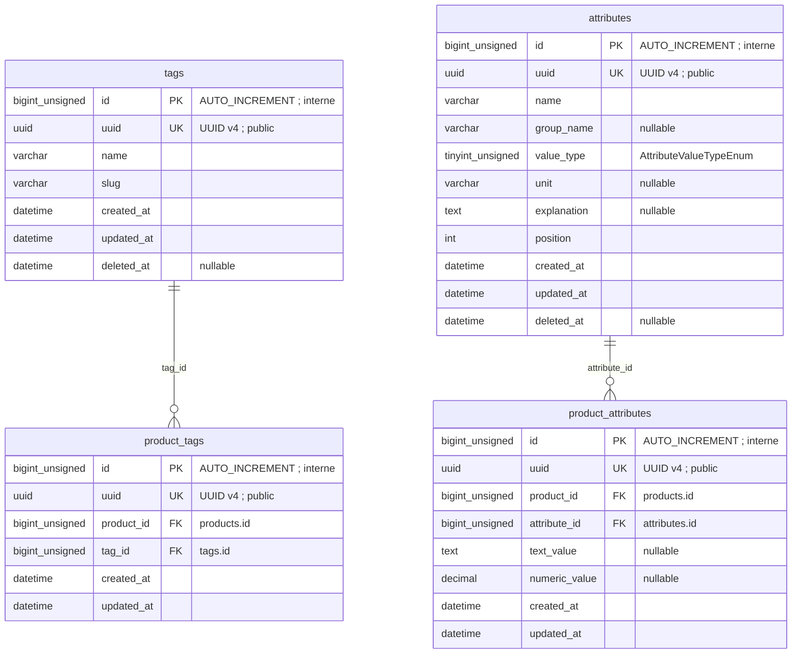
```mermaid
erDiagram
    direction TB
    tags {
        bigint_unsigned id PK "AUTO_INCREMENT ; interne"
        uuid uuid UK "UUID v4 ; public"
        varchar name
        varchar slug
        datetime created_at
        datetime updated_at
        datetime deleted_at "nullable"
    }
    product_tags {
        bigint_unsigned id PK "AUTO_INCREMENT ; interne"
        uuid uuid UK "UUID v4 ; public"
        bigint_unsigned product_id FK "products.id"
        bigint_unsigned tag_id FK "tags.id"
        datetime created_at
        datetime updated_at
    }
    attributes {
        bigint_unsigned id PK "AUTO_INCREMENT ; interne"
        uuid uuid UK "UUID v4 ; public"
        varchar name
        varchar group_name "nullable"
        tinyint_unsigned value_type "AttributeValueTypeEnum"
        varchar unit "nullable"
        text explanation "nullable"
        int position
        datetime created_at
        datetime updated_at
        datetime deleted_at "nullable"
    }
    product_attributes {
        bigint_unsigned id PK "AUTO_INCREMENT ; interne"
        uuid uuid UK "UUID v4 ; public"
        bigint_unsigned product_id FK "products.id"
        bigint_unsigned attribute_id FK "attributes.id"
        text text_value "nullable"
        decimal numeric_value "nullable"
        datetime created_at
        datetime updated_at
    }
    tags ||--o{ product_tags : tag_id
    attributes ||--o{ product_attributes : attribute_id
```

#### Explication très simple des champs

**`tags` :**

- **`id`** : le numéro unique qui permet de reconnaître cette ligne dans la base. Deux lignes différentes ne peuvent pas avoir le même `id`.
- **`uuid`** : identifiant public UUID v4 unique et indexé ; routes, API, formulaires et exports utilisent cet identifiant, sans exposer la PK numérique.
- **`name`** : le nom affiché à l’utilisateur. Exemple : « Nombre de boutiques » ou « Livraison EcoTrack ».
- **`slug`** : la partie simple de l’adresse web. Exemple : `a-propos` dans `/a-propos`.
- **`created_at`** : la date où cette ligne a été créée dans la base.
- **`updated_at`** : la date de la dernière modification de cette ligne. Exemple : si tu modifies l’élément aujourd’hui, cette date devient celle d’aujourd’hui.
- **`deleted_at`** : la date où l’élément a été retiré sans effacer son ancienne ligne. Si ce champ est vide, l’élément n’est pas supprimé.

**`product_tags` :**

- **`id`** : le numéro unique qui permet de reconnaître cette ligne dans la base. Deux lignes différentes ne peuvent pas avoir le même `id`.
- **`uuid`** : identifiant public UUID v4 unique et indexé ; routes, API, formulaires et exports utilisent cet identifiant, sans exposer la PK numérique.
- **`product_id`** : l’identifiant du produit. Il sert à relier cette ligne à la bonne information au lieu de recopier toutes ses données.
- **`tag_id`** : l’identifiant de l’étiquette. Il sert à relier cette ligne à la bonne information au lieu de recopier toutes ses données.
- **`created_at`** : la date où cette ligne a été créée dans la base.
- **`updated_at`** : la date de la dernière modification de cette ligne. Exemple : si tu modifies l’élément aujourd’hui, cette date devient celle d’aujourd’hui.

**`attributes` :**

- **`id`** : le numéro unique qui permet de reconnaître cette ligne dans la base. Deux lignes différentes ne peuvent pas avoir le même `id`.
- **`uuid`** : identifiant public UUID v4 unique et indexé ; routes, API, formulaires et exports utilisent cet identifiant, sans exposer la PK numérique.
- **`name`** : le nom affiché à l’utilisateur. Exemple : « Nombre de boutiques » ou « Livraison EcoTrack ».
- **`group_name`** : un nom qui permet de ranger plusieurs caractéristiques ensemble. Exemple : « Dimensions » pour longueur, largeur et hauteur. Ce champ peut rester vide quand cette information n’est pas nécessaire ou pas encore connue.
- **`value_type`** : code de `AttributeValueTypeEnum` qui indique le type de valeur attendu pour cette caractéristique : `TEXT`, `NUMBER`, `BOOLEAN` ou `DATE`.
- **`unit`** : explique ce que le nombre représente. Exemple : dans **« 3 boutiques »**, le nombre est 3 et l’unité est « boutiques ». Pour une fonction seulement oui/non, ce champ peut rester vide.
- **`explanation`** : un texte simple qui aide à comprendre la caractéristique. Exemple : expliquer ce que veut dire « matière ». Ce champ peut rester vide.
- **`position`** : l’ordre d’affichage. Exemple : 1 apparaît avant 2.
- **`created_at`** : la date où cette ligne a été créée dans la base.
- **`updated_at`** : la date de la dernière modification de cette ligne. Exemple : si tu modifies l’élément aujourd’hui, cette date devient celle d’aujourd’hui.
- **`deleted_at`** : la date où l’élément a été retiré sans effacer son ancienne ligne. Si ce champ est vide, l’élément n’est pas supprimé.

**`product_attributes` :**

- **`id`** : le numéro unique qui permet de reconnaître cette ligne dans la base. Deux lignes différentes ne peuvent pas avoir le même `id`.
- **`uuid`** : identifiant public UUID v4 unique et indexé ; routes, API, formulaires et exports utilisent cet identifiant, sans exposer la PK numérique.
- **`product_id`** : l’identifiant du produit. Il sert à relier cette ligne à la bonne information au lieu de recopier toutes ses données.
- **`attribute_id`** : l’identifiant de la caractéristique. Il sert à relier cette ligne à la bonne information au lieu de recopier toutes ses données.
- **`text_value`** : la valeur écrite en texte pour cette caractéristique. Exemple : `Coton`. Ce champ peut rester vide quand cette information n’est pas nécessaire ou pas encore connue.
- **`numeric_value`** : la valeur numérique de la caractéristique quand elle se mesure avec un nombre. Exemple : `500`. Ce champ peut rester vide quand cette information n’est pas nécessaire ou pas encore connue.
- **`created_at`** : la date où cette ligne a été créée dans la base.
- **`updated_at`** : la date de la dernière modification de cette ligne. Exemple : si tu modifies l’élément aujourd’hui, cette date devient celle d’aujourd’hui.


Les références vers un autre module sont indiquées sur les champs, même si leur flèche n’est pas redessinée ici.

- **`tags` :** Chaque étiquette possède un `slug` unique. Deux étiquettes ne peuvent donc pas utiliser la même adresse logique dans la boutique.

- **`product_tags` :** Le même produit ne peut recevoir la même étiquette qu’une seule fois. Exemple : si le produit « T-shirt A » possède déjà l’étiquette `ete`, on ne crée pas une deuxième liaison identique.

- **`attributes` :** Une caractéristique est unique pour un même `name` et un même groupe normalisé. Exemples : `composition`, `capacité` ou `dimensions`. Cette table sert aux informations descriptives et aux unités cohérentes. Elle évite de créer une variante juste pour une information que l’acheteur ne choisit pas.

- **`product_attributes` :** Un produit ne peut avoir qu’une seule valeur pour une même caractéristique. La valeur enregistrée doit respecter le type de la caractéristique : un champ numérique reçoit un nombre, un champ texte reçoit du texte, etc. Les filtres basés sur de vraies options choisissables comme taille ou couleur continuent d’utiliser `product_options` et `option_values`, pas cette table.

### T5 — Vente et avis

**`sales_pages` — Les pages qui présentent un seul produit pour donner envie de le commander. Exemple : une page partageable avec les avantages d’un produit, ses images et son formulaire de commande.**

**`product_promotions` — Les réductions appliquées automatiquement aux produits, sans code à saisir. Exemple : une réduction sur un produit pendant une période choisie.**

**`product_reviews` — Les notes et commentaires laissés sur les produits, même sans compte acheteur. Exemple : un client écrit « Très bon produit » ; la boutique décide ensuite de publier ou de masquer cet avis.**

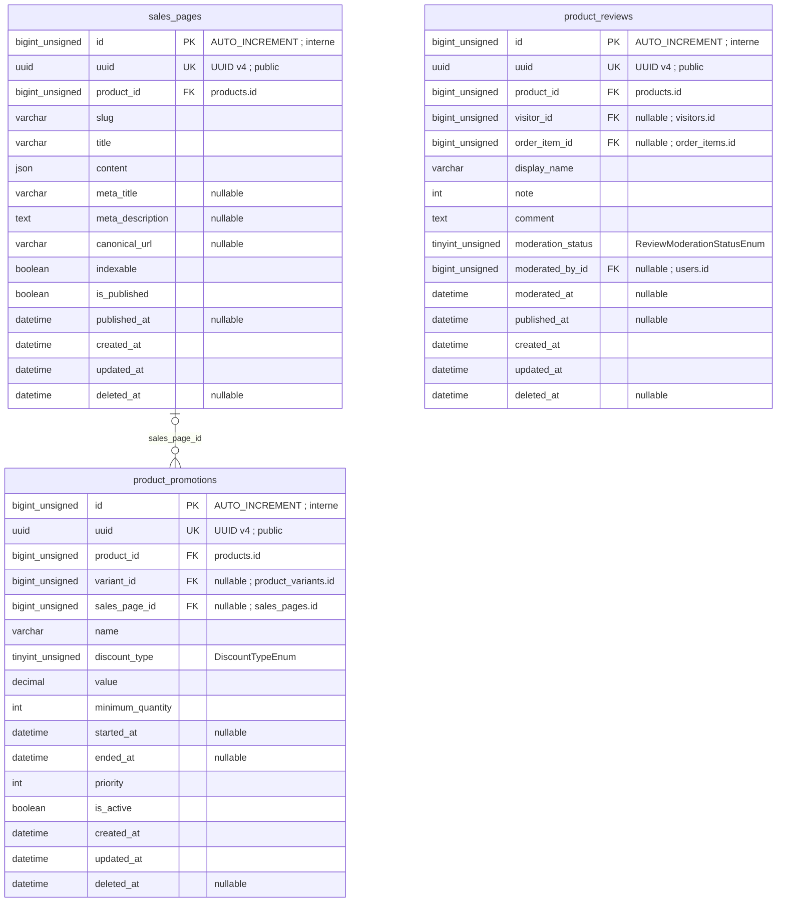
```mermaid
erDiagram
    direction TB
    sales_pages {
        bigint_unsigned id PK "AUTO_INCREMENT ; interne"
        uuid uuid UK "UUID v4 ; public"
        bigint_unsigned product_id FK "products.id"
        varchar slug
        varchar title
        json content
        varchar meta_title "nullable"
        text meta_description "nullable"
        varchar canonical_url "nullable"
        boolean indexable
        boolean is_published
        datetime published_at "nullable"
        datetime created_at
        datetime updated_at
        datetime deleted_at "nullable"
    }
    product_promotions {
        bigint_unsigned id PK "AUTO_INCREMENT ; interne"
        uuid uuid UK "UUID v4 ; public"
        bigint_unsigned product_id FK "products.id"
        bigint_unsigned variant_id FK "nullable ; product_variants.id"
        bigint_unsigned sales_page_id FK "nullable ; sales_pages.id"
        varchar name
        tinyint_unsigned discount_type "DiscountTypeEnum"
        decimal value
        int minimum_quantity
        datetime started_at "nullable"
        datetime ended_at "nullable"
        int priority
        boolean is_active
        datetime created_at
        datetime updated_at
        datetime deleted_at "nullable"
    }
    product_reviews {
        bigint_unsigned id PK "AUTO_INCREMENT ; interne"
        uuid uuid UK "UUID v4 ; public"
        bigint_unsigned product_id FK "products.id"
        bigint_unsigned visitor_id FK "nullable ; visitors.id"
        bigint_unsigned order_item_id FK "nullable ; order_items.id"
        varchar display_name
        int note
        text comment
        tinyint_unsigned moderation_status "ReviewModerationStatusEnum"
        bigint_unsigned moderated_by_id FK "nullable ; users.id"
        datetime moderated_at "nullable"
        datetime published_at "nullable"
        datetime created_at
        datetime updated_at
        datetime deleted_at "nullable"
    }
    sales_pages |o--o{ product_promotions : sales_page_id
```

#### Explication très simple des champs

**`sales_pages` :**

- **`id`** : le numéro unique qui permet de reconnaître cette ligne dans la base. Deux lignes différentes ne peuvent pas avoir le même `id`.
- **`uuid`** : identifiant public UUID v4 unique et indexé ; routes, API, formulaires et exports utilisent cet identifiant, sans exposer la PK numérique.
- **`product_id`** : l’identifiant du produit. Il sert à relier cette ligne à la bonne information au lieu de recopier toutes ses données.
- **`slug`** : la partie simple de l’adresse web. Exemple : `a-propos` dans `/a-propos`.
- **`title`** : le titre affiché à l’utilisateur.
- **`content`** : le texte ou contenu principal de la page.
- **`meta_title`** : le titre prévu pour les moteurs de recherche et le partage web. Ce champ peut rester vide quand cette information n’est pas nécessaire ou pas encore connue.
- **`meta_description`** : la petite description prévue pour les moteurs de recherche. Ce champ peut rester vide quand cette information n’est pas nécessaire ou pas encore connue.
- **`canonical_url`** : l’adresse web principale que les moteurs de recherche doivent considérer comme la vraie version de cette page. Ce champ peut rester vide quand cette information n’est pas nécessaire ou pas encore connue.
- **`indexable`** : indique si les moteurs de recherche sont autorisés à indexer cette page.
- **`is_published`** : indique si l’élément est publié et donc prêt à être montré.
- **`published_at`** : la date et l’heure liées à **publiee**. Elle permet de savoir exactement quand cette étape a eu lieu. Ce champ peut rester vide quand cette information n’est pas nécessaire ou pas encore connue.
- **`created_at`** : la date où cette ligne a été créée dans la base.
- **`updated_at`** : la date de la dernière modification de cette ligne. Exemple : si tu modifies l’élément aujourd’hui, cette date devient celle d’aujourd’hui.
- **`deleted_at`** : la date où l’élément a été retiré sans effacer son ancienne ligne. Si ce champ est vide, l’élément n’est pas supprimé.

**`product_promotions` :**

- **`id`** : le numéro unique qui permet de reconnaître cette ligne dans la base. Deux lignes différentes ne peuvent pas avoir le même `id`.
- **`uuid`** : identifiant public UUID v4 unique et indexé ; routes, API, formulaires et exports utilisent cet identifiant, sans exposer la PK numérique.
- **`product_id`** : l’identifiant du produit. Il sert à relier cette ligne à la bonne information au lieu de recopier toutes ses données.
- **`variant_id`** : l’identifiant de la variante du produit. Il sert à relier cette ligne à la bonne information au lieu de recopier toutes ses données. Ce champ peut rester vide quand cette information n’est pas nécessaire ou pas encore connue.
- **`sales_page_id`** : l’identifiant de la page de vente. Il sert à relier cette ligne à la bonne information au lieu de recopier toutes ses données. Ce champ peut rester vide quand cette information n’est pas nécessaire ou pas encore connue.
- **`name`** : le nom affiché à l’utilisateur. Exemple : « Nombre de boutiques » ou « Livraison EcoTrack ».
- **`discount_type`** : code de `DiscountTypeEnum` : `1 PERCENTAGE`, `2 UNIT_AMOUNT`, `3 FIXED_UNIT_PRICE`.
- **`value`** : la valeur enregistrée. Exemple : `Rouge`, `XL` ou une autre valeur selon la table.
- **`minimum_quantity`** : le nombre d’unités correspondant à **minimum**. Exemple : `2` signifie deux unités.
- **`started_at`** : la date et l’heure où la période ou l’action commence. Ce champ peut rester vide quand cette information n’est pas nécessaire ou pas encore connue.
- **`ended_at`** : la date et l’heure où elle s’est terminée. Peut rester vide tant que ce n’est pas terminé.
- **`priority`** : un nombre utilisé pour décider quel élément passe avant un autre. Exemple : priorité 1 avant priorité 2.
- **`is_active`** : indique si cette possibilité est autorisée. `true` = oui, `false` = non.
- **`created_at`** : la date où cette ligne a été créée dans la base.
- **`updated_at`** : la date de la dernière modification de cette ligne. Exemple : si tu modifies l’élément aujourd’hui, cette date devient celle d’aujourd’hui.
- **`deleted_at`** : la date où l’élément a été retiré sans effacer son ancienne ligne. Si ce champ est vide, l’élément n’est pas supprimé.

**`product_reviews` :**

- **`id`** : le numéro unique qui permet de reconnaître cette ligne dans la base. Deux lignes différentes ne peuvent pas avoir le même `id`.
- **`uuid`** : identifiant public UUID v4 unique et indexé ; routes, API, formulaires et exports utilisent cet identifiant, sans exposer la PK numérique.
- **`product_id`** : l’identifiant du produit. Il sert à relier cette ligne à la bonne information au lieu de recopier toutes ses données.
- **`visitor_id`** : l’identifiant du visiteur. Il sert à relier cette ligne à la bonne information au lieu de recopier toutes ses données. Ce champ peut rester vide quand cette information n’est pas nécessaire ou pas encore connue.
- **`order_item_id`** : l’identifiant de la ligne de produit de la commande. Il sert à relier cette ligne à la bonne information au lieu de recopier toutes ses données. Ce champ peut rester vide quand cette information n’est pas nécessaire ou pas encore connue.
- **`display_name`** : le nom réellement montré aux visiteurs.
- **`note`** : une information libre ajoutée pour aider à comprendre la ligne. Selon la table, cela peut être une note interne ou une note chiffrée.
- **`comment`** : le texte écrit par le client ou l’utilisateur.
- **`moderation_status`** : code entier de l’enum propre à cet objet, défini au §3.3 ; les libellés sont traduits à l’affichage et les transitions contrôlées par le service.
- **`moderated_by_id`** : l’identifiant de la personne qui a modéré. Il sert à relier cette ligne à la bonne information au lieu de recopier toutes ses données. Ce champ peut rester vide quand cette information n’est pas nécessaire ou pas encore connue.
- **`moderated_at`** : la date où l’avis a été vérifié. Ce champ peut rester vide quand cette information n’est pas nécessaire ou pas encore connue.
- **`published_at`** : la date où l’élément a été publié. Ce champ peut rester vide quand cette information n’est pas nécessaire ou pas encore connue.
- **`created_at`** : la date où cette ligne a été créée dans la base.
- **`updated_at`** : la date de la dernière modification de cette ligne. Exemple : si tu modifies l’élément aujourd’hui, cette date devient celle d’aujourd’hui.
- **`deleted_at`** : la date où l’élément a été retiré sans effacer son ancienne ligne. Si ce champ est vide, l’élément n’est pas supprimé.


Les références vers un autre module sont indiquées sur les champs, même si leur flèche n’est pas redessinée ici.

- **`sales_pages` :** Chaque page de vente possède un `slug` unique. Une page est liée à un produit précis et `product_id` ne peut plus être changé après sa création : si on veut vendre un autre produit avec une autre page, on archive l’ancienne page et on en crée une nouvelle. Un même produit peut avoir plusieurs pages de vente différentes. La page ne possède pas son propre prix ou son propre stock : elle affiche les valeurs calculées depuis les variantes et les promotions. Un produit peut aussi être commandé sans passer par une page de vente. La page n’est pas automatiquement redirigée vers la catégorie du produit.

- **`product_promotions` :** Une promotion utilise `DiscountTypeEnum` : `1 PERCENTAGE`, `2 UNIT_AMOUNT` (montant unitaire retiré) ou `3 FIXED_UNIT_PRICE` (prix unitaire fixe). La quantité minimale doit être au moins 1, un pourcentage doit rester entre 0 et 100 et le prix final ne peut jamais être négatif. Si la promotion vise une variante ou une page précise, cette variante et cette page doivent appartenir au même produit. Une seule promotion est retenue pour une ligne de commande. S’il y en a plusieurs, on regarde d’abord la priorité, puis la plus avantageuse, puis l’UUID pour départager de manière stable. Le serveur décide si une page autorise la promotion ; il ne fait jamais confiance à un simple `page_id` envoyé par le navigateur.

- **`product_reviews` :** La note est un entier de 1 à 5. Le statut utilise exactement `ReviewModerationStatusEnum` : `1 PENDING`, `2 APPROVED`, `3 HIDDEN`, `4 REJECTED`. Seuls les avis publiés entrent dans la note publique. Si un avis dit « achat vérifié », `order_item_id` doit réellement appartenir à ce produit ET le système doit avoir une preuve que l’auteur possède l’accès à la commande livrée. Saisir seulement le même nom ou le même téléphone ne suffit pas. La FK prouve que l’article concernait ce produit, pas automatiquement l’identité de la personne qui écrit. Un avis masqué reste conservé pour audit.

### T6 — Visiteurs et statistiques

**`visitors` — Un identifiant pour reconnaître un navigateur dans cette boutique, sans créer de compte acheteur. Exemple : reconnaître le même navigateur lors d’un retour sur le site, sans garantir qu’il s’agit de la même personne.**

**`visit_sessions` — Les différentes visites d’un navigateur sur la boutique. Exemple : une visite le matin puis une autre le soir peuvent former deux sessions pour le même visiteur.**

**`navigation_events` — Les actions suivies pour comprendre le parcours sur le site. Exemple : ouvrir une fiche produit, ajouter un article au panier puis arriver à la commande.**

**`visitor_preferences` — Les choix du visiteur concernant la mesure de sa navigation. Exemple : refuser cette mesure tout en continuant à utiliser le panier et à commander.**

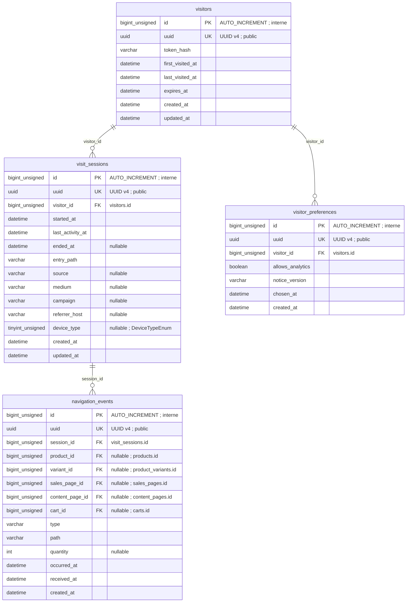
```mermaid
erDiagram
    direction TB
    visitors {
        bigint_unsigned id PK "AUTO_INCREMENT ; interne"
        uuid uuid UK "UUID v4 ; public"
        varchar token_hash
        datetime first_visited_at
        datetime last_visited_at
        datetime expires_at
        datetime created_at
        datetime updated_at
    }
    visit_sessions {
        bigint_unsigned id PK "AUTO_INCREMENT ; interne"
        uuid uuid UK "UUID v4 ; public"
        bigint_unsigned visitor_id FK "visitors.id"
        datetime started_at
        datetime last_activity_at
        datetime ended_at "nullable"
        varchar entry_path
        varchar source "nullable"
        varchar medium "nullable"
        varchar campaign "nullable"
        varchar referrer_host "nullable"
        tinyint_unsigned device_type "nullable ; DeviceTypeEnum"
        datetime created_at
        datetime updated_at
    }
    navigation_events {
        bigint_unsigned id PK "AUTO_INCREMENT ; interne"
        uuid uuid UK "UUID v4 ; public"
        bigint_unsigned session_id FK "visit_sessions.id"
        bigint_unsigned product_id FK "nullable ; products.id"
        bigint_unsigned variant_id FK "nullable ; product_variants.id"
        bigint_unsigned sales_page_id FK "nullable ; sales_pages.id"
        bigint_unsigned content_page_id FK "nullable ; content_pages.id"
        bigint_unsigned cart_id FK "nullable ; carts.id"
        varchar type
        varchar path
        int quantity "nullable"
        datetime occurred_at
        datetime received_at
        datetime created_at
    }
    visitor_preferences {
        bigint_unsigned id PK "AUTO_INCREMENT ; interne"
        uuid uuid UK "UUID v4 ; public"
        bigint_unsigned visitor_id FK "visitors.id"
        boolean allows_analytics
        varchar notice_version
        datetime chosen_at
        datetime created_at
    }
    visitors ||--o{ visit_sessions : visitor_id
    visit_sessions ||--o{ navigation_events : session_id
    visitors ||--o{ visitor_preferences : visitor_id
```

#### Explication très simple des champs

**`visitors` :**

- **`id`** : le numéro unique qui permet de reconnaître cette ligne dans la base. Deux lignes différentes ne peuvent pas avoir le même `id`.
- **`uuid`** : identifiant public UUID v4 unique et indexé ; routes, API, formulaires et exports utilisent cet identifiant, sans exposer la PK numérique.
- **`token_hash`** : la version protégée du jeton d’invitation. Si la base est lue, le vrai lien secret n’est pas directement récupérable.
- **`first_visited_at`** : la date de la première visite connue de ce visiteur.
- **`last_visited_at`** : la date de sa dernière visite connue.
- **`expires_at`** : la date où l’élément n’est plus valable.
- **`created_at`** : la date où cette ligne a été créée dans la base.
- **`updated_at`** : la date de la dernière modification de cette ligne. Exemple : si tu modifies l’élément aujourd’hui, cette date devient celle d’aujourd’hui.

**`visit_sessions` :**

- **`id`** : le numéro unique qui permet de reconnaître cette ligne dans la base. Deux lignes différentes ne peuvent pas avoir le même `id`.
- **`uuid`** : identifiant public UUID v4 unique et indexé ; routes, API, formulaires et exports utilisent cet identifiant, sans exposer la PK numérique.
- **`visitor_id`** : l’identifiant du visiteur. Il sert à relier cette ligne à la bonne information au lieu de recopier toutes ses données.
- **`started_at`** : la date et l’heure où la période ou l’action commence.
- **`last_activity_at`** : la date et l’heure liées à **derniere activite**. Elle permet de savoir exactement quand cette étape a eu lieu.
- **`ended_at`** : la date et l’heure où elle s’est terminée. Peut rester vide tant que ce n’est pas terminé.
- **`entry_path`** : la première page visitée dans cette session. Exemple : `/produit/chaussure-noire`.
- **`source`** : indique d’où vient l’information. Exemple : saisie manuelle ou réponse de l’API. Ce champ peut rester vide quand cette information n’est pas nécessaire ou pas encore connue.
- **`medium`** : une information sur le support utilisé pour arriver sur le site, par exemple une source marketing ou un canal suivi. Ce champ peut rester vide quand cette information n’est pas nécessaire ou pas encore connue.
- **`campaign`** : le nom ou code d’une campagne marketing utilisé pour savoir d’où vient la visite. Ce champ peut rester vide quand cette information n’est pas nécessaire ou pas encore connue.
- **`referrer_host`** : le site ou domaine qui a envoyé le visiteur vers la boutique. Ce champ peut rester vide quand cette information n’est pas nécessaire ou pas encore connue.
- **`device_type`** : le type d’appareil utilisé. Exemple : téléphone, ordinateur ou tablette. Ce champ peut rester vide quand cette information n’est pas nécessaire ou pas encore connue.
- **`created_at`** : la date où cette ligne a été créée dans la base.
- **`updated_at`** : la date de la dernière modification de cette ligne. Exemple : si tu modifies l’élément aujourd’hui, cette date devient celle d’aujourd’hui.

**`navigation_events` :**

- **`id`** : le numéro unique qui permet de reconnaître cette ligne dans la base. Deux lignes différentes ne peuvent pas avoir le même `id`.
- **`uuid`** : identifiant public UUID v4 unique et indexé ; routes, API, formulaires et exports utilisent cet identifiant, sans exposer la PK numérique.
- **`session_id`** : la session de navigation concernée.
- **`product_id`** : l’identifiant du produit. Il sert à relier cette ligne à la bonne information au lieu de recopier toutes ses données. Ce champ peut rester vide quand cette information n’est pas nécessaire ou pas encore connue.
- **`variant_id`** : l’identifiant de la variante du produit. Il sert à relier cette ligne à la bonne information au lieu de recopier toutes ses données. Ce champ peut rester vide quand cette information n’est pas nécessaire ou pas encore connue.
- **`sales_page_id`** : l’identifiant de la page de vente. Il sert à relier cette ligne à la bonne information au lieu de recopier toutes ses données. Ce champ peut rester vide quand cette information n’est pas nécessaire ou pas encore connue.
- **`content_page_id`** : l’identifiant de la page de contenu. Il sert à relier cette ligne à la bonne information au lieu de recopier toutes ses données. Ce champ peut rester vide quand cette information n’est pas nécessaire ou pas encore connue.
- **`cart_id`** : l’identifiant du panier. Il sert à relier cette ligne à la bonne information au lieu de recopier toutes ses données. Ce champ peut rester vide quand cette information n’est pas nécessaire ou pas encore connue.
- **`type`** : code d’événement de navigation extensible, par exemple `product_view`, `add_to_cart` ou `checkout_started`. Il reste textuel car de nouveaux événements analytiques peuvent être ajoutés sans migration.
- **`path`** : l’endroit où le fichier est rangé dans le stockage privé.
- **`quantity`** : le nombre d’éléments concernés. Exemple : `2` signifie deux unités du produit. Ce champ peut rester vide quand cette information n’est pas nécessaire ou pas encore connue.
- **`occurred_at`** : la date et l’heure où l’événement s’est produit.
- **`received_at`** : la date et l’heure liées à **recu**. Elle permet de savoir exactement quand cette étape a eu lieu.
- **`created_at`** : la date où cette ligne a été créée dans la base.

**`visitor_preferences` :**

- **`id`** : le numéro unique qui permet de reconnaître cette ligne dans la base. Deux lignes différentes ne peuvent pas avoir le même `id`.
- **`uuid`** : identifiant public UUID v4 unique et indexé ; routes, API, formulaires et exports utilisent cet identifiant, sans exposer la PK numérique.
- **`visitor_id`** : l’identifiant du visiteur. Il sert à relier cette ligne à la bonne information au lieu de recopier toutes ses données.
- **`allows_analytics`** : indique si la mesure d’audience prévue par le site peut être utilisée pour ce visiteur selon la règle retenue.
- **`notice_version`** : la version du texte d’information montrée au client.
- **`chosen_at`** : la date et l’heure liées à **choisi**. Elle permet de savoir exactement quand cette étape a eu lieu.
- **`created_at`** : la date où cette ligne a été créée dans la base.


Les références vers un autre module sont indiquées sur les champs, même si leur flèche n’est pas redessinée ici.

- **`visitors` :** Chaque `token_hash` est unique. Le cookie du navigateur contient un secret aléatoire différent de l’UUID interne de la ligne. Une boutique ne partage pas cet identifiant avec une autre boutique. L’adresse IP ou une empreinte du navigateur ne sont pas utilisées comme identité fiable du visiteur.

- **`visit_sessions` :** On indexe `visitor_id + started_at` pour retrouver rapidement les sessions d’un visiteur. La règle proposée est de commencer une nouvelle session après 30 minutes sans activité. `source`, `medium` et `campaign` sont seulement des étiquettes internes facultatives ; elles ne connectent pas automatiquement Instagram, Facebook ou un autre réseau. On ne stocke pas comme référent une URL qui pourrait contenir un token ou un secret.

- **`navigation_events` :** L’UUID de l’événement sert aussi à éviter d’enregistrer deux fois le même événement. Les types prévus sont `page_vue`, `produit_vu`, `recherche`, `ajout_panier`, `retrait_panier` et `checkout_commence`. Les achats et les retours ne sont pas déclarés par le navigateur : ils viennent du serveur métier pour être fiables. Les références envoyées par le client et leurs dates sont vérifiées avant enregistrement. Pour une fiche produit, un seul événement `produit_vu` suffit ; on ne crée pas en plus un deuxième événement `page_vue` pour compter deux fois la même visite.

- **`visitor_preferences` :** On conserve l’historique des choix faits par le visiteur lorsque cette collecte est activée. Le panier doit continuer à fonctionner même si la mesure d’audience n’est pas utilisée. La durée de conservation et les conditions exactes de collecte doivent être décidées avant la mise en ligne. La présence de cette table ne signifie pas à elle seule que le traitement est juridiquement conforme.

### T7 — Panier

**`carts` — Les paniers conservés par le site pour les acheteurs invités. Exemple : un visiteur ajoute deux produits avant de renseigner ses coordonnées ; cela ne réserve pas encore le stock.**

**`cart_items` — Le contenu détaillé de chaque panier. Exemple : deux t-shirts rouges taille M, avec une éventuelle personnalisation, forment une ligne du panier.**

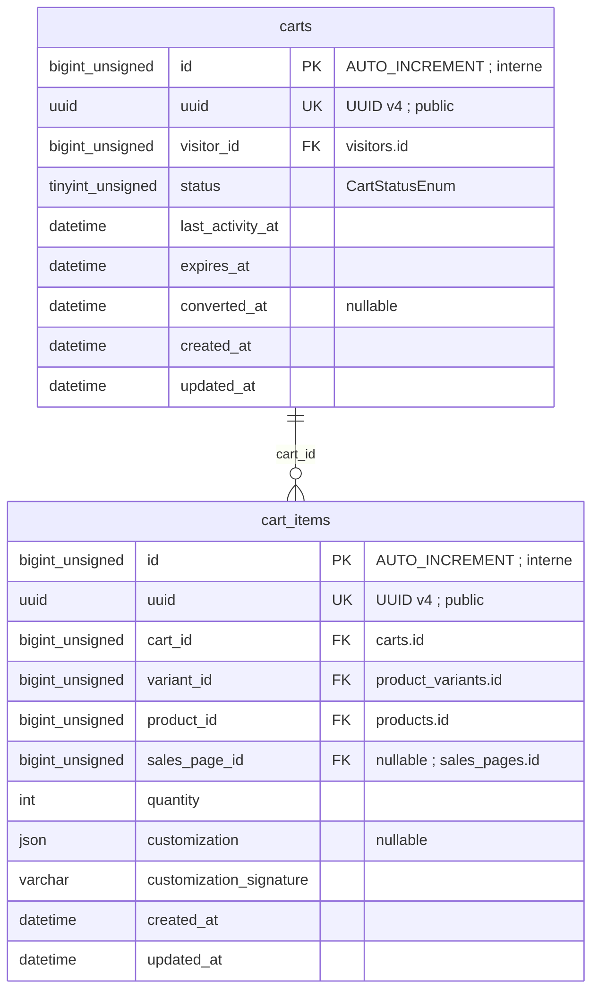
```mermaid
erDiagram
    direction TB
    carts {
        bigint_unsigned id PK "AUTO_INCREMENT ; interne"
        uuid uuid UK "UUID v4 ; public"
        bigint_unsigned visitor_id FK "visitors.id"
        tinyint_unsigned status "CartStatusEnum"
        datetime last_activity_at
        datetime expires_at
        datetime converted_at "nullable"
        datetime created_at
        datetime updated_at
    }
    cart_items {
        bigint_unsigned id PK "AUTO_INCREMENT ; interne"
        uuid uuid UK "UUID v4 ; public"
        bigint_unsigned cart_id FK "carts.id"
        bigint_unsigned variant_id FK "product_variants.id"
        bigint_unsigned product_id FK "products.id"
        bigint_unsigned sales_page_id FK "nullable ; sales_pages.id"
        int quantity
        json customization "nullable"
        varchar customization_signature
        datetime created_at
        datetime updated_at
    }
    carts ||--o{ cart_items : cart_id
```

#### Explication très simple des champs

**`carts` :**

- **`id`** : le numéro unique qui permet de reconnaître cette ligne dans la base. Deux lignes différentes ne peuvent pas avoir le même `id`.
- **`uuid`** : identifiant public UUID v4 unique et indexé ; routes, API, formulaires et exports utilisent cet identifiant, sans exposer la PK numérique.
- **`visitor_id`** : l’identifiant du visiteur. Il sert à relier cette ligne à la bonne information au lieu de recopier toutes ses données.
- **`status`** : code entier de l’enum propre à cet objet, défini au §3.3 ; les libellés sont traduits à l’affichage et les transitions contrôlées par le service.
- **`last_activity_at`** : la date et l’heure liées à **derniere activite**. Elle permet de savoir exactement quand cette étape a eu lieu.
- **`expires_at`** : la date où l’élément n’est plus valable.
- **`converted_at`** : la date où le panier a été transformé en commande. Ce champ peut rester vide quand cette information n’est pas nécessaire ou pas encore connue.
- **`created_at`** : la date où cette ligne a été créée dans la base.
- **`updated_at`** : la date de la dernière modification de cette ligne. Exemple : si tu modifies l’élément aujourd’hui, cette date devient celle d’aujourd’hui.

**`cart_items` :**

- **`id`** : le numéro unique qui permet de reconnaître cette ligne dans la base. Deux lignes différentes ne peuvent pas avoir le même `id`.
- **`uuid`** : identifiant public UUID v4 unique et indexé ; routes, API, formulaires et exports utilisent cet identifiant, sans exposer la PK numérique.
- **`cart_id`** : l’identifiant du panier. Il sert à relier cette ligne à la bonne information au lieu de recopier toutes ses données.
- **`variant_id`** : l’identifiant de la variante du produit. Il sert à relier cette ligne à la bonne information au lieu de recopier toutes ses données.
- **`product_id`** : l’identifiant du produit. Il sert à relier cette ligne à la bonne information au lieu de recopier toutes ses données.
- **`sales_page_id`** : l’identifiant de la page de vente. Il sert à relier cette ligne à la bonne information au lieu de recopier toutes ses données. Ce champ peut rester vide quand cette information n’est pas nécessaire ou pas encore connue.
- **`quantity`** : le nombre d’éléments concernés. Exemple : `2` signifie deux unités du produit.
- **`customization`** : les choix personnalisés du client pour cet article. Exemple : texte à imprimer ou couleur spéciale. Ce champ peut rester vide quand cette information n’est pas nécessaire ou pas encore connue.
- **`customization_signature`** : une signature calculée à partir des choix personnalisés de l’article. Elle permet de savoir si deux articles ont exactement la même personnalisation.
- **`created_at`** : la date où cette ligne a été créée dans la base.
- **`updated_at`** : la date de la dernière modification de cette ligne. Exemple : si tu modifies l’élément aujourd’hui, cette date devient celle d’aujourd’hui.


Les références vers un autre module sont indiquées sur les champs, même si leur flèche n’est pas redessinée ici.

- **`carts` :** Un panier utilise `CartStatusEnum` : `1 ACTIVE`, `2 CONVERTED`, `3 EXPIRED`, `4 ABANDONED`. Un visiteur ne peut avoir qu’un seul panier actif à la fois. Un panier abandonné peut redevenir actif si le parcours reprend. Dès qu’un panier est converti en commande, son contenu est figé. Ajouter un produit au panier ne réserve aucun stock : quelqu’un d’autre peut encore acheter le produit avant la confirmation téléphonique.

- **`cart_items` :** Dans un même panier, une ligne est unique selon la variante, la personnalisation et la page d’origine. Deux bouquets de la même variante avec deux messages personnalisés différents restent donc deux lignes différentes. `quantity` doit être supérieure à 0. Le navigateur n’est jamais la source de vérité du prix : le serveur recalcule les prix au moment nécessaire. `product_id` est obligatoire. La variante choisie doit appartenir à ce produit, et si une `sales_page_id` est fournie, elle doit elle aussi présenter ce même produit. Une page de vente facultative ne peut donc pas être utilisée pour faire commander un autre produit.

### T8 — Commande et versions

**`orders` — La fiche principale de chaque commande, avec son identité et son état commercial. Exemple : la commande de Karim reste la même commande même si son contenu est modifié avant expédition.**

**`order_revisions` — Les copies successives du contenu d’une commande à chaque modification. Exemple : la première version contient une taille M ; une nouvelle version contient une taille L, sans effacer l’ancienne.**

**`order_items` — Les produits et quantités d’une version précise de commande, avec les prix et coûts conservés à ce moment-là. Exemple : deux t-shirts à 2 000 DA chacun, même si le prix du catalogue change ensuite.**

**`order_history` — Le carnet des actions et décisions concernant une commande. Exemple : noter un appel sans réponse, une confirmation ou un changement de taille, avec sa date et son auteur.**


```mermaid
erDiagram
    direction TB
    orders {
        bigint_unsigned id PK "AUTO_INCREMENT ; interne"
        uuid uuid UK "UUID v4 ; public"
        varchar number
        bigint_unsigned visitor_id FK "nullable ; visitors.id"
        bigint_unsigned cart_id FK "nullable ; carts.id"
        varchar data_policy_version
        datetime data_notice_acknowledged_at
        char(64) notice_text_hash "SHA-256 hex nullable si snapshot/version suffisamment probants"
        bigint_unsigned original_session_id FK "nullable ; visit_sessions.id"
        bigint_unsigned original_sales_page_id FK "nullable ; sales_pages.id"
        bigint_unsigned original_return_id FK "nullable ; order_returns.id"
        bigint_unsigned original_order_id FK "nullable ; orders.id"
        bigint_unsigned original_incident_id FK "nullable ; order_incidents.id"
        int original_incident_quantity "nullable"
        varchar replacement_reason "nullable"
        bigint_unsigned current_revision_id FK "nullable ; order_revisions.id"
        tinyint_unsigned order_type "OrderTypeEnum"
        tinyint_unsigned channel "OrderChannelEnum"
        tinyint_unsigned commercial_status "OrderStatusEnum"
        bigint_unsigned confirmation_owner_id FK "nullable ; users.id"
        datetime customer_confirmed_at "nullable before acceptation"
        tinyint_unsigned customer_confirmation_mode "nullable ; CustomerConfirmationModeEnum"
        datetime operationally_confirmed_at "nullable"
        bigint_unsigned operationally_confirmed_by_id FK "nullable ; users.id"
        datetime cancelled_at "nullable"
        varchar submission_key
        char(64) submission_hash "SHA-256 hex 64"
        int lock_version
        boolean retention_hold
        text retention_hold_reason "nullable"
        datetime hold_review_at "nullable"
        datetime created_at
        datetime updated_at
    }
    order_revisions {
        bigint_unsigned id PK "AUTO_INCREMENT ; interne"
        uuid uuid UK "UUID v4 ; public"
        bigint_unsigned order_id FK "orders.id"
        int revision_number
        char(3) currency
        char(2) country_code
        json legal_seller_snapshot
        json shipping_tax_snapshot
        bigint_unsigned author_id FK "nullable ; users.id"
        text reason "nullable"
        varchar recipient_last_name
        varchar recipient_first_name "nullable"
        varchar phone
        varchar secondary_phone "nullable"
        varchar email "nullable"
        text address
        uuid province_uuid "REF central.provinces.uuid"
        uuid municipality_uuid "REF central.municipalities.uuid"
        varchar province_name
        varchar municipality_name
        varchar postal_code "nullable"
        tinyint_unsigned delivery_mode "DeliveryModeEnum"
        bigint_unsigned pickup_point_id FK "nullable ; pickup_points.id"
        json pickup_point_snapshot "nullable"
        decimal catalog_subtotal
        decimal applied_subtotal
        decimal customer_shipping_fee
        decimal shipping_discount
        tinyint_unsigned shipping_charge_bearer "ShippingChargeBearerEnum"
        decimal merchant_shipping_amount "estimation figee"
        decimal order_total
        decimal exchange_offset_amount "DEFAULT 0"
        decimal amount_to_collect
        bigint_unsigned free_shipping_rule_id FK "nullable ; free_shipping_rules.id"
        text customer_note "nullable"
        varchar sales_terms_version
        json sales_terms_snapshot
        datetime created_at
    }
    order_items {
        bigint_unsigned id PK "AUTO_INCREMENT ; interne"
        uuid uuid UK "UUID v4 ; public"
        bigint_unsigned revision_id FK "order_revisions.id"
        bigint_unsigned variant_id FK "product_variants.id"
        bigint_unsigned product_id FK "products.id"
        bigint_unsigned promotion_id FK "nullable ; product_promotions.id"
        bigint_unsigned sales_page_id FK "nullable ; sales_pages.id"
        varchar product_name
        varchar variant_name
        varchar sku
        json options_snapshot "nullable"
        json customization_snapshot "nullable"
        int quantity
        decimal catalog_unit_price
        decimal applied_unit_price
        boolean is_price_overridden
        text price_change_reason "nullable"
        tinyint_unsigned price_origin "PriceOriginEnum"
        json promotion_snapshot "nullable"
        decimal unit_cost_snapshot
        decimal line_total
        json tax_snapshot
        datetime created_at
    }
    order_history {
        bigint_unsigned id PK "AUTO_INCREMENT ; interne"
        uuid uuid UK "UUID v4 ; public"
        bigint_unsigned order_id FK "orders.id"
        bigint_unsigned previous_revision_id FK "nullable ; order_revisions.id"
        bigint_unsigned next_revision_id FK "nullable ; order_revisions.id"
        bigint_unsigned actor_id FK "nullable ; users.id"
        varchar action
        tinyint_unsigned contact_outcome "nullable ; ContactOutcomeEnum"
        datetime next_callback_at "nullable"
        tinyint_unsigned previous_status "nullable ; OrderStatusEnum"
        tinyint_unsigned new_status "nullable ; OrderStatusEnum"
        json changes "nullable"
        text note "nullable"
        uuid correlation_id
        tinyint_unsigned origin "ActivityOriginEnum"
        datetime created_at
    }
    order_revisions |o--o{ orders : current_revision_id
    orders ||--o{ order_revisions : order_id
    order_revisions ||--o{ order_items : revision_id
    orders ||--o{ order_history : order_id
    order_revisions |o--o{ order_history : previous_revision_id
    order_revisions |o--o{ order_history : next_revision_id
```

#### Explication très simple des champs

**`orders` :**

- **`id`** : le numéro unique qui permet de reconnaître cette ligne dans la base. Deux lignes différentes ne peuvent pas avoir le même `id`.
- **`uuid`** : identifiant public UUID v4 unique et indexé ; routes, API, formulaires et exports utilisent cet identifiant, sans exposer la PK numérique.
- **`number`** : le numéro lisible de l’élément. Exemple : numéro d’échéance ou de facture selon la table.
- **`visitor_id`** : l’identifiant du visiteur. Il sert à relier cette ligne à la bonne information au lieu de recopier toutes ses données. Ce champ peut rester vide quand cette information n’est pas nécessaire ou pas encore connue.
- **`cart_id`** : l’identifiant du panier. Il sert à relier cette ligne à la bonne information au lieu de recopier toutes ses données. Ce champ peut rester vide quand cette information n’est pas nécessaire ou pas encore connue.
- **`data_policy_version`** : la version de la politique d’information sur les données personnelles montrée au client pendant ce checkout.
- **`data_notice_acknowledged_at`** : la date où le client a continué le checkout après que l’information sur l’utilisation de ses données lui a été présentée.
- **`notice_text_hash`** : une empreinte du texte montré au client, pour pouvoir prouver quelle version a été présentée sans dupliquer inutilement le texte. Ce champ peut rester vide quand cette information n’est pas nécessaire ou pas encore connue.
- **`original_session_id`** : l’identifiant de la session d’origine. Il sert à relier cette ligne à la bonne information au lieu de recopier toutes ses données. Ce champ peut rester vide quand cette information n’est pas nécessaire ou pas encore connue.
- **`original_sales_page_id`** : l’identifiant de la page de vente d’origine. Il sert à relier cette ligne à la bonne information au lieu de recopier toutes ses données. Ce champ peut rester vide quand cette information n’est pas nécessaire ou pas encore connue.
- **`original_return_id`** : l’identifiant du retour d’origine. Il sert à relier cette ligne à la bonne information au lieu de recopier toutes ses données. Ce champ peut rester vide quand cette information n’est pas nécessaire ou pas encore connue.
- **`original_order_id`** : l’identifiant de la commande d’origine. Il sert à relier cette ligne à la bonne information au lieu de recopier toutes ses données. Ce champ peut rester vide quand cette information n’est pas nécessaire ou pas encore connue.
- **`original_incident_id`** : l’identifiant de l’incident d’origine. Il sert à relier cette ligne à la bonne information au lieu de recopier toutes ses données. Ce champ peut rester vide quand cette information n’est pas nécessaire ou pas encore connue.
- **`original_incident_quantity`** : le nombre d’unités correspondant à **incident origine**. Exemple : `2` signifie deux unités. Ce champ peut rester vide quand cette information n’est pas nécessaire ou pas encore connue.
- **`replacement_reason`** : explique la raison de **remplacement**. Cela permet de comprendre plus tard pourquoi la décision a été prise. Ce champ peut rester vide quand cette information n’est pas nécessaire ou pas encore connue.
- **`current_revision_id`** : l’identifiant de la version actuelle de la commande. Il sert à relier cette ligne à la bonne information au lieu de recopier toutes ses données. Ce champ peut rester vide quand cette information n’est pas nécessaire ou pas encore connue.
- **`order_type`** : indique la catégorie de **commande** utilisée pour cette ligne.
- **`channel`** : code de `OrderChannelEnum` qui indique l’origine de la commande : `STOREFRONT` ou `MANUAL`.
- **`commercial_status`** : code entier de l’enum propre à cet objet, défini au §3.3 ; les libellés sont traduits à l’affichage et les transitions contrôlées par le service.
- **`confirmation_owner_id`** : l’identifiant de la personne responsable de la confirmation. Il sert à relier cette ligne à la bonne information au lieu de recopier toutes ses données. Ce champ peut rester vide quand cette information n’est pas nécessaire ou pas encore connue.
- **`customer_confirmed_at`** : la date et l’heure liées à **confirmation client**. Elle permet de savoir exactement quand cette étape a eu lieu. Ce champ peut rester vide quand cette information n’est pas nécessaire ou pas encore connue.
- **`customer_confirmation_mode`** : la manière dont l’accord du client a été confirmé. Dans le MVP, cela peut être la confirmation téléphonique saisie par le commerçant. Ce champ peut rester vide quand cette information n’est pas nécessaire ou pas encore connue.
- **`operationally_confirmed_at`** : la date et l’heure liées à **confirme operationnellement**. Elle permet de savoir exactement quand cette étape a eu lieu. Ce champ peut rester vide quand cette information n’est pas nécessaire ou pas encore connue.
- **`operationally_confirmed_by_id`** : l’identifiant de la personne qui a validé le contrôle opérationnel. Il sert à relier cette ligne à la bonne information au lieu de recopier toutes ses données. Ce champ peut rester vide quand cette information n’est pas nécessaire ou pas encore connue.
- **`cancelled_at`** : la date et l’heure liées à **annulee**. Elle permet de savoir exactement quand cette étape a eu lieu. Ce champ peut rester vide quand cette information n’est pas nécessaire ou pas encore connue.
- **`submission_key`** : une clé qui reconnaît une soumission précise. Elle évite qu’un double clic ou un nouvel envoi réseau crée deux fois la même chose.
- **`submission_hash`** : une empreinte du contenu envoyé. Exemple : si la même clé revient avec un autre panier, le système voit que le contenu n’est pas identique.
- **`lock_version`** : le numéro de version de verrou. Exemple : version 1, puis version 2 après une évolution ; l’ancienne version peut rester conservée pour comprendre l’historique.
- **`retention_hold`** : un **oui/non** pour indiquer si **gel conservation** est vrai ou autorisé. `true` = oui ; `false` = non.
- **`retention_hold_reason`** : explique la raison de **gel conservation**. Cela permet de comprendre plus tard pourquoi la décision a été prise. Ce champ peut rester vide quand cette information n’est pas nécessaire ou pas encore connue.
- **`hold_review_at`** : la date et l’heure liées à **revue gel**. Elle permet de savoir exactement quand cette étape a eu lieu. Ce champ peut rester vide quand cette information n’est pas nécessaire ou pas encore connue.
- **`created_at`** : la date où cette ligne a été créée dans la base.
- **`updated_at`** : la date de la dernière modification de cette ligne. Exemple : si tu modifies l’élément aujourd’hui, cette date devient celle d’aujourd’hui.

**`order_revisions` :**

- **`id`** : le numéro unique qui permet de reconnaître cette ligne dans la base. Deux lignes différentes ne peuvent pas avoir le même `id`.
- **`uuid`** : identifiant public UUID v4 unique et indexé ; routes, API, formulaires et exports utilisent cet identifiant, sans exposer la PK numérique.
- **`order_id`** : l’identifiant de la commande. Il sert à relier cette ligne à la bonne information au lieu de recopier toutes ses données.
- **`revision_number`** : le numéro de version de la commande. Exemple : 1 pour la première version, 2 après une modification avant expédition.
- **`currency`** : la monnaie utilisée. Exemple : `DZD` pour le dinar algérien.
- **`country_code`** : le code court du pays. Exemple : `DZ` pour l’Algérie.
- **`legal_seller_snapshot`** : une copie figée des informations légales du vendeur au moment de la facture.
- **`shipping_tax_snapshot`** : une copie figée de la manière dont les frais de livraison ont été traités fiscalement pour ce document.
- **`author_id`** : l’identifiant de la personne qui a créé l’élément. Il sert à relier cette ligne à la bonne information au lieu de recopier toutes ses données. Ce champ peut rester vide quand cette information n’est pas nécessaire ou pas encore connue.
- **`reason`** : explique pourquoi l’action ou la décision a été faite. Ce champ peut rester vide quand cette information n’est pas nécessaire ou pas encore connue.
- **`recipient_last_name`** : le nom de **destinataire** affiché ou conservé pour cette ligne.
- **`recipient_first_name`** : le prénom de la personne qui recevra le colis. Il peut rester vide si seul le nom nécessaire est renseigné.
- **`phone`** : le numéro de téléphone. Il est gardé comme texte pour ne pas perdre le `0`, le `+213` ou d’autres signes utiles.
- **`secondary_phone`** : le numéro de téléphone utilisé pour **secondaire**. Ce champ peut rester vide quand cette information n’est pas nécessaire ou pas encore connue.
- **`email`** : l’adresse email du compte. Ce champ peut rester vide quand cette information n’est pas nécessaire ou pas encore connue.
- **`address`** : l’adresse écrite. Exemple : rue, cité ou quartier.
- **`province_uuid`** : l’identifiant de la wilaya. Il sert à relier cette ligne à la bonne information au lieu de recopier toutes ses données.
- **`municipality_uuid`** : l’identifiant de la commune. Il sert à relier cette ligne à la bonne information au lieu de recopier toutes ses données.
- **`province_name`** : le nom de la wilaya copié dans la version de commande pour garder l’historique tel qu’il était au moment de la vente.
- **`municipality_name`** : le nom de la commune copié dans la version de commande pour garder l’historique.
- **`postal_code`** : le code postal lorsqu’il est connu. Ce champ peut rester vide quand cette information n’est pas nécessaire ou pas encore connue.
- **`delivery_mode`** : la façon de livrer choisie. Exemple : domicile ou point relais.
- **`pickup_point_id`** : l’identifiant du point relais. Il sert à relier cette ligne à la bonne information au lieu de recopier toutes ses données. Ce champ peut rester vide quand cette information n’est pas nécessaire ou pas encore connue.
- **`pickup_point_snapshot`** : une copie figée des informations du point relais choisi au moment de l’expédition. Ce champ peut rester vide quand cette information n’est pas nécessaire ou pas encore connue.
- **`catalog_subtotal`** : le total calculé avec les prix normaux du catalogue avant les changements manuels appliqués à la commande.
- **`applied_subtotal`** : le total réellement utilisé après les changements de prix ou remises prévus.
- **`customer_shipping_fee`** : le montant de livraison payé par le client.
- **`shipping_discount`** : la réduction appliquée aux frais de livraison.
- **`shipping_charge_bearer`** : indique qui prend en charge les frais de livraison selon la règle choisie.
- **`merchant_shipping_amount`** : la somme d’argent correspondant à **livraison commercant**. Exemple : `1500` représente 1 500 DA au lancement.
- **`order_total`** : le montant total de la commande à cette révision.
- **`exchange_offset_amount`** : la somme d’argent correspondant à **compensation echange**. Exemple : `1500` représente 1 500 DA au lancement.
- **`amount_to_collect`** : le montant que le livreur doit demander au client lors de la livraison.
- **`free_shipping_rule_id`** : l’identifiant de la règle de livraison gratuite. Il sert à relier cette ligne à la bonne information au lieu de recopier toutes ses données. Ce champ peut rester vide quand cette information n’est pas nécessaire ou pas encore connue.
- **`customer_note`** : la note donnée par le client. Exemple : 4 sur 5. Ce champ peut rester vide quand cette information n’est pas nécessaire ou pas encore connue.
- **`sales_terms_version`** : la version des conditions de vente applicables à cette commande.
- **`sales_terms_snapshot`** : une copie figée du texte ou des informations importantes des conditions acceptées.
- **`created_at`** : la date où cette ligne a été créée dans la base.

**`order_items` :**

- **`id`** : le numéro unique qui permet de reconnaître cette ligne dans la base. Deux lignes différentes ne peuvent pas avoir le même `id`.
- **`uuid`** : identifiant public UUID v4 unique et indexé ; routes, API, formulaires et exports utilisent cet identifiant, sans exposer la PK numérique.
- **`revision_id`** : l’identifiant de la version de la commande. Il sert à relier cette ligne à la bonne information au lieu de recopier toutes ses données.
- **`variant_id`** : l’identifiant de la variante du produit. Il sert à relier cette ligne à la bonne information au lieu de recopier toutes ses données.
- **`product_id`** : l’identifiant du produit. Il sert à relier cette ligne à la bonne information au lieu de recopier toutes ses données.
- **`promotion_id`** : l’identifiant de la promotion. Il sert à relier cette ligne à la bonne information au lieu de recopier toutes ses données. Ce champ peut rester vide quand cette information n’est pas nécessaire ou pas encore connue.
- **`sales_page_id`** : l’identifiant de la page de vente. Il sert à relier cette ligne à la bonne information au lieu de recopier toutes ses données. Ce champ peut rester vide quand cette information n’est pas nécessaire ou pas encore connue.
- **`product_name`** : le nom de **produit** affiché ou conservé pour cette ligne.
- **`variant_name`** : le nom de **variante** affiché ou conservé pour cette ligne.
- **`sku`** : la référence utilisée pour reconnaître **SKU** sans se baser seulement sur son nom.
- **`options_snapshot`** : une **copie figée** de options au moment important de l’opération. Si l’information d’origine change plus tard, cette ancienne ligne garde la valeur utilisée à ce moment-là. Ce champ peut rester vide quand cette information n’est pas nécessaire ou pas encore connue.
- **`customization_snapshot`** : une **copie figée** de personnalisation au moment important de l’opération. Si l’information d’origine change plus tard, cette ancienne ligne garde la valeur utilisée à ce moment-là. Ce champ peut rester vide quand cette information n’est pas nécessaire ou pas encore connue.
- **`quantity`** : le nombre d’éléments concernés. Exemple : `2` signifie deux unités du produit.
- **`catalog_unit_price`** : le prix du produit tel qu’il était dans le catalogue au moment de l’ajout.
- **`applied_unit_price`** : le prix réellement utilisé pour cette ligne de commande. Il peut être différent du prix actuel du catalogue.
- **`is_price_overridden`** : indique si le commerçant a changé manuellement le prix de cette ligne.
- **`price_change_reason`** : explique pourquoi le prix a été changé manuellement. Exemple : remise faite à un ami. Ce champ peut rester vide quand cette information n’est pas nécessaire ou pas encore connue.
- **`price_origin`** : indique d’où vient le prix utilisé. Exemple : catalogue, promotion ou modification manuelle.
- **`promotion_snapshot`** : une **copie figée** de promotion au moment important de l’opération. Si l’information d’origine change plus tard, cette ancienne ligne garde la valeur utilisée à ce moment-là. Ce champ peut rester vide quand cette information n’est pas nécessaire ou pas encore connue.
- **`unit_cost_snapshot`** : une copie du coût unitaire au moment de la vente, afin que la marge historique ne change pas si le coût catalogue change plus tard.
- **`line_total`** : le total de cette ligne après quantité et règles de prix prévues.
- **`tax_snapshot`** : une copie figée des règles ou informations fiscales utilisées pour calculer ce document.
- **`created_at`** : la date où cette ligne a été créée dans la base.

**`order_history` :**

- **`id`** : le numéro unique qui permet de reconnaître cette ligne dans la base. Deux lignes différentes ne peuvent pas avoir le même `id`.
- **`uuid`** : identifiant public UUID v4 unique et indexé ; routes, API, formulaires et exports utilisent cet identifiant, sans exposer la PK numérique.
- **`order_id`** : l’identifiant de la commande. Il sert à relier cette ligne à la bonne information au lieu de recopier toutes ses données.
- **`previous_revision_id`** : l’identifiant de l’ancienne version de commande. Il sert à relier cette ligne à la bonne information au lieu de recopier toutes ses données. Ce champ peut rester vide quand cette information n’est pas nécessaire ou pas encore connue.
- **`next_revision_id`** : l’identifiant de la nouvelle version de commande. Il sert à relier cette ligne à la bonne information au lieu de recopier toutes ses données. Ce champ peut rester vide quand cette information n’est pas nécessaire ou pas encore connue.
- **`actor_id`** : l’identifiant de la personne qui a fait l’action. Il sert à relier cette ligne à la bonne information au lieu de recopier toutes ses données. Ce champ peut rester vide quand cette information n’est pas nécessaire ou pas encore connue.
- **`action`** : le nom de l’action réalisée. Exemple : `abonnement.modifier`.
- **`contact_outcome`** : le résultat de l’appel ou du contact avec le client. Exemple : confirmé, injoignable ou refusé selon les valeurs prévues. Ce champ peut rester vide quand cette information n’est pas nécessaire ou pas encore connue.
- **`next_callback_at`** : la date et l’heure liées à **prochain rappel**. Elle permet de savoir exactement quand cette étape a eu lieu. Ce champ peut rester vide quand cette information n’est pas nécessaire ou pas encore connue.
- **`previous_status`** : code entier de l’enum propre à cet objet, défini au §3.3 ; les libellés sont traduits à l’affichage et les transitions contrôlées par le service.
- **`new_status`** : code entier de l’enum propre à cet objet, défini au §3.3 ; les libellés sont traduits à l’affichage et les transitions contrôlées par le service.
- **`changes`** : un résumé structuré de ce qui a changé, sans recopier des secrets ou toutes les données. Ce champ peut rester vide quand cette information n’est pas nécessaire ou pas encore connue.
- **`note`** : une information libre ajoutée pour aider à comprendre la ligne. Selon la table, cela peut être une note interne ou une note chiffrée. Ce champ peut rester vide quand cette information n’est pas nécessaire ou pas encore connue.
- **`correlation_id`** : un numéro commun utilisé pour relier plusieurs traces qui appartiennent à la même grande opération. Exemple : une création de boutique qui produit plusieurs actions techniques.
- **`origin`** : indique d’où vient l’action. Exemple : utilisateur, serveur, tâche automatique ou transporteur.
- **`created_at`** : la date où cette ligne a été créée dans la base.


Les références vers un autre module sont indiquées sur les champs, même si leur flèche n’est pas redessinée ici.

- **`orders` :** `number` et `submission_key` sont uniques, et un même panier ne peut créer qu’une seule commande. `order_type` utilise `OrderTypeEnum` : `1 SALE`, `2 REPLACEMENT`, `3 EXCHANGE`. `channel` utilise `OrderChannelEnum` : `1 STOREFRONT` pour le parcours public (boutique, panier ou page de vente) et `2 MANUAL` pour une saisie manuelle. Une commande standard n’a aucune commande ou incident d’origine. Un remplacement ou un échange doit au contraire pointer vers une commande standard déjà expédiée et vers l’incident précis qui l’a provoqué. Il traite un seul incident d’une seule ligne au MVP ; plusieurs lignes en problème donnent donc plusieurs commandes de remplacement. La quantité totale de la nouvelle commande doit correspondre à la quantité reconnue dans l’incident. Pour un remplacement gratuit, on garde normalement la même variante et la même personnalisation sauf si une substitution est clairement documentée. Un échange valorisé peut utiliser une variante différente et possède une vraie valeur commerciale annoncée au client ; sa compensation est gérée par T22. Si un remplacement identique doit finalement être facturé comme une nouvelle vente, on utilise ce mécanisme d’échange valorisé au lieu de mettre artificiellement un prix sur une commande de remplacement gratuite. Toute nouvelle commande issue d’un checkout avec coordonnées doit garder `data_policy_version` et `data_notice_acknowledged_at`; `notice_text_hash` peut garder l’empreinte exacte du texte présenté. Il n’existe plus de case facultative de consentement permettant quand même de commander : la soumission garde la preuve de l’information affichée. Les consentements vraiment facultatifs, comme une future newsletter, restent séparés. Si un retour d’origine est indiqué, il doit être celui du même incident. Dès qu’un remplacement ou un échange non annulé est créé, sa quantité consomme le budget disponible de l’incident. Une annulation avant remise le libère une seule fois ; après remise il reste consommé. `customer_confirmed_at` et `customer_confirmation_mode` sont seulement un résumé de la première confirmation téléphonique ; le détail complet est dans `order_contracts`. Le contrôle opérationnel du commerçant n’est pas une acceptation du client. `current_revision_id` ne peut être vide que pendant la très courte transaction de création. La clé et l’empreinte de soumission servent à éviter les doublons, mais connaître cette clé seule ne donne pas accès à la commande.

- **`order_revisions` :** Une commande peut avoir plusieurs révisions numérotées, mais chaque numéro de révision n’existe qu’une fois pour cette commande. Une révision devient immuable dès qu’elle est créée : si quelque chose change, on crée une nouvelle révision au lieu de modifier l’ancienne. `catalog_subtotal` additionne quantité × prix catalogue ; `applied_subtotal` additionne les vrais totaux de lignes après promotions ou prix manuels. `order_total = applied_subtotal + customer_shipping_fee - shipping_discount`. `amount_to_collect = order_total - exchange_offset_amount`. La compensation ne peut jamais être négative ni dépasser la valeur des produits, et elle vaut 0 hors échange. Les montants doivent rester cohérents et non négatifs. La devise, le pays, l’identité légale du vendeur et les règles fiscales utilisées sont copiés dans la révision pour garder exactement ce qui était vrai au moment de la commande. Un snapshot fiscal vide ne veut jamais dire automatiquement « taxe = 0 ». `customer_shipping_fee` est ce qu’on demande au client pour la livraison. `shipping_charge_bearer` indique qui supporte ce coût. `merchant_shipping_amount` est seulement une estimation figée ; les vrais frais du transporteur sont dans `carrier_fees`. Le mode de livraison vaut seulement `domicile` ou `stop_desk`. À domicile, aucun point relais ne doit être choisi ; en `stop_desk`, un point relais est obligatoire et son snapshot est conservé. Il n’existe pas de portefeuille client : seule la compensation d’échange prévue dans T22 est autorisée. `sales_terms_snapshot` garde exactement les conditions montrées au client ; modifier plus tard la page « conditions » ne change pas les anciennes commandes. L’acceptation éventuelle de ces conditions est stockée séparément dans T21 avec sa propre date et sa propre version. Une commande reste `a_confirmer` tant que l’accord téléphonique n’a pas été enregistré. Si le produit, la quantité, le prix, l’adresse ou les conditions changent, il faut une nouvelle révision et un nouvel accord avant envoi.

- **`order_items` :** `quantity` doit être supérieure à 0. Les prix catalogue, prix appliqué et coût ne peuvent pas être négatifs. `line_total` correspond à `quantity × applied_unit_price`, arrondi à 2 décimales. `price_origin` utilise `PriceOriginEnum` : `1 CATALOG`, `2 PROMOTION`, `3 MANUAL`. Un remplacement n’est pas une quatrième origine de prix ; lorsqu’un prix est volontairement forcé, par exemple à 0 pour un remplacement gratuit, l’origine est `3 MANUAL` avec la justification métier correspondante. Un prix manuel n’est autorisé que pour un utilisateur qui possède ce droit, avec `is_price_overridden=true` et un motif obligatoire. Il remplace la promotion au lieu de s’y ajouter sans règle explicite. Les snapshots gardent l’ancien calcul. Dans un remplacement gratuit reconnu, `applied_unit_price=0`, mais le vrai coût du produit et son prix catalogue restent mémorisés. Une ligne de commande est immuable. La variante, le produit et éventuellement la page de vente doivent tous être cohérents entre eux. Modifier une commande ne modifie jamais le prix actuel stocké dans `product_variants`.

- **`order_history` :** Le résultat d’un appel utilise `ContactOutcomeEnum` : `1 ACCEPTED`, `2 NO_ANSWER`, `3 CALLBACK`, `4 REFUSED`, `5 INVALID_CONTACT`. Un résultat d’appel ne devient pas automatiquement un statut de livraison. Quand plusieurs changements appartiennent à la même opération, par exemple variante + quantité + prix + stock, ils partagent le même `correlation_id` pour pouvoir les relier. Ce journal est `append-only` : on ajoute des événements, on ne réécrit pas les anciens.

### T9 — Stock et retours

**`stock_reservations` — Les quantités mises de côté pour une commande après l’accord du client. Exemple : après confirmation téléphonique, réserver deux t-shirts ; leur sortie physique est enregistrée lors de la remise du colis.**

**`stock_movements` — Le carnet de tous les changements de stock. Exemple : recevoir dix articles, en réserver deux, les expédier ou constater une perte, en gardant l’explication de chaque changement.**

**`order_returns` — Les dossiers des colis qui reviennent à la boutique. Exemple : un client refuse son colis. Au lancement, le retour porte sur tout le colis ; la structure permet une évolution future.**

**`return_items` — Le détail de ce qui est attendu et constaté dans un retour. Exemple : sur trois articles attendus, deux sont reçus et un manque ; les articles reçus peuvent être revendables ou abîmés.**

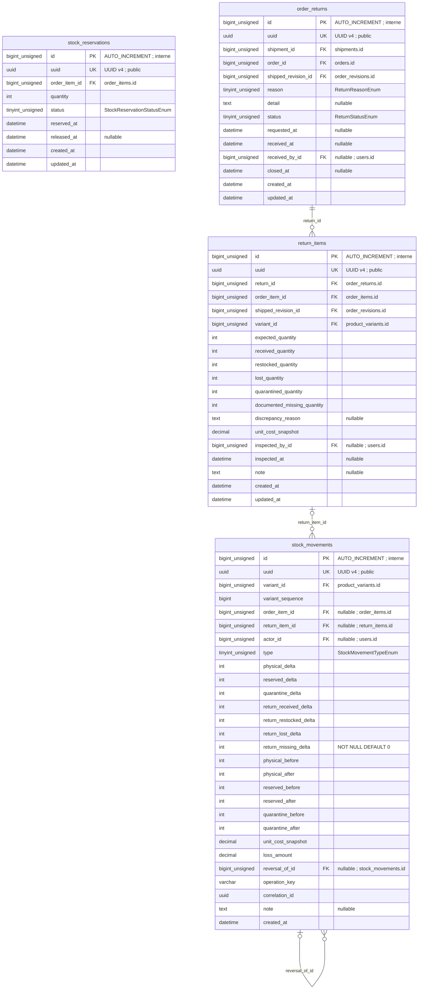
```mermaid
erDiagram
    direction TB
    stock_reservations {
        bigint_unsigned id PK "AUTO_INCREMENT ; interne"
        uuid uuid UK "UUID v4 ; public"
        bigint_unsigned order_item_id FK "order_items.id"
        int quantity
        tinyint_unsigned status "StockReservationStatusEnum"
        datetime reserved_at
        datetime released_at "nullable"
        datetime created_at
        datetime updated_at
    }
    stock_movements {
        bigint_unsigned id PK "AUTO_INCREMENT ; interne"
        uuid uuid UK "UUID v4 ; public"
        bigint_unsigned variant_id FK "product_variants.id"
        bigint variant_sequence
        bigint_unsigned order_item_id FK "nullable ; order_items.id"
        bigint_unsigned return_item_id FK "nullable ; return_items.id"
        bigint_unsigned actor_id FK "nullable ; users.id"
        tinyint_unsigned type "StockMovementTypeEnum"
        int physical_delta
        int reserved_delta
        int quarantine_delta
        int return_received_delta
        int return_restocked_delta
        int return_lost_delta
        int return_missing_delta "NOT NULL DEFAULT 0"
        int physical_before
        int physical_after
        int reserved_before
        int reserved_after
        int quarantine_before
        int quarantine_after
        decimal unit_cost_snapshot
        decimal loss_amount
        bigint_unsigned reversal_of_id FK "nullable ; stock_movements.id"
        varchar operation_key
        uuid correlation_id
        text note "nullable"
        datetime created_at
    }
    order_returns {
        bigint_unsigned id PK "AUTO_INCREMENT ; interne"
        uuid uuid UK "UUID v4 ; public"
        bigint_unsigned shipment_id FK "shipments.id"
        bigint_unsigned order_id FK "orders.id"
        bigint_unsigned shipped_revision_id FK "order_revisions.id"
        tinyint_unsigned reason "ReturnReasonEnum"
        text detail "nullable"
        tinyint_unsigned status "ReturnStatusEnum"
        datetime requested_at "nullable"
        datetime received_at "nullable"
        bigint_unsigned received_by_id FK "nullable ; users.id"
        datetime closed_at "nullable"
        datetime created_at
        datetime updated_at
    }
    return_items {
        bigint_unsigned id PK "AUTO_INCREMENT ; interne"
        uuid uuid UK "UUID v4 ; public"
        bigint_unsigned return_id FK "order_returns.id"
        bigint_unsigned order_item_id FK "order_items.id"
        bigint_unsigned shipped_revision_id FK "order_revisions.id"
        bigint_unsigned variant_id FK "product_variants.id"
        int expected_quantity
        int received_quantity
        int restocked_quantity
        int lost_quantity
        int quarantined_quantity
        int documented_missing_quantity
        text discrepancy_reason "nullable"
        decimal unit_cost_snapshot
        bigint_unsigned inspected_by_id FK "nullable ; users.id"
        datetime inspected_at "nullable"
        text note "nullable"
        datetime created_at
        datetime updated_at
    }
    return_items |o--o{ stock_movements : return_item_id
    stock_movements |o--o{ stock_movements : reversal_of_id
    order_returns ||--o{ return_items : return_id
```

#### Explication très simple des champs

**`stock_reservations` :**

- **`id`** : le numéro unique qui permet de reconnaître cette ligne dans la base. Deux lignes différentes ne peuvent pas avoir le même `id`.
- **`uuid`** : identifiant public UUID v4 unique et indexé ; routes, API, formulaires et exports utilisent cet identifiant, sans exposer la PK numérique.
- **`order_item_id`** : l’identifiant de la ligne de produit de la commande. Il sert à relier cette ligne à la bonne information au lieu de recopier toutes ses données.
- **`quantity`** : le nombre d’éléments concernés. Exemple : `2` signifie deux unités du produit.
- **`status`** : code entier de l’enum propre à cet objet, défini au §3.3 ; les libellés sont traduits à l’affichage et les transitions contrôlées par le service.
- **`reserved_at`** : la date et l’heure liées à **reserve**. Elle permet de savoir exactement quand cette étape a eu lieu.
- **`released_at`** : la date et l’heure liées à **libere**. Elle permet de savoir exactement quand cette étape a eu lieu. Ce champ peut rester vide quand cette information n’est pas nécessaire ou pas encore connue.
- **`created_at`** : la date où cette ligne a été créée dans la base.
- **`updated_at`** : la date de la dernière modification de cette ligne. Exemple : si tu modifies l’élément aujourd’hui, cette date devient celle d’aujourd’hui.

**`stock_movements` :**

- **`id`** : le numéro unique qui permet de reconnaître cette ligne dans la base. Deux lignes différentes ne peuvent pas avoir le même `id`.
- **`uuid`** : identifiant public UUID v4 unique et indexé ; routes, API, formulaires et exports utilisent cet identifiant, sans exposer la PK numérique.
- **`variant_id`** : l’identifiant de la variante du produit. Il sert à relier cette ligne à la bonne information au lieu de recopier toutes ses données.
- **`variant_sequence`** : le numéro d’ordre des mouvements de stock pour cette variante. Il aide à remettre les mouvements dans le bon ordre.
- **`order_item_id`** : l’identifiant de la ligne de produit de la commande. Il sert à relier cette ligne à la bonne information au lieu de recopier toutes ses données. Ce champ peut rester vide quand cette information n’est pas nécessaire ou pas encore connue.
- **`return_item_id`** : l’identifiant de la ligne du retour. Il sert à relier cette ligne à la bonne information au lieu de recopier toutes ses données. Ce champ peut rester vide quand cette information n’est pas nécessaire ou pas encore connue.
- **`actor_id`** : l’identifiant de la personne qui a fait l’action. Il sert à relier cette ligne à la bonne information au lieu de recopier toutes ses données. Ce champ peut rester vide quand cette information n’est pas nécessaire ou pas encore connue.
- **`type`** : code de `StockMovementTypeEnum` décrivant la nature exacte du mouvement : réception, réservation, libération, expédition, retour, ajustement, contrepassation, etc.
- **`physical_delta`** : le changement du stock physique. Exemple : `-2` signifie que deux unités ont quitté le stock physique.
- **`reserved_delta`** : le changement du stock réservé. Exemple : `+1` réserve une unité ; `-1` la libère.
- **`quarantine_delta`** : le changement du stock en quarantaine.
- **`return_received_delta`** : le nombre d’unités ajoutées au journal parce qu’elles ont été reçues lors d’un retour.
- **`return_restocked_delta`** : le nombre d’unités revenues dans le stock vendable après contrôle du retour.
- **`return_lost_delta`** : le nombre d’unités reconnues perdues pendant le traitement d’un retour.
- **`return_missing_delta`** : le nombre d’unités attendues dans le retour mais non reçues.
- **`physical_before`** : le stock physique juste avant le mouvement.
- **`physical_after`** : le stock physique juste après le mouvement.
- **`reserved_before`** : le stock réservé juste avant le mouvement.
- **`reserved_after`** : le stock réservé juste après le mouvement.
- **`quarantine_before`** : le stock en quarantaine juste avant le mouvement.
- **`quarantine_after`** : le stock en quarantaine juste après le mouvement.
- **`unit_cost_snapshot`** : une copie du coût unitaire au moment de la vente, afin que la marge historique ne change pas si le coût catalogue change plus tard.
- **`loss_amount`** : le montant estimé de la perte liée à l’incident.
- **`reversal_of_id`** : l’identifiant de l’ancienne écriture annulée par une écriture inverse. Il sert à relier cette ligne à la bonne information au lieu de recopier toutes ses données. Ce champ peut rester vide quand cette information n’est pas nécessaire ou pas encore connue.
- **`operation_key`** : une clé unique utilisée pour reconnaître une opération déjà faite. Exemple : si le serveur reçoit deux fois la même demande après une coupure, cette clé aide à éviter de faire l’opération deux fois.
- **`correlation_id`** : un numéro commun utilisé pour relier plusieurs traces qui appartiennent à la même grande opération. Exemple : une création de boutique qui produit plusieurs actions techniques.
- **`note`** : une information libre ajoutée pour aider à comprendre la ligne. Selon la table, cela peut être une note interne ou une note chiffrée. Ce champ peut rester vide quand cette information n’est pas nécessaire ou pas encore connue.
- **`created_at`** : la date où cette ligne a été créée dans la base.

**`order_returns` :**

- **`id`** : le numéro unique qui permet de reconnaître cette ligne dans la base. Deux lignes différentes ne peuvent pas avoir le même `id`.
- **`uuid`** : identifiant public UUID v4 unique et indexé ; routes, API, formulaires et exports utilisent cet identifiant, sans exposer la PK numérique.
- **`shipment_id`** : l’identifiant de la livraison. Il sert à relier cette ligne à la bonne information au lieu de recopier toutes ses données.
- **`order_id`** : l’identifiant de la commande. Il sert à relier cette ligne à la bonne information au lieu de recopier toutes ses données.
- **`shipped_revision_id`** : l’identifiant de la version réellement expédiée. Il sert à relier cette ligne à la bonne information au lieu de recopier toutes ses données.
- **`reason`** : la raison principale de l’action. Exemple : retour parce que le client a refusé le colis.
- **`detail`** : quelques détails utiles sur l’événement, sans y mettre de secrets. Ce champ peut rester vide quand cette information n’est pas nécessaire ou pas encore connue.
- **`status`** : code entier de l’enum propre à cet objet, défini au §3.3 ; les libellés sont traduits à l’affichage et les transitions contrôlées par le service.
- **`requested_at`** : la date et l’heure liées à **demande**. Elle permet de savoir exactement quand cette étape a eu lieu. Ce champ peut rester vide quand cette information n’est pas nécessaire ou pas encore connue.
- **`received_at`** : la date et l’heure liées à **recu**. Elle permet de savoir exactement quand cette étape a eu lieu. Ce champ peut rester vide quand cette information n’est pas nécessaire ou pas encore connue.
- **`received_by_id`** : l’identifiant de la personne qui a reçu. Il sert à relier cette ligne à la bonne information au lieu de recopier toutes ses données. Ce champ peut rester vide quand cette information n’est pas nécessaire ou pas encore connue.
- **`closed_at`** : la date et l’heure liées à **clos**. Elle permet de savoir exactement quand cette étape a eu lieu. Ce champ peut rester vide quand cette information n’est pas nécessaire ou pas encore connue.
- **`created_at`** : la date où cette ligne a été créée dans la base.
- **`updated_at`** : la date de la dernière modification de cette ligne. Exemple : si tu modifies l’élément aujourd’hui, cette date devient celle d’aujourd’hui.

**`return_items` :**

- **`id`** : le numéro unique qui permet de reconnaître cette ligne dans la base. Deux lignes différentes ne peuvent pas avoir le même `id`.
- **`uuid`** : identifiant public UUID v4 unique et indexé ; routes, API, formulaires et exports utilisent cet identifiant, sans exposer la PK numérique.
- **`return_id`** : l’identifiant du retour. Il sert à relier cette ligne à la bonne information au lieu de recopier toutes ses données.
- **`order_item_id`** : l’identifiant de la ligne de produit de la commande. Il sert à relier cette ligne à la bonne information au lieu de recopier toutes ses données.
- **`shipped_revision_id`** : l’identifiant de la version réellement expédiée. Il sert à relier cette ligne à la bonne information au lieu de recopier toutes ses données.
- **`variant_id`** : l’identifiant de la variante du produit. Il sert à relier cette ligne à la bonne information au lieu de recopier toutes ses données.
- **`expected_quantity`** : le nombre d’unités que l’on s’attend à recevoir ou traiter.
- **`received_quantity`** : le nombre d’unités réellement reçues.
- **`restocked_quantity`** : le nombre d’unités contrôlées puis remises dans le stock vendable.
- **`lost_quantity`** : le nombre d’unités considérées comme perdues.
- **`quarantined_quantity`** : le nombre d’unités gardées à part pour vérification.
- **`documented_missing_quantity`** : le nombre d’unités qui devaient revenir mais qui manquent, avec une explication enregistrée.
- **`discrepancy_reason`** : explique pourquoi le montant reçu est différent du montant attendu. Ce champ peut rester vide quand cette information n’est pas nécessaire ou pas encore connue.
- **`unit_cost_snapshot`** : une copie du coût unitaire au moment de la vente, afin que la marge historique ne change pas si le coût catalogue change plus tard.
- **`inspected_by_id`** : l’identifiant de la personne qui a inspecté. Il sert à relier cette ligne à la bonne information au lieu de recopier toutes ses données. Ce champ peut rester vide quand cette information n’est pas nécessaire ou pas encore connue.
- **`inspected_at`** : la date et l’heure liées à **inspecte**. Elle permet de savoir exactement quand cette étape a eu lieu. Ce champ peut rester vide quand cette information n’est pas nécessaire ou pas encore connue.
- **`note`** : une information libre ajoutée pour aider à comprendre la ligne. Selon la table, cela peut être une note interne ou une note chiffrée. Ce champ peut rester vide quand cette information n’est pas nécessaire ou pas encore connue.
- **`created_at`** : la date où cette ligne a été créée dans la base.
- **`updated_at`** : la date de la dernière modification de cette ligne. Exemple : si tu modifies l’élément aujourd’hui, cette date devient celle d’aujourd’hui.


Les références vers un autre module sont indiquées sur les champs, même si leur flèche n’est pas redessinée ici.

- **`stock_reservations` :** Une ligne de commande ne peut avoir qu’une seule réservation de stock. Le statut utilise `StockReservationStatusEnum` : `1 ACTIVE`, `2 RELEASED`, `3 CONSUMED`. Quand la réservation est active, sa quantité doit être exactement celle de la ligne de commande. Le stock est réservé au moment de la confirmation téléphonique, dans la même transaction que cette confirmation ; le contrôle opérationnel qui vient après ne réserve rien une deuxième fois. Un remplacement gratuit accepté réserve lui aussi son stock sans permettre la survente. Si on remplace une révision avant expédition, les anciennes réservations sont libérées et les nouvelles sont créées dans la même transaction. Les variantes sont verrouillées dans un ordre stable pour éviter que deux commandes simultanées se bloquent mutuellement. Pour chaque variante, la somme des réservations actives doit être égale à `reserved_stock`. Quand le colis est réellement remis au transporteur, la réservation est consommée ; si la commande est annulée avant cette remise, elle est libérée.

- **`stock_movements` :** Cette table est le journal officiel de tous les mouvements de stock. Chaque variante possède sa propre séquence `1, 2, 3...`, toujours croissante, et `operation_key` évite d’enregistrer deux fois la même opération. Un mouvement ne peut annuler qu’un mouvement de la même variante et ne peut jamais s’annuler lui-même. On ne modifie jamais un ancien mouvement : pour corriger une erreur, on écrit une contrepassation qui fait exactement l’inverse, puis éventuellement un nouveau mouvement correct. Tous les changements de compteurs, réservations et mouvements sont écrits ensemble dans la même transaction. Après chaque mouvement, le physique, le réservé et la quarantaine doivent rester positifs ou nuls. Les types couvrent notamment l’ouverture, l’entrée manuelle, la réservation, la libération, l’expédition, la quarantaine, la perte, le manquant de retour et la contrepassation. Lorsqu’un colis revient, les unités reçues entrent d’abord en quarantaine. Après inspection, une unité peut soit redevenir vendable, soit être déclarée perdue. Si une unité attendue n’est jamais revenue, on enregistre `return_missing_delta` mais on ne l’ajoute pas au stock, puisqu’elle n’a pas été reçue. La perte financière est enregistrée ici une seule fois avec le coût snapshot ; décider ensuite qui est responsable, s’il y a indemnisation, avoir ou remboursement est un autre sujet. Une contrepassation inverse tous les deltas et le montant de perte du mouvement original, garde les mêmes références et verrouille l’original. On refuse l’inverse si cela rendrait les soldes impossibles ou si le cycle métier a déjà avancé d’une manière incompatible. Une correction finale reçoit le même `correlation_id` pour montrer qu’elle appartient au même dossier.

- **`order_returns` :** Une livraison ne peut avoir qu’un seul retour. Le retour est lié à la bonne commande et exactement à la révision qui avait été expédiée. Ses statuts utilisent exactement `ReturnStatusEnum` : `1 REQUESTED`, `2 IN_TRANSIT`, `3 RECEIVED`, `4 INSPECTING`, `5 CLOSED`, `6 CANCELLED`. Au MVP, un retour physique concerne obligatoirement tout le colis : à l’ouverture du retour, le système crée une ligne `return_items` pour chaque ligne expédiée, avec toute sa quantité. Il refuse qu’on omette volontairement un produit ou qu’on demande volontairement une quantité plus petite. Cette règle est placée dans le service métier pour pouvoir être retirée plus tard si tu autorises les retours partiels, sans refaire toute la BDD. Si un article devait revenir mais manque réellement dans le colis, on le note `manquant_documente` : ce n’est pas considéré comme un retour partiel choisi par le client. `received_at` n’est rempli que lorsqu’on a réellement reçu le colis localement ; un simple statut envoyé par le transporteur ne suffit pas. Fermer la réception n’oblige pas à sortir immédiatement les produits de quarantaine : leur inspection peut continuer ensuite et reste tracée.

- **`return_items` :** Une même ligne de commande ne peut apparaître qu’une seule fois dans un même retour. Chaque ligne de retour doit correspondre à la bonne révision expédiée et à la bonne variante. Techniquement, `expected_quantity` doit être supérieure à 0 et ne peut pas dépasser la quantité qui avait été expédiée. Au MVP, on impose encore plus simple : `expected_quantity` doit être exactement égale à la quantité expédiée, et chaque ligne expédiée doit avoir sa ligne de retour. Tous les compteurs restent positifs ou nuls. On ne peut pas recevoir plus que ce qu’on attendait. Ce qui a été reçu doit toujours être expliqué comme « remis en stock », « perdu » ou « encore en quarantaine ». À la clôture, `reçue + manquante_documentee = attendue`. S’il manque quelque chose, un `discrepancy_reason` est obligatoire. Les quantités finales viennent du journal `stock_movements`, notamment `documented_missing_quantity = somme des return_missing_delta`. Une unité manquante n’a jamais été reçue, donc elle ne doit jamais augmenter le stock.

### T10 — Livraison et prix

**`shipping_providers` — Les personnes ou sociétés qui livrent pour la boutique. Exemple : un livreur interne ou EcoTrack, avec le suivi de l’argent qu’ils doivent reverser.**

**`customer_shipping_rates` — Le prix de livraison demandé à l’acheteur. Exemple : le client paie 600 DA pour une livraison dans une zone donnée ; ce prix peut différer du coût payé au transporteur.**

**`provider_rates` — Le coût estimé de la livraison pour la boutique selon la zone et le mode choisi. Exemple : estimer le coût d’une livraison à domicile. Les tarifs de retour des comptes société sont versionnés dans carrier_rate_versions de cette boutique (T25).**

**`free_shipping_rules` — Les conditions qui rendent automatiquement la livraison gratuite pour le client. Exemple : offrir la livraison lorsque la commande remplit la règle définie par la boutique.**

```mermaid
erDiagram
    direction TB
    shipping_providers {
        bigint_unsigned id PK "AUTO_INCREMENT ; interne"
        uuid uuid UK "UUID v4 ; public"
        tinyint_unsigned type "ShippingProviderTypeEnum"
        varchar name
        bigint_unsigned user_id FK "nullable ; users.id"
        varchar phone "nullable"
        varchar email "nullable"
        varchar carrier_code "nullable"
        bigint_unsigned carrier_account_id FK "nullable ; carrier_accounts.id"
        datetime last_synced_at "nullable"
        boolean is_active
        datetime created_at
        datetime updated_at
        datetime deleted_at "nullable"
    }
    customer_shipping_rates {
        bigint_unsigned id PK "AUTO_INCREMENT ; interne"
        uuid uuid UK "UUID v4 ; public"
        uuid province_uuid "REF central.provinces.uuid"
        uuid municipality_uuid "nullable ; REF central.municipalities.uuid"
        tinyint_unsigned delivery_mode "DeliveryModeEnum"
        decimal amount
        boolean is_active
        datetime created_at
        datetime updated_at
        datetime deleted_at "nullable"
    }
    provider_rates {
        bigint_unsigned id PK "AUTO_INCREMENT ; interne"
        uuid uuid UK "UUID v4 ; public"
        bigint_unsigned provider_id FK "shipping_providers.id"
        uuid province_uuid "REF central.provinces.uuid"
        uuid municipality_uuid "nullable ; REF central.municipalities.uuid"
        tinyint_unsigned delivery_mode "DeliveryModeEnum"
        tinyint_unsigned service_type "ServiceTypeEnum"
        decimal amount
        tinyint_unsigned source "ProviderRateSourceEnum"
        datetime retrieved_at
        boolean is_active
        datetime created_at
        datetime updated_at
        datetime deleted_at "nullable"
    }
    free_shipping_rules {
        bigint_unsigned id PK "AUTO_INCREMENT ; interne"
        uuid uuid UK "UUID v4 ; public"
        varchar name
        bigint_unsigned product_id FK "nullable ; products.id"
        uuid province_uuid "nullable ; REF central.provinces.uuid"
        tinyint_unsigned delivery_mode "nullable ; DeliveryModeEnum"
        decimal minimum_cart_amount "nullable"
        datetime started_at "nullable"
        datetime ended_at "nullable"
        int priority
        boolean is_active
        datetime created_at
        datetime updated_at
        datetime deleted_at "nullable"
    }
    shipping_providers ||--o{ provider_rates : provider_id
```

#### Explication très simple des champs

**`shipping_providers` :**

- **`id`** : le numéro unique qui permet de reconnaître cette ligne dans la base. Deux lignes différentes ne peuvent pas avoir le même `id`.
- **`uuid`** : identifiant public UUID v4 unique et indexé ; routes, API, formulaires et exports utilisent cet identifiant, sans exposer la PK numérique.
- **`type`** : code de `ShippingProviderTypeEnum` : `1 CARRIER`, `2 EMPLOYEE`, `3 OWNER`.
- **`name`** : le nom affiché à l’utilisateur. Exemple : « Nombre de boutiques » ou « Livraison EcoTrack ».
- **`user_id`** : l’identifiant du compte utilisateur. Il sert à relier cette ligne à la bonne information au lieu de recopier toutes ses données. Ce champ peut rester vide quand cette information n’est pas nécessaire ou pas encore connue.
- **`phone`** : le numéro de téléphone. Il est gardé comme texte pour ne pas perdre le `0`, le `+213` ou d’autres signes utiles. Ce champ peut rester vide quand cette information n’est pas nécessaire ou pas encore connue.
- **`email`** : l’adresse email du compte. Ce champ peut rester vide quand cette information n’est pas nécessaire ou pas encore connue.
- **`carrier_code`** : le code utilisé par le transporteur pour reconnaître une zone ou un service. Ce champ peut rester vide quand cette information n’est pas nécessaire ou pas encore connue.
- **`carrier_account_id`** : l’identifiant du compte transporteur. Il sert à relier cette ligne à la bonne information au lieu de recopier toutes ses données. Ce champ peut rester vide quand cette information n’est pas nécessaire ou pas encore connue.
- **`last_synced_at`** : la dernière fois où le SaaS a synchronisé ce compte avec le service externe. Ce champ peut rester vide quand cette information n’est pas nécessaire ou pas encore connue.
- **`is_active`** : indique si l’élément peut encore être utilisé. `true` = oui, `false` = non.
- **`created_at`** : la date où cette ligne a été créée dans la base.
- **`updated_at`** : la date de la dernière modification de cette ligne. Exemple : si tu modifies l’élément aujourd’hui, cette date devient celle d’aujourd’hui.
- **`deleted_at`** : la date où l’élément a été retiré sans effacer son ancienne ligne. Si ce champ est vide, l’élément n’est pas supprimé.

**`customer_shipping_rates` :**

- **`id`** : le numéro unique qui permet de reconnaître cette ligne dans la base. Deux lignes différentes ne peuvent pas avoir le même `id`.
- **`uuid`** : identifiant public UUID v4 unique et indexé ; routes, API, formulaires et exports utilisent cet identifiant, sans exposer la PK numérique.
- **`province_uuid`** : l’identifiant de la wilaya. Il sert à relier cette ligne à la bonne information au lieu de recopier toutes ses données.
- **`municipality_uuid`** : l’identifiant de la commune. Il sert à relier cette ligne à la bonne information au lieu de recopier toutes ses données. Ce champ peut rester vide quand cette information n’est pas nécessaire ou pas encore connue.
- **`delivery_mode`** : la façon de livrer choisie. Exemple : domicile ou point relais.
- **`amount`** : la somme d’argent de cette ligne, en DZD au lancement. Exemple : `3000` signifie 3 000 DA.
- **`is_active`** : indique si cette possibilité est autorisée. `true` = oui, `false` = non.
- **`created_at`** : la date où cette ligne a été créée dans la base.
- **`updated_at`** : la date de la dernière modification de cette ligne. Exemple : si tu modifies l’élément aujourd’hui, cette date devient celle d’aujourd’hui.
- **`deleted_at`** : la date où l’élément a été retiré sans effacer son ancienne ligne. Si ce champ est vide, l’élément n’est pas supprimé.

**`provider_rates` :**

- **`id`** : le numéro unique qui permet de reconnaître cette ligne dans la base. Deux lignes différentes ne peuvent pas avoir le même `id`.
- **`uuid`** : identifiant public UUID v4 unique et indexé ; routes, API, formulaires et exports utilisent cet identifiant, sans exposer la PK numérique.
- **`provider_id`** : l’identifiant du transporteur ou livreur. Il sert à relier cette ligne à la bonne information au lieu de recopier toutes ses données.
- **`province_uuid`** : l’identifiant de la wilaya. Il sert à relier cette ligne à la bonne information au lieu de recopier toutes ses données.
- **`municipality_uuid`** : l’identifiant de la commune. Il sert à relier cette ligne à la bonne information au lieu de recopier toutes ses données. Ce champ peut rester vide quand cette information n’est pas nécessaire ou pas encore connue.
- **`delivery_mode`** : la façon de livrer choisie. Exemple : domicile ou point relais.
- **`service_type`** : indique la catégorie de **prestation** utilisée pour cette ligne.
- **`amount`** : la somme d’argent de cette ligne, en DZD au lancement. Exemple : `3000` signifie 3 000 DA.
- **`source`** : code de `ProviderRateSourceEnum` : `1 MANUAL` pour une saisie manuelle, `2 API` pour un tarif importé par API.
- **`retrieved_at`** : la date et l’heure liées à **releve**. Elle permet de savoir exactement quand cette étape a eu lieu.
- **`is_active`** : indique si cette possibilité est autorisée. `true` = oui, `false` = non.
- **`created_at`** : la date où cette ligne a été créée dans la base.
- **`updated_at`** : la date de la dernière modification de cette ligne. Exemple : si tu modifies l’élément aujourd’hui, cette date devient celle d’aujourd’hui.
- **`deleted_at`** : la date où l’élément a été retiré sans effacer son ancienne ligne. Si ce champ est vide, l’élément n’est pas supprimé.

**`free_shipping_rules` :**

- **`id`** : le numéro unique qui permet de reconnaître cette ligne dans la base. Deux lignes différentes ne peuvent pas avoir le même `id`.
- **`uuid`** : identifiant public UUID v4 unique et indexé ; routes, API, formulaires et exports utilisent cet identifiant, sans exposer la PK numérique.
- **`name`** : le nom affiché à l’utilisateur. Exemple : « Nombre de boutiques » ou « Livraison EcoTrack ».
- **`product_id`** : l’identifiant du produit. Il sert à relier cette ligne à la bonne information au lieu de recopier toutes ses données. Ce champ peut rester vide quand cette information n’est pas nécessaire ou pas encore connue.
- **`province_uuid`** : l’identifiant de la wilaya. Il sert à relier cette ligne à la bonne information au lieu de recopier toutes ses données. Ce champ peut rester vide quand cette information n’est pas nécessaire ou pas encore connue.
- **`delivery_mode`** : la façon de livrer choisie. Exemple : domicile ou point relais. Ce champ peut rester vide quand cette information n’est pas nécessaire ou pas encore connue.
- **`minimum_cart_amount`** : la somme d’argent correspondant à **panier minimum**. Exemple : `1500` représente 1 500 DA au lancement. Ce champ peut rester vide quand cette information n’est pas nécessaire ou pas encore connue.
- **`started_at`** : la date et l’heure où la période ou l’action commence. Ce champ peut rester vide quand cette information n’est pas nécessaire ou pas encore connue.
- **`ended_at`** : la date et l’heure où elle s’est terminée. Peut rester vide tant que ce n’est pas terminé.
- **`priority`** : un nombre utilisé pour décider quel élément passe avant un autre. Exemple : priorité 1 avant priorité 2.
- **`is_active`** : indique si cette possibilité est autorisée. `true` = oui, `false` = non.
- **`created_at`** : la date où cette ligne a été créée dans la base.
- **`updated_at`** : la date de la dernière modification de cette ligne. Exemple : si tu modifies l’élément aujourd’hui, cette date devient celle d’aujourd’hui.
- **`deleted_at`** : la date où l’élément a été retiré sans effacer son ancienne ligne. Si ce champ est vide, l’élément n’est pas supprimé.


Les références vers un autre module sont indiquées sur les champs, même si leur flèche n’est pas redessinée ici.

- **`shipping_providers` :** type=1 CARRIER, 2 EMPLOYEE ou 3 OWNER. Pour CARRIER, carrier_account_id est obligatoire et vise carrier_accounts dans cette BDD ; UNIQUE(carrier_account_id) hors NULL. Pour EMPLOYEE/OWNER, carrier_account_id est NULL ; user_id, si renseigné, vise un compte local actif et autorisé. Aucun secret n’est recopié dans le prestataire : il reste dans son compte local T25. Après premier usage, le compte/prestataire d’un colis est immuable ; créer un nouveau prestataire pour un nouveau compte, désactiver l’ancien sans effacer l’historique.

- **`customer_shipping_rates` :** Pour une même wilaya, commune et mode de livraison, il ne peut exister qu’un seul tarif actif correspondant. Si un tarif précis existe pour la commune, il passe avant le tarif général de la wilaya. S’il n’existe aucun tarif applicable, cela signifie « livraison indisponible », pas « livraison gratuite ». Avant que le client soumette sa commande, le serveur vérifie les quantités et affiche le total complet.

- **`provider_rates` :** Cette table sert de devis ou de cache local pour connaître le coût prévu d’une livraison, d’une seconde tentative ou d’un remplacement selon la zone et le mode. Le tarif de retour, lui, ne vient jamais d’ici : il vient de `carrier_rate_versions` de cette boutique. Le montant ne peut pas être négatif et `source=1 MANUAL | 2 API` (`ProviderRateSourceEnum`). Pour une même combinaison prestataire + zone + mode + type de prestation, il n’existe qu’un seul tarif. Importer un montant depuis une API ne signifie pas automatiquement que le commerçant le doit : il faut encore savoir qui doit payer. Les vrais frais historiques sont figés dans `carrier_fees` et ne sont jamais recalculés plus tard à partir de ce cache. Pour un livreur interne, les frais de retour suivent un montant saisi et figé manuellement.

- **`free_shipping_rules` :** Une règle est appliquée seulement si tous ses critères renseignés sont vrais. Si elle est satisfaite, la livraison de toute la commande devient gratuite pour le client. Si `product_id` est rempli, cela veut dire que ce produit doit être présent dans la commande. On ne calcule pas un frais de livraison pour chaque ligne : la commande part dans un seul colis. « Gratuite pour le client » ne veut pas dire « gratuite pour le commerçant » : le prestataire peut toujours facturer son vrai coût.

### T11 — Transporteur et colis

**`carrier_geo_mappings` — Relie les wilayas et communes du SaaS aux noms ou codes utilisés par chaque transporteur. Exemple : traduire une commune choisie sur le site en code reconnu par EcoTrack.**

**`pickup_points` — Les bureaux du transporteur où le client peut retirer son colis. Exemple : choisir un stop desk au lieu d’une livraison à domicile.**

**`shipments` — Le colis envoyé pour une commande et les informations permettant de le suivre. Exemple : une commande de trois produits part dans un seul colis avec un numéro de suivi.**

**`shipment_events` — Les étapes reçues pendant le transport, avec le message original du transporteur. Exemple : « en livraison », puis « livré » ou « refusé ».**

```mermaid
erDiagram
    direction TB
    carrier_geo_mappings {
        bigint_unsigned id PK "AUTO_INCREMENT ; interne"
        uuid uuid UK "UUID v4 ; public"
        bigint_unsigned provider_id FK "shipping_providers.id"
        tinyint_unsigned zone_type "GeoZoneTypeEnum"
        uuid province_uuid "REF central.provinces.uuid"
        uuid municipality_uuid "nullable ; REF central.municipalities.uuid"
        varchar external_code
        varchar external_name
        varchar external_province_code
        varchar verification_source
        datetime verified_at "nullable"
        varchar mapping_version
        boolean is_active
        datetime synced_at
        datetime created_at
        datetime updated_at
    }
    pickup_points {
        bigint_unsigned id PK "AUTO_INCREMENT ; interne"
        uuid uuid UK "UUID v4 ; public"
        bigint_unsigned provider_id FK "shipping_providers.id"
        varchar external_code
        varchar name
        uuid province_uuid "REF central.provinces.uuid"
        uuid municipality_uuid "nullable ; REF central.municipalities.uuid"
        text address
        varchar phone "nullable"
        varchar map_url "nullable"
        boolean is_carrier_active
        boolean is_shop_active
        datetime synced_at
        datetime created_at
        datetime updated_at
        datetime deleted_at "nullable"
    }
    shipments {
        bigint_unsigned id PK "AUTO_INCREMENT ; interne"
        uuid uuid UK "UUID v4 ; public"
        bigint_unsigned order_id FK "orders.id"
        bigint_unsigned shipped_revision_id FK "order_revisions.id"
        bigint_unsigned provider_id FK "shipping_providers.id"
        bigint_unsigned pickup_point_id FK "nullable ; pickup_points.id"
        tinyint_unsigned delivery_mode "DeliveryModeEnum"
        tinyint_unsigned status "ShipmentStatusEnum"
        varchar raw_external_status "nullable"
        varchar tracking "nullable"
        varchar merchant_reference "nullable avant preparation externe ; stable par colis"
        varchar external_reference "nullable"
        decimal cod_amount
        decimal estimated_cost
        decimal weight_kg "nullable"
        boolean is_fragile
        bigint_unsigned label_media_id FK "nullable ; media.id"
        bigint_unsigned assigned_by_id FK "users.id"
        datetime shipped_at "nullable"
        datetime carrier_validated_at "nullable"
        datetime acknowledged_at "nullable"
        varchar acknowledgement_source "nullable"
        bigint_unsigned delivery_proof_media_id FK "nullable ; media.id"
        varchar external_delivery_proof_reference "nullable"
        char(64) proof_hash "nullable"
        datetime delivered_at "nullable"
        datetime last_synced_at "nullable"
        datetime created_at
        datetime updated_at
    }
    shipment_events {
        bigint_unsigned id PK "AUTO_INCREMENT ; interne"
        uuid uuid UK "UUID v4 ; public"
        bigint_unsigned shipment_id FK "shipments.id"
        tinyint_unsigned logistics_status "nullable ; ShipmentStatusEnum"
        tinyint_unsigned financial_status "nullable ; CollectionStatusEnum"
        varchar external_code "nullable"
        varchar event_type
        varchar raw_external_activity "nullable"
        varchar raw_external_status "nullable"
        varchar adapter_version
        json sanitized_external_payload "nullable"
        char(64) payload_hash
        datetime payload_expires_at "nullable"
        datetime payload_purged_at "nullable"
        text reason "nullable"
        text comment "nullable"
        varchar station "nullable"
        varchar courier_label "nullable"
        datetime next_delivery_attempt_at "nullable"
        datetime occurred_at "nullable"
        datetime observed_at
        tinyint_unsigned source "ShipmentEventSourceEnum"
        bigint_unsigned actor_id FK "nullable ; users.id"
        varchar deduplication_key
        datetime created_at
    }
    pickup_points |o--o{ shipments : pickup_point_id
    shipments ||--o{ shipment_events : shipment_id
```

#### Explication très simple des champs


**`carrier_geo_mappings` :**

- **`id`** : le numéro unique qui permet de reconnaître cette ligne dans la base. Deux lignes différentes ne peuvent pas avoir le même `id`.
- **`uuid`** : identifiant public UUID v4 unique et indexé ; routes, API, formulaires et exports utilisent cet identifiant, sans exposer la PK numérique.
- **`provider_id`** : l’identifiant du transporteur ou livreur. Il sert à relier cette ligne à la bonne information au lieu de recopier toutes ses données.
- **`zone_type`** : indique la catégorie de **zone** utilisée pour cette ligne.
- **`province_uuid`** : l’identifiant de la wilaya. Il sert à relier cette ligne à la bonne information au lieu de recopier toutes ses données.
- **`municipality_uuid`** : l’identifiant de la commune. Il sert à relier cette ligne à la bonne information au lieu de recopier toutes ses données. Ce champ peut rester vide quand cette information n’est pas nécessaire ou pas encore connue.
- **`external_code`** : le code utilisé pour reconnaître **externe** de manière stable dans le programme ou chez un service externe.
- **`external_name`** : le nom utilisé par le transporteur pour cet élément.
- **`external_province_code`** : le code de wilaya attendu par ce transporteur, qui peut être différent du code interne du SaaS.
- **`verification_source`** : indique d’où vient **verification** afin de savoir si l’information vient du SaaS, d’un utilisateur ou d’un service externe.
- **`verified_at`** : la date où l’information a été vérifiée. Ce champ peut rester vide quand cette information n’est pas nécessaire ou pas encore connue.
- **`mapping_version`** : la version des règles utilisées pour traduire les statuts du transporteur en statuts internes.
- **`is_active`** : indique si cette possibilité est autorisée. `true` = oui, `false` = non.
- **`synced_at`** : la date et l’heure liées à **synchronise**. Elle permet de savoir exactement quand cette étape a eu lieu.
- **`created_at`** : la date où cette ligne a été créée dans la base.
- **`updated_at`** : la date de la dernière modification de cette ligne. Exemple : si tu modifies l’élément aujourd’hui, cette date devient celle d’aujourd’hui.

**`pickup_points` :**

- **`id`** : le numéro unique qui permet de reconnaître cette ligne dans la base. Deux lignes différentes ne peuvent pas avoir le même `id`.
- **`uuid`** : identifiant public UUID v4 unique et indexé ; routes, API, formulaires et exports utilisent cet identifiant, sans exposer la PK numérique.
- **`provider_id`** : l’identifiant du transporteur ou livreur. Il sert à relier cette ligne à la bonne information au lieu de recopier toutes ses données.
- **`external_code`** : le code utilisé pour reconnaître **externe** de manière stable dans le programme ou chez un service externe.
- **`name`** : le nom affiché à l’utilisateur. Exemple : « Nombre de boutiques » ou « Livraison EcoTrack ».
- **`province_uuid`** : l’identifiant de la wilaya. Il sert à relier cette ligne à la bonne information au lieu de recopier toutes ses données.
- **`municipality_uuid`** : l’identifiant de la commune. Il sert à relier cette ligne à la bonne information au lieu de recopier toutes ses données. Ce champ peut rester vide quand cette information n’est pas nécessaire ou pas encore connue.
- **`address`** : l’adresse écrite. Exemple : rue, cité ou quartier.
- **`phone`** : le numéro de téléphone. Il est gardé comme texte pour ne pas perdre le `0`, le `+213` ou d’autres signes utiles. Ce champ peut rester vide quand cette information n’est pas nécessaire ou pas encore connue.
- **`map_url`** : un lien vers la position sur une carte. Ce champ peut rester vide quand cette information n’est pas nécessaire ou pas encore connue.
- **`is_carrier_active`** : un **oui/non** pour indiquer si **actif transporteur** est vrai ou autorisé. `true` = oui ; `false` = non.
- **`is_shop_active`** : un **oui/non** pour indiquer si **active boutique** est vrai ou autorisé. `true` = oui ; `false` = non.
- **`synced_at`** : la date et l’heure liées à **synchronise**. Elle permet de savoir exactement quand cette étape a eu lieu.
- **`created_at`** : la date où cette ligne a été créée dans la base.
- **`updated_at`** : la date de la dernière modification de cette ligne. Exemple : si tu modifies l’élément aujourd’hui, cette date devient celle d’aujourd’hui.
- **`deleted_at`** : la date où l’élément a été retiré sans effacer son ancienne ligne. Si ce champ est vide, l’élément n’est pas supprimé.

**`shipments` :**

- **`id`** : le numéro unique qui permet de reconnaître cette ligne dans la base. Deux lignes différentes ne peuvent pas avoir le même `id`.
- **`uuid`** : identifiant public UUID v4 unique et indexé ; routes, API, formulaires et exports utilisent cet identifiant, sans exposer la PK numérique.
- **`order_id`** : l’identifiant de la commande. Il sert à relier cette ligne à la bonne information au lieu de recopier toutes ses données.
- **`shipped_revision_id`** : l’identifiant de la version réellement expédiée. Il sert à relier cette ligne à la bonne information au lieu de recopier toutes ses données.
- **`provider_id`** : l’identifiant du transporteur ou livreur. Il sert à relier cette ligne à la bonne information au lieu de recopier toutes ses données.
- **`pickup_point_id`** : l’identifiant du point relais. Il sert à relier cette ligne à la bonne information au lieu de recopier toutes ses données. Ce champ peut rester vide quand cette information n’est pas nécessaire ou pas encore connue.
- **`delivery_mode`** : la façon de livrer choisie. Exemple : domicile ou point relais.
- **`status`** : code entier de l’enum propre à cet objet, défini au §3.3 ; les libellés sont traduits à l’affichage et les transitions contrôlées par le service.
- **`raw_external_status`** : le statut exact reçu du transporteur avant de le traduire dans les statuts internes du SaaS. Ce champ peut rester vide quand cette information n’est pas nécessaire ou pas encore connue.
- **`tracking`** : le numéro de suivi du colis donné par le transporteur. Ce champ peut rester vide quand cette information n’est pas nécessaire ou pas encore connue.
- **`external_reference`** : le numéro donné par un système extérieur. Exemple : référence d’un reversement chez le transporteur. Ce champ peut rester vide quand cette information n’est pas nécessaire ou pas encore connue.
- **`cod_amount`** : la somme d’argent correspondant à **COD**. Exemple : `1500` représente 1 500 DA au lancement.
- **`estimated_cost`** : le coût correspondant à **estime**, utilisé pour connaître ce que cela coûte réellement au commerçant.
- **`weight_kg`** : le poids en kilogrammes. Ce champ peut rester vide quand cette information n’est pas nécessaire ou pas encore connue.
- **`is_fragile`** : indique si le produit ou la variante doit être traité comme fragile.
- **`label_media_id`** : l’identifiant lié à **etiquete media**. Il sert à retrouver l’élément correspondant. Ce champ peut rester vide quand cette information n’est pas nécessaire ou pas encore connue.
- **`assigned_by_id`** : l’identifiant de la personne qui a affecté. Il sert à relier cette ligne à la bonne information au lieu de recopier toutes ses données.
- **`shipped_at`** : la date et l’heure liées à **expediee**. Elle permet de savoir exactement quand cette étape a eu lieu. Ce champ peut rester vide quand cette information n’est pas nécessaire ou pas encore connue.
- **`carrier_validated_at`** : la date et l’heure liées à **validee transporteur**. Elle permet de savoir exactement quand cette étape a eu lieu. Ce champ peut rester vide quand cette information n’est pas nécessaire ou pas encore connue.
- **`acknowledged_at`** : la date et l’heure liées à **accuse reception**. Elle permet de savoir exactement quand cette étape a eu lieu. Ce champ peut rester vide quand cette information n’est pas nécessaire ou pas encore connue.
- **`acknowledgement_source`** : indique d’où vient la preuve que le colis ou document a été reçu. Exemple : transporteur, saisie manuelle ou autre source prévue. Ce champ peut rester vide quand cette information n’est pas nécessaire ou pas encore connue.
- **`delivery_proof_media_id`** : l’identifiant lié à **preuve reception media**. Il sert à retrouver l’élément correspondant. Ce champ peut rester vide quand cette information n’est pas nécessaire ou pas encore connue.
- **`external_delivery_proof_reference`** : la référence donnée par le système extérieur pour la preuve de réception. Ce champ peut rester vide quand cette information n’est pas nécessaire ou pas encore connue.
- **`proof_hash`** : une petite signature calculée à partir de preuve. Elle permet de vérifier que le contenu n’a pas changé sans stocker une deuxième copie complète. Ce champ peut rester vide quand cette information n’est pas nécessaire ou pas encore connue.
- **`delivered_at`** : la date et l’heure liées à **livree**. Elle permet de savoir exactement quand cette étape a eu lieu. Ce champ peut rester vide quand cette information n’est pas nécessaire ou pas encore connue.
- **`last_synced_at`** : la dernière fois où le SaaS a synchronisé ce compte avec le service externe. Ce champ peut rester vide quand cette information n’est pas nécessaire ou pas encore connue.
- **`created_at`** : la date où cette ligne a été créée dans la base.
- **`updated_at`** : la date de la dernière modification de cette ligne. Exemple : si tu modifies l’élément aujourd’hui, cette date devient celle d’aujourd’hui.

**`shipment_events` :**

- **`id`** : le numéro unique qui permet de reconnaître cette ligne dans la base. Deux lignes différentes ne peuvent pas avoir le même `id`.
- **`uuid`** : identifiant public UUID v4 unique et indexé ; routes, API, formulaires et exports utilisent cet identifiant, sans exposer la PK numérique.
- **`shipment_id`** : l’identifiant de la livraison. Il sert à relier cette ligne à la bonne information au lieu de recopier toutes ses données.
- **`logistics_status`** : code entier de l’enum propre à cet objet, défini au §3.3 ; les libellés sont traduits à l’affichage et les transitions contrôlées par le service.
- **`financial_status`** : code entier de l’enum propre à cet objet, défini au §3.3 ; les libellés sont traduits à l’affichage et les transitions contrôlées par le service.
- **`external_code`** : le code utilisé pour reconnaître **externe** de manière stable dans le programme ou chez un service externe. Ce champ peut rester vide quand cette information n’est pas nécessaire ou pas encore connue.
- **`event_type`** : le type d’événement enregistré. Exemple : vue produit, ajout au panier ou début de checkout.
- **`raw_external_activity`** : le texte ou code d’activité exact reçu du transporteur, conservé seulement si nécessaire pour comprendre son événement. Ce champ peut rester vide quand cette information n’est pas nécessaire ou pas encore connue.
- **`raw_external_status`** : le statut exact reçu du transporteur avant de le traduire dans les statuts internes du SaaS. Ce champ peut rester vide quand cette information n’est pas nécessaire ou pas encore connue.
- **`adapter_version`** : le numéro de version de adaptateur. Exemple : version 1, puis version 2 après une évolution ; l’ancienne version peut rester conservée pour comprendre l’historique.
- **`sanitized_external_payload`** : une copie nettoyée de la réponse externe, sans secrets inutiles. Ce champ peut rester vide quand cette information n’est pas nécessaire ou pas encore connue.
- **`payload_hash`** : une petite signature calculée à partir de payload. Elle permet de vérifier que le contenu n’a pas changé sans stocker une deuxième copie complète.
- **`payload_expires_at`** : la date et l’heure liées à **payload expire**. Elle permet de savoir exactement quand cette étape a eu lieu. Ce champ peut rester vide quand cette information n’est pas nécessaire ou pas encore connue.
- **`payload_purged_at`** : la date et l’heure liées à **payload purge**. Elle permet de savoir exactement quand cette étape a eu lieu. Ce champ peut rester vide quand cette information n’est pas nécessaire ou pas encore connue.
- **`reason`** : explique pourquoi l’action ou la décision a été faite. Ce champ peut rester vide quand cette information n’est pas nécessaire ou pas encore connue.
- **`comment`** : le texte écrit par le client ou l’utilisateur. Ce champ peut rester vide quand cette information n’est pas nécessaire ou pas encore connue.
- **`station`** : la station ou agence du transporteur concernée lorsqu’elle existe.
- **`courier_label`** : le nom ou libellé du livreur fourni par le transporteur lorsqu’il existe.
- **`next_delivery_attempt_at`** : la date et l’heure liées à **prochain passage**. Elle permet de savoir exactement quand cette étape a eu lieu. Ce champ peut rester vide quand cette information n’est pas nécessaire ou pas encore connue.
- **`occurred_at`** : la date et l’heure où l’événement s’est produit. Ce champ peut rester vide quand cette information n’est pas nécessaire ou pas encore connue.
- **`observed_at`** : la date où le SaaS a vu cet événement.
- **`source`** : indique d’où vient l’information. Exemple : saisie manuelle ou réponse de l’API.
- **`actor_id`** : l’identifiant de la personne qui a fait l’action. Il sert à relier cette ligne à la bonne information au lieu de recopier toutes ses données. Ce champ peut rester vide quand cette information n’est pas nécessaire ou pas encore connue.
- **`deduplication_key`** : une clé utilisée pour repérer deux messages ou événements qui représentent en réalité la même action.
- **`created_at`** : la date où cette ligne a été créée dans la base.


Les références vers un autre module sont indiquées sur les champs, même si leur flèche n’est pas redessinée ici.

- **`carrier_geo_mappings` :** Cette table fait le pont entre tes wilayas/communes et les codes compris par le transporteur. `zone_type` utilise `GeoZoneTypeEnum` : `1 PROVINCE` (wilaya) ou `2 MUNICIPALITY` (commune). Pour une commune, `municipality_uuid` est obligatoire ; pour une wilaya il reste vide. Une même combinaison prestataire + type de zone + wilaya + commune ne peut exister qu’une seule fois. `external_code` est le code de la zone chez le transporteur et `external_province_code` donne le contexte de la wilaya chez ce transporteur, même pour une commune. Plusieurs zones internes peuvent parfois pointer vers une ancienne zone externe, donc `external_code` n’est pas unique dans toute la table. Avant d’envoyer un colis, le mapping doit être actif et vérifié ; sinon cette route est considérée indisponible. Les codes wilaya, commune et point relais doivent être vérifiés avec le vrai compte transporteur. On ne transforme jamais automatiquement un UUID local en code EcoTrack.

- **`pickup_points` :** Pour un même prestataire, chaque `external_code` de point relais est unique. Si le commerçant a volontairement masqué un bureau, une synchronisation suivante ne doit pas le réactiver automatiquement. Un point est disponible seulement s’il est actif côté transporteur ET autorisé côté boutique. Les anciens points relais sont désactivés mais conservés, afin que les anciennes commandes continuent de pointer vers quelque chose qui existe.

- **`shipments` :** Une commande ne peut avoir qu’une seule livraison dans ce MVP, et un tracking donné ne peut apparaître qu’une seule fois pour le même prestataire. La livraison doit pointer vers la bonne commande et exactement vers la révision expédiée. Tous les articles de cette révision partent ensemble dans le même colis. Le mode et le point relais doivent être identiques à ceux enregistrés dans la révision : `domicile` sans point relais, ou `stop_desk` avec exactement le point relais choisi. Avant la remise physique, une modification reste possible seulement après avoir vérifié qu’aucune opération distante n’est en cours ou incertaine. Dès que le transporteur a validé le colis ou que le colis est réellement expédié, la révision, son contenu et le montant COD ne changent plus. Une validation API signifie seulement que le transporteur a accepté l’ordre : elle ne prouve pas encore que le colis lui a été remis et elle ne sort donc pas le stock. Le COD utilisé est exactement `order_revisions.amount_to_collect` de la révision expédiée, même s’il vaut 0 ; on ne le recalcule jamais depuis une facture ou un tarif plus récent. Pour une société de livraison, merchant_reference est persistée dans ce colis local avant l’appel ; UNIQUE(provider_id,merchant_reference) et UNIQUE(provider_id,tracking) hors NULL assurent le rattachement local décrit en T25. Aucun registre central n’est nécessaire. Les vrais frais restent dans `carrier_fees`. `delivered_at`, l’accusé de réception et la preuve de réception sont trois informations différentes : une étiquette ou un statut distant ne devient jamais automatiquement une signature du client. Si une vraie preuve existe sous forme de fichier, elle reste privée et son empreinte peut être conservée. La remise d’un document au client est suivie dans `document_deliveries`. Si une preuve est inconnue, on laisse le champ vide et on signale l’anomalie au lieu d’inventer une valeur. Lorsqu’un retour existe, la révision expédiée ne peut plus être remplacée par une autre. Après une création réussie chez le transporteur, le prestataire et son compte ne peuvent plus être changés au MVP. Une opération en cours ou au résultat incertain bloque aussi ce changement.

- **`shipment_events` :** `deduplication_key` empêche d’enregistrer deux fois le même événement pour le même compte/prestataire et le même tracking. Ce journal est `append-only` : on ajoute les faits reçus sans réécrire les anciens. Seule une partie de diagnostic devenue inutile peut être purgée selon C8. On garde l’empreinte et la version de l’adaptateur qui a interprété l’événement. `source` utilise `ShipmentEventSourceEnum` : `MANUAL`, `POLLING` ou `WEBHOOK`. Si le transporteur envoie un événement inconnu, on le conserve pour diagnostic au lieu de lui inventer un sens. Un vieil événement reçu en retard ne doit pas écraser automatiquement un état plus récent.

### T12 — Intégration Ecotrack

**`carrier_operations` — Les demandes à envoyer au transporteur, conservées pour pouvoir les suivre et les reprendre. Exemple : demander la création d’un colis sans créer un deuxième colis si la réponse est incertaine.**

**`carrier_operation_attempts` — Le résultat de chaque essai de communication avec le transporteur. Exemple : le premier essai échoue ; une nouvelle tentative est enregistrée séparément sans effacer la précédente.**

```mermaid
erDiagram
    direction TB
    carrier_operations {
        bigint_unsigned id PK "AUTO_INCREMENT ; interne"
        uuid uuid UK "UUID v4 ; public"
        bigint_unsigned provider_id FK "shipping_providers.id"
        bigint_unsigned shipment_id FK "nullable ; shipments.id"
        bigint_unsigned order_id FK "nullable ; orders.id"
        bigint_unsigned return_id FK "nullable ; order_returns.id"
        tinyint_unsigned type "CarrierOperationTypeEnum"
        bigint_unsigned revision_id FK "nullable ; order_revisions.id"
        varchar operation_key
        json sanitized_request "metadonnees techniques uniquement"
        text encrypted_personal_request "nullable after purge ou sans donnees personnelles"
        char(64) request_hash
        datetime request_expires_at "nullable si aucun payload personnel"
        datetime request_purged_at "nullable"
        varchar merchant_reference "nullable hors colis"
        varchar adapter_version
        json technical_result "nullable ; sans donnees personnelles"
        tinyint_unsigned status "CarrierOperationStatusEnum"
        int attempts_count
        datetime next_attempt_at "nullable"
        datetime ended_at "nullable"
        datetime sending_started_at "nullable"
        datetime superseded_at "nullable"
        bigint_unsigned superseded_by_operation_id FK "nullable ; carrier_operations.id"
        bigint_unsigned triggered_by_id FK "nullable ; users.id"
        datetime created_at
        datetime updated_at
    }
    carrier_operation_attempts {
        bigint_unsigned id PK "AUTO_INCREMENT ; interne"
        uuid uuid UK "UUID v4 ; public"
        bigint_unsigned operation_id FK "carrier_operations.id"
        int attempt_number
        int http_status_code "nullable"
        json sanitized_response "nullable"
        datetime payload_expires_at "nullable"
        datetime payload_purged_at "nullable"
        varchar error_code "nullable"
        int duration_ms
        datetime started_at
        datetime ended_at "nullable"
        datetime created_at
    }
    carrier_operations ||--o{ carrier_operation_attempts : operation_id
```

#### Explication très simple des champs

**`carrier_operations` :**

- **`id`** : le numéro unique qui permet de reconnaître cette ligne dans la base. Deux lignes différentes ne peuvent pas avoir le même `id`.
- **`uuid`** : identifiant public UUID v4 unique et indexé ; routes, API, formulaires et exports utilisent cet identifiant, sans exposer la PK numérique.
- **`provider_id`** : l’identifiant du transporteur ou livreur. Il sert à relier cette ligne à la bonne information au lieu de recopier toutes ses données.
- **`shipment_id`** : l’identifiant de la livraison. Il sert à relier cette ligne à la bonne information au lieu de recopier toutes ses données. Ce champ peut rester vide quand cette information n’est pas nécessaire ou pas encore connue.
- **`order_id`** : l’identifiant de la commande. Il sert à relier cette ligne à la bonne information au lieu de recopier toutes ses données. Ce champ peut rester vide quand cette information n’est pas nécessaire ou pas encore connue.
- **`return_id`** : l’identifiant du retour. Il sert à relier cette ligne à la bonne information au lieu de recopier toutes ses données. Ce champ peut rester vide quand cette information n’est pas nécessaire ou pas encore connue.
- **`type`** : code de `CarrierOperationTypeEnum` indiquant l’opération technique demandée au transporteur : création, mise à jour, annulation, retour, synchronisation, rapprochement, étiquette, etc.
- **`revision_id`** : l’identifiant de la version de la commande. Il sert à relier cette ligne à la bonne information au lieu de recopier toutes ses données. Ce champ peut rester vide quand cette information n’est pas nécessaire ou pas encore connue.
- **`operation_key`** : une clé unique utilisée pour reconnaître une opération déjà faite. Exemple : si le serveur reçoit deux fois la même demande après une coupure, cette clé aide à éviter de faire l’opération deux fois.
- **`sanitized_request`** : une copie de la demande envoyée à l’API après retrait des mots de passe, clés et données inutiles.
- **`encrypted_personal_request`** : les données personnelles nécessaires à l’appel transporteur, enregistrées sous forme chiffrée seulement tant qu’elles sont encore utiles. Elles peuvent ensuite être supprimées. Ce champ peut rester vide quand cette information n’est pas nécessaire ou pas encore connue.
- **`request_hash`** : une petite signature calculée à partir de requete. Elle permet de vérifier que le contenu n’a pas changé sans stocker une deuxième copie complète.
- **`request_expires_at`** : la date et l’heure liées à **requete expire**. Elle permet de savoir exactement quand cette étape a eu lieu. Ce champ peut rester vide quand cette information n’est pas nécessaire ou pas encore connue.
- **`request_purged_at`** : la date et l’heure liées à **requete purge**. Elle permet de savoir exactement quand cette étape a eu lieu. Ce champ peut rester vide quand cette information n’est pas nécessaire ou pas encore connue.
- **`merchant_reference`** : un numéro stable créé côté marchand/SaaS pour reconnaître le colis chez le transporteur. Ce champ peut rester vide quand cette information n’est pas nécessaire ou pas encore connue.
- **`adapter_version`** : le numéro de version de adaptateur. Exemple : version 1, puis version 2 après une évolution ; l’ancienne version peut rester conservée pour comprendre l’historique.
- **`technical_result`** : indique si l’appel technique a réussi, échoué ou reste incertain. Ce champ peut rester vide quand cette information n’est pas nécessaire ou pas encore connue.
- **`status`** : code entier de l’enum propre à cet objet, défini au §3.3 ; les libellés sont traduits à l’affichage et les transitions contrôlées par le service.
- **`attempts_count`** : le nombre de **tentatives**. Exemple : `3` signifie qu’il y en a trois.
- **`next_attempt_at`** : la date prévue pour retenter l’opération après un échec récupérable. Ce champ peut rester vide quand cette information n’est pas nécessaire ou pas encore connue.
- **`ended_at`** : la date et l’heure où cette attribution ou règle a pris fin. Ce champ peut rester vide quand cette information n’est pas nécessaire ou pas encore connue.
- **`sending_started_at`** : la date et l’heure liées à **envoi commence**. Elle permet de savoir exactement quand cette étape a eu lieu. Ce champ peut rester vide quand cette information n’est pas nécessaire ou pas encore connue.
- **`superseded_at`** : la date et l’heure liées à **supersedee**. Elle permet de savoir exactement quand cette étape a eu lieu. Ce champ peut rester vide quand cette information n’est pas nécessaire ou pas encore connue.
- **`superseded_by_operation_id`** : l’identifiant de l’opération plus récente qui remplace celle-ci. Il sert à relier cette ligne à la bonne information au lieu de recopier toutes ses données. Ce champ peut rester vide quand cette information n’est pas nécessaire ou pas encore connue.
- **`triggered_by_id`** : l’identifiant de la personne ou action qui a déclenché. Il sert à relier cette ligne à la bonne information au lieu de recopier toutes ses données. Ce champ peut rester vide quand cette information n’est pas nécessaire ou pas encore connue.
- **`created_at`** : la date où cette ligne a été créée dans la base.
- **`updated_at`** : la date de la dernière modification de cette ligne. Exemple : si tu modifies l’élément aujourd’hui, cette date devient celle d’aujourd’hui.

**`carrier_operation_attempts` :**

- **`id`** : le numéro unique qui permet de reconnaître cette ligne dans la base. Deux lignes différentes ne peuvent pas avoir le même `id`.
- **`uuid`** : identifiant public UUID v4 unique et indexé ; routes, API, formulaires et exports utilisent cet identifiant, sans exposer la PK numérique.
- **`operation_id`** : l’identifiant de l’opération. Il sert à relier cette ligne à la bonne information au lieu de recopier toutes ses données.
- **`attempt_number`** : le numéro de l’essai. Exemple : 1 pour le premier essai, 2 après un nouvel essai.
- **`http_status_code`** : le code renvoyé par l’API. Exemple : 200, 400 ou 500. Ce champ peut rester vide quand cette information n’est pas nécessaire ou pas encore connue.
- **`sanitized_response`** : une copie nettoyée de la réponse reçue de l’API. Ce champ peut rester vide quand cette information n’est pas nécessaire ou pas encore connue.
- **`payload_expires_at`** : la date et l’heure liées à **payload expire**. Elle permet de savoir exactement quand cette étape a eu lieu. Ce champ peut rester vide quand cette information n’est pas nécessaire ou pas encore connue.
- **`payload_purged_at`** : la date et l’heure liées à **payload purge**. Elle permet de savoir exactement quand cette étape a eu lieu. Ce champ peut rester vide quand cette information n’est pas nécessaire ou pas encore connue.
- **`error_code`** : un petit code qui permet de reconnaître le type d’erreur sans stocker un long message sensible. Ce champ peut rester vide quand cette information n’est pas nécessaire ou pas encore connue.
- **`duration_ms`** : le temps pris par l’appel, en millisecondes.
- **`started_at`** : la date et l’heure où la période ou l’action commence.
- **`ended_at`** : la date et l’heure où elle s’est terminée. Peut rester vide tant que ce n’est pas terminé.
- **`created_at`** : la date où cette ligne a été créée dans la base.


Les références vers un autre module sont indiquées sur les champs, même si leur flèche n’est pas redessinée ici.

- **`carrier_operations` :** `operation_key` est unique pour qu’un retry ne crée pas deux opérations. Les types couvrent la création, validation, modification, suivi, frais, géographie, étiquette, demande/validation de retour et note. Les statuts utilisent exactement `CarrierOperationStatusEnum` : `1 PENDING`, `2 RUNNING`, `3 SUCCEEDED`, `4 RETRYABLE_FAILURE`, `5 PERMANENT_FAILURE`, `6 UNCERTAIN`, `7 SUPERSEDED`, `8 CANCELLED`. Une opération qui touche un colis doit pointer vers la bonne livraison, la bonne commande et la bonne révision ; seules les opérations générales comme `fees` ou `geographie` peuvent exister sans commande. Avant de modifier un colis non encore expédié, on vérifie que la révision visée est toujours la révision courante ; sinon l’opération devient `7 SUPERSEDED` et n’est pas envoyée. Après remise, le suivi, les retours et les étiquettes utilisent toujours la révision réellement expédiée. Juste avant l’appel HTTP, on enregistre `sending_started_at`. À partir de ce moment, on bloque les modifications de commande jusqu’à avoir un résultat certain ou avoir fait un rapprochement. Si on ne sait pas si l’appel a été exécuté chez le transporteur — timeout, coupure réseau, 502/503/504 après effet possible, réponse incompréhensible ou crash au mauvais moment — on met `6 UNCERTAIN`. On ne renvoie surtout pas aveuglément la création, sinon on pourrait créer deux colis. Les retries automatiques des opérations qui modifient l’extérieur restent désactivés tant qu’on n’a pas prouvé qu’ils sont sûrs. Si une nouvelle opération remplace l’ancienne, `superseded_by_operation_id` peut pointer vers elle. On garde durablement l’intention et le résultat, mais l’appel HTTP lui-même ne doit pas garder une longue transaction SQL ouverte. L’empreinte SHA-256 de la requête initiale permet de vérifier qu’une même `operation_key` n’est pas réutilisée avec un autre contenu. `merchant_reference` reste stable et correspond à shipments.merchant_reference du colis local. Les coordonnées personnelles éventuellement nécessaires à une reprise sont stockées chiffrées dans `encrypted_personal_request`, jamais en JSON clair. Après `request_expires_at`, ce payload est effacé par le processus de rétention et `request_purged_at` garde la date de purge, tandis que les identifiants techniques minimaux restent. Une opération restée incertaine ne devient pas certaine simplement parce que le payload a été supprimé ; on ne reconstruit pas les données depuis une commande actuelle pour renvoyer l’appel.

- **`carrier_operation_attempts` :** Pour une même opération, chaque `attempt_number` est unique. On garde seulement les réponses et erreurs utiles, après avoir retiré secrets et données personnelles inutiles. Les gros payloads de diagnostic ont une durée de vie courte définie par C8. Les corps HTTP bruts ne sont pas conservés par défaut. Quand l’opération est terminée, les faits et le résultat restent `append-only`; seule la partie de diagnostic autorisée peut être purgée, et `payload_purged_at` indique quand cette purge a eu lieu.

### T13 — Argent et reversements

**`collections` — Le suivi de l’argent lié à un colis : ce qui doit être encaissé et reversé. Exemple : le client a payé le livreur, mais le commerçant attend encore son argent.**

**`remittance_statements` — Les documents de suivi d’un règlement avec le livreur ou le transporteur pour cette boutique. Exemple : expliquer le montant reçu en distinguant ventes, frais et indemnisations.**

**`remittance_lines` — Le détail d’un reversement pour chaque colis. Exemple : préciser que 4 000 DA du versement concernent le colis A et 6 000 DA le colis B, sans les compter deux fois.**

```mermaid
erDiagram
    direction TB
    collections {
        bigint_unsigned id PK "AUTO_INCREMENT ; interne"
        uuid uuid UK "UUID v4 ; public"
        bigint_unsigned shipment_id FK "shipments.id"
        tinyint_unsigned declared_status "CollectionStatusEnum"
        decimal expected_amount
        decimal declared_collected_amount "nullable"
        datetime collected_at "nullable"
        datetime payment_ready_at "nullable"
        datetime declared_paid_at "nullable"
        varchar source
        datetime reconciled_at "nullable"
        datetime created_at
        datetime updated_at
    }
    remittance_statements {
        bigint_unsigned id PK "AUTO_INCREMENT ; interne"
        uuid uuid UK "UUID v4 ; public"
        bigint_unsigned provider_id FK "shipping_providers.id"
        bigint_unsigned carrier_remittance_batch_id FK "nullable ; carrier_remittance_batches.id"
        varchar number
        varchar external_reference "nullable"
        tinyint_unsigned type "StatementTypeEnum"
        tinyint_unsigned status "RemittanceStatementStatusEnum"
        decimal gross_amount
        decimal fee_amount
        decimal expected_net_amount
        decimal received_net_amount "nullable"
        datetime declared_at "nullable"
        datetime received_at "nullable"
        bigint_unsigned validated_by_id FK "nullable ; users.id"
        bigint_unsigned proof_media_id FK "nullable ; media.id"
        text note "nullable"
        varchar operation_key
        bigint_unsigned reversal_of_id FK "nullable ; remittance_statements.id"
        datetime reconciled_at "nullable"
        datetime created_at
        datetime updated_at
    }
    remittance_lines {
        bigint_unsigned id PK "AUTO_INCREMENT ; interne"
        uuid uuid UK "UUID v4 ; public"
        bigint_unsigned remittance_statement_id FK "remittance_statements.id"
        bigint_unsigned collection_id FK "collections.id"
        decimal remitted_amount "signe"
        bigint_unsigned reversal_of_id FK "nullable ; remittance_lines.id"
        bigint_unsigned correction_of_id FK "nullable ; remittance_lines.id"
        varchar operation_key
        datetime created_at
    }
    remittance_statements ||--o{ remittance_lines : remittance_statement_id
    collections ||--o{ remittance_lines : collection_id
```

#### Explication très simple des champs

**`collections` :**

- **`id`** : le numéro unique qui permet de reconnaître cette ligne dans la base. Deux lignes différentes ne peuvent pas avoir le même `id`.
- **`uuid`** : identifiant public UUID v4 unique et indexé ; routes, API, formulaires et exports utilisent cet identifiant, sans exposer la PK numérique.
- **`shipment_id`** : l’identifiant de la livraison. Il sert à relier cette ligne à la bonne information au lieu de recopier toutes ses données.
- **`declared_status`** : code entier de l’enum propre à cet objet, défini au §3.3 ; les libellés sont traduits à l’affichage et les transitions contrôlées par le service.
- **`expected_amount`** : le montant que l’on pense devoir recevoir selon les ventes et frais connus.
- **`declared_collected_amount`** : le montant déclaré comme encaissé avant ou pendant la vérification. Ce champ peut rester vide quand cette information n’est pas nécessaire ou pas encore connue.
- **`collected_at`** : la date où l’argent a réellement été encaissé auprès du client. Ce champ peut rester vide quand cette information n’est pas nécessaire ou pas encore connue.
- **`payment_ready_at`** : la date et l’heure liées à **paiement pret**. Elle permet de savoir exactement quand cette étape a eu lieu. Ce champ peut rester vide quand cette information n’est pas nécessaire ou pas encore connue.
- **`declared_paid_at`** : la date et l’heure liées à **paye declare**. Elle permet de savoir exactement quand cette étape a eu lieu. Ce champ peut rester vide quand cette information n’est pas nécessaire ou pas encore connue.
- **`source`** : indique d’où vient l’information. Exemple : saisie manuelle ou réponse de l’API.
- **`reconciled_at`** : la date où le montant reçu a été comparé et rapproché avec ce qui était attendu. Ce champ peut rester vide quand cette information n’est pas nécessaire ou pas encore connue.
- **`created_at`** : la date où cette ligne a été créée dans la base.
- **`updated_at`** : la date de la dernière modification de cette ligne. Exemple : si tu modifies l’élément aujourd’hui, cette date devient celle d’aujourd’hui.

**`remittance_statements` :**

- **`id`** : le numéro unique qui permet de reconnaître cette ligne dans la base. Deux lignes différentes ne peuvent pas avoir le même `id`.
- **`uuid`** : identifiant public UUID v4 unique et indexé ; routes, API, formulaires et exports utilisent cet identifiant, sans exposer la PK numérique.
- **`provider_id`** : l’identifiant du transporteur ou livreur. Il sert à relier cette ligne à la bonne information au lieu de recopier toutes ses données.
- **`number`** : le numéro lisible de l’élément. Exemple : numéro d’échéance ou de facture selon la table.
- **`external_reference`** : le numéro donné par un système extérieur. Exemple : référence d’un reversement chez le transporteur. Ce champ peut rester vide quand cette information n’est pas nécessaire ou pas encore connue.
- **`type`** : code de `StatementTypeEnum` décrivant la nature du bordereau financier.
- **`status`** : code entier de l’enum propre à cet objet, défini au §3.3 ; les libellés sont traduits à l’affichage et les transitions contrôlées par le service.
- **`gross_amount`** : la somme d’argent correspondant à **brut**. Exemple : `1500` représente 1 500 DA au lancement.
- **`fee_amount`** : la somme d’argent correspondant à **frais**. Exemple : `1500` représente 1 500 DA au lancement.
- **`expected_net_amount`** : la somme d’argent correspondant à **net attendu**. Exemple : `1500` représente 1 500 DA au lancement.
- **`received_net_amount`** : le montant net réellement reçu. Ce champ peut rester vide quand cette information n’est pas nécessaire ou pas encore connue.
- **`declared_at`** : la date et l’heure liées à **declare**. Elle permet de savoir exactement quand cette étape a eu lieu. Ce champ peut rester vide quand cette information n’est pas nécessaire ou pas encore connue.
- **`received_at`** : la date et l’heure liées à **recu**. Elle permet de savoir exactement quand cette étape a eu lieu. Ce champ peut rester vide quand cette information n’est pas nécessaire ou pas encore connue.
- **`validated_by_id`** : l’identifiant de la personne qui a validé. Il sert à relier cette ligne à la bonne information au lieu de recopier toutes ses données. Ce champ peut rester vide quand cette information n’est pas nécessaire ou pas encore connue.
- **`proof_media_id`** : l’identifiant lié à **preuve media**. Il sert à retrouver l’élément correspondant. Ce champ peut rester vide quand cette information n’est pas nécessaire ou pas encore connue.
- **`note`** : une information libre ajoutée pour aider à comprendre la ligne. Selon la table, cela peut être une note interne ou une note chiffrée. Ce champ peut rester vide quand cette information n’est pas nécessaire ou pas encore connue.
- **`operation_key`** : une clé unique utilisée pour reconnaître une opération déjà faite. Exemple : si le serveur reçoit deux fois la même demande après une coupure, cette clé aide à éviter de faire l’opération deux fois.
- **`reversal_of_id`** : l’identifiant de l’ancienne écriture annulée par une écriture inverse. Il sert à relier cette ligne à la bonne information au lieu de recopier toutes ses données. Ce champ peut rester vide quand cette information n’est pas nécessaire ou pas encore connue.
- **`reconciled_at`** : la date où le montant reçu a été comparé et rapproché avec ce qui était attendu. Ce champ peut rester vide quand cette information n’est pas nécessaire ou pas encore connue.
- **`created_at`** : la date où cette ligne a été créée dans la base.
- **`updated_at`** : la date de la dernière modification de cette ligne. Exemple : si tu modifies l’élément aujourd’hui, cette date devient celle d’aujourd’hui.

**`remittance_lines` :**

- **`id`** : le numéro unique qui permet de reconnaître cette ligne dans la base. Deux lignes différentes ne peuvent pas avoir le même `id`.
- **`uuid`** : identifiant public UUID v4 unique et indexé ; routes, API, formulaires et exports utilisent cet identifiant, sans exposer la PK numérique.
- **`remittance_statement_id`** : l’identifiant du bordereau de reversement. Il sert à relier cette ligne à la bonne information au lieu de recopier toutes ses données.
- **`collection_id`** : l’identifiant du recouvrement. Il sert à relier cette ligne à la bonne information au lieu de recopier toutes ses données.
- **`remitted_amount`** : le montant rendu au client ou compensé selon le flux prévu.
- **`reversal_of_id`** : l’identifiant de l’ancienne écriture annulée par une écriture inverse. Il sert à relier cette ligne à la bonne information au lieu de recopier toutes ses données. Ce champ peut rester vide quand cette information n’est pas nécessaire ou pas encore connue.
- **`correction_of_id`** : l’identifiant de l’ancienne écriture que cette ligne corrige. Il sert à relier cette ligne à la bonne information au lieu de recopier toutes ses données. Ce champ peut rester vide quand cette information n’est pas nécessaire ou pas encore connue.
- **`operation_key`** : une clé unique utilisée pour reconnaître une opération déjà faite. Exemple : si le serveur reçoit deux fois la même demande après une coupure, cette clé aide à éviter de faire l’opération deux fois.
- **`created_at`** : la date où cette ligne a été créée dans la base.


Les références vers un autre module sont indiquées sur les champs, même si leur flèche n’est pas redessinée ici.

- **`collections` :** Une livraison ne peut avoir qu’un seul recouvrement. `expected_amount` est le COD figé de cette livraison. `declared_collected_amount` est seulement ce que le transporteur dit avoir encaissé ; ce n’est pas encore une preuve que l’argent a réellement été vérifié. Le montant réellement reconnu comme encaissé se calcule à partir des `collection_entries` validées, au lieu de maintenir un deuxième compteur modifiable à la main. Les statuts décrivent les étapes : attente de livraison, livré mais non encaissé, encaissé mais pas encore reversé, paiements prêts, payé/archivé ou sans encaissement. Une date ou un statut venant du transporteur ne prouve jamais à lui seul que le commerçant a reçu l’argent.


- **`remittance_statements` :** UNIQUE(provider_id,number), UNIQUE(operation_key), UNIQUE(reversal_of_id) hors NULL. carrier_remittance_batch_id vise le lot local T25, ou NULL pour un règlement interne sans lot fournisseur. Même compte que celui du prestataire contrôlé sous verrou. type=1 REMITTANCE, 2 NET_SETTLEMENT, 3 FEES_PAYMENT, 4 COMPENSATION ou 5 CORRECTION ; status=1 DRAFT, 2 DECLARED, 3 RECEIVED, 4 RECONCILED, 5 CANCELLED ou 6 REVERSED. gross_amount additionne les reversements produits et les indemnisations/apurements locaux effectivement alloués ; fee_amount additionne les frais réglés, expected_net_amount=gross_amount-fee_amount. received_net_amount est la part réelle de cette boutique, jamais le total d’un compte partagé. Rapprochement uniquement sur preuve et égalité des lignes/net local ; sous verrou du lot, les bordereaux rapprochés nets ne dépassent pas sa part vérifiée. Le lot lui-même n’est pas une seconde recette. Après rapprochement, montants et lignes immuables, correction par inverse exact du même prestataire/lot ; les brouillons annulés ne comptent pas.

- **`remittance_lines` :** `operation_key` évite les doublons. Une contrepassation ou une correction doit toujours rester sur le même `collection_id` que la ligne d’origine ; elle ne peut pas corriger le colis d’une autre livraison. Plusieurs versements partiels sont autorisés, chacun avec sa propre ligne. Un montant normal est positif ; une contrepassation est exactement le même montant en négatif. `correction_of_id` permet de relier la nouvelle écriture correcte à l’ancienne. Le prestataire doit être le même que celui du recouvrement et de la livraison. La somme nette des lignes présentes dans des bordereaux rapprochés doit rester entre 0 et le montant réellement reversable pour le colis. Une ligne de reversement sert seulement à rendre l’argent du colis : elle ne règle pas un frais transporteur, car les frais ont leurs propres allocations dans `carrier_fees`.

### T14 — Coûts, remboursements et documents

**`expenses` — Les autres dépenses réelles de la boutique, hors frais transporteur et pertes de stock déjà suivis ailleurs. Exemple : publicité, emballages ou frais généraux.**

**`customer_adjustments` — Le suivi des remboursements aux acheteurs, avec leurs montants, motifs et états. Exemple : enregistrer un remboursement réellement effectué, sans créer de portefeuille client.**

**`order_documents` — Les bons de commande facultatifs correspondant à une version précise de la commande. Exemple : conserver un document indiquant exactement les articles et les prix de cette version.**

```mermaid
erDiagram
    direction TB
    expenses {
        bigint_unsigned id PK "AUTO_INCREMENT ; interne"
        uuid uuid UK "UUID v4 ; public"
        bigint_unsigned product_id FK "nullable ; products.id"
        bigint_unsigned order_id FK "nullable ; orders.id"
        bigint_unsigned shipment_id FK "nullable ; shipments.id"
        bigint_unsigned return_id FK "nullable ; order_returns.id"
        varchar category
        varchar label
        decimal amount
        datetime expense_date
        tinyint_unsigned status "ExpenseStatusEnum"
        bigint_unsigned proof_media_id FK "nullable ; media.id"
        bigint_unsigned author_id FK "users.id"
        varchar source
        varchar operation_key
        bigint_unsigned reversal_of_id FK "nullable ; expenses.id"
        bigint_unsigned correction_of_id FK "nullable ; expenses.id"
        datetime cancelled_at "nullable"
        text note "nullable"
        datetime created_at
        datetime updated_at
    }
    customer_adjustments {
        bigint_unsigned id PK "AUTO_INCREMENT ; interne"
        uuid uuid UK "UUID v4 ; public"
        bigint_unsigned order_id FK "orders.id"
        bigint_unsigned return_id FK "nullable ; order_returns.id"
        bigint_unsigned incident_id FK "order_incidents.id"
        bigint_unsigned credit_note_id FK "nullable ; invoices.id type avoir"
        bigint_unsigned exchange_order_id FK "nullable ; orders.id"
        int compensated_quantity
        tinyint_unsigned amount_kind "AmountKindEnum"
        tinyint_unsigned type "AdjustmentTypeEnum"
        decimal amount "signe"
        tinyint_unsigned status "AdjustmentStatusEnum"
        datetime performed_at "nullable"
        bigint_unsigned validated_by_id FK "nullable ; users.id"
        varchar reference "nullable"
        bigint_unsigned proof_media_id FK "nullable ; media.id"
        text reason
        varchar operation_key
        bigint_unsigned reversal_of_id FK "nullable ; customer_adjustments.id"
        bigint_unsigned correction_of_id FK "nullable ; customer_adjustments.id"
        datetime created_at
        datetime updated_at
    }
    order_documents {
        bigint_unsigned id PK "AUTO_INCREMENT ; interne"
        uuid uuid UK "UUID v4 ; public"
        bigint_unsigned order_id FK "orders.id"
        bigint_unsigned revision_id FK "order_revisions.id"
        varchar number
        int document_version
        json issuer_snapshot
        bigint_unsigned media_id FK "media.id"
        bigint_unsigned generated_by_id FK "users.id"
        datetime generated_at
        datetime created_at
    }
```

#### Explication très simple des champs

**`expenses` :**

- **`id`** : le numéro unique qui permet de reconnaître cette ligne dans la base. Deux lignes différentes ne peuvent pas avoir le même `id`.
- **`uuid`** : identifiant public UUID v4 unique et indexé ; routes, API, formulaires et exports utilisent cet identifiant, sans exposer la PK numérique.
- **`product_id`** : l’identifiant du produit. Il sert à relier cette ligne à la bonne information au lieu de recopier toutes ses données. Ce champ peut rester vide quand cette information n’est pas nécessaire ou pas encore connue.
- **`order_id`** : l’identifiant de la commande. Il sert à relier cette ligne à la bonne information au lieu de recopier toutes ses données. Ce champ peut rester vide quand cette information n’est pas nécessaire ou pas encore connue.
- **`shipment_id`** : l’identifiant de la livraison. Il sert à relier cette ligne à la bonne information au lieu de recopier toutes ses données. Ce champ peut rester vide quand cette information n’est pas nécessaire ou pas encore connue.
- **`return_id`** : l’identifiant du retour. Il sert à relier cette ligne à la bonne information au lieu de recopier toutes ses données. Ce champ peut rester vide quand cette information n’est pas nécessaire ou pas encore connue.
- **`category`** : la catégorie de l’élément. Exemple : transport, publicité ou autre type de dépense.
- **`label`** : un nom court utilisé pour reconnaître facilement l’élément à l’écran.
- **`amount`** : la somme d’argent de cette ligne, en DZD au lancement. Exemple : `3000` signifie 3 000 DA.
- **`expense_date`** : la date à laquelle la dépense doit être comptée.
- **`status`** : code entier de l’enum propre à cet objet, défini au §3.3 ; les libellés sont traduits à l’affichage et les transitions contrôlées par le service.
- **`proof_media_id`** : l’identifiant lié à **preuve media**. Il sert à retrouver l’élément correspondant. Ce champ peut rester vide quand cette information n’est pas nécessaire ou pas encore connue.
- **`author_id`** : l’identifiant de la personne qui a créé l’élément. Il sert à relier cette ligne à la bonne information au lieu de recopier toutes ses données.
- **`source`** : indique d’où vient l’information. Exemple : saisie manuelle ou réponse de l’API.
- **`operation_key`** : une clé unique utilisée pour reconnaître une opération déjà faite. Exemple : si le serveur reçoit deux fois la même demande après une coupure, cette clé aide à éviter de faire l’opération deux fois.
- **`reversal_of_id`** : l’identifiant de l’ancienne écriture annulée par une écriture inverse. Il sert à relier cette ligne à la bonne information au lieu de recopier toutes ses données. Ce champ peut rester vide quand cette information n’est pas nécessaire ou pas encore connue.
- **`correction_of_id`** : l’identifiant de l’ancienne écriture que cette ligne corrige. Il sert à relier cette ligne à la bonne information au lieu de recopier toutes ses données. Ce champ peut rester vide quand cette information n’est pas nécessaire ou pas encore connue.
- **`cancelled_at`** : la date et l’heure liées à **annulee**. Elle permet de savoir exactement quand cette étape a eu lieu. Ce champ peut rester vide quand cette information n’est pas nécessaire ou pas encore connue.
- **`note`** : une information libre ajoutée pour aider à comprendre la ligne. Selon la table, cela peut être une note interne ou une note chiffrée. Ce champ peut rester vide quand cette information n’est pas nécessaire ou pas encore connue.
- **`created_at`** : la date où cette ligne a été créée dans la base.
- **`updated_at`** : la date de la dernière modification de cette ligne. Exemple : si tu modifies l’élément aujourd’hui, cette date devient celle d’aujourd’hui.

**`customer_adjustments` :**

- **`id`** : le numéro unique qui permet de reconnaître cette ligne dans la base. Deux lignes différentes ne peuvent pas avoir le même `id`.
- **`uuid`** : identifiant public UUID v4 unique et indexé ; routes, API, formulaires et exports utilisent cet identifiant, sans exposer la PK numérique.
- **`order_id`** : l’identifiant de la commande. Il sert à relier cette ligne à la bonne information au lieu de recopier toutes ses données.
- **`return_id`** : l’identifiant du retour. Il sert à relier cette ligne à la bonne information au lieu de recopier toutes ses données. Ce champ peut rester vide quand cette information n’est pas nécessaire ou pas encore connue.
- **`incident_id`** : l’identifiant de l’incident de commande. Il sert à relier cette ligne à la bonne information au lieu de recopier toutes ses données.
- **`credit_note_id`** : l’identifiant de l’avoir. Il sert à relier cette ligne à la bonne information au lieu de recopier toutes ses données. Ce champ peut rester vide quand cette information n’est pas nécessaire ou pas encore connue.
- **`exchange_order_id`** : l’identifiant de la commande d’échange. Il sert à relier cette ligne à la bonne information au lieu de recopier toutes ses données. Ce champ peut rester vide quand cette information n’est pas nécessaire ou pas encore connue.
- **`compensated_quantity`** : le nombre d’unités correspondant à **compensee**. Exemple : `2` signifie deux unités.
- **`amount_kind`** : explique ce que représente le montant. Exemple : frais, remboursement ou correction.
- **`type`** : code de `AdjustmentTypeEnum` indiquant la nature de l’ajustement financier appliqué au client.
- **`amount`** : la somme d’argent de cette ligne, en DZD au lancement. Exemple : `3000` signifie 3 000 DA.
- **`status`** : code entier de l’enum propre à cet objet, défini au §3.3 ; les libellés sont traduits à l’affichage et les transitions contrôlées par le service.
- **`performed_at`** : la date où l’opération a réellement été faite. Ce champ peut rester vide quand cette information n’est pas nécessaire ou pas encore connue.
- **`validated_by_id`** : l’identifiant de la personne qui a validé. Il sert à relier cette ligne à la bonne information au lieu de recopier toutes ses données. Ce champ peut rester vide quand cette information n’est pas nécessaire ou pas encore connue.
- **`reference`** : un numéro ou texte de référence qui aide à reconnaître l’opération. Exemple : numéro d’un reçu ou référence externe. Ce champ peut rester vide quand cette information n’est pas nécessaire ou pas encore connue.
- **`proof_media_id`** : l’identifiant lié à **preuve media**. Il sert à retrouver l’élément correspondant. Ce champ peut rester vide quand cette information n’est pas nécessaire ou pas encore connue.
- **`reason`** : explique pourquoi l’action ou la décision a été faite.
- **`operation_key`** : une clé unique utilisée pour reconnaître une opération déjà faite. Exemple : si le serveur reçoit deux fois la même demande après une coupure, cette clé aide à éviter de faire l’opération deux fois.
- **`reversal_of_id`** : l’identifiant de l’ancienne écriture annulée par une écriture inverse. Il sert à relier cette ligne à la bonne information au lieu de recopier toutes ses données. Ce champ peut rester vide quand cette information n’est pas nécessaire ou pas encore connue.
- **`correction_of_id`** : l’identifiant de l’ancienne écriture que cette ligne corrige. Il sert à relier cette ligne à la bonne information au lieu de recopier toutes ses données. Ce champ peut rester vide quand cette information n’est pas nécessaire ou pas encore connue.
- **`created_at`** : la date où cette ligne a été créée dans la base.
- **`updated_at`** : la date de la dernière modification de cette ligne. Exemple : si tu modifies l’élément aujourd’hui, cette date devient celle d’aujourd’hui.

**`order_documents` :**

- **`id`** : le numéro unique qui permet de reconnaître cette ligne dans la base. Deux lignes différentes ne peuvent pas avoir le même `id`.
- **`uuid`** : identifiant public UUID v4 unique et indexé ; routes, API, formulaires et exports utilisent cet identifiant, sans exposer la PK numérique.
- **`order_id`** : l’identifiant de la commande. Il sert à relier cette ligne à la bonne information au lieu de recopier toutes ses données.
- **`revision_id`** : l’identifiant de la version de la commande. Il sert à relier cette ligne à la bonne information au lieu de recopier toutes ses données.
- **`number`** : le numéro lisible de l’élément. Exemple : numéro d’échéance ou de facture selon la table.
- **`document_version`** : le numéro de version de document. Exemple : version 1, puis version 2 après une évolution ; l’ancienne version peut rester conservée pour comprendre l’historique.
- **`issuer_snapshot`** : une **copie figée** de emetteur au moment important de l’opération. Si l’information d’origine change plus tard, cette ancienne ligne garde la valeur utilisée à ce moment-là.
- **`media_id`** : l’identifiant du fichier/image/vidéo. Il sert à relier cette ligne à la bonne information au lieu de recopier toutes ses données.
- **`generated_by_id`** : l’identifiant de la personne qui a généré. Il sert à relier cette ligne à la bonne information au lieu de recopier toutes ses données.
- **`generated_at`** : la date et l’heure liées à **genere**. Elle permet de savoir exactement quand cette étape a eu lieu.
- **`created_at`** : la date où cette ligne a été créée dans la base.


Les références vers un autre module sont indiquées sur les champs, même si leur flèche n’est pas redessinée ici.

- **`expenses` :** `operation_key` empêche les doublons et une dépense ne peut avoir qu’une contrepassation directe. Le statut utilise `ExpenseStatusEnum` : `1 DRAFT`, `2 POSTED`, `3 CANCELLED`, `4 REVERSED`. Une dépense normale a un montant positif. Une valeur négative est autorisée uniquement pour annuler exactement une dépense déjà constatée. Exemple : si 650 DA ont été enregistrés alors qu’il fallait 600 DA, on garde `+650`, on ajoute `-650`, puis on ajoute `+600`. On ne modifie pas la ligne `+650` et on ne l’enlève pas une deuxième fois du calcul. Un brouillon peut être annulé simplement ; une dépense déjà constatée reste immuable. Les frais transporteur ne vont jamais ici, car leur source officielle est `carrier_fees`. Les pertes de stock restent dans `stock_movements`. Si une dépense pointe à la fois vers une livraison, une commande ou un retour, ces références doivent toutes parler du même dossier. Une même dépense calculée pour un produit et une période ne doit être comptée qu’une fois.

- **`customer_adjustments` :** `operation_key` évite les doublons. Une contrepassation ou une correction doit rester sur la même commande ET le même incident que l’écriture originale. Le type utilise `AdjustmentTypeEnum` : `1 REFUND`, `2 ADDITIONAL_PAYMENT`, `3 OFFSET`. Le statut utilise `AdjustmentStatusEnum` : `1 DRAFT`, `2 APPROVED`, `3 PERFORMED`, `4 CANCELLED`, `5 REVERSED`. Le moyen concret d’exécution (espèces, virement ou autre preuve autorisée) appartient aux données/preuves d’exécution et ne change pas la nature métier de l’ajustement. Un incident est obligatoire et doit appartenir à la commande indiquée. `amount_kind` précise si l’argent concerne le produit, la livraison ou une différence d’échange. Pour une différence d’échange, on ne compense pas une quantité de produit ici : `compensated_quantity=0`, et la commande d’échange ainsi que l’avoir sont obligatoires. Pour un remboursement produit normal, la quantité compensée est positive ; l’inverse exact utilise une quantité négative. Pour la livraison, la quantité reste 0 car on rembourse de l’argent, pas des unités. Une même unité ne peut pas être à la fois remboursée et remplacée. Même au statut brouillon, une régularisation positive réserve déjà son budget pour éviter que deux personnes promettent le même remboursement. Une contrepassation encore brouillon ne libère rien ; elle libère seulement après validation. Il n’y a pas de portefeuille ou crédit librement réutilisable par le client : une compensation d’échange est liée à la vente précise prévue en T22. Un retour physique est facultatif pour certains gestes commerciaux, mais s’il est indiqué il doit appartenir à la même commande. Si un avoir est lié, il doit être un vrai avoir déjà émis pour la même commande et les mêmes lignes/incident. Un avoir n’est pas une preuve que l’argent a été remboursé. Pour passer un remboursement à `effectue`, il faut un encaissement vérifié, une décision autorisée, un motif et une preuve. Le total net remboursé ne peut jamais dépasser ce que le client a réellement payé et ce qui est éligible au remboursement. Pendant la validation, les commandes et objets financiers concernés sont verrouillés dans un ordre stable pour éviter les doubles remboursements. Le plafond des frais de livraison appartient à toute la commande, pas à chaque incident séparément. Après qu’un remboursement est effectué, on ne le modifie plus : on écrit son inverse puis une nouvelle ligne correcte. Un remplacement gratuit ne donne pas automatiquement droit à un remboursement en plus.

- **`order_documents` :** Un même `number` peut avoir plusieurs versions de document, mais le couple `number + document_version` reste unique. Le bon doit pointer vers la bonne commande et la bonne révision. Le PDF est privé et ne change plus après création ; il garde les coordonnées, les lignes et les totaux de cette version. Si la commande reçoit une nouvelle révision, on crée une nouvelle version du bon au lieu d’écraser le fichier précédent. Un bon de commande et une facture sont deux documents différents et ne doivent pas être confondus.

### T15 — Activités de boutique et évolution ciblée

La table locale activity_log remplace l’ancien audit de boutique. Le sujet et l’acteur sont locaux, issus de cette BDD. Les alias central_user et les modèles centraux sont refusés dans ces relations ; aucune copie automatique de ces activités ne part au central.

```mermaid
erDiagram
    direction TB
    activity_log {
        bigint_unsigned id PK "AUTO_INCREMENT ; interne"
        uuid uuid UK "UUID v4 ; public"
        varchar(64) log_name "nullable ; catégorie stable"
        text description
        varchar(64) subject_type "nullable ; alias morph local"
        bigint_unsigned subject_id "nullable ; PK du sujet local"
        varchar(100) event "nullable ; code événement extensible"
        varchar(64) causer_type "nullable ; alias morph local"
        bigint_unsigned causer_id "nullable ; PK acteur local"
        json attribute_changes "nullable ; attributes et old en v5"
        json properties "nullable ; contexte filtré"
        varchar(191) operation_key UK "nullable ; deduplication explicite par action et phase"
        uuid correlation_id "index ; identifiant technique partagé"
        tinyint_unsigned origin "ActivityOriginEnum"
        datetime created_at
        datetime updated_at
    }
    theme_customizations {
        bigint_unsigned id PK "AUTO_INCREMENT ; interne"
        uuid uuid UK "UUID v4 ; public"
        varchar theme_code
        int version
        json configuration
        text sanitized_css "nullable"
        tinyint_unsigned status "PublicationStatusEnum"
        datetime published_at "nullable"
        bigint_unsigned author_id FK "users.id"
        datetime created_at
        datetime updated_at
        datetime deleted_at "nullable"
    }

```

Les champs activity_log et leur fonctionnement sont expliqués en C6 et au §7.7. correlation_id permet de regrouper une opération locale ; le contexte tenant est la connexion et ne nécessite pas de tenant_id dans chaque ligne. Les auteurs système restent anonymes, avec origin explicite.

theme_customizations conserve le thème, sa version, configuration, CSS filtré, état de publication, date et auteur local. Cette table reste réservée à une évolution. CSS contrôlé, aucun script arbitraire et aucune publication sans Policy.

### T16 — Frais transporteur, créances et preuve d’encaissement

**`carrier_fees` — Les frais liés au transport et la personne qui doit les payer. Exemple : des frais de retour à la charge du commerçant, distincts de la livraison payée par l’acheteur.**

**`carrier_fee_payments` — Indique comment les frais dus par le commerçant au transporteur sont réglés. Exemple : un frais de retour est déduit d’un reversement ou payé séparément, sans compter une deuxième dépense.**

**`carrier_receivables` — Les sommes que le transporteur doit rendre après correction de frais déjà payés. Exemple : 650 DA ont été payés au lieu de 600 DA ; le transporteur doit encore 50 DA au commerçant.**

**`carrier_receivable_allocations` — Indique comment le transporteur règle les sommes qu’il doit après une correction de frais. Exemple : les 50 DA dus sont remboursés ou déduits d’un prochain frais.**

**`collection_entries` — Les montants réellement encaissés auprès du client et vérifiés, avec leurs éventuelles corrections. Exemple : confirmer que le livreur a reçu 5 000 DA ; cela ne prouve pas encore leur reversement au commerçant.**

```mermaid
erDiagram
    direction TB
    carrier_fees {
        bigint_unsigned id PK "AUTO_INCREMENT ; interne"
        uuid uuid UK "UUID v4 ; public"
        bigint_unsigned shipment_id FK "shipments.id"
        bigint_unsigned provider_id FK "shipping_providers.id"
        bigint_unsigned return_id FK "nullable ; order_returns.id"
        bigint_unsigned carrier_account_id FK "nullable ; carrier_accounts.id"
        bigint_unsigned source_rate_id FK "nullable ; carrier_rate_versions.id"
        json rate_snapshot "nullable"
        tinyint_unsigned fee_type "CarrierFeeTypeEnum"
        tinyint_unsigned payer "FeePayerEnum"
        tinyint_unsigned settlement_mode "FeeSettlementModeEnum"
        decimal amount "signe"
        tinyint_unsigned status "CarrierFeeStatusEnum"
        datetime triggered_at
        varchar date_source
        datetime recognized_at "nullable"
        varchar external_reference "nullable"
        bigint_unsigned proof_media_id FK "nullable ; media.id"
        bigint_unsigned reversal_of_id FK "nullable ; carrier_fees.id"
        bigint_unsigned correction_of_id FK "nullable ; carrier_fees.id"
        varchar operation_key
        datetime created_at
        datetime updated_at
    }
    carrier_fee_payments {
        bigint_unsigned id PK "AUTO_INCREMENT ; interne"
        uuid uuid UK "UUID v4 ; public"
        bigint_unsigned remittance_statement_id FK "remittance_statements.id"
        bigint_unsigned carrier_fee_id FK "carrier_fees.id"
        decimal amount "signe"
        tinyint_unsigned mode "FeeSettlementModeEnum"
        bigint_unsigned reversal_of_id FK "nullable ; carrier_fee_payments.id"
        bigint_unsigned correction_of_id FK "nullable ; carrier_fee_payments.id"
        varchar operation_key
        datetime created_at
    }
    carrier_receivables {
        bigint_unsigned id PK "AUTO_INCREMENT ; interne"
        uuid uuid UK "UUID v4 ; public"
        bigint_unsigned provider_id FK "shipping_providers.id"
        bigint_unsigned carrier_fee_id FK "carrier_fees.id"
        bigint_unsigned original_fee_payment_id FK "nullable ; carrier_fee_payments.id"
        decimal initial_amount
        decimal remaining_amount "projection materialisee"
        varchar reason
        tinyint_unsigned status "ReceivableStatusEnum"
        varchar operation_key
        bigint_unsigned reversal_of_id FK "nullable ; carrier_receivables.id"
        datetime recognized_at
        datetime settled_at "nullable"
        datetime created_at
        datetime updated_at
    }
    carrier_receivable_allocations {
        bigint_unsigned id PK "AUTO_INCREMENT ; interne"
        uuid uuid UK "UUID v4 ; public"
        bigint_unsigned receivable_id FK "carrier_receivables.id"
        tinyint_unsigned settlement_type "ReceivableSettlementTypeEnum"
        bigint_unsigned remittance_statement_id FK "nullable ; remittance_statements.id"
        bigint_unsigned carrier_fee_id FK "nullable ; carrier_fees.id"
        decimal amount "signe"
        varchar external_reference "nullable"
        varchar operation_key
        bigint_unsigned reversal_of_id FK "nullable ; carrier_receivable_allocations.id"
        datetime performed_at
        datetime created_at
    }
    collection_entries {
        bigint_unsigned id PK "AUTO_INCREMENT ; interne"
        uuid uuid UK "UUID v4 ; public"
        bigint_unsigned collection_id FK "collections.id"
        decimal amount "signe"
        datetime collected_at
        datetime verified_at
        bigint_unsigned verified_by_id FK "users.id"
        bigint_unsigned proof_media_id FK "nullable ; media.id"
        varchar reference
        text reason
        bigint_unsigned reversal_of_id FK "nullable ; collection_entries.id"
        bigint_unsigned correction_of_id FK "nullable ; collection_entries.id"
        varchar operation_key
        datetime created_at
    }
    carrier_fees ||--o{ carrier_fee_payments : carrier_fee_id
    carrier_fees ||--o{ carrier_receivables : carrier_fee_id
    carrier_receivables ||--o{ carrier_receivable_allocations : receivable_id
```

#### Explication très simple des champs

**`carrier_fees` :**

- **`id`** : le numéro unique qui permet de reconnaître cette ligne dans la base. Deux lignes différentes ne peuvent pas avoir le même `id`.
- **`uuid`** : identifiant public UUID v4 unique et indexé ; routes, API, formulaires et exports utilisent cet identifiant, sans exposer la PK numérique.
- **`shipment_id`** : l’identifiant de la livraison. Il sert à relier cette ligne à la bonne information au lieu de recopier toutes ses données.
- **`provider_id`** : l’identifiant du transporteur ou livreur. Il sert à relier cette ligne à la bonne information au lieu de recopier toutes ses données.
- **`return_id`** : l’identifiant du retour. Il sert à relier cette ligne à la bonne information au lieu de recopier toutes ses données. Ce champ peut rester vide quand cette information n’est pas nécessaire ou pas encore connue.
- **`carrier_account_id`** : l’identifiant du compte transporteur. Il sert à relier cette ligne à la bonne information au lieu de recopier toutes ses données. Ce champ peut rester vide quand cette information n’est pas nécessaire ou pas encore connue.
- **`source_rate_id`** : l’identifiant lié à **tarif source**. Il sert à retrouver l’élément correspondant. Ce champ peut rester vide quand cette information n’est pas nécessaire ou pas encore connue.
- **`rate_snapshot`** : une copie figée du tarif utilisé pour calculer ce frais. Si le tarif change demain, l’ancien frais garde son ancien prix. Ce champ peut rester vide quand cette information n’est pas nécessaire ou pas encore connue.
- **`fee_type`** : le type de frais du transporteur. Exemple : frais de retour ou autre frais prévu.
- **`payer`** : indique qui doit supporter le frais. Exemple : commerçant ou autre partie prévue.
- **`settlement_mode`** : la façon dont le règlement a été fait. Exemple : déduction, versement ou autre mode autorisé.
- **`amount`** : la somme d’argent de cette ligne, en DZD au lancement. Exemple : `3000` signifie 3 000 DA.
- **`status`** : code entier de l’enum propre à cet objet, défini au §3.3 ; les libellés sont traduits à l’affichage et les transitions contrôlées par le service.
- **`triggered_at`** : la date de l’événement qui fait réellement naître le frais. Exemple : la date où le transporteur accepte le retour.
- **`date_source`** : indique d’où vient la date utilisée. Exemple : date fournie par le transporteur ou première date observée par le SaaS.
- **`recognized_at`** : la date et l’heure liées à **constate**. Elle permet de savoir exactement quand cette étape a eu lieu. Ce champ peut rester vide quand cette information n’est pas nécessaire ou pas encore connue.
- **`external_reference`** : le numéro donné par un système extérieur. Exemple : référence d’un reversement chez le transporteur. Ce champ peut rester vide quand cette information n’est pas nécessaire ou pas encore connue.
- **`proof_media_id`** : l’identifiant lié à **preuve media**. Il sert à retrouver l’élément correspondant. Ce champ peut rester vide quand cette information n’est pas nécessaire ou pas encore connue.
- **`reversal_of_id`** : l’identifiant de l’ancienne écriture annulée par une écriture inverse. Il sert à relier cette ligne à la bonne information au lieu de recopier toutes ses données. Ce champ peut rester vide quand cette information n’est pas nécessaire ou pas encore connue.
- **`correction_of_id`** : l’identifiant de l’ancienne écriture que cette ligne corrige. Il sert à relier cette ligne à la bonne information au lieu de recopier toutes ses données. Ce champ peut rester vide quand cette information n’est pas nécessaire ou pas encore connue.
- **`operation_key`** : une clé unique utilisée pour reconnaître une opération déjà faite. Exemple : si le serveur reçoit deux fois la même demande après une coupure, cette clé aide à éviter de faire l’opération deux fois.
- **`created_at`** : la date où cette ligne a été créée dans la base.
- **`updated_at`** : la date de la dernière modification de cette ligne. Exemple : si tu modifies l’élément aujourd’hui, cette date devient celle d’aujourd’hui.

**`carrier_fee_payments` :**

- **`id`** : le numéro unique qui permet de reconnaître cette ligne dans la base. Deux lignes différentes ne peuvent pas avoir le même `id`.
- **`uuid`** : identifiant public UUID v4 unique et indexé ; routes, API, formulaires et exports utilisent cet identifiant, sans exposer la PK numérique.
- **`remittance_statement_id`** : l’identifiant du bordereau de reversement. Il sert à relier cette ligne à la bonne information au lieu de recopier toutes ses données.
- **`carrier_fee_id`** : l’identifiant des frais du transporteur. Il sert à relier cette ligne à la bonne information au lieu de recopier toutes ses données.
- **`amount`** : la somme d’argent de cette ligne, en DZD au lancement. Exemple : `3000` signifie 3 000 DA.
- **`mode`** : indique la manière utilisée pour cette opération. Exemple : paiement séparé, déduction ou autre mode prévu.
- **`reversal_of_id`** : l’identifiant de l’ancienne écriture annulée par une écriture inverse. Il sert à relier cette ligne à la bonne information au lieu de recopier toutes ses données. Ce champ peut rester vide quand cette information n’est pas nécessaire ou pas encore connue.
- **`correction_of_id`** : l’identifiant de l’ancienne écriture que cette ligne corrige. Il sert à relier cette ligne à la bonne information au lieu de recopier toutes ses données. Ce champ peut rester vide quand cette information n’est pas nécessaire ou pas encore connue.
- **`operation_key`** : une clé unique utilisée pour reconnaître une opération déjà faite. Exemple : si le serveur reçoit deux fois la même demande après une coupure, cette clé aide à éviter de faire l’opération deux fois.
- **`created_at`** : la date où cette ligne a été créée dans la base.

**`carrier_receivables` :**

- **`id`** : le numéro unique qui permet de reconnaître cette ligne dans la base. Deux lignes différentes ne peuvent pas avoir le même `id`.
- **`uuid`** : identifiant public UUID v4 unique et indexé ; routes, API, formulaires et exports utilisent cet identifiant, sans exposer la PK numérique.
- **`provider_id`** : l’identifiant du transporteur ou livreur. Il sert à relier cette ligne à la bonne information au lieu de recopier toutes ses données.
- **`carrier_fee_id`** : l’identifiant des frais du transporteur. Il sert à relier cette ligne à la bonne information au lieu de recopier toutes ses données.
- **`original_fee_payment_id`** : l’identifiant du règlement de frais d’origine. Il sert à relier cette ligne à la bonne information au lieu de recopier toutes ses données. Ce champ peut rester vide quand cette information n’est pas nécessaire ou pas encore connue.
- **`initial_amount`** : le montant du frais au moment où il a été constaté.
- **`remaining_amount`** : la partie du montant qui n’a pas encore été réglée ou affectée.
- **`reason`** : explique pourquoi l’action ou la décision a été faite.
- **`status`** : code entier de l’enum propre à cet objet, défini au §3.3 ; les libellés sont traduits à l’affichage et les transitions contrôlées par le service.
- **`operation_key`** : une clé unique utilisée pour reconnaître une opération déjà faite. Exemple : si le serveur reçoit deux fois la même demande après une coupure, cette clé aide à éviter de faire l’opération deux fois.
- **`reversal_of_id`** : l’identifiant de l’ancienne écriture annulée par une écriture inverse. Il sert à relier cette ligne à la bonne information au lieu de recopier toutes ses données. Ce champ peut rester vide quand cette information n’est pas nécessaire ou pas encore connue.
- **`recognized_at`** : la date et l’heure liées à **reconnue**. Elle permet de savoir exactement quand cette étape a eu lieu.
- **`settled_at`** : la date et l’heure liées à **soldee**. Elle permet de savoir exactement quand cette étape a eu lieu. Ce champ peut rester vide quand cette information n’est pas nécessaire ou pas encore connue.
- **`created_at`** : la date où cette ligne a été créée dans la base.
- **`updated_at`** : la date de la dernière modification de cette ligne. Exemple : si tu modifies l’élément aujourd’hui, cette date devient celle d’aujourd’hui.

**`carrier_receivable_allocations` :**

- **`id`** : le numéro unique qui permet de reconnaître cette ligne dans la base. Deux lignes différentes ne peuvent pas avoir le même `id`.
- **`uuid`** : identifiant public UUID v4 unique et indexé ; routes, API, formulaires et exports utilisent cet identifiant, sans exposer la PK numérique.
- **`receivable_id`** : la somme due par le transporteur que ce règlement vient réduire.
- **`settlement_type`** : indique la catégorie de **apurement** utilisée pour cette ligne.
- **`remittance_statement_id`** : l’identifiant du bordereau de reversement. Il sert à relier cette ligne à la bonne information au lieu de recopier toutes ses données. Ce champ peut rester vide quand cette information n’est pas nécessaire ou pas encore connue.
- **`carrier_fee_id`** : l’identifiant des frais du transporteur. Il sert à relier cette ligne à la bonne information au lieu de recopier toutes ses données. Ce champ peut rester vide quand cette information n’est pas nécessaire ou pas encore connue.
- **`amount`** : la somme d’argent de cette ligne, en DZD au lancement. Exemple : `3000` signifie 3 000 DA.
- **`external_reference`** : le numéro donné par un système extérieur. Exemple : référence d’un reversement chez le transporteur. Ce champ peut rester vide quand cette information n’est pas nécessaire ou pas encore connue.
- **`operation_key`** : une clé unique utilisée pour reconnaître une opération déjà faite. Exemple : si le serveur reçoit deux fois la même demande après une coupure, cette clé aide à éviter de faire l’opération deux fois.
- **`reversal_of_id`** : l’identifiant de l’ancienne écriture annulée par une écriture inverse. Il sert à relier cette ligne à la bonne information au lieu de recopier toutes ses données. Ce champ peut rester vide quand cette information n’est pas nécessaire ou pas encore connue.
- **`performed_at`** : la date où l’opération a réellement été faite.
- **`created_at`** : la date où cette ligne a été créée dans la base.

**`collection_entries` :**

- **`id`** : le numéro unique qui permet de reconnaître cette ligne dans la base. Deux lignes différentes ne peuvent pas avoir le même `id`.
- **`uuid`** : identifiant public UUID v4 unique et indexé ; routes, API, formulaires et exports utilisent cet identifiant, sans exposer la PK numérique.
- **`collection_id`** : l’identifiant du recouvrement. Il sert à relier cette ligne à la bonne information au lieu de recopier toutes ses données.
- **`amount`** : la somme d’argent de cette ligne, en DZD au lancement. Exemple : `3000` signifie 3 000 DA.
- **`collected_at`** : la date où l’argent a réellement été encaissé auprès du client.
- **`verified_at`** : la date où l’information a été vérifiée.
- **`verified_by_id`** : l’identifiant de la personne qui a vérifié. Il sert à relier cette ligne à la bonne information au lieu de recopier toutes ses données.
- **`proof_media_id`** : l’identifiant lié à **preuve media**. Il sert à retrouver l’élément correspondant. Ce champ peut rester vide quand cette information n’est pas nécessaire ou pas encore connue.
- **`reference`** : un numéro ou texte de référence qui aide à reconnaître l’opération. Exemple : numéro d’un reçu ou référence externe.
- **`reason`** : explique pourquoi l’action ou la décision a été faite.
- **`reversal_of_id`** : l’identifiant de l’ancienne écriture annulée par une écriture inverse. Il sert à relier cette ligne à la bonne information au lieu de recopier toutes ses données. Ce champ peut rester vide quand cette information n’est pas nécessaire ou pas encore connue.
- **`correction_of_id`** : l’identifiant de l’ancienne écriture que cette ligne corrige. Il sert à relier cette ligne à la bonne information au lieu de recopier toutes ses données. Ce champ peut rester vide quand cette information n’est pas nécessaire ou pas encore connue.
- **`operation_key`** : une clé unique utilisée pour reconnaître une opération déjà faite. Exemple : si le serveur reçoit deux fois la même demande après une coupure, cette clé aide à éviter de faire l’opération deux fois.
- **`created_at`** : la date où cette ligne a été créée dans la base.


- **`carrier_fees` :** UNIQUE(operation_key), UNIQUE(reversal_of_id) hors NULL. fee_type=1 OUTBOUND | 2 RETURN | 3 STORAGE | 4 OTHER | 5 SECOND_ATTEMPT | 6 REPLACEMENT. payer=1 CUSTOMER | 2 MERCHANT | 3 COURIER | 4 CARRIER ; settlement_mode=1 DEDUCTION | 3 OFFSET | 2 SEPARATE_PAYMENT | 4 COVERED. status=`1 ESTIMATED | 2 RECOGNIZED | 3 SETTLED | 4 CANCELLED | 5 REVERSED`. Les frais payés par le client et retenus sur le COD sont enregistrés pour expliquer le net, sans être une charge du commerçant. Seuls payer=2 (MERCHANT) et status=2 (RECOGNIZED) alimentent les charges ; ils sont réglables par carrier_fee_payments. Un même service partagé entre payeurs produit plusieurs lignes correspondant à leurs quotes-parts, jamais le total répété pour chacun. FK(shipment_id,provider_id) → shipments(id,provider_id), FK(return_id,shipment_id) → order_returns(id,shipment_id). carrier_account_id doit correspondre au compte du prestataire, validé par le serveur ; NULL pour interne. Snapshot du tarif appliqué immuable même si la grille locale évolue. Frais retour automatiques dédupliqués avec une clé dérivée du retour et du type de frais ; ne pas utiliser un UUID aléatoire à chaque polling. Toute écriture constatée est immuable ; correction par inverse exact puis nouvelle écriture. Une constatation client retenue ne peut excéder l’encaissement vérifié ni le montant de livraison client éligible sans traiter un écart explicite.
- **`carrier_fee_payments` :** UNIQUE(operation_key), UNIQUE(reversal_of_id) hors NULL. mode=3 OFFSET | 2 SEPARATE_PAYMENT. Frais du même prestataire que le bordereau, payer=2 (MERCHANT), déjà constatés. Sous verrou du frais, 0<=somme nette des allocations sur bordereaux rapprochés<=montant effectif du frais (original + contrepassation). Pour corriger un frais déjà payé, contrepasser/réaffecter son allocation sans créer de mouvement bancaire fictif ; le trop-payé reconnu devient une `carrier_receivables`. Une écriture d’allocation n’est jamais une seconde charge.
- **`carrier_receivables` — AUD-02 :** représente un montant reconnu dû par le transporteur après correction d’un frais déjà payé, sans présumer qu’il a été encaissé. UNIQUE(operation_key), UNIQUE(reversal_of_id) hors NULL. `initial_amount>0`, `0<=remaining_amount<=initial_amount`; `remaining_amount` est une projection vérifiable depuis les allocations nettes. status=`1 OPEN | 2 PARTIALLY_SETTLED | 3 SETTLED | 4 CANCELLED | 5 REVERSED`. La manière de règlement (remboursement bancaire, compensation de frais, compensation de bordereau, autre) est portée uniquement par `carrier_receivable_allocations.settlement_type`, pas dupliquée dans le statut. Exemple : paiement réel 650, frais corrigé 600 → charge nette 600, trésorerie -650, créance 50. La création de la créance ne produit aucun `+50` bancaire. Une erreur sur une créance finalisée se corrige par contrepassation puis nouvelle écriture, pas par réécriture silencieuse.
- **`carrier_receivable_allocations` :** UNIQUE(operation_key), UNIQUE(reversal_of_id) hors NULL. `settlement_type=1 BANK_REFUND | 2 FEE_OFFSET | 3 STATEMENT_OFFSET | 4 OTHER_VALID_SETTLEMENT`. Sous `FOR UPDATE` sur la créance, exiger que la somme nette des allocations ne dépasse jamais `initial_amount`. Un remboursement bancaire exige un bordereau/preuve réellement rapproché ; une compensation de frais référence le frais futur effectivement réduit. Une réaffectation interne sans cash n’entre jamais dans le net bancaire. Quand le net des allocations atteint `initial_amount`, `remaining_amount=0` et la créance est soldée.
- **`collection_entries` :** UNIQUE(operation_key), UNIQUE(reversal_of_id) hors NULL, UNIQUE(id,collection_id). FK composite `(reversal_of_id,collection_id)` → `collection_entries(id,collection_id)` ; appliquer la même contrainte à `correction_of_id` lorsqu’il est renseigné ; CHECK `reversal_of_id IS NULL OR reversal_of_id<>id`. Un inverse/correctif reste donc sur le même recouvrement. Append-only dès insertion ; seuls des montants vérifiés y entrent. Un encaissement ordinaire est positif ; un refus impayé donne somme=0 sans fausse écriture positive. Un inverse négatif conserve le même recouvrement. Somme nette>=0 et <=COD attendu ; un trop-perçu exige une investigation et une régularisation contrôlée plutôt qu’une augmentation silencieuse de la vente. La référence/preuve atteste l’encaissement chez le transporteur, pas sa réception par le commerçant. Une diminution ne peut rendre les reversements déjà rapprochés supérieurs au nouveau plafond : correction coordonnée sous verrous.

Les tables ajoutées matérialisent des faits manquants dans les notes : allocation de paiement à un frais précis et journal des encaissements vérifiés. Elles évitent des compteurs financiers modifiables sans historique.

### T17 — Indemnisations et factures historiques

**`carrier_compensations` — Les dédommagements du transporteur pour un problème comme une perte ou une casse. Exemple : un montant versé au commerçant pour un colis perdu, séparé de l’argent payé par le client.**

**`invoices` — Les factures de vente de la boutique et les avoirs qui les corrigent, avec leur contenu historique conservé. Exemple : garder la facture d’origine puis créer un avoir si son montant doit être réduit.**

```mermaid
erDiagram
    direction TB
    carrier_compensations {
        bigint_unsigned id PK "AUTO_INCREMENT ; interne"
        uuid uuid UK "UUID v4 ; public"
        bigint_unsigned remittance_statement_id FK "remittance_statements.id"
        bigint_unsigned shipment_id FK "shipments.id"
        bigint_unsigned replacement_order_id FK "nullable ; orders.id"
        decimal amount "signe"
        varchar reason
        varchar external_reference
        bigint_unsigned proof_media_id FK "nullable ; media.id"
        bigint_unsigned reversal_of_id FK "nullable ; carrier_compensations.id"
        bigint_unsigned correction_of_id FK "nullable ; carrier_compensations.id"
        varchar operation_key
        datetime created_at
    }
    invoices {
        bigint_unsigned id PK "AUTO_INCREMENT ; interne"
        uuid uuid UK "UUID v4 ; public"
        bigint_unsigned order_id FK "orders.id"
        bigint_unsigned revision_id FK "order_revisions.id"
        tinyint_unsigned document_type "DocumentTypeEnum"
        bigint_unsigned original_invoice_id FK "nullable ; invoices.id"
        bigint_unsigned sequence_id FK "nullable ; document_sequences.id"
        bigint sequence_number "nullable before emission"
        int snapshot_format_version
        char(3) currency
        varchar number "nullable before emission"
        tinyint_unsigned status "DocumentStatusEnum"
        json seller_snapshot
        json client_snapshot
        json items_snapshot
        json totals_snapshot
        bigint_unsigned media_id FK "nullable ; media.id"
        varchar external_provider "nullable"
        varchar external_reference "nullable"
        varchar external_document_url "nullable"
        char(64) document_hash "nullable ; SHA-256"
        datetime issued_at "nullable"
        datetime cancelled_at "nullable"
        text cancellation_reason "nullable"
        bigint_unsigned issued_by_id FK "nullable ; users.id"
        varchar operation_key
        varchar document_reason "nullable sauf avoir"
        bigint_unsigned incident_id FK "nullable ; order_incidents.id"
        datetime created_at
        datetime updated_at
    }
```

#### Explication très simple des champs

**`carrier_compensations` :**

- **`id`** : le numéro unique qui permet de reconnaître cette ligne dans la base. Deux lignes différentes ne peuvent pas avoir le même `id`.
- **`uuid`** : identifiant public UUID v4 unique et indexé ; routes, API, formulaires et exports utilisent cet identifiant, sans exposer la PK numérique.
- **`remittance_statement_id`** : l’identifiant du bordereau de reversement. Il sert à relier cette ligne à la bonne information au lieu de recopier toutes ses données.
- **`shipment_id`** : l’identifiant de la livraison. Il sert à relier cette ligne à la bonne information au lieu de recopier toutes ses données.
- **`replacement_order_id`** : l’identifiant de la commande de remplacement. Il sert à relier cette ligne à la bonne information au lieu de recopier toutes ses données. Ce champ peut rester vide quand cette information n’est pas nécessaire ou pas encore connue.
- **`amount`** : la somme d’argent de cette ligne, en DZD au lancement. Exemple : `3000` signifie 3 000 DA.
- **`reason`** : explique pourquoi l’action ou la décision a été faite.
- **`external_reference`** : le numéro donné par un système extérieur. Exemple : référence d’un reversement chez le transporteur.
- **`proof_media_id`** : l’identifiant lié à **preuve media**. Il sert à retrouver l’élément correspondant. Ce champ peut rester vide quand cette information n’est pas nécessaire ou pas encore connue.
- **`reversal_of_id`** : l’identifiant de l’ancienne écriture annulée par une écriture inverse. Il sert à relier cette ligne à la bonne information au lieu de recopier toutes ses données. Ce champ peut rester vide quand cette information n’est pas nécessaire ou pas encore connue.
- **`correction_of_id`** : l’identifiant de l’ancienne écriture que cette ligne corrige. Il sert à relier cette ligne à la bonne information au lieu de recopier toutes ses données. Ce champ peut rester vide quand cette information n’est pas nécessaire ou pas encore connue.
- **`operation_key`** : une clé unique utilisée pour reconnaître une opération déjà faite. Exemple : si le serveur reçoit deux fois la même demande après une coupure, cette clé aide à éviter de faire l’opération deux fois.
- **`created_at`** : la date où cette ligne a été créée dans la base.

**`invoices` :**

- **`id`** : le numéro unique qui permet de reconnaître cette ligne dans la base. Deux lignes différentes ne peuvent pas avoir le même `id`.
- **`uuid`** : identifiant public UUID v4 unique et indexé ; routes, API, formulaires et exports utilisent cet identifiant, sans exposer la PK numérique.
- **`order_id`** : l’identifiant de la commande. Il sert à relier cette ligne à la bonne information au lieu de recopier toutes ses données.
- **`revision_id`** : l’identifiant de la version de la commande. Il sert à relier cette ligne à la bonne information au lieu de recopier toutes ses données.
- **`document_type`** : indique quel document c’est. Exemple : facture, avoir ou autre type prévu.
- **`original_invoice_id`** : l’identifiant de la facture d’origine. Il sert à relier cette ligne à la bonne information au lieu de recopier toutes ses données. Ce champ peut rester vide quand cette information n’est pas nécessaire ou pas encore connue.
- **`sequence_id`** : l’identifiant du compteur de numérotation. Il sert à relier cette ligne à la bonne information au lieu de recopier toutes ses données. Ce champ peut rester vide quand cette information n’est pas nécessaire ou pas encore connue.
- **`sequence_number`** : le nombre utilisé à l’intérieur de la série du document. Exemple : `123` dans `FAC-2026-000123`. Ce champ peut rester vide quand cette information n’est pas nécessaire ou pas encore connue.
- **`snapshot_format_version`** : une **copie figée** de version format au moment important de l’opération. Si l’information d’origine change plus tard, cette ancienne ligne garde la valeur utilisée à ce moment-là.
- **`currency`** : la monnaie utilisée. Exemple : `DZD` pour le dinar algérien.
- **`number`** : le numéro lisible de l’élément. Exemple : numéro d’échéance ou de facture selon la table. Ce champ peut rester vide quand cette information n’est pas nécessaire ou pas encore connue.
- **`status`** : code entier de l’enum propre à cet objet, défini au §3.3 ; les libellés sont traduits à l’affichage et les transitions contrôlées par le service.
- **`seller_snapshot`** : une copie figée des informations du vendeur utilisées pour cette commande.
- **`client_snapshot`** : une copie figée des informations client utilisées par cette version de commande.
- **`items_snapshot`** : une **copie figée** de articles au moment important de l’opération. Si l’information d’origine change plus tard, cette ancienne ligne garde la valeur utilisée à ce moment-là.
- **`totals_snapshot`** : une copie figée des totaux de la commande à ce moment précis.
- **`media_id`** : l’identifiant du fichier/image/vidéo. Il sert à relier cette ligne à la bonne information au lieu de recopier toutes ses données. Ce champ peut rester vide quand cette information n’est pas nécessaire ou pas encore connue.
- **`external_provider`** : le nom du fournisseur ou service extérieur auquel la dépense est liée. Ce champ peut rester vide quand cette information n’est pas nécessaire ou pas encore connue.
- **`external_reference`** : le numéro donné par un système extérieur. Exemple : référence d’un reversement chez le transporteur. Ce champ peut rester vide quand cette information n’est pas nécessaire ou pas encore connue.
- **`external_document_url`** : un lien vers un document fourni par le service extérieur lorsqu’il existe.
- **`document_hash`** : une signature du contenu du document qui permet de vérifier qu’il est resté identique. Ce champ peut rester vide quand cette information n’est pas nécessaire ou pas encore connue.
- **`issued_at`** : la date et l’heure liées à **emise**. Elle permet de savoir exactement quand cette étape a eu lieu. Ce champ peut rester vide quand cette information n’est pas nécessaire ou pas encore connue.
- **`cancelled_at`** : la date et l’heure liées à **annulee**. Elle permet de savoir exactement quand cette étape a eu lieu. Ce champ peut rester vide quand cette information n’est pas nécessaire ou pas encore connue.
- **`cancellation_reason`** : explique la raison de **annulation**. Cela permet de comprendre plus tard pourquoi la décision a été prise. Ce champ peut rester vide quand cette information n’est pas nécessaire ou pas encore connue.
- **`issued_by_id`** : l’identifiant de la personne qui a émis. Il sert à relier cette ligne à la bonne information au lieu de recopier toutes ses données. Ce champ peut rester vide quand cette information n’est pas nécessaire ou pas encore connue.
- **`operation_key`** : une clé unique utilisée pour reconnaître une opération déjà faite. Exemple : si le serveur reçoit deux fois la même demande après une coupure, cette clé aide à éviter de faire l’opération deux fois.
- **`document_reason`** : explique la raison de **document**. Cela permet de comprendre plus tard pourquoi la décision a été prise. Ce champ peut rester vide quand cette information n’est pas nécessaire ou pas encore connue.
- **`incident_id`** : l’identifiant de l’incident de commande. Il sert à relier cette ligne à la bonne information au lieu de recopier toutes ses données. Ce champ peut rester vide quand cette information n’est pas nécessaire ou pas encore connue.
- **`created_at`** : la date où cette ligne a été créée dans la base.
- **`updated_at`** : la date de la dernière modification de cette ligne. Exemple : si tu modifies l’élément aujourd’hui, cette date devient celle d’aujourd’hui.


- **`carrier_compensations` :** UNIQUE(operation_key), UNIQUE(reversal_of_id) hors NULL. Un dédommagement pour perte/casse ou autre sinistre payé par le prestataire au commerçant est séparé du COD et du remboursement client. La livraison et le bordereau ont le même prestataire ; un remplacement éventuel se rattache à la commande de cette livraison, contrôlé sous verrou. Montant>0 sauf inverse exact. L’indemnisation devient effective uniquement avec un bordereau rapproché ; les promesses peuvent rester sur un brouillon. Les pièces et références sont contrôlées pour ne pas importer deux fois la même indemnisation. **Le remboursement d’un trop-payé issu d’une correction de frais n’est pas une indemnisation : il apure `carrier_receivables` via T16.** Ne pas enregistrer simultanément une baisse de frais et une indemnisation pour une seule réduction de dette.
- **`invoices` :** UNIQUE(number) hors NULL, UNIQUE(sequence_id,sequence_number) hors NULL, UNIQUE(operation_key), UNIQUE(external_provider,external_reference) lorsque renseignés ensemble. Clés parents UNIQUE(id,order_id), UNIQUE(id,order_id,revision_id,document_type) et UNIQUE(id,order_id,revision_id,document_type,original_invoice_id) pour T22. FK(revision_id,order_id) → order_revisions(id,order_id). document_type=1 INVOICE ou 2 CREDIT_NOTE ; une facture a original_invoice_id=NULL, un avoir a une origine non NULL, différente de soi, qui est une facture émise de cette commande via FK(original_invoice_id,order_id) → invoices(id,order_id). Un avoir exige document_reason, même devise et plafonds cumulés par ligne sous verrou ; il ne prouve ni remboursement ni crédit libre. status=1 DRAFT, 2 ISSUED, 3 CANCELLED ou 4 PREPARING. Une révision confirmée et la règle validée de billing_obligations sont requises ; l’émission ne dépend pas du reversement transporteur. Réserver numéro/séquence, snapshots et operation_key dans une transaction locale, puis générer/importer le PDF privé sur une clé stable liée à invoices.uuid. Vérifier fichier et document_hash ; dans une seconde transaction locale courte, renseigner media_id/document_hash une fois, passer à ISSUED et créer document_deliveries avec la même identité documentaire. Stockage objet et SQL ne sont pas atomiques : un crash reprend le même document, vérifie l’objet existant et ne consomme aucun second numéro. Aucune inscription documentaire centrale n’est requise. Un fournisseur externe conserve son numéro/référence sous idempotence, sans numéro local concurrent ; le fichier reste conservé localement dans l’espace privé. La pièce reste PREPARING tant que son fichier ou sa vérification manque. Numéro réservé, snapshots, média et empreinte sont immuables à l’émission, et le numéro n’est jamais recyclé. Une annulation de brouillon garde le numéro déjà réservé ; après émission, une annulation de vente corrige via avoir, tandis que la facture originale reste ISSUED. cancelled_at/cancellation_reason décrivent seulement un brouillon annulé. FK(incident_id,order_id) → order_incidents(id,order_id) lorsque renseigné. Les garanties de correspondance de T22 et les snapshots du §10.4 restent obligatoires.

### T18 — Incidents par ligne et plafonds des remèdes

**`order_incidents` — Le dossier d’un problème concernant une ligne de produits expédiée et les limites de sa prise en charge. Exemple : un article cassé pour lequel on examine un remplacement ou un remboursement.**

**`order_incident_details` — Les différents problèmes et quantités dans un dossier d’incident. Exemple : sur trois articles, un est cassé, un manque et le troisième est correct ; on ne compte pas deux fois le même article.**

```mermaid
erDiagram
    direction TB
    order_incidents {
        bigint_unsigned id PK "AUTO_INCREMENT ; interne"
        uuid uuid UK "UUID v4 ; public"
        bigint_unsigned order_id FK "orders.id"
        bigint_unsigned shipment_id FK "shipments.id"
        bigint_unsigned shipped_revision_id FK "order_revisions.id"
        bigint_unsigned order_item_id FK,UK "order_items.id"
        bigint_unsigned return_id FK "nullable ; order_returns.id"
        int affected_quantity "projection de la somme des details"
        decimal eligible_product_amount
        decimal eligible_shipping_amount
        tinyint_unsigned status "IncidentStatusEnum"
        varchar operation_key UK
        text reason
        bigint_unsigned opened_by_id FK "nullable ; users.id"
        bigint_unsigned validated_by_id FK "nullable ; users.id"
        datetime validated_at "nullable"
        datetime closed_at "nullable"
        datetime created_at
        datetime updated_at
    }
    order_incident_details {
        bigint_unsigned id PK "AUTO_INCREMENT ; interne"
        uuid uuid UK "UUID v4 ; public"
        bigint_unsigned incident_id FK "order_incidents.id"
        tinyint_unsigned type "IncidentTypeEnum"
        int quantity
        text reason
        bigint_unsigned author_id FK "nullable ; users.id"
        datetime created_at
        datetime updated_at
    }
    order_incidents ||--o{ order_incident_details : incident_id
```

#### Explication très simple des champs

**`order_incidents` :**

- **`id`** : le numéro unique qui permet de reconnaître cette ligne dans la base. Deux lignes différentes ne peuvent pas avoir le même `id`.
- **`uuid`** : identifiant public UUID v4 unique et indexé ; routes, API, formulaires et exports utilisent cet identifiant, sans exposer la PK numérique.
- **`order_id`** : l’identifiant de la commande. Il sert à relier cette ligne à la bonne information au lieu de recopier toutes ses données.
- **`shipment_id`** : l’identifiant de la livraison. Il sert à relier cette ligne à la bonne information au lieu de recopier toutes ses données.
- **`shipped_revision_id`** : l’identifiant de la version réellement expédiée. Il sert à relier cette ligne à la bonne information au lieu de recopier toutes ses données.
- **`order_item_id`** : l’identifiant de la ligne de produit de la commande. Il sert à relier cette ligne à la bonne information au lieu de recopier toutes ses données.
- **`return_id`** : l’identifiant du retour. Il sert à relier cette ligne à la bonne information au lieu de recopier toutes ses données. Ce champ peut rester vide quand cette information n’est pas nécessaire ou pas encore connue.
- **`affected_quantity`** : la quantité de la créance ou du montant affectée par cette ligne.
- **`eligible_product_amount`** : la somme d’argent correspondant à **eligible produits**. Exemple : `1500` représente 1 500 DA au lancement.
- **`eligible_shipping_amount`** : la somme d’argent correspondant à **eligible livraison**. Exemple : `1500` représente 1 500 DA au lancement.
- **`status`** : code entier de l’enum propre à cet objet, défini au §3.3 ; les libellés sont traduits à l’affichage et les transitions contrôlées par le service.
- **`operation_key`** : une clé unique utilisée pour reconnaître une opération déjà faite. Exemple : si le serveur reçoit deux fois la même demande après une coupure, cette clé aide à éviter de faire l’opération deux fois.
- **`reason`** : explique pourquoi l’action ou la décision a été faite.
- **`opened_by_id`** : l’identifiant de la personne qui a ouvert. Il sert à relier cette ligne à la bonne information au lieu de recopier toutes ses données. Ce champ peut rester vide quand cette information n’est pas nécessaire ou pas encore connue.
- **`validated_by_id`** : l’identifiant de la personne qui a validé. Il sert à relier cette ligne à la bonne information au lieu de recopier toutes ses données. Ce champ peut rester vide quand cette information n’est pas nécessaire ou pas encore connue.
- **`validated_at`** : la date et l’heure liées à **valide**. Elle permet de savoir exactement quand cette étape a eu lieu. Ce champ peut rester vide quand cette information n’est pas nécessaire ou pas encore connue.
- **`closed_at`** : la date et l’heure liées à **clos**. Elle permet de savoir exactement quand cette étape a eu lieu. Ce champ peut rester vide quand cette information n’est pas nécessaire ou pas encore connue.
- **`created_at`** : la date où cette ligne a été créée dans la base.
- **`updated_at`** : la date de la dernière modification de cette ligne. Exemple : si tu modifies l’élément aujourd’hui, cette date devient celle d’aujourd’hui.

**`order_incident_details` :**

- **`id`** : le numéro unique qui permet de reconnaître cette ligne dans la base. Deux lignes différentes ne peuvent pas avoir le même `id`.
- **`uuid`** : identifiant public UUID v4 unique et indexé ; routes, API, formulaires et exports utilisent cet identifiant, sans exposer la PK numérique.
- **`incident_id`** : l’identifiant de l’incident de commande. Il sert à relier cette ligne à la bonne information au lieu de recopier toutes ses données.
- **`type`** : code de `IncidentTypeEnum` : `DAMAGED`, `DEFECTIVE`, `INCORRECT`, `MISSING`, `LOST` ou `OTHER`.
- **`quantity`** : le nombre d’éléments concernés. Exemple : `2` signifie deux unités du produit.
- **`reason`** : explique pourquoi l’action ou la décision a été faite.
- **`author_id`** : l’identifiant de la personne qui a créé l’élément. Il sert à relier cette ligne à la bonne information au lieu de recopier toutes ses données. Ce champ peut rester vide quand cette information n’est pas nécessaire ou pas encore connue.
- **`created_at`** : la date où cette ligne a été créée dans la base.
- **`updated_at`** : la date de la dernière modification de cette ligne. Exemple : si tu modifies l’élément aujourd’hui, cette date devient celle d’aujourd’hui.


Dossier lié à la **ligne expédiée précise**, donc deux bouquets de même variante avec deux personnalisations restent distincts. UNIQUE(order_item_id) au MVP : un seul dossier par ligne, réouvrable et enrichi par order_history. Cette décision évite de dupliquer des incidents pour contourner le plafond ; plusieurs causes sont ventilées dans order_incident_details. Chaque détail : type=`1 DAMAGED | 2 DEFECTIVE | 3 INCORRECT | 4 MISSING | 5 LOST | 6 OTHER` (`IncidentTypeEnum`), quantite>0 et motif requis. Sous verrou commande puis incident, SUM(details.quantite)<=article_commande.quantite et affected_quantity=SUM(details.quantite). Une unité n’est comptée qu’une fois dans cette ventilation : choisir sa cause principale et décrire les causes secondaires dans le motif. Exemple 3 unités : 1 cassée + 1 manquante, la troisième correcte ne consomme aucun budget. Création/modification des détails et projection sont atomiques, auditées ; aucune diminution sous les remèdes déjà engagés. Le dossier porte exactement `IncidentStatusEnum` : `1 OPEN`, `2 VALIDATED`, `3 REJECTED`, `4 RESOLVED`, `5 CLOSED`, `6 CANCELLED`. Quantité affectée >0 et <= quantité expédiée ; ne jamais la diminuer sous la quantité déjà engagée. Montants éligibles>=0, alloués par décision documentée, pas automatiquement égaux au total commande. La clôture ne libère aucun budget consommé.

Clés parents : UNIQUE(id,order_id) ; FK(shipment_id,order_id,shipped_revision_id) → shipments(id,order_id,shipped_revision_id), FK(order_item_id,shipped_revision_id) → order_items(id,revision_id), FK(return_id,shipment_id) → order_returns(id,shipment_id). Définir les parents avant d’ajouter les FK cycliques. L’incident peut exister sans retour : une photo et une décision de SAV peuvent justifier un remplacement sans collecte physique. **En revanche, si une prise en charge nécessite un retour physique dans le MVP, il n’existe pas de réception SAV isolée par article : le retour T9 porte sur tout le colis.**

**Protocole commun remplacement/remboursement :** verrous des commandes concernées par UUID, puis incident, puis recouvrement et autres parents financiers nécessaires ; relecture courante des remèdes. Soit Qr la somme des original_incident_quantity des commandes de remplacement ET d’échange non annulées, Qf les quantités de remboursements produits réservées/effectuées nettes des seules contrepassations effectuées. Exiger Qr+Qf<=affected_quantity avant insertion/validation. Le budget SAV est réservé dès création du remplacement ; son stock est réservé à son acceptation selon le même protocole que les autres commandes. Un brouillon sans acceptation ne réserve donc pas encore de stock. Réessayer une action avec la même clé ne consomme pas une seconde quantité. Un remboursement brouillon annulé libère sa réserve ; une correction effectuée passe par inverse exact. Aucun inverse en attente ne crée de disponibilité. Une commande déjà expédiée n’est pas annulable pour libérer artificiellement son budget SAV.

Mêmes contrôles sur les montants : somme des remboursements produits engagés <= eligible_product_amount ET valeur TTC réellement payée des quantités concernées ; une unité remboursée partiellement compte comme unité compensée et ne peut recevoir un remplacement au MVP. Paiements fractionnés d’un même remède non gérés sans entité d’allocation supplémentaire. Frais de livraison : compensated_quantity=0, plafond séparé par incident ET cumul de la commande <= livraison nette éligible réellement payée. Contrôle global des remboursements <= encaissement vérifié. Les remboursements de produit, de livraison et de différence d’échange utilisent des lignes distinctes si nécessaire. La différence d’échange ne consomme aucune nouvelle unité mais reste plafonnée monétairement selon T22. Les montants sont réservés dès brouillon, pour empêcher deux décisions simultanées.

Après incident sur un remplacement ou un échange, le MVP ne crée pas automatiquement une chaîne de remplacements : traitement SAV manuel documenté et évolution à concevoir avant automatisation. Ne pas contourner cela en ouvrant un second dossier pour la ligne initiale. Les décisions, plafonds et preuves sont audités sans exposer inutilement les données de l’acheteur.

### T19 — Contrats acceptés et transmission des documents

**`order_contracts` — Le contenu exact de la commande accepté par téléphone, avec la date de l’accord déclaré et la personne qui l’a enregistré. Exemple : le commerçant confirme les articles, les prix et la livraison annoncés au client.**

**`document_deliveries` — Le suivi de l’envoi des documents au client. Exemple : savoir si un contrat, une facture ou une copie de preuve de réception a été envoyé, livré ou reste en échec.**

```mermaid
erDiagram
    direction TB
    order_contracts {
        bigint_unsigned id PK "AUTO_INCREMENT ; interne"
        uuid uuid UK "UUID v4 ; public"
        bigint_unsigned order_id FK "orders.id"
        bigint_unsigned revision_id FK "order_revisions.id"
        int format_version
        datetime customer_confirmed_at
        tinyint_unsigned confirmation_mode "CustomerConfirmationModeEnum"
        bigint_unsigned confirmed_by_id FK "users.id"
        varchar operation_key UK
        json sanitized_confirmation_proof "nullable"
        json document_snapshot
        char(64) hash
        bigint_unsigned media_id FK "nullable ; media.id"
        char(64) media_hash "nullable"
        datetime delivered_at "nullable projection premier succes"
        tinyint_unsigned delivery_channel "nullable ; DocumentDeliveryChannelEnum ; projection"
        varchar delivery_reference "nullable projection"
        datetime created_at
    }
    document_deliveries {
        bigint_unsigned id PK "AUTO_INCREMENT ; interne"
        uuid uuid UK "UUID v4 ; public"
        bigint_unsigned contract_id FK "nullable ; order_contracts.id"
        bigint_unsigned invoice_id FK "nullable ; invoices.id"
        bigint_unsigned shipment_id FK "nullable ; shipments.id pour copie accuse"
        tinyint_unsigned channel "DocumentDeliveryChannelEnum"
        text encrypted_recipient "nullable selon channel"
        tinyint_unsigned status "DocumentDeliveryStatusEnum"
        varchar operation_key UK
        int attempts_count
        datetime next_attempt_at "nullable"
        varchar provider_reference "nullable"
        datetime sent_at "nullable"
        datetime delivered_at "nullable"
        varchar error_code "nullable"
        bigint_unsigned proof_media_id FK "nullable ; media.id"
        datetime created_at
        datetime updated_at
    }
    order_contracts ||--o{ document_deliveries : contract_id
```

#### Explication très simple des champs

**`order_contracts` :**

- **`id`** : le numéro unique qui permet de reconnaître cette ligne dans la base. Deux lignes différentes ne peuvent pas avoir le même `id`.
- **`uuid`** : identifiant public UUID v4 unique et indexé ; routes, API, formulaires et exports utilisent cet identifiant, sans exposer la PK numérique.
- **`order_id`** : l’identifiant de la commande. Il sert à relier cette ligne à la bonne information au lieu de recopier toutes ses données.
- **`revision_id`** : l’identifiant de la version de la commande. Il sert à relier cette ligne à la bonne information au lieu de recopier toutes ses données.
- **`format_version`** : le numéro de version de format. Exemple : version 1, puis version 2 après une évolution ; l’ancienne version peut rester conservée pour comprendre l’historique.
- **`customer_confirmed_at`** : la date et l’heure liées à **confirme client**. Elle permet de savoir exactement quand cette étape a eu lieu.
- **`confirmation_mode`** : la manière dont le client a donné son accord au contrat. Dans le MVP, l’exemple principal est l’accord téléphonique.
- **`confirmed_by_id`** : l’identifiant de la personne qui a saisi la confirmation. Il sert à relier cette ligne à la bonne information au lieu de recopier toutes ses données.
- **`operation_key`** : une clé unique utilisée pour reconnaître une opération déjà faite. Exemple : si le serveur reçoit deux fois la même demande après une coupure, cette clé aide à éviter de faire l’opération deux fois.
- **`sanitized_confirmation_proof`** : plusieurs petits réglages liés à **preuve confirmation filtree**, regroupés ensemble de manière structurée. Ce champ peut rester vide quand cette information n’est pas nécessaire ou pas encore connue.
- **`document_snapshot`** : une copie figée du document ou de ses informations importantes au moment de l’envoi.
- **`hash`** : une petite signature calculée à partir des données. Elle sert à vérifier que le contenu n’a pas changé sans recopier tout le contenu.
- **`media_id`** : l’identifiant du fichier/image/vidéo. Il sert à relier cette ligne à la bonne information au lieu de recopier toutes ses données. Ce champ peut rester vide quand cette information n’est pas nécessaire ou pas encore connue.
- **`media_hash`** : une signature du fichier qui permet de vérifier son contenu et parfois de repérer un doublon. Ce champ peut rester vide quand cette information n’est pas nécessaire ou pas encore connue.
- **`delivered_at`** : la date et l’heure liées à **transmis**. Elle permet de savoir exactement quand cette étape a eu lieu. Ce champ peut rester vide quand cette information n’est pas nécessaire ou pas encore connue.
- **`delivery_channel`** : projection facultative du premier canal de transmission réussi, castée vers `DocumentDeliveryChannelEnum` (`EMAIL`, `SMS_LINK`, `WHATSAPP_LINK`, `DOCUMENTED_HANDOFF`).
- **`delivery_reference`** : la référence utilisée pour reconnaître **transmission** sans se baser seulement sur son nom. Ce champ peut rester vide quand cette information n’est pas nécessaire ou pas encore connue.
- **`created_at`** : la date où cette ligne a été créée dans la base.

**`document_deliveries` :**

- **`id`** : le numéro unique qui permet de reconnaître cette ligne dans la base. Deux lignes différentes ne peuvent pas avoir le même `id`.
- **`uuid`** : identifiant public UUID v4 unique et indexé ; routes, API, formulaires et exports utilisent cet identifiant, sans exposer la PK numérique.
- **`contract_id`** : l’identifiant du contrat de commande. Il sert à relier cette ligne à la bonne information au lieu de recopier toutes ses données. Ce champ peut rester vide quand cette information n’est pas nécessaire ou pas encore connue.
- **`invoice_id`** : l’identifiant de la facture. Il sert à relier cette ligne à la bonne information au lieu de recopier toutes ses données. Ce champ peut rester vide quand cette information n’est pas nécessaire ou pas encore connue.
- **`shipment_id`** : l’identifiant de la livraison. Il sert à relier cette ligne à la bonne information au lieu de recopier toutes ses données. Ce champ peut rester vide quand cette information n’est pas nécessaire ou pas encore connue.
- **`channel`** : code de `DocumentDeliveryChannelEnum` : `EMAIL`, `SMS_LINK`, `WHATSAPP_LINK` ou `DOCUMENTED_HANDOFF`.
- **`encrypted_recipient`** : les coordonnées du destinataire enregistrées de manière protégée lorsqu’elles doivent être conservées. Ce champ peut rester vide quand cette information n’est pas nécessaire ou pas encore connue.
- **`status`** : code entier de l’enum propre à cet objet, défini au §3.3 ; les libellés sont traduits à l’affichage et les transitions contrôlées par le service.
- **`operation_key`** : une clé unique utilisée pour reconnaître une opération déjà faite. Exemple : si le serveur reçoit deux fois la même demande après une coupure, cette clé aide à éviter de faire l’opération deux fois.
- **`attempts_count`** : le nombre de **tentatives**. Exemple : `3` signifie qu’il y en a trois.
- **`next_attempt_at`** : la date prévue pour retenter l’opération après un échec récupérable. Ce champ peut rester vide quand cette information n’est pas nécessaire ou pas encore connue.
- **`provider_reference`** : le numéro de facture, reçu ou référence donné par le fournisseur. Ce champ peut rester vide quand cette information n’est pas nécessaire ou pas encore connue.
- **`sent_at`** : la date où l’envoi a été effectué. Ce champ peut rester vide quand cette information n’est pas nécessaire ou pas encore connue.
- **`delivered_at`** : la date où la réception ou livraison du message a été confirmée quand cette information existe. Ce champ peut rester vide quand cette information n’est pas nécessaire ou pas encore connue.
- **`error_code`** : un petit code qui permet de reconnaître le type d’erreur sans stocker un long message sensible. Ce champ peut rester vide quand cette information n’est pas nécessaire ou pas encore connue.
- **`proof_media_id`** : l’identifiant lié à **preuve media**. Il sert à retrouver l’élément correspondant. Ce champ peut rester vide quand cette information n’est pas nécessaire ou pas encore connue.
- **`created_at`** : la date où cette ligne a été créée dans la base.
- **`updated_at`** : la date de la dernière modification de cette ligne. Exemple : si tu modifies l’élément aujourd’hui, cette date devient celle d’aujourd’hui.


- `order_contracts` : UNIQUE(order_id,revision_id), FK(revision_id,order_id) → order_revisions(id,order_id). La confirmation est attachée à une révision exacte ; le snapshot complet contient vendeur identifié/version, client, lignes, TTC, livraison, conditions, version de format et confirmation. `hash`=SHA-256 du JSON canonique, `media_hash`=SHA-256 des octets du document : ne pas confondre les deux. Création immuable dans la transaction d’acceptation/réservation, y compris avenant avant expédition. Le média peut être produit après commit à partir du snapshot exact. `confirmation_mode=1 PHONE` (`CustomerConfirmationModeEnum`, CHECK pour le MVP), confirmed_by_id obligatoire, customer_confirmed_at=date de l’accord déclaré et created_at=date de saisie. Le commerçant appelle puis clique « Confirmer la commande » ; aucun retour du client sur le site n’est exigé. Note/référence facultative minimisée : la déclaration du commerçant ne constitue pas à elle seule une preuve indépendante de l’appel. UNIQUE(operation_key) et UNIQUE(order_id,revision_id) dédupliquent le double clic. L’acceptation des conditions reste un événement distinct (T21). La preuve minimale de l’information relative aux données de commande est portée directement par `orders` (T8), sans table `accords_collecte_donnees`. Les trois projections de première transmission sont remplies depuis une transmission réussie et jamais depuis la seule création du contrat.
- `document_deliveries` : exactement UNE des trois FK est non NULL (CHECK explicite avec IS NOT NULL). Pour livraison, l’objet est la copie de l’accusé, jamais son étiquette. `channel=1 EMAIL | 2 SMS_LINK | 3 WHATSAPP_LINK | 4 DOCUMENTED_HANDOFF` ; `status=1 PENDING | 2 RUNNING | 3 SENT | 4 DELIVERED | 5 RETRYABLE_FAILURE | 6 PERMANENT_FAILURE | 7 UNCERTAIN | 8 CANCELLED` (`DocumentDeliveryStatusEnum`). Référence fournisseur et preuve adaptées au canal. Une acceptation par le fournisseur établit au mieux « envoyé », pas « lu par le client ». Aucun numéro/e-mail inventé pour remplir la preuve. Si un canal nécessite une adresse absente, obtenir un canal utilisable ou maintenir l’anomalie à résoudre, sans prétendre la transmission faite.
- C’est une outbox locale durable : ligne créée dans la transaction qui produit le document, envoi après commit, retries et déduplication par operation_key. Un timeout ambigu est incertain et rapproché selon les capacités du fournisseur. Les tentatives techniques détaillées utilisent le mécanisme de jobs retenu sans effacer la trace d’échec de cette action. Accès aux documents via liens signés limités, jamais téléphone/UUID seuls. Le destinataire est chiffré et soumis à la politique de rétention.

### T20 — Séquences de documents

**`document_sequences` — Les compteurs locaux des numéros de factures et d’avoirs. Exemple : deux émissions simultanées reçoivent des numéros distincts ; un retry garde le numéro déjà réservé.**

```mermaid
erDiagram
    direction TB
    document_sequences {
        bigint_unsigned id PK "AUTO_INCREMENT ; interne"
        uuid uuid UK "UUID v4 ; public"
        varchar(32) shop_prefix "copie central.tenants.document_prefix"
        tinyint_unsigned document_type "DocumentTypeEnum"
        int fiscal_year
        bigint next_number
        datetime created_at
        datetime updated_at
    }
```

#### Explication très simple des champs

**`document_sequences` :**

- **`id`** : le numéro unique qui permet de reconnaître cette ligne dans la base. Deux lignes différentes ne peuvent pas avoir le même `id`.
- **`uuid`** : identifiant public UUID v4 unique et indexé ; routes, API, formulaires et exports utilisent cet identifiant, sans exposer la PK numérique.
- **`shop_prefix`** : la copie du préfixe documentaire de la boutique utilisée pour construire ses numéros. Exemple : `KRM`.
- **`document_type`** : indique quel document c’est. Exemple : facture, avoir ou autre type prévu.
- **`fiscal_year`** : l’année ou période de numérotation concernée. Exemple : `2026`.
- **`next_number`** : le prochain nombre disponible dans cette série. Exemple : si le dernier document était 102, le prochain peut être 103.
- **`created_at`** : la date où cette ligne a été créée dans la base.
- **`updated_at`** : la date de la dernière modification de cette ligne. Exemple : si tu modifies l’élément aujourd’hui, cette date devient celle d’aujourd’hui.


UNIQUE(document_type,fiscal_year) dans la BDD tenant ; shop_prefix copie tenants.document_prefix fixé au provisionnement, stable et jamais réattribué à une autre boutique. document_type=1 INVOICE ou 2 CREDIT_NOTE, next_number>0. Initialiser les séquences avant usage ; création concurrente : gérer la collision UNIQUE puis relire sous verrou. Pour émettre, verrouiller la séquence et l’obligation, retrouver operation_key, allouer/incrémenter une seule fois next_number et réserver le numéro sur la facture/avoir local en PREPARING. La préparation du PDF et le passage à ISSUED suivent T17 ; le même UUID, la même clé et le même numéro sont conservés au retry. Aucune suppression/reset du compteur ni réutilisation d’un numéro réservé. Format proposé : préfixe-type-exercice-numéro, avec série propre à chaque boutique à faire valider avant activation ; aucune allocation centrale pour les documents boutique. Le bon de commande peut utiliser le numéro de commande + document_version.

### T21 — Conditions de vente et opérations sur les données personnelles

**`sales_terms_acceptances` — Les acceptations des conditions de vente réellement recueillies pour une version précise de commande. Exemple : conserver la date et la version des conditions acceptées au checkout, séparément de la confirmation téléphonique.**

**`personal_data_operations` — Le carnet des opérations sur les données personnelles dans cette boutique. Exemple : noter l’envoi des coordonnées nécessaires au transporteur ou un export, sans recopier toutes les données dans le journal.**

```mermaid
erDiagram
    direction TB
    sales_terms_acceptances {
        bigint_unsigned id PK "AUTO_INCREMENT ; interne"
        uuid uuid UK "UUID v4 ; public"
        bigint_unsigned order_id FK "orders.id"
        bigint_unsigned revision_id FK "order_revisions.id"
        varchar sales_terms_version
        char(64) terms_hash
        datetime accepted_at
        tinyint_unsigned acceptance_mode "TermsAcceptanceModeEnum"
        json sanitized_proof "nullable"
        varchar operation_key UK
        datetime created_at
    }
    personal_data_operations {
        bigint_unsigned id PK "AUTO_INCREMENT ; interne"
        uuid uuid UK "UUID v4 ; public"
        bigint_unsigned actor_id FK "nullable ; users.id"
        varchar operation_type
        varchar resource_type
        bigint_unsigned resource_id "nullable pour lot"
        json data_categories
        text reason
        varchar recipient "nullable"
        datetime performed_at
        json context "nullable ; minimise"
        uuid correlation_id
        varchar operation_key UK
        datetime created_at
    }
```

#### Explication très simple des champs

**`sales_terms_acceptances` :**

- **`id`** : le numéro unique qui permet de reconnaître cette ligne dans la base. Deux lignes différentes ne peuvent pas avoir le même `id`.
- **`uuid`** : identifiant public UUID v4 unique et indexé ; routes, API, formulaires et exports utilisent cet identifiant, sans exposer la PK numérique.
- **`order_id`** : l’identifiant de la commande. Il sert à relier cette ligne à la bonne information au lieu de recopier toutes ses données.
- **`revision_id`** : l’identifiant de la version de la commande. Il sert à relier cette ligne à la bonne information au lieu de recopier toutes ses données.
- **`sales_terms_version`** : la version des conditions de vente applicables à cette commande.
- **`terms_hash`** : une petite signature calculée à partir de conditions. Elle permet de vérifier que le contenu n’a pas changé sans stocker une deuxième copie complète.
- **`accepted_at`** : la date et l’heure liées à **accepte**. Elle permet de savoir exactement quand cette étape a eu lieu.
- **`acceptance_mode`** : indique la manière choisie pour **acceptation**.
- **`sanitized_proof`** : plusieurs petits réglages liés à **preuve filtree**, regroupés ensemble de manière structurée. Ce champ peut rester vide quand cette information n’est pas nécessaire ou pas encore connue.
- **`operation_key`** : une clé unique utilisée pour reconnaître une opération déjà faite. Exemple : si le serveur reçoit deux fois la même demande après une coupure, cette clé aide à éviter de faire l’opération deux fois.
- **`created_at`** : la date où cette ligne a été créée dans la base.

**`personal_data_operations` :**

- **`id`** : le numéro unique qui permet de reconnaître cette ligne dans la base. Deux lignes différentes ne peuvent pas avoir le même `id`.
- **`uuid`** : identifiant public UUID v4 unique et indexé ; routes, API, formulaires et exports utilisent cet identifiant, sans exposer la PK numérique.
- **`actor_id`** : l’identifiant de la personne qui a fait l’action. Il sert à relier cette ligne à la bonne information au lieu de recopier toutes ses données. Ce champ peut rester vide quand cette information n’est pas nécessaire ou pas encore connue.
- **`operation_type`** : indique quelle action a été faite sur les données ou le système. Exemple : export, suppression ou anonymisation.
- **`resource_type`** : le type d’élément concerné. Exemple : client, commande ou fichier.
- **`resource_id`** : l’identifiant de l’élément précis concerné. Il peut rester vide si l’opération porte sur un lot entier.
- **`data_categories`** : les types d’informations concernés. Exemple : nom, téléphone ou adresse, sans recopier toutes les valeurs ici.
- **`reason`** : explique pourquoi l’action ou la décision a été faite.
- **`recipient`** : indique à qui l’information ou le document a été envoyé lorsque cela doit être tracé. Ce champ peut rester vide quand cette information n’est pas nécessaire ou pas encore connue.
- **`performed_at`** : la date où l’opération a réellement été faite.
- **`context`** : quelques informations utiles pour comprendre l’opération, sans recopier inutilement des données sensibles. Ce champ peut rester vide quand cette information n’est pas nécessaire ou pas encore connue.
- **`correlation_id`** : un numéro commun utilisé pour relier plusieurs traces qui appartiennent à la même grande opération. Exemple : une création de boutique qui produit plusieurs actions techniques.
- **`operation_key`** : une clé unique utilisée pour reconnaître une opération déjà faite. Exemple : si le serveur reçoit deux fois la même demande après une coupure, cette clé aide à éviter de faire l’opération deux fois.
- **`created_at`** : la date où cette ligne a été créée dans la base.


- **Conditions de vente :** événement immuable distinct du contrat téléphonique et de l’information relative aux données de commande. FK(revision_id,order_id) → order_revisions(id,order_id). `acceptance_mode=1 CHECKOUT` (`TermsAcceptanceModeEnum`) au MVP ; version et empreinte doivent correspondre aux conditions de la révision ; serveur vérifie le hash du snapshot canonique. Une nouvelle révision n’hérite pas automatiquement d’une nouvelle acceptation de conditions. Si une nouvelle acceptation est requise, la recueillir explicitement et la tracer ; ne pas transformer l’appel en acceptation implicite. Dédupliquer avec operation_key. Cette table peut être vide si aucun événement n’a été réellement recueilli ; ne pas fabriquer des dates pour satisfaire un champ.

- **Information données au checkout — AUD-10 :** la table `accords_collecte_donnees` est supprimée ainsi que `orders.accord_collecte_id`. Le client ne reçoit pas une option facultative « accepter/refuser » tout en pouvant quand même commander. Avant la validation, le checkout affiche clairement l’information versionnée expliquant l’utilisation des nom, téléphone, adresse et autres données nécessaires au traitement de la commande. L’action « Passer commande » valide le parcours ; la commande conserve directement `data_policy_version`, `data_notice_acknowledged_at` et, lorsque utilisé, `notice_text_hash`. Une saisie assistée/manuelle doit conserver la même preuve d’information réellement fournie au client, sans fabriquer une acceptation. Les consentements réellement facultatifs, comme la prospection ou une newsletter future, doivent être modélisés séparément s’ils sont activés et ne sont jamais déduits du passage de commande.

- **Journal tenant :** format minimisé décrit en §7.7 et registre local T26 ; tenant implicite par connexion, ajouté dans l’enveloppe si export vers stockage d’audit externe. Catégories et motifs contrôlés par allowlist ; acteur NULL seulement pour système/visiteur non authentifié, identifié par origine dans contexte. Accès à une fiche de destinataire de commande, export, transmission API et rétention produisent les événements métier exigés, avec ressources/dates/acteurs et destinataire si pertinent. Le modèle n’ajoute pas un compte acheteur obligatoire ni une table clients uniquement pour journaliser ces actions.

- **Implémentation :** les modifications et leur audit local sont atomiques ; pour consultation/export, tracer avant remise des données selon la politique de disponibilité définie. Pour appel distant, tracer intention puis résultat corrélés ; ne pas prétendre que la transmission a réussi si son résultat est incertain. Les politiques fixent explicitement durée, accès, protection anti-altération et éventuel stockage externe immuable. L’empreinte n’est pas une anonymisation. Les traces d’analytics ne constituent pas la preuve de l’information fournie au checkout.

### T22 — Émission obligatoire et compensation d’échange

**`billing_obligations` — Les factures ou avoirs que le système doit produire après un événement prévu par une règle validée. Exemple : garder une facture à émettre dans la liste jusqu’à ce que son émission réussisse.**

**`exchange_offsets` — La part d’un avoir utilisée pour payer une nouvelle commande d’échange précise. Exemple : affecter 8 000 DA à un échange coûtant 10 000 DA, avec 2 000 DA de produits restant à payer, sans portefeuille client.**

`invoices.document_type=1 INVOICE | 2 CREDIT_NOTE` est le modèle de documents typés conservé. **Il n’y a pas une deuxième table `avoirs` dans la BDD boutique** : les avoirs y ont leur facture d’origine, leurs lignes/quantités/motifs dans les snapshots et leur séquence propre. La table centrale `saas_credit_notes` concerne une autre relation commerciale.

```mermaid
erDiagram
    direction TB
    billing_obligations {
        bigint_unsigned id PK "AUTO_INCREMENT ; interne"
        uuid uuid UK "UUID v4 ; public"
        bigint_unsigned order_id FK "orders.id"
        bigint_unsigned revision_id FK "order_revisions.id"
        bigint_unsigned billing_rule_id FK "billing_rules.id"
        json rule_snapshot
        varchar event_type
        bigint_unsigned event_id "PK locale ; type validé"
        datetime triggered_at
        tinyint_unsigned document_type "DocumentTypeEnum"
        bigint_unsigned original_invoice_id FK "nullable ; invoices.id"
        bigint_unsigned invoice_id FK "nullable ; invoices.id"
        tinyint_unsigned status "BillingObligationStatusEnum"
        varchar operation_key UK
        int attempts_count
        datetime next_attempt_at "nullable"
        varchar error_code "nullable"
        datetime created_at
        datetime updated_at
    }
    exchange_offsets {
        bigint_unsigned id PK "AUTO_INCREMENT ; interne"
        uuid uuid UK "UUID v4 ; public"
        bigint_unsigned incident_id FK "order_incidents.id"
        bigint_unsigned original_order_id FK "orders.id"
        bigint_unsigned original_credit_note_id FK "invoices.id ; type avoir"
        bigint_unsigned destination_order_id FK "orders.id"
        bigint_unsigned destination_revision_id FK "order_revisions.id"
        decimal amount
        tinyint_unsigned status "ExchangeOffsetStatusEnum"
        varchar operation_key UK
        bigint_unsigned reversal_of_id FK "nullable ; exchange_offsets.id"
        datetime performed_at "nullable"
        datetime created_at
    }
```

#### Explication très simple des champs

**`billing_obligations` :**

- **`id`** : le numéro unique qui permet de reconnaître cette ligne dans la base. Deux lignes différentes ne peuvent pas avoir le même `id`.
- **`uuid`** : identifiant public UUID v4 unique et indexé ; routes, API, formulaires et exports utilisent cet identifiant, sans exposer la PK numérique.
- **`order_id`** : l’identifiant de la commande. Il sert à relier cette ligne à la bonne information au lieu de recopier toutes ses données.
- **`revision_id`** : l’identifiant de la version de la commande. Il sert à relier cette ligne à la bonne information au lieu de recopier toutes ses données.
- **`billing_rule_id`** : la version de règle résolue dans la BDD de ce document ; saas_billing_rules pour le SaaS, billing_rules pour une obligation de boutique.
- **`rule_snapshot`** : une **copie figée** de regle au moment important de l’opération. Si l’information d’origine change plus tard, cette ancienne ligne garde la valeur utilisée à ce moment-là.
- **`event_type`** : le type d’événement qui a créé l’obligation de facturer. Exemple : vente finalisée, avoir à produire ou autre événement prévu.
- **`event_id`** : l’identifiant de l’événement. Il sert à relier cette ligne à la bonne information au lieu de recopier toutes ses données.
- **`triggered_at`** : la date de l’événement qui fait réellement naître le frais. Exemple : la date où le transporteur accepte le retour.
- **`document_type`** : indique quel document c’est. Exemple : facture, avoir ou autre type prévu.
- **`original_invoice_id`** : l’identifiant de la facture d’origine. Il sert à relier cette ligne à la bonne information au lieu de recopier toutes ses données. Ce champ peut rester vide quand cette information n’est pas nécessaire ou pas encore connue.
- **`invoice_id`** : l’identifiant de la facture. Il sert à relier cette ligne à la bonne information au lieu de recopier toutes ses données. Ce champ peut rester vide quand cette information n’est pas nécessaire ou pas encore connue.
- **`status`** : code entier de l’enum propre à cet objet, défini au §3.3 ; les libellés sont traduits à l’affichage et les transitions contrôlées par le service.
- **`operation_key`** : une clé unique utilisée pour reconnaître une opération déjà faite. Exemple : si le serveur reçoit deux fois la même demande après une coupure, cette clé aide à éviter de faire l’opération deux fois.
- **`attempts_count`** : le nombre de **tentatives**. Exemple : `3` signifie qu’il y en a trois.
- **`next_attempt_at`** : la date prévue pour retenter l’opération après un échec récupérable. Ce champ peut rester vide quand cette information n’est pas nécessaire ou pas encore connue.
- **`error_code`** : un petit code qui permet de reconnaître le type d’erreur sans stocker un long message sensible. Ce champ peut rester vide quand cette information n’est pas nécessaire ou pas encore connue.
- **`created_at`** : la date où cette ligne a été créée dans la base.
- **`updated_at`** : la date de la dernière modification de cette ligne. Exemple : si tu modifies l’élément aujourd’hui, cette date devient celle d’aujourd’hui.

**`exchange_offsets` :**

- **`id`** : le numéro unique qui permet de reconnaître cette ligne dans la base. Deux lignes différentes ne peuvent pas avoir le même `id`.
- **`uuid`** : identifiant public UUID v4 unique et indexé ; routes, API, formulaires et exports utilisent cet identifiant, sans exposer la PK numérique.
- **`incident_id`** : l’identifiant de l’incident de commande. Il sert à relier cette ligne à la bonne information au lieu de recopier toutes ses données.
- **`original_order_id`** : l’identifiant de la commande d’origine. Il sert à relier cette ligne à la bonne information au lieu de recopier toutes ses données.
- **`original_credit_note_id`** : l’identifiant de l’avoir d’origine. Il sert à relier cette ligne à la bonne information au lieu de recopier toutes ses données.
- **`destination_order_id`** : l’identifiant de la nouvelle commande liée. Il sert à relier cette ligne à la bonne information au lieu de recopier toutes ses données.
- **`destination_revision_id`** : l’identifiant de la version de commande de destination. Il sert à relier cette ligne à la bonne information au lieu de recopier toutes ses données.
- **`amount`** : la somme d’argent de cette ligne, en DZD au lancement. Exemple : `3000` signifie 3 000 DA.
- **`status`** : code entier de l’enum propre à cet objet, défini au §3.3 ; les libellés sont traduits à l’affichage et les transitions contrôlées par le service.
- **`operation_key`** : une clé unique utilisée pour reconnaître une opération déjà faite. Exemple : si le serveur reçoit deux fois la même demande après une coupure, cette clé aide à éviter de faire l’opération deux fois.
- **`reversal_of_id`** : l’identifiant de l’ancienne écriture annulée par une écriture inverse. Il sert à relier cette ligne à la bonne information au lieu de recopier toutes ses données. Ce champ peut rester vide quand cette information n’est pas nécessaire ou pas encore connue.
- **`performed_at`** : la date où l’opération a réellement été faite. Ce champ peut rester vide quand cette information n’est pas nécessaire ou pas encore connue.
- **`created_at`** : la date où cette ligne a été créée dans la base.


- **Obligation — AUD-03 :** FK(revision_id,order_id) → order_revisions(id,order_id). `document_type=1 INVOICE | 2 CREDIT_NOTE`; origine NULL pour facture, obligatoire pour avoir. Le document satisfaisant l’obligation doit correspondre **simultanément** à la bonne commande, la bonne révision et le bon type : FK composite `(invoice_id,order_id,revision_id,document_type)` → `invoices(id,order_id,revision_id,document_type)`. Pour un avoir, renforcer aussi l’égalité de l’origine par FK composite `(invoice_id,order_id,revision_id,document_type,original_invoice_id)` → `invoices(id,order_id,revision_id,document_type,original_invoice_id)` ; la FK simple sur `original_invoice_id` garde la validation de l’origine elle-même. UNIQUE(invoice_id) hors NULL. `status=1 PENDING | 2 READY | 3 ISSUED | 4 FAILED | 5 CANCELLED` (`BillingObligationStatusEnum`). **`billing_obligations.status=3 (ISSUED)` est interdit si `invoice_id` est NULL ou si le document lié n’a pas lui-même `invoices.status=2`.** Le service et un trigger de transition vérifient ce statut, l’origine et l’impossibilité de remplacer le document après satisfaction. Clé métier stable issue de l’occurrence du fait générateur et du type de pièce ; la règle ne se change pas au retry pour créer une deuxième facture. L’événement métier et cette intention sont commités ensemble ; si fait constaté externe, son import crée l’intention dans la même transaction. Un rapprochement périodique cherche les faits générateurs sans obligation et les obligations sans document. Émission idempotente de factures avec `operation_key` dérivée, puis transmission T19. Révision confirmée exigée ; un avoir reste lié à la facture originale même après fermeture de commande. Une clé d’idempotence évite les doublons mais ne remplace jamais ces contraintes de correspondance documentaire.
- **Compensation dédiée :** sert uniquement à affecter un avoir émis d’une ancienne vente à UNE commande d’échange identifiée ; aucun solde client librement dépensable. FK(incident_id,original_order_id) → order_incidents(id,order_id) ; FK(original_credit_note_id,original_order_id) → invoices(id,order_id) ; FK(destination_revision_id,destination_order_id) → order_revisions(id,order_id). Le service vérifie document_type=2 (CREDIT_NOTE), invoices.status=2 (ISSUED), origine de l’incident et order_type=3 (EXCHANGE). Origine et destination distinctes. Montant>0, sauf inverse exact ; UNIQUE(reversal_of_id). `status=1 DRAFT | 2 RESERVED | 3 APPLIED | 4 CANCELLED | 5 REVERSED` (`ExchangeOffsetStatusEnum`). `CANCELLED` s’emploie avant effet ; après application, toute annulation passe par `REVERSED`. Une affectation réservée consomme déjà le disponible de l’avoir ; une inverse ne libère ce disponible qu’une fois effectuée. Après effet, pas de modification/suppression, uniquement contrepassation traçable. Annulation avant effet uniquement avant figement distant de la destination.
- **Plafonds coordonnés :** verrouiller les commandes par UUID, incident puis facture/avoir et parents financiers dans l’ordre commun. Pour chaque avoir, somme des compensations réservées/effectuées nettes + remboursements liés engagés/effectifs <= TTC de l’avoir. Un avoir sur une vente impayée ne crée aucun crédit de compensation : au niveau de la commande d’origine, somme de toutes les compensations engagées/effectives et remboursements engagés/effectifs <= encaissement initial vérifié, net des seules contrepassations effectives. Plafonner la compensation produits à la valeur de produits effectivement payée et créditée, en excluant les frais non éligibles. Réserver ce budget avant tout envoi externe de la destination et interdire une correction d’encaissement qui rendrait les affectations excessives sans correction coordonnée. Les régularisations lient credit_note_id lorsque le remboursement corrige une facture émise ; elles gardent aussi leurs plafonds d’encaissement réel. Les compensations ne créent ni cash ni revenu : l’avoir corrige la vente initiale, la nouvelle facture représente la nouvelle vente, la compensation en acquitte une part. Si plusieurs avoirs couvrent les mêmes unités, plafonner aussi contre la facture originale et les remèdes de l’incident.
- **Révision destination :** exchange_offset_amount est un snapshot non négatif, égal à la somme affectée à cette révision lors de sa confirmation ; CHECK <= applied_subtotal : la compensation couvre les produits, les nouveaux frais de livraison restent payables séparément dans le COD. amount_to_collect=order_total-exchange_offset_amount. Valeur nulle pour standard/remplacement gratuit. Une évolution avant envoi crée une nouvelle révision et réaffecte atomiquement les réserves ; une livraison déjà figée ne change pas son COD. Le solde effectif de compensation est validé avec le fait de nouvelle vente défini par la règle comptable, et ne dépend pas du reversement transporteur. Une compensation annulée après un effet externe ne doit pas rendre le COD distant contradictoire : geler puis rapprocher et corriger via nouvelles pièces.
- **Budget de quantité :** échange et remplacement consomment le même Qr du dossier incident. La restitution de la seule différence de prix d’un échange consomme un budget monétaire distinct, avec amount_kind=4 (EXCHANGE_DIFFERENCE), compensated_quantity=0 et exchange_order_id obligatoire. Elle ne rembourse pas une deuxième fois les unités déjà remplacées ; montant plafonné par avoir non affecté, différence positive réelle et encaissement initial. Un remboursement ordinaire de produits conserve sa quantité compensée et reste exclusif d’un remplacement sur ces mêmes unités. Coordonner ces plafonds dans UNE transaction locale.

**Cas documentaires à prendre en charge**

| Situation | Représentation et règle |
|---|---|
| Retour total remboursé | Retour complet, inspection, décision de remboursement ; avoir lié à facture originale si émise ; paiement réel séparé, plafonné à l’encaissement |
| Correction d’une seule unité | Avoir/remboursement partiel permis sur la ligne concernée ; ce cas financier n’active pas un retour physique partiel dans T9 |
| Article cassé/défectueux | Incident multi-causes ; décision réparation/remplacement/échange/remboursement tracée. La casse ne crée pas automatiquement un avoir. Réparation gérée manuellement dans le dossier, sans faux flux de stock |
| Remplacement identique sans supplément | **Si traitement SAV gratuit :** nouvelle commande `remplacement`, lignes produits à 0, aucune nouvelle facture valorisée incompatible avec cette révision. **Si la règle validée exige avoir + nouvelle facture valorisée :** utiliser le mécanisme `echange` valorisé, nouvelle révision/facture à la valeur commerciale, compensation affectée, reste client éventuellement 0. |
| Échange 8 000 → 8 000 | Nouvelle commande d’échange de valeur 8 000 ; si règle avoir + nouvelle facture, affectation 8 000, COD produits 0 ; original et retour conservés |
| Échange 8 000 → 10 000 | Avoir émis 8 000 affecté à nouvelle vente 10 000 ; complément produits COD 2 000, plus frais de livraison annoncés et acceptés |
| Échange 10 000 → 8 000 | Affectation 8 000 et restitution réelle de différence 2 000 depuis l’avoir disponible, après validation ; pas de portefeuille client |
| Manquant au retour | Constat stock chiffré, enquête/responsabilité et décision SAV ; aucun remboursement ou avoir automatique |
| Colis refusé | Refus, retour et réception distincts ; si facture déjà émise, correction liée à cette facture, jamais suppression |
| Colis perdu/cassé chez transporteur | Incident/perte et indemnisation transporteur séparés de remboursement client, remplacement et documents de vente |
| COD encaissé, reversement en attente | Facture émise selon sa règle ; paiement client chez transporteur et créance commerçant séparés ; aucune attente du reversement pour effacer l’obligation de facturation |

**Arbitrage explicite avec les notes — AUD-07/AUD-08 :** leur exemple d’échange mentionne une nouvelle révision et une nouvelle livraison. Après expédition, la révision originale reste immuable et UNIQUE(shipments.order_id) est conservé : la nouvelle révision appartient à la nouvelle commande liée à l’originale. Une modification de taille AVANT expédition peut rester une nouvelle révision de la même commande, avec nouvel accord téléphonique. **Le retour physique partiel demeure interdit : si un retour physique est ouvert, toutes les lignes de la révision expédiée sont attendues.** Pour un remplacement gratuit, la valeur produits de la nouvelle révision reste 0 et aucune facture complète valorisée ne peut lui être rattachée. Si la règle fiscale validée exige une nouvelle facture valorisée, utiliser le mécanisme d’échange valorisé avec compensation ; ne jamais créer une facture de 8 000 sur une révision à 0.


### T23 — Reconnaissance économique et corrections commerciales

**`commercial_corrections` — Les décisions qui corrigent les montants des ventes, avec la date où elles comptent dans les statistiques. Exemple : enregistrer une réduction après un retour, séparément du retour physique et du remboursement réel.**

**`commercial_correction_lines` — Le détail d’une correction commerciale pour chaque ligne de produits concernée. Exemple : retirer 2 000 DA de ventes pour un article et indiquer aussi la correction de son coût dans les résultats.**

La réception physique d’un retour, la décision économique, l’avoir et le remboursement sont quatre faits distincts. Les indicateurs commerciaux utilisent l’événement finalisé ci-dessous, pas la date de réception du colis ni la date du cash.

```mermaid
erDiagram
    direction TB
    commercial_corrections {
        bigint_unsigned id PK "AUTO_INCREMENT ; interne"
        uuid uuid UK "UUID v4 ; public"
        bigint_unsigned order_id FK "orders.id"
        bigint_unsigned source_revision_id FK "order_revisions.id"
        bigint_unsigned incident_id FK "nullable ; order_incidents.id"
        tinyint_unsigned correction_type "CommercialCorrectionTypeEnum"
        tinyint_unsigned status "CommercialCorrectionStatusEnum"
        decimal non_product_revenue_delta "signe DEFAULT 0"
        tinyint_unsigned non_product_kind "NonProductKindEnum"
        datetime effective_at
        datetime recorded_at
        text reason
        varchar operation_key UK
        bigint_unsigned correction_of_id FK "nullable ; commercial_corrections.id"
        bigint_unsigned actor_id FK "nullable ; users.id"
        datetime created_at
    }
    commercial_correction_lines {
        bigint_unsigned id PK "AUTO_INCREMENT ; interne"
        uuid uuid UK "UUID v4 ; public"
        bigint_unsigned correction_id FK "commercial_corrections.id"
        bigint_unsigned source_revision_id FK "order_revisions.id"
        bigint_unsigned order_item_id FK "order_items.id"
        int affected_quantity
        decimal reference_sale_amount
        decimal revenue_delta "signe"
        decimal sold_cost_delta "signe"
        text detailed_reason "nullable"
        datetime created_at
    }
    commercial_corrections ||--o{ commercial_correction_lines : correction_id
```

#### Explication très simple des champs

**`commercial_corrections` :**

- **`id`** : le numéro unique qui permet de reconnaître cette ligne dans la base. Deux lignes différentes ne peuvent pas avoir le même `id`.
- **`uuid`** : identifiant public UUID v4 unique et indexé ; routes, API, formulaires et exports utilisent cet identifiant, sans exposer la PK numérique.
- **`order_id`** : l’identifiant de la commande. Il sert à relier cette ligne à la bonne information au lieu de recopier toutes ses données.
- **`source_revision_id`** : l’identifiant de la version de commande servant de source. Il sert à relier cette ligne à la bonne information au lieu de recopier toutes ses données.
- **`incident_id`** : l’identifiant de l’incident de commande. Il sert à relier cette ligne à la bonne information au lieu de recopier toutes ses données. Ce champ peut rester vide quand cette information n’est pas nécessaire ou pas encore connue.
- **`correction_type`** : le type de correction économique. Exemple : réduction après retour, geste commercial ou autre correction prévue.
- **`status`** : code entier de l’enum propre à cet objet, défini au §3.3 ; les libellés sont traduits à l’affichage et les transitions contrôlées par le service.
- **`non_product_revenue_delta`** : la correction de revenu qui ne correspond pas directement à une ligne produit. Exemple : corriger 500 DA de livraison.
- **`non_product_kind`** : indique ce que représente la correction hors produit. Exemple : livraison, geste global ou autre.
- **`effective_at`** : la date à partir de laquelle l’information ou la correction doit compter. Exemple : une correction enregistrée aujourd’hui peut devoir compter pour la vente d’hier.
- **`recorded_at`** : la date où la correction a été saisie dans le système ; elle peut être différente de la date où elle doit compter.
- **`reason`** : explique pourquoi l’action ou la décision a été faite.
- **`operation_key`** : une clé unique utilisée pour reconnaître une opération déjà faite. Exemple : si le serveur reçoit deux fois la même demande après une coupure, cette clé aide à éviter de faire l’opération deux fois.
- **`correction_of_id`** : l’identifiant de l’ancienne écriture que cette ligne corrige. Il sert à relier cette ligne à la bonne information au lieu de recopier toutes ses données. Ce champ peut rester vide quand cette information n’est pas nécessaire ou pas encore connue.
- **`actor_id`** : l’identifiant de la personne qui a fait l’action. Il sert à relier cette ligne à la bonne information au lieu de recopier toutes ses données. Ce champ peut rester vide quand cette information n’est pas nécessaire ou pas encore connue.
- **`created_at`** : la date où cette ligne a été créée dans la base.

**`commercial_correction_lines` :**

- **`id`** : le numéro unique qui permet de reconnaître cette ligne dans la base. Deux lignes différentes ne peuvent pas avoir le même `id`.
- **`uuid`** : identifiant public UUID v4 unique et indexé ; routes, API, formulaires et exports utilisent cet identifiant, sans exposer la PK numérique.
- **`correction_id`** : l’identifiant de la correction commerciale. Il sert à relier cette ligne à la bonne information au lieu de recopier toutes ses données.
- **`source_revision_id`** : l’identifiant de la version de commande servant de source. Il sert à relier cette ligne à la bonne information au lieu de recopier toutes ses données.
- **`order_item_id`** : l’identifiant de la ligne de produit de la commande. Il sert à relier cette ligne à la bonne information au lieu de recopier toutes ses données.
- **`affected_quantity`** : le nombre d’unités correspondant à **concernee**. Exemple : `2` signifie deux unités.
- **`reference_sale_amount`** : la somme d’argent correspondant à **vente reference**. Exemple : `1500` représente 1 500 DA au lancement.
- **`revenue_delta`** : le changement à appliquer au chiffre d’affaires pour cette ligne. Exemple : `-2000` retire 2 000 DA des ventes reconnues.
- **`sold_cost_delta`** : le changement à appliquer au coût des produits vendus pour calculer correctement la marge.
- **`detailed_reason`** : explique la raison de **detaille**. Cela permet de comprendre plus tard pourquoi la décision a été prise. Ce champ peut rester vide quand cette information n’est pas nécessaire ou pas encore connue.
- **`created_at`** : la date où cette ligne a été créée dans la base.


- **`commercial_corrections` — AUD-06/AUD-12 :** UNIQUE(operation_key), UNIQUE(correction_of_id) hors NULL, UNIQUE(id,source_revision_id), UNIQUE(id,order_id,source_revision_id). FK(source_revision_id,order_id) → order_revisions(id,order_id) ; si incident renseigné, FK(incident_id,order_id) → order_incidents(id,order_id). FK composite `(correction_of_id,order_id,source_revision_id)` → `commercial_corrections(id,order_id,source_revision_id)` et CHECK `correction_of_id IS NULL OR correction_of_id<>id` : une correction de correction reste sur la même commande et la même révision source. `correction_type=1 RETURN | 2 PRICE_REDUCTION | 3 CANCELLATION | 4 EXCHANGE | 5 GOODWILL | 6 REVERSAL | 7 OTHER` (`CommercialCorrectionTypeEnum`). `status=1 DRAFT | 2 FINALIZED | 3 CANCELLED | 4 REVERSED` (`CommercialCorrectionStatusEnum`). `non_product_kind=1 NONE | 2 SHIPPING | 3 GLOBAL_GOODWILL | 4 OTHER` (`NonProductKindEnum`) et `non_product_revenue_delta` est signé. CHECK : nature=`aucune` ⇒ delta=0 ; nature différente de `aucune` ⇒ delta<>0. Une correction peut comporter uniquement des lignes produit, uniquement un impact hors produit, ou les deux ; à la finalisation, au moins un impact non nul doit exister. Exemple : remboursement commercial des seuls 650 DZD de livraison → `non_product_kind=livraison`, `non_product_revenue_delta=-650`, aucune ligne produit. `effective_at` est la période économique utilisée par les indicateurs ; `recorded_at` est l’instant où la décision est réellement enregistrée. Au MVP, une décision finalisée prend effet à sa date commerciale explicite ; elle ne réécrit pas silencieusement une période déjà publiée. Une ligne finalisée est immuable ; une erreur se corrige par un nouvel événement lié via `correction_of_id`, jamais par UPDATE destructif. L’ouverture d’un incident ou la réception d’un retour ne crée pas automatiquement cette correction.
- **`commercial_correction_lines` :** UNIQUE(correction_id,order_item_id). FK(correction_id,source_revision_id) → commercial_corrections(id,source_revision_id) et FK(order_item_id,source_revision_id) → order_items(id,revision_id), avec clés parents UNIQUE ; la ligne concernée appartient donc obligatoirement à la révision source. `affected_quantity>0`. Sous verrou de la commande/révision puis des lignes concernées, la **quantité corrigée nette cumulée** de chaque `order_item_id` (corrections finalisées moins leurs contrepassations exactes) + la nouvelle quantité ne peut jamais dépasser la quantité admissible de la ligne. Une seconde correction quantité=1 sur une ligne vendue quantité=1 est donc refusée, sauf si elle constitue l’inverse documenté d’une correction précédente. Une contrepassation doit reprendre les mêmes lignes/quantités et inverser exactement les deltas correspondants ; elle ne crée pas un nouveau budget de correction tant qu’elle n’est pas finalisée. `reference_sale_amount>=0`. `revenue_delta` et `sold_cost_delta` sont signés et expliquent exactement l’impact de gestion ; exemple d’annulation de 8 000 : `revenue_delta=-8000`. L’impact revenu total de l’événement = Σ `commercial_correction_lines.revenue_delta` + `commercial_corrections.non_product_revenue_delta`. Les quantités/statistiques produit utilisent uniquement les lignes produit ; une correction de livraison ne doit jamais être attribuée artificiellement à un article. Les montants fiscaux restent dans factures/avoirs et le mouvement de trésorerie dans `customer_adjustments`/journaux financiers : cette table ne simule ni document fiscal ni paiement.

**Convention temporelle :** vente en janvier, colis reçu en février, décision commerciale finalisée en mars, remboursement en avril → vente initiale en janvier, correction commerciale en mars (`effective_at`), cash en avril. Les exports exposent séparément `date_retour_physique`, `date_effet_correction`, `date_emission_document` et `date_remboursement` lorsqu’elles existent.


### T24 — Comptes, membres, rôles et invitations indépendants de boutique

Chaque boutique possède ses propres users, mots de passe, membres et tables Spatie. Le même e-mail dans deux boutiques crée deux comptes indépendants. Aucun compte central n’est accepté par le provider tenant. L’accès du propriétaire au SaaS et son accès à une boutique utilisent deux identités et deux sessions distinctes.

```mermaid
erDiagram
    direction TB
    users {
        bigint_unsigned id PK "AUTO_INCREMENT ; interne"
        uuid uuid UK "UUID v4 ; public"
        varchar name
        varchar first_name "nullable"
        varchar email UK
        varchar password
        varchar phone "nullable"
        datetime email_verified_at "nullable"
        varchar(10) locale
        tinyint_unsigned status "UserStatusEnum ; DEFAULT 1"
        uuid central_user_uuid UK "nullable ; propriétaire seulement ; REF central.users.uuid"
        datetime last_login_at "nullable"
        varchar(100) remember_token "nullable"
        datetime created_at
        datetime updated_at
        datetime deleted_at "nullable"
    }
    shop_members {
        bigint_unsigned id PK "AUTO_INCREMENT ; interne"
        uuid uuid UK "UUID v4 ; public"
        bigint_unsigned user_id FK,UK "users.id"
        tinyint_unsigned status "MemberStatusEnum"
        datetime joined_at "nullable"
        datetime created_at
        datetime updated_at
        datetime deleted_at "nullable"
    }
    permissions {
        bigint_unsigned id PK "AUTO_INCREMENT ; interne"
        uuid uuid UK "UUID v4 ; public"
        varchar(125) name "nom technique de capacité"
        varchar(32) guard_name "tenant"
        varchar label
        varchar(100) feature_code "nullable ; code features central"
        datetime created_at
        datetime updated_at
    }
    roles {
        bigint_unsigned id PK "AUTO_INCREMENT ; interne"
        uuid uuid UK "UUID v4 ; public"
        varchar(125) name
        varchar(32) guard_name "tenant"
        varchar label
        boolean is_system
        boolean is_protected
        boolean is_super_admin
        tinyint_unsigned super_admin_slot UK "generated nullable ; 1 si is_super_admin"
        bigint_unsigned permission_version
        datetime created_at
        datetime updated_at
    }
    role_has_permissions {
        bigint_unsigned permission_id PK,FK "permissions.id"
        bigint_unsigned role_id PK,FK "roles.id"
    }
    model_has_roles {
        bigint_unsigned role_id PK,FK "roles.id"
        varchar(64) model_type PK "alias morph local"
        bigint_unsigned model_id PK "users.id pour un utilisateur"
    }
    model_has_permissions {
        bigint_unsigned permission_id PK,FK "permissions.id"
        varchar(64) model_type PK "alias morph local"
        bigint_unsigned model_id PK "users.id pour un utilisateur"
    }
    permission_overrides {
        bigint_unsigned id PK "AUTO_INCREMENT ; interne"
        uuid uuid UK "UUID v4 ; public"
        bigint_unsigned user_id FK "users.id"
        bigint_unsigned permission_id FK "permissions.id"
        tinyint_unsigned effect "PermissionEffectEnum"
        tinyint_unsigned status "OverrideStatusEnum"
        datetime started_at
        datetime ended_at "nullable"
        tinyint_unsigned active_slot "generated nullable"
        datetime expires_at "nullable"
        bigint_unsigned assigned_by_id FK "users.id"
        text reason "nullable"
        datetime created_at
        datetime updated_at
        datetime deleted_at "nullable"
    }
    team_invitations {
        bigint_unsigned id PK "AUTO_INCREMENT ; interne"
        uuid uuid UK "UUID v4 ; public"
        bigint_unsigned initial_role_id FK "roles.id"
        bigint_unsigned invited_by_id FK "users.id"
        varchar email
        varchar token_hash UK
        bigint_unsigned role_permission_version
        datetime expires_at
        datetime accepted_at "nullable"
        datetime revoked_at "nullable"
        datetime created_at
        datetime updated_at
    }
    contact_verifications {
        bigint_unsigned id PK "AUTO_INCREMENT ; interne"
        uuid uuid UK "UUID v4 ; public"
        bigint_unsigned user_id FK "users.id"
        tinyint_unsigned channel "ContactChannelEnum"
        varchar normalized_destination
        varchar code_hash
        datetime expires_at
        int attempts_count
        datetime consumed_at "nullable"
        datetime created_at
        datetime updated_at
    }
    users ||--o| shop_members : user_id
    roles ||--o{ role_has_permissions : role_id
    permissions ||--o{ role_has_permissions : permission_id
    roles ||--o{ model_has_roles : role_id
    permissions ||--o{ model_has_permissions : permission_id
    roles ||--o{ team_invitations : initial_role_id
    users ||--o{ team_invitations : invited_by_id
    users ||--o{ permission_overrides : user_id
    users ||--o{ contact_verifications : user_id
```

**users :** id/uuid, profil, email unique local, mot de passe haché, contact, vérification, langue, UserStatusEnum, dernières dates et remember_token. `central_user_uuid` est rempli exclusivement sur le compte local du propriétaire ; il sert à vérifier la concordance avec tenants.user_id via la lecture centrale. Les collaborateurs ont NULL. Le central ne reçoit aucun miroir de ces utilisateurs. Ce champ est immuable et ne peut être fourni/modifié par un formulaire d’équipe.

**shop_members :** appartenance locale univoque (UNIQUE(user_id)) et cycle `MemberStatusEnum` : `1 ACTIVE`, `2 INVITED`, `3 SUSPENDED`, `4 REVOKED`. Aucun tenant_id : toute la BDD correspond déjà à une boutique. Les pivots Spatie visent users via `model_type=shop_user` et model_id numérique ; shop_members sert de contrôle d’accès, pas de second chemin d’attribution. Un compte suspendu ou sans appartenance active est bloqué avant toute permission, même s’il conserve un rôle.

**roles/permissions et pivots :** structure et méthodes identiques à C2, avec guard_name=tenant, modèle local et cache de cette boutique. Le rôle système shop-owner porte is_super_admin=true et is_protected=true, uniquement pour le propriétaire provisionné. Un rôle de gestionnaire personnalisé ne confère aucune propriété. Les permissions du catalogue local (`product.create`, `order.confirm`, `team.invite`, `role.create`...) ne comprennent jamais les capacités saas.*. Les services/migrations refusent un guard incompatible ; aucun rôle central n’est réutilisé dans une boutique.

**permission_overrides :** même structure temporelle que C3, toutes les FK étant locales ; aucune portée tenant_id à normaliser. UNIQUE(user_id,permission_id,active_slot). Les DENY actifs priment pour tous les comptes locaux. Les contrôles supplémentaires passent par Laravel Gates/Policies ; `hasPermissionTo` seul n’applique ni interdictions ni quotas.

**team_invitations :** initial_role_id cible un rôle local attribuable ; invited_by_id est l’invitant local habilité, email est normalisé, token_hash est haché et à usage unique. role_permission_version capture la version du rôle. L’acceptation verrouille l’invitation, revalide expiration/révocation, droit actuel de l’invitant, rôle et quota, crée un compte local vérifié ou rattache un compte existant seulement après authentification locale et concordance de son e-mail vérifié, active son appartenance et attribue le rôle dans une seule transaction tenant. Si les permissions du rôle ont changé, exiger une validation explicite de l’invitation au lieu d’accepter silencieusement de nouveaux droits. Une invitation ne peut jamais attribuer shop-owner. Les invitations ouvertes consomment une place d’équipe réservée, afin d’éviter un dépassement lors d’acceptations simultanées.

**contact_verifications :** fonctionnement de C1, sur le compte local uniquement. Les sessions, réinitialisations et éventuelles passkeys suivent les migrations du mécanisme installé, sur cette même connexion.

**Création du propriétaire local :** après réservation centrale du tenant, une étape de provisioning idempotente crée users, shop_members et shop-owner dans la BDD tenant. Le propriétaire définit un mot de passe local via un jeton d’activation court, transmis pour sa propre boutique ; aucun partage ou copie du mot de passe central. Le tenant devient actif seulement après validation des migrations, du seeding et de cette liaison de propriétaire. Une nouvelle connexion authentifie ce compte local. Root central et personnel du SaaS ne peuvent ni se connecter à sa place ni gérer ses employés. La réparation technique du provisioning ne constitue pas un écran de gestion d’équipe centrale.

### T25 — Comptes transporteur, tarifs et lots de reversement locaux

**Chaque boutique enregistre ses propres comptes et clés API dans sa BDD.** Le propriétaire peut copier la même clé EcoTrack dans ses boutiques A et B : chacune conserve alors une configuration locale indépendante, avec son UUID et ses identifiants numériques. Aucun compte transporteur, secret, tarif ou montant de reversement n’est enregistré au central. La séparation physique rend inutile une table de liaison boutique/compte.

Le suivi marchand et le tracking sont directement dans `shipments` (T11), qui assure le rôle du registre des colis de cette boutique. Les lignes financières locales (T13/T16/T17) expliquent sa part d’un versement ; une table d’allocation entre boutiques n’est pas nécessaire.

`carrier_accounts` contient le compte externe, l’adaptateur, les secrets chiffrés et son état. `carrier_rate_versions` conserve ses tarifs de retour avec leurs dates d’application. `carrier_remittance_batches` conserve dans la boutique l’import d’un lot transporteur et le montant qui concerne ses propres colis.

```mermaid
erDiagram
    direction TB
    carrier_accounts {
        bigint_unsigned id PK "AUTO_INCREMENT ; interne"
        uuid uuid UK "UUID v4 ; public"
        varchar carrier
        varchar label
        varchar adapter
        varchar external_account_id "nullable avant identification fiable"
        varchar api_url "nullable"
        text encrypted_api_credentials "nullable pour compte manuel"
        varchar encryption_key_version "nullable"
        boolean is_active
        datetime last_synced_at "nullable"
        bigint_unsigned created_by_id FK "users.id ; compte local"
        datetime created_at
        datetime updated_at
    }
    carrier_rate_versions {
        bigint_unsigned id PK "AUTO_INCREMENT ; interne"
        uuid uuid UK "UUID v4 ; public"
        bigint_unsigned carrier_account_id FK "carrier_accounts.id"
        decimal return_rate
        datetime starts_at
        datetime ends_at "nullable"
        boolean is_active
        tinyint_unsigned source "ProviderRateSourceEnum"
        bigint_unsigned created_by_id FK "users.id ; compte local"
        datetime created_at
    }
    carrier_remittance_batches {
        bigint_unsigned id PK "AUTO_INCREMENT ; interne"
        uuid uuid UK "UUID v4 ; public"
        bigint_unsigned carrier_account_id FK "carrier_accounts.id"
        varchar external_reference "nullable pour contrepassation interne"
        decimal reported_account_net_amount "nullable ; total externe indicatif, plusieurs boutiques possibles"
        decimal computed_shop_net_amount "signe ; calcul depuis les lignes locales"
        decimal verified_net_amount "nullable ; signe ; part effectivement verifiee de cette boutique"
        tinyint_unsigned status "RemittanceBatchStatusEnum"
        bigint_unsigned proof_media_id FK "nullable ; media.id"
        bigint_unsigned reversal_of_id FK "nullable ; carrier_remittance_batches.id"
        bigint_unsigned validated_by_id FK "nullable ; users.id ; compte local"
        datetime received_at "nullable"
        varchar operation_key UK
        datetime created_at
        datetime updated_at
    }
    carrier_accounts ||--o{ carrier_rate_versions : carrier_account_id
    carrier_accounts ||--o{ carrier_remittance_batches : carrier_account_id
    carrier_accounts |o--o| shipping_providers : carrier_account_id
    carrier_remittance_batches |o--o{ remittance_statements : carrier_remittance_batch_id
    media |o--o{ carrier_remittance_batches : proof_media_id
```

**Champs et contraintes du compte :** id/uuid suivent §3.1. carrier désigne EcoTrack/DHD ou un autre transporteur ; adapter désigne une implémentation serveur autorisée ; external_account_id est l’identité canonique confirmée auprès du fournisseur. UNIQUE(carrier,external_account_id) s’applique seulement dans cette BDD, hors NULL. La même identité externe peut exister dans les BDD A et B. Sans identité fiable, aucune automatisation n’est activée avant validation du compte. Le propriétaire du compte est implicite par la boutique : created_by_id identifie l’auteur local, sans ajouter un second propriétaire. Les secrets sont déchiffrés seulement côté serveur, jamais affichés, exportés ou audités ; encryption_key_version désigne une clé maîtresse gérée hors BDD. Toute rotation conserve l’identité du compte ; un changement de compte externe après usage exige un nouveau compte/prestataire et conserve les anciens liens. api_url et adapter viennent d’une allowlist. last_synced_at du compte suit la vérification/synchronisation du compte externe ; celui du prestataire suit son référentiel de zones/tarifs, deux opérations distinctes. La désactivation interdit les nouveaux envois tout en permettant un rapprochement autorisé des colis déjà envoyés.

**Tarifs de retour :** UNIQUE(carrier_account_id,starts_at), UNIQUE(id,carrier_account_id), return_rate>=0 ; ends_at NULL ou >starts_at. Les périodes [starts_at,ends_at) ne se chevauchent pas, sous verrou du compte. source=1 MANUAL ou 2 API. Sélectionner la version applicable à l’acceptation du retour par le transporteur, date fiable dans carrier_fees.triggered_at ; à défaut, première observation avec date_source=observation. Figer source_rate_id et rate_snapshot dans le frais. Une version de tarif utilisée ne change plus de montant ni de début ; le nouveau tarif crée une nouvelle version et la fermeture future de l’ancienne période est auditée. Un changement de tarif ne recalcule aucun frais historique. Sans tarif valable, bloquer la constatation financière automatique et signaler l’anomalie ; la réception physique reste possible. Aucun zéro inventé.

**Lots et reversements :** UNIQUE(carrier_account_id,external_reference) hors NULL, UNIQUE(operation_key), UNIQUE(id,carrier_account_id), UNIQUE(reversal_of_id) hors NULL. Une contrepassation vise le même compte par FK(reversal_of_id,carrier_account_id) → carrier_remittance_batches(id,carrier_account_id), refuse l’auto-référence et inverse exactement les montants locaux validés. Sa référence externe peut rester NULL : elle corrige l’écriture locale sans inventer un second versement fournisseur. status=1 DECLARED, 2 VERIFIED ou 3 REVERSED. reported_account_net_amount est le total déclaré du compte externe ; il n’entre jamais dans les recettes de la boutique. computed_shop_net_amount est la somme signée des seuls montants locaux ventilés : produits reversables, indemnisations/apurements réels et frais réglés, selon T13/T16/T17. Les écritures restent portées par leurs journaux respectifs. verified_net_amount est la part de cette boutique effectivement vérifiée sur preuve ; il est obligatoire avec validated_by_id et received_at pour VERIFIED. Les lots validés et leurs montants sont immuables ; correction par contrepassation puis écriture correcte. Le service verrouille compte, lot, bordereau et parents financiers dans l’ordre commun ; il exige le même compte que celui du prestataire de chaque bordereau et réconcilie les sommes locales avant validation. Un retry retrouve le lot et le bordereau par leur operation_key, sans seconde perception ni seconde allocation. La preuve est privée et son média appartient au lot local.

**Deux boutiques avec la même clé API :** la connexion et les modèles du job restent ceux de la boutique courante. Le polling interroge ses trackings connus ; une réponse globale est filtrée par compte local ET tracking/reference marchand connue dans shipments. Une référence inconnue ou ambiguë n’ouvre aucune commande et ne crée aucune écriture ; conserver uniquement un diagnostic minimisé. La référence marchand stable combine tenant_uuid et shipment.uuid, sans donnée personnelle, et reste inchangée au retry. UNIQUE(provider_id,merchant_reference) et UNIQUE(provider_id,tracking) hors NULL empêchent un second rattachement local. Les payloads de colis étrangers ne sont ni persistés ni transmis aux employés de cette boutique. Un webhook, s’il est réellement disponible, suit le même filtrage après authentification et résolution du contexte ; sa disponibilité n’est pas présumée.

**Exemple demandé :** un versement externe de 20 000 DA comprend les colis de A pour 12 000 DA et ceux de B pour 8 000 DA, frais déjà déduits. Dans A, le lot peut mentionner le total externe 20 000 à titre de référence, mais computed_shop_net_amount et la part vérifiée valent 12 000 ; dans B, ils valent 8 000. Chaque calcul utilise uniquement ses colis et ses lignes locales. Les retours, frais, indemnisations et corrections sont ventilés sur leurs vrais parents, jamais répartis au prorata sans preuve. Le calcul est automatique lorsque le détail fournisseur permet d’identifier chaque ligne ; un total sans détail ou un tracking ambigu reste une anomalie à rapprocher. Un statut livré ou payed ne prouve pas à lui seul la réception d’argent. Aucun des deux tableaux de bord n’additionne 20 000 à sa part locale.

**Coordination technique des appels :** deux copies d’une clé restent soumises au quota du même compte fournisseur et de la sortie IP. Utiliser un limiteur/verrou technique partagé dans Redis/cache, indexé par une empreinte HMAC serveur du fournisseur et de l’identité externe (ou du secret en attente d’identification), sans stocker la clé API dans l’index. Ce cache ne contient ni registre central de colis ni données commerciales. La rotation des credentials conserve la clé de coordination du compte canonique. Les résultats et tentatives restent dans carrier_operations/carrier_operation_attempts de la boutique ; l’adaptateur, les incertitudes et l’absence de retry mutateur aveugle de §11 restent applicables.

### T26 — Règles de facturation et registre des traitements de la boutique

**billing_rules** décide quand et comment cette boutique doit émettre une facture ou un avoir. **processing_activity_register** documente les traitements de données de cette boutique : finalité, catégories, destinataires, responsabilités, conservation et protections. Ce registre décrit les traitements prévus ; les événements réellement exécutés sont journalisés dans activity_log local et, pour la preuve spécialisée des données personnelles, personal_data_operations (T21), avec la même corrélation. Il ne contient aucune liste nominative des acheteurs.

```mermaid
erDiagram
    direction TB
    billing_rules {
        bigint_unsigned id PK "AUTO_INCREMENT ; interne"
        uuid uuid UK "UUID v4 ; public"
        varchar code
        int version
        bigint_unsigned seller_profile_version "nullable avant validation ; version du profil professionnel utilise"
        varchar trigger_event
        varchar exchange_rule
        varchar numbering_scope "shop"
        json parameters
        tinyint_unsigned status "PolicyStatusEnum"
        text validation_reference "nullable avant validation"
        bigint_unsigned validated_by_id FK "nullable ; users.id ; compte local habilite"
        datetime validated_at "nullable"
        datetime effective_at "nullable"
        datetime ends_at "nullable"
        datetime created_at
    }
    processing_activity_register {
        bigint_unsigned id PK "AUTO_INCREMENT ; interne"
        uuid uuid UK "UUID v4 ; public"
        varchar code
        int version
        text purpose
        json data_subject_categories
        json data_categories
        json recipients
        text processing_basis
        text controller
        text processors
        json retention_rules
        json security_measures
        tinyint_unsigned status "PolicyStatusEnum"
        text validation_reference "nullable avant validation"
        bigint_unsigned validated_by_id FK "nullable ; users.id ; compte local habilite"
        datetime validated_at "nullable"
        datetime effective_at "nullable"
        datetime created_at
    }
    billing_rules ||--o{ billing_obligations : billing_rule_id
    users |o--o{ billing_rules : validated_by_id
    users |o--o{ processing_activity_register : validated_by_id
```

**Règles locales :** UNIQUE(code,version), status=1 DRAFT, 2 VALIDATED, 3 ACTIVE ou 4 RETIRED. La boutique et le propriétaire sont ceux du contexte shop/users local déjà établi ; aucune colonne tenant_id, scope central/tenant ni référence du propriétaire dupliquée n’est ajoutée. seller_profile_version est un numéro de version documentaire, pas une FK centrale ; la validation exige une valeur non NULL correspondant au profil professionnel vérifié du propriétaire en C1. L’activation recontrôle cette version et exige validated_by_id, validated_at et validation_reference ; un profil matériellement modifié impose la validation d’une nouvelle version avant les nouvelles émissions. Pas de répétition de nom, téléphone, e-mail ou NIF dans une fiche courante de règle. trigger_event, exchange_rule et parameters désignent des événements/cas/implémentations serveur autorisés ; aucune exécution de texte administrable. numbering_scope=shop décrit les séquences locales T20. Version validée/utilisée immuable, nouvelles valeurs par nouvelle version ; fermeture d’une période et retrait futur audités sans modifier les anciennes obligations. effective_at obligatoire pour activation, ends_at NULL ou >effective_at, pas de chevauchement des périodes pour un code. Verrouiller la ligne shop singleton et relire les versions courantes avant activation. Une valeur a_valider reste limitée au brouillon ; une règle non validée bloque l’émission concernée.

**Application à la facturation :** billing_obligations.billing_rule_id est une FK numérique locale ; chaque obligation fige rule_snapshot avec UUID/code/version, paramètres et version du profil vendeur utilisés. Le fait générateur et son obligation sont écrits dans la même transaction tenant, avec operation_key stable. Un retry conserve la règle initiale ; il ne prend pas une nouvelle version pour créer une seconde facture. L’émission/transmission de T17/T19/T20/T22 utilise uniquement ces données locales. La validation exacte des événements, échanges et séries reste celle des notes avant activation commerciale ; aucune règle universelle arbitraire n’est imposée.

**Registre local :** UNIQUE(code,version) dans la BDD boutique ; aucune normalisation d’un tenant_id nullable n’est nécessaire. purpose précise pourquoi le traitement existe ; data_subject_categories/data_categories ses catégories, recipients les destinataires, processing_basis son fondement, controller/processors les responsabilités, retention_rules les durées/conditions versionnées et security_measures les protections. Une version validée/utilisée est immuable ; un changement produit une nouvelle version avec date d’effet et activité locale. L’auteur habilité local et la référence de validation sont enregistrés, sans usurper l’identité d’un réviseur externe. Les catégories et informations de traitement sont validées avant utilisation effective ; validated_by_id, validated_at et validation_reference sont alors obligatoires, et effective_at est requis pour ACTIVE. Le validateur appartient à users local et possède la permission concernée ; aucune validation centrale d’équipe n’est substituée à cet acteur. Verrouiller shop singleton pour les changements de version/activation et ne pas activer deux versions du même code simultanément. Toutes les boutiques reçoivent ces mêmes tables ; le contenu et les validations appartiennent à chacune, et aucun miroir central de leur registre n’est créé.

## 6. Contraintes relationnelles obligatoires

Les FK simples dessinées dans Mermaid restent utiles, mais les FK composites ci-dessous sont obligatoires dans les migrations. Chaque clé parent citée doit avoir exactement l’index UNIQUE indiqué. UUID de mêmes type, longueur et collation des deux côtés ; InnoDB, ON UPDATE RESTRICT et ON DELETE RESTRICT par défaut pour les données historiques. Aucune cascade ne doit effacer commandes, documents, finance, stock ou audit. [S1]

### 6.1 Révisions et colis

| Table enfant et colonnes | Clé UNIQUE parent référencée | Garantie |
|---|---|---|
| orders(current_revision_id,id) | order_revisions(id,order_id) | Révision de cette commande |
| shipments(shipped_revision_id,order_id) | order_revisions(id,order_id) | Colis de cette commande |
| shipments(shipped_revision_id,order_id,delivery_mode) | order_revisions(id,order_id,delivery_mode) | Mode exact, sans contournement par NULL |
| shipments(shipped_revision_id,order_id,pickup_point_id) | order_revisions(id,order_id,pickup_point_id) | Stop desk exact de la révision |
| sales_terms_acceptances(revision_id,order_id) | order_revisions(id,order_id) | Conditions acceptées pour la bonne révision |
| order_documents(revision_id,order_id) | order_revisions(id,order_id) | Bon de cette commande |
| invoices(revision_id,order_id) | order_revisions(id,order_id) | Facture de cette commande |
| invoices(original_invoice_id,order_id) | invoices(id,order_id) | Avoir de la même commande |
| order_contracts(revision_id,order_id) | order_revisions(id,order_id) | Acceptation de cette version |
| order_incidents(shipment_id,order_id,shipped_revision_id) | shipments(id,order_id,shipped_revision_id) | Incident du colis expédié |
| order_incidents(order_item_id,shipped_revision_id) | order_items(id,revision_id) | Ligne source précise |
| order_incidents(return_id,shipment_id) | order_returns(id,shipment_id) | Retour du même colis |
| orders(original_incident_id,original_order_id) | order_incidents(id,order_id) | Origine du remplacement |
| customer_adjustments(incident_id,order_id) | order_incidents(id,order_id) | Origine du remboursement |
| order_history(previous_revision_id,order_id) | order_revisions(id,order_id) | Ancien état de cette commande |
| order_history(next_revision_id,order_id) | order_revisions(id,order_id) | Nouvel état de cette commande |
| order_returns(shipment_id,order_id,shipped_revision_id) | shipments(id,order_id,shipped_revision_id) | Retour du contenu expédié |
| return_items(return_id,shipped_revision_id) | order_returns(id,shipped_revision_id) | Même révision que le retour |
| return_items(order_item_id,shipped_revision_id) | order_items(id,revision_id) | Ligne de la révision expédiée |
| return_items(order_item_id,variant_id) | order_items(id,variant_id) | Variante de cette ligne |
| orders(original_return_id,original_order_id) | order_returns(id,order_id) | Retour de la commande d’origine |
| stock_movements(order_item_id,variant_id) | order_items(id,variant_id) | Mouvement de la bonne variante |
| stock_movements(return_item_id,variant_id) | return_items(id,variant_id) | Mouvement du bon article retourné |
| carrier_operations(revision_id,order_id) | order_revisions(id,order_id) | Intention de cette commande |
| carrier_operations(shipment_id,order_id) | shipments(id,order_id) | Intention de ce colis |
| shipments(pickup_point_id,provider_id) | pickup_points(id,provider_id) | Bureau du bon prestataire |

Lorsque stock_movements.return_item_id est renseigné, le service impose aussi que order_item_id soit celui de la ligne de retour. Pour les opérations avec retour, retour.shipment_id doit être shipment_id ; le prestataire est toujours celui du colis.

**Cycle commande/révision.** Créer les tables puis ajouter les FK cycliques par ALTER TABLE. En transaction : insérer la commande avec current_revision_id=NULL, insérer sa révision complète et ses lignes, affecter le pointeur puis commit. Aucun checkout/worker ne publie une commande incomplète ; un contrôleur d’intégrité détecte toute commande persistée sans révision. InnoDB vérifie les FK immédiatement et ne fournit pas de contraintes différées au commit ; le caractère non NULL final relève ici du service transactionnel. [S1]

Exemple de traduction SQL des garanties principales (à intégrer aux migrations complètes) :

```sql
ALTER TABLE order_revisions
  ADD CONSTRAINT uq_revision_commande UNIQUE (id, order_id);
ALTER TABLE shipments
  ADD CONSTRAINT fk_livraison_revision_commande
  FOREIGN KEY (shipped_revision_id, order_id)
  REFERENCES order_revisions (id, order_id)
  ON DELETE RESTRICT ON UPDATE RESTRICT;
ALTER TABLE stock_movements
  ADD CONSTRAINT uq_stock_contrepassation UNIQUE (reversal_of_id);
ALTER TABLE product_variants
  ADD CONSTRAINT ck_stock_non_negatif
  CHECK (physical_stock >= 0 AND reserved_stock >= 0
         AND quarantine_stock >= 0 AND reserved_stock <= physical_stock);
```

Les autres FK composites du tableau suivent la même traduction. Un CHECK ne peut pas garantir qu’une somme d’allocations financières ou de lignes de commande respecte un plafond parent : le service verrouille ce parent et toutes les écritures pertinentes.

### 6.2 Catalogue

| Clé parent UNIQUE à ajouter | FK enfant |
|---|---|
| product_variants(id,product_id) | variant_option_values(variant_id,product_id), product_promotions(variant_id,product_id), cart_items(variant_id,product_id), order_items(variant_id,product_id) |
| product_options(id,product_id) | variant_option_values(option_id,product_id) |
| option_values(id,option_id) | variant_option_values(value_id,option_id) |
| sales_pages(id,product_id) | product_promotions(sales_page_id,product_id), cart_items(sales_page_id,product_id), order_items(sales_page_id,product_id) |
| order_items(id,product_id) | product_reviews(order_item_id,product_id) |
| shop_addresses(id,shop_id) | social_links(shop_address_id,shop_id) |

Une FK composite contenant un NULL ne garantit pas l’autre moitié du lien : product_id reste NOT NULL dans product_promotions/variant_option_values, et la FK simple obligatoire existe également. Une variante NULL signifie galerie/promotion générale. Les promotions historiques des lignes sont figées ; leur éligibilité (produit, variante, page, quantité, dates) est vérifiée au calcul serveur, puis n’est pas recalculée depuis la promotion actuelle. Paniers, lignes de commande et avis vérifiés sont protégés au même produit par ces FK composites. Pour les seuls événements analytics sans effet financier/stock, validation serveur acceptable. Ne pas accepter un article d’une autre commande comme preuve d’achat d’un avis.

L’exhaustivité des axes actifs d’une variante et l’absence de cycles de catégories sont des invariants inter-lignes. Pour les retours, la structure impose seulement que les lignes appartiennent à la révision expédiée et que les quantités attendues ne dépassent pas les quantités expédiées ; **la politique MVP « toutes les lignes, quantité totale » est une validation transactionnelle versionnable**, pas un CHECK structurel irréversible. Les CHECK portent sur les colonnes d’une même ligne. [S3]

### 6.3 Central, identité locale et autorisations

| Clé parent UNIQUE | FK enfant locale |
|---|---|
| tenants(id,user_id) | subscriptions(tenant_id,user_id), feature_overrides(tenant_id,user_id), feature_usage(tenant_id,user_id) |
| carrier_rate_versions(id,carrier_account_id) en boutique | carrier_fees(source_rate_id,carrier_account_id), avec FK simple sur source_rate_id et compte du prestataire contrôlé |
| users(id), roles(id), permissions(id) | FK locales des tables de leur BDD ; rôle/permission du même guard |
| users(id) en boutique | shop_members(user_id) UNIQUE ; invitations et acteurs métier locaux |

Les FK d’appartenance/rôle/tenant de l’ancienne organisation centrale sont supprimées. Les boutiques étant physiquement séparées, aucun pivot local ne contient tenant_id. Les relations morph des trois pivots Spatie sont vérifiées par le service et une liste de modèles autorisés ; model_id utilise la PK BIGINT locale. Un trigger ou une validation d’intégrité dédiée contrôle le guard des rôles/permissions et refuse les capacités saas.* au tenant. Les guards et is_super_admin ne sont pas éditables par les formulaires ordinaires.

tenants.user_id est le propriétaire central immuable. tenant users.central_user_uuid, uniquement pour le propriétaire local, correspond à ce propriétaire par UUID ; vérifier via la connexion centrale au provisioning et à la reprise. Tout transfert de propriétaire, modification de cette liaison, suppression du propriétaire protégé ou attribution de shop-owner à un collaborateur est refusé. Le rôle système ne crée pas une deuxième source de propriété.

**AUD-05 adapté :** les exceptions temporaires sont locales à leur BDD et leur guard. permission_overrides ne contient plus une portée plateforme/tenant ni un tenant_id ; le DENY et les dates restent prioritaires et contrôlés par le service. admin_restrictions reste exclusivement au central et ses cibles ne désignent que des objets centraux.

Unicités conditionnelles : domaine principal actif, abonnement actif du propriétaire, panier actif, adresse principale, média principal par parent/collection, déploiement en cours, exception/restriction active. Les expressions utilisent un état explicite, jamais NOW(). Les cibles facultatives et quotas sont normalisés avec une sentinelle numérique interdite comme PK réelle (0), et non un UUID fictif. Le rôle racine unique est porté par roles.super_admin_slot ; la gestion de son attribution verrouille ce rôle et préserve un administrateur valide dans sa BDD. Le central n’entretient aucune unicité sur les collaborateurs de boutique.

### 6.4 Exemples de protections supplémentaires

Extraits de conception à intégrer une seule fois aux migrations complètes ; nettoyer les éventuels doublons existants avant d’ajouter une contrainte.

```sql
ALTER TABLE shop
  ADD COLUMN singleton TINYINT NOT NULL DEFAULT 1,
  ADD CONSTRAINT ck_shop_singleton CHECK (singleton = 1),
  ADD CONSTRAINT uq_shop_singleton UNIQUE (singleton),
  ADD CONSTRAINT uq_shop_tenant UNIQUE (tenant_uuid);

ALTER TABLE shipments
  ADD CONSTRAINT uq_shipment_merchant_reference UNIQUE (provider_id, merchant_reference);

-- Remplace l'ancienne unicité permanente ; supprimer l'ancien index
-- par son nom réel dans la migration avant d'ajouter celui-ci.
ALTER TABLE permission_overrides
  ADD COLUMN active_slot TINYINT UNSIGNED
    GENERATED ALWAYS AS
      (CASE WHEN status = 1 AND deleted_at IS NULL THEN 1 ELSE NULL END) STORED,
  ADD CONSTRAINT uq_permission_override_active
    UNIQUE (user_id, permission_id, active_slot);
```

Le trigger de variante compare OLD.product_id et NEW.product_id avec `<=>` et émet SIGNAL SQLSTATE '45000' en cas de différence. **AUD-01 :** la modification de `variant_option_values` et toute mutation de composition doit aussi verrouiller `product_variants`; si `used_at IS NOT NULL`, toute modification d’identité physique est refusée. La première réservation, le premier mouvement et la première ligne de commande renseignent `used_at` sous ce même verrou. Les imports utilisent le même service. Même mécanisme pour les propriétés centrales immuables. Les droits DDL restent hors du rôle applicatif. Les colonnes générées ne contiennent aucun appel à l’heure courante ; les services vérifient les dates à chaque décision [S3, S4, S7].

### 6.5 Compléments obligatoires de la V3.2

Les liens simples présents dans les nouveaux diagrammes sont des FK SQL locales, sauf les champs marqués REF central/tenant. Les FK composites supplémentaires de C9 et T22 sont obligatoires comme celles des tableaux précédents ; T21 ne contient plus de table d’accord de collecte. Les nouvelles FK composites de contrepassation sont définies en 6.6. Créer les UNIQUE parents déclarés avant les FK, et ajouter les références cycliques ensuite. Les liens polymorphes des autorisations, activités, médias et références génériques sont validés par service/morph map, pas par une FK SQL fictive ; les FK métier exactes et composites restent obligatoires.

**AUD-03 — exemple de correspondance obligation/document :**

```sql
ALTER TABLE invoices
  ADD CONSTRAINT uq_facture_contexte
    UNIQUE (id, order_id, revision_id, document_type),
  ADD CONSTRAINT uq_facture_contexte_origine
    UNIQUE (id, order_id, revision_id, document_type, original_invoice_id);

ALTER TABLE billing_obligations
  ADD CONSTRAINT fk_obligation_document_exact
    FOREIGN KEY (invoice_id, order_id, revision_id, document_type)
    REFERENCES invoices (id, order_id, revision_id, document_type),
  ADD CONSTRAINT fk_obligation_avoir_origine_exacte
    FOREIGN KEY (invoice_id, order_id, revision_id, document_type, original_invoice_id)
    REFERENCES invoices (id, order_id, revision_id, document_type, original_invoice_id);
```

La seconde FK renforce le cas avoir lorsque `original_invoice_id` est non NULL ; les triggers/services restent obligatoires pour les transitions et pour vérifier `invoices.status=2` avant `billing_obligations.status=3`.


Exemple du verrouillage structurel du lieu de livraison, à intégrer une seule fois après nettoyage des données existantes ; delivery_mode est NOT NULL des deux côtés :

```sql
ALTER TABLE order_revisions
  ADD CONSTRAINT uq_revision_mode UNIQUE (id, order_id, delivery_mode),
  ADD CONSTRAINT uq_revision_point UNIQUE (id, order_id, pickup_point_id),
  ADD CONSTRAINT ck_revision_mode_point CHECK (
    (delivery_mode = 1 AND pickup_point_id IS NULL) OR
    (delivery_mode = 2 AND pickup_point_id IS NOT NULL)
  );
ALTER TABLE shipments
  ADD CONSTRAINT ck_livraison_mode_point CHECK (
    (delivery_mode = 1 AND pickup_point_id IS NULL) OR
    (delivery_mode = 2 AND pickup_point_id IS NOT NULL)
  ),
  ADD CONSTRAINT fk_livraison_mode_revision
    FOREIGN KEY (shipped_revision_id, order_id, delivery_mode)
    REFERENCES order_revisions (id, order_id, delivery_mode)
    ON DELETE RESTRICT ON UPDATE RESTRICT,
  ADD CONSTRAINT fk_livraison_point_revision
    FOREIGN KEY (shipped_revision_id, order_id, pickup_point_id)
    REFERENCES order_revisions (id, order_id, pickup_point_id)
    ON DELETE RESTRICT ON UPDATE RESTRICT;
```

Conserver en plus la FK du point vers son prestataire. La FK point seule ne suffit pas avec NULL ; la FK de mode obligatoire ferme cette possibilité [S13]. Mode domicile/stop_desk également imposé aux tarifs ; la règle de gratuité peut avoir mode NULL pour tous les modes.

Permissions : guards immuables, FK locales des pivots et contrôle de concordance des guards en service/trigger. Aucun rôle tenant ne reçoit de capacité saas.*. Les changements de rôle racine/système passent par les services protégés ; le central et les boutiques ont des catalogues distincts. Vérifier INSERT SQL direct, mutations des parents et changements de contexte worker [S14].

Migration de données éventuelles : ne pas supprimer les anciens champs d’acceptation avant d’avoir classé leur sens réel et copié les acceptations de conditions dans T21. Pour l’ancienne table `accords_collecte_donnees`, migrer uniquement les preuves réellement démontrables vers les nouveaux champs de `orders` lorsque le rattachement commande/parcours est certain ; sinon conserver l’archive de migration hors modèle actif plutôt que d’inventer une preuve. Ne pas fabriquer un appel téléphonique à partir d’une ancienne date checkout. Les lignes inclassables sont signalées à résoudre. Backfill product_id depuis la variante, vérifier toute page/avis incompatible avant FK ; ne pas corriger silencieusement les références historiques. La V3.2 est une conception, ces migrations ne sont pas exécutées ici.

### 6.6 Contrepassations rattachées au même objet métier — AUD-11

Une self-FK simple `reversal_of_id → même_table.id` ne suffit pas : elle prouve seulement que l’écriture originale existe. Les migrations doivent aussi garantir que l’original appartient au même parent métier.

| Journal | Clé parent à rendre UNIQUE | FK composite de contrepassation |
|---|---|---|
| `stock_movements` | `(id,variant_id)` | `(reversal_of_id,variant_id)` → même table |
| `remittance_lines` | `(id,collection_id)` | `(reversal_of_id,collection_id)` → même table |
| `collection_entries` | `(id,collection_id)` | `(reversal_of_id,collection_id)` → même table |
| `customer_adjustments` | `(id,order_id,incident_id)` | `(reversal_of_id,order_id,incident_id)` → même table |
| `commercial_corrections` | `(id,order_id,source_revision_id)` | `(correction_of_id,order_id,source_revision_id)` → même table |

Quand une table possède aussi `correction_of_id`, appliquer le même rattachement composite à ce lien. `UNIQUE(reversal_of_id)` hors NULL empêche d’annuler deux fois la même écriture. Ajouter `CHECK(reversal_of_id IS NULL OR reversal_of_id<>id)` (ou l’équivalent sur `correction_of_id`) pour interdire l’auto-référence.

La FK composite ne peut pas vérifier « montant/deltas = inverse exact ». Cette égalité reste contrôlée sous verrou par le service ou un trigger : même parent, mêmes références métier exigées, montant et tous les deltas exactement opposés, original ordinaire non déjà contrepassé, contrepassation elle-même non contrepassable.

## 7. Autorisations, propriété et intégration Laravel

**Membre de boutique :** users local actif, shop_members actif, tenant accessible, permission effective locale, aucune interdiction, fonctionnalité du plan et quota disponibles. La permission effective est l’union des rôles/permissions directes Spatie et des ALLOW temporaires valides, à laquelle les DENY s’imposent. Les coûts et marges sont également filtrés dans les réponses. Les jobs réévaluent ces conditions à l’exécution.

**Propriétaire :** propriété centrale définie uniquement par tenants.user_id et protégée contre toute modification. L’accès au back-office de chaque boutique exige son compte local distinct, lié par central_user_uuid au propriétaire central, et son appartenance active. Son rôle système local shop-owner donne les capacités de cette boutique sous réserve des interdictions explicites, du plan, des quotas et de l’état métier. Aucun transfert n’est offert.

**Administrateur central délégué :** compte users central, permission saas.* et cibles autorisées par admin_restrictions. Un IT peut créer des comptes centraux si cette capacité lui est attribuée ; un gestionnaire peut attribuer des plans sans disposer des autres droits root. Ils n’administrent aucun compte d’équipe local, ne lisent pas les données internes des boutiques et ne se connectent à leur place.

**Root central :** rôle central is_super_admin=true, droits complets d’administration centrale. Cette exception ne s’applique jamais à un utilisateur tenant ou à une Policy/ressource de boutique. Les invariants de propriété, d’intégrité, de paiement, de conservation et d’effets externes restent dans les services et la BDD. Le même nom de rôle ou le même id numérique dans deux bases ne crée aucun lien de privilège.

### 7.1 Provisionnement sous quota et renommage

Toutes les mutations pouvant changer le quota ou son occupation utilisent **la même ligne users du propriétaire comme verrou stable** : créations de tenants, libération définitive de place, activation/rétrogradation d’abonnement et exceptions fonctionnelles. Une désactivation simple ne libère aucune place.

```text
TRANSACTION sur connexion centrale
  verrouiller la ligne users WHERE id = user_id du propriétaire FOR UPDATE
  rechercher (user_id,creation_key) ; si existe, comparer hash et reprendre
  résoudre abonnement et exceptions à la date courante
  lire en lecture courante les tenants non supprimés du propriétaire
  compter ces lignes, y compris provisionnements en cours/échoués
  si quota disponible : INSERT tenant status=1 (PROVISIONING), sans membre central
  réserver slug/domaine uniques et INSERT intention de déploiement avec creation_key stable
COMMIT
provisionner BDD hors transaction longue, de façon idempotente
créer compte propriétaire local, appartenance et rôle système de façon idempotente
activer seulement après migrations, seeding et identité locale vérifiés
```

Sous REPEATABLE READ, compter une liste relue avec verrou (`SELECT id ... FOR UPDATE`) évite un ancien snapshot de COUNT. Les lectures qui déterminent les plafonds sont courantes elles aussi ; pas de snapshot précédemment mis en cache. Toutes les opérations concurrentes respectent le protocole. Deadlock/timeout SQL : rollback complet et retry borné de la transaction idempotente, jamais seulement de l’INSERT final. Le DDL tenant ne reste pas dans la transaction centrale.

Renommage : modifier shop_name et incrémenter profile_version sur la connexion centrale ; le slug ne change que par l’opération distincte de domaine décrite en C1. Persister la projection dans jobs/outbox centrale dans la même transaction et prévoir un balayage de rattrapage. La projection compare central_profile_version et ignore les messages anciens. À la création, une collision de slug/domaine annule la réservation centrale du quota ; une reprise ne consomme pas une deuxième place.

### 7.2 Expiration du payant et choix des boutiques actives

Le gratuit est le plan de repli obligatoire, même si aucune souscription payante n’est active. Sous verrou users du propriétaire : clôturer le payant échu, retrouver/créer le gratuit avec une clé déterministe de transition, résoudre quota et exceptions, puis sélectionner les boutiques éligibles. La date d’expiration est contrôlée à chaque décision sensible ; un cron arrêté ne prolonge pas les droits payants.

Ordre de sélection : choix explicite `activation_priority`, sinon boutique `is_primary`, sinon active la plus ancienne ; UUID départage les égalités. Pour le quota gratuit=1, un seul tenant éligible reste actif. L’éligibilité exclut archive, échec/provisionnement et suspensions administratives ; un recalcul de quota ne les annule pas. Excédentaires → hors_quota et date ; aucune suppression des commandes, médias, catalogue ou BDD. Le choix principal et les priorités appartiennent au propriétaire et restent uniques/cohérents sous son verrou.

Hors quota : propriétaire autorisé à consulter/exporter ses données et gérer son abonnement/choix, catalogue éventuellement public, mais checkout, nouvelles commandes, nouvelles confirmations/expéditions et modifications commerciales importantes refusés côté serveur. Désactiver aussi les jobs commerciaux premium. Les traitements techniques de preuve, sécurité, rétention, rapprochement des colis déjà envoyés et clôture d’obligations existantes continuent sous un périmètre système/SAV contrôlé ; une expiration ne doit pas effacer une dette ni faire perdre un remboursement dû. Aucun nouveau commerce n’est autorisé par cette exception de clôture.

Changer de boutique active se fait dans UNE transaction centrale : ancienne hors_quota puis nouvelle active, quota recontrôlé. Invalider caches, routage checkout et droits ; tous les points d’entrée, API et jobs recontrôlent le droit central avant une nouvelle action. À upgrade, réactiver les hors_quota éligibles dans la limite du quota, en conservant leurs données ; conserver les autres suspensions. Une nouvelle boutique reste refusée tant que le nombre de tenants existants non supprimés atteint le quota : désactiver n’ouvre pas une place artificielle.

Une requête de création déjà acceptée retrouve son tenant via (user_id,creation_key) AVANT le comptage : reprise après crash = même boutique. Deux propriétaires peuvent réutiliser la même chaîne de clé. Le provisionnement crée le profil local, le compte propriétaire et les intentions de déploiement/projection nécessaires.


### 7.3 Échanges autorisés avec le central et indépendance des comptes

| Dépendance | Autorité | Échange autorisé |
|---|---|---|
| Résolution d’un domaine, tenant, statut et versions | Central domains/tenants | Lecture contrôlée et initialisation de la bonne BDD par UUID |
| Propriété, profil public et préfixe documentaire | Central tenants/users | Projection versionnée dans shop et vérification du propriétaire local ; aucun partage de mot de passe |
| Plan, fonctionnalités, quotas et exceptions fonctionnelles | Central subscriptions/features/plan_features | Résolution serveur des droits d’usage ; lecture minimale/cache versionné ; aucun compte d’équipe envoyé |
| Pays, wilayas et communes | Central countries/provinces/municipalities | Références externes par UUID, validation serveur, snapshots des noms/codes au moment métier |
| Profil professionnel vendeur | Central users/countries | Lecture minimale et snapshot professionnel versionné, sans duplication des contacts ni partage des credentials |
| Règles de facturation boutique, documents et registre des traitements | BDD boutique T17/T20/T22/T26 | Gestion locale, FK numériques et snapshots locaux ; aucun appel à un registre documentaire ou à une règle de boutique centrale |
| Comptes transporteur, secrets, tarifs, suivi et reversements | BDD boutique T10–T13/T16/T17/T25 | Traitement local ; aucune dépendance à un compte, secret ou lot central |
| Provisioning, schéma et rétention | Central exploitation et BDD concernée | Déploiement/migration et orchestration technique ; traitement métier local dans le contexte explicite |
| Comptes, membres, rôles, permissions, invitations, passkeys et activités internes | BDD boutique | Gestion et autorisation exclusivement locales ; aucune synchronisation vers le central |

Ces échanges ne sont pas des FK inter-BDD. Un service central est appelé avec le tenant UUID résolu par le serveur et une intention autorisée, jamais avec un tenant arbitraire transmis par le navigateur. Un membre local déclenche une intention de livraison dans sa BDD ; le connecteur tenant charge son compte transporteur local et conserve son activité dans le journal local. Les réglages de propriété, domaine et abonnement sont effectués avec la session centrale du propriétaire ; les livraisons et reversements utilisent uniquement la BDD de leur boutique.

Les références externes sont validées dans le contexte attendu avant usage. Les permissions et révocations locales restent l’autorité de cette boutique ; un worker réévalue les droits actuels avant son action et refuse un message périmé ou un contexte non établi. Aucun traitement central n’ajoute un membre ni ne réattribue un rôle local. Les projections de profil sont versionnées et leur reprise technique est idempotente.

### 7.4 Middleware, Gates, Policies et quotas d’équipe

**Ordre central :** route centrale → provider/guard central → compte actif → permission saas.* → Policy de cible et restrictions → validation → transaction centrale → activité. **Ordre boutique :** domaine validé → contexte tenant (BDD, cache, session, droits, fichiers et activité) → auth:tenant → compte/appartenance actifs et tenant accessible → binding UUID dans cette BDD → can/Policy → fonctionnalité/quota → validation → transaction tenant → activité. L’initialisation tenant précède l’authentification locale et le binding ; reproduire ce pipeline pour chaque action Livewire, API ou job.

Le middleware auth reconnaît une identité ; can contrôle une capacité Laravel ; les middleware Spatie role/permission/role_or_permission sont utilisables avec le guard approprié, mais leurs vérifications directes ne représentent pas tout le contrat d’interdictions et de quotas du projet. Préférer can/Gate::authorize et une Policy pour les opérations métier. Cacher un bouton avec @can ou Inertia ne protège pas le serveur. Chaque mutation et lecture sensible est réautorisée.

Les Gates de capacité contrôlent une permission nommée ; les Policies contrôlent un objet précis (viewAny, view, create, update, delete, restore). Une Policy de produit vérifie que le modèle est bien issu du contexte tenant actif avant de demander product.edit, puis le service verrouille les invariants. `Gate::authorize('create', Product::class)` concerne une création ; `Gate::authorize('update', $product)` un objet existant.

**Hooks :** un Gate::before retourne false pour un blocage prioritaire, true pour une permission effective autorisée et null pour laisser Spatie/Policy décider. Une autorisation root/ALLOW n’intercepte que les **capacités du catalogue** du bon guard (saas.* au central, capacités locales au tenant), jamais directement les noms d’actions de Policy `update`/`delete`. Ainsi les contrôles d’objet de la Policy s’exécutent toujours. Avant toute exception, compte, appartenance, contexte et DENY sont vérifiés. Ne pas appeler la même Gate via $user->can dans son propre hook ; un service de capacité distinct lit les attributions, les dates et le rôle protégé sans récursion. Un hook global `return true` fondé seulement sur un nom de rôle est exclu. Gate::allowIf/denyIf ne passe pas par ces hooks et n’est pas utilisé pour les contrôles qui en dépendent.

**Délégation :** posséder un droit ne suffit pas à pouvoir le donner. Le service revalide acteur, bénéficiaire local, rôle/permission du guard, catalogue attribuable, exceptions prioritaires et protections. Les champs is_super_admin/is_system/is_protected/guard_name/central_user_uuid ne sont pas mass assignables. Il est interdit de créer/renommer un rôle pour se faire passer pour un rôle système ou de distribuer une permission saas.* depuis une boutique. Un utilisateur perdant l’appartenance ne conserve aucun accès effectif malgré ses anciennes attributions ; la révocation explicite et ses effets sur sessions/tokens sont journalisés.

**Même schéma, limites différentes :** toutes les boutiques reçoivent les mêmes migrations et le même catalogue versionné. Les fonctionnalités `team.custom_roles` et `team.members` de portée tenant portent leurs limites dans plan_features/feature_overrides. Exemple : limite de 2 rôles personnalisés pour une boutique, 5 pour une autre. Les rôles système protégés ne consomment pas ce quota ; un rôle personnalisé existant le consomme même si aucun utilisateur ne l’utilise. Pour changer ce calcul, changer la règle versionnée, pas le schéma.

Créer un rôle ou réserver une invitation se fait sous verrou de la ligne shop identifiée par singleton=1, sur la connexion tenant. Recontrôler les droits d’usage centraux actuels (ou snapshot versionné encore valide selon la règle de mode dégradé), compter les rôles personnalisés/membres et places d’invitations, puis écrire une fois. Deux requêtes concurrentes ne peuvent dépasser le quota. Une rétrogradation conserve les données et bloque les nouvelles créations au-delà du quota ; elle n’efface pas des employés ou rôles. Suppression/libération de place, acceptation/révocation d’invitation et changement de quota utilisent le même verrou ou protocole coordonné. Si une décision exige des droits d’usage centraux actuels et qu’aucune réponse ou projection encore valide ne permet de les établir, bloquer cette nouvelle action. Les comptes transporteur, tarifs, règles et preuves financières restent locaux ; leur autorisation est évaluée dans la boutique. Le rapprochement des colis déjà envoyés et la clôture des obligations existantes suivent le périmètre local contrôlé de §7.2, sans dépendre d’un courtier central.

Au changement de base dans un worker : configurer les modèles et le préfixe de cache puis réinitialiser PermissionRegistrar (initializeCache selon la version retenue), vider les relations roles/permissions en mémoire et le causer par défaut d’Activity Log. Les méthodes Spatie gèrent l’invalidation de leur catalogue ; un SQL direct de maintenance nécessite un reset explicite et une activité. Purger contexte, connexions, sessions, callbacks et filesystem en finally, y compris après échec.

### 7.5 create(), update() et événements Eloquent

Source complémentaire : [Laravel — événements Eloquent](https://laravel.com/framework/docs/13.x/eloquent#events). Les services métier contrôlent permissions, validation, transactions, verrous et effets ; les événements du modèle gèrent les responsabilités attachées à une ligne. Aucun observer ne constitue une transaction distribuée.

| Action | Ordre normal des événements | Responsabilité utile |
|---|---|---|
| Model::create([...]) ou nouveau modèle puis save() | saving → creating → INSERT → created → saved | creating : UUID si absent, normalisation locale ; created : activité automatique locale, sans requête HTTP distante |
| $model->update([...]) ou modèle existant puis save(), avec champs modifiés | saving → updating → UPDATE → updated → saved | updating : refuser une mutation de propriété/identité protégée ; updated : changement enregistré ; saved : traitement commun si nécessaire |
| save() sans champs modifiés sur un modèle existant | saving → saved, sans updating/updated | éviter activités et jobs vides ; vérifier isDirty/wasChanged selon la phase |

`create()` reçoit seulement les valeurs validées/autorisées ($fillable) pour une nouvelle ligne. `update()` sur une **instance chargée dans le bon contexte** modifie cette ligne. Aucun des deux n’ajoute une Policy automatiquement. Les événements en -ing se produisent avant l’écriture ; les événements en -ed après l’écriture mais éventuellement **avant commit**. Une transaction annulée doit annuler aussi l’activité de succès sur la même connexion. Les observers after-commit conviennent à des effets non transactionnels, avec intention durable/rattrapage pour éviter une perte entre commit et dispatch.

```php
// Trait applicatif réutilisable ; imports Model et Str à ajouter.
protected static function bootHasPublicUuid(): void
{
    static::creating(function (Model $model): void {
        if ($model->uuid === null) {
            $model->uuid = (string) Str::uuid(); // v4 explicite
        }
    });
}

public function getRouteKeyName(): string
{
    return 'uuid';
}
```

Le trait ne renseigne ni id ni les attributs de propriété soumis par le client. Les services assignent les FK après résolution des UUID ; uuid/propriété/champs protégés sont immuables et non mass assignables. $model->update n’est pas la même chose que `Model::where(...)->update(...)` : les mises à jour/suppressions groupées ne chargent pas les modèles, donc ne déclenchent pas leurs événements individuels ni l’audit automatique. insert/upsert/SQL direct/saveQuietly suivent également un chemin à auditer explicitement. Pour des imports autorisés, générer les UUID, valider chaque invariant et écrire les activités métier explicites dans la transaction appropriée. Les triggers et contraintes protègent aussi les invariants qui doivent résister à un accès SQL direct.

Les attributions Spatie via attach/sync et les pivots natifs ne doivent pas être supposés audités automatiquement. Journaliser explicitement leurs changements après validation, avec les UUID et noms des rôles/permissions, dans la transaction locale. Un pivot métier personnalisé avec id peut utiliser un modèle Pivot et les événements du package après vérification ; ne pas ajouter un id aux pivots Spatie uniquement pour cet effet.

### 7.6 Relations polymorphes Laravel et bibliothèque media

Source complémentaire : [Laravel — relations polymorphes](https://laravel.com/framework/docs/13.x/eloquent-relationships#polymorphic-relationships). Une morph map définit des alias anglais stables : central_user, shop_user, tenant, product, product_variant, category, shop, invoice, saas_invoice, subscription, order_contract, shipment, carrier_account, carrier_rate_version, carrier_remittance_batch, billing_rule, processing_activity_register, etc. Tous les modèles effectivement attachables/auditables ont un alias et un périmètre autorisé explicites avant migrations. Relation::enforceMorphMap est utilisé ; les relations existantes d’un package sont testées pour qu’elles enregistrent les mêmes alias, au lieu de supposer un nom PHP brut. Les noms model_type/subject_type/causer_type sont conservés pour compatibilité des packages. Les colonnes morph *_id sont définies en BIGINT UNSIGNED ; ne pas activer un type morph UUID global alors que les PK restent numériques.

```php
// Extraits des modèles tenant, connexion tenant explicite sur leurs bases communes.
// Imports MorphTo, MorphMany et Media à ajouter.
public function model(): MorphTo // dans Media
{
    return $this->morphTo();
}

public function media(): MorphMany // dans Product, ProductVariant, Shop, Invoice...
{
    return $this->morphMany(Media::class, 'model');
}
```

**Une table media par BDD, pour tous ses objets :** un fichier a un seul parent polymorphe local. collection_name indique son usage (logo, favicon, cover, gallery, size_guide, invoice, receipt, proof...), position son ordre, is_primary son rôle principal. Les anciens rattachements exclusivement produit sont remplacés par model_type/model_id ; une galerie de variante vise product_variant, celle du produit vise product. Un même fichier devant servir à un autre parent reçoit un enregistrement et une clé de stockage distincts : ce schéma ne prévoit pas de partage implicite qui rendrait sa suppression ambiguë.

Les pointeurs explicites logo_media_id, favicon_media_id, category.media_id, invoice.media_id, proof_media_id et autres pièces restent des FK numériques locales lorsqu’ils identifient une pièce précise. Le service vérifie que le parent polymorphe du média correspond au véritable objet et à la collection attendue, sous verrou ; une FK simple vers media ne suffit pas. Les modèles Product/Category/Invoice/etc. conservent leurs relations métier ordinaires. Ne pas remplacer par morph une FK de commande, de révision, de stock ou de finance qui doit imposer un parent exact.

Unicité du principal : colonne générée nullable primary_slot=1 si is_primary=true ET deleted_at IS NULL, sinon NULL ; UNIQUE(model_type,model_id,collection_name,primary_slot). Changer un principal verrouille le parent, désactive l’ancien puis active le nouveau dans la même transaction. model_id doit exister dans la même BDD selon model_type ; aucun lien polymorphe ne dispose d’une FK SQL générique. Une tâche d’intégrité contrôle les liens orphelins, tandis qu’un service de rétention protège les pièces encore requises. Les suppressions de documents historiques sont régies par leurs obligations, pas par une cascade des médias.

Le stockage reste physiquement isolé : tenants/{tenant_uuid}/public/{media_uuid}/... ou tenants/{tenant_uuid}/private/{media_uuid}/..., et central/public|private/... pour la plateforme. disk/storage_key ne sont jamais des paramètres libres du navigateur. Signature et Policy sont vérifiées à chaque accès privé ; l’URL signée d’une boutique ne permet aucun accès à une autre. L’UUID protège le routage, pas l’accès. Fichiers validés (taille, MIME réel, contenu), conversions contrôlées ; secret ou pièce privée jamais publié par une simple collection. Cette bibliothèque est un modèle applicatif polymorphe ; elle n’impose pas l’installation de spatie/laravel-medialibrary ni ne prétend reprendre sa migration.

### 7.7 Activity Log v5 : couvrir les actions et garder les preuves métier

La recherche fournie reste la source de préparation. [Le guide officiel de migration v5](https://github.com/spatie/laravel-activitylog/blob/main/UPGRADING.md) confirme la séparation attribute_changes/properties et les namespaces v5. Le [schéma natif v5](https://github.com/spatie/laravel-activitylog/blob/main/database/migrations/create_activity_log_table.php.stub) utilise subject/causer polymorphes et les timestamps. Dans cette conception, correlation_id est une extension du projet qui regroupe les activités ; aucun mécanisme de batch fourni par une ancienne version n’est supposé. Le §61 de la recherche proposant batch_uuid est donc adapté avec correlation_id et/ou properties, sans modifier le document de recherche.

**Connexion :** un modèle Activity étendu fixe activity_log et la connexion du contexte (central ou tenant). config/activitylog.php pointe vers ce modèle. Il est initialisé avant le premier log, reste sur cette connexion jusqu’à la fin du travail, et refuse subject/causer d’une autre BDD. Le helper activity() utilise ce modèle/configuration ; il ne déduit pas automatiquement le bon journal depuis le sujet. Toute commande ou callback de nettoyage initialise aussi un contexte explicite. Aucune relation morph centrale ne tente de charger un compte local homonyme.

**Opérations sur les données centrales intégrées au journal principal :** toute action centrale sensible utilise activity_log ; aucun journal central personnel parallèle n’est maintenu. La table reste conforme à la structure native Spatie, avec les extensions applicatives indiquées en C6. Le mapping est le suivant :

| Information métier à conserver | Représentation dans activity_log |
|---|---|
| Auteur central ou local | causer_type/causer_id du modèle de cette BDD, ou acteur système anonyme avec origin |
| Action | log_name=privacy/subscriptions/... et event stable en anglais |
| Objet | subject_type/subject_id local ; pour un lot, properties.resource_type/resource_uuids minimisés ou référence sécurisée du lot |
| Boutique concernée au central | tenant_id vers tenants pour une action sur un objet central ; tenant_uuid dans la Resource publique |
| Catégories, motif, destinataire | properties.data_categories, reason et recipient_code minimisés, sans coordonnées acheteur |
| Date réelle et date de saisie | properties.performed_at en UTC, validée par le serveur ; created_at est la date d’enregistrement |
| Contexte, résultat et lien entre étapes | properties.outcome/context filtrés et correlation_id |
| Déduplication | operation_key nullable UNIQUE ; clé stable de l’action avec suffixe de phase explicite |
| Changement d’un modèle | attribute_changes filtré par une liste de champs autorisés |

operation_key est une extension applicative des deux tables activity_log ; les activités automatiques sans clé gardent NULL. Format ASCII stable, au plus 191 caractères ; si la clé métier est longue, dériver une empreinte déterministe avec le type et la phase, sans donnée personnelle. Une action explicite rejouée garde la même clé pour la même phase ; intention, succès, refus et échec ont des clés distinctes pour rester des événements append-only. Un échec n’écrase jamais un succès et une activité de succès annulée par rollback n’est pas recréée comme si la mutation avait été commise. Le service retrouve le résultat d’une action déjà commise avant de tenter un nouveau succès.

**Exemples demandés :** l’export des données internes de boutique A, autorisé à un compte local de A, écrit privacy.data_export_requested puis data_export_succeeded/data_export_failed dans activity_log de A, avec catégories, quantité et référence de fichier privé, sans recopier le fichier exporté. personal_data_operations, lorsqu’il est requis comme preuve spécialisée T21, est écrit dans la même transaction avec la même correlation_id ; il n’est pas une seconde action à compter. Le viewer central ne lit ni ne copie ce journal. Un export de données SaaS centrales écrit ces événements dans le journal central. L’administration centrale garde ses permissions sur les objets SaaS et n’acquiert aucun accès aux données internes d’une boutique par cet audit.

Une attribution ou correction d’abonnement utilise un sujet central Subscription et un acteur central habilité. Journaliser subscription_assign_requested puis subscription_assigned/subscription_assignment_corrected avec les UUID du propriétaire, du tenant éventuel, du plan et de l’abonnement, les dates/paramètres autorisés et la raison de la correction. Mauvais propriétaire/plan, période invalide, refus ou erreur produisent subscription_assignment_denied/failed avec motif minimal ; rollback n’enregistre aucun faux abonnement attribué. Corriger un abonnement historiquement utilisé garde l’ancien et crée la nouvelle attribution selon C4, avec correlation_id commun ; le log ne modifie pas la règle métier à lui seul.

**Automatique :** LogsActivity pour les changements utiles de modèles (created, updated, deleted, restored lorsque supporté et configuré). Avec v5, les imports sont `Spatie\Activitylog\Models\Concerns\LogsActivity` et `Spatie\Activitylog\Support\LogOptions`. Utiliser logOnly([...]), logOnlyDirty et dontLogEmptyChanges ; les changements vont dans attribute_changes. Choisir une liste de champs par modèle, jamais logAll/logUnguarded sur des données sensibles. Exemple documentaire :

```php
use Spatie\Activitylog\Models\Concerns\LogsActivity;
use Spatie\Activitylog\Support\LogOptions;

// Dans Product (modèle tenant) : use LogsActivity;
public function getActivitylogOptions(): LogOptions
{
    return LogOptions::defaults()
        ->useLogName('catalog')
        ->logOnly(['name', 'slug', 'status', 'is_featured'])
        ->logOnlyDirty()
        ->dontLogEmptyChanges();
}
```

**Explicite :** actions métier, lecture sensible/export, connexion/déconnexion/échec, attribution/révocation de rôle, invitation, changement de plan, confirmation, annulation, prix manuel, correction de stock, envoi transporteur, émission/transmission documentaire et rétention. performedOn cible le modèle local ; causedBy désigne l’acteur réel local ; causedByAnonymous représente un système ; event désigne le code de l’action ; withProperties ajoute seulement un contexte autorisé. beforeLogging ou l’action personnalisée enrichit correlation_id/origin et masque les champs sensibles, pour les chemins automatiques et manuels. Un causer défini pour un job est limité à son exécution et nettoyé ensuite.

```php
// Exemple après confirmation métier, dans la transaction tenant.
activity('orders')
    ->performedOn($order)
    ->causedBy($localUser)
    ->event('order_confirmed')
    ->withProperties([
        'order_uuid' => $order->uuid,
        'revision_uuid' => $revision->uuid,
    ])
    ->tap(function ($activity) use ($correlationUuid, $operationKey): void {
        $activity->correlation_id = $correlationUuid;
        $activity->origin = 1; // ActivityOriginEnum::USER
        $activity->operation_key = 'order_confirmed:'.$operationKey; // clé bornée par le service
    })
    ->log('Order confirmed by phone');
```

La confirmation/réservation du stock reste effectuée par le service existant ; cet appel constate l’action. Un retry reconnu par sa clé métier retourne le résultat existant sans créer une seconde activité de succès. Un log automatique updated et un événement order_confirmed peuvent coexister si leurs rôles sont explicites ; le tableau de bord ne les compte pas comme deux confirmations.

| Catalogue log_name | Actions à couvrir | Base |
|---|---|---|
| auth | connexions, échecs, déconnexion, reset/revocation session, passkey créée/supprimée/utilisée si activée | Identité concernée, centrale ou locale |
| users / permissions / teams | comptes, invitations, suspensions, rôles, composition de permissions, exceptions, refus de délégation | Central pour administration ; tenant pour équipe |
| shops / plans / subscriptions | provisioning, slug/domaines, activation, plan et quotas, exceptions, reçus/validation | Central |
| catalog / content / media / settings | catalogue, publication, prix/promotion, variantes, configuration, pièces | BDD du modèle |
| orders / stock / shipping | checkout soumis, confirmation, annulation, révision, réservations, corrections, retours, événements et intentions transporteur | Tenant |
| finance / documents | encaissement vérifié, reversement, frais, créances, remboursement, avoir, correction, émission/transmission | BDD de la preuve concernée |
| privacy / operations | exports, lectures confidentielles explicitement identifiées, purge/anonymisation, migration et rapprochement | BDD de l’opération |

« Toutes les actions » signifie une couverture définie de chaque commande applicative pertinente, des mutations et des accès sensibles, y compris jobs/APIs/imports ; aucun SELECT brut n’est converti automatiquement en audit. navigation_events conserve son rôle de mesure de la vitrine. À la réalisation, chaque service/action est inscrit dans cette matrice avec son event, ses champs autorisés et ses issues success/denied/failed. Les refus et échecs sont journalisés séparément du succès, après rollback sur la bonne connexion, avec contexte minimal ; une activité de succès ne subsiste jamais pour une mutation annulée.

**Atomicité :** buffering désactivé pour l’audit requis. Activité et modification métier sont enregistrées dans la même transaction et connexion ; une panne d’enregistrement d’activité obligatoire annule l’action sensible. Les intentions inter-BDD et appels HTTP gardent leur protocole durable ; correlation_id ne rend pas deux BDD atomiques. Un éventuel buffering de traces non critiques doit être mesuré, isolé par contexte et ne doit pas porter une preuve exigée avant commit. Un worker ne peut différer un log d’une boutique au-delà de sa désinitialisation.

**Confidentialité et stabilité :** exclure password, remember_token, codes/jetons de vérification/reset/invitation, clés API, credentials chiffrés, cookies, Authorization, données de passkey, adresses/téléphones complets et payloads personnels. Ne jamais copier avant/après l’intégralité d’une commande ou document. UUID et libellés minimaux autorisés facilitent la lecture même après disparition du sujet ; ils restent des données corrélables soumises à rétention. IP/user_agent sont facultatifs seulement si une finalité et une durée sont définies. Les IDs numériques et contenus bruts de subject/causer/properties/attribute_changes sont filtrés par Resource à la consultation ; ne pas sérialiser directement un modèle Activity.

**Lecture :** viewer central réservé aux permissions saas.audit.view/export ; viewer boutique réservé à audit.view/export local. Filtrer log_name, event, période, acteur/sujet public UUID, correlation_id ; index (log_name,created_at,id), (subject_type,subject_id,created_at), (causer_type,causer_id,created_at), (event,created_at) et correlation_id. Pagination, eager loading des morphs et données minimales, aucune résolution dans une autre base. La consultation/export sensible du journal est elle-même une action explicite ; elle n’est pas relancée automatiquement lors du rendu de cette activité.

**Conservation :** logs sans SoftDeletes, écriture append-only pour le rôle applicatif ordinaire ; pas d’édition/suppression depuis le viewer, pas de LogsActivity sur Activity lui-même. Le modèle conserve updated_at pour compatibilité technique. Le paquet ne garantit pas à lui seul l’immutabilité : privilèges/triggers et archive externe conforme aux besoins de preuve doivent être réalisés et testés. Le nettoyeur de logs est orchestré par retention_policies/retention_runs et les gels probatoires ; la commande native activitylog:clean n’est pas lancée globalement sans sélection de contexte, durée, log_name et dépendances. Les logs éligibles sont archivés/purgés dans un processus dédié et tracé, sans effacer les journaux de stock/finance/documents encore requis. Si les durées diffèrent par catégorie, personnaliser l’action de nettoyage plutôt qu’appliquer la durée par défaut à tous les journaux.

### 7.8 Authentification, sessions et passkeys

Les guards central/tenant utilisent leurs providers Central\User et Tenant\User, ainsi que leurs stores de session/récupération isolés. Cookies tenant limités à l’hôte de la boutique, noms/préfixes distincts de la session centrale ; pas de cookie central permettant une connexion boutique. Sur un domaine personnalisé, la connexion et le reset restent liés au tenant résolu. Une suspension locale invalide l’accès et les sessions/tokens concernés via une procédure explicite ; elle ne suspend pas le compte central ou une autre boutique portant le même e-mail.

Les passkeys restent une option d’authentification décrite dans [la recherche fournie](Documentation-Laravel-Spatie-Permissions-Passkeys.md#s17), §§17–19. Elles ne donnent aucun rôle. Si ce module est activé, publier/analyser la migration du paquet réellement verrouillé et la déployer dans la BDD de l’identité ; modèle/provider/connexion de la passkey doivent rester cohérents. Aucun schéma de colonnes non fourni n’est inventé ici. Ces tables techniques d’authentification sont hors inventaire métier, comme les sessions. WebAuthn dépend de l’origine/RP ID : changements de slug/domaine et domaines personnalisés exigent un parcours validé (réenregistrement ou domaine d’authentification stable avec transition maîtrisée). Une clé centrale ne devient pas automatiquement une clé locale. Les activités ne conservent aucune donnée de credential ou assertion.

La génération décrite par Activity Log v5 et la documentation Passkeys citée requiert PHP 8.4+ et Laravel 12+ ; Permission v8 a sa propre matrice compatible. Choisir et verrouiller l’ensemble avec Composer, relever les versions réelles puis tester tenancy/guards/cache/morph map/passkeys avant migrations. Ce document reste une conception, aucune application n’est installée par cette révision.

## 8. Parcours commande et concurrence

1. **Information avant validation du checkout — AUD-10** : afficher clairement l’information versionnée expliquant l’utilisation des coordonnées nécessaires à la commande. Il n’y a pas de consentement facultatif « accepter/refuser » permettant malgré tout de commander. Au clic « Passer commande », conserver directement dans `orders` la version présentée, l’horodatage serveur et éventuellement le hash du texte. Ne pas confondre cette preuve d’information avec analytics, prospection/newsletter, conditions de vente ou confirmation téléphonique.
2. **Panier et checkout** : panier sans réservation. Recalculer prix TTC, disponibilité indicative, fiscalité et livraison ; afficher récapitulatif et total. Soumission idempotente : verrou panier si présent, création commande `a_confirmer`, révision/lignes immuables, éventuelle acceptation des conditions séparée, conversion du panier. Aucun contrat téléphonique, aucune réservation et aucune commande prétendue confirmée à cette étape. Refuser une indisponibilité déjà connue, mais recontrôler impérativement à l’appel. Le client est informé de l’attente de confirmation. Cette décision de réservation tardive est une adaptation du parcours demandé ; la portée contractuelle exacte de la soumission et l’information de disponibilité doivent être validées avant mise en production.
3. **Idempotence** : submission_hash SHA-256 du format canonique versionné initial, montants en chaînes décimales, ordre stable. Même clé/même contenu → même commande après autorisation ; autre contenu → 409. UNIQUE(cart_id) déduplique la conversion. Empreinte inchangée malgré un changement ultérieur de catalogue. Une confirmation utilise sa propre clé dans order_contracts.
4. **Appel et proposition** : le commerçant annonce articles, quantités, variantes, adresse, mode/desk, livraison et total. Toute modification crée une nouvelle révision B ; A reste inchangée. L’accord porte explicitement sur B. Les champs version/revision attendus sont envoyés avec le clic de confirmation : une création concurrente de C ne transforme jamais l’accord B en accord C. Vérifier lock_version ; conflit → relecture et nouvelle décision, pas acceptation automatique de la version la plus récente.
5. **Confirmation téléphonique atomique** : verrou commande puis variantes par UUID ; vérifier droits, statut tenant, révision ciblée, P-R>=q et conditions requises. Créer contrat (telephone, auteur, date accord/date saisie), réservations et mouvements, basculer current_revision_id sur la version confirmée, statut `confirmee`, projections de première confirmation et outbox documentaire ; commit ensemble. Si stock insuffisant, rollback : aucune confirmation enregistrée, contacter le client pour une nouvelle proposition. Le hash de B reste identique avant/après confirmation. Aucun deuxième clic du client sur le site requis.
6. **Contrôle opérationnel** : préparation/anti-fraude après confirmation, champs operationally_confirmed_at/par_id ; aucun nouveau mouvement de réservation. Peut être effectué dans la même action autorisée que l’appel, mais les faits restent distincts. Une absence de réponse avant accord maintient a_confirmer ; un accord précédent ne s’efface pas par simple changement de statut.
7. **Révision après première confirmation, avant figement distant** : créer une proposition immuable ; l’ancienne version engagée garde ses réservations. Au nouvel accord ciblé, verrou commande et variantes, libérer les anciennes puis réserver les nouvelles dans UNE transaction, créer le contrat de cette révision et réinitialiser le contrôle opérationnel si nécessaire. Manque de stock → rollback complet conservant l’ancien engagement. Sans accord, la proposition n’est pas expédiable ; ni customer_confirmed_at ni l’ancien contrat ne l’autorisent.
8. **Envoi transporteur** : vérifier contrat de la révision exacte, contrôle opérationnel et contexte valide. Persister intention et référence marchand dans la BDD locale, marquer sending_started_at avant HTTP ; aucun verrou SQL long pendant l’appel. Worker perdu après ce marqueur, coupure, timeout, 502/503/504 potentiellement après traitement ou réponse invalide → resultat_incertain. Bloquer opérations incompatibles et réaffectation. Même operation_key/merchant_reference, rapprochement ; jamais retry mutateur aveugle. Une ancienne révision non envoyée est supersedee.
9. **Validation puis remise** : une validation distante prouvée fige révision/COD/adresse mais ne sort aucun stock. À la remise physique documentée, vérifier contrat exact, réservations et stock ; sortir P et R une seule fois et renseigner shipped_at. Une intention incertaine bloque une remise contradictoire. Après remise, aucun changement de contenu et aucune annulation qui remettrait artificiellement du stock.
10. **SAV et facturation** : incident unique par ligne avec détails multi-causes, retour complet éventuel, budgets communs et documents correctifs. Remplacement/échange = nouvelle commande liée (T22), une livraison propre. À chaque fait générateur fiscal validé, écrire l’obligation de facture/avoir dans la transaction du fait ; la transmission et le paiement restent distincts.

Saisie manuelle : brouillon avant proposition, puis a_confirmer ; même accord téléphonique et même réservation atomique. L’employé doit fournir au client l’information données prévue par le parcours assisté et enregistrer sa version/horodatage sur la commande ; il ne faut pas fabriquer cette preuve sans information réellement fournie. Aucun consentement marketing n’est déduit de cette saisie. Un remplacement gratuit suit aussi le contrôle d’accord et de stock.

**Ordre de verrous :** central : propriétaire puis tenants triés et enfants ; tenant : panier si concerné, commandes par UUID, incidents par UUID, livraison/opération ou parents financiers dans un ordre commun documenté, variantes par UUID, puis lignes dépendantes. Toute opération SAV portant sur origine et destination verrouille les deux commandes dans cet ordre. Une perte sur stock réservé identifie d’abord les commandes, les verrouille puis les variantes et revalide la liste ; réessayer si elle a changé. Retry SQL borné de la transaction entière, jamais d’un seul INSERT ni d’un HTTP mutateur. Les transactions locales ne sont pas présentées comme une transaction distribuée avec le central.

### États séparés

- Commercial : brouillon → a_confirmer → confirmee → cloturee ; annulee par procédure avant remise seulement si résultat distant certain. Les projections de première confirmation ne servent pas de permission d’envoi pour une révision nouvelle.
- Logistique : preparee, a_expedier, en_ramassage, preparation_transporteur, prise_en_charge, en_transit, en_preparation_livraison, en_livraison, suspendue, livree, retour_en_cours, retour_en_transit, retour_en_traitement, retour_recu, retour_termine, incident, annulee. Validation API et remise physique restent des faits distincts. Les transitions relèvent de l’adaptateur vérifié.
- Financier : facture/avoir émis, encaissement vérifié, compensation d’échange et reversement sont des objets distincts. livred, encaissed et payed ne sont pas interchangeables. Une livraison peut être terminée alors que le transporteur doit encore de l’argent.

Annuler ou clôturer ne supprime ni contrat, ni facture, ni dette. Chaque compensation de stock/argent utilise ses écritures dédiées.

## 9. Stock et retours

Pour une variante : P=physique vendable, R=réservé, Q=quarantaine, A=P-R. Toujours P>=0, R>=0, Q>=0 et R<=P. Toute réservation, standard ou remplacement, exige A>=q ; pas de précommande au MVP. Une perte physique réelle n’est pas masquée : si du stock réservé est touché, libérer/réaffecter les engagements insuffisants, signaler l’indisponibilité et engager un traitement client dans la même transaction de constatation. Une réallocation ultérieure utilise une nouvelle révision et des réservations traçables ; ne pas réactiver silencieusement une réservation consommée/libérée.

| Événement pour q unités | physical_delta | reserved_delta | quarantine_delta |
|---|---:|---:|---:|
| Ouverture ou réception manuelle vendable | +q | 0 | 0 |
| Ajout au panier / soumission au checkout | 0 | 0 | 0 |
| Confirmation téléphonique enregistrée | 0 | +q | 0 |
| Contrôle opérationnel manuel | 0 | 0 | 0 |
| Annulation avant remise | 0 | -q | 0 |
| Expédition | -q | -q | 0 |
| Retour annoncé | 0 | 0 | 0 |
| Retour physiquement reçu | 0 | 0 | +q |
| Inspection ou libération vers vendable | +q | 0 | -q |
| Quarantaine vers perte | 0 | 0 | -q |
| Perte de produit vendable en boutique | -q | 0 | 0 |

**Exemple sans survente :** P=5, demande de 8 → refus complet, aucun R supplémentaire et aucune commande présentée comme acceptée. Deux appels confirmant la dernière unité → une seule transaction confirme et réserve ; des soumissions a_confirmer peuvent coexister sans engagement de stock. Une précommande future aurait un type, une offre et un workflow séparés ; ne pas réintroduire un booléen de contournement.

**Reconstitution :** P=Σphysical_delta, R=Σreserved_delta, Q=Σquarantine_delta depuis les mouvements d’ouverture ; ne pas ajouter une deuxième fois un solde d’ouverture externe. R doit aussi égaler la somme des stock_reservations actives. Tous les deltas retour sont INT NOT NULL DEFAULT 0. Le journal et les compteurs sont écrits atomiquement ; un contrôle périodique détecte les écarts sans les corriger silencieusement.

**Retour :** reçu = remis vendable + perdu + encore en quarantaine. Attendu = reçu + manquant documenté à la clôture. Tout reçu entre d’abord en quarantaine, même si son inspection et sa remise en vente suivent dans la même transaction. Exemple 5 reçus : +5 en quarantaine, puis -3/+3 vendables, puis -2 en quarantaine et 2 pertes. Les mouvements liés à la ligne permettent de reconstruire son état à une date passée. Les manquants sont journalisés par manquant_retour_constate avec return_missing_delta=+q et loss_amount=q×coût, dédupliqué par opération métier de la ligne ; P/R/Q restent inchangés. Une découverte ultérieure contre-passe ce constat puis réceptionne réellement l’article. Reconstituer reçu=Σreturn_received_delta, remis=Σreturn_restocked_delta, perdu=Σreturn_lost_delta, manquant=Σreturn_missing_delta et quarantaine=Σquarantine_delta des mouvements de cette ligne. Une indemnisation ne supprime pas le constat quantitatif. Aucune unité manquante ne devient une unité reçue.

**Contrepassation :** verrou original et variante, inverse exact unique, contrôle de tous les soldes et références. Ne pas utiliser une contrepassation brute de sortie pour simuler un retour réel : ce dernier suit le processus de réception/inspection. Les corrections d’inspection modifient les compteurs uniquement via mouvements. Au MVP, la règle métier de retour complet ne permet jamais de choisir un sous-ensemble expédié comme « retour complet ». Cette restriction est isolée dans le service de validation afin de pouvoir autoriser un sous-ensemble dans une version future sans refonte du schéma.

## 10. Finance et rentabilité sans double comptage

### 10.1 Prix commercial et COD

Tous les montants sont en DECIMAL(14,2), DZD. Arrondi au centime en arithmétique décimale (moitié vers le haut pour valeurs positives), à la fixation du prix unitaire puis du total de ligne. Sous-total = somme des lignes arrondies. Les contrepassations inversent exactement les montants enregistrés.

- catalog_subtotal = Σ quantité × catalog_unit_price.
- applied_subtotal = Σ line_total ; line_total = quantité × applied_unit_price.
- livraison_client_nette = customer_shipping_fee − shipping_discount.
- order_total = applied_subtotal + livraison_client_nette.
- COD = order_total − exchange_offset_amount ; ce dernier vaut zéro hors échange. Une affectation d’avoir est strictement rattachée selon T22, jamais un portefeuille client.

Les différences prix catalogue/prix appliqué sont explicables par price_origin et snapshots. Une modification manuelle affecte uniquement la révision concernée.

### 10.2 Recouvrement et frais

E = somme nette des collection_entries vérifiées du colis. Fclient = somme nette des frais constatés avec `payer=1 CUSTOMER` et le mode de règlement applicable, notamment `settlement_mode=1 DEDUCTION` lorsqu’ils sont retenus sur l’encaissement. **Reversable = E − Fclient**, avec 0<=Fclient<=E. La somme des remittance_lines sur bordereaux rapprochés reste entre zéro et Reversable. Un frais retenu doit être constaté avant de rapprocher le reversement ; pas de frais « oublié » ajouté après paiement sans procédure de correction.

Fcommercant = somme nette des frais constatés avec `payer=2 MERCHANT`. Ces frais sont des charges, réglées une fois via carrier_fee_payments. Ils peuvent être compensés sur le versement de produits ou payés séparément. Les frais pris en charge par livreur/société ne sont pas une dette du commerçant. Un écart de facturation est enregistré et vérifié, pas absorbé en modifiant le COD historique.

| Cas | Encaissement client | Frais client retenus | Reversable produits | Frais commerçant | Net reçu |
|---|---:|---:|---:|---:|---:|
| Produits 5 000, livraison 650 payée par client | 5 650 | 650 | 5 000 | 0 | 5 000 |
| Refus sans paiement, tarif retour 300 | 0 | 0 | 0 | 300 | -300 si réglé séparément |
| Remplacement gratuit, livraison 650 payée par commerçant | 0 | 0 | 0 | 650 | -650 si réglé séparément |
| Remplacement gratuit, livraison 650 payée par client et retenue | 650 | 650 | 0 | 0 | 0 |
| Retour 300 compensé sur un reversement produits de 5 000 | selon colis | selon colis | 5 000 | 300 | 4 700 |

Dans la dernière ligne, deux colis différents peuvent être ventilés dans le même bordereau du même prestataire. Les allocations de frais restent liées à leur colis de retour.

**Correction monétaire — AUD-02 :** original +650, inverse -650, remplacement +600 corrige la **charge** à 600 ; si 650 avaient déjà été réellement payés, la trésorerie reste néanmoins -650 tant qu’aucun remboursement/compensation n’est reçu. Le trop-payé 50 crée immédiatement une `carrier_receivables` de 50. La réaffectation de l’ancien paiement vers le nouveau frais est comptable et ne génère aucun encaissement. Lors d’un remboursement bancaire réel de 50 : cash +50 et créance 0 ; lors d’une compensation future de 50 : la créance est apurée contre le montant futur et seul le cash réellement payé est enregistré. Une ligne annulée avant constatation/rapprochement ne compte pas. Une ligne déjà effective n’est pas simplement marquée annulée en plus de son inverse. Une contrepassation est unique, référence une écriture ordinaire du même objet, en inverse exactement le montant et ne peut elle-même être contrepassée ; une correction suivante cible la nouvelle écriture ordinaire. Les services verrouillent recouvrement, frais, créance et bordereau dans un ordre stable, vérifient les plafonds puis valident atomiquement les lignes locales. Les tables à journal validé sont protégées contre UPDATE/DELETE par triggers ou privilèges dédiés ; pour les tables à brouillon, les triggers bloquent les changements de montants après validation.

### 10.3 Résultat et trésorerie

Résultat de gestion estimé = ventes produits livrées hors taxes collectées, nettes des retours reconnus + part de livraison effectivement conservée par la boutique + indemnisations effectives − coût des marchandises sorties pour ventes/remplacements − pertes reconnues non déjà comptées en coût vendu − carrier_fees à charge commerçant − autres depenses constatées.

Un refus ne crée pas une vente. **AUD-06 : une réception physique de retour ne corrige pas automatiquement le revenu.** La correction commerciale est portée par `commercial_corrections`/`commercial_correction_lines` finalisées : `effective_at` fixe la période économique, `recorded_at` conserve l’instant de saisie, les `revenue_delta`/`sold_cost_delta` signés expliquent les lignes produit et `non_product_revenue_delta` explique notamment une correction de livraison ou un geste global. L’impact revenu total est la somme des deltas produit et hors produit, sans attribuer artificiellement un remboursement de livraison à un article. Exemple : vente janvier, retour physique février, décision économique mars, remboursement avril → revenu corrigé en mars et trésorerie en avril. Un remplacement gratuit conserve le coût des produits expédiés ; ne pas ajouter encore comme perte le même coût déjà reconnu sur la vente originale pour un article cassé chez le client. Un remboursement est une sortie de trésorerie : si la vente a déjà été corrigée économiquement, ne pas diminuer le résultat une seconde fois. Une indemnisation est distincte d’un reversement COD. Si des taxes collectées existent, calculer les ventes nettes hors taxes collectées ; utiliser des coûts cohérents avec leur traitement déductible/non déductible. Les exemples TTC sans ventilation ne constituent pas un calcul de résultat fiscal.

Exemple normal : produits 5 000, coût 3 000, livraison 650 intégralement payée par le client et retenue par le transporteur → marge avant autres frais = 2 000, pas 1 350. Les coûts d’achat sont déclaratifs, sans méthode FIFO/coût moyen ni registre fiscal : la marge reste une estimation de gestion. Créance produits non reversée = Reversable − reversements rapprochés ; les dettes transporteur et remboursements clients sont affichés séparément. La trésorerie suit uniquement les mouvements effectivement reçus/payés.

### 10.4 Facturation : structure des snapshots

Les éléments fiscaux sont prévus dès le calcul de la révision et conservés tels qu’appliqués. Configurations de la variante et de la livraison validées selon le profil professionnel du propriétaire dans users ; si elles sont manquantes, ne pas déduire une exonération ni appliquer un taux par défaut arbitraire. La facture copie les résultats historiques, pas les taux actuels du catalogue. Prix d’affichage TTC ; aucun ajout inattendu de taxe après le clic client.

| Snapshot | Champs obligatoires du format serveur |
|---|---|
| seller_snapshot | format_version, owner_uuid, legal_profile_version, legal_name (raison sociale ou nom/prénom résolus), trade_name (nom de boutique), legal_form, activity_nature, nif, nis, registration_number ou artisan_card_number selon régime, legal_address, country_code résolu depuis countries, phone/email du propriétaire, share_capital si applicable, tax_regime |
| client_snapshot | type=particulier au MVP, nom, prénom si renseigné, adresse, country_code, coordonnées nécessaires ; B2B futur exige les identifiants et mentions adaptés |
| items_snapshot[] | order_item_id, designation, options/personnalisation pertinentes, quantite, net_unit_price, prix_unitaire_ttc, net_discount, total_ht, taxes[], total_taxes, total_ttc, motif_exoneration éventuel |
| taxes[] | code, nature, base_ht, taux (chaîne décimale), montant ; entrée explicite même si exonération, avec motif applicable |
| totals_snapshot | devise, total_produits_ht, total_taxes_produits, livraison_ht, taxes_livraison[], livraison_taxes, livraison_ttc, remise_livraison_ttc, total_ht, total_taxes, total_ttc, total_ttc_lettres, mode_paiement, date_reglement nullable si non réglé, echeance éventuelle, règle_arrondi, version_calcul |

Champs inapplicables explicitement NULL selon le schéma JSON ; montants en chaînes décimales, jamais nombre binaire flottant. `tax_snapshot` de la ligne contient cette ventilation monétaire ; `shipping_tax_snapshot` contient celle de la livraison après remise, plus la règle d’allocation de remise. La remise livraison n’est soustraite qu’une fois. Pour un taux simple connu et validé : base HT déduite du TTC avec arithmétique décimale, taxe=différence arrondie ; régimes multiples nécessitent leur règle explicite. Quantités/prix affichés, bases, taxes et arrondis doivent se réconcilier ; conserver l’ajustement d’arrondi lorsqu’un prix unitaire HT arrondi ne reproduit pas exactement le total de ligne.

À l’émission d’une facture couvrant toute la révision, vérifier total_ht+total_taxes=total_ttc, total_ttc=order_total et currency=révision.devise. Pour un avoir partiel, vérifier HT+taxes=TTC crédité, même devise et plafond des seules lignes créditées ; son total ne doit pas être forcé au total de la commande. Un avoir référence les lignes de la facture d’origine et les quantités/montants crédités, avec sa propre numérotation ; la somme créditée par ligne ne dépasse pas son montant net facturé. Aucun changement rétroactif de facture pour signaler son paiement : le règlement ultérieur vient du journal financier et, si requis, d’un reçu complémentaire. Le PDF et sa transmission sont distincts de l’existence du snapshot.

Le décret 05-468 encadre les informations de facture et distingue les frais de transport [S9]. Les champs ci-dessus sont une proposition technique permettant de figer ces informations ; régime applicable, taux, mentions, numérotation et forme finale doivent être validés pour le vendeur. Aucun taux fiscal universel ni durée légale inventés.

## 11. Intégration DHD et Ecotrack

**Provenance :** les noms d’endpoints, événements, statuts et limites ci-dessous sont conservés depuis la V2, qui les attribuait à `note et machin v2.docx`. Les dernières notes demandent explicitement leur validation ; ils ne sont pas des garanties établies dans la V3.2. La collection Postman source n’est pas jointe à cette demande et n’a pas été relue ici. Le mapping est une spécification d’adaptateur à vérifier contre la collection et le compte cible, pas un test API réalisé. Ne pas supposer que tous les comptes DHD/ECOTRACK ont les mêmes garanties.

### 11.1 Adaptateur commun exécuté dans chaque boutique

Une classe versionnée `EcotrackAdapter` construit les requêtes, filtre les secrets, reconnaît les alias explicitement testés, calcule une clé de déduplication puis produit les événements internes. Aucun mapping dispersé dans les contrôleurs. `shipment_events` conserve raw_external_activity et raw_external_status EXACTS ; sanitized_external_payload conserve les données utiles après retrait des secrets. L’empreinte est celle du payload canonique filtré documenté, sans dépendre de la date du polling. Le payload diagnostic peut expirer ; les faits métier minimisés restent conservés selon leur propre politique.

Déduplication : compte transporteur + tracking + activity/status + date source + champs métier stables + version de canonicalisation. UNIQUE(deduplication_key) dans le tenant. Exclure les champs volatils ; des événements indiscernables faute d’identifiant fournisseur ne sont pas promis « exactement une fois » à distance. Les effets stock/finance disposent en plus de leurs clés métier stables.

### 11.2 Activités

| activity externe | Événement interne | Conséquence autorisée |
|---|---|---|
| order_information_received_by_carrier | expedition_validee_transporteur | Enregistrement/validation signalée ; aucun stock sorti sans prise en charge physique |
| picked | colis_pris_en_charge | Prise en charge physique, à appliquer idempotemment après contrôle |
| accepted_by_carrier | colis_recu_centre_tri | Observation de transit ; rapprocher une remise encore absente |
| dispatched_to_driver | colis_remis_livreur | Préparation de livraison finale |
| attempt_delivery | tentative_livraison | Tentative, pas succès garanti |
| return_asked | retour_initie | Retour engagé à distinguer de la seule demande API |
| return_in_transit | retour_en_transit | Colis sur chemin retour, aucune remise en stock |
| Return_received | retour_recu_vendeur_declare | Déclaration distante ; réception/inspection locale distinctes |
| livred | livraison_reussie | Logistique livrée, pas de paiement supposé |
| encaissed | cod_encaisse_declare | Observation d’encaissement à vérifier avant écriture monétaire |
| payed | reversement_declare | Observation de paiement, rapprochement de fonds encore nécessaire |
| notification_on_order | information_suivi | Information non structurante |
| autre valeur | mapping_inconnu | Conserver/alerter, aucun changement métier deviné |

Les effets financiers sont volontairement plus prudents que certains libellés de l’audit : un statut ne suffit pas à prouver un montant et un versement bancaire. Une donnée API peut devenir une preuve d’encaissement seulement si sa sémantique, son montant et sa référence sont validés par le protocole du compte ; sinon vérification humaine. `collection_entries` conserve alors une preuve et une clé stable. `payed` ne crée jamais seul un bordereau rapproché.

### 11.3 Statut courant

| status externe | shipments.status interne | Observation financière éventuelle |
|---|---|---|
| prete_a_expedier | a_expedier | Aucune |
| en_ramassage | en_ramassage | Aucune |
| en_preparation_stock | preparation_transporteur | Aucune |
| vers_hub, en_hub, vers_wilaya | en_transit | Aucune |
| en_preparation | en_preparation_livraison | Aucune |
| en_livraison | en_livraison | Aucune |
| suspendu | suspendue | Aucun effacement de créance |
| livre_non_encaisse | livree | livre_non_encaisse |
| encaisse_non_paye | livree | encaisse_non_paye |
| paiements_prets | livree | paiements_prets |
| paye_et_archive | livree | paye_et_archive déclaré |
| retour_chez_livreur | retour_en_cours | Aucun encaissement inventé |
| retour_transit_entrepot | retour_en_transit | Aucun |
| retour_en_traitement | retour_en_traitement | Aucun |
| retour_recu | retour_recu déclaré | Réception locale encore à contrôler |
| retour_archive | retour_termine déclaré | Ne clôture pas l’inspection ni les dettes automatiquement |
| annule | annulee si transition compatible | Anomalie si déjà remis/encaissé sans compensation |

Alias explicitement signalés par les notes : `payé_et_archivé` et libellés humains (« Prêt à expédier », « Livre encaissé non payé », etc.). Maintenir un dictionnaire testé par endpoint, pas un nettoyage qui devine le sens de toute nouvelle chaîne. Inconnu → statut courant inchangé. Le statut externe logistique ne remplace jamais order_returns.received_at local.

`occurred_at` est la date de l’événement fournisseur convertie en UTC après validation de son fuseau ; `observed_at` est la date d’import. Sans heure fiable, laisser occurred_at NULL et traiter l’incertitude, pas une fausse date. Un événement de transit à 10 h reçu après une livraison à 15 h rejoint le journal sans régression automatique. Les corrections explicites du fournisseur exigent une transition documentée, éventuellement des compensations, pas un simple tri de statuts.

### 11.4 Endpoints et protocole

| Fonction/endpoint cité dans les notes | Règle de service |
|---|---|
| POST /api/v1/create/order | Référence SaaS stable, intention durable ; timeout après envoi = résultat incertain, pas de retry aveugle |
| POST /api/v1/valid/order | Fige la révision distante ; renseigner carrier_validated_at, pas shipped_at par simple déduction |
| Modification avant validation | Seulement tant que non validée, révision courante et absence d’opération incertaine ; confirmer les endpoints exacts dans la collection |
| GET /api/v1/get/tracking/info | Suivi d’un tracking avec historique |
| GET /api/v1/get/trackings/info | Suivi groupé ; taille de lot selon l’endpoint, taille maximale à confirmer (100 cité par la V2, non garanti) |
| POST /api/v1/ask/for/order/return | success signifie demande_retour_envoyee ; ne prouve ni prise en charge ni retour réel |
| POST /api/v1/valid/returns | Envoyer après réception locale réelle, même si inspection encore en cours ; clé stable par retour |
| Étiquette PDF | Média privé ; ne constitue pas une preuve de réception client |
| Wilayas/communes/desks | Codes externes obtenus et vérifiés par compte ; jamais UUID interne transmis |

Polling prévu, sans prétendre qu’un webhook inexistant dans les notes est disponible. Appels batch, priorisation des colis actifs et poursuite du suivi financier après livraison. La V2 citait 50/minute, 1 500/heure, 15 000/jour par utilisateur ou IP : ces nombres sont des hypothèses historiques non confirmées, pas des capacités garanties ni des valeurs de production validées. Configurer les limites à partir d’une documentation officielle exploitable ou de tests contrôlés du compte. Limiteur partagé par compte ET sortie IP entre tous les tenants concernés, backoff avec jitter, respect Retry-After et 429. Ne pas donner chaque quota complet à chaque boutique d’un compte mutualisé.

Aucune clé d’idempotence distante garantie dans les notes pour create/order. Après timeout : rechercher la référence stable avec les capacités effectivement disponibles ; résultat ambigu → rapprochement humain et blocage des opérations incompatibles. Une recherche vide éventuellement retardée ne prouve pas immédiatement l’absence de création. Le résultat est rattaché au colis et à l’intention locaux par compte, tracking et référence marchand ; contrôler le contexte de connexion et retrouver la même clé au retry.

Token Bearer chiffré dans carrier_accounts de la boutique, jamais journalisé ni envoyé au navigateur. Filtrer requêtes/réponses/erreurs et limiter les URLs appelables. Fait générateur des frais retour, preuves POD, prise en charge du COD zéro, codes géographiques actuels et structure des bordereaux restent à valider en essais réels. Le mapping indépendant gère le décalage éventuel entre les 69 wilayas internes et les anciens codes 1–58 cités dans la documentation ; aucune adresse n’est remappée automatiquement vers une zone supposée équivalente.

## 12. Vitrine, statistiques et conservation

Le commerçant modifie textes/blocs via content_pages.content et sales_pages.content, couleurs/logo via shop et fichiers via media. Un seul template pour le MVP ; theme_customizations reste une évolution. Le JSON suit une structure serveur versionnée ; aucun code arbitraire ni montant commercial indépendant dans une page. SEO : slugs, titres, descriptions, alt et données structurées générées depuis le catalogue. Les menus, FAQ et sections visuelles ne nécessitent pas chacun une table.

Les acheteurs restent invités. visitors identifie un navigateur dans une boutique, pas une personne certaine entre appareils ; visit_sessions et navigation_events alimentent les vues/parcours. Le choix de mesure d’audience est conservé dans visitor_preferences ; refuser la mesure ne bloque pas le panier. Un lien de suivi signé donne accès à une seule commande ; ni UUID ni téléphone seuls ne donnent l’accès à un historique.

| Indicateur | Source et définition |
|---|---|
| Visiteurs uniques | COUNT DISTINCT visitor_id sur la période ; pas somme des uniques quotidiens |
| Vues et parcours | Événements dédupliqués, exclusion trafic interne/test connu |
| Paniers abandonnés | Dernière activité et absence de commande ; retour possible au panier |
| Commandes reçues | commandes, pas nombre de révisions |
| Produits livrés | Lignes de la révision expédiée et livraison effective |
| Retours | Retours reçus/inspectés ; distinguer demandes et pertes |
| Meilleure vente | Quantités livrées, corrigées uniquement par les `commercial_correction_lines` produit finalisées selon leur `effective_at` ; `non_product_revenue_delta` (ex. livraison) ne modifie jamais les quantités produit |
| Pages performantes | Attribution déclarée à la page d’origine ; ne pas créditer toutes les pages vues |
| Argent à recevoir | Encaissement vérifié moins frais client retenus et reversements rapprochés |
| Coûts et résultat | Snapshots + deltas produit + `non_product_revenue_delta` des corrections finalisées + frais, dépenses, pertes et indemnisations sans double comptage |

Filtres heure/jour/mois/année en Africa/Algiers avec dates stockées UTC. Séparer cohorte de commandes créées et événements survenus dans la période. Les retours physiques tardifs ne réécrivent pas silencieusement les événements antérieurs ; la correction économique apparaît selon `commercial_corrections.effective_at`, distincte de la date de réception, de l’avoir et du remboursement. Les exports conservent aussi `recorded_at` afin de reconstruire ce qui était connu à chaque clôture.

**Conservation :** remplacer l’ancienne règle de conservation indéfinie par C8. Les durées sont validées avant production, avec finalité, point de départ, action, base justificative et version ; l’absence de durée validée est un point à résoudre avant collecte, pas une autorisation de tout garder. La loi 18-07, art. 9, prévoit une limitation à la durée nécessaire ; tenir compte de sa modification par 25-11 [S11–S12].

| Catégorie | Politique à configurer |
|---|---|
| Factures, avoirs, contrats et écritures financières | Conservation probatoire/comptable selon régime et obligations validées ; pas de purge sur la durée analytics |
| Commandes et coordonnées nécessaires au SAV | Durée justifiée par exécution, preuve et litige ; accès restreint après usage opérationnel |
| Stock et quantités métier | Historique durable, données personnelles minimisées |
| Visiteurs/sessions/événements | Durée limitée ; anonymisation réelle ou purge après fin de finalité |
| Paniers abandonnés et jetons | Expiration de l’usage séparée de l’effacement des données éligibles |
| Payloads transporteur, traces HTTP et diagnostics | Courte durée ; purge du payload sans supprimer les écritures issues d’un fait vérifié |
| Audits et traces de transmission | Durée documentée, allowlist et références ; pas de duplication des documents |
| Fichiers métier | Politique par catégorie et protection des pièces encore requises ; aucun effacement silencieux d’un document historique |

Un gel probatoire (`orders.retention_hold`, motif, date de revue) protège les données liées lors d’un litige ; il n’autorise pas une conservation sans revue. Le job de rétention résout ces dépendances avant traitement, journalise seulement compteurs/identifiants techniques et version, puis purge/anonymise par lots idempotents. Une empreinte ou un UUID corrélable ne garantit pas à lui seul l’anonymat.

Pas de cascade qui efface commande/stock/finance à cause d’un visiteur. Si un panier converti ou une référence obligatoire empêche une suppression, anonymiser les données personnelles de l’objet tout en conservant sa clé technique, ou traiter explicitement ses dépendances éligibles. Ne pas mettre à NULL un champ requis par sa migration. Les références d’attribution facultatives peuvent être détachées de façon contrôlée ; les métriques doivent signaler la période réellement disponible après purge.

Les request_expires_at/request_purged_at de carrier_operations couvrent aussi la requête personnelle chiffrée ; les payload_expires_at/payload_purged_at autorisent la suppression du diagnostic filtré tout en conservant type, dates, empreinte et effets métier. L’immutabilité métier est maintenue pour quantités, montants, preuves encore requises et transitions. La rétention utilise un rôle/processus dédié aux seules colonnes/données autorisées ; ne pas désactiver globalement les triggers et ne pas créer une porte de suppression métier pour root. Après expiration des obligations, tout traitement des pièces/snapshots est une opération de rétention tracée, pas une « correction » de leur contenu historique ; une pièce anonymisée n’est plus présentée comme l’original dont l’empreinte a été vérifiée.

`deleted_at` n’est ni anonymisation ni purge. Une suppression logique de boutique ne déclenche aucun DROP DATABASE. Contrôler stockage, archives métier et accès aux pièces, puis appliquer les politiques aux seules données éligibles.

## 13. Index, exploitation et vérification

Créer les index des FK et des contraintes UNIQUE, puis les index de lecture suivants, en évitant les doublons de préfixe :

- orders(commercial_status,created_at), orders(original_order_id).
- order_history(order_id,created_at), product_variants(product_id,is_active).
- visit_sessions(visitor_id,started_at), navigation_events(session_id,occurred_at), (product_id,occurred_at), (sales_page_id,occurred_at).
- stock_movements(variant_id,created_at,id), stock_movements(return_item_id,created_at,id).
- shipments(provider_id,status), shipment_events(shipment_id,observed_at).
- carrier_operations(status,next_attempt_at), carrier_operations(shipment_id,status).
- remittance_lines(collection_id), collection_entries(collection_id,collected_at).
- customer_adjustments(return_id,status), carrier_fees(shipment_id,status), carrier_fees(return_id), carrier_fee_payments(carrier_fee_id).
- expenses(expense_date,product_id), expenses(shipment_id), expenses(return_id).
- tenant_schema_deployments(tenant_id,created_at), carrier_remittance_batches(carrier_account_id,status,received_at), remittance_statements(carrier_remittance_batch_id,status).

Index complémentaires : tenants(user_id,deleted_at,status), permission_overrides(user_id,status,expires_at), feature_overrides(user_id,feature_id,tenant_id,started_at), order_incidents(order_id,status), orders(original_incident_id,commercial_status), customer_adjustments(incident_id,status), order_contracts(order_id,created_at), document_deliveries(status,next_attempt_at), retention_runs(status,created_at), shipment_events(shipment_id,occurred_at), et payload_expires_at sur les diagnostics purgés. Valider la longueur des clés composées de plusieurs VARCHAR avant migration ; les empreintes et UUID ont des types fixes.

Index complémentaires métier : order_incident_details(incident_id), billing_obligations(status,next_attempt_at), exchange_offsets(original_credit_note_id,status), carrier_receivables(provider_id,status,remaining_amount), carrier_receivable_allocations(receivable_id,performed_at), commercial_corrections(status,effective_at), commercial_correction_lines(order_item_id), carrier_operations(request_expires_at), personal_data_operations(performed_at,operation_type), saas_invoices(user_id,issued_at), billing_rules(code,status,effective_at), saas_billing_rules(code,status,effective_at), processing_activity_register(code,status,effective_at), carrier_rate_versions(carrier_account_id,is_active,starts_at).

Confirmer les index avec EXPLAIN sur données représentatives. Pour reconstituer un historique strict à timestamp égal, utiliser variant_sequence allouée sous verrou, et contrôler la chaîne avant/après ; un UUID v4 ne fournit pas un ordre de commit.

**Versions :** ce document cible les capacités de MySQL 8.4/InnoDB pour ses contraintes ; il ne prétend pas connaître les versions installées du projet. Avant migrations, enregistrer les versions exactes PHP/Laravel/stancl/tenancy/MySQL et conserver composer.lock. La documentation Tenancy v4 existe et annonce des exigences plus élevées ; ne pas mélanger ses instructions avec les migrations/configurations v3. Vérifier les contraintes Composer du tag retenu et ses migrations réelles. [S5–S6]

**Déploiement et reprise d’étape :** créer central puis tenant, ajouter les FK cycliques après création des tables, seed des pays/référentiels et capacités saas.*, puis comptes/rôles/permissions locaux et provisioning idempotent. Le statut central et tenant_schema_deployments montrent les succès et échecs individuellement ; une panne au tenant 37 garde l’état des 36 premiers. Les DDL peuvent produire des commits implicites : reprise de la migration/étape identifiée, sans promesse de rollback global d’un déploiement.

### Scénarios d’acceptation à implémenter

| Test | Résultat attendu |
|---|---|
| Révision A associée à livraison/bon/facture B | Refus SQL |
| Article d’une autre révision ajouté au retour | Refus SQL |
| Option d’un autre produit ou valeur d’un autre axe | Refus SQL |
| Rôle boutique B proposé dans une opération de boutique A | Refus de contexte ; aucun chargement/pivot inter-BDD |
| Rôle du guard tenant inséré dans model_has_roles central | Refus du service et du contrôle de guard/type SQL |
| Changement propriétaire, retrait de son appartenance, suppression de son compte | Refus en service et en BDD |
| Deux activations d’abonnement pour le même propriétaire | Une seule active |
| Deux confirmations téléphoniques sur dernière unité | Une seule réservation/commande confirmée, autre en attente |
| Confirmer et réserver 8 avec physique 5 au MVP | Refus atomique, aucune confirmation enregistrée |
| Double contrepassation d’un mouvement | Un seul commit |
| Retour 5, puis 3 vendables et 2 perdus | Q=0 ; états historiques reconstructibles |
| Casse d’un pot sur cinq livrés | Remplacement d’un pot gratuit sans retour partiel |
| Prix exceptionnel 4 500 au lieu de 5 000 | Catalogue inchangé, révision calculée à 4 500 |
| Même checkout exact / même clé avec contenu différent | Même commande / conflit explicite |
| Job R3 en attente après passage à R4 | Supersedee, aucun envoi R3 |
| Modification pendant appel ou résultat incertain | Bloquée jusqu’au rapprochement |
| Tarif retour 300 puis changement à 350 | Ancien retour reste à 300 |
| Livraison 5 000+650 payée, frais retenus 650 | Reversable 5 000, aucune charge 650 commerçant |
| Même frais réglé simultanément par deux bordereaux | Plafond respecté sous verrou |
| Frais payé 650 puis corrigé à 600, avant remboursement | Charge nette 600, trésorerie -650, créance transporteur 50 ; aucun +50 fictif |
| Remboursement réel ultérieur des 50 | Trésorerie nette -600, créance 0 ; allocation unique du remboursement |
| Même clé API utilisée par deux boutiques | Deux comptes locaux indépendants ; seuls leurs trackings locaux sont importés, limiteur fournisseur partagé sans données commerciales centrales |
| Crash après commit du bordereau local | Reprise sur operation_key du lot/bordereau ; aucun second encaissement ni doublon de lignes |
| Émission facture puis changement catalogue/boutique | Facture originale identique |
| Migration d’un tenant échoue puis reprend | Historique conservé, activation seulement au succès |
| Deux créations de boutique, quota restant 1 | Une seule ligne nouvelle, même si provisioning asynchrone |
| Réessai après échec de provisioning | Même tenant/place ; aucune deuxième consommation |
| Alpha Store / «  ALPHA  STORE » avec slugs distincts | Deux noms d’affichage permis ; collision seulement sur slug/domaine normalisé |
| Crash après renommage central | Projection locale rattrapée par version ; domaine/slug et UUID inchangés |
| Deux profils shop avec tenant_uuid différents dans une même BDD | Deuxième ligne refusée par singleton, UUID de contexte contrôlé |
| Permission expirée puis réaccordée trois fois | Trois lignes historiques, une seule active au maximum |
| Cron d’expiration arrêté | Permission échue refusée malgré statut matériel ancien |
| Intervalles fonctionnels concurrents qui chevauchent | Une seule insertion ; périodes adjacentes admises |
| Changement product_id d’une variante | Refus SQL et applicatif, statistiques historiques intactes |
| Variante taille 40 déjà utilisée puis tentative 40→41 | Refus sous verrou ; créer un nouvel UUID pour taille 41 |
| Remplacement et remboursement simultanés d’une unité | Un seul budget disponible, brouillons inclus |
| Deux dossiers incident pour la même ligne | Un seul dossier, enrichissement audité du premier |
| Deux lignes identiques sauf personnalisation | Chaque incident vise sa vraie ligne |
| Annulation remplacement avant remise | Budget et stock libérés une seule fois |
| Contrepassation remboursement encore brouillon | Aucun budget libéré avant effet réel |
| Frais livraison remboursés sur deux incidents | Plafond global commande respecté |
| Checkout puis confirmation téléphonique | Checkout sans contrat/réservation ; confirmation crée exactement un contrat et une réservation |
| Nouvelle révision proposée sans accord client | Ancienne révision engagée/réservée ; aucun envoi de la proposition |
| Modification acceptée sans stock suffisant | Rollback complet, ancien contrat/réservations préservés |
| Révision acceptée puis changement identité/taux | Contrat et facture conservent les valeurs historiques |
| Transmission contrat en échec | Intention durable, retry, jamais faux delivered_at |
| Deux émissions de facture concurrentes | Numéros distincts, snapshots immuables |
| Avoir puis remboursement | Document et cash suivis séparément, pas de crédit portefeuille |
| Même référence marchand sur deux colis du même prestataire local | Refus UNIQUE ; aucune association devinée à un colis étranger |
| valid_order réussi sans prise en charge physique | Contenu figé, P et R inchangés |
| livred sans encaissed / encaissed sans payed | Pas de faux encaissement/versement validé |
| payed sans preuve de fonds reçus | Déclaration conservée, bordereau pas rapproché automatiquement |
| Événement de transit tardif, statut/activité inconnus | Journal conservé, aucune régression aveugle |
| Demande retour API ignorée par transporteur | Aucun retour reçu ni stock reconstitué |
| Return_received distant sans réception locale | Observation distante, inspection locale non inventée |
| Validation réception retour avant réception locale | Envoi refusé |
| Timeout create/order | Incertain ; aucun double colis créé par retry aveugle |
| 429 / Retry-After / batch de 100 si supporté | Quotas mutualisés et reprise temporisée |
| Wilaya interne nouvelle sans mapping vérifié | Route bloquée, aucun code fournisseur inventé |
| Étiquette disponible sans POD | Preuve de réception encore manquante |
| Audit d’une modification d’adresse | Références de révision, aucun secret ou copie inutile |
| Rétention avec commande liée ou gel probatoire | Dépendances préservées ; pas de cascade destructive |
| Crash pendant un lot de rétention | Reprise idempotente sans double comptage |
| Tentative de lecture tenant B depuis A | Refus BDD/cache/jobs/médias/export, y compris compte transporteur partagé |
| Accord sur B puis proposition C concurrente | Contrat cible B ou conflit de version ; C jamais confirmée implicitement |
| Hash de B avant/après confirmation | Identique ; date et auteur uniquement dans le contrat |
| Double clic Confirmer | Un contrat et un effet de stock |
| Conditions acceptées sans appel | Commande a_confirmer, aucun contrat téléphone |
| Stop desk X accepté puis Y demandé dans livraison | Refus SQL |
| Stop desk accepté puis mode domicile/point NULL dans livraison | Refus SQL sur mode, même si FK nullable serait ignorée |
| Domicile avec point non NULL | Refus CHECK |
| Tentative de retour physique d’une seule ligne sur colis multi-articles | Refus ; toutes les lignes expédiées sont créées comme attendues |
| Retour attendu 5, reçu 3, manquant 2 | Journal reconstruit les cinq compteurs ; P/R/Q inchangés pour les deux manquants |
| Manquant retrouvé | Contrepassation -q puis réception réelle, aucune double perte |
| Variante A et page B dans panier/commande | Refus SQL |
| Avis lié à une ligne d’un autre produit | Refus SQL ; preuve d’identité toujours contrôlée en plus |
| Rôle et permission de guards incompatibles | Refus service/contrôle SQL ; guard parent immuable, aucune capacité saas.* au tenant |
| Exception permission ciblant un compte ou une permission du mauvais contexte/guard | Refus sans chargement inter-BDD ; exception reste locale et DENY prioritaire |
| Admin tente une exception qu’il ne peut déléguer, y compris pour lui-même | Refus |
| Même creation_key pour deux propriétaires | Deux demandes permises ; même propriétaire/autre hash=409 |
| Payload transporteur expiré | Coordonnées chiffrées effacées, références/empreinte/résultat conservés ; pas de retry aveugle |
| Même nom média dans A et B | Clés physiques distinctes ; accès privé croisé refusé |
| Ligne de 3 : 1 cassé et 1 manquant | Un dossier, deux détails, quantité affectée=2 ; ajout dépassant 3 refusé |
| Expiration Pro de trois boutiques, cron arrêté | Droits gratuits immédiats, une éligible, deux hors_quota, aucune suppression |
| Changement boutique active puis upgrade | Quota jamais dépassé, suspensions administratives préservées, données intactes |
| Information données de commande absente | Nouvelle commande refusée tant que `data_policy_version` et `data_notice_acknowledged_at` ne sont pas enregistrés ; aucun consentement marketing n’est déduit |
| Consultation/export/transmission/purge | Journal métier minimisé, acteur/date/motif/ressource et destinataire traçables |
| Fait générateur puis crash worker facture | Obligation persistée, une seule facture à la reprise et transmission durable |
| Obligation R2 reliée à facture R1 / mauvais type / mauvaise origine | Refus des FK composites ou de la transition ; jamais `emise` |
| Retour/refus après facture | Original inchangé, avoir lié si décision financière validée |
| Vente janvier, retour février, décision mars, remboursement avril | Correction économique en mars, cash en avril ; reconstruction reproductible |
| Casse ou manquant sans décision financière | Aucun avoir/remboursement automatique |
| Échange 8 000 vers 10 000 | Nouvelle commande/facture, affectation 8 000, complément 2 000 hors frais |
| Échange 10 000 vers 8 000 | Affectation 8 000, différence remboursable 2 000 sous plafond, aucune double unité compensée |
| Remboursement et affectation simultanés d’un avoir | Cumul plafonné sous le même verrou |
| Deux avoirs SaaS concurrents sur dernière ligne disponible | Un seul budget consommé ; mêmes parent facture et ligne |
| Facture SaaS, échéance et validation du paiement | Dette dans subscription_installments, document et validation dans saas_invoices ; aucun revenu tenant ni seconde table de paiement |
| Contrepassation de collection_entries du recouvrement A tentée sur B | Échec SQL par FK composite de même collection_id avant Laravel |
| Contrepassation stock variante A tentée sur variante B | Échec SQL ; même variante obligatoire |
| Même écriture contrepassée deux fois / auto-contrepassation | Échec d’unicité ou CHECK |
| Correction livraison seule -650 DZD | T23 finalisable sans ligne produit, `non_product_kind=livraison`, quantités produit inchangées |
| Deux corrections quantité 1 sur une ligne vendue quantité 1 | Deuxième refusée sous verrou, sauf contrepassation exacte de la première |
| Retour partiel B sur commande A+B+C au MVP | Refus par règle métier versionnée ; structure BDD reste capable de l’accepter si la politique future change |
| Arrêt d’abonnement payé en cours de période | Droits maintenus jusqu’à `period_ends_at`, aucun remboursement/décaissement automatique créé |
| DHD/EcoTrack non validé | Connecteur désactivé ; aucune opération réelle autorisée avant campagne de validation documentée |

Ces scénarios sont des critères à implémenter sur MySQL réel, avec connexions concurrentes et pannes simulées. Ils ne sont pas présentés comme des tests exécutés dans cette réécriture documentaire.

### 13.1 Enveloppe de capacité multi-BDD — AUD-17

Le choix « une BDD par boutique » est conservé. Avec **83 tables par boutique dans cette version V4.2**, dont une table réservée à une évolution et hors tables techniques Laravel/passkeys, le décompte documentaire est le suivant :

- 100 boutiques ≈ 8 300 tables tenant ;
- 500 boutiques ≈ 41 500 tables tenant ;
- 2 000 boutiques ≈ 166 000 tables tenant ;
- 5 000 boutiques ≈ 415 000 tables tenant.

Ces nombres ne constituent pas une limite MySQL. Ce sont des paliers de benchmark avant d’annoncer une capacité commerciale. Mesurer temps de provisioning, migration de tous les tenants, fenêtre de déploiement, CPU/RAM, connexions, workers/jobs, métadonnées InnoDB et reprise d’une étape technique en échec.

La capacité officiellement supportée est celle démontrée par les mesures réelles de l’infrastructure cible. Ne pas introduire sharding ou microservices par anticipation ; les envisager seulement si les benchmarks montrent une limite réelle.

### 13.2 Gate d’activation DHD/EcoTrack — AUD-18

L’architecture actuelle `carrier_operations`/`carrier_operation_attempts` est conservée : intention persistée avant HTTP, référence marchand stable, `resultat_incertain` pour résultat ambigu et absence de retry mutateur aveugle.

**Le connecteur réel reste désactivé tant que la documentation et le compte effectivement utilisés n’ont pas validé par tests contrôlés** : création, recherche par référence marchand, modification, validation, annulation, stop desk, retour, échange, POD/preuve de livraison, frais, recouvrements/reversements, limites, appels dupliqués, événements dupliqués ou hors ordre et timeout après création distante réelle. Les endpoints, statuts et garanties d’idempotence ne sont jamais figés à partir d’une hypothèse.

## 14. Traçabilité des notes professionnelles et corrections intégrées en V3.2

La ressource présente dans le dépôt est « les derniere modiff toujour les notes.docx ». Ses premiers paragraphes utilisent aussi DB-11 à DB-15 et PRIV-01, alors que les développements sont numérotés DB-1 à DB-5 et F1 à F15 : la correspondance ci-dessous suit le contenu. Le tableau conserve la traçabilité historique ; les décisions du jour 4 remplacent les architectures retirées.

| Note ou correction | Intégration dans le schéma |
|---|---|
| DB-1 / F1 — confirmation | Champs d’acceptation retirés de order_revisions ; order_contracts=confirmation telephone avec auteur/date/idempotence ; conditions séparées T21 ; parcours de réservation explicite section 8 |
| DB-2 / F2 — desk accepté | Modes domicile/stop_desk fermés, CHECK point et FK composites exactes ; FK supplémentaire sur mode pour éviter contournement par NULL |
| DB-3 / F3 — manquants | return_missing_delta, type manquant_retour_constate, perte valorisée, contrepassation et reconstruction des cinq compteurs |
| DB-4 / F4 — même produit | product_id et FK composites panier/ligne/page/variante/avis ; analytics contrôlés par service |
| SEC-01 / F5 — permissions | Guards/contexte locaux égaux, validations Laravel et contrôle SQL des pivots Spatie, guards parents immuables ; anciennes portées centrales d’équipe remplacées |
| DB-5 / F6 — création | UNIQUE(user_id,creation_key), creation_hash et reprise avant comptage quota |
| PRIV-01 cité / F7 — payload | Empreinte, chiffrement des coordonnées de requête, expiration/purge ; conservation des références et résultats techniques minimisés |
| API-01 / F8 — résultat incertain | Coupures/timeouts/crash/502–504 ambigus, clé et référence stables, blocage et rapprochement ; aucune idempotence Ecotrack présumée |
| OPS-01 / F9 — sauvegardes, AUD-04 et AUD-09 liés à la reprise historique | Fonctionnalité et dépendances retirées par la décision du jour 4 ; les séquences, identités documentaires courantes, preuves et retries locaux restent définis en T17/T19/T20 |
| SEC-02 / F10 — isolation | Namespace fichiers physique, clés construites serveur, cache/jobs initialisés et nettoyés par tenant |
| BUS-01 / F11 — causes d’incident | order_incident_details ; dossier unique par ligne, somme protégée sous verrou et budget commun |
| BUS-02 / F12 — expiration | Gratuit automatique, choix principal/plus ancien, hors_quota sans suppression, lecture/export et checkout bloqué ; upgrade et permutation transactionnels |
| DZ-01 / F13 — traitements | processing_activity_register local T26 ; opérations centrales dans activity_log C6, actions de boutique dans activity_log local et preuve spécialisée T21 ; catégories minimisées et corrélation |
| DZ-02 / F13 — collecte | Remplacé en V3.2 par AUD-10 : information versionnée liée directement à la commande ; plus de table d’accord de collecte séparée ; conditions et téléphone restent distincts |
| DZ-04 / F14 — boutiques | Règle fiscale à valider, obligation durable d’émission, factures/avoirs typés immuables, retours/SAV/paiement séparés, échanges et différences affectées |
| DZ-04 / F15 — SaaS | `saas_invoices` est l’unique table issue du renommage de `reglements_abonnement` ; elle porte la facture et la validation manuelle du paiement, avec lignes, avoirs, séquences et transmission |

### Corrections complémentaires « des bug et des truc encore.docx »

Le fichier fourni contient AUD-10, AUD-11, AUD-12, AUD-15, AUD-16, AUD-17 et AUD-18. AUD-13, AUD-14 et AUD-19 n’y figurent pas et ne sont donc pas ajoutés comme nouvelles exigences dans cette révision.

| Correction | Intégration V3.2 |
|---|---|
| AUD-10 — information données de commande | Suppression de `accords_collecte_donnees` et `orders.accord_collecte_id` ; version/horodatage/hash portés directement par `orders` ; consentements marketing éventuels séparés |
| AUD-11 — même objet métier | FK composites sur variante, recouvrement, commande+incident, commande+révision et compte transporteur local ; unicité et anti-auto-référence. Pour le paiement d’abonnement réuni dans saas_invoices, correction de validation auditée sans journal de règlement séparé |
| AUD-12 — correction hors produit | `non_product_revenue_delta`, `non_product_kind`, correction livraison sans ligne produit et plafond cumulé de quantité corrigée |
| AUD-15 — retour complet réversible | Politique MVP « colis entier » conservée dans le service ; structure `return_items` compatible avec retour partiel futur |
| AUD-16 — décaissements SaaS | Aucun `decaissements_saas` au périmètre actuel ; remboursements exceptionnels traités manuellement hors application |
| AUD-17 — scalabilité | Paliers de benchmark multi-BDD et capacité supportée définie par mesures réelles |
| AUD-18 — DHD/EcoTrack | Architecture prudente conservée ; connecteur bloqué avant validation de l’API réelle |

### Décisions métier fixées

Incidents multi-causes autorisés ; retour physique partiel hors MVP mais structure réversible ; identité physique des variantes figée après première utilisation ; créances transporteur explicites ; expiration payante vers gratuit/hors_quota ; paiements d’abonnement validés manuellement, sans décaissement automatique SaaS ; comptes/clés, colis, tarifs et reversements locaux ; profil professionnel unique dans users ; séquences et documents dans leur BDD émettrice ; corrections économiques et contrepassations sur le même objet ; isolation des fichiers ; timeout ambigu=incertain ; factures émises et propriétaire immuables ; un colis par commande. Stock réservé à la confirmation téléphonique atomique ; échange après expédition via une nouvelle commande liée. La fonctionnalité de sauvegarde/restauration et ses registres ont été retirés au jour 4.

### Décisions et validations encore requises

| Sujet | Point à valider avant activation concernée |
|---|---|
| Fait générateur facture | Événement exact pour vente boutique et service SaaS, traduction serveur obligatoire ; aucune valeur arbitraire imposée |
| Fiscalité des échanges | Pièces requises pour même prix, supplément, restitution de différence et remplacement défectueux ; activer uniquement les cas couverts par règle validée |
| Numérotation | Séries locales par boutique, type et exercice à faire valider ; préfixe stable et aucun numéro réservé réutilisé |
| Domaine .com.dz | Suffisance ou non d’un sous-domaine SaaS et formalités propres à chaque vendeur ; aucune conformité présumée |
| Ecotrack/DHD | Endpoints, recherche merchant_reference, idempotence distante, POD, reversements, limites et sémantique des statuts à vérifier officiellement et par tests contrôlés ; connecteur désactivé jusqu’à validation complète AUD-18 |
| Données personnelles | Responsables/sous-traitants, base de traitement, durées, registre et journal, information checkout, éventuels consentements facultatifs séparés et protection des preuves à valider |
| Scalabilité multi-BDD | Capacité officielle à fixer après benchmarks 100/500/2 000/5 000 tenants ; aucune promesse de très grande échelle sans mesures réelles |
| Profil vendeur | Source courante unique dans users ; un profil professionnel par propriétaire. Un futur fonctionnement multi-sociétés nécessitera une conception distincte |

La présence de tables et de critères de test ne constitue pas une conformité attestée ni une migration validée. Les aspects métier tranchés ci-dessus ne restent pas des arbitrages ouverts ; les validations fiscales/juridiques et externes sont conservées comme telles.


### Traçabilité de la révision V4.1

| Demande | Emplacement de réalisation |
|---|---|
| 1 et 9 : comptes/membres indépendants | C1, T24, §§7.3–7.4 ; aucun membre d’équipe au central |
| 2 : PK numérique/UUID public, pivots | §3.1 et tous les diagrammes ; trois pivots natifs Spatie documentés en C2 |
| 3 : tables/champs anglais | Modules C/T, FK, SQL, descriptions et inventaires harmonisés |
| 4 : countries, users.country_id, cinq pays | C1 ; choix confirmé : Algérie, France, Arabie saoudite, Soudan et Égypte |
| 5 : propriétaire renommé user_id | tenants et dépendances centrales, propriété immuable conservée |
| 6 : slug et sous-domaine | C1, provisioning et renommage §7.1 |
| 7–8 : états/choix limités numériques | §3.3, registre codes/champs, casts et SQL alignés |
| 10–12 : Spatie, flag root sur roles, invitations locales | C2/C3/T24, guards séparés et protections de délégation |
| 13 : dépendances centrales autorisées | §7.3, contrats de référence UUID et reprise |
| 14 : même schéma et quotas de rôles | §7.4, compteur sous verrou local et plans centraux |
| 15 : middleware/Gates/Policies | §7.4, ordre central/tenant et exception de capacité bornée |
| 16 : create/update et événements | §7.5, atomicité et traitements groupés explicites |
| 17 : cohérence générale | Diagrammes, contraintes, scénarios, sources et inventaires V4 |
| Morph et media commun | C11/T2/T3, §7.6, parent/collection et stockage isolés |
| Remplacement d’Audit SaaS | C6/T15, §7.7, schéma/API v5 et maintien des preuves métier |

Les anciennes tables d’attribution maison, l’appartenance centrale d’équipe, les invitations centrales et le pivot media exclusivement produit ne font plus partie du modèle actif. Les anciens noms apparaissent seulement lorsque la migration d’une archive est expliquée ; les objets actifs utilisent l’inventaire ci-dessous. Les garanties commande/stock/finance/documents restent adaptées au modèle actif. Le retrait explicite de la sauvegarde/restauration au jour 4 remplace les mécanismes historiques AUD-04/AUD-09 ; ce retrait n’est pas présenté comme un effet du changement de package.

### Scénarios d’acceptation consolidés en V4.1

1. Le même e-mail central, boutique A et boutique B donne trois identités et sessions indépendantes ; aucun id local n’est recherché au central.
2. Root central/IT ne peut ni s’authentifier dans un tenant ni modifier un collaborateur ; shop-owner n’obtient aucune capacité saas.*.
3. Créer/synchroniser des rôles et permissions utilise les cinq tables Spatie, leurs PK/FK numériques et le guard autorisé ; tentative de rôle protégé ou de mauvais guard refusée, y compris accès SQL direct contrôlé.
4. Deux créations de rôles simultanées au dernier emplacement du quota (2/5) donnent une seule création supplémentaire ; invitation expirée/révoquée et rôle modifié sont revalidés à l’acceptation.
5. Une suspension, un DENY temporaire et une révocation pendant l’attente d’un job bloquent l’action locale ; l’expiration et la levée contrôlée restaurent seulement les droits actuels.
6. Route/API/export/activité ne révèle aucun id ou FK numérique, y compris dans propriétés JSON ; UUID d’une autre boutique refusé avant mutation.
7. slug valide résout son domaine ; collision/noms réservés refusés ; changement du nom conserve l’adresse ; changement de slug garde tenant UUID, BDD, propriétaire et préfixe documentaire.
8. Chaque état interne accepte uniquement les codes de son enum ; statuts bruts externes inconnus restent des chaînes sans transition fictive ; CHECK de mode home/pickup fonctionne avec 1/2.
9. media lié à un produit, variante, logo ou preuve utilise le parent local, l’UUID public et le bon espace physique ; parent étranger, principal doublé et accès privé d’un autre tenant sont refusés.
10. Activité automatique/explicite conserve acteur réel, sujet, changements filtrés et correlation_id ; exception de transaction annule activité de succès et mutation ; échec de log obligatoire annule l’action sensible.
11. Mutation groupée/pivot/import produit ses activités explicites ; aucun double succès lors d’un retry idempotent ; un job système a un causer NULL sans usurpation.
12. Worker A puis B, y compris après exception, n’utilise aucun cache, rôle, causer, callback, média ou journal de A dans B.
13. Viewer central voit seulement le journal central, viewer tenant seulement le sien ; secrets/PII exclus, export autorisé/audité et rétention protégée par les gels/preuves.
14. Déploiement/migration repris après échec garde le tenant, sa place de quota et les étapes déjà réussies ; aucun membre, rôle ou secret local n’est remplacé depuis un état central ancien.

Ces critères sont à traduire en tests réels pendant le développement ; cette révision a seulement fait l’objet de contrôles documentaires et structurels.

### Traçabilité de la révision V4.2 — demandes du jour 4

La liste du jour 4 n’est pas numérotée ; les identifiants J4 ci-dessous couvrent chacun de ses groupes de demandes. Les notes de suivi sont rapprochées avec les décisions déjà présentes ; elles ne remplacent pas les nouvelles consignes.

| Demande | Réalisation et contrôle documentaire |
|---|---|
| J4-01 — compte API par boutique, retrait de la liaison centrale | carrier_accounts local T25 ; shipping_providers.carrier_account_id FK locale. Même clé dans A/B possible ; aucun compte/secret ni pivot boutique-compte au central |
| J4-02 — tarifs du compte dans la boutique | carrier_rate_versions local T25 ; carrier_fees.source_rate_id/ carrier_account_id vers le même compte local ; rate_snapshot historique conservé |
| J4-03 — suivi/registre des colis local | Tracking et merchant_reference dans shipments T11 ; rôle du registre absorbé par cette table existante, sans copie ni registre central ; filtrage des colis étrangers §11/T25 |
| J4-04 — lots locaux, calcul de la part par suivi plutôt qu’allocation centrale | carrier_remittance_batches local relié à remittance_statements ; calcul depuis les seuls colis/lignes locaux T13/T16/T17. Exemple 20 000 = 12 000 A + 8 000 B ; détail/preuve exigés, total global hors revenu |
| J4-05 — retirer la table d’identité légale et analyser les répétitions | Source professionnelle unique users C1 ; contacts/pays existants réutilisés, seulement les champs professionnels manquants ajoutés ; anciennes FK supprimées, snapshots historiques justifiés |
| J4-06 — retirer entièrement la sauvegarde/restauration et les registres liés | Toutes les tables, champs, états, index, jobs et scénarios de cette fonctionnalité retirés. Émission/séquences/preuves restent dans la BDD émettrice T17/T19/T20 et C9 ; aucune inscription documentaire centrale des boutiques |
| J4-07 — règles des factures de boutique dans chaque BDD | billing_rules local T26 et billing_obligations.billing_rule_id numérique local T22 ; snapshots/versions/validations locaux. saas_billing_rules central C10 sert uniquement aux abonnements/options du SaaS |
| J4-08 — registre des traitements dans chaque BDD | processing_activity_register local T26, sans tenant_id ni miroir central ; responsabilités, catégories, destinataires, protections, conservation et validations versionnés |
| J4-09 — remplacer le journal personnel central par activity_log | C6/T15/§7.7 : mapping complet auteur/action/ressource/date/motif/destinataire/contexte ; logs d’export et d’abonnement attribué/corrigé/refusé/échoué, connexions isolées, déduplication et confidentialité |
| Notes de suivi — corrections d’abonnement/facture et conventions | subscriptions.tenant_id et FK(tenant_id,user_id) conservés ; saas_invoices reste la seule table facture/validation du paiement. PK numériques, UUID publics, anglais, enums, cinq pays, Spatie, comptes locaux, media et morphs préservés |

**Vérification par étapes :** après chaque groupe de changements, relecture des champs, références, contraintes et parcours concernés avant le groupe suivant. Passe finale sur toutes les tables/relations, usages d’enums, renvois, anciens objets retirés et inventaires : 33 tables centrales et 83 tables par boutique. Les ressources restent des fichiers de référence inchangés. Les scénarios suivants expriment les résultats exigés à tester pendant le développement ; ils ne prétendent pas avoir exécuté une API, une migration ou un test de concurrence.

### Scénarios d’acceptation du jour 4

| Cas | Résultat attendu |
|---|---|
| Copier la clé EcoTrack de A dans B | Deux configurations locales indépendantes ; aucune liaison centrale de comptes, aucun partage de session/permission |
| Réponse globale contenant des colis A et B | A importe uniquement ses trackings/références connus ; B fait de même. Colis inconnu/ambigu diagnostiqué sans données personnelles ni création de commande |
| Même versement 20 000 DA, parts A=12 000 et B=8 000 | A calcule/enregistre 12 000, B 8 000 ; le total externe indicatif n’ajoute aucun revenu aux deux boutiques |
| Retour, frais corrigé, indemnisation ou contrepassation dans A | Part de A recalculée depuis ses parents et lignes exacts ; aucun accès aux ventes ou frais de B, aucune répartition forfaitaire |
| Total externe sans détail, colis livré/payed sans preuve bancaire | Anomalie à rapprocher ; pas de part arbitraire ni de montant marqué reçu automatiquement |
| Lot/bordereau déjà commis puis retry | Même operation_key, aucun deuxième revenu, règlement de frais ou encaissement ; mauvaise association de compte refusée |
| Rotation de la clé / changement de compte externe | Rotation conserve compte et liens historiques ; changement d’identité externe crée un nouveau compte, ancien suivi préservé |
| Retour tarifé 300 puis version à 350 | Ancien frais reste 300 avec sa source locale ; nouveau cas utilise sa version applicable, pas de recalcul de l’historique |
| Modification e-mail/téléphone/NIF du propriétaire | Une seule source courante users, version et validation mises à jour ; contrats/factures émis inchangés |
| Émission du PDF interrompue après réservation du numéro | Même UUID, numéro et clé privée au retry ; émission puis transmission locale une seule fois, aucun registre documentaire de boutique au central |
| Relecture du modèle et des parcours actifs | Aucune table, FK, enum ni opération fonctionnelle de sauvegarde/restauration ; catalogue SoftDeletes et reprise d’un job restent des opérations distinctes |
| Règle facture de A remplacée, UUID de règle de B fourni | Ancienne obligation garde son snapshot/version ; UUID étranger refusé dans la BDD courante, aucune lecture de règle boutique centrale |
| Registre des traitements modifié dans B | Nouvelle version locale dans B ; aucun changement dans A ni copie du registre au central |
| Export des données de A / export des données SaaS | Activités dans A / au central, avec acteur de cette BDD, catégories et référence privée minimisées ; viewer central ne charge pas le journal de A |
| Attribution d’abonnement erronée, refusée ou corrigée | Intentions et issues distinctes, raison minimale et UUID autorisés ; rollback sans faux succès, attribution historique conservée et nouvelle correction corrélée |
| Validation d’un paiement SaaS après émission puis annulation d’une saisie erronée | Pièce fiscale inchangée ; preuve, vérificateur, raison et étapes conservés dans le journal ; recalcul des droits sous verrou, aucun remboursement fictif |
| Rejouer une même activité explicite ou changer de boutique dans un worker | Un seul événement par clé/phase ; connexion, acteur, cache, fichiers et propriétés ne traversent jamais les boutiques |

## 15. Ordre de mise en œuvre

| Lot | Modules |
|---|---|
| Fondations | Versions, pays, central/tenants, slugs/domaines uniques, PK numériques/UUID publics, quotas concurrentiels, propriété fixe, comptes locaux, Spatie, activité et déploiements |
| Catalogue et vitrine | Profil, médias, variantes/options, pages, prix/promotion |
| Vente | Panier, information données versionnée portée par `orders`, checkout en attente idempotent, conditions distinctes, révisions, confirmation téléphonique/réservation atomique, contrats et transmission |
| Stock et logistique | Réservations, mouvements, livraison entière, retours/quarantaine, remplacements |
| Finance et documents | Incidents multi-causes et budgets, encaissements, frais, remboursements, règles/obligations de facturation locales T26/T22 et règles SaaS C10, avoirs, échanges affectés, preuves et transmissions |
| Comptes et API | Comptes/clés et tarifs locaux T25, référence marchand dans shipments, lots/bordereaux/lignes locaux, outbox, suivi et rapprochement par tracking |
| Mesure et exploitation | Analytics, registre des traitements local T26 et rétention, migrations par tenant, mesures de capacité et contrôles de concurrence/isolation |
| Évolution | Personnalisation avancée, agrégats après mesure ; pas de sharding/microservices requis |

## 16. Sources et limites

**Sources de cette révision, par ordre de priorité :** la version du schéma principal modifiée par le propriétaire du projet, [les consignes du jour 4](<les modiff a efectuer le jours 4.txt>) et [les notes de suivi](<les note pendans le suivie.txt>) fixent le périmètre et les décisions actuelles. [La précédente liste de modifications](<les truc a modifier .txt.txt>), [Documentation Laravel, Spatie Permission et Passkeys](Documentation-Laravel-Spatie-Permissions-Passkeys.md) et [Recherche complète Activity Log](Recherche_complete_Spatie_Laravel_Activity_Log.md) restent les références des conventions et packages. Les cinq ressources antérieures — [last one notes](<last one notes.md>), [premières remarques](<les notes et remarque deja apliquer pour ameliorer le premiere version du shema.docx>), [notes v2](<note et machin v2.docx>), [dernières notes](<les derniere modiff toujour les notes.docx>) et [bugs complémentaires](<des bug et des truc encore.docx>) — sont analysées pour préserver les besoins commande, stock, finance, preuves, isolation et API. Seul le présent schéma est modifié.

**Décisions remplacées au jour 4 :** les anciennes notes sur comptes/tarifs/colis/reversements partagés au central, table d’identité légale séparée, règles/registre de boutique centraux, journal personnel central autonome et sauvegarde/restauration avec ses registres ne décrivent plus le modèle actif. Leurs besoins encore utiles sont transposés dans les modules locaux ou activity_log ; la fonctionnalité de sauvegarde/restauration est retirée. Les anciennes mentions de comptes/permissions centraux d’équipe restent remplacées par les comptes indépendants déjà décidés. Aucun contenu des documents de recherche n’est réécrit pour masquer ces changements.

Références documentaires héritées de la V2 (S1–S12), à revalider avant production. Cette consolidation ne constitue pas un nouvel audit juridique. S13–S14 ont été consultées pour les contraintes ajoutées le 24 septembre 2026 :

- [S1 — MySQL 8.4, foreign keys](https://dev.mysql.com/doc/refman/8.4/en/create-table-foreign-keys.html) : types, index et contraintes composites.
- [S2 — MySQL 8.4, locking reads](https://dev.mysql.com/doc/refman/8.4/en/innodb-locking-reads.html) : lectures courantes et sérialisation transactionnelle.
- [S3 — MySQL 8.4, CHECK](https://dev.mysql.com/doc/refman/8.4/en/create-table-check-constraints.html) : portée locale et limites des expressions.
- [S4 — MySQL 8.4, CREATE INDEX](https://dev.mysql.com/doc/refman/8.4/en/create-index.html) : index uniques et valeurs NULL.
- [S5 — Tenancy v4, démarrage](https://v4.tenancyforlaravel.com/getting-started/) et [S6 — changelog](https://v4.tenancyforlaravel.com/changelog/) : vérifier les exigences de la génération effectivement retenue.
- [S7 — MySQL 8.4, colonnes générées](https://dev.mysql.com/doc/refman/8.4/en/create-table-generated-columns.html) : expressions déterministes.
- [S8 — Loi 18-05, JO 28 du 16 mai 2018](https://www.joradp.dz/FTP/jo-francais/2018/F2018028.pdf) : commerce électronique, notamment articles 8, 11–13, 17, 19–24. Confirmation du consommateur, transmission du contrat, facture, réception et disponibilité motivent les adaptations du modèle.
- [S9 — Décret 05-468, JO 80 du 11 décembre 2005](https://www.joradp.dz/FTP/jo-francais/2005/F2005080.pdf), pages 16–18 : cadre de facturation. Vérifier l’applicabilité et les textes complémentaires pour le régime du vendeur.
- [S10 — Loi 26-06, JO 25 du 5 avril 2026](https://www.joradp.dz/FTP/jo-francais/2026/F2026025.pdf) : découpage territorial, 69 wilayas / 1 541 communes ; vérifier les annexes lors de l’import des données.
- [S11 — Loi 18-07, JO 34 du 10 juin 2018](https://www.joradp.dz/FTP/jo-francais/2018/F2018034.pdf), notamment article 9 ; [S12 — Loi 25-11, JO 48 du 24 juillet 2025](https://www.joradp.dz/FTP/jo-francais/2025/F2025048.pdf) : protection des données et évolution du cadre.

- [S13 — MySQL 8.4, différences des FK](https://dev.mysql.com/doc/refman/8.4/en/ansi-diff-foreign-keys.html) : sémantique des FK composites contenant NULL ; justification du contrôle supplémentaire de mode.
- [S14 — MySQL 8.4, CREATE TRIGGER](https://dev.mysql.com/doc/refman/8.4/en/create-trigger.html) : contrôle BEFORE INSERT/UPDATE et accès OLD/NEW.

Les sources juridiques motivent les besoins de données ; les choix de tables et transactions sont des propositions d’architecture, pas une certification juridique ou fiscale. Domaines/hébergement, identité légale, taxes, preuve de réception, retours et durées exigent une validation opérationnelle avant lancement. Les références externes n’attestent pas les versions réellement installées.

**Portée de la livraison :** document de conception complet, schémas et contraintes consolidés, vérification documentaire des tables/références. Ce fichier n’est ni une migration SQL exhaustive exécutée ni un compte rendu de tests de concurrence. Le chantier suivant consiste à traduire les contraintes, triggers, services et JSON versionnés en migrations/tests MySQL, puis tester l’isolation et l’API réelle. Les ajouts matérialisent les preuves et contrôles demandés ; ni microservices, ni sharding, ni infrastructure d’événements généralisée n’est requise ici.


Références techniques ciblées de V4 :

- [S15 — Activity Log v5 : introduction](https://spatie.be/docs/laravel-activitylog/v5/introduction), [migration native](https://github.com/spatie/laravel-activitylog/blob/main/database/migrations/create_activity_log_table.php.stub) et [guide v5](https://github.com/spatie/laravel-activitylog/blob/main/UPGRADING.md) : schema subject/causer, attribute_changes, namespaces et regroupement applicatif.
- [S16 — Permission : migration native](https://github.com/spatie/laravel-permission/blob/main/database/migrations/create_permission_tables.php.stub) et [documentation v8](https://spatie.be/docs/laravel-permission/v8/installation-laravel) : tables, PK composites, models/guards/cache. L’exemple du dépôt main doit être confronté au tag réellement verrouillé.
- [S17 — Laravel : relations Eloquent](https://laravel.com/framework/docs/13.x/eloquent-relationships#polymorphic-relationships) et [événements](https://laravel.com/framework/docs/13.x/eloquent#events) : morph map, PK/FK et limites des écritures groupées.

Les noms/adaptations et décisions de connexion/quota/délégation décrits ici sont des choix de projet appuyés par le corpus, pas des fonctionnalités automatiques de Spatie. Les sections passkeys restent conditionnelles. Aucun accès à un compte transporteur, installation de package ou migration réelle n’a été effectué.

## Annexe Inventaire complet

### BDD centrale — 33 tables

1. `countries`
2. `users`
3. `tenants`
4. `domains`
5. `contact_verifications`
6. `features`
7. `permissions`
8. `roles`
9. `role_has_permissions`
10. `model_has_roles`
11. `model_has_permissions`
12. `permission_overrides`
13. `admin_restrictions`
14. `plans`
15. `plan_features`
16. `subscriptions`
17. `feature_overrides`
18. `feature_usage`
19. `subscription_installments`
20. `provinces`
21. `municipalities`
22. `activity_log`
23. `tenant_schema_deployments`
24. `retention_policies`
25. `retention_runs`
26. `saas_document_sequences`
27. `saas_invoices`
28. `saas_invoice_lines`
29. `saas_credit_notes`
30. `saas_credit_note_lines`
31. `saas_document_deliveries`
32. `saas_billing_rules`
33. `media`

### BDD boutique — 83 tables

1. `shop`
2. `shop_addresses`
3. `social_links`
4. `content_pages`
5. `media`
6. `categories`
7. `products`
8. `product_variants`
9. `product_options`
10. `option_values`
11. `variant_option_values`
12. `tags`
13. `product_tags`
14. `attributes`
15. `product_attributes`
16. `sales_pages`
17. `product_promotions`
18. `product_reviews`
19. `visitors`
20. `visit_sessions`
21. `navigation_events`
22. `visitor_preferences`
23. `carts`
24. `cart_items`
25. `orders`
26. `order_revisions`
27. `order_items`
28. `order_history`
29. `stock_reservations`
30. `stock_movements`
31. `order_returns`
32. `return_items`
33. `shipping_providers`
34. `customer_shipping_rates`
35. `provider_rates`
36. `free_shipping_rules`
37. `carrier_geo_mappings`
38. `pickup_points`
39. `shipments`
40. `shipment_events`
41. `carrier_operations`
42. `carrier_operation_attempts`
43. `collections`
44. `remittance_statements`
45. `remittance_lines`
46. `expenses`
47. `customer_adjustments`
48. `order_documents`
49. `activity_log`
50. `theme_customizations` — évolution
51. `carrier_fees`
52. `carrier_fee_payments`
53. `carrier_receivables`
54. `carrier_receivable_allocations`
55. `collection_entries`
56. `carrier_compensations`
57. `invoices`
58. `order_incidents`
59. `order_incident_details`
60. `order_contracts`
61. `document_deliveries`
62. `document_sequences`
63. `sales_terms_acceptances`
64. `personal_data_operations`
65. `billing_obligations`
66. `exchange_offsets`
67. `commercial_corrections`
68. `commercial_correction_lines`
69. `users`
70. `shop_members`
71. `permissions`
72. `roles`
73. `role_has_permissions`
74. `model_has_roles`
75. `model_has_permissions`
76. `permission_overrides`
77. `team_invitations`
78. `contact_verifications`
79. `carrier_accounts`
80. `carrier_rate_versions`
81. `carrier_remittance_batches`
82. `billing_rules`
83. `processing_activity_register`
