# Schéma BDD — SaaS e-commerce algérien

Version V4.10 — 6 octobre 2026. ID numériques auto-incrémentés, UUID publics/inter-BDD et nommage stable des bases boutiques synchronisés avec le code ; fonctionnalités et tables de V4.9 conservées.

Ce document contient **28 tables centrales et 59 tables par boutique**. Les tables techniques Laravel et les passkeys facultatives restent hors décompte. Les cinq tables Spatie Permission et activity_log sont incluses ; les trois pivots gardent leurs clés composites. V4.9 retire feature_overrides au central et permission_overrides dans les deux contextes, puis porte les durées dans leurs attributions existantes. Les règles de rôles sont communes, mais les comptes, rôles, permissions, dates et activités restent indépendants dans chaque BDD.

Les diagrammes sont répartis en modules pour rester exploitables. **Les champs, les références et les contraintes écrites font ensemble le schéma** : Mermaid ne peut pas imposer toutes les règles transactionnelles. Ce document n’est pas une migration SQL déjà exécutée.

## 1. Décisions retenues

| Sujet | Décision de conception |
|---|---|
| Isolation | Une BDD centrale, puis une BDD par boutique. Un même propriétaire peut avoir plusieurs boutiques. |
| Tenant | `tenants` désigne les boutiques isolées ; `shop` contient le profil public dans chacune de leurs BDD. |
| Comptes | Propriétaires et administration SaaS au central ; comptes, mots de passe, membres, permissions et invitations indépendants dans chaque BDD boutique. Acheteurs invités sans compte obligatoire. |
| Identifiants | id BIGINT UNSIGNED auto-incrémenté pour PK/FK locales ; uuid v4 unique et indexé pour l’extérieur. Pivots Spatie à PK composite ; références entre BDD par UUID. |
| Marché | Algérie et DZD au lancement ; codes pays/devise internationaux, résultats fiscaux historisés, sans moteur fiscal universel. |
| Produits | Produits physiques standards ou personnalisés, dont les bouquets. Aucun agenda de rendez-vous. L’identité physique d’une variante devient immuable dès sa première utilisation métier. |
| Catalogue | Produits, variantes, catégories hiérarchiques et étiquettes typées dans le même dictionnaire, images/vidéos, descriptions, promotions sans code. |
| Panier | Panier invité côté serveur ; plusieurs produits d’une seule boutique. |
| Commandes | Checkout en attente ; les informations nécessaires à la commande sont saisies après présentation de l’information données au client, dont la version/preuve minimale est conservée dans `orders` ; accord téléphonique saisi par le commerçant sur une révision précise et réservation atomique à cette confirmation ; contrôle opérationnel distinct ; aucun paiement carte. |
| Colis | Une commande donne au maximum un colis, avec l’ensemble de son contenu. Pas d’expédition fractionnée. |
| Retours | Retour physique du colis entier au MVP ; SAV et corrections financières par ligne. La règle « toutes les lignes du colis » reste une règle métier versionnable et non une limitation structurelle de la BDD, afin de permettre un retour partiel futur sans refonte. Un manquant ne transforme pas le retour en retour partiel volontaire. Les obligations envers le client restent à valider juridiquement. |
| Remplacement et renvoi | Remplacement gratuit après incident avec plafonds SAV ; renvoi après retour impayé par nouvelle commande liée. Prix entier du produit accepté, reprise manuelle facultative des frais de retour ; aucun crédit/portefeuille client. |
| Stock | Physique vendable, réservé, quarantaine et disponible non négatifs. Pas de survente ni précommande au MVP ; pas de multi-entrepôts. |
| Argent | Montant COD global par colis, mais prix/coût détaillés par ligne dans ta BDD. Encaissement et reversement distincts. |
| Abonnement | Rattaché au propriétaire, tenant_id facultatif sur l’abonnement type 1 ; échéances type 2 dans la même table. Paiements et remboursements manuels à distance banque/CCP/BaridiMob, reçus PDF privés et validation centrale ; aucun ordre bancaire automatique. Arrêt = fin du renouvellement avec maintien des droits payés jusqu’au terme ; corrections/remboursements affectant les droits motivés et audités. Expiration → gratuit, une boutique active, autres hors_quota, données conservées. |
| Administrateurs | Root complet sur l’administration centrale ; administrateurs délégués limitables par action et cible centrale. Aucun accès d’assistance aux boutiques et aucune usurpation de compte. |
| Statistiques | Mesure interne des visiteurs et événements ; ventes/retours fondés sur les événements métier. Les corrections commerciales utilisent un événement économique finalisé avec date d’effet explicite. Aucun GA4 requis. |
| Site | Un template, profil public, plusieurs adresses et liens sociaux. Personnalisation CSS encadrée plus tard. |
| Documents | Boutique : bons de commande facultatifs, factures et avoirs internes à snapshots fiscaux, PDF privé et numérotation idempotents ; validation après appel dans orders/activity_log, sans contrat ou PDF d’accord ni envoi aux acheteurs. Les documents et transmissions SaaS centrales restent définis en C8. |
| Propriété | Propriétaire fixé à la création et immuable ; gestion délégable. |
| Comptes transporteur | Comptes privés, secrets, tarifs, colis et reversements dans chaque BDD boutique ; sociétés/codes géographiques/bureaux officiels communs au central C10 ; même clé EcoTrack copiable entre boutiques du propriétaire, avec filtrage par colis local. |
| Sécurité et preuves | Module central de politiques/exécutions de rétention retiré ; dates d’expiration propres aux jetons/diagnostics et protections des pièces requises conservées. Sauvegarde/restauration SaaS hors périmètre depuis le jour 4. |

**Modules métier conservés et adaptés au jour 4 :** validation après appel et conditions distinctes (T8/T15/T21), preuve d’information données dans orders (T8), manquants (T9), incidents multi-causes (T18), lignage et identité physique des variantes (T2/T3/T7/T8), données personnelles et audit (C6/T15), facturation SaaS, créances transporteur (T16), obligations de facturation et renvois impayés (T22), corrections économiques (T23), contrepassations exactes et plafonds, déploiements multi-BDD et validation de l’API DHD/EcoTrack. Les prescriptions des anciennes notes propres aux sauvegardes/restaurations sont remplacées par la décision du jour 4.

**Parcours retenu :** ni le panier ni la soumission au checkout ne réservent le stock. La soumission crée une commande `a_confirmer`, avec révision et lignes immuables. Le commerçant appelle, annonce le contenu et le total, puis clique « Valider » sur la révision annoncée : confirmed_revision_id, validated_at, réservations, mouvements et activité officielle sont écrits dans une seule transaction. Le contrôle opérationnel ne réserve pas une deuxième fois ; seule la remise physique sort les produits. Cette règle remplace explicitement la réservation au checkout de la V2. Les prix affichés ne garantissent pas une disponibilité jusqu’à l’appel : recontrôle obligatoire avant confirmation. Tarif de livraison par colis. Ventes en caisse, multi-entrepôts, comptes acheteurs, codes promo, cartes et marketplace restent hors MVP.

## 2. Corrections nécessaires par rapport à ton premier modèle

1. **Conserver `order_items`.** Le montant global Ecotrack sert à l’encaissement du colis. Il ne remplace pas les prix, remises, quantités et coûts unitaires nécessaires à la rentabilité, au stock et au bon de commande.
2. **Dissocier produit et page marketing.** Une commande est liée aux variantes par ses lignes. Une page de vente est une origine facultative ; commander depuis `/shop`, un panier ou une saisie manuelle reste possible.
3. **Ne pas stocker le profil de boutique dans `users`.** Le nom du site, le logo, les adresses, les réseaux et les couleurs sont différents d’une boutique à une autre.
4. **Unifier produits simples et variantes.** Même un produit simple a une variante standard. Il n’y a ainsi qu’un seul emplacement pour le prix, le coût, le SKU et le stock.
5. **Distinguer permissions et abonnement.** Le plan indique ce que la boutique peut utiliser ; les permissions indiquent ce qu’un membre peut faire. Un gestionnaire peut modifier sans supprimer même si le propriétaire possède un plan complet.
6. **Conserver le retour comme entité.** Un statut de commande ne suffit pas pour inspecter les lignes, chiffrer les pertes et prouver la remise en stock.
7. **Préserver les versions.** Changer une variante avant expédition produit une nouvelle révision ; après expédition, l’ancien contenu reste intact.
8. **Distinguer les trois cycles.** Commercial, logistique et argent n’ont pas les mêmes événements ni la même fin.
9. **Pas de tables par heure/jour/mois/année.** Des dates et événements bien indexés permettent ces regroupements. Ne pas stocker `nombre_ventes` dans chaque produit comme source de vérité.
10. **`deleted_at` n’est pas universel.** Catalogue et contenu peuvent être archivés/restaurés. Les rôles Spatie suivent leur procédure de révocation et suppression contrôlée (C2), sans SoftDeletes. Commandes et audits sont conservés sans annulation ni clôture commerciale manuelle ; les mouvements et écritures financières se corrigent par contrepassation, sans effacement métier.

## 3. Conventions de lecture et d’intégrité

### 3.1 Identifiants internes et identifiants publics

Chaque table métier possède `id BIGINT UNSIGNED AUTO_INCREMENT PRIMARY KEY` et `uuid CHAR(36) NOT NULL UNIQUE`. Un index UNIQUE suffit à indexer uuid ; ne pas ajouter un index redondant. UUID v4 généré avant insertion, normalisé en minuscules, ASCII/ascii_bin ; BINARY(16) demeure une optimisation ultérieure. Les relations et jointures **dans une même BDD** utilisent exclusivement id et les FK *_id du même type BIGINT UNSIGNED. Les trois pivots natifs Spatie sont l’exception technique décrite en C2 : PK composite, sans id/uuid autonomes.

`id` est le numéro interne attribué par la base : 1, 2, 3… Ce n’est jamais un UUID. La numérotation est propre à chaque table et chaque BDD ; deux boutiques peuvent donc chacune avoir un utilisateur local d’ID 1 sans désigner la même personne. Une suppression ou une transaction annulée peut laisser un trou dans cette suite. `uuid` est un second champ distinct, obligatoire et unique ; il ne remplace ni la PK `id` ni son auto-incrémentation. Dans les diagrammes, placer `uuid` immédiatement sous `id` lorsqu’ils existent.

Routes, API, formulaires, événements transmis, exports et ressources JSON utilisent uuid et *_uuid. Aucun id numérique (y compris model_id, subject_id, causer_id et les FK internes) n’est envoyé au client. Resource/DTO construit une liste de champs publics ; cacher uniquement id via $hidden ne suffit pas à masquer toutes les FK ou les tableaux JSON. Les liens entrants sont validés comme UUID puis résolus dans la BDD du contexte autorisé ; le service écrit leur id interne. Une route utilise `getRouteKeyName(): string { return 'uuid'; }`, sans remplacer la clé primaire Eloquent. UUID n’est jamais une autorisation.

Une référence entre BDD utilise le **UUID externe** (`province_uuid → central.geographic_areas.uuid`, `central_user_uuid → central.users.uuid`, `shop.tenant_uuid → central.tenants.uuid`) ; elle est notée REF, sans FK SQL inter-BDD. Le contexte technique Tenancy utilise `central.tenants.id` : `getTenantKeyName()` retourne `id`, les domaines utilisent leur FK numérique `tenant_id`, et les commandes/jobs/namespaces internes utilisent cette même clé. Cela ne remplace aucune référence métier inter-BDD par un ID numérique. Le UUID du tenant reste celui des routes publiques et des références externes. Comparer une PK numérique centrale à une PK numérique locale comme identité est interdit. Les codes ISO, codes stables de fonctionnalités, références transporteur et numéros de documents restent des codes métier distincts.

Exemple de migration documentaire, sur la connexion du modèle :

```php
Schema::create('products', function (Blueprint $table) {
    $table->id();
    $table->uuid('uuid')->unique();
    $table->foreignId('category_id')->nullable()
        ->constrained('categories')->restrictOnDelete();
    $table->string('name');
    $table->unsignedTinyInteger('status')->default(1)->index()
        ->comment('PublicationStatusEnum: 1 Draft, 2 Published, 3 Archived');
    $table->timestamps(6);
});
```

Cet extrait illustre les types ; il ne remplace pas les autres champs/contraintes de T2. La génération du UUID appartient au modèle via creating (voir §7.5) ou au service pour une écriture groupée contrôlée. Éviter un trait qui ferait de uuid la PK ou changerait le format choisi sans vérification.

### 3.2 Types, temps et stockage

- `bigint_unsigned` dans Mermaid signifie BIGINT UNSIGNED ; `tinyint_unsigned` signifie TINYINT UNSIGNED, créé par unsignedTinyInteger. Le type bigint signé reste adapté aux quantités/deltas signés décrits ailleurs. Les deux côtés d’une FK ont exactement le même type.
- `varchar` non dimensionné signifie VARCHAR(255) ; noms Spatie 125 et guards 32 caractères limitent leurs index utf8mb4. Codes/empreintes/UUID ont des tailles et collations cohérentes. Téléphones, codes géographiques, références externes et NIF/NIS/RC sont des chaînes.
- Pays historiques : CHAR(2) ISO ; devise CHAR(3) ISO ; couleur CHAR(7) ; SHA-256 CHAR(64) ASCII. country_code reste conservé dans les snapshots juridiques/commerciaux, indépendamment de users.country_id.
- Argent : DECIMAL(14,2), aucun flottant ; dimensions/poids selon échelle appropriée ; decimal_geo=DECIMAL(10,7).
- datetime=DATETIME(6) UTC ; date reste un jour civil ; statistiques calendaires en Africa/Algiers avec bornes converties en UTC. Les instants et jours ne sont pas confondus.
- nullable signifie que NULL est autorisé dans les cas prévus ; cela ne rend pas le champ facultatif dans tous les états ou types de ligne. Un champ nullable peut devenir obligatoire après validation, émission, paiement ou pour une nature précise ; les règles de forme/phase l'imposent. Les autres champs sont requis sauf phase transactionnelle explicitement documentée. PK=clé primaire ; FK=référence locale ; UK=unicité simple ; PK répétée signifie clé composite.
- Les champs, diagrammes et contraintes forment ensemble la spécification. Les colonnes générées utilisées par les unicités sont définies dans le texte et réalisées dans les migrations. Aucun CHECK ne garantit à lui seul une somme entre tables.
- Sessions, cache, jobs, migrations, reset de mot de passe et stockage optionnel de passkeys suivent les migrations techniques réellement installées ; leurs tokens opaques ne deviennent pas des UUID métier.

### 3.3 Enums et choix limités

Tous les états internes bornés sont des entiers non signés castés vers un enum PHP adossé à int. Chaque objet possède son vocabulaire, décrit dans le registre ci-dessous ; UserStatusEnum n’est jamais réutilisé pour l’argent ou la livraison. Le code numérique est stable et n’est jamais recyclé. Ajouter un CHECK(status IN (...)), NOT NULL quand requis, index adapté aux requêtes et valeur par défaut valide pour le parcours de création. Les états événementiels facultatifs n’ont pas de valeur inventée par défaut.

Les descriptions historiques en français (`a_confirmer`, `emise`, `incertain`...) expliquent le métier ; leur représentation physique est le code de l’enum correspondant. Aucune migration ou requête ne compare une colonne tinyint à ces mots. Une valeur externe inconnue reste dans raw_external_status/raw_external_activity et déclenche rapprochement sans attribuer un état interne arbitraire.

```php
namespace App\Enums\Users;

enum StatusEnum: int
{
    case ACTIVE = 1;
    case INACTIVE = 2;
    case SUSPENDED = 3;
    case DELETED = 4;

    public function label(): string
    {
        return __('user.status.' . strtolower($this->name));
    }

    public function color(): string
    {
        return match ($this) {
            self::ACTIVE => 'success',
            self::INACTIVE => 'warning',
            self::SUSPENDED, self::DELETED => 'error',
        };
    }

    public function icon(): string
    {
        return match ($this) {
            self::ACTIVE => 'bx bx-check-shield',
            self::INACTIVE => 'bx bx-pause-circle',
            self::SUSPENDED => 'bx bx-block',
            self::DELETED => 'bx bx-trash',
        };
    }

    public static function fromLabel(string $label): ?self
    {
        // Compatibilité avec un code technique anglais ; pas un libellé traduit.
        foreach (self::cases() as $case) {
            if (strtolower($case->name) === strtolower(trim($label))) return $case;
        }
        return null;
    }
}
```

Dans les diagrammes, UserStatusEnum désigne `App\Enums\Users\StatusEnum`. Les autres enums sont nommés par domaine (App\Enums\Orders\OrderStatusEnum, etc.). Le modèle User caste status vers ce StatusEnum. Pour une API entrante, utiliser une valeur entière validée (Rule::enum sur la version choisie) ; un label traduit est seulement de l’affichage. Les transitions légales restent contrôlées par service sous verrou : un enum valide n’autorise pas une transition arbitraire.

Chaque champ enum est aussi casté par son modèle Eloquent vers **la classe enum exacte du champ**. Exemple pour `users.status` :

```php
protected function casts(): array
{
    return [
        'status' => \App\Enums\Users\StatusEnum::class,
    ];
}
```

Le même principe s'applique aux autres champs : `products.status => PublicationStatusEnum::class`, `carrier_operations.type => CarrierOperationTypeEnum::class`, `shipment_events.source => ShipmentEventSourceEnum::class`, etc. Un champ `tinyint_unsigned` déclaré enum dans les diagrammes doit donc avoir le même enum dans la migration/commentaire, le registre ci-dessous, le cast Eloquent et les règles métier.

| Enum | Codes stables (TINYINT UNSIGNED) |
|---|---|
| `UserStatusEnum` | 1 ACTIVE ; 2 INACTIVE ; 3 SUSPENDED ; 4 DELETED |
| `TenantStatusEnum` | 1 PROVISIONING ; 2 ACTIVE ; 3 INACTIVE ; 4 SUSPENDED ; 5 OVER_QUOTA ; 6 PROVISIONING_FAILED ; 9 DELETED |
| `MemberStatusEnum` | 1 ACTIVE ; 2 INVITED ; 3 SUSPENDED ; 4 REVOKED |
| `DomainTypeEnum` | 1 SUBDOMAIN ; 2 CUSTOM |
| `VerificationStatusEnum` | 1 PENDING ; 2 VERIFIED ; 3 FAILED ; 4 EXPIRED ; 5 INCOMPLETE |
| `CertificateStatusEnum` | 1 PENDING ; 2 ACTIVE ; 3 ERROR ; 4 EXPIRED |
| `ContactChannelEnum` | 1 SMS ; 2 WHATSAPP ; 3 EMAIL |
| `FeatureValueTypeEnum` | 1 BOOLEAN ; 2 QUANTITY |
| `QuotaScopeEnum` | 1 OWNER ; 2 TENANT |
| `QuotaPeriodEnum` | 1 LIFETIME ; 2 DAILY ; 3 MONTHLY ; 4 YEARLY |
| `BillingPeriodEnum` | 1 MONTHLY ; 2 YEARLY |
| `RestrictionEffectEnum` | 1 DENY ; 2 ALLOW_ONLY |
| `OverrideStatusEnum` | 1 ACTIVE ; 2 REVOKED ; 3 EXPIRED ; 4 CLOSED |
| `SubscriptionStatusEnum` | 1 SCHEDULED ; 2 TRIAL ; 3 ACTIVE ; 4 EXPIRED ; 5 CANCELLED |
| `InstallmentStatusEnum` | 1 PENDING ; 2 PARTIALLY_PAID ; 3 PAID ; 4 CANCELLED |
| `SubscriptionRecordTypeEnum` | 1 SUBSCRIPTION ; 2 INSTALLMENT |
| `SaasBillingSettingRecordTypeEnum` | 1 SEQUENCE ; 2 RULE |
| `SaasTransferRecordTypeEnum` | 1 PAYMENT ; 2 REFUND |
| `SaasTransferMethodEnum` | 1 BANK_TRANSFER ; 2 CCP_TRANSFER ; 3 BARIDIMOB ; 4 OTHER_MANUAL |
| `SaasTransferStatusEnum` | 1 DECLARED ; 2 APPROVED ; 3 VERIFIED ; 4 REJECTED ; 5 CANCELLED ; 6 UNCERTAIN ; 7 REVERSED |
| `SaasRefundReasonEnum` | 1 CREDIT_NOTE ; 2 OVERPAYMENT ; 3 DUPLICATE_TRANSFER ; 4 APPROVED_EXCEPTION |
| `RemittanceBatchStatusEnum` | 1 DECLARED ; 2 VERIFIED ; 3 REVERSED |
| `ExecutionStatusEnum` | 1 PENDING ; 2 RUNNING ; 3 SUCCEEDED ; 4 FAILED ; 5 CANCELLED |
| `DeploymentOperationEnum` | 1 PROVISIONING ; 2 MIGRATION |
| `PolicyStatusEnum` | 1 DRAFT ; 2 VALIDATED ; 3 ACTIVE ; 4 RETIRED |
| `DocumentStatusEnum` | 1 DRAFT ; 2 ISSUED ; 3 CANCELLED ; 4 PREPARING |
| `DocumentDeliveryStatusEnum` | 1 PENDING ; 2 RUNNING ; 3 SENT ; 4 DELIVERED ; 5 RETRYABLE_FAILURE ; 6 PERMANENT_FAILURE ; 7 UNCERTAIN ; 8 CANCELLED |
| `DocumentDeliveryChannelEnum` | 1 EMAIL ; 2 SMS_LINK ; 3 WHATSAPP_LINK ; 4 DOCUMENTED_HANDOFF |
| `PublicationStatusEnum` | 1 DRAFT ; 2 PUBLISHED ; 3 ARCHIVED |
| `ReviewModerationStatusEnum` | 1 PENDING ; 2 APPROVED ; 3 HIDDEN ; 4 REJECTED |
| `CartStatusEnum` | 1 ACTIVE ; 2 CONVERTED ; 3 EXPIRED ; 4 ABANDONED |
| `OrderStatusEnum` | 1 AWAITING_CONFIRMATION ; 2 CONFIRMED ; 5 DRAFT ; anciens codes 3/4 retirés, non réattribués |
| `StockReservationStatusEnum` | 1 ACTIVE ; 2 RELEASED ; 3 CONSUMED ; NULL avant réservation, aucun code 0 |
| `ReturnStatusEnum` | 1 REQUESTED ; 2 IN_TRANSIT ; 3 RECEIVED ; 4 INSPECTING ; 5 CLOSED ; 6 CANCELLED |
| `ShipmentStatusEnum` | 1 PENDING ; 2 PREPARED ; 3 HANDED_OVER ; 4 IN_TRANSIT ; 5 OUT_FOR_DELIVERY ; 6 DELIVERED ; 7 RETURNING ; 8 RETURNED ; 9 LOST ; 10 CANCELLED ; 11 INCIDENT |
| `ShipmentEventSourceEnum` | 1 MANUAL ; 2 POLLING ; 3 WEBHOOK |
| `CarrierOperationStatusEnum` | 1 PENDING ; 2 RUNNING ; 3 SUCCEEDED ; 4 RETRYABLE_FAILURE ; 5 PERMANENT_FAILURE ; 6 UNCERTAIN ; 7 SUPERSEDED ; 8 CANCELLED |
| `CollectionStatusEnum` | 1 PENDING ; 2 UNPAID ; 3 PAID ; 4 PAYMENT_READY ; 5 REMITTED ; 6 DISPUTED ; 7 CANCELLED |
| `RemittanceStatementStatusEnum` | 1 DRAFT ; 2 DECLARED ; 3 RECEIVED ; 4 RECONCILED ; 5 CANCELLED ; 6 REVERSED |
| `ExpenseStatusEnum` | 1 DRAFT ; 2 POSTED ; 3 CANCELLED ; 4 REVERSED |
| `AdjustmentStatusEnum` | 1 DRAFT ; 2 APPROVED ; 3 PERFORMED ; 4 CANCELLED ; 5 REVERSED |
| `CarrierFeeStatusEnum` | 1 ESTIMATED ; 2 RECOGNIZED ; 3 SETTLED ; 4 CANCELLED ; 5 REVERSED |
| `ReceivableStatusEnum` | 1 OPEN ; 2 PARTIALLY_SETTLED ; 3 SETTLED ; 4 CANCELLED ; 5 REVERSED |
| `IncidentStatusEnum` | 1 OPEN ; 2 VALIDATED ; 3 REJECTED ; 4 RESOLVED ; 5 CLOSED ; 6 CANCELLED |
| `BillingObligationStatusEnum` | 1 PENDING ; 2 READY ; 3 ISSUED ; 4 FAILED ; 5 CANCELLED |
| `CommercialCorrectionStatusEnum` | 1 DRAFT ; 2 FINALIZED ; 3 CANCELLED ; 4 REVERSED |
| `MediaVisibilityEnum` | 1 PUBLIC ; 2 PRIVATE |
| `ActivityOriginEnum` | 1 USER ; 2 SYSTEM ; 3 CARRIER ; 4 JOB |
| `DocumentTypeEnum` | 1 INVOICE ; 2 CREDIT_NOTE ; 3 ORDER_DOCUMENT ; anciens codes 4 CONTRACT et 5 DELIVERY_PROOF retirés de la boutique, non réattribués ; centrale limitée à 1/2 |
| `CategoryRecordTypeEnum` | 1 CATEGORY ; 2 TAG |
| `ProductTypeEnum` | 1 STANDARD ; 2 CUSTOMIZED |
| `OptionDisplayTypeEnum` | 1 SELECT ; 2 COLOR ; 3 BUTTON |
| `ProductOptionRecordTypeEnum` | 1 AXIS ; 2 VALUE ; boutique uniquement |
| `DiscountTypeEnum` | 1 PERCENTAGE ; 2 UNIT_AMOUNT ; 3 FIXED_UNIT_PRICE |
| `DeviceTypeEnum` | 1 DESKTOP ; 2 MOBILE ; 3 TABLET ; 4 OTHER |
| `OrderTypeEnum` | 1 SALE ; 2 REPLACEMENT ; 4 RESEND_UNPAID ; ancien code 3 retiré, jamais réaffecté |
| `OrderChannelEnum` | 1 STOREFRONT ; 2 MANUAL |
| `DeliveryModeEnum` | 1 HOME ; 2 PICKUP |
| `ShippingChargeBearerEnum` | 1 CUSTOMER ; 2 MERCHANT ; 3 SHARED |
| `PriceOriginEnum` | 1 CATALOG ; 2 PROMOTION ; 3 MANUAL |
| `ContactOutcomeEnum` | 1 ACCEPTED ; 2 NO_ANSWER ; 3 CALLBACK ; 4 REFUSED ; 5 INVALID_CONTACT |
| `StockMovementTypeEnum` | 1 INITIAL ; 2 RECEIPT ; 3 RESERVATION ; 4 RELEASE ; 5 SHIPMENT ; 6 RETURN_RECEIPT ; 7 RETURN_RESTOCK ; 8 RETURN_LOSS ; 9 ADJUSTMENT ; 10 REVERSAL ; 11 RETURN_MISSING |
| `ReturnReasonEnum` | 1 REFUSED ; 2 UNDELIVERABLE ; 3 DEFECTIVE ; 4 INCORRECT ; 5 CUSTOMER_REQUEST ; 6 OTHER |
| `ShippingProviderTypeEnum` | 1 CARRIER ; 2 EMPLOYEE ; 3 OWNER |
| `ServiceTypeEnum` | 1 OUTBOUND ; 2 RETURN |
| `ProviderRateSourceEnum` | 1 MANUAL ; 2 API |
| `GeoZoneTypeEnum` | 1 PROVINCE ; 2 MUNICIPALITY |
| `CarrierOperationTypeEnum` | 1 CREATE_SHIPMENT ; 2 UPDATE_SHIPMENT ; 3 CANCEL_SHIPMENT ; 4 REQUEST_RETURN ; 5 SYNC_STATUS ; 6 SYNC_RATES ; 7 RECONCILE ; 8 VALIDATE_SHIPMENT ; 9 VALIDATE_RETURN ; 10 PRINT_LABEL ; 11 SYNC_ACTIVITIES ; 12 SYNC_CASH |
| `StatementTypeEnum` | 1 REMITTANCE ; 2 NET_SETTLEMENT ; 3 FEES_PAYMENT ; 4 COMPENSATION ; 5 CORRECTION |
| `AmountKindEnum` | 1 PRODUCT ; 2 SHIPPING ; 3 GLOBAL ; ancien code 4 retiré, jamais réaffecté |
| `AdjustmentTypeEnum` | 1 REFUND ; 2 ADDITIONAL_PAYMENT ; 3 OFFSET |
| `CarrierFeeTypeEnum` | 1 OUTBOUND ; 2 RETURN ; 3 STORAGE ; 4 OTHER ; 5 SECOND_ATTEMPT ; 6 REPLACEMENT |
| `FeePayerEnum` | 1 CUSTOMER ; 2 MERCHANT ; 3 COURIER ; 4 CARRIER |
| `FeeSettlementModeEnum` | 1 DEDUCTION ; 2 SEPARATE_PAYMENT ; 3 OFFSET ; 4 COVERED |
| `ReceivableSettlementTypeEnum` | 1 BANK_REFUND ; 2 FEE_OFFSET ; 3 STATEMENT_OFFSET ; 4 OTHER_VALID_SETTLEMENT |
| `IncidentTypeEnum` | 1 DAMAGED ; 2 DEFECTIVE ; 3 INCORRECT ; 4 MISSING ; 5 LOST ; 6 OTHER |
| `TermsAcceptanceModeEnum` | 1 CHECKOUT ; 2 PHONE |
| `TenantBillingRecordTypeEnum` | 1 SEQUENCE ; 2 RULE |
| `ShippingRateRecordTypeEnum` | 1 CUSTOMER ; 2 PROVIDER_QUOTE ; 3 RETURN_VERSION |
| `CarrierSettlementLineTypeEnum` | 1 PRODUCT_REMITTANCE ; 2 FEE_PAYMENT ; 3 RECEIVABLE_SETTLEMENT ; 4 COMPENSATION |
| `PageKindEnum` | 1 CONTENT ; 2 SALES ; boutique uniquement |
| `ShopProfileRecordTypeEnum` | 1 ADDRESS ; 2 SOCIAL ; boutique uniquement |
| `CommercialCorrectionTypeEnum` | 1 RETURN ; 2 PRICE_REDUCTION ; 4 EXCHANGE ; 5 GOODWILL ; 6 REVERSAL ; 7 OTHER ; ancien code 3 retiré, non réattribué |
| `NonProductKindEnum` | 1 NONE ; 2 SHIPPING ; 3 GLOBAL_GOODWILL ; 4 OTHER |

| Table.champ | Enum | Null permis |
|---|---|---|
| `users.status` | `UserStatusEnum` | non |
| `tenants.status` | `TenantStatusEnum` | non |
| `domains.type` | `DomainTypeEnum` | non |
| `domains.verification_status` | `VerificationStatusEnum` | non |
| `domains.certificate_status` | `CertificateStatusEnum` | oui |
| `contact_verifications.channel` | `ContactChannelEnum` | non |
| `features.value_type` | `FeatureValueTypeEnum` | non |
| `features.quota_scope` | `QuotaScopeEnum` | non |
| `features.period` | `QuotaPeriodEnum` | non |
| `admin_restrictions.effect` | `RestrictionEffectEnum` | non |
| `admin_restrictions.status` | `OverrideStatusEnum` | non |
| `subscriptions.record_type` | `SubscriptionRecordTypeEnum` | non |
| `subscriptions.status` | `SubscriptionStatusEnum` | oui hors type 1 |
| `subscriptions.installment_status` | `InstallmentStatusEnum` | oui hors type 2 |
| `subscriptions.period` | `BillingPeriodEnum` | oui hors type 1 |
| `activity_log.origin` | `ActivityOriginEnum` | non |
| `carrier_remittance_batches.status` | `RemittanceBatchStatusEnum` | non |
| `tenant_schema_deployments.operation` | `DeploymentOperationEnum` | non |
| `tenant_schema_deployments.status` | `ExecutionStatusEnum` | non |
| `central.users.legal_verification_status` | `VerificationStatusEnum` | oui pour compte sans profil vendeur |
| `saas_invoices.document_type` | `DocumentTypeEnum` | non ; seulement 1/2 |
| `saas_invoices.status` | `DocumentStatusEnum` | non |
| `saas_invoice_lines.document_type` | `DocumentTypeEnum` | non ; seulement 1/2, même parent |
| `saas_billing_settings.record_type` | `SaasBillingSettingRecordTypeEnum` | non |
| `saas_billing_settings.document_type` | `DocumentTypeEnum` | oui hors compteur ; seulement 1/2 |
| `saas_billing_settings.policy_status` | `PolicyStatusEnum` | oui hors règle |
| `saas_document_deliveries.document_type` | `DocumentTypeEnum` | non ; seulement 1/2, même parent |
| `saas_document_deliveries.channel` | `DocumentDeliveryChannelEnum` | non |
| `saas_document_deliveries.delivery_status` | `DocumentDeliveryStatusEnum` | non |
| `saas_transfers.record_type` | `SaasTransferRecordTypeEnum` | non |
| `saas_transfers.transfer_method` | `SaasTransferMethodEnum` | non |
| `saas_transfers.transfer_status` | `SaasTransferStatusEnum` | non |
| `saas_transfers.refund_reason` | `SaasRefundReasonEnum` | oui hors remboursement |
| `geographic_areas.type` | `GeoZoneTypeEnum` | non |
| `billing_rules.policy_status` | `PolicyStatusEnum` | oui ; seulement RULE |
| `billing_rules.record_type` | `TenantBillingRecordTypeEnum` | non ; 1 SEQUENCE / 2 RULE |
| `billing_rules.document_type` | `DocumentTypeEnum` | oui ; seulement SEQUENCE |
| `invoices.sequence_record_type` | `TenantBillingRecordTypeEnum` | oui ; généré 1 selon sequence_id |
| `billing_obligations.billing_rule_record_type` | `TenantBillingRecordTypeEnum` | non ; généré 2 |
| `media.visibility` | `MediaVisibilityEnum` | non |
| `categories.record_type` | `CategoryRecordTypeEnum` | non |
| `products.type` | `ProductTypeEnum` | non |
| `products.status` | `PublicationStatusEnum` | non |
| `product_options.record_type` | `ProductOptionRecordTypeEnum` | non ; 1 AXIS / 2 VALUE |
| `product_options.parent_record_type` | `ProductOptionRecordTypeEnum` | oui ; généré 1 selon parent_id |
| `product_options.display_type` | `OptionDisplayTypeEnum` | oui ; requis seulement AXIS |
| `variant_option_values.option_record_type` | `ProductOptionRecordTypeEnum` | non ; généré 1 AXIS |
| `variant_option_values.value_record_type` | `ProductOptionRecordTypeEnum` | non ; généré 2 VALUE |
| `shop_addresses.record_type` | `ShopProfileRecordTypeEnum` | non ; 1 ADDRESS / 2 SOCIAL |
| `shop_addresses.shop_address_type` | `ShopProfileRecordTypeEnum` | oui ; généré 1 selon shop_address_id |
| `content_pages.page_kind` | `PageKindEnum` | non ; 1 CONTENT / 2 SALES |
| `orders.original_sales_page_kind` | `PageKindEnum` | oui ; généré 2 selon original_sales_page_id |
| `navigation_events.sales_page_kind` | `PageKindEnum` | oui ; généré 2 selon sales_page_id |
| `navigation_events.content_page_kind` | `PageKindEnum` | oui ; généré 1 selon content_page_id |
| `product_promotions.discount_type` | `DiscountTypeEnum` | non |
| `product_reviews.moderation_status` | `ReviewModerationStatusEnum` | non |
| `visit_sessions.device_type` | `DeviceTypeEnum` | oui |
| `carts.status` | `CartStatusEnum` | non |
| `orders.order_type` | `OrderTypeEnum` | non |
| `orders.channel` | `OrderChannelEnum` | non |
| `orders.commercial_status` | `OrderStatusEnum` | non |
| `order_revisions.delivery_mode` | `DeliveryModeEnum` | non |
| `order_revisions.shipping_charge_bearer` | `ShippingChargeBearerEnum` | non |
| `order_items.price_origin` | `PriceOriginEnum` | non |
| `order_history.contact_outcome` | `ContactOutcomeEnum` | oui |
| `order_history.previous_status` | `OrderStatusEnum` | oui |
| `order_history.new_status` | `OrderStatusEnum` | oui |
| `order_history.origin` | `ActivityOriginEnum` | non |
| `order_items.reservation_status` | `StockReservationStatusEnum` | oui ; NULL avant réservation |
| `stock_movements.type` | `StockMovementTypeEnum` | non |
| `order_returns.reason` | `ReturnReasonEnum` | non |
| `order_returns.status` | `ReturnStatusEnum` | non |
| `shipping_providers.type` | `ShippingProviderTypeEnum` | non |
| `shipping_rates.record_type` | `ShippingRateRecordTypeEnum` | non ; 1/2/3 |
| `shipping_rates.delivery_mode` | `DeliveryModeEnum` | oui type 3 ; requis types 1/2 |
| `shipping_rates.service_type` | `ServiceTypeEnum` | oui type 3 ; 1 OUTBOUND type 1 |
| `shipping_rates.source` | `ProviderRateSourceEnum` | oui type 1 ; requis types 2/3 |
| `carrier_settlement_lines.record_type` | `CarrierSettlementLineTypeEnum` | non ; 1/2/3/4 |
| `carrier_settlement_lines.fee_payment_mode` | `FeeSettlementModeEnum` | oui hors type 2 ; seulement 2/3 |
| `carrier_settlement_lines.receivable_settlement_type` | `ReceivableSettlementTypeEnum` | oui hors type 3 |
| `carrier_fees.source_rate_record_type` | `ShippingRateRecordTypeEnum` | oui ; genere 3 selon source_rate_id |
| `carrier_receivables.original_fee_payment_record_type` | `CarrierSettlementLineTypeEnum` | oui ; genere 2 selon original_fee_payment_id |
| `free_shipping_rules.delivery_mode` | `DeliveryModeEnum` | oui |
| `carrier_geo_mappings.zone_type` | `GeoZoneTypeEnum` | non |
| `shipments.delivery_mode` | `DeliveryModeEnum` | non |
| `shipments.status` | `ShipmentStatusEnum` | non |
| `shipment_events.logistics_status` | `ShipmentStatusEnum` | oui |
| `shipment_events.financial_status` | `CollectionStatusEnum` | oui |
| `shipment_events.source` | `ShipmentEventSourceEnum` | non |
| `carrier_operations.type` | `CarrierOperationTypeEnum` | non |
| `carrier_operations.status` | `CarrierOperationStatusEnum` | non |
| `collections.declared_status` | `CollectionStatusEnum` | non |
| `remittance_statements.type` | `StatementTypeEnum` | non |
| `remittance_statements.status` | `RemittanceStatementStatusEnum` | non |
| `expenses.status` | `ExpenseStatusEnum` | non |
| `customer_adjustments.amount_kind` | `AmountKindEnum` | non |
| `customer_adjustments.type` | `AdjustmentTypeEnum` | non |
| `customer_adjustments.status` | `AdjustmentStatusEnum` | non |
| `carrier_fees.fee_type` | `CarrierFeeTypeEnum` | non |
| `carrier_fees.payer` | `FeePayerEnum` | non |
| `carrier_fees.settlement_mode` | `FeeSettlementModeEnum` | non |
| `carrier_fees.status` | `CarrierFeeStatusEnum` | non |
| `carrier_receivables.status` | `ReceivableStatusEnum` | non |
| `invoices.document_type` | `DocumentTypeEnum` | non |
| `invoices.status` | `DocumentStatusEnum` | non |
| `order_incidents.status` | `IncidentStatusEnum` | non |
| `order_incident_details.type` | `IncidentTypeEnum` | non |
| `sales_terms_acceptances.acceptance_mode` | `TermsAcceptanceModeEnum` | non |
| `billing_obligations.document_type` | `DocumentTypeEnum` | non |
| `billing_obligations.status` | `BillingObligationStatusEnum` | non |
| `commercial_corrections.correction_type` | `CommercialCorrectionTypeEnum` | non |
| `commercial_corrections.status` | `CommercialCorrectionStatusEnum` | non |
| `commercial_corrections.non_product_kind` | `NonProductKindEnum` | non |
| `users.membership_status` | `MemberStatusEnum` | non |

Les structures centrales et locales homonymes utilisent leurs enums dans la connexion concernée. Les enums ci-dessus formalisent les choix décrits dans les modules ; une extension métier passe par une nouvelle valeur et les contrôles correspondants, jamais par un changement silencieux de sens.

**Champs qui restent textuels après vérification :** `name/guard_name` des packages ; `log_name`, `event`, `action` et `navigation_events.type` car leurs catalogues sont extensibles ; `content_pages.type` car le commerçant peut ajouter de nouveaux types/blocs de page sans migration ; `shop.business_type` car l’activité commerciale n’est pas une liste fermée ; `billing_rules.numbering_scope`, `saas_billing_settings.numbering_scope`, `activity_log.properties.operation_type/resource_kind` dans le contrat local privacy, `shipment_events.event_type`, `carrier_fees.date_source`, `expenses.category` et les champs `source` externes car ce sont des codes métier/techniques extensibles ; états/codes bruts des transporteurs, MIME, locale, social network, SKU et fiscalité/forme juridique. Les booleans restent des booleans. Les montants et pourcentages restent DECIMAL. Conserver une chaîne lorsque le domaine n’est pas fermé ou que le package l’exige ; vérifier les valeurs autorisées au serveur.

### 3.4 Connexions et isolation

Base centrale explicite pour propriétaires, administration, plans/domaines et référentiels ; base tenant explicite pour comptes d’équipe, Spatie local, contenu, commerce et activités locales. Cache central séparé du préfixe interne `tenants:{tenant_id}:`, sessions/providers séparés, espaces physiques de stockage séparés. Tenancy sélectionne la BDD ; le projet initialise aussi guards, modèles Spatie, registrar, activités, sessions et disque. Le modèle Tenant conserve sa PK numérique auto-incrémentée avec `id_generator => null`, `getTenantKeyName() => 'id'` et des relations Domain/tenant_id numériques. Le UUID public sert au binding des routes et aux références externes ; l’ID du contexte Tenancy reste un détail serveur et n’est jamais envoyé au client. Tester son résolveur, sa sérialisation de jobs et ses bootstrappers sur les versions verrouillées. Un worker réutilisé purge ces contextes en finally. Les APIs, Livewire, exports et URLs signées reproduisent les mêmes contrôles à chaque action.

**Nom de base d’une nouvelle boutique :** `boutique_{slug_initial}`, par exemple `boutique_nour`, sans ID ajouté à la fin. Le slug initial est le nom simplifié réservé pour la boutique. Le serveur réserve et enregistre ce nom dans `tenants.data.tenancy_db_name` dès la création centrale, avant le provisionnement. Il reste inchangé après un renommage du nom affiché ou du slug. Respecter la limite MySQL de 64 caractères : avec le préfixe `boutique_`, le slug initial peut comporter au maximum 55 caractères. Un slug trop long est refusé, sans troncature susceptible de créer une collision. Refuser un nom de base déjà réservé, y compris par une boutique renommée ou supprimée logiquement, ou une base physique déjà présente ; ne jamais adopter la base d’une autre boutique. Le résolveur de nom du package est explicitement adapté et ne concatène pas la clé Tenancy. Une base déjà enregistrée conserve son nom sauf renommage explicitement autorisé et vérifié sans perte de données. Le 6 octobre 2026, l’utilisateur demande aussi de retirer le suffixe d’ID des deux bases d’essai actuelles. Cette convention remplace `boutique_{slug_initial}_{id}` et `tenant_<uuid>` ; les ID numériques, UUID, domaines, jobs et dossiers internes restent distincts du nom physique de la base.

**Domaines et configuration :** `APP_URL` définit l’adresse du SaaS central ; ici, `http://aydra.localhost`. La liste `central_domains` est écrite explicitement dans `config/tenancy.php` : `['127.0.0.1', 'localhost', 'aydra.localhost']`, sans calcul ni ajout automatique. La base des sous-domaines dérive de l’hôte d’APP_URL sauf `SAAS_BASE_DOMAIN` explicite ; une base boutique distincte n’est pas automatiquement réservée au central. Un nouveau domaine boutique suit `{tenants.slug}.{SAAS_BASE_DOMAIN}` et est enregistré dans `domains.domain`, sans schéma, port ni chemin. Le code métier de production ne contient pas de noms de boutiques d’essai. Le seeding normal crée uniquement les référentiels documentés.

**Jeu d’essai local confirmé le 6 octobre 2026 :** le seeder explicite `Database\Seeders\Central\LocalDevelopmentSeeder`, séparé du `DatabaseSeeder` normal et refusé hors `local`/`testing`, peut créer deux propriétaires, un administrateur central, deux boutiques et un employé par boutique. Chaque boutique contient 20 produits et 50 commandes avec des scénarios de livraison, retour gratuit/payant, renvoi impayé, facturation et remboursement. Les clés numériques sont obtenues des insertions ; les UUID centraux restent les références entre bases. Les comptes, tarifs, documents et informations fiscales sont fictifs et identifiés comme tels. Les transporteurs simulés restent désactivés : aucun appel API ni envoi aux clients. Ce seeder ne remplace pas les services métier de production et n’ajoute aucune table ou colonne.

**Diagnostic réservé au développement :** `/_dev/database` sur le domaine central et les domaines boutiques affiche les ID/UUID, propriétaires, domaines, bases, nombres de lignes et, en boutique, les temps de requêtes et le plan MySQL EXPLAIN. La page « Cette boutique est en préparation. » affiche également l’ID numérique de la boutique et l’ID de son propriétaire central dans ces mêmes conditions. Ces affichages sont les exceptions locales à la non-exposition des ID : environnement `local`/`testing`, `APP_DEBUG=true`, requête depuis l’adresse de boucle locale, réponse non mise en cache. Sinon, le diagnostic répond 404 et la page de préparation garde son message sans les ID. Les secrets ne sont pas affichés. Les mesures sur 50 commandes sont fonctionnelles et ne valident pas une charge de production. Les tables techniques et les scénarios non simulés restent légitimement vides.

**Fichiers :** le bootstrapper local utilise le suffixe interne `tenant_{id}` ; un stockage objet peut utiliser le namespace interne `tenants/{tenant_id}/...`. Ces chemins ne sont pas des URL publiques à exposer tels quels. Les liens servis au client désignent les médias par leur UUID et appliquent les contrôles de visibilité/autorisation, sans révéler le namespace numérique. `shop.tenant_uuid`, les références transporteur et les références métier inter-BDD restent inchangés.

## 4. BDD centrale : nom défini par `DB_DATABASE`

Les identités SaaS des propriétaires et administrateurs restent centrales. Les identités et autorisations d’équipe sont indépendantes dans chaque BDD boutique (T24). Les tables centrales ne contiennent ni paniers, ni catalogue, ni adresses des acheteurs finaux ; les coordonnées du commerçant facturé par le SaaS appartiennent en revanche à ses snapshots de facturation centrale.

### C1 — Identités centrales, pays et boutiques

La BDD centrale contient les comptes SaaS des propriétaires et les comptes des administrateurs de plateforme (root, IT, gestionnaire des plans...). Les collaborateurs de boutique possèdent leurs comptes indépendants dans la BDD de leur boutique, décrits en T24. Un même e-mail central et local ne représente pas une session ou un mot de passe commun.


```mermaid
erDiagram
    direction TB
    countries {
        bigint_unsigned id PK "AUTO_INCREMENT ; interne"
        uuid uuid UK "UUID v4 ; public"
        char(2) code UK "ISO 3166-1 alpha-2"
        varchar name_fr
        varchar name_en
        varchar name_ar "nullable"
        boolean is_active
        datetime created_at
        datetime updated_at
    }
    users {
        bigint_unsigned id PK "AUTO_INCREMENT ; interne"
        uuid uuid UK "UUID v4 ; public"
        varchar last_name "nom de famille du titulaire"
        varchar first_name "nullable"
        varchar email UK
        varchar password
        varchar phone "nullable"
        datetime email_verified_at "nullable"
        datetime phone_verified_at "nullable"
        datetime whatsapp_verified_at "nullable"
        bigint_unsigned country_id FK "countries.id"
        varchar legal_form "nullable avant dossier professionnel"
        varchar activity_nature "nullable avant dossier professionnel"
        varchar nif "nullable avant verification"
        varchar nis "nullable selon regime"
        varchar registration_number "nullable selon activite"
        varchar artisan_card_number "nullable selon activite"
        text legal_address "nullable avant verification"
        decimal share_capital "nullable si inapplicable"
        bigint_unsigned legal_profile_version "nullable pour administrateur ; 1 au premier profil vendeur"
        tinyint_unsigned legal_verification_status "nullable pour administrateur ; VerificationStatusEnum"
        datetime legal_verified_at "nullable"
        bigint_unsigned legal_verified_by_id FK "nullable ; users.id ; administrateur central habilite"
        varchar(10) locale
        tinyint_unsigned status "UserStatusEnum ; DEFAULT 1"
        datetime last_login_at "nullable"
        varchar(100) remember_token "nullable"
        datetime created_at
        datetime updated_at
        datetime deleted_at "nullable"
    }
    tenants {
        bigint_unsigned id PK "AUTO_INCREMENT ; interne"
        uuid uuid UK "UUID v4 ; public"
        bigint_unsigned user_id FK "users.id ; propriétaire immuable"
        varchar internal_label
        varchar shop_name
        varchar(63) slug UK
        bigint_unsigned profile_version
        varchar(32) document_prefix UK
        varchar creation_key
        char(64) creation_hash
        tinyint_unsigned status "TenantStatusEnum"
        boolean is_primary
        int activation_priority "nullable"
        datetime over_quota_since_at "nullable"
        json data
        varchar schema_version "nullable"
        datetime provisioned_at "nullable"
        datetime created_at
        datetime updated_at
        datetime deleted_at "nullable"
    }
    domains {
        bigint_unsigned id PK "AUTO_INCREMENT ; interne"
        uuid uuid UK "UUID v4 ; public"
        bigint_unsigned tenant_id FK "tenants.id"
        varchar(253) domain UK
        tinyint_unsigned type "DomainTypeEnum"
        boolean is_primary
        tinyint_unsigned verification_status "VerificationStatusEnum"
        datetime verified_at "nullable"
        tinyint_unsigned certificate_status "nullable ; CertificateStatusEnum"
        datetime created_at
        datetime updated_at
        datetime deleted_at "nullable"
    }
    contact_verifications {
        bigint_unsigned id PK "AUTO_INCREMENT ; interne"
        uuid uuid UK "UUID v4 ; public"
        bigint_unsigned user_id FK "users.id"
        tinyint_unsigned channel "ContactChannelEnum"
        varchar normalized_destination
        varchar code_hash
        datetime expires_at
        int attempts_count
        datetime consumed_at "nullable"
        datetime created_at
        datetime updated_at
    }
    countries ||--o{ users : country_id
    users ||--o{ tenants : user_id
    tenants ||--o{ domains : tenant_id
    users ||--o{ contact_verifications : user_id
```

**`countries` :**

- **`id`** : clé primaire numérique interne, auto-incrémentée ; jamais envoyée au client.
- **`uuid`** : identifiant public unique et indexé, utilisé dans les routes, formulaires, exports et ressources JSON.
- **`code`** : code ISO unique ; le nom traduit est séparé du code.
- **`name_fr / name_en / name_ar`** : noms affichables ; le nom arabe peut être complété ultérieurement.
- **`is_active`** : pays disponible à la sélection, sans activer automatiquement un nouveau marché ou une devise.

**Pays de référence confirmés par le propriétaire du projet :** DZ (Algérie), FR (France), SA (Arabie saoudite), SD (Soudan), EG (Égypte).

| code | name_fr | name_en | is_active au lancement |
|---|---|---|---|
| DZ | Algérie | Algeria | true |
| FR | France | France | false |
| SA | Arabie saoudite | Saudi Arabia | false |
| SD | Soudan | Sudan | false |
| EG | Égypte | Egypt | false |

 Les identifiants numériques sont alloués par la BDD, jamais codés en dur dans le seeder ; retrouver le pays par son code ISO puis enregistrer son `id` dans `users.country_id`. L’Algérie (`DZ`) est active au lancement ; l’activation commerciale des autres pays exige les règles locales déjà prévues dans ce document.

**`users` :**

- **`id`** : clé primaire numérique interne, auto-incrémentée ; jamais envoyée au client.
- **`uuid`** : identifiant public unique et indexé, utilisé dans les routes, formulaires, exports et ressources JSON.
- **`last_name / first_name`** : nom de famille et prénom du titulaire du compte central. Le nom de chaque boutique est `tenants.shop_name`.
- **`email`** : e-mail normalisé et unique dans cette base ; ne garantit aucune identité dans une boutique.
- **`password / remember_token`** : hachage du mot de passe et secret de session Laravel ; exclus des activités et du JSON.
- **`phone / email_verified_at / phone_verified_at / whatsapp_verified_at`** : contact et dates de vérification.
- **`country_id`** : FK numérique locale vers countries ; remplace le code pays directement sur users.
- **`locale`** : langue choisie, conservée comme code de langue extensible.
- **`status`** : code entier de l’enum propre à cet objet, défini au §3.3 ; les libellés sont traduits à l’affichage et les transitions contrôlées par le service.
- **`last_login_at`** : dernière connexion réussie.
- **`created_at / updated_at / deleted_at`** : dates de création, modification et suppression logique ; aucune purge implicite.

**`tenants` :**

- **`id`** : clé primaire numérique interne, auto-incrémentée ; jamais envoyée au client.
- **`uuid`** : identifiant public unique et indexé, utilisé dans les routes, formulaires, exports et ressources JSON.
- **`user_id`** : FK du propriétaire central ; son sens reste exclusivement propriétaire. Le renommage facilite les conventions Laravel sans autoriser de transfert.
- **`internal_label / shop_name`** : libellé d’administration et nom affiché ; shop_name ne sert pas de clé de routage.
- **`slug`** : identifiant URL lisible unique : karim-shoes. Minuscules ASCII, chiffres et tirets, 1–63 caractères, aucun tiret aux extrémités ; noms réservés refusés.
- **`profile_version`** : version de projection du profil central dans shop.
- **`document_prefix`** : préfixe documentaire unique et stable, indépendant du slug.
- **`creation_key / creation_hash`** : idempotence et empreinte de la demande ; UNIQUE(user_id,creation_key).
- **`status / is_primary / activation_priority / over_quota_since_at`** : état de provisioning et choix des boutiques sous quota ; voir enums et §7.
- **`data / schema_version / provisioned_at`** : données techniques de tenancy, version installée et fin du provisioning.
- **`created_at / updated_at / deleted_at`** : dates de suivi ; suppression logique sans DROP DATABASE.

**Slug et domaines :** le sous-domaine initial est `{tenants.slug}.{SAAS_BASE_DOMAIN}`, enregistré dans `domains.domain`. `domains.domain` est l’autorité de résolution pour sous-domaines et domaines personnalisés. `shop_name` peut changer sans modifier le slug ; un changement de slug est une opération centrale distincte qui réserve le nouveau domaine, vérifie certificat/routage, projette le profil et gère l’ancienne adresse avant bascule. L’UUID du tenant, son propriétaire, sa BDD et son préfixe documentaire restent stables. L’unicité des noms d’affichage n’est plus requise : deux boutiques peuvent avoir le même nom et des slugs différents.

**`domains` :**

- **`id`** : clé primaire numérique interne, auto-incrémentée ; jamais envoyée au client.
- **`uuid`** : identifiant public unique et indexé, utilisé dans les routes, formulaires, exports et ressources JSON.
- **`tenant_id`** : FK numérique locale ; un domaine mène à un seul tenant.
- **`domain`** : hôte normalisé (IDNA si nécessaire), sans protocole, chemin ou port ; UNIQUE global.
- **`type / verification_status / certificate_status`** : enums séparés pour type d’adresse, preuve de contrôle et état HTTPS.
- **`is_primary / verified_at`** : un seul domaine principal actif par tenant, date de vérification.
- **`created_at / updated_at / deleted_at`** : historique et retrait logique contrôlé.

**`contact_verifications` :**

- **`id`** : clé primaire numérique interne, auto-incrémentée ; jamais envoyée au client.
- **`uuid`** : identifiant public unique et indexé, utilisé dans les routes, formulaires, exports et ressources JSON.
- **`user_id`** : compte central vérifié ; la boutique possède sa propre table homonyme.
- **`channel / normalized_destination`** : canal borné et contact normalisé.
- **`code_hash / expires_at / attempts_count / consumed_at`** : code haché, expiration, limitation d’essais, consommation unique sous verrou.
- **`created_at / updated_at`** : dates techniques.

Aucun `shop_members`, mot de passe, rôle ou invitation de collaborateur de boutique n’est conservé au central. Aucun booléen de super-admin n’existe sur users : il est porté par roles (C2/T24).

**Profil professionnel du propriétaire, dans users :** `first_name` désigne le prénom et `last_name` le nom de famille ; `last_name` remplace l’ancien champ `name`. `email`, `phone` et `country_id` restent la seule source courante des contacts et du pays. Le nom de chaque boutique est `tenants.shop_name`, projeté vers `shop.shop_name` dans sa BDD ; un propriétaire peut avoir plusieurs boutiques aux noms différents. Le nom officiel d’une société distincte du titulaire et son régime fiscal ne sont plus stockés dans ce profil : `legal_name` et `tax_regime` sont retirés. `legal_form`, `activity_nature`, `nif`, `nis`, `registration_number`, `artisan_card_number`, `legal_address` et `share_capital` restent les informations professionnelles prévues.

legal_profile_version commence à 1 sur le premier dossier vendeur et augmente pour toute modification matérielle de l’identité ou des contacts réutilisés. legal_verification_status suit VerificationStatusEnum : 5 INCOMPLETE, 1 PENDING, 2 VERIFIED, 3 FAILED ou 4 EXPIRED. Les comptes d’administration sans activité vendeur ont ces champs professionnels NULL. Le service exige les informations applicables au régime déclaré, notamment un identifiant RC ou carte artisan lorsque requis ; identifiants en chaînes, capital NULL si inapplicable et sinon >=0. Une validation exige legal_verified_at et legal_verified_by_id, avec un administrateur central habilité. Changement matériel : incrémenter la version et revalider sous verrou du propriétaire ; aucun formulaire d’équipe ne peut modifier ce profil central. Une identité vérifiée est requise pour l’activation commerciale, tandis qu’un brouillon de boutique peut exister avant vérification. L’hypothèse d’un profil vendeur par propriétaire reste celle des notes ; aucun transfert de propriétaire n’est ajouté.

**Une seule source courante et des snapshots historiques :** la lecture autorisée de users/countries fournit uniquement la projection professionnelle nécessaire, jamais password, tokens, rôles ou autres comptes. Les nouveaux formats figent owner_uuid (users.uuid), legal_profile_version, first_name, last_name et les valeurs professionnelles applicables ; le nom de boutique est résolu depuis tenants.shop_name pour le tenant concerné. seller_snapshot conserve son champ trade_name pour ce nom public. customer_identity_snapshot conserve l’identité personnelle du propriétaire qui paie le SaaS ; un shop_name éventuel ne désigne que le tenant du document et reste NULL pour un document au niveau du compte. Les nouveaux formats n’écrivent plus de legal_name ni tax_regime. Chaque format est versionné ; les anciens snapshots et PDF, y compris leurs anciennes clés s’ils existent, restent immuables et lisibles. Aucune FK SQL entre BDD ni profil local éditable parallèle n’est ajouté. Le projet ne représente plus une raison sociale juridiquement distincte de la personne titulaire.

| Données rapprochées | Source courante retenue | Motif de conservation d’une autre représentation |
|---|---|---|
| Nom, prénom, e-mail, téléphone et pays du propriétaire | users et countries par country_id | Aucun doublon de contact dans une seconde table d’identité |
| Raison sociale, adresse et identifiants professionnels | Champs complémentaires users | Valeurs absentes du compte initial ; NULL lorsque inapplicables |
| Contacts publics, logo, adresses et nom de la boutique | shop/shop_addresses | Profil public propre à cette boutique, qui peut différer du compte SaaS |
| Comptes locaux homonymes users | BDD de chaque boutique | Identités d’authentification indépendantes demandées, sans mot de passe partagé |
| Vendeur et acheteur sur contrats/factures | Snapshots immuables du document | Preuve historique ; aucune modification depuis le profil courant |
| Compte API et colis | carrier_accounts et shipments locaux | Aucun compte privé/pivot central ni second mapping de colis ; le catalogue commun est défini en C10 |
| Total externe et part locale d’un versement | Lot local T25 et lignes financières T13/T16/T17 | Le total externe est une référence ; seules les lignes locales entrent dans la trésorerie |

### C2 — Fonctionnalités et autorisations centrales Spatie Permission

Source de préparation : [Documentation Laravel, Spatie Permission et Passkeys](Documentation-Laravel-Spatie-Permissions-Passkeys.md#s05), §§5, 8, 9, 14, 15 et 20. L’option retenue est une authentification indépendante par base. Les cinq tables natives sont conservées ; `teams=false`, car une BDD boutique délimite déjà son contexte. Les guards sont `central` au SaaS et `tenant` en boutique, sans créer un guard par rôle ou par boutique.

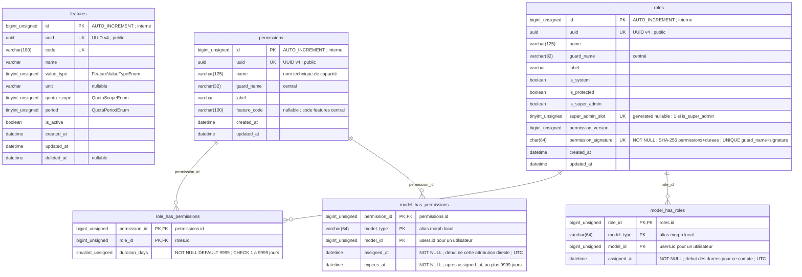
```mermaid
erDiagram
    direction TB
    features {
        bigint_unsigned id PK "AUTO_INCREMENT ; interne"
        uuid uuid UK "UUID v4 ; public"
        varchar(100) code UK
        varchar name
        tinyint_unsigned value_type "FeatureValueTypeEnum"
        varchar unit "nullable"
        tinyint_unsigned quota_scope "QuotaScopeEnum"
        tinyint_unsigned period "QuotaPeriodEnum"
        boolean is_active
        datetime created_at
        datetime updated_at
        datetime deleted_at "nullable"
    }
    permissions {
        bigint_unsigned id PK "AUTO_INCREMENT ; interne"
        uuid uuid UK "UUID v4 ; public"
        varchar(125) name "nom technique de capacité"
        varchar(32) guard_name "central"
        varchar label
        varchar(100) feature_code "nullable ; code features central"
        datetime created_at
        datetime updated_at
    }
    roles {
        bigint_unsigned id PK "AUTO_INCREMENT ; interne"
        uuid uuid UK "UUID v4 ; public"
        varchar(125) name
        varchar(32) guard_name "central"
        varchar label
        boolean is_system
        boolean is_protected
        boolean is_super_admin
        tinyint_unsigned super_admin_slot UK "generated nullable ; 1 si is_super_admin"
        bigint_unsigned permission_version
        char(64) permission_signature UK "NOT NULL ; SHA-256 permissions+durees ; UNIQUE guard_name+signature"
        datetime created_at
        datetime updated_at
    }
    role_has_permissions {
        bigint_unsigned permission_id PK,FK "permissions.id"
        bigint_unsigned role_id PK,FK "roles.id"
        smallint_unsigned duration_days "NOT NULL DEFAULT 9999 ; CHECK 1 a 9999 jours"
    }
    model_has_roles {
        bigint_unsigned role_id PK,FK "roles.id"
        varchar(64) model_type PK "alias morph local"
        bigint_unsigned model_id PK "users.id pour un utilisateur"
        datetime assigned_at "NOT NULL ; debut des durees pour ce compte ; UTC"
    }
    model_has_permissions {
        bigint_unsigned permission_id PK,FK "permissions.id"
        varchar(64) model_type PK "alias morph local"
        bigint_unsigned model_id PK "users.id pour un utilisateur"
        datetime assigned_at "NOT NULL ; debut de cette attribution directe ; UTC"
        datetime expires_at "NOT NULL ; apres assigned_at, au plus 9999 jours"
    }
    roles ||--o{ role_has_permissions : role_id
    permissions ||--o{ role_has_permissions : permission_id
    roles ||--o{ model_has_roles : role_id
    permissions ||--o{ model_has_permissions : permission_id
```

**`features`** décrit les droits de l’abonnement et les quotas : code stable, nom, valeur booléenne/quantité, unité, portée propriétaire/boutique et période. Son rôle reste distinct des permissions d’une personne ; les plans se lient à cette table via plan_features.

**`permissions`** conserve `id`, `name`, `guard_name` et les timestamps natifs, plus `uuid`, `label` et `feature_code` facultatif. `name` est une capacité stable en anglais (`saas.users.create`, `saas.plans.manage`, `saas.subscriptions.assign`) ; `label` est sa présentation. UNIQUE(name,guard_name). Au central, feature_code reste NULL pour l’administration ; en boutique, il peut relier logiquement une action au catalogue central de fonctionnalités.

**`roles`** conserve les colonnes natives et reçoit uuid, label, is_system, is_protected, is_super_admin, permission_version et permission_signature dans chaque BDD. UNIQUE(name,guard_name), avec nom non vide normalisé à l’écriture. UNIQUE(guard_name,permission_signature) refuse deux rôles de mêmes permissions et mêmes durées, même avec des noms différents. Le service calcule avant écriture le SHA-256 de la liste canonique des paires (permission_id,duration_days), triée par permission_id ; l’ordre des cases cochées et le nom du rôle ne changent pas cette signature. Comparer aussi la composition exacte ; toute collision est refusée sans attribuer de droits. Un rôle déléguable contient au moins une permission. L’unicité est locale : deux boutiques peuvent avoir des rôles identiques, sans partage d’attribution. `super_admin_slot = CASE WHEN is_super_admin THEN 1 ELSE NULL END`, UNIQUE(super_admin_slot), réserve un seul rôle privilégié par BDD. permission_version augmente lors de toute modification de permission ou de durée. Au central, root est protégé, au plus une attribution existe et sa rotation dédiée préserve un accès valide. En boutique, shop-owner est réservé au seul propriétaire local et ses protections sont définies en T24.

**Pivots natifs :** role_has_permissions a pour PK composite (permission_id,role_id). model_has_roles a pour PK (role_id,model_id,model_type) ; model_has_permissions a pour PK (permission_id,model_id,model_type). Ajouter les index (model_id,model_type). Les role_id/permission_id sont des FK BIGINT UNSIGNED locales ; model_id est la PK numérique du modèle indiqué par model_type. Le lien polymorphe n’est pas une FK SQL universelle : service, morph map et procédure de nettoyage contrôlent l’existence et le type. model_type central autorisé : `central_user`, mappé à App\Models\Central\User.

Ces trois pivots gardent leur PK composite, sans id/uuid autonome ni route de pivot. Dans chaque BDD, ils portent les informations métier de durée/début ci-dessous, sans timestamps génériques created_at/updated_at. Une attribution externe reçoit les UUID, les résout dans la bonne BDD et passe par le service audité de ce contexte qui valide dates, guards et recoupements avant d’appeler les méthodes Spatie adaptées. assignRole/syncRoles/givePermissionTo/syncPermissions bruts ne sont pas des points d’écriture autorisés. L’auteur, la date, les anciens/nouveaux droits et la révocation sont tracés dans activity_log de cette même BDD. Les autres liaisons métier gardent leurs id+uuid et leur unicité.

Le modèle central User utilise HasRoles, la connexion central et le guard central ; le modèle local User utilise HasRoles, tenant et le guard tenant. Étendre Role/Permission pour la génération de uuid et leurs connexions ; configurer les modèles dans permission.php. À l’initialisation de chaque contexte, les modèles, la connexion et le PermissionRegistrar sont configurés ensemble, y compris dans les commandes et workers. Vérifier les migrations de Permission v8 réellement verrouillées avant développement. Aucune ancienne table parallèle d’attribution n’est maintenue.

**Archivage des droits :** aucun SoftDeletes sur les modèles Spatie dans ce schéma. Pour retirer un rôle, révoquer explicitement les attributions et invitations concernées via un service audité, puis supprimer seulement un rôle personnalisable devenu inutilisé. Les références métier requises sont protégées par RESTRICT ; ne pas laisser une cascade supprimer silencieusement une autorisation historique. Les rôles système et le catalogue de permissions ne sont pas supprimables depuis l’administration ordinaire. L’activité conserve les UUID et libellés filtrés nécessaires après disparition du sujet.

### C2.1 — Durées et règles communes des attributions

Ces règles sont appliquées séparément dans la BDD centrale et dans chaque BDD boutique. Elles ont la même structure, mais aucune attribution, date, signature ou décision d’autorisation n’est synchronisée entre ces BDD. Le guard central ne donne jamais une permission tenant ; les noms/compositions de rôles sont uniques dans leur propre BDD seulement.

| Table/champ dans chaque BDD | Rôle |
|---|---|
| roles.permission_signature | Empêche deux rôles de même ensemble de permissions et de mêmes durées, indépendamment de leur nom et de l’ordre de saisie. |
| role_has_permissions.duration_days | Durée de chaque action du rôle : SMALLINT UNSIGNED NOT NULL DEFAULT 9999, CHECK entre 1 et 9999 inclus. |
| model_has_roles.assigned_at | Début du compteur propre au compte qui reçoit ce rôle ; DATETIME NOT NULL, UTC. |
| model_has_permissions.assigned_at / expires_at | Dates obligatoires d’une attribution directe native, si ce chemin est utilisé ; il ne crée ni exception ni priorité sur un rôle. |

**Rôle et personne :** les durées font partie du rôle. Pour donner une action supplémentaire ou une durée différente à une seule personne, créer/utiliser un autre rôle de composition différente, puis remplacer l’attribution concernée atomiquement. Deux utilisateurs recevant le même rôle à des dates différentes ont des échéances différentes. Modifier un rôle existant change sa règle pour tous ses bénéficiaires, avec contrôle et audit de cet impact ; cela ne déplace pas leurs dates d’attribution. Un nom identique est toujours refusé, même si les permissions diffèrent ; deux compositions identiques sont aussi refusées. Deux compositions qui ne diffèrent que par une durée sont différentes.

**Période effective :** pour une permission du rôle, début=model_has_roles.assigned_at et fin=DATE_ADD(assigned_at, INTERVAL duration_days DAY). L’autorisation vaut sur [début,fin) : à l’instant exact de fin, elle ne vaut plus. Chaque permission expire indépendamment des autres. 9999 est un nombre réel de jours, environ 27 ans et 4 mois, pas un code « illimité ». La BDD et le service exigent 1<=duration_days<=9999. Une attribution directe est bornée par CHECK(expires_at>assigned_at AND expires_at<=DATE_ADD(assigned_at,INTERVAL 9999 DAY)) ; son service utilise 9999 jours par défaut. Les dates de début sont produites par le serveur au moment de l’attribution, jamais par un formulaire libre. Aucun calcul d’expiration utilisant NOW() n’est une colonne générée.

**Plusieurs rôles, aucun recoupement :** un compte peut recevoir plusieurs rôles dans sa BDD, mais les ensembles de permissions de tous ses rôles encore attribués sont deux à deux disjoints. Le contrôle porte sur la composition, même si une permission a déjà expiré ; enlever/remplacer explicitement l’attribution qui bloque avant une nouvelle attribution. Un droit direct, si utilisé, ne peut pas être aussi présent dans un de ses rôles. Un même rôle n’est attribué qu’une fois par la PK native. Ces règles s’appliquent également quand on ajoute une permission à un rôle déjà attribué : contrôler chacun de ses bénéficiaires et refuser toute la mutation si elle créerait un recoupement. Il n’existe ni priorité entre sources, ni table secondaire ALLOW/DENY de permissions. Root au central et shop-owner dans sa boutique, dont les capacités sont implicites et protégées, ne se cumulent avec aucun autre rôle ou droit direct dans leur BDD. Leur accès privilégié existant n’est pas une délégation ordinaire à durée ; leurs contrôles de compte, contexte, propriété, quotas et état métier restent obligatoires.

**Prolongation et reprise :** changer duration_days conserve assigned_at ; la nouvelle fin reste calculée depuis le début existant, avec le même maximum. Un retry d’attribution retrouve la ligne et ne remet jamais le compteur à zéro. Une réattribution/renouvellement volontaire utilise une intention distincte, motivée et auditée ; elle change assigned_at explicitement et relance toutes les durées de ce rôle. Retirer une attribution révoque immédiatement ses droits, sans toucher aux autres rôles disjoints. Aucun cron n’est nécessaire pour que l’expiration soit effective.

### C2.2 — Contrôles centraux, concurrence et intégration Spatie

**Écriture atomique :** création/modification de rôle, changement de durée, attribution/retrait/remplacement et droit direct passent par le même service sur la connexion centrale. Le rôle root protégé et non supprimable sert de ligne stable de sérialisation des mutations d’autorisation, sans table supplémentaire : verrouiller sa ligne FOR UPDATE, puis les autres rôles et comptes concernés dans l’ordre croissant de leurs id. Après les verrous, relire compositions et attributions en lecture courante, vérifier guard, acteur habilité, nom/signature, durées et absence de recoupement, puis écrire pivots/signature/permission_version et activité dans une transaction. Les UNIQUE SQL ferment les courses de noms/signatures ; les PK ferment les doubles attributions. Un conflit annule toute la mutation. Le rôle root est amorcé une seule fois par le bootstrap protégé avant ce service ; il ne peut être supprimé ou remplacé comme ligne de catalogue. Toutes les voies (UI, API, imports, jobs, seeders ordinaires) respectent ce protocole. Les contrôles inter-lignes exigent le service et une protection dédiée pour tout écrivain SQL de maintenance ; ils ne sont pas prétendus couverts par un simple CHECK. Les imports ne fabriquent pas un début d’attribution depuis la date d’import si la date réelle est inconnue.

**Lecture effective :** le résolveur central vérifie compte actif, bon guard, attribution unique de chaque capacité, date actuelle, restrictions de cible C3 et protections système. Les relations/méthodes d’autorisation Spatie de chaque contexte sont adaptées pour lire dates de pivots et durées ; l’union native non datée ne suffit pas. Configurer register_permission_check_method=false et enregistrer le contrôle personnalisé pour éviter que le Gate::before natif autorise avant le contrôle temporel ; ne jamais combiner un chemin natif non daté et un chemin daté pour la même capacité. Pour une capacité connue saas.*, le hook central rend false en cas d’expiration/absence/blocage et true seulement pour un droit effectif ou root protégé ; ne pas retourner null après un refus temporel. Les actions d’objet des Policies restent évaluées séparément : le hook retourne null pour leurs noms génériques. Les vérifications brutes de présence de rôle/permission ne sécurisent pas une opération datée. Utiliser un catalogue de capacités concrètes, sans permissions wildcard attribuables qui contourneraient les ensembles disjoints. Les invariants métier et l’isolation des boutiques restent obligatoires même pour root. Le contrôle local est décrit en T24.1.

**Caches et audit :** à chaque décision sensible, relire les attributions et leurs dates actuelles ainsi que les versions des rôles, recalculer la validité à l’heure serveur et revalider avant l’effet dans les services concernés. Une version de rôle seule ne détecte pas un retrait de rôle ou un changement de assigned_at ; une relation chargée auparavant n’est pas l’autorité de cette lecture. Les caches ne dépassent jamais la prochaine échéance ; une mutation invalide les relations chargées et les caches concernés après commit, y compris dans les workers. Un cache encore présent ou un cron arrêté ne conserve aucun droit expiré. Les activités d’attribution/révocation/renouvellement/changement de composition ou durée, doublons refusés et délégations refusées ont leurs phases distinctes et propriétés filtrées : utilisateur/rôle/permissions par UUID, anciennes/nouvelles durées et dates, acteur et motif. Les pivots sans id/uuid ne deviennent pas des sujets polymorphes fictifs ; le sujet est le compte ou le rôle et les clés de pivot sont dans les propriétés. Le temps qui passe est contrôlé lors de la décision ; ne pas promettre un événement de révocation ponctuel produit par la seule horloge.

Cette adaptation est un choix du projet, pas une option native de tenancy/teams. Les cinq tables Spatie restent, leurs clés composites restent, et les contrôles temporels et d’unicité sont à implémenter lors du développement. Source technique : [Spatie, contrôle personnalisé](https://github.com/spatie/laravel-permission/blob/main/docs/advanced-usage/custom-permission-check.md), [Spatie, contrôles de permissions](https://github.com/spatie/laravel-permission/blob/main/src/Traits/HasPermissions.php) et [extension des modèles](https://github.com/spatie/laravel-permission/blob/main/docs/advanced-usage/extending.md).

### C3 — Restrictions de l’administration centrale

Les permissions centrales sont attribuées dans les cinq tables Spatie avec les durées de C2.1 ; aucune table permission_overrides n’est conservée, au central ou en boutique. admin_restrictions reste exclusivement au central pour contrôler les cibles sur lesquelles un administrateur délégué peut agir ; ses dates et interdictions de cible sont indépendantes de la durée d’une attribution et restent évaluées dans les Policies.

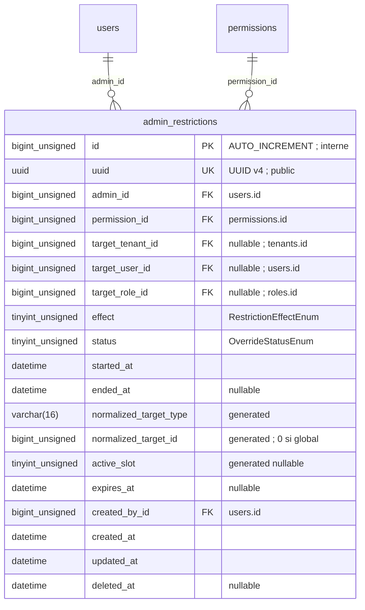
```mermaid
erDiagram
    direction TB

    admin_restrictions {
        bigint_unsigned id PK "AUTO_INCREMENT ; interne"
        uuid uuid UK "UUID v4 ; public"
        bigint_unsigned admin_id FK "users.id"
        bigint_unsigned permission_id FK "permissions.id"
        bigint_unsigned target_tenant_id FK "nullable ; tenants.id"
        bigint_unsigned target_user_id FK "nullable ; users.id"
        bigint_unsigned target_role_id FK "nullable ; roles.id"
        tinyint_unsigned effect "RestrictionEffectEnum"
        tinyint_unsigned status "OverrideStatusEnum"
        datetime started_at
        datetime ended_at "nullable"
        varchar(16) normalized_target_type "generated"
        bigint_unsigned normalized_target_id "generated ; 0 si global"
        tinyint_unsigned active_slot "generated nullable"
        datetime expires_at "nullable"
        bigint_unsigned created_by_id FK "users.id"
        datetime created_at
        datetime updated_at
        datetime deleted_at "nullable"
    }
    users ||--o{ admin_restrictions : admin_id
    permissions ||--o{ admin_restrictions : permission_id
```

admin_restrictions : admin_id désigne l’administrateur délégué. permission_id décrit son action centrale ; exactement une cible parmi target_tenant_id, target_user_id, target_role_id peut être renseignée, ou aucune pour une règle globale. effect=1 DENY ou 2 ALLOW_ONLY ; une règle ALLOW_ONLY introduit une liste fermée de cibles, les DENY priment. Normaliser le type et la PK de cible dans des colonnes générées `normalized_target_type` et `normalized_target_id` (sentinelle numérique 0 uniquement pour absence de cible ; aucun parent réel n’a id=0), avec UNIQUE(admin_id,permission_id,normalized_target_type,normalized_target_id,effect,active_slot). Les règles ne peuvent pas ouvrir l’intérieur d’une boutique. Leur créateur, état et validité sont contrôlés à l’écriture et à la lecture.

Les invitations d’équipe ont été déplacées intégralement en T24. La racine centrale n’est ni un rôle assignable par un IT délégué ni une exception temporaire ordinaire. Les services de délégation interdisent élévation indirecte, auto-attribution et modification des rôles protégés.

### C4 — Plans et abonnements

**`plans` — Les offres d’abonnement proposées aux commerçants, avec leurs versions. Exemple : Gratuit et Pro. Une ancienne version reste conservée pour comprendre les anciens abonnements.**

**`plan_features` — Indique ce que chaque offre permet et ses limites. Exemple : l’offre Gratuit autorise 1 boutique et l’offre Pro en autorise 3.**

**`subscriptions` — Une seule table contient les abonnements et leurs échéances. Une ligne de type 1 décrit « Karim a le plan Pro ». Ses lignes de type 2 décrivent « Karim doit payer 3 000 DA pour septembre », puis octobre, etc. Les échéances gardent leurs propres UUID, montants, dates et états ; elles ne remplacent pas la ligne d’abonnement. tenant_id reste facultatif sur l’abonnement et désigne une boutique du même propriétaire.**

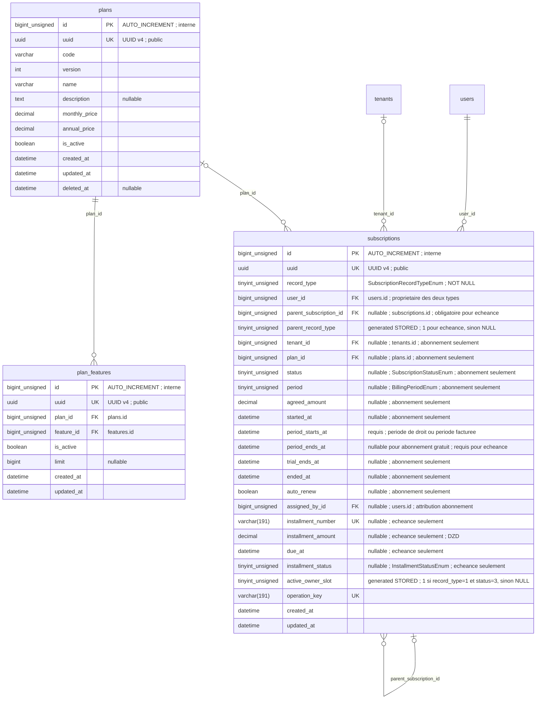
```mermaid
erDiagram
    direction TB
    plans {
        bigint_unsigned id PK "AUTO_INCREMENT ; interne"
        uuid uuid UK "UUID v4 ; public"
        varchar code
        int version
        varchar name
        text description "nullable"
        decimal monthly_price
        decimal annual_price
        boolean is_active
        datetime created_at
        datetime updated_at
        datetime deleted_at "nullable"
    }
    plan_features {
        bigint_unsigned id PK "AUTO_INCREMENT ; interne"
        uuid uuid UK "UUID v4 ; public"
        bigint_unsigned plan_id FK "plans.id"
        bigint_unsigned feature_id FK "features.id"
        boolean is_active
        bigint limit "nullable"
        datetime created_at
        datetime updated_at
    }
    subscriptions {
        bigint_unsigned id PK "AUTO_INCREMENT ; interne"
        uuid uuid UK "UUID v4 ; public"
        tinyint_unsigned record_type "SubscriptionRecordTypeEnum ; NOT NULL"
        bigint_unsigned user_id FK "users.id ; proprietaire des deux types"
        bigint_unsigned parent_subscription_id FK "nullable ; subscriptions.id ; obligatoire pour echeance"
        tinyint_unsigned parent_record_type "generated STORED ; 1 pour echeance, sinon NULL"
        bigint_unsigned tenant_id FK "nullable ; tenants.id ; abonnement seulement"
        bigint_unsigned plan_id FK "nullable ; plans.id ; abonnement seulement"
        tinyint_unsigned status "nullable ; SubscriptionStatusEnum ; abonnement seulement"
        tinyint_unsigned period "nullable ; BillingPeriodEnum ; abonnement seulement"
        decimal agreed_amount "nullable ; abonnement seulement"
        datetime started_at "nullable ; abonnement seulement"
        datetime period_starts_at "requis ; periode de droit ou periode facturee"
        datetime period_ends_at "nullable pour abonnement gratuit ; requis pour echeance"
        datetime trial_ends_at "nullable ; abonnement seulement"
        datetime ended_at "nullable ; abonnement seulement"
        boolean auto_renew "nullable ; abonnement seulement"
        bigint_unsigned assigned_by_id FK "nullable ; users.id ; attribution abonnement"
        varchar(191) installment_number UK "nullable ; echeance seulement"
        decimal installment_amount "nullable ; echeance seulement ; DZD"
        datetime due_at "nullable ; echeance seulement"
        tinyint_unsigned installment_status "nullable ; InstallmentStatusEnum ; echeance seulement"
        tinyint_unsigned active_owner_slot "generated STORED ; 1 si record_type=1 et status=3, sinon NULL"
        varchar(191) operation_key UK
        datetime created_at
        datetime updated_at
    }

    plans ||--o{ plan_features : plan_id
    users ||--o{ subscriptions : user_id
    tenants |o--o{ subscriptions : tenant_id
    plans |o--o{ subscriptions : plan_id
    subscriptions |o--o{ subscriptions : parent_subscription_id
```

#### Explication très simple des champs

**`plans` :**

- **`id`** : le numéro unique qui permet de reconnaître cette ligne dans la base. Deux lignes différentes ne peuvent pas avoir le même `id`.
- **`uuid`** : identifiant public UUID v4 unique et indexé ; routes, API, formulaires et exports utilisent cet identifiant, sans exposer la PK numérique.
- **`code`** : le petit nom utilisé par le programme pour reconnaître l’élément. Exemple : `boutiques.nombre` ou `product.create`.
- **`version`** : le numéro de version de cet élément. Exemple : version 1, puis version 2 après une évolution ; l’ancienne version peut rester conservée pour comprendre l’historique.
- **`name`** : le nom affiché à l’utilisateur. Exemple : « Nombre de boutiques » ou « Livraison EcoTrack ».
- **`description`** : un texte qui explique l’élément plus en détail. Il peut rester vide si aucune explication supplémentaire n’est nécessaire.
- **`monthly_price`** : le prix à payer pour un mois d’abonnement.
- **`annual_price`** : le prix à payer pour une année d’abonnement.
- **`is_active`** : indique si l’élément peut encore être utilisé. `true` = oui, `false` = non.
- **`created_at`** : la date où cette ligne a été créée dans la base.
- **`updated_at`** : la date de la dernière modification de cette ligne. Exemple : si tu modifies l’élément aujourd’hui, cette date devient celle d’aujourd’hui.
- **`deleted_at`** : la date où l’élément a été retiré sans effacer son ancienne ligne. Si ce champ est vide, l’élément n’est pas supprimé.

**`plan_features` :**

- **`id`** : le numéro unique qui permet de reconnaître cette ligne dans la base. Deux lignes différentes ne peuvent pas avoir le même `id`.
- **`uuid`** : identifiant public UUID v4 unique et indexé ; routes, API, formulaires et exports utilisent cet identifiant, sans exposer la PK numérique.
- **`plan_id`** : l’identifiant du plan d’abonnement. Il sert à relier cette ligne à la bonne information au lieu de recopier toutes ses données.
- **`feature_id`** : l’identifiant de la fonctionnalité. Il sert à relier cette ligne à la bonne information au lieu de recopier toutes ses données.
- **`is_active`** : indique si cette possibilité est autorisée. `true` = oui, `false` = non.
- **`limit`** : le nombre maximum autorisé. Exemple : `3` peut vouloir dire maximum 3 boutiques. Si le champ est vide dans un cas prévu comme illimité, il n’y a pas de nombre maximum. Ce champ peut rester vide quand cette information n’est pas nécessaire ou pas encore connue.
- **`created_at`** : la date où cette ligne a été créée dans la base.
- **`updated_at`** : la date de la dernière modification de cette ligne. Exemple : si tu modifies l’élément aujourd’hui, cette date devient celle d’aujourd’hui.

**subscriptions, explication des champs fusionnés :**

| Groupe | Contenu |
|---|---|
| id, uuid, record_type | Identité propre et nature de la ligne : 1 SUBSCRIPTION ou 2 INSTALLMENT |
| user_id | Propriétaire central ; identique entre une échéance et son abonnement |
| parent_subscription_id, parent_record_type | L’échéance retrouve son abonnement parent, obligatoirement de type 1 ; NULL pour l’abonnement |
| tenant_id, plan_id | Boutique ciblée facultative et offre choisie, seulement sur la ligne abonnement ; une échéance les obtient depuis son parent |
| status, period, agreed_amount | État du droit, durée mensuelle/annuelle et prix convenu de l’abonnement |
| started_at, period_starts_at, period_ends_at, trial_ends_at, ended_at | Début/fin du droit ou période de dette ; essai et clôture seulement sur l’abonnement |
| auto_renew, assigned_by_id | Préparation du prochain renouvellement payant et auteur de l’attribution ; aucun prélèvement bancaire automatique |
| installment_number, installment_amount, due_at, installment_status | Numéro de dette unique, montant dû, date limite et état PENDING/PARTIALLY_PAID/PAID/CANCELLED de chaque échéance |
| active_owner_slot, operation_key, created_at, updated_at | Une seule attribution active par propriétaire, déduplication des créations/renouvellements et historique technique |

Les références vers un autre module sont indiquées sur les champs, même si leur flèche n’est pas redessinée ici.

- **`plans` :** Le couple `code + version` est unique. Les prix sont en DZD dans ce MVP. Dès qu’un plan a été utilisé par un abonnement, on ne modifie plus son ancienne version. Exemple : si `Pro v1` autorisait 3 boutiques et qu’on veut passer à 5, on crée `Pro v2` au lieu de transformer le passé. Le plan gratuit coûte `0` et autorise 1 boutique.

- **`plan_features` :** Une fonctionnalité ne peut apparaître qu’une seule fois dans un même plan. Pour un quota : `is_active=false` signifie que la fonction est interdite ; `is_active=true` avec `limit=NULL` signifie qu’elle est illimitée ; sinon `limit` contient le maximum autorisé et doit être positif ou nul. Pour une fonctionnalité oui/non, `limit` reste vide. Si une fonctionnalité n’apparaît pas dans le plan, elle est considérée comme désactivée. Quand un plan a déjà été utilisé, ces règles restent figées avec cette version du plan.

- **subscriptions — types et rattachements :** record_type=1 SUBSCRIPTION ou 2 INSTALLMENT est immuable. UNIQUE(id,user_id,record_type), UNIQUE(id,parent_subscription_id,user_id,record_type), UNIQUE(user_id,active_owner_slot), UNIQUE(installment_number) hors NULL et UNIQUE(operation_key). parent_record_type est GENERATED ALWAYS AS (CASE WHEN record_type=2 THEN 1 ELSE NULL END) STORED. La FK(parent_subscription_id,user_id,parent_record_type) → subscriptions(id,user_id,record_type) impose le même propriétaire et un vrai abonnement parent. Pour type 1 : parent_subscription_id=NULL, plan_id/status/period/agreed_amount/started_at/auto_renew requis et tous les champs installment_* / due_at NULL. Pour type 2 : parent_subscription_id/parent_record_type/installment_number/installment_amount/due_at/installment_status requis ; tenant_id/plan_id/status/period/agreed_amount/started_at/trial_ends_at/ended_at/auto_renew/assigned_by_id NULL. Les états restent deux enums distincts. Les références à un abonnement ciblent toujours type 1, jamais une échéance ; tenant_id facultatif reste protégé par FK(tenant_id,user_id) → tenants(id,user_id).

**Abonnement et droits inchangés :** attribution payante par un administrateur autorisé, gratuit à la création et à l’expiration du payant, historique des anciennes attributions, arrêt du renouvellement sans perdre une période déjà payée. Verrouiller users du propriétaire puis l’abonnement avant activation/rétrogradation ; fermer l’ancien type 1 avant d’activer le nouveau, avec UNIQUE(user_id,active_owner_slot) où active_owner_slot=1 uniquement pour type 1/status=3. Dates [period_starts_at,period_ends_at), droits contrôlés à chaque action sans dépendre d’un cron. Les requêtes de plan/quota/gratuit et les modèles Eloquent d’abonnement filtrent impérativement record_type=1. Les comptes, permissions, quotas et choix des boutiques restent ceux de §7.

**Échéances dans la même table :** un abonnement peut avoir autant de lignes type 2 que nécessaire ; ne pas écraser septembre par octobre. installment_number reste globalement unique ; installment_amount>=0, period_ends_at>period_starts_at et due_at non NULL. Une occurrence utilise une operation_key stable contenant le UUID de l’abonnement et la période/occurrence. Deux occurrences commerciales distinctes peuvent couvrir la même période, par exemple une option, mais leurs clés sont différentes. Échéance et intention de facture sont écrites dans une transaction centrale ; un balayage retrouve les types 2 sans facture attendue et reprend avec la même clé. La FK d’une facture vers son échéance conserve le parent abonnement et le propriétaire exacts (C8/§6.7).

**État du dû :** installment_status est une projection reconstruisible depuis factures/avoirs émis et virements vérifiés C8. Le montant initial de dette et sa période restent historiques ; un avoir réduit le dû documenté, un paiement prouvé l’acquitte, un remboursement diminue les fonds conservés. Une annulation d’échéance exige que ses pièces et obligations soient traitées, sans effacer facture ou paiement. Sous les mêmes verrous, 1 PENDING avant règlement, 2 PARTIALLY_PAID pour une part acquittée, 3 PAID lorsque le dû net est soldé, 4 CANCELLED pour dette annulée ; zéro dû documenté est soldé sans inventer un paiement. L’échéance ne se confond jamais avec le document ni avec l’argent transféré.

**Modèles logiques :** Subscription (type 1) et SubscriptionInstallment (type 2) utilisent tous deux subscriptions et la connexion centrale, avec scopes, créations typées et Policies distincts. Une route de plan refuse le UUID d’une échéance. Les Resource publient des UUID ; les lignes de type 2 ne créent pas un deuxième abonnement actif. Paiement client et remboursement admin s’effectuent à distance hors application, puis sont déclarés/vérifiés avec preuve PDF dans C8 ; aucun virement automatique n’est supposé.

- **Droits d’usage par offre :** les possibilités et quotas viennent uniquement du plan applicable et de ses plan_features. Pour accorder une composition particulière, créer/versionner une offre adaptée puis l’attribuer via subscriptions. Aucune exception par propriétaire/boutique ni date parallèle ne passe devant le plan. Les permissions datées d’une personne ne modifient aucun quota commercial.

### C5 — Suivi SaaS et référentiel géographique fusionné

**feature_usage** conserve les quantités utilisées pour une fonctionnalité et une période. Le nombre réel de boutiques reste calculé depuis tenants ; ce compteur ne remplace pas cette autorité.

**geographic_areas** remplace les deux listes séparées de wilayas et communes. Une ligne type=1 est une wilaya ; une ligne type=2 est une commune reliée à sa wilaya. Toutes gardent leurs noms, codes, UUID publics, source, version et date d’effet. Le pays provient de countries.

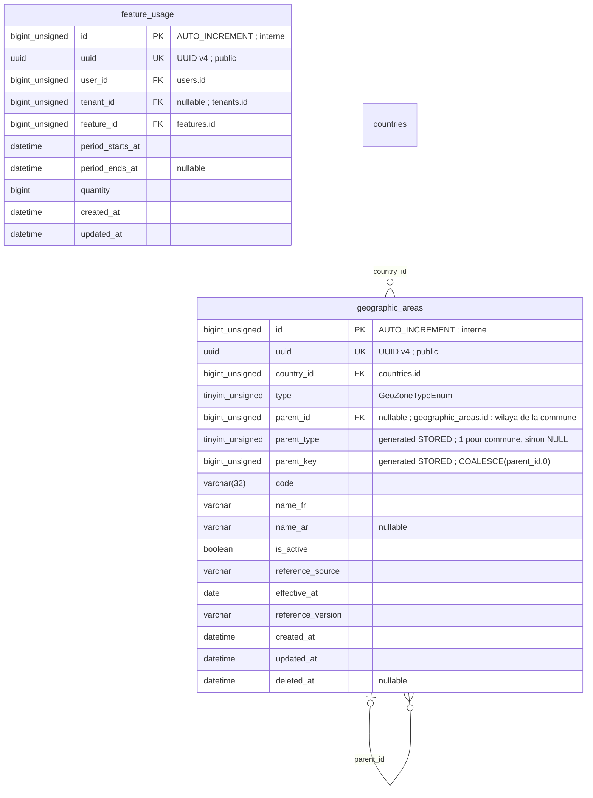
```mermaid
erDiagram
    direction TB
    feature_usage {
        bigint_unsigned id PK "AUTO_INCREMENT ; interne"
        uuid uuid UK "UUID v4 ; public"
        bigint_unsigned user_id FK "users.id"
        bigint_unsigned tenant_id FK "nullable ; tenants.id"
        bigint_unsigned feature_id FK "features.id"
        datetime period_starts_at
        datetime period_ends_at "nullable"
        bigint quantity
        datetime created_at
        datetime updated_at
    }
    geographic_areas {
        bigint_unsigned id PK "AUTO_INCREMENT ; interne"
        uuid uuid UK "UUID v4 ; public"
        bigint_unsigned country_id FK "countries.id"
        tinyint_unsigned type "GeoZoneTypeEnum"
        bigint_unsigned parent_id FK "nullable ; geographic_areas.id ; wilaya de la commune"
        tinyint_unsigned parent_type "generated STORED ; 1 pour commune, sinon NULL"
        bigint_unsigned parent_key "generated STORED ; COALESCE(parent_id,0)"
        varchar(32) code
        varchar name_fr
        varchar name_ar "nullable"
        boolean is_active
        varchar reference_source
        date effective_at
        varchar reference_version
        datetime created_at
        datetime updated_at
        datetime deleted_at "nullable"
    }
    countries ||--o{ geographic_areas : country_id
    geographic_areas |o--o{ geographic_areas : parent_id
```

**Contraintes :** UNIQUE(id,country_id,type), UNIQUE(country_id,type,parent_key,code). parent_type=CASE WHEN type=2 THEN 1 ELSE NULL END, et parent_key=COALESCE(parent_id,0), deux colonnes GENERATED STORED. Pour une wilaya, parent_id=NULL ; pour une commune, parent_id et parent_type non NULL. FK(parent_id,country_id,parent_type) → geographic_areas(id,country_id,type) : une commune appartient obligatoirement à une wilaya du même pays, jamais à une autre commune. type/country_id/parent_id et identités géographiques utilisées sont immuables ; un changement administratif produit une évolution explicite et conserve les références historiques. Le contrôle de forme exige exactement ces valeurs NULL/non NULL et refuse l’auto-rattachement ; les parents d’un autre type rendent un cycle impossible.

**Même sélection d’adresses :** liste des wilayas WHERE country_id=DZ et type=1 ; communes WHERE type=2 et parent_id=wilaya.id. Les champs locaux province_uuid et municipality_uuid restent lisibles et gardent leur sens métier ; ils référencent désormais geographic_areas.uuid avec contrôle du type 1/2 et de l’appartenance, sans FK SQL entre BDD. Accepter seulement les zones actives pour une nouvelle adresse ; une adresse/doc historique conserve ses noms/codes et références. Le code postal reste distinct du code de commune. Les mappings de transporteur restent locaux T11 et ne remplacent pas cette hiérarchie officielle.

**Import et histoire :** seed DZ par countries.code, sans id numérique codé en dur. Utiliser les annexes officielles [S10] de la version de référentiel retenue ; aucun plafond 58/69 ni nombre de lignes figé en contrainte. Importer les wilayas avant leurs communes ; vérifier code/parent/pays et garder reference_source/reference_version/effective_at. Les noms et codes envoyés aux transporteurs suivent leur mapping vérifié, pas un code géographique deviné.

**feature_usage :** UNIQUE(user_id,feature_id,tenant normalisé,period_starts_at), quantity>=0 et fin NULL ou >début ; FK(tenant_id,user_id) → tenants(id,user_id). Utilisation par propriétaire ou boutique selon features.quota_scope. Mise à jour atomique/idempotente sous le verrou de quota approprié, périodes non chevauchantes. Les compteurs ne sont pas une copie des commandes ou des comptes locaux.

### C6 — Activités centrales avec Spatie Laravel Activity Log v5

Le journal principal est désormais `activity_log`, alimenté par spatie/laravel-activitylog v5. Source de préparation : [Recherche complète Activity Log](Recherche_complete_Spatie_Laravel_Activity_Log.md), notamment §§12–38, 54–61 et 78–92. Les colonnes natives v5 sont conservées ; uuid, correlation_id, origin, operation_key et tenant_id sont des extensions du projet.

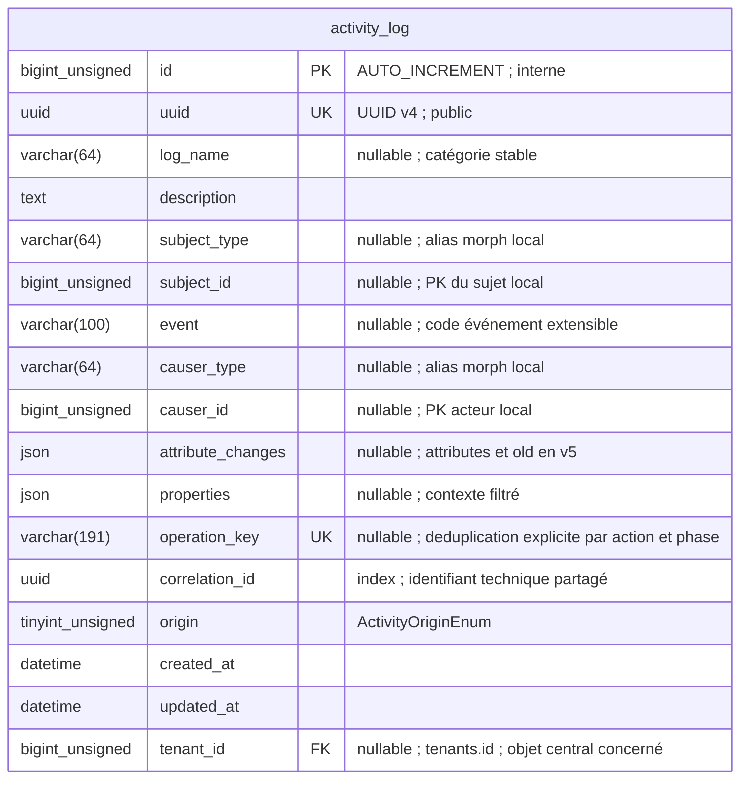
```mermaid
erDiagram
    direction TB
    activity_log {
        bigint_unsigned id PK "AUTO_INCREMENT ; interne"
        uuid uuid UK "UUID v4 ; public"
        varchar(64) log_name "nullable ; catégorie stable"
        text description
        varchar(64) subject_type "nullable ; alias morph local"
        bigint_unsigned subject_id "nullable ; PK du sujet local"
        varchar(100) event "nullable ; code événement extensible"
        varchar(64) causer_type "nullable ; alias morph local"
        bigint_unsigned causer_id "nullable ; PK acteur local"
        json attribute_changes "nullable ; attributes et old en v5"
        json properties "nullable ; contexte filtré"
        varchar(191) operation_key UK "nullable ; deduplication explicite par action et phase"
        uuid correlation_id "index ; identifiant technique partagé"
        tinyint_unsigned origin "ActivityOriginEnum"
        datetime created_at
        datetime updated_at
        bigint_unsigned tenant_id FK "nullable ; tenants.id ; objet central concerné"
    }

```

**`activity_log` :**

- **`id`** : clé primaire numérique interne, auto-incrémentée ; jamais envoyée au client.
- **`uuid`** : identifiant public unique et indexé, utilisé dans les routes, formulaires, exports et ressources JSON.
- **`log_name / event / description`** : catégorie, code stable de l’action et texte lisible. Les codes restent des chaînes extensibles compatibles avec le paquet.
- **`subject_type / subject_id`** : morphTo du sujet central, avec alias stable et PK numérique ; les deux sont NULL ou renseignés ensemble.
- **`causer_type / causer_id`** : morphTo de l’acteur central ; NULL pour un système ou un événement anonyme. Aucun compte d’équipe local n’est résolu par ce couple central.
- **`attribute_changes`** : changements de champs en v5, structurés en attributes (après) et old (avant), limités aux attributs autorisés.
- **`properties`** : contexte filtré, UUID publics et libellés utiles ; n’accueille ni copie complète de requête ni données de connexion.
- **`operation_key`** : clé facultative unique d’une action explicite et de sa phase ; une clé rejouée ne crée pas un second événement de succès. NULL pour les activités automatiques sans déduplication explicite.
- **`correlation_id`** : UUID technique généré pour l’opération, partagé entre ses activités et intentions ; indexé mais non unique.
- **`origin`** : ActivityOriginEnum : origine utilisateur, système, transporteur ou job.
- **`tenant_id`** : FK du tenant central concerné par une opération de plateforme, facultative ; ne représente aucune appartenance d’équipe.
- **`created_at / updated_at`** : timestamps conservés pour compatibilité ; toute modification d’activité est limitée aux procédures de rétention autorisées.

Les détails normatifs, la couverture des actions, les relations polymorphes, la connexion, les exemples et la rétention sont décrits au §7.7. Le SaaS consulte uniquement ce journal central : les activités internes des boutiques restent dans leurs BDD. Les journaux de stock, comptabilité, documents et données personnelles gardent leur rôle de preuve spécialisée.


### C7 — Historique des déploiements des BDD

**`tenant_schema_deployments` — L’historique de création et de mise à jour technique des bases des boutiques. Exemple : la mise à jour de la boutique de Karim a réussi, tandis qu’une autre doit être réessayée.**

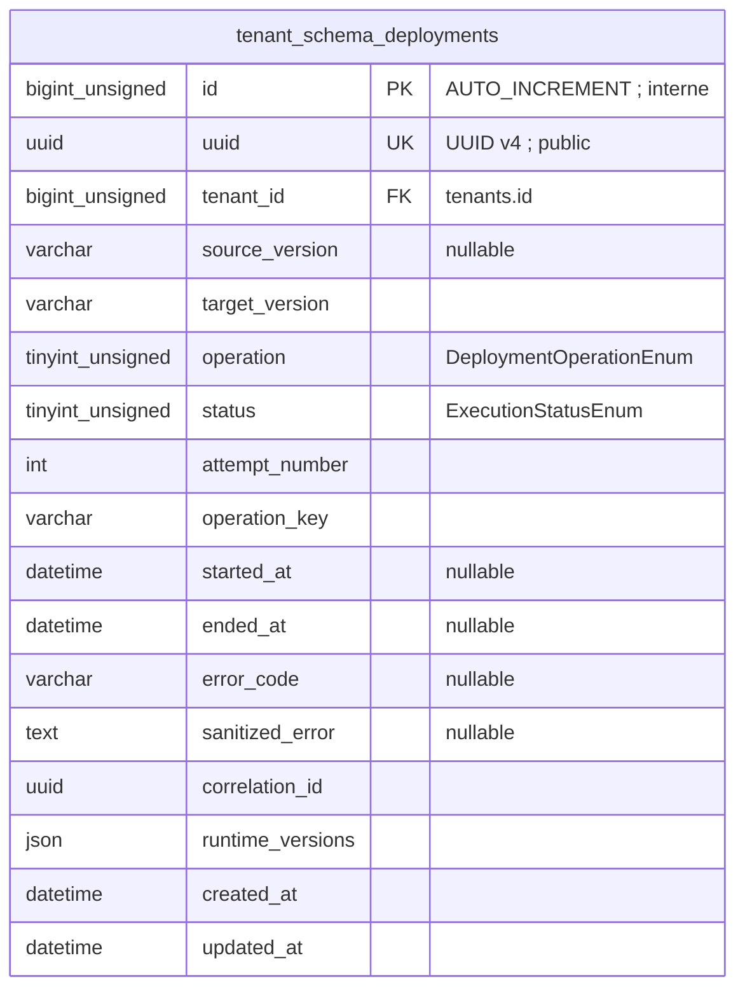
```mermaid
erDiagram
    direction TB
    tenant_schema_deployments {
        bigint_unsigned id PK "AUTO_INCREMENT ; interne"
        uuid uuid UK "UUID v4 ; public"
        bigint_unsigned tenant_id FK "tenants.id"
        varchar source_version "nullable"
        varchar target_version
        tinyint_unsigned operation "DeploymentOperationEnum"
        tinyint_unsigned status "ExecutionStatusEnum"
        int attempt_number
        varchar operation_key
        datetime started_at "nullable"
        datetime ended_at "nullable"
        varchar error_code "nullable"
        text sanitized_error "nullable"
        uuid correlation_id
        json runtime_versions
        datetime created_at
        datetime updated_at
    }
```

#### Explication très simple des champs

**`tenant_schema_deployments` :**

- **`id`** : le numéro unique qui permet de reconnaître cette ligne dans la base. Deux lignes différentes ne peuvent pas avoir le même `id`.
- **`uuid`** : identifiant public UUID v4 unique et indexé ; routes, API, formulaires et exports utilisent cet identifiant, sans exposer la PK numérique.
- **`tenant_id`** : l’identifiant de la boutique. Il sert à relier cette ligne à la bonne information au lieu de recopier toutes ses données.
- **`source_version`** : la version technique présente avant la migration. Ce champ peut rester vide quand cette information n’est pas nécessaire ou pas encore connue.
- **`target_version`** : la version technique que l’on veut installer.
- **`operation`** : code de `DeploymentOperationEnum` : `1 PROVISIONING`, `2 MIGRATION`.
- **`status`** : code entier de l’enum propre à cet objet, défini au §3.3 ; les libellés sont traduits à l’affichage et les transitions contrôlées par le service.
- **`attempt_number`** : le numéro de l’essai. Exemple : 1 pour le premier essai, 2 après un nouvel essai.
- **`operation_key`** : une clé unique utilisée pour reconnaître une opération déjà faite. Exemple : si le serveur reçoit deux fois la même demande après une coupure, cette clé aide à éviter de faire l’opération deux fois.
- **`started_at`** : la date et l’heure où la période ou l’action commence. Ce champ peut rester vide quand cette information n’est pas nécessaire ou pas encore connue.
- **`ended_at`** : la date et l’heure où elle s’est terminée. Peut rester vide tant que ce n’est pas terminé.
- **`error_code`** : un petit code qui permet de reconnaître le type d’erreur sans stocker un long message sensible. Ce champ peut rester vide quand cette information n’est pas nécessaire ou pas encore connue.
- **`sanitized_error`** : un message d’erreur nettoyé pour ne pas enregistrer de mot de passe, jeton ou autre secret. Ce champ peut rester vide quand cette information n’est pas nécessaire ou pas encore connue.
- **`correlation_id`** : un numéro commun utilisé pour relier plusieurs traces qui appartiennent à la même grande opération. Exemple : une création de boutique qui produit plusieurs actions techniques.
- **`runtime_versions`** : la liste des versions réellement utilisées pendant l’opération. Exemple : version de PHP, Laravel, MySQL et de l’application.
- **`created_at`** : la date où cette ligne a été créée dans la base.
- **`updated_at`** : la date de la dernière modification de cette ligne. Exemple : si tu modifies l’élément aujourd’hui, cette date devient celle d’aujourd’hui.


**Contraintes :** UNIQUE(operation_key), index(tenant_id,created_at). operation=1 PROVISIONING ou 2 MIGRATION ; status=1 PENDING, 2 RUNNING, 3 SUCCEEDED, 4 FAILED ou 5 CANCELLED. Une seule opération en cours par tenant, via clé générée conditionnelle UNIQUE et verrou de déploiement. Chaque reprise garde l’échec et crée une nouvelle tentative. runtime_versions fige PHP, Laravel, tenancy, MySQL et version applicative réellement utilisés. tenants.schema_version change seulement après succès ; migrations locales détaillent les migrations exécutées. Une migration échouée ne rend pas la boutique active. La reprise technique concerne l’étape de provisioning/migration, sans opération de retour de la BDD à un état antérieur.


### C8 — Facturation SaaS optimisée : cinq tables complémentaires

**La table `saas_invoices` passe de 97 à 38 champs et ne contient plus que les en-têtes de factures et d’avoirs.** La demande actuelle autorise plusieurs tables en gardant leur nombre limité : les neuf objets de V4.4 sont répartis dans cinq tables, sans retirer les fonctionnalités. Les factures et avoirs partagent leur structure ; leurs lignes aussi ; paiements et remboursements partagent un journal de virements. Compteurs et règles sont réunis dans une petite table de réglages, avec deux rôles contrôlés. Les envois ont leur propre table, car leur état et leurs tentatives ne sont ni un document fiscal ni de l’argent.

| Table | Champs | Explication très simple |
|---|---:|---|
| `saas_invoices` | 38 | Une fiche par facture ou avoir : client, abonnement, échéance, période, montants et PDF. |
| `saas_invoice_lines` | 22 | Le détail de chaque facture ou avoir : ce qui est facturé, les quantités, prix, taxes et corrections. |
| `saas_billing_settings` | 24 | Les règles versionnées de facturation et les compteurs qui donnent des numéros uniques aux documents. |
| `saas_document_deliveries` | 22 | Chaque envoi d’un document : destinataire, canal, essais et confirmation de remise. |
| `saas_transfers` | 35 | Chaque paiement reçu ou remboursement effectué à distance, avec preuve et vérification. |

**Pourquoi cinq :** fusionner à nouveau documents, lignes, envois et argent réintroduirait de nombreux champs sans rapport avec la ligne. Séparer factures/avoirs, paiements/remboursements ou compteurs/règles ajouterait des tables évitables dans ce périmètre. Ce choix est un compromis pour ce projet, pas un minimum mathématique ni une garantie de vitesse. L’optimisation porte sur la lisibilité, les groupes de colonnes, les index et la maîtrise des mutations ; les gains de temps et d’espace seront mesurés sur MySQL réel. La V4.5 comptait 27 tables centrales ; C10 en a ajouté trois en V4.8. V4.9 retire les deux tables d’exceptions centrales et adapte users/les autorisations ; les cinq tables de facturation restent inchangées.


```mermaid
erDiagram
    direction TB
    saas_invoices {
        bigint_unsigned id PK "AUTO_INCREMENT ; interne"
        uuid uuid UK "UUID v4 ; public"
        bigint_unsigned user_id FK "users.id ; proprietaire"
        bigint_unsigned subscription_id FK "subscriptions.id ; abonnement type 1"
        bigint_unsigned installment_id FK "subscriptions.id ; echeance type 2"
        bigint_unsigned billing_rule_id FK "saas_billing_settings.id ; regle type 2"
        bigint_unsigned original_invoice_id FK "nullable facture ; requis avoir ; saas_invoices.id"
        bigint_unsigned sequence_id FK "nullable avant reservation ; saas_billing_settings.id ; compteur type 1"
        bigint_unsigned document_media_id FK "nullable avant generation ; media.id ; PDF prive"
        tinyint_unsigned document_type "DocumentTypeEnum ; 1 INVOICE / 2 CREDIT_NOTE seulement"
        tinyint_unsigned subscription_record_type "generated STORED ; 1"
        tinyint_unsigned installment_record_type "generated STORED ; 2"
        tinyint_unsigned billing_rule_record_type "generated STORED ; 2"
        tinyint_unsigned original_invoice_document_type "generated STORED ; nullable ; 1 si original_invoice_id non NULL, sinon NULL"
        tinyint_unsigned sequence_record_type "generated STORED ; nullable ; 1 si sequence_id non NULL, sinon NULL"
        json billing_rule_snapshot "regle appliquee figee"
        int fiscal_year "nullable avant reservation"
        bigint sequence_number "nullable avant reservation"
        varchar(191) number UK "nullable avant reservation ; numero fiscal"
        decimal net_amount "HT document"
        json taxes "ventilation fiscale historique"
        decimal tax_amount
        decimal total_amount
        char(3) currency "DZD au lancement"
        tinyint_unsigned status "DocumentStatusEnum"
        text reason "nullable facture ; motif requis avoir"
        datetime period_starts_at
        datetime period_ends_at
        datetime due_at "nullable avoir"
        json saas_identity_snapshot
        json customer_identity_snapshot
        datetime issued_at "nullable avant emission"
        datetime cancelled_at "nullable ; brouillon annule"
        text cancellation_reason "nullable"
        varchar(191) operation_key UK "cle stable avec espace de noms serveur"
        uuid correlation_id "nullable ; contexte stable"
        datetime created_at
        datetime updated_at
    }

    saas_invoice_lines {
        bigint_unsigned id PK "AUTO_INCREMENT ; interne"
        uuid uuid UK "UUID v4 ; public"
        bigint_unsigned document_id FK "saas_invoices.id ; facture ou avoir parent"
        bigint_unsigned user_id FK "users.id ; meme proprietaire que le document"
        bigint_unsigned original_invoice_id FK "nullable facture ; requis ligne avoir ; saas_invoices.id"
        bigint_unsigned original_invoice_line_id FK "nullable facture ; requis ligne avoir ; saas_invoice_lines.id"
        tinyint_unsigned document_type "DocumentTypeEnum ; 1/2 ; identique au parent ; serveur"
        tinyint_unsigned original_line_document_type "generated STORED ; nullable ; 1 si original_invoice_line_id non NULL, sinon NULL"
        int line_number
        varchar description
        decimal quantity "strictement positive"
        decimal net_unit_price "nullable ligne avoir"
        decimal net_discount "nullable ligne avoir"
        decimal net_amount
        json taxes
        decimal tax_amount
        decimal total_amount
        text reason "nullable ligne facture ; requis ligne avoir"
        varchar(191) operation_key UK "cle stable avec espace de noms serveur"
        uuid correlation_id "nullable ; contexte stable de la ligne"
        datetime created_at
        datetime updated_at
    }

    saas_billing_settings {
        bigint_unsigned id PK "AUTO_INCREMENT ; interne"
        uuid uuid UK "UUID v4 ; public"
        bigint_unsigned created_by_id FK "nullable systeme ; users.id"
        bigint_unsigned validated_by_id FK "nullable avant validation regle ; users.id"
        tinyint_unsigned record_type "SaasBillingSettingRecordTypeEnum ; 1 SEQUENCE / 2 RULE"
        tinyint_unsigned document_type "nullable regle ; DocumentTypeEnum ; 1/2 compteur"
        int fiscal_year "nullable regle"
        varchar(32) prefix "nullable regle"
        bigint next_number "nullable regle ; compteur strictement croissant"
        tinyint_unsigned sequence_slot "generated STORED ; 1 si record_type=1, sinon NULL"
        varchar(100) code "nullable compteur ; code stable regle"
        int version "nullable compteur ; version regle"
        varchar trigger_event "nullable compteur"
        varchar numbering_scope "nullable compteur ; saas_issuer"
        json parameters "nullable compteur ; parametres autorises"
        tinyint_unsigned policy_status "nullable compteur ; PolicyStatusEnum"
        text validation_reference "nullable avant validation regle"
        datetime effective_at "nullable compteur/brouillon"
        datetime ends_at "nullable"
        datetime validated_at "nullable avant validation regle"
        varchar(191) operation_key UK "cle stable avec espace de noms serveur"
        uuid correlation_id "nullable compteur ; requis regle"
        datetime created_at
        datetime updated_at
    }

    saas_document_deliveries {
        bigint_unsigned id PK "AUTO_INCREMENT ; interne"
        uuid uuid UK "UUID v4 ; public"
        bigint_unsigned user_id FK "users.id ; meme proprietaire que le document"
        bigint_unsigned document_id FK "saas_invoices.id ; en-tete emis"
        bigint_unsigned created_by_id FK "nullable systeme ; users.id"
        bigint_unsigned proof_media_id FK "nullable ; media.id ; preuve privee de remise"
        tinyint_unsigned document_type "DocumentTypeEnum ; 1/2 ; identique au document ; serveur"
        tinyint_unsigned channel "DocumentDeliveryChannelEnum"
        text encrypted_recipient "destination utilisable chiffree"
        tinyint_unsigned delivery_status "DocumentDeliveryStatusEnum"
        int attempts_count
        json delivery_attempts "nullable ; essais techniques filtres"
        datetime next_attempt_at "nullable"
        datetime sent_at "nullable"
        datetime delivered_at "nullable"
        varchar provider_reference "nullable"
        varchar error_code "nullable"
        datetime sending_started_at "nullable avant envoi"
        varchar(191) operation_key UK "cle stable avec espace de noms serveur"
        uuid correlation_id
        datetime created_at
        datetime updated_at
    }

    saas_transfers {
        bigint_unsigned id PK "AUTO_INCREMENT ; interne"
        uuid uuid UK "UUID v4 ; public"
        bigint_unsigned user_id FK "users.id ; proprietaire"
        bigint_unsigned document_id FK "saas_invoices.id ; facture type 1 seulement"
        bigint_unsigned original_payment_id FK "nullable paiement ; requis remboursement ; saas_transfers.id"
        bigint_unsigned credit_note_id FK "nullable ; saas_invoices.id ; avoir type 2"
        bigint_unsigned proof_media_id FK "nullable avant preuve ; media.id ; PDF prive"
        bigint_unsigned source_proof_media_id FK "nullable ; media.id ; image originale convertie"
        bigint_unsigned created_by_id FK "nullable systeme ; users.id ; requis remboursement"
        bigint_unsigned validated_by_id FK "nullable avant verification ; users.id ; admin"
        bigint_unsigned performed_by_id FK "nullable avant remboursement reel ; users.id ; admin"
        bigint_unsigned reversal_of_id FK "nullable ; saas_transfers.id ; inverse exact"
        tinyint_unsigned record_type "SaasTransferRecordTypeEnum ; 1 PAYMENT / 2 REFUND"
        tinyint_unsigned document_type "generated STORED ; 1"
        tinyint_unsigned original_payment_record_type "generated STORED ; nullable ; 1 si original_payment_id non NULL, sinon NULL"
        tinyint_unsigned credit_note_document_type "generated STORED ; nullable ; 2 si credit_note_id non NULL, sinon NULL"
        tinyint_unsigned transfer_method "SaasTransferMethodEnum"
        tinyint_unsigned transfer_status "SaasTransferStatusEnum"
        tinyint_unsigned refund_reason "nullable paiement ; SaasRefundReasonEnum"
        decimal amount "signe ; positif hors inverse comptable"
        char(3) currency "DZD au lancement"
        text reason "nullable declaration paiement ; requis remboursement/refus/correction"
        varchar(191) transfer_reference "nullable avant verification"
        varchar(64) financial_account_key "nullable avant verification ; alias compte SaaS"
        char(64) transaction_fingerprint "nullable avant verification ; transaction normalisee"
        char(64) active_transaction_fingerprint UK "generated STORED ; nullable ; VERIFIED sans reversal_of_id, sinon NULL"
        text encrypted_transfer_details "nullable ; donnees bancaires minimales chiffrees"
        datetime occurred_at "nullable avant preuve ; date du transfert reel"
        datetime sending_started_at "nullable ; remboursement reel seulement"
        datetime validated_at "nullable avant verification"
        varchar error_code "nullable ; resultat incertain"
        varchar(191) operation_key UK "cle stable avec espace de noms serveur"
        uuid correlation_id
        datetime created_at
        datetime updated_at
    }
    users ||..o{ saas_invoices : "FK user_id"
    subscriptions ||..o{ saas_invoices : "FK subscription_id"
    subscriptions ||..o{ saas_invoices : "FK installment_id"
    saas_billing_settings ||..o{ saas_invoices : "FK billing_rule_id"
    saas_invoices |o..o{ saas_invoices : "FK original_invoice_id"
    saas_billing_settings |o..o{ saas_invoices : "FK sequence_id"
    media |o..o{ saas_invoices : "FK document_media_id"
    saas_invoices ||..o{ saas_invoice_lines : "FK document_id"
    users ||..o{ saas_invoice_lines : "FK user_id"
    saas_invoices |o..o{ saas_invoice_lines : "FK original_invoice_id"
    saas_invoice_lines |o..o{ saas_invoice_lines : "FK original_invoice_line_id"
    users |o..o{ saas_billing_settings : "FK created_by_id"
    users |o..o{ saas_billing_settings : "FK validated_by_id"
    users ||..o{ saas_document_deliveries : "FK user_id"
    saas_invoices ||..o{ saas_document_deliveries : "FK document_id"
    users |o..o{ saas_document_deliveries : "FK created_by_id"
    media |o..o{ saas_document_deliveries : "FK proof_media_id"
    users ||..o{ saas_transfers : "FK user_id"
    saas_invoices ||..o{ saas_transfers : "FK document_id"
    saas_transfers |o..o{ saas_transfers : "FK original_payment_id"
    saas_invoices |o..o{ saas_transfers : "FK credit_note_id"
    media |o..o{ saas_transfers : "FK proof_media_id"
    media |o..o{ saas_transfers : "FK source_proof_media_id"
    users |o..o{ saas_transfers : "FK created_by_id"
    users |o..o{ saas_transfers : "FK validated_by_id"
    users |o..o{ saas_transfers : "FK performed_by_id"
    saas_transfers |o..o{ saas_transfers : "FK reversal_of_id"
```

#### C8.1 — Documents, lignes et règles de numérotation

`saas_invoices.document_type` utilise seulement 1 INVOICE et 2 CREDIT_NOTE de DocumentTypeEnum. Il n’y a plus de record_type fiscal à neuf valeurs. `saas_invoice_lines.document_type` est fixé par le serveur à celui du parent ; une ligne ne change jamais de document ni de nature. `saas_billing_settings.record_type` vaut 1 SEQUENCE ou 2 RULE ; `saas_transfers.record_type` vaut 1 PAYMENT ou 2 REFUND. Les codes de DocumentStatusEnum, PolicyStatusEnum, DocumentDeliveryStatusEnum, SaasTransferStatusEnum et des moyens de transfert sont conservés. Les colonnes générées ne sont jamais saisies par le navigateur.

**Facture et avoir :** propriétaire, abonnement parent de type 1, échéance de type 2, version de règle, snapshot de règle, devise, période, identités et totaux sont sur l’en-tête. Un avoir exige original_invoice_id vers une facture émise du même propriétaire, abonnement, échéance et devise, avec un motif ; due_at est NULL. Une facture n’a pas d’origine d’avoir et conserve sa date limite. Les identités et règles copiées décrivent ce qui a réellement servi au document : changer users ou une règle ne réécrit pas un ancien PDF. Les périodes sont [period_starts_at,period_ends_at), avec fin>début, dérivées de l’échéance ou de la facture originale.

**Lignes :** document_id désigne l’en-tête, user_id et document_type servent aux FK de même propriétaire/nature. original_invoice_id et original_invoice_line_id sont NULL sur une ligne de facture ; ils sont requis sur une ligne d’avoir, avec reason. Une ligne d’avoir vise la vraie ligne de facture originale et la même facture originale que son parent. Prix unitaire HT et remise sont non négatifs sur une ligne de facture, NULL sur une ligne d’avoir comme auparavant ; les montants de correction sont explicites. Les lignes héritent de la devise, de la période, de la règle, de l’identité et de l’état de leur en-tête. UNIQUE(document_id,line_number) et UNIQUE(document_id,original_invoice_line_id) hors NULL évitent les doublons. Aucun détail de ligne ni aucune FK ne sont cachés dans un JSON.

**Calculs et plafonds d’avoirs :** quantity>0 ; argent DECIMAL(14,2), aucun flottant ; montants HT/taxes/TTC non négatifs ; HT+taxes=TTC et totaux d’en-tête égaux à la somme de ses lignes. Valider la structure et la somme du JSON taxes, qui conserve la ventilation fiscale historique. Émission seulement avec au moins une ligne et les identités complètes. Pour chaque ligne originale, cumuler quantités et HT/taxes/TTC des avoirs ISSUED ainsi que des réserves DRAFT/PREPARING : le cumul ne dépasse pas l’original. Verrouiller propriétaire, facture et lignes originales avant réservation ; annuler un brouillon libère seulement sa réserve. Une correction fiscale produit un avoir ou un nouveau document lié, sans modification de l’original émis.

**Réglage SEQUENCE :** document_type=1/2, fiscal_year, prefix et next_number>0 sont requis ; tous les paramètres et états de RULE sont NULL. UNIQUE(document_type,fiscal_year,sequence_slot) avec sequence_slot=1 pour SEQUENCE et NULL sinon donne un compteur par type/exercice. Ce compteur existe avant usage ; en création concurrente, relire le même compteur sous verrou. Après première réservation, type/exercice/préfixe sont immuables et next_number progresse strictement : aucun MAX+1, reset ou réemploi d’un numéro annulé.

**Réglage RULE :** code, version>0, trigger_event, numbering_scope=saas_issuer, parameters, policy_status et correlation_id sont requis ; les champs de compteur sont NULL. UNIQUE(code,version) hors NULL. Validation/activation exigent validated_by_id, validated_at et validation_reference ; effective_at est requis pour ACTIVE, ends_at est NULL ou >effective_at. Verrouiller la première version stable du code pour toute activation/fermeture et refuser le chevauchement des périodes. Version validée/utilisée immuable ; nouveau contenu = nouvelle version. La fermeture future est motivée et auditée, sans changement des anciens paramètres. Seuls événements et paramètres autorisés sont interprétés par du code serveur ; aucun script administrable n’est exécuté. Les règles des ventes de boutique restent `billing_rules` dans T26, sans déplacement au central.

**Émission et reprise :** retrouver operation_key, verrouiller le compteur SEQUENCE et l’en-tête, contrôler type/exercice, réserver sequence_number/number une seule fois puis figer règle, identités et lignes et passer à PREPARING. Générer le PDF privé hors transaction longue, avec clé déterministe liée au UUID ; vérifier le fichier et son empreinte. Une transaction courte renseigne document_media_id, passe à ISSUED et crée l’intention durable dans saas_document_deliveries. Un crash reprend le même UUID/numéro/fichier. Aucun numéro réservé n’est réutilisé. Les données alimentant un PDF PREPARING ne sont plus éditables ; une erreur ferme le brouillon ou crée un nouveau document. Après émission, identité, totaux, lignes, règle, numéro et pièce sont immuables ; la vérification d’un paiement modifie uniquement son virement.

#### C8.2 — Envoi des documents

Une ligne de `saas_document_deliveries` représente un destinataire, un canal et une occurrence d’envoi d’une facture ou d’un avoir émis. document_id/user_id/document_type sont requis et protégés par FK composite. channel, encrypted_recipient utilisable, delivery_status, attempts_count>=0 et correlation_id sont requis ; ne pas inventer une adresse pour satisfaire la forme. Plusieurs destinataires ou canaux produisent plusieurs lignes, sans colonnes d’envoi dans la facture.

Créer l’intention dans la transaction d’émission. L’operation_key stable inclut document/canal/destinataire/occurrence sans exposer les coordonnées. Réserver l’essai et sending_started_at avant l’appel externe, puis ajouter une trace technique filtrée à delivery_attempts sous verrou ; appels hors transaction SQL longue. next_attempt_at pilote les retries autorisés. Un timeout après effet possible conduit à UNCERTAIN : rapprocher avant répétition. sent_at, delivered_at et provider_reference expriment des faits constatés ; un portail consultable seul ne prouve pas un envoi. proof_media_id peut conserver une preuve privée de remise documentée, avec empreinte vérifiée dans media. Aucun état d’envoi ne confirme un paiement.

#### C8.3 — Paiements, remboursements et corrections

**Paiement client :** le propriétaire effectue son virement banque/CCP/BaridiMob puis dépose le reçu dans le SaaS. Créer un PAYMENT DECLARED avec facture, montant, date/référence déclarés et preuve. La pièce canonique est un PDF privé ; si une image est convertie, source_proof_media_id garde l’original séparément, sans altération ni signature bancaire inventée. L’administrateur vérifie les fonds réellement reçus, destinataire, montant, devise, référence et facture avant VERIFIED. Une pièce téléchargée seule n’accorde aucun droit. Paiements partiels et multiples = plusieurs lignes, chacune avec sa preuve. original_payment_id, credit_note_id, refund_reason et performed_by_id sont NULL pour un PAYMENT.

**Remboursement :** une ligne REFUND vise sa facture et le PAYMENT source positif réellement VERIFIED, avec même devise/propriétaire. amount>0, original_payment_id, refund_reason, reason et created_by_id de l’administrateur préparateur sont requis. credit_note_id est requis pour CREDIT_NOTE et vise un avoir émis corrigeant cette facture ; il reste NULL pour un simple trop-payé jamais facturé. Réserver le budget à la déclaration, autoriser par APPROVED, marquer sending_started_at avant le virement manuel effectué hors application, puis conserver reçu et référence réels. VERIFIED exige fonds reversés, performed_by_id, occurred_at et validation administrative. Pas d’API bancaire, de relance bancaire automatique ou de portefeuille entre boutiques. Plusieurs remboursements partiels = plusieurs lignes.

**États et preuves :** PAYMENT naît DECLARED ; REFUND naît DECLARED puis APPROVED avant exécution. Résultat inconnu = UNCERTAIN avec budget réservé ; aucun second virement. REJECTED/CANCELLED libèrent seulement une réserve dont l’absence de transfert est établie ; un virement VERIFIED ne redevient pas brouillon. Pour un virement ordinaire VERIFIED, exiger méthode, amount>0, devise, référence qualifiée, financial_account_key, transaction_fingerprint, PDF privé existant et empreinte file_hash vérifiée sur ses octets, occurred_at, validated_by_id et validated_at ; REFUND exige aussi exécutant et marqueur d’envoi. Une annulation après envoi exige la preuve certaine de l’absence de transfert. États et rattachements ne sont pas librement modifiables depuis un formulaire.

**Plafonds coordonnés :** verrouiller propriétaire → abonnement → échéance → facture → paiements/avoirs/remboursements dans l’ordre commun. Pour chaque original_payment_id, somme des REFUND engagés (DECLARED/APPROVED/UNCERTAIN) et vérifiés, nette seulement des contrepassations effectives, <= paiement initial vérifié net. Vérifier aussi le cumul de toute la facture. CREDIT_NOTE consomme le budget de son avoir émis non déjà remboursé/réservé et seulement la part réellement payée devenue indue. OVERPAYMENT/DUPLICATE_TRANSFER sont plafonnés au surplus vérifié après dû net, remboursements et réserves, sans avoir fictif. APPROVED_EXCEPTION exige une décision motivée et une pièce fiscale si le prix dû diminue ; aucun motif ne permet de dépasser les fonds reçus. Même verrou pour deux remboursements concurrents ou une correction susceptible d’invalider une réserve.

**Argent et droits :** P = somme signée des PAYMENT VERIFIED et des originaux PAYMENT REVERSED ayant leur inverse VERIFIED ; R = même somme pour REFUND. Chaque ligne entre une seule fois : original positif REVERSED + inverse négatif VERIFIED = zéro. Les autres états sont exclus du cash. Fonds conservés=P-R. D = total des factures ISSUED moins leurs avoirs ISSUED pour l’échéance. Reste à payer=max(D-(P-R),0) ; surplus=max((P-R)-D,0). Les remboursements réservés ne sont pas du cash sorti mais ne soutiennent pas une nouvelle extension payante de droits. Échéance PARTIALLY_PAID ou PAID selon le dû net ; annulation et litige restent explicites. Paiement vérifié n’attribue pas arbitrairement un plan. Arrêt du renouvellement conserve les droits déjà payés ; remboursement retirant leur financement exige une décision motivée sur la période, sous le même verrou, avec historique. Les sommes centrales ne sont jamais ajoutées aux ventes des boutiques.

**Doublons physiques :** transaction_fingerprint est dérivée côté serveur du réseau financier normalisé, compte SaaS, direction et référence réelle. Les canaux CCP/BaridiMob du même transfert sont normalisés vers le même réseau/compte. active_transaction_fingerprint est GENERATED STORED, égale à transaction_fingerprint uniquement si transfer_status=3 VERIFIED et reversal_of_id IS NULL ; NULL sinon. UNIQUE sur cette colonne empêche une double validation, même entre propriétaires. Ni le nom de fichier, ni son empreinte seule, ni une référence bancaire non qualifiée ne suffisent pour cette unicité. Un doublon retourne l’opération existante autorisée ou un conflit explicite.

**Contrepassation comptable :** UNIQUE(reversal_of_id) hors NULL. L’original VERIFIED garde montant, devise, facture, propriétaire, méthode, référence et pièces immuables. Une erreur crée une ligne du même record_type avec reversal_of_id, montant exactement opposé, mêmes liens et motif de correction ; original_payment_id et, pour REFUND, avoir/motif de remboursement restent identiques. Original → REVERSED et inverse → VERIFIED dans une seule transaction. L’inverse n’est ni un nouvel ordre bancaire ni un reçu de virement opposé : références et pièces d’origine restent son contexte historique ; pas de nouvelle empreinte active ni nouveau marqueur d’envoi. created_by_id/validated_by_id identifient les correcteurs ; performed_by_id/occurred_at repris décrivent le transfert d’origine. Pas d’auto-référence, d’inverse d’inverse ou de deuxième annulation. La saisie correcte éventuelle est distincte. Refuser une correction qui invaliderait un remboursement réalisé/réservé sans résolution coordonnée. Une vraie restitution d’argent est un REFUND, jamais la suppression du PAYMENT réel.

#### C8.4 — Stockage, accès, audit et cohérence

**Métadonnées de fichier sans répétition :** les anciennes colonnes centrales immutable_document_key, document_hash et proof_hash n’ont plus de copies dans les cinq tables. Elles se retrouvent respectivement dans media.storage_key et media.file_hash, via document_media_id/proof_media_id ; aucun contenu ni contrôle d’empreinte n’est abandonné. file_hash devient obligatoire avant utilisation comme PDF fiscal ou preuve vérifiée. À partir de PREPARING/ISSUED ou de VERIFIED, média et octets référencés sont protégés : stockage/key, empreinte, parent morph, collection, visibilité et contenu ne peuvent plus être remplacés, supprimés ou réaffectés. Les reçus, sources images et preuves de remise sont figés dès leur rattachement : une déclaration encore non vérifiée ne permet pas d’écraser son fichier d’origine. Un nouveau justificatif ajoute un nouveau média et un changement de pointeur audité avant vérification, en conservant l’ancienne pièce ; après vérification/émission, les pointeurs probants sont eux aussi immuables. Vérifier l’empreinte réelle avant figement/lecture probante ; une FK vers media seule ne l’impose pas. Une pièce utilisée historiquement ou par un inverse reste protégée. Une contrepassation référence la pièce de son original sans réaffecter son parent morph ; le contrôle de rattachement autorise exclusivement ce parent d’origine via reversal_of_id. La correction crée une nouvelle opération et, si nécessaire, un nouveau média. La source image garde sa propre clé et empreinte. Cette mutualisation concerne la facturation centrale ; les champs de preuve des tables de boutique restent inchangés.

**Accès et audit :** le propriétaire consulte/déclare seulement ses paiements et documents après contrôle user_id ; il ne valide ni règle, ni paiement, ni remboursement et ne lit pas un autre propriétaire. Administrateurs : saas.billing.rules, saas.documents.send, saas.payments.verify et saas.refunds.prepare/approve/verify, avec restrictions de cible ; le root respecte aussi les invariants financiers. Activity Log central trace intention/résultat, validation, refus, préparation, approbation, remboursement, correction et échec avec acteur réel, UUID, montant/devise autorisés, motif minimisé et correlation_id ; aucune coordonnée bancaire ni copie de PDF. Mutation et activité obligatoire sont atomiques sur la connexion centrale ; même operation_key ne crée pas de second succès.

**Clés d’opération et modèles :** chaque table possède UNIQUE(operation_key), avec préfixes serveur distincts et stables par rôle/occurrence : saas:invoice/credit/line/sequence/rule/delivery/payment/refund. Aucun préfixe fourni librement par le client ; contrôle de forme et de cohérence d’une clé existante avant réutilisation. L’unicité devient locale à la table et les espaces de noms sont disjoints ; aucune nouvelle table de registre global n’est ajoutée. Les modèles SaasInvoice/SaasCreditNote filtrent document_type=1/2 ; SaasInvoiceLine/SaasCreditNoteLine également. SaasSequence/SaasBillingRule filtrent saas_billing_settings.record_type=1/2 ; SaasPayment/SaasRefund filtrent saas_transfers.record_type=1/2. SaasDocumentDelivery possède sa table. Routes, Policies, relations et morph aliases imposent le modèle/propriétaire réel ; un UUID de paiement ne devient pas une facture. Types et rattachements historiques sont immuables, et les FK composites de §6.7 protègent les origines exactes.

**Exemple complet :** échéance 3 000 DA → une facture dans saas_invoices et ses lignes dans saas_invoice_lines, compteur/règle dans saas_billing_settings, envoi dans saas_document_deliveries. Deux PAYMENT vérifiés de 1 000 et 2 000 dans saas_transfers soldent l’échéance. Réduction 500 → un avoir et sa ligne, puis REFUND 500 lié à son paiement source et à cet avoir, avec reçu du virement de l’admin. D=2 500, P=3 000, R=500, fonds conservés=2 500, reste à payer=0 ; le PDF original est identique. Plusieurs lignes, versions, envois, avoirs, paiements et remboursements restent possibles.

Le corpus du dépôt est conservé comme source : instructions actuelles prioritaires, notes métier pour les périodes/taxes/snapshots/plafonds/contrepassations, recherches Laravel/Spatie pour autorisation, morphs et audit. Les décisions historiques retirées restent retirées : rétention centrale, sauvegarde/restauration, comptes transporteur centraux et accès aux données internes des boutiques. Les règles de SQL/numérotation s’appuient sur [les FK MySQL](https://dev.mysql.com/doc/refman/8.4/en/create-table-foreign-keys.html), [les lectures sous verrou](https://dev.mysql.com/doc/refman/8.4/en/innodb-locking-reads.html) et [les colonnes générées](https://dev.mysql.com/doc/refman/8.4/en/create-table-generated-columns.html). Cette livraison vérifie la conception et les diagrammes ; elle n’exécute ni migrations MySQL ni transferts bancaires.


#### C8.5 — Correspondance de tous les champs de V4.4

Chaque ancien champ est conservé, redistribué ou remplacé par sa métadonnée canonique. Les valeurs de discriminant changent seulement selon le mapping de §6.7 ; les champs de date/auteur restent propres à chaque élément. La colonne record_type à neuf rôles est remplacée par document_type sur documents/lignes, record_type à deux rôles sur réglages/virements et la table dédiée des envois.

| Ancien champ de saas_invoices V4.4 | Destination V4.5 |
|---|---|
| `id` | `saas_invoices.id` ; `saas_invoice_lines.id` ; `saas_billing_settings.id` ; `saas_document_deliveries.id` ; `saas_transfers.id` |
| `uuid` | `saas_invoices.uuid` ; `saas_invoice_lines.uuid` ; `saas_billing_settings.uuid` ; `saas_document_deliveries.uuid` ; `saas_transfers.uuid` |
| `record_type` | `saas_invoices.document_type` ; `saas_invoice_lines.document_type` ; `saas_billing_settings.record_type` ; `saas_document_deliveries (table dédiée)` ; `saas_transfers.record_type` |
| `user_id` | `saas_invoices.user_id` ; `saas_invoice_lines.user_id` ; `saas_document_deliveries.user_id` ; `saas_transfers.user_id` |
| `subscription_id` | `saas_invoices.subscription_id` |
| `subscription_record_type` | `saas_invoices.subscription_record_type` |
| `installment_id` | `saas_invoices.installment_id` |
| `installment_record_type` | `saas_invoices.installment_record_type` |
| `billing_rule_id` | `saas_invoices.billing_rule_id` |
| `billing_rule_record_type` | `saas_invoices.billing_rule_record_type` |
| `billing_rule_snapshot` | `saas_invoices.billing_rule_snapshot` |
| `parent_document_id` | `saas_invoice_lines.document_id` |
| `parent_document_record_type` | `saas_invoice_lines.document_type (même nature que le parent)` |
| `original_invoice_id` | `saas_invoices.original_invoice_id` ; `saas_invoice_lines.original_invoice_id` |
| `original_invoice_record_type` | `saas_invoices.original_invoice_document_type` ; `saas_invoice_lines.original_line_document_type (origine garantie par le parent)` |
| `original_invoice_line_id` | `saas_invoice_lines.original_invoice_line_id` |
| `original_line_record_type` | `saas_invoice_lines.original_line_document_type` |
| `sequence_id` | `saas_invoices.sequence_id` |
| `sequence_record_type` | `saas_invoices.sequence_record_type` |
| `document_type` | `saas_invoices.document_type` ; `saas_invoice_lines.document_type` ; `saas_billing_settings.document_type` ; `saas_document_deliveries.document_type` ; `saas_transfers.document_type` |
| `fiscal_year` | `saas_invoices.fiscal_year` ; `saas_billing_settings.fiscal_year` |
| `prefix` | `saas_billing_settings.prefix` |
| `next_number` | `saas_billing_settings.next_number` |
| `sequence_slot` | `saas_billing_settings.sequence_slot` |
| `sequence_number` | `saas_invoices.sequence_number` |
| `number` | `saas_invoices.number` |
| `line_number` | `saas_invoice_lines.line_number` |
| `description` | `saas_invoice_lines.description` |
| `quantity` | `saas_invoice_lines.quantity` |
| `net_unit_price` | `saas_invoice_lines.net_unit_price` |
| `net_discount` | `saas_invoice_lines.net_discount` |
| `net_amount` | `saas_invoices.net_amount` ; `saas_invoice_lines.net_amount` |
| `taxes` | `saas_invoices.taxes` ; `saas_invoice_lines.taxes` |
| `tax_amount` | `saas_invoices.tax_amount` ; `saas_invoice_lines.tax_amount` |
| `total_amount` | `saas_invoices.total_amount` ; `saas_invoice_lines.total_amount` |
| `currency` | `saas_invoices.currency` ; `saas_transfers.currency` |
| `status` | `saas_invoices.status` |
| `reason` | `saas_invoices.reason` ; `saas_invoice_lines.reason` ; `saas_transfers.reason` |
| `period_starts_at` | `saas_invoices.period_starts_at` |
| `period_ends_at` | `saas_invoices.period_ends_at` |
| `due_at` | `saas_invoices.due_at` |
| `saas_identity_snapshot` | `saas_invoices.saas_identity_snapshot` |
| `customer_identity_snapshot` | `saas_invoices.customer_identity_snapshot` |
| `document_media_id` | `saas_invoices.document_media_id` |
| `immutable_document_key` | `media.storage_key via saas_invoices.document_media_id` |
| `document_hash` | `media.file_hash via saas_invoices.document_media_id` |
| `issued_at` | `saas_invoices.issued_at` |
| `cancelled_at` | `saas_invoices.cancelled_at` |
| `cancellation_reason` | `saas_invoices.cancellation_reason` |
| `document_id` | `saas_invoice_lines.document_id` ; `saas_document_deliveries.document_id` ; `saas_transfers.document_id` |
| `document_record_type` | `saas_document_deliveries.document_type` ; `saas_transfers.document_type` |
| `original_payment_id` | `saas_transfers.original_payment_id` |
| `original_payment_record_type` | `saas_transfers.original_payment_record_type` |
| `credit_note_id` | `saas_transfers.credit_note_id` |
| `credit_note_record_type` | `saas_transfers.credit_note_document_type` |
| `code` | `saas_billing_settings.code` |
| `version` | `saas_billing_settings.version` |
| `trigger_event` | `saas_billing_settings.trigger_event` |
| `numbering_scope` | `saas_billing_settings.numbering_scope` |
| `parameters` | `saas_billing_settings.parameters` |
| `policy_status` | `saas_billing_settings.policy_status` |
| `validation_reference` | `saas_billing_settings.validation_reference` |
| `effective_at` | `saas_billing_settings.effective_at` |
| `ends_at` | `saas_billing_settings.ends_at` |
| `channel` | `saas_document_deliveries.channel` |
| `encrypted_recipient` | `saas_document_deliveries.encrypted_recipient` |
| `delivery_status` | `saas_document_deliveries.delivery_status` |
| `attempts_count` | `saas_document_deliveries.attempts_count` |
| `delivery_attempts` | `saas_document_deliveries.delivery_attempts` |
| `next_attempt_at` | `saas_document_deliveries.next_attempt_at` |
| `sent_at` | `saas_document_deliveries.sent_at` |
| `delivered_at` | `saas_document_deliveries.delivered_at` |
| `provider_reference` | `saas_document_deliveries.provider_reference` |
| `error_code` | `saas_document_deliveries.error_code` ; `saas_transfers.error_code` |
| `transfer_method` | `saas_transfers.transfer_method` |
| `transfer_status` | `saas_transfers.transfer_status` |
| `refund_reason` | `saas_transfers.refund_reason` |
| `amount` | `saas_transfers.amount` |
| `transfer_reference` | `saas_transfers.transfer_reference` |
| `financial_account_key` | `saas_transfers.financial_account_key` |
| `transaction_fingerprint` | `saas_transfers.transaction_fingerprint` |
| `active_transaction_fingerprint` | `saas_transfers.active_transaction_fingerprint` |
| `encrypted_transfer_details` | `saas_transfers.encrypted_transfer_details` |
| `proof_media_id` | `saas_document_deliveries.proof_media_id` ; `saas_transfers.proof_media_id` |
| `source_proof_media_id` | `saas_transfers.source_proof_media_id` |
| `proof_hash` | `media.file_hash via saas_document_deliveries.proof_media_id / saas_transfers.proof_media_id` |
| `occurred_at` | `saas_transfers.occurred_at` |
| `sending_started_at` | `saas_document_deliveries.sending_started_at` ; `saas_transfers.sending_started_at` |
| `created_by_id` | `saas_billing_settings.created_by_id` ; `saas_document_deliveries.created_by_id` ; `saas_transfers.created_by_id` |
| `validated_by_id` | `saas_billing_settings.validated_by_id` ; `saas_transfers.validated_by_id` |
| `validated_at` | `saas_billing_settings.validated_at` ; `saas_transfers.validated_at` |
| `performed_by_id` | `saas_transfers.performed_by_id` |
| `reversal_of_id` | `saas_transfers.reversal_of_id` |
| `operation_key` | `saas_invoices.operation_key` ; `saas_invoice_lines.operation_key` ; `saas_billing_settings.operation_key` ; `saas_document_deliveries.operation_key` ; `saas_transfers.operation_key` |
| `correlation_id` | `saas_invoices.correlation_id` ; `saas_invoice_lines.correlation_id` ; `saas_billing_settings.correlation_id` ; `saas_document_deliveries.correlation_id` ; `saas_transfers.correlation_id` |
| `created_at` | `saas_invoices.created_at` ; `saas_invoice_lines.created_at` ; `saas_billing_settings.created_at` ; `saas_document_deliveries.created_at` ; `saas_transfers.created_at` |
| `updated_at` | `saas_invoices.updated_at` ; `saas_invoice_lines.updated_at` ; `saas_billing_settings.updated_at` ; `saas_document_deliveries.updated_at` ; `saas_transfers.updated_at` |

### C9 — Fichiers centraux et relations polymorphes

Une table `media` centrale sert aux reçus d’abonnement, pièces SaaS et contenus de plateforme. Elle ne contient aucun fichier privé d’une boutique. Le schéma est identique à celui de T2 ; model_id et created_by_id appartiennent ici au central.

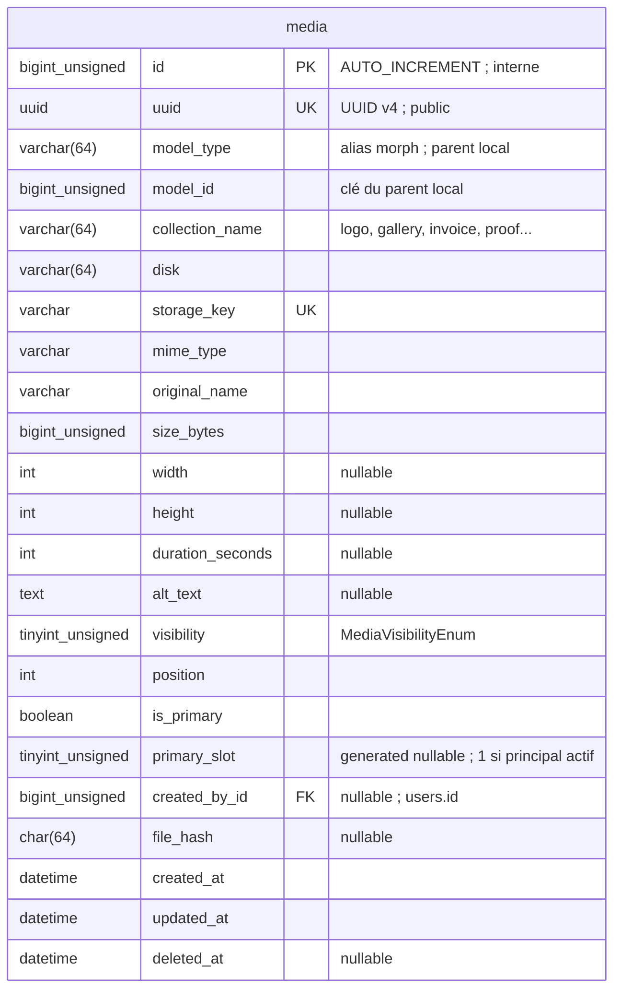
```mermaid
erDiagram
    direction TB
    media {
        bigint_unsigned id PK "AUTO_INCREMENT ; interne"
        uuid uuid UK "UUID v4 ; public"
        varchar(64) model_type "alias morph ; parent local"
        bigint_unsigned model_id "clé du parent local"
        varchar(64) collection_name "logo, gallery, invoice, proof..."
        varchar(64) disk
        varchar storage_key UK
        varchar mime_type
        varchar original_name
        bigint_unsigned size_bytes
        int width "nullable"
        int height "nullable"
        int duration_seconds "nullable"
        text alt_text "nullable"
        tinyint_unsigned visibility "MediaVisibilityEnum"
        int position
        boolean is_primary
        tinyint_unsigned primary_slot "generated nullable ; 1 si principal actif"
        bigint_unsigned created_by_id FK "nullable ; users.id"
        char(64) file_hash "nullable"
        datetime created_at
        datetime updated_at
        datetime deleted_at "nullable"
    }

```

Tous les champs ont le sens défini en T2 et au §7.6, avec chemins `central/public/...` ou `central/private/...`. Les champs proof_storage_key/immutable_document_key encore présents dans les tables de boutique conservent leur rôle local. Pour les cinq tables de facturation centrale, les métadonnées canoniques sont uniquement media.storage_key/file_hash via la FK de pièce, avec protection du média et des octets selon C8.4 ; aucune preuve historique n’est abandonnée. Un reçu ou document peut avoir un média rattaché par morph sans modifier son identité documentaire ou sa politique de conservation.

### C10 — Référentiels de livraison communs

**`shipping_carriers` — Le catalogue commun des sociétés et réseaux de livraison : leur nom, leur code et le connecteur serveur prévu. Il ne contient aucun compte privé de boutique.**

**`carrier_geo_mappings` — Le dictionnaire commun qui traduit une wilaya ou une commune en code compris par un réseau de livraison. Les exceptions privées d’un compte restent dans sa boutique.**

**`pickup_points` — Le catalogue commun des bureaux officiels des transporteurs, avec leur adresse, leur code et leur emplacement. Chaque commerçant choisit séparément les bureaux qu’il autorise.**

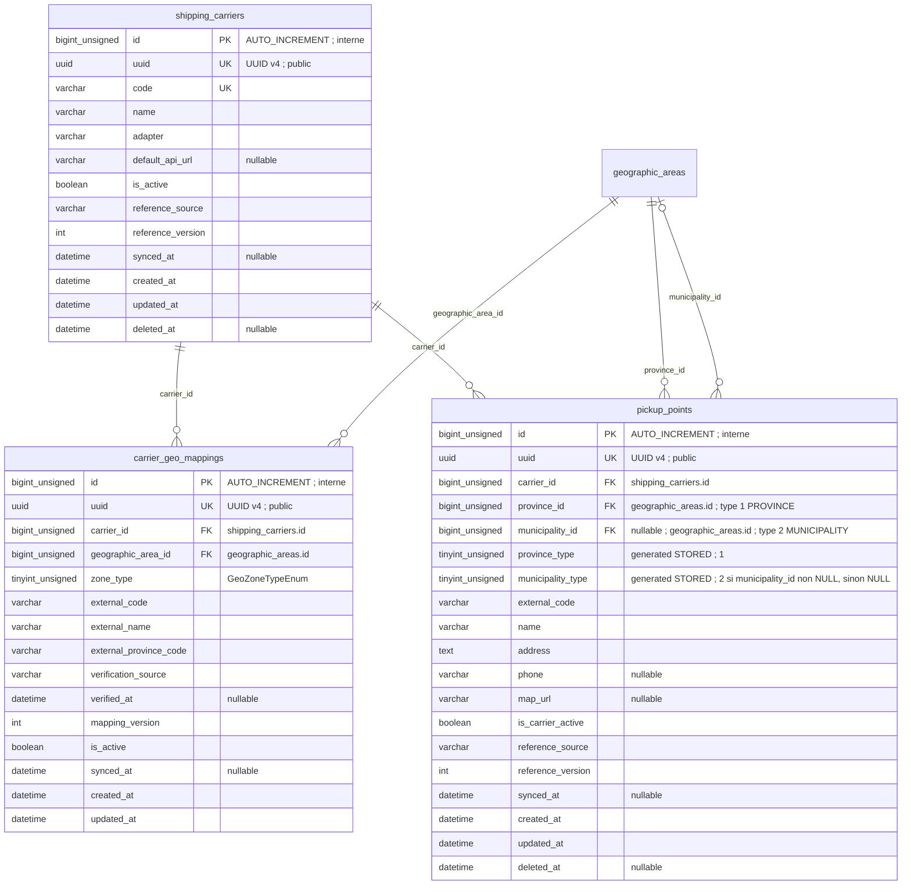
```mermaid
erDiagram
    direction TB
    shipping_carriers {
        bigint_unsigned id PK "AUTO_INCREMENT ; interne"
        uuid uuid UK "UUID v4 ; public"
        varchar code UK
        varchar name
        varchar adapter
        varchar default_api_url "nullable"
        boolean is_active
        varchar reference_source
        int reference_version
        datetime synced_at "nullable"
        datetime created_at
        datetime updated_at
        datetime deleted_at "nullable"
    }
    carrier_geo_mappings {
        bigint_unsigned id PK "AUTO_INCREMENT ; interne"
        uuid uuid UK "UUID v4 ; public"
        bigint_unsigned carrier_id FK "shipping_carriers.id"
        bigint_unsigned geographic_area_id FK "geographic_areas.id"
        tinyint_unsigned zone_type "GeoZoneTypeEnum"
        varchar external_code
        varchar external_name
        varchar external_province_code
        varchar verification_source
        datetime verified_at "nullable"
        int mapping_version
        boolean is_active
        datetime synced_at "nullable"
        datetime created_at
        datetime updated_at
    }
    pickup_points {
        bigint_unsigned id PK "AUTO_INCREMENT ; interne"
        uuid uuid UK "UUID v4 ; public"
        bigint_unsigned carrier_id FK "shipping_carriers.id"
        bigint_unsigned province_id FK "geographic_areas.id ; type 1 PROVINCE"
        bigint_unsigned municipality_id FK "nullable ; geographic_areas.id ; type 2 MUNICIPALITY"
        tinyint_unsigned province_type "generated STORED ; 1"
        tinyint_unsigned municipality_type "generated STORED ; 2 si municipality_id non NULL, sinon NULL"
        varchar external_code
        varchar name
        text address
        varchar phone "nullable"
        varchar map_url "nullable"
        boolean is_carrier_active
        varchar reference_source
        int reference_version
        datetime synced_at "nullable"
        datetime created_at
        datetime updated_at
        datetime deleted_at "nullable"
    }
    shipping_carriers ||--o{ carrier_geo_mappings : carrier_id
    geographic_areas ||--o{ carrier_geo_mappings : geographic_area_id
    shipping_carriers ||--o{ pickup_points : carrier_id
    geographic_areas ||--o{ pickup_points : province_id
    geographic_areas |o--o{ pickup_points : municipality_id
```

#### Explication très simple des champs

**`shipping_carriers` :**

- **`id`** : Le numéro interne de ce réseau de livraison.
- **`uuid`** : Son identifiant public commun à toutes les boutiques.
- **`code`** : Son code stable, par exemple ecotrack ou dhd.
- **`name`** : Le nom de la société ou du réseau.
- **`adapter`** : Le code d’un connecteur autorisé installé sur le serveur ; aucun script libre.
- **`default_api_url`** : L’adresse API publique proposée par défaut, si elle est connue et contrôlée.
- **`is_active`** : Indique si de nouvelles livraisons peuvent utiliser ce réseau.
- **`reference_source`** : La source vérifiée de ces informations communes.
- **`reference_version`** : La version du référentiel publiée après validation.
- **`synced_at`** : La date de dernière actualisation vérifiée.
- **`created_at`** : La date d’ajout de ce réseau.
- **`updated_at`** : La date de dernière actualisation de sa fiche.
- **`deleted_at`** : Sa date d’archivage, sans supprimer les anciennes références.

**`carrier_geo_mappings` :**

- **`id`** : Le numéro interne de cette correspondance.
- **`uuid`** : Son identifiant public stable.
- **`carrier_id`** : Le réseau qui utilise ce code géographique.
- **`geographic_area_id`** : La wilaya ou la commune centrale concernée.
- **`zone_type`** : Indique si cette zone est une wilaya ou une commune ; doit correspondre à la zone centrale.
- **`external_code`** : Le code réellement attendu par ce réseau pour cette zone.
- **`external_name`** : Le nom utilisé par le réseau pour cette zone.
- **`external_province_code`** : Le code de la wilaya chez ce réseau, même pour une commune.
- **`verification_source`** : La source utilisée pour vérifier cette correspondance commune.
- **`verified_at`** : La date de vérification ; vide signifie qu’elle ne suffit pas pour un envoi.
- **`mapping_version`** : La version de cette traduction ; une requête préparée garde la version choisie.
- **`is_active`** : Indique si cette traduction est disponible pour de nouvelles requêtes.
- **`synced_at`** : La date de dernière synchronisation validée.
- **`created_at`** : La date d’ajout de cette correspondance.
- **`updated_at`** : La date de dernière actualisation autorisée.

**`pickup_points` :**

- **`id`** : Le numéro interne de ce bureau central.
- **`uuid`** : L’identifiant public du bureau conservé dans les commandes des boutiques.
- **`carrier_id`** : Le réseau de livraison auquel appartient ce bureau.
- **`province_id`** : La wilaya centrale du bureau.
- **`municipality_id`** : Sa commune centrale, si la source permet de l’identifier précisément.
- **`province_type`** : La valeur calculée qui impose une wilaya pour province_id.
- **`municipality_type`** : La valeur calculée qui impose une commune pour municipality_id.
- **`external_code`** : Le code du bureau attendu par ce réseau ; unique dans ce réseau.
- **`name`** : Le nom du bureau affiché aux clients.
- **`address`** : L’adresse publique de ce bureau.
- **`phone`** : Son numéro de contact public, si disponible.
- **`map_url`** : Le lien public pour le trouver sur une carte.
- **`is_carrier_active`** : Indique si le transporteur propose encore ce bureau ; cela ne remplace pas le choix du commerçant.
- **`reference_source`** : La source contrôlée de cette fiche publique.
- **`reference_version`** : La version de la fiche du bureau utilisée pour les nouveaux choix.
- **`synced_at`** : La date de dernière synchronisation de cette fiche.
- **`created_at`** : La date d’ajout de ce bureau.
- **`updated_at`** : La date de dernière actualisation de sa fiche.
- **`deleted_at`** : La date d’archivage ; les commandes antérieures gardent leur snapshot.

**Référentiel public partagé, compte privé local :** les codes et bureaux ne sont centraux que lorsqu’ils appartiennent réellement au même réseau et sont indépendants d’un contrat. Les clés API, identifiants de comptes, colis, acheteurs, tarifs négociés et reversements restent strictement locaux. Une autorisation de bureau propre à un contrat ou un code privé de compte n’est jamais publiée comme référence globale : le choix/exception vérifié reste dans shipping_providers.reference_configuration et le snapshot d’envoi. Les livreurs employés et le propriétaire restent des shipping_providers locaux, sans faux réseau central.

**Codes et versions :** UNIQUE(shipping_carriers.code), UNIQUE(carrier_geo_mappings.carrier_id,geographic_area_id), UNIQUE(pickup_points.carrier_id,external_code). Plusieurs zones internes peuvent partager un ancien code externe : aucune unicité globale sur carrier_geo_mappings.external_code. Les UUID et l’identité du réseau sont stables ; désactivation/archivage plutôt qu’effacement. Une actualisation publie une nouvelle version après vérification, avec audit central. Elle ne réécrit ni les snapshots de commandes, ni les requêtes déjà préparées/envoyées. Les noms peuvent évoluer ; les UUID ne changent pas de réseau ou de zone. Une commune doit appartenir à la wilaya du bureau. Contraintes SQL centrales détaillées en §6.8.

**Administration et disponibilité :** lecture des références actives par le service de boutique ; mutation centrale réservée à saas.shipping_reference.manage, avec règles d’administration et audit central. Les employés locaux ne gèrent que leurs choix/connexions autorisés. Les endpoints et adaptateurs sont une liste serveur contrôlée ; aucune URL libre ne reçoit des secrets. Le catalogue global ne garantit pas la disponibilité dans un contrat : avant toute requête mutatrice, vérifier codes, bureau, zone et service avec le compte transporteur réellement utilisé. Une source non vérifiée, un code absent ou une route impossible bloque la préparation ; on ne devine aucun code et on ne déclare pas un tarif inconnu gratuit.

## 5. BDD de chaque boutique : `boutique_{slug_initial}`

Le décompte actuel est de **59 tables locales**. Le [diagramme boutique complet](Diagramme-BDD-Boutique-Complet.md) les réunit en un seul dessin et explique chaque champ. Les décomptes des versions antérieures restent historiques.

Ce même modèle est migré dans chaque BDD tenant. Aucun `tenant_id` n’est ajouté à toutes les lignes : le contexte de connexion assure déjà la séparation. La ligne unique `shop` conserve la référence de rattachement.

### T1 — Profil public

**`shop` — La fiche publique de la boutique : son nom affiché, son logo, ses contacts et sa présentation. Exemple : les informations que les visiteurs voient sur le site de Karim.**

**`shop_addresses` — Les adresses publiques et les liens sociaux de cette boutique : une ligne ADDRESS est un lieu, une ligne SOCIAL est un lien. Un lien peut concerner toute la boutique ou une adresse précise.**

**`content_pages` — Toutes les pages éditées de la vitrine : une page d’information comme « À propos », ou une page de vente consacrée à un produit. Le champ page_kind distingue les deux fonctions.**

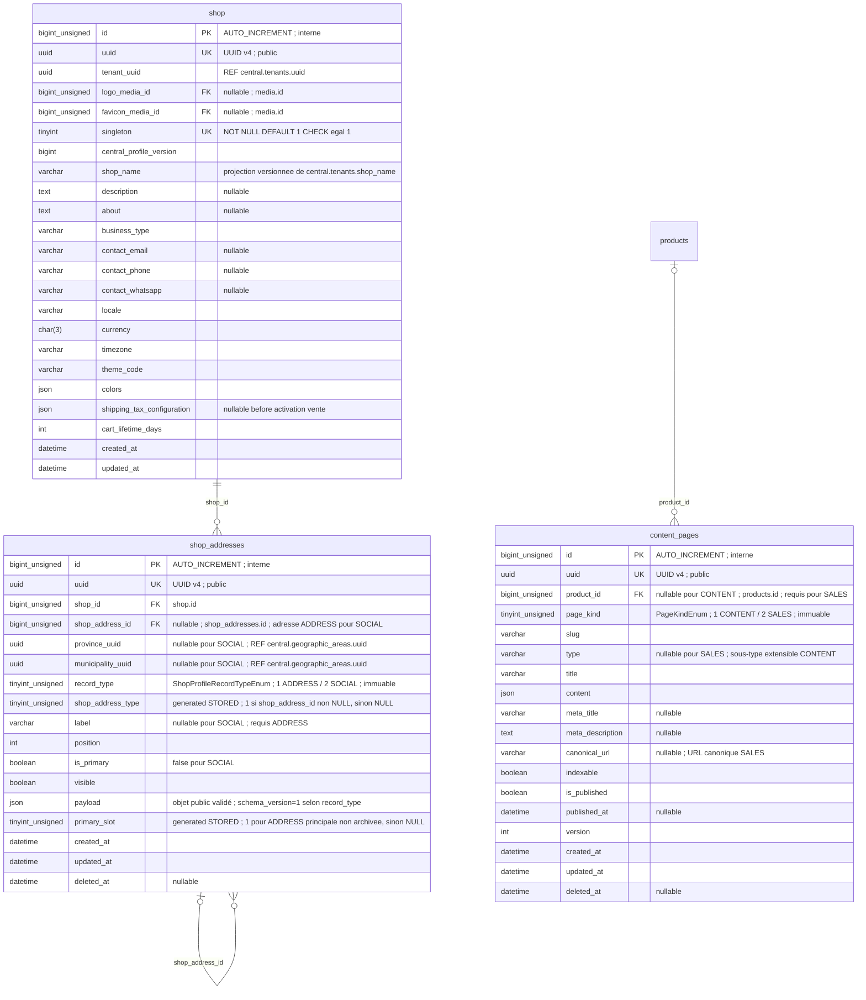
```mermaid
erDiagram
    direction TB
    shop {
        bigint_unsigned id PK "AUTO_INCREMENT ; interne"
        uuid uuid UK "UUID v4 ; public"
        uuid tenant_uuid "REF central.tenants.uuid"
        bigint_unsigned logo_media_id FK "nullable ; media.id"
        bigint_unsigned favicon_media_id FK "nullable ; media.id"
        tinyint singleton UK "NOT NULL DEFAULT 1 CHECK egal 1"
        bigint central_profile_version
        varchar shop_name "projection versionnee de central.tenants.shop_name"
        text description "nullable"
        text about "nullable"
        varchar business_type
        varchar contact_email "nullable"
        varchar contact_phone "nullable"
        varchar contact_whatsapp "nullable"
        varchar locale
        char(3) currency
        varchar timezone
        varchar theme_code
        json colors
        json shipping_tax_configuration "nullable before activation vente"
        int cart_lifetime_days
        datetime created_at
        datetime updated_at
    }
    shop_addresses {
        bigint_unsigned id PK "AUTO_INCREMENT ; interne"
        uuid uuid UK "UUID v4 ; public"
        bigint_unsigned shop_id FK "shop.id"
        bigint_unsigned shop_address_id FK "nullable ; shop_addresses.id ; adresse ADDRESS pour SOCIAL"
        uuid province_uuid "nullable pour SOCIAL ; REF central.geographic_areas.uuid"
        uuid municipality_uuid "nullable pour SOCIAL ; REF central.geographic_areas.uuid"
        tinyint_unsigned record_type "ShopProfileRecordTypeEnum ; 1 ADDRESS / 2 SOCIAL ; immuable"
        tinyint_unsigned shop_address_type "generated STORED ; 1 si shop_address_id non NULL, sinon NULL"
        varchar label "nullable pour SOCIAL ; requis ADDRESS"
        int position
        boolean is_primary "false pour SOCIAL"
        boolean visible
        json payload "objet public validé ; schema_version=1 selon record_type"
        tinyint_unsigned primary_slot "generated STORED ; 1 pour ADDRESS principale non archivee, sinon NULL"
        datetime created_at
        datetime updated_at
        datetime deleted_at "nullable"
    }
    content_pages {
        bigint_unsigned id PK "AUTO_INCREMENT ; interne"
        uuid uuid UK "UUID v4 ; public"
        bigint_unsigned product_id FK "nullable pour CONTENT ; products.id ; requis pour SALES"
        tinyint_unsigned page_kind "PageKindEnum ; 1 CONTENT / 2 SALES ; immuable"
        varchar slug
        varchar type "nullable pour SALES ; sous-type extensible CONTENT"
        varchar title
        json content
        varchar meta_title "nullable"
        text meta_description "nullable"
        varchar canonical_url "nullable ; URL canonique SALES"
        boolean indexable
        boolean is_published
        datetime published_at "nullable"
        int version
        datetime created_at
        datetime updated_at
        datetime deleted_at "nullable"
    }
    shop ||--o{ shop_addresses : shop_id
    shop_addresses |o--o{ shop_addresses : shop_address_id
    products |o--o{ content_pages : product_id
```

#### Explication très simple des champs

**`shop` :**

- **`id`** : le numéro unique qui permet de reconnaître cette ligne dans la base. Deux lignes différentes ne peuvent pas avoir le même `id`.
- **`uuid`** : identifiant public UUID v4 unique et indexé ; routes, API, formulaires et exports utilisent cet identifiant, sans exposer la PK numérique.
- **`tenant_uuid`** : le UUID de la boutique dans `central.tenants.uuid`, conservé pour cette référence métier inter-BDD ; ce n’est ni l’ID numérique local ni la clé technique utilisée par Tenancy.
- **`singleton`** : un petit verrou technique qui garantit qu’il n’existe qu’une seule ligne de ce type dans la base. Exemple : une seule fiche `shop`.
- **`central_profile_version`** : la dernière version du profil central que cette boutique a reçue. Cela permet de voir si elle est à jour.
- **`shop_name`** : le nom affiché à l’utilisateur. Exemple : « Nombre de boutiques » ou « Livraison EcoTrack ».
- **`description`** : un texte qui explique l’élément plus en détail. Il peut rester vide si aucune explication supplémentaire n’est nécessaire.
- **`about`** : le texte de présentation de la boutique. Exemple : son histoire ou ce qu’elle vend. Ce champ peut rester vide quand cette information n’est pas nécessaire ou pas encore connue.
- **`business_type`** : le type d’activité de la boutique. Exemple : vêtements, restaurant ou salon.
- **`contact_email`** : l’email public que les visiteurs peuvent utiliser pour contacter la boutique. Ce champ peut rester vide quand cette information n’est pas nécessaire ou pas encore connue.
- **`contact_phone`** : le téléphone public de la boutique. Ce champ peut rester vide quand cette information n’est pas nécessaire ou pas encore connue.
- **`contact_whatsapp`** : le numéro WhatsApp public de la boutique. Ce champ peut rester vide quand cette information n’est pas nécessaire ou pas encore connue.
- **`logo_media_id`** : le fichier utilisé comme logo de la boutique. Ce champ peut rester vide quand cette information n’est pas nécessaire ou pas encore connue.
- **`favicon_media_id`** : la petite image affichée dans l’onglet du navigateur. Ce champ peut rester vide quand cette information n’est pas nécessaire ou pas encore connue.
- **`locale`** : la langue préférée pour l’affichage. Exemple : `fr` ou `ar`.
- **`currency`** : la monnaie utilisée. Exemple : `DZD` pour le dinar algérien.
- **`timezone`** : la zone utilisée pour afficher les dates et heures. Exemple : `Africa/Algiers`.
- **`theme_code`** : le modèle visuel choisi pour le site. Exemple : `standard`.
- **`colors`** : les couleurs choisies pour le site, enregistrées ensemble. Exemple : couleur principale et couleur des boutons.
- **`shipping_tax_configuration`** : les réglages qui expliquent comment les frais de livraison doivent être traités dans les calculs fiscaux. Ils doivent être validés avant la vente réelle. Ce champ peut rester vide quand cette information n’est pas nécessaire ou pas encore connue.
- **`cart_lifetime_days`** : le nombre de jours pendant lesquels un panier invité peut rester conservé avant d’expirer.
- **`created_at`** : la date où cette ligne a été créée dans la base.
- **`updated_at`** : la date de la dernière modification de cette ligne. Exemple : si tu modifies l’élément aujourd’hui, cette date devient celle d’aujourd’hui.

**`shop_addresses` :**

- **`id`** : le numéro interne de cette adresse ou de ce lien social.
- **`uuid`** : son identifiant public unique, utilisé dans les routes et formulaires.
- **`shop_id`** : le profil local auquel appartient cette ligne.
- **`shop_address_id`** : l’adresse à laquelle un lien social est associé ; vide pour un lien général et toujours vide sur une adresse.
- **`province_uuid`** : la wilaya officielle de l’adresse ; vide sur un lien social. La référence centrale reste un UUID externe.
- **`municipality_uuid`** : la commune officielle de cette adresse, appartenant à cette wilaya ; vide sur un lien social.
- **`record_type`** : 1 ADDRESS pour une adresse publique ; 2 SOCIAL pour un lien vers un réseau. Ce rôle ne change jamais après création.
- **`shop_address_type`** : la valeur 1 calculée quand un lien vise une adresse ; elle empêche de le rattacher à un autre lien social.
- **`label`** : le nom du lieu, ou un petit titre facultatif pour reconnaître un lien.
- **`position`** : l’ordre d’affichage parmi les adresses ou parmi les liens de la sélection concernée.
- **`is_primary`** : indique l’adresse principale ; un lien social ne peut pas être une adresse principale.
- **`visible`** : indique si cette adresse ou ce lien peut être montré au public ; masquer ne supprime pas la ligne.
- **`payload`** : les détails publics propres au rôle : rue/carte/horaires pour une adresse, réseau/URL pour un lien. Toutes les clés sont expliquées ci-dessous.
- **`primary_slot`** : la valeur technique 1 pour l’adresse principale non archivée ; elle permet de n’en avoir qu’une, même si elle est masquée.
- **`created_at`** : la date d’origine de création de cette adresse ou de ce lien.
- **`updated_at`** : la date de sa dernière modification autorisée.
- **`deleted_at`** : la date de son archivage ; archiver conserve ses données et ses associations historiques.

#### Détails du JSON public, sans perte de champs

Le payload est un objet obligatoire. Son schéma dépend exclusivement du record_type fixé par le modèle, avec schema_version=1 et clés autorisées ; des valeurs facultatives utilisent NULL plutôt qu’une information inventée. Les schémas ADDRESS et SOCIAL sont distincts, pas un objet mélangeant leurs attributs. Les contrôles SQL gardent identités, parents et géographie ; le validateur serveur contrôle les détails JSON avant chaque create/update/import, y compris le DTO public. Les futures versions demandent une transformation explicite, jamais l’effacement silencieux d’une ancienne clé.

**Schéma ADDRESS :**

| Clé du payload | Type et obligation | Explication très simple |
|---|---|---|
| schema_version | entier 1 requis | La version du format des détails. |
| address | texte requis, non vide | La rue, le quartier et les indications publiques de cette adresse. |
| postal_code | chaîne facultative | Le code postal, différent du code de commune. |
| latitude | décimal canonique facultatif, précision DECIMAL(10,7) | La position nord/sud sur une carte, de -90 à 90. |
| longitude | décimal canonique facultatif, précision DECIMAL(10,7) | La position est/ouest sur une carte, de -180 à 180. |
| map_url | URL publique facultative | Le lien de la carte ; il peut exister même sans coordonnées. |
| phone | chaîne facultative | Le téléphone public de ce lieu ; garder le 0 et l’indicatif. |
| opening_hours | objet facultatif organisé par jour | Les horaires publics ; aucune réservation, caisse ou gestion de stock n’est ajoutée. |
| opening_hours.<jour> | liste d’intervalles ; jours mon/tue/wed/thu/fri/sat/sun | Les plages d’ouverture de ce jour ; une liste vide signifie fermé. |
| opening_hours.<jour>[].opens_at | chaîne HH:mm requise par intervalle | L’heure à laquelle ce lieu ouvre. |
| opening_hours.<jour>[].closes_at | chaîne HH:mm requise par intervalle | L’heure à laquelle il ferme. |
| opening_hours.<jour>[].closes_next_day | booléen requis par intervalle | Indique si cette fermeture arrive le lendemain ; permet les horaires traversant minuit. |

**Schéma SOCIAL :**

| Clé du payload | Type et obligation | Explication très simple |
|---|---|---|
| schema_version | entier 1 requis | La version du format de ce lien. |
| network | chaîne requise, extensible | Le réseau concerné, par exemple Facebook, Instagram ou TikTok. |
| url | URL publique requise | La page exacte de cette boutique ou de ce lieu sur ce réseau. |

**Validation des détails :** latitude et longitude sont toutes deux NULL ou toutes deux fournies ; normaliser leurs valeurs décimales sans arrondi au-delà de la précision précédente. map_url reste indépendant de cette paire. Les URL map_url/url acceptent seulement http/https, au maximum les 255 caractères du VARCHAR d’origine, sans identifiants de connexion ni clé API/token secret ; les paramètres publics de carte nécessaires restent possibles. Le serveur ne consulte pas ces URL pour enregistrer le profil. network, postal_code et phone conservent la limite VARCHAR(255) ; address conserve la capacité TEXT initiale, avec limite d’octets contrôlée. Les jours/intervalles d’horaires et leurs traversées de minuit sont validés selon le fuseau shop.timezone, sans code exécutable, HTML arbitraire ni secret. Les limites du formulaire/payload sont bornées et ne suppriment aucune entrée historique pendant une migration. Aucun service Maps, compte social, publication automatisée ou calendrier marketing n’est créé.

**`content_pages` :**

- **`id`** : le numéro interne de cette page.
- **`uuid`** : son identifiant public unique ; il est conservé lors de la fusion.
- **`product_id`** : le produit présenté par une page de vente. Une page d’information n’a pas de produit.
- **`page_kind`** : 1 CONTENT pour une page d’information ; 2 SALES pour une page de vente. Ce rôle ne change pas après création.
- **`slug`** : la partie lisible de son adresse web. Elle est unique parmi les pages du même rôle.
- **`type`** : le sous-type d’une page d’information, par exemple about, contact, faq ou returns. Il reste extensible et est vide pour une page de vente.
- **`title`** : le titre affiché sur la page.
- **`content`** : ses textes et blocs autorisés par le template, dans un JSON structuré ; aucun code arbitraire ni prix indépendant.
- **`meta_title`** : son titre pour les moteurs de recherche et le partage, s’il est renseigné.
- **`meta_description`** : sa courte description pour les moteurs de recherche, si nécessaire.
- **`canonical_url`** : l’adresse principale d’une page de vente pour les moteurs de recherche, lorsqu’elle est renseignée.
- **`indexable`** : indique si les moteurs de recherche peuvent indexer la page.
- **`is_published`** : indique si la page peut être montrée au public.
- **`published_at`** : la date de sa publication ; vide avant publication.
- **`version`** : le numéro de version de ses blocs et paramètres éditoriaux ; une modification autorisée l’incrémente.
- **`created_at`** : la date de création de cette page.
- **`updated_at`** : la date de sa dernière modification autorisée.
- **`deleted_at`** : sa date d’archivage ; archiver conserve la page et ses liens historiques.


Les références vers un autre module sont indiquées sur les champs, même si leur flèche n’est pas redessinée ici.

- **`shop` :** Il doit exister une seule ligne `shop` dans la BDD de la boutique. Le champ technique `singleton=1` avec `UNIQUE(singleton)` empêche d’en créer une deuxième, même avec un autre `tenant_uuid`. Le provisionnement doit créer cette ligne et un contrôle de santé vérifie qu’elle existe bien. `tenant_uuid` doit correspondre au `central.tenants.uuid` attendu et ne change plus après l’insertion. L’application refuse de supprimer ce profil. Par défaut, la devise est DZD, le fuseau est `Africa/Algiers` et le thème est le template initial. `shop_name` est une copie du nom central `tenants.shop_name` : pour renommer une boutique, on change d’abord le nom au central, puis on réplique la nouvelle version ici. On ne permet jamais un renommage uniquement local. Si la projection locale échoue, le nom courant reste celui du central et la projection sera reprise ; seul le slug/domaine est réservé de manière unique. Le logo, les contacts et les couleurs restent propres à cette BDD boutique. Au MVP, après la première commande, la devise ne peut plus être changée.

- **`shop_addresses` :** Le profil reste dans shop, sans gros objet JSON regroupant toute la boutique. Les entrées publiques de 17 champs remplacent les deux anciennes tables d’adresses et de liens. Le modèle ShopAddress impose record_type=1 ADDRESS ; SocialLink impose record_type=2 SOCIAL pour toute requête, route, Policy, média et activité. Plusieurs adresses et plusieurs liens du même réseau restent autorisés ; aucune unicité de network n’est ajoutée. Un lien général a shop_address_id=NULL ; un lien associé vise une adresse ADDRESS du même shop. L’ancienne propriété SocialLink.is_active devient l’alias logique de visible, sans confondre masquage et archivage. Les adresses restent publiques, sans caisse, stock ou entrepôt distinct. Les géographies ADDRESS sont validées au central par UUID/type/appartenance ; une modification du référentiel ne réécrit pas l’histoire.

**Principale, ordre et suppression :** primary_slot=CASE WHEN record_type=1 AND is_primary=1 AND deleted_at IS NULL THEN 1 ELSE NULL END. UNIQUE(shop_id,primary_slot) garde une seule adresse principale non archivée, indépendamment de visible. Changer la principale verrouille shop.singleton=1 et les lignes concernées. position conserve l’ordre social et permet d’ordonner les adresses ; un ordre à égalité est départagé par id en interne. Archiver/masquer une adresse ne supprime, ne déplace et ne réaffecte aucun lien ; les rendus filtrent les éléments publics et n’exposent pas les détails d’une adresse masquée/archivée à travers son association. Les relations historiques restent intactes. Une suppression physique d’adresse référencée est refusée par RESTRICT. Les éventuels quotas d’entrées publiques sont évalués par type selon la règle de fonctionnalité existante sous le même verrou shop.singleton=1, sans inventer un plafond ni compter une adresse comme un lien. L’unique profil shop, sa projection centrale, les contacts généraux, logo/couleurs et réglages de vente sont inchangés.

- **`content_pages` :** Une seule table de 18 champs conserve la publication, les blocs, le SEO et les versions des deux familles de pages. `PageKindEnum` vaut 1 CONTENT ou 2 SALES. Pour CONTENT : product_id=NULL, type non vide et canonical_url=NULL. Pour SALES : product_id obligatoire et type=NULL ; canonical_url est facultative. `page_kind` et le produit d’une page SALES sont immuables. UNIQUE(page_kind,slug) conserve les espaces d’adresses distincts : le même slug peut exister dans les deux familles si leurs routes étaient distinctes. Les modèles ContentPage et SalesPage imposent leur page_kind dans chaque requête, binding, Policy et écriture. Les blocs suivent le schéma versionné du template, sans code arbitraire ; FAQ, menu, header, footer, « À propos » et textes institutionnels restent des blocs. L’archivage ne supprime ni référence commerciale ni attribution historique.

### T2 — Catalogue principal

**`media` — Les informations permettant de retrouver les fichiers de la boutique : images, vidéos, logos ou documents. Exemple : l’emplacement et le type de la photo d’un produit ; le fichier lui-même est stocké séparément.**

**`categories` — Les catégories et les étiquettes de produits : type 1 pour un rayon comme « Vêtements → T-shirts », type 2 pour un mot comme « Été ». Les produits restent dans leur propre table.**

**`products` — La présentation commune d’un produit : son nom, sa description et les informations partagées par ses versions. Exemple : le modèle « T-shirt coton », proposé ensuite en plusieurs tailles et couleurs.**

**`product_variants` — Les versions précises que l’on peut acheter, avec leur prix et leur stock. Exemple : « T-shirt rouge, taille M ». Un produit sans choix possède aussi une variante standard.**


```mermaid
erDiagram
    direction TB
    media {
        bigint_unsigned id PK "AUTO_INCREMENT ; interne"
        uuid uuid UK "UUID v4 ; public"
        bigint_unsigned model_id "clé du parent local"
        bigint_unsigned created_by_id FK "nullable ; users.id"
        varchar(64) model_type "alias morph ; parent local"
        varchar(64) collection_name "logo, gallery, invoice, proof..."
        varchar(64) disk
        varchar storage_key UK
        varchar mime_type
        varchar original_name
        bigint_unsigned size_bytes
        int width "nullable"
        int height "nullable"
        int duration_seconds "nullable"
        text alt_text "nullable"
        tinyint_unsigned visibility "MediaVisibilityEnum"
        int position
        boolean is_primary
        tinyint_unsigned primary_slot "generated nullable ; 1 si principal actif"
        char(64) file_hash "nullable"
        datetime created_at
        datetime updated_at
        datetime deleted_at "nullable"
    }
    categories {
        bigint_unsigned id PK "AUTO_INCREMENT ; interne"
        uuid uuid UK "UUID v4 ; public"
        bigint_unsigned parent_id FK "nullable ; categories.id"
        bigint_unsigned media_id FK "nullable ; media.id"
        tinyint_unsigned record_type "CategoryRecordTypeEnum ; 1 CATEGORY / 2 TAG"
        tinyint_unsigned parent_record_type "generated STORED ; 1 si parent_id non NULL, sinon NULL"
        varchar name
        varchar slug
        text description "nullable"
        int position
        boolean is_active
        varchar meta_title "nullable"
        text meta_description "nullable"
        datetime created_at
        datetime updated_at
        datetime deleted_at "nullable"
    }
    products {
        bigint_unsigned id PK "AUTO_INCREMENT ; interne"
        uuid uuid UK "UUID v4 ; public"
        bigint_unsigned category_id FK "nullable ; categories.id"
        tinyint_unsigned category_record_type "generated STORED ; 1 si category_id non NULL, sinon NULL"
        varchar name
        varchar slug
        text short_description "nullable"
        text description "nullable"
        json benefits "nullable"
        json faq "nullable"
        varchar brand "nullable"
        tinyint_unsigned type "ProductTypeEnum"
        boolean allows_customization
        text customization_instructions "nullable"
        varchar sale_unit
        decimal content_quantity "nullable"
        varchar content_unit "nullable"
        tinyint_unsigned status "PublicationStatusEnum"
        datetime published_at "nullable"
        boolean is_featured
        varchar meta_title "nullable"
        text meta_description "nullable"
        boolean indexable
        datetime created_at
        datetime updated_at
        datetime deleted_at "nullable"
    }
    product_variants {
        bigint_unsigned id PK "AUTO_INCREMENT ; interne"
        uuid uuid UK "UUID v4 ; public"
        bigint_unsigned product_id FK "products.id"
        varchar label
        varchar sku
        varchar barcode "nullable"
        char(64) combination_signature "SHA-256 canonique ; ASCII"
        datetime used_at "nullable ; identité physique figée après première utilisation"
        decimal sale_price
        decimal unit_cost
        decimal previous_price "nullable"
        json tax_configuration "nullable before mise en vente"
        int physical_stock
        int reserved_stock
        int quarantine_stock
        int low_stock_threshold
        decimal weight_kg "nullable"
        decimal length_cm "nullable"
        decimal width_cm "nullable"
        decimal height_cm "nullable"
        boolean is_active
        int position
        datetime created_at
        datetime updated_at
        datetime deleted_at "nullable"
    }
    categories |o--o{ categories : parent_id
    media |o--o{ categories : media_id
    categories |o--o{ products : category_id
    products ||--o{ product_variants : product_id
```

#### Explication très simple des champs

**`media` :**

- **`id`** : clé primaire numérique interne, auto-incrémentée ; jamais envoyée au client.
- **`uuid`** : identifiant public unique et indexé, utilisé dans les routes, formulaires, exports et ressources JSON.
- **`model_type / model_id`** : parent polymorphe dans cette même BDD ; morphTo et morphMany.
- **`collection_name / position / is_primary`** : usage (gallery, logo, invoice, proof...) et ordre d’affichage.
- **`disk / storage_key / visibility`** : disque, clé unique et visibilité publique/privée, avec isolation physique par tenant.
- **`mime_type / original_name / size_bytes`** : type contrôlé, nom original et taille du fichier.
- **`width / height / duration_seconds / alt_text`** : métadonnées utiles et accessibilité, facultatives selon le fichier.
- **`created_by_id / file_hash`** : auteur local facultatif et empreinte de contrôle.
- **`created_at / updated_at / deleted_at`** : cycle du média ; un retrait logique n’efface pas une preuve requise.

**`categories` :**

- **`record_type`** : Indique si cette ligne est une catégorie (1) ou une étiquette (2).
- **`parent_record_type`** : Valeur calculée qui oblige le parent à être une catégorie.

- **`id`** : le numéro unique qui permet de reconnaître cette ligne dans la base. Deux lignes différentes ne peuvent pas avoir le même `id`.
- **`uuid`** : identifiant public UUID v4 unique et indexé ; routes, API, formulaires et exports utilisent cet identifiant, sans exposer la PK numérique.
- **`parent_id`** : l’élément parent. Exemple : une sous-catégorie « Chaussures » peut avoir « Mode » comme catégorie parent. Ce champ peut rester vide quand cette information n’est pas nécessaire ou pas encore connue.
- **`name`** : le nom affiché à l’utilisateur. Exemple : « Nombre de boutiques » ou « Livraison EcoTrack ».
- **`slug`** : la partie simple de l’adresse web. Exemple : `a-propos` dans `/a-propos`.
- **`description`** : un texte qui explique l’élément plus en détail. Il peut rester vide si aucune explication supplémentaire n’est nécessaire.
- **`media_id`** : l’identifiant du fichier/image/vidéo. Il sert à relier cette ligne à la bonne information au lieu de recopier toutes ses données. Ce champ peut rester vide quand cette information n’est pas nécessaire ou pas encore connue.
- **`position`** : l’ordre d’affichage. Exemple : 1 apparaît avant 2.
- **`is_active`** : indique si cette possibilité est autorisée. `true` = oui, `false` = non.
- **`meta_title`** : le titre prévu pour les moteurs de recherche et le partage web. Ce champ peut rester vide quand cette information n’est pas nécessaire ou pas encore connue.
- **`meta_description`** : la petite description prévue pour les moteurs de recherche. Ce champ peut rester vide quand cette information n’est pas nécessaire ou pas encore connue.
- **`created_at`** : la date où cette ligne a été créée dans la base.
- **`updated_at`** : la date de la dernière modification de cette ligne. Exemple : si tu modifies l’élément aujourd’hui, cette date devient celle d’aujourd’hui.
- **`deleted_at`** : la date où l’élément a été retiré sans effacer son ancienne ligne. Si ce champ est vide, l’élément n’est pas supprimé.

**`products` :**

- **`category_record_type`** : Valeur calculée qui empêche de prendre une étiquette pour le rayon principal du produit.

- **`id`** : le numéro unique qui permet de reconnaître cette ligne dans la base. Deux lignes différentes ne peuvent pas avoir le même `id`.
- **`uuid`** : identifiant public UUID v4 unique et indexé ; routes, API, formulaires et exports utilisent cet identifiant, sans exposer la PK numérique.
- **`category_id`** : l’identifiant de la catégorie. Il sert à relier cette ligne à la bonne information au lieu de recopier toutes ses données. Ce champ peut rester vide quand cette information n’est pas nécessaire ou pas encore connue.
- **`name`** : le nom affiché à l’utilisateur. Exemple : « Nombre de boutiques » ou « Livraison EcoTrack ».
- **`slug`** : la partie simple de l’adresse web. Exemple : `a-propos` dans `/a-propos`.
- **`short_description`** : une petite description affichée rapidement, plus courte que la description complète. Ce champ peut rester vide quand cette information n’est pas nécessaire ou pas encore connue.
- **`description`** : un texte qui explique l’élément plus en détail. Il peut rester vide si aucune explication supplémentaire n’est nécessaire.
- **`benefits`** : plusieurs petits réglages liés à **avantages**, regroupés ensemble de manière structurée. Ce champ peut rester vide quand cette information n’est pas nécessaire ou pas encore connue.
- **`faq`** : plusieurs petits réglages liés à **faq**, regroupés ensemble de manière structurée. Ce champ peut rester vide quand cette information n’est pas nécessaire ou pas encore connue.
- **`brand`** : la marque du produit lorsqu’il en a une. Ce champ peut rester vide quand cette information n’est pas nécessaire ou pas encore connue.
- **`type`** : code de `ProductTypeEnum` : `1 STANDARD` pour un produit physique standard, `2 CUSTOMIZED` pour un produit physique personnalisable.
- **`allows_customization`** : un **oui/non** pour indiquer si **personnalisation autorisee** est vrai ou autorisé. `true` = oui ; `false` = non.
- **`customization_instructions`** : les instructions données au client pour personnaliser le produit. Exemple : « Écrivez le prénom à imprimer ». Ce champ peut rester vide pour un produit normal.
- **`sale_unit`** : ce que représente une unité vendue. Exemple : `pièce`, `boîte` ou `bouquet`.
- **`content_quantity`** : le nombre d’unités correspondant à **contenu**. Exemple : `2` signifie deux unités. Ce champ peut rester vide quand cette information n’est pas nécessaire ou pas encore connue.
- **`content_unit`** : l’unité utilisée pour décrire le contenu. Exemple : une bouteille de `500 ml`. Ce champ peut rester vide si ce n’est pas utile.
- **`status`** : code entier de l’enum propre à cet objet, défini au §3.3 ; les libellés sont traduits à l’affichage et les transitions contrôlées par le service.
- **`published_at`** : la date où l’élément a été publié. Ce champ peut rester vide quand cette information n’est pas nécessaire ou pas encore connue.
- **`is_featured`** : indique si l’élément doit être davantage mis en évidence sur le site.
- **`meta_title`** : le titre prévu pour les moteurs de recherche et le partage web. Ce champ peut rester vide quand cette information n’est pas nécessaire ou pas encore connue.
- **`meta_description`** : la petite description prévue pour les moteurs de recherche. Ce champ peut rester vide quand cette information n’est pas nécessaire ou pas encore connue.
- **`indexable`** : indique si les moteurs de recherche sont autorisés à indexer cette page.
- **`created_at`** : la date où cette ligne a été créée dans la base.
- **`updated_at`** : la date de la dernière modification de cette ligne. Exemple : si tu modifies l’élément aujourd’hui, cette date devient celle d’aujourd’hui.
- **`deleted_at`** : la date où l’élément a été retiré sans effacer son ancienne ligne. Si ce champ est vide, l’élément n’est pas supprimé.

**`product_variants` :**

- **`id`** : le numéro unique qui permet de reconnaître cette ligne dans la base. Deux lignes différentes ne peuvent pas avoir le même `id`.
- **`uuid`** : identifiant public UUID v4 unique et indexé ; routes, API, formulaires et exports utilisent cet identifiant, sans exposer la PK numérique.
- **`product_id`** : l’identifiant du produit. Il sert à relier cette ligne à la bonne information au lieu de recopier toutes ses données.
- **`label`** : un nom court utilisé pour reconnaître facilement l’élément à l’écran.
- **`sku`** : la référence utilisée pour reconnaître **SKU** sans se baser seulement sur son nom.
- **`barcode`** : le code-barres de la variante lorsqu’il existe.
- **`combination_signature`** : une empreinte SHA-256 de 64 caractères calculée à partir des identifiants stables des axes et valeurs, pour empêcher deux variantes du même produit représentant exactement la même combinaison. Une correction de libellé ne change pas cette empreinte.
- **`used_at`** : la date et l’heure liées à **utilisee**. Elle permet de savoir exactement quand cette étape a eu lieu. Ce champ peut rester vide quand cette information n’est pas nécessaire ou pas encore connue.
- **`sale_price`** : le prix de vente actuel de cette variante.
- **`unit_cost`** : le coût d’achat ou de revient d’une unité pour le commerçant.
- **`previous_price`** : le prix affiché comme ancien prix avant la promotion. Ce champ peut rester vide quand cette information n’est pas nécessaire ou pas encore connue.
- **`tax_configuration`** : les informations nécessaires pour appliquer la règle fiscale prévue à ce moment-là, sans changer l’historique plus tard. Ce champ peut rester vide quand cette information n’est pas nécessaire ou pas encore connue.
- **`physical_stock`** : le nombre d’unités réellement présentes physiquement.
- **`reserved_stock`** : le nombre d’unités gardées de côté pour des commandes déjà confirmées.
- **`quarantine_stock`** : le nombre d’unités mises de côté parce qu’elles doivent être vérifiées et ne peuvent pas être vendues tout de suite.
- **`low_stock_threshold`** : le niveau à partir duquel le système doit prévenir que le stock devient faible.
- **`weight_kg`** : le poids en kilogrammes. Ce champ peut rester vide quand cette information n’est pas nécessaire ou pas encore connue.
- **`length_cm`** : la longueur en centimètres. Ce champ peut rester vide quand cette information n’est pas nécessaire ou pas encore connue.
- **`width_cm`** : la largeur en centimètres. Ce champ peut rester vide quand cette information n’est pas nécessaire ou pas encore connue.
- **`height_cm`** : la hauteur en centimètres. Ce champ peut rester vide quand cette information n’est pas nécessaire ou pas encore connue.
- **`is_active`** : indique si cette possibilité est autorisée. `true` = oui, `false` = non.
- **`position`** : l’ordre d’affichage. Exemple : 1 apparaît avant 2.
- **`created_at`** : la date où cette ligne a été créée dans la base.
- **`updated_at`** : la date de la dernière modification de cette ligne. Exemple : si tu modifies l’élément aujourd’hui, cette date devient celle d’aujourd’hui.
- **`deleted_at`** : la date où l’élément a été retiré sans effacer son ancienne ligne. Si ce champ est vide, l’élément n’est pas supprimé.


Les références vers un autre module sont indiquées sur les champs, même si leur flèche n’est pas redessinée ici.

- **`media` :** Chaque `storage_key` est unique. Le chemin du fichier est construit uniquement par le serveur, par exemple `tenants/{tenant_id}/public/...` ou `tenants/{tenant_id}/private/...`. Le client n’a pas le droit d’envoyer lui-même un chemin complet, d’utiliser `../` pour sortir de son dossier ou de viser le dossier d’une autre boutique. Avant de générer un lien d’accès, le serveur vérifie la boutique, le média, sa visibilité et les droits de l’utilisateur. Les liens privés doivent expirer rapidement. Le fichier réel reste dans S3/MinIO ou un autre stockage de fichiers ; on ne met pas le contenu binaire du fichier directement dans chaque produit. Les documents privés passent toujours par une autorisation. Les médias publics et privés restent séparés. Le texte alternatif d’une image n’est pas limité artificiellement à 30 caractères.

- **`categories` :** Chaque ligne possède un slug unique dans sa famille CATEGORY ou TAG. `parent_id=NULL` signifie que c’est une catégorie principale. Le système doit empêcher une boucle comme A → B → C → A. Dans ce modèle, un produit possède une catégorie principale ; les étiquettes servent aux autres regroupements transversaux.

- **`products` :** Chaque produit possède un `slug` unique. `type` vaut `physique_standard` ou `physique_personnalise`. Même un bouquet personnalisé reste un produit physique à livrer ; ce module ne gère pas de rendez-vous. Le prix, le coût, le SKU, le code-barres et le stock ne sont pas stockés directement sur `products` : ils sont portés par `product_variants`, même lorsqu’un produit n’a qu’une seule variante standard. Quand c’est utile, le prix par unité de contenu peut être calculé.

- **`product_variants` :** Chaque SKU est unique, et deux variantes d’un même produit ne peuvent pas représenter exactement la même combinaison d’options. UNIQUE(product_id,combination_signature) est obligatoire, y compris pour les variantes archivées. Calculer SHA-256 sur une sérialisation canonique versionnée des couples (UUID axe, UUID valeur), triés par UUID axe ; aucun libellé modifiable, prix ou texte de personnalisation ne participe à cette identité. La variante standard utilise la représentation canonique vide et ne possède aucun pivot. Avant le premier usage, toute correction autorisée de composition recalcule la signature dans la même transaction ; dès used_at rempli, signature et composition sont figées. SKU historique et UUID ne sont jamais recyclés. `product_id` ne peut jamais être changé après la création de la variante : si une variante a été attachée au mauvais produit, on l’archive et on en crée une nouvelle. Dès qu’une variante est utilisée pour la première fois dans le stock, une réservation ou une commande, `used_at` est rempli. À partir de ce moment, son identité physique est figée : une taille 40 ne devient jamais une taille 41 et une variante rouge ne devient jamais bleue. Pour changer l’identité physique, on crée une nouvelle variante avec un nouvel UUID. Une ancienne variante archivée n’est jamais recyclée pour un autre produit physique. Lorsqu’un premier usage arrive au même moment qu’une modification, la ligne est verrouillée avec `FOR UPDATE` pour qu’une seule opération gagne proprement. Les stocks `physical_stock`, `reserved_stock` et `quarantine_stock` ne peuvent jamais devenir négatifs, et le stock réservé ne peut jamais dépasser le stock physique. Le disponible correspond à `physique - réservé`. Le MVP n’autorise ni survente ni précommande. Une réservation n’est créée que s’il reste assez de disponible, et une expédition n’est faite que si la réservation et le physique le permettent, toujours sous verrou. Les compteurs de stock sont alimentés par `stock_movements`. Les prix, coûts et seuils de stock faible sont positifs ou nuls. Les informations fiscales utilisées pour une vente seront ensuite figées dans la révision de commande.

### T3 — Choix de variantes et images

**`product_options` — Les choix d’un produit, rangés dans une seule table : une ligne AXIS décrit « Taille » ; ses lignes VALUE proposent « M » et « L ». Une autre ligne AXIS peut décrire « Couleur », avec ses propres valeurs.**

**`variant_option_values` — Les choix qui composent une variante vendable. Exemple : le t-shirt précis a la taille M et la couleur rouge. La variante garde son prix, son SKU et son stock dans product_variants.**

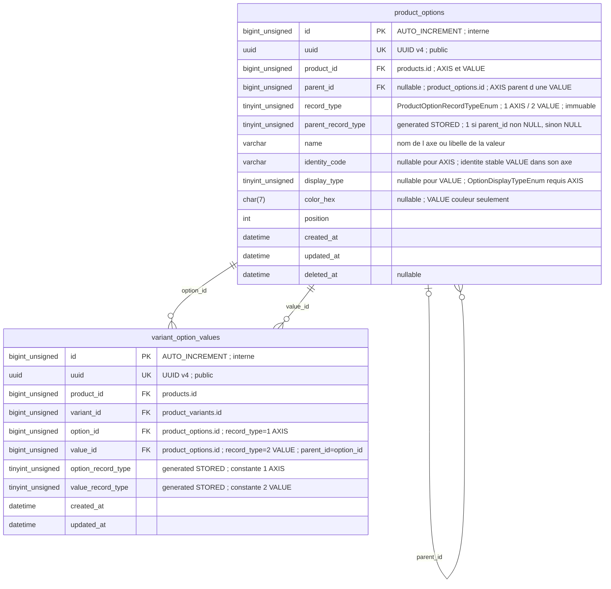
```mermaid
erDiagram
    direction TB
    product_options {
        bigint_unsigned id PK "AUTO_INCREMENT ; interne"
        uuid uuid UK "UUID v4 ; public"
        bigint_unsigned product_id FK "products.id ; AXIS et VALUE"
        bigint_unsigned parent_id FK "nullable ; product_options.id ; AXIS parent d une VALUE"
        tinyint_unsigned record_type "ProductOptionRecordTypeEnum ; 1 AXIS / 2 VALUE ; immuable"
        tinyint_unsigned parent_record_type "generated STORED ; 1 si parent_id non NULL, sinon NULL"
        varchar name "nom de l axe ou libelle de la valeur"
        varchar identity_code "nullable pour AXIS ; identite stable VALUE dans son axe"
        tinyint_unsigned display_type "nullable pour VALUE ; OptionDisplayTypeEnum requis AXIS"
        char(7) color_hex "nullable ; VALUE couleur seulement"
        int position
        datetime created_at
        datetime updated_at
        datetime deleted_at "nullable"
    }
    variant_option_values {
        bigint_unsigned id PK "AUTO_INCREMENT ; interne"
        uuid uuid UK "UUID v4 ; public"
        bigint_unsigned product_id FK "products.id"
        bigint_unsigned variant_id FK "product_variants.id"
        bigint_unsigned option_id FK "product_options.id ; record_type=1 AXIS"
        bigint_unsigned value_id FK "product_options.id ; record_type=2 VALUE ; parent_id=option_id"
        tinyint_unsigned option_record_type "generated STORED ; constante 1 AXIS"
        tinyint_unsigned value_record_type "generated STORED ; constante 2 VALUE"
        datetime created_at
        datetime updated_at
    }
    product_options |o--o{ product_options : parent_id
    product_options ||--o{ variant_option_values : option_id
    product_options ||--o{ variant_option_values : value_id
```

#### Explication très simple des champs

**`product_options` :**

- **`id`** : le numéro interne de cet axe ou de ce choix.
- **`uuid`** : son identifiant public unique, utilisé dans les routes et formulaires.
- **`product_id`** : le produit qui propose ce choix ; l’axe et toutes ses valeurs ont le même produit.
- **`parent_id`** : pour une valeur comme M, l’axe auquel elle appartient, par exemple Taille. Un axe n’a pas de parent.
- **`record_type`** : 1 AXIS pour la question « quelle taille ? » ; 2 VALUE pour un choix comme M. Ce rôle ne change pas après création.
- **`parent_record_type`** : une valeur technique calculée, égale à 1 lorsqu’un parent est indiqué ; elle empêche de placer une valeur sous une autre valeur.
- **`name`** : le nom affiché de l’axe, comme Taille, ou le libellé affiché de la valeur, comme M.
- **`identity_code`** : pour une valeur, son code stable dans l’axe ; vide pour un axe. Le code distingue son identité de son libellé.
- **`display_type`** : pour un axe, la façon d’afficher ses choix : liste, boutons ou couleurs. Vide pour une valeur.
- **`color_hex`** : pour un choix de couleur, son code web éventuel, par exemple #FF0000 ; vide pour les axes et les autres valeurs.
- **`position`** : l’ordre des axes d’un produit ou des valeurs d’un axe.
- **`created_at`** : la date de création de cette ligne.
- **`updated_at`** : la date de sa dernière correction autorisée.
- **`deleted_at`** : sa date d’archivage ; archiver conserve ses liens historiques.

**`variant_option_values` :**

- **`id`** : le numéro interne de ce choix pour une variante.
- **`uuid`** : son identifiant public unique.
- **`product_id`** : le produit commun à la variante, à l’axe et à la valeur.
- **`variant_id`** : la variante vendable composée de ces choix.
- **`option_id`** : l’axe concerné, par exemple Taille ; il pointe exclusivement une ligne AXIS.
- **`value_id`** : le choix retenu, par exemple M ; il pointe exclusivement une ligne VALUE de cet axe.
- **`option_record_type`** : la constante technique 1 calculée par la BDD pour imposer un axe.
- **`value_record_type`** : la constante technique 2 calculée par la BDD pour imposer une valeur.
- **`created_at`** : la date de création de cette composition.
- **`updated_at`** : la date d’une correction autorisée avant le premier usage ; ensuite la composition est figée.

Les références vers un autre module sont indiquées sur les champs, même si leur flèche n’est pas redessinée ici.

- **Axes et valeurs dans product_options :** 14 champs regroupent la même famille de choix, ses libellés, son ordre et son archivage ; la table physique option_values disparaît. Le modèle ProductOption est filtré sur record_type=1 AXIS et OptionValue sur record_type=2 VALUE ; l’ancien attribut logique value est une projection de name, sans seconde copie stockée. Toute route, Policy, relation et écriture impose son type. record_type, product_id et parent_id sont immuables après création. AXIS exige parent_id=NULL, identity_code=NULL, display_type IN (1,2,3) et color_hex=NULL. VALUE exige parent_id non NULL, identity_code non vide et display_type=NULL ; color_hex reste facultative. name est non vide dans les deux cas. L’affichage conserve exactement la signification des choix.

- **Unicités :** le nom d’un axe est unique après normalisation dans son produit ; le libellé d’une valeur et identity_code sont uniques dans son axe, y compris après archivage. Définir les index uniques d’expression sur (product_id,(CASE WHEN record_type=1 THEN LOWER(TRIM(name)) ELSE NULL END)), puis (parent_id,(LOWER(TRIM(name)))) et l’index UNIQUE(parent_id,identity_code). Pour les libellés, name utilise utf8mb4_0900_ai_ci et le service stocke du texte Unicode NFC ; l’unicité applique LOWER/TRIM avec cette même collation, sans autre normalisation divergente. Aucun suffixe arbitraire ne contourne un doublon. Les valeurs de deux axes différents peuvent avoir le même libellé ou le même code. Ces index ne nécessitent pas de colonne métier déclarée supplémentaire ; MySQL les implémente avec des colonnes virtuelles cachées, comptées dans sa limite de colonnes. Ce ne sont pas les index parents d’une FK. [MySQL 8.4, index d’expression](https://dev.mysql.com/doc/refman/8.4/en/create-index.html). Les clés d’intégrité typées de §6.2 imposent le bon parent et le même produit.

- **Identité physique :** l’axe représente un vrai choix d’article, comme Taille ou Couleur ; une simple indication « lavable à 30 °C » reste une caractéristique descriptive. identity_code reconnaît une valeur stable : la taille 40 ne devient jamais 41 après un usage. Dès qu’un axe ou une valeur participe à une variante used_at non NULL, sa signification physique est figée. Une correction orthographique est autorisée seulement si elle conserve la même signification ; modifier une couleur vers une autre identité, reclasser une valeur sous un autre axe ou retoucher un axe historique est refusé. Pour une nouvelle identité, créer de nouvelles lignes et variantes. Activer une dimension supplémentaire ne complète jamais rétroactivement une variante utilisée : préparer de nouvelles variantes complètes, puis archiver de la vente courante celles qui ne correspondent plus au catalogue, en conservant les anciennes commandes et possibilités de retour.

- **Composition :** UNIQUE(variant_id,option_id). Une variante proposée au catalogue a exactement une valeur active par axe actif dans sa définition de vente ; option_id est AXIS, value_id est VALUE de ce même axe, et tous appartiennent au même produit. La variante standard n’a aucun pivot et n’est sélectionnable pour une nouvelle vente que si cette définition ne comporte aucun axe actif. La complétude des axes concerne la sélection courante, pas les snapshots historiques. L’activation/retrait d’une dimension prend le verrou produit et met dans la même transaction les nouvelles variantes complètes en vente et is_active=false sur les anciennes devenues obsolètes ; refuser leur nouvelle sélection par panier/checkout/vente manuelle, même avec un ancien UUID connu. Les révisions déjà créées, leur validation/remise compatible, les retours et le traitement autorisé d’une ancienne ligne/SAV gardent l’identité et le snapshot de leur époque, sans exiger ni ajouter les axes créés ensuite. Ce circuit historique contrôlé ne republie jamais une ancienne variante dans le catalogue. Dès used_at rempli, aucun ajout, modification ou suppression de sa composition n’est permis, dans le service et la BDD. Premier usage, création/correction de composition, changement d’axe ou de valeur partagée prennent le verrou commun du produit avant les variantes par UUID, conformément au §8 ; vérifier la sémantique et used_at après les verrous, sans contrôle préalable vulnérable à une course. Les imports passent par le même service. Cette fusion ne remplace ni les variantes physiques ni leur pivot par du JSON.

- **Galeries polymorphes :** media vise products ou product_variants selon model_type/model_id, et collection_name=gallery. La variante est résolue dans la même boutique. Un seul principal actif par parent/collection ; le §7.6 remplace entièrement la liaison produit/média spécialisée.

### T4 — Étiquettes de produits

**`product_tags` — Les liens entre un produit et ses étiquettes. Exemple : ce t-shirt porte les mots « Été » et « Nouveauté », conservés comme type 2 dans categories.**

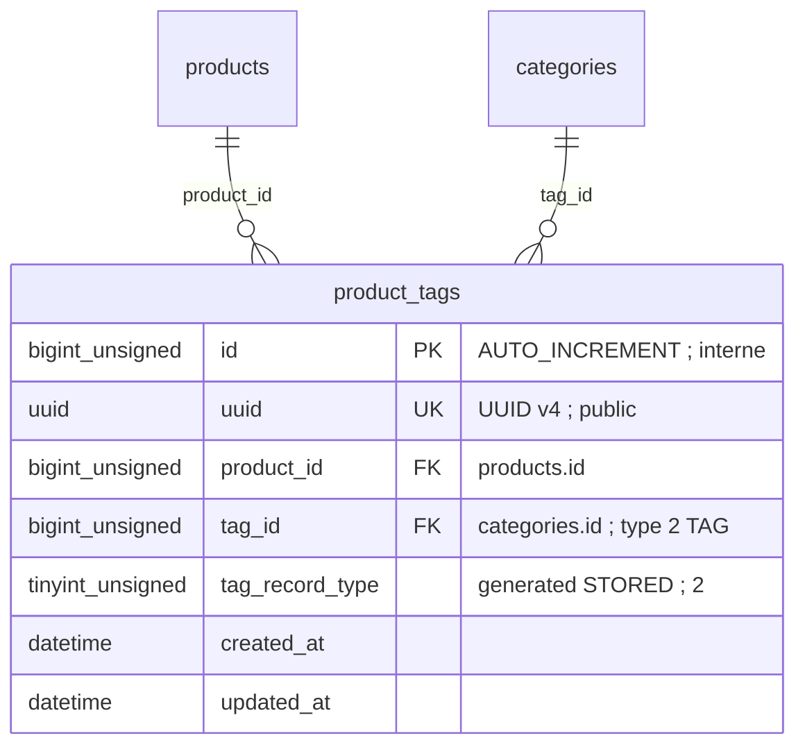
```mermaid
erDiagram
    direction TB
    product_tags {
        bigint_unsigned id PK "AUTO_INCREMENT ; interne"
        uuid uuid UK "UUID v4 ; public"
        bigint_unsigned product_id FK "products.id"
        bigint_unsigned tag_id FK "categories.id ; type 2 TAG"
        tinyint_unsigned tag_record_type "generated STORED ; 2"
        datetime created_at
        datetime updated_at
    }
    products ||--o{ product_tags : product_id
    categories ||--o{ product_tags : tag_id
```

#### Explication très simple des champs

**`product_tags` :**

- **`id`** : Le numéro interne de ce lien.
- **`uuid`** : Son identifiant public unique.
- **`product_id`** : Le produit qui porte cette étiquette.
- **`tag_id`** : L’étiquette liée, obligatoirement de type 2 dans categories.
- **`tag_record_type`** : La valeur calculée qui empêche de relier une catégorie comme étiquette.
- **`created_at`** : La date d’ajout de ce lien.
- **`updated_at`** : La date de dernière modification autorisée du lien.

**Deux familles, un dictionnaire :** categories.record_type est immuable et limité à 1 CATEGORY/2 TAG. Une étiquette n’a jamais de parent ; un parent de catégorie est lui-même CATEGORY. UNIQUE(record_type,slug) conserve deux espaces de noms indépendants. products.category_id est facultatif et ne vise que CATEGORY ; product_tags.tag_id vise seulement TAG. UNIQUE(product_id,tag_id) évite les doublons ; plusieurs produits partagent les mêmes rayons et étiquettes. Conserver les menus/hiérarchies de catégories, filtres par étiquettes et archivage. Les modèles/scopes/routes/Policies Category et Tag imposent leur type ; un alias tag ne résout jamais une catégorie. Les champs descriptifs supplémentaires de TAG sont facultatifs ; position=0 et is_active=true à la migration des anciennes étiquettes. Les caractéristiques structurées sont retirées du MVP ; description, marque, contenu/quantité et dimensions/poids directs des variantes restent possibles, sans nouvelle table ni nouveau JSON de caractéristiques. Les options Taille/Couleur et leurs variantes sont conservées en T3.

### T5 — Vente et avis

**Pages de vente — Le modèle SalesPage utilise les lignes content_pages de page_kind=2 SALES. Chaque page présente un seul produit avec ses avantages, ses images et son formulaire de commande ; aucune table sales_pages séparée n’est créée.**

**`product_promotions` — Les réductions appliquées automatiquement aux produits, sans code à saisir. Exemple : une réduction sur un produit pendant une période choisie.**

**`product_reviews` — Les notes et commentaires laissés sur les produits, même sans compte acheteur. Exemple : un client écrit « Très bon produit » ; la boutique décide ensuite de publier ou de masquer cet avis.**

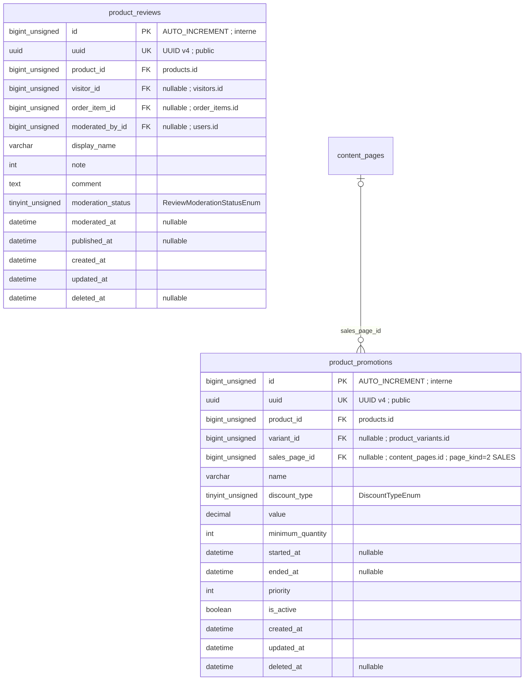
```mermaid
erDiagram
    direction TB
    product_promotions {
        bigint_unsigned id PK "AUTO_INCREMENT ; interne"
        uuid uuid UK "UUID v4 ; public"
        bigint_unsigned product_id FK "products.id"
        bigint_unsigned variant_id FK "nullable ; product_variants.id"
        bigint_unsigned sales_page_id FK "nullable ; content_pages.id ; page_kind=2 SALES"
        varchar name
        tinyint_unsigned discount_type "DiscountTypeEnum"
        decimal value
        int minimum_quantity
        datetime started_at "nullable"
        datetime ended_at "nullable"
        int priority
        boolean is_active
        datetime created_at
        datetime updated_at
        datetime deleted_at "nullable"
    }
    product_reviews {
        bigint_unsigned id PK "AUTO_INCREMENT ; interne"
        uuid uuid UK "UUID v4 ; public"
        bigint_unsigned product_id FK "products.id"
        bigint_unsigned visitor_id FK "nullable ; visitors.id"
        bigint_unsigned order_item_id FK "nullable ; order_items.id"
        bigint_unsigned moderated_by_id FK "nullable ; users.id"
        varchar display_name
        int note
        text comment
        tinyint_unsigned moderation_status "ReviewModerationStatusEnum"
        datetime moderated_at "nullable"
        datetime published_at "nullable"
        datetime created_at
        datetime updated_at
        datetime deleted_at "nullable"
    }
    content_pages |o--o{ product_promotions : sales_page_id
```

#### Explication très simple des champs

**`product_promotions` :**

- **`id`** : le numéro unique qui permet de reconnaître cette ligne dans la base. Deux lignes différentes ne peuvent pas avoir le même `id`.
- **`uuid`** : identifiant public UUID v4 unique et indexé ; routes, API, formulaires et exports utilisent cet identifiant, sans exposer la PK numérique.
- **`product_id`** : l’identifiant du produit. Il sert à relier cette ligne à la bonne information au lieu de recopier toutes ses données.
- **`variant_id`** : l’identifiant de la variante du produit. Il sert à relier cette ligne à la bonne information au lieu de recopier toutes ses données. Ce champ peut rester vide quand cette information n’est pas nécessaire ou pas encore connue.
- **`sales_page_id`** : l’identifiant de la page de vente. Il sert à relier cette ligne à la bonne information au lieu de recopier toutes ses données. Ce champ peut rester vide quand cette information n’est pas nécessaire ou pas encore connue.
- **`name`** : le nom affiché à l’utilisateur. Exemple : « Nombre de boutiques » ou « Livraison EcoTrack ».
- **`discount_type`** : code de `DiscountTypeEnum` : `1 PERCENTAGE`, `2 UNIT_AMOUNT`, `3 FIXED_UNIT_PRICE`.
- **`value`** : la valeur enregistrée. Exemple : `Rouge`, `XL` ou une autre valeur selon la table.
- **`minimum_quantity`** : le nombre d’unités correspondant à **minimum**. Exemple : `2` signifie deux unités.
- **`started_at`** : la date et l’heure où la période ou l’action commence. Ce champ peut rester vide quand cette information n’est pas nécessaire ou pas encore connue.
- **`ended_at`** : la date et l’heure où elle s’est terminée. Peut rester vide tant que ce n’est pas terminé.
- **`priority`** : un nombre utilisé pour décider quel élément passe avant un autre. Exemple : priorité 1 avant priorité 2.
- **`is_active`** : indique si cette possibilité est autorisée. `true` = oui, `false` = non.
- **`created_at`** : la date où cette ligne a été créée dans la base.
- **`updated_at`** : la date de la dernière modification de cette ligne. Exemple : si tu modifies l’élément aujourd’hui, cette date devient celle d’aujourd’hui.
- **`deleted_at`** : la date où l’élément a été retiré sans effacer son ancienne ligne. Si ce champ est vide, l’élément n’est pas supprimé.

**`product_reviews` :**

- **`id`** : le numéro unique qui permet de reconnaître cette ligne dans la base. Deux lignes différentes ne peuvent pas avoir le même `id`.
- **`uuid`** : identifiant public UUID v4 unique et indexé ; routes, API, formulaires et exports utilisent cet identifiant, sans exposer la PK numérique.
- **`product_id`** : l’identifiant du produit. Il sert à relier cette ligne à la bonne information au lieu de recopier toutes ses données.
- **`visitor_id`** : l’identifiant du visiteur. Il sert à relier cette ligne à la bonne information au lieu de recopier toutes ses données. Ce champ peut rester vide quand cette information n’est pas nécessaire ou pas encore connue.
- **`order_item_id`** : l’identifiant de la ligne de produit de la commande. Il sert à relier cette ligne à la bonne information au lieu de recopier toutes ses données. Ce champ peut rester vide quand cette information n’est pas nécessaire ou pas encore connue.
- **`display_name`** : le nom réellement montré aux visiteurs.
- **`note`** : une information libre ajoutée pour aider à comprendre la ligne. Selon la table, cela peut être une note interne ou une note chiffrée.
- **`comment`** : le texte écrit par le client ou l’utilisateur.
- **`moderation_status`** : code entier de l’enum propre à cet objet, défini au §3.3 ; les libellés sont traduits à l’affichage et les transitions contrôlées par le service.
- **`moderated_by_id`** : l’identifiant de la personne qui a modéré. Il sert à relier cette ligne à la bonne information au lieu de recopier toutes ses données. Ce champ peut rester vide quand cette information n’est pas nécessaire ou pas encore connue.
- **`moderated_at`** : la date où l’avis a été vérifié. Ce champ peut rester vide quand cette information n’est pas nécessaire ou pas encore connue.
- **`published_at`** : la date où l’élément a été publié. Ce champ peut rester vide quand cette information n’est pas nécessaire ou pas encore connue.
- **`created_at`** : la date où cette ligne a été créée dans la base.
- **`updated_at`** : la date de la dernière modification de cette ligne. Exemple : si tu modifies l’élément aujourd’hui, cette date devient celle d’aujourd’hui.
- **`deleted_at`** : la date où l’élément a été retiré sans effacer son ancienne ligne. Si ce champ est vide, l’élément n’est pas supprimé.


Les références vers un autre module sont indiquées sur les champs, même si leur flèche n’est pas redessinée ici.

- **Pages de vente :** Les lignes content_pages de page_kind=2 conservent un slug unique dans cet espace de routes et un produit immuable. Pour présenter un autre produit, archiver l’ancienne page et en créer une nouvelle. Un même produit peut avoir plusieurs pages de vente. Aucun prix ou stock propre à la page : les valeurs viennent des variantes et promotions. Une commande peut commencer sans page de vente ; aucune redirection automatique vers la catégorie n’est ajoutée. Les FK commerciales visent uniquement ces lignes SALES, du même produit.

- **`product_promotions` :** Une promotion utilise `DiscountTypeEnum` : `1 PERCENTAGE`, `2 UNIT_AMOUNT` (montant unitaire retiré) ou `3 FIXED_UNIT_PRICE` (prix unitaire fixe). La quantité minimale doit être au moins 1, un pourcentage doit rester entre 0 et 100 et le prix final ne peut jamais être négatif. Si la promotion vise une variante ou une page précise, cette variante et cette page doivent appartenir au même produit. Une seule promotion est retenue pour une ligne de commande. S’il y en a plusieurs, on regarde d’abord la priorité, puis la plus avantageuse, puis l’UUID pour départager de manière stable. Le serveur décide si une page autorise la promotion ; il ne fait jamais confiance à un simple `page_id` envoyé par le navigateur.

- **`product_reviews` :** La note est un entier de 1 à 5. Le statut utilise exactement `ReviewModerationStatusEnum` : `1 PENDING`, `2 APPROVED`, `3 HIDDEN`, `4 REJECTED`. Seuls les avis publiés entrent dans la note publique. Si un avis dit « achat vérifié », `order_item_id` doit réellement appartenir à ce produit ET le serveur doit vérifier la possession du secret fonctionnel du navigateur lié à orders.visitor_id de cette commande déclarée livrée par le livreur. La vérification concerne seulement l’envoi de l’avis, sans écran ni endpoint de suivi client ; si le navigateur n’est plus reconnaissable, l’avis reste non vérifié. Saisir seulement le même nom ou le même téléphone ne suffit pas. La FK prouve que l’article concernait ce produit, pas automatiquement l’identité de la personne qui écrit. Un avis masqué reste conservé pour audit.

### T6 — Visiteurs et statistiques

**`visitors` — Un identifiant pour reconnaître un navigateur dans cette boutique, sans créer de compte acheteur. Exemple : reconnaître le même navigateur lors d’un retour sur le site, sans garantir qu’il s’agit de la même personne.**

**`visit_sessions` — Les différentes visites d’un navigateur sur la boutique. Exemple : une visite le matin puis une autre le soir peuvent former deux sessions pour le même visiteur.**

**`navigation_events` — Les actions minimales servant aux statistiques globales de la vitrine. Exemple : compter les vues de produits, ajouts au panier et débuts de commande, sans afficher le parcours individuel d’un navigateur.**


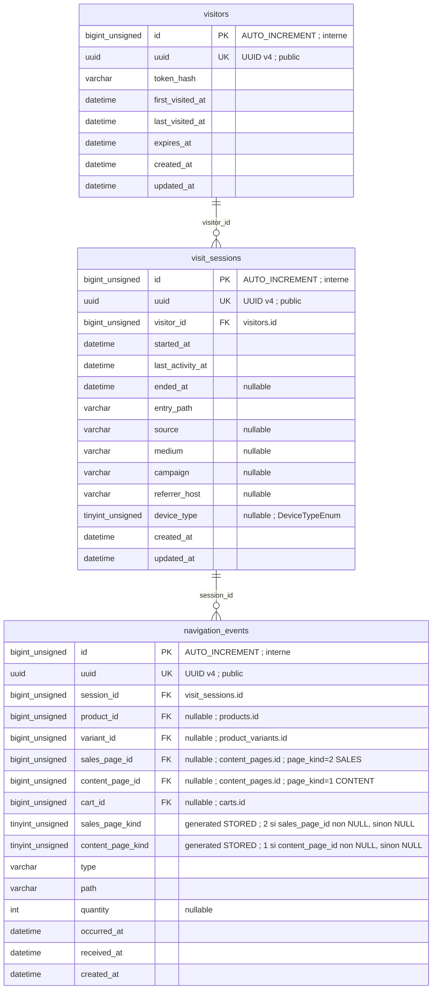
```mermaid
erDiagram
    direction TB
    visitors {
        bigint_unsigned id PK "AUTO_INCREMENT ; interne"
        uuid uuid UK "UUID v4 ; public"
        varchar token_hash
        datetime first_visited_at
        datetime last_visited_at
        datetime expires_at
        datetime created_at
        datetime updated_at
    }
    visit_sessions {
        bigint_unsigned id PK "AUTO_INCREMENT ; interne"
        uuid uuid UK "UUID v4 ; public"
        bigint_unsigned visitor_id FK "visitors.id"
        datetime started_at
        datetime last_activity_at
        datetime ended_at "nullable"
        varchar entry_path
        varchar source "nullable"
        varchar medium "nullable"
        varchar campaign "nullable"
        varchar referrer_host "nullable"
        tinyint_unsigned device_type "nullable ; DeviceTypeEnum"
        datetime created_at
        datetime updated_at
    }
    navigation_events {
        bigint_unsigned id PK "AUTO_INCREMENT ; interne"
        uuid uuid UK "UUID v4 ; public"
        bigint_unsigned session_id FK "visit_sessions.id"
        bigint_unsigned product_id FK "nullable ; products.id"
        bigint_unsigned variant_id FK "nullable ; product_variants.id"
        bigint_unsigned sales_page_id FK "nullable ; content_pages.id ; page_kind=2 SALES"
        bigint_unsigned content_page_id FK "nullable ; content_pages.id ; page_kind=1 CONTENT"
        bigint_unsigned cart_id FK "nullable ; carts.id"
        tinyint_unsigned sales_page_kind "generated STORED ; 2 si sales_page_id non NULL, sinon NULL"
        tinyint_unsigned content_page_kind "generated STORED ; 1 si content_page_id non NULL, sinon NULL"
        varchar type
        varchar path
        int quantity "nullable"
        datetime occurred_at
        datetime received_at
        datetime created_at
    }
    visitors ||--o{ visit_sessions : visitor_id
    visit_sessions ||--o{ navigation_events : session_id
```

#### Explication très simple des champs

**`visitors` :**

- **`id`** : le numéro unique qui permet de reconnaître cette ligne dans la base. Deux lignes différentes ne peuvent pas avoir le même `id`.
- **`uuid`** : identifiant public UUID v4 unique et indexé ; routes, API, formulaires et exports utilisent cet identifiant, sans exposer la PK numérique.
- **`token_hash`** : empreinte du secret du navigateur ; elle permet de retrouver son panier sans compte acheteur et ne représente pas une identité certaine.
- **`first_visited_at`** : la date de la première visite connue de ce visiteur.
- **`last_visited_at`** : la date de sa dernière visite connue.
- **`expires_at`** : la date où l’élément n’est plus valable.
- **`created_at`** : la date où cette ligne a été créée dans la base.
- **`updated_at`** : la date de la dernière modification de cette ligne. Exemple : si tu modifies l’élément aujourd’hui, cette date devient celle d’aujourd’hui.

**`visit_sessions` :**

- **`id`** : le numéro unique qui permet de reconnaître cette ligne dans la base. Deux lignes différentes ne peuvent pas avoir le même `id`.
- **`uuid`** : identifiant public UUID v4 unique et indexé ; routes, API, formulaires et exports utilisent cet identifiant, sans exposer la PK numérique.
- **`visitor_id`** : l’identifiant du visiteur. Il sert à relier cette ligne à la bonne information au lieu de recopier toutes ses données.
- **`started_at`** : la date et l’heure où la période ou l’action commence.
- **`last_activity_at`** : la dernière activité connue de cette visite ; elle aide à déterminer quand une session devient inactive.
- **`ended_at`** : la date et l’heure où elle s’est terminée. Peut rester vide tant que ce n’est pas terminé.
- **`entry_path`** : la première page visitée dans cette session. Exemple : `/produit/chaussure-noire`.
- **`source`** : l’origine connue de la visite, par exemple une campagne, un moteur de recherche ou un réseau social. C’est une étiquette de mesure facultative ; elle ne connecte pas la boutique à ce service.
- **`medium`** : une information sur le support utilisé pour arriver sur le site, par exemple une source marketing ou un canal suivi. Ce champ peut rester vide quand cette information n’est pas nécessaire ou pas encore connue.
- **`campaign`** : le nom ou code d’une campagne marketing utilisé pour savoir d’où vient la visite. Ce champ peut rester vide quand cette information n’est pas nécessaire ou pas encore connue.
- **`referrer_host`** : le site ou domaine qui a envoyé le visiteur vers la boutique. Ce champ peut rester vide quand cette information n’est pas nécessaire ou pas encore connue.
- **`device_type`** : le type d’appareil utilisé. Exemple : téléphone, ordinateur ou tablette. Ce champ peut rester vide quand cette information n’est pas nécessaire ou pas encore connue.
- **`created_at`** : la date où cette ligne a été créée dans la base.
- **`updated_at`** : la date de la dernière modification de cette ligne. Exemple : si tu modifies l’élément aujourd’hui, cette date devient celle d’aujourd’hui.

**`navigation_events` :**

- **`id`** : le numéro unique qui permet de reconnaître cette ligne dans la base. Deux lignes différentes ne peuvent pas avoir le même `id`.
- **`uuid`** : identifiant public UUID v4 unique et indexé ; routes, API, formulaires et exports utilisent cet identifiant, sans exposer la PK numérique.
- **`session_id`** : la session de navigation concernée.
- **`product_id`** : l’identifiant du produit. Il sert à relier cette ligne à la bonne information au lieu de recopier toutes ses données. Ce champ peut rester vide quand cette information n’est pas nécessaire ou pas encore connue.
- **`variant_id`** : l’identifiant de la variante du produit. Il sert à relier cette ligne à la bonne information au lieu de recopier toutes ses données. Ce champ peut rester vide quand cette information n’est pas nécessaire ou pas encore connue.
- **`sales_page_id`** : l’identifiant de la page de vente. Il sert à relier cette ligne à la bonne information au lieu de recopier toutes ses données. Ce champ peut rester vide quand cette information n’est pas nécessaire ou pas encore connue.
- **`content_page_id`** : l’identifiant de la page de contenu. Il sert à relier cette ligne à la bonne information au lieu de recopier toutes ses données. Ce champ peut rester vide quand cette information n’est pas nécessaire ou pas encore connue.
- **`sales_page_kind`** : la valeur technique 2 calculée quand une page de vente est indiquée ; elle empêche de pointer une page d’information.
- **`content_page_kind`** : la valeur technique 1 calculée quand une page d’information est indiquée ; elle empêche de pointer une page de vente.
- **`cart_id`** : l’identifiant du panier. Il sert à relier cette ligne à la bonne information au lieu de recopier toutes ses données. Ce champ peut rester vide quand cette information n’est pas nécessaire ou pas encore connue.
- **`type`** : code d’événement de navigation extensible, par exemple `product_view`, `add_to_cart` ou `checkout_started`. Il reste textuel car de nouveaux événements analytiques peuvent être ajoutés sans migration.
- **`path`** : le chemin de la page visitée sur le site, sans paramètres sensibles.
- **`quantity`** : le nombre d’éléments concernés. Exemple : `2` signifie deux unités du produit. Ce champ peut rester vide quand cette information n’est pas nécessaire ou pas encore connue.
- **`occurred_at`** : la date et l’heure où l’événement s’est produit.
- **`received_at`** : la date à laquelle le serveur a reçu cet événement ; elle peut être différente de la date où le navigateur l’a produit.
- **`created_at`** : la date où cette ligne a été créée dans la base.

- **`visitors` :** Chaque `token_hash` est unique. Le cookie du navigateur contient un secret aléatoire différent de l’UUID interne de la ligne. Une boutique ne partage pas cet identifiant avec une autre boutique. L’adresse IP ou une empreinte du navigateur ne sont pas utilisées comme identité fiable du visiteur.

- **`visit_sessions` :** On indexe `visitor_id + started_at` pour retrouver rapidement les sessions d’un visiteur. La règle proposée est de commencer une nouvelle session après 30 minutes sans activité. `source`, `medium` et `campaign` sont seulement des étiquettes internes facultatives ; elles ne connectent pas automatiquement Instagram, Facebook ou un autre réseau. On ne stocke pas comme référent une URL qui pourrait contenir un token ou un secret.

- **`navigation_events` :** L’UUID de l’événement sert aussi à éviter d’enregistrer deux fois le même événement. Les types prévus sont `page_vue`, `produit_vu`, `recherche`, `ajout_panier`, `retrait_panier` et `checkout_commence`. Les achats et les retours ne sont pas déclarés par le navigateur : ils viennent du serveur métier pour être fiables. Les références envoyées par le client et leurs dates sont vérifiées avant enregistrement. Pour une fiche produit, un seul événement `produit_vu` suffit ; on ne crée pas en plus un deuxième événement `page_vue` pour compter deux fois la même visite.


**Trois sources conservées, sans parcours individuel :** visitors retrouve le panier et permet le décompte d’uniques ; visit_sessions fournit périodes et origines agrégées ; navigation_events compte les événements dédupliqués. Aucun choix accepter/refuser la mesure, historique de préférences ou mécanisme équivalent n’est prévu dans cette version. Les statistiques commerciales viennent des faits serveur. Les durées et conditions de collecte demeurent une décision de préparation, sans écran/export de parcours individuel.

### T7 — Panier

**`carts` — Les paniers conservés par le site pour les acheteurs invités. Exemple : un visiteur ajoute deux produits avant de renseigner ses coordonnées ; cela ne réserve pas encore le stock.**

**`cart_items` — Le contenu détaillé de chaque panier. Exemple : deux t-shirts rouges taille M, avec une éventuelle personnalisation, forment une ligne du panier.**

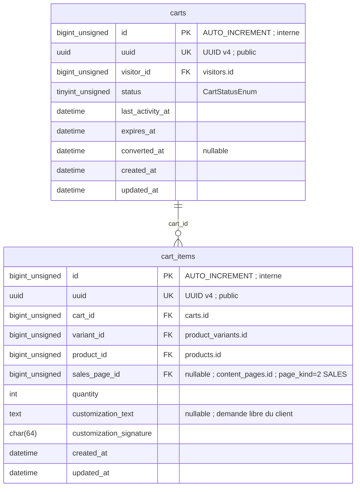
```mermaid
erDiagram
    direction TB
    carts {
        bigint_unsigned id PK "AUTO_INCREMENT ; interne"
        uuid uuid UK "UUID v4 ; public"
        bigint_unsigned visitor_id FK "visitors.id"
        tinyint_unsigned status "CartStatusEnum"
        datetime last_activity_at
        datetime expires_at
        datetime converted_at "nullable"
        datetime created_at
        datetime updated_at
    }
    cart_items {
        bigint_unsigned id PK "AUTO_INCREMENT ; interne"
        uuid uuid UK "UUID v4 ; public"
        bigint_unsigned cart_id FK "carts.id"
        bigint_unsigned variant_id FK "product_variants.id"
        bigint_unsigned product_id FK "products.id"
        bigint_unsigned sales_page_id FK "nullable ; content_pages.id ; page_kind=2 SALES"
        int quantity
        text customization_text "nullable ; demande libre du client"
        char(64) customization_signature
        datetime created_at
        datetime updated_at
    }
    carts ||--o{ cart_items : cart_id
```

#### Explication très simple des champs

**`carts` :**

- **`id`** : le numéro unique qui permet de reconnaître cette ligne dans la base. Deux lignes différentes ne peuvent pas avoir le même `id`.
- **`uuid`** : identifiant public UUID v4 unique et indexé ; routes, API, formulaires et exports utilisent cet identifiant, sans exposer la PK numérique.
- **`visitor_id`** : l’identifiant du visiteur. Il sert à relier cette ligne à la bonne information au lieu de recopier toutes ses données.
- **`status`** : code entier de l’enum propre à cet objet, défini au §3.3 ; les libellés sont traduits à l’affichage et les transitions contrôlées par le service.
- **`last_activity_at`** : la date et l’heure liées à **derniere activite**. Elle permet de savoir exactement quand cette étape a eu lieu.
- **`expires_at`** : la date où l’élément n’est plus valable.
- **`converted_at`** : la date où le panier a été transformé en commande. Ce champ peut rester vide quand cette information n’est pas nécessaire ou pas encore connue.
- **`created_at`** : la date où cette ligne a été créée dans la base.
- **`updated_at`** : la date de la dernière modification de cette ligne. Exemple : si tu modifies l’élément aujourd’hui, cette date devient celle d’aujourd’hui.

**`cart_items` :**

- **`id`** : le numéro unique qui permet de reconnaître cette ligne dans la base. Deux lignes différentes ne peuvent pas avoir le même `id`.
- **`uuid`** : identifiant public UUID v4 unique et indexé ; routes, API, formulaires et exports utilisent cet identifiant, sans exposer la PK numérique.
- **`cart_id`** : l’identifiant du panier. Il sert à relier cette ligne à la bonne information au lieu de recopier toutes ses données.
- **`variant_id`** : l’identifiant de la variante du produit. Il sert à relier cette ligne à la bonne information au lieu de recopier toutes ses données.
- **`product_id`** : l’identifiant du produit. Il sert à relier cette ligne à la bonne information au lieu de recopier toutes ses données.
- **`sales_page_id`** : l’identifiant de la page de vente. Il sert à relier cette ligne à la bonne information au lieu de recopier toutes ses données. Ce champ peut rester vide quand cette information n’est pas nécessaire ou pas encore connue.
- **`quantity`** : le nombre d’éléments concernés. Exemple : `2` signifie deux unités du produit.
- **`customization_text`** : le texte libre demandé pour cet article, par exemple le message d’un bouquet ; aucune option de personnalisation payante automatique.
- **`customization_signature`** : empreinte du texte normalisé, pour distinguer deux lignes du même article ayant des demandes différentes.
- **`created_at`** : la date où cette ligne a été créée dans la base.
- **`updated_at`** : la date de la dernière modification de cette ligne. Exemple : si tu modifies l’élément aujourd’hui, cette date devient celle d’aujourd’hui.


Les références vers un autre module sont indiquées sur les champs, même si leur flèche n’est pas redessinée ici.

- **`carts` :** Un panier utilise `CartStatusEnum` : `1 ACTIVE`, `2 CONVERTED`, `3 EXPIRED`, `4 ABANDONED`. Un visiteur ne peut avoir qu’un seul panier actif à la fois. Un panier abandonné peut redevenir actif si le parcours reprend. Dès qu’un panier est converti en commande, son contenu est figé. Ajouter un produit au panier ne réserve aucun stock : quelqu’un d’autre peut encore acheter le produit avant la confirmation téléphonique.

- **`cart_items` :** Dans un même panier, une ligne est unique selon la variante, la personnalisation et la page d’origine. Deux bouquets de la même variante avec deux messages personnalisés différents restent donc deux lignes différentes. `quantity` doit être supérieure à 0. Le navigateur n’est jamais la source de vérité du prix : le serveur recalcule les prix au moment nécessaire. `product_id` est obligatoire. La variante choisie doit appartenir à ce produit, et si une `sales_page_id` est fournie, elle doit elle aussi présenter ce même produit. Une page de vente facultative ne peut donc pas être utilisée pour faire commander un autre produit. Garantir UNIQUE(cart_id,variant_id,customization_signature,(COALESCE(sales_page_id,0))) par index d’expression ; 0 est interdit comme PK réelle. L’origine NULL est ainsi une seule origine, sans doublons permis par la sémantique SQL des NULL. Deux pages SALES différentes restent deux origines distinctes. Aucun champ métier déclaré supplémentaire ; MySQL utilise une colonne virtuelle cachée pour cet index, sans l’utiliser comme parent de FK. [MySQL 8.4, index d’expression](https://dev.mysql.com/doc/refman/8.4/en/create-index.html).


**Personnalisation texte libre :** customization_text est un texte facultatif, normalisé au serveur et limité en longueur, sans modifier le sens demandé : Unicode NFC et fins de ligne canoniques, sans suppression des accents, mise en minuscules ou suppression arbitraire de mots ; la même normalisation versionnée sert au texte conservé et à sa signature. La personnalisation reste sans JSON de champs configurables ni supplément automatique. Le prix reste celui de la variante/promotion ou le prix exceptionnel motivé de la commande. customization_signature=SHA-256 du texte normalisé (chaîne vide si aucune demande) sert uniquement à l’unicité de la ligne panier ; deux textes différents restent deux lignes. order_items.customization_text conserve le texte exact validé de cette révision.

### T8 — Commande et versions

**`orders` — La fiche principale de chaque commande, avec son identité et son état commercial. Exemple : la commande de Karim reste la même commande même si son contenu est modifié avant expédition.**

**`order_revisions` — Les copies successives du contenu d’une commande à chaque modification. Exemple : la première version contient une taille M ; une nouvelle version contient une taille L, sans effacer l’ancienne.**

**`order_items` — Les produits et quantités d’une version précise de commande, avec les prix et coûts conservés à ce moment-là. Exemple : deux t-shirts à 2 000 DA chacun, même si le prix du catalogue change ensuite.**

**`order_history` — Le carnet des appels, rappels, propositions et changements concernant une commande. Exemple : noter un appel sans réponse ou un changement de taille ; le clic « Valider » est audité séparément dans `activity_log`.**


```mermaid
erDiagram
    direction TB
    orders {
        bigint_unsigned id PK "AUTO_INCREMENT ; interne"
        uuid uuid UK "UUID v4 ; public"
        bigint_unsigned visitor_id FK "nullable ; visitors.id"
        bigint_unsigned cart_id FK "nullable ; carts.id"
        bigint_unsigned original_session_id FK "nullable ; visit_sessions.id"
        bigint_unsigned original_sales_page_id FK "nullable ; content_pages.id ; page_kind=2 SALES"
        bigint_unsigned original_return_id FK "nullable ; order_returns.id"
        bigint_unsigned original_order_id FK "nullable ; orders.id"
        bigint_unsigned original_incident_id FK "nullable ; order_incidents.id"
        bigint_unsigned current_revision_id FK "nullable ; order_revisions.id"
        bigint_unsigned confirmed_revision_id FK "nullable ; order_revisions.id ; revision validee"
        bigint_unsigned confirmation_owner_id FK "nullable ; users.id"
        bigint_unsigned operationally_confirmed_by_id FK "nullable ; users.id"
        tinyint_unsigned original_sales_page_kind "generated STORED ; 2 si original_sales_page_id non NULL, sinon NULL"
        tinyint_unsigned unpaid_resend_slot "generated STORED ; 1 si order_type=4, sinon NULL"
        varchar number
        varchar data_policy_version
        datetime data_notice_acknowledged_at
        char(64) notice_text_hash "SHA-256 hex nullable si snapshot/version suffisamment probants"
        int original_incident_quantity "nullable"
        varchar replacement_reason "nullable"
        tinyint_unsigned order_type "OrderTypeEnum"
        tinyint_unsigned channel "OrderChannelEnum"
        tinyint_unsigned commercial_status "OrderStatusEnum ; AWAITING_CONFIRMATION/CONFIRMED/DRAFT"
        datetime validated_at "nullable ; date du clic Valider"
        datetime operationally_confirmed_at "nullable"
        varchar submission_key
        char(64) submission_hash "SHA-256 hex 64"
        int lock_version
        boolean retention_hold
        text retention_hold_reason "nullable"
        datetime hold_review_at "nullable"
        datetime created_at
        datetime updated_at
    }
    order_revisions {
        bigint_unsigned id PK "AUTO_INCREMENT ; interne"
        uuid uuid UK "UUID v4 ; public"
        bigint_unsigned order_id FK "orders.id"
        bigint_unsigned author_id FK "nullable ; users.id"
        uuid pickup_point_uuid "nullable ; REF central.pickup_points.uuid"
        bigint_unsigned free_shipping_rule_id FK "nullable ; free_shipping_rules.id"
        uuid province_uuid "REF central.geographic_areas.uuid"
        uuid municipality_uuid "REF central.geographic_areas.uuid"
        int revision_number
        char(3) currency
        char(2) country_code
        json legal_seller_snapshot
        json shipping_tax_snapshot
        text reason "nullable"
        varchar recipient_last_name
        varchar recipient_first_name "nullable"
        varchar phone
        varchar secondary_phone "nullable"
        varchar email "nullable"
        text address
        varchar province_name
        varchar municipality_name
        varchar postal_code "nullable"
        tinyint_unsigned delivery_mode "DeliveryModeEnum"
        json pickup_point_snapshot "nullable"
        decimal catalog_subtotal
        decimal applied_subtotal
        decimal customer_shipping_fee
        decimal shipping_discount
        tinyint_unsigned shipping_charge_bearer "ShippingChargeBearerEnum"
        decimal merchant_shipping_amount "estimation figee"
        decimal order_total
        decimal return_cost_recovery_amount "DEFAULT 0 ; ajout commercial manuel non negatif"
        text return_cost_recovery_reason "nullable ; requis si montant positif"
        decimal amount_to_collect
        text customer_note "nullable"
        varchar sales_terms_version
        json sales_terms_snapshot
        datetime created_at
    }
    order_items {
        bigint_unsigned id PK "AUTO_INCREMENT ; interne"
        uuid uuid UK "UUID v4 ; public"
        bigint_unsigned revision_id FK "order_revisions.id"
        bigint_unsigned variant_id FK "product_variants.id"
        bigint_unsigned product_id FK "products.id"
        bigint_unsigned promotion_id FK "nullable ; product_promotions.id"
        bigint_unsigned sales_page_id FK "nullable ; content_pages.id ; page_kind=2 SALES"
        varchar product_name
        varchar variant_name
        varchar sku
        json options_snapshot "nullable"
        text customization_text "nullable ; texte libre fige"
        int quantity
        decimal catalog_unit_price
        decimal applied_unit_price
        boolean is_price_overridden
        text price_change_reason "nullable"
        tinyint_unsigned price_origin "PriceOriginEnum"
        json promotion_snapshot "nullable"
        decimal unit_cost_snapshot
        decimal line_total
        json tax_snapshot
        tinyint_unsigned reservation_status "nullable ; StockReservationStatusEnum ; NULL avant reservation"
        datetime reserved_at "nullable ; premiere reservation de cette ligne"
        datetime reservation_released_at "nullable ; seulement RELEASED"
        datetime reservation_created_at "nullable ; ancienne date creation reservation"
        datetime reservation_updated_at "nullable ; derniere mutation projection stock"
        datetime created_at
    }
    order_history {
        bigint_unsigned id PK "AUTO_INCREMENT ; interne"
        uuid uuid UK "UUID v4 ; public"
        bigint_unsigned order_id FK "orders.id"
        bigint_unsigned previous_revision_id FK "nullable ; order_revisions.id"
        bigint_unsigned next_revision_id FK "nullable ; order_revisions.id"
        bigint_unsigned actor_id FK "nullable ; users.id"
        varchar action
        tinyint_unsigned contact_outcome "nullable ; ContactOutcomeEnum"
        datetime next_callback_at "nullable"
        tinyint_unsigned previous_status "nullable ; OrderStatusEnum"
        tinyint_unsigned new_status "nullable ; OrderStatusEnum"
        json changes "nullable"
        text note "nullable"
        uuid correlation_id
        tinyint_unsigned origin "ActivityOriginEnum"
        datetime created_at
    }
    order_revisions |o--o{ orders : current_revision_id
    order_revisions |o--o{ orders : confirmed_revision_id
    orders ||--o{ order_revisions : order_id
    order_revisions ||--o{ order_items : revision_id
    orders ||--o{ order_history : order_id
    order_revisions |o--o{ order_history : previous_revision_id
    order_revisions |o--o{ order_history : next_revision_id
```

#### Explication très simple des champs

**`orders` :**

- **`unpaid_resend_slot`** : Valeur calculée qui empêche de réutiliser le même retour pour deux commandes de renvoi impayé.

- **`id`** : le numéro unique qui permet de reconnaître cette ligne dans la base. Deux lignes différentes ne peuvent pas avoir le même `id`.
- **`uuid`** : identifiant public UUID v4 unique et indexé ; routes, API, formulaires et exports utilisent cet identifiant, sans exposer la PK numérique.
- **`number`** : le numéro lisible de l’élément. Exemple : numéro d’échéance ou de facture selon la table.
- **`visitor_id`** : l’identifiant du visiteur. Il sert à relier cette ligne à la bonne information au lieu de recopier toutes ses données. Ce champ peut rester vide quand cette information n’est pas nécessaire ou pas encore connue.
- **`cart_id`** : l’identifiant du panier. Il sert à relier cette ligne à la bonne information au lieu de recopier toutes ses données. Ce champ peut rester vide quand cette information n’est pas nécessaire ou pas encore connue.
- **`data_policy_version`** : la version de la politique d’information sur les données personnelles montrée au client pendant ce checkout.
- **`data_notice_acknowledged_at`** : la date où le client a continué le checkout après que l’information sur l’utilisation de ses données lui a été présentée.
- **`notice_text_hash`** : une empreinte du texte montré au client, pour pouvoir prouver quelle version a été présentée sans dupliquer inutilement le texte. Ce champ peut rester vide quand cette information n’est pas nécessaire ou pas encore connue.
- **`original_session_id`** : l’identifiant de la session d’origine. Il sert à relier cette ligne à la bonne information au lieu de recopier toutes ses données. Ce champ peut rester vide quand cette information n’est pas nécessaire ou pas encore connue.
- **`original_sales_page_id`** : l’identifiant de la page de vente d’origine. Il sert à relier cette ligne à la bonne information au lieu de recopier toutes ses données. Ce champ peut rester vide quand cette information n’est pas nécessaire ou pas encore connue.
- **`original_sales_page_kind`** : la valeur 2 calculée quand une page de vente d’origine est indiquée ; une page d’information ne peut pas devenir une origine commerciale.
- **`original_return_id`** : l’identifiant du retour d’origine. Il sert à relier cette ligne à la bonne information au lieu de recopier toutes ses données. Ce champ peut rester vide quand cette information n’est pas nécessaire ou pas encore connue.
- **`original_order_id`** : l’identifiant de la commande d’origine. Il sert à relier cette ligne à la bonne information au lieu de recopier toutes ses données. Ce champ peut rester vide quand cette information n’est pas nécessaire ou pas encore connue.
- **`original_incident_id`** : l’identifiant de l’incident d’origine. Il sert à relier cette ligne à la bonne information au lieu de recopier toutes ses données. Ce champ peut rester vide quand cette information n’est pas nécessaire ou pas encore connue.
- **`original_incident_quantity`** : le nombre d’unités correspondant à **incident origine**. Exemple : `2` signifie deux unités. Ce champ peut rester vide quand cette information n’est pas nécessaire ou pas encore connue.
- **`replacement_reason`** : explique la raison de **remplacement**. Cela permet de comprendre plus tard pourquoi la décision a été prise. Ce champ peut rester vide quand cette information n’est pas nécessaire ou pas encore connue.
- **`current_revision_id`** : l’identifiant de la version actuelle de la commande. Il sert à relier cette ligne à la bonne information au lieu de recopier toutes ses données. Ce champ peut rester vide quand cette information n’est pas nécessaire ou pas encore connue.
- **`confirmed_revision_id`** : la version précise que le commerçant a validée après son appel. Si une nouvelle proposition est préparée, cette ancienne version validée reste connue jusqu’au prochain clic « Valider ».
- **`confirmation_owner_id`** : l’identifiant de la personne responsable de la confirmation. Il sert à relier cette ligne à la bonne information au lieu de recopier toutes ses données. Ce champ peut rester vide quand cette information n’est pas nécessaire ou pas encore connue.
- **`validated_at`** : la date du dernier clic « Valider » réussi pour `confirmed_revision_id`. La personne qui a cliqué, l’événement et la clé de validation sont conservés dans `activity_log`.
- **`order_type`** : 1 pour une vente, 2 pour un remplacement gratuit après incident, 4 pour un nouveau renvoi après retour sans premier paiement ; l’ancien code 3 reste retiré.
- **`channel`** : code de `OrderChannelEnum` qui indique l’origine de la commande : `STOREFRONT` ou `MANUAL`.
- **`commercial_status`** : code entier de l’enum propre à cet objet, défini au §3.3 ; les libellés sont traduits à l’affichage et les transitions contrôlées par le service.
- **`operationally_confirmed_at`** : la date et l’heure liées à **confirme operationnellement**. Elle permet de savoir exactement quand cette étape a eu lieu. Ce champ peut rester vide quand cette information n’est pas nécessaire ou pas encore connue.
- **`operationally_confirmed_by_id`** : l’identifiant de la personne qui a validé le contrôle opérationnel. Il sert à relier cette ligne à la bonne information au lieu de recopier toutes ses données. Ce champ peut rester vide quand cette information n’est pas nécessaire ou pas encore connue.
- **`submission_key`** : une clé qui reconnaît une soumission précise. Elle évite qu’un double clic ou un nouvel envoi réseau crée deux fois la même chose.
- **`submission_hash`** : une empreinte du contenu envoyé. Exemple : si la même clé revient avec un autre panier, le système voit que le contenu n’est pas identique.
- **`lock_version`** : le numéro de version de verrou. Exemple : version 1, puis version 2 après une évolution ; l’ancienne version peut rester conservée pour comprendre l’historique.
- **`retention_hold`** : un **oui/non** pour indiquer si **gel conservation** est vrai ou autorisé. `true` = oui ; `false` = non.
- **`retention_hold_reason`** : explique la raison de **gel conservation**. Cela permet de comprendre plus tard pourquoi la décision a été prise. Ce champ peut rester vide quand cette information n’est pas nécessaire ou pas encore connue.
- **`hold_review_at`** : la date et l’heure liées à **revue gel**. Elle permet de savoir exactement quand cette étape a eu lieu. Ce champ peut rester vide quand cette information n’est pas nécessaire ou pas encore connue.
- **`created_at`** : la date où cette ligne a été créée dans la base.
- **`updated_at`** : la date de la dernière modification de cette ligne. Exemple : si tu modifies l’élément aujourd’hui, cette date devient celle d’aujourd’hui.

**`order_revisions` :**

- **`return_cost_recovery_reason`** : L’explication du commerçant pour cet ajout ; obligatoire s’il est supérieur à 0 et conservée avec cette version.

- **`id`** : le numéro unique qui permet de reconnaître cette ligne dans la base. Deux lignes différentes ne peuvent pas avoir le même `id`.
- **`uuid`** : identifiant public UUID v4 unique et indexé ; routes, API, formulaires et exports utilisent cet identifiant, sans exposer la PK numérique.
- **`order_id`** : l’identifiant de la commande. Il sert à relier cette ligne à la bonne information au lieu de recopier toutes ses données.
- **`revision_number`** : le numéro de version de la commande. Exemple : 1 pour la première version, 2 après une modification avant expédition.
- **`currency`** : la monnaie utilisée. Exemple : `DZD` pour le dinar algérien.
- **`country_code`** : le code court du pays. Exemple : `DZ` pour l’Algérie.
- **`legal_seller_snapshot`** : une copie figée des informations légales du vendeur au moment de la facture.
- **`shipping_tax_snapshot`** : une copie figée de la manière dont les frais de livraison ont été traités fiscalement pour ce document.
- **`author_id`** : l’identifiant de la personne qui a créé l’élément. Il sert à relier cette ligne à la bonne information au lieu de recopier toutes ses données. Ce champ peut rester vide quand cette information n’est pas nécessaire ou pas encore connue.
- **`reason`** : explique pourquoi l’action ou la décision a été faite. Ce champ peut rester vide quand cette information n’est pas nécessaire ou pas encore connue.
- **`recipient_last_name`** : le nom de **destinataire** affiché ou conservé pour cette ligne.
- **`recipient_first_name`** : le prénom de la personne qui recevra le colis. Il peut rester vide si seul le nom nécessaire est renseigné.
- **`phone`** : le numéro de téléphone. Il est gardé comme texte pour ne pas perdre le `0`, le `+213` ou d’autres signes utiles.
- **`secondary_phone`** : le numéro de téléphone utilisé pour **secondaire**. Ce champ peut rester vide quand cette information n’est pas nécessaire ou pas encore connue.
- **`email`** : l’adresse email du compte. Ce champ peut rester vide quand cette information n’est pas nécessaire ou pas encore connue.
- **`address`** : l’adresse écrite. Exemple : rue, cité ou quartier.
- **`province_uuid`** : l’identifiant de la wilaya. Il sert à relier cette ligne à la bonne information au lieu de recopier toutes ses données.
- **`municipality_uuid`** : l’identifiant de la commune. Il sert à relier cette ligne à la bonne information au lieu de recopier toutes ses données.
- **`province_name`** : le nom de la wilaya copié dans la version de commande pour garder l’historique tel qu’il était au moment de la vente.
- **`municipality_name`** : le nom de la commune copié dans la version de commande pour garder l’historique.
- **`postal_code`** : le code postal lorsqu’il est connu. Ce champ peut rester vide quand cette information n’est pas nécessaire ou pas encore connue.
- **`delivery_mode`** : la façon de livrer choisie. Exemple : domicile ou point relais.
- **`pickup_point_uuid`** : L’UUID du bureau officiel dans la BDD centrale ; aucun lien SQL entre bases. Vide à domicile, obligatoire en stop desk.
- **`pickup_point_snapshot`** : une copie figée des informations du point relais choisi au moment de l’expédition. Ce champ peut rester vide quand cette information n’est pas nécessaire ou pas encore connue.
- **`catalog_subtotal`** : le total calculé avec les prix normaux du catalogue avant les changements manuels appliqués à la commande.
- **`applied_subtotal`** : le total réellement utilisé après les changements de prix ou remises prévus.
- **`customer_shipping_fee`** : le montant de livraison payé par le client.
- **`shipping_discount`** : la réduction appliquée aux frais de livraison.
- **`shipping_charge_bearer`** : indique qui prend en charge les frais de livraison selon la règle choisie.
- **`merchant_shipping_amount`** : la somme d’argent correspondant à **livraison commercant**. Exemple : `1500` représente 1 500 DA au lancement.
- **`order_total`** : le montant total de la commande à cette révision.
- **`return_cost_recovery_amount`** : Le montant ajouté manuellement au prix de livraison du renvoi pour récupérer tout ou partie des frais du retour précédent ; 0 par défaut.
- **`amount_to_collect`** : le montant que le livreur doit demander au client lors de la livraison.
- **`free_shipping_rule_id`** : l’identifiant de la règle de livraison gratuite. Il sert à relier cette ligne à la bonne information au lieu de recopier toutes ses données. Ce champ peut rester vide quand cette information n’est pas nécessaire ou pas encore connue.
- **`customer_note`** : la note donnée par le client. Exemple : 4 sur 5. Ce champ peut rester vide quand cette information n’est pas nécessaire ou pas encore connue.
- **`sales_terms_version`** : la version des conditions de vente applicables à cette commande.
- **`sales_terms_snapshot`** : une copie figée du texte ou des informations importantes des conditions acceptées.
- **`created_at`** : la date où cette ligne a été créée dans la base.

**`order_items` :**

- **`id`** : le numéro unique qui permet de reconnaître cette ligne dans la base. Deux lignes différentes ne peuvent pas avoir le même `id`.
- **`uuid`** : identifiant public UUID v4 unique et indexé ; routes, API, formulaires et exports utilisent cet identifiant, sans exposer la PK numérique.
- **`revision_id`** : l’identifiant de la version de la commande. Il sert à relier cette ligne à la bonne information au lieu de recopier toutes ses données.
- **`variant_id`** : l’identifiant de la variante du produit. Il sert à relier cette ligne à la bonne information au lieu de recopier toutes ses données.
- **`product_id`** : l’identifiant du produit. Il sert à relier cette ligne à la bonne information au lieu de recopier toutes ses données.
- **`promotion_id`** : l’identifiant de la promotion. Il sert à relier cette ligne à la bonne information au lieu de recopier toutes ses données. Ce champ peut rester vide quand cette information n’est pas nécessaire ou pas encore connue.
- **`sales_page_id`** : l’identifiant de la page de vente. Il sert à relier cette ligne à la bonne information au lieu de recopier toutes ses données. Ce champ peut rester vide quand cette information n’est pas nécessaire ou pas encore connue.
- **`product_name`** : le nom de **produit** affiché ou conservé pour cette ligne.
- **`variant_name`** : le nom de **variante** affiché ou conservé pour cette ligne.
- **`sku`** : la référence utilisée pour reconnaître **SKU** sans se baser seulement sur son nom.
- **`options_snapshot`** : une **copie figée** de options au moment important de l’opération. Si l’information d’origine change plus tard, cette ancienne ligne garde la valeur utilisée à ce moment-là. Ce champ peut rester vide quand cette information n’est pas nécessaire ou pas encore connue.
- **`customization_text`** : le texte libre de personnalisation demandé pour cet article, conservé tel qu’il était dans cette version de commande. Exemple : « Joyeux anniversaire Lina ». Ce champ peut rester vide ; aucun JSON, questionnaire structuré ou fichier de personnalisation n’est prévu.
- **`quantity`** : le nombre d’éléments concernés. Exemple : `2` signifie deux unités du produit.
- **`catalog_unit_price`** : le prix du produit tel qu’il était dans le catalogue au moment de l’ajout.
- **`applied_unit_price`** : le prix réellement utilisé pour cette ligne de commande. Il peut être différent du prix actuel du catalogue.
- **`is_price_overridden`** : indique si le commerçant a changé manuellement le prix de cette ligne.
- **`price_change_reason`** : explique pourquoi le prix a été changé manuellement. Exemple : remise faite à un ami. Ce champ peut rester vide quand cette information n’est pas nécessaire ou pas encore connue.
- **`price_origin`** : indique d’où vient le prix utilisé. Exemple : catalogue, promotion ou modification manuelle.
- **`promotion_snapshot`** : une **copie figée** de promotion au moment important de l’opération. Si l’information d’origine change plus tard, cette ancienne ligne garde la valeur utilisée à ce moment-là. Ce champ peut rester vide quand cette information n’est pas nécessaire ou pas encore connue.
- **`unit_cost_snapshot`** : une copie du coût unitaire au moment de la vente, afin que la marge historique ne change pas si le coût catalogue change plus tard.
- **`line_total`** : le total de cette ligne après quantité et règles de prix prévues.
- **`tax_snapshot`** : une copie figée des règles ou informations fiscales utilisées pour calculer ce document.
- **`reservation_status`** : l’état de la quantité mise de côté : vide avant validation, 1 réservée, 2 libérée ou 3 expédiée/consommée.
- **`reserved_at`** : la date du premier clic Valider qui a réservé la quantité de cette ligne ; vide avant réservation.
- **`reservation_released_at`** : la date de libération technique de cette quantité, seulement si l’état vaut 2 RELEASED.
- **`reservation_created_at`** : la date où la projection de réservation a été créée ; elle conserve aussi la date exacte d’une ancienne réservation lors d’une migration.
- **`reservation_updated_at`** : la date de la dernière transition de réservation, distincte de la création immuable de la ligne commerciale.
- **`created_at`** : la date où cette ligne a été créée dans la base.

**`order_history` :**

- **`id`** : le numéro unique qui permet de reconnaître cette ligne dans la base. Deux lignes différentes ne peuvent pas avoir le même `id`.
- **`uuid`** : identifiant public UUID v4 unique et indexé ; routes, API, formulaires et exports utilisent cet identifiant, sans exposer la PK numérique.
- **`order_id`** : l’identifiant de la commande. Il sert à relier cette ligne à la bonne information au lieu de recopier toutes ses données.
- **`previous_revision_id`** : l’identifiant de l’ancienne version de commande. Il sert à relier cette ligne à la bonne information au lieu de recopier toutes ses données. Ce champ peut rester vide quand cette information n’est pas nécessaire ou pas encore connue.
- **`next_revision_id`** : l’identifiant de la nouvelle version de commande. Il sert à relier cette ligne à la bonne information au lieu de recopier toutes ses données. Ce champ peut rester vide quand cette information n’est pas nécessaire ou pas encore connue.
- **`actor_id`** : l’identifiant de la personne qui a fait l’action. Il sert à relier cette ligne à la bonne information au lieu de recopier toutes ses données. Ce champ peut rester vide quand cette information n’est pas nécessaire ou pas encore connue.
- **`action`** : le nom de l’action réalisée. Exemple : `abonnement.modifier`.
- **`contact_outcome`** : le résultat de l’appel ou du contact avec le client. Exemple : confirmé, injoignable ou refusé selon les valeurs prévues. Ce champ peut rester vide quand cette information n’est pas nécessaire ou pas encore connue.
- **`next_callback_at`** : la date et l’heure liées à **prochain rappel**. Elle permet de savoir exactement quand cette étape a eu lieu. Ce champ peut rester vide quand cette information n’est pas nécessaire ou pas encore connue.
- **`previous_status`** : code entier de l’enum propre à cet objet, défini au §3.3 ; les libellés sont traduits à l’affichage et les transitions contrôlées par le service.
- **`new_status`** : code entier de l’enum propre à cet objet, défini au §3.3 ; les libellés sont traduits à l’affichage et les transitions contrôlées par le service.
- **`changes`** : un résumé structuré de ce qui a changé, sans recopier des secrets ou toutes les données. Ce champ peut rester vide quand cette information n’est pas nécessaire ou pas encore connue.
- **`note`** : une information libre ajoutée pour aider à comprendre la ligne. Selon la table, cela peut être une note interne ou une note chiffrée. Ce champ peut rester vide quand cette information n’est pas nécessaire ou pas encore connue.
- **`correlation_id`** : un numéro commun utilisé pour relier plusieurs traces qui appartiennent à la même grande opération. Exemple : une création de boutique qui produit plusieurs actions techniques.
- **`origin`** : indique d’où vient l’action. Exemple : utilisateur, serveur, tâche automatique ou transporteur.
- **`created_at`** : la date où cette ligne a été créée dans la base.


Les références vers un autre module sont indiquées sur les champs, même si leur flèche n’est pas redessinée ici.

- **`orders` :** `number` et `submission_key` sont uniques, et un même panier ne peut créer qu’une seule commande. `order_type` utilise `OrderTypeEnum` : `1 SALE`, `2 REPLACEMENT`, `4 RESEND_UNPAID` (ancien code 3 retiré). `channel` utilise `OrderChannelEnum` : `1 STOREFRONT` pour le parcours public et `2 MANUAL` pour une saisie manuelle. `commercial_status` utilise uniquement `OrderStatusEnum` : `1 AWAITING_CONFIRMATION`, `2 CONFIRMED`, `5 DRAFT` ; les anciens codes 3 et 4 sont retirés et ne sont pas réutilisés ; aucune fonction d’annulation ou de clôture commerciale de commande n’est prévue. `confirmation_owner_id` garde l’employé affecté au suivi interne de confirmation ; rappels et résultats d’appel restent dans `order_history`. Aucun lien ou écran public de suivi de commande destiné à l’acheteur n’est prévu. Le refus du client reste un résultat d’appel dans `order_history`, sans inventer un nouvel état d’annulation. Une commande standard n’a aucune origine. Un remplacement gratuit type 2 conserve ses liens de commande/incident/ligne et ses plafonds SAV, avec produits à 0. Un renvoi impayé type 4 lie la commande précédente par original_order_id et son retour par original_return_id ; il peut reprendre/modifier l’ensemble du colis, pas seulement une ligne d’incident. Il exige une réception locale et inspection suffisante avant toute transformation ou remise physique. L’incident est facultatif pour ce renvoi ; s’il existe, il appartient à l’origine. La première commande n’a aucun encaissement client vérifié et n’a pas produit de crédit payé ; vérifier aussi les observations distantes et résultats incertains avant de confirmer ce cas. Les nouveaux produits ont leur prix entier annoncé au client, et les frais antérieurs ne sont ajoutés que manuellement selon T22. Le renvoi reçoit sa révision, ses réservations et son unique livraison propres, sans changer l’ancien colis ni son contenu. Les quantités revenues ne peuvent financer deux renvois actifs concurrents ; T22 définit le verrou et l’allocation. Toute nouvelle commande avec coordonnées conserve `data_policy_version` et `data_notice_acknowledged_at`, et éventuellement `notice_text_hash` ; ces champs prouvent l’information fournie, sans consentement marketing implicite. `current_revision_id` identifie la version préparée ou affichée et ne peut être NULL qu’à l’intérieur de la transaction de création. `confirmed_revision_id` identifie exclusivement la dernière version validée après l’appel ; une proposition ultérieure ne la remplace pas automatiquement. Les deux liens sont renforcés par FK composites `(current_revision_id,id)` et `(confirmed_revision_id,id)` vers `order_revisions(id,order_id)` et par UNIQUE(id,order_id) sur les révisions. `confirmed_revision_id` et `validated_at` sont NULL ensemble avant la première validation, renseignés ensemble après succès ; `commercial_status=2` exige ces deux projections. Connaître la clé de soumission ne donne jamais accès à la commande.

- **`order_revisions` :** UNIQUE(order_id,revision_number) ; chaque révision est immuable dès sa création. Un changement crée une nouvelle révision et ses lignes, sans modifier les anciennes. `catalog_subtotal` additionne quantité × prix catalogue ; `applied_subtotal` additionne les vrais totaux de lignes après promotions ou prix manuels. `order_total = applied_subtotal + customer_shipping_fee - shipping_discount + return_cost_recovery_amount` et `amount_to_collect = order_total`. return_cost_recovery_amount est non négatif, vaut 0 par défaut et hors renvoi impayé ; un ajout positif exige son motif. Ce prix commercial ne constate pas un nouveau frais transporteur. Les montants restent cohérents et non négatifs. Devise, pays, identité légale du vendeur, fiscalité et conditions présentées sont copiés dans cette version ; un snapshot fiscal vide ne signifie jamais automatiquement « taxe = 0 ». `customer_shipping_fee` est la livraison annoncée au client, `shipping_charge_bearer` indique qui la supporte et `merchant_shipping_amount` reste une estimation figée ; les vrais frais sont dans `carrier_fees`. À domicile, `pickup_point_uuid` est NULL ; en `stop_desk`, le point et son snapshot sont obligatoires. Aucun portefeuille ou affectation d’avoir ne paie un renvoi impayé. Les coûts réels du premier retour restent dans carrier_fees de l’ancien colis. L’acceptation éventuelle des conditions reste dans T21. Le commerçant téléphone au client puis clique « Valider » sur la révision exacte dont il a convenu avec lui. Il n’existe aucune table de contrat ni PDF d’accord téléphonique. Lors d’une nouvelle proposition avant figement distant, l’ancienne `confirmed_revision_id` et ses réservations restent engagées ; le clic sur la nouvelle version transfère les réservations et met à jour les projections dans une seule transaction. Une proposition jamais validée n’est pas expédiable. Une version déjà figée auprès du transporteur n’est plus remplacée localement sans procédure de rapprochement et correction compatible.

- **`order_items` :** `quantity>0`, prix catalogue/appliqué et coût non négatifs ; `line_total = quantity × applied_unit_price`, arrondi à 2 décimales. `price_origin` utilise `PriceOriginEnum` : `1 CATALOG`, `2 PROMOTION`, `3 MANUAL`. Un prix forcé, notamment 0 pour un remplacement gratuit, utilise `3 MANUAL` avec sa justification métier. Un prix manuel exige le droit approprié, `is_price_overridden=true` et un motif ; il remplace la promotion, sans cumul implicite. Les snapshots gardent le calcul historique. Dans un remplacement gratuit reconnu, `applied_unit_price=0`, mais coût réel et prix catalogue restent mémorisés. `customization_text` conserve uniquement le texte libre de cette ligne ; deux textes différents donnent des lignes distinctes, sans signature ou structure JSON de personnalisation. Le contenu commercial de la ligne reste strictement immuable : identité, références de produit/variante/page/promotion, texte et snapshots, quantité, prix/coût/taxe et created_at. Seules les cinq projections de réservation peuvent changer par le service de stock autorisé, avec mouvements et compteurs atomiques ; aucune permission de modification commerciale n’est ouverte. Variante, produit et éventuelle page de vente restent cohérents. Modifier une commande ne modifie jamais le prix courant de `product_variants`.

- **`order_history` :** Le journal métier conserve les propositions, notes et résultats d’appel : `ContactOutcomeEnum` = `1 ACCEPTED`, `2 NO_ANSWER`, `3 CALLBACK`, `4 REFUSED`, `5 INVALID_CONTACT`, avec rappel facultatif. Un résultat d’appel ne valide pas à lui seul la commande et ne devient pas un statut logistique. Les actions d’annulation et de clôture commerciale de commande sont absentes. L’événement officiel du clic « Valider », son auteur, sa date, sa révision et sa clé sont écrits une seule fois dans `activity_log`, sans copie de cet événement dans `order_history`. Des changements métier liés à une même opération peuvent partager le `correlation_id` de l’audit. Les références aux anciennes et nouvelles révisions appartiennent à la même commande. Ce journal est append-only.

**Validation simple, atomique et idempotente :** le commerçant téléphone puis clique « Valider » sur une révision précise. Le service autorisé reçoit les UUID de commande/révision et la version attendue ; il dérive lui-même la clé canonique `order.validate:<order_uuid>:<revision_uuid>`, indépendante d’un nonce fourni par le navigateur. Sous verrou de la commande, il recherche d’abord l’activité officielle `order.validated` de cette clé, avant de tester la version de concurrence ou le stock : même sujet, même révision et même `request_hash` du contenu immuable → résultat déjà acquis sans nouvelle réservation, nouvelle date ou nouvelle activité de succès ; contexte ou contenu différent → conflit. Le `request_hash` canonique versionné utilise une liste blanche explicite du contenu commercial immuable de la révision et de ses lignes ; il exclut l’acteur du retry, l’heure, la version de concurrence mutable et reservation_status, reserved_at, reservation_released_at, reservation_created_at, reservation_updated_at. Ne jamais calculer une empreinte depuis SELECT * ou une sérialisation complète du modèle. L’empreinte commerciale de révision exclut ces mêmes cinq projections. Les refus et échecs ont des clés distinctes de phase/tentative et n’occupent jamais la clé du succès. Sans activité déjà commise, exiger la proposition `current_revision_id` visée, la version attendue, les droits, l’état de boutique et l’absence d’effet distant incompatible, puis verrouiller les variantes dans l’ordre commun. Pour chaque variante, agréger q_nouvelle=Σquantity de TOUTES les lignes de la nouvelle révision portant cette variante, y compris les textes de personnalisation différents. Pour une première validation, exiger `P-R>=q_nouvelle`. Pour un transfert, pour chaque variante calculer `R_ancienne` depuis les seules réservations encore actives de l’ancienne révision validée et exiger `P-(R-R_ancienne)>=q_nouvelle` ; ne pas compter des réservations libérées ou consommées. Libérer les anciennes actives puis réserver toutes les nouvelles lignes, écrire les mouvements, actualiser `confirmed_revision_id`, `validated_at` et `commercial_status=2`, et écrire l’activité officielle avec sa clé canonique unique, son `causer`, l’UUID de révision et `request_hash`, dans UNE transaction locale. Les clés de mouvements sont dérivées de cette validation, du type de mouvement et de la ligne. Une projection déjà validée sans son activité requise est une anomalie à résoudre, jamais une autorisation de réserver de nouveau. Après perte technique, rejouer l’ancienne activité ne recrée aucun stock : signaler l’engagement indisponible et préparer une nouvelle révision complète avec de nouvelles lignes pour une nouvelle validation. Tout conflit ou manque de stock fait rollback de l’ensemble, en conservant les anciens engagements encore actifs. Le contrôle opérationnel distinct reste dans `operationally_confirmed_at`/`operationally_confirmed_by_id` et est réinitialisé si nécessaire au changement validé.

### T9 — Stock et retours

**Réservations — Les cinq projections dans order_items indiquent si la quantité de cette ligne est mise de côté, libérée ou expédiée. Aucune table stock_reservations séparée : la quantité est déjà conservée dans order_items.quantity.**

**`stock_movements` — Le carnet de tous les changements de stock. Exemple : recevoir dix articles, en réserver deux, les expédier ou constater une perte, en gardant l’explication de chaque changement.**

**`order_returns` — Les dossiers des colis qui reviennent à la boutique. Exemple : un client refuse son colis. Au lancement, le retour porte sur tout le colis ; la structure permet une évolution future.**

**`return_items` — Le détail de ce qui est attendu et constaté dans un retour. Exemple : sur trois articles attendus, deux sont reçus et un manque ; les articles reçus peuvent être revendables ou abîmés.**


```mermaid
erDiagram
    direction TB
    stock_movements {
        bigint_unsigned id PK "AUTO_INCREMENT ; interne"
        uuid uuid UK "UUID v4 ; public"
        bigint_unsigned variant_id FK "product_variants.id"
        bigint_unsigned order_item_id FK "nullable ; order_items.id"
        bigint_unsigned return_item_id FK "nullable ; return_items.id"
        bigint_unsigned actor_id FK "nullable ; users.id"
        bigint_unsigned reversal_of_id FK "nullable ; stock_movements.id"
        bigint variant_sequence
        tinyint_unsigned type "StockMovementTypeEnum"
        int physical_delta
        int reserved_delta
        int quarantine_delta
        int return_received_delta
        int return_restocked_delta
        int return_lost_delta
        int return_missing_delta "NOT NULL DEFAULT 0"
        int physical_before
        int physical_after
        int reserved_before
        int reserved_after
        int quarantine_before
        int quarantine_after
        decimal unit_cost_snapshot
        decimal loss_amount
        varchar operation_key
        uuid correlation_id
        text note "nullable"
        datetime created_at
    }
    order_returns {
        bigint_unsigned id PK "AUTO_INCREMENT ; interne"
        uuid uuid UK "UUID v4 ; public"
        bigint_unsigned shipment_id FK "shipments.id"
        bigint_unsigned order_id FK "orders.id"
        bigint_unsigned shipped_revision_id FK "order_revisions.id"
        bigint_unsigned received_by_id FK "nullable ; users.id"
        tinyint_unsigned reason "ReturnReasonEnum"
        text detail "nullable"
        tinyint_unsigned status "ReturnStatusEnum"
        datetime requested_at "nullable"
        datetime received_at "nullable"
        datetime closed_at "nullable"
        datetime created_at
        datetime updated_at
    }
    return_items {
        bigint_unsigned id PK "AUTO_INCREMENT ; interne"
        uuid uuid UK "UUID v4 ; public"
        bigint_unsigned return_id FK "order_returns.id"
        bigint_unsigned order_item_id FK "order_items.id"
        bigint_unsigned shipped_revision_id FK "order_revisions.id"
        bigint_unsigned variant_id FK "product_variants.id"
        bigint_unsigned inspected_by_id FK "nullable ; users.id"
        int expected_quantity
        int received_quantity
        int restocked_quantity
        int lost_quantity
        int quarantined_quantity
        int documented_missing_quantity
        text discrepancy_reason "nullable"
        decimal unit_cost_snapshot
        datetime inspected_at "nullable"
        text note "nullable"
        datetime created_at
        datetime updated_at
    }
    return_items |o--o{ stock_movements : return_item_id
    stock_movements |o--o{ stock_movements : reversal_of_id
    order_returns ||--o{ return_items : return_id
```

#### Explication très simple des champs

**`stock_movements` :**

- **`id`** : le numéro unique qui permet de reconnaître cette ligne dans la base. Deux lignes différentes ne peuvent pas avoir le même `id`.
- **`uuid`** : identifiant public UUID v4 unique et indexé ; routes, API, formulaires et exports utilisent cet identifiant, sans exposer la PK numérique.
- **`variant_id`** : l’identifiant de la variante du produit. Il sert à relier cette ligne à la bonne information au lieu de recopier toutes ses données.
- **`variant_sequence`** : le numéro d’ordre des mouvements de stock pour cette variante. Il aide à remettre les mouvements dans le bon ordre.
- **`order_item_id`** : l’identifiant de la ligne de produit de la commande. Il sert à relier cette ligne à la bonne information au lieu de recopier toutes ses données. Ce champ peut rester vide quand cette information n’est pas nécessaire ou pas encore connue.
- **`return_item_id`** : l’identifiant de la ligne du retour. Il sert à relier cette ligne à la bonne information au lieu de recopier toutes ses données. Ce champ peut rester vide quand cette information n’est pas nécessaire ou pas encore connue.
- **`actor_id`** : l’identifiant de la personne qui a fait l’action. Il sert à relier cette ligne à la bonne information au lieu de recopier toutes ses données. Ce champ peut rester vide quand cette information n’est pas nécessaire ou pas encore connue.
- **`type`** : code de `StockMovementTypeEnum` décrivant la nature exacte du mouvement : réception, réservation, libération, expédition, retour, ajustement, contrepassation, etc.
- **`physical_delta`** : le changement du stock physique. Exemple : `-2` signifie que deux unités ont quitté le stock physique.
- **`reserved_delta`** : le changement du stock réservé. Exemple : `+1` réserve une unité ; `-1` la libère.
- **`quarantine_delta`** : le changement du stock en quarantaine.
- **`return_received_delta`** : le nombre d’unités ajoutées au journal parce qu’elles ont été reçues lors d’un retour.
- **`return_restocked_delta`** : le nombre d’unités revenues dans le stock vendable après contrôle du retour.
- **`return_lost_delta`** : le nombre d’unités reconnues perdues pendant le traitement d’un retour.
- **`return_missing_delta`** : le nombre d’unités attendues dans le retour mais non reçues.
- **`physical_before`** : le stock physique juste avant le mouvement.
- **`physical_after`** : le stock physique juste après le mouvement.
- **`reserved_before`** : le stock réservé juste avant le mouvement.
- **`reserved_after`** : le stock réservé juste après le mouvement.
- **`quarantine_before`** : le stock en quarantaine juste avant le mouvement.
- **`quarantine_after`** : le stock en quarantaine juste après le mouvement.
- **`unit_cost_snapshot`** : une copie du coût unitaire au moment de la vente, afin que la marge historique ne change pas si le coût catalogue change plus tard.
- **`loss_amount`** : le montant estimé de la perte liée à l’incident.
- **`reversal_of_id`** : l’identifiant de l’ancienne écriture annulée par une écriture inverse. Il sert à relier cette ligne à la bonne information au lieu de recopier toutes ses données. Ce champ peut rester vide quand cette information n’est pas nécessaire ou pas encore connue.
- **`operation_key`** : une clé unique utilisée pour reconnaître une opération déjà faite. Exemple : si le serveur reçoit deux fois la même demande après une coupure, cette clé aide à éviter de faire l’opération deux fois.
- **`correlation_id`** : un numéro commun utilisé pour relier plusieurs traces qui appartiennent à la même grande opération. Exemple : une création de boutique qui produit plusieurs actions techniques.
- **`note`** : une information libre ajoutée pour aider à comprendre la ligne. Selon la table, cela peut être une note interne ou une note chiffrée. Ce champ peut rester vide quand cette information n’est pas nécessaire ou pas encore connue.
- **`created_at`** : la date où cette ligne a été créée dans la base.

**`order_returns` :**

- **`id`** : le numéro unique qui permet de reconnaître cette ligne dans la base. Deux lignes différentes ne peuvent pas avoir le même `id`.
- **`uuid`** : identifiant public UUID v4 unique et indexé ; routes, API, formulaires et exports utilisent cet identifiant, sans exposer la PK numérique.
- **`shipment_id`** : l’identifiant de la livraison. Il sert à relier cette ligne à la bonne information au lieu de recopier toutes ses données.
- **`order_id`** : l’identifiant de la commande. Il sert à relier cette ligne à la bonne information au lieu de recopier toutes ses données.
- **`shipped_revision_id`** : l’identifiant de la version réellement expédiée. Il sert à relier cette ligne à la bonne information au lieu de recopier toutes ses données.
- **`reason`** : la raison principale de l’action. Exemple : retour parce que le client a refusé le colis.
- **`detail`** : quelques détails utiles sur l’événement, sans y mettre de secrets. Ce champ peut rester vide quand cette information n’est pas nécessaire ou pas encore connue.
- **`status`** : code entier de l’enum propre à cet objet, défini au §3.3 ; les libellés sont traduits à l’affichage et les transitions contrôlées par le service.
- **`requested_at`** : la date et l’heure liées à **demande**. Elle permet de savoir exactement quand cette étape a eu lieu. Ce champ peut rester vide quand cette information n’est pas nécessaire ou pas encore connue.
- **`received_at`** : la date et l’heure liées à **recu**. Elle permet de savoir exactement quand cette étape a eu lieu. Ce champ peut rester vide quand cette information n’est pas nécessaire ou pas encore connue.
- **`received_by_id`** : l’identifiant de la personne qui a reçu. Il sert à relier cette ligne à la bonne information au lieu de recopier toutes ses données. Ce champ peut rester vide quand cette information n’est pas nécessaire ou pas encore connue.
- **`closed_at`** : la date et l’heure liées à **clos**. Elle permet de savoir exactement quand cette étape a eu lieu. Ce champ peut rester vide quand cette information n’est pas nécessaire ou pas encore connue.
- **`created_at`** : la date où cette ligne a été créée dans la base.
- **`updated_at`** : la date de la dernière modification de cette ligne. Exemple : si tu modifies l’élément aujourd’hui, cette date devient celle d’aujourd’hui.

**`return_items` :**

- **`id`** : le numéro unique qui permet de reconnaître cette ligne dans la base. Deux lignes différentes ne peuvent pas avoir le même `id`.
- **`uuid`** : identifiant public UUID v4 unique et indexé ; routes, API, formulaires et exports utilisent cet identifiant, sans exposer la PK numérique.
- **`return_id`** : l’identifiant du retour. Il sert à relier cette ligne à la bonne information au lieu de recopier toutes ses données.
- **`order_item_id`** : l’identifiant de la ligne de produit de la commande. Il sert à relier cette ligne à la bonne information au lieu de recopier toutes ses données.
- **`shipped_revision_id`** : l’identifiant de la version réellement expédiée. Il sert à relier cette ligne à la bonne information au lieu de recopier toutes ses données.
- **`variant_id`** : l’identifiant de la variante du produit. Il sert à relier cette ligne à la bonne information au lieu de recopier toutes ses données.
- **`expected_quantity`** : le nombre d’unités que l’on s’attend à recevoir ou traiter.
- **`received_quantity`** : le nombre d’unités réellement reçues.
- **`restocked_quantity`** : le nombre d’unités contrôlées puis remises dans le stock vendable.
- **`lost_quantity`** : le nombre d’unités considérées comme perdues.
- **`quarantined_quantity`** : le nombre d’unités gardées à part pour vérification.
- **`documented_missing_quantity`** : le nombre d’unités qui devaient revenir mais qui manquent, avec une explication enregistrée.
- **`discrepancy_reason`** : explique pourquoi le montant reçu est différent du montant attendu. Ce champ peut rester vide quand cette information n’est pas nécessaire ou pas encore connue.
- **`unit_cost_snapshot`** : une copie du coût unitaire au moment de la vente, afin que la marge historique ne change pas si le coût catalogue change plus tard.
- **`inspected_by_id`** : l’identifiant de la personne qui a inspecté. Il sert à relier cette ligne à la bonne information au lieu de recopier toutes ses données. Ce champ peut rester vide quand cette information n’est pas nécessaire ou pas encore connue.
- **`inspected_at`** : la date et l’heure liées à **inspecte**. Elle permet de savoir exactement quand cette étape a eu lieu. Ce champ peut rester vide quand cette information n’est pas nécessaire ou pas encore connue.
- **`note`** : une information libre ajoutée pour aider à comprendre la ligne. Selon la table, cela peut être une note interne ou une note chiffrée. Ce champ peut rester vide quand cette information n’est pas nécessaire ou pas encore connue.
- **`created_at`** : la date où cette ligne a été créée dans la base.
- **`updated_at`** : la date de la dernière modification de cette ligne. Exemple : si tu modifies l’élément aujourd’hui, cette date devient celle d’aujourd’hui.


Les références vers un autre module sont indiquées sur les champs, même si leur flèche n’est pas redessinée ici.

- **Réservations dans order_items :** la relation historique était au maximum une réservation par ligne, avec exactement sa quantity ; la fusion supprime cette identité et ce doublon de quantité, en conservant toutes ses dates. StockReservationStatusEnum reste 1 ACTIVE, 2 RELEASED, 3 CONSUMED ; NULL signifie aucune réservation, sans inventer 0. CHECK : soit les cinq projections sont NULL, soit reservation_status est explicitement non NULL et IN (1,2,3), reserved_at/reservation_created_at/reservation_updated_at sont non NULL et reservation_released_at est non NULL exactement pour RELEASED. La forme interdit toute projection partiellement renseignée, y compris le statut NULL avec des dates. Aucun défaut ACTIVE avant le clic. À la première réservation, utiliser le même instant UTC canonique que validated_at pour reserved_at/reservation_created_at/reservation_updated_at ; ensuite reserved_at et reservation_created_at ne changent plus. ACTIVE→RELEASED remplit reservation_released_at et actualise reservation_updated_at ; ACTIVE→CONSUMED conserve reservation_released_at=NULL et actualise reservation_updated_at. RELEASED et CONSUMED sont terminaux pour cette ligne. La consommation est datée par cette projection et son mouvement d’expédition immuable ; aucun horodatage ni événement ne disparaît. Pour chaque variante, SUM(order_items.quantity WHERE reservation_status=1) = reserved_stock. Les autres révisions proposées ne réservent rien.

**Transactions de réservation :** le commerçant réserve au clic Valider après l’appel, dans la même transaction que confirmed_revision_id, validated_at, l’activité officielle de clé canonique unique, les projections de lignes, compteurs de variantes et mouvements. Le contrôle opérationnel ne réserve pas une seconde fois. Première validation et transfert vérifient les quantités agrégées par variante, puis écrivent les projections de chaque ligne ; un remplacement suit exactement la même règle et n’autorise pas la survente. Pour un transfert validé avant figement distant, libérer les anciennes lignes ACTIVE et activer les nouvelles atomiquement ; un échec conserve l’ancien engagement entier. Une perte physique peut imposer la libération technique documentée d’une ligne ACTIVE, sans annuler la commande ni rendre son budget SAV. Elle bloque l’expédition. Une intention distante incertaine ou une révision figée doit être rapprochée avant toute réallocation incompatible. À la remise physique du colis, consommer les lignes ACTIVE et sortir P/R une fois. Le rejeu de l’ancienne validation ne réactive jamais une ligne RELEASED/CONSUMED : la reprise crée une nouvelle révision complète et de nouvelles lignes, puis un nouveau clic canonique. Le contenu commercial des anciennes lignes reste identique ; seuls les cinq champs de projection stock mutent par ce circuit fermé.

**Correction d’un constat de réservation ou d’expédition erroné :** elle exige une erreur démontrée, un motif, les verrous commande/produit/variante/ligne/original selon l’ordre commun et un état physique/distant compatible ; jamais un retour réel. Pour annuler par correction un engagement encore ACTIVE, contrepasser exactement son mouvement de réservation et passer la projection à RELEASED dans la même transaction, sans écrire une seconde sortie de R. Si l’inverse exact d’une libération ou expédition erronée restaure +q de R sur une ligne déjà RELEASED ou CONSUMED, ne pas réactiver cette ligne : écrire l’inverse exact unique avec toutes les références et tous les deltas/montants opposés de l’original, puis un mouvement ordinaire distinct type=4 RELEASE qui retire uniquement ce +q restauré (reserved_delta=-q ; autres deltas et loss_amount=0). Ce mouvement garde la même ancienne ligne et variante, le même correlation_id, un motif de correction et une clé unique de phase dérivée de l’original ; les deux dates réelles sont dans le journal. Il ne contre-passe pas la contrepassation. Écrire cette paire atomiquement avec les compteurs ; la projection terminale et ses dates restent identiques. Contrôler chaque solde intermédiaire, puis R=SUM(quantity des lignes ACTIVE) au commit ; toute incompatibilité physique, distante ou quantitative annule la correction entière. La reprise éventuelle crée de nouvelles révision/lignes puis sa validation canonique et ses propres mouvements de réservation. Aucune correction ne libère le budget SAV ni ne simule une réception ; des produits réellement revenus passent par quarantaine et inspection.

- **`stock_movements` :** Cette table est le journal officiel de tous les mouvements de stock. Chaque variante possède sa propre séquence `1, 2, 3...`, toujours croissante, et `operation_key` évite d’enregistrer deux fois la même opération. Un mouvement ne peut annuler qu’un mouvement de la même variante et ne peut jamais s’annuler lui-même. On ne modifie jamais un ancien mouvement : pour corriger une erreur, on écrit une contrepassation qui fait exactement l’inverse, puis éventuellement un nouveau mouvement correct. Tous les changements de compteurs, réservations et mouvements sont écrits ensemble dans la même transaction. Après chaque mouvement, le physique, le réservé et la quarantaine doivent rester positifs ou nuls. Les types couvrent notamment l’ouverture, l’entrée manuelle, la réservation, la libération, l’expédition, la quarantaine, la perte, le manquant de retour et la contrepassation. Lorsqu’un colis revient, les unités reçues entrent d’abord en quarantaine. Après inspection, une unité peut soit redevenir vendable, soit être déclarée perdue. Si une unité attendue n’est jamais revenue, on enregistre `return_missing_delta` mais on ne l’ajoute pas au stock, puisqu’elle n’a pas été reçue. La perte financière est enregistrée ici une seule fois avec le coût snapshot ; décider ensuite qui est responsable, s’il y a indemnisation, avoir ou remboursement est un autre sujet. Une contrepassation inverse tous les deltas et le montant de perte du mouvement original, garde les mêmes références et verrouille l’original. On refuse l’inverse si cela rendrait les soldes impossibles ou si le cycle métier a déjà avancé d’une manière incompatible. Une correction finale reçoit le même `correlation_id` pour montrer qu’elle appartient au même dossier.

- **`order_returns` :** Une livraison ne peut avoir qu’un seul retour. Le retour est lié à la bonne commande et exactement à la révision qui avait été expédiée. Ses statuts utilisent exactement `ReturnStatusEnum` : `1 REQUESTED`, `2 IN_TRANSIT`, `3 RECEIVED`, `4 INSPECTING`, `5 CLOSED`, `6 CANCELLED`. Au MVP, un retour physique concerne obligatoirement tout le colis : à l’ouverture du retour, le système crée une ligne `return_items` pour chaque ligne expédiée, avec toute sa quantité. Il refuse qu’on omette volontairement un produit ou qu’on demande volontairement une quantité plus petite. Cette règle est placée dans le service métier pour pouvoir être retirée plus tard si tu autorises les retours partiels, sans refaire toute la BDD. Si un article devait revenir mais manque réellement dans le colis, on le note `manquant_documente` : ce n’est pas considéré comme un retour partiel choisi par le client. `received_at` n’est rempli que lorsqu’on a réellement reçu le colis localement ; un simple statut envoyé par le transporteur ne suffit pas. Fermer la réception n’oblige pas à sortir immédiatement les produits de quarantaine : leur inspection peut continuer ensuite et reste tracée.

- **`return_items` :** Une même ligne de commande ne peut apparaître qu’une seule fois dans un même retour. Chaque ligne de retour doit correspondre à la bonne révision expédiée et à la bonne variante. Techniquement, `expected_quantity` doit être supérieure à 0 et ne peut pas dépasser la quantité qui avait été expédiée. Au MVP, on impose encore plus simple : `expected_quantity` doit être exactement égale à la quantité expédiée, et chaque ligne expédiée doit avoir sa ligne de retour. Tous les compteurs restent positifs ou nuls. On ne peut pas recevoir plus que ce qu’on attendait. Ce qui a été reçu doit toujours être expliqué comme « remis en stock », « perdu » ou « encore en quarantaine ». À la clôture, `reçue + manquante_documentee = attendue`. S’il manque quelque chose, un `discrepancy_reason` est obligatoire. Les quantités finales viennent du journal `stock_movements`, notamment `documented_missing_quantity = somme des return_missing_delta`. Une unité manquante n’a jamais été reçue, donc elle ne doit jamais augmenter le stock.

### T10 — Livraison et prix

**`shipping_providers` — Les personnes ou sociétés qui livrent pour la boutique. Exemple : un livreur interne ou EcoTrack, avec le suivi de l’argent qu’ils doivent reverser.**

**`shipping_rates` — Les trois sortes de tarifs dans une table : prix client, devis du prestataire et versions du tarif de retour du compte. Leur type empêche de les confondre.**

**`free_shipping_rules` — Les conditions qui rendent automatiquement la livraison gratuite pour le client. Exemple : offrir la livraison lorsque la commande remplit la règle définie par la boutique.**

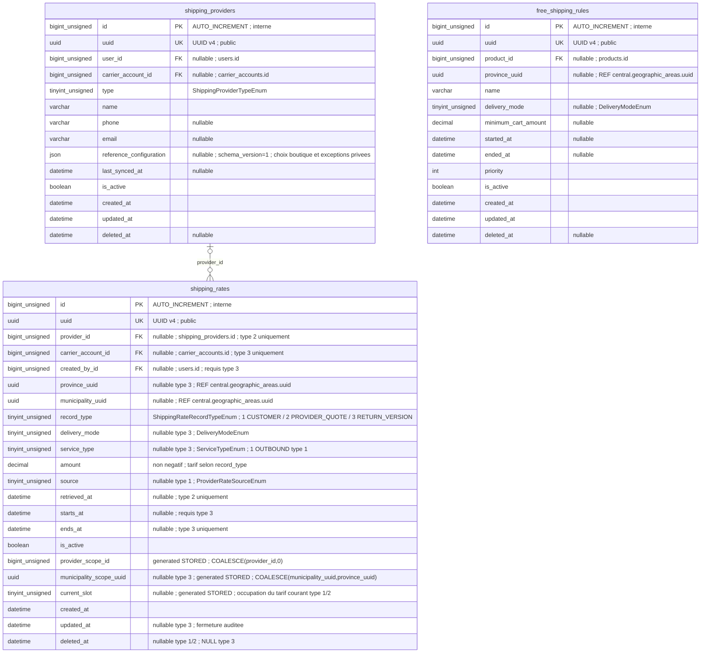
```mermaid
erDiagram
    direction TB
    shipping_providers {
        bigint_unsigned id PK "AUTO_INCREMENT ; interne"
        uuid uuid UK "UUID v4 ; public"
        bigint_unsigned user_id FK "nullable ; users.id"
        bigint_unsigned carrier_account_id FK "nullable ; carrier_accounts.id"
        tinyint_unsigned type "ShippingProviderTypeEnum"
        varchar name
        varchar phone "nullable"
        varchar email "nullable"
        json reference_configuration "nullable ; schema_version=1 ; choix boutique et exceptions privees"
        datetime last_synced_at "nullable"
        boolean is_active
        datetime created_at
        datetime updated_at
        datetime deleted_at "nullable"
    }
    shipping_rates {
        bigint_unsigned id PK "AUTO_INCREMENT ; interne"
        uuid uuid UK "UUID v4 ; public"
        bigint_unsigned provider_id FK "nullable ; shipping_providers.id ; type 2 uniquement"
        bigint_unsigned carrier_account_id FK "nullable ; carrier_accounts.id ; type 3 uniquement"
        bigint_unsigned created_by_id FK "nullable ; users.id ; requis type 3"
        uuid province_uuid "nullable type 3 ; REF central.geographic_areas.uuid"
        uuid municipality_uuid "nullable ; REF central.geographic_areas.uuid"
        tinyint_unsigned record_type "ShippingRateRecordTypeEnum ; 1 CUSTOMER / 2 PROVIDER_QUOTE / 3 RETURN_VERSION"
        tinyint_unsigned delivery_mode "nullable type 3 ; DeliveryModeEnum"
        tinyint_unsigned service_type "nullable type 3 ; ServiceTypeEnum ; 1 OUTBOUND type 1"
        decimal amount "non negatif ; tarif selon record_type"
        tinyint_unsigned source "nullable type 1 ; ProviderRateSourceEnum"
        datetime retrieved_at "nullable ; type 2 uniquement"
        datetime starts_at "nullable ; requis type 3"
        datetime ends_at "nullable ; type 3 uniquement"
        boolean is_active
        bigint_unsigned provider_scope_id "generated STORED ; COALESCE(provider_id,0)"
        uuid municipality_scope_uuid "nullable type 3 ; generated STORED ; COALESCE(municipality_uuid,province_uuid)"
        tinyint_unsigned current_slot "nullable ; generated STORED ; occupation du tarif courant type 1/2"
        datetime created_at
        datetime updated_at "nullable type 3 ; fermeture auditee"
        datetime deleted_at "nullable type 1/2 ; NULL type 3"
    }
    free_shipping_rules {
        bigint_unsigned id PK "AUTO_INCREMENT ; interne"
        uuid uuid UK "UUID v4 ; public"
        bigint_unsigned product_id FK "nullable ; products.id"
        uuid province_uuid "nullable ; REF central.geographic_areas.uuid"
        varchar name
        tinyint_unsigned delivery_mode "nullable ; DeliveryModeEnum"
        decimal minimum_cart_amount "nullable"
        datetime started_at "nullable"
        datetime ended_at "nullable"
        int priority
        boolean is_active
        datetime created_at
        datetime updated_at
        datetime deleted_at "nullable"
    }
    shipping_providers |o--o{ shipping_rates : provider_id
```

#### Explication très simple des champs

**`shipping_providers` :**

- **`id`** : le numéro unique qui permet de reconnaître cette ligne dans la base. Deux lignes différentes ne peuvent pas avoir le même `id`.
- **`uuid`** : identifiant public UUID v4 unique et indexé ; routes, API, formulaires et exports utilisent cet identifiant, sans exposer la PK numérique.
- **`type`** : code de `ShippingProviderTypeEnum` : `1 CARRIER`, `2 EMPLOYEE`, `3 OWNER`.
- **`name`** : le nom affiché à l’utilisateur. Exemple : « Nombre de boutiques » ou « Livraison EcoTrack ».
- **`user_id`** : l’identifiant du compte utilisateur. Il sert à relier cette ligne à la bonne information au lieu de recopier toutes ses données. Ce champ peut rester vide quand cette information n’est pas nécessaire ou pas encore connue.
- **`phone`** : le numéro de téléphone. Il est gardé comme texte pour ne pas perdre le `0`, le `+213` ou d’autres signes utiles. Ce champ peut rester vide quand cette information n’est pas nécessaire ou pas encore connue.
- **`email`** : l’adresse email du compte. Ce champ peut rester vide quand cette information n’est pas nécessaire ou pas encore connue.
- **`reference_configuration`** : Les choix de bureaux et exceptions de codes vérifiés de ce prestataire ; format limité expliqué ci-dessous.
- **`carrier_account_id`** : l’identifiant du compte transporteur. Il sert à relier cette ligne à la bonne information au lieu de recopier toutes ses données. Ce champ peut rester vide quand cette information n’est pas nécessaire ou pas encore connue.
- **`last_synced_at`** : la dernière fois où le SaaS a synchronisé ce compte avec le service externe. Ce champ peut rester vide quand cette information n’est pas nécessaire ou pas encore connue.
- **`is_active`** : indique si l’élément peut encore être utilisé. `true` = oui, `false` = non.
- **`created_at`** : la date où cette ligne a été créée dans la base.
- **`updated_at`** : la date de la dernière modification de cette ligne. Exemple : si tu modifies l’élément aujourd’hui, cette date devient celle d’aujourd’hui.
- **`deleted_at`** : la date où l’élément a été retiré sans effacer son ancienne ligne. Si ce champ est vide, l’élément n’est pas supprimé.

**`shipping_rates` :**

- **`id`** : Le numéro interne du tarif.
- **`uuid`** : Son identifiant public.
- **`provider_id`** : Le prestataire concerné par le devis.
- **`carrier_account_id`** : Le compte transporteur concerné par le tarif de retour.
- **`created_by_id`** : Le compte local qui a créé la version du tarif de retour.
- **`province_uuid`** : La wilaya concernée par le prix client ou le devis.
- **`municipality_uuid`** : La commune précise, si le tarif est plus détaillé que la wilaya.
- **`record_type`** : 1 : prix client ; 2 : coût prévu du prestataire ; 3 : version du prix d’un retour.
- **`delivery_mode`** : Le mode domicile ou stop desk du prix client ou du devis.
- **`service_type`** : Le service du devis ; le prix client concerne l’envoi aller.
- **`amount`** : Le montant de ce tarif ; ce n’est pas encore une charge ou un paiement.
- **`source`** : Indique si le devis ou le tarif de retour a été saisi ou obtenu par API.
- **`retrieved_at`** : La date où le devis a été obtenu.
- **`starts_at`** : Le début de la période du tarif de retour.
- **`ends_at`** : La fin éventuelle de cette période.
- **`is_active`** : Indique si ce tarif est utilisable selon son type.
- **`provider_scope_id`** : Une valeur calculée permettant l’unicité du prix client sans prestataire.
- **`municipality_scope_uuid`** : Une valeur calculée pour l’unicité du tarif général d’une wilaya sans commune.
- **`current_slot`** : Une valeur calculée empêchant deux tarifs courants pour la même combinaison.
- **`created_at`** : La date de création de la ligne.
- **`updated_at`** : La date du dernier changement autorisé, sans réécrire un ancien montant de retour.
- **`deleted_at`** : L’archivage d’un prix client ou devis ; les versions de retour restent conservées.

**`free_shipping_rules` :**

- **`id`** : le numéro unique qui permet de reconnaître cette ligne dans la base. Deux lignes différentes ne peuvent pas avoir le même `id`.
- **`uuid`** : identifiant public UUID v4 unique et indexé ; routes, API, formulaires et exports utilisent cet identifiant, sans exposer la PK numérique.
- **`name`** : le nom affiché à l’utilisateur. Exemple : « Nombre de boutiques » ou « Livraison EcoTrack ».
- **`product_id`** : l’identifiant du produit. Il sert à relier cette ligne à la bonne information au lieu de recopier toutes ses données. Ce champ peut rester vide quand cette information n’est pas nécessaire ou pas encore connue.
- **`province_uuid`** : l’identifiant de la wilaya. Il sert à relier cette ligne à la bonne information au lieu de recopier toutes ses données. Ce champ peut rester vide quand cette information n’est pas nécessaire ou pas encore connue.
- **`delivery_mode`** : la façon de livrer choisie. Exemple : domicile ou point relais. Ce champ peut rester vide quand cette information n’est pas nécessaire ou pas encore connue.
- **`minimum_cart_amount`** : la somme d’argent correspondant à **panier minimum**. Exemple : `1500` représente 1 500 DA au lancement. Ce champ peut rester vide quand cette information n’est pas nécessaire ou pas encore connue.
- **`started_at`** : la date et l’heure où la période ou l’action commence. Ce champ peut rester vide quand cette information n’est pas nécessaire ou pas encore connue.
- **`ended_at`** : la date et l’heure où elle s’est terminée. Peut rester vide tant que ce n’est pas terminé.
- **`priority`** : un nombre utilisé pour décider quel élément passe avant un autre. Exemple : priorité 1 avant priorité 2.
- **`is_active`** : indique si cette possibilité est autorisée. `true` = oui, `false` = non.
- **`created_at`** : la date où cette ligne a été créée dans la base.
- **`updated_at`** : la date de la dernière modification de cette ligne. Exemple : si tu modifies l’élément aujourd’hui, cette date devient celle d’aujourd’hui.
- **`deleted_at`** : la date où l’élément a été retiré sans effacer son ancienne ligne. Si ce champ est vide, l’élément n’est pas supprimé.


Les références vers un autre module sont indiquées sur les champs, même si leur flèche n’est pas redessinée ici.

- **`shipping_providers` :** type=1 CARRIER, 2 EMPLOYEE ou 3 OWNER. Pour CARRIER, carrier_account_id est obligatoire et vise carrier_accounts dans cette BDD ; UNIQUE(carrier_account_id) hors NULL. Pour EMPLOYEE/OWNER, carrier_account_id est NULL ; user_id, si renseigné, vise un compte local actif et autorisé. Aucun secret n’est recopié dans le prestataire : il reste dans son compte local T25. Après premier usage, le compte/prestataire d’un colis est immuable ; créer un nouveau prestataire pour un nouveau compte, désactiver l’ancien sans effacer l’historique.

- **`shipping_rates` type 1 CUSTOMER :** Pour une même wilaya, commune et mode de livraison, il ne peut exister qu’un seul tarif actif correspondant. Si un tarif précis existe pour la commune, il passe avant le tarif général de la wilaya. S’il n’existe aucun tarif applicable, cela signifie « livraison indisponible », pas « livraison gratuite ». Avant que le client soumette sa commande, le serveur vérifie les quantités et affiche le total complet.

- **`shipping_rates` type 2 PROVIDER_QUOTE :** Cette table sert de devis ou de cache local pour connaître le coût prévu d’une livraison, d’une seconde tentative ou d’un remplacement selon la zone et le mode. Le tarif de retour vient uniquement des lignes shipping_rates de type 3 RETURN_VERSION du bon compte, définies en T10 ; une ligne de devis type 2 ne remplace jamais cette version historique. Le montant ne peut pas être négatif et `source=1 MANUAL | 2 API` (`ProviderRateSourceEnum`). Pour une même combinaison prestataire + zone + mode + type de prestation, il n’existe qu’un seul tarif. Importer un montant depuis une API ne signifie pas automatiquement que le commerçant le doit : il faut encore savoir qui doit payer. Les vrais frais historiques sont figés dans `carrier_fees` et ne sont jamais recalculés plus tard à partir de ce cache. Pour un livreur interne, les frais de retour suivent un montant saisi et figé manuellement.

- **`free_shipping_rules` :** Une règle est appliquée seulement si tous ses critères renseignés sont vrais. Si elle est satisfaite, le prix de base de livraison de toute la commande devient gratuit pour le client ; une récupération manuelle de frais de retour est annoncée séparément selon T22, sans être appliquée automatiquement. Si `product_id` est rempli, cela veut dire que ce produit doit être présent dans la commande. On ne calcule pas un frais de livraison pour chaque ligne : la commande part dans un seul colis. « Gratuite pour le client » ne veut pas dire « gratuite pour le commerçant » : le prestataire peut toujours facturer son vrai coût.

**Types et formes :** ShippingRateRecordTypeEnum int : 1 CUSTOMER, 2 PROVIDER_QUOTE, 3 RETURN_VERSION. record_type est immuable et seuls ces codes sont admis. CustomerShippingRate/customer_shipping_rate, ProviderRate/provider_rate et CarrierRateVersion/carrier_rate_version partagent shipping_rates avec scopes, créations, routes, Policies et morphs stricts. Un alias ne résout jamais l’autre type. Prix client, estimation prestataire et version de retour restent trois fonctions distinctes. Un tarif n’est ni une dette, ni une charge, ni une preuve de paiement.

**Prix client type 1 :** province_uuid, delivery_mode, service_type=1 OUTBOUND, amount>=0 et is_active requis ; provider_id, carrier_account_id, created_by_id, source, retrieved_at, starts_at, ends_at NULL. municipality_uuid facultatif. Le tarif communal actif prime sur celui de la wilaya. Aucun tarif applicable signifie route indisponible, jamais livraison gratuite inventée. free_shipping_rules conserve ses critères et sa priorité, appliqués au colis entier sans effacer le coût du prestataire.

**Devis type 2 :** provider_id, province_uuid, delivery_mode, service_type, amount>=0, source=1 MANUAL ou 2 API et is_active requis ; carrier_account_id, created_by_id, starts_at, ends_at NULL. municipality_uuid et retrieved_at facultatifs selon la source. Le cache sert aux coûts estimés d’envoi, seconde tentative ou remplacement selon la prestation validée ; le retour du compte société vient uniquement du type 3. L’API ne détermine pas automatiquement qui paie. Les frais déjà reconnus restent figés dans carrier_fees.

**Version retour type 3 :** carrier_account_id, created_by_id, amount>=0, source=1 MANUAL ou 2 API, starts_at et is_active requis ; provider_id, province_uuid, municipality_uuid, delivery_mode, service_type, retrieved_at, deleted_at NULL. ends_at NULL ou >starts_at. UNIQUE(record_type,carrier_account_id,starts_at). Sous verrou du compte, les périodes [starts_at,ends_at) des seules versions type 3 ne se chevauchent pas. Pas de SoftDelete type 3 ; version utilisée conservée avec montant/source/début immuables. Nouveau contenu = nouvelle version ; fermeture future auditée. Les retours de livreurs internes restent saisis et figés dans le frais, sans compte API artificiel.

**Unicité courante :** provider_scope_id=COALESCE(provider_id,0) ; municipality_scope_uuid=COALESCE(municipality_uuid,province_uuid), GENERATED ALWAYS AS (...) STORED. current_slot=CASE WHEN record_type=1 AND is_active=1 AND deleted_at IS NULL THEN 1 WHEN record_type=2 AND deleted_at IS NULL THEN 1 ELSE NULL END, GENERATED ALWAYS AS (...) STORED. UNIQUE(record_type,provider_scope_id,province_uuid,municipality_scope_uuid,delivery_mode,service_type,current_slot) protège le prix client actif et le devis courant. Les champs de forme requis empêchent les NULL de contourner l’unicité. Références géographiques centrales validées au serveur, jamais FK SQL entre BDD.

**Application historique :** choisir uniquement type 3 du bon compte à l’acceptation du retour par le transporteur, sinon première observation fiable avec date_source=observation. Figer source_rate_id et rate_snapshot dans carrier_fees. source_rate_record_type=CASE WHEN source_rate_id IS NOT NULL THEN 3 ELSE NULL END, GENERATED ALWAYS AS (...) STORED. FK(source_rate_id,carrier_account_id,source_rate_record_type) → shipping_rates(id,carrier_account_id,record_type), plus FK simple source_rate_id. Le pointeur renseigné exige carrier_account_id renseigné et compte du prestataire du colis ; aucun devis ni prix client ne sert de version de retour. Sans version valable, bloquer la constatation automatique et signaler l’anomalie ; réception physique permise, aucun zéro inventé.

**Verrous et index :** tarifs courants sous verrou de shop ; périodes de retour sous verrou du compte. FK simples locales provider_id, carrier_account_id, created_by_id. UNIQUE(id,record_type), UNIQUE(id,carrier_account_id,record_type) une seule fois. Triggers/services valident les formes depuis les colonnes de base, sans NEW/OLD des générées STORED. Index de sélection (record_type,carrier_account_id,is_active,starts_at) et zone/mode/prestataire selon requêtes ; pas de doublon des index UNIQUE.

#### Références transporteur propres à la boutique

carrier_accounts.carrier_uuid vise logiquement central.shipping_carriers.uuid ; il ne crée aucune FK entre bases. L’adaptateur et api_url locaux conservent les paramètres réellement validés du compte, avec valeurs centrales par défaut et dérogation contrôlée. Les secrets restent chiffrés dans cette BDD. shipping_providers.carrier_code n’est plus recopié : le code vient du réseau du compte. UNIQUE(carrier_uuid,external_account_id) hors NULL empêche deux connexions locales involontaires au même compte ; partager un compte entre deux boutiques reste permis, avec filtrage strict par colis local. Le réseau d’un compte utilisé ne change pas silencieusement.

reference_configuration suit un format serveur fermé, schema_version=1, NULL pour un livreur interne/propriétaire :

| Élément JSON | Rôle et validation |
|---|---|
| schema_version | Version entière 1 du format ; aucun code exécutable |
| pickup_policy | ALL_VALIDATED ou ALLOWLIST ; valeur initiale explicite décidée lors de la configuration |
| disabled_pickup_point_uuids | Liste sans doublons de bureaux centraux masqués volontairement ; aucune synchronisation ne l’efface |
| enabled_pickup_point_uuids | Liste sans doublons autorisée en ALLOWLIST ; UUID du bon réseau uniquement |
| validated_reference_version | Version du catalogue vérifiée pour ce compte, sans supposer que tous les bureaux restent disponibles |
| mapping_overrides | Exceptions privées uniquement : geographic_area_uuid, zone_type, external_code, external_name, external_province_code, verification_source, verified_at, source_version ; common_mapping_uuid facultatif si une référence globale est corrigée pour ce compte |
| pickup_code_overrides | Codes de bureaux différents pour ce compte : pickup_point_uuid central, external_code, external_province_code, verification_source, verified_at, source_version ; une exception maximum par bureau du bon réseau |

Les listes sont bornées par les entrées vérifiées du réseau et la limite serveur documentée du payload ; aucun plafond arbitraire ne tronque une migration. Une exception de zone est unique par geographic_area_uuid/type ; zone/type/wilaya/pays contrôlés, pas de tableau complet duplicatif du référentiel public. Tout bureau proposé est actif côté central ET autorisé par la boutique ET utilisable par son vrai compte. Les exclusions manuelles survivent à la synchronisation ; un changement global ne les remet jamais à zéro. Les codes privé/public sont résolus sous contrôle avant préparation HTTP ; absence ou ambiguïté bloque la route. Une exception bureau change seulement le code du compte, jamais l’identité/adresse du bureau public ni son réseau. Le JSON garde seulement ces réglages/exceptions peu nombreux et n’abrite ni secret, tarif, commande, stock, bureau global entier ni historique d’action.

Le choix de bureau est conservé dans order_revisions.pickup_point_uuid avec pickup_point_snapshot (UUID, nom, adresse, réseau, zone, code externe et version effectivement validés). shipments.pickup_point_uuid reprend exactement la révision expédiée. carrier_operations.request_payload garde une enveloppe versionnée : payload fournisseur et reference_context filtré (UUID réseau/zone/bureau, versions et codes résolus, exception utilisée). L’adaptateur n’envoie au fournisseur que les clés de son payload ; reference_context ne lui est pas transmis. Une reprise rapproche l’intention déjà préparée et conserve ses données, sans recompiler silencieusement un nouveau code depuis un catalogue actualisé. La purge de diagnostic prévue ne supprime pas les snapshots/projections nécessaires à la preuve métier. L’indisponibilité du central bloque un nouveau choix non vérifiable ; elle ne réécrit pas un ancien envoi. Aucun tarif, secret ou acheteur n’est remonté au central pour remplir ces références.

### T11 — Transporteur et colis

**`shipments` — Le colis envoyé pour une commande et les informations permettant de le suivre. Exemple : une commande de trois produits part dans un seul colis avec un numéro de suivi.**

**`shipment_events` — Les étapes reçues pendant le transport, avec le message original du transporteur. Exemple : « en livraison », puis « livré » ou « refusé ».**

```mermaid
erDiagram
    direction TB
    shipments {
        bigint_unsigned id PK "AUTO_INCREMENT ; interne"
        uuid uuid UK "UUID v4 ; public"
        bigint_unsigned order_id FK "orders.id"
        bigint_unsigned shipped_revision_id FK "order_revisions.id"
        bigint_unsigned provider_id FK "shipping_providers.id"
        uuid pickup_point_uuid "nullable ; REF central.pickup_points.uuid"
        bigint_unsigned label_media_id FK "nullable ; media.id"
        bigint_unsigned assigned_by_id FK "users.id"
        tinyint_unsigned delivery_mode "DeliveryModeEnum"
        tinyint_unsigned status "ShipmentStatusEnum"
        varchar raw_external_status "nullable"
        varchar tracking "nullable"
        varchar merchant_reference "nullable avant preparation externe ; stable par colis"
        varchar external_reference "nullable"
        decimal cod_amount
        decimal estimated_cost
        decimal weight_kg "nullable"
        boolean is_fragile
        datetime shipped_at "nullable"
        datetime carrier_validated_at "nullable"
        datetime delivered_at "nullable"
        datetime last_synced_at "nullable"
        datetime created_at
        datetime updated_at
    }
    shipment_events {
        bigint_unsigned id PK "AUTO_INCREMENT ; interne"
        uuid uuid UK "UUID v4 ; public"
        bigint_unsigned shipment_id FK "shipments.id"
        bigint_unsigned actor_id FK "nullable ; users.id"
        tinyint_unsigned logistics_status "nullable ; ShipmentStatusEnum"
        tinyint_unsigned financial_status "nullable ; CollectionStatusEnum"
        varchar external_code "nullable"
        varchar event_type
        varchar raw_external_activity "nullable"
        varchar raw_external_status "nullable"
        varchar adapter_version
        json sanitized_external_payload "nullable"
        char(64) payload_hash
        datetime payload_expires_at "nullable"
        datetime payload_purged_at "nullable"
        text reason "nullable"
        text comment "nullable"
        varchar station "nullable"
        varchar courier_label "nullable"
        datetime next_delivery_attempt_at "nullable"
        datetime occurred_at "nullable"
        datetime observed_at
        tinyint_unsigned source "ShipmentEventSourceEnum"
        varchar deduplication_key
        datetime created_at
    }
    shipments ||--o{ shipment_events : shipment_id
```

#### Explication très simple des champs


**`shipments` :**

- **`id`** : le numéro unique qui permet de reconnaître cette ligne dans la base. Deux lignes différentes ne peuvent pas avoir le même `id`.
- **`uuid`** : identifiant public UUID v4 unique et indexé ; routes, API, formulaires et exports utilisent cet identifiant, sans exposer la PK numérique.
- **`order_id`** : l’identifiant de la commande. Il sert à relier cette ligne à la bonne information au lieu de recopier toutes ses données.
- **`shipped_revision_id`** : l’identifiant de la version réellement expédiée. Il sert à relier cette ligne à la bonne information au lieu de recopier toutes ses données.
- **`provider_id`** : l’identifiant du transporteur ou livreur. Il sert à relier cette ligne à la bonne information au lieu de recopier toutes ses données.
- **`pickup_point_uuid`** : L’UUID du bureau officiel dans la BDD centrale ; aucun lien SQL entre bases. Vide à domicile, obligatoire en stop desk.
- **`delivery_mode`** : la façon de livrer choisie. Exemple : domicile ou point relais.
- **`status`** : code entier de l’enum propre à cet objet, défini au §3.3 ; les libellés sont traduits à l’affichage et les transitions contrôlées par le service.
- **`raw_external_status`** : le statut exact reçu du transporteur avant de le traduire dans les statuts internes du SaaS. Ce champ peut rester vide quand cette information n’est pas nécessaire ou pas encore connue.
- **`tracking`** : le numéro de suivi du colis donné par le transporteur. Ce champ peut rester vide quand cette information n’est pas nécessaire ou pas encore connue.
- **`external_reference`** : le numéro donné par un système extérieur. Exemple : référence d’un reversement chez le transporteur. Ce champ peut rester vide quand cette information n’est pas nécessaire ou pas encore connue.
- **`cod_amount`** : la somme d’argent correspondant à **COD**. Exemple : `1500` représente 1 500 DA au lancement.
- **`estimated_cost`** : le coût correspondant à **estime**, utilisé pour connaître ce que cela coûte réellement au commerçant.
- **`weight_kg`** : le poids en kilogrammes. Ce champ peut rester vide quand cette information n’est pas nécessaire ou pas encore connue.
- **`is_fragile`** : indique si le produit ou la variante doit être traité comme fragile.
- **`label_media_id`** : l’identifiant lié à **etiquete media**. Il sert à retrouver l’élément correspondant. Ce champ peut rester vide quand cette information n’est pas nécessaire ou pas encore connue.
- **`assigned_by_id`** : l’identifiant de la personne qui a affecté. Il sert à relier cette ligne à la bonne information au lieu de recopier toutes ses données.
- **`shipped_at`** : la date et l’heure liées à **expediee**. Elle permet de savoir exactement quand cette étape a eu lieu. Ce champ peut rester vide quand cette information n’est pas nécessaire ou pas encore connue.
- **`carrier_validated_at`** : la date et l’heure liées à **validee transporteur**. Elle permet de savoir exactement quand cette étape a eu lieu. Ce champ peut rester vide quand cette information n’est pas nécessaire ou pas encore connue.
- **`delivered_at`** : la date et l’heure liées à **livree**. Elle permet de savoir exactement quand cette étape a eu lieu. Ce champ peut rester vide quand cette information n’est pas nécessaire ou pas encore connue.
- **`last_synced_at`** : la dernière fois où le SaaS a synchronisé ce compte avec le service externe. Ce champ peut rester vide quand cette information n’est pas nécessaire ou pas encore connue.
- **`created_at`** : la date où cette ligne a été créée dans la base.
- **`updated_at`** : la date de la dernière modification de cette ligne. Exemple : si tu modifies l’élément aujourd’hui, cette date devient celle d’aujourd’hui.

**`shipment_events` :**

- **`id`** : le numéro unique qui permet de reconnaître cette ligne dans la base. Deux lignes différentes ne peuvent pas avoir le même `id`.
- **`uuid`** : identifiant public UUID v4 unique et indexé ; routes, API, formulaires et exports utilisent cet identifiant, sans exposer la PK numérique.
- **`shipment_id`** : l’identifiant de la livraison. Il sert à relier cette ligne à la bonne information au lieu de recopier toutes ses données.
- **`logistics_status`** : code entier de l’enum propre à cet objet, défini au §3.3 ; les libellés sont traduits à l’affichage et les transitions contrôlées par le service.
- **`financial_status`** : code entier de l’enum propre à cet objet, défini au §3.3 ; les libellés sont traduits à l’affichage et les transitions contrôlées par le service.
- **`external_code`** : le code utilisé pour reconnaître **externe** de manière stable dans le programme ou chez un service externe. Ce champ peut rester vide quand cette information n’est pas nécessaire ou pas encore connue.
- **`event_type`** : le type d’événement enregistré. Exemple : vue produit, ajout au panier ou début de checkout.
- **`raw_external_activity`** : le texte ou code d’activité exact reçu du transporteur, conservé seulement si nécessaire pour comprendre son événement. Ce champ peut rester vide quand cette information n’est pas nécessaire ou pas encore connue.
- **`raw_external_status`** : le statut exact reçu du transporteur avant de le traduire dans les statuts internes du SaaS. Ce champ peut rester vide quand cette information n’est pas nécessaire ou pas encore connue.
- **`adapter_version`** : le numéro de version de adaptateur. Exemple : version 1, puis version 2 après une évolution ; l’ancienne version peut rester conservée pour comprendre l’historique.
- **`sanitized_external_payload`** : une copie nettoyée de la réponse externe, sans secrets inutiles. Ce champ peut rester vide quand cette information n’est pas nécessaire ou pas encore connue.
- **`payload_hash`** : une petite signature calculée à partir de payload. Elle permet de vérifier que le contenu n’a pas changé sans stocker une deuxième copie complète.
- **`payload_expires_at`** : la date et l’heure liées à **payload expire**. Elle permet de savoir exactement quand cette étape a eu lieu. Ce champ peut rester vide quand cette information n’est pas nécessaire ou pas encore connue.
- **`payload_purged_at`** : la date et l’heure liées à **payload purge**. Elle permet de savoir exactement quand cette étape a eu lieu. Ce champ peut rester vide quand cette information n’est pas nécessaire ou pas encore connue.
- **`reason`** : explique pourquoi l’action ou la décision a été faite. Ce champ peut rester vide quand cette information n’est pas nécessaire ou pas encore connue.
- **`comment`** : le texte écrit par le client ou l’utilisateur. Ce champ peut rester vide quand cette information n’est pas nécessaire ou pas encore connue.
- **`station`** : la station ou agence du transporteur concernée lorsqu’elle existe.
- **`courier_label`** : le nom ou libellé du livreur fourni par le transporteur lorsqu’il existe.
- **`next_delivery_attempt_at`** : la date et l’heure liées à **prochain passage**. Elle permet de savoir exactement quand cette étape a eu lieu. Ce champ peut rester vide quand cette information n’est pas nécessaire ou pas encore connue.
- **`occurred_at`** : la date et l’heure où l’événement s’est produit. Ce champ peut rester vide quand cette information n’est pas nécessaire ou pas encore connue.
- **`observed_at`** : la date où le SaaS a vu cet événement.
- **`source`** : indique d’où vient l’information. Exemple : saisie manuelle ou réponse de l’API.
- **`actor_id`** : l’identifiant de la personne qui a fait l’action. Il sert à relier cette ligne à la bonne information au lieu de recopier toutes ses données. Ce champ peut rester vide quand cette information n’est pas nécessaire ou pas encore connue.
- **`deduplication_key`** : une clé utilisée pour repérer deux messages ou événements qui représentent en réalité la même action.
- **`created_at`** : la date où cette ligne a été créée dans la base.


Les références vers un autre module sont indiquées sur les champs, même si leur flèche n’est pas redessinée ici.


- **`shipments` :** Une commande ne peut avoir qu’une seule livraison dans ce MVP, et un tracking donné ne peut apparaître qu’une seule fois pour le même prestataire. La livraison doit pointer vers la bonne commande et exactement vers la révision expédiée. Tous les articles de cette révision partent ensemble dans le même colis. Le mode et le point relais doivent être identiques à ceux enregistrés dans la révision : `domicile` sans point relais, ou `stop_desk` avec exactement le point relais choisi. Avant la remise physique, une modification reste possible seulement après avoir vérifié qu’aucune opération distante n’est en cours ou incertaine. Dès que le transporteur a validé le colis ou que le colis est réellement expédié, la révision, son contenu et le montant COD ne changent plus. Une validation API signifie seulement que le transporteur a accepté l’ordre : elle ne prouve pas encore que le colis lui a été remis et elle ne sort donc pas le stock. Le COD utilisé est exactement `order_revisions.amount_to_collect` de la révision expédiée, même s’il vaut 0 ; on ne le recalcule jamais depuis une facture ou un tarif plus récent. Pour une société de livraison, merchant_reference est persistée dans ce colis local avant l’appel ; UNIQUE(provider_id,merchant_reference) et UNIQUE(provider_id,tracking) hors NULL assurent le rattachement local décrit en T25. Aucun registre central n’est nécessaire. Les vrais frais restent dans `carrier_fees`. Le fait logistique livré est accepté depuis la déclaration du livreur ou le statut interprété du transporteur. delivered_at garde la date déclarée, avec sa source et son historique dans shipment_events. Aucun accusé, signature, photo ou PDF de réception du client n’est exigé ni conservé. Une étiquette reste un fichier de transport ; cette confiance logistique ne prouve aucun encaissement ni reversement d’argent. Lorsqu’un retour existe, la révision expédiée ne peut plus être remplacée par une autre. Après une création réussie chez le transporteur, le prestataire et son compte ne peuvent plus être changés au MVP. Une opération en cours ou au résultat incertain bloque aussi ce changement.

- **`shipment_events` :** `deduplication_key` empêche d’enregistrer deux fois le même événement pour le même compte/prestataire et le même tracking. Ce journal est `append-only` : on ajoute les faits reçus sans réécrire les anciens. Seule une partie de diagnostic devenue inutile peut être purgée selon ses dates techniques locales décrites au §12. On garde l’empreinte et la version de l’adaptateur qui a interprété l’événement. `source` utilise `ShipmentEventSourceEnum` : `MANUAL`, `POLLING` ou `WEBHOOK`. Si le transporteur envoie un événement inconnu, on le conserve pour diagnostic au lieu de lui inventer un sens. Un vieil événement reçu en retard ne doit pas écraser automatiquement un état plus récent.

### T12 — Intégration Ecotrack

**`carrier_operations` — Les demandes à envoyer au transporteur, conservées pour pouvoir les suivre et les reprendre. Exemple : demander la création d’un colis sans créer un deuxième colis si la réponse est incertaine.**

**`carrier_operation_attempts` — Le résultat de chaque essai de communication avec le transporteur. Exemple : le premier essai échoue ; une nouvelle tentative est enregistrée séparément sans effacer la précédente.**

```mermaid
erDiagram
    direction TB
    carrier_operations {
        bigint_unsigned id PK "AUTO_INCREMENT ; interne"
        uuid uuid UK "UUID v4 ; public"
        bigint_unsigned provider_id FK "shipping_providers.id"
        bigint_unsigned shipment_id FK "nullable ; shipments.id"
        bigint_unsigned order_id FK "nullable ; orders.id"
        bigint_unsigned return_id FK "nullable ; order_returns.id"
        bigint_unsigned revision_id FK "nullable ; order_revisions.id"
        bigint_unsigned superseded_by_operation_id FK "nullable ; carrier_operations.id"
        bigint_unsigned triggered_by_id FK "nullable ; users.id"
        tinyint_unsigned type "CarrierOperationTypeEnum"
        varchar operation_key
        json sanitized_request "metadonnees techniques uniquement"
        text encrypted_personal_request "nullable after purge ou sans donnees personnelles"
        char(64) request_hash
        datetime request_expires_at "nullable si aucun payload personnel"
        datetime request_purged_at "nullable"
        varchar merchant_reference "nullable hors colis"
        varchar adapter_version
        json technical_result "nullable ; sans donnees personnelles"
        tinyint_unsigned status "CarrierOperationStatusEnum"
        int attempts_count
        datetime next_attempt_at "nullable"
        datetime ended_at "nullable"
        datetime sending_started_at "nullable"
        datetime superseded_at "nullable"
        datetime created_at
        datetime updated_at
    }
    carrier_operation_attempts {
        bigint_unsigned id PK "AUTO_INCREMENT ; interne"
        uuid uuid UK "UUID v4 ; public"
        bigint_unsigned operation_id FK "carrier_operations.id"
        int attempt_number
        int http_status_code "nullable"
        json sanitized_response "nullable"
        datetime payload_expires_at "nullable"
        datetime payload_purged_at "nullable"
        varchar error_code "nullable"
        int duration_ms
        datetime started_at
        datetime ended_at "nullable"
        datetime created_at
    }
    carrier_operations ||--o{ carrier_operation_attempts : operation_id
```

#### Explication très simple des champs

**`carrier_operations` :**

- **`id`** : le numéro unique qui permet de reconnaître cette ligne dans la base. Deux lignes différentes ne peuvent pas avoir le même `id`.
- **`uuid`** : identifiant public UUID v4 unique et indexé ; routes, API, formulaires et exports utilisent cet identifiant, sans exposer la PK numérique.
- **`provider_id`** : l’identifiant du transporteur ou livreur. Il sert à relier cette ligne à la bonne information au lieu de recopier toutes ses données.
- **`shipment_id`** : l’identifiant de la livraison. Il sert à relier cette ligne à la bonne information au lieu de recopier toutes ses données. Ce champ peut rester vide quand cette information n’est pas nécessaire ou pas encore connue.
- **`order_id`** : l’identifiant de la commande. Il sert à relier cette ligne à la bonne information au lieu de recopier toutes ses données. Ce champ peut rester vide quand cette information n’est pas nécessaire ou pas encore connue.
- **`return_id`** : l’identifiant du retour. Il sert à relier cette ligne à la bonne information au lieu de recopier toutes ses données. Ce champ peut rester vide quand cette information n’est pas nécessaire ou pas encore connue.
- **`type`** : code de `CarrierOperationTypeEnum` indiquant l’opération technique demandée au transporteur : création, mise à jour, annulation, retour, synchronisation, rapprochement, étiquette, etc.
- **`revision_id`** : l’identifiant de la version de la commande. Il sert à relier cette ligne à la bonne information au lieu de recopier toutes ses données. Ce champ peut rester vide quand cette information n’est pas nécessaire ou pas encore connue.
- **`operation_key`** : une clé unique utilisée pour reconnaître une opération déjà faite. Exemple : si le serveur reçoit deux fois la même demande après une coupure, cette clé aide à éviter de faire l’opération deux fois.
- **`sanitized_request`** : une copie de la demande envoyée à l’API après retrait des mots de passe, clés et données inutiles.
- **`encrypted_personal_request`** : les données personnelles nécessaires à l’appel transporteur, enregistrées sous forme chiffrée seulement tant qu’elles sont encore utiles. Elles peuvent ensuite être supprimées. Ce champ peut rester vide quand cette information n’est pas nécessaire ou pas encore connue.
- **`request_hash`** : une petite signature calculée à partir de requete. Elle permet de vérifier que le contenu n’a pas changé sans stocker une deuxième copie complète.
- **`request_expires_at`** : la date et l’heure liées à **requete expire**. Elle permet de savoir exactement quand cette étape a eu lieu. Ce champ peut rester vide quand cette information n’est pas nécessaire ou pas encore connue.
- **`request_purged_at`** : la date et l’heure liées à **requete purge**. Elle permet de savoir exactement quand cette étape a eu lieu. Ce champ peut rester vide quand cette information n’est pas nécessaire ou pas encore connue.
- **`merchant_reference`** : un numéro stable créé côté marchand/SaaS pour reconnaître le colis chez le transporteur. Ce champ peut rester vide quand cette information n’est pas nécessaire ou pas encore connue.
- **`adapter_version`** : le numéro de version de adaptateur. Exemple : version 1, puis version 2 après une évolution ; l’ancienne version peut rester conservée pour comprendre l’historique.
- **`technical_result`** : indique si l’appel technique a réussi, échoué ou reste incertain. Ce champ peut rester vide quand cette information n’est pas nécessaire ou pas encore connue.
- **`status`** : code entier de l’enum propre à cet objet, défini au §3.3 ; les libellés sont traduits à l’affichage et les transitions contrôlées par le service.
- **`attempts_count`** : le nombre de **tentatives**. Exemple : `3` signifie qu’il y en a trois.
- **`next_attempt_at`** : la date prévue pour retenter l’opération après un échec récupérable. Ce champ peut rester vide quand cette information n’est pas nécessaire ou pas encore connue.
- **`ended_at`** : la date et l’heure où cette attribution ou règle a pris fin. Ce champ peut rester vide quand cette information n’est pas nécessaire ou pas encore connue.
- **`sending_started_at`** : la date et l’heure liées à **envoi commence**. Elle permet de savoir exactement quand cette étape a eu lieu. Ce champ peut rester vide quand cette information n’est pas nécessaire ou pas encore connue.
- **`superseded_at`** : la date et l’heure liées à **supersedee**. Elle permet de savoir exactement quand cette étape a eu lieu. Ce champ peut rester vide quand cette information n’est pas nécessaire ou pas encore connue.
- **`superseded_by_operation_id`** : l’identifiant de l’opération plus récente qui remplace celle-ci. Il sert à relier cette ligne à la bonne information au lieu de recopier toutes ses données. Ce champ peut rester vide quand cette information n’est pas nécessaire ou pas encore connue.
- **`triggered_by_id`** : l’identifiant de la personne ou action qui a déclenché. Il sert à relier cette ligne à la bonne information au lieu de recopier toutes ses données. Ce champ peut rester vide quand cette information n’est pas nécessaire ou pas encore connue.
- **`created_at`** : la date où cette ligne a été créée dans la base.
- **`updated_at`** : la date de la dernière modification de cette ligne. Exemple : si tu modifies l’élément aujourd’hui, cette date devient celle d’aujourd’hui.

**`carrier_operation_attempts` :**

- **`id`** : le numéro unique qui permet de reconnaître cette ligne dans la base. Deux lignes différentes ne peuvent pas avoir le même `id`.
- **`uuid`** : identifiant public UUID v4 unique et indexé ; routes, API, formulaires et exports utilisent cet identifiant, sans exposer la PK numérique.
- **`operation_id`** : l’identifiant de l’opération. Il sert à relier cette ligne à la bonne information au lieu de recopier toutes ses données.
- **`attempt_number`** : le numéro de l’essai. Exemple : 1 pour le premier essai, 2 après un nouvel essai.
- **`http_status_code`** : le code renvoyé par l’API. Exemple : 200, 400 ou 500. Ce champ peut rester vide quand cette information n’est pas nécessaire ou pas encore connue.
- **`sanitized_response`** : une copie nettoyée de la réponse reçue de l’API. Ce champ peut rester vide quand cette information n’est pas nécessaire ou pas encore connue.
- **`payload_expires_at`** : la date et l’heure liées à **payload expire**. Elle permet de savoir exactement quand cette étape a eu lieu. Ce champ peut rester vide quand cette information n’est pas nécessaire ou pas encore connue.
- **`payload_purged_at`** : la date et l’heure liées à **payload purge**. Elle permet de savoir exactement quand cette étape a eu lieu. Ce champ peut rester vide quand cette information n’est pas nécessaire ou pas encore connue.
- **`error_code`** : un petit code qui permet de reconnaître le type d’erreur sans stocker un long message sensible. Ce champ peut rester vide quand cette information n’est pas nécessaire ou pas encore connue.
- **`duration_ms`** : le temps pris par l’appel, en millisecondes.
- **`started_at`** : la date et l’heure où la période ou l’action commence.
- **`ended_at`** : la date et l’heure où elle s’est terminée. Peut rester vide tant que ce n’est pas terminé.
- **`created_at`** : la date où cette ligne a été créée dans la base.


Les références vers un autre module sont indiquées sur les champs, même si leur flèche n’est pas redessinée ici.

- **`carrier_operations` :** `operation_key` est unique pour qu’un retry ne crée pas deux opérations. Les types couvrent la création, validation, modification, suivi, frais, géographie, étiquette, demande/validation de retour et note. Les statuts utilisent exactement `CarrierOperationStatusEnum` : `1 PENDING`, `2 RUNNING`, `3 SUCCEEDED`, `4 RETRYABLE_FAILURE`, `5 PERMANENT_FAILURE`, `6 UNCERTAIN`, `7 SUPERSEDED`, `8 CANCELLED`. Une opération qui touche un colis doit pointer vers la bonne livraison, la bonne commande et la bonne révision ; seules les opérations générales comme `fees` ou `geographie` peuvent exister sans commande. Avant tout envoi mutateur de création, validation ou modification, vérifier sous le protocole commun que la révision visée est la `confirmed_revision_id` validée par clic et possède les réservations actives nécessaires ; une simple proposition `current_revision_id` ne l’autorise jamais. Une modification avant figement distant exige aussi que cette révision soit encore la proposition courante. Une intention qui vise une version remplacée par une nouvelle version validée devient `7 SUPERSEDED` et n’est pas envoyée ; une proposition non validée ne remplace pas silencieusement l’ancienne version acceptée. Recontrôler le contrôle opérationnel et l’absence d’indisponibilité avant HTTP. Après remise, le suivi, les retours et les étiquettes utilisent toujours la révision réellement expédiée. Juste avant l’appel HTTP, on enregistre `sending_started_at`. À partir de ce moment, on bloque les modifications de commande jusqu’à avoir un résultat certain ou avoir fait un rapprochement. Si on ne sait pas si l’appel a été exécuté chez le transporteur — timeout, coupure réseau, 502/503/504 après effet possible, réponse incompréhensible ou crash au mauvais moment — on met `6 UNCERTAIN`. On ne renvoie surtout pas aveuglément la création, sinon on pourrait créer deux colis. Les retries automatiques des opérations qui modifient l’extérieur restent désactivés tant qu’on n’a pas prouvé qu’ils sont sûrs. Si une nouvelle opération remplace l’ancienne, `superseded_by_operation_id` peut pointer vers elle. On garde durablement l’intention et le résultat, mais l’appel HTTP lui-même ne doit pas garder une longue transaction SQL ouverte. L’empreinte SHA-256 de la requête initiale permet de vérifier qu’une même `operation_key` n’est pas réutilisée avec un autre contenu. `merchant_reference` reste stable et correspond à shipments.merchant_reference du colis local. Les coordonnées personnelles éventuellement nécessaires à une reprise sont stockées chiffrées dans `encrypted_personal_request`, jamais en JSON clair. Après `request_expires_at`, ce payload est effacé par le traitement d’expiration propre à cette intégration et `request_purged_at` garde la date de purge, tandis que les identifiants techniques minimaux restent. Une opération restée incertaine ne devient pas certaine simplement parce que le payload a été supprimé ; on ne reconstruit pas les données depuis une commande actuelle pour renvoyer l’appel.

- **`carrier_operation_attempts` :** Pour une même opération, chaque `attempt_number` est unique. On garde seulement les réponses et erreurs utiles, après avoir retiré secrets et données personnelles inutiles. Les gros payloads de diagnostic ont une durée de vie courte définie par C8. Les corps HTTP bruts ne sont pas conservés par défaut. Quand l’opération est terminée, les faits et le résultat restent `append-only`; seule la partie de diagnostic autorisée peut être purgée, et `payload_purged_at` indique quand cette purge a eu lieu.

### T13 — Argent et reversements

**`collections` — Le suivi de l’argent lié à un colis : ce qui doit être encaissé et reversé. Exemple : le client a payé le livreur, mais le commerçant attend encore son argent.**

**`remittance_statements` — Les documents de suivi d’un règlement avec le livreur ou le transporteur pour cette boutique. Exemple : expliquer le montant reçu en distinguant ventes, frais et indemnisations.**

**`carrier_settlement_lines` — Le détail des règlements : produits reversés, frais réglés, créances apurées ou indemnités. Chaque ligne indique clairement laquelle de ces quatre actions elle représente.**

```mermaid
erDiagram
    direction TB
    collections {
        bigint_unsigned id PK "AUTO_INCREMENT ; interne"
        uuid uuid UK "UUID v4 ; public"
        bigint_unsigned shipment_id FK "shipments.id"
        tinyint_unsigned declared_status "CollectionStatusEnum"
        decimal expected_amount
        decimal declared_collected_amount "nullable"
        datetime collected_at "nullable"
        datetime payment_ready_at "nullable"
        datetime declared_paid_at "nullable"
        varchar source
        datetime reconciled_at "nullable"
        datetime created_at
        datetime updated_at
    }
    remittance_statements {
        bigint_unsigned id PK "AUTO_INCREMENT ; interne"
        uuid uuid UK "UUID v4 ; public"
        bigint_unsigned provider_id FK "shipping_providers.id"
        bigint_unsigned carrier_remittance_batch_id FK "nullable ; carrier_remittance_batches.id"
        bigint_unsigned validated_by_id FK "nullable ; users.id"
        bigint_unsigned proof_media_id FK "nullable ; media.id"
        bigint_unsigned reversal_of_id FK "nullable ; remittance_statements.id"
        varchar number
        varchar external_reference "nullable"
        tinyint_unsigned type "StatementTypeEnum"
        tinyint_unsigned status "RemittanceStatementStatusEnum"
        decimal gross_amount
        decimal fee_amount
        decimal expected_net_amount
        decimal received_net_amount "nullable"
        datetime declared_at "nullable"
        datetime received_at "nullable"
        text note "nullable"
        varchar operation_key
        datetime reconciled_at "nullable"
        datetime created_at
        datetime updated_at
    }
    carrier_settlement_lines {
        bigint_unsigned id PK "AUTO_INCREMENT ; interne"
        uuid uuid UK "UUID v4 ; public"
        bigint_unsigned provider_id FK "shipping_providers.id ; meme prestataire pour tous les parents"
        bigint_unsigned remittance_statement_id FK "nullable type 3 ; remittance_statements.id"
        bigint_unsigned collection_id FK "nullable ; collections.id ; requis type 1"
        bigint_unsigned carrier_fee_id FK "nullable ; carrier_fees.id ; requis type 2 ou FEE_OFFSET"
        bigint_unsigned receivable_id FK "nullable ; carrier_receivables.id ; requis type 3"
        bigint_unsigned shipment_id FK "nullable type 3 sans frais cible ; shipments.id"
        bigint_unsigned replacement_order_id FK "nullable type 4 ; orders.id"
        bigint_unsigned proof_media_id FK "nullable types 3/4 ; media.id ; prive"
        bigint_unsigned reversal_of_id FK "nullable ; carrier_settlement_lines.id ; meme type et parents"
        bigint_unsigned correction_of_id FK "nullable ; carrier_settlement_lines.id ; meme type et parents"
        tinyint_unsigned record_type "CarrierSettlementLineTypeEnum ; 1 PRODUCT_REMITTANCE / 2 FEE_PAYMENT / 3 RECEIVABLE_SETTLEMENT / 4 COMPENSATION"
        decimal amount "signe ; positif ordinaire, inverse exact negatif"
        tinyint_unsigned fee_payment_mode "nullable hors type 2 ; FeeSettlementModeEnum ; 2/3"
        tinyint_unsigned receivable_settlement_type "nullable hors type 3 ; ReceivableSettlementTypeEnum"
        varchar reason "nullable hors type 4 ; requis type 4"
        varchar external_reference "nullable hors type 3/4 ; reference qualifiee"
        varchar operation_key UK "cle stable par nature et occurrence"
        datetime performed_at "nullable hors type 3 ; requis type 3"
        datetime created_at
    }
    remittance_statements ||--o{ carrier_settlement_lines : remittance_statement_id
    collections ||--o{ carrier_settlement_lines : collection_id
```

#### Explication très simple des champs

**`collections` :**

- **`id`** : le numéro unique qui permet de reconnaître cette ligne dans la base. Deux lignes différentes ne peuvent pas avoir le même `id`.
- **`uuid`** : identifiant public UUID v4 unique et indexé ; routes, API, formulaires et exports utilisent cet identifiant, sans exposer la PK numérique.
- **`shipment_id`** : l’identifiant de la livraison. Il sert à relier cette ligne à la bonne information au lieu de recopier toutes ses données.
- **`declared_status`** : code entier de l’enum propre à cet objet, défini au §3.3 ; les libellés sont traduits à l’affichage et les transitions contrôlées par le service.
- **`expected_amount`** : le montant que l’on pense devoir recevoir selon les ventes et frais connus.
- **`declared_collected_amount`** : le montant déclaré comme encaissé avant ou pendant la vérification. Ce champ peut rester vide quand cette information n’est pas nécessaire ou pas encore connue.
- **`collected_at`** : la date où l’argent a réellement été encaissé auprès du client. Ce champ peut rester vide quand cette information n’est pas nécessaire ou pas encore connue.
- **`payment_ready_at`** : la date et l’heure liées à **paiement pret**. Elle permet de savoir exactement quand cette étape a eu lieu. Ce champ peut rester vide quand cette information n’est pas nécessaire ou pas encore connue.
- **`declared_paid_at`** : la date et l’heure liées à **paye declare**. Elle permet de savoir exactement quand cette étape a eu lieu. Ce champ peut rester vide quand cette information n’est pas nécessaire ou pas encore connue.
- **`source`** : indique d’où vient l’information. Exemple : saisie manuelle ou réponse de l’API.
- **`reconciled_at`** : la date où le montant reçu a été comparé et rapproché avec ce qui était attendu. Ce champ peut rester vide quand cette information n’est pas nécessaire ou pas encore connue.
- **`created_at`** : la date où cette ligne a été créée dans la base.
- **`updated_at`** : la date de la dernière modification de cette ligne. Exemple : si tu modifies l’élément aujourd’hui, cette date devient celle d’aujourd’hui.

**`remittance_statements` :**

- **`id`** : le numéro unique qui permet de reconnaître cette ligne dans la base. Deux lignes différentes ne peuvent pas avoir le même `id`.
- **`uuid`** : identifiant public UUID v4 unique et indexé ; routes, API, formulaires et exports utilisent cet identifiant, sans exposer la PK numérique.
- **`provider_id`** : l’identifiant du transporteur ou livreur. Il sert à relier cette ligne à la bonne information au lieu de recopier toutes ses données.
- **`number`** : le numéro lisible de l’élément. Exemple : numéro d’échéance ou de facture selon la table.
- **`external_reference`** : le numéro donné par un système extérieur. Exemple : référence d’un reversement chez le transporteur. Ce champ peut rester vide quand cette information n’est pas nécessaire ou pas encore connue.
- **`type`** : code de `StatementTypeEnum` décrivant la nature du bordereau financier.
- **`status`** : code entier de l’enum propre à cet objet, défini au §3.3 ; les libellés sont traduits à l’affichage et les transitions contrôlées par le service.
- **`gross_amount`** : la somme d’argent correspondant à **brut**. Exemple : `1500` représente 1 500 DA au lancement.
- **`fee_amount`** : la somme d’argent correspondant à **frais**. Exemple : `1500` représente 1 500 DA au lancement.
- **`expected_net_amount`** : la somme d’argent correspondant à **net attendu**. Exemple : `1500` représente 1 500 DA au lancement.
- **`received_net_amount`** : le montant net réellement reçu. Ce champ peut rester vide quand cette information n’est pas nécessaire ou pas encore connue.
- **`declared_at`** : la date et l’heure liées à **declare**. Elle permet de savoir exactement quand cette étape a eu lieu. Ce champ peut rester vide quand cette information n’est pas nécessaire ou pas encore connue.
- **`received_at`** : la date et l’heure liées à **recu**. Elle permet de savoir exactement quand cette étape a eu lieu. Ce champ peut rester vide quand cette information n’est pas nécessaire ou pas encore connue.
- **`validated_by_id`** : l’identifiant de la personne qui a validé. Il sert à relier cette ligne à la bonne information au lieu de recopier toutes ses données. Ce champ peut rester vide quand cette information n’est pas nécessaire ou pas encore connue.
- **`proof_media_id`** : l’identifiant lié à **preuve media**. Il sert à retrouver l’élément correspondant. Ce champ peut rester vide quand cette information n’est pas nécessaire ou pas encore connue.
- **`note`** : une information libre ajoutée pour aider à comprendre la ligne. Selon la table, cela peut être une note interne ou une note chiffrée. Ce champ peut rester vide quand cette information n’est pas nécessaire ou pas encore connue.
- **`operation_key`** : une clé unique utilisée pour reconnaître une opération déjà faite. Exemple : si le serveur reçoit deux fois la même demande après une coupure, cette clé aide à éviter de faire l’opération deux fois.
- **`reversal_of_id`** : l’identifiant de l’ancienne écriture annulée par une écriture inverse. Il sert à relier cette ligne à la bonne information au lieu de recopier toutes ses données. Ce champ peut rester vide quand cette information n’est pas nécessaire ou pas encore connue.
- **`reconciled_at`** : la date où le montant reçu a été comparé et rapproché avec ce qui était attendu. Ce champ peut rester vide quand cette information n’est pas nécessaire ou pas encore connue.
- **`created_at`** : la date où cette ligne a été créée dans la base.
- **`updated_at`** : la date de la dernière modification de cette ligne. Exemple : si tu modifies l’élément aujourd’hui, cette date devient celle d’aujourd’hui.

**`carrier_settlement_lines` :**

- **`id`** : Le numéro interne de cette ligne de règlement.
- **`uuid`** : Son identifiant public.
- **`provider_id`** : Le prestataire auquel appartiennent cette ligne et ses autres liens.
- **`remittance_statement_id`** : Le bordereau réel qui explique ce règlement, lorsqu’il existe.
- **`collection_id`** : Le recouvrement du colis dont une part est reversée.
- **`carrier_fee_id`** : Le frais payé ou le futur frais sur lequel une créance est compensée.
- **`receivable_id`** : La créance remboursée ou compensée.
- **`shipment_id`** : Le colis concerné ; obligatoire pour produits reversés, frais payés et indemnité.
- **`replacement_order_id`** : La commande de remplacement éventuellement liée à l’indemnité.
- **`proof_media_id`** : Le justificatif privé propre à un apurement ou une indemnité ; les autres types utilisent le bordereau et ses preuves.
- **`reversal_of_id`** : La ligne inversée exactement, sans inventer un transfert d’argent.
- **`correction_of_id`** : L’ancienne ligne à laquelle une nouvelle écriture correcte se rattache.
- **`record_type`** : 1 : reversement produits ; 2 : paiement de frais ; 3 : règlement d’une créance ; 4 : indemnité de sinistre.
- **`amount`** : Le montant de cette opération ; chaque type garde son rôle dans les calculs.
- **`fee_payment_mode`** : Pour les frais : paiement séparé ou compensation sur un reversement.
- **`receivable_settlement_type`** : Pour une créance : remboursement bancaire, compensation de frais/bordereau ou autre règlement validé.
- **`reason`** : La raison de l’indemnité, par exemple un colis perdu.
- **`external_reference`** : La référence de l’apurement ou de l’indemnité, utile contre les doublons.
- **`operation_key`** : Une clé stable empêchant le même fait d’être enregistré deux fois.
- **`performed_at`** : Quand la créance a réellement été réglée ou compensée.
- **`created_at`** : La date de création de cette ligne.

Les références vers un autre module sont indiquées sur les champs, même si leur flèche n’est pas redessinée ici.

- **`collections` :** Une livraison ne peut avoir qu’un seul recouvrement. `expected_amount` est le COD figé de cette livraison. `declared_collected_amount` est seulement ce que le transporteur dit avoir encaissé ; ce n’est pas encore une preuve que l’argent a réellement été vérifié. Le montant réellement reconnu comme encaissé se calcule à partir des `collection_entries` validées, au lieu de maintenir un deuxième compteur modifiable à la main. Les statuts décrivent les étapes : attente de livraison, livré mais non encaissé, encaissé mais pas encore reversé, paiements prêts, payé/archivé ou sans encaissement. Une date ou un statut venant du transporteur ne prouve jamais à lui seul que le commerçant a reçu l’argent.


- **`remittance_statements` :** UNIQUE(provider_id,number), UNIQUE(operation_key), UNIQUE(reversal_of_id) hors NULL. carrier_remittance_batch_id vise le lot local T25, ou NULL pour un règlement interne sans lot fournisseur. Même compte que celui du prestataire contrôlé sous verrou. type=1 REMITTANCE, 2 NET_SETTLEMENT, 3 FEES_PAYMENT, 4 COMPENSATION ou 5 CORRECTION ; status=1 DRAFT, 2 DECLARED, 3 RECEIVED, 4 RECONCILED, 5 CANCELLED ou 6 REVERSED. Au rapprochement initial, gross_amount additionne les produits reversés type 1, indemnités effectives type 4 et seuls remboursements de créances type 3 réellement encaissés et justifiés sur ce bordereau. Les crédits non cash sont exclus. fee_amount additionne les règlements monétaires type 2, nets des crédits affectés, puis expected_net_amount=gross_amount-fee_amount. Les trois montants figent le rapprochement historique ; une correction ultérieure des allocations ne recalcule pas ce cash déjà prouvé. received_net_amount est la part réelle de cette boutique, jamais le total d’un compte partagé. Rapprochement uniquement sur preuve et égalité des lignes/net local ; sous verrou du lot, les bordereaux rapprochés nets ne dépassent pas sa part vérifiée. Le lot lui-même n’est pas une seconde recette. Après rapprochement, montants et lignes immuables, correction par inverse exact du même prestataire/lot ; les brouillons annulés ne comptent pas.

- **`carrier_settlement_lines` type 1 PRODUCT_REMITTANCE :** `operation_key` évite les doublons. Une contrepassation ou une correction doit toujours rester sur le même `collection_id` que la ligne d’origine ; elle ne peut pas corriger le colis d’une autre livraison. Plusieurs versements partiels sont autorisés, chacun avec sa propre ligne. Un montant normal est positif ; une contrepassation est exactement le même montant en négatif. `correction_of_id` permet de relier la nouvelle écriture correcte à l’ancienne. Le prestataire doit être le même que celui du recouvrement et de la livraison. La somme nette des lignes présentes dans des bordereaux rapprochés doit rester entre 0 et le montant réellement reversable pour le colis. Une ligne de reversement sert seulement à rendre l’argent du colis : elle ne règle pas un frais transporteur, car les frais ont leurs propres allocations dans `carrier_fees`.

**Formes et plafonds locaux :** record_type est NOT NULL et IN (1,2,3,4). Les parents requis de chaque forme ci-dessous sont explicitement NOT NULL ; les parents interdits sont NULL, avec modes exclusifs. CHECK((reversal_of_id IS NULL AND amount>0) OR (reversal_of_id IS NOT NULL AND amount<0)) impose le signe ; l’inverse exact, le contexte et la validité du fait sont vérifiés sous verrou/trigger. Les CHECK et triggers de forme utilisent les colonnes de base et explicitent les IS NULL/IS NOT NULL, sans accepter une expression UNKNOWN. Toute réduction effective de dette par une ligne type 3 doit désigner le frais cible du même prestataire, entrer une seule fois dans son plafond et conserver sa preuve/contrepartie ; le code 4 OTHER_VALID_SETTLEMENT requiert une règle de contrepartie explicitement validée avant usage. Un remboursement classé code 4 entre au cash seulement sur bordereau réel rapproché avec preuve du montant reçu, sans frais cible ; le code seul n’est jamais une preuve.

**Quatre faits, une structure :** CarrierSettlementLineTypeEnum int : 1 PRODUCT_REMITTANCE, 2 FEE_PAYMENT, 3 RECEIVABLE_SETTLEMENT, 4 COMPENSATION. Chaque fait conserve sa ligne, son UUID, son montant signé, sa clé stable et ses plafonds. RemittanceLine/remittance_line, CarrierFeePayment/carrier_fee_payment, CarrierReceivableAllocation/carrier_receivable_allocation et CarrierCompensation/carrier_compensation partagent carrier_settlement_lines avec scopes/créations/routes/Policies/morphs stricts ; aucune vue SQL ni seconde copie. Une charge, un paiement, une créance et une indemnité gardent des fonctions distinctes.

**Type 1 — produits reversés :** collection_id, shipment_id, provider_id, remittance_statement_id requis ; carrier_fee_id, receivable_id, replacement_order_id, proof_media_id, fee_payment_mode, receivable_settlement_type, reason, external_reference, performed_at NULL. amount reprend remitted_amount sans changement de valeur. Plusieurs versements partiels possibles. Sous verrou du recouvrement/bordereau, somme signée effective des seules lignes type 1 entre 0 et Reversable=encaissement vérifié−frais client retenus. Elle ne règle aucun frais commerçant.

**Type 2 — frais réglés :** carrier_fee_id, shipment_id, provider_id, remittance_statement_id requis ; frais payer=2 MERCHANT déjà constaté. fee_payment_mode=2 SEPARATE_PAYMENT ou 3 OFFSET. collection_id, receivable_id, replacement_order_id, proof_media_id, receivable_settlement_type, reason, external_reference, performed_at NULL. amount est la part du règlement réellement affectée à ce frais, nette des crédits non cash : frais 500, créance compensée 50 → amount type 2=450 et ligne type 3=50. Sous verrou du frais et des créances, paiements type 2 effectifs + crédits type 3 FEE_OFFSET/STATEMENT_OFFSET effectivement affectés à ce frais <= montant net constaté ; égalité nécessaire pour SETTLED. Chaque crédit n’éteint la dette qu’une fois. Pas de deuxième charge : RECOGNIZED et SETTLED restent dans le résultat, original REVERSED et inverse effectif comptés chacun une fois. Une réaffectation de paiement ne crée aucun cash ; le trop-payé reconnu ouvre carrier_receivables.

**Type 3 — créance apurée :** receivable_id, provider_id, receivable_settlement_type, performed_at requis ; collection_id, replacement_order_id, fee_payment_mode, reason NULL. proof_media_id facultatif, privé, attaché au modèle carrier_receivable_allocation ; octets/pointeur protégés à l’effet et pièce d’origine autorisée pour l’inverse. Codes conservés : 1 BANK_REFUND, 2 FEE_OFFSET, 3 STATEMENT_OFFSET, 4 OTHER_VALID_SETTLEMENT. BANK_REFUND exige bordereau réellement rapproché et preuve du remboursement reçu, sans frais cible. FEE_OFFSET exige carrier_fee_id du frais futur dont la dette est réellement réduite et shipment_id de ce frais ; c’est un crédit non cash, pas une baisse de la charge. STATEMENT_OFFSET exige un bordereau et possède deux formes explicites : avec frais cible et son shipment_id, crédit non cash affecté une seule fois à ce frais ; sans frais cible ni shipment_id, part de remboursement réellement reçue avec le reversement des produits, justifiée dans le net bancaire du bordereau. Aucun remboursement déclaré sans cette preuve n’entre au brut ni au cash. OTHER_VALID_SETTLEMENT conserve la possibilité d’un autre règlement autorisé avec contrepartie et preuves adaptées ; le code 4 seul ne permet jamais de présumer un cash reçu. Sans frais cible, shipment_id NULL ; sans bordereau réel, remittance_statement_id NULL, aucun bordereau fictif. Sous verrou de la créance ordinaire consommable, somme signée des apurements effectifs<=initial_amount ; une compensation réservée ne produit pas de cash. Un même apurement n’est jamais enregistré simultanément comme FEE_OFFSET et STATEMENT_OFFSET.

**Type 4 — sinistre indemnisé :** shipment_id, provider_id, remittance_statement_id, reason, external_reference requis ; replacement_order_id et proof_media_id facultatifs. collection_id, carrier_fee_id, receivable_id, fee_payment_mode, receivable_settlement_type, performed_at NULL. Un remplacement éventuel concerne la commande d’origine du colis, contrôlée sous verrou. Montant ordinaire positif, inverse exact négatif. Une promesse reste sur bordereau brouillon ; l’indemnité n’est effective qu’après rapprochement réel. Média privé et octets protégés, parent morph carrier_compensation conservé. Références qualifiées/pièces contrôlées contre doublons. Un remboursement de trop-payé de frais n’est pas cette indemnité.

**Mêmes parents :** provider_id requis partout. FK(remittance_statement_id,provider_id) → remittance_statements(id,provider_id), FK(shipment_id,provider_id) → shipments(id,provider_id), FK(collection_id,shipment_id) → collections(id,shipment_id), FK(carrier_fee_id,shipment_id,provider_id) → carrier_fees(id,shipment_id,provider_id), FK(receivable_id,provider_id) → carrier_receivables(id,provider_id), plus FK simples. Clés parents UNIQUE créées une fois. carrier_fee_id renseigné exige shipment_id renseigné : aucun NULL ne contourne la FK. Prestataire/colis copiés du parent autorisé sous transaction, jamais depuis une valeur libre de formulaire.

**Origine de créance typée :** carrier_receivables.original_fee_payment_id vise uniquement une ligne type 2 ordinaire du même prestataire, historiquement vérifiée, jamais un inverse. original_fee_payment_record_type=CASE WHEN original_fee_payment_id IS NOT NULL THEN 2 ELSE NULL END, GENERATED ALWAYS AS (...) STORED. FK(original_fee_payment_id,provider_id,original_fee_payment_record_type) → carrier_settlement_lines(id,provider_id,record_type), plus FK simple. Le frais initial et le frais de cette ligne source doivent correspondre. Une réaffectation comptable conserve ce paiement réel historique comme origine du trop-payé ; elle n’efface pas sa preuve. Indemnité, produits reversés et apurement ne deviennent jamais le paiement d’origine d’une créance.

**Inverses/corrections :** UNIQUE(operation_key), UNIQUE(reversal_of_id) hors NULL ; clés stables préfixées par nature/occurrence, aucun UUID régénéré à chaque polling. UNIQUE(id,record_type), UNIQUE(id,provider_id,record_type) puis clés incluant record_type/provider_id et parent réel requis : collection_id type 1, carrier_fee_id type 2, receivable_id type 3, shipment_id type 4. FK(reversal_of_id,record_type,provider_id) et FK(correction_of_id,record_type,provider_id) vers la même table, renforcées par ces parents. CHECK/triggers rendent obligatoire le parent adapté ; les FK ignorées par NULL ne concernent que les autres formes. Refuser auto-référence, inverse d’inverse, deuxième inverse et changement des références/modes/proof de l’original ; inverse exactement opposé. Original effectif et inverse effectif comptés chacun une fois. Un inverse réutilise seulement la pièce protégée de son original, sans réaffecter le parent morph.

**Effet/cash :** types 1/2/4 effectifs uniquement sur bordereau rapproché ; original sur bordereau REVERSED conservé avec son inverse effectif, une fois chaque. Type 3 effectif uniquement par remboursement prouvé ou compensation effectivement validée, jamais une promesse ou brouillon. Inverse en attente ne libère rien. Montants/parents des lignes effectives immuables ; brouillons sans effet peuvent être abandonnés. Aucun changement de statut logistique ni réaffectation comptable ne prouve un encaissement. Chaque frais/créance/recouvrement garde son verrou et ses plafonds.

**Agrégats du bordereau :** brut = produits reversés type 1 + indemnisations effectives type 4 + seuls remboursements de créances réellement reçus type 3, justifiés sur ce bordereau (BANK_REFUND ou STATEMENT_OFFSET sans frais cible). frais réglés = seules allocations monétaires type 2 ; les crédits type 3 avec frais cible éteignent de la dette, avec zéro cash, sans être ajoutés au brut ni retirés une seconde fois du net. received_net_amount et la preuve portent le cash réel ; aucun SUM(amount) toutes natures. Les montants validés du bordereau décrivent son rapprochement historique : corriger/réaffecter des allocations ne réécrit ni ces montants ni le mouvement bancaire d’origine. Exemple paiement réel 650 puis charge corrigée 600 : charge 600, cash −650, créance 50 ; la réaffectation de 600 au bon frais ne fabrique pas +50. Futur frais 500 réglé par 450 monétaires + crédit 50 : charge 500, dette 0, cash payé 450. Avec produits reversés 1 000 sur le même bordereau, net bancaire=1 000−450=550, jamais 600 ; crédit 50 compté une fois comme dette éteinte. Cas distinct : produits 1 000 + remboursement de créance réellement reçu 50, sans frais cible → brut et cash reçus 1 050 si la preuve bancaire confirme ces 1 050. Un lot externe n’est jamais une seconde recette.

**Index et représentation :** (record_type,collection_id), (record_type,carrier_fee_id), (record_type,receivable_id,performed_at), (record_type,remittance_statement_id), (record_type,shipment_id) selon requêtes. Les modèles et agrégats filtrent la nature avant de sommer ; anciens noms seulement modèles logiques, aucune table supplémentaire. Les montants, dates, FK restent structurés ; aucun JSON ne remplace des relations. Encaissements vérifiés, frais reconnus, créances et documents restent dans leurs tables propres.

### T14 — Coûts, remboursements et documents

**`expenses` — Les autres dépenses réelles de la boutique, hors frais transporteur et pertes de stock déjà suivis ailleurs. Exemple : publicité, emballages ou frais généraux.**

**`customer_adjustments` — Le suivi des remboursements aux acheteurs, avec leurs montants, motifs et états. Exemple : enregistrer un remboursement réellement effectué, sans créer de portefeuille client.**

**`order_documents` — Les bons de commande facultatifs correspondant à une version précise de la commande. Exemple : conserver un document indiquant exactement les articles et les prix de cette version.**

```mermaid
erDiagram
    direction TB
    expenses {
        bigint_unsigned id PK "AUTO_INCREMENT ; interne"
        uuid uuid UK "UUID v4 ; public"
        bigint_unsigned product_id FK "nullable ; products.id"
        bigint_unsigned order_id FK "nullable ; orders.id"
        bigint_unsigned shipment_id FK "nullable ; shipments.id"
        bigint_unsigned return_id FK "nullable ; order_returns.id"
        bigint_unsigned proof_media_id FK "nullable ; media.id"
        bigint_unsigned author_id FK "users.id"
        bigint_unsigned reversal_of_id FK "nullable ; expenses.id"
        bigint_unsigned correction_of_id FK "nullable ; expenses.id"
        varchar category
        varchar label
        decimal amount
        datetime expense_date
        tinyint_unsigned status "ExpenseStatusEnum"
        varchar source
        varchar operation_key
        datetime cancelled_at "nullable"
        text note "nullable"
        datetime created_at
        datetime updated_at
    }
    customer_adjustments {
        bigint_unsigned id PK "AUTO_INCREMENT ; interne"
        uuid uuid UK "UUID v4 ; public"
        bigint_unsigned order_id FK "orders.id"
        bigint_unsigned return_id FK "nullable ; order_returns.id"
        bigint_unsigned incident_id FK "order_incidents.id"
        bigint_unsigned credit_note_id FK "nullable ; invoices.id type avoir"
        bigint_unsigned validated_by_id FK "nullable ; users.id"
        bigint_unsigned proof_media_id FK "nullable ; media.id"
        bigint_unsigned reversal_of_id FK "nullable ; customer_adjustments.id"
        bigint_unsigned correction_of_id FK "nullable ; customer_adjustments.id"
        int compensated_quantity
        tinyint_unsigned amount_kind "AmountKindEnum"
        tinyint_unsigned type "AdjustmentTypeEnum"
        decimal amount "signe"
        tinyint_unsigned status "AdjustmentStatusEnum"
        datetime performed_at "nullable"
        varchar reference "nullable"
        text reason
        varchar operation_key
        datetime created_at
        datetime updated_at
    }
    order_documents {
        bigint_unsigned id PK "AUTO_INCREMENT ; interne"
        uuid uuid UK "UUID v4 ; public"
        bigint_unsigned order_id FK "orders.id"
        bigint_unsigned revision_id FK "order_revisions.id"
        bigint_unsigned media_id FK "media.id"
        bigint_unsigned generated_by_id FK "users.id"
        varchar number
        int document_version
        json issuer_snapshot
        datetime generated_at
        datetime created_at
    }
```

#### Explication très simple des champs

**`expenses` :**

- **`id`** : le numéro unique qui permet de reconnaître cette ligne dans la base. Deux lignes différentes ne peuvent pas avoir le même `id`.
- **`uuid`** : identifiant public UUID v4 unique et indexé ; routes, API, formulaires et exports utilisent cet identifiant, sans exposer la PK numérique.
- **`product_id`** : l’identifiant du produit. Il sert à relier cette ligne à la bonne information au lieu de recopier toutes ses données. Ce champ peut rester vide quand cette information n’est pas nécessaire ou pas encore connue.
- **`order_id`** : l’identifiant de la commande. Il sert à relier cette ligne à la bonne information au lieu de recopier toutes ses données. Ce champ peut rester vide quand cette information n’est pas nécessaire ou pas encore connue.
- **`shipment_id`** : l’identifiant de la livraison. Il sert à relier cette ligne à la bonne information au lieu de recopier toutes ses données. Ce champ peut rester vide quand cette information n’est pas nécessaire ou pas encore connue.
- **`return_id`** : l’identifiant du retour. Il sert à relier cette ligne à la bonne information au lieu de recopier toutes ses données. Ce champ peut rester vide quand cette information n’est pas nécessaire ou pas encore connue.
- **`category`** : la catégorie de l’élément. Exemple : transport, publicité ou autre type de dépense.
- **`label`** : un nom court utilisé pour reconnaître facilement l’élément à l’écran.
- **`amount`** : la somme d’argent de cette ligne, en DZD au lancement. Exemple : `3000` signifie 3 000 DA.
- **`expense_date`** : la date à laquelle la dépense doit être comptée.
- **`status`** : code entier de l’enum propre à cet objet, défini au §3.3 ; les libellés sont traduits à l’affichage et les transitions contrôlées par le service.
- **`proof_media_id`** : l’identifiant lié à **preuve media**. Il sert à retrouver l’élément correspondant. Ce champ peut rester vide quand cette information n’est pas nécessaire ou pas encore connue.
- **`author_id`** : l’identifiant de la personne qui a créé l’élément. Il sert à relier cette ligne à la bonne information au lieu de recopier toutes ses données.
- **`source`** : indique d’où vient l’information. Exemple : saisie manuelle ou réponse de l’API.
- **`operation_key`** : une clé unique utilisée pour reconnaître une opération déjà faite. Exemple : si le serveur reçoit deux fois la même demande après une coupure, cette clé aide à éviter de faire l’opération deux fois.
- **`reversal_of_id`** : l’identifiant de l’ancienne écriture annulée par une écriture inverse. Il sert à relier cette ligne à la bonne information au lieu de recopier toutes ses données. Ce champ peut rester vide quand cette information n’est pas nécessaire ou pas encore connue.
- **`correction_of_id`** : l’identifiant de l’ancienne écriture que cette ligne corrige. Il sert à relier cette ligne à la bonne information au lieu de recopier toutes ses données. Ce champ peut rester vide quand cette information n’est pas nécessaire ou pas encore connue.
- **`cancelled_at`** : la date et l’heure liées à **annulee**. Elle permet de savoir exactement quand cette étape a eu lieu. Ce champ peut rester vide quand cette information n’est pas nécessaire ou pas encore connue.
- **`note`** : une information libre ajoutée pour aider à comprendre la ligne. Selon la table, cela peut être une note interne ou une note chiffrée. Ce champ peut rester vide quand cette information n’est pas nécessaire ou pas encore connue.
- **`created_at`** : la date où cette ligne a été créée dans la base.
- **`updated_at`** : la date de la dernière modification de cette ligne. Exemple : si tu modifies l’élément aujourd’hui, cette date devient celle d’aujourd’hui.

**`customer_adjustments` :**

- **`id`** : le numéro unique qui permet de reconnaître cette ligne dans la base. Deux lignes différentes ne peuvent pas avoir le même `id`.
- **`uuid`** : identifiant public UUID v4 unique et indexé ; routes, API, formulaires et exports utilisent cet identifiant, sans exposer la PK numérique.
- **`order_id`** : l’identifiant de la commande. Il sert à relier cette ligne à la bonne information au lieu de recopier toutes ses données.
- **`return_id`** : l’identifiant du retour. Il sert à relier cette ligne à la bonne information au lieu de recopier toutes ses données. Ce champ peut rester vide quand cette information n’est pas nécessaire ou pas encore connue.
- **`incident_id`** : l’identifiant de l’incident de commande. Il sert à relier cette ligne à la bonne information au lieu de recopier toutes ses données.
- **`credit_note_id`** : l’identifiant de l’avoir. Il sert à relier cette ligne à la bonne information au lieu de recopier toutes ses données. Ce champ peut rester vide quand cette information n’est pas nécessaire ou pas encore connue.
- **`compensated_quantity`** : le nombre d’unités correspondant à **compensee**. Exemple : `2` signifie deux unités.
- **`amount_kind`** : explique ce que représente le montant. Exemple : frais, remboursement ou correction.
- **`type`** : code de `AdjustmentTypeEnum` indiquant la nature de l’ajustement financier appliqué au client.
- **`amount`** : la somme d’argent de cette ligne, en DZD au lancement. Exemple : `3000` signifie 3 000 DA.
- **`status`** : code entier de l’enum propre à cet objet, défini au §3.3 ; les libellés sont traduits à l’affichage et les transitions contrôlées par le service.
- **`performed_at`** : la date où l’opération a réellement été faite. Ce champ peut rester vide quand cette information n’est pas nécessaire ou pas encore connue.
- **`validated_by_id`** : l’identifiant de la personne qui a validé. Il sert à relier cette ligne à la bonne information au lieu de recopier toutes ses données. Ce champ peut rester vide quand cette information n’est pas nécessaire ou pas encore connue.
- **`reference`** : un numéro ou texte de référence qui aide à reconnaître l’opération. Exemple : numéro d’un reçu ou référence externe. Ce champ peut rester vide quand cette information n’est pas nécessaire ou pas encore connue.
- **`proof_media_id`** : l’identifiant lié à **preuve media**. Il sert à retrouver l’élément correspondant. Ce champ peut rester vide quand cette information n’est pas nécessaire ou pas encore connue.
- **`reason`** : explique pourquoi l’action ou la décision a été faite.
- **`operation_key`** : une clé unique utilisée pour reconnaître une opération déjà faite. Exemple : si le serveur reçoit deux fois la même demande après une coupure, cette clé aide à éviter de faire l’opération deux fois.
- **`reversal_of_id`** : l’identifiant de l’ancienne écriture annulée par une écriture inverse. Il sert à relier cette ligne à la bonne information au lieu de recopier toutes ses données. Ce champ peut rester vide quand cette information n’est pas nécessaire ou pas encore connue.
- **`correction_of_id`** : l’identifiant de l’ancienne écriture que cette ligne corrige. Il sert à relier cette ligne à la bonne information au lieu de recopier toutes ses données. Ce champ peut rester vide quand cette information n’est pas nécessaire ou pas encore connue.
- **`created_at`** : la date où cette ligne a été créée dans la base.
- **`updated_at`** : la date de la dernière modification de cette ligne. Exemple : si tu modifies l’élément aujourd’hui, cette date devient celle d’aujourd’hui.

**`order_documents` :**

- **`id`** : le numéro unique qui permet de reconnaître cette ligne dans la base. Deux lignes différentes ne peuvent pas avoir le même `id`.
- **`uuid`** : identifiant public UUID v4 unique et indexé ; routes, API, formulaires et exports utilisent cet identifiant, sans exposer la PK numérique.
- **`order_id`** : l’identifiant de la commande. Il sert à relier cette ligne à la bonne information au lieu de recopier toutes ses données.
- **`revision_id`** : l’identifiant de la version de la commande. Il sert à relier cette ligne à la bonne information au lieu de recopier toutes ses données.
- **`number`** : le numéro lisible de l’élément. Exemple : numéro d’échéance ou de facture selon la table.
- **`document_version`** : le numéro de version de document. Exemple : version 1, puis version 2 après une évolution ; l’ancienne version peut rester conservée pour comprendre l’historique.
- **`issuer_snapshot`** : une **copie figée** de emetteur au moment important de l’opération. Si l’information d’origine change plus tard, cette ancienne ligne garde la valeur utilisée à ce moment-là.
- **`media_id`** : l’identifiant du fichier/image/vidéo. Il sert à relier cette ligne à la bonne information au lieu de recopier toutes ses données.
- **`generated_by_id`** : l’identifiant de la personne qui a généré. Il sert à relier cette ligne à la bonne information au lieu de recopier toutes ses données.
- **`generated_at`** : la date et l’heure liées à **genere**. Elle permet de savoir exactement quand cette étape a eu lieu.
- **`created_at`** : la date où cette ligne a été créée dans la base.


Les références vers un autre module sont indiquées sur les champs, même si leur flèche n’est pas redessinée ici.

- **`expenses` :** `operation_key` empêche les doublons et une dépense ne peut avoir qu’une contrepassation directe. Le statut utilise `ExpenseStatusEnum` : `1 DRAFT`, `2 POSTED`, `3 CANCELLED`, `4 REVERSED`. Une dépense normale a un montant positif. Une valeur négative est autorisée uniquement pour annuler exactement une dépense déjà constatée. Exemple : si 650 DA ont été enregistrés alors qu’il fallait 600 DA, on garde `+650`, on ajoute `-650`, puis on ajoute `+600`. On ne modifie pas la ligne `+650` et on ne l’enlève pas une deuxième fois du calcul. Un brouillon peut être annulé simplement ; une dépense déjà constatée reste immuable. Les frais transporteur ne vont jamais ici, car leur source officielle est `carrier_fees`. Les pertes de stock restent dans `stock_movements`. Si une dépense pointe à la fois vers une livraison, une commande ou un retour, ces références doivent toutes parler du même dossier. Une même dépense calculée pour un produit et une période ne doit être comptée qu’une fois.

- **`customer_adjustments` :** `operation_key` évite les doublons. Une contrepassation ou une correction doit rester sur la même commande ET le même incident que l’écriture originale. Le type utilise `AdjustmentTypeEnum` : `1 REFUND`, `2 ADDITIONAL_PAYMENT`, `3 OFFSET`. Le statut utilise `AdjustmentStatusEnum` : `1 DRAFT`, `2 APPROVED`, `3 PERFORMED`, `4 CANCELLED`, `5 REVERSED`. Le moyen concret d’exécution (espèces, virement ou autre preuve autorisée) appartient aux données/preuves d’exécution et ne change pas la nature métier de l’ajustement. Un incident est obligatoire et doit appartenir à la commande indiquée. `amount_kind` précise si l’argent concerne les produits (1), la livraison (2) ou un montant global (3). Pour GLOBAL, ventiler explicitement l’éligibilité et les quantités dans les pièces/décision de l’incident ; ne pas contourner les plafonds produits/livraison. Le code historique 4 de différence d’échange est retiré. Pour un remboursement produit normal, la quantité compensée est positive ; l’inverse exact utilise une quantité négative. Pour la livraison, la quantité reste 0 car on rembourse de l’argent, pas des unités. Une même unité ne peut pas être à la fois remboursée et remplacée. Même au statut brouillon, une régularisation positive réserve déjà son budget pour éviter que deux personnes promettent le même remboursement. Une contrepassation encore brouillon ne libère rien ; elle libère seulement après validation. Il n’y a pas de portefeuille ni de crédit librement réutilisable par le client. Une régularisation sur vente réellement payée ne finance pas un renvoi impayé ; le type OFFSET ne sert qu’à une contrepartie précise autorisée et prouvée, sans solde client. Un retour physique est facultatif pour certains gestes commerciaux, mais s’il est indiqué il doit appartenir à la même commande. Si un avoir est lié, il doit être un vrai avoir déjà émis pour la même commande et les mêmes lignes/incident. Un avoir n’est pas une preuve que l’argent a été remboursé. Pour passer un remboursement à `effectue`, il faut un encaissement vérifié, une décision autorisée, un motif et une preuve. Le total net remboursé ne peut jamais dépasser ce que le client a réellement payé et ce qui est éligible au remboursement. Pendant la validation, les commandes et objets financiers concernés sont verrouillés dans un ordre stable pour éviter les doubles remboursements. Le plafond des frais de livraison appartient à toute la commande, pas à chaque incident séparément. Après qu’un remboursement est effectué, on ne le modifie plus : on écrit son inverse puis une nouvelle ligne correcte. Un remplacement gratuit ne donne pas automatiquement droit à un remboursement en plus.

- **`order_documents` :** Un même `number` peut avoir plusieurs versions de document, mais le couple `number + document_version` reste unique. Le bon doit pointer vers la bonne commande et la bonne révision. Le PDF est privé et ne change plus après création ; il garde les coordonnées, les lignes et les totaux de cette version. Si la commande reçoit une nouvelle révision, on crée une nouvelle version du bon au lieu d’écraser le fichier précédent. Un bon de commande et une facture sont deux documents différents et ne doivent pas être confondus.

### T15 — Journal local commun des actions et des opérations sur les données

**`activity_log` — Le carnet de la boutique : qui a fait quoi, quand et sur quel élément. Il garde aussi la validation par clic et les opérations sensibles sur les données, sans seconde table de journal.**

```mermaid
erDiagram
    direction TB
    activity_log {
        bigint_unsigned id PK "AUTO_INCREMENT ; interne"
        uuid uuid UK "UUID v4 ; public"
        bigint_unsigned subject_id "nullable ; PK locale"
        bigint_unsigned causer_id "nullable ; PK locale"
        varchar(64) log_name "nullable ; métier ou privacy"
        text description
        varchar(64) subject_type "nullable ; alias morph local"
        varchar(100) event "nullable ; code extensible contrôlé"
        varchar(64) causer_type "nullable ; alias de l'acteur local"
        json attribute_changes "nullable ; changements autorisés"
        json properties "nullable ; contrat versionné et filtré"
        varchar(191) operation_key UK "nullable ; clé idempotente par fait et phase"
        uuid correlation_id "index applicatif ; nullable pour activités simples"
        tinyint_unsigned origin "ActivityOriginEnum"
        datetime performed_at "nullable hors privacy ; instant réel de la phase privacy"
        datetime created_at
        datetime updated_at
    }
```

#### Explication très simple des champs

- **`id`** : le numéro interne de cette action.
- **`uuid`** : son identifiant public unique.
- **`log_name`** : la famille de l'action ; privacy désigne une opération sur les données personnelles.
- **`description`** : une phrase courte expliquant l'action.
- **`subject_type`** : le type d'élément concerné, par exemple une commande ou un produit.
- **`subject_id`** : le numéro local de cet élément ; ce lien polymorphe n'est pas une FK SQL universelle.
- **`event`** : le code précis de l'action, par exemple order.validated.
- **`causer_type`** : le type de compte local qui a agi ; vide pour une action système selon origin.
- **`causer_id`** : le numéro du compte local qui a agi ; il permet de retrouver qui a cliqué Valider.
- **`attribute_changes`** : les anciennes et nouvelles valeurs des champs autorisés à être journalisés.
- **`properties`** : les informations utiles et contrôlées de l'action ; jamais mots de passe, clés API ou copies des coordonnées.
- **`operation_key`** : une clé unique qui empêche d'enregistrer deux fois le même fait lors d'une reprise.
- **`correlation_id`** : le lien entre plusieurs actions de la même opération.
- **`origin`** : indique si l'action vient d'un compte, du système ou d'une autre origine autorisée.
- **`performed_at`** : la date réelle de la phase tracée sur les données : intention, réussite, refus, échec ou résultat incertain. Une date d’intention ne prouve pas qu’une transmission a réussi ; created_at reste la date d’enregistrement.
- **`created_at`** : la date à laquelle l'activité a été enregistrée.
- **`updated_at`** : champ technique du modèle Spatie ; ne permet pas de réécrire un fait historique.

**Validation de commande :** event=order.validated, subject_type=order et subject_id=orders.id. L'acteur est le compte local shop_user ; created_at est l'instant du clic. properties garde schema_version, revision_uuid, revision_number, request_hash et les références minimales utiles ; pas de contrat, de PDF d'accord, d'enregistrement d'appel ni de copie de l'adresse. La ligne est écrite explicitement dans la même transaction que confirmed_revision_id, validated_at, réservations et mouvements. La clé canonique order.validate:<order_uuid>:<revision_uuid> est dérivée par le serveur pour cette révision et réservée à l’activité de succès order.validated ; un nouveau nonce client ne crée jamais une autre validation. request_hash décrit le contenu immuable de cette révision, sans heure, acteur du retry ou version de concurrence mutable. Retrouver cette activité après contrôle d’accès avant de rejouer le stock ; refus/échecs utilisent des clés distinctes de phase/tentative. Une reprise après perte technique crée une nouvelle révision et de nouvelles lignes, sans réactivation de l’ancienne réservation. Le journal des appels reste order_history ; il ne copie pas cet événement officiel de validation.

**Opérations sur les données :** log_name=privacy ; event=privacy.<operation>.<phase>. performed_at est requis pour chaque activité privacy et désigne l’instant réel de sa phase ; created_at garde l’instant de saisie. Pour une intention, il date la demande sans prétendre que la transmission est effectuée. Une réussite date le fait constaté ; une incertitude ne reçoit aucun faux résultat de réussite. properties versionnées : schema_version=1, operation_type contrôlé, data_categories non vide sans valeurs personnelles, reason, recipient facultatif sous forme d'alias, scope=single/batch, resource_kind, quantity si lot, reference_media_uuid si export et context minimisé. Sujet/acteur utilisent les morphs locaux ou NULL documenté pour lot/système. Clé unique par fait/phase/tentative et corrélation commune. Consultation sensible, modification, export et transmission au transporteur sont tracés selon leur résultat ; aucun succès fictif ni journalisation de chaque SELECT. La trace indispensable précède la remise des données ; les mutations et activités correspondantes sont atomiques. Les fichiers exportés restent privés. Les viewers et filtres privacy ont leurs propres permissions locales.

**Conservation et intégration :** schéma Spatie v5, attribute_changes distinct de properties, morph map explicite, filtres de secrets et journal append-only. La colonne performed_at est une extension locale à migrer/caster explicitement ; la table centrale ne change pas. Le thème standard, logo et couleurs restent dans shop ; la personnalisation avancée du thème est une évolution sans table au lancement.

**Compatibilité Activitylog locale :** les 17 colonnes de T15 conservent les attributs natifs Spatie v5. `performed_at` est une extension de cette BDD tenant ; le modèle Activity local la caste en date UTC à précision microseconde en conservant les casts hérités de `properties` et `attribute_changes`. Le service renseigne cette date par `tap` ou le hook applicatif contrôlé avant insertion, puis la vérifie avec le contrat privacy. Il ne remplace ni `created_at` ni la configuration du journal central. `CHECK(log_name <> 'privacy' OR performed_at IS NOT NULL)` et les contrôles de propriétés sont requis. Les couples `subject_type/subject_id` et `causer_type/causer_id` sont soit complets, soit tous deux NULL ; le sujet et l’acteur sont vérifiés dans cette connexion. Un lot utilise une référence de sélection sécurisée et des catégories/quantités, pas une copie des données de chaque personne. Une transition sensible et sa trace restent dans la même transaction, avec buffering désactivé.

### T16 — Frais transporteur, créances et preuve d’encaissement

**`carrier_fees` — Les frais liés au transport et la personne qui doit les payer. Exemple : des frais de retour à la charge du commerçant, distincts de la livraison payée par l’acheteur.**

**`carrier_receivables` — Les sommes que le transporteur doit rendre après correction de frais déjà payés. Exemple : 650 DA ont été payés au lieu de 600 DA ; le transporteur doit encore 50 DA au commerçant.**

**`collection_entries` — Les montants réellement encaissés auprès du client et vérifiés, avec leurs éventuelles corrections. Exemple : confirmer que le livreur a reçu 5 000 DA ; cela ne prouve pas encore leur reversement au commerçant.**

```mermaid
erDiagram
    direction TB
    carrier_fees {
        bigint_unsigned id PK "AUTO_INCREMENT ; interne"
        uuid uuid UK "UUID v4 ; public"
        bigint_unsigned shipment_id FK "shipments.id"
        bigint_unsigned provider_id FK "shipping_providers.id"
        bigint_unsigned return_id FK "nullable ; order_returns.id"
        bigint_unsigned carrier_account_id FK "nullable ; carrier_accounts.id"
        bigint_unsigned source_rate_id FK "nullable ; shipping_rates.id"
        bigint_unsigned proof_media_id FK "nullable ; media.id"
        bigint_unsigned reversal_of_id FK "nullable ; carrier_fees.id"
        bigint_unsigned correction_of_id FK "nullable ; carrier_fees.id"
        json rate_snapshot "nullable"
        tinyint_unsigned source_rate_record_type "generated STORED ; 3 si source_rate_id non NULL, sinon NULL"
        tinyint_unsigned fee_type "CarrierFeeTypeEnum"
        tinyint_unsigned payer "FeePayerEnum"
        tinyint_unsigned settlement_mode "FeeSettlementModeEnum"
        decimal amount "signe"
        tinyint_unsigned status "CarrierFeeStatusEnum"
        datetime triggered_at
        varchar date_source
        datetime recognized_at "nullable"
        varchar external_reference "nullable"
        varchar operation_key
        datetime created_at
        datetime updated_at
    }
    carrier_receivables {
        bigint_unsigned id PK "AUTO_INCREMENT ; interne"
        uuid uuid UK "UUID v4 ; public"
        bigint_unsigned provider_id FK "shipping_providers.id"
        bigint_unsigned carrier_fee_id FK "carrier_fees.id"
        bigint_unsigned original_fee_payment_id FK "nullable ; carrier_settlement_lines.id"
        bigint_unsigned reversal_of_id FK "nullable ; carrier_receivables.id"
        decimal initial_amount
        decimal remaining_amount "projection materialisee"
        varchar reason
        tinyint_unsigned original_fee_payment_record_type "generated STORED ; 2 si original_fee_payment_id non NULL, sinon NULL"
        tinyint_unsigned status "ReceivableStatusEnum"
        varchar operation_key
        datetime recognized_at
        datetime settled_at "nullable"
        datetime created_at
        datetime updated_at
    }
    collection_entries {
        bigint_unsigned id PK "AUTO_INCREMENT ; interne"
        uuid uuid UK "UUID v4 ; public"
        bigint_unsigned collection_id FK "collections.id"
        bigint_unsigned verified_by_id FK "users.id"
        bigint_unsigned proof_media_id FK "nullable ; media.id"
        bigint_unsigned reversal_of_id FK "nullable ; collection_entries.id"
        bigint_unsigned correction_of_id FK "nullable ; collection_entries.id"
        decimal amount "signe"
        datetime collected_at
        datetime verified_at
        varchar reference
        text reason
        varchar operation_key
        datetime created_at
    }
    carrier_fees ||--o{ carrier_settlement_lines : carrier_fee_id
    carrier_fees ||--o{ carrier_receivables : carrier_fee_id
    carrier_receivables ||--o{ carrier_settlement_lines : receivable_id
```

#### Explication très simple des champs

**`carrier_fees` :**

- **`id`** : le numéro unique qui permet de reconnaître cette ligne dans la base. Deux lignes différentes ne peuvent pas avoir le même `id`.
- **`uuid`** : identifiant public UUID v4 unique et indexé ; routes, API, formulaires et exports utilisent cet identifiant, sans exposer la PK numérique.
- **`shipment_id`** : l’identifiant de la livraison. Il sert à relier cette ligne à la bonne information au lieu de recopier toutes ses données.
- **`provider_id`** : l’identifiant du transporteur ou livreur. Il sert à relier cette ligne à la bonne information au lieu de recopier toutes ses données.
- **`return_id`** : l’identifiant du retour. Il sert à relier cette ligne à la bonne information au lieu de recopier toutes ses données. Ce champ peut rester vide quand cette information n’est pas nécessaire ou pas encore connue.
- **`carrier_account_id`** : l’identifiant du compte transporteur. Il sert à relier cette ligne à la bonne information au lieu de recopier toutes ses données. Ce champ peut rester vide quand cette information n’est pas nécessaire ou pas encore connue.
- **`source_rate_id`** : l’identifiant lié à **tarif source**. Il sert à retrouver l’élément correspondant. Ce champ peut rester vide quand cette information n’est pas nécessaire ou pas encore connue.
- **`rate_snapshot`** : une copie figée du tarif utilisé pour calculer ce frais. Si le tarif change demain, l’ancien frais garde son ancien prix. Ce champ peut rester vide quand cette information n’est pas nécessaire ou pas encore connue.
- **`source_rate_record_type`** : Le code calculé 3 impose une version historique du tarif de retour, jamais un prix client ou un devis.
- **`fee_type`** : le type de frais du transporteur. Exemple : frais de retour ou autre frais prévu.
- **`payer`** : indique qui doit supporter le frais. Exemple : commerçant ou autre partie prévue.
- **`settlement_mode`** : la façon dont le règlement a été fait. Exemple : déduction, versement ou autre mode autorisé.
- **`amount`** : la somme d’argent de cette ligne, en DZD au lancement. Exemple : `3000` signifie 3 000 DA.
- **`status`** : code entier de l’enum propre à cet objet, défini au §3.3 ; les libellés sont traduits à l’affichage et les transitions contrôlées par le service.
- **`triggered_at`** : la date de l’événement qui fait réellement naître le frais. Exemple : la date où le transporteur accepte le retour.
- **`date_source`** : indique d’où vient la date utilisée. Exemple : date fournie par le transporteur ou première date observée par le SaaS.
- **`recognized_at`** : la date et l’heure liées à **constate**. Elle permet de savoir exactement quand cette étape a eu lieu. Ce champ peut rester vide quand cette information n’est pas nécessaire ou pas encore connue.
- **`external_reference`** : le numéro donné par un système extérieur. Exemple : référence d’un reversement chez le transporteur. Ce champ peut rester vide quand cette information n’est pas nécessaire ou pas encore connue.
- **`proof_media_id`** : l’identifiant lié à **preuve media**. Il sert à retrouver l’élément correspondant. Ce champ peut rester vide quand cette information n’est pas nécessaire ou pas encore connue.
- **`reversal_of_id`** : l’identifiant de l’ancienne écriture annulée par une écriture inverse. Il sert à relier cette ligne à la bonne information au lieu de recopier toutes ses données. Ce champ peut rester vide quand cette information n’est pas nécessaire ou pas encore connue.
- **`correction_of_id`** : l’identifiant de l’ancienne écriture que cette ligne corrige. Il sert à relier cette ligne à la bonne information au lieu de recopier toutes ses données. Ce champ peut rester vide quand cette information n’est pas nécessaire ou pas encore connue.
- **`operation_key`** : une clé unique utilisée pour reconnaître une opération déjà faite. Exemple : si le serveur reçoit deux fois la même demande après une coupure, cette clé aide à éviter de faire l’opération deux fois.
- **`created_at`** : la date où cette ligne a été créée dans la base.
- **`updated_at`** : la date de la dernière modification de cette ligne. Exemple : si tu modifies l’élément aujourd’hui, cette date devient celle d’aujourd’hui.

**`carrier_receivables` :**

- **`id`** : le numéro unique qui permet de reconnaître cette ligne dans la base. Deux lignes différentes ne peuvent pas avoir le même `id`.
- **`uuid`** : identifiant public UUID v4 unique et indexé ; routes, API, formulaires et exports utilisent cet identifiant, sans exposer la PK numérique.
- **`provider_id`** : l’identifiant du transporteur ou livreur. Il sert à relier cette ligne à la bonne information au lieu de recopier toutes ses données.
- **`carrier_fee_id`** : l’identifiant des frais du transporteur. Il sert à relier cette ligne à la bonne information au lieu de recopier toutes ses données.
- **`original_fee_payment_id`** : l’identifiant du règlement de frais d’origine. Il sert à relier cette ligne à la bonne information au lieu de recopier toutes ses données. Ce champ peut rester vide quand cette information n’est pas nécessaire ou pas encore connue.
- **`original_fee_payment_record_type`** : Le code calculé 2 impose un règlement de frais comme paiement d’origine du trop-payé.
- **`initial_amount`** : le montant du frais au moment où il a été constaté.
- **`remaining_amount`** : la partie du montant qui n’a pas encore été réglée ou affectée.
- **`reason`** : explique pourquoi l’action ou la décision a été faite.
- **`status`** : code entier de l’enum propre à cet objet, défini au §3.3 ; les libellés sont traduits à l’affichage et les transitions contrôlées par le service.
- **`operation_key`** : une clé unique utilisée pour reconnaître une opération déjà faite. Exemple : si le serveur reçoit deux fois la même demande après une coupure, cette clé aide à éviter de faire l’opération deux fois.
- **`reversal_of_id`** : l’identifiant de l’ancienne écriture annulée par une écriture inverse. Il sert à relier cette ligne à la bonne information au lieu de recopier toutes ses données. Ce champ peut rester vide quand cette information n’est pas nécessaire ou pas encore connue.
- **`recognized_at`** : la date et l’heure liées à **reconnue**. Elle permet de savoir exactement quand cette étape a eu lieu.
- **`settled_at`** : la date et l’heure liées à **soldee**. Elle permet de savoir exactement quand cette étape a eu lieu. Ce champ peut rester vide quand cette information n’est pas nécessaire ou pas encore connue.
- **`created_at`** : la date où cette ligne a été créée dans la base.
- **`updated_at`** : la date de la dernière modification de cette ligne. Exemple : si tu modifies l’élément aujourd’hui, cette date devient celle d’aujourd’hui.

**`collection_entries` :**

- **`id`** : le numéro unique qui permet de reconnaître cette ligne dans la base. Deux lignes différentes ne peuvent pas avoir le même `id`.
- **`uuid`** : identifiant public UUID v4 unique et indexé ; routes, API, formulaires et exports utilisent cet identifiant, sans exposer la PK numérique.
- **`collection_id`** : l’identifiant du recouvrement. Il sert à relier cette ligne à la bonne information au lieu de recopier toutes ses données.
- **`amount`** : la somme d’argent de cette ligne, en DZD au lancement. Exemple : `3000` signifie 3 000 DA.
- **`collected_at`** : la date où l’argent a réellement été encaissé auprès du client.
- **`verified_at`** : la date où l’information a été vérifiée.
- **`verified_by_id`** : l’identifiant de la personne qui a vérifié. Il sert à relier cette ligne à la bonne information au lieu de recopier toutes ses données.
- **`proof_media_id`** : l’identifiant lié à **preuve media**. Il sert à retrouver l’élément correspondant. Ce champ peut rester vide quand cette information n’est pas nécessaire ou pas encore connue.
- **`reference`** : un numéro ou texte de référence qui aide à reconnaître l’opération. Exemple : numéro d’un reçu ou référence externe.
- **`reason`** : explique pourquoi l’action ou la décision a été faite.
- **`reversal_of_id`** : l’identifiant de l’ancienne écriture annulée par une écriture inverse. Il sert à relier cette ligne à la bonne information au lieu de recopier toutes ses données. Ce champ peut rester vide quand cette information n’est pas nécessaire ou pas encore connue.
- **`correction_of_id`** : l’identifiant de l’ancienne écriture que cette ligne corrige. Il sert à relier cette ligne à la bonne information au lieu de recopier toutes ses données. Ce champ peut rester vide quand cette information n’est pas nécessaire ou pas encore connue.
- **`operation_key`** : une clé unique utilisée pour reconnaître une opération déjà faite. Exemple : si le serveur reçoit deux fois la même demande après une coupure, cette clé aide à éviter de faire l’opération deux fois.
- **`created_at`** : la date où cette ligne a été créée dans la base.


- **`carrier_fees` :** UNIQUE(operation_key), UNIQUE(reversal_of_id) hors NULL. fee_type=1 OUTBOUND | 2 RETURN | 3 STORAGE | 4 OTHER | 5 SECOND_ATTEMPT | 6 REPLACEMENT. payer=1 CUSTOMER | 2 MERCHANT | 3 COURIER | 4 CARRIER ; settlement_mode=1 DEDUCTION | 3 OFFSET | 2 SEPARATE_PAYMENT | 4 COVERED. status=`1 ESTIMATED | 2 RECOGNIZED | 3 SETTLED | 4 CANCELLED | 5 REVERSED`. Un frais RETURN ordinaire peut valoir 0 seulement si la gratuité est réellement confirmée et sa source/snapshot conservés ; son inverse exact vaut aussi 0 sans paiement ni allocation fictifs. Un montant inconnu n’est pas reconnu comme 0. Les frais payés par le client et retenus sur le COD sont enregistrés pour expliquer le net, sans être une charge du commerçant. Les charges transporteur sont la somme signée des frais à payer=2 MERCHANT qui ont été constatés : status=2 RECOGNIZED ou 3 SETTLED. Un original status=5 REVERSED reste également dans cette somme lorsqu’il possède son inverse effectif RECOGNIZED/SETTLED : original positif + inverse exact négatif s’annulent une fois. Les montants simplement estimés et les brouillons annulés avant constatation sont exclus. Les frais pris en charge par client, livreur ou transporteur ne sont pas une charge du commerçant. Le règlement change la dette restant à payer et la trésorerie, jamais le montant de la charge déjà reconnue. Les allocations carrier_settlement_lines de record_type=2 règlent ces frais sans créer une deuxième charge. Un même service partagé entre payeurs produit plusieurs lignes correspondant à leurs quotes-parts, jamais le total répété pour chacun. FK(shipment_id,provider_id) → shipments(id,provider_id), FK(return_id,shipment_id) → order_returns(id,shipment_id). carrier_account_id doit correspondre au compte du prestataire, validé par le serveur ; NULL pour interne. Snapshot du tarif appliqué immuable même si la grille locale évolue. Frais retour automatiques dédupliqués avec une clé dérivée du retour et du type de frais ; ne pas utiliser un UUID aléatoire à chaque polling. Toute écriture constatée est immuable ; correction par inverse exact puis nouvelle écriture. Une constatation client retenue ne peut excéder l’encaissement vérifié ni le montant de livraison client éligible sans traiter un écart explicite.
- **`carrier_settlement_lines` type 2 FEE_PAYMENT :** UNIQUE(operation_key), UNIQUE(reversal_of_id) hors NULL. fee_payment_mode=3 OFFSET | 2 SEPARATE_PAYMENT. Frais du même prestataire que le bordereau, payer=2 (MERCHANT), déjà constatés. Sous les verrous du frais et des créances concernés, 0<=paiements monétaires nets effectifs type 2 + crédits non cash nets type 3 réellement affectés à ce même frais<=montant effectif du frais (original + contrepassation). Un même crédit ne réduit la dette qu’une fois ; égalité nécessaire pour SETTLED. Les allocations historiques corrigées n’altèrent pas les montants ni la preuve du bordereau déjà rapproché. Pour corriger un frais déjà payé, contrepasser/réaffecter son allocation sans créer de mouvement bancaire fictif ; le trop-payé reconnu devient une `carrier_receivables`. Une écriture d’allocation n’est jamais une seconde charge.
- **`carrier_receivables` — AUD-02 :** représente un montant reconnu dû par le transporteur après correction d’un frais déjà payé, sans présumer qu’il a été encaissé. UNIQUE(operation_key), UNIQUE(reversal_of_id) hors NULL. Pour une créance ordinaire sans reversal_of_id : initial_amount>0 et 0<=remaining_amount<=initial_amount ; remaining_amount=initial_amount−apurements nets effectifs lorsqu’elle est consommable. Pour son inverse : initial_amount est exactement l’opposé du montant initial ordinaire, remaining_amount=0 ; cette ligne signée n’est jamais une nouvelle créance consommable. Les statuts CANCELLED/REVERSED ne rendent aucun solde réutilisable. La somme signée des originaux et inverses restitue la dette historique, distincte des seuls soldes ordinaires ouverts. status=`1 OPEN | 2 PARTIALLY_SETTLED | 3 SETTLED | 4 CANCELLED | 5 REVERSED`. La manière de règlement (remboursement bancaire, compensation de frais, compensation de bordereau, autre) est portée uniquement par `carrier_settlement_lines.receivable_settlement_type`, pas dupliquée dans le statut. Exemple : paiement réel 650, frais corrigé 600 → charge nette 600, trésorerie -650, créance 50. La création de la créance ne produit aucun `+50` bancaire. Une erreur sur une créance finalisée se corrige par un inverse unique puis une nouvelle créance ordinaire, avec même prestataire et même source. Refuser auto-référence, inverse d’inverse et seconde contrepassation. Sous les verrous communs, rapprocher ou réaffecter explicitement les apurements déjà réalisés vers leur bonne contrepartie avant correction ; aucune allocation ne cible un inverse ou un original devenu non consommable. Garder les preuves et le cash réellement reçu/payant ; une réaffectation ne crée ni remboursement bancaire ni paiement supplémentaire. Le montant initial finalisé n’est jamais réécrit.
- **`carrier_settlement_lines` type 3 RECEIVABLE_SETTLEMENT :** UNIQUE(operation_key), UNIQUE(reversal_of_id) hors NULL. `receivable_settlement_type=1 BANK_REFUND | 2 FEE_OFFSET | 3 STATEMENT_OFFSET | 4 OTHER_VALID_SETTLEMENT`. Sous FOR UPDATE sur une créance ordinaire consommable, exiger 0<=somme signée des apurements effectifs<=initial_amount. Un inverse, un brouillon, une créance annulée ou remplacée n’est pas une réserve disponible. Le même verrou contrôle chaque éventuel frais cible et le bordereau réel. Un remboursement bancaire exige un bordereau/preuve réellement rapproché ; une compensation de frais référence le frais futur dont la dette est effectivement réduite, sans diminuer la charge reconnue. Une réaffectation interne sans cash n’entre jamais dans le net bancaire. Quand le net des allocations atteint `initial_amount`, `remaining_amount=0` et la créance est soldée.
- **`collection_entries` :** UNIQUE(operation_key), UNIQUE(reversal_of_id) hors NULL, UNIQUE(id,collection_id). FK composite `(reversal_of_id,collection_id)` → `collection_entries(id,collection_id)` ; appliquer la même contrainte à `correction_of_id` lorsqu’il est renseigné ; trigger/validation interdisant reversal_of_id=id. Un inverse/correctif reste donc sur le même recouvrement. Append-only dès insertion ; seuls des montants vérifiés y entrent. Un encaissement ordinaire est positif ; un refus impayé donne somme=0 sans fausse écriture positive. Un inverse négatif conserve le même recouvrement. Somme nette>=0 et <=COD attendu ; un trop-perçu exige une investigation et une régularisation contrôlée plutôt qu’une augmentation silencieuse de la vente. La référence/preuve atteste l’encaissement chez le transporteur, pas sa réception par le commerçant. Une diminution ne peut rendre les reversements déjà rapprochés supérieurs au nouveau plafond : correction coordonnée sous verrous.

Les tables ajoutées matérialisent des faits manquants dans les notes : allocation de paiement à un frais précis et journal des encaissements vérifiés. Elles évitent des compteurs financiers modifiables sans historique.

### T17 — Indemnisations et factures historiques

**`invoices` — Les factures de vente de la boutique et les avoirs qui les corrigent, avec leur contenu historique conservé. Exemple : garder la facture d’origine puis créer un avoir si son montant doit être réduit.**

```mermaid
erDiagram
    direction TB
    invoices {
        bigint_unsigned id PK "AUTO_INCREMENT ; interne"
        uuid uuid UK "UUID v4 ; public"
        bigint_unsigned order_id FK "orders.id"
        bigint_unsigned revision_id FK "order_revisions.id"
        bigint_unsigned original_invoice_id FK "nullable ; invoices.id"
        bigint_unsigned sequence_id FK "nullable avant réservation ; billing_rules.id ; compteur type 1"
        bigint_unsigned media_id FK "nullable ; media.id"
        bigint_unsigned issued_by_id FK "nullable ; users.id"
        bigint_unsigned incident_id FK "nullable ; order_incidents.id"
        tinyint_unsigned document_type "DocumentTypeEnum"
        tinyint_unsigned sequence_record_type "generated STORED ; nullable ; 1 si sequence_id non NULL, sinon NULL"
        int fiscal_year "nullable avant réservation ; exercice du compteur"
        bigint sequence_number "nullable before emission"
        int snapshot_format_version
        char(3) currency
        varchar number "nullable before emission"
        tinyint_unsigned status "DocumentStatusEnum"
        json seller_snapshot
        json client_snapshot
        json items_snapshot
        json totals_snapshot
        datetime issued_at "nullable"
        datetime cancelled_at "nullable"
        text cancellation_reason "nullable"
        varchar operation_key
        varchar document_reason "nullable sauf avoir"
        datetime created_at
        datetime updated_at
    }
```

#### Explication très simple des champs

**`invoices` :**

- **`id`** : le numéro unique qui permet de reconnaître cette ligne dans la base. Deux lignes différentes ne peuvent pas avoir le même `id`.
- **`uuid`** : identifiant public UUID v4 unique et indexé ; routes, API, formulaires et exports utilisent cet identifiant, sans exposer la PK numérique.
- **`order_id`** : l’identifiant de la commande. Il sert à relier cette ligne à la bonne information au lieu de recopier toutes ses données.
- **`revision_id`** : l’identifiant de la version de la commande. Il sert à relier cette ligne à la bonne information au lieu de recopier toutes ses données.
- **`document_type`** : 1 INVOICE pour une facture de cette boutique ; 2 CREDIT_NOTE pour un avoir qui corrige une facture.
- **`original_invoice_id`** : l’identifiant de la facture d’origine. Il sert à relier cette ligne à la bonne information au lieu de recopier toutes ses données. Ce champ peut rester vide quand cette information n’est pas nécessaire ou pas encore connue.
- **`sequence_id`** : Le compteur local utilisé pour attribuer le numéro, dans billing_rules avec record_type=1 SEQUENCE. Vide tant que le numéro n’a pas été réservé.
- **`sequence_record_type`** : Colonne SQL calculée qui impose que sequence_id vise un compteur, jamais une règle de facturation.
- **`fiscal_year`** : L’exercice du numéro réservé ; il doit être identique à celui du compteur choisi.
- **`sequence_number`** : le nombre utilisé à l’intérieur de la série du document. Exemple : `123` dans `FAC-2026-000123`. Ce champ peut rester vide quand cette information n’est pas nécessaire ou pas encore connue.
- **`snapshot_format_version`** : une **copie figée** de version format au moment important de l’opération. Si l’information d’origine change plus tard, cette ancienne ligne garde la valeur utilisée à ce moment-là.
- **`currency`** : la monnaie utilisée. Exemple : `DZD` pour le dinar algérien.
- **`number`** : le numéro lisible de l’élément. Exemple : numéro d’échéance ou de facture selon la table. Ce champ peut rester vide quand cette information n’est pas nécessaire ou pas encore connue.
- **`status`** : code entier de l’enum propre à cet objet, défini au §3.3 ; les libellés sont traduits à l’affichage et les transitions contrôlées par le service.
- **`seller_snapshot`** : une copie figée des informations du vendeur utilisées pour cette commande.
- **`client_snapshot`** : une copie figée des informations client utilisées par cette version de commande.
- **`items_snapshot`** : une **copie figée** de articles au moment important de l’opération. Si l’information d’origine change plus tard, cette ancienne ligne garde la valeur utilisée à ce moment-là.
- **`totals_snapshot`** : une copie figée des totaux de la commande à ce moment précis.
- **`media_id`** : Le PDF privé produit par la boutique. Son emplacement et son empreinte canonique sont dans media.storage_key et media.file_hash ; le fichier et ces métadonnées sont protégés après préparation/émission.
- **`issued_at`** : la date et l’heure liées à **emise**. Elle permet de savoir exactement quand cette étape a eu lieu. Ce champ peut rester vide quand cette information n’est pas nécessaire ou pas encore connue.
- **`cancelled_at`** : la date et l’heure liées à **annulee**. Elle permet de savoir exactement quand cette étape a eu lieu. Ce champ peut rester vide quand cette information n’est pas nécessaire ou pas encore connue.
- **`cancellation_reason`** : Le motif d’abandon d’un brouillon de document fiscal. Ce champ n’annule pas et ne clôture pas une commande.
- **`issued_by_id`** : l’identifiant de la personne qui a émis. Il sert à relier cette ligne à la bonne information au lieu de recopier toutes ses données. Ce champ peut rester vide quand cette information n’est pas nécessaire ou pas encore connue.
- **`operation_key`** : une clé unique utilisée pour reconnaître une opération déjà faite. Exemple : si le serveur reçoit deux fois la même demande après une coupure, cette clé aide à éviter de faire l’opération deux fois.
- **`document_reason`** : explique la raison de **document**. Cela permet de comprendre plus tard pourquoi la décision a été prise. Ce champ peut rester vide quand cette information n’est pas nécessaire ou pas encore connue.
- **`incident_id`** : l’identifiant de l’incident de commande. Il sert à relier cette ligne à la bonne information au lieu de recopier toutes ses données. Ce champ peut rester vide quand cette information n’est pas nécessaire ou pas encore connue.
- **`created_at`** : la date où cette ligne a été créée dans la base.
- **`updated_at`** : la date de la dernière modification de cette ligne. Exemple : si tu modifies l’élément aujourd’hui, cette date devient celle d’aujourd’hui.


- **`carrier_settlement_lines` type 4 COMPENSATION :** UNIQUE(operation_key), UNIQUE(reversal_of_id) hors NULL. Un dédommagement pour perte/casse ou autre sinistre payé par le prestataire au commerçant est séparé du COD et du remboursement client. La livraison et le bordereau ont le même prestataire ; un remplacement éventuel se rattache à la commande de cette livraison, contrôlé sous verrou. Montant>0 sauf inverse exact. L’indemnisation devient effective uniquement avec un bordereau rapproché ; les promesses peuvent rester sur un brouillon. Les pièces et références sont contrôlées pour ne pas importer deux fois la même indemnisation. **Le remboursement d’un trop-payé issu d’une correction de frais n’est pas une indemnisation : il apure `carrier_receivables` via T16.** Ne pas enregistrer simultanément une baisse de frais et une indemnisation pour une seule réduction de dette.
- **`invoices` :** UNIQUE(number) hors NULL, UNIQUE(sequence_id,sequence_number) hors NULL et UNIQUE(operation_key). Cette table contient seulement les factures produites par la boutique et les avoirs internes qui les corrigent. Chaque pièce vise la bonne commande et la bonne révision par FK(revision_id,order_id) vers order_revisions(id,order_id). Clés parents UNIQUE(id,order_id), UNIQUE(id,order_id,revision_id,document_type) et UNIQUE(id,order_id,revision_id,document_type,original_invoice_id), nécessaires à T22.

**Facture ou avoir :** document_type=1 INVOICE ou 2 CREDIT_NOTE. Une facture a original_invoice_id=NULL ; un avoir exige une facture originale émise de la même commande, une origine différente de soi, document_reason, même devise et quantités/montants crédités identifiables dans items_snapshot. FK(original_invoice_id,order_id) vers invoices(id,order_id) ; contrôler sous verrou le type et l’état ISSUED de l’original. Les cumulés de quantités, HT, taxes et TTC des avoirs émis ainsi que les réserves de brouillons/préparations ne dépassent pas les lignes originales. Avoir, remboursement réel, nouvelle vente de renvoi et correction du résultat conservent leurs rôles distincts.

**Règle et validation métier :** la version de commande utilisée vient de la validation simple effectuée par l’employé habilité dans orders, avec confirmed_revision_id, validated_at et activité locale. Aucun contrat téléphonique ni envoi de document n’est requis par ce parcours. L’obligation T22 conserve sa règle locale validée et son snapshot historique. À la première réservation de la pièce, revalider la révision ciblée et ses faits métier ; une reprise retrouve ensuite la même préparation figée. L’émission ne dépend pas du reversement du transporteur. Les factures émises restent liées à leur révision historique même si la commande évolue ensuite.

**Réservation et préparation :** status utilise DocumentStatusEnum : 1 DRAFT, 2 ISSUED, 3 CANCELLED, 4 PREPARING. Dans une transaction locale courte, retrouver operation_key, verrouiller obligation et compteur, puis réserver ensemble sequence_id, fiscal_year, sequence_number et number. sequence_record_type est GENERATED ALWAYS AS (CASE WHEN sequence_id IS NOT NULL THEN 1 ELSE NULL END) STORED. FK(sequence_id,document_type,fiscal_year,sequence_record_type) vers billing_rules(id,document_type,fiscal_year,record_type) impose un compteur du bon type et du bon exercice. Toutes les valeurs de réservation sont NULL avant réservation, puis renseignées ensemble. Pas de MAX+1 ni réutilisation d’un numéro déjà réservé.

**PDF interne et reprise :** générer uniquement le PDF privé à partir des snapshots figés, hors transaction longue, sur une clé stable liée à invoices.uuid. media.storage_key et media.file_hash sont la source canonique de l’emplacement et du SHA-256 des octets ; aucune copie d’empreinte du PDF n’est maintenue dans invoices. Vérifier l’existence, les octets, la visibilité PRIVATE, le parent morph et la collection du média avant de renseigner media_id et issued_at et de passer à ISSUED dans une seconde transaction locale courte. PREPARING fige déjà les données utilisées pour le PDF. Stockage et SQL ne sont pas atomiques : un crash reprend le même UUID, le même numéro et l’objet déjà préparé ; il ne consomme pas un deuxième numéro. Aucune facture extérieure n’est importée et aucune transmission automatique au client n’est créée.

**Immutabilité et corrections :** numéro, exercice, identité vendeur/client, lignes et totaux figés, média et ses octets/empreinte restent immuables à l’émission ; le compteur reste consommé si un brouillon préparé est abandonné. cancelled_at/cancellation_reason concernent uniquement cet abandon de brouillon fiscal, jamais une annulation/clôture manuelle de commande. Une correction de vente déjà facturée utilise un avoir ; la facture originale reste ISSUED. FK(incident_id,order_id) vers order_incidents(id,order_id) si incident renseigné. Les règles de T22 et les snapshots du §10.4 restent obligatoires. Pas de mise à jour rétroactive du PDF pour signaler un encaissement.

### T18 — Incidents par ligne et plafonds des remèdes

**`order_incidents` — Le dossier d’un problème concernant une ligne de produits expédiée et les limites de sa prise en charge. Exemple : un article cassé pour lequel on examine un remplacement ou un remboursement.**

**`order_incident_details` — Les différents problèmes et quantités dans un dossier d’incident. Exemple : sur trois articles, un est cassé, un manque et le troisième est correct ; on ne compte pas deux fois le même article.**

```mermaid
erDiagram
    direction TB
    order_incidents {
        bigint_unsigned id PK "AUTO_INCREMENT ; interne"
        uuid uuid UK "UUID v4 ; public"
        bigint_unsigned order_id FK "orders.id"
        bigint_unsigned shipment_id FK "shipments.id"
        bigint_unsigned shipped_revision_id FK "order_revisions.id"
        bigint_unsigned order_item_id FK,UK "order_items.id"
        bigint_unsigned return_id FK "nullable ; order_returns.id"
        bigint_unsigned opened_by_id FK "nullable ; users.id"
        bigint_unsigned validated_by_id FK "nullable ; users.id"
        int affected_quantity "projection de la somme des details"
        decimal eligible_product_amount
        decimal eligible_shipping_amount
        tinyint_unsigned status "IncidentStatusEnum"
        varchar operation_key UK
        text reason
        datetime validated_at "nullable"
        datetime closed_at "nullable"
        datetime created_at
        datetime updated_at
    }
    order_incident_details {
        bigint_unsigned id PK "AUTO_INCREMENT ; interne"
        uuid uuid UK "UUID v4 ; public"
        bigint_unsigned incident_id FK "order_incidents.id"
        bigint_unsigned author_id FK "nullable ; users.id"
        tinyint_unsigned type "IncidentTypeEnum"
        int quantity
        text reason
        datetime created_at
        datetime updated_at
    }
    order_incidents ||--o{ order_incident_details : incident_id
```

#### Explication très simple des champs

**`order_incidents` :**

- **`id`** : le numéro unique qui permet de reconnaître cette ligne dans la base. Deux lignes différentes ne peuvent pas avoir le même `id`.
- **`uuid`** : identifiant public UUID v4 unique et indexé ; routes, API, formulaires et exports utilisent cet identifiant, sans exposer la PK numérique.
- **`order_id`** : l’identifiant de la commande. Il sert à relier cette ligne à la bonne information au lieu de recopier toutes ses données.
- **`shipment_id`** : l’identifiant de la livraison. Il sert à relier cette ligne à la bonne information au lieu de recopier toutes ses données.
- **`shipped_revision_id`** : l’identifiant de la version réellement expédiée. Il sert à relier cette ligne à la bonne information au lieu de recopier toutes ses données.
- **`order_item_id`** : l’identifiant de la ligne de produit de la commande. Il sert à relier cette ligne à la bonne information au lieu de recopier toutes ses données.
- **`return_id`** : l’identifiant du retour. Il sert à relier cette ligne à la bonne information au lieu de recopier toutes ses données. Ce champ peut rester vide quand cette information n’est pas nécessaire ou pas encore connue.
- **`affected_quantity`** : la quantité de la créance ou du montant affectée par cette ligne.
- **`eligible_product_amount`** : la somme d’argent correspondant à **eligible produits**. Exemple : `1500` représente 1 500 DA au lancement.
- **`eligible_shipping_amount`** : la somme d’argent correspondant à **eligible livraison**. Exemple : `1500` représente 1 500 DA au lancement.
- **`status`** : code entier de l’enum propre à cet objet, défini au §3.3 ; les libellés sont traduits à l’affichage et les transitions contrôlées par le service.
- **`operation_key`** : une clé unique utilisée pour reconnaître une opération déjà faite. Exemple : si le serveur reçoit deux fois la même demande après une coupure, cette clé aide à éviter de faire l’opération deux fois.
- **`reason`** : explique pourquoi l’action ou la décision a été faite.
- **`opened_by_id`** : l’identifiant de la personne qui a ouvert. Il sert à relier cette ligne à la bonne information au lieu de recopier toutes ses données. Ce champ peut rester vide quand cette information n’est pas nécessaire ou pas encore connue.
- **`validated_by_id`** : l’identifiant de la personne qui a validé. Il sert à relier cette ligne à la bonne information au lieu de recopier toutes ses données. Ce champ peut rester vide quand cette information n’est pas nécessaire ou pas encore connue.
- **`validated_at`** : la date et l’heure liées à **valide**. Elle permet de savoir exactement quand cette étape a eu lieu. Ce champ peut rester vide quand cette information n’est pas nécessaire ou pas encore connue.
- **`closed_at`** : la date et l’heure liées à **clos**. Elle permet de savoir exactement quand cette étape a eu lieu. Ce champ peut rester vide quand cette information n’est pas nécessaire ou pas encore connue.
- **`created_at`** : la date où cette ligne a été créée dans la base.
- **`updated_at`** : la date de la dernière modification de cette ligne. Exemple : si tu modifies l’élément aujourd’hui, cette date devient celle d’aujourd’hui.

**`order_incident_details` :**

- **`id`** : le numéro unique qui permet de reconnaître cette ligne dans la base. Deux lignes différentes ne peuvent pas avoir le même `id`.
- **`uuid`** : identifiant public UUID v4 unique et indexé ; routes, API, formulaires et exports utilisent cet identifiant, sans exposer la PK numérique.
- **`incident_id`** : l’identifiant de l’incident de commande. Il sert à relier cette ligne à la bonne information au lieu de recopier toutes ses données.
- **`type`** : code de `IncidentTypeEnum` : `DAMAGED`, `DEFECTIVE`, `INCORRECT`, `MISSING`, `LOST` ou `OTHER`.
- **`quantity`** : le nombre d’éléments concernés. Exemple : `2` signifie deux unités du produit.
- **`reason`** : explique pourquoi l’action ou la décision a été faite.
- **`author_id`** : l’identifiant de la personne qui a créé l’élément. Il sert à relier cette ligne à la bonne information au lieu de recopier toutes ses données. Ce champ peut rester vide quand cette information n’est pas nécessaire ou pas encore connue.
- **`created_at`** : la date où cette ligne a été créée dans la base.
- **`updated_at`** : la date de la dernière modification de cette ligne. Exemple : si tu modifies l’élément aujourd’hui, cette date devient celle d’aujourd’hui.


Dossier lié à la **ligne expédiée précise**, donc deux bouquets de même variante avec deux personnalisations restent distincts. UNIQUE(order_item_id) au MVP : un seul dossier par ligne, réouvrable et enrichi par order_history. Cette décision évite de dupliquer des incidents pour contourner le plafond ; plusieurs causes sont ventilées dans order_incident_details. Chaque détail : type=`1 DAMAGED | 2 DEFECTIVE | 3 INCORRECT | 4 MISSING | 5 LOST | 6 OTHER` (`IncidentTypeEnum`), quantite>0 et motif requis. Sous verrou commande puis incident, SUM(details.quantite)<=article_commande.quantite et affected_quantity=SUM(details.quantite). Une unité n’est comptée qu’une fois dans cette ventilation : choisir sa cause principale et décrire les causes secondaires dans le motif. Exemple 3 unités : 1 cassée + 1 manquante, la troisième correcte ne consomme aucun budget. Création/modification des détails et projection sont atomiques, auditées ; aucune diminution sous les remèdes déjà engagés. Le dossier porte exactement `IncidentStatusEnum` : `1 OPEN`, `2 VALIDATED`, `3 REJECTED`, `4 RESOLVED`, `5 CLOSED`, `6 CANCELLED`. Quantité affectée >0 et <= quantité expédiée ; ne jamais la diminuer sous la quantité déjà engagée. Montants éligibles>=0, alloués par décision documentée, pas automatiquement égaux au total commande. La clôture du dossier incident ne libère aucun budget consommé.

Clés parents : UNIQUE(id,order_id) ; FK(shipment_id,order_id,shipped_revision_id) → shipments(id,order_id,shipped_revision_id), FK(order_item_id,shipped_revision_id) → order_items(id,revision_id), FK(return_id,shipment_id) → order_returns(id,shipment_id). Définir les parents avant d’ajouter les FK cycliques. L’incident peut exister sans retour : une photo et une décision de SAV peuvent justifier un remplacement sans collecte physique. **En revanche, si une prise en charge nécessite un retour physique dans le MVP, il n’existe pas de réception SAV isolée par article : le retour T9 porte sur tout le colis.**

**Protocole commun remplacement/remboursement :** verrous des commandes concernées par UUID, puis incident, puis recouvrement et autres parents financiers nécessaires ; relecture courante des remèdes. Soit Qr la somme des original_incident_quantity des toutes les commandes de remplacement gratuit type 2 créées, Qf les quantités de remboursements produits réservées/effectuées nettes des seules contrepassations effectuées. Exiger Qr+Qf<=affected_quantity avant insertion/validation. Le budget SAV est réservé dès création du remplacement ; son stock est réservé à son acceptation selon le même protocole que les autres commandes. Un brouillon sans acceptation ne réserve donc pas encore de stock. Réessayer une action avec la même clé ne consomme pas une seconde quantité. Un remboursement brouillon annulé libère sa réserve ; une correction effectuée passe par inverse exact. Aucun inverse en attente ne crée de disponibilité. Aucun bouton d’annulation/clôture de commande n’existe ; un budget SAV déjà engagé ne se libère pas par changement de statut logistique.

Mêmes contrôles sur les montants : somme des remboursements produits engagés <= eligible_product_amount ET valeur TTC réellement payée des quantités concernées ; une unité remboursée partiellement compte comme unité compensée et ne peut recevoir un remplacement au MVP. Paiements fractionnés d’un même remède non gérés sans entité d’allocation supplémentaire. Frais de livraison : compensated_quantity=0, plafond séparé par incident ET cumul de la commande <= livraison nette éligible réellement payée. Contrôle global des remboursements <= encaissement vérifié. Les remboursements de produits et de livraison utilisent des lignes distinctes si nécessaire. Le renvoi impayé de T22 ne crée aucun remboursement ni quantité compensée ; ses unités revenues sont contrôlées séparément sous le verrou du retour. Les montants sont réservés dès brouillon, pour empêcher deux décisions simultanées.

Après incident sur un remplacement gratuit type 2, le MVP ne crée pas automatiquement une chaîne de remplacements : traitement SAV manuel documenté et évolution à concevoir avant automatisation. Ne pas contourner cela en ouvrant un second dossier pour la ligne initiale. Une commande de renvoi type 4 finalement acceptée et réellement payée permet son propre SAV comme une vente, avec ses faits, lignes et plafonds ; un renvoi resté impayé suit T22. Les décisions, plafonds et preuves sont audités sans exposer inutilement les données de l’acheteur.


### T20 — Réglages de facturation : règles et compteurs dans une même table

**`billing_rules` — Une seule table locale contient les compteurs de numéros et les règles de facturation. Une ligne type 1 réserve les numéros de facture/avoir ; une ligne type 2 décrit quand et comment la boutique produit ses documents.**

La table conserve son nom billing_rules pour préserver le contrat documentaire existant avec le schéma central. Les modèles logiques DocumentSequence et BillingRule utilisent respectivement record_type=1 et record_type=2 ; ils ne résolvent jamais l’autre type.

```mermaid
erDiagram
    direction TB
    billing_rules {
        bigint_unsigned id PK "AUTO_INCREMENT ; interne"
        uuid uuid UK "UUID v4 ; public"
        bigint_unsigned validated_by_id FK "nullable hors RULE ou avant validation ; users.id ; acteur local"
        tinyint_unsigned record_type "TenantBillingRecordTypeEnum ; 1 SEQUENCE / 2 RULE ; immuable"
        tinyint_unsigned document_type "nullable hors SEQUENCE ; DocumentTypeEnum 1/2"
        int fiscal_year "nullable hors SEQUENCE"
        varchar(32) shop_prefix "nullable hors SEQUENCE ; copie du préfixe central au provisionnement"
        bigint next_number "nullable hors SEQUENCE ; strictement positif"
        tinyint_unsigned sequence_slot "generated STORED ; 1 si record_type=1, sinon NULL"
        varchar(100) code "nullable hors RULE"
        int version "nullable hors RULE ; version positive"
        bigint_unsigned seller_profile_version "nullable hors RULE ou avant validation"
        varchar trigger_event "nullable hors RULE"
        varchar return_resend_rule "nullable hors RULE"
        varchar numbering_scope "nullable hors RULE ; shop"
        json parameters "nullable hors RULE"
        tinyint_unsigned policy_status "nullable hors RULE ; PolicyStatusEnum"
        text validation_reference "nullable hors RULE ou avant validation"
        datetime validated_at "nullable hors RULE ou avant validation"
        datetime effective_at "nullable hors RULE ou avant activation"
        datetime ends_at "nullable hors RULE ; fin de validité"
        datetime created_at
        datetime updated_at
    }
    users |o--o{ billing_rules : validated_by_id
```

#### Explication très simple des champs

- **`id`** : Le numéro interne de ce réglage.
- **`uuid`** : Son identifiant public, utilisé dans les écrans et les liens autorisés.
- **`validated_by_id`** : Le compte local habilité qui a validé une règle ; vide sur un compteur ou avant validation.
- **`record_type`** : 1 SEQUENCE : un compteur de numéros ; 2 RULE : une version de règle de facturation.
- **`document_type`** : Le type du compteur : facture ou avoir ; une règle n’utilise pas ce champ.
- **`fiscal_year`** : L’exercice du compteur, par exemple 2026.
- **`shop_prefix`** : Le préfixe documentaire stable attribué à la boutique, qui compose ses numéros.
- **`next_number`** : Le prochain numéro disponible ; il progresse sous verrou à chaque réservation.
- **`sequence_slot`** : Une colonne calculée qui permet de réserver un seul compteur par type et exercice.
- **`code`** : Le code stable de la règle, par exemple sales.invoice.
- **`version`** : Le numéro de version de cette règle ; changer son contenu crée une nouvelle version.
- **`seller_profile_version`** : La version du dossier professionnel du propriétaire prise en compte pour valider la règle.
- **`trigger_event`** : L’événement métier autorisé qui doit provoquer une facture ou un avoir.
- **`return_resend_rule`** : La règle fiscale validée pour un retour et son renvoi impayé, distincts d’un remboursement de vente payée.
- **`numbering_scope`** : La portée de numérotation de la règle ; elle reste propre à cette boutique.
- **`parameters`** : Les paramètres structurés de la règle, interprétés seulement par du code serveur autorisé.
- **`policy_status`** : L’état de la règle : brouillon, validée, active ou retirée ; pas l’état d’une facture.
- **`validation_reference`** : La référence expliquant sur quoi repose la validation de la règle.
- **`validated_at`** : La date de validation de la règle.
- **`effective_at`** : La date à laquelle la règle devient applicable.
- **`ends_at`** : La fin éventuelle de la période d’application de la règle.
- **`created_at`** : La date de création de cette ligne.
- **`updated_at`** : La date du dernier changement autorisé de cette ligne.

**Types et formes :** TenantBillingRecordTypeEnum est un enum local adossé à int : 1 SEQUENCE, 2 RULE. record_type est immuable ; seuls ces deux codes sont admis. Aucun champ de compteur ne se remplit dans une règle et aucun paramètre/état/auteur de validation de règle ne se remplit dans un compteur. Les identifiants et les horodatages communs suivent les conventions du projet. La table possède 23 champs ; elle ne reçoit ni en-têtes, ni lignes de facture, ni paiements, ni transmissions.

**Compteur type 1 :** document_type=1 INVOICE ou 2 CREDIT_NOTE, fiscal_year, shop_prefix et next_number>0 requis ; les champs de RULE, dont validated_by_id, sont NULL. sequence_slot=CASE WHEN record_type=1 THEN 1 ELSE NULL END, GENERATED ALWAYS AS (...) STORED. UNIQUE(document_type,fiscal_year,sequence_slot) garantit un compteur par type/exercice dans cette BDD. Initialiser les compteurs avant usage ; en création concurrente, gérer l’unicité puis relire le même compteur sous verrou. shop_prefix provient du préfixe documentaire déjà attribué au central, copié au provisionnement et jamais réattribué à une autre boutique.

**Allocation :** sous l’ordre de verrous commun, verrouiller l’obligation puis le compteur, retrouver l’opération puis incrémenter next_number une seule fois et réserver le numéro fiscal de la facture/avoir. Type/exercice/préfixe deviennent immuables après première réservation ; next_number ne diminue jamais. Un retry utilise le même document, UUID et numéro, et aucun brouillon abandonné ne libère son numéro. Pas de MAX+1, reset ni allocation documentaire centrale. Format proposé : préfixe-type-exercice-numéro, à valider pour cette boutique. Les bons de commande facultatifs peuvent conserver numéro de commande + version.

**Règle type 2 :** code, version>0, trigger_event, return_resend_rule, numbering_scope=shop, parameters et policy_status requis ; document_type/fiscal_year/shop_prefix/next_number sont NULL. UNIQUE(code,version) hors NULL. PolicyStatusEnum : 1 DRAFT, 2 VALIDATED, 3 ACTIVE, 4 RETIRED. seller_profile_version, validated_by_id, validated_at et validation_reference sont requis à la validation ; effective_at est requis à l’activation et ends_at NULL ou >effective_at. La version vendeur correspond au profil professionnel vérifié du propriétaire ; ce numéro est un repère documentaire, pas une FK SQL entre BDD.

**Versions et application :** sous verrou de shop.singleton, revalider le profil vendeur, les permissions locales et les versions courantes ; refuser le chevauchement des périodes actives du même code. Une règle validée/utilisée garde ses paramètres, sa référence et son auteur ; nouveau contenu = nouvelle version. Une fermeture/retraite future est auditée sans modifier les snapshots des anciennes obligations. Une règle non validée bloque l’émission concernée ; les valeurs a_valider restent limitées au brouillon. Aucun nom, téléphone, e-mail ou identifiant fiscal courant n’est recopié ici. Les événements/paramètres désignent uniquement des implémentations serveur autorisées, sans exécution de script administrable.

**Relations typées :** créer UNIQUE(id,record_type) et UNIQUE(id,document_type,fiscal_year,record_type) une seule fois. invoices.sequence_record_type=1 quand sequence_id est renseigné ; sa FK composite impose un compteur du bon type/exercice. billing_obligations.billing_rule_record_type=2 quand billing_rule_id est renseigné ; sa FK composite impose une RULE, jamais un compteur. Garder aussi les FK simples locales. Les générées sont STORED, non saisissables ; les triggers lisent les colonnes de base et respectent les restrictions MySQL déjà documentées.

**Modèles et index :** DocumentSequence/document_sequence et BillingRule/billing_rule partagent billing_rules avec scopes et créations strictement typés, UUID publics et Policies locales. Comptage des règles, sélection des versions et activation filtrent record_type=2 ; réservation de numéro filtre record_type=1. Index supplémentaire utile : (record_type,code,policy_status,effective_at). Les UNIQUE apportent déjà les index d’identité et de séries ; ne pas les dupliquer.

### T21 — Acceptations réelles des conditions de vente

**`sales_terms_acceptances` — Garder quelles conditions ont réellement été acceptées, à quelle date et pour quelle version de commande. Ce n'est ni un PDF d'accord téléphonique ni un envoi au client.**

```mermaid
erDiagram
    direction TB
    sales_terms_acceptances {
        bigint_unsigned id PK "AUTO_INCREMENT ; interne"
        uuid uuid UK "UUID v4 ; public"
        bigint_unsigned order_id FK "orders.id"
        bigint_unsigned revision_id FK "order_revisions.id"
        varchar sales_terms_version
        char(64) terms_hash
        datetime accepted_at
        tinyint_unsigned acceptance_mode "TermsAcceptanceModeEnum"
        json sanitized_proof "nullable"
        varchar operation_key UK
        datetime created_at
    }
```

#### Explication très simple des champs

**`sales_terms_acceptances` :**

- **`id`** : le numéro unique qui permet de reconnaître cette ligne dans la base. Deux lignes différentes ne peuvent pas avoir le même `id`.
- **`uuid`** : identifiant public UUID v4 unique et indexé ; routes, API, formulaires et exports utilisent cet identifiant, sans exposer la PK numérique.
- **`order_id`** : l’identifiant de la commande. Il sert à relier cette ligne à la bonne information au lieu de recopier toutes ses données.
- **`revision_id`** : l’identifiant de la version de la commande. Il sert à relier cette ligne à la bonne information au lieu de recopier toutes ses données.
- **`sales_terms_version`** : la version des conditions de vente applicables à cette commande.
- **`terms_hash`** : une petite signature calculée à partir de conditions. Elle permet de vérifier que le contenu n’a pas changé sans stocker une deuxième copie complète.
- **`accepted_at`** : la date et l’heure liées à **accepte**. Elle permet de savoir exactement quand cette étape a eu lieu.
- **`acceptance_mode`** : indique la manière choisie pour **acceptation**.
- **`sanitized_proof`** : plusieurs petits réglages liés à **preuve filtree**, regroupés ensemble de manière structurée. Ce champ peut rester vide quand cette information n’est pas nécessaire ou pas encore connue.
- **`operation_key`** : une clé unique utilisée pour reconnaître une opération déjà faite. Exemple : si le serveur reçoit deux fois la même demande après une coupure, cette clé aide à éviter de faire l’opération deux fois.
- **`created_at`** : la date où cette ligne a été créée dans la base.

UNIQUE(operation_key) ; FK(revision_id,order_id) vers order_revisions(id,order_id). acceptance_mode utilise TermsAcceptanceModeEnum : 1 CHECKOUT ou 2 PHONE. sales_terms_version et terms_hash identifient le texte effectivement présenté ; accepted_at est l'instant de l'acceptation réelle. sanitized_proof ne contient que des métadonnées minimisées et vérifiables ; aucun appel enregistré ou PDF n'est exigé. Ne pas fabriquer une acceptation des conditions à partir du seul clic du commerçant. L'information relative aux coordonnées du checkout reste directement dans orders ; les opérations sensibles sur les données utilisent activity_log de catégorie privacy (T15). Aucune table personnelle parallèle ni transmission documentaire au client.

### T22 — Émission obligatoire, retour et renvoi impayé

**`billing_obligations` — Les factures ou avoirs que le système doit produire après un événement prévu par une règle validée. Exemple : garder une facture à émettre dans la liste jusqu’à ce que son émission réussisse.**

`invoices.document_type=1 INVOICE | 2 CREDIT_NOTE` est le modèle de documents typés conservé. **Il n’y a pas une deuxième table `avoirs` dans la BDD boutique** : les avoirs y ont leur facture d’origine, leurs lignes/quantités/motifs dans les snapshots et leur séquence propre. Les documents centraux saas_invoices document_type=2 CREDIT_NOTE concernent la relation commerciale du SaaS avec le propriétaire.

```mermaid
erDiagram
    direction TB
    billing_obligations {
        bigint_unsigned id PK "AUTO_INCREMENT ; interne"
        uuid uuid UK "UUID v4 ; public"
        bigint_unsigned order_id FK "orders.id"
        bigint_unsigned revision_id FK "order_revisions.id"
        bigint_unsigned billing_rule_id FK "billing_rules.id ; regle type 2"
        bigint_unsigned original_invoice_id FK "nullable ; invoices.id"
        bigint_unsigned invoice_id FK "nullable ; invoices.id"
        bigint_unsigned event_id "PK locale ; type validé"
        tinyint_unsigned billing_rule_record_type "generated STORED ; 2 si billing_rule_id non NULL"
        json rule_snapshot
        varchar event_type
        datetime triggered_at
        tinyint_unsigned document_type "DocumentTypeEnum"
        tinyint_unsigned status "BillingObligationStatusEnum"
        varchar operation_key UK
        int attempts_count
        datetime next_attempt_at "nullable"
        varchar error_code "nullable"
        datetime created_at
        datetime updated_at
    }
```

#### Explication très simple des champs

**`billing_obligations` :**

- **`id`** : le numéro unique qui permet de reconnaître cette ligne dans la base. Deux lignes différentes ne peuvent pas avoir le même `id`.
- **`uuid`** : identifiant public UUID v4 unique et indexé ; routes, API, formulaires et exports utilisent cet identifiant, sans exposer la PK numérique.
- **`order_id`** : l’identifiant de la commande. Il sert à relier cette ligne à la bonne information au lieu de recopier toutes ses données.
- **`revision_id`** : l’identifiant de la version de la commande. Il sert à relier cette ligne à la bonne information au lieu de recopier toutes ses données.
- **`billing_rule_id`** : La version de règle locale dans billing_rules, obligatoirement de type 2 RULE ; elle est figée pour cette occurrence.
- **`billing_rule_record_type`** : Colonne SQL calculée qui interdit de prendre un compteur pour une règle.
- **`rule_snapshot`** : une **copie figée** de regle au moment important de l’opération. Si l’information d’origine change plus tard, cette ancienne ligne garde la valeur utilisée à ce moment-là.
- **`event_type`** : le type d’événement qui a créé l’obligation de facturer. Exemple : vente finalisée, avoir à produire ou autre événement prévu.
- **`event_id`** : l’identifiant de l’événement. Il sert à relier cette ligne à la bonne information au lieu de recopier toutes ses données.
- **`triggered_at`** : la date de l’événement qui fait réellement naître le frais. Exemple : la date où le transporteur accepte le retour.
- **`document_type`** : indique quel document c’est. Exemple : facture, avoir ou autre type prévu.
- **`original_invoice_id`** : l’identifiant de la facture d’origine. Il sert à relier cette ligne à la bonne information au lieu de recopier toutes ses données. Ce champ peut rester vide quand cette information n’est pas nécessaire ou pas encore connue.
- **`invoice_id`** : l’identifiant de la facture. Il sert à relier cette ligne à la bonne information au lieu de recopier toutes ses données. Ce champ peut rester vide quand cette information n’est pas nécessaire ou pas encore connue.
- **`status`** : code entier de l’enum propre à cet objet, défini au §3.3 ; les libellés sont traduits à l’affichage et les transitions contrôlées par le service.
- **`operation_key`** : une clé unique utilisée pour reconnaître une opération déjà faite. Exemple : si le serveur reçoit deux fois la même demande après une coupure, cette clé aide à éviter de faire l’opération deux fois.
- **`attempts_count`** : le nombre de **tentatives**. Exemple : `3` signifie qu’il y en a trois.
- **`next_attempt_at`** : la date prévue pour retenter l’opération après un échec récupérable. Ce champ peut rester vide quand cette information n’est pas nécessaire ou pas encore connue.
- **`error_code`** : un petit code qui permet de reconnaître le type d’erreur sans stocker un long message sensible. Ce champ peut rester vide quand cette information n’est pas nécessaire ou pas encore connue.
- **`created_at`** : la date où cette ligne a été créée dans la base.
- **`updated_at`** : la date de la dernière modification de cette ligne. Exemple : si tu modifies l’élément aujourd’hui, cette date devient celle d’aujourd’hui.

- **Obligation — AUD-03 :** FK(revision_id,order_id) → order_revisions(id,order_id). `document_type=1 INVOICE | 2 CREDIT_NOTE`; origine NULL pour facture, obligatoire pour avoir. Le document satisfaisant l’obligation doit correspondre **simultanément** à la bonne commande, la bonne révision et le bon type : FK composite `(invoice_id,order_id,revision_id,document_type)` → `invoices(id,order_id,revision_id,document_type)`. Pour un avoir, renforcer aussi l’égalité de l’origine par FK composite `(invoice_id,order_id,revision_id,document_type,original_invoice_id)` → `invoices(id,order_id,revision_id,document_type,original_invoice_id)` ; la FK simple sur `original_invoice_id` garde la validation de l’origine elle-même. UNIQUE(invoice_id) hors NULL. `status=1 PENDING | 2 READY | 3 ISSUED | 4 FAILED | 5 CANCELLED` (`BillingObligationStatusEnum`). **`billing_obligations.status=3 (ISSUED)` est interdit si `invoice_id` est NULL ou si le document lié n’a pas lui-même `invoices.status=2`.** Le service et un trigger de transition vérifient ce statut, l’origine et l’impossibilité de remplacer le document après satisfaction. Clé métier stable issue de l’occurrence du fait générateur et du type de pièce ; la règle ne se change pas au retry pour créer une deuxième facture. L’événement métier et cette intention sont commités ensemble ; si fait constaté externe, son import crée l’intention dans la même transaction. Un rapprochement périodique cherche les faits générateurs sans obligation et les obligations sans document. Émission idempotente de factures avec `operation_key` dérivée, puis mise à disposition du PDF privé interne, sans envoi au client. Révision validée par un clic audité exigée ; un avoir reste lié à la facture originale même après un retour ou une correction économique. Une clé d’idempotence évite les doublons mais ne remplace jamais ces contraintes de correspondance documentaire.

**Règle locale typée et intention séparée :** billing_rule_record_type=CASE WHEN billing_rule_id IS NOT NULL THEN 2 ELSE NULL END, GENERATED ALWAYS AS (...) STORED ; billing_rule_id est requis et FK(billing_rule_id,billing_rule_record_type) vers billing_rules(id,record_type). Une obligation ne prend jamais un compteur comme règle. invoices reste le document fiscal ; billing_obligations reste l’intention/reprise d’émission, sans répéter identité, PDF ou montants de facture. UNIQUE(invoice_id) hors NULL garantit au plus une obligation par document et ses FK de commande/révision/type/origine imposent la correspondance exacte. Avant ISSUED, une intention peut encore être sans document ; une facture issue d’un fait générateur prévu possède son obligation cohérente. Les clés métier rendent la création/reprise idempotente, puis la satisfaction lie le document une fois. PENDING/READY/FAILED concernent l’intention, pas un statut de vente ; CANCELLED n’abandonne qu’une intention/brouillon fiscal sans effet et ne crée aucun bouton d’annulation/clôture de commande.
**Retour puis renvoi sans premier paiement :** le client refuse le premier contenu ou demande une modification sans le prendre ni payer. Le transporteur ramène le colis, puis le commerçant le récupère réellement et inspecte les quantités. Le retour annoncé ou reçu chez le transporteur ne suffit pas pour remettre du stock en boutique. La première commande, sa livraison et son retour restent intacts. Le commerçant crée une nouvelle commande liée de type 4 RESEND_UNPAID ; elle contient le produit finalement choisi à son prix entier et possède sa nouvelle livraison. Les coordonnées peuvent être reprises dans un nouveau snapshot ; prix, texte libre et articles modifiés sont revalidés après appel par un clic audité. Aucun envoi au client n’est ajouté.

**Coût réel du retour :** carrier_fees de la première livraison conserve le frais réel de service RETURN, son payeur, source et tarif/version local. Le montant confirmé peut être 0 si gratuit ou positif si payant. Un vrai retour gratuit conserve sa source/preuve de gratuité et son tarif snapshot, amount=0, avec zéro dette/cash ; aucune carrier_settlement_lines à 0 n’est créée pour simuler son paiement. Tant que le prix n’est pas connu, ne créer aucun carrier_fees effectif valorisé par défaut ; conserver l’anomalie/source à vérifier dans les faits du retour et l’audit, sans écrire un faux frais effectif de 0. Bloquer toute reconnaissance/rapprochement qui exigerait ce montant. Le premier retour payant est normalement supporté par le commerçant. Les tarifs négociés et le retour gratuit contractuel restent des données locales ; le catalogue central ne décide pas du prix.

**Ajout décidé par le commerçant :** le montant de livraison présenté pour le nouveau colis est customer_shipping_fee − shipping_discount + return_cost_recovery_amount. Le dernier terme est saisi manuellement, à 0 par défaut ; aucune règle, synchronisation ou tâche ne le calcule automatiquement. Le commerçant peut récupérer tout ou partie des frais du retour précédent en fonction du prix qu’il accepte de proposer, avec return_cost_recovery_reason requis si positif et référence au retour via orders.original_return_id. Il peut aussi modifier le prix de base de la nouvelle livraison comme auparavant. Le client confirme par téléphone le nouveau total entier ; une modification après confirmation exige une nouvelle révision/validation, et après figement distant suit le protocole de rapprochement. Une gratuité de livraison de base n’efface pas silencieusement un supplément manuel annoncé : afficher séparément cette décision avant validation.

**Prix, dette et cash distincts :** return_cost_recovery_amount est une composante de revenu de livraison du nouveau dossier, avec son traitement fiscal dans shipping_tax_snapshot ; ce n’est ni une retenue de frais client du transporteur ni un deuxième carrier_fees. L’ancien frais commerçant reste une charge unique, même s’il est payé plus tard. Le transporteur collecte le COD entier validé ; seule sa vraie retenue client entre dans Fclient. La part de récupération destinée au commerçant reste reversable et devient revenu effectivement conservé lors de la vente, sans modifier le coût réel ancien. Si un contrat impose une retenue différente, enregistrer le vrai frais du nouveau colis sous sa règle contrôlée, sans le confondre avec le supplément commercial. Aucun remboursement ni crédit ne naît du premier refus impayé.

**Quantités et concurrence :** verrouiller la commande source, sa livraison/recouvrement, le retour et ses lignes puis les variantes selon l’ordre commun. Le renvoi type 4 est préparé depuis toutes les lignes du colis d’origine, avec écarts/manquants constatés, et peut proposer une autre composition complète. Au MVP, au plus un enfant type 4 existe pour un retour donné : UNIQUE(original_return_id,unpaid_resend_slot), où unpaid_resend_slot est calculé en §6.8. Plusieurs modifications avant départ créent des révisions de cet enfant ; un nouveau refus de son colis crée son propre retour et un nouvel enfant, jamais un deuxième enfant du premier retour. Les unités reçues restent en quarantaine jusqu’à inspection ; aucune unité manquante n’est fabriquée et toute nouvelle confirmation exige du stock vendable réel. Un retour déjà utilisé pour un remplacement gratuit ou remède incompatible n’est pas réutilisé pour ce renvoi ; contrôler les allocations de tous les enfants/remèdes sous le même verrou. Le budget monétaire de remboursement reste limité à un encaissement réel, et le budget SAV Qr ne transforme pas un refus jamais payé en remboursement. Pas de nouvel état d’annulation/clôture commerciale ni libération de budget par un refus d’appel.

**Modification physique :** texte libre seul modifié → nouveau snapshot de demande, même variante si l’article reste identique. Si la taille/couleur ou l’identité physique change, utiliser une autre variante/SKU ; used_at et les anciennes compositions restent immuables. Une transformation réelle enregistrée en boutique est une paire de mouvements ADJUSTMENT idempotents sous la même correlation_id : sortie des unités sources vendables inspectées et entrée des unités réellement produites, avec quantités/coûts validés. Pas de reclassification silencieuse d’une variante utilisée, de double réception, de perte fictive ou de réservation sur la quarantaine. Le service verrouille toutes les variantes de la paire et conserve le motif/transformation dans les faits audités avant la nouvelle réservation.

**Cas documentaires et financiers**

| Situation | Représentation et règle |
|---|---|
| Premier colis refusé sans paiement | Ancien colis/retour conservés, encaissement réel 0 ; aucune compensation de vente payée inventée |
| Article initial 8 000, nouvel article 10 000, livraison 650, retour gratuit confirmé | Nouvelle vente entière 10 000 ; ajout manuel par défaut 0 ; COD 10 650 |
| Même renvoi, retour payant 300 laissé au commerçant | Ancienne charge 300 ; nouveau COD 10 650 ; frais non récupérés |
| Même renvoi, retour payant 300 récupéré entièrement par choix manuel | Ancienne charge 300 unique ; supplément livraison 300 ; COD 10 950, jamais 2 000 de différence |
| Retour 300 récupéré partiellement à hauteur de 100 | Ancienne charge 300 ; supplément décidé 100 ; COD 10 750 |
| Tarif du retour encore inconnu | Aucun frais effectif 0 présumé ; prix commercial du renvoi explicite, coût restant à rapprocher |
| Retour d’une vente réellement encaissée | Inspection, remboursement réel plafonné, avoir lié si facture émise ; ce n’est pas le type 4 impayé |
| Correction d’une unité / frais de livraison remboursés | customer_adjustments et pièces correctives avec plafonds par ligne/commande ; aucun retour physique partiel volontaire au MVP |
| Remplacement gratuit après incident | Type 2, quantités SAV engagées, produits à 0 ; frais de nouvelle livraison annoncés séparément ; aucune facture valorisée incompatible |
| Règle fiscale du remplacement exigeant une valeur différente de sa révision | Route bloquée jusqu’à définition/validation du traitement fiscal adapté ; aucune fausse facture ni crédit supposé |
| Facture déjà émise avant refus impayé | Corriger selon la règle validée via avoir lié ; ne pas effacer le PDF ni créer un remboursement sans paiement |
| Colis perdu / cassé chez transporteur | Incident et indemnisation distincts du remboursement, remplacement et éventuel renvoi |
| COD réellement encaissé, reversement en attente | Vente/document selon règle ; encaissement et créance commerçant séparés |

**Périmètre et historique :** le mécanisme d’échange payé avec affectation d’avoir est retiré au MVP, conformément au circuit décrit par le commerçant. Les remboursements de vrais paiements et corrections commerciales T14/T18/T23 restent possibles. Après expédition, l’ancienne révision n’est jamais modifiée ; chaque renvoi/remplacement possède une nouvelle commande liée avec UNIQUE(shipments.order_id). Avant départ, modification par nouvelle révision de la même commande et nouveau clic explicite. Si un retour est ouvert au MVP, toutes les lignes expédiées restent attendues, y compris les manquants. Aucune facture ne porte un montant incompatible avec sa révision. Les factures/avoirs et obligations restent historisés même en cas de retour, sans préjuger leur fait générateur fiscal.

### T23 — Reconnaissance économique et corrections commerciales

**`commercial_corrections` — Les décisions qui corrigent les montants des ventes, avec la date où elles comptent dans les statistiques. Exemple : enregistrer une réduction après un retour, séparément du retour physique et du remboursement réel.**

**`commercial_correction_lines` — Le détail d’une correction commerciale pour chaque ligne de produits concernée. Exemple : retirer 2 000 DA de ventes pour un article et indiquer aussi la correction de son coût dans les résultats.**

La réception physique d’un retour, la décision économique, l’avoir et le remboursement sont quatre faits distincts. Les indicateurs commerciaux utilisent l’événement finalisé ci-dessous, pas la date de réception du colis ni la date du cash.

```mermaid
erDiagram
    direction TB
    commercial_corrections {
        bigint_unsigned id PK "AUTO_INCREMENT ; interne"
        uuid uuid UK "UUID v4 ; public"
        bigint_unsigned order_id FK "orders.id"
        bigint_unsigned source_revision_id FK "order_revisions.id"
        bigint_unsigned incident_id FK "nullable ; order_incidents.id"
        bigint_unsigned correction_of_id FK "nullable ; commercial_corrections.id"
        bigint_unsigned actor_id FK "nullable ; users.id"
        tinyint_unsigned correction_type "CommercialCorrectionTypeEnum"
        tinyint_unsigned status "CommercialCorrectionStatusEnum"
        decimal non_product_revenue_delta "signe DEFAULT 0"
        tinyint_unsigned non_product_kind "NonProductKindEnum"
        datetime effective_at
        datetime recorded_at
        text reason
        varchar operation_key UK
        datetime created_at
    }
    commercial_correction_lines {
        bigint_unsigned id PK "AUTO_INCREMENT ; interne"
        uuid uuid UK "UUID v4 ; public"
        bigint_unsigned correction_id FK "commercial_corrections.id"
        bigint_unsigned source_revision_id FK "order_revisions.id"
        bigint_unsigned order_item_id FK "order_items.id"
        int affected_quantity
        decimal reference_sale_amount
        decimal revenue_delta "signe"
        decimal sold_cost_delta "signe"
        text detailed_reason "nullable"
        datetime created_at
    }
    commercial_corrections ||--o{ commercial_correction_lines : correction_id
```

#### Explication très simple des champs

**`commercial_corrections` :**

- **`id`** : le numéro unique qui permet de reconnaître cette ligne dans la base. Deux lignes différentes ne peuvent pas avoir le même `id`.
- **`uuid`** : identifiant public UUID v4 unique et indexé ; routes, API, formulaires et exports utilisent cet identifiant, sans exposer la PK numérique.
- **`order_id`** : l’identifiant de la commande. Il sert à relier cette ligne à la bonne information au lieu de recopier toutes ses données.
- **`source_revision_id`** : l’identifiant de la version de commande servant de source. Il sert à relier cette ligne à la bonne information au lieu de recopier toutes ses données.
- **`incident_id`** : l’identifiant de l’incident de commande. Il sert à relier cette ligne à la bonne information au lieu de recopier toutes ses données. Ce champ peut rester vide quand cette information n’est pas nécessaire ou pas encore connue.
- **`correction_type`** : le type de correction économique. Exemple : réduction après retour, geste commercial ou autre correction prévue.
- **`status`** : code entier de l’enum propre à cet objet, défini au §3.3 ; les libellés sont traduits à l’affichage et les transitions contrôlées par le service.
- **`non_product_revenue_delta`** : la correction de revenu qui ne correspond pas directement à une ligne produit. Exemple : corriger 500 DA de livraison.
- **`non_product_kind`** : indique ce que représente la correction hors produit. Exemple : livraison, geste global ou autre.
- **`effective_at`** : la date à partir de laquelle l’information ou la correction doit compter. Exemple : une correction enregistrée aujourd’hui peut devoir compter pour la vente d’hier.
- **`recorded_at`** : la date où la correction a été saisie dans le système ; elle peut être différente de la date où elle doit compter.
- **`reason`** : explique pourquoi l’action ou la décision a été faite.
- **`operation_key`** : une clé unique utilisée pour reconnaître une opération déjà faite. Exemple : si le serveur reçoit deux fois la même demande après une coupure, cette clé aide à éviter de faire l’opération deux fois.
- **`correction_of_id`** : l’identifiant de l’ancienne écriture que cette ligne corrige. Il sert à relier cette ligne à la bonne information au lieu de recopier toutes ses données. Ce champ peut rester vide quand cette information n’est pas nécessaire ou pas encore connue.
- **`actor_id`** : l’identifiant de la personne qui a fait l’action. Il sert à relier cette ligne à la bonne information au lieu de recopier toutes ses données. Ce champ peut rester vide quand cette information n’est pas nécessaire ou pas encore connue.
- **`created_at`** : la date où cette ligne a été créée dans la base.

**`commercial_correction_lines` :**

- **`id`** : le numéro unique qui permet de reconnaître cette ligne dans la base. Deux lignes différentes ne peuvent pas avoir le même `id`.
- **`uuid`** : identifiant public UUID v4 unique et indexé ; routes, API, formulaires et exports utilisent cet identifiant, sans exposer la PK numérique.
- **`correction_id`** : l’identifiant de la correction commerciale. Il sert à relier cette ligne à la bonne information au lieu de recopier toutes ses données.
- **`source_revision_id`** : l’identifiant de la version de commande servant de source. Il sert à relier cette ligne à la bonne information au lieu de recopier toutes ses données.
- **`order_item_id`** : l’identifiant de la ligne de produit de la commande. Il sert à relier cette ligne à la bonne information au lieu de recopier toutes ses données.
- **`affected_quantity`** : le nombre d’unités correspondant à **concernee**. Exemple : `2` signifie deux unités.
- **`reference_sale_amount`** : la somme d’argent correspondant à **vente reference**. Exemple : `1500` représente 1 500 DA au lancement.
- **`revenue_delta`** : le changement à appliquer au chiffre d’affaires pour cette ligne. Exemple : `-2000` retire 2 000 DA des ventes reconnues.
- **`sold_cost_delta`** : le changement à appliquer au coût des produits vendus pour calculer correctement la marge.
- **`detailed_reason`** : explique la raison de **detaille**. Cela permet de comprendre plus tard pourquoi la décision a été prise. Ce champ peut rester vide quand cette information n’est pas nécessaire ou pas encore connue.
- **`created_at`** : la date où cette ligne a été créée dans la base.


- **`commercial_corrections` — AUD-06/AUD-12 :** UNIQUE(operation_key), UNIQUE(correction_of_id) hors NULL, UNIQUE(id,source_revision_id), UNIQUE(id,order_id,source_revision_id). FK(source_revision_id,order_id) → order_revisions(id,order_id) ; si incident renseigné, FK(incident_id,order_id) → order_incidents(id,order_id). FK composite `(correction_of_id,order_id,source_revision_id)` → `commercial_corrections(id,order_id,source_revision_id)` et trigger/validation interdisant correction_of_id=id : une correction de correction reste sur la même commande et la même révision source. `correction_type=1 RETURN | 2 PRICE_REDUCTION | 4 EXCHANGE | 5 GOODWILL | 6 REVERSAL | 7 OTHER` (`CommercialCorrectionTypeEnum`). L’ancien code 3 CANCELLATION est retiré et jamais réattribué ; aucune correction économique ne crée une fonction d’annulation/clôture manuelle de commande. `status=1 DRAFT | 2 FINALIZED | 3 CANCELLED | 4 REVERSED` (`CommercialCorrectionStatusEnum`). `non_product_kind=1 NONE | 2 SHIPPING | 3 GLOBAL_GOODWILL | 4 OTHER` (`NonProductKindEnum`) et `non_product_revenue_delta` est signé. CHECK : nature=`aucune` ⇒ delta=0 ; nature différente de `aucune` ⇒ delta<>0. Une correction peut comporter uniquement des lignes produit, uniquement un impact hors produit, ou les deux ; à la finalisation, au moins un impact non nul doit exister. Exemple : remboursement commercial des seuls 650 DZD de livraison → `non_product_kind=livraison`, `non_product_revenue_delta=-650`, aucune ligne produit. `effective_at` est la période économique utilisée par les indicateurs ; `recorded_at` est l’instant où la décision est réellement enregistrée. Au MVP, une décision finalisée prend effet à sa date commerciale explicite ; elle ne réécrit pas silencieusement une période déjà publiée. Une ligne finalisée est immuable ; une erreur se corrige par un nouvel événement lié via `correction_of_id`, jamais par UPDATE destructif. L’ouverture d’un incident ou la réception d’un retour ne crée pas automatiquement cette correction.
- **`commercial_correction_lines` :** UNIQUE(correction_id,order_item_id). FK(correction_id,source_revision_id) → commercial_corrections(id,source_revision_id) et FK(order_item_id,source_revision_id) → order_items(id,revision_id), avec clés parents UNIQUE ; la ligne concernée appartient donc obligatoirement à la révision source. `affected_quantity>0`. Sous verrou de la commande/révision puis des lignes concernées, la **quantité corrigée nette cumulée** de chaque `order_item_id` (corrections finalisées moins leurs contrepassations exactes) + la nouvelle quantité ne peut jamais dépasser la quantité admissible de la ligne. Une seconde correction quantité=1 sur une ligne vendue quantité=1 est donc refusée, sauf si elle constitue l’inverse documenté d’une correction précédente. Une contrepassation doit reprendre les mêmes lignes/quantités et inverser exactement les deltas correspondants ; elle ne crée pas un nouveau budget de correction tant qu’elle n’est pas finalisée. `reference_sale_amount>=0`. `revenue_delta` et `sold_cost_delta` sont signés et expliquent exactement l’impact de gestion ; exemple de correction économique de 8 000 après retour accepté : `revenue_delta=-8000`. La commande est conservée sans annulation commerciale. L’impact revenu total de l’événement = Σ `commercial_correction_lines.revenue_delta` + `commercial_corrections.non_product_revenue_delta`. Les quantités/statistiques produit utilisent uniquement les lignes produit ; une correction de livraison ne doit jamais être attribuée artificiellement à un article. Les montants fiscaux restent dans factures/avoirs et le mouvement de trésorerie dans `customer_adjustments`/journaux financiers : cette table ne simule ni document fiscal ni paiement.

**Convention temporelle :** vente en janvier, colis reçu en février, décision commerciale finalisée en mars, remboursement en avril → vente initiale en janvier, correction commerciale en mars (`effective_at`), cash en avril. Les exports exposent séparément `date_retour_physique`, `date_effet_correction`, `date_emission_document` et `date_remboursement` lorsqu’elles existent.


### T24 — Comptes, accès d’équipe, rôles et invitations indépendants de boutique

Chaque boutique possède ses propres `users`, mots de passe et tables Spatie. Le même e-mail dans deux boutiques crée deux comptes indépendants. Aucun compte central n’est accepté par le provider tenant. L’accès du propriétaire au SaaS et son accès à une boutique utilisent deux identités et deux sessions distinctes.

L’ancienne appartenance locale 1:1 est intégrée dans `users` : cette BDD représente déjà une seule boutique. `status` décrit l’état du compte ; `membership_status` décrit son droit d’entrer dans l’équipe ; `joined_at` indique la première activation de cet accès. Ces deux états restent distincts. Aucun second identifiant de membre ou `tenant_id` n’est ajouté.

```mermaid
erDiagram
    direction TB
    users {
        bigint_unsigned id PK "AUTO_INCREMENT ; interne"
        uuid uuid UK "UUID v4 ; public"
        uuid central_user_uuid UK "nullable ; propriétaire seulement ; REF central.users.uuid"
        varchar last_name "nom de famille du compte local"
        varchar first_name "nullable"
        varchar email UK
        varchar password
        varchar phone "nullable"
        datetime email_verified_at "nullable"
        varchar(10) locale
        tinyint_unsigned status "UserStatusEnum ; DEFAULT 1"
        tinyint_unsigned membership_status "MemberStatusEnum ; NOT NULL"
        datetime joined_at "nullable avant premiere activation"
        datetime last_login_at "nullable"
        varchar(100) remember_token "nullable"
        datetime created_at
        datetime updated_at
        datetime deleted_at "nullable"
    }
    permissions {
        bigint_unsigned id PK "AUTO_INCREMENT ; interne"
        uuid uuid UK "UUID v4 ; public"
        varchar(125) name "nom technique de capacité"
        varchar(32) guard_name "tenant"
        varchar label
        varchar(100) feature_code "nullable ; code features central"
        datetime created_at
        datetime updated_at
    }
    roles {
        bigint_unsigned id PK "AUTO_INCREMENT ; interne"
        uuid uuid UK "UUID v4 ; public"
        varchar(125) name
        varchar(32) guard_name "tenant"
        varchar label
        boolean is_system
        boolean is_protected
        boolean is_super_admin
        tinyint_unsigned super_admin_slot UK "generated nullable ; 1 si is_super_admin"
        bigint_unsigned permission_version
        char(64) permission_signature UK "NOT NULL ; SHA-256 permissions+durees ; UNIQUE guard_name+signature"
        datetime created_at
        datetime updated_at
    }
    role_has_permissions {
        bigint_unsigned permission_id PK,FK "permissions.id"
        bigint_unsigned role_id PK,FK "roles.id"
        smallint_unsigned duration_days "NOT NULL DEFAULT 9999 ; CHECK 1 a 9999 jours"
    }
    model_has_roles {
        bigint_unsigned role_id PK,FK "roles.id"
        varchar(64) model_type PK "alias morph local"
        bigint_unsigned model_id PK "users.id pour un utilisateur"
        datetime assigned_at "NOT NULL ; debut des durees pour ce compte ; UTC"
    }
    model_has_permissions {
        bigint_unsigned permission_id PK,FK "permissions.id"
        varchar(64) model_type PK "alias morph local"
        bigint_unsigned model_id PK "users.id pour un utilisateur"
        datetime assigned_at "NOT NULL ; debut de cette attribution directe ; UTC"
        datetime expires_at "NOT NULL ; apres assigned_at, au plus 9999 jours"
    }

    team_invitations {
        bigint_unsigned id PK "AUTO_INCREMENT ; interne"
        uuid uuid UK "UUID v4 ; public"
        bigint_unsigned initial_role_id FK "roles.id"
        bigint_unsigned invited_by_id FK "users.id"
        varchar email
        varchar token_hash UK
        bigint_unsigned role_permission_version
        datetime expires_at
        datetime accepted_at "nullable"
        datetime revoked_at "nullable"
        datetime created_at
        datetime updated_at
    }
    contact_verifications {
        bigint_unsigned id PK "AUTO_INCREMENT ; interne"
        uuid uuid UK "UUID v4 ; public"
        bigint_unsigned user_id FK "users.id"
        tinyint_unsigned channel "ContactChannelEnum"
        varchar normalized_destination
        varchar code_hash
        datetime expires_at
        int attempts_count
        datetime consumed_at "nullable"
        datetime created_at
        datetime updated_at
    }
    roles ||--o{ role_has_permissions : role_id
    permissions ||--o{ role_has_permissions : permission_id
    roles ||--o{ model_has_roles : role_id
    permissions ||--o{ model_has_permissions : permission_id
    roles ||--o{ team_invitations : initial_role_id
    users ||--o{ team_invitations : invited_by_id
    users ||--o{ contact_verifications : user_id
```

**`users`, expliqué simplement :** chaque ligne est le compte d’une personne dans cette boutique. first_name contient son prénom, last_name son nom de famille ; l’ancien name devient last_name comme au central. Le nom public de la boutique est shop.shop_name, pas un champ de ce compte. Elle conserve e-mail unique local, mot de passe haché, contacts, langue et dates de connexion. status utilise UserStatusEnum : 1 ACTIVE, 2 INACTIVE, 3 SUSPENDED, 4 DELETED. membership_status utilise MemberStatusEnum : 1 ACTIVE, 2 INVITED, 3 SUSPENDED, 4 REVOKED. Un compte peut rester enregistré alors que son accès à l’équipe est retiré. joined_at garde la première activation et ne se réécrit pas à une réactivation ; une appartenance active exige joined_at non NULL et ne provient jamais d’un formulaire libre. Le profil légal vendeur reste lu depuis l’identité centrale autorisée, sans partager les credentials ni les comptes employés.

**Accès d’équipe :** avant toute permission locale, exiger users.status=1, users.membership_status=1, users.deleted_at IS NULL et un tenant accessible. Un compte suspendu ou révoqué ne retrouve pas l’accès parce qu’il conserve un rôle. La révocation de l’accès et la suspension sont motivées, auditées et appliquées aux sessions/tokens concernés. Une réactivation réévalue rôles, dates actuelles et quota ; elle ne remet pas assigned_at à zéro et ne réattribue pas un droit expiré. Les parcours limités d’acceptation d’invitation, de vérification et de récupération restent protégés par leur jeton/identité propre ; aucun accès métier avant activation.

**Propriétaire local :** `central_user_uuid` est rempli exclusivement sur son compte ; il sert à vérifier la concordance avec `tenants.user_id` par lecture centrale. Les collaborateurs ont NULL. Ce lien est immuable, non modifiable par les formulaires d’équipe, et ne constitue pas une connexion centrale. Le central ne reçoit aucun miroir des employés. Le rôle `shop-owner` reste réservé à ce propriétaire et protégé contre attribution, retrait ou remplacement par la gestion ordinaire d’équipe. Cette gestion ne peut supprimer/révoquer l’accès du propriétaire pour contourner cette protection. Aucune rotation de rôle ne change la propriété centrale immuable.

**`roles`, `permissions` et pivots :** mêmes cinq tables et mêmes règles de C2.1, avec guard_name=tenant, modèle local, horloge d’attribution locale et cache de cette boutique. role_has_permissions.duration_days définit chaque action entre 1 et 9999 jours, défaut/max 9999. model_has_roles.assigned_at démarre les compteurs pour la personne ; les éventuels droits directs portent assigned_at/expires_at obligatoires. roles.permission_signature refuse les compositions identiques en permissions et durées, même sous un autre nom ; UNIQUE(name,guard_name) refuse un nom déjà pris. Ces unicités ne traversent jamais les BDD. Plusieurs rôles sont possibles sans permission commune, y compris après modification d’un rôle utilisé ; une attribution directe ne duplique pas un rôle. Le système shop-owner conserve is_super_admin/is_protected et son attribution unique au propriétaire ; il ne se cumule avec aucune autre attribution locale. Un gestionnaire n’acquiert aucune propriété. Les capacités locales ne comprennent jamais saas.*. Les pivots gardent leur PK composite et ciblent users via model_type=shop_user et model_id numérique. Les métadonnées datées ne créent ni seconde attribution, ni table d’exceptions.

**`team_invitations`, expliqué simplement :** elles invitent un employé avec un rôle initial et un lien secret qui expire. initial_role_id cible un rôle local attribuable ; invited_by_id est l’invitant local habilité ; e-mail normalisé, token haché et consommation unique. role_permission_version capture la composition et les durées du rôle. Dans la transaction tenant, verrouiller shop.singleton=1, puis rôles/comptes concernés et invitation dans l’ordre commun de T24.1 ; revalider expiration/révocation, identité, droit actuel de l’invitant, version du rôle, absence de recoupement et quota. Créer le compte vérifié ou réutiliser un compte existant seulement après authentification locale et concordance de son e-mail vérifié, activer membership_status et renseigner joined_at uniquement pour sa première activation. model_has_roles.assigned_at est fixé à l’acceptation effective, pas à l’envoi : l’attente d’invitation ne consomme aucun jour de permission. Un compte suspendu/supprimé n’est jamais réactivé implicitement. Un changement de composition ou durée exige une revalidation explicite de l’invitation ; une consommation rejouée ne modifie aucun début. Si le compte avait déjà exactement ce rôle, garder son assigned_at existant, sans renouvellement implicite ; si ses autres attributions se recoupent avec le rôle proposé, refuser l’acceptation entière sans consommer le jeton ni la place. shop-owner n’est jamais attribuable par invitation.

**Places d’équipe et invitations :** compter les accès locaux qui consomment une place selon la règle de quota existante, puis ajouter les invitations ouvertes réservant une nouvelle place. Une invitation concernant un compte déjà compté ne consomme pas une deuxième place ; une réactivation qui ne consommait plus de place la réserve avant de réussir. Une suspension temporaire du compte ou de son accès ne libère pas artificiellement une place ; une libération définitive suit la règle de quota versionnée et le même verrou. Les invitations ouvertes pour un même e-mail normalisé réservent au plus une place, sans permettre une double attribution concurrente. Réservation, acceptation, révocation et changement d’accès utilisent le verrou `shop.singleton=1`, afin que deux actions simultanées ne dépassent pas la limite. Une rétrogradation du plan conserve les comptes/rôles historiques et bloque les nouvelles créations au-delà du quota ; elle ne supprime pas l’équipe.

**`contact_verifications` et authentification :** vérification du contact du compte local par code haché, durée limitée, nombre d’essais contrôlé et consommation unique. Sessions, récupération/réinitialisation de mot de passe et fermeture de sessions utilisent les mécanismes techniques installés sur cette même connexion, avec protection contre énumération et abus. Les messages de sécurité destinés au propriétaire et aux employés — activation, invitations, vérification et récupération — restent explicitement autorisés. Ce sont des parcours de compte local ; ils ne réintroduisent ni messages aux acheteurs, ni campagnes, ni envoi automatique de documents commerciaux. Les passkeys restent une option distincte de l’authentification ; si activées, utiliser la migration réelle du paquet avec provider/connexion/RP cohérents, sans leur donner de rôle supplémentaire.

**Création du propriétaire local :** après réservation centrale du tenant, le provisioning idempotent crée users avec compte et accès d’équipe actifs, joined_at réel et attribution shop-owner avec assigned_at dans la BDD tenant. Un retry conserve l’attribution et sa date. Les cinq tables locales et leurs protections sont initialisées avant activation. Le propriétaire définit son mot de passe local via un jeton court transmis pour cette boutique ; aucun partage/copie du mot de passe central. Le tenant devient actif après migrations, seeding et rattachement au propriétaire validés. Root central et personnel du SaaS ne peuvent ni se connecter à sa place ni gérer ses employés ; une réparation technique de provisioning n’est pas une délégation centrale d’équipe.

**Fusion et conservation :** les auteurs des commandes, mouvements de stock, paiements, remboursements, preuves, médias et activités continuent de viser le même `users.id`. Retirer une appartenance d’équipe signifie modifier son état sur ce compte et écrire une activité locale ; aucune suppression en cascade n’efface ses actes passés. Pour une migration future d’un schéma déjà installé, vérifier `UNIQUE(user_id)` dans l’ancienne appartenance, conserver `users.id`/`uuid`, reporter son état et sa première date d’activation, et traiter un accès ancien supprimé comme révoqué. L’ancienne clé de membre n’était aucune identité d’authentification ; les éventuels alias ou liens d’archive doivent être résolus explicitement avant retrait. Aucun déplacement de données ni migration SQL n’est exécuté par ce document.

### T24.1 — Durées locales, absence de doublons et invitations

Le contrat de C2.1 est appliqué dans cette seule BDD, guard tenant, morph shop_user. Le nom public projeté est shop.shop_name ; first_name/last_name désignent uniquement la personne. Les nouveaux champs des pivots sont obligatoires ; aucun id/uuid de pivot n’est ajouté. Les permissions ordinaires du rôle expirent chacune à model_has_roles.assigned_at + role_has_permissions.duration_days jours UTC, intervalle [début,fin). À fin exacte, le droit est refusé même si les autres actions du rôle restent valides. Les droits directs natifs sont eux aussi datés et bornés à 9999 jours ; ils ne servent pas à passer devant un rôle. Une permission temporelle ne remplace jamais le plan, le quota ni la Policy de l’objet.

**Concurrence et quota :** toutes les écritures locales de rôles, compositions/durées, attributions/retraits/renouvellements, droits directs et invitations prennent d’abord shop.singleton=1 FOR UPDATE sur la connexion tenant. Ce même verrou sert déjà aux quotas d’équipe ; aucune nouvelle table de verrou ni ligne centrale n’est créée. Prendre ensuite les rôles par id, les comptes par id et les invitations par id ; relire les parents/version/compositions/attributions, contrôler garde, acteur, dates, signatures et recoupements, puis quota, écrire et auditer atomiquement. Une modification de rôle est refusée si elle ferait doubler une permission chez l’un de ses bénéficiaires. Les UNIQUE SQL de nom/signature et les PK ferment les courses ; les contrôles inter-lignes passent par le service et les protections d’un écrivain SQL autorisé. Une invitation est consommée dans cette transaction, pas avant. Pas d’e-mail/HTTP dans le verrou ; les intentions des seuls messages d’accès partent après commit. Le provisioning crée le singleton avant ces opérations, conserve sa date d’attribution au retry et reste distinct de la gestion d’équipe ordinaire.

**Contrôles d’accès :** le hook tenant du catalogue de capacités locales vérifie compte, membership_status/joined_at, tenant accessible, date actuelle et droit effectif, ou shop-owner protégé. Pour une capacité connue absente/expirée, rendre false sans laisser le contrôle natif non daté réautoriser. Désactiver le callback natif par register_permission_check_method=false et utiliser le résolveur daté dans les modèles/relations d’autorisation, Gates et middleware ; l’ordre des callbacks ne doit pas permettre un true natif avant le refus temporel. Les noms génériques des actions de Policy retournent null pour exécuter ses contrôles d’objet et de contexte. APIs, Livewire, exports, champs de coût/marge et jobs passent par ce même contrat ; chaque worker le réévalue à l’exécution. Les coûts/marges sont masqués dès que leur permission dédiée n’est plus valide, y compris dans JSON et exports. Le propriétaire reste soumis aux états de compte/tenant, aux fonctionnalités et quotas, aux objets de sa boutique et aux invariants métier ; aucun privilège central n’est reconnu localement.

**Dates, cache et historique :** réattribuer volontairement un rôle exige une intention auditable distincte ; un simple retry, une réactivation d’appartenance ou un login ne relance aucun délai. Modifier une durée dans le rôle garde le début des bénéficiaires existants ; pour une différence destinée à une personne seulement, utiliser un rôle distinct et remplacer l’attribution atomiquement. Relire attributions/dates courantes et permission_version à chaque décision sensible ; ne pas utiliser un ancien pivot chargé comme autorité. Invalider caches/relations après commit ; les caches expirent au plus tard à la prochaine fin et un cron arrêté ne conserve aucun droit. Audit local explicite des anciennes/nouvelles dates/durées, attribution, retrait, renouvellement, composition, invitation et refus de nom/composition/recoupement, avec acteur/motif et UUID filtrés. Ni un rôle ni une activité interne de boutique n’est copié au central.

**Retrait des exceptions :** permission_overrides n’existe plus dans le modèle actif local. Pour retirer une action à un employé, retirer/remplacer son attribution ou utiliser un rôle qui n’a pas cette action ; pour la limiter dans le temps, régler sa durée dans la composition choisie. Il n’existe plus de DENY individuel superposé à un rôle. Les blocages de compte/appartenance, quotas et états métier restent leurs contrôles propres. D’anciennes règles et décisions restent traçables dans les archives/audits ; une éventuelle migration doit retrouver un état équivalent sans élargir les droits, et signaler les cas incompatibles plutôt que fabriquer une date d’attribution.

**Cas d’acceptation locaux à implémenter :**

| Cas | Résultat attendu |
|---|---|
| Durée absente / 0 / 10000 | 9999 jours par défaut / refus / refus ; CHECK 1..9999 |
| Noms différents, mêmes permissions/durées dans un autre ordre | Création refusée par signature dans cette boutique |
| Même nom/composition dans boutiques A et B | Permis : deux définitions locales indépendantes, aucune attribution commune |
| Deux rôles locaux avec une permission commune | Attribution refusée, même si ce droit a déjà expiré dans l’un |
| Modification d’un rôle créant un recoupement pour un membre | Mutation entière refusée, sans version ni succès d’audit partiel |
| Invitation envoyée lundi, acceptée vendredi | Début des permissions vendredi ; délai du jeton séparé |
| Durée/composition du rôle changée après invitation | Version différente ; revalidation explicite avant acceptation |
| Invitation acceptée pour un compte au rôle déjà attribué | Date existante conservée, aucun renouvellement implicite |
| Rôle d’invitation recoupant un autre droit du compte | Acceptation entière refusée, jeton/place non consommés |
| Deux attributions concurrentes, permissions communes | Une seule peut être validée ; relecture après verrou shop |
| Droit expiré, cron arrêté, worker/API/export ou cache encore présent | Refus ; coût/marge non exposés si leur droit expire |
| Suspension puis réactivation ou retry du provisioning | Aucune date de début réinitialisée |
| Tentative de cumul ou attribution de shop-owner à un employé | Refus, propriété immuable |

### T25 — Comptes transporteur, tarifs et lots de reversement locaux

**Chaque boutique enregistre ses propres comptes et clés API dans sa BDD.** Le propriétaire peut copier la même clé EcoTrack dans ses boutiques A et B : chacune conserve alors une configuration locale indépendante, avec son UUID et ses identifiants numériques. Aucun compte transporteur, secret, tarif ou montant de reversement n’est enregistré au central. La séparation physique rend inutile une table de liaison boutique/compte.

Le suivi marchand et le tracking sont directement dans `shipments` (T11), qui assure le rôle du registre des colis de cette boutique. Les lignes financières locales (T13/T16/T17) expliquent sa part d’un versement ; une table d’allocation entre boutiques n’est pas nécessaire.

`carrier_accounts` contient le compte externe, l’adaptateur, les secrets chiffrés et son état. Les lignes de type 3 de `shipping_rates` conservent les tarifs de retour avec leurs dates d’application. `carrier_remittance_batches` conserve dans la boutique l’import d’un lot transporteur et le montant qui concerne ses propres colis.

```mermaid
erDiagram
    direction TB
    carrier_accounts {
        bigint_unsigned id PK "AUTO_INCREMENT ; interne"
        uuid uuid UK "UUID v4 ; public"
        bigint_unsigned created_by_id FK "users.id ; compte local"
        uuid carrier_uuid "REF central.shipping_carriers.uuid"
        varchar label
        varchar adapter
        varchar external_account_id "nullable avant identification fiable"
        varchar api_url "nullable"
        text encrypted_api_credentials "nullable pour compte manuel"
        varchar encryption_key_version "nullable"
        boolean is_active
        datetime last_synced_at "nullable"
        datetime created_at
        datetime updated_at
    }
    carrier_remittance_batches {
        bigint_unsigned id PK "AUTO_INCREMENT ; interne"
        uuid uuid UK "UUID v4 ; public"
        bigint_unsigned carrier_account_id FK "carrier_accounts.id"
        bigint_unsigned proof_media_id FK "nullable ; media.id"
        bigint_unsigned reversal_of_id FK "nullable ; carrier_remittance_batches.id"
        bigint_unsigned validated_by_id FK "nullable ; users.id ; compte local"
        varchar external_reference "nullable pour contrepassation interne"
        decimal reported_account_net_amount "nullable ; total externe indicatif, plusieurs boutiques possibles"
        decimal computed_shop_net_amount "signe ; calcul depuis les lignes locales"
        decimal verified_net_amount "nullable ; signe ; part effectivement verifiee de cette boutique"
        tinyint_unsigned status "RemittanceBatchStatusEnum"
        datetime received_at "nullable"
        varchar operation_key UK
        datetime created_at
        datetime updated_at
    }
    carrier_accounts ||--o{ shipping_rates : carrier_account_id
    carrier_accounts ||--o{ carrier_remittance_batches : carrier_account_id
    carrier_accounts |o--o| shipping_providers : carrier_account_id
    carrier_remittance_batches |o--o{ remittance_statements : carrier_remittance_batch_id
    media |o--o{ carrier_remittance_batches : proof_media_id
```

**Champs et contraintes du compte :** id/uuid suivent §3.1. carrier désigne EcoTrack/DHD ou un autre transporteur ; adapter désigne une implémentation serveur autorisée ; external_account_id est l’identité canonique confirmée auprès du fournisseur. UNIQUE(carrier,external_account_id) s’applique seulement dans cette BDD, hors NULL. La même identité externe peut exister dans les BDD A et B. Sans identité fiable, aucune automatisation n’est activée avant validation du compte. Le propriétaire du compte est implicite par la boutique : created_by_id identifie l’auteur local, sans ajouter un second propriétaire. Les secrets sont déchiffrés seulement côté serveur, jamais affichés, exportés ou audités ; encryption_key_version désigne une clé maîtresse gérée hors BDD. Toute rotation conserve l’identité du compte ; un changement de compte externe après usage exige un nouveau compte/prestataire et conserve les anciens liens. api_url et adapter viennent d’une allowlist. last_synced_at du compte suit la vérification/synchronisation du compte externe ; celui du prestataire suit son référentiel de zones/tarifs, deux opérations distinctes. La désactivation interdit les nouveaux envois tout en permettant un rapprochement autorisé des colis déjà envoyés.

**Tarifs de retour :** UNIQUE(carrier_account_id,starts_at), UNIQUE(id,carrier_account_id), amount>=0 ; ends_at NULL ou >starts_at. Les périodes [starts_at,ends_at) ne se chevauchent pas, sous verrou du compte. source=1 MANUAL ou 2 API. Sélectionner la version applicable à l’acceptation du retour par le transporteur, date fiable dans carrier_fees.triggered_at ; à défaut, première observation avec date_source=observation. Figer source_rate_id et rate_snapshot dans le frais. Une version de tarif utilisée ne change plus de montant ni de début ; le nouveau tarif crée une nouvelle version et la fermeture future de l’ancienne période est auditée. Un changement de tarif ne recalcule aucun frais historique. Sans tarif valable, bloquer la constatation financière automatique et signaler l’anomalie ; la réception physique reste possible. Aucun zéro inventé.

**Lots et reversements :** UNIQUE(carrier_account_id,external_reference) hors NULL, UNIQUE(operation_key), UNIQUE(id,carrier_account_id), UNIQUE(reversal_of_id) hors NULL. Une contrepassation vise le même compte par FK(reversal_of_id,carrier_account_id) → carrier_remittance_batches(id,carrier_account_id), refuse l’auto-référence et inverse exactement les montants locaux validés. Sa référence externe peut rester NULL : elle corrige l’écriture locale sans inventer un second versement fournisseur. status=1 DECLARED, 2 VERIFIED ou 3 REVERSED. reported_account_net_amount est le total déclaré du compte externe ; il n’entre jamais dans les recettes de la boutique. computed_shop_net_amount est la somme signée des seuls montants locaux ventilés : produits reversables, indemnisations/apurements réels et frais réglés, selon T13/T16/T17. Les écritures restent portées par leurs journaux respectifs. verified_net_amount est la part de cette boutique effectivement vérifiée sur preuve ; il est obligatoire avec validated_by_id et received_at pour VERIFIED. Les lots validés et leurs montants sont immuables ; correction par contrepassation puis écriture correcte. Le service verrouille compte, lot, bordereau et parents financiers dans l’ordre commun ; il exige le même compte que celui du prestataire de chaque bordereau et réconcilie les sommes locales avant validation. Un retry retrouve le lot et le bordereau par leur operation_key, sans seconde perception ni seconde allocation. La preuve est privée et son média appartient au lot local.

**Deux boutiques avec la même clé API :** la connexion et les modèles du job restent ceux de la boutique courante. Le polling interroge ses trackings connus ; une réponse globale est filtrée par compte local ET tracking/reference marchand connue dans shipments. Une référence inconnue ou ambiguë n’ouvre aucune commande et ne crée aucune écriture ; conserver uniquement un diagnostic minimisé. La référence marchand stable combine tenant_uuid et shipment.uuid, sans donnée personnelle, et reste inchangée au retry. UNIQUE(provider_id,merchant_reference) et UNIQUE(provider_id,tracking) hors NULL empêchent un second rattachement local. Les payloads de colis étrangers ne sont ni persistés ni transmis aux employés de cette boutique. Un webhook, s’il est réellement disponible, suit le même filtrage après authentification et résolution du contexte ; sa disponibilité n’est pas présumée.

**Exemple demandé :** un versement externe de 20 000 DA comprend les colis de A pour 12 000 DA et ceux de B pour 8 000 DA, frais déjà déduits. Dans A, le lot peut mentionner le total externe 20 000 à titre de référence, mais computed_shop_net_amount et la part vérifiée valent 12 000 ; dans B, ils valent 8 000. Chaque calcul utilise uniquement ses colis et ses lignes locales. Les retours, frais, indemnisations et corrections sont ventilés sur leurs vrais parents, jamais répartis au prorata sans preuve. Le calcul est automatique lorsque le détail fournisseur permet d’identifier chaque ligne ; un total sans détail ou un tracking ambigu reste une anomalie à rapprocher. Un statut livré ou payed ne prouve pas à lui seul la réception d’argent. Aucun des deux tableaux de bord n’additionne 20 000 à sa part locale.

**Coordination technique des appels :** deux copies d’une clé restent soumises au quota du même compte fournisseur et de la sortie IP. Utiliser un limiteur/verrou technique partagé dans Redis/cache, indexé par une empreinte HMAC serveur du fournisseur et de l’identité externe (ou du secret en attente d’identification), sans stocker la clé API dans l’index. Ce cache ne contient ni registre central de colis ni données commerciales. La rotation des credentials conserve la clé de coordination du compte canonique. Les résultats et tentatives restent dans carrier_operations/carrier_operation_attempts de la boutique ; l’adaptateur, les incertitudes et l’absence de retry mutateur aveugle de §11 restent applicables.

**`carrier_accounts` :**

- **`carrier_uuid`** : L’identifiant du réseau central choisi par cette boutique ; les secrets de ce compte restent locaux.

### T26 — Application locale des règles de facturation

**Application à la facturation :** billing_obligations.billing_rule_id vise uniquement billing_rules de type 2 RULE, par FK locale typée. Chaque obligation fige rule_snapshot avec UUID/code/version, paramètres et version du profil vendeur utilisés. Le fait générateur et son obligation sont écrits dans la même transaction tenant, avec operation_key stable. Un retry conserve la règle initiale ; il ne sélectionne pas une nouvelle version pour créer une deuxième pièce. La validation métier de commande est un clic habilité et audité sur une révision précise ; aucun contrat téléphonique ou envoi de document n’est ajouté. La préparation et l’émission T17/T20/T22 utilisent uniquement les données et médias de cette BDD. La version émise reste historique ; les états d’une intention d’émission, d’une facture, d’une livraison physique de colis et d’un remboursement sont distincts ; aucune livraison documentaire aux acheteurs n’est prévue. Événements fiscaux, retours/renvois et séries restent à valider avant activation ; aucun taux ou régime universel n’est inventé.

Les traitements réellement exécutés et leurs preuves nécessaires sont audités dans activity_log local (T15), avec performed_at et propriétés filtrées. Aucun registre descriptif des traitements ni remplacement caché dans un JSON/table centrale n’est conservé au MVP. Les règles de facturation restent dans billing_rules et leurs snapshots obligatoires, sans ajouter de table.

## 6. Contraintes relationnelles obligatoires

### 6.0 Tarifs et lignes de règlement typés — optimisation boutique

shipping_rates a 22 champs ; carrier_settlement_lines en a 21. Formes, montants, clés stables, médias privés et agrégats T10/T13 obligatoires en SQL direct et dans les services. Modèles historiques = alias stricts, jamais tables/vues supplémentaires.

Clés parents locales UNIQUE créées une fois : shipping_rates(id,record_type), (id,carrier_account_id,record_type) ; remittance_statements(id,provider_id) ; shipments(id,provider_id) ; collections(id,shipment_id) ; carrier_fees(id,shipment_id,provider_id) ; carrier_receivables(id,provider_id) ; carrier_settlement_lines(id,record_type), (id,provider_id,record_type), puis (id,record_type,provider_id,collection_id), (id,record_type,provider_id,carrier_fee_id), (id,record_type,provider_id,receivable_id), (id,record_type,provider_id,shipment_id). Les PK sont déjà uniques ; ces clés composées servent aux FK, sans création répétée.

FK typées : carrier_fees(source_rate_id,carrier_account_id,source_rate_record_type=3) → shipping_rates(id,carrier_account_id,record_type) ; carrier_receivables(original_fee_payment_id,provider_id,original_fee_payment_record_type=2) → carrier_settlement_lines(id,provider_id,record_type). FK simples conservées. Les deux codes auxiliaires sont GENERATED ALWAYS AS (CASE WHEN pointeur_de_base IS NOT NULL THEN code_requis ELSE NULL END) STORED, NULL avec leur pointeur.

Lignes : remittance_statement_id/provider_id vers bordereau ; shipment_id/provider_id vers colis ; collection_id/shipment_id vers recouvrement ; carrier_fee_id/shipment_id/provider_id vers frais ; receivable_id/provider_id vers créance. Pour reversal_of_id et correction_of_id : FK commune id/record_type/provider_id puis FK renforcée par le parent réel requis de la forme. Les CHECK/triggers rendent ce parent obligatoire et shipment_id obligatoire dès que carrier_fee_id existe ; aucun NULL ne contourne le contrôle de sa forme. Même prestataire, même parent, mêmes modes/pièces, inverse exact et absence auto-référence/inverse d’inverse vérifiés.

Générées : provider_scope_id=COALESCE(provider_id,0) ; municipality_scope_uuid=COALESCE(municipality_uuid,province_uuid) ; current_slot=CASE WHEN record_type=1 AND is_active=1 AND deleted_at IS NULL THEN 1 WHEN record_type=2 AND deleted_at IS NULL THEN 1 ELSE NULL END ; source_rate_record_type=CASE WHEN source_rate_id IS NOT NULL THEN 3 ELSE NULL END ; original_fee_payment_record_type=CASE WHEN original_fee_payment_id IS NOT NULL THEN 2 ELSE NULL END. Ces champs ne sont jamais assignés depuis un formulaire.

Cash, charges, créances, indemnités et produits gardent leurs calculs séparés. Filtrer record_type et effet du parent avant somme ; SUM(amount) toutes formes n’est jamais une recette. Original effectif + inverse effectif comptés chacun une fois ; inverse brouillon ne libère aucun budget. Ordre commun de verrous inchangé. CHECK compatibles, triggers d’immutabilité et contrôles sous verrou respectent les restrictions MySQL déjà documentées sur AUTO_INCREMENT et NEW/OLD des générées.


Les FK simples dessinées dans Mermaid restent utiles, mais les FK composites ci-dessous sont obligatoires dans les migrations. Chaque clé parent citée doit avoir exactement l’index UNIQUE indiqué. UUID de mêmes type, longueur et collation des deux côtés ; InnoDB, ON UPDATE RESTRICT et ON DELETE RESTRICT par défaut pour les données historiques. Aucune cascade ne doit effacer commandes, documents, finance, stock ou audit. [S1]

**Créances signées :** CHECK((reversal_of_id IS NULL AND initial_amount>0 AND remaining_amount>=0 AND remaining_amount<=initial_amount) OR (reversal_of_id IS NOT NULL AND initial_amount<0 AND remaining_amount=0)) ; forme inverse non consommable. Ajouter UNIQUE(id,provider_id) et FK(reversal_of_id,provider_id) → carrier_receivables(id,provider_id), plus FK simple. UNIQUE(reversal_of_id) et contrôles d’origine ordinaire/inverse exact sous verrou restent requis ; les apurements ciblent uniquement une créance ordinaire éligible. La transaction de correction marque l’original REVERSED et son inverse SETTLED avec solde zéro ; ce dernier état technique n’atteste aucun versement. La dette historique inclut l’original finalisé et son inverse effectif chacun une fois ; une déclaration annulée avant reconnaissance est exclue. Les soldes ordinaires encore consommables et les sommes de dettes signées sont deux agrégats différents.

### 6.1 Révisions et colis

| Table enfant et colonnes | Clé UNIQUE parent référencée | Garantie |
|---|---|---|
| orders(current_revision_id,id) | order_revisions(id,order_id) | Proposition courante de cette commande |
| orders(confirmed_revision_id,id) | order_revisions(id,order_id) | Révision exacte validée par clic |
| invoices(sequence_id,document_type,fiscal_year,sequence_record_type) | billing_rules(id,document_type,fiscal_year,record_type) | Compteur type 1 du bon type et exercice |
| billing_obligations(billing_rule_id,billing_rule_record_type) | billing_rules(id,record_type) | Version de règle type 2, jamais un compteur |
| shipments(shipped_revision_id,order_id) | order_revisions(id,order_id) | Colis de cette commande |
| shipments(shipped_revision_id,order_id,delivery_mode) | order_revisions(id,order_id,delivery_mode) | Mode exact, sans contournement par NULL |
| shipments(shipped_revision_id,order_id,pickup_point_uuid) | order_revisions(id,order_id,pickup_point_uuid) | Stop desk exact de la révision |
| sales_terms_acceptances(revision_id,order_id) | order_revisions(id,order_id) | Conditions acceptées pour la bonne révision |
| order_documents(revision_id,order_id) | order_revisions(id,order_id) | Bon de cette commande |
| invoices(revision_id,order_id) | order_revisions(id,order_id) | Facture de cette commande |
| invoices(original_invoice_id,order_id) | invoices(id,order_id) | Avoir de la même commande |
| order_incidents(shipment_id,order_id,shipped_revision_id) | shipments(id,order_id,shipped_revision_id) | Incident du colis expédié |
| order_incidents(order_item_id,shipped_revision_id) | order_items(id,revision_id) | Ligne source précise |
| order_incidents(return_id,shipment_id) | order_returns(id,shipment_id) | Retour du même colis |
| orders(original_incident_id,original_order_id) | order_incidents(id,order_id) | Origine du remplacement |
| customer_adjustments(incident_id,order_id) | order_incidents(id,order_id) | Origine du remboursement |
| order_history(previous_revision_id,order_id) | order_revisions(id,order_id) | Ancien état de cette commande |
| order_history(next_revision_id,order_id) | order_revisions(id,order_id) | Nouvel état de cette commande |
| order_returns(shipment_id,order_id,shipped_revision_id) | shipments(id,order_id,shipped_revision_id) | Retour du contenu expédié |
| return_items(return_id,shipped_revision_id) | order_returns(id,shipped_revision_id) | Même révision que le retour |
| return_items(order_item_id,shipped_revision_id) | order_items(id,revision_id) | Ligne de la révision expédiée |
| return_items(order_item_id,variant_id) | order_items(id,variant_id) | Variante de cette ligne |
| orders(original_return_id,original_order_id) | order_returns(id,order_id) | Retour de la commande d’origine |
| stock_movements(order_item_id,variant_id) | order_items(id,variant_id) | Mouvement de la bonne variante |
| stock_movements(return_item_id,variant_id) | return_items(id,variant_id) | Mouvement du bon article retourné |
| carrier_operations(revision_id,order_id) | order_revisions(id,order_id) | Intention de cette commande |
| carrier_operations(shipment_id,order_id) | shipments(id,order_id) | Intention de ce colis |

Lorsque stock_movements.return_item_id est renseigné, le service impose aussi que order_item_id soit celui de la ligne de retour. Pour les opérations avec retour, retour.shipment_id doit être shipment_id ; le prestataire est toujours celui du colis.

**Cycle commande/révision.** Créer les tables puis ajouter les FK cycliques par ALTER TABLE. En transaction : insérer la commande avec current_revision_id=NULL, insérer sa révision complète et ses lignes, affecter le pointeur puis commit. Aucun checkout/worker ne publie une commande incomplète ; un contrôleur d’intégrité détecte toute commande persistée sans révision. InnoDB vérifie les FK immédiatement et ne fournit pas de contraintes différées au commit ; le caractère non NULL final relève ici du service transactionnel. [S1]

**Validation de la bonne révision :** la FK composite `orders(confirmed_revision_id,id)` garantit l’appartenance à cette commande. Imposer par CHECK que `confirmed_revision_id` et `validated_at` soient NULL ensemble ou renseignés ensemble, et que `commercial_status=2` exige les deux non NULL. La mutation et l’activité officielle de validation de clé canonique sont commitées ensemble. Le lien polymorphe de cette activité utilise la morph map et une validation serveur, sans FK SQL fictive. Une expédition utilise exactement cette révision validée avec ses réservations actives ; aucune proposition non validée ne reçoit ces droits.

Exemple de traduction SQL des garanties principales (à intégrer aux migrations complètes) :

```sql
ALTER TABLE order_revisions
  ADD CONSTRAINT uq_revision_commande UNIQUE (id, order_id);
ALTER TABLE shipments
  ADD CONSTRAINT fk_livraison_revision_commande
  FOREIGN KEY (shipped_revision_id, order_id)
  REFERENCES order_revisions (id, order_id)
  ON DELETE RESTRICT ON UPDATE RESTRICT;
ALTER TABLE stock_movements
  ADD CONSTRAINT uq_stock_contrepassation UNIQUE (reversal_of_id);
ALTER TABLE product_variants
  ADD CONSTRAINT ck_stock_non_negatif
  CHECK (physical_stock >= 0 AND reserved_stock >= 0
         AND quarantine_stock >= 0 AND reserved_stock <= physical_stock);
```

Les autres FK composites du tableau suivent la même traduction. Un CHECK ne peut pas garantir qu’une somme d’allocations financières ou de lignes de commande respecte un plafond parent : le service verrouille ce parent et toutes les écritures pertinentes.

### 6.2 Catalogue

| Clé parent UNIQUE à ajouter | FK enfant |
|---|---|
| product_variants(id,product_id) | variant_option_values(variant_id,product_id), product_promotions(variant_id,product_id), cart_items(variant_id,product_id), order_items(variant_id,product_id) |
| product_options(id,product_id,record_type) | product_options(parent_id,product_id,parent_record_type), variant_option_values(option_id,product_id,option_record_type) |
| product_options(id,parent_id,product_id,record_type) | variant_option_values(value_id,option_id,product_id,value_record_type) |
| content_pages(id,product_id) | product_promotions(sales_page_id,product_id), cart_items(sales_page_id,product_id), order_items(sales_page_id,product_id), navigation_events(sales_page_id,product_id) |
| content_pages(id,page_kind) | orders(original_sales_page_id,original_sales_page_kind), navigation_events(sales_page_id,sales_page_kind), navigation_events(content_page_id,content_page_kind) |
| order_items(id,product_id) | product_reviews(order_item_id,product_id) |
| shop_addresses(id,shop_id,record_type) | shop_addresses(shop_address_id,shop_id,shop_address_type), seulement liens SOCIAL vers adresses ADDRESS |

**Profil public regroupé :** conserver FK(shop_id) → shop(id) et ajouter UNIQUE(id,shop_id,record_type). shop_address_type=CASE WHEN shop_address_id IS NOT NULL THEN 1 ELSE NULL END, GENERATED STORED. FK(shop_address_id,shop_id,shop_address_type) → shop_addresses(id,shop_id,record_type), ON DELETE/UPDATE RESTRICT, impose une adresse du même shop sans cycle de liens. CHECK(record_type IN (1,2)), CHECK(position>=0), CHECK(JSON_TYPE(payload)='OBJECT') et CHECK((record_type=1 AND shop_address_id IS NULL AND province_uuid IS NOT NULL AND municipality_uuid IS NOT NULL AND label IS NOT NULL AND CHAR_LENGTH(TRIM(label))>0) OR (record_type=2 AND province_uuid IS NULL AND municipality_uuid IS NULL AND is_primary=0)) sont requis. record_type et shop_id sont immuables ; aucune valeur *_type ou primary_slot générée n’est writable. La FK et la forme bloquent auto-rattachement et parent SOCIAL ; une commune ADDRESS appartient à la wilaya choisie selon le contrat REF du §3.1/C5, sans FK inter-BDD. UNIQUE(shop_id,primary_slot) repose sur l’expression donnée en T1 ; visible ne fait jamais partie de cette expression. Le validateur JSON serveur complète les CHECK avant toute mutation, sans remplacer les FK de parent.

**Options fusionnées :** ProductOptionRecordTypeEnum=1 AXIS/2 VALUE. record_type, product_id et name sont NOT NULL. Ajouter les deux UNIQUE parents du tableau avant les FK. parent_record_type est GENERATED STORED CASE WHEN parent_id IS NOT NULL THEN 1 ELSE NULL END ; les deux discriminants du pivot sont GENERATED STORED constantes 1 et 2, non NULL. CHECK(record_type IN (1,2)) et CHECK((record_type=1 AND parent_id IS NULL AND identity_code IS NULL AND display_type IS NOT NULL AND display_type IN (1,2,3) AND color_hex IS NULL) OR (record_type=2 AND parent_id IS NOT NULL AND identity_code IS NOT NULL AND CHAR_LENGTH(TRIM(identity_code))>0 AND display_type IS NULL)) ; CHECK(CHAR_LENGTH(TRIM(name))>0). La FK self(parent_id,product_id,parent_record_type) réserve le parent à un AXIS du même produit, donc aucun enfant VALUE ne peut devenir parent ni former un cycle. Les FK du pivot imposent un axe type 1 et une valeur type 2 dont parent_id=option_id et product_id est identique à celui de la variante. Tous les composants des deux FK pivot sont non NULL ; conserver aussi les FK simples sur option_id/value_id et product_id. Les index parents sont des UNIQUE ordinaires, distincts des index d’expression de libellés. Les FK impliquant les colonnes générées STORED utilisent ON DELETE RESTRICT / ON UPDATE RESTRICT, sans cascade ou SET NULL. [MySQL 8.4, contraintes FK sur colonnes générées](https://dev.mysql.com/doc/refman/8.4/en/create-table-foreign-keys.html). Aucun discriminant ni produit/parent de ligne n’est mass assignable. L’archivage ne supprime aucune clé ni valeur d’une combinaison utilisée.

**Pages fusionnées :** ajouter UNIQUE(id,product_id), UNIQUE(id,page_kind) et UNIQUE(page_kind,slug). CHECK(page_kind IN (1,2)) et CHECK((page_kind=1 AND product_id IS NULL AND type IS NOT NULL AND CHAR_LENGTH(TRIM(type))>0 AND canonical_url IS NULL) OR (page_kind=2 AND product_id IS NOT NULL AND type IS NULL)) sont requis. La paire (page_kind,product_id) ne change pas après création. Les modèles ContentPage/SalesPage, leurs routes et leurs morphs imposent leur famille, sans transformer une page d’information en page commerciale.

orders.original_sales_page_kind, navigation_events.sales_page_kind et navigation_events.content_page_kind sont GENERATED STORED : respectivement CASE WHEN original_sales_page_id IS NOT NULL THEN 2 ELSE NULL END, CASE WHEN sales_page_id IS NOT NULL THEN 2 ELSE NULL END et CASE WHEN content_page_id IS NOT NULL THEN 1 ELSE NULL END. Les FK typées ci-dessus imposent la bonne famille sans accepter un code envoyé par le navigateur. Pour navigation_events, CHECK(sales_page_id IS NULL OR product_id IS NOT NULL) empêche le contournement du lien au produit par NULL ; la FK simple sur sales_page_id demeure, et la FK composite impose le même produit. Pour promotions/paniers/lignes de commande, product_id est déjà obligatoire et la forme parent réserve tout product_id non NULL au type SALES. Les colonnes *_page_kind ne sont jamais mass assignables.

Une FK composite contenant un NULL ne garantit pas l’autre moitié du lien : product_id reste NOT NULL dans product_promotions/variant_option_values, et la FK simple obligatoire existe également. Une variante NULL signifie galerie/promotion générale. Les promotions historiques des lignes sont figées ; leur éligibilité (produit, variante, page, quantité, dates) est vérifiée au calcul serveur, puis n’est pas recalculée depuis la promotion actuelle. Paniers, lignes de commande et avis vérifiés sont protégés au même produit par ces FK composites. Pour les seuls événements analytics sans effet financier/stock, validation serveur acceptable. Ne pas accepter un article d’une autre commande comme preuve d’achat d’un avis.

L’exhaustivité des axes/valeurs actifs d’une variante sélectionnable pour une nouvelle vente et l’absence de cycles de catégories sont des invariants inter-lignes. Une évolution d’axes ne revalide pas les anciennes révisions contre la définition actuelle : leurs identités/snapshots restent valides pour le circuit historique autorisé. L’activation catalogue et la désactivation des anciennes variantes obsolètes sont atomiques sous verrou produit, sans mutation de leur composition utilisée. Pour les retours, la structure impose seulement que les lignes appartiennent à la révision expédiée et que les quantités attendues ne dépassent pas les quantités expédiées ; **la politique MVP « toutes les lignes, quantité totale » est une validation transactionnelle versionnable**, pas un CHECK structurel irréversible. Les CHECK portent sur les colonnes d’une même ligne. [S3]

### 6.3 Central, identité locale et autorisations

| Clé parent UNIQUE | FK enfant locale |
|---|---|
| tenants(id,user_id) | subscriptions(tenant_id,user_id), feature_usage(tenant_id,user_id) |
| shipping_rates(id,carrier_account_id,record_type) en boutique | carrier_fees(source_rate_id,carrier_account_id,source_rate_record_type=3), avec FK simple sur source_rate_id et compte du prestataire contrôlé |
| users(id), roles(id), permissions(id) | FK locales des tables de leur BDD ; rôle/permission du même guard |
| users(id) en boutique | invitations et acteurs métier locaux ; appartenance portée par users.membership_status/joined_at |

**Contrôle d’accès local fusionné :** `users.membership_status` est NOT NULL et appartient à `MemberStatusEnum`. Ajouter `CHECK(membership_status IN (1,2,3,4))` et `CHECK(membership_status<>1 OR joined_at IS NOT NULL)`. L’accès métier exige en plus `status=1`, `membership_status=1`, `deleted_at IS NULL` et un tenant accessible. Ces colonnes ne sont pas mass assignables. Conserver `users.id`/`uuid` et toutes les FK des auteurs ; il n’existe aucune FK vers une seconde appartenance.

Les FK d’appartenance/rôle/tenant de l’ancienne organisation centrale sont supprimées. Les boutiques étant physiquement séparées, aucun pivot local ne contient tenant_id. Les relations morph des trois pivots Spatie sont vérifiées par le service et une liste de modèles autorisés ; model_id utilise la PK BIGINT locale. Un trigger ou une validation d’intégrité dédiée contrôle le guard des rôles/permissions et refuse les capacités saas.* au tenant. Les guards et is_super_admin ne sont pas éditables par les formulaires ordinaires.

tenants.user_id est le propriétaire central immuable. tenant users.central_user_uuid, uniquement pour le propriétaire local, correspond à ce propriétaire par UUID ; vérifier via la connexion centrale au provisioning et à la reprise. Tout transfert de propriétaire, modification de cette liaison, suppression du propriétaire protégé ou attribution de shop-owner à un collaborateur est refusé. Le rôle système ne crée pas une deuxième source de propriété.

**AUD-05 adapté :** la validité temporelle est portée par les attributions C2.1/T24.1 dans chaque BDD et son guard, sans permission_overrides centrale ou locale. Les rôles d’un compte n’ont pas de permission commune ; les droits directs ne les doublent pas. Noms/signatures et dates restent locaux. admin_restrictions reste exclusivement au central et ses cibles ne désignent que des objets centraux ; aucune attribution tenant_id ni FK inter-BDD n’est ajoutée.

Unicités conditionnelles : domaine principal actif, abonnement actif type 1 du propriétaire, panier actif, adresse principale, média principal par parent/collection, déploiement en cours et restriction administrative centrale active. Les expressions utilisent un état explicite, jamais NOW(). Les cibles facultatives et quotas sont normalisés avec une sentinelle numérique interdite comme PK réelle (0), et non un UUID fictif. Le rôle racine unique est porté par roles.super_admin_slot ; la gestion de son attribution verrouille ce rôle et préserve un administrateur valide dans sa BDD. Le central n’entretient aucune unicité sur les collaborateurs de boutique.

### 6.4 Exemples de protections supplémentaires

Extraits de conception à intégrer une seule fois aux migrations complètes ; nettoyer les éventuels doublons existants avant d’ajouter une contrainte.

```sql
ALTER TABLE shop
  ADD COLUMN singleton TINYINT NOT NULL DEFAULT 1,
  ADD CONSTRAINT ck_shop_singleton CHECK (singleton = 1),
  ADD CONSTRAINT uq_shop_singleton UNIQUE (singleton),
  ADD CONSTRAINT uq_shop_tenant UNIQUE (tenant_uuid);

ALTER TABLE shipments
  ADD CONSTRAINT uq_shipment_merchant_reference UNIQUE (provider_id, merchant_reference);

```

Le trigger de variante compare OLD.product_id et NEW.product_id avec `<=>` et émet SIGNAL SQLSTATE '45000' en cas de différence. **AUD-01 :** la modification de `variant_option_values` et toute mutation de composition doit aussi verrouiller `product_variants`; si `used_at IS NOT NULL`, toute modification d’identité physique est refusée. La première réservation, le premier mouvement et la première ligne de commande renseignent `used_at` sous ce même verrou. Premier usage et mutation des axes/valeurs partagés prennent également le verrou commun du produit avant les variantes triées ; tester les références aux variantes utilisées après acquisition. Les mutations de record_type, product_id et parent_id dans product_options sont refusées par trigger ; toute mutation de signification d’un axe/valeur déjà utilisé et toute mutation de composition/signature d’une variante utilisée sont refusées. Une nouvelle dimension crée de nouvelles variantes sans requalifier les anciennes. Les imports utilisent le même service. Un trigger dédié à order_items bloque DELETE et UPDATE du contenu commercial immuable ; seules reservation_status, reserved_at, reservation_released_at, reservation_created_at et reservation_updated_at peuvent être modifiées par le circuit stock autorisé, dans la transaction de leurs mouvements/compteurs. Il refuse les transitions autres que NULL→ACTIVE, ACTIVE→RELEASED ou ACTIVE→CONSUMED et toute mutation d’une projection terminale ; après première réservation, reserved_at et reservation_created_at restent inchangés. Des CHECK imposent la forme complète de la projection ; les transitions métier et sommes inter-lignes sont aussi validées transactionnellement. Même mécanisme pour les propriétés centrales immuables. Les droits DDL restent hors du rôle applicatif. Les colonnes générées ne contiennent aucun appel à l’heure courante ; les services vérifient les dates à chaque décision [S3, S4, S7].

### 6.5 Compléments obligatoires de la V3.2

Les liens simples présents dans les nouveaux diagrammes sont des FK SQL locales, sauf les champs marqués REF central/tenant. Les FK composites supplémentaires de C8 et T22 sont obligatoires comme celles des tableaux précédents ; T21 ne contient plus de table d’accord de collecte. Les nouvelles FK composites de contrepassation sont définies en 6.6. Créer les UNIQUE parents déclarés avant les FK, et ajouter les références cycliques ensuite. Les liens polymorphes des autorisations, activités, médias et références génériques sont validés par service/morph map, pas par une FK SQL fictive ; les FK métier exactes et composites restent obligatoires.

**AUD-03 — exemple de correspondance obligation/document :**

```sql
ALTER TABLE invoices
  ADD CONSTRAINT uq_facture_contexte
    UNIQUE (id, order_id, revision_id, document_type),
  ADD CONSTRAINT uq_facture_contexte_origine
    UNIQUE (id, order_id, revision_id, document_type, original_invoice_id);

ALTER TABLE billing_obligations
  ADD CONSTRAINT fk_obligation_document_exact
    FOREIGN KEY (invoice_id, order_id, revision_id, document_type)
    REFERENCES invoices (id, order_id, revision_id, document_type),
  ADD CONSTRAINT fk_obligation_avoir_origine_exacte
    FOREIGN KEY (invoice_id, order_id, revision_id, document_type, original_invoice_id)
    REFERENCES invoices (id, order_id, revision_id, document_type, original_invoice_id);
```

La seconde FK renforce le cas avoir lorsque `original_invoice_id` est non NULL ; les triggers/services restent obligatoires pour les transitions et pour vérifier `invoices.status=2` avant `billing_obligations.status=3`.


Exemple du verrouillage structurel du lieu de livraison, à intégrer une seule fois après nettoyage des données existantes ; delivery_mode est NOT NULL des deux côtés :

```sql
ALTER TABLE order_revisions
  ADD CONSTRAINT uq_revision_mode UNIQUE (id, order_id, delivery_mode),
  ADD CONSTRAINT uq_revision_point UNIQUE (id, order_id, pickup_point_uuid),
  ADD CONSTRAINT ck_revision_mode_point CHECK (
    (delivery_mode = 1 AND pickup_point_uuid IS NULL) OR
    (delivery_mode = 2 AND pickup_point_uuid IS NOT NULL)
  );
ALTER TABLE shipments
  ADD CONSTRAINT ck_livraison_mode_point CHECK (
    (delivery_mode = 1 AND pickup_point_uuid IS NULL) OR
    (delivery_mode = 2 AND pickup_point_uuid IS NOT NULL)
  ),
  ADD CONSTRAINT fk_livraison_mode_revision
    FOREIGN KEY (shipped_revision_id, order_id, delivery_mode)
    REFERENCES order_revisions (id, order_id, delivery_mode)
    ON DELETE RESTRICT ON UPDATE RESTRICT,
  ADD CONSTRAINT fk_livraison_point_revision
    FOREIGN KEY (shipped_revision_id, order_id, pickup_point_uuid)
    REFERENCES order_revisions (id, order_id, pickup_point_uuid)
    ON DELETE RESTRICT ON UPDATE RESTRICT;
```

Conserver en plus la FK du point vers son prestataire. La FK point seule ne suffit pas avec NULL ; la FK de mode obligatoire ferme cette possibilité [S13]. Mode domicile/stop_desk également imposé aux tarifs ; la règle de gratuité peut avoir mode NULL pour tous les modes.

Permissions : guards immuables, FK locales des pivots et contrôle de concordance des guards en service/trigger. Aucun rôle tenant ne reçoit de capacité saas.*. Les changements de rôle racine/système passent par les services protégés ; le central et les boutiques ont des catalogues distincts. Vérifier INSERT SQL direct, mutations des parents et changements de contexte worker [S14].

Migration de données éventuelles : ne pas supprimer les anciens champs d’acceptation avant d’avoir classé leur sens réel et copié les acceptations de conditions dans T21. Pour l’ancienne table `accords_collecte_donnees`, migrer uniquement les preuves réellement démontrables vers les nouveaux champs de `orders` lorsque le rattachement commande/parcours est certain ; sinon conserver l’archive de migration hors modèle actif plutôt que d’inventer une preuve. Ne pas fabriquer un appel téléphonique à partir d’une ancienne date checkout. Les lignes inclassables sont signalées à résoudre. Backfill product_id depuis la variante, vérifier toute page/avis incompatible avant FK ; ne pas corriger silencieusement les références historiques. La V3.2 est une conception, ces migrations ne sont pas exécutées ici.

### 6.6 Contrepassations rattachées au même objet métier — AUD-11

Une self-FK simple `reversal_of_id → même_table.id` ne suffit pas : elle prouve seulement que l’écriture originale existe. Les migrations doivent aussi garantir que l’original appartient au même parent métier.

| Journal | Clé parent à rendre UNIQUE | FK composite de contrepassation |
|---|---|---|
| `stock_movements` | `(id,variant_id)` | `(reversal_of_id,variant_id)` → même table |
| `carrier_settlement_lines` | clés incluant id/type/prestataire puis parent réel requis | reversal_of_id/correction_of_id → même type, prestataire et recouvrement/frais/créance/colis ; colonnes collection_id, carrier_fee_id, receivable_id ou shipment_id, aucun parent polymorphe stocké |
| `collection_entries` | `(id,collection_id)` | `(reversal_of_id,collection_id)` → même table |
| `customer_adjustments` | `(id,order_id,incident_id)` | `(reversal_of_id,order_id,incident_id)` → même table |
| `commercial_corrections` | `(id,order_id,source_revision_id)` | `(correction_of_id,order_id,source_revision_id)` → même table |

Quand une table possède aussi `correction_of_id`, appliquer le même rattachement composite à ce lien. `UNIQUE(reversal_of_id)` hors NULL empêche d’annuler deux fois la même écriture. Interdire l’auto-référence sur reversal_of_id/correction_of_id par trigger/validation avec l’id effectif : ces id AUTO_INCREMENT ne peuvent pas être utilisés dans un CHECK MySQL.

La FK composite ne peut pas vérifier « montant/deltas = inverse exact ». Cette égalité reste contrôlée sous verrou par le service ou un trigger : même parent, mêmes références métier exigées, montant et tous les deltas exactement opposés, original ordinaire non déjà contrepassé, contrepassation elle-même non contrepassable.

### 6.7 Intégrité centrale : abonnements, zones et facturation optimisée

Les PK/FK sont BIGINT UNSIGNED, les types TINYINT UNSIGNED. Les colonnes générées participant aux FK sont GENERATED ALWAYS AS (...) STORED. Les champs requis sont contrôlés explicitement avec IS NULL/IS NOT NULL : une FK composite contenant NULL ne suffit pas. Types et rattachements historiques sont immuables ; RESTRICT sur les FK, aucun effacement en cascade de pièce ou d’argent. Les valeurs =1/2 du tableau expliquent les discriminants ; elles ne font pas partie du nom des colonnes dans la migration.

| Clé parent UNIQUE à créer | FK enfant exacte |
|---|---|
| subscriptions(id,user_id,record_type) | subscriptions(parent_subscription_id,user_id,parent_record_type=1) ; saas_invoices(subscription_id,user_id,subscription_record_type=1) |
| subscriptions(id,parent_subscription_id,user_id,record_type) | saas_invoices(installment_id,subscription_id,user_id,installment_record_type=2) |
| geographic_areas(id,country_id,type) | geographic_areas(parent_id,country_id,parent_type=1) |
| saas_billing_settings(id,record_type) | saas_invoices(billing_rule_id,billing_rule_record_type=2) |
| saas_billing_settings(id,document_type,fiscal_year,record_type) | saas_invoices(sequence_id,document_type,fiscal_year,sequence_record_type=1) |
| saas_invoices(id,user_id,document_type) | saas_invoice_lines(document_id,user_id,document_type) ; saas_document_deliveries(document_id,user_id,document_type) ; saas_transfers(document_id,user_id,document_type=1) ; saas_invoices(original_invoice_id,user_id,original_invoice_document_type=1) |
| saas_invoices(id,installment_id,subscription_id,user_id,document_type) | saas_invoices(original_invoice_id,installment_id,subscription_id,user_id,original_invoice_document_type=1) |
| saas_invoices(id,original_invoice_id,user_id,document_type) | saas_invoice_lines(document_id,original_invoice_id,user_id,document_type=2 pour une ligne d’avoir) ; saas_transfers(credit_note_id,document_id,user_id,credit_note_document_type=2) |
| saas_invoice_lines(id,document_id,user_id,document_type) | saas_invoice_lines(original_invoice_line_id,original_invoice_id,user_id,original_line_document_type=1) |
| saas_transfers(id,document_id,user_id,record_type) | saas_transfers(original_payment_id,document_id,user_id,original_payment_record_type=1) ; saas_transfers(reversal_of_id,document_id,user_id,record_type) |
| saas_transfers(id,document_id,user_id,original_payment_id,record_type) | saas_transfers(reversal_of_id,document_id,user_id,original_payment_id,record_type), ajout pour l’inverse d’un remboursement |

Chaque index parent UNIQUE est créé une seule fois même s’il reçoit plusieurs FK. Conserver aussi la FK simple de chaque colonne FK du diagramme ; notamment original_invoice_id de saas_invoice_lines vise un en-tête existant. Les FK composites ajoutent propriétaire/type/origine aux FK simples. Pour une ligne d’avoir, la FK composite vers le parent impose son original_invoice_id exact ; la FK vers la ligne originale impose une ligne de facture de cette même origine. Une ligne de facture n’a pas d’origine et est déjà protégée par sa FK document_id/user_id/document_type non NULL. L’état ISSUED d’un parent, la devise, les sommes et les plafonds demandent des contrôles sous verrou, en plus des FK.

**Expressions générées :** subscriptions.parent_record_type=CASE WHEN record_type=2 THEN 1 ELSE NULL END ; active_owner_slot=CASE WHEN record_type=1 AND status=3 THEN 1 ELSE NULL END. geographic_areas.parent_type=CASE WHEN type=2 THEN 1 ELSE NULL END et parent_key=COALESCE(parent_id,0). Dans saas_invoices : subscription_record_type=1, installment_record_type=2 et billing_rule_record_type=2, les trois FK de base étant requises ; original_invoice_document_type=CASE WHEN original_invoice_id IS NOT NULL THEN 1 ELSE NULL END ; sequence_record_type=CASE WHEN sequence_id IS NOT NULL THEN 1 ELSE NULL END. Dans saas_invoice_lines : original_line_document_type=CASE WHEN original_invoice_line_id IS NOT NULL THEN 1 ELSE NULL END. Dans saas_billing_settings : sequence_slot=CASE WHEN record_type=1 THEN 1 ELSE NULL END. Dans saas_transfers : document_type=1 ; original_payment_record_type=CASE WHEN original_payment_id IS NOT NULL THEN 1 ELSE NULL END ; credit_note_document_type=CASE WHEN credit_note_id IS NOT NULL THEN 2 ELSE NULL END ; active_transaction_fingerprint=CASE WHEN transfer_status=3 AND reversal_of_id IS NULL THEN transaction_fingerprint ELSE NULL END. Les champs document_type de ligne/envoi sont ordinaires, fixés par le serveur à 1/2 et contrôlés contre le parent ; ils ne sont pas des expressions inter-tables.

**Forme et phases :** la facture/avoir possède ses FK requises et document_type=1/2. Avoir : origine/motif non NULL, due_at NULL ; facture : origine NULL et date limite requise. Lignes de facture : origines/motif NULL, prix/remise non NULL ; lignes d’avoir : origines/motif requis, prix/remise NULL. Réglage SEQUENCE : tous les champs métiers de RULE NULL ; RULE : tous les champs de compteur NULL. Les FK/année/numéro de réservation d’un document sont tous NULL avant réservation, puis tous renseignés ensemble ; média/date d’émission requis pour ISSUED. PAYMENT interdit les champs propres au remboursement ; REFUND exige source/motif/auteur, puis exécutant/preuve/référence après transfert effectif. Les préfixes d’operation_key sont validés côté serveur et par le contrôle de forme, pas par convention de navigateur. Les réservations en cours, montants, identités, JSON taxes et médias suivent C8 ; même en SQL direct, déclencheurs de forme/immutabilité refusent les combinaisons interdites.

**Contrôles MySQL :** CHECK sur domaines de codes/valeurs locales lorsqu’il est compatible ; triggers ciblés et services transactionnels pour forme, sommes, état du parent, budgets et inverse exact. MySQL 8.4 interdit une colonne AUTO_INCREMENT dans CHECK et l’accès NEW/OLD à une colonne générée dans les triggers ; contrôler l’auto-référence avec l’id effectif et les discriminants avec les colonnes de base. Les restrictions CHECK/actions de FK sont respectées, avec RESTRICT et contrôles de forme adaptés. Un trigger ne remplace pas le protocole de verrouillage des sommes concurrentes. Les écritures directes non contrôlées ne font pas partie du rôle applicatif ordinaire. [S1–S3, S7, S14]

**Ordre des verrous :** users du propriétaire → abonnement → échéance → documents originaux par id → lignes originales par id → virements sources/avoirs/réserves par id ; compteurs et ligne stable de règle pris selon un ordre déterministe commun avant réservation/activation. Pour une correction ou un remboursement, toutes les voies reprennent cet ordre. Aucun verrou SQL n’attend banque, PDF ou HTTP. Les intentions d’envoi et de remboursement sont durables ; un résultat incertain doit être rapproché avant répétition.

**Migration future depuis V4.4 :** aucun déplacement de données n’est exécuté ici. Conserver une correspondance (ancien saas_invoices.id, ancien record_type) → (table cible, nouvel id). Types anciens 1 SEQUENCE/6 RULE → saas_billing_settings.record_type 1/2 ; 2 INVOICE/3 CREDIT_NOTE → saas_invoices.document_type 1/2 ; 4 INVOICE_LINE/5 CREDIT_NOTE_LINE → saas_invoice_lines.document_type 1/2 ; 7 DELIVERY → saas_document_deliveries ; 8 PAYMENT/9 REFUND → saas_transfers.record_type 1/2. Les codes de statut/méthode/canal restent identiques. Réécrire toutes les FK et model_id/subject_id des médias/activités selon leur alias, en conservant UUID, montants, dates, operation_key/correlation_id et originaux. Adapter les producteurs aux préfixes disjoints ; une collision de clé/UUID entre deux faits exige une résolution documentée, jamais l’abandon d’une ligne. Comparer immutable_document_key/document_hash/proof_hash aux media.storage_key/file_hash avant retrait des copies ; remplir/protéger les métadonnées canoniques et résoudre tout conflit avant bascule. Aucune ligne, règle, tentative, preuve ou réserve n’est supprimée. Réconcilier numéros, parents, totaux, plafonds et droits avant activation.


### 6.8 Classifications, références communes et renvoi impayé — V4.8

**Dictionnaire de classement local :** UNIQUE(categories.id,record_type), UNIQUE(categories.record_type,slug) ; FK(categories.parent_id,parent_record_type) → categories(id,record_type), FK(products.category_id,category_record_type) → categories(id,record_type), FK(product_tags.tag_id,tag_record_type) → categories(id,record_type). parent_record_type=CASE WHEN parent_id IS NOT NULL THEN 1 ELSE NULL END ; category_record_type=CASE WHEN category_id IS NOT NULL THEN 1 ELSE NULL END ; tag_record_type=2, tous GENERATED ALWAYS AS (...) STORED. record_type IN (1,2), TAG impose parent_id NULL. Références RESTRICT, types/identité immuables, cycles/auto-parent contrôlés sous verrou par service/trigger avec les colonnes de base. Les helpers calculés ne remplacent pas les CHECK/triggers de forme ; UNIQUE(product_id,tag_id) conserve la relation multiple.

**Référentiel central C10 :** UNIQUE(geographic_areas.id,type), UNIQUE(geographic_areas.id,parent_id,type). FK(carrier_geo_mappings.geographic_area_id,zone_type) → geographic_areas(id,type). province_type=1 et municipality_type=CASE WHEN municipality_id IS NOT NULL THEN 2 ELSE NULL END STORED pour pickup_points. FK(pickup_points.province_id,province_type) → geographic_areas(id,type) ; FK(pickup_points.municipality_id,province_id,municipality_type) → geographic_areas(id,parent_id,type). province_id non NULL ; municipality_id facultatif, mais s’il existe son parent correspond exactement à la wilaya. Les FK simples restent présentes. RESTRICT pour ces liens et ceux au réseau ; pas de cascade/codes réaffectés ni de FK vers une BDD tenant. Index réseau/état/zone et UUID selon lectures. En V4.8, les 27 tables centrales antérieures conservaient tous leurs champs ; V4.9 adapte uniquement les éléments centraux décrits en C1–C4 ; les clés composites ajoutées sur geographic_areas ne changent ni ses valeurs ni son modèle pays/wilaya/commune.

**Bureau central dans les colis locaux :** order_revisions.pickup_point_uuid et shipments.pickup_point_uuid ont exactement le même stockage UUID/collation ; FK locale(shipped_revision_id,order_id,pickup_point_uuid) → order_revisions(id,order_id,pickup_point_uuid), avec UNIQUE parent. Aucun FK local ne cible central.pickup_points ou un pickup_points local retiré. À domicile UUID et snapshot NULL ; stop desk UUID/snapshot requis. CHECK de mode et FK(shipped_revision_id,order_id,delivery_mode) empêchent qu’un NULL fasse disparaître la protection. Le service résout l’UUID central, contrôle réseau du compte, géographie et autorisation boutique avant la révision, puis conserve le choix exact pour l’envoi. Un changement de disponibilité/code du catalogue ne change pas le snapshot historique.

**Renvoi type 4 :** unpaid_resend_slot=CASE WHEN order_type=4 THEN 1 ELSE NULL END STORED ; UNIQUE(original_return_id,unpaid_resend_slot). order_type IN (1,2,4) ; type 4 exige original_order_id et original_return_id non NULL. FK locale(original_return_id,original_order_id) → order_returns(id,order_id), avec UNIQUE parent ; chaîne sans cycle, source différente et origine effectivement expédiée. Type 1 n’a pas d’origine ; type 2 garde ses contrôles incident/SAV. Le retour source ne s’efface pas et ne donne pas deux enfants impayés. La forme de la nouvelle commande, son encaissement source réellement nul, sa réception/inspection, ses quantités et son allocation aux remèdes sont contrôlés sous verrou. original_incident_id/quantity sont tous deux NULL en renvoi sans incident ; s’ils sont renseignés, leur appartenance/valeur reste contrôlée sans limiter le renvoi du colis à cette seule ligne d’incident.

**Prix :** DECIMAL(14,2), return_cost_recovery_amount NOT NULL DEFAULT 0, >=0 ; motif non vide si >0. Montant 0 hors type 4 vérifié par service/trigger contre le parent. customer_shipping_fee >=0 ; 0<=shipping_discount<=customer_shipping_fee ; order_total=applied_subtotal+customer_shipping_fee−shipping_discount+return_cost_recovery_amount ; amount_to_collect=order_total. Les révisions étant immuables, une modification de prix crée une autre révision entière. Aucun ancien crédit, prix différentiel, champ ou table d’affectation d’avoir n’entre dans ce calcul. La dette du retour ancien et le revenu récupéré sur le nouveau dossier restent des faits distincts.

Les restrictions MySQL 8.4 sur les FK de colonnes générées STORED, les actions référentielles et les CHECK restent celles du §6.7 : aucun CASCADE/SET NULL et aucun contrôle NEW/OLD d’une colonne générée. Contrôler la forme à partir des colonnes de base, avec vérifications transactionnelles quand un parent est nécessaire. [Documentation MySQL : colonnes générées](https://dev.mysql.com/doc/refman/8.4/en/create-table-generated-columns.html), [clés étrangères](https://dev.mysql.com/doc/refman/8.4/en/create-table-foreign-keys.html), [CHECK](https://dev.mysql.com/doc/refman/8.4/en/create-table-check-constraints.html).

## 7. Autorisations, propriété et intégration Laravel

**Membre de boutique :** users local actif, membership_status=1 ACTIVE, joined_at renseigné, deleted_at NULL, tenant accessible, permission effective locale non expirée, fonctionnalité du plan et quota disponibles. Le droit vient d’une attribution datée de C2.1/T24.1 ; aucun rôle ou droit direct ne duplique la même permission. Les coûts et marges sont filtrés dans toutes les réponses par leurs droits actuels. Les jobs réévaluent ces conditions à l’exécution.

**Propriétaire :** propriété centrale définie uniquement par tenants.user_id et protégée contre toute modification. L’accès au back-office de chaque boutique exige son compte local distinct, lié par central_user_uuid au propriétaire central, et son appartenance active. Son rôle système local shop-owner donne les capacités de cette boutique sous réserve du compte/appartenance/tenant accessibles, du plan, des quotas et de l’état métier. Aucun transfert n’est offert.

**Administrateur central délégué :** compte users central, permission saas.* et cibles autorisées par admin_restrictions. Un IT peut créer des comptes centraux si cette capacité lui est attribuée ; un gestionnaire peut attribuer des plans sans disposer des autres droits root. Ils n’administrent aucun compte d’équipe local, ne lisent pas les données internes des boutiques et ne se connectent à leur place.

**Root central :** rôle central is_super_admin=true, droits complets d’administration centrale. Cette exception ne s’applique jamais à un utilisateur tenant ou à une Policy/ressource de boutique. Les invariants de propriété, d’intégrité, de paiement, de conservation et d’effets externes restent dans les services et la BDD. Le même nom de rôle ou le même id numérique dans deux bases ne crée aucun lien de privilège.

### 7.1 Provisionnement sous quota et renommage

Toutes les mutations pouvant changer le quota ou son occupation utilisent **la même ligne users du propriétaire comme verrou stable** : créations de tenants, libération définitive de place et activation/rétrogradation/changement d’offre de l’abonnement type 1. Les versions de plan déjà utilisées et leurs plan_features restent figées ; une nouvelle composition passe par une nouvelle offre/version. Une désactivation simple ne libère aucune place.

```text
TRANSACTION sur connexion centrale
  verrouiller la ligne users WHERE id = user_id du propriétaire FOR UPDATE
  rechercher (user_id,creation_key) ; si existe, comparer hash et reprendre
  résoudre abonnement record_type=1, plan et plan_features à la date courante
  lire en lecture courante les tenants non supprimés du propriétaire
  compter ces lignes, y compris provisionnements en cours/échoués
  si quota disponible : INSERT tenant status=1 (PROVISIONING), sans membre central
  réserver slug/domaine uniques et INSERT intention de déploiement avec creation_key stable
COMMIT
provisionner BDD hors transaction longue, de façon idempotente
créer compte propriétaire local, appartenance et rôle système de façon idempotente
activer seulement après migrations, seeding et identité locale vérifiés
```

Sous REPEATABLE READ, compter une liste relue avec verrou (`SELECT id ... FOR UPDATE`) évite un ancien snapshot de COUNT. Les lectures qui déterminent les plafonds sont courantes elles aussi ; pas de snapshot précédemment mis en cache. Toutes les opérations concurrentes respectent le protocole. Deadlock/timeout SQL : rollback complet et retry borné de la transaction idempotente, jamais seulement de l’INSERT final. Le DDL tenant ne reste pas dans la transaction centrale.

Renommage : modifier shop_name et incrémenter profile_version sur la connexion centrale ; le slug ne change que par l’opération distincte de domaine décrite en C1. Persister la projection dans jobs/outbox centrale dans la même transaction et prévoir un balayage de rattrapage. La projection compare central_profile_version et ignore les messages anciens. À la création, une collision de slug/domaine annule la réservation centrale du quota ; une reprise ne consomme pas une deuxième place.

### 7.2 Expiration du payant et choix des boutiques actives

Le gratuit est le plan de repli obligatoire, même si aucune souscription payante n’est active. Sous verrou users du propriétaire : clôturer le payant type 1 échu, retrouver/créer le gratuit type 1 avec une clé déterministe de transition, résoudre le quota depuis le plan et ses plan_features, puis sélectionner les boutiques éligibles. La date d’expiration est contrôlée à chaque décision sensible ; un cron arrêté ne prolonge pas les droits payants.

Ordre de sélection : choix explicite `activation_priority`, sinon boutique `is_primary`, sinon active la plus ancienne ; UUID départage les égalités. Pour le quota gratuit=1, un seul tenant éligible reste actif. L’éligibilité exclut archive, échec/provisionnement et suspensions administratives ; un recalcul de quota ne les annule pas. Excédentaires → hors_quota et date ; aucune suppression des commandes, médias, catalogue ou BDD. Le choix principal et les priorités appartiennent au propriétaire et restent uniques/cohérents sous son verrou.

Hors quota : propriétaire autorisé à consulter/exporter ses données et gérer son abonnement/choix, catalogue éventuellement public, mais checkout, nouvelles commandes, nouvelles confirmations/expéditions et modifications commerciales importantes refusés côté serveur. Désactiver aussi les jobs commerciaux premium. Les traitements techniques de preuve, sécurité, rapprochement des colis déjà envoyés et clôture d’obligations existantes continuent sous un périmètre système/SAV contrôlé ; une expiration ne doit pas effacer une dette ni faire perdre un remboursement dû. Aucun nouveau commerce n’est autorisé par cette exception de clôture.

Changer de boutique active se fait dans UNE transaction centrale : ancienne hors_quota puis nouvelle active, quota recontrôlé. Invalider caches, routage checkout et droits ; tous les points d’entrée, API et jobs recontrôlent le droit central avant une nouvelle action. À upgrade, réactiver les hors_quota éligibles dans la limite du quota, en conservant leurs données ; conserver les autres suspensions. Une nouvelle boutique reste refusée tant que le nombre de tenants existants non supprimés atteint le quota : désactiver n’ouvre pas une place artificielle.

Une requête de création déjà acceptée retrouve son tenant via (user_id,creation_key) AVANT le comptage : reprise après crash = même boutique. Deux propriétaires peuvent réutiliser la même chaîne de clé. Le provisionnement crée le profil local, le compte propriétaire et les intentions de déploiement/projection nécessaires.


### 7.3 Échanges autorisés avec le central et indépendance des comptes

| Dépendance | Autorité | Échange autorisé |
|---|---|---|
| Résolution d’un domaine, tenant, statut et versions | Central domains/tenants | Lecture contrôlée et initialisation de la bonne BDD par UUID |
| Propriété, profil public et préfixe documentaire | Central tenants/users | Projection versionnée dans shop et vérification du propriétaire local ; aucun partage de mot de passe |
| Plan, fonctionnalités et quotas | Central subscriptions/features/plan_features | Résolution serveur des droits d’usage ; lecture minimale/cache versionné ; aucun compte d’équipe envoyé |
| Pays, wilayas et communes | Central countries/geographic_areas | Références externes par UUID, validation serveur, snapshots des noms/codes au moment métier |
| Profil professionnel vendeur | Central users/countries | Lecture minimale et snapshot professionnel versionné, sans duplication des contacts ni partage des credentials |
| Catalogue commun de livraison | C10 central ; références UUID et snapshots locaux T8/T10/T11/T25 | Aucun accès central aux secrets/tarifs/commandes ; exceptions et bureaux autorisés locaux |
| Règles de facturation boutique et documents | BDD boutique T17/T20/T22/T26 | Gestion locale, FK numériques et snapshots locaux ; aucun appel à un registre documentaire ou à une règle de boutique centrale |
| Comptes transporteur, secrets, tarifs, suivi et reversements | BDD boutique T10–T13/T16/T17/T25 | Traitement local ; aucune dépendance à un compte, secret ou lot central |
| Provisioning et schéma | Central exploitation et BDD concernée | Déploiement/migration ; traitement métier local dans le contexte explicite |
| Comptes, membres, rôles, permissions, invitations, passkeys et activités internes | BDD boutique | Gestion et autorisation exclusivement locales ; aucune synchronisation vers le central |

Ces échanges ne sont pas des FK inter-BDD. Un service central est appelé avec le tenant UUID résolu par le serveur et une intention autorisée, jamais avec un tenant arbitraire transmis par le navigateur. Un membre local déclenche une intention de livraison dans sa BDD ; le connecteur tenant charge son compte transporteur local et conserve son activité dans le journal local. Les réglages de propriété, domaine et abonnement sont effectués avec la session centrale du propriétaire ; les livraisons et reversements utilisent uniquement la BDD de leur boutique.

Les références externes sont validées dans le contexte attendu avant usage. Les permissions et révocations locales restent l’autorité de cette boutique ; un worker réévalue les droits actuels avant son action et refuse un message périmé ou un contexte non établi. Aucun traitement central n’ajoute un membre ni ne réattribue un rôle local. Les projections de profil sont versionnées et leur reprise technique est idempotente.

### 7.4 Middleware, Gates, Policies et quotas d’équipe

**Ordre central :** route centrale → provider/guard central → compte actif → permission saas.* → Policy de cible et restrictions → validation → transaction centrale → activité. **Ordre boutique :** domaine validé → contexte tenant (BDD, cache, session, droits, fichiers et activité) → auth:tenant → users.status=1, users.membership_status=1, users.deleted_at NULL et tenant accessible → binding UUID dans cette BDD → can/Policy → fonctionnalité/quota → validation → transaction tenant → activité. L’initialisation tenant précède l’authentification locale et le binding ; reproduire ce pipeline pour chaque action Livewire, API ou job.

Le middleware auth reconnaît une identité ; can contrôle une capacité Laravel ; les middleware Spatie role/permission/role_or_permission sont utilisables avec le guard approprié, mais leurs vérifications directes ne représentent pas tout le contrat d’interdictions et de quotas du projet. Préférer can/Gate::authorize et une Policy pour les opérations métier. Cacher un bouton avec @can ou Inertia ne protège pas le serveur. Chaque mutation et lecture sensible est réautorisée.

Les Gates de capacité contrôlent une permission nommée ; les Policies contrôlent un objet précis (viewAny, view, create, update, delete, restore). Une Policy de produit vérifie que le modèle est bien issu du contexte tenant actif avant de demander product.edit, puis le service verrouille les invariants. `Gate::authorize('create', Product::class)` concerne une création ; `Gate::authorize('update', $product)` un objet existant.

**Hooks :** les capacités du catalogue sont distinctes des noms génériques d’actions de Policy. Au central, le hook saas.* applique C2.2 ; en boutique, le hook de son catalogue applique T24.1. Chacun vérifie identité et contexte, droit daté ou rôle privilégié protégé, puis ses restrictions propres : une capacité absente/expirée/refusée retourne false sans recours à l’union native non datée. register_permission_check_method=false remplace le callback Spatie par les résolveurs datés de chaque contexte. Une autorisation root/shop-owner n’intercepte jamais les noms de Policy update/delete ; les contrôles d’objet s’exécutent. Ne pas appeler $user->can sur la même Gate dans son propre hook ; utiliser un résolveur distinct sans récursion. Un hook global return true fondé seulement sur un nom de rôle est exclu. Gate::allowIf/denyIf ne passe pas par ces hooks et n’est pas utilisé pour les contrôles qui en dépendent.

**Délégation :** posséder un droit ne suffit pas à pouvoir le donner. Le service revalide acteur, bénéficiaire local, rôle/permission du guard, catalogue attribuable, dates actuelles, absence de recoupement et protections. Les champs is_super_admin/is_system/is_protected/guard_name/central_user_uuid ne sont pas mass assignables. Il est interdit de créer/renommer un rôle pour se faire passer pour un rôle système ou de distribuer une permission saas.* depuis une boutique. Un utilisateur perdant l’appartenance ne conserve aucun accès effectif malgré ses anciennes attributions ; la révocation explicite et ses effets sur sessions/tokens sont journalisés.

**Même schéma, limites différentes :** toutes les boutiques reçoivent les mêmes migrations et le même catalogue versionné. Les fonctionnalités `team.custom_roles` et `team.members` de portée tenant portent leurs limites dans plan_features, dans la version de l’offre applicable. Exemple : limite de 2 rôles personnalisés pour une boutique, 5 pour une autre. Les rôles système protégés ne consomment pas ce quota ; un rôle personnalisé existant le consomme même si aucun utilisateur ne l’utilise. Pour changer ce calcul, changer la règle versionnée, pas le schéma.

Créer un rôle ou réserver une invitation se fait sous verrou de la ligne shop identifiée par singleton=1, sur la connexion tenant. Recontrôler les droits d’usage centraux actuels (ou snapshot versionné encore valide selon la règle de mode dégradé), compter les rôles personnalisés/membres et places d’invitations, puis écrire une fois. Deux requêtes concurrentes ne peuvent dépasser le quota. Une rétrogradation conserve les données et bloque les nouvelles créations au-delà du quota ; elle n’efface pas des employés ou rôles. Suppression/libération de place, acceptation/révocation d’invitation et changement de quota utilisent le même verrou ou protocole coordonné. Si une décision exige des droits d’usage centraux actuels et qu’aucune réponse ou projection encore valide ne permet de les établir, bloquer cette nouvelle action. Les comptes transporteur, tarifs, règles et preuves financières restent locaux ; leur autorisation est évaluée dans la boutique. Le rapprochement des colis déjà envoyés et la clôture des obligations existantes suivent le périmètre local contrôlé de §7.2, sans dépendre d’un courtier central.

Au changement de base dans un worker : configurer les modèles et le préfixe de cache puis réinitialiser PermissionRegistrar (initializeCache selon la version retenue), vider les relations roles/permissions en mémoire et le causer par défaut d’Activity Log. Les méthodes Spatie gèrent l’invalidation de leur catalogue ; un SQL direct de maintenance nécessite un reset explicite et une activité. Purger contexte, connexions, sessions, callbacks et filesystem en finally, y compris après échec.

### 7.5 create(), update() et événements Eloquent

Source complémentaire : [Laravel — événements Eloquent](https://laravel.com/framework/docs/13.x/eloquent#events). Les services métier contrôlent permissions, validation, transactions, verrous et effets ; les événements du modèle gèrent les responsabilités attachées à une ligne. Aucun observer ne constitue une transaction distribuée.

| Action | Ordre normal des événements | Responsabilité utile |
|---|---|---|
| Model::create([...]) ou nouveau modèle puis save() | saving → creating → INSERT → created → saved | creating : UUID si absent, normalisation locale ; created : activité automatique locale, sans requête HTTP distante |
| $model->update([...]) ou modèle existant puis save(), avec champs modifiés | saving → updating → UPDATE → updated → saved | updating : refuser une mutation de propriété/identité protégée ; updated : changement enregistré ; saved : traitement commun si nécessaire |
| save() sans champs modifiés sur un modèle existant | saving → saved, sans updating/updated | éviter activités et jobs vides ; vérifier isDirty/wasChanged selon la phase |

`create()` reçoit seulement les valeurs validées/autorisées ($fillable) pour une nouvelle ligne. `update()` sur une **instance chargée dans le bon contexte** modifie cette ligne. Aucun des deux n’ajoute une Policy automatiquement. Les événements en -ing se produisent avant l’écriture ; les événements en -ed après l’écriture mais éventuellement **avant commit**. Une transaction annulée doit annuler aussi l’activité de succès sur la même connexion. Les observers after-commit conviennent à des effets non transactionnels, avec intention durable/rattrapage pour éviter une perte entre commit et dispatch.

```php
// Trait applicatif réutilisable ; imports Model et Str à ajouter.
protected static function bootHasPublicUuid(): void
{
    static::creating(function (Model $model): void {
        if ($model->uuid === null) {
            $model->uuid = (string) Str::uuid(); // v4 explicite
        }
    });
}

public function getRouteKeyName(): string
{
    return 'uuid';
}
```

Le trait ne renseigne ni id ni les attributs de propriété soumis par le client. Les services assignent les FK après résolution des UUID ; uuid/propriété/champs protégés sont immuables et non mass assignables. $model->update n’est pas la même chose que `Model::where(...)->update(...)` : les mises à jour/suppressions groupées ne chargent pas les modèles, donc ne déclenchent pas leurs événements individuels ni l’audit automatique. insert/upsert/SQL direct/saveQuietly suivent également un chemin à auditer explicitement. Pour des imports autorisés, générer les UUID, valider chaque invariant et écrire les activités métier explicites dans la transaction appropriée. Les triggers et contraintes protègent aussi les invariants qui doivent résister à un accès SQL direct.

Les attributions Spatie via attach/sync et les pivots natifs ne doivent pas être supposés audités automatiquement. Journaliser explicitement leurs changements après validation, avec les UUID et noms des rôles/permissions, dans la transaction locale. Un pivot métier personnalisé avec id peut utiliser un modèle Pivot et les événements du package après vérification ; ne pas ajouter un id aux pivots Spatie uniquement pour cet effet.

### 7.6 Relations polymorphes Laravel et bibliothèque media

Source complémentaire : [Laravel — relations polymorphes](https://laravel.com/framework/docs/13.x/eloquent-relationships#polymorphic-relationships). Une morph map définit des alias anglais stables : central_user, shop_user, tenant, product, product_variant, category, shop, invoice, saas_invoice, saas_credit_note, saas_invoice_line, saas_credit_note_line, saas_sequence, subscription, subscription_installment, saas_billing_rule, saas_document_delivery, saas_payment, saas_refund, order, shipment, carrier_account, carrier_rate_version, carrier_remittance_batch, document_sequence, billing_rule, shipping_carrier, carrier_geo_mapping, pickup_point, tag, etc. Les alias locaux shop_address et social_link utilisent shop_addresses avec record_type imposé, respectivement 1 ADDRESS et 2 SOCIAL. Leurs Policies/bindings et relations morphs refusent l’autre rôle ; la fiche shop reste un modèle séparé. Les alias locaux content_page et sales_page utilisent tous deux content_pages avec page_kind imposé, respectivement 1 CONTENT et 2 SALES. Un média, une activité ou un binding de vente ne résout jamais une page de contenu d’un autre rôle ; les anciens alias restent distincts pendant la migration. Les alias locaux product_option et option_value visent product_options avec record_type imposé, respectivement AXIS=1 et VALUE=2. Un binding ou morph ne résout jamais l’autre famille. Une réservation courante utilise l’identité de sa ligne order_item, sans second modèle/table de réservation ; une migration future conserve la correspondance des anciens identifiants et la nature des événements historiques. Tous les modèles effectivement attachables/auditables ont un alias et un périmètre autorisé explicites avant migrations. Les modèles logiques partagés imposent leur discriminant : document_type pour les factures/avoirs et leurs lignes, record_type pour réglages/virements/abonnements. Les alias saas_sequence/saas_billing_rule résolvent saas_billing_settings, saas_invoice/saas_credit_note résolvent saas_invoices, saas_invoice_line/saas_credit_note_line résolvent saas_invoice_lines, saas_document_delivery résout saas_document_deliveries et saas_payment/saas_refund résolvent saas_transfers. Les alias locaux `document_sequence` et `billing_rule` résolvent désormais la même table `billing_rules`, respectivement avec `record_type=1 SEQUENCE` et `record_type=2 RULE` imposés par leurs modèles/scopes/Policies. Le premier ne résout jamais une règle et le second ne résout jamais un compteur ; les liens numériques et morphs restent locaux. Un alias et une route ne résolvent jamais une autre table/nature ; subscription refuse une échéance. Un PDF fiscal est attaché au modèle d’en-tête correspondant, une preuve de virement à saas_payment/saas_refund. Relation::enforceMorphMap est utilisé ; les relations existantes d’un package sont testées pour qu’elles enregistrent les mêmes alias, au lieu de supposer un nom PHP brut. Les noms model_type/subject_type/causer_type sont conservés pour compatibilité des packages. Les colonnes morph *_id sont définies en BIGINT UNSIGNED ; ne pas activer un type morph UUID global alors que les PK restent numériques.

```php
// Extraits des modèles tenant, connexion tenant explicite sur leurs bases communes.
// Imports MorphTo, MorphMany et Media à ajouter.
public function model(): MorphTo // dans Media
{
    return $this->morphTo();
}

public function media(): MorphMany // dans Product, ProductVariant, Shop, Invoice...
{
    return $this->morphMany(Media::class, 'model');
}
```

**Une table media par BDD, pour tous ses objets :** un fichier a un seul parent polymorphe local. collection_name indique son usage (logo, favicon, cover, gallery, size_guide, invoice, receipt, proof...), position son ordre, is_primary son rôle principal. Les anciens rattachements exclusivement produit sont remplacés par model_type/model_id ; une galerie de variante vise product_variant, celle du produit vise product. Un même fichier devant servir à un autre parent reçoit un enregistrement et une clé de stockage distincts : ce schéma ne prévoit pas de partage implicite qui rendrait sa suppression ambiguë.

Les pointeurs explicites logo_media_id, favicon_media_id, category.media_id, invoice.media_id, proof_media_id et autres pièces restent des FK numériques locales lorsqu’ils identifient une pièce précise. Le service vérifie que le parent polymorphe du média correspond au véritable objet et à la collection attendue, sous verrou ; une FK simple vers media ne suffit pas. Les modèles Product/Category/Invoice/etc. conservent leurs relations métier ordinaires. Ne pas remplacer par morph une FK de commande, de révision, de stock ou de finance qui doit imposer un parent exact.

Unicité du principal : colonne générée nullable primary_slot=1 si is_primary=true ET deleted_at IS NULL, sinon NULL ; UNIQUE(model_type,model_id,collection_name,primary_slot). Changer un principal verrouille le parent, désactive l’ancien puis active le nouveau dans la même transaction. model_id doit exister dans la même BDD selon model_type ; aucun lien polymorphe ne dispose d’une FK SQL générique. Une tâche d’intégrité contrôle les liens orphelins, et les services métier protègent les pièces encore requises. Les suppressions de documents historiques sont régies par leurs obligations, pas par une cascade des médias.

Le stockage reste physiquement isolé : tenants/{tenant_id}/public/{media_uuid}/... ou tenants/{tenant_id}/private/{media_uuid}/..., et central/public|private/... pour la plateforme. disk/storage_key ne sont jamais des paramètres libres du navigateur. Signature et Policy sont vérifiées à chaque accès privé ; l’URL signée d’une boutique ne permet aucun accès à une autre. L’UUID protège le routage, pas l’accès. Fichiers validés (taille, MIME réel, contenu), conversions contrôlées ; secret ou pièce privée jamais publié par une simple collection. Cette bibliothèque est un modèle applicatif polymorphe ; elle n’impose pas l’installation de spatie/laravel-medialibrary ni ne prétend reprendre sa migration.

Les alias locaux category et tag utilisent categories avec record_type imposé 1/2. Les alias shipping_carrier, carrier_geo_mapping et pickup_point appartiennent au central C10 ; l’audit local conserve seulement les UUID centraux utilisés et les décisions privées du commerçant. Un actor/sujet local n’est jamais résolu dans le journal central.

### 7.7 Activity Log v5 : couvrir les actions et garder les preuves métier

La recherche fournie reste la source de préparation. [Le guide officiel de migration v5](https://github.com/spatie/laravel-activitylog/blob/main/UPGRADING.md) confirme la séparation attribute_changes/properties et les namespaces v5. Le [schéma natif v5](https://github.com/spatie/laravel-activitylog/blob/main/database/migrations/create_activity_log_table.php.stub) utilise subject/causer polymorphes et les timestamps. Dans cette conception, correlation_id est une extension du projet qui regroupe les activités ; aucun mécanisme de batch fourni par une ancienne version n’est supposé. Le §61 de la recherche proposant batch_uuid est donc adapté avec correlation_id et/ou properties, sans modifier le document de recherche.

**Connexion :** un modèle Activity étendu fixe activity_log et la connexion du contexte (central ou tenant). config/activitylog.php pointe vers ce modèle. Il est initialisé avant le premier log, reste sur cette connexion jusqu’à la fin du travail, et refuse subject/causer d’une autre BDD. Le helper activity() utilise ce modèle/configuration ; il ne déduit pas automatiquement le bon journal depuis le sujet. Toute commande ou callback de nettoyage initialise aussi un contexte explicite. Aucune relation morph centrale ne tente de charger un compte local homonyme.

**Opérations sur les données centrales intégrées au journal principal :** toute action centrale sensible utilise activity_log ; aucun journal central personnel parallèle n’est maintenu. La table reste conforme à la structure native Spatie, avec les extensions applicatives indiquées en C6. Le mapping est le suivant :

| Information métier à conserver | Représentation dans activity_log |
|---|---|
| Auteur central ou local | causer_type/causer_id du modèle de cette BDD, ou acteur système anonyme avec origin |
| Action | log_name=privacy/subscriptions/... et event stable en anglais |
| Objet | subject_type/subject_id de cette BDD ; pour un lot central, propriétés minimisées déjà définies en C6 ; pour un lot tenant, properties.resource_kind/scope/quantity et référence sécurisée de sélection selon T15, sans copier une liste nominative |
| Boutique concernée au central | tenant_id vers tenants pour une action sur un objet central ; tenant_uuid dans la Resource publique |
| Catégories, motif, destinataire | properties.data_categories et reason minimisés ; recipient_code au central inchangé, properties.recipient sous forme d’alias contrôlé dans le contrat privacy local T15 ; aucune copie des coordonnées acheteur |
| Date réelle et date de saisie | Au central : properties.performed_at UTC validée, sans changement de C6. En boutique : colonne activity_log.performed_at UTC de T15 pour la phase réelle ; created_at reste partout la date d’enregistrement |
| Contexte, résultat et lien entre étapes | properties.outcome/context filtrés et correlation_id |
| Déduplication | operation_key nullable UNIQUE ; clé stable de l’action avec suffixe de phase explicite |
| Changement d’un modèle | attribute_changes filtré par une liste de champs autorisés |

operation_key est une extension applicative des deux tables activity_log ; les activités automatiques sans clé gardent NULL. Format ASCII stable, au plus 191 caractères ; si la clé métier est longue, dériver une empreinte déterministe avec le type et la phase, sans donnée personnelle. Une action explicite rejouée garde la même clé pour la même phase ; intention, succès, refus et échec ont des clés distinctes pour rester des événements append-only. Un échec n’écrase jamais un succès et une activité de succès annulée par rollback n’est pas recréée comme si la mutation avait été commise. Le service retrouve le résultat d’une action déjà commise avant de tenter un nouveau succès.

**Exemples demandés :** l’export des données internes de boutique A, autorisé à un compte local de A, écrit privacy.data_export_requested puis data_export_succeeded/data_export_failed dans activity_log de A, avec catégories, quantité et référence de fichier privé, sans recopier le fichier exporté. La preuve spécialisée utilise cette même activity_log locale de catégorie privacy, performed_at et propriétés contrôlées de T15 ; aucun journal parallèle ni seconde action à compter. Le viewer central ne lit ni ne copie ce journal. Un export de données SaaS centrales écrit ces événements dans le journal central. L’administration centrale garde ses permissions sur les objets SaaS et n’acquiert aucun accès aux données internes d’une boutique par cet audit.

Une attribution ou correction d’abonnement utilise un sujet central Subscription et un acteur central habilité. Journaliser subscription_assign_requested puis subscription_assigned/subscription_assignment_corrected avec les UUID du propriétaire, du tenant éventuel, du plan et de l’abonnement, les dates/paramètres autorisés et la raison de la correction. Mauvais propriétaire/plan, période invalide, refus ou erreur produisent subscription_assignment_denied/failed avec motif minimal ; rollback n’enregistre aucun faux abonnement attribué. Corriger un abonnement historiquement utilisé garde l’ancien et crée la nouvelle attribution selon C4, avec correlation_id commun ; le log ne modifie pas la règle métier à lui seul.

**Automatique :** LogsActivity pour les changements utiles de modèles (created, updated, deleted, restored lorsque supporté et configuré). Avec v5, les imports sont `Spatie\Activitylog\Models\Concerns\LogsActivity` et `Spatie\Activitylog\Support\LogOptions`. Utiliser logOnly([...]), logOnlyDirty et dontLogEmptyChanges ; les changements vont dans attribute_changes. Choisir une liste de champs par modèle, jamais logAll/logUnguarded sur des données sensibles. Exemple documentaire :

```php
use Spatie\Activitylog\Models\Concerns\LogsActivity;
use Spatie\Activitylog\Support\LogOptions;

// Dans Product (modèle tenant) : use LogsActivity;
public function getActivitylogOptions(): LogOptions
{
    return LogOptions::defaults()
        ->useLogName('catalog')
        ->logOnly(['name', 'slug', 'status', 'is_featured'])
        ->logOnlyDirty()
        ->dontLogEmptyChanges();
}
```

**Explicite :** actions métier, lecture sensible/export, connexion/déconnexion/échec, attribution/révocation de rôle, invitation, changement de plan, validation de commande, abandon de brouillon financier, prix manuel, correction de stock, envoi transporteur, émission de pièces internes pour les boutiques, émission/transmission documentaire centrale et virements SaaS vérifiés. performedOn cible le modèle local ; causedBy désigne l’acteur réel local ; causedByAnonymous représente un système ; event désigne le code de l’action ; withProperties ajoute seulement un contexte autorisé. beforeLogging ou l’action personnalisée enrichit correlation_id/origin et masque les champs sensibles, pour les chemins automatiques et manuels. Un causer défini pour un job est limité à son exécution et nettoyé ensuite.

```php
// Dans le service Valider, après les contrôles et dans la transaction tenant.
// La révision est immuable ; $validationRequestHash est calculé par le serveur.
// Retrouver le succès existant sous verrou AVANT tout nouvel effet de stock.
$validationKey = 'order.validate:'.$order->uuid.':'.$revision->uuid;
activity('orders')
    ->performedOn($order)
    ->causedBy($localUser)
    ->event('order.validated')
    ->withProperties([
        'schema_version' => 1,
        'order_uuid' => $order->uuid,
        'revision_uuid' => $revision->uuid,
        'revision_number' => $revision->revision_number,
        'request_hash' => $validationRequestHash,
    ])
    ->tap(function ($activity) use ($correlationUuid, $validationKey): void {
        $activity->correlation_id = $correlationUuid;
        $activity->origin = 1; // ActivityOriginEnum::USER
        $activity->operation_key = $validationKey; // canonique, bornée par le serveur
    })
    ->log('Order validated after phone call');
```

Le service Valider réalise réservation/transfert et projections dans cette même transaction ; l’activité officielle `order.validated` en porte l’idempotence canonique par commande/révision. Un retry autorisé retrouve le succès avant tout nouvel effet et ne change ni stock ni `validated_at`. Un log automatique `updated` peut conserver les seules modifications autorisées du modèle ; il ne remplace pas l’activité officielle et le tableau de bord compte uniquement celle-ci comme validation. Une tentative échouée utilise sa phase propre sans réserver la clé du succès. Aucun contrat ou document d’accord n’est créé.

| Catalogue log_name | Actions à couvrir | Base |
|---|---|---|
| auth | connexions, échecs, déconnexion, reset/revocation session, passkey créée/supprimée/utilisée si activée | Identité concernée, centrale ou locale |
| users / permissions / teams | comptes, invitations, suspensions, rôles, composition/durées, attributions datées, renouvellements, doublons/recoupements/refus de délégation ; restrictions de cibles au central seulement | Central pour administration ; tenant pour équipe |
| shops / plans / subscriptions | provisioning, slug/domaines, activation, versions d’offres, plan et quotas, reçus/validation | Central |
| catalog / content / media / settings | catalogue, publication, prix/promotion, variantes, configuration, pièces | BDD du modèle |
| orders / stock / shipping | checkout soumis, validation par clic, révision, réservations, corrections, retours, événements et intentions transporteur | Tenant |
| finance / documents | encaissement vérifié, reversement, frais, créances, remboursement, avoir, correction, émission interne boutique ; transmission des seuls documents SaaS centraux | BDD de la preuve concernée |
| privacy / operations | exports, lectures confidentielles explicitement identifiées, purge/anonymisation, migration et rapprochement | BDD de l’opération |

« Toutes les actions » signifie une couverture définie de chaque commande applicative pertinente, des mutations et des accès sensibles, y compris jobs/APIs/imports ; aucun SELECT brut n’est converti automatiquement en audit. navigation_events conserve son rôle de mesure de la vitrine. À la réalisation, chaque service/action est inscrit dans cette matrice avec son event, ses champs autorisés et ses issues success/denied/failed. Les refus et échecs sont journalisés séparément du succès, après rollback sur la bonne connexion, avec contexte minimal ; une activité de succès ne subsiste jamais pour une mutation annulée.

**Atomicité :** buffering désactivé pour l’audit requis. Activité et modification métier sont enregistrées dans la même transaction et connexion ; une panne d’enregistrement d’activité obligatoire annule l’action sensible. Les intentions inter-BDD et appels HTTP gardent leur protocole durable ; correlation_id ne rend pas deux BDD atomiques. Un éventuel buffering de traces non critiques doit être mesuré, isolé par contexte et ne doit pas porter une preuve exigée avant commit. Un worker ne peut différer un log d’une boutique au-delà de sa désinitialisation.

**Confidentialité et stabilité :** exclure password, remember_token, codes/jetons de vérification/reset/invitation, clés API, credentials chiffrés, cookies, Authorization, données de passkey, adresses/téléphones complets et payloads personnels. Ne jamais copier avant/après l’intégralité d’une commande ou document. UUID et libellés minimaux autorisés facilitent la lecture même après disparition du sujet ; ils restent des données corrélables soumises à rétention. IP/user_agent sont facultatifs seulement si une finalité et une durée sont définies. Les IDs numériques et contenus bruts de subject/causer/properties/attribute_changes sont filtrés par Resource à la consultation ; ne pas sérialiser directement un modèle Activity.

**Lecture :** viewer central réservé aux permissions saas.audit.view/export ; viewer boutique réservé à audit.view/export local. Le filtre privacy tenant utilise performed_at et son index local (log_name,performed_at,id), en gardant created_at pour la date d’enregistrement ; la lecture/export de cette catégorie exige aussi l’autorisation locale correspondante. Filtrer log_name, event, période, acteur/sujet public UUID, correlation_id ; index (log_name,created_at,id), (subject_type,subject_id,created_at), (causer_type,causer_id,created_at), (event,created_at) et correlation_id. Pagination, eager loading des morphs et données minimales, aucune résolution dans une autre base. La consultation/export sensible du journal est elle-même une action explicite ; elle n’est pas relancée automatiquement lors du rendu de cette activité.

**Conservation des activités :** logs sans SoftDeletes, écriture append-only pour le rôle applicatif ordinaire ; pas d’édition/suppression depuis le viewer, pas de LogsActivity sur Activity lui-même. updated_at reste présent pour compatibilité technique. Les privilèges/triggers protègent les traces et pièces requises. Le module central de politiques/exécutions de rétention est retiré ; aucun ordonnanceur de ce module ni lancement global automatique de activitylog:clean n’est prévu. Les expirations techniques explicitement décrites sur jetons et diagnostics restent appliquées dans leur contexte et auditées lorsqu’elles affectent des données sensibles ; aucune purge en cascade des documents/flux n’est introduite.

### 7.8 Authentification, sessions et passkeys

Les guards central/tenant utilisent leurs providers Central\User et Tenant\User, ainsi que leurs stores de session/récupération isolés. Cookies tenant limités à l’hôte de la boutique, noms/préfixes distincts de la session centrale ; pas de cookie central permettant une connexion boutique. Sur un domaine personnalisé, la connexion et le reset restent liés au tenant résolu. Une suspension locale invalide l’accès et les sessions/tokens concernés via une procédure explicite ; elle ne suspend pas le compte central ou une autre boutique portant le même e-mail.

**Messages d’accès aux comptes :** invitations, activation du propriétaire local, codes de vérification et récupération du mot de passe du propriétaire/employés restent autorisés, avec destinataire contrôlé, secret limité et expiration. Ils n’autorisent aucun message aux acheteurs ni envoi de document commercial. Les parcours de récupération/vérification ne donnent aucun accès aux données métier tant que les contrôles de compte et membership ne sont pas satisfaits. Une réinitialisation de mot de passe ne lève ni suspension ni révocation d’accès.

Les passkeys restent une option d’authentification décrite dans [la recherche fournie](Documentation-Laravel-Spatie-Permissions-Passkeys.md#s17), §§17–19. Elles ne donnent aucun rôle. Si ce module est activé, publier/analyser la migration du paquet réellement verrouillé et la déployer dans la BDD de l’identité ; modèle/provider/connexion de la passkey doivent rester cohérents. Aucun schéma de colonnes non fourni n’est inventé ici. Ces tables techniques d’authentification sont hors inventaire métier, comme les sessions. WebAuthn dépend de l’origine/RP ID : changements de slug/domaine et domaines personnalisés exigent un parcours validé (réenregistrement ou domaine d’authentification stable avec transition maîtrisée). Une clé centrale ne devient pas automatiquement une clé locale. Les activités ne conservent aucune donnée de credential ou assertion.

La génération décrite par Activity Log v5 et la documentation Passkeys citée requiert PHP 8.4+ et Laravel 12+ ; Permission v8 a sa propre matrice compatible. Choisir et verrouiller l’ensemble avec Composer, relever les versions réelles puis tester tenancy/guards/cache/morph map/passkeys avant migrations. Ce document reste une conception, aucune application n’est installée par cette révision.

## 8. Parcours commande et concurrence

1. **Information au checkout :** présenter la version de l’information relative aux coordonnées nécessaires. Conserver directement dans orders sa version, son horodatage et éventuellement l’empreinte du texte. Ne pas en déduire un consentement analytics ou marketing, ni une acceptation des conditions.
2. **Panier et checkout :** panier sans réservation. Recalculer prix, taxes applicables, disponibilité indicative et livraison ; montrer le total. Sous verrou du panier si présent, créer la commande AWAITING_CONFIRMATION, une révision complète et ses lignes immuables, convertir le panier et enregistrer une éventuelle acceptation effective des conditions. Aucun stock réservé à cette étape. Refuser une indisponibilité connue puis revérifier lors de la validation. Le client sait que le commerçant doit encore confirmer par téléphone ; aucun lien ni écran de suivi de commande accessible à l’acheteur n’est prévu.
3. **Soumission sans doublon :** submission_key stable et submission_hash canonique versionné. Même clé et même contenu après autorisation : même commande ; contenu différent : conflit. UNIQUE(cart_id) empêche deux conversions. La clé ne constitue pas un droit d’accès. La validation utilise dans activity_log sa clé canonique distincte `order.validate:<order_uuid>:<revision_uuid>`, calculée par le serveur et indépendante d’un nonce client.
4. **Appel et proposition :** le commerçant annonce articles, quantités, texte de personnalisation, adresse, mode de livraison et total. Les rappels et résultats restent dans order_history, avec confirmation_owner_id pour l’employé affecté. Un refus reste un résultat d’appel, sans annulation commerciale. Toute modification crée une nouvelle révision complète. Le clic cible l’UUID et la version exacte annoncés : aucune validation automatique d’une autre proposition créée entre-temps.
5. **Clic Valider :** après l’accord reçu par téléphone, le commerçant clique. Dans UNE transaction locale : verrouiller la commande et les variantes selon l’ordre commun ; retrouver d’abord le succès de la clé canonique après contrôle d’accès, puis, pour une nouvelle validation seulement, vérifier statut de boutique, proposition ciblée et version attendue ; agréger q_nouvelle=SUM(quantity) par variante sur toutes les nouvelles lignes, même si leurs textes de personnalisation diffèrent ; exiger P-R>=q_nouvelle à la première validation, ou P-(R-R_ancienne)>=q_nouvelle par variante lors d’un transfert, R_ancienne ne comprenant que les anciennes réservations encore actives ; transférer/créer les réservations et mouvements, mettre confirmed_revision_id et validated_at à jour, passer commercial_status à 2 CONFIRMED et écrire activity_log.event=order.validated avec operation_key unique, auteur Spatie et UUID de révision. L’audit est écrit explicitement dans cette transaction, pas après commit. Même clé canonique/contenu autorisé : résultat acquis sans nouvel effet, ni nouvelle date ; contenu différent : conflit. Un nonce différent fourni par le navigateur n’autorise pas une autre clé pour la même commande/révision. Le succès déjà acquis est recherché avant les tests de version de concurrence et de stock. Échec de stock ou de concurrence : rollback entier et nouvelle proposition après appel ; aucune validation partielle. Aucun contrat, PDF d’accord, deuxième clic client ou envoi de document.
6. **Contrôle opérationnel :** le contrôle interne avant expédition reste séparé, avec operationally_confirmed_at et operationally_confirmed_by_id. Il ne crée pas une deuxième réservation et ne remplace pas le clic Valider.
7. **Nouvelle proposition avant figement distant :** créer une révision immuable et la désigner comme current_revision_id. L’ancienne confirmed_revision_id et ses réservations restent engagées tant qu’aucun nouvel accord n’est validé. Au clic sur la nouvelle version, transférer les réservations atomiquement, actualiser confirmed_revision_id/validated_at, écrire le nouvel audit idempotent et réinitialiser le contrôle opérationnel si nécessaire. Un manque de stock conserve l’ancien engagement entier. Une proposition seule n’est pas expédiable.
8. **Envoi au transporteur :** exiger la validation de la révision exacte, le contrôle interne et les réservations. Persister l’intention et la référence marchand avant HTTP ; marquer sending_started_at avant l’appel, sans long verrou SQL pendant celui-ci. Après timeout ou résultat susceptible d’avoir produit un effet distant, marquer résultat incertain, bloquer les mutations incompatibles et rapprocher avec la même référence. Aucun retry mutateur aveugle.
9. **Validation distante et remise physique :** la validation prouvée du transporteur fige révision, COD et adresse ; elle ne sort pas le stock. À la remise réelle au transporteur, contrôler la version validée et ses réservations puis sortir P et R une seule fois et renseigner shipped_at. Une intention incertaine bloque les opérations contradictoires. Après remise, conserver le contenu expédié ; les incidents et retours suivent leur propre circuit.
10. **SAV et documents internes :** conserver incident par ligne, causes, éventuel retour complet, budgets coordonnés et documents correctifs. Un remplacement gratuit ou renvoi impayé crée une nouvelle commande liée avec une livraison propre. L’intention de facture/avoir est créée atomiquement avec son fait générateur ; son émission interne et le paiement réel restent distincts. Aucune transmission de message ou document aux acheteurs.

La saisie manuelle peut commencer en DRAFT puis passer AWAITING_CONFIRMATION ; elle suit le même appel, clic Valider, contrôle interne et stock. Fournir réellement l’information relative aux coordonnées dans ce parcours assisté. Un remplacement gratuit suit lui aussi ces vérifications.

**Ordre de verrous :** central : propriétaire puis tenants triés et enfants ; tenant : panier si concerné, commandes par UUID, incidents par UUID, livraison/opération ou parents financiers dans un ordre commun documenté, produits catalogue concernés par UUID, variantes par UUID, puis lignes dépendantes. Les opérations de catalogue/premier usage prennent ce même verrou produit avant les variantes, y compris pour une mutation de valeur partagée ; une opération sans catalogue ne prend pas de verrou produit inutile. Toute opération SAV portant sur origine et destination verrouille les deux commandes dans cet ordre. Une perte sur stock réservé identifie d’abord les commandes, les verrouille puis les variantes et revalide la liste ; réessayer si elle a changé. Retry SQL borné de la transaction entière, jamais d’un seul INSERT ni d’un HTTP mutateur. Les transactions locales ne sont pas présentées comme une transaction distribuée avec le central.

**États séparés :**
- Commercial : 5 DRAFT → 1 AWAITING_CONFIRMATION → 2 CONFIRMED. Pas de fonction d’annulation ou clôture commerciale de commande. Les propositions et appels ne changent pas silencieusement la révision déjà validée.
- Logistique : conserver les états du prestataire et les circuits de remise, livraison, incident et retour prévus par l’adaptateur vérifié. Aucun état commercial ne remplace ces faits.
- Financier : facture/avoir émis, paiement client, remboursement réel et reversement transporteur restent distincts.

Une libération technique de réservation lors d’une perte réelle ou du transfert validé de révision n’annule pas la commande et ne libère pas son budget SAV. Aucun ancien engagement n’est réactivé silencieusement. La réservation est la projection de cinq champs dans order_items, avec quantité dérivée de la ligne ; le contenu commercial demeure immuable. Un changement de projection stock, de compteurs et ses mouvements est atomique, sans journal de stock supprimé.

**Reprises de validation :** dériver côté serveur la clé canonique `order.validate:<order_uuid>:<revision_uuid>` et vérifier après contrôle d’accès sujet/révision/`request_hash` de l’activité officielle. L’empreinte porte la liste blanche versionnée du contenu commercial immuable, sans heure, acteur du retry, version de concurrence mutable ni les cinq projections de réservation de order_items. Leur changement n’invalide donc ni le succès déjà acquis ni le hash de révision. Retrouver un succès commis avant d’appliquer à nouveau les préconditions de version ou de stock : un double clic conserve son résultat sans modifier les réservations, `validated_at` ou l’auteur initial. Une clé client différente ne crée aucun second succès. Sans succès antérieur, viser la proposition courante, refuser une ancienne version ou une projection validée dépourvue de preuve attendue. Après perte technique, le rejeu de l’ancienne validation signale l’engagement devenu indisponible sans réactiver de stock ; la reprise crée une nouvelle révision complète et ses lignes, puis un nouveau clic après les contrôles requis. Le transfert compte seulement les anciennes réservations encore actives dans `P-(R-R_ancienne)>=q_nouvelle` et fait rollback entier en cas d’échec. Une opération distante incertaine ou figée bloque toute réallocation incompatible jusqu’à son rapprochement. `confirmed_revision_id` et `validated_at` sont NULL ensemble avant première validation ; CONFIRMED les exige non NULL. REFUSED reste un résultat d’appel dans order_history, sans réservation si aucun clic n’a réussi.

## 9. Stock et retours

Pour une variante : P=physique vendable, R=réservé, Q=quarantaine, A=P-R. Toujours P>=0, R>=0, Q>=0 et R<=P. Toute réservation, standard ou remplacement, exige A>=q ; pas de précommande au MVP. Une perte physique réelle n’est pas masquée : si du stock réservé est touché, libérer/réaffecter les engagements insuffisants, signaler l’indisponibilité et engager un traitement client dans la même transaction de constatation. Une réallocation ultérieure crée une nouvelle révision complète et de nouvelles lignes avant le nouveau clic, avec réservations et audit canonique propres. Rejouer la clé de l’ancienne validation ne réactive jamais une réservation consommée/libérée. Si la révision est figée ou un résultat distant incertain, appliquer d’abord le rapprochement prévu sans mutation contradictoire.

| Événement pour q unités | physical_delta | reserved_delta | quarantine_delta |
|---|---:|---:|---:|
| Ouverture ou réception manuelle vendable | +q | 0 | 0 |
| Ajout au panier / soumission au checkout | 0 | 0 | 0 |
| Clic Valider après l’appel | 0 | +q | 0 |
| Contrôle opérationnel manuel | 0 | 0 | 0 |
| Libération technique pour perte réelle ou transfert validé de révision | 0 | -q | 0 |
| Expédition | -q | -q | 0 |
| Retour annoncé | 0 | 0 | 0 |
| Retour physiquement reçu | 0 | 0 | +q |
| Inspection ou libération vers vendable | +q | 0 | -q |
| Quarantaine vers perte | 0 | 0 | -q |
| Perte de produit vendable en boutique | -q | 0 | 0 |

**Exemple sans survente :** P=5, demande de 8 → refus complet, aucun R supplémentaire et aucune commande présentée comme acceptée. Deux appels confirmant la dernière unité → une seule transaction confirme et réserve ; des soumissions a_confirmer peuvent coexister sans engagement de stock. Une précommande future aurait un type, une offre et un workflow séparés ; ne pas réintroduire un booléen de contournement.

**Reconstitution :** P=Σphysical_delta, R=Σreserved_delta, Q=Σquarantine_delta depuis les mouvements d’ouverture ; ne pas ajouter une deuxième fois un solde d’ouverture externe. R doit aussi égaler SUM(order_items.quantity) des lignes de cette variante ayant reservation_status=1 ACTIVE, toutes commandes confondues. Les cinq projections stock ne participent pas aux empreintes commerciales ; stock_movements conserve les changements et leurs dates exactes. Tous les deltas retour sont INT NOT NULL DEFAULT 0. Le journal et les compteurs sont écrits atomiquement ; un contrôle périodique détecte les écarts sans les corriger silencieusement.

**Retour :** reçu = remis vendable + perdu + encore en quarantaine. Attendu = reçu + manquant documenté à la clôture. Tout reçu entre d’abord en quarantaine, même si son inspection et sa remise en vente suivent dans la même transaction. Exemple 5 reçus : +5 en quarantaine, puis -3/+3 vendables, puis -2 en quarantaine et 2 pertes. Les mouvements liés à la ligne permettent de reconstruire son état à une date passée. Les manquants sont journalisés par manquant_retour_constate avec return_missing_delta=+q et loss_amount=q×coût, dédupliqué par opération métier de la ligne ; P/R/Q restent inchangés. Une découverte ultérieure contre-passe ce constat puis réceptionne réellement l’article. Reconstituer reçu=Σreturn_received_delta, remis=Σreturn_restocked_delta, perdu=Σreturn_lost_delta, manquant=Σreturn_missing_delta et quarantaine=Σquarantine_delta des mouvements de cette ligne. Une indemnisation ne supprime pas le constat quantitatif. Aucune unité manquante ne devient une unité reçue.

**Contrepassation :** verrou original et variante, inverse exact unique, contrôle de tous les soldes et références. La correction d’un constat erroné conserve cet inverse exact, sans remettre ACTIVE une ligne terminale. Si l’inverse restaure +q de R sur une ancienne ligne RELEASED/CONSUMED, ajouter dans la même transaction la libération technique distincte -q de ce R restauré, à références/correlation/phase idempotente contrôlées selon T9. Vérifier chaque solde intermédiaire et l’égalité finale R=SUM des lignes ACTIVE ; état physique/distant incompatible ou impossibilité d’écrire toute la paire → rollback entier. Exemple d’expédition saisie à tort pour 2 unités : inverse (+2 P,+2 R), puis libération corrective (0 P,-2 R) ; l’ancien engagement reste CONSUMED, le stock vendable est rétabli seulement si les unités n’ont réellement jamais été remises. Une nouvelle réservation exige de nouvelles révision/lignes et un nouveau clic, avec ses propres mouvements. Cette correction motivée ne vaut ni retour réel ni annulation commerciale ou libération de budget SAV. Ne pas utiliser une contrepassation brute de sortie pour simuler un retour réel : ce dernier suit le processus de réception/inspection. Les corrections d’inspection modifient les compteurs uniquement via mouvements. Au MVP, la règle métier de retour complet ne permet jamais de choisir un sous-ensemble expédié comme « retour complet ». Cette restriction est isolée dans le service de validation afin de pouvoir autoriser un sous-ensemble dans une version future sans refonte du schéma.

## 10. Finance et rentabilité sans double comptage

### 10.1 Prix commercial et COD

Tous les montants sont en DECIMAL(14,2), DZD. Arrondi au centime en arithmétique décimale (moitié vers le haut pour valeurs positives), à la fixation du prix unitaire puis du total de ligne. Sous-total = somme des lignes arrondies. Les contrepassations inversent exactement les montants enregistrés.

- catalog_subtotal = Σ quantité × catalog_unit_price.
- applied_subtotal = Σ line_total ; line_total = quantité × applied_unit_price.
- livraison_client_nette = customer_shipping_fee − shipping_discount + return_cost_recovery_amount.
- order_total = applied_subtotal + livraison_client_nette.
- COD = amount_to_collect = order_total ; le client paie tous les produits finalement acceptés et la livraison annoncée, sans crédit du premier refus.

Les différences prix catalogue/prix appliqué sont explicables par price_origin et snapshots. Une modification manuelle affecte uniquement la révision concernée.

### 10.2 Recouvrement et frais

E = somme nette des collection_entries vérifiées du colis. Fclient = somme nette des frais constatés avec `payer=1 CUSTOMER` et le mode de règlement applicable, notamment `settlement_mode=1 DEDUCTION` lorsqu’ils sont retenus sur l’encaissement. **Reversable = E − Fclient**, avec 0<=Fclient<=E. La somme des seules carrier_settlement_lines de record_type=1 sur bordereaux rapprochés reste entre zéro et Reversable. Un frais retenu doit être constaté avant de rapprocher le reversement ; pas de frais « oublié » ajouté après paiement sans procédure de correction.

Fcommercant = somme signée des frais à `payer=2 MERCHANT` effectivement constatés, qu’ils soient encore `2 RECOGNIZED` ou déjà `3 SETTLED`. Un original devenu `5 REVERSED` reste compté avec son inverse exact effectif RECOGNIZED/SETTLED ; chaque ligne entre une seule fois, de sorte que l’original et son inverse s’annulent sans double retrait. Les estimations et les brouillons annulés avant constatation sont exclus. Ces frais constituent les charges transporteur ; carrier_settlement_lines de record_type=2 indique comment leur dette est réglée, par compensation sur un versement ou paiement séparé, sans créer une seconde charge. Leur règlement peut diminuer la trésorerie ou le montant reçu, mais ne supprime pas la charge du résultat. Les frais supportés par client, livreur ou société ne sont pas une dette du commerçant. Un écart de facturation est enregistré et vérifié, pas absorbé en modifiant le COD historique.

| Cas | Encaissement client | Frais client retenus | Reversable produits | Frais commerçant | Net reçu |
|---|---:|---:|---:|---:|---:|
| Produits 5 000, livraison 650 payée par client | 5 650 | 650 | 5 000 | 0 | 5 000 |
| Refus sans paiement, tarif retour 300 | 0 | 0 | 0 | 300 | -300 si réglé séparément |
| Remplacement gratuit, livraison 650 payée par commerçant | 0 | 0 | 0 | 650 | -650 si réglé séparément |
| Remplacement gratuit, livraison 650 payée par client et retenue | 650 | 650 | 0 | 0 | 0 |
| Retour 300 compensé sur un reversement produits de 5 000 | selon colis | selon colis | 5 000 | 300 | 4 700 |

Dans la dernière ligne, deux colis différents peuvent être ventilés dans le même bordereau du même prestataire. Les allocations de frais restent liées à leur colis de retour.

**Correction monétaire — AUD-02 :** original +650, inverse -650, remplacement +600 corrige la **charge** à 600 ; si 650 avaient déjà été réellement payés, la trésorerie reste néanmoins -650 tant qu’aucun remboursement/compensation n’est reçu. Le trop-payé 50 crée immédiatement une `carrier_receivables` de 50. La réaffectation de l’ancien paiement vers le nouveau frais est comptable et ne génère aucun encaissement. Lors d’un remboursement bancaire réel de 50 : cash +50 et créance 0 ; lors d’une compensation future de 50 : la créance est apurée contre le montant futur et seul le cash réellement payé est enregistré. Une ligne annulée avant constatation/rapprochement ne compte pas. Une ligne déjà effective n’est pas simplement marquée annulée en plus de son inverse. Une contrepassation est unique, référence une écriture ordinaire du même objet, en inverse exactement le montant et ne peut elle-même être contrepassée ; une correction suivante cible la nouvelle écriture ordinaire. Les services verrouillent recouvrement, frais, créance et bordereau dans un ordre stable, vérifient les plafonds puis valident atomiquement les lignes locales. Les tables à journal validé sont protégées contre UPDATE/DELETE par triggers ou privilèges dédiés ; pour les tables à brouillon, les triggers bloquent les changements de montants après validation.

### 10.3 Résultat et trésorerie

Résultat de gestion estimé = ventes produits livrées hors taxes collectées, nettes des corrections économiques finalisées + part de livraison effectivement conservée par la boutique + indemnisations effectives − coût des marchandises sorties pour ventes/remplacements − pertes reconnues non déjà comptées en coût vendu − Fcommercant, somme signée des frais commerçant constatés encore dus ou déjà réglés selon §10.2 − autres dépenses constatées.

Le résultat reconnaît une charge transporteur à sa constatation ; la trésorerie enregistre seulement son règlement effectif. Passer un frais de RECOGNIZED à SETTLED ne modifie donc ni son montant historique ni la charge du résultat. Une contrepassation effective conserve l’original et son inverse exact dans la somme signée, puis l’écriture correcte éventuelle est comptée une fois. La même convention vaut pour les autres journaux financiers : ne pas exclure l’original puis ajouter aussi son inverse, ni retirer deux fois la même correction. Les tableaux de dettes utilisent les frais moins leurs allocations réglées ; les tableaux de marge utilisent les charges nettes constatées, sans déduire aussi les allocations de paiement. Exemple : frais constaté 300 DA puis payé 300 DA → charge totale 300 DA, dette 0, sortie de trésorerie 300 DA ; aucune disparition de charge ni deuxième charge.

Un refus ne crée pas une vente. **AUD-06 : une réception physique de retour ne corrige pas automatiquement le revenu.** La correction commerciale est portée par `commercial_corrections`/`commercial_correction_lines` finalisées : `effective_at` fixe la période économique, `recorded_at` conserve l’instant de saisie, les `revenue_delta`/`sold_cost_delta` signés expliquent les lignes produit et `non_product_revenue_delta` explique notamment une correction de livraison ou un geste global. L’impact revenu total est la somme des deltas produit et hors produit, sans attribuer artificiellement un remboursement de livraison à un article. Exemple : vente janvier, retour physique février, décision économique mars, remboursement avril → revenu corrigé en mars et trésorerie en avril. Un remplacement gratuit conserve le coût des produits expédiés ; ne pas ajouter encore comme perte le même coût déjà reconnu sur la vente originale pour un article cassé chez le client. Un remboursement est une sortie de trésorerie : si la vente a déjà été corrigée économiquement, ne pas diminuer le résultat une seconde fois. Une indemnisation est distincte d’un reversement COD. Si des taxes collectées existent, calculer les ventes nettes hors taxes collectées ; utiliser des coûts cohérents avec leur traitement déductible/non déductible. Les exemples TTC sans ventilation ne constituent pas un calcul de résultat fiscal.

Exemple normal : produits 5 000, coût 3 000, livraison 650 intégralement payée par le client et retenue par le transporteur → marge avant autres frais = 2 000, pas 1 350. Les coûts d’achat sont déclaratifs, sans méthode FIFO/coût moyen ni registre fiscal : la marge reste une estimation de gestion. Créance produits non reversée = Reversable − reversements rapprochés ; les dettes transporteur et remboursements clients sont affichés séparément. La trésorerie suit uniquement les mouvements effectivement reçus/payés.

### 10.4 Facturation : structure des snapshots

Les éléments fiscaux sont prévus dès le calcul de la révision et conservés tels qu’appliqués. Configurations de la variante et de la livraison validées selon le profil professionnel du propriétaire dans users ; si elles sont manquantes, ne pas déduire une exonération ni appliquer un taux par défaut arbitraire. La facture copie les résultats historiques, pas les taux actuels du catalogue. Prix d’affichage TTC ; aucun ajout inattendu de taxe après le clic client.

| Snapshot | Champs obligatoires du format serveur |
|---|---|
| seller_snapshot | format_version, owner_uuid, legal_profile_version, first_name (nullable selon users), last_name, trade_name (nom de boutique résolu depuis tenants.shop_name), legal_form, activity_nature, nif, nis, registration_number ou artisan_card_number selon activité, legal_address, country_code résolu depuis countries, phone/email du propriétaire, share_capital si applicable |
| client_snapshot | type=particulier au MVP, nom, prénom si renseigné, adresse, country_code, coordonnées nécessaires ; B2B futur exige les identifiants et mentions adaptés |
| items_snapshot[] | order_item_id, designation, options/personnalisation pertinentes, quantite, net_unit_price, prix_unitaire_ttc, net_discount, total_ht, taxes[], total_taxes, total_ttc, motif_exoneration éventuel |
| taxes[] | code, nature, base_ht, taux (chaîne décimale), montant ; entrée explicite même si exonération, avec motif applicable |
| totals_snapshot | devise, total_produits_ht, total_taxes_produits, livraison_ht, taxes_livraison[], livraison_taxes, livraison_ttc, remise_livraison_ttc, total_ht, total_taxes, total_ttc, total_ttc_lettres, mode_paiement, date_reglement nullable si non réglé, echeance éventuelle, règle_arrondi, version_calcul |

Champs inapplicables explicitement NULL selon le schéma JSON ; montants en chaînes décimales, jamais nombre binaire flottant. `tax_snapshot` de la ligne contient cette ventilation monétaire ; `shipping_tax_snapshot` contient celle de la livraison après remise, plus la règle d’allocation de remise. La remise livraison n’est soustraite qu’une fois. Pour un taux simple connu et validé : base HT déduite du TTC avec arithmétique décimale, taxe=différence arrondie ; régimes multiples nécessitent leur règle explicite. Quantités/prix affichés, bases, taxes et arrondis doivent se réconcilier ; conserver l’ajustement d’arrondi lorsqu’un prix unitaire HT arrondi ne reproduit pas exactement le total de ligne.

À l’émission d’une facture couvrant toute la révision, vérifier total_ht+total_taxes=total_ttc, total_ttc=order_total et currency=révision.devise. Pour un avoir partiel, vérifier HT+taxes=TTC crédité, même devise et plafond des seules lignes créditées ; son total ne doit pas être forcé au total de la commande. Un avoir référence les lignes de la facture d’origine et les quantités/montants crédités, avec sa propre numérotation ; la somme créditée par ligne ne dépasse pas son montant net facturé. Aucun changement rétroactif de facture pour signaler son paiement : le règlement ultérieur vient du journal financier et, si requis, d’un reçu complémentaire. Le PDF interne et le snapshot sont distincts ; aucun envoi de message ou document aux acheteurs n’est prévu.

Le décret 05-468 encadre les informations de facture et distingue les frais de transport [S9]. Les champs ci-dessus sont une proposition technique permettant de figer ces informations ; régime applicable, taux, mentions, numérotation et forme finale doivent être validés pour le vendeur. Aucun taux fiscal universel ni durée légale inventés.

## 11. Intégration DHD et Ecotrack

**Provenance :** les noms d’endpoints, événements, statuts et limites ci-dessous sont conservés depuis la V2, qui les attribuait à `note et machin v2.docx`. Les dernières notes demandent explicitement leur validation ; ils ne sont pas des garanties établies dans la V3.2. La collection Postman source n’est pas jointe à cette demande et n’a pas été relue ici. Le mapping est une spécification d’adaptateur à vérifier contre la collection et le compte cible, pas un test API réalisé. Ne pas supposer que tous les comptes DHD/ECOTRACK ont les mêmes garanties.

### 11.1 Adaptateur commun exécuté dans chaque boutique

Une classe versionnée `EcotrackAdapter` construit les requêtes, filtre les secrets, reconnaît les alias explicitement testés, calcule une clé de déduplication puis produit les événements internes. Aucun mapping dispersé dans les contrôleurs. `shipment_events` conserve raw_external_activity et raw_external_status EXACTS ; sanitized_external_payload conserve les données utiles après retrait des secrets. L’empreinte est celle du payload canonique filtré documenté, sans dépendre de la date du polling. Le payload diagnostic peut expirer ; les faits métier minimisés restent conservés selon leur propre politique.

Déduplication : compte transporteur + tracking + activity/status + date source + champs métier stables + version de canonicalisation. UNIQUE(deduplication_key) dans le tenant. Exclure les champs volatils ; des événements indiscernables faute d’identifiant fournisseur ne sont pas promis « exactement une fois » à distance. Les effets stock/finance disposent en plus de leurs clés métier stables.

### 11.2 Activités

| activity externe | Événement interne | Conséquence autorisée |
|---|---|---|
| order_information_received_by_carrier | expedition_validee_transporteur | Enregistrement/validation signalée ; aucun stock sorti sans prise en charge physique |
| picked | colis_pris_en_charge | Prise en charge physique, à appliquer idempotemment après contrôle |
| accepted_by_carrier | colis_recu_centre_tri | Observation de transit ; rapprocher une remise encore absente |
| dispatched_to_driver | colis_remis_livreur | Préparation de livraison finale |
| attempt_delivery | tentative_livraison | Tentative, pas succès garanti |
| return_asked | retour_initie | Retour engagé à distinguer de la seule demande API |
| return_in_transit | retour_en_transit | Colis sur chemin retour, aucune remise en stock |
| Return_received | retour_recu_vendeur_declare | Déclaration distante ; réception/inspection locale distinctes |
| livred | livraison_reussie | Logistique livrée, pas de paiement supposé |
| encaissed | cod_encaisse_declare | Observation d’encaissement à vérifier avant écriture monétaire |
| payed | reversement_declare | Observation de paiement, rapprochement de fonds encore nécessaire |
| notification_on_order | information_suivi | Information non structurante |
| autre valeur | mapping_inconnu | Conserver/alerter, aucun changement métier deviné |

Les effets financiers sont volontairement plus prudents que certains libellés de l’audit : un statut ne suffit pas à prouver un montant et un versement bancaire. Une donnée API peut devenir une preuve d’encaissement seulement si sa sémantique, son montant et sa référence sont validés par le protocole du compte ; sinon vérification humaine. `collection_entries` conserve alors une preuve et une clé stable. `payed` ne crée jamais seul un bordereau rapproché.

### 11.3 Statut courant

| status externe | shipments.status interne | Observation financière éventuelle |
|---|---|---|
| prete_a_expedier | a_expedier | Aucune |
| en_ramassage | en_ramassage | Aucune |
| en_preparation_stock | preparation_transporteur | Aucune |
| vers_hub, en_hub, vers_wilaya | en_transit | Aucune |
| en_preparation | en_preparation_livraison | Aucune |
| en_livraison | en_livraison | Aucune |
| suspendu | suspendue | Aucun effacement de créance |
| livre_non_encaisse | livree | livre_non_encaisse |
| encaisse_non_paye | livree | encaisse_non_paye |
| paiements_prets | livree | paiements_prets |
| paye_et_archive | livree | paye_et_archive déclaré |
| retour_chez_livreur | retour_en_cours | Aucun encaissement inventé |
| retour_transit_entrepot | retour_en_transit | Aucun |
| retour_en_traitement | retour_en_traitement | Aucun |
| retour_recu | retour_recu déclaré | Réception locale encore à contrôler |
| retour_archive | retour_termine déclaré | Ne clôture pas l’inspection ni les dettes automatiquement |
| annule | annulee si transition compatible | Anomalie si déjà remis/encaissé sans compensation |

Alias explicitement signalés par les notes : `payé_et_archivé` et libellés humains (« Prêt à expédier », « Livre encaissé non payé », etc.). Maintenir un dictionnaire testé par endpoint, pas un nettoyage qui devine le sens de toute nouvelle chaîne. Inconnu → statut courant inchangé. Le statut externe logistique ne remplace jamais order_returns.received_at local.

`occurred_at` est la date de l’événement fournisseur convertie en UTC après validation de son fuseau ; `observed_at` est la date d’import. Sans heure fiable, laisser occurred_at NULL et traiter l’incertitude, pas une fausse date. Un événement de transit à 10 h reçu après une livraison à 15 h rejoint le journal sans régression automatique. Les corrections explicites du fournisseur exigent une transition documentée, éventuellement des compensations, pas un simple tri de statuts.

### 11.4 Endpoints et protocole

| Fonction/endpoint cité dans les notes | Règle de service |
|---|---|
| POST /api/v1/create/order | Référence SaaS stable, intention durable ; timeout après envoi = résultat incertain, pas de retry aveugle |
| POST /api/v1/valid/order | Fige la révision distante ; renseigner carrier_validated_at, pas shipped_at par simple déduction |
| Modification avant validation transporteur | Seulement avant figement distant, sur la révision courante déjà validée localement par clic, avec réservations actives et absence d’opération incertaine ; une proposition non validée n’est jamais envoyée ; confirmer les endpoints exacts dans la collection |
| GET /api/v1/get/tracking/info | Suivi d’un tracking avec historique |
| GET /api/v1/get/trackings/info | Suivi groupé ; taille de lot selon l’endpoint, taille maximale à confirmer (100 cité par la V2, non garanti) |
| POST /api/v1/ask/for/order/return | success signifie demande_retour_envoyee ; ne prouve ni prise en charge ni retour réel |
| POST /api/v1/valid/returns | Envoyer après réception locale réelle, même si inspection encore en cours ; clé stable par retour |
| Étiquette PDF | Média privé utilisé pour le colis ; livraison déclarée par le livreur sans collecte de preuve de remise signée |
| Wilayas/communes/desks | Codes externes obtenus et vérifiés par compte ; jamais UUID interne transmis |

Polling prévu, sans prétendre qu’un webhook inexistant dans les notes est disponible. Appels batch, priorisation des colis actifs et poursuite du suivi financier après livraison. La V2 citait 50/minute, 1 500/heure, 15 000/jour par utilisateur ou IP : ces nombres sont des hypothèses historiques non confirmées, pas des capacités garanties ni des valeurs de production validées. Configurer les limites à partir d’une documentation officielle exploitable ou de tests contrôlés du compte. Limiteur partagé par compte ET sortie IP entre tous les tenants concernés, backoff avec jitter, respect Retry-After et 429. Ne pas donner chaque quota complet à chaque boutique d’un compte mutualisé.

Aucune clé d’idempotence distante garantie dans les notes pour create/order. Après timeout : rechercher la référence stable avec les capacités effectivement disponibles ; résultat ambigu → rapprochement humain et blocage des opérations incompatibles. Une recherche vide éventuellement retardée ne prouve pas immédiatement l’absence de création. Le résultat est rattaché au colis et à l’intention locaux par compte, tracking et référence marchand ; contrôler le contexte de connexion et retrouver la même clé au retry.

Token Bearer chiffré dans carrier_accounts de la boutique, jamais journalisé ni envoyé au navigateur. Filtrer requêtes/réponses/erreurs et limiter les URLs appelables. Fait générateur des frais retour, prise en charge du COD zéro, codes géographiques actuels et structure des bordereaux restent à valider en essais réels. Le mapping indépendant gère le décalage éventuel entre les 69 wilayas internes et les anciens codes 1–58 cités dans la documentation ; aucune adresse n’est remappée automatiquement vers une zone supposée équivalente.

## 12. Vitrine, statistiques, sécurité et preuves

Le commerçant modifie les textes/blocs dans content_pages.content, en choisissant une page CONTENT ou SALES par les modèles et écrans filtrés ; couleurs/logo via shop et fichiers via media. Les adresses et liens publics sont édités par les modèles filtrés ShopAddress/SocialLink dans shop_addresses, avec leurs détails JSON versionnés ; la fiche et les réglages shop restent distincts. Un seul template pour le MVP ; la personnalisation avancée du thème reste une évolution, sans table réservée au lancement. Le JSON suit une structure serveur versionnée ; aucun code arbitraire ni montant commercial indépendant dans une page. SEO : slugs, titres, descriptions, alt et données structurées générées depuis le catalogue. Les menus, FAQ et sections visuelles ne nécessitent pas chacun une table.

Les acheteurs restent invités. visitors identifie un navigateur dans une boutique, pas une personne certaine entre appareils ; visit_sessions et navigation_events alimentent les vues/parcours. Le choix de mesure accepter/refuser et son historique sont retirés du MVP ; les statistiques internes conservées n’ajoutent pas de profil public de navigateur. Aucun lien, écran ou API de suivi de commande n’est accessible aux acheteurs. Les informations de livraison et les historiques sont réservés aux comptes locaux autorisés. Les statistiques globales gardent leurs sources minimales ; aucun écran de parcours individuel de navigateur n’est prévu au lancement.

| Indicateur | Source et définition |
|---|---|
| Visiteurs uniques | COUNT DISTINCT visitor_id sur la période ; pas somme des uniques quotidiens |
| Vues et étapes globales du parcours | Événements dédupliqués agrégés, exclusion trafic interne/test connu ; aucun écran ou export de parcours individuel |
| Paniers abandonnés | Dernière activité et absence de commande ; retour possible au panier |
| Commandes reçues | commandes, pas nombre de révisions |
| Produits livrés | Lignes de la révision expédiée et livraison effective |
| Retours | Retours reçus/inspectés ; distinguer demandes et pertes |
| Meilleure vente | Quantités livrées, corrigées uniquement par les `commercial_correction_lines` produit finalisées selon leur `effective_at` ; `non_product_revenue_delta` (ex. livraison) ne modifie jamais les quantités produit |
| Pages performantes | Attribution déclarée à la page d’origine ; ne pas créditer toutes les pages vues |
| Argent à recevoir | Encaissement vérifié moins frais client retenus et reversements rapprochés |
| Coûts et résultat | Snapshots + deltas produit + `non_product_revenue_delta` des corrections finalisées + frais, dépenses, pertes et indemnisations sans double comptage |

Filtres heure/jour/mois/année en Africa/Algiers avec dates stockées UTC. Séparer cohorte de commandes créées et événements survenus dans la période. Les retours physiques tardifs ne réécrivent pas silencieusement les événements antérieurs ; la correction économique apparaît selon `commercial_corrections.effective_at`, distincte de la date de réception, de l’avoir et du remboursement. Les exports conservent aussi `recorded_at` afin de reconstruire ce qui était connu à chaque clôture.

**Module de rétention retiré à la demande du 30 septembre :** plus de table de politiques ou d’exécutions, ni de planification, lot/reprise ou compteur central de nettoyage. Aucun service ou FK ne les attend. Les anciennes prescriptions du corpus sur ce module sont remplacées par cette décision ; elles ne sont pas réintroduites sous un autre nom.

**Sécurité et preuves conservées :** les jetons de session/vérification/invitation, paniers et diagnostics transporteur gardent leurs dates d’expiration décrites dans leurs propres tables. request_expires_at/request_purged_at et payload_expires_at/payload_purged_at servent à limiter les requêtes personnelles/diagnostics de leur intégration, sans dépendre d’une politique centrale. orders.retention_hold et son motif/date de revue décrivent une protection de preuve en litige dans le service commande ; ce n’est pas un job de rétention. Les durées et règles opérationnelles de traitement restent des validations de préparation, pas une fonction centrale de nettoyage automatique.

Pas de cascade effaçant commande, stock, finance ou pièce à cause d’un visiteur, média ou compte supprimé. Les preuves de paiement/remboursement SaaS sont privées et liées à leur opération ; les originales restent disponibles pour l’historique. Une suppression logique de boutique ne déclenche aucun DROP DATABASE. Les opérations techniques explicitement autorisées sur des champs expirés sont tracées, avec contrôle des dépendances et accès ; une modification de coordonnées ou une correction financière ne réécrit jamais un ancien PDF.

## 13. Index, exploitation et vérification

Créer les index des FK et des contraintes UNIQUE, puis les index de lecture suivants, en évitant les doublons de préfixe :

- orders(commercial_status,created_at), orders(original_order_id).
- order_history(order_id,created_at), product_variants(product_id,is_active).
- visit_sessions(visitor_id,started_at), navigation_events(session_id,occurred_at), (product_id,occurred_at), (sales_page_id,occurred_at).
- content_pages(page_kind,is_published,deleted_at,published_at,id) pour les listes de chaque famille ; UNIQUE(page_kind,slug) assure la résolution dans son espace de routes, sans doublonner son index.
- shop_addresses(shop_id,record_type,deleted_at,visible,position,id) pour les listes publiques et shop_addresses(shop_address_id,shop_id,shop_address_type) pour les associations ; réutiliser les préfixes/indices des FK et UNIQUE au lieu de les doubler. Ne pas indexer chaque clé JSON sans besoin de requête mesuré.
- stock_movements(variant_id,created_at,id), stock_movements(return_item_id,created_at,id).
- shipments(provider_id,status), shipment_events(shipment_id,observed_at).
- carrier_operations(status,next_attempt_at), carrier_operations(shipment_id,status).
- carrier_settlement_lines(record_type,collection_id), collection_entries(collection_id,collected_at).
- customer_adjustments(return_id,status), carrier_fees(shipment_id,status), carrier_fees(return_id), carrier_settlement_lines(record_type,carrier_fee_id).
- expenses(expense_date,product_id), expenses(shipment_id), expenses(return_id).
- tenant_schema_deployments(tenant_id,created_at), carrier_remittance_batches(carrier_account_id,status,received_at), remittance_statements(carrier_remittance_batch_id,status).

Index complémentaires : tenants(user_id,deleted_at,status), order_incidents(order_id,status), orders(original_incident_id,commercial_status), customer_adjustments(incident_id,status), orders(confirmed_revision_id), shipment_events(shipment_id,occurred_at), et payload_expires_at sur les diagnostics purgés. Dans chaque BDD, UNIQUE(name,guard_name), UNIQUE(guard_name,permission_signature), PK des pivots et index (model_id,model_type) couvrent les recherches d’attribution ; réutiliser leurs préfixes avant tout index complémentaire. Valider la longueur des clés composées de plusieurs VARCHAR avant migration ; les empreintes et UUID ont des types fixes.

Index complémentaires métier : order_incident_details(incident_id), billing_obligations(status,next_attempt_at), carrier_receivables(provider_id,status,remaining_amount), carrier_settlement_lines(record_type,receivable_id,performed_at), commercial_corrections(status,effective_at), commercial_correction_lines(order_item_id), carrier_operations(request_expires_at), activity_log(log_name,performed_at,id), saas_invoices(user_id,document_type,issued_at,id), saas_invoice_lines(document_id,line_number), subscriptions(record_type,user_id,status), subscriptions(parent_subscription_id,installment_status,due_at), geographic_areas(country_id,type,parent_id,is_active), saas_transfers(user_id,record_type,transfer_status,created_at,id), saas_transfers(document_id,record_type,transfer_status,id), saas_document_deliveries(delivery_status,next_attempt_at,id), billing_rules(record_type,code,policy_status,effective_at), saas_billing_settings(code,policy_status,effective_at), shipping_rates(record_type,carrier_account_id,is_active,starts_at).

**Index centraux de facturation V4.5 :** ajouter saas_invoices(installment_id,document_type,status), saas_invoices(original_invoice_id,status,id), saas_invoice_lines(original_invoice_line_id,document_id), saas_document_deliveries(document_id,created_at,id), saas_transfers(original_payment_id,record_type,transfer_status,id), saas_transfers(credit_note_id,record_type,transfer_status,id), et correlation_id dans réglages/envois/virements pour la reprise. Les UNIQUE de C8/§6.7 et ceux des PK/UUID/opérations fournissent déjà plusieurs index : ne pas les dupliquer. Préfixes selon les requêtes réelles ; pagination par date/id, liste avec colonnes utiles plutôt que SELECT *, eager loading des parents et agrégats distincts fiscal/cash. Les JSON de snapshots/paramètres/essais restent des charges utiles, sans index systématique ni référence métier cachée ; mesurer EXPLAIN et les temps sous charge avant ajout d’autres index.

Confirmer les index avec EXPLAIN sur données représentatives. Pour reconstituer un historique strict à timestamp égal, utiliser variant_sequence allouée sous verrou, et contrôler la chaîne avant/après ; un UUID v4 ne fournit pas un ordre de commit.

**Versions :** ce document cible les capacités de MySQL 8.4/InnoDB pour ses contraintes ; il ne prétend pas connaître les versions installées du projet. Avant migrations, enregistrer les versions exactes PHP/Laravel/stancl/tenancy/MySQL et conserver composer.lock. La documentation Tenancy v4 existe et annonce des exigences plus élevées ; ne pas mélanger ses instructions avec les migrations/configurations v3. Vérifier les contraintes Composer du tag retenu et ses migrations réelles. [S5–S6]

**Déploiement et reprise d’étape :** créer central puis tenant, ajouter les FK cycliques après création des tables, seed des pays/référentiels et capacités saas.*, puis comptes/rôles/permissions locaux et provisioning idempotent. Le statut central et tenant_schema_deployments montrent les succès et échecs individuellement ; une panne au tenant 37 garde l’état des 36 premiers. Les DDL peuvent produire des commits implicites : reprise de la migration/étape identifiée, sans promesse de rollback global d’un déploiement.

**Index de catalogue et réservations :** order_items(variant_id,reservation_status,revision_id,id) et (revision_id,reservation_status,id) servent aux engagements actifs/transferts ; product_options(product_id,record_type,deleted_at,position,id) et (parent_id,record_type,deleted_at,position,id) servent aux axes/valeurs. Les UNIQUE typés et d’expression de T3/T7/§6.2 sont requis, sans doublonner leurs préfixes.

### Scénarios d’acceptation à implémenter

| Test | Résultat attendu |
|---|---|
| Révision A associée à livraison/bon/facture B | Refus SQL |
| Article d’une autre révision ajouté au retour | Refus SQL |
| Option d’un autre produit ou valeur d’un autre axe | Refus SQL |
| Rôle boutique B proposé dans une opération de boutique A | Refus de contexte ; aucun chargement/pivot inter-BDD |
| Rôle du guard tenant inséré dans model_has_roles central | Refus du service et du contrôle de guard/type SQL |
| Changement propriétaire, retrait de son appartenance, suppression de son compte | Refus en service et en BDD |
| Deux activations d’abonnement pour le même propriétaire | Une seule active |
| Deux confirmations téléphoniques sur dernière unité | Une seule réservation/commande confirmée, autre en attente |
| Confirmer et réserver 8 avec physique 5 au MVP | Refus atomique, aucune confirmation enregistrée |
| Double contrepassation d’un mouvement | Un seul commit |
| Retour 5, puis 3 vendables et 2 perdus | Q=0 ; états historiques reconstructibles |
| Casse d’un pot sur cinq livrés | Remplacement d’un pot gratuit sans retour partiel |
| Prix exceptionnel 4 500 au lieu de 5 000 | Catalogue inchangé, révision calculée à 4 500 |
| Même checkout exact / même clé avec contenu différent | Même commande / conflit explicite |
| Job R3 en attente après passage à R4 | Supersedee, aucun envoi R3 |
| Modification pendant appel ou résultat incertain | Bloquée jusqu’au rapprochement |
| Tarif retour 300 puis changement à 350 | Ancien retour reste à 300 |
| Livraison 5 000+650 payée, frais retenus 650 | Reversable 5 000, aucune charge 650 commerçant |
| Même frais réglé simultanément par deux bordereaux | Plafond respecté sous verrou |
| Frais payé 650 puis corrigé à 600, avant remboursement | Charge nette 600, trésorerie -650, créance transporteur 50 ; aucun +50 fictif |
| Remboursement réel ultérieur des 50 | Trésorerie nette -600, créance 0 ; allocation unique du remboursement |
| Même clé API utilisée par deux boutiques | Deux comptes locaux indépendants ; seuls leurs trackings locaux sont importés, limiteur fournisseur partagé sans données commerciales centrales |
| Crash après commit du bordereau local | Reprise sur operation_key du lot/bordereau ; aucun second encaissement ni doublon de lignes |
| Émission facture puis changement catalogue/boutique | Facture originale identique |
| Migration d’un tenant échoue puis reprend | Historique conservé, activation seulement au succès |
| Deux créations de boutique, quota restant 1 | Une seule ligne nouvelle, même si provisioning asynchrone |
| Réessai après échec de provisioning | Même tenant/place ; aucune deuxième consommation |
| Alpha Store / «  ALPHA  STORE » avec slugs distincts | Deux noms d’affichage permis ; collision seulement sur slug/domaine normalisé |
| Crash après renommage central | Projection locale rattrapée par version ; domaine/slug et UUID inchangés |
| Deux profils shop avec tenant_uuid différents dans une même BDD | Deuxième ligne refusée par singleton, UUID de contexte contrôlé |
| Permission expirée puis réaccordée trois fois | Trois lignes historiques, une seule active au maximum |
| Cron d’expiration arrêté | Permission échue refusée malgré statut matériel ancien |
| Intervalles fonctionnels concurrents qui chevauchent | Une seule insertion ; périodes adjacentes admises |
| Changement product_id d’une variante | Refus SQL et applicatif, statistiques historiques intactes |
| Variante taille 40 déjà utilisée puis tentative 40→41 | Refus sous verrou ; créer un nouvel UUID pour taille 41 |
| Remplacement et remboursement simultanés d’une unité | Un seul budget disponible, brouillons inclus |
| Deux dossiers incident pour la même ligne | Un seul dossier, enrichissement audité du premier |
| Deux lignes identiques sauf personnalisation | Chaque incident vise sa vraie ligne |
| Refus d’appel d’un remplacement gratuit | Budget SAV déjà engagé conservé ; aucune annulation de commande ni libération de budget par un statut logistique |
| Contrepassation remboursement encore brouillon | Aucun budget libéré avant effet réel |
| Frais livraison remboursés sur deux incidents | Plafond global commande respecté |
| Checkout puis clic Valider après appel | Checkout sans réservation ; clic validé crée un seul audit officiel et les réservations de la révision ciblée |
| Nouvelle révision proposée sans accord client | Ancienne révision engagée/réservée ; aucun envoi de la proposition |
| Modification acceptée sans stock suffisant | Rollback complet, ancienne révision validée et ses réservations préservées |
| Révision validée puis changement identité/taux | Révision et facture conservent les valeurs historiques |
| Préparation du PDF interne interrompue | Reprise du même document et numéro ; aucune intention d’envoi au client |
| Deux émissions de facture concurrentes | Numéros distincts, snapshots immuables |
| Avoir puis remboursement | Document et cash suivis séparément, pas de crédit portefeuille |
| Frais 500, paiement 450 et créance compensée 50 | Charge 500 ; dette 0 ; cash −450 ; crédit compté une fois |
| Produits reversés 1 000, frais réglés 450 et compensation non cash 50 | Net bancaire reçu 550 ; aucun +50 ajouté au brut |
| Produits reversés 1 000 et remboursement de créance réel 50 sur le même transfert | Net reçu 1 050 seulement si le bordereau et sa preuve confirment ces fonds |
| Inverse de créance initiale 50 | Écriture signée −50, remaining_amount=0, non consommable ; aucun apurement ni faux cash |
| Même référence marchand sur deux colis du même prestataire local | Refus UNIQUE ; aucune association devinée à un colis étranger |
| valid_order réussi sans prise en charge physique | Contenu figé, P et R inchangés |
| livred sans encaissed / encaissed sans payed | Pas de faux encaissement/versement validé |
| payed sans preuve de fonds reçus | Déclaration conservée, bordereau pas rapproché automatiquement |
| Événement de transit tardif, statut/activité inconnus | Journal conservé, aucune régression aveugle |
| Demande retour API ignorée par transporteur | Aucun retour reçu ni stock reconstitué |
| Return_received distant sans réception locale | Observation distante, inspection locale non inventée |
| Validation réception retour avant réception locale | Envoi refusé |
| Timeout create/order | Incertain ; aucun double colis créé par retry aveugle |
| 429 / Retry-After / batch de 100 si supporté | Quotas mutualisés et reprise temporisée |
| Wilaya interne nouvelle sans mapping vérifié | Route bloquée, aucun code fournisseur inventé |
| Livraison déclarée sans POD ni signature | État livré accepté ; aucun encaissement ou reversement vérifié n’est inventé |
| Audit d’une modification d’adresse | Références de révision, aucun secret ou copie inutile |
| Suppression d’un compte/média avec pièce requise ou litige | Références et preuve préservées ; aucune cascade documentaire/financière |
| Tentative de lecture tenant B depuis A | Refus BDD/cache/jobs/médias/export, y compris compte transporteur partagé |
| Accord sur B puis proposition C concurrente | Clic vise exactement B ou conflit de version ; C jamais validée implicitement |
| Révision B avant/après validation | Révision immuable ; date/révision dans orders, auteur et clé dans activity_log |
| Double clic Valider | Un événement officiel et un seul effet de stock |
| Conditions acceptées sans clic de validation | Commande en attente ; aucun stock réservé ni faux clic |
| Stop desk X accepté puis Y demandé dans livraison | Refus SQL |
| Stop desk accepté puis mode domicile/point NULL dans livraison | Refus SQL sur mode, même si FK nullable serait ignorée |
| Domicile avec point non NULL | Refus CHECK |
| Tentative de retour physique d’une seule ligne sur colis multi-articles | Refus ; toutes les lignes expédiées sont créées comme attendues |
| Retour attendu 5, reçu 3, manquant 2 | Journal reconstruit les cinq compteurs ; P/R/Q inchangés pour les deux manquants |
| Manquant retrouvé | Contrepassation -q puis réception réelle, aucune double perte |
| Variante A et page B dans panier/commande | Refus SQL |
| Valeur VALUE sous une autre VALUE / pivot valeur d’un autre axe ou produit | Refus SQL par forme et FK composites typées |
| Nouvel axe activé, ancienne variante utilisée devenue incomplète | Ancienne variante désactivée pour toute nouvelle sélection ; révisions/stock/retours historiques gardent leur composition et snapshot sans axe ajouté |
| Deux lignes même variante, messages différents, somme supérieure au disponible | Validation entière refusée ; disponibilité contrôlée sur SUM(quantity) par variante |
| Double ajout même variante/texte, page d’origine NULL | Une seule ligne panier par unicité d’expression avec origine 0 |
| Libération/consommation d’une ligne puis rejeu du clic initial | Aucun stock réactivé et empreinte commerciale inchangée ; reprise par nouvelles révision/lignes |
| Expédition saisie à tort de 2, ancienne ligne CONSUMED | Inverse exact (+2 P,+2 R) et RELEASE distinct (0 P,-2 R), atomiques et datés ; ligne terminale intacte et R=SUM ACTIVE au commit |
| Correction précédente avec colis réellement remis / état distant incompatible / solde intermédiaire impossible | Rejet entier ; vraie réception via retour/quarantaine, aucune réservation terminale réactivée |
| Avis lié à une ligne d’un autre produit | Refus SQL ; preuve d’identité toujours contrôlée en plus |
| Rôle et permission de guards incompatibles | Refus service/contrôle SQL ; guard parent immuable, aucune capacité saas.* au tenant |
| Attribution de rôle/droit ciblant un compte ou une permission du mauvais contexte/guard | Refus sans chargement inter-BDD ; dates et attributions restent dans leur BDD |
| Administrateur/employé tente une attribution datée qu’il ne peut déléguer, y compris pour lui-même | Refus dans la BDD concernée |
| Même creation_key pour deux propriétaires | Deux demandes permises ; même propriétaire/autre hash=409 |
| Payload transporteur expiré | Coordonnées chiffrées effacées, références/empreinte/résultat conservés ; pas de retry aveugle |
| Même nom média dans A et B | Clés physiques distinctes ; accès privé croisé refusé |
| Ligne de 3 : 1 cassé et 1 manquant | Un dossier, deux détails, quantité affectée=2 ; ajout dépassant 3 refusé |
| Expiration Pro de trois boutiques, cron arrêté | Droits gratuits immédiats, une éligible, deux hors_quota, aucune suppression |
| Changement boutique active puis upgrade | Quota jamais dépassé, suspensions administratives préservées, données intactes |
| Information données de commande absente | Nouvelle commande refusée tant que `data_policy_version` et `data_notice_acknowledged_at` ne sont pas enregistrés ; aucun consentement marketing n’est déduit |
| Consultation/export/API/expiration technique | Journal métier minimisé, acteur/date/motif/ressource et destinataire pertinent traçables |
| Fait générateur puis crash worker facture | Obligation persistée, une seule facture interne à la reprise, même PDF et numéro ; aucun envoi client |
| Obligation R2 reliée à facture R1 / mauvais type / mauvaise origine | Refus des FK composites ou de la transition ; jamais `emise` |
| Retour/refus après facture | Original inchangé, avoir lié si décision financière validée |
| Vente janvier, retour février, décision mars, remboursement avril | Correction économique en mars, cash en avril ; reconstruction reproductible |
| Casse ou manquant sans décision financière | Aucun avoir/remboursement automatique |
| Échange 8 000 vers 10 000 | Nouvelle commande/facture, affectation 8 000, complément 2 000 hors frais |
| Échange 10 000 vers 8 000 | Affectation 8 000, différence remboursable 2 000 sous plafond, aucune double unité compensée |
| Remboursement et affectation simultanés d’un avoir | Cumul plafonné sous le même verrou |
| Deux avoirs SaaS concurrents sur dernière ligne disponible | Un seul budget consommé ; avoir dans saas_invoices document_type=2 et lignes dans saas_invoice_lines, origines exactes document_type=1 |
| Facture SaaS, échéance et validation du paiement | subscriptions type 2 = dette ; saas_invoices document_type=1 = facture ; saas_transfers record_type=1 = paiement prouvé ; aucun revenu tenant |
| Contrepassation de collection_entries du recouvrement A tentée sur B | Échec SQL par FK composite de même collection_id avant Laravel |
| Contrepassation stock variante A tentée sur variante B | Échec SQL ; même variante obligatoire |
| Même écriture contrepassée deux fois / auto-contrepassation | Échec d’unicité ou contrôle par trigger/validation |
| Correction livraison seule -650 DZD | T23 finalisable sans ligne produit, `non_product_kind=livraison`, quantités produit inchangées |
| Deux corrections quantité 1 sur une ligne vendue quantité 1 | Deuxième refusée sous verrou, sauf contrepassation exacte de la première |
| Retour partiel B sur commande A+B+C au MVP | Refus par règle métier versionnée ; structure BDD reste capable de l’accepter si la politique future change |
| Arrêt d’abonnement payé en cours de période | Droits maintenus jusqu’à `period_ends_at`, aucun remboursement/décaissement automatique créé |
| DHD/EcoTrack non validé | Connecteur désactivé ; aucune opération réelle autorisée avant campagne de validation documentée |

Ces scénarios sont des critères à implémenter sur MySQL réel, avec connexions concurrentes et pannes simulées. Ils ne sont pas présentés comme des tests exécutés dans cette réécriture documentaire.

| Catégorie et étiquette portant le même slug | Deux lignes possibles par record_type ; aucune confusion de modèle/route |
| Étiquette comme parent de catégorie ou rayon principal produit | Refus SQL/forme ; product_tags accepte seulement TAG |
| Synchronisation bureau après désactivation manuelle boutique | Désactivation locale conservée ; aucune réactivation automatique |
| Bureau central d’un autre réseau / commune hors wilaya | Refus avant préparation ; aucun envoi avec mauvais compte/code |
| Mise à jour du mapping après intention HTTP préparée | Ancien payload/code/version conservés ; rapprochement de la même intention |
| Code contractuel propre à une boutique | Exception vérifiée locale ; aucun partage public du contrat ou des clés |
| Premier refus 8 000 sans paiement, nouvelle vente 10 000 | Produits collectés 10 000 ; aucun crédit initial ni complément de 2 000 |
| Retour gratuit confirmé / payant 300 / tarif inconnu | Frais réel 0 / charge 300 / absence de reconnaissance fictive 0 |
| Renvoi 10 000 + livraison 650, récupération 0 / 100 / 300 | COD 10 650 / 10 750 / 10 950 ; choix manuel audité, charge ancienne comptée une fois |
| Deux créations de renvoi pour le même retour | Une seule commande enfant type 4 ; retry retrouve le même résultat |
| Return_received distant sans réception locale, puis tentative de renvoi | Aucune transformation/remise physique ni stock inventé |
| Premier colis avec paiement réel ou encaissement distant incertain | Type 4 refusé ; rapprochement puis traitement payé compatible |
| Variante utilisée modifiée physiquement après retour | Nouveau SKU, paire de transformations réelles puis réservation ; historique initial intact |
| Renvoi refusé de nouveau | Nouveau retour de l’enfant et nouvel enfant lié ; premier retour non réutilisé |

### 13.1 Enveloppe de capacité multi-BDD — AUD-17

Le choix « une BDD par boutique » est conservé. Avec **59 tables par boutique dans cette version V4.9**, sans table réservée au thème futur et hors tables techniques Laravel/passkeys, le décompte documentaire est le suivant :

- 100 boutiques ≈ 5 900 tables tenant ;
- 500 boutiques ≈ 29 500 tables tenant ;
- 2 000 boutiques ≈ 118 000 tables tenant ;
- 5 000 boutiques ≈ 295 000 tables tenant.

Ces nombres ne constituent pas une limite MySQL. Ce sont des paliers de benchmark avant d’annoncer une capacité commerciale. Mesurer temps de provisioning, migration de tous les tenants, fenêtre de déploiement, CPU/RAM, connexions, workers/jobs, métadonnées InnoDB et reprise d’une étape technique en échec.

La capacité officiellement supportée est celle démontrée par les mesures réelles de l’infrastructure cible. Ne pas introduire sharding ou microservices par anticipation ; les envisager seulement si les benchmarks montrent une limite réelle.

### 13.2 Gate d’activation DHD/EcoTrack — AUD-18

L’architecture actuelle `carrier_operations`/`carrier_operation_attempts` est conservée : intention persistée avant HTTP, référence marchand stable, `resultat_incertain` pour résultat ambigu et absence de retry mutateur aveugle.

**Le connecteur réel reste désactivé tant que la documentation et le compte effectivement utilisés n’ont pas validé par tests contrôlés** : création, recherche par référence marchand, modification, validation, annulation, stop desk, retour, échange, déclarations de livraison, frais, recouvrements/reversements, limites, appels dupliqués, événements dupliqués ou hors ordre et timeout après création distante réelle. Les endpoints, statuts et garanties d’idempotence ne sont jamais figés à partir d’une hypothèse.

## 14. Traçabilité des notes professionnelles et corrections intégrées en V3.2

**Historique V3–V4.8 :** les décisions ci-dessous décrivent leurs versions d’origine. Lorsqu’elles diffèrent de V4.9 (notamment exceptions centrales, identité et durées, ou retraits locaux antérieurs), la décision active est celle des sections 1–13 et des traçabilités V4.8/V4.9 ci-dessous. Ces mentions ne recréent aucune table retirée.

La ressource présente dans le dépôt est « les derniere modiff toujour les notes.docx ». Ses premiers paragraphes utilisent aussi DB-11 à DB-15 et PRIV-01, alors que les développements sont numérotés DB-1 à DB-5 et F1 à F15 : la correspondance ci-dessous suit le contenu. Le tableau conserve la traçabilité historique ; les décisions du jour 4 remplacent les architectures retirées.

| Note ou correction | Intégration dans le schéma |
|---|---|
| DB-1 / F1 — confirmation | Champs d’acceptation retirés de order_revisions ; validation par clic via orders.confirmed_revision_id/validated_at et audit auteur/date/idempotence ; conditions séparées T21 ; parcours de réservation explicite section 8 |
| DB-2 / F2 — desk accepté | Modes domicile/stop_desk fermés, CHECK point et FK composites exactes ; FK supplémentaire sur mode pour éviter contournement par NULL |
| DB-3 / F3 — manquants | return_missing_delta, type manquant_retour_constate, perte valorisée, contrepassation et reconstruction des cinq compteurs |
| DB-4 / F4 — même produit | product_id et FK composites panier/ligne/page/variante/avis ; analytics contrôlés par service |
| SEC-01 / F5 — permissions | Guards/contexte locaux égaux, validations Laravel et contrôle SQL des pivots Spatie, guards parents immuables ; anciennes portées centrales d’équipe remplacées |
| DB-5 / F6 — création | UNIQUE(user_id,creation_key), creation_hash et reprise avant comptage quota |
| PRIV-01 cité / F7 — payload | Empreinte, chiffrement des coordonnées de requête, expiration/purge ; conservation des références et résultats techniques minimisés |
| API-01 / F8 — résultat incertain | Coupures/timeouts/crash/502–504 ambigus, clé et référence stables, blocage et rapprochement ; aucune idempotence Ecotrack présumée |
| OPS-01 / F9 — sauvegardes, AUD-04 et AUD-09 liés à la reprise historique | Fonctionnalité et dépendances retirées par la décision du jour 4 ; les séquences, identités documentaires courantes, preuves et retries locaux restent définis en T14/T17/T20 |
| SEC-02 / F10 — isolation | Namespace fichiers physique, clés construites serveur, cache/jobs initialisés et nettoyés par tenant |
| BUS-01 / F11 — causes d’incident | order_incident_details ; dossier unique par ligne, somme protégée sous verrou et budget commun |
| BUS-02 / F12 — expiration | Gratuit automatique, choix principal/plus ancien, hors_quota sans suppression, lecture/export et checkout bloqué ; upgrade et permutation transactionnels |
| DZ-01 / F13 — traitements | processing_activity_register local T26 ; opérations centrales dans activity_log C6 inchangé, toutes les actions et preuves privacy de boutique dans activity_log local T15 avec performed_at/propriétés contrôlées ; catégories minimisées et corrélation, aucun journal parallèle |
| DZ-02 / F13 — collecte | Remplacé en V3.2 par AUD-10 : information versionnée liée directement à la commande ; plus de table d’accord de collecte séparée ; conditions et téléphone restent distincts |
| DZ-04 / F14 — boutiques | Règle fiscale à valider, obligation durable d’émission, factures/avoirs typés immuables, retours/SAV/paiement séparés, échanges et différences affectées |
| DZ-04 / F15 — SaaS | saas_invoices conserve les factures/avoirs ; saas_invoice_lines, saas_billing_settings, saas_document_deliveries et saas_transfers conservent détails, numérotation/règles, transmissions et virements entrants-sortants manuels vérifiés |

### Corrections complémentaires « des bug et des truc encore.docx »

Le fichier fourni contient AUD-10, AUD-11, AUD-12, AUD-15, AUD-16, AUD-17 et AUD-18. AUD-13, AUD-14 et AUD-19 n’y figurent pas et ne sont donc pas ajoutés comme nouvelles exigences dans cette révision.

| Correction | Intégration V3.2 |
|---|---|
| AUD-10 — information données de commande | Suppression de `accords_collecte_donnees` et `orders.accord_collecte_id` ; version/horodatage/hash portés directement par `orders` ; consentements marketing éventuels séparés |
| AUD-11 — même objet métier | FK composites sur variante, recouvrement, commande+incident, commande+révision et compte transporteur local ; unicité et anti-auto-référence. Pour les virements d’abonnement dans saas_transfers, original/inverse exact sur même document/propriétaire/paiement source, sans effacement de la preuve |
| AUD-12 — correction hors produit | `non_product_revenue_delta`, `non_product_kind`, correction livraison sans ligne produit et plafond cumulé de quantité corrigée |
| AUD-15 — retour complet réversible | Politique MVP « colis entier » conservée dans le service ; structure `return_items` compatible avec retour partiel futur |
| AUD-16 — décaissements SaaS, décision remplacée le 30 septembre | Le SaaS suit désormais les remboursements réels manuels à distance dans saas_transfers record_type=2 REFUND, avec PDF, référence, acteur, validation et plafonds. La décision historique de ne pas suivre ces sorties est remplacée explicitement ; aucune API bancaire automatique n’est supposée |
| AUD-17 — scalabilité | Paliers de benchmark multi-BDD et capacité supportée définie par mesures réelles |
| AUD-18 — DHD/EcoTrack | Architecture prudente conservée ; connecteur bloqué avant validation de l’API réelle |

### Décisions métier fixées

Incidents multi-causes autorisés ; retour physique partiel hors MVP mais structure réversible ; identité physique des variantes figée après première utilisation ; créances transporteur explicites ; expiration payante vers gratuit/hors_quota ; paiements d’abonnement et remboursements SaaS à distance, effectués manuellement et suivis sur preuves PDF ; comptes/clés, colis, tarifs et reversements locaux ; profil professionnel unique dans users ; séquences et documents dans leur BDD émettrice ; corrections économiques et contrepassations sur le même objet ; isolation des fichiers ; timeout ambigu=incertain ; factures émises et propriétaire immuables ; un colis par commande. Stock réservé à la confirmation téléphonique atomique ; échange après expédition via une nouvelle commande liée. La fonctionnalité de sauvegarde/restauration et ses registres ont été retirés au jour 4.

### Décisions et validations encore requises

| Sujet | Point à valider avant activation concernée |
|---|---|
| Fait générateur facture | Événement exact pour vente boutique et service SaaS, traduction serveur obligatoire ; aucune valeur arbitraire imposée |
| Fiscalité des échanges | Pièces requises pour même prix, supplément, restitution de différence et remplacement défectueux ; activer uniquement les cas couverts par règle validée |
| Numérotation | Séries locales par boutique, type et exercice à faire valider ; préfixe stable et aucun numéro réservé réutilisé |
| Domaine .com.dz | Suffisance ou non d’un sous-domaine SaaS et formalités propres à chaque vendeur ; aucune conformité présumée |
| Ecotrack/DHD | Endpoints, recherche merchant_reference, idempotence distante, déclarations de livraison, reversements, limites et sémantique des statuts à vérifier officiellement et par tests contrôlés ; connecteur désactivé jusqu’à validation complète AUD-18 |
| Données personnelles | Responsables/sous-traitants, base de traitement, durées, registre et journal, information checkout, éventuels consentements facultatifs séparés et protection des preuves à valider |
| Scalabilité multi-BDD | Capacité officielle à fixer après benchmarks 100/500/2 000/5 000 tenants ; aucune promesse de très grande échelle sans mesures réelles |
| Profil vendeur | Source courante unique dans users ; un profil professionnel par propriétaire. Un futur fonctionnement multi-sociétés nécessitera une conception distincte |

La présence de tables et de critères de test ne constitue pas une conformité attestée ni une migration validée. Les aspects métier tranchés ci-dessus ne restent pas des arbitrages ouverts ; les validations fiscales/juridiques et externes sont conservées comme telles.


### Traçabilité de la révision V4.1

| Demande | Emplacement de réalisation |
|---|---|
| 1 et 9 : comptes/membres indépendants | C1, T24, §§7.3–7.4 ; aucun membre d’équipe au central |
| 2 : PK numérique/UUID public, pivots | §3.1 et tous les diagrammes ; trois pivots natifs Spatie documentés en C2 |
| 3 : tables/champs anglais | Modules C/T, FK, SQL, descriptions et inventaires harmonisés |
| 4 : countries, users.country_id, cinq pays | C1 ; choix confirmé : Algérie, France, Arabie saoudite, Soudan et Égypte |
| 5 : propriétaire renommé user_id | tenants et dépendances centrales, propriété immuable conservée |
| 6 : slug et sous-domaine | C1, provisioning et renommage §7.1 |
| 7–8 : états/choix limités numériques | §3.3, registre codes/champs, casts et SQL alignés |
| 10–12 : Spatie, flag root sur roles, invitations locales | C2/C3/T24, guards séparés et protections de délégation |
| 13 : dépendances centrales autorisées | §7.3, contrats de référence UUID et reprise |
| 14 : même schéma et quotas de rôles | §7.4, compteur sous verrou local et plans centraux |
| 15 : middleware/Gates/Policies | §7.4, ordre central/tenant et exception de capacité bornée |
| 16 : create/update et événements | §7.5, atomicité et traitements groupés explicites |
| 17 : cohérence générale | Diagrammes, contraintes, scénarios, sources et inventaires V4 |
| Morph et media commun | C9/T2/T3, §7.6, parent/collection et stockage isolés |
| Remplacement d’Audit SaaS | C6/T15, §7.7, schéma/API v5 et maintien des preuves métier |

Les anciennes tables d’attribution maison, l’appartenance centrale d’équipe, les invitations centrales et le pivot media exclusivement produit ne font plus partie du modèle actif. Les anciens noms apparaissent seulement lorsque la migration d’une archive est expliquée ; les objets actifs utilisent l’inventaire ci-dessous. Les garanties commande/stock/finance/documents restent adaptées au modèle actif. Le retrait explicite de la sauvegarde/restauration au jour 4 remplace les mécanismes historiques AUD-04/AUD-09 ; ce retrait n’est pas présenté comme un effet du changement de package.

### Scénarios d’acceptation consolidés en V4.1

1. Le même e-mail central, boutique A et boutique B donne trois identités et sessions indépendantes ; aucun id local n’est recherché au central.
2. Root central/IT ne peut ni s’authentifier dans un tenant ni modifier un collaborateur ; shop-owner n’obtient aucune capacité saas.*.
3. Créer/synchroniser des rôles et permissions utilise les cinq tables Spatie, leurs PK/FK numériques et le guard autorisé ; tentative de rôle protégé ou de mauvais guard refusée, y compris accès SQL direct contrôlé.
4. Deux créations de rôles simultanées au dernier emplacement du quota (2/5) donnent une seule création supplémentaire ; invitation expirée/révoquée et rôle modifié sont revalidés à l’acceptation.
5. Une suspension, une permission expirée ou une révocation pendant l’attente d’un job bloquent l’action locale ; une réactivation ne renouvelle aucune date et restaure seulement les droits encore valides.
6. Route/API/export/activité ne révèle aucun id ou FK numérique, y compris dans propriétés JSON ; UUID d’une autre boutique refusé avant mutation.
7. slug valide résout son domaine ; collision/noms réservés refusés ; changement du nom conserve l’adresse ; changement de slug garde tenant UUID, BDD, propriétaire et préfixe documentaire.
8. Chaque état interne accepte uniquement les codes de son enum ; statuts bruts externes inconnus restent des chaînes sans transition fictive ; CHECK de mode home/pickup fonctionne avec 1/2.
9. media lié à un produit, variante, logo ou preuve utilise le parent local, l’UUID public et le bon espace physique ; parent étranger, principal doublé et accès privé d’un autre tenant sont refusés.
10. Activité automatique/explicite conserve acteur réel, sujet, changements filtrés et correlation_id ; exception de transaction annule activité de succès et mutation ; échec de log obligatoire annule l’action sensible.
11. Mutation groupée/pivot/import produit ses activités explicites ; aucun double succès lors d’un retry idempotent ; un job système a un causer NULL sans usurpation.
12. Worker A puis B, y compris après exception, n’utilise aucun cache, rôle, causer, callback, média ou journal de A dans B.
13. Viewer central voit seulement le journal central, viewer tenant seulement le sien ; secrets/PII exclus, export autorisé/audité et protection des pièces en litige sans ordonnanceur central de rétention.
14. Déploiement/migration repris après échec garde le tenant, sa place de quota et les étapes déjà réussies ; aucun membre, rôle ou secret local n’est remplacé depuis un état central ancien.

Ces critères sont à traduire en tests réels pendant le développement ; cette révision a seulement fait l’objet de contrôles documentaires et structurels.

### Traçabilité de la révision V4.2 — demandes du jour 4

La liste du jour 4 n’est pas numérotée ; les identifiants J4 ci-dessous couvrent chacun de ses groupes de demandes. Les notes de suivi sont rapprochées avec les décisions déjà présentes ; elles ne remplacent pas les nouvelles consignes.

| Demande | Réalisation et contrôle documentaire |
|---|---|
| J4-01 — compte API par boutique, retrait de la liaison centrale | carrier_accounts local T25 ; shipping_providers.carrier_account_id FK locale. Même clé dans A/B possible ; aucun compte/secret ni pivot boutique-compte au central |
| J4-02 — tarifs du compte dans la boutique | shipping_rates local de type 3 RETURN_VERSION, défini en T10 et rattaché au compte T25 ; carrier_fees.source_rate_id/ carrier_account_id vers le même compte local ; rate_snapshot historique conservé |
| J4-03 — suivi/registre des colis local | Tracking et merchant_reference dans shipments T11 ; rôle du registre absorbé par cette table existante, sans copie ni registre central ; filtrage des colis étrangers §11/T25 |
| J4-04 — lots locaux, calcul de la part par suivi plutôt qu’allocation centrale | carrier_remittance_batches local relié à remittance_statements ; calcul depuis les seuls colis/lignes locaux T13/T16/T17. Exemple 20 000 = 12 000 A + 8 000 B ; détail/preuve exigés, total global hors revenu |
| J4-05 — retirer la table d’identité légale et analyser les répétitions | Source professionnelle unique users C1 ; contacts/pays existants réutilisés, seulement les champs professionnels manquants ajoutés ; anciennes FK supprimées, snapshots historiques justifiés |
| J4-06 — retirer entièrement la sauvegarde/restauration et les registres liés | Toutes les tables, champs, états, index, jobs et scénarios de cette fonctionnalité retirés. Émission/séquences/preuves restent dans la BDD émettrice T14/T17/T20 et C8 ; aucune inscription documentaire centrale des boutiques |
| J4-07 — règles des factures de boutique dans chaque BDD | billing_rules record_type=2 RULE local T20/T26 et billing_obligations.billing_rule_id numérique local T22 ; snapshots/versions/validations locaux. saas_billing_settings record_type=2 RULE central C8 sert uniquement aux abonnements/options du SaaS |
| J4-08 — registre des traitements dans chaque BDD | processing_activity_register local T26, sans tenant_id ni miroir central ; responsabilités, catégories, destinataires, protections, conservation et validations versionnés |
| J4-09 — remplacer le journal personnel central par activity_log | C6/T15/§7.7 : mapping complet auteur/action/ressource/date/motif/destinataire/contexte ; logs d’export et d’abonnement attribué/corrigé/refusé/échoué, connexions isolées, déduplication et confidentialité |
| Notes de suivi — corrections d’abonnement/facture et conventions | subscriptions.tenant_id et FK(tenant_id,user_id) conservés ; les cinq tables C8 séparent documents/lignes/réglages/envois/virements, avec preuve propre à chaque opération. PK numériques, UUID publics, anglais, enums, cinq pays, Spatie, comptes locaux, media et morphs préservés |

**Vérification par étapes :** après chaque groupe de changements, relecture des champs, références, contraintes et parcours concernés avant le groupe suivant. Passe finale V4.2 sur toutes les tables/relations, usages d’enums, renvois, anciens objets retirés et inventaires : cette version comptait 33 tables centrales et 83 tables par boutique. Les fusions V4.3 avaient ramené le schéma à 24 tables centrales et 83 tables par boutique ; la fusion finale V4.4 donne désormais 23 tables centrales et 83 tables par boutique. Les ressources restent des fichiers de référence inchangés. Les scénarios suivants expriment les résultats exigés à tester pendant le développement ; ils ne prétendent pas avoir exécuté une API, une migration ou un test de concurrence.

### Scénarios d’acceptation du jour 4

| Cas | Résultat attendu |
|---|---|
| Copier la clé EcoTrack de A dans B | Deux configurations locales indépendantes ; aucune liaison centrale de comptes, aucun partage de session/permission |
| Réponse globale contenant des colis A et B | A importe uniquement ses trackings/références connus ; B fait de même. Colis inconnu/ambigu diagnostiqué sans données personnelles ni création de commande |
| Même versement 20 000 DA, parts A=12 000 et B=8 000 | A calcule/enregistre 12 000, B 8 000 ; le total externe indicatif n’ajoute aucun revenu aux deux boutiques |
| Retour, frais corrigé, indemnisation ou contrepassation dans A | Part de A recalculée depuis ses parents et lignes exacts ; aucun accès aux ventes ou frais de B, aucune répartition forfaitaire |
| Total externe sans détail, colis livré/payed sans preuve bancaire | Anomalie à rapprocher ; pas de part arbitraire ni de montant marqué reçu automatiquement |
| Lot/bordereau déjà commis puis retry | Même operation_key, aucun deuxième revenu, règlement de frais ou encaissement ; mauvaise association de compte refusée |
| Rotation de la clé / changement de compte externe | Rotation conserve compte et liens historiques ; changement d’identité externe crée un nouveau compte, ancien suivi préservé |
| Retour tarifé 300 puis version à 350 | Ancien frais reste 300 avec sa source locale ; nouveau cas utilise sa version applicable, pas de recalcul de l’historique |
| Modification e-mail/téléphone/NIF du propriétaire | Une seule source courante users, version et validation mises à jour ; pièces fiscales émises inchangées |
| Émission du PDF interrompue après réservation du numéro | Même UUID, numéro et clé privée au retry ; émission interne une seule fois, sans transmission aux acheteurs ni registre documentaire boutique central |
| Relecture du modèle et des parcours actifs | Aucune table, FK, enum ni opération fonctionnelle de sauvegarde/restauration ; catalogue SoftDeletes et reprise d’un job restent des opérations distinctes |
| Règle facture de A remplacée, UUID de règle de B fourni | Ancienne obligation garde son snapshot/version ; UUID étranger refusé dans la BDD courante, aucune lecture de règle boutique centrale |
| Registre des traitements modifié dans B | Nouvelle version locale dans B ; aucun changement dans A ni copie du registre au central |
| Export des données de A / export des données SaaS | Activités dans A / au central, avec acteur de cette BDD, catégories et référence privée minimisées ; viewer central ne charge pas le journal de A |
| Attribution d’abonnement erronée, refusée ou corrigée | Intentions et issues distinctes, raison minimale et UUID autorisés ; rollback sans faux succès, attribution historique conservée et nouvelle correction corrélée |
| Validation d’un paiement SaaS après émission puis annulation d’une saisie erronée | Pièce fiscale inchangée ; preuve, vérificateur, raison et étapes conservés dans le journal ; recalcul des droits sous verrou, aucun remboursement fictif |
| Rejouer une même activité explicite ou changer de boutique dans un worker | Un seul événement par clé/phase ; connexion, acteur, cache, fichiers et propriétés ne traversent jamais les boutiques |

### Traçabilité V4.3/V4.4 et optimisation V4.5

Les fusions financières V4.3/V4.4 répondaient aux précédentes demandes de regroupement. La demande actuelle, « plusieurs tables mais le moins possible », les remplace explicitement par les cinq tables de C8. Les abonnements/échéances et wilayas/communes restent fusionnés et les deux tables de rétention restent supprimées.

| Besoin conservé | Structure active V4.5 |
|---|---|
| Factures, avoirs, PDF et identités historiques | saas_invoices, document_type 1/2 ; 38 champs au lieu de 97 |
| Plusieurs lignes et origines exactes de correction | saas_invoice_lines, avec document parent et vraie ligne originale |
| Numérotation stable sans MAX+1 | saas_billing_settings SEQUENCE, type/exercice/préfixe/compteur sous verrou |
| Règles versionnées, validation et activation | saas_billing_settings RULE, périodes et snapshot dans le document |
| Plusieurs transmissions/destinataires/canaux et retries | saas_document_deliveries, intention durable et rapprochement des résultats incertains |
| Paiements et remboursements manuels à distance | saas_transfers PAYMENT/REFUND, banque/CCP/BaridiMob, pièces privées et vérification réelle |
| Preuve originale, PDF fiscal et empreintes | media canonique protégé via FK ; image source conservée ; correction sans remplacement des octets |
| Paiements/remboursements partiels, trop-payé et avoir | Nombreuses lignes de virement ; budgets coordonnés par paiement/facture/avoir |
| Contrepassations exactes et sommes sans double comptage | original conservé + inverse unique, même document/propriétaire/source, somme signée |
| Autorisation, audit et reprise | Policies/scopes/morphs des neuf modèles ; Activity Log central atomique ; clés stables par rôle |
| Identifiants et isolation | id/FK internes, uuid publics ; cinq pays et Spatie conservés ; rien transféré depuis les BDD boutiques |
| Inventaires et explications synchronisés | 27 tables centrales, 83 tables boutique ; diagramme unique central et descriptions de tous les champs mis à jour |

**Scénarios de validation à implémenter :**

| Cas | Résultat attendu |
|---|---|
| Abonnement et échéances, renouvellement rejoué | Même parent et échéances, sans doublon d’abonnement actif |
| Commune sous une commune ou un autre pays | Refus ; références externes et adresses historiques inchangées |
| Facture de A liée à échéance/abonnement de B | Refus de FK composite avant toute validation financière |
| Ligne d’avoir rattachée à une autre origine que son parent | Refus de FK ; parent/type/ligne originale exacts |
| Compteur donné comme règle ou remboursement donné comme paiement source | Refus des FK de réglage 2/paiement 1 |
| Deux émissions concurrentes | Numéros distincts dans la bonne série ; aucun réemploi d’un numéro réservé |
| Deux avoirs sur la dernière quantité disponible | Une seule réserve disponible, brouillons inclus |
| PDF PREPARING puis crash | Même UUID/numéro/pièce ; pas de modification des données figées |
| Règle remplacée, document envoyé par deux canaux | Ancienne version conservée ; deux intentions d’envoi indépendantes |
| Reçu PDF déposé sans fonds vérifiés ou simple envoi DELIVERED | Aucun cash confirmé ni droit payant attribué |
| Facture 3 000, deux paiements 1 000 et 2 000 | Deux preuves, échéance PARTIALLY_PAID puis PAID |
| Même transaction déposée deux fois ou via CCP/BaridiMob | Une seule validation physique active, même entre propriétaires |
| Avoir 500 et remboursement réel 500 | D=2 500, P=3 000, R=500, solde=0 ; facture originale inchangée |
| Trop-payé non facturé | REFUND OVERPAYMENT plafonné ; aucun avoir inventé |
| Deux remboursements concurrents ou résultat bancaire inconnu | Réserve unique ; UNCERTAIN conserve le budget, aucun retry bancaire automatique |
| Erreur de validation corrigée | Original conservé, inverse exact unique, motif/audit, nouvelle saisie distincte |
| Média d’un document émis/preuve vérifiée remplacé, supprimé ou réaffecté | Refus ; metadata canonique et octets historiques protégés |
| Paiement fourni à une route de facture, auto-validation ou autre propriétaire | Refus de modèle/Policy/propriété, sans faux succès |
| Même operation_key rejouée avec une autre nature ou propriétaire | Conflit explicite ; aucune mutation ou activité de succès supplémentaire |
| Arrêt du renouvellement d’une période payée | Droits jusqu’au terme, aucun remboursement automatique |
| Migration depuis la table fusionnée V4.4 | Correspondance des neuf rôles, FK/morphs/pièces/empreintes/sommes vérifiée, aucune perte |

Contrôles de cette livraison : couverture des champs/fonctionnalités, conservation des tables de boutique et des ressources, cohérence des références et parseur Mermaid. Les critères ci-dessus seront exécutés sur MySQL réel lors de l’implémentation ; aucun test bancaire ou de migration exécutée n’est revendiqué.

### Traçabilité V4.6 — choix et optimisation de la BDD boutique

Cette révision remplace seulement les prescriptions boutique incompatibles des tableaux historiques ; la BDD centrale et Diagramme-BDD-Centrale-Complet.md restent strictement inchangés. La boutique passe de 83 à 77 tables. Aucun code applicatif ni migration de données n'est exécuté ici.

| Décision | Résultat dans le modèle actif |
|---|---|
| Comptes et appartenance réunis | users conserve status et reçoit membership_status/joined_at ; plus de table shop_members |
| Journal des données intégré à l'audit | activity_log local reçoit performed_at et contrat privacy ; plus de personal_data_operations |
| Compteurs et règles regroupés | billing_rules à 23 champs, record_type 1 SEQUENCE / 2 RULE ; plus de document_sequences ; FK typées |
| Factures courtes et complètes | invoices à 28 champs ; billing_obligations séparée pour éviter une nouvelle table excessive ; aucun import externe |
| Aucun envoi aux acheteurs | plus de document_deliveries, de projections d'envoi, de jobs ou de canaux client ; messages d'accès aux comptes conservés |
| Validation simple après l'appel | clic Valider, confirmed_revision_id/validated_at, audit atomique qui/date/révision ; plus de order_contracts ni PDF d'accord |
| Pas d'annulation/clôture de commande | états commerciaux 5 DRAFT / 1 AWAITING_CONFIRMATION / 2 CONFIRMED ; aucun bouton ni permission correspondante ; corrections/retours/états financiers séparés conservés |
| Pas de suivi client | aucun lien signé, écran, historique ou API acheteur de suivi ; suivi interne et avis vérifiés par secret navigateur conservés |
| Confiance dans la déclaration du livreur | état livré/date depuis livreur/transporteur ; aucun POD/signature/photo/accusé client ; paiement et reversement vérifiés séparément |
| Personnalisation simple | texte libre par ligne, empreinte technique au panier ; aucune création de champs configurables/supplément automatique |
| Statistiques globales | visiteurs/sessions/événements nécessaires aux chiffres et panier ; pas de consultation individuelle au lancement |
| Thème avancé plus tard | couleurs/logo/template dans shop ; plus de theme_customizations au lancement |
| Fichiers fiscaux canoniques | invoices.media_id et media.file_hash ; pas de copie document_hash ; fichiers/pointeurs probants protégés |

**Fonctions conservées :** catalogue/variantes/options, catégories/étiquettes/caractéristiques, pages/promotions/avis, panier invité, appels/rappels internes et responsable, révisions/contrôle opérationnel, stock et inspection, retours entiers MVP, incidents et budgets SAV, remplacements/échanges/compensations, remboursements/preuves, APIs transporteur et reprises, tarifs/stop desks, encaissements/reversements/frais/créances/indemnités, dépenses et marge estimée, bons internes, factures/avoirs/taxes/compteurs, comptes locaux/Spatie/invitations/vérifications, audit/conditions/registre de traitements et exports autorisés. Clôture d'un retour/incident, annulation de brouillon financier, inverse comptable ou état transporteur ne recréent pas une fonction d'annulation/clôture commerciale de commande.

**Fichiers et preuves :** fichier fiscal privé obligatoire avec media.file_hash vérifié avant émission ; clé, octets, empreinte, parent/collection et pointeur deviennent immuables dès leur figement. Pas de suppression/réaffectation d'une pièce historique. Une nouvelle pièce est un nouveau média ; les contrepassations peuvent référencer la pièce de leur original sans réaffecter son parent, sous contrôle explicite. L'empreinte de texte panier et les empreintes de JSON/payload restent distinctes de l'empreinte des octets d'un PDF.

**Migration future, si une BDD existe :** aucune donnée n'est déplacée par ce document. Conserver les IDs/UUID users et reporter l'ancien état d'appartenance. Pour la fusion des compteurs/règles, établir une correspondance (ancienne table,id) vers nouvelle billing_rules.id avec record_type, réécrire FK/morphs et vérifier collisions. Reprendre les anciens faits réellement démontrables de validation dans l'audit sans fabriquer un clic à partir d'une date de checkout. Archiver les données d'anciens modèles retirés avant leur suppression selon les dépendances, sans les maintenir comme fonctionnalités actives. Vérifier les empreintes de PDF avant retrait de leur copie ; préserver les snapshots fiscaux, écritures signées et références d'origine.


**Contrôle des changements de champs depuis V4.5 :** les tableaux ci-dessous comparent toutes les définitions locales avant/après ; les tables absentes de cette liste conservent les mêmes champs et types. Les contraintes/procédures adaptées restent décrites dans leurs modules.

| Table | Champs retirés ou transférés | Champs ajoutés ou types adaptés |
|---|---|---|
| cart_items | customization | customization_text, customization_signature : varchar → char(64) |
| orders | customer_confirmed_at, customer_confirmation_mode, cancelled_at | confirmed_revision_id, validated_at |
| order_items | customization_snapshot | customization_text |
| shipments | acknowledged_at, acknowledgement_source, delivery_proof_media_id, external_delivery_proof_reference, proof_hash | — |
| activity_log | — | performed_at |
| theme_customizations | Table retirée (12 champs), destination et conservation décrites ci-dessus | — |
| invoices | external_provider, external_reference, external_document_url, document_hash | sequence_record_type, fiscal_year |
| order_contracts | Table retirée (18 champs), destination et conservation décrites ci-dessus | — |
| document_deliveries | Table retirée (18 champs), destination et conservation décrites ci-dessus | — |
| document_sequences | Table retirée (8 champs), destination et conservation décrites ci-dessus | — |
| personal_data_operations | Table retirée (14 champs), destination et conservation décrites ci-dessus | — |
| billing_obligations | — | billing_rule_record_type |
| users | — | membership_status, joined_at |
| shop_members | Table retirée (8 champs), destination et conservation décrites ci-dessus | — |
| billing_rules | status | record_type, document_type, fiscal_year, shop_prefix, next_number, sequence_slot, policy_status, updated_at, code : varchar → varchar(100) |


**Vérifications d'acceptation boutique V4.6 :** dernier article confirmé une fois en concurrence ; double clic même révision sans double stock/audit ; nouvelle clé sur révision déjà validée sans nouvelle réservation ; révision attendue périmée refusée ; transfert de réservation en échec conserve l'ancien engagement ; indisponibilité technique bloque remise ; aucun budget SAV libéré par refus d'appel ; livraison déclarée acceptée sans POD mais sans faux paiement ; aucun suivi/envoi acheteur ni import facture externe ; invitations/vérifications/reset des comptes restent disponibles ; compte suspendu/révoqué refuse les droits ; compteur/règle ne se substituent pas par FK ; PDF/reprise garde UUID et numéro ; charge transporteur conservée après paiement et inverse compté une seule fois ; 77 tables et tous champs/relations décrits dans le diagramme séparé ; hashes des fichiers protégés identiques.

**Migration future des pages :** aucune donnée n’est déplacée ici. Établir (ancienne table,id) → content_pages.id, conserver chaque UUID public et réécrire FK/morphs avec son page_kind. Les anciens content_pages deviennent CONTENT=1 avec leurs type/version ; les anciens sales_pages deviennent SALES=2 avec leur product_id/canonical_url et une version initiale documentée. Résoudre explicitement les collisions de PK ou UUID, sans abandon de page. Conserver les namespaces de routes/slugs, les promotions, paniers, attributions de commandes et statistiques historiques, y compris les pages archivées. Vérifier chaque ancienne référence contre sa famille et son produit avant retrait de la table physique sales_pages.

**Optimisation du profil public :** les trois tables shop/shop_addresses/social_links deviennent deux tables physiques, shop et shop_addresses, avec les mêmes fonctions. Le profil shop garde ses 23 champs ; les entrées publiques typées ont 17 champs, leurs vraies PK/UUID et leurs liens SQL. Les détails publics souples utilisent les deux schémas JSON explicites de T1 ; les colonnes géographiques restent des références UUID visibles.

**Migration future du profil :** aucune donnée n’est déplacée ici. Établir (ancienne table,id) → shop_addresses.id, conserver tous UUID et timestamps d’origine, y compris deleted_at ; résoudre les collisions de PK/UUID sans perdre une ligne. Les anciens shop_addresses deviennent ADDRESS=1 : reprendre label, références géographiques, is_primary, visible, puis tous address/postal_code/latitude/longitude/map_url/phone/opening_hours dans payload ADDRESS. Les anciens social_links deviennent SOCIAL=2 : reprendre label, position, created_at/updated_at/deleted_at, mapper is_active vers visible, puis network/url dans payload SOCIAL. Réécrire chaque ancien shop_address_id vers l’adresse ADDRESS correcte et chaque FK/morph/activité par son alias/type. Reconstituer un ordre d’adresse stable depuis l’ordre antérieur sans changer les valeurs des liens. Normaliser explicitement les anciennes clés/formats d’horaires vers le schéma versionné sans abandon d’intervalle, puis vérifier les deux familles, nombres d’entrées, associations, principales, visibilité, géographies et payloads avant retirer social_links. Le nom physique shop/shop_addresses cité en C1 reste exact ; aucune table centrale n’est modifiée.

**Migration future des choix et réservations :** aucune donnée n’est déplacée ici. Pour AXIS/VALUE, établir (ancienne table,id) → product_options.id, conserver les UUID publics, copier exactement noms/libellés/identity_code/couleurs/ordre/dates/archivage, déduire product_id de l’ancien axe et réécrire les pivots avec leurs discriminants calculés. Les anciens product_options sont AXIS=1 ; les anciens option_values sont VALUE=2 avec parent_id vers l’axe mappé. Vérifier collisions de PK/UUID, doublons normalisés, toute valeur orpheline ou composition incohérente, ainsi que les signatures de combinaison avant retrait de l’ancienne table ; aucune variante historique n’est remaniée. Si l’ancien format de combination_signature diffère du SHA-256 canonique retenu, conserver sa correspondance et convertir uniquement sa représentation depuis les mêmes UUID/compositions, avec comparaison d’identité et détection des doublons avant activation des protections ; ce changement de codage ne modifie ni article physique ni ligne de commande historique. Les modèles et morphs logiques conservent leur rôle, même avec une seule table physique.

Pour stock_reservations, vérifier UNIQUE(order_item_id) et quantity=order_items.quantity, puis copier status/reserved_at/released_at/created_at/updated_at exactement dans reservation_status/reserved_at/reservation_released_at/reservation_created_at/reservation_updated_at de la ligne. Une ligne sans ancienne réservation reçoit cinq NULL, jamais une réservation inventée. Les états terminaux restent terminaux. Conserver dans une archive de correspondance protégée les anciens id/uuid de réservation vers l’identité de ligne, pour résoudre toute référence historique autorisée sans maintenir une seconde table active ni falsifier la nature d’un ancien événement d’audit. Aucune FK du schéma actif ne référence une ancienne PK de réservation ; stock_movements reste intact et référencé à order_item_id. Comparer par variante sommes actives, P/R/Q, toutes dates et empreintes commerciales avant/après ; ne modifier aucun snapshot fiscal, contenu commercial ni événement de stock pour effectuer la fusion.

### Traçabilité V4.7 — regroupements de la BDD boutique

La boutique passe de 77 à **68 tables**, en gardant les fonctions validées en V4.6. Cette révision repose sur les notes du dépôt et les cas de rupture anticipés : identité physique des variantes, révisions historiques, stock atomique, distinction livraison/argent, plafonds SAV, corrections de frais déjà réglés, contraintes d’appartenance et isolement des comptes. La BDD centrale, son diagramme et les fichiers de recherche restent inchangés. Les nouveaux regroupements sont documentés dans le diagramme boutique séparé. Aucun code ou migration SQL n’est exécuté.

**Pourquoi garder deux tables pour le profil public :** shop reste la fiche unique. shop_addresses réunit désormais les adresses et les liens sociaux sous deux types explicites ; social_links devient un modèle logique filtré. Leurs UUID, ordre, visibilité et association adresse–lien restent en SQL. Les détails publics sont placés dans un payload JSON versionné et validé par type. Plusieurs adresses et plusieurs pages du même réseau restent possibles. Mettre toutes ces listes dans shop compliquerait leurs identifiants, leurs relations et les modifications indépendantes.

**Pourquoi conserver product_variants séparée des options :** une variante est un article vendable avec prix, SKU, coûts et stock. Un axe d’option est un choix comme Taille, et sa valeur M peut être utilisée par plusieurs variantes. Une variante combine plusieurs axes. Réunir stock et axes introduirait des lignes sans prix/stock et compliquerait les verrous et l’identité historique. Les regroupements retenus réunissent des données du même rôle, sans promettre que moins de tables accélère toute requête.

| Table V4.6 | Champs retirés ou déplacés | Champs ajoutés ou types adaptés |
|---|---|---|
| shop_addresses | address, postal_code, latitude, longitude, map_url, phone, opening_hours | shop_address_id, record_type, shop_address_type, position, payload, primary_slot |
| social_links | Table regroupée ; modèle logique conservé lorsque prévu | — |
| content_pages | — | product_id, page_kind, canonical_url |
| product_variants | — | combination_signature : varchar → char(64) |
| product_options | — | parent_id, record_type, parent_record_type, identity_code, color_hex |
| option_values | Table regroupée ; modèle logique conservé lorsque prévu | — |
| variant_option_values | — | option_record_type, value_record_type |
| sales_pages | Table regroupée ; modèle logique conservé lorsque prévu | — |
| navigation_events | — | sales_page_kind, content_page_kind |
| orders | — | original_sales_page_kind |
| order_items | — | reservation_status, reserved_at, reservation_released_at, reservation_created_at, reservation_updated_at |
| stock_reservations | Table regroupée ; modèle logique conservé lorsque prévu | — |
| customer_shipping_rates | Table regroupée ; modèle logique conservé lorsque prévu | — |
| provider_rates | Table regroupée ; modèle logique conservé lorsque prévu | — |
| remittance_lines | Table regroupée ; modèle logique conservé lorsque prévu | — |
| carrier_fees | — | source_rate_record_type |
| carrier_fee_payments | Table regroupée ; modèle logique conservé lorsque prévu | — |
| carrier_receivables | — | original_fee_payment_record_type |
| carrier_receivable_allocations | Table regroupée ; modèle logique conservé lorsque prévu | — |
| carrier_compensations | Table regroupée ; modèle logique conservé lorsque prévu | — |
| carrier_rate_versions | Table regroupée ; modèle logique conservé lorsque prévu | — |
| shipping_rates | Nouvelle table regroupée, correspondances détaillées dans son module | id, uuid, provider_id, carrier_account_id, created_by_id, province_uuid, municipality_uuid, record_type, delivery_mode, service_type, amount, source, retrieved_at, starts_at, ends_at, is_active, provider_scope_id, municipality_scope_uuid, current_slot, created_at, updated_at, deleted_at |
| carrier_settlement_lines | Nouvelle table regroupée, correspondances détaillées dans son module | id, uuid, provider_id, remittance_statement_id, collection_id, carrier_fee_id, receivable_id, shipment_id, replacement_order_id, proof_media_id, reversal_of_id, correction_of_id, record_type, amount, fee_payment_mode, receivable_settlement_type, reason, external_reference, operation_key, performed_at, created_at |

**Revue exhaustive des 77 tables de départ :** chaque table apparaît une seule fois ci-dessous. Le nombre de tables diminue quand les données ont le même rôle ou une relation strictement un-à-un ; conserver une séparation quand elle porte une cardinalité, un cycle de vie ou une preuve indépendante.

| Tables examinées en V4.6 | Décision et raison |
|---|---|
| `shop`, `shop_addresses`, `social_links` | Deux tables : fiche unique et entrées publiques typées ; conserver plusieurs lieux/liens et leur association. |
| `content_pages`, `sales_pages` | Une table de pages ; familles et produit contrôlés par FK typées, mêmes blocs/publication/SEO. |
| `media` | Conserver : bibliothèque commune à plusieurs types de modèles ; chaque fichier garde son parent, ses galeries ou sa pièce privée et son hash immuable. |
| `categories`, `products`, `product_variants` | Conserver : classement, fiche et article physique vendable ont des cardinalités et stocks différents. |
| `product_options`, `option_values`, `variant_option_values` | Axes/valeurs regroupés ; pivot distinct car une variante combine plusieurs choix réutilisés. |
| `tags`, `product_tags`, `attributes`, `product_attributes` | Conserver : relations plusieurs-à-plusieurs et valeurs descriptives ; ne pas les confondre avec les choix vendables. |
| `product_promotions`, `product_reviews` | Conserver : remises datées et avis modérés sont des fonctions indépendantes. |
| `visitors`, `visit_sessions`, `navigation_events`, `visitor_preferences` | Conserver : identité technique, visites, événements et historique de préférences ont des volumes et cycles distincts ; pas de parcours individuel exposé. |
| `carts`, `cart_items` | Conserver : panier invité temporaire et ses articles multiples ; aucun engagement de stock. |
| `orders`, `order_revisions`, `order_items`, `order_history` | Conserver : dossier, propositions figées, plusieurs articles et rappels/événements internes ; projections de réservation dans les lignes seulement. |
| `stock_reservations`, `stock_movements`, `order_returns`, `return_items` | Réservation intégrée à la ligne ; journal de deltas et retour/inspection conservés pour reconstruire les faits. |
| `shipping_providers`, `carrier_accounts`, `carrier_geo_mappings`, `pickup_points` | Conserver : prestataires, connexions privées, traduction géographique et lieux de retrait ont des parents différents. |
| `customer_shipping_rates`, `provider_rates`, `carrier_rate_versions` | Une table shipping_rates à trois types : prix client, devis transporteur et taux de retour historisé ; aucun mélange de coût/prix. |
| `free_shipping_rules` | Conserver : conditions de gratuité distinctes des grilles ; calcul du port et de son payeur inchangé. |
| `shipments`, `shipment_events` | Conserver : colis courant et événements datés multiples, sans preuve client de réception. |
| `carrier_operations`, `carrier_operation_attempts` | Conserver : intention idempotente et tentatives multiples, résultats incertains et rapprochement. |
| `collections`, `collection_entries` | Conserver : dossier d’encaissement et faits signés prouvés ; livraison déclarée seule ne prouve pas un paiement. |
| `remittance_statements`, `carrier_remittance_batches` | Conserver : relevé rapproché et lot externe de versement sont deux parents distincts pouvant regrouper plusieurs lignes. |
| `remittance_lines`, `carrier_fee_payments`, `carrier_receivable_allocations`, `carrier_compensations` | Une table carrier_settlement_lines à quatre types, parents exacts et contrepassations typées ; sommes filtrées par rôle. |
| `carrier_fees`, `carrier_receivables` | Conserver : charge reconnue et créance attendue restent distinctes de leurs règlements ; aucun double comptage. |
| `expenses`, `customer_adjustments` | Conserver : charges de boutique et remboursements/remèdes au client ont des autorisations et plafonds différents. |
| `order_documents`, `invoices` | Conserver : bon interne et facture/avoir fiscal figé sont deux documents de règles différentes ; ni import ni envoi acheteur. |
| `order_incidents`, `order_incident_details` | Conserver : dossier SAV et problèmes de plusieurs lignes, avec budgets coordonnés de remèdes. |
| `billing_rules`, `billing_obligations`, `sales_terms_acceptances` | Conserver : règle/compteur déjà regroupés, intention d’émission et conditions réellement acceptées ne sont pas des factures ni un accord téléphonique. |
| `exchange_offsets`, `commercial_corrections`, `commercial_correction_lines` | Conserver : affectation d’avoir, correction commerciale et quantités de plusieurs articles ont des invariants propres. |
| `users`, `team_invitations`, `contact_verifications` | Conserver : compte durable, invitation et secret temporaire de vérification ; messages d’accès autorisés. |
| `permissions`, `roles`, `role_has_permissions`, `model_has_roles`, `model_has_permissions` | Conserver les cinq tables Spatie ; V4.9 retire l’exception locale et ajoute les durées/contrôles dans les attributions existantes, avec guards et quotas indépendants. |
| `activity_log`, `processing_activity_register` | Conserver : faits d’audit multiples et registre descriptif des traitements ; ni journal de stock ni historique de préférences remplacés. |

**Fonctions conservées et contrôle des familles :** profil public multi-adresses/multi-liens et contenu, catalogue/choix/variantes/galeries, caractéristiques/étiquettes, promotions/avis, panier invité/texte libre, quatre sources de statistiques globales avec historique des choix, validation par clic/audit/rappels/révisions, contrôle opérationnel, stock/retours/inspection, incidents et budgets de remèdes, APIs/tarifs/desks, encaissements/versements/frais/créances/indemnités, dépenses/remboursements, bons/factures/avoirs/obligations/compteurs/règles, comptes locaux/droits/invitations/vérifications, audit/conditions/registre. Les cinq tables natives Spatie Permission restent séparées. Les historiques, lignes commerciales, sources fiscales et écritures financières gardent leurs rôles distincts ; aucune fusion ne transforme l’audit en stock ou un versement en vente.

**Invariants de V4.6 conservés :** aucun envoi aux acheteurs, aucun suivi public de commande, aucun contrat/PDF d’accord, aucune preuve de réception client, aucune annulation/clôture commerciale de commande ; messages d’accès aux comptes conservés ; pas de carte, portefeuille acheteur, multi-entrepôts ou expédition fractionnée au lancement. L’empreinte canonique d’une révision exclut les projections opérationnelles de stock ; les changements de celles-ci n’altèrent jamais les prix, quantités, identité physique ou coordonnées figés.

**Migration future :** ces modifications portent sur la conception. Pour une BDD déjà installée, préparer des correspondances (ancienne table,id) vers (table regroupée,id,type), conserver les UUID, réécrire FK et morphs selon chaque type et vérifier les collisions de clés idempotentes. Une réservation intégrée reprend les mêmes valeurs/dates dans sa ligne ; elle ne crée pas un nouvel engagement. Tous les soldes, plafonds, dates, preuves et états doivent se réconcilier avant activation. Les migrations réelles et tests de concurrence restent à écrire lors du développement.

**Acceptation de V4.7 :** IDs/UUID puis FK/liens puis champs normaux ; chaque FK référence une table active ; les types ne se substituent jamais par URL, FK ou morph ; même produit aux pages/choix/variantes ; projections de réservation synchrones au stock et audit sans mutation du contenu commercial ; tarifs client distincts des devis et taux de retour historisés ; lignes de règlement classées sans double charge/versement ; inverse signé même origine/type/contexte ; chaque fonction V4.6 reste possible ; même inventaire et chaque champ expliqués dans le diagramme ; zones et fichiers protégés byte-identiques.

**Correspondances financières et tarifs pour une migration future :** conserver chaque UUID, timestamp, montant signé et référence d’origine. Remapper les IDs internes selon (ancienne table,id), car les sept tables de départ peuvent contenir le même nombre id sans désigner le même objet. Les codes et les pièces gardent le sens de leur ancien modèle.

| Origine V4.6 | Destination V4.7 et copie |
|---|---|
| customer_shipping_rates | shipping_rates type 1 CUSTOMER ; mêmes zones/mode/amount/activité/dates/archivage ; service_type=1 OUTBOUND ; attributs propres aux autres types NULL |
| provider_rates | shipping_rates type 2 PROVIDER_QUOTE ; même provider_id/zones/mode/service_type/amount/source/retrieved_at/activité/dates/archivage |
| carrier_rate_versions | shipping_rates type 3 RETURN_VERSION ; return_rate devient amount ; même compte/créateur/période/source/activité/created_at ; aucun ancien taux réinterprété |
| remittance_lines | carrier_settlement_lines type 1 PRODUCT_REMITTANCE ; remitted_amount devient amount ; mêmes collection/bordereau/clés/dates/inverses/corrections |
| carrier_fee_payments | carrier_settlement_lines type 2 FEE_PAYMENT ; mode devient fee_payment_mode ; même amount/frais/bordereau/clés/dates/inverses/corrections |
| carrier_receivable_allocations | carrier_settlement_lines type 3 RECEIVABLE_SETTLEMENT ; settlement_type devient receivable_settlement_type ; même créance/frais éventuel/bordereau éventuel/amount/external_reference/operation_key/performed_at/created_at/inverse |
| carrier_compensations | carrier_settlement_lines type 4 COMPENSATION ; mêmes colis/remplacement/bordereau/amount/reason/external_reference/proof_media_id/clés/dates/inverses/corrections |

Déduire provider_id et shipment_id uniquement des parents métier déjà liés et cohérents, jamais d’un prestataire par défaut. Remapper carrier_fees.source_rate_id vers le tarif type 3 du même compte et carrier_receivables.original_fee_payment_id vers le paiement type 2 exact. Réécrire les self-FK et parents morphs en conservant leurs aliases/types. Les nouvelles clés operation_key sont qualifiées par la nature/occurrence d’origine selon une correspondance stable, conservée aussi dans les références de reprise ; aucune fusion de deux faits partageant accidentellement une ancienne clé. Contrôler les doublons de tarifs courants et périodes de retour, soldes/contrepassations, plafonds, parts de lots, cash réel et preuves avant retirer les anciennes tables. Une allocation autrefois ambiguë n’est jamais classée silencieusement : résoudre son fait réel et ses preuves, ou conserver son archive protégée hors tables actives. Les champs générés ne sont pas importés comme valeurs libres ; les timestamps sans équivalent historique restent NULL ou reçoivent une valeur d’initialisation explicitement documentée, sans inventer un paiement ni une nouvelle période.

### Traçabilité V4.8 — décisions confirmées, catalogue partagé et renvois

| Données | Emplacement retenu et motif |
|---|---|
| Pays, wilayas et communes | Central countries/geographic_areas inchangés ; références UUID depuis les boutiques |
| Réseaux et connecteurs de livraison | Central shipping_carriers ; information publique commune, pas de clé API |
| Bureaux officiels et codes géographiques communs | Central pickup_points/carrier_geo_mappings ; une seule copie par réseau/zone |
| Compte transporteur et secrets | Boutique carrier_accounts, réseau référencé par UUID |
| Livreurs employés/propriétaire, autorisations de bureaux et exceptions privées | Boutique shipping_providers et reference_configuration contrôlée |
| Prix client, tarifs négociés et versions de tarif retour | Boutique shipping_rates ; gratuit réel distinct de tarif inconnu |
| Catégories et étiquettes | Boutique categories type 1/2 ; produits séparés et product_tags conservé |
| Produits, variantes, options et composition | Boutique ; identités, prix et stocks gardent leurs contraintes |
| Commandes, anciens colis/retours et renvois | Boutique ; nouvelle commande type 4 et un colis par commande |
| Coût du retour et ajout manuel au renvoi | Ancien carrier_fees pour charge réelle ; nouvelle order_revisions pour prix commercial et motif |
| Factures/avoirs, remboursements payés et corrections économiques | Boutique, faits/pièces/encaissements réels distincts |
| Audit | Journal de la BDD qui exécute l’action ; secrets filtrés, références publiques seulement entre bases |

**Retraits et correspondances :** tags est fusionnée dans categories ; attributes/product_attributes, visitor_preferences, processing_activity_register et exchange_offsets sont retirées du périmètre. Aucun remplacement caché pour préférences ou registre. La description et les champs directs conservés suffisent aux informations produit prévues ; les options vendables restent inchangées. Les anciennes carrier_geo_mappings/pickup_points locales deviennent des références au catalogue central et seules les exceptions réellement privées restent locales. Le code OrderTypeEnum 3 EXCHANGE et AmountKindEnum 4 EXCHANGE_DIFFERENCE sont retirés sans réattribution ; RESEND_UNPAID reçoit 4. La V4.8 conservait les 27 tables centrales d’origine. V4.9 adapte C1–C4 ; les cinq tables de facturation et les mécanismes de paiements/remboursements SaaS restent inchangés.

**Préparation de migration, aucune exécution ici :** analyser les données réellement présentes avant bascule. Pour tags → categories, conserver UUID/name/slug/dates/deleted_at avec record_type=2 ; les catégories antérieures reçoivent 1. Réallouer les PK numériques si elles entrent en collision, réécrire product_tags et les morphs tag selon une correspondance vérifiée, conserver les signatures/options/produits et imposer les FK typées. Aucun tag ne devient un produit. Pour références de livraison, rapprocher par réseau officiel/code externe/zone, pas par nom approximatif ; les divergences non vérifiées restent bloquées. Conserver les UUID centraux stables, traduire les anciens pickup_point_id locaux en pickup_point_uuid, et figer les anciens snapshots avant tout retrait. Les désactivations commerçant deviennent disabled_pickup_point_uuids ou ALLOWLIST ; ne pas fusionner les contrats/secrets/tarifs privés. Les comptes transporteur gardent leurs UUID et clés locales ; carrier_uuid provient du réseau identifié, aucune identité ne se devine.

Si des écritures de l’ancien échange payé existent, archiver/réconcilier leurs avoirs, remboursements, affectations et COD avant retrait ; ne jamais les convertir en impayé ni effacer leurs pièces/audits. Aucun crédit payé n’est simplement réduit à 0 et aucun ancien code d’enum n’est réutilisé. Les caractéristiques/preferences/registres déjà présents exigent une décision explicite de conservation documentaire/export si nécessaire avant une suppression physique future ; ce document ne lance aucune suppression. Les anciennes activités/morphs disposent d’une correspondance historique sans rendre les modèles retirés créables. Vérifier commandes/revisions/colis, unicités, budgets, médias/PDF, réservations et projections de stock après toute migration. Conserver les règles de contrepassation exactes, reçus privés, remboursements réels, manquants et plafonds issus des notes professionnelles.

**Sources de décision :** demandes confirmées dans la conversation, truc.txt, notes du dépôt, recherches Laravel/Spatie et historique complet disponible (37 commits jusqu’à 374bbac). Les notes historiques ne remplacent pas les derniers choix métier explicites. Les diagrammes et glossaires décrivent seulement la version active. Aucune migration/application n’est créée ou exécutée.

### Traçabilité V4.9 — identités et permissions dans les deux contextes

Décisions confirmées : first_name/last_name pour les personnes centrales et locales, tenants.shop_name pour chaque boutique et shop.shop_name pour sa projection ; retrait de legal_name/tax_regime du profil central courant et des nouveaux formats de snapshot ; retrait de feature_overrides au central et de permission_overrides au central et dans chaque boutique. Les quotas viennent de l’offre et plan_features. Les cinq tables Spatie sont conservées dans chaque BDD ; admin_restrictions reste uniquement centrale. Durées par permission de rôle, 9999 jours par défaut et au maximum ; noms uniques ; compositions identiques en permissions/durées refusées ; plusieurs rôles par compte sans aucune permission commune. La fin est calculée depuis la date d’attribution propre à cette personne. Aucun registre d’exceptions caché ni nouvelle table n’est ajouté.

**Portée et compatibilité :** la dernière instruction étend les règles aux boutiques. La BDD centrale passe de 30 à 28 tables, 464 champs ; chaque boutique passe de 60 à 59 tables, 1005 champs. users, roles et les trois pivots sont adaptés dans chaque contexte ; shop.name devient shop.shop_name sans créer une seconde source publique. Les autres définitions sont conservées. Toutes les boutiques gardent le même schéma, mais leurs rôles/permissions/dates sont indépendants ; les noms/compositions identiques entre BDD sont permis. Les invitations commencent les durées à leur acceptation, conservent un début existant et refusent les recoupements. Identifiants/UUID, guards, audit, propriété, quotas, facturation, stock et référentiels publics gardent leurs protections. PermissionEffectEnum est retiré du catalogue actif ; OverrideStatusEnum reste utilisé par admin_restrictions.

**Préparation future, aucune migration exécutée :** si des données existent dans chaque BDD, établir le sens réel de l’ancien users.name avant sa correspondance vers last_name ; ne pas découper arbitrairement un nom complet. Conserver first_name et les noms publics des boutiques ; shop.name est renommé en shop_name sans changer sa valeur. Ne pas réécrire anciens snapshots/PDF/audits. Pour les attributions, récupérer les dates réelles prouvées ; une date inconnue bloque la bascule jusqu’à une décision explicite, sans prolonger un droit par la date d’import. Calculer signatures, contrôler noms/compositions/recoupements et résoudre les conflits avant UNIQUE/CHECK. Ne pas convertir une ancienne permission temporaire en 9999 jours : reconstruire une composition/durée/datation équivalente quand cela est possible, sinon signaler le cas sans élargir le droit. Une ancienne interdiction exige une décision explicite de retrait/remplacement du droit/rôle ; au central seulement, une restriction de cible compatible peut conserver son sens ; elle n’est pas convertie en autorisation. Les exceptions de quota requièrent une offre/version adaptée et une souscription cohérente. Archiver les décisions remplacées et leurs audits ; aucune suppression physique de donnée ne découle de ces documents.

**Scénarios de conception à vérifier au développement :**

| Cas | Résultat attendu |
|---|---|
| Durée non renseignée, centrale ou locale | 9999 jours ; début serveur enregistré lors de l’attribution |
| Durée 0, négative, 10000 ou NULL | Refus du validateur et du CHECK central |
| Permission à son instant exact d’expiration, cron arrêté/cache présent | Refus immédiat ; les autres permissions du rôle encore valides restent disponibles |
| Même rôle attribué à A puis à B à des dates différentes | Deux débuts propres et fins calculées séparément |
| Deux rôles de même nom, permissions différentes | Refus UNIQUE(name,guard_name) |
| Noms différents, mêmes permissions/durées dans un autre ordre | Même signature canonique ; seconde création refusée, y compris en concurrence |
| Même ensemble de permissions, une durée différente | Composition différente possible sous un nom distinct |
| Deux rôles sans permission commune pour un compte | Attribution permise, durées propres à chaque rôle |
| Deux rôles avec une permission commune, même si elle a expiré dans l’un | Refus ; retrait/remplacement explicite avant attribution |
| Droit direct et rôle accordant la même permission | Refus, sans règle prioritaire |
| Ajout de permission à un rôle utilisé créant un doublon chez un bénéficiaire | Modification entière refusée ; version/signature/pivots/audit de succès inchangés |
| Attribution identique rejouée | Aucun nouveau début ni prolongation implicite |
| Durée du rôle modifiée | Date initiale conservée ; tous les bénéficiaires concernés revalidés et impact audité |
| Renouvellement explicitement demandé et retry | Nouveau début une seule fois ; toutes les durées de ce rôle relancées, motif et audit conservés |
| Root ou shop-owner reçoit un rôle/droit direct supplémentaire dans sa BDD | Refus ; le rôle privilégié demeure unique et protégé |
| Offre particulière demandée pour un commerçant | Nouveau plan/version et plan_features ; aucune feature_overrides centrale |
| Modification du prénom/nom ou nom public de boutique | Identité personnelle dans sa BDD ; nom public central projeté vers shop.shop_name ; pièces déjà émises immuables |


Les scénarios d’invitation, réactivation, concurrence et isolation propres aux boutiques sont détaillés en T24.1 ; les contrôles temporels et la protection des callbacks Spatie sont requis dans les deux modèles utilisateurs.

### Traçabilité V4.10 — ID, UUID, bases et domaines

La clé primaire métier reste un `id` numérique auto-incrémenté, avec un champ `uuid` distinct pour les interfaces publiques et les références entre bases. Tenancy utilise maintenant le numéro central du tenant pour son contexte technique, ses jobs, ses cookies et ses namespaces internes. Les trois pivots Spatie gardent leurs clés composites ; les identifiants opaques des tables techniques Laravel ne sont pas convertis en nombres.

Les nouvelles bases suivent `boutique_{slug_initial}`, sans suffixe d’ID, et conservent ce nom dans `tenants.data.tenancy_db_name`, y compris après renommage. Les bases existantes gardent leur nom enregistré sauf changement explicitement autorisé et contrôlé sans perte de données. Les domaines dérivent de la configuration réelle `APP_URL`/`SAAS_BASE_DOMAIN`, sans boutique d’exemple dans le code de production. Le seeder normal crée uniquement les référentiels ; les fixtures de tests et le seeder local explicite autorisé au §3.4 restent séparés du seeding de production.

**Portée :** aucune table, colonne, FK, unicité, fonctionnalité commerciale ni référence UUID métier n’est ajoutée ou retirée. Les deux diagrammes conservent 28/59 tables et 464/1005 champs ; seules les annotations d’identifiants et les explications/configurations sont actualisées. La création des tables a déjà son implémentation ; les résultats d’exécution sont consignés dans [Suivi-Developpement-Aydra.md](Suivi-Developpement-Aydra.md), sans transformer les décisions historiques en nouvelles commandes de migration.

## 15. Ordre de mise en œuvre

| Lot | Modules |
|---|---|
| Fondations | Versions, pays, central/tenants, slugs/domaines uniques, PK numériques/UUID publics, quotas concurrentiels, propriété fixe, comptes locaux, Spatie, activité et déploiements |
| Catalogue et vitrine | Profil, médias, variantes/options, pages, prix/promotion |
| Vente | Panier, information données versionnée portée par `orders`, checkout en attente idempotent, conditions distinctes, révisions, appel puis clic Valider/réservation atomique, audit officiel et documents internes sans envoi acheteur |
| Stock et logistique | Réservations, mouvements, livraison entière, retours/quarantaine, remplacements |
| Finance et documents | Incidents multi-causes et budgets, encaissements, frais, remboursements, règles/obligations locales T26/T22 ; table SaaS unique C8, virements manuels prouvés, avoirs, preuves et PDF internes |
| Comptes et API | Comptes/clés et tarifs locaux T25, référence marchand dans shipments, lots/bordereaux/lignes locaux, outbox, suivi et rapprochement par tracking |
| Mesure et exploitation | Analytics, registre des traitements local T26, expirations techniques explicites et migrations par tenant, mesures de capacité et contrôles de concurrence/isolation |
| Évolution | Personnalisation avancée, agrégats après mesure ; pas de sharding/microservices requis |

## 16. Sources et limites

Les décisions V4.9 confirmées dans la conversation du 5 octobre 2026, puis étendues explicitement aux boutiques, prévalent sur les anciennes notes pour identités, exceptions, durées et recoupements. Les adaptations du projet sont documentées en C2.1/C2.2/T24.1 ; les recherches originales restent inchangées.

**Sources de cette révision, par ordre de priorité :** les instructions explicites du propriétaire du projet du 30 septembre 2026 sur les fusions centrales, le retrait du module de rétention et les remboursements à distance, complétées par sa demande actuelle d’optimiser saas_invoices avec plusieurs tables en nombre limité, fixent la V4.5. Les versions principales V4.2/V4.3 et [les consignes du jour 4](<les modiff a efectuer le jours 4.txt>), [les notes de suivi](<les note pendans le suivie.txt>), [la précédente liste](<les truc a modifier .txt.txt>) restent les ressources métier. [Documentation Laravel/Spatie/Passkeys](Documentation-Laravel-Spatie-Permissions-Passkeys.md), [Recherche Activity Log](Recherche_complete_Spatie_Laravel_Activity_Log.md), [last one notes](<last one notes.md>), [premières remarques](<les notes et remarque deja apliquer pour ameliorer le premiere version du shema.docx>), [notes v2](<note et machin v2.docx>), [dernières notes](<les derniere modiff toujour les notes.docx>) et [bugs complémentaires](<des bug et des truc encore.docx>) conservent leur rôle de préparation. Aucune de ces dix ressources n’est modifiée. Les décisions remplacées sont signalées dans la traçabilité, notamment AUD-16 : les remboursements SaaS sont désormais suivis dans saas_transfers, bien que leur exécution bancaire reste manuelle.

**Décisions remplacées au jour 4 :** les anciennes notes sur comptes/tarifs/colis/reversements partagés au central, table d’identité légale séparée, règles/registre de boutique centraux, journal personnel central autonome et sauvegarde/restauration avec ses registres ne décrivent plus le modèle actif. Leurs besoins encore utiles sont transposés dans les modules locaux ou activity_log ; la fonctionnalité de sauvegarde/restauration est retirée. Les anciennes mentions de comptes/permissions centraux d’équipe restent remplacées par les comptes indépendants déjà décidés. Aucun contenu des documents de recherche n’est réécrit pour masquer ces changements.

Références documentaires héritées de la V2 (S1–S12), à revalider avant production. Cette consolidation ne constitue pas un nouvel audit juridique. S13–S14 ont été consultées pour les contraintes ajoutées le 24 septembre 2026 :

- [S1 — MySQL 8.4, foreign keys](https://dev.mysql.com/doc/refman/8.4/en/create-table-foreign-keys.html) : types, index et contraintes composites.
- [S2 — MySQL 8.4, locking reads](https://dev.mysql.com/doc/refman/8.4/en/innodb-locking-reads.html) : lectures courantes et sérialisation transactionnelle.
- [S3 — MySQL 8.4, CHECK](https://dev.mysql.com/doc/refman/8.4/en/create-table-check-constraints.html) : portée locale et limites des expressions.
- [S4 — MySQL 8.4, CREATE INDEX](https://dev.mysql.com/doc/refman/8.4/en/create-index.html) : index uniques et valeurs NULL.
- [S5 — Tenancy v4, démarrage](https://v4.tenancyforlaravel.com/getting-started/) et [S6 — changelog](https://v4.tenancyforlaravel.com/changelog/) : vérifier les exigences de la génération effectivement retenue.
- [S7 — MySQL 8.4, colonnes générées](https://dev.mysql.com/doc/refman/8.4/en/create-table-generated-columns.html) : expressions déterministes.
- [S8 — Loi 18-05, JO 28 du 16 mai 2018](https://www.joradp.dz/FTP/jo-francais/2018/F2018028.pdf) : commerce électronique, notamment articles 8, 11–13, 17, 19–24. Confirmation du consommateur, transmission du contrat, facture, réception et disponibilité motivent les adaptations du modèle.
- [S9 — Décret 05-468, JO 80 du 11 décembre 2005](https://www.joradp.dz/FTP/jo-francais/2005/F2005080.pdf), pages 16–18 : cadre de facturation. Vérifier l’applicabilité et les textes complémentaires pour le régime du vendeur.
- [S10 — Loi 26-06, JO 25 du 5 avril 2026](https://www.joradp.dz/FTP/jo-francais/2026/F2026025.pdf) : découpage territorial, 69 wilayas / 1 541 communes ; vérifier les annexes lors de l’import des données.
- [S11 — Loi 18-07, JO 34 du 10 juin 2018](https://www.joradp.dz/FTP/jo-francais/2018/F2018034.pdf), notamment article 9 ; [S12 — Loi 25-11, JO 48 du 24 juillet 2025](https://www.joradp.dz/FTP/jo-francais/2025/F2025048.pdf) : protection des données et évolution du cadre.

- [S13 — MySQL 8.4, différences des FK](https://dev.mysql.com/doc/refman/8.4/en/ansi-diff-foreign-keys.html) : sémantique des FK composites contenant NULL ; justification du contrôle supplémentaire de mode.
- [S14 — MySQL 8.4, CREATE TRIGGER](https://dev.mysql.com/doc/refman/8.4/en/create-trigger.html) : contrôle BEFORE INSERT/UPDATE et accès OLD/NEW.

Les sources juridiques motivent les besoins de données ; les choix de tables et transactions sont des propositions d’architecture, pas une certification juridique ou fiscale. Domaines/hébergement, identité légale, taxes, preuve de réception, retours et durées exigent une validation opérationnelle avant lancement. Les références externes n’attestent pas les versions réellement installées.

**Portée de la livraison :** document de conception complet, schémas et contraintes consolidés, vérification documentaire des tables/références. Ce fichier n’est ni une migration SQL exhaustive exécutée ni un compte rendu de tests de concurrence. Le chantier suivant consiste à traduire les contraintes, triggers, services et JSON versionnés en migrations/tests MySQL, puis tester l’isolation et l’API réelle. Les ajouts matérialisent les preuves et contrôles demandés ; ni microservices, ni sharding, ni infrastructure d’événements généralisée n’est requise ici.


Références techniques ciblées de V4 :

Les références officielles MySQL S1/S2/S3/S7 ont été relues pour la refonte V4.5 : self-FK et types, index UNIQUE parents, colonnes générées STORED, restrictions CHECK et verrouillage. Le choix d’utiliser des lignes typées est une conception du projet déduite de ces possibilités, pas une architecture imposée par MySQL.

- [S15 — Activity Log v5 : introduction](https://spatie.be/docs/laravel-activitylog/v5/introduction), [migration native](https://github.com/spatie/laravel-activitylog/blob/main/database/migrations/create_activity_log_table.php.stub) et [guide v5](https://github.com/spatie/laravel-activitylog/blob/main/UPGRADING.md) : schema subject/causer, attribute_changes, namespaces et regroupement applicatif.
- [S16 — Permission : migration native](https://github.com/spatie/laravel-permission/blob/main/database/migrations/create_permission_tables.php.stub) et [documentation v8](https://spatie.be/docs/laravel-permission/v8/installation-laravel) : tables, PK composites, models/guards/cache. L’exemple du dépôt main doit être confronté au tag réellement verrouillé.
- [S17 — Laravel : relations Eloquent](https://laravel.com/framework/docs/13.x/eloquent-relationships#polymorphic-relationships) et [événements](https://laravel.com/framework/docs/13.x/eloquent#events) : morph map, PK/FK et limites des écritures groupées.

Les noms/adaptations et décisions de connexion/quota/délégation, ainsi que les regroupements limités et la séparation documentaire/financière de V4.5, sont des choix de projet appuyés par le corpus, pas des fonctionnalités automatiques de Spatie. Les sections passkeys restent conditionnelles. Aucun accès à un compte transporteur, installation de package ou migration réelle n’a été effectué.

## Annexe Inventaire complet

### BDD centrale — 28 tables

1. `countries`
2. `users`
3. `tenants`
4. `domains`
5. `contact_verifications`
6. `features`
7. `permissions`
8. `roles`
9. `role_has_permissions`
10. `model_has_roles`
11. `model_has_permissions`
12. `admin_restrictions`
13. `plans`
14. `plan_features`
15. `subscriptions`
16. `feature_usage`
17. `geographic_areas`
18. `activity_log`
19. `tenant_schema_deployments`
20. `saas_invoices`
21. `saas_invoice_lines`
22. `saas_billing_settings`
23. `saas_document_deliveries`
24. `saas_transfers`
25. `media`
26. `shipping_carriers`
27. `carrier_geo_mappings`
28. `pickup_points`

### BDD boutique — 59 tables

1. `shop`
2. `shop_addresses`
3. `content_pages`
4. `media`
5. `categories`
6. `products`
7. `product_variants`
8. `product_options`
9. `variant_option_values`
10. `product_tags`
11. `product_promotions`
12. `product_reviews`
13. `visitors`
14. `visit_sessions`
15. `navigation_events`
16. `carts`
17. `cart_items`
18. `orders`
19. `order_revisions`
20. `order_items`
21. `order_history`
22. `stock_movements`
23. `order_returns`
24. `return_items`
25. `shipping_providers`
26. `shipping_rates`
27. `free_shipping_rules`
28. `shipments`
29. `shipment_events`
30. `carrier_operations`
31. `carrier_operation_attempts`
32. `collections`
33. `remittance_statements`
34. `carrier_settlement_lines`
35. `expenses`
36. `customer_adjustments`
37. `order_documents`
38. `activity_log`
39. `carrier_fees`
40. `carrier_receivables`
41. `collection_entries`
42. `invoices`
43. `order_incidents`
44. `order_incident_details`
45. `billing_rules`
46. `sales_terms_acceptances`
47. `billing_obligations`
48. `commercial_corrections`
49. `commercial_correction_lines`
50. `users`
51. `permissions`
52. `roles`
53. `role_has_permissions`
54. `model_has_roles`
55. `model_has_permissions`
56. `team_invitations`
57. `contact_verifications`
58. `carrier_accounts`
59. `carrier_remittance_batches`
